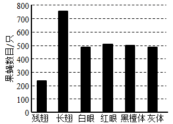
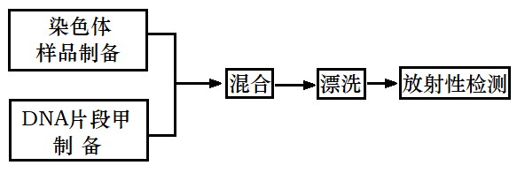

**2021年普通高等学校招生全国统一考试**

**理科综合能力测试·生物部分**

注意事项：

　　1．答卷前，考生务必将自己的姓名、准考证号填写在答题卡上。

　　2．回答选择题时，选出每小题答案后，用铅笔把答题卡上对应题目的答案标号涂黑。如需改动，用橡皮擦干净后，再选涂其他答案标号。回答非选择题时，将答案写在答题卡上。写在本试卷上无效。

　　3．考试结束后，将本试卷和答题卡一并交回。

可能用到的相对原子质量：H1　C12　N14　O16　S32　Cu64　Zr91

**一、选择题：本题共13小题，每小题6分，共78分。在每小题给出的四个选项中，只有一项是符合题目要求的。**

1\. 已知①酶、②抗体、③激素、④糖原、⑤脂肪、⑥核酸都是人体内有重要作用的物质。下列说法正确的是（ ）

A. ①②③都是由氨基酸通过肽键连接而成的

B. ③④⑤都是生物大分子，都以碳链为骨架

C. ①②⑥都是由含氮的单体连接成的多聚体

D. ④⑤⑥都是人体细胞内的主要能源物质

【答案】C

【解析】

【分析】1、酶是活细胞合成的具有催化作用的有机物，大多数酶是蛋白质，少数酶是RNA。

2、核酸是一切生物的遗传物质。有细胞结构的生物含有DNA和RNA两种核酸，但其细胞核遗传物质和细胞质遗传物质都是DNA。

3、动物体内激素的化学成分不完全相同，有的属于蛋白质类，有的属于脂质，有的属于氨基酸衍生物。

【详解】A、酶的化学本质是蛋白质或RNA，抗体的化学本质是蛋白质，激素的化学本质是有机物，如蛋白质、氨基酸的衍生物、脂质等，只有蛋白质才是由氨基酸通过肽键连接而成的，A错误；

B、糖原是生物大分子，脂肪不是生物大分子，且激素不一定是大分子物质，如甲状腺激素是含碘的氨基酸，B错误；

C、酶的化学本质是蛋白质或RNA，抗体的化学成分是蛋白质，蛋白质是由氨基酸连接而成的多聚体，核酸是由核苷酸连接而成的多聚体，氨基酸和核苷酸都含有氮元素，C正确；

D、人体主要的能源物质是糖类，核酸是生物的遗传物质，脂肪是机体主要的储能物质，D错误。

故选C。

2\. 某同学将酵母菌接种在马铃薯培养液中进行实验，不可能得到的结果是（ ）

A. 该菌在有氧条件下能够繁殖

B. 该菌在无氧呼吸的过程中无丙酮酸产生

C. 该菌在无氧条件下能够产生乙醇

D. 该菌在有氧和无氧条件下都能产生CO2

【答案】B

【解析】

【分析】酵母菌是兼性厌氧生物，有氧呼吸的产物是二氧化碳和水，无氧呼吸产物是酒精和二氧化碳。

【详解】A、酵母菌有细胞核，是真菌生物，其代谢类型是异氧兼性厌氧型，与无氧条件相比，在有氧条件下，产生的能量多，酵母菌的增殖速度快，A不符合题意；

BC、酵母菌无氧呼吸在细胞质基质中进行，无氧呼吸第一阶段产生丙酮酸、还原性的氢，并释放少量的能量，第二阶段丙酮酸被还原性氢还原成乙醇，并生成二氧化碳，B符合题意，C不符合题意；

D、酵母菌有氧呼吸和无氧呼吸都在第二阶段生成CO2，D不符合题意。

故选B。

3\. 生长素具有促进植物生长等多种生理功能。下列与生长素有关的叙述，错误的是（ ）

A. 植物生长“顶端优势”现象可以通过去除顶芽而解除

B. 顶芽产生的生长素可以运到侧芽附近从而抑制侧芽生长

C. 生长素可以调节植物体内某些基因的表达从而影响植物生长

D. 在促进根、茎两种器官生长时，茎是对生长素更敏感的器官

【答案】D

【解析】

【分析】生长素的化学本质是吲哚乙酸；生长素的运输主要是极性运输，也有非极性运输和横向运输；生长素对植物生长具有双重作用，即低浓度促进生长，高浓度抑制生长。

【详解】AB、顶端优势产生的原因是顶芽产生的生长素向下运输，枝条上部的侧芽部位生长素浓度较高，侧芽对生长素浓度比较敏感，因而使侧芽的发育受到抑制，可以通过摘除顶芽的方式解除植株顶端优势，AB正确；

C、生物的性状是由基因控制的，生长素能引起生物性状的改变，是通过调控某些基因的表达来影响植物生长的，C正确；

D、根、茎两种器官对生长素的反应敏感程度有明显差异，其中根对生长素最敏感，D错误。

故选D。

4\. 人体下丘脑具有内分泌功能，也是一些调节中枢的所在部位。下列有关下丘脑的叙述，错误的是（ ）

A. 下丘脑能感受细胞外液渗透压的变化

B. 下丘脑能分泌抗利尿激素和促甲状腺激素

C. 下丘脑参与水盐平衡的调节：下丘脑有水平衡调节中枢

D. 下丘脑能感受体温的变化；下丘脑有体温调节中枢

【答案】B

【解析】

【分析】下丘脑的功能：

①感受：渗透压感受器感受渗透压升降，维持水盐代谢平衡。

②传导：可将渗透压感受器产生的兴奋传导至大脑皮层，使之产生渴觉。

③分泌：分泌促激素释放激素，作用于垂体，使之分泌相应的激素或促激素。在外界环境温度低时分泌促甲状腺激素释放激素，在细胞外液渗透压升高时促使垂体分泌抗利尿激素。

④调节：体温调节中枢、血糖调节中枢、渗透压调节中枢。

⑤下丘脑视交叉上核的神经元具有日周期节律活动，这个核团是体内日周期节律活动的控制中心。

【详解】AC、下丘脑是水盐平衡调节中枢，同时也具有渗透压感受器，来感知细胞外液渗透压的变化，AC正确；

B、下丘脑能分泌促甲状腺激素释放激素、抗利尿激素等，具有内分泌功能，促甲状腺激素是由垂体分泌，B错误；

D、下丘脑内有是维持体温相对恒定的体温调节中枢，能感受体温变化，能调节产热和散热，D正确。

故选B。

5\. 果蝇的翅型、眼色和体色3个性状由3对独立遗传的基因控制，且控制眼色的基因位于X染色体上。让一群基因型相同的果蝇（果蝇M）与另一群基因型相同的果蝇（果蝇N）作为亲本进行杂交，分别统计子代果蝇不同性状的个体数量，结果如图所示。已知果蝇N表现为显性性状灰体红眼。下列推断错误的是（ ）

A. 果蝇M为红眼杂合体雌蝇

B. 果蝇M体色表现黑檀体

C. 果蝇N灰体红眼杂合体

D. 亲本果蝇均为长翅杂合体

【答案】A

【解析】

【分析】分析柱形图：果蝇M与果蝇N作为亲本进行杂交杂交，子代中长翅：残翅=3：1，说明长翅为显性性状，残翅为隐性性状，亲本关于翅型的基因型均为Aa（假设控制翅型的基因为A/a）；子代灰身：黑檀体=1：1，同时灰体为显性性状，亲本关于体色的基因型为Bb×bb（假设控制体色的基因为B/b）；子代红眼：白眼=1：1，红眼为显性性状，且控制眼色的基因位于X染色体上，假设控制眼色的基因为W/w），故亲本关于眼色的基因型为XWXw×XwY或XwXw×XWY。3个性状由3对独立遗传的基因控制，遵循基因的自由组合定律，因为N表现为显性性状灰体红眼，故N基因型为AaBbXWXw或AaBbXWY，则M的基因型对应为Aa bb XwY或AabbXwXw 。

【详解】AB、根据分析可知，M的基因型为Aa bb XwY或AabbXwXw，表现为长翅黑檀体白眼雄蝇或长翅黑檀体白眼雌蝇，A错误，B正确；

C、N基因型为AaBbXWXw或AaBbXWY，灰体红眼表现为长翅灰体红眼雌蝇，三对基因均为杂合，C正确；

D、亲本果蝇长翅的基因型均为Aa，为杂合子，D正确。

故选A。

6\. 群落是一个不断发展变化的动态系统。下列关于发生在裸岩和弃耕农田上的群落演替的说法，错误的是（ ）

A. 人为因素或自然因素的干扰可以改变植物群落演替的方向

B. 发生在裸岩和弃耕农田上的演替分别为初生演替和次生演替

C. 发生在裸岩和弃耕农田上的演替都要经历苔藓阶段、草本阶段

D. 在演替过程中，群落通常是向结构复杂、稳定性强的方向发展

【答案】C

【解析】

【分析】1、群落演替：随着时间的推移，一个群落被另一个群落代替的过程。

2、群落演替的原因：生物群落的演替是群落内部因素（包括种内关系、种间关系等）与外界环境因素综合作用的结果。

3、初生演替：是指一个从来没有被植物覆盖的地面，或者是原来存在过植被，但是被彻底消灭了的地方发生的演替；次生演替：原来有的植被虽然已经不存在，但是原来有的土壤基本保留，甚至还保留有植物的种子和其他繁殖体的地方发生的演替。

【详解】A、人类活动可以影响群落演替的方向和速度，退湖还田、封山育林、改造沙漠、生态农业等相关措施都能促进群落良性发展，A正确；

BC、发生在裸岩上的演替是初生演替，依次经过：地衣阶段→苔藓阶段→草本阶段→灌木阶段→森林阶段，弃耕农田的演替为次生演替，自然演替方向为草本阶段→灌木阶段→乔木阶段，B正确，C错误；

D、一般情况下，演替过程中生物生存的环境逐渐改善，群落的营养结构越来越复杂，抵抗力稳定性越来越高，恢复力稳定性越来越低，D正确。

故选C。

7\. 植物的根细胞可以通过不同方式吸收外界溶液中的K+。回答下列问题：

（1）细胞外的K+可以跨膜进入植物的根细胞。细胞膜和核膜等共同构成了细胞的生物膜系统，生物膜的结构特点是\_\_\_\_\_\_\_。

（2）细胞外的K+能够通过离子通道进入植物的根细胞。离子通道是由\_\_\_\_\_\_\_复合物构成的，其运输的特点是\_\_\_\_\_\_\_（答出1点即可）。

（3）细胞外的K+可以通过载体蛋白逆浓度梯度进入植物的根细胞。在有呼吸抑制剂的条件下，根细胞对K+的吸收速率降低，原因是\_\_\_\_\_\_\_。

【答案】 (1). 具有一定的流动性 (2). 蛋白质 (3). 顺浓度或选择性 (4). 细胞逆浓度梯度吸收K+是主动运输过程，需要能量，呼吸抑制剂会影响细胞呼吸供能，故使细胞主动运输速率降低

【解析】

【分析】植物根细胞的从外界吸收各种离子为主动运输，一般从低到高主动地吸收或排出物质，以满足生命活动的需要，需要耗能、需要载体协助。

【详解】（1）生物膜的结构特点是具有一定的流动性。

（2）离子通道是由蛋白质复合物构成的，一种通道只能先让某种离子通过，而另一些离子则不容易通过，即离子通道具有选择性。

（3）细胞外的K+可以通过载体蛋白逆浓度梯度进入植物的根细胞。可知是主动运输过程，主动运输需要消耗能量，而细胞中的能量由细胞呼吸提供，因此呼吸抑制剂会影响细胞对K+的吸收速率。

【点睛】本题考查植物细胞对离子的运输方式，主动运输的特点等，要求考生识记基本知识点，理解描述基本生物学事实。

8\. 用一段由放射性同位素标记的DNA片段可以确定基因在染色体上的位置。某研究人员使用放射性同位素32P标记的脱氧腺苷三磷酸(dATP，dA-Pα~Pβ~Pγ)等材料制备了DNA片段甲（单链），对W基因在染色体上的位置进行了研究，实验流程的示意图如下。

回答下列问题：

（1）该研究人员在制备32p标记的DNA片段甲时，所用dATP的α位磷酸基团中的磷必须是32P，原因是\_\_\_\_\_\_\_。

（2）该研究人员以细胞为材料制备了染色体样品，在混合操作之前去除了样品中的RNA分子，去除RNA分子的目的是\_\_\_\_\_\_\_。

（3）为了使片段甲能够通过碱基互补配对与染色体样品中的W基因结合，需要通过某种处理使样品中的染色体DNA\_\_\_\_\_\_\_。

（4）该研究人员在完成上述实验的基础上，又对动物细胞内某基因的mRNA进行了检测，在实验过程中用某种酶去除了样品中的DNA，这种酶是\_\_\_\_\_\_\_。

【答案】 (1). dATP脱去β、γ位上的两个磷酸基团后，则为腺嘌呤脱氧核苷酸，是合成DNA的原料之一 (2). 防止RNA分子与染色体DNA的W基因片段发生杂交 (3). 解旋 (4). DNA酶

【解析】

【分析】根据题意，通过带32p标记的DNA分子与被测样本中的W基因进行碱基互补配对，形成杂交带，可以推测出W基因在染色体上的位置。

【详解】（1）dA-Pα~Pβ~Pγ脱去β、γ位上的两个磷酸基团后，则为腺嘌呤脱氧核苷酸，是合成DNA的原料之一。因此研究人员在制备32p标记的DNA片段甲时，所用dATP的α位磷酸基团中的磷必须是32p。

（2）RNA分子也可以与染色体DNA进行碱基互补配对，产生杂交带，从而干扰32p标记的DNA片段甲与染色体DNA的杂交，故去除RNA分子，可以防止RNA分子与染色体DNA的W基因片段发生杂交。

（3）DNA分子解旋后的单链片段才能与32p标记的DNA片段甲进行碱基互补配对，故需要使样品中的染色体DNA解旋。

（4）DNA酶可以水解DNA分子从而去除了样品中的DNA。

【点睛】本题考查知识点中对DNA探针法的应用，考生需要掌握DNA探针的原理，操作的基本过程才能解题。

9\. 捕食是一种生物以另一种生物为食的现象，能量在生态系统中是沿食物链流动的。回答下列问题：

（1）在自然界中，捕食者一般不会将所有的猎物都吃掉，这一现象对捕食者的意义是\_\_\_\_\_\_\_\_\_\_（答出1点即可）。

（2）青草→羊→狼是一条食物链。根据林德曼对能量流动研究的成果分析，这条食物链上能量流动的特点是\_\_\_\_\_\_\_\_\_\_。

（3）森林、草原、湖泊、海洋等生态系统是常见的生态系统，林德曼关于生态系统能量流动特点的研究成果是以\_\_\_\_\_\_\_\_\_\_生态系统为研究对象得出的。

【答案】 (1). 避免自己没有食物，无法生存下去 (2). 单向流动，逐级递减 (3). （赛达伯格湖）湖泊

【解析】

【分析】1、种间关系包括竞争、捕食、互利共生和寄生等：

捕食：一种生物以另一种生物作为食物；

竞争：两种或两种以上生物相互争夺资源和空间，竞争的结果常表现为相互抑制，有时表现为一方占优势，另一方处于劣势甚至灭亡；

寄生：一种生物（寄生者）寄居于另一种生物（寄主）的体内或体表，摄取寄主的养分以维持生活；

互利共生：两种生物共同生活在一起，相互依存，彼此有利。

2、生态系统中能量的输入、传递、转化和散失的过程，称为生态系统的能量流动。

【详解】（1）在自然界中，捕食者一般不会将所有的猎物都吃掉，捕食者所吃掉的大多是被捕食者中年老、病弱或年幼的个体，客观上起到了促进种群发展的作用，对捕食者而言，不会导致没有猎物可以捕食而饿死，无法生存下去；

（2）能量在生态系统中是沿食物链流动的，能量流动是单向的，不可逆转，也不能循环流动，在流动过程中逐级递减，能量传递效率一般在10%-20%；

（3）林德曼关于生态系统能量流动特点的研究成果是对一个结构相对简单的天然湖泊——赛达伯格湖的能量流动进行了定量分析，最终得出能量流动特点。

【点睛】本题考查生物的种间关系捕食、能量流动的特点，难度较小，需要记住教材中的基础知识就能顺利解题，需要注意的本题考查了一个细节：林德曼研究的是湖泊生态系统，容易忘记该知识点。

10\. 植物的性状有的由1对基因控制，有的由多对基因控制。一种二倍体甜瓜的叶形有缺刻叶和全缘叶，果皮有齿皮和网皮。为了研究叶形和果皮这两个性状的遗传特点，某小组用基因型不同的甲乙丙丁4种甜瓜种子进行实验，其中甲和丙种植后均表现为缺刻叶网皮。杂交实验及结果见下表（实验②中F1自交得F2）。

<table style="width:83%;">
<colgroup>
<col style="width: 6%" />
<col style="width: 8%" />
<col style="width: 32%" />
<col style="width: 35%" />
</colgroup>
<tbody>
<tr>
<td style="text-align: left;">实验</td>
<td style="text-align: left;">亲本</td>
<td style="text-align: left;">F1</td>
<td style="text-align: left;">F2</td>
</tr>
<tr>
<td style="text-align: left;">①</td>
<td style="text-align: left;">甲×乙</td>
<td style="text-align: left;">
1/4缺刻叶齿皮，1/4缺刻叶网皮

1/4全缘叶齿皮，1/4全缘叶网皮
</td>
<td style="text-align: center;">/</td>
</tr>
<tr>
<td style="text-align: left;">②</td>
<td style="text-align: left;">丙×丁</td>
<td style="text-align: center;">缺刻叶齿皮</td>
<td style="text-align: left;">
9/16缺刻叶齿皮，3/16缺刻叶网皮

3/16全缘叶齿皮，1/16全缘叶网皮
</td>
</tr>
</tbody>
</table>

回答下列问题：

（1）根据实验①可判断这2对相对性状的遗传均符合分离定律，判断的依据是\_\_\_\_\_。根据实验②，可判断这2对相对性状中的显性性状是\_\_\_\_\_\_\_\_\_\_。

（2）甲乙丙丁中属于杂合体是\_\_\_\_\_\_\_\_\_\_。

（3）实验②的F2中纯合体所占的比例为\_\_\_\_\_\_\_\_\_\_。

（4）假如实验②的F2中缺刻叶齿皮∶缺刻叶网皮∶全缘叶齿皮∶全缘叶网皮不是9∶3∶3∶1，而是45∶15∶3∶1，则叶形和果皮这两个性状中由1对等位基因控制的是\_\_\_\_\_\_\_\_\_\_，判断的依据是\_\_\_\_\_\_\_\_\_\_。

【答案】 (1). 基因型不同的两个亲本杂交，F1分别统计，缺刻叶∶全缘叶=1∶1，齿皮∶网皮=1∶1，每对相对性状结果都符合测交的结果，说明这2对相对性状的遗传均符合分离定律 (2). 缺刻叶和齿皮 (3). 甲和乙 (4). 1/4 (5). 果皮 (6). F2中齿皮∶网皮=48∶16=3∶1，说明受一对等位基因控制

【解析】

【分析】分析题表，实验②中F1自交得F2，F1全为缺刻叶齿皮，F2出现全缘叶和网皮，可以推测缺刻叶对全缘叶为显性（相关基因用A和a表示），齿皮对网皮为显性（相关基因用B和b表示），且F2出现9∶3∶3∶1。

【详解】（1）实验①中F1表现为1/4缺刻叶齿皮，1/4缺刻叶网皮，1/4全缘叶齿皮，1/4全缘叶网皮，分别统计两对相对性状，缺刻叶∶全缘叶=1∶1，齿皮∶网皮=1∶1，每对相对性状结果都符合测交的结果，说明这2对相对性状的遗传均符合分离定律；根据实验②，F1全为缺刻叶齿皮，F2出现全缘叶和网皮，可以推测缺刻叶对全缘叶为显性，齿皮对网皮为显性；

（2）根据已知条件，甲乙丙丁的基因型不同，其中甲和丙种植后均表现为缺刻叶网皮，实验①杂交的F1结果类似于测交，实验②的F2出现9∶3∶3∶1，则F1的基因型为AaBb，综合推知，甲的基因型为Aabb，乙的基因型为aaBb，丙的基因型为AAbb，丁的基因型为aaBB，甲乙丙丁中属于杂合体的是甲和乙；

（3）实验②的F2中纯合体基因型为1/16AABB，1/16AAbb，1/16aaBB，1/16aabb，所有纯合体占的比例为1/4；

（4）假如实验②的F2中缺刻叶齿皮∶缺刻叶网皮∶全缘叶齿皮∶全缘叶网皮=45∶15∶3∶1，分别统计两对相对性状，缺刻叶∶全缘叶=60∶4=15∶1，可推知叶形受两对等位基因控制，齿皮∶网皮=48∶16=3∶1，可推知果皮受一对等位基因控制。

【点睛】本题考查基因的分离定律和自由组合定律，难度一般，需要根据子代结果分析亲代基因型，并根据杂交结果判断是否符合分离定律和自由组合定律，查考遗传实验中分析与计算能力。

**【生物——选修1：生物技术实践】**

11\. 加酶洗衣粉是指含有酶制剂的洗衣粉。某同学通过实验比较了几种洗衣粉的去渍效果（“+”越多表示去渍效果越好），实验结果见下表。

|     |        |        |        |           |
|:---:|:------:|:------:|:------:|:---------:|
|     | 加酶洗衣粉A | 加酶洗衣粉B | 加酶洗衣粉C | 无酶洗衣粉(对照) |
| 血渍  | +++    | \+     | +++    | \+        |
| 油渍  | \+     | +++    | +++    | \+        |

根据实验结果回答下列问题：

（1）加酶洗衣粉A中添加的酶是\_\_\_\_\_\_\_\_\_\_；加酶洗衣粉B中添加的酶是\_\_\_\_\_\_\_\_\_\_；加酶洗衣粉C中添加的酶是\_\_\_\_\_\_\_\_\_\_。

（2）表中不宜用于洗涤蚕丝织物的洗衣粉有\_\_\_\_\_\_\_\_\_\_，原因是\_\_\_\_\_\_\_\_\_\_\_。

（3）相对于无酶洗衣粉，加酶洗衣粉去渍效果好原因是\_\_\_\_\_\_\_\_\_\_\_。

（4）关于酶的应用，除上面提到的加酶洗衣粉外，固定化酶也在生产实践中得到应用，如固定化葡萄糖异构酶已经用于高果糖浆生产。固定化酶技术是指\_\_\_\_\_\_\_\_\_\_\_。固定化酶在生产实践中应用的优点是\_\_\_\_\_\_\_\_\_（答出1点即可）。

【答案】 (1). 蛋白酶 (2). 脂肪酶 (3). 蛋白酶和脂肪酶 (4). 加酶洗衣粉A和加酶洗衣粉C (5). 蚕丝织物的主要成分是蛋白质，会被蛋白酶催化水解 (6). 酶可以将大分子有机物分解为小分子有机物，小分子有机物易溶于水，从而将污渍与洗涤物分开 (7). 利用物理或化学方法将酶固定在一定空间内的技术 (8). 固定在载体上的酶可以被反复利用，可降低生产成本（或产物容易分离，可提高产品的产量和质量，或固定化酶稳定性好，可持续发挥作用）

【解析】

【分析】加酶洗衣粉是指含有酶制剂的洗衣粉，目前常用的酶制剂有四类：蛋白酶、脂肪酶、淀粉酶和纤维素酶。其中，应用最广泛、效果最明显的是碱性蛋白酶和碱性脂肪酶。碱性蛋白酶能将血渍、奶渍等含有大分子蛋白质水解成可溶性的氨基酸或小分子的肽，使污迹容易从衣物上脱落。

【详解】（1）从表格中信息可知，加酶洗衣粉A对血渍的洗涤效果比对照组的无酶洗衣粉效果好，而血渍含有大分子蛋白质，因此，加酶洗衣粉A中添加的酶是蛋白酶，同理，加酶洗衣粉B中添加的酶是脂肪酶；加酶洗衣粉C对血渍和油渍的洗涤效果比无酶洗衣粉好，油渍中有脂肪，因此，加酶洗衣粉C中添加的酶是蛋白酶和脂肪酶。

（2）蚕丝织物中有蛋白质，因此，表中不宜用于洗涤蚕丝织物的洗衣粉有加酶洗衣粉A、加酶洗衣粉C ，原因是蚕丝织物主要成分是蛋白质，会被蛋白酶催化水解。

（3）据分析可知，相对于无酶洗衣粉，加酶洗衣粉去渍效果好的原因是：酶可以将大分子有机物分解为小分子有机物，小分子有机物易溶于水，从而将污渍与洗涤物分开。

（4）固定化酶技术是指利用物理或化学方法将酶固定在一定空间内的技术，酶既能与反应物接触，又能与产物分离，所以固定在载体上的酶还可以被反复利用。所以固定化酶在生产实践中应用的优点是：降低生产成本（或产物容易分离，可提高产品的产量和质量，或固定化酶稳定性好，可持续发挥作用）。

【点睛】本题考查加酶洗衣粉、酶的固定化相关知识点，难度较小，解答本题的关键是明确加酶洗衣粉与普通洗衣粉去污原理的异同，以及固定化酶技术的应用实例和优点。

**【生物——选修3：现代生物科技专题】**

12\. PCR技术可用于临床的病原菌检测。为检测病人是否感染了某种病原菌，医生进行了相关操作：①分析PCR扩增结果；②从病人组织样本中提取DNA；③利用PCR扩增DNA片段；④采集病人组织样本。回答下列问题：

（1）若要得到正确的检测结果，正确的操作顺序应该是\_\_\_\_\_\_\_\_\_（用数字序号表示）。

（2）操作③中使用的酶是\_\_\_\_\_\_\_\_\_。PCR 反应中的每次循环可分为变性、复性、\_\_\_\_\_\_\_\_三步，其中复性的结果是\_\_\_\_\_\_\_ 。

（3）为了做出正确的诊断，PCR反应所用的引物应该能与\_\_\_\_\_\_\_ 特异性结合。

（4）PCR（多聚酶链式反应）技术是指\_\_\_\_\_\_\_。该技术目前被广泛地应用于疾病诊断等方面。

【答案】 (1). ④②③① (2). Taq酶（热稳定DNA聚合酶） (3). 延伸 (4). Taq酶从引物起始进行互补链的合成 (5). 两条单链DNA (6). 一项在生物体外复制特定DNA片段的核酸合成技术

【解析】

【分析】PCR是一项在生物体外复制特定DNA片段的核酸合成技术。通过这一技术，可以在短时间内大量扩增目的基因。利用PCR技术扩增目的基因的前提，是要有一段已知目的基因的核苷酸序列，以便根据这一序列合成引物。

【详解】（1）PCR技术可用于临床的病原菌检测，若要得到正确的检测结果，正确的操作顺序应该是④采集病人组织样本→②从病人组织样本中提取DNA→③利用PCR扩增DNA片段→①分析PCR扩增结果。

（2）在用PCR技术扩增DNA时，DNA的复制过程与细胞内DNA的复制类似，操作③中使用的酶是Taq酶（热稳定DNA聚合酶），PCR 反应中的每次循环可分为变性、复性、延伸三步，其中复性的结果是Taq酶从引物起始进行互补链的合成。

（3）DNA复制需要引物，为了做出正确的诊断，PCR反应所用的引物应该能与两条单链DNA特异性结合。

（4）据分析可知，PCR（多聚酶链式反应）技术是指一项在生物体外复制特定DNA片段的核酸合成技术。该技术目前被广泛地应用于疾病诊断等方面。

【点睛】本题考查PCR技术及应用，难度较小，解答本题的关键是明确PCR技术的原理，具体反应过程，以及在临床病原菌检测中的应用。
