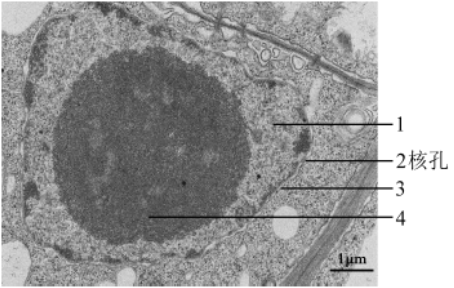
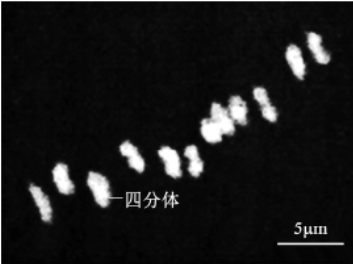
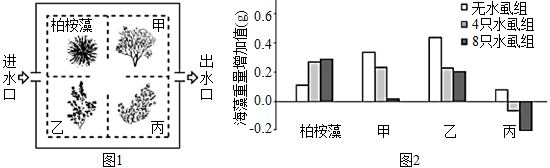
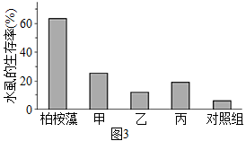
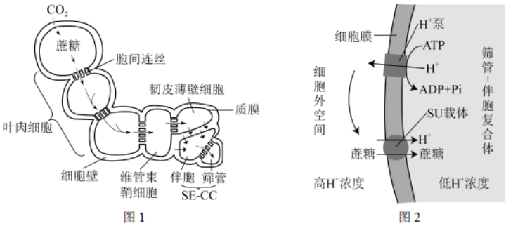
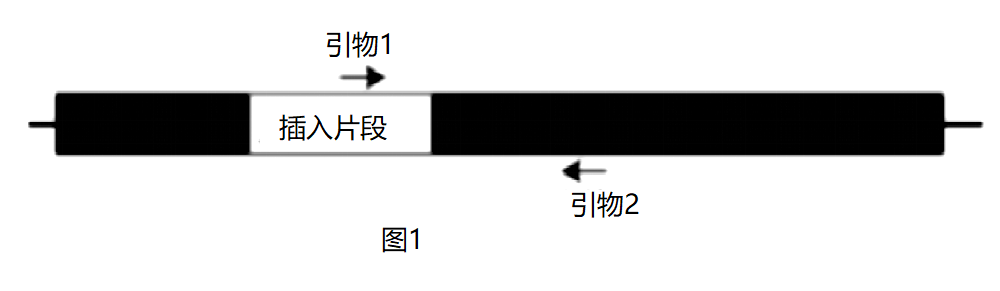

**北京市2021年普通高中学业水平等级性考试生物**

1\. ATP是细胞的能量“通货”，关于ATP的叙述错误的是（　　）

A. 含有C、H、O、N、P B. 必须在有氧条件下合成

C. 胞内合成需要酶的催化 D. 可直接为细胞提供能量

2\. 下图是马铃薯细胞局部的电镜照片，1~4均为细胞核的结构，对其描述错误的是（　　）

A. 1是转录和翻译的场所 B. 2是核与质之间物质运输的通道

C. 3是核与质的界膜 D. 4是与核糖体形成有关的场所

3\. 将某种植物置于高温环境（HT）下生长一定时间后，测定HT植株和生长在正常温度（CT）下的植株在不同温度下的光合速率，结果如图。由图不能得出的结论是（　　）

\

A. 两组植株的CO2吸收速率最大值接近

B. 35℃时两组植株的真正（总）光合速率相等

C. 50℃时HT植株能积累有机物而CT植株不能

D. HT植株表现出对高温环境的适应性

4\. 酵母菌的DNA中碱基A约占32%，关于酵母菌核酸的叙述错误的是（　　）

A. DNA复制后A约占32% B. DNA中C约占18%

C. DNA中（A+G）/（T+C）=1 D. RNA中U约占32%

5\. 如图为二倍体水稻花粉母细胞减数分裂某一时期的显微图像，关于此细胞的叙述错误的是（　　）

A. 含有12条染色体 B. 处于减数第一次分裂

C. 含有同源染色体 D. 含有姐妹染色单体

6\. 下图为某遗传病的家系图，已知致病基因位于X染色体。

对该家系分析正确的是（　　）

A. 此病为隐性遗传病

B. III-1和III-4可能携带该致病基因

C. II-3再生儿子必患者

D. II-7不会向后代传递该致病基因

7\. 研究者拟通过有性杂交的方法将簇毛麦（2n=14）的优良性状导入普通小麦（2n=42）中。用簇毛麦花粉给数以千计的小麦小花授粉，10天后只发现两个杂种幼胚，将其离体培养，产生愈伤组织，进而获得含28条染色体的大量杂种植株。以下表述错误的是（　　）

A. 簇毛麦与小麦之间存在生殖隔离

B. 培养过程中幼胚细胞经过脱分化和再分化

C. 杂种植株减数分裂时染色体能正常联会

D. 杂种植株的染色体加倍后能产生可育植株

8\. 为研究毒品海洛因的危害，将受孕7天的大鼠按下表随机分组进行实验，结果如下。

<table style="width:100%;">
<colgroup>
<col style="width: 33%" />
<col style="width: 16%" />
<col style="width: 16%" />
<col style="width: 16%" />
<col style="width: 16%" />
</colgroup>
<tbody>
<tr>
<td rowspan="2" style="text-align: left;">
处理

检测项目
</td>
<td rowspan="2" style="text-align: center;">对照组</td>
<td colspan="3" style="text-align: center;">连续9天给予海洛因</td>
</tr>
<tr>
<td style="text-align: center;">低剂量组</td>
<td style="text-align: center;">中剂量组</td>
<td style="text-align: center;">高剂量组</td>
</tr>
<tr>
<td style="text-align: left;">活胚胎数/胚胎总数（%）</td>
<td style="text-align: center;">100</td>
<td style="text-align: center;">76</td>
<td style="text-align: center;">65</td>
<td style="text-align: center;">55</td>
</tr>
<tr>
<td style="text-align: left;">脑畸形胚胎数/活胚胎数（%）</td>
<td style="text-align: center;">0</td>
<td style="text-align: center;">33</td>
<td style="text-align: center;">55</td>
<td style="text-align: center;">79</td>
</tr>
<tr>
<td style="text-align: left;">脑中促凋亡蛋白Bax含量（ug·L-l）</td>
<td style="text-align: center;">6．7</td>
<td style="text-align: center;">7．5</td>
<td style="text-align: center;">10．0</td>
<td style="text-align: center;">12．5</td>
</tr>
</tbody>
</table>

以下分析不合理的是（　　）

A. 低剂量海洛因即可严重影响胚胎的正常发育

B. 海洛因促进Bax含量提高会导致脑细胞凋亡

C. 对照组胚胎的发育过程中不会出现细胞凋亡

D. 结果提示孕妇吸毒有造成子女智力障碍的风险

9\. 在有或无机械助力两种情形下，从事家务劳动和日常运动时人体平均能量消耗如图。对图中结果叙述错误的是（　　）

A. 走路上学比手洗衣服在单位时间内耗能更多

B. 葡萄糖是图中各种活动的重要能量来源

C. 爬楼梯时消耗的能量不是全部用于肌肉收缩

D. 借助机械减少人体能量消耗就能缓解温室效应

10\. 植物顶芽产生生长素向下运输，使侧芽附近生长素浓度较高，抑制侧芽的生长，形成顶端优势。用细胞分裂素处理侧芽，侧芽生长形成侧枝。关于植物激素作用的叙述不正确的是（　　）

A. 顶端优势体现了生长素既可促进也可抑制生长

B. 去顶芽或抑制顶芽的生长素运输可促进侧芽生长

C. 细胞分裂素能促进植物的顶端优势

D. 侧芽生长受不同植物激素共同调节

11\. 野生草本植物多具有根系发达、生长较快、抗逆性强的特点，除用于生态治理外，其中一些可替代木材栽培食用菌，收获后剩余的菌渣可作肥料或饲料。相关叙述错误的是（　　）

A. 种植此类草本植物可以减少水土流失

B. 菌渣作为农作物肥料可实现能量的循环利用

C. 用作培养基的草本植物给食用菌提供碳源和氮源

D. 菌渣作饲料实现了物质在植物、真菌和动物间的转移

12\. 人体皮肤表面存在着多种微生物，某同学拟从中分离出葡萄球菌。下述操作不正确的是（　　）

A. 对配制的培养基进行高压蒸汽灭菌

B. 使用无菌棉拭子从皮肤表面取样

C. 用取样后的棉拭子在固体培养基上涂布

D. 观察菌落的形态和颜色等进行初步判断

13\. 关于物质提取、分离或鉴定的高中生物学相关实验，叙述错误的是（　　）

A. 研磨肝脏以破碎细胞用于获取含过氧化氢酶的粗提液

B. 利用不同物质在酒精溶液中溶解性的差异粗提DNA

C. 依据吸收光谱的差异对光合色素进行纸层析分离

D. 利用与双缩脲试剂发生颜色变化的反应来鉴定蛋白质

14\. 社会上流传着一些与生物有关的说法，有些有一定的科学依据，有些违反生物学原理。以下说法中有科学依据的是（　　）

A. 长时间炖煮会破坏食物中的一些维生素

B. 转基因抗虫棉能杀死害虫就一定对人有毒

C. 消毒液能杀菌，可用来清除人体内新冠病毒

D. 如果孩子的血型和父母都不一样，肯定不是亲生的

15\. 随着改革实践不断推进，高质量发展已成为对我国所有地区、各个领域的长期要求，生态保护是其中的重要内容。以下所列不属于生态保护措施的是（　　）

A. 长江流域十年禁渔计划 B. 出台地方性控制吸烟法规

C. 试点建立国家公园体制 D. 三江源生态保护建设工程

16\. 新冠病毒（SARS-CoV-2）引起的疫情仍在一些国家和地区肆虐，接种疫苗是控制全球疫情的最有效手段。新冠病毒疫苗有多种，其中我国科学家已研发出的腺病毒载体重组新冠病毒疫苗（重组疫苗）是一种基因工程疫苗，其基本制备步骤是：将新冠病毒的S基因连接到位于载体上的腺病毒基因组DNA中，重组载体经扩增后转入特定动物细胞，进而获得重组腺病毒并制成疫苗。

（1）新冠病毒是RNA病毒，一般先通过\_\_\_\_\_\_\_得到cDNA，经\_\_\_\_\_\_\_获取S基因，酶切后再连接到载体。

（2）重组疫苗中的S基因应编码\_\_\_\_\_\_\_\_。

A. 病毒与细胞识别的蛋白 B. 与病毒核酸结合的蛋白

C. 催化病毒核酸复制的酶 D. 帮助病毒组装的蛋白

（3）为保证安全性，制备重组疫苗时删除了腺病毒的某些基因，使其在人体中无法增殖，但重组疫苗仍然可以诱发人体产生针对新冠病毒的特异性免疫应答。该疫苗发挥作用的过程是：接种疫苗→\_\_\_\_\_\_\_\_→\_\_\_\_\_\_\_\_\_→诱发特异性免疫反应。

（4）重组疫苗只需注射一针即可完成接种。数周后，接种者体内仍然能检测到重组腺病毒DNA，但其DNA不会整合到人的基因组中。请由此推测只需注射一针即可起到免疫保护作用的原因\_\_\_\_\_\_\_\_。

17\. 北大西洋沿岸某水域生活着多种海藻和以藻类为食的一种水虱，以及水虱的天敌隆头鱼。柏桉藻在上世纪末被引入，目前已在该水域广泛分布，数量巨大，表现出明显的优势。为探究柏桉藻成功入侵的原因，研究者进行了系列实验。

（1）从生态系统的组成成分划分，柏桉藻属于\_\_\_\_\_\_\_\_\_。

（2）用三组水箱模拟该水域的环境。水箱中均放入柏桉藻和甲、乙、丙3种本地藻各0．5克，用纱网分区（见图1）；三组水箱中分别放入0、4、8只水虱/箱。10天后对海藻称重，结果如图2，同时记录水虱的分布。

①图2结果说明水虱对本地藻有更强的取食作用，作出判断的依据是：与没有水虱相比，在有水虱的水箱中，\_\_\_\_\_\_\_\_\_。

②水虱分布情况记录结果显示，在有水虱的两组中，大部分水虱附着在柏桉藻上，说明水虱对所栖息的海藻种类具有\_\_\_\_\_\_\_\_\_\_。

（3）为研究不同海藻对隆头鱼捕食水虱的影响，在盛有等量海水的水箱中分别放入相应的实验材料，一段时间后检测，结果如图3（甲、乙、丙为上述本地藻）。

该实验的对照组放入的有\_\_\_\_\_\_\_\_\_。

（4）研究发现，柏桉藻含有一种引起动物不适的化学物质，若隆头鱼吞食水虱时误吞柏桉藻，会将两者吐出。请综合上述研究结果，阐明柏桉藻成功入侵的原因\_\_\_\_\_\_\_\_。

18\. 胰岛素是调节血糖的重要激素，研究者研制了一种“智能”胰岛素（IA）并对其展开了系列实验，以期用于糖尿病的治疗。

（1）正常情况下，人体血糖浓度升高时，\_\_\_\_\_\_\_\_\_\_细胞分泌的胰岛素增多，经\_\_\_\_\_\_\_\_\_\_运输到靶细胞，促进其对葡萄糖的摄取和利用，使血糖浓度降低。

（2）GT是葡萄糖进入细胞的载体蛋白，IA（见图1）中的X能够抑制GT的功能。为测试葡萄糖对IA与GT结合的影响，将足量的带荧光标记的IA加入红细胞膜悬液中处理30分钟，使IA与膜上的胰岛素受体、GT充分结合。之后，分别加入葡萄糖至不同的终浓度，10分钟后检测膜上的荧光强度。图2结果显示：随着葡萄糖浓度的升高，\_\_\_\_\_\_\_\_\_\_。研究表明葡萄糖浓度越高，IA与GT结合量越低。据上述信息，推断IA、葡萄糖、GT三者的关系为\_\_\_\_\_\_\_\_\_。

（3）为评估IA调节血糖水平的效果，研究人员给糖尿病小鼠和正常小鼠均分别注射适量胰岛素和IA，测量血糖浓度的变化，结果如图3。

该实验结果表明IA对血糖水平的调节比外源普通胰岛素更具优势，体现在\_\_\_\_\_\_\_\_\_。

（4）细胞膜上GT含量呈动态变化，当胰岛素与靶细胞上的受体结合后，细胞膜上的GT增多。若IA作为治疗药物，糖尿病患者用药后进餐，血糖水平会先上升后下降。请从稳态与平衡的角度，完善IA调控血糖的机制图。（任选一个过程，在方框中以文字和箭头的形式作答。）\_\_\_\_\_\_\_\_

19\. 学习以下材料，回答（1）~（4）题。

光合产物如何进入叶脉中的筛管

高等植物体内的维管束负责物质的长距离运输，其中的韧皮部包括韧皮薄壁细胞、筛管及其伴胞等。筛管是光合产物的运输通道。光合产物以蔗糖的形式从叶肉细胞的细胞质移动到邻近的小叶脉，进入其中的筛管-伴胞复合体（SE-CC），再逐步汇入主叶脉运输到植物体其他部位。

蔗糖进入SE-CC有甲、乙两种方式。在甲方式中，叶肉细胞中蔗糖通过不同细胞间的胞间连丝即可进入SE-CC。胞间连丝是相邻细胞间穿过细胞壁的细胞质通道。在乙方式中，蔗糖自叶肉细胞至SE-CC的运输（图1）可以分为3个阶段：①叶肉细胞中的蔗糖通过胞间连丝运输到韧皮薄壁细胞；②韧皮薄壁细胞中的蔗糖由膜上的单向载体W顺浓度梯度转运到SE-CC附近的细胞外空间（包括细胞壁）中；③蔗糖从细胞外空间进入SE-CC中，如图2所示。SE-CC的质膜上有“蔗糖-H+共运输载体”（SU载体），SU载体与H+泵相伴存在。胞内H+通过H+泵运输到细胞外空间，在此形成较高的H+浓度，SU载体将H+和蔗糖同向转运进SE-CC中。采用乙方式的植物，筛管中的蔗糖浓度远高于叶肉细胞。

研究发现，叶片中SU载体含量受昼夜节律、蔗糖浓度等因素的影响，呈动态变化。随着蔗糖浓度的提高，叶片中SU载体减少，反之则增加。研究SU载体含量的动态变化及调控机制，对于了解光合产物在植物体内的分配规律，进一步提高作物产量具有重要意义。

（1）在乙方式中，蔗糖经W载体由韧皮薄壁细胞运输到细胞外空间的方式属于\_\_\_\_\_\_\_\_\_。由H+泵形成的\_\_\_\_\_\_\_\_\_有助于将蔗糖从细胞外空间转运进SE-CC中。

（2）与乙方式比，甲方式中蔗糖运输到SE-CC的过程都是通过\_\_\_\_\_\_\_\_\_这一结构完成的。

（3）下列实验结果支持某种植物存在乙运输方式的有\_\_\_\_\_\_\_\_\_。

A. 叶片吸收14CO2后，放射性蔗糖很快出现在SE-CC附近细胞外空间中

B. 用蔗糖跨膜运输抑制剂处理叶片，蔗糖进入SE-CC的速率降低

C. 将不能通过细胞膜的荧光物质注射到叶肉细胞，SE-CC中出现荧光

D. 与野生型相比，SU功能缺陷突变体的叶肉细胞中积累更多的蔗糖和淀粉

（4）除了具有为生物合成提供原料、为生命活动供能等作用之外，本文还介绍了蔗糖能调节SU载体的含量，体现了蔗糖的\_\_\_\_\_\_\_\_\_\_功能。

20\. 玉米是我国重要农作物，研究种子发育的机理对培育高产优质的玉米新品种具有重要作用。

（1）玉米果穗上的每一个籽粒都是受精后发育而来。我国科学家发现了甲品系玉米，其自交后的果穗上出现严重干瘪且无发芽能力的籽粒，这种异常籽粒约占1/4。籽粒正常和干瘪这一对相对性状的遗传遵循孟德尔的\_\_\_\_\_\_\_\_定律。上述果穗上的正常籽粒均发育为植株，自交后，有些植株果穗上有约1/4干瘪籽粒，这些植株所占比例约为\_\_\_\_\_\_\_\_。

（2）为阐明籽粒干瘪性状的遗传基础，研究者克隆出候选基因A/a。将A基因导入到甲品系中，获得了转入单个A基因的转基因玉米。假定转入的A基因已插入a基因所在染色体的非同源染色体上，请从下表中选择一种实验方案及对应的预期结果以证实“A基因突变是导致籽粒干瘪的原因”\_\_\_\_\_\_\_\_。

<table style="width:75%;">
<colgroup>
<col style="width: 35%" />
<col style="width: 39%" />
</colgroup>
<tbody>
<tr>
<td style="text-align: center;">实验方案</td>
<td style="text-align: center;">预期结果</td>
</tr>
<tr>
<td style="text-align: left;">
I．转基因玉米×野生型玉米

II．转基因玉米×甲品系

III．转基因玉米自交

IV．野生型玉米×甲品系
</td>
<td style="text-align: left;">
①正常籽粒：干瘪籽粒≈1：1

②正常籽粒：干瘪籽粒≈3：1

③正常籽粒：干瘪籽粒≈7：1

④正常籽粒：干瘪籽粒≈15：1
</td>
</tr>
</tbody>
</table>

（3）现已确认A基因突变是导致籽粒干瘪的原因，序列分析发现a基因是A基因中插入了一段DNA（见图1），使A基因功能丧失。甲品系果穗上的正常籽粒发芽后，取其植株叶片，用图1中的引物1、2进行PCR扩增，若出现目标扩增条带则可知相应植株的基因型为\_\_\_\_\_\_\_\_\_。

（4）为确定A基因在玉米染色体上的位置，借助位置已知的M/m基因进行分析。用基因型为mm且籽粒正常的纯合子P与基因型为MM的甲品系杂交得F1，F1自交得F2。用M、m基因的特异性引物，对F1植株果穗上干瘪籽粒（F2）胚组织的DNA进行PCR扩增，扩增结果有1、2、3三种类型，如图2所示。

统计干瘪籽粒（F2）的数量，发现类型1最多、类型2较少、类型3极少。请解释类型3数量极少的原因\_\_\_\_\_\_\_\_。

21\. 近年来发现海藻糖-6-磷酸（T6P）是一种信号分子，在植物生长发育过程中起重要调节作用。研究者以豌豆为材料研究了T6P在种子发育过程中的作用。

（1）豌豆叶肉细胞通过光合作用在\_\_\_\_\_\_\_\_\_\_中合成三碳糖，在细胞质基质中转化为蔗糖后运输到发育的种子中转化为淀粉贮存。

（2）细胞内T6P的合成与转化途径如下：

将P酶基因与启动子U（启动与之连接的基因仅在种子中表达）连接，获得U-P基因，导入野生型豌豆中获得U-P纯合转基因植株，预期U-P植株种子中T6P含量比野生型植株\_\_\_\_\_\_\_\_\_\_，检测结果证实了预期，同时发现U-P植株种子中淀粉含量降低，表现为皱粒。用同样方法获得U-S纯合转基因植株，检测发现植株种子中淀粉含量增加。

（3）本实验使用的启动子U可以排除由于目的基因\_\_\_\_\_\_\_\_\_\_对种子发育产生的间接影响。

（4）在进一步探讨T6P对种子发育的调控机制时，发现U-P植株种子中一种生长素合成酶基因R的转录降低，U-S植株种子中R基因转录升高。已知R基因功能缺失突变体r的种子皱缩，淀粉含量下降。据此提出假说：T6P通过促进R基因的表达促进种子中淀粉的积累。请从①~⑤选择合适的基因与豌豆植株，进行转基因实验，为上述假说提供两个新的证据。写出相应组合并预期实验结果\_\_\_\_\_\_\_\_。

①U-R基因 ②U-S基因 ③野生型植株④U-P植株 ⑤突变体r植株
