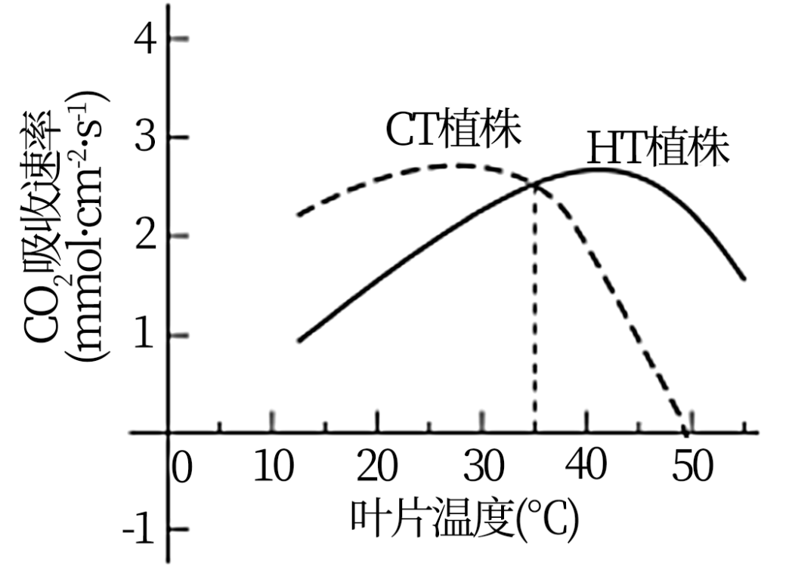
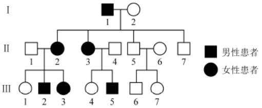
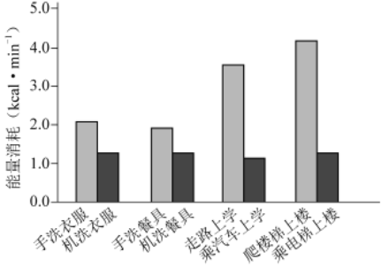
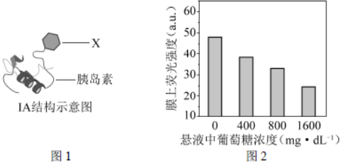
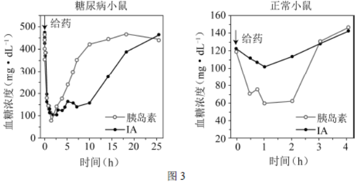
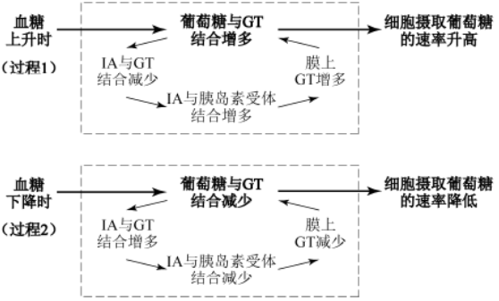
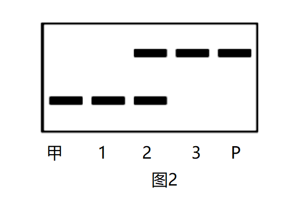

**北京市2021年普通高中学业水平等级性考试生物**

1\. ATP是细胞的能量“通货”，关于ATP的叙述错误的是（　　）

A. 含有C、H、O、N、P B. 必须在有氧条件下合成

C. 胞内合成需要酶的催化 D. 可直接为细胞提供能量

【答案】B

【解析】

【分析】A代表腺苷，P代表磷酸基团，ATP中有1个腺苷，3个磷酸基团，2个高能磷酸键，结构简式为A-P～P～P。

【详解】A、ATP中含有腺嘌呤、核糖与磷酸基团，故元素组成为C、H、O、N、P，A正确；

B、在无氧条件下，无氧呼吸过程中也能合成ATP，B错误；

C、ATP合成过程中需要ATP合成酶的催化，C正确；

D、ATP是生物体的直接能源物质，可直接为细胞提供能量，D正确。

故选B。

2\. 下图是马铃薯细胞局部的电镜照片，1~4均为细胞核的结构，对其描述错误的是（　　）

A. 1是转录和翻译的场所 B. 2是核与质之间物质运输的通道

C. 3是核与质的界膜 D. 4是与核糖体形成有关的场所

【答案】A

【解析】

【分析】据图分析，1~4均为细胞核的结构，则1是染色质，2是核孔，3是核膜，4是核仁，据此分析作答。

【详解】A、1是染色质，细胞核是DNA复制和转录的主要场所，翻译的场所是核糖体，A错误；

B、2是核孔，核孔是核与质之间物质运输的通道，具有选择透过性，B正确；

C、3是核膜，是核与质的界膜，为细胞核提供了一个相对稳定的环境，C正确；

D、4是核仁，真核细胞中核仁与核糖体的形成有关，D正确。

故选A。

3\. 将某种植物置于高温环境（HT）下生长一定时间后，测定HT植株和生长在正常温度（CT）下的植株在不同温度下的光合速率，结果如图。由图不能得出的结论是（　　）

\

A. 两组植株的CO2吸收速率最大值接近

B. 35℃时两组植株的真正（总）光合速率相等

C. 50℃时HT植株能积累有机物而CT植株不能

D. HT植株表现出对高温环境的适应性

【答案】B

【解析】

【分析】1、净光合速率是植物绿色组织在光照条件下测得的值——单位时间内一定量叶面积CO2的吸收量或O2的释放量。净光合速率可用单位时间内O2的释放量、有机物的积累量、CO2的吸收量来表示。

2、真正（总）光合速率=净光合速率+呼吸速率。

【详解】A、由图可知，CT植株和HT植株的CO2吸收速率最大值基本一致，都接近于3nmol••cm-2•s-1，A正确；

B、CO2吸收速率代表净光合速率，而总光合速率=净光合速率+呼吸速率。由图可知35℃时两组植株的净光合速率相等，但呼吸速率未知，故35℃时两组植株的真正（总）光合速率无法比较，B错误；

C、由图可知，50℃时HT植株的净光合速率大于零，说明能积累有机物，而CT植株的净光合速率不大于零，说明不能积累有机物，C正确；

D、由图可知，在较高的温度下HT植株的净光合速率仍大于零，能积累有机物进行生长发育，体现了HT植株对高温环境较适应，D正确。

故选B。

4\. 酵母菌的DNA中碱基A约占32%，关于酵母菌核酸的叙述错误的是（　　）

A. DNA复制后A约占32% B. DNA中C约占18%

C. DNA中（A+G）/（T+C）=1 D. RNA中U约占32%

【答案】D

【解析】

【分析】酵母菌为真核生物，细胞中含有DNA和RNA两种核酸；其中DNA分子为双链结构，A=T，G=C，RNA分子为单链结构。据此分析作答。

【详解】A、DNA分子为半保留复制，复制时遵循A-T、G-C的配对原则，则DNA复制后的A约占32%，A正确；

B、酵母菌的DNA中碱基A约占32%，则A=T=32%，G=C=（1-2×32%）/2=18%，B正确；

C、DNA遵循碱基互补配对原则，A=T、G=C，则（A+G）/（T+C）=1，C正确；

D、由于RNA为单链结构，且RNA是以DNA的一条单链为模板进行转录而来，故RNA中U不一定占32%，D错误。

故选D。

5\. 如图为二倍体水稻花粉母细胞减数分裂某一时期的显微图像，关于此细胞的叙述错误的是（　　）

A. 含有12条染色体 B. 处于减数第一次分裂

C. 含有同源染色体 D. 含有姐妹染色单体

【答案】A

【解析】

【分析】1、减数分裂是指细胞连续分裂两次，而染色体在整个过程只复制一次的细胞分裂方式。

2、四分体指的是在动物细胞减数第一次分裂（减I）的前期，两条已经自我复制的同源染色体联会形成的四条染色单体的结合体。

【详解】A、图中显示是四分体时期，即减数第一次分裂前期联会，每个四分体有2条染色体，图中有12个4分体，共24条染色体，A错误；

B、四分期时期即处于减数第一次分裂前期，B正确；

C、一个四分体即一对同源染色体，C正确；

D、每个四分体有两条染色单体，四个姐妹染色单体，D正确。

故选A。

6\. 下图为某遗传病的家系图，已知致病基因位于X染色体。

对该家系分析正确的是（　　）

A. 此病为隐性遗传病

B. III-1和III-4可能携带该致病基因

C. II-3再生儿子必为患者

D. II-7不会向后代传递该致病基因

【答案】D

【解析】

【分析】据图分析，II-1正常，II-2患病，且有患病的女儿III-3，且已知该病的致病基因位于X染色体上，故该病应为显性遗传病（若为隐性遗传病，则II-1正常，后代女儿不可能患病），设相关基因为A、a，据此分析作答。

【详解】A、结合分析可知，该病为伴X显性遗传病，A错误；

B、该病为伴X显性遗传病，III-1和III-4正常，故III-1和III-4基因型为XaXa，不携带该病的致病基因，B错误；

C、II-3患病，但有正常女儿III-4（XaXa），故II-3基因型为XAXa，II-3与II-4（XaY）再生儿子为患者XAY的概率为1/2，C错误；

D、该病为伴X显性遗传病，II-7正常，基因型为XaY，不携带致病基因，故II-7不会向后代传递该致病基因，D正确。

故选D。

7\. 研究者拟通过有性杂交的方法将簇毛麦（2n=14）的优良性状导入普通小麦（2n=42）中。用簇毛麦花粉给数以千计的小麦小花授粉，10天后只发现两个杂种幼胚，将其离体培养，产生愈伤组织，进而获得含28条染色体的大量杂种植株。以下表述错误的是（　　）

A. 簇毛麦与小麦之间存在生殖隔离

B. 培养过程中幼胚细胞经过脱分化和再分化

C. 杂种植株减数分裂时染色体能正常联会

D. 杂种植株的染色体加倍后能产生可育植株

【答案】C

【解析】

【分析】1、生殖隔离是指由于各方面的原因，使亲缘关系接近的类群之间在自然条件下不交配，即使能交配也不能产生后代或不能产生可育后代的现象。

2、植物组织培养：

①原理：植物细胞具有全能性。

②过程：离体的植物组织、器官或细胞（外植体）经过脱分化形成愈伤组织，又经过再分化形成胚状体，最终形成植株（新植体）。

【详解】A、簇毛麦与小麦的后代在减数分裂时染色体联会紊乱，不可育，故二者之间存在生殖隔离，A正确；

B、幼胚细胞经过脱分化形成愈伤组织，愈伤组织经过再分化形成胚状体或丛芽，从而得到完整植株，B正确；

C、杂种植株细胞内由于没有同源染色体，故减数分裂时染色体无法正常联会，C错误；

D、杂种植株的染色体加倍后能获得可育植株，D正确。

故选C。

8\. 为研究毒品海洛因的危害，将受孕7天的大鼠按下表随机分组进行实验，结果如下。

<table style="width:100%;">
<colgroup>
<col style="width: 33%" />
<col style="width: 16%" />
<col style="width: 16%" />
<col style="width: 16%" />
<col style="width: 16%" />
</colgroup>
<tbody>
<tr>
<td rowspan="2" style="text-align: left;">
处理

检测项目
</td>
<td rowspan="2" style="text-align: center;">对照组</td>
<td colspan="3" style="text-align: center;">连续9天给予海洛因</td>
</tr>
<tr>
<td style="text-align: center;">低剂量组</td>
<td style="text-align: center;">中剂量组</td>
<td style="text-align: center;">高剂量组</td>
</tr>
<tr>
<td style="text-align: left;">活胚胎数/胚胎总数（%）</td>
<td style="text-align: center;">100</td>
<td style="text-align: center;">76</td>
<td style="text-align: center;">65</td>
<td style="text-align: center;">55</td>
</tr>
<tr>
<td style="text-align: left;">脑畸形胚胎数/活胚胎数（%）</td>
<td style="text-align: center;">0</td>
<td style="text-align: center;">33</td>
<td style="text-align: center;">55</td>
<td style="text-align: center;">79</td>
</tr>
<tr>
<td style="text-align: left;">脑中促凋亡蛋白Bax含量（ug·L-l）</td>
<td style="text-align: center;">6．7</td>
<td style="text-align: center;">7．5</td>
<td style="text-align: center;">10．0</td>
<td style="text-align: center;">12．5</td>
</tr>
</tbody>
</table>

以下分析不合理的是（　　）

A. 低剂量海洛因即可严重影响胚胎的正常发育

B. 海洛因促进Bax含量提高会导致脑细胞凋亡

C. 对照组胚胎的发育过程中不会出现细胞凋亡

D. 结果提示孕妇吸毒有造成子女智力障碍的风险

【答案】C

【解析】

【分析】分析表格可知，本实验的自变量为海洛因的剂量，对照组为无海洛因的处理，因变量为大鼠的生理状况，主要包括活胚胎数/胚胎总数（%）、脑畸形胚胎数/活胚胎数（%）和脑中促凋亡蛋白Bax含量（ug·L-l）等指标，据此分析作答。

【详解】A、据表分析，低剂量组的脑畸形胚胎数/活胚胎数（%）为33%，与对照相比（0）明显升高，故低剂量海洛因即可严重影响胚胎的正常发育，A正确；

B、BaX为脑中促凋亡蛋白，分析表格数据可知，与对照相比，海洛因处理组的Bax含量升高，故海洛因促进Bax含量提高会导致脑细胞凋亡，B正确；

C、细胞凋亡是由基因决定的细胞编程性死亡，是一种正常的生理现象，且据表可知，对照组的Bax含量为6.7，故对照组胚胎的发育过程中也会出现细胞凋亡，C错误；

D、据表格数据可知，海洛因处理组的活胚胎数降低，脑畸形胚胎数和脑细胞凋亡率均升高，故推测孕妇吸毒有造成子女智力障碍的风险，D正确。

故选C。

9\. 在有或无机械助力两种情形下，从事家务劳动和日常运动时人体平均能量消耗如图。对图中结果叙述错误的是（　　）

A. 走路上学比手洗衣服在单位时间内耗能更多

B. 葡萄糖是图中各种活动的重要能量来源

C. 爬楼梯时消耗的能量不是全部用于肌肉收缩

D. 借助机械减少人体能量消耗就能缓解温室效应

【答案】D

【解析】

【分析】葡萄糖是细胞生命活动所需要的主要能源物质；ATP是驱动细胞生命活动的直接能源物质，其水解释放的能量可满足细胞各项生命活动对能量的需求。

【详解】A、由图可知，走路上学比手洗衣服在单位时间内耗能更多，A正确；

B、葡萄糖是细胞生命活动所需要的主要能源物质，常被形容为“生命的燃料”，B正确；

C、爬楼梯时消耗的能量不是全部用于肌肉收缩，部分会转化为热能，C正确；

D、有机械助力时人确实比无机械助力消耗的能量少，但机械助力会消耗更多的能量，不利于缓解温室效应，D错误。

故选D。

10\. 植物顶芽产生生长素向下运输，使侧芽附近生长素浓度较高，抑制侧芽的生长，形成顶端优势。用细胞分裂素处理侧芽，侧芽生长形成侧枝。关于植物激素作用的叙述不正确的是（　　）

A. 顶端优势体现了生长素既可促进也可抑制生长

B. 去顶芽或抑制顶芽的生长素运输可促进侧芽生长

C. 细胞分裂素能促进植物的顶端优势

D. 侧芽生长受不同植物激素共同调节

【答案】C

【解析】

【分析】1、顶端优势：植物顶芽优先生长，侧芽受抑制的现象，因为顶芽产生生长素向下运输，大量积累在侧芽，使侧芽生长受抑制。

2、去掉顶芽，会解除顶芽产生生长素继续运输到侧芽，使侧芽部位生长素不会积累过多而出现抑制现象，进而解除顶端优势。

【详解】A、顶芽生长素浓度低，促进生长，侧芽生长素浓度高，抑制生长，顶端优势体现了生长素的两重性，A正确；

B、去顶芽或抑制顶芽的生长素运输都可以是侧芽的生长素浓度降低，可促进侧芽生长，B正确；

C、由题可知，用细胞分裂素处理侧芽，侧芽生长形成侧枝，说明细胞分裂素能减弱植物的顶端优势，C错误；

D、由题可知，侧芽生长可受到生长素、细胞分裂素的调节，故其生长受不同植物激素共同调节，D正确。

故选C。

11\. 野生草本植物多具有根系发达、生长较快、抗逆性强的特点，除用于生态治理外，其中一些可替代木材栽培食用菌，收获后剩余的菌渣可作肥料或饲料。相关叙述错误的是（　　）

A. 种植此类草本植物可以减少水土流失

B. 菌渣作为农作物的肥料可实现能量的循环利用

C. 用作培养基草本植物给食用菌提供碳源和氮源

D. 菌渣作饲料实现了物质在植物、真菌和动物间的转移

【答案】B

【解析】

【分析】能量流动的特点：单向流动、逐级递减。物质可以循环利用，但能量是单向流动的，不能循环利用。

【详解】A、此类草本植物根系发达可以固定更多的土壤，故种植此类草本植物可以减少水土流失，A正确；

B、能量可多级利用，但不能循环利用，B错误；

C、草本植物含有蛋白质和纤维素，可给食用菌提供碳源和氮源，C正确；

D、草本植物可栽培食用菌，而菌渣可作肥料或饲料，故实现了物质在植物、真菌和动物间的转移，D正确。

故选B。

12\. 人体皮肤表面存在着多种微生物，某同学拟从中分离出葡萄球菌。下述操作不正确的是（　　）

A. 对配制的培养基进行高压蒸汽灭菌

B. 使用无菌棉拭子从皮肤表面取样

C. 用取样后的棉拭子在固体培养基上涂布

D. 观察菌落的形态和颜色等进行初步判断

【答案】C

【解析】

【分析】实验室常用的消毒和灭菌方法的比较：

1、消毒：煮沸消毒法（一般物品）、巴氏消毒法（一些不耐高温的液体，如牛奶）、化学药剂消毒法（如用酒精擦拭双手，用氯气消毒水源等）、紫外线消毒法（接种室、操作台）；

2、灭菌：灼烧灭菌（接种工具）、干热灭菌（玻璃器皿、金属用具）、高压蒸汽灭菌（培养基及容器）。

【详解】A、为避免杂菌污染干扰，需对配制的培养基进行高压蒸汽灭菌，A正确；

B、葡萄球菌需从人体皮肤的微生物中分离，为避免杂菌污染，故需要使用无菌棉拭子从皮肤表面取样，B正确；

C、棉拭子上的微生物需要用平板划线法在培养基上进行接种，C错误；

D、根据微生物在固体平板培养基表面形成的菌落的形状、大小、隆起程度和颜色等特征进行鉴别，D正确。

故选C。

13\. 关于物质提取、分离或鉴定的高中生物学相关实验，叙述错误的是（　　）

A. 研磨肝脏以破碎细胞用于获取含过氧化氢酶的粗提液

B. 利用不同物质在酒精溶液中溶解性的差异粗提DNA

C. 依据吸收光谱的差异对光合色素进行纸层析分离

D. 利用与双缩脲试剂发生颜色变化的反应来鉴定蛋白质

【答案】C

【解析】

【分析】绿叶中色素的提取和分离实验，提取色素时需要加入无水乙醇（溶解色素）、石英砂（使研磨更充分）和碳酸钙（防止色素被破坏）；分离色素时采用纸层析法，原理是色素在层析液中的溶解度不同，随着层析液扩散的速度不同，最后的结果是观察到四条色素带，从上到下依次是胡萝卜素（橙黄色）、叶黄素（黄色）、叶绿素a（蓝绿色）、叶绿素b（黄绿色）。

【详解】A、肝脏细胞中存在过氧化氢酶，故需要破碎细胞制成肝脏研磨液来获得过氧化氢酶的粗提液，A正确；

B、不同物质在酒精溶液中的溶解度不同，故可粗提取DNA，B正确；

C、依据光合色素在层析液中的溶解度不同，对光合色素进行纸层析分离，C错误；

D、蛋白质与双缩脲试剂会发生紫色反应，可以利用与双缩脲试剂发生颜色变化的反应来鉴定蛋白质，D正确。

故选C。

14\. 社会上流传着一些与生物有关的说法，有些有一定的科学依据，有些违反生物学原理。以下说法中有科学依据的是（　　）

A. 长时间炖煮会破坏食物中的一些维生素

B. 转基因抗虫棉能杀死害虫就一定对人有毒

C. 消毒液能杀菌，可用来清除人体内新冠病毒

D. 如果孩子的血型和父母都不一样，肯定不是亲生的

【答案】A

【解析】

【分析】血型分为四种，即A，B，AB，O。血型是指红细胞上所含的抗原不同而言，红细胞上只含A抗原的称A型，含有B抗原的称B型，既有A抗原又有B抗原的称为AB型，既没有A抗原也没有B抗原的称为O型。ABO血型受ABO三种基因控制，A基因控制A抗原产生，B基因控制B抗原产生，O基因控制不产生A和B两种抗原，而基因都是成对存在，控制ABO血型的基因可有六种不同组合，即AA，AO，BB，BO，AB，OO，而每个人只有其中一对。

【详解】A、维生素会受到高温破坏，加热、光照、长时间储存等都会造成维生素的流失和分解，A正确；

B、转基因抗虫棉对非靶标生物无毒性，B错误；

C、消毒液只能杀死表面的病毒细菌，但无法清除体内的病毒，C错误；

D、如果孩子的血型和父母都不一样，也可能是亲生的，如A型血和B型血的父母也可以生出O型血的孩子，D错误。

故选A。

15\. 随着改革实践不断推进，高质量发展已成为对我国所有地区、各个领域的长期要求，生态保护是其中的重要内容。以下所列不属于生态保护措施的是（　　）

A. 长江流域十年禁渔计划 B. 出台地方性控制吸烟法规

C. 试点建立国家公园体制 D. 三江源生态保护建设工程

【答案】B

【解析】

【分析】保护生物多样性的措施：（1）就地保护：主要形式是建立自然保护区，是保护生物多样性最有效的措施。（2）迁地保护：将濒危生物迁出原地，移入动物园、植物园、水族馆和濒危动物繁育中心，进行特殊的保护和管理，是对就地保护的补充。（3）建立濒危物种种质库，保护珍贵的遗传资源。（4）加强教育和法制管理，提高公民的环境保护意识。

【详解】A、十年禁渔计划有利于长江鱼类的繁衍，有利于生态系统的稳定，属于生态保护措施，A不符合题意；

B、出台地方性控制吸烟法规更多是出于对个体健康的考虑，不直接属于生态保护措施，B符合题意；

C、试点建立国家公园体制，是承担自然生态保护历史责任的具体体现，也是推进生态文明制度建设的需要，属于生态保护措施，C不符合题意；

D、三江源地区是指长江源区、澜沧江源区、黄河源区的总称，三江源生态保护建设工程的建立使生态环境得到极大改善，属于生态保护措施，D不符合题意。

故选B。

16\. 新冠病毒（SARS-CoV-2）引起的疫情仍在一些国家和地区肆虐，接种疫苗是控制全球疫情的最有效手段。新冠病毒疫苗有多种，其中我国科学家已研发出的腺病毒载体重组新冠病毒疫苗（重组疫苗）是一种基因工程疫苗，其基本制备步骤是：将新冠病毒的S基因连接到位于载体上的腺病毒基因组DNA中，重组载体经扩增后转入特定动物细胞，进而获得重组腺病毒并制成疫苗。

（1）新冠病毒是RNA病毒，一般先通过\_\_\_\_\_\_\_得到cDNA，经\_\_\_\_\_\_\_获取S基因，酶切后再连接到载体。

（2）重组疫苗中的S基因应编码\_\_\_\_\_\_\_\_。

A. 病毒与细胞识别的蛋白 B. 与病毒核酸结合的蛋白

C. 催化病毒核酸复制的酶 D. 帮助病毒组装的蛋白

（3）为保证安全性，制备重组疫苗时删除了腺病毒的某些基因，使其在人体中无法增殖，但重组疫苗仍然可以诱发人体产生针对新冠病毒的特异性免疫应答。该疫苗发挥作用的过程是：接种疫苗→\_\_\_\_\_\_\_\_→\_\_\_\_\_\_\_\_\_→诱发特异性免疫反应。

（4）重组疫苗只需注射一针即可完成接种。数周后，接种者体内仍然能检测到重组腺病毒DNA，但其DNA不会整合到人的基因组中。请由此推测只需注射一针即可起到免疫保护作用的原因\_\_\_\_\_\_\_\_。

【答案】（1） ①. 逆转录/反转录 ②. PCR扩增 （2）A 

（3） ①. （重组腺病毒）进入细胞 ②. 表达抗原 

（4）重组腺病毒DNA在人体细胞中持续表达抗原，反复刺激机体免疫系统。

【解析】

【分析】重组腺病毒疫苗必须具备的条件：能够将新冠病毒抗原基因（目的基因）带入到受体细胞；在受体细胞中表达出抗原蛋白；不会导致疾病发生。

【小问1详解】

新冠病毒是RNA病毒，其遗传物质是RNA，若要得到与其对应的cDNA，则要进行逆转录。用cDNA扩增出目的基因——S基因，需要利用PCR扩增技术。

【小问2详解】

重组疫苗作为抗原需要被人体免疫系统识别，而重组疫苗中的S基因是从新冠病毒中提取的，所以重组疫苗中的S基因应编码病毒与细胞都能识别的蛋白，A正确，BCD错误。

故选A。

【小问3详解】

重组疫苗对人体来说属于外来异物，即抗原，故人体接种疫苗后，重组腺病毒进入人体细胞，其在人体细胞内表达出抗原，引发机体产生特异性免疫——细胞免疫和体液免疫，因此该疫苗发挥作用的过程是：接种疫苗→（重组腺病毒）进入细胞→表达抗原→诱发特异性免疫反应。

【小问4详解】

接种疫苗后，由于长时间内接种者体内仍能检测到重组腺病毒DNA，而DNA会不断表达出S蛋白，S蛋白作为抗原刺激机体，故机体会反复针对抗原产生特异性免疫应答。

【点睛】本题以新冠肺炎为问题情境，考查重组腺病毒疫苗和免疫的相关知识，考查考生运用所学知识解决实际问题的能力。

17\. 北大西洋沿岸某水域生活着多种海藻和以藻类为食的一种水虱，以及水虱的天敌隆头鱼。柏桉藻在上世纪末被引入，目前已在该水域广泛分布，数量巨大，表现出明显的优势。为探究柏桉藻成功入侵的原因，研究者进行了系列实验。

（1）从生态系统的组成成分划分，柏桉藻属于\_\_\_\_\_\_\_\_\_。

（2）用三组水箱模拟该水域的环境。水箱中均放入柏桉藻和甲、乙、丙3种本地藻各0．5克，用纱网分区（见图1）；三组水箱中分别放入0、4、8只水虱/箱。10天后对海藻称重，结果如图2，同时记录水虱的分布。

①图2结果说明水虱对本地藻有更强的取食作用，作出判断的依据是：与没有水虱相比，在有水虱的水箱中，\_\_\_\_\_\_\_\_\_。

②水虱分布情况记录结果显示，在有水虱的两组中，大部分水虱附着在柏桉藻上，说明水虱对所栖息的海藻种类具有\_\_\_\_\_\_\_\_\_\_。

（3）为研究不同海藻对隆头鱼捕食水虱的影响，在盛有等量海水的水箱中分别放入相应的实验材料，一段时间后检测，结果如图3（甲、乙、丙为上述本地藻）。

该实验的对照组放入的有\_\_\_\_\_\_\_\_\_。

（4）研究发现，柏桉藻含有一种引起动物不适的化学物质，若隆头鱼吞食水虱时误吞柏桉藻，会将两者吐出。请综合上述研究结果，阐明柏桉藻成功入侵的原因\_\_\_\_\_\_\_\_。

【答案】（1）生产者 （2） ①. 柏桉藻重量增加值明显提高，而本地藻的变化则相反 ②. 选择性/偏好性 

（3）隆头鱼和水虱 （4）因柏桉藻含有令动物不适的化学物质，能为水虱提供庇护场所，有利于水虱种群扩大。水虱偏好取食本地藻，有助于柏桉藻获得竞争优势，因此柏桉藻能够成功入侵。

【解析】

【分析】生态系统的结构包括生态系统的组成成分和营养结构，组成成分又包括非生物的物质和能量、生产者、消费者和分解者，营养结构就是指食物链和食物网。生产者主要指绿色植物和化能合成作用的生物，消费者主要指动物，分解者指营腐生生活的微生物和动物。

【小问1详解】

生态系统组成成分包括非生物的物质和能量、生产者、消费者和分解者，柏桉藻属于植物，能进行光合作用，故其为生产者。

【小问2详解】

①由图2可知，与没有水虱相比，有水虱的本地藻甲、乙重量增加值比柏桉藻重量增加值要低，甚至本地藻丙重量增加值为负值，说明本地藻丙不但没有增加，反而减少了，故与没有水虱相比，在有水虱的水箱中，柏桉藻重量增加值明显提高，而本地藻的变化则相反。

②在有水虱的两组中，大部分水虱附着在柏桉藻上，说明水虱更喜爱柏桉藻，体现了水虱对所栖息的海藻种类具有偏好性。

【小问3详解】

本实验研究不同海藻对隆头鱼捕食水虱的影响，实验的自变量为海藻的种类，因变量为水虱的生存率，故实验的对照组应不放海藻，直接放入隆头鱼和水虱，观察统计水虱的生存率。

【小问4详解】

物种成功入侵的原因可大致归为食物、空间资源充足，天敌少，物种之间竞争弱。由于柏桉藻含有一种引起动物不适的化学物质，则隆头鱼对附着在柏桉藻上的水虱捕食少，导致水虱数量增多。又因为水虱更喜欢取食本地藻，导致本地藻的数量减少，从而为柏桉藻获得了竞争优势，最终柏桉藻入侵成功。

【点睛】本题考查了生态系统的结构、群落种间关系的相关内容，意在考查考生理解所学知识的要点，把握知识间的内在联系的能力。

18\. 胰岛素是调节血糖的重要激素，研究者研制了一种“智能”胰岛素（IA）并对其展开了系列实验，以期用于糖尿病的治疗。

（1）正常情况下，人体血糖浓度升高时，\_\_\_\_\_\_\_\_\_\_细胞分泌的胰岛素增多，经\_\_\_\_\_\_\_\_\_\_运输到靶细胞，促进其对葡萄糖的摄取和利用，使血糖浓度降低。

（2）GT是葡萄糖进入细胞的载体蛋白，IA（见图1）中的X能够抑制GT的功能。为测试葡萄糖对IA与GT结合的影响，将足量的带荧光标记的IA加入红细胞膜悬液中处理30分钟，使IA与膜上的胰岛素受体、GT充分结合。之后，分别加入葡萄糖至不同的终浓度，10分钟后检测膜上的荧光强度。图2结果显示：随着葡萄糖浓度的升高，\_\_\_\_\_\_\_\_\_\_。研究表明葡萄糖浓度越高，IA与GT结合量越低。据上述信息，推断IA、葡萄糖、GT三者的关系为\_\_\_\_\_\_\_\_\_。

（3）为评估IA调节血糖水平的效果，研究人员给糖尿病小鼠和正常小鼠均分别注射适量胰岛素和IA，测量血糖浓度的变化，结果如图3。

该实验结果表明IA对血糖水平的调节比外源普通胰岛素更具优势，体现在\_\_\_\_\_\_\_\_\_。

（4）细胞膜上GT含量呈动态变化，当胰岛素与靶细胞上的受体结合后，细胞膜上的GT增多。若IA作为治疗药物，糖尿病患者用药后进餐，血糖水平会先上升后下降。请从稳态与平衡的角度，完善IA调控血糖的机制图。（任选一个过程，在方框中以文字和箭头的形式作答。）\_\_\_\_\_\_\_\_

【答案】（1） ①. 胰岛B/胰岛β ②. 体液 

（2） ①. 膜上的荧光强度降低 ②. 葡萄糖与IA竞争结合GT 

（3）IA能响应血糖浓度变化发挥作用/IA降血糖的效果更久且能避免低血糖的风险 

（4）

【解析】

【分析】1、血糖的来源：食物中的糖类的消化吸收、肝糖原的分解、脂肪等非糖物质的转化；去向：血糖的氧化分解为CO2、H2O和能量、合成肝糖原、肌糖原 （肌糖原只能合成不能水解）、血糖转化为脂肪、某些氨基酸。

2、血糖平衡调节：由胰岛A细胞分泌胰高血糖素提高血糖浓度，促进血糖来源；由胰岛B细胞分泌胰岛素降低血糖浓度，促进血糖去路，减少血糖来源，两者激素间是拮抗关系。

【小问1详解】

胰岛素是由胰岛B/胰岛β分泌的，经体液运输到靶细胞，与靶细胞上的受体结合，促进其对葡萄糖的摄取和利用，使血糖浓度降低。

【小问2详解】

分析图2，随着悬液中葡萄糖浓度越高，细胞膜上的荧光强度越低。由题干分析，带荧光的IA能与GT和胰岛素受体结合位于红细胞膜上，加入葡萄糖，膜上的荧光强度会下降，意味着IA从膜上脱落下来，加入的葡萄糖浓度越高，膜上的IA越少，由于葡萄糖可以与GT结合而不能与胰岛素受体结合，故推断IA、葡萄糖、GT三者的关系为葡萄糖与IA竞争结合GT。

【小问3详解】

分析图3，对比两幅图可知，胰岛素会将血糖降至60mg•dL-1（低血糖），而IA能将血糖降至100mg•dL-1左右；IA能将血糖维持在正常水平约10个小时，而胰岛素只能维持2小时左右，故该实验结果表明IA对血糖水平的调节比外源普通胰岛素更具优势，体现在IA能响应血糖浓度变化发挥作用/IA降血糖的效果更久且能避免低血糖的风险。

【小问4详解】

由题干信息可知，GT是葡萄糖进入细胞的载体蛋白，血糖浓度升高时，GT数量多有利于降血糖，IA可以与GT或胰岛素受体结合，与GT结合会抑制GT的功能。

糖尿病患者用药后进餐，由于食物的消化吸收，血糖浓度会先升高，葡萄糖与IA竞争性结合GT增多，故IA与GT结合减少，与胰岛素受体结合增多，导致膜上的GT增多，进一步有利于葡萄糖与GT结合，最终细胞摄取葡萄糖的速率升高。

血糖下降时，葡萄糖与IA竞争性结合GT减少，IA与GT结合增多，与胰岛素受体结合减少，故膜上的GT减少，能与葡萄糖结合的GT也减少，最终细胞摄取的葡萄糖的速率降低。

过程如图所示：

\
【点睛】本题以“智能”胰岛素IA为情境，考查了考生对胰岛素的来源及功能的识记能力，从题干获取信息的能力、识图能力及结合题干信息对实验数据的分析能力及表达能力，以及构建概念模型的能力。

19\. 学习以下材料，回答（1）~（4）题。

光合产物如何进入叶脉中的筛管

高等植物体内的维管束负责物质的长距离运输，其中的韧皮部包括韧皮薄壁细胞、筛管及其伴胞等。筛管是光合产物的运输通道。光合产物以蔗糖的形式从叶肉细胞的细胞质移动到邻近的小叶脉，进入其中的筛管-伴胞复合体（SE-CC），再逐步汇入主叶脉运输到植物体其他部位。

蔗糖进入SE-CC有甲、乙两种方式。在甲方式中，叶肉细胞中的蔗糖通过不同细胞间的胞间连丝即可进入SE-CC。胞间连丝是相邻细胞间穿过细胞壁的细胞质通道。在乙方式中，蔗糖自叶肉细胞至SE-CC的运输（图1）可以分为3个阶段：①叶肉细胞中的蔗糖通过胞间连丝运输到韧皮薄壁细胞；②韧皮薄壁细胞中的蔗糖由膜上的单向载体W顺浓度梯度转运到SE-CC附近的细胞外空间（包括细胞壁）中；③蔗糖从细胞外空间进入SE-CC中，如图2所示。SE-CC的质膜上有“蔗糖-H+共运输载体”（SU载体），SU载体与H+泵相伴存在。胞内H+通过H+泵运输到细胞外空间，在此形成较高的H+浓度，SU载体将H+和蔗糖同向转运进SE-CC中。采用乙方式的植物，筛管中的蔗糖浓度远高于叶肉细胞。

研究发现，叶片中SU载体含量受昼夜节律、蔗糖浓度等因素的影响，呈动态变化。随着蔗糖浓度的提高，叶片中SU载体减少，反之则增加。研究SU载体含量的动态变化及调控机制，对于了解光合产物在植物体内的分配规律，进一步提高作物产量具有重要意义。

（1）在乙方式中，蔗糖经W载体由韧皮薄壁细胞运输到细胞外空间的方式属于\_\_\_\_\_\_\_\_\_。由H+泵形成的\_\_\_\_\_\_\_\_\_有助于将蔗糖从细胞外空间转运进SE-CC中。

（2）与乙方式比，甲方式中蔗糖运输到SE-CC的过程都是通过\_\_\_\_\_\_\_\_\_这一结构完成的。

（3）下列实验结果支持某种植物存在乙运输方式的有\_\_\_\_\_\_\_\_\_。

A. 叶片吸收14CO2后，放射性蔗糖很快出现在SE-CC附近的细胞外空间中

B. 用蔗糖跨膜运输抑制剂处理叶片，蔗糖进入SE-CC的速率降低

C. 将不能通过细胞膜的荧光物质注射到叶肉细胞，SE-CC中出现荧光

D. 与野生型相比，SU功能缺陷突变体的叶肉细胞中积累更多的蔗糖和淀粉

（4）除了具有为生物合成提供原料、为生命活动供能等作用之外，本文还介绍了蔗糖能调节SU载体的含量，体现了蔗糖的\_\_\_\_\_\_\_\_\_\_功能。

【答案】（1） ① 协助扩散/易化扩散 ②. （跨膜）H+浓度差 

（2）胞间连丝 （3）ABD 

（4）信息传递

【解析】

【分析】分析题意可知，光合产物进入筛管的方式主要有两种：甲方式是通过胞间连丝的形式进行；乙方式共分为三个阶段，采用乙方式的植物，筛管中的蔗糖浓度远高于叶肉细胞。结合物质跨膜运输的特点分析作答。

【小问1详解】

结合题意分析，在乙方式中，蔗糖经W载体由韧皮薄壁细胞运输到细胞外过程中，运输需要载体蛋白，且由题意“韧皮薄壁细胞中的蔗糖由膜上的单向载体W顺浓度梯度转运”可知运输方向为顺浓度梯度，故方式为协助扩散/易化扩散；“胞内HT通过H＋泵运输到细胞外空间，在此形成较高的H+浓度”，故由H+泵形成的跨膜H+浓度差有助于将蔗糖从细胞外空间转运进SE-CC中。

【小问2详解】

结合题意可知，乙方式的跨膜运输需要浓度差和载体蛋白等协助，与其相比，甲方式“叶肉细胞中的蔗糖通过不同细胞间的胞间连丝即可进入SE-CC”，即甲方式中蔗糖运输到SE-CC的过程都是通过胞间连丝这一结构完成的。

【小问3详解】

A、叶片吸收14CO2后，放射性蔗糖很快出现在SE-CC附近的细胞外空间中，说明物质是蔗糖自叶肉细胞至SE-CC的运输的，符合乙运输方式，A正确；

B、用蔗糖跨膜运输抑制剂处理叶片，蔗糖进入SE-CC的速率降低，说明物质运输方式需要载体蛋白协助，符合乙中的②过程，B正确；

C、将不能通过细胞膜的荧光物质注射到叶肉细胞，SE-CC中出现荧光，推测叶肉细胞中的蔗糖可能通过不同细胞间的胞间连丝进入SE-CC，即可能是甲方式，C错误；

D、与野生型相比，SU功能缺陷突变体的叶肉细胞中积累更多的蔗糖和淀粉，说明SU是将叶肉细胞中的蔗糖转运进SE-CC中的重要载体，符合乙方式中的③过程，D正确。

故选ABD。

【小问4详解】

结合题意"叶片中SU载体含量受昼夜节律、蔗糖浓度等因素的影响，呈动态变化。随着蔗糖浓度的提高，叶片中SU载体减少，反之则增加"可知，蔗糖能调节SU载体的含量，即蔗糖可以调节一些生命活动，体现了蔗糖的信息传递功能。

【点睛】本题主要考查物质跨膜运输的方式，要求考生识记常见物质跨膜运输的方式和特点，能结合题干信息分析作答。

20\. 玉米是我国重要的农作物，研究种子发育的机理对培育高产优质的玉米新品种具有重要作用。

（1）玉米果穗上的每一个籽粒都是受精后发育而来。我国科学家发现了甲品系玉米，其自交后的果穗上出现严重干瘪且无发芽能力的籽粒，这种异常籽粒约占1/4。籽粒正常和干瘪这一对相对性状的遗传遵循孟德尔的\_\_\_\_\_\_\_\_定律。上述果穗上的正常籽粒均发育为植株，自交后，有些植株果穗上有约1/4干瘪籽粒，这些植株所占比例约为\_\_\_\_\_\_\_\_。

（2）为阐明籽粒干瘪性状的遗传基础，研究者克隆出候选基因A/a。将A基因导入到甲品系中，获得了转入单个A基因的转基因玉米。假定转入的A基因已插入a基因所在染色体的非同源染色体上，请从下表中选择一种实验方案及对应的预期结果以证实“A基因突变是导致籽粒干瘪的原因”\_\_\_\_\_\_\_\_。

<table style="width:75%;">
<colgroup>
<col style="width: 35%" />
<col style="width: 39%" />
</colgroup>
<tbody>
<tr>
<td style="text-align: center;">实验方案</td>
<td style="text-align: center;">预期结果</td>
</tr>
<tr>
<td style="text-align: left;">
I．转基因玉米×野生型玉米

II．转基因玉米×甲品系

III．转基因玉米自交

IV．野生型玉米×甲品系
</td>
<td style="text-align: left;">
①正常籽粒：干瘪籽粒≈1：1

②正常籽粒：干瘪籽粒≈3：1

③正常籽粒：干瘪籽粒≈7：1

④正常籽粒：干瘪籽粒≈15：1
</td>
</tr>
</tbody>
</table>

（3）现已确认A基因突变是导致籽粒干瘪的原因，序列分析发现a基因是A基因中插入了一段DNA（见图1），使A基因功能丧失。甲品系果穗上的正常籽粒发芽后，取其植株叶片，用图1中的引物1、2进行PCR扩增，若出现目标扩增条带则可知相应植株的基因型为\_\_\_\_\_\_\_\_\_。

（4）为确定A基因在玉米染色体上的位置，借助位置已知的M/m基因进行分析。用基因型为mm且籽粒正常的纯合子P与基因型为MM的甲品系杂交得F1，F1自交得F2。用M、m基因的特异性引物，对F1植株果穗上干瘪籽粒（F2）胚组织的DNA进行PCR扩增，扩增结果有1、2、3三种类型，如图2所示。

统计干瘪籽粒（F2）的数量，发现类型1最多、类型2较少、类型3极少。请解释类型3数量极少的原因\_\_\_\_\_\_\_\_。

【答案】（1） ①. 分离 ②. 2/3 

（2）III ④/II ③ 

（3）Aa （4）基因Aa与Mm在一对同源染色体上（且距离近），其中a和M在同一条染色体上；在减数分裂过程中四分体/同源染色体的非姐妹染色单体发生了交换，导致产生同时含有a和m的重组型配子数量很少；类型3干瘪籽粒是由雌雄配子均为am的重组型配子受精而成。因此，类型3干瘪籽粒数量极少。

【解析】

【分析】1、基因分离定律的实质：进行有性生殖的生物在进行减数分裂产生配子时，等位基因随同源染色体分离而分离，分别进入不同的配子中，随配子独立遗传给后代；位于性染色体上的基因控制的性状的遗传总是和性别相关联，叫伴性遗传，伴性遗传也遵循分离定律。

2、基因突变：（1）DNA分子中发生碱基的替换、增添或缺失，而引起的基因碱基序列的改变，叫作基因突变。（2）基因突变的特点：普遍性、随机性、不定向性、多害少利性等。

【小问1详解】

分析题干信息：“甲品系玉米，其自交后的果穗上出现严重干瘪且无发芽能力的籽粒，这种异常籽粒约占1/4”，即甲品系籽粒正常，其自交后代出现性状分离，且籽粒正常∶干瘪=3∶1，可知籽粒正常和干瘪这一对相对性状的遗传遵循孟德尔的分离定律。假设籽粒正常和干瘪这一对相对性状由基因A/a控制，则甲品系基因型为Aa。上述果穗上的正常籽粒基因型为1/3AA或2/3Aa，均发育为植株，自交后，有些植株果穗上有约1/4干瘪籽粒，这些植株基因型为Aa，所占比例约为2/3。

【小问2详解】

分析题意可知，假定A基因突变是导致籽粒干瘪的原因，由于转入的单个A基因已插入a基因所在染色体的非同源染色体上，则甲品系玉米基因型为Aa，野生型玉米的基因型为00AA（0表示没有相关基因），转基因甲品系玉米的基因型为A0Aa，且导入的A基因与细胞内原有的A/a基因之间遗传遵循自由组合定律，要证实该假设正确，应可选择方案III转基因玉米自交，依据自由组合定律可知，子代为④正常籽粒（9A-A-、3A-aa、300A-）：干瘪籽粒（100aa）≈15：1；或选择方案II转基因玉米A0Aa×甲品系00Aa杂交，子代为③正常籽粒（3A0A-、1A0aa、300A-）：干瘪籽粒（00aa）≈7：1。

【小问3详解】

已知A基因突变是导致籽粒干瘪的原因，序列分析发现a基因是A基因中插入了一段DNA，使A基因功能丧失，甲品系果穗上的正常籽粒发芽后，取其植株叶片，用图1中的引物1、2进行PCR扩增，若出现目标扩增条带则可知相应植株中含有a基因，即其基因型为Aa。

【小问4详解】

用基因型为mm且籽粒正常的纯合子P（基因型为AAmm）与基因型为MM的甲品系（基因型为AaMM）杂交得F1，基因型为1/2AAMm、1/2AaMm，F1自交得F2。用M、m基因的特异性引物，对F1植株果穗上干瘪籽粒F2胚组织的DNA进行PCR扩增，扩增结果有1、2、3三种类型，基因型分别为aaMM、aaMm、aamm。若两对等位基因位于两对同源染色体上，则类型3的数量应该与类型1的数量同样多，而实际上类型3数量极少，原因可能是：由于基因Aa与Mm在一对同源染色体上（且距离近），其中a和M在同一条染色体上；在减数分裂过程中四分体/同源染色体的非姐妹染色单体发生了交换，导致产生同时含有a和m的重组型配子数量很少；类型3干瘪籽粒是由雌雄配子均为am的重组型配子受精而成。因此，类型3干瘪籽粒数量极少。

【点睛】本题结合基因工程考查基因分离定律和基因自由组合定律的应用，以及基因位置的判断的相关知识，思维含量较大，要求学生能够理解遗传定律的实质，依据题干信息准确分析，得出结论。

21\. 近年来发现海藻糖-6-磷酸（T6P）是一种信号分子，在植物生长发育过程中起重要调节作用。研究者以豌豆为材料研究了T6P在种子发育过程中作用。

（1）豌豆叶肉细胞通过光合作用在\_\_\_\_\_\_\_\_\_\_中合成三碳糖，在细胞质基质中转化为蔗糖后运输到发育的种子中转化为淀粉贮存。

（2）细胞内T6P的合成与转化途径如下：

将P酶基因与启动子U（启动与之连接的基因仅在种子中表达）连接，获得U-P基因，导入野生型豌豆中获得U-P纯合转基因植株，预期U-P植株种子中T6P含量比野生型植株\_\_\_\_\_\_\_\_\_\_，检测结果证实了预期，同时发现U-P植株种子中淀粉含量降低，表现为皱粒。用同样方法获得U-S纯合转基因植株，检测发现植株种子中淀粉含量增加。

（3）本实验使用的启动子U可以排除由于目的基因\_\_\_\_\_\_\_\_\_\_对种子发育产生的间接影响。

（4）在进一步探讨T6P对种子发育的调控机制时，发现U-P植株种子中一种生长素合成酶基因R的转录降低，U-S植株种子中R基因转录升高。已知R基因功能缺失突变体r的种子皱缩，淀粉含量下降。据此提出假说：T6P通过促进R基因的表达促进种子中淀粉的积累。请从①~⑤选择合适的基因与豌豆植株，进行转基因实验，为上述假说提供两个新的证据。写出相应组合并预期实验结果\_\_\_\_\_\_\_\_。

①U-R基因 ②U-S基因 ③野生型植株④U-P植株 ⑤突变体r植株

【答案】（1）叶绿体基质 

（2）低 （3）在其他器官（过量）表达 

（4）②⑤ 与突变体r植株相比，转基因植株种子淀粉含量不变，仍皱缩

①④ 与U-P植株相比，转基因植株种子淀粉含量增加，为圆粒

②④ 与U-P植株相比，转基因植株种子R基因转录提高，淀粉含量增加，为圆粒

【解析】

【分析】1、光合作用分为光反应和暗反应两个阶段，其中光合作用的光反应阶段，在叶绿体类囊体薄膜上进行；暗反应阶段，在叶绿体基质上进行。

2、启动子是位于基因的首端，是一段特殊的DNA序列，用于驱动基因的转录。

【小问1详解】

豌豆叶肉细胞通过光合作用形成三碳糖是暗反应过程，该过程发生在叶绿体基质中。

【小问2详解】

结合题意可知，P酶基因与启动子U结合后则可启动U基因表达，则P基因在种子中表达增高，P酶增多，T6P更多转化为海藻糖，故预期U-P植株种子中T6P含量比野生型植株低。

【小问3详解】

结合题意可知，启动子U启动与之连接的基因仅在种子中表达，该过程可以排除由于目的基因在其他器官（过量）表达对种子发育产生的间接影响。

【小问4详解】

分析题意可知，本实验的目的是验证T6P通过促进R基因的表达促进种子中淀粉的积累，且结合（2）可知，U-P植株种子中淀粉含量降低，表现为皱粒。用同样方法获得U-S纯合转基因植株，检测发现植株种子中淀粉含量增加，实验设计应遵循对照与单一变量原则，故可设计实验如下：

②（U-S基因，S酶可以较高表达）⑤ （R基因功能缺失突变体），与突变体r植株相比，转基因植株种子的淀粉含量不变，仍皱缩；

①（U-R基因，R基因表达较高）④ （U-P植株，P基因表达较高），与U-P植株相比，转基因植株种子淀粉含量增加，为圆粒；

②（U-S基因，S酶可以较高表达）④ （U-P植株，P基因表达较高），与U-P植株相比，转基因植株种子R基因转录提高，淀粉含量增加，为圆粒。

【点睛】本题主要考查光合作用和基因的表达等知识点，要求学生掌握光合作用的过程以及物质变化和发生的场所，理解基因表达的过程和意义，能够正确获取有效信息是突破该题的关键。
