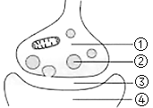
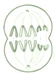
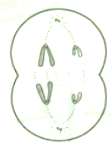
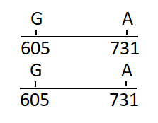
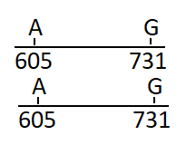
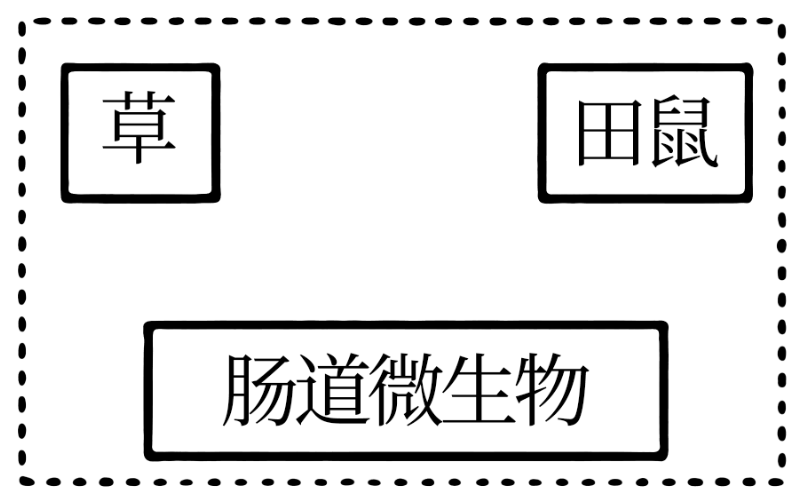
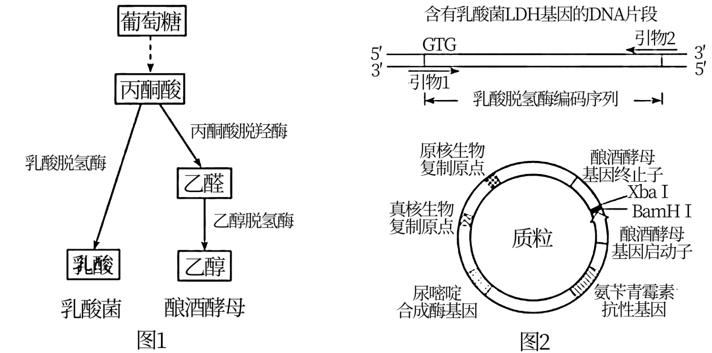
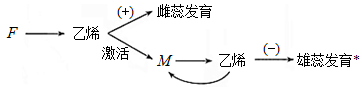
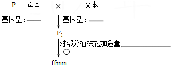

**2021年天津市普通高中学业水平等级性考试**

**生物学**

1\. 下列操作能达到灭菌目的的是（ ）

A. 用免洗酒精凝胶擦手 B. 制作泡菜前用开水烫洗容器

C. 在火焰上灼烧接种环 D. 防疫期间用石炭酸喷洒教室

2\. 突触小泡可从细胞质基质摄取神经递质。当兴奋传导至轴突末梢时，突触小泡释放神经递质到突触间隙。图中不能检测出神经递质的部位是（ ）

A. ① B. ②

C. ③ D. ④

3\. 动物正常组织干细胞突变获得异常增殖能力，并与外界因素相互作用，可恶变为癌细胞。干细胞转变为癌细胞后，下列说法正确的是（ ）

A. DNA序列不变 B. DNA复制方式不变

C. 细胞内mRNA不变 D. 细胞表面蛋白质不变

4\. 富营养化水体中，藻类是吸收磷元素的主要生物，下列说法正确的是（ ）

A. 磷是组成藻类细胞的微量元素

B. 磷是构成藻类生物膜的必要元素

C. 藻类的ATP和淀粉都是含磷化合物

D. 生态系统的磷循环在水生生物群落内完成

5\. 铅可导致神经元线粒体空泡化、内质网结构改变、高尔基体扩张，影响这些细胞器的正常功能。这些改变不会直接影响下列哪种生理过程（ ）

A. 无氧呼吸释放少量能量

B. 神经元间的兴奋传递

C. 分泌蛋白合成和加工

D. \[H\]与O2结合生成水

6\. 孟德尔说：“任何实验的价值和效用，取决于所使用材料对于实验目的的适合性。”下列实验材料选择不适合的是（ ）

\

A. 用洋葱鳞片叶表皮观察细胞的质壁分离和复原现象

B. 用洋葱根尖分生区观察细胞有丝分裂

C. 用洋葱鳞片叶提取和分离叶绿体中的色素

D. 用洋葱鳞片叶粗提取DNA

7\. 下图为某二倍体昆虫精巢中一个异常精原细胞的部分染色体组成示意图。若该细胞可以正常分裂，下列哪种情况不可能出现（ ）

A  B. 

C.  D. 

8\. 某患者被初步诊断患有SC单基因遗传病，该基因位于常染色体上。调查其家系发现，患者双亲各有一个SC基因发生单碱基替换突变，且突变位于该基因的不同位点。调查结果见下表。

|          |            |            |                       |     |
|:--------:|:----------:|:----------:|:---------------------:|:---:|
| 个体       | 母亲         | 父亲         | 姐姐                    | 患者  |
| 表现型      | 正常         | 正常         | 正常                    | 患病  |
| SC基因测序结果 | \[605G/A\] | \[731A/G\] | \[605G/G\]；\[731A/A\] | ？   |

注：测序结果只给出基一条链（编码链）的碱基序列\[605G/A\]示两条同源染色体上SC基因编码链的第605位碱基分别为G和A，其他类似。

若患者的姐姐两条同源染色体上SC基因编码链的第605和731位碱基可表示为下图1，根据调查结果，推断该患者相应位点的碱基应为（ ）

A. \
B. 

C.  D. 

阅读下列材料，完成下面小题。

S蛋白是新冠病毒识别并感染靶细胞的重要蛋白，作为抗原被宿主免疫系统识别并应答，因此S蛋白是新冠疫苗研发的重要靶点。下表是不同类型新冠疫苗研发策略比较。

|            |                                                                                        |
|:---------- |:-------------------------------------------------------------------------------------- |
| 类型         | 研发策略                                                                                   |
| 灭活疫苗       | 新冠病毒经培养、增殖，用理化方法灭活后制成疫苗。                                                               |
| 腺病毒载体疫苗    | 利用改造后无害的腺病毒作为载体，携带S蛋白基因，制成疫苗。接种后，S蛋白基因启动表达。                                            |
| 亚单位疫苗      | 通过基因工程方法，在体外合成S蛋白，制成疫苗。                                                                |
| 核酸疫苗       | 将编码S蛋白核酸包裹在纳米颗粒中，制成疫苗。接种后，在人体内产生S蛋白。 |
| 减毒流感病毒载体疫苗 | 利用减毒流感病毒作为载体，带S蛋白基因，并在载体病毒表面表达S蛋白，制成疫苗。                                                |

9\. 自身不含S蛋白抗原的疫苗是（ ）

A. 灭活疫苗 B. 亚单位疫苗

C. 核酸疫苗 D. 减毒流感病毒载体疫苗

10\. 通常不引发细胞免疫的疫苗是（ ）

A. 腺病毒载体疫苗 B. 亚单位疫苗

C 核酸疫苗 D. 减毒流感病毒载体疫苗

阅读下列材料，完成下面小题。

为提高转基因抗虫棉的抗虫持久性，可采取如下措施：

①基因策略：包括提高杀虫基因的表达量、向棉花中转入多种杀虫基因等。例如，早期种植的抗虫棉只转入了一种Bt毒蛋白基因，抗虫机制比较单一；现在经常将两种或两种以上Bt基同时转入棉花。

②田间策略：主要是为棉铃虫提供底护所。例如我国新疆棉区，在转基因棉田周围种植一定面积的非转基因棉花，为棉铃虫提供专门的庇护所：长江、黄河流域棉区多采用将转基因抗虫棉与高粱和玉米等其他棉铃虫寄主作物混作的方式，为棉铃虫提供天然的庇护所。

③国家宏观调控政策：如实施分区种植管理等。

11\. 关于上述基因策略，下列叙述错误的是（ ）

A. 提高Bt基因的表达量，可降低抗虫棉种植区的棉铃虫种群密度

B. 转入棉花植株的两种Bt基因的遗传不一定遵循基因的自由组合定律

C. 若两种Bt基因插入同一个T-DNA并转入棉花植株，则两种基因互为等位基因

D. 转入多种Bt基因能提高抗虫持久性，是因为棉铃虫基因突变频率低且不定向

12\. 关于上述田间策略，下列叙述错误的是（ ）

A. 转基因棉田周围种植非抗虫棉，可降低棉铃虫抗性基因的突变率

B. 混作提高抗虫棉的抗虫持久性，体现了物种多样性的重要价值

C. 为棉铃虫提供底护所，可使敏感棉铃虫在种群中维持一定比例

D. 为棉铃虫提供庇护所，可使棉铃虫种群抗性基因频率增速放缓

13\. 为研究降水量影响草原小型啮齿动物种群密度的机制，科研人员以田鼠幼鼠为材料进行了一系列实验。其中，野外实验在内蒙古半干旱草原开展，将相同体重的幼鼠放入不同样地中，5个月后测定相关指标，部分结果见下图。

\

（1）由图1可知，\_\_\_\_\_\_\_\_\_\_\_组田鼠体重增幅更大。田鼠体重增加有利于个体存活、育龄个体增多，影响田鼠种群的\_\_\_\_\_\_\_\_\_\_\_，从而直接导致种群密度增加。

（2）由图2可知，增加降水有利于\_\_\_\_\_\_\_\_\_\_\_生长，其在田鼠食谱中所占比例增加，田鼠食谱发生变化。

（3）随后在室内模拟野外半干旱和增加降水组的食谱，分别对两组田鼠幼鼠进行饲喂，一段时间后，比较两组田鼠体重增幅。该实验目的为\_\_\_\_\_\_\_\_\_\_\_．

（4）进一步研究发现，增加降水引起田鼠食谱变化后，田鼠肠道微生物组成也发生变化，其中能利用草中的纤维素等物质合成并分泌短链脂肪酸（田鼠的能量来源之一）的微生物比例显著增加。田鼠与这类微生物的种间关系为\_\_\_\_\_\_\_\_\_\_\_。请在图中用箭头标示肠道微生物三类生物之间的能量流动方向。\_\_\_\_\_\_

\

14\. 阿卡波糖是国外开发的口服降糖药，可有效降低餐后血糖高峰。为开发具有自主知识产权的同类型新药，我国科研人员研究了植物来源的生物碱NB和黄酮CH对餐后血糖的影响。为此，将溶于生理盐水的药物和淀粉同时灌胃小鼠后，在不同时间检测其血糖水平，实验设计及部分结果如下表所示。

<table style="width:97%;">
<colgroup>
<col style="width: 24%" />
<col style="width: 27%" />
<col style="width: 9%" />
<col style="width: 11%" />
<col style="width: 11%" />
<col style="width: 12%" />
</colgroup>
<tbody>
<tr>
<td rowspan="2" style="text-align: center;">组别（每组10只）</td>
<td rowspan="2" style="text-align: center;">给药量（mg/kg体重）</td>
<td colspan="4" style="text-align: center;">给药后不同时间血糖水平（mmol/L）</td>
</tr>
<tr>
<td style="text-align: center;">0分钟</td>
<td style="text-align: center;">30分钟</td>
<td style="text-align: center;">60分钟</td>
<td style="text-align: center;">120分钟</td>
</tr>
<tr>
<td style="text-align: center;">生理盐水</td>
<td style="text-align: center;">-</td>
<td style="text-align: center;">4．37</td>
<td style="text-align: center;">11．03</td>
<td style="text-align: center;">7．88</td>
<td style="text-align: center;">5．04</td>
</tr>
<tr>
<td style="text-align: center;">阿卡波糖</td>
<td style="text-align: center;">4．0</td>
<td style="text-align: center;">4．12</td>
<td style="text-align: center;">7．62</td>
<td style="text-align: center;">7．57</td>
<td style="text-align: center;">5．39</td>
</tr>
<tr>
<td style="text-align: center;">NB</td>
<td style="text-align: center;">4．0</td>
<td style="text-align: center;">4．19</td>
<td style="text-align: center;">x1</td>
<td style="text-align: center;">6．82</td>
<td style="text-align: center;">5．20</td>
</tr>
<tr>
<td style="text-align: center;">CH</td>
<td style="text-align: center;">4．0</td>
<td style="text-align: center;">4．24</td>
<td style="text-align: center;">x2</td>
<td style="text-align: center;">7．20</td>
<td style="text-align: center;">5．12</td>
</tr>
<tr>
<td style="text-align: center;">NB+CH</td>
<td style="text-align: center;">4．0+4．0</td>
<td style="text-align: center;">4．36</td>
<td style="text-align: center;">x3</td>
<td style="text-align: center;">5．49</td>
<td style="text-align: center;">5．03</td>
</tr>
</tbody>
</table>

（1）将淀粉灌胃小鼠后，其在小鼠消化道内水解终产物为\_\_\_\_\_\_\_\_\_\_\_，该物质由肠腔经过以下部位形成餐后血糖，请将这些部位按正确路径排序：\_\_\_\_\_\_\_\_\_\_\_（填字母）。

a．组织液b．血浆c．小肠上皮细胞d．毛细血管壁细胞

血糖水平达到高峰后缓慢下降，是由于胰岛素促进了血糖合成糖原、\_\_\_\_\_\_\_\_\_\_\_、转化为脂肪和某些氨基酸等。

（2）本实验以\_\_\_\_\_\_\_\_\_\_\_作对照组，确认实验材料和方法等能有效检测药物疗效。

（3）该研究的结论为：NB和CH均能有效降低餐后血糖高峰，且二者共同作用效果更强。下列对应表中x1、x2、x3处的数据排列中符合上述结论的是\_\_\_\_\_\_\_\_\_\_\_。

A. 7．15 7．62 6．37 B. 7．60 7．28 6．11

C. 7．43 6．26 7．75 D. 6．08 7．02 7．54

15\. Rubisco是光合作用过程中催化CO2固定的酶。但其也能催化O2与C5结合，形成C3和C2，导致光合效率下降。CO2与O2竞争性结合Rubisco的同一活性位点，因此提高CO2浓度可以提高光合效率。

（1）蓝细菌具有CO2浓缩机制，如下图所示。

注：羧化体具有蛋白质外壳，可限制气体扩散

据图分析，CO2依次以\_\_\_\_\_\_\_\_\_\_\_和\_\_\_\_\_\_\_\_\_\_\_方式通过细胞膜和光合片层膜。蓝细菌的CO2浓缩机制可提高羧化体中Rubisco周围的CO2浓度，从而通过促进\_\_\_\_\_\_\_\_\_\_\_和抑制\_\_\_\_\_\_\_\_\_\_\_提高光合效率。

（2）向烟草内转入蓝细菌Rubisco的编码基因和羧化体外壳蛋白的编码基因。若蓝细菌羧化体可在烟草中发挥作用并参与暗反应，应能利用电子显微镜在转基因烟草细胞的\_\_\_\_\_\_\_\_\_\_\_中观察到羧化体。

（3）研究发现，转基因烟草的光合速率并未提高。若再转入HCO3-和CO2转运蛋白基因并成功表达和发挥作用，理论上该转基因植株暗反应水平应\_\_\_\_\_\_\_\_\_\_\_，光反应水平应\_\_\_\_\_\_\_\_\_\_\_，从而提高光合速率。

16\. 乳酸菌是乳酸传统生产菌，但耐酸能力较差，影响产量。酿酒酵母耐酸能力较强，但不产生乳酸。研究者将乳酸菌的乳酸脱氢酶基因（LDH）导入酿酒酵母，获得能产生乳酸的工程菌株。下图1为乳酸和乙醇发酵途径示意图，图2为构建表达载体时所需的关键条件。

\

（1）乳酸脱氢酶在转基因酿酒酵母中参与厌氧发酵的场所应为\_\_\_\_\_\_\_\_\_\_\_。

（2）获得转基因酿酒酵母菌株的过程如下：

①设计引物扩增乳酸脱氢酶编码序列。

为使扩增出的序列中编码起始密码子的序列由原核生物偏好的GTG转变为真核生物偏好的ATG，且能通过双酶切以正确方向插入质粒，需设计引物1和2。其中引物1的5′端序列应考虑\_\_\_\_\_\_\_\_\_\_\_和\_\_\_\_\_\_\_\_\_\_\_。

②将上述PCR产物和质粒重组后，导入大肠杆菌，筛选、鉴定，扩增重组质粒。重组质粒上有\_\_\_\_\_\_\_\_\_\_\_\_，所以能在大肠杆菌中扩增。启动子存在物种特异性，易被本物种的转录系统识别并启动转录，因此重组质粒上的乳酸脱氢酶编码序列\_\_\_\_\_\_\_\_\_\_\_（能/不能）在大肠杆菌中高效表达。

③提取重组质粒并转入不能合成尿嘧啶的酿酒酵母菌株，在\_\_\_\_\_\_\_\_\_\_\_的固体培养基上筛选出转基因酿酒酵母，并进行鉴定。

（3）以葡萄糖为碳源，利用该转基因酿酒酵母进行厌氧发酵，结果既产生乳酸，也产生乙醇。若想进一步提高其乳酸产量，下列措施中不合理的是\_\_\_\_\_\_\_\_\_\_\_（单选）。

A. 进一步优化发酵条件 B. 使用乳酸菌LDH基因自身的启动子

C. 敲除酿酒酵母的丙酮酸脱羧酶基因 D. 对转基因酿酒酵母进行诱变育种

17\. 黄瓜的花有雌花、雄花与两性花之分（雌花：仅雌蕊发育；雄花：仅雄蕊发育；两性花：雌雄蕊均发育）。位于非同源染色体上的F和M基因均是花芽分化过程中乙烯合成途径的关键基因，对黄瓜花的性别决定有重要作用。F和M基因的作用机制如图所示。

（+）促进（-）抑制 \*未被乙烯抑制时雄蕊可正常发育

（1）M基因的表达与乙烯的产生之间存在\_\_\_\_\_\_\_\_\_\_（正/负）反馈，造成乙烯持续积累，进而抑制雄蕊发育。

（2）依据F和M基因的作用机制推断，FFMM基因型的黄瓜植株开雌花，FFmm基因型的黄瓜植株开\_\_\_\_\_\_\_\_\_\_花。当对FFmm基因型的黄瓜植株外源施加\_\_\_\_\_\_\_\_\_\_（乙烯抑制剂/乙烯利）时，出现雌花。

（3）现有FFMM、ffMM和FFmm三种基因型的亲本，若要获得基因型为ffmm的植株，请完成如下实验流程设计。

母本基因型：\_\_\_\_\_\_\_\_\_\_；父本基因型：\_\_\_\_\_\_\_\_\_\_；对部分植物施加适量\_\_\_\_\_\_\_\_\_\_
