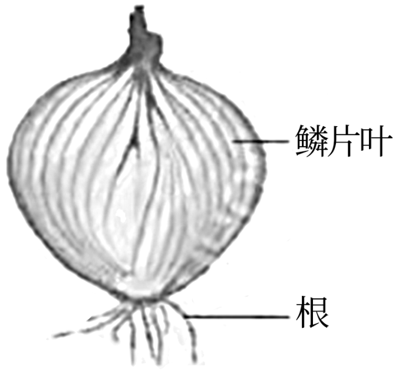
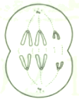
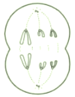
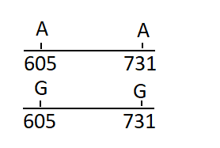
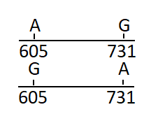
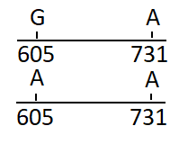
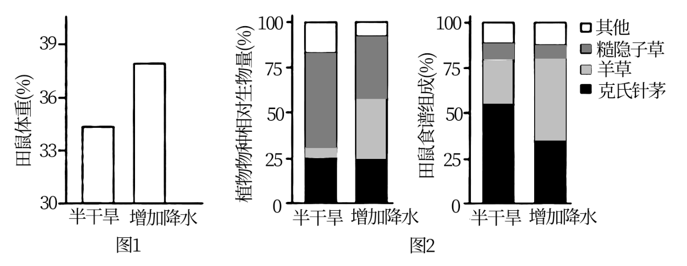
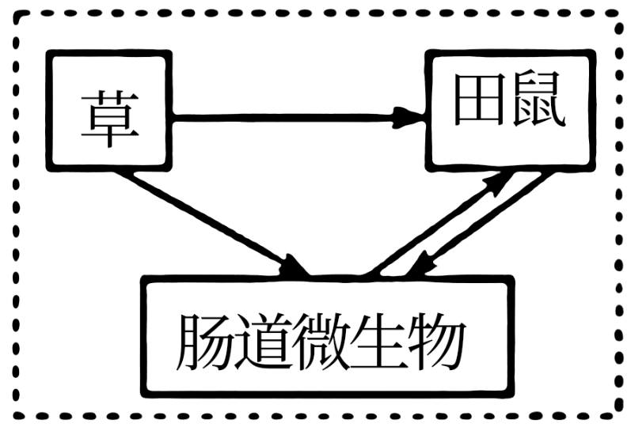
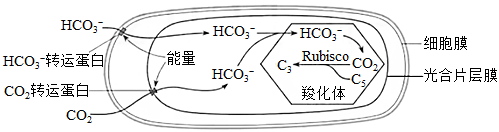

**2021年天津市普通高中学业水平等级性考试**

**生物学**

1\. 下列操作能达到灭菌目的的是（ ）

A 用免洗酒精凝胶擦手 B. 制作泡菜前用开水烫洗容器

C. 在火焰上灼烧接种环 D. 防疫期间用石炭酸喷洒教室

【答案】C

【解析】

【分析】灭菌是指使用强烈的理化因素杀死物体内外一切微生物的细胞、芽孢和孢子的过程，常用的方法有灼烧灭菌、干热灭菌和高压蒸汽灭菌。消毒是指用较为温和的物理或化学方法仅杀死物体体表或内部的一部分微生物的过程，常用的方法有煮沸消毒法、巴氏消毒法、紫外线或化学药物消毒法等。

【详解】A、用免洗酒精凝胶擦手属于消毒，A错误；

B、制作泡菜前用开水烫洗容器属于消毒过程，B错误；

C、在火焰上灼烧接种环能达到灭菌目的，C正确；

D、防疫期间用石炭酸喷洒教室，属于消毒，D错误。

故选C。

2\. 突触小泡可从细胞质基质摄取神经递质。当兴奋传导至轴突末梢时，突触小泡释放神经递质到突触间隙。图中不能检测出神经递质的部位是（ ）

A. ① B. ②

C. ③ D. ④

【答案】D

【解析】

【分析】兴奋在两个神经元之间传递是通过突触进行，突触由突触前膜、突触间隙和突触后膜三部分组成，神经递质只存在于突触前膜的突触小泡中，只能由突触前膜释放，进入突触间隙，作用于突触后膜上的特异性受体，引起下一个神经元兴奋或抑制，所以兴奋在神经元之间的传递是单向的。突触可完成“电信号→化学信号→电信号”的转变。

图中①是突触小体，②是突触小泡，③是突触间隙，④突触后神经元。

【详解】AB、神经递质在突触小体内的细胞器中合成，由高尔基体形成的突触小泡包裹，所以在突触小体和突触小泡中都可能检测到神经递质，AB错误；

C、突触小泡和突触前膜融合后，将神经递质释放至突触间隙，所以在突触间隙中可以找到神经递质，C错误；

D、神经递质与突触后神经元膜上的受体结合，引起相应电位的改变，没有进入突触后神经元，因此在④突触后神经元中不能找到神经递质，D正确。

故选D。

【点睛】

3\. 动物正常组织干细胞突变获得异常增殖能力，并与外界因素相互作用，可恶变为癌细胞。干细胞转变为癌细胞后，下列说法正确的是（ ）

A. DNA序列不变 B. DNA复制方式不变

C. 细胞内mRNA不变 D. 细胞表面蛋白质不变

【答案】B

【解析】

【分析】1、癌细胞是指受到致癌因子的作用，细胞中遗传物质发生变化，变成不受机体控制的、连续进行分裂的恶性增殖细胞。

2、细胞癌变的原因包括外因和内因，外因是各种致癌因子，内因是原癌基因和抑癌基因发生基因突变。

3、癌细胞的特征：能够无限增殖；形态结构发生显著改变；细胞表面发生变化，细胞膜的糖蛋白等物质减少。

【详解】A、干细胞转变为癌细胞是因为原癌基因和抑癌基因发生基因突变，DNA序列发生改变，A错误；

B、DNA复制方式都为半保留复制，B正确；

C、干细胞转变为癌细胞后，基因的表达情况发生改变，细胞内mRNA改变，C错误；

D、干细胞转变为癌细胞后，细胞表面糖蛋白会减少，D错误。

故选B。

4\. 富营养化水体中，藻类是吸收磷元素的主要生物，下列说法正确的是（ ）

A. 磷是组成藻类细胞的微量元素

B. 磷是构成藻类生物膜的必要元素

C. 藻类的ATP和淀粉都是含磷化合物

D. 生态系统的磷循环在水生生物群落内完成

【答案】B

【解析】

【分析】1、组成生物体的化学元素根据其含量不同分为大量元素和微量元素，大量元素包括C、H、O、N、P、S、K、Ca、Mg等，微量元素包括Fe、Mn、Zn、Cu、B、Mo等。

2、生态系统的物质循环是指组成生物体的元素在生物群落与非生物环境间循环的过程，具有全球性。

【详解】A、磷属于大量元素，A错误；

B、磷脂中含磷元素，磷脂双分子层是构成藻类生物膜的基本支架，故磷是构成藻类生物膜的必要元素，B正确；

C、ATP由C、H、O、N、P组成，淀粉只含C、H、O三种元素，C错误；

D、物质循环具有全球性，生态系统的磷循环不能在水生生物群落内完成，D错误。

故选B。

5\. 铅可导致神经元线粒体空泡化、内质网结构改变、高尔基体扩张，影响这些细胞器的正常功能。这些改变不会直接影响下列哪种生理过程（ ）

A. 无氧呼吸释放少量能量

B. 神经元间的兴奋传递

C. 分泌蛋白合成和加工

D. \[H\]与O2结合生成水

【答案】A

【解析】

【分析】分泌蛋白合成的过程为：核糖体合成蛋白质→内质网进行粗加工→内质网“出芽”形成囊泡→高尔基体进行再加工形成成熟的蛋白质→高尔基体“出芽”形成囊泡→细胞膜，整个过程由线粒体提供能量。

【详解】A、铅影响线粒体、内质网和高尔基体，而细胞无氧呼吸的场所在细胞质基质，所以这些改变不影响无氧呼吸，A正确；

B、兴奋在神经元之间传递的方式是胞吐作用，由于铅影响了线粒体和高尔基体的功能，所以会影响该过程，B错误；

C、分泌蛋白的合成需要内质网、高尔基体和线粒体的参与，因此会影响该过程，C错误；

D、\[H\]与O2结合生成水是有氧呼吸第三阶段，场所在线粒体，所以会影响该过程，D错误。

故选A。

【点睛】

6\. 孟德尔说：“任何实验的价值和效用，取决于所使用材料对于实验目的的适合性。”下列实验材料选择不适合的是（ ）

\

A. 用洋葱鳞片叶表皮观察细胞的质壁分离和复原现象

B. 用洋葱根尖分生区观察细胞有丝分裂

C. 用洋葱鳞片叶提取和分离叶绿体中的色素

D. 用洋葱鳞片叶粗提取DNA

【答案】C

【解析】

【分析】洋葱是比较好的实验材料：

①洋葱根尖分生区细胞观察植物细胞的有丝分裂；

②洋葱鳞片叶外表皮细胞，色素含量较多，用于观察质壁分离和复原；

③洋葱的绿叶做叶绿体中色素的提取和分离实验，叶肉细胞做细胞质流动实验。

④洋葱的内表皮细胞颜色浅、由单层细胞构成，适合观察DNA、RNA在细胞中的分布状况。

【详解】A、洋葱鳞片叶外表皮细胞的液泡为紫色，便于观察细胞的质壁分离和复原现象，A正确；

B、洋葱根尖分生区细胞分裂旺盛，可以用来观察细胞有丝分裂，B正确；

C、洋葱鳞片叶不含叶绿体，不能用来提取和分离叶绿体中的色素，C错误；

D、洋葱鳞片叶细胞有细胞核且颜色浅，可以用来粗提取DNA，D正确。

故选C。

7\. 下图为某二倍体昆虫精巢中一个异常精原细胞的部分染色体组成示意图。若该细胞可以正常分裂，下列哪种情况不可能出现（ ）

A.  B. 

C.  D. 

【答案】D

【解析】

【分析】分析题图：二倍体昆虫的体细胞中各种形态的同源染色体应为两条，该异常精原细胞中某种形态的同源染色体有三条。精巢中的精原细胞既可以进行有丝分裂，也可以进行减数分裂。

【详解】A、若该细胞进行正常的有丝分裂，则后期会出现如图A所示的情况，A不符合题意；

B、该图为异常精原细胞进行减数第二次分裂后期时可能出现的情况，B不符合题意；

C、该图为异常精原细胞进行减数第二次分裂后期时可能出现的情况，C不符合题意；

D、正常分裂时，形态较小的那对同源染色体应该在减数第一次分裂后期分离，该图所示的减数第二次分裂后期不会出现其同源染色体，D符合题意。

故选D。

8\. 某患者被初步诊断患有SC单基因遗传病，该基因位于常染色体上。调查其家系发现，患者双亲各有一个SC基因发生单碱基替换突变，且突变位于该基因的不同位点。调查结果见下表。

|          |            |            |                       |     |
|:--------:|:----------:|:----------:|:---------------------:|:---:|
| 个体       | 母亲         | 父亲         | 姐姐                    | 患者  |
| 表现型      | 正常         | 正常         | 正常                    | 患病  |
| SC基因测序结果 | \[605G/A\] | \[731A/G\] | \[605G/G\]；\[731A/A\] | ？   |

注：测序结果只给出基一条链（编码链）的碱基序列\[605G/A\]示两条同源染色体上SC基因编码链的第605位碱基分别为G和A，其他类似。

若患者的姐姐两条同源染色体上SC基因编码链的第605和731位碱基可表示为下图1，根据调查结果，推断该患者相应位点的碱基应为（ ）

A. \
B. 

C.  D. 

【答案】A

【解析】

【分析】基因分离定律的实质是：在杂合体的细胞中，位于一对同源染色体上的等基因，具有一定的独立性；在减数分裂形成配子过程中，等位基因随同源染色体的分开而分离，分别进入两个配子中，独立地随配子遗传给后代。

【详解】根据题意写出父亲和母亲生下正常女儿的同源染色体上模板链上碱基组合如下图所示：

由于女儿表现型是正常的，所以第605号正常的碱基是G，731号正常的碱基是A，结合女儿DNA上的基因，可以推测母亲同源染色体上模板链的碱基如下：

父亲同源染色体上模板链的碱基如下：

因此他们生下患病的孩子的同源染色体上的碱基是两条链上都发生了突变，即：

故选A。

阅读下列材料，完成下面小题。

S蛋白是新冠病毒识别并感染靶细胞的重要蛋白，作为抗原被宿主免疫系统识别并应答，因此S蛋白是新冠疫苗研发的重要靶点。下表是不同类型新冠疫苗研发策略比较。

|            |                                             |
|:---------- |:------------------------------------------- |
| 类型         | 研发策略                                        |
| 灭活疫苗       | 新冠病毒经培养、增殖，用理化方法灭活后制成疫苗。                    |
| 腺病毒载体疫苗    | 利用改造后无害的腺病毒作为载体，携带S蛋白基因，制成疫苗。接种后，S蛋白基因启动表达。 |
| 亚单位疫苗      | 通过基因工程方法，在体外合成S蛋白，制成疫苗。                     |
| 核酸疫苗       | 将编码S蛋白的核酸包裹在纳米颗粒中，制成疫苗。接种后，在人体内产生S蛋白。       |
| 减毒流感病毒载体疫苗 | 利用减毒流感病毒作为载体，带S蛋白基因，并在载体病毒表面表达S蛋白，制成疫苗。     |

9\. 自身不含S蛋白抗原的疫苗是（ ）

A. 灭活疫苗 B. 亚单位疫苗

C. 核酸疫苗 D. 减毒流感病毒载体疫苗

10\. 通常不引发细胞免疫的疫苗是（ ）

A. 腺病毒载体疫苗 B. 亚单位疫苗

C. 核酸疫苗 D. 减毒流感病毒载体疫苗

【答案】9. C 10. B

【解析】

【分析】1、体液免疫过程为：（1）除少数抗原可以直接刺激B细胞外，大多数抗原被吞噬细胞摄取和处理，并暴露出其抗原决定簇；吞噬细胞将抗原呈递给T细胞，再由T细胞呈递给B细胞；（2）B细胞接受抗原刺激后，开始进行一系列的增殖、分化，形成记忆细胞和浆细胞；（3）浆细胞分泌抗体与相应的抗原特异性结合，发挥免疫效应。

2、细胞免疫过程为：（1）吞噬细胞摄取和处理抗原，并暴露出其抗原决定簇，然后将抗原呈递给T细胞；（2）T细胞接受抗原刺激后增殖、分化形成记忆细胞和效应T细胞，同时T细胞能合成并分泌淋巴因子，增强免疫功能；（3）效应T细胞发挥效应，激活靶细胞内的溶酶体酶使靶细胞裂解。

3、疫苗属于抗原，进入机体后会引起特异性免疫反应。常见的疫苗有减毒活疫苗、灭活病毒疫苗、重组蛋白疫苗、重组病毒载体疫苗、核酸疫苗等。

【9题详解】

A、灭活疫苗是病毒经培养、增殖并用理化方法灭活后制成，会保留病毒的S蛋白抗原，A不符合题意；

B、亚单位疫苗是通过基因工程方法，在体外合成S蛋白制成，包含S蛋白抗原，B不符合题意；

C、核酸疫苗是将编码S蛋白的核酸包裹在纳米颗粒中制成，自身不含S蛋白抗原，C符合题意；

D、减毒流感病毒载体疫苗是利用减毒流感病毒作为载体，带S蛋白基因，并在载体病毒表面表达S蛋白制成，故该疫苗自身含S蛋白抗原，D不符合题意。

故选C

【10题详解】

A、腺病毒载体疫苗是利用改造后无害的腺病毒作为载体，携带S蛋白基因制成，腺病毒会引发细胞免疫，A不符合题意；

B、亚单位疫苗是通过基因工程方法，在体外合成S蛋白制成，只包含S蛋白抗原，不会引起细胞免疫，B符合题意；

C、核酸疫苗是将编码S蛋白的核酸包裹在纳米颗粒中制成，该疫苗会进入细胞内发挥作用，可能会引发机体的细胞免疫，C不符合题意；

D、减毒流感病毒载体疫苗是利用减毒流感病毒作为载体，带S蛋白基因，并在载体病毒表面表达S蛋白制成，流感病毒会引发细胞免疫，D不符合题意。

故选B。

阅读下列材料，完成下面小题。

为提高转基因抗虫棉的抗虫持久性，可采取如下措施：

①基因策略：包括提高杀虫基因的表达量、向棉花中转入多种杀虫基因等。例如，早期种植的抗虫棉只转入了一种Bt毒蛋白基因，抗虫机制比较单一；现在经常将两种或两种以上Bt基同时转入棉花。

②田间策略：主要是为棉铃虫提供底护所。例如我国新疆棉区，在转基因棉田周围种植一定面积的非转基因棉花，为棉铃虫提供专门的庇护所：长江、黄河流域棉区多采用将转基因抗虫棉与高粱和玉米等其他棉铃虫寄主作物混作的方式，为棉铃虫提供天然的庇护所。

③国家宏观调控政策：如实施分区种植管理等。

11\. 关于上述基因策略，下列叙述错误的是（ ）

A. 提高Bt基因的表达量，可降低抗虫棉种植区的棉铃虫种群密度

B. 转入棉花植株的两种Bt基因的遗传不一定遵循基因的自由组合定律

C. 若两种Bt基因插入同一个T-DNA并转入棉花植株，则两种基因互为等位基因

D. 转入多种Bt基因能提高抗虫持久性，是因为棉铃虫基因突变频率低且不定向

12\. 关于上述田间策略，下列叙述错误的是（ ）

A. 转基因棉田周围种植非抗虫棉，可降低棉铃虫抗性基因的突变率

B. 混作提高抗虫棉的抗虫持久性，体现了物种多样性的重要价值

C. 为棉铃虫提供底护所，可使敏感棉铃虫在种群中维持一定比例

D. 为棉铃虫提供庇护所，可使棉铃虫种群抗性基因频率增速放缓

【答案】11. C 12. A

【解析】

【分析】1、自由组合定律的实质：位于非同源染色体上的非等位基因的分离或自由组合是互不干扰的；在减数分裂过程中，同源染色体上的等位基因彼此分离的同时，非同源染色体上的非等位基因自由组合。

2、生物多样性的价值：（1）直接价值：对人类有食用、药用和工业原料等使用意义，以及有旅游观赏、科学研究和文学艺术创作等非实用意义的。（2）间接价值：对生态系统起重要调节作用的价值（生态功能）。（3）潜在价值：目前人类不清楚的价值。

3、根据题意：混作可以使对毒蛋白敏感的个体存活，由于敏感型个体和抗性个体之间存在种内斗争等因素，因此可以降低抗性个体的数量，从而提高抗虫棉的抗虫持久性。

【11题详解】

A、提高Bt基因表达量，使抗虫蛋白含量增加，可以使更多的棉铃虫被淘汰，所以可以降低棉铃虫的种群密度，A正确；

B、如果两种Bt基因都转入一条染色体上，则其遗传不遵循自由组合定律，B正确；

C、如果两种Bt基因插入同一个T-DNA并转入棉花植株，两个基因位于一条染色体上，不是等位基因，等位基因位于一对同源染色体上，C错误；

D、由于棉铃虫基因突变频率低且不定向，转入多种Bt基因可以降低棉铃虫抗Bt毒蛋白的能力，从而提高抗虫持久性，D正确。

故选C。

【12题详解】

A、基因突变可以自发发生，且具有不定向性，突变频率与环境没有直接关系，所以在转基因棉田周围种植非抗虫棉，不能降低棉铃虫抗性基因的突变率，A错误；

B、采用将转基因抗虫棉与高粱和玉米等其他棉铃虫寄主作物混作，可以使敏感型个体存活，同时具有抗毒蛋白棉铃虫生存空间变小，提高了抗虫棉的抗虫持久性，保护了环境，同时也具有经济价值，所以体现了物种多样性的直接和间接价值，B正确。

C、在转基因棉田周围种植一定面积的非转基因棉花，为棉铃虫提供底护所，使敏感型的个体可以生存，种群中维持一定比例，C正确；

D、混作使具有抗毒蛋白和敏感型个体都得以生存，由于二者之间存在种内斗争，因此使棉铃虫种群抗性基因频率增速放缓，D正确。

故选A。

【点睛】

13\. 为研究降水量影响草原小型啮齿动物种群密度的机制，科研人员以田鼠幼鼠为材料进行了一系列实验。其中，野外实验在内蒙古半干旱草原开展，将相同体重的幼鼠放入不同样地中，5个月后测定相关指标，部分结果见下图。

\

（1）由图1可知，\_\_\_\_\_\_\_\_\_\_\_组田鼠体重增幅更大。田鼠体重增加有利于个体存活、育龄个体增多，影响田鼠种群的\_\_\_\_\_\_\_\_\_\_\_，从而直接导致种群密度增加。

（2）由图2可知，增加降水有利于\_\_\_\_\_\_\_\_\_\_\_生长，其在田鼠食谱中所占比例增加，田鼠食谱发生变化。

（3）随后在室内模拟野外半干旱和增加降水组的食谱，分别对两组田鼠幼鼠进行饲喂，一段时间后，比较两组田鼠体重增幅。该实验目的为\_\_\_\_\_\_\_\_\_\_\_．

（4）进一步研究发现，增加降水引起田鼠食谱变化后，田鼠肠道微生物组成也发生变化，其中能利用草中的纤维素等物质合成并分泌短链脂肪酸（田鼠的能量来源之一）的微生物比例显著增加。田鼠与这类微生物的种间关系为\_\_\_\_\_\_\_\_\_\_\_。请在图中用箭头标示肠道微生物三类生物之间的能量流动方向。\_\_\_\_\_\_

\

【答案】（1） ①. 增加降水 ②. 出生率和死亡率 

（2）羊草 （3）检验增加降水组田鼠体重增幅大是否由食谱变化引起 

（4） ①. 互利共生 ②. 

【解析】

【分析】种群的数量特征包括种群密度、出生率和死亡率、迁入率和迁出率、年龄组成和性别比例。其中种群密度是最基本的数量特征，出生率和死亡率、迁入率和迁出率决定种群密度的大小，性别比例直接影响种群的出生率，年龄组成预测种群密度变化。

【小问1详解】

分析图1可知，增加降水组田鼠体重增幅更大。田鼠体重增加有利于个体存活，可以降低死亡率，育龄个体增多可以提高出生率，即通过影响种群的出生率和死亡率，从而直接导致种群密度增加。

【小问2详解】

分析图2可知，增加降水组羊草的相对生物量明显增加，即有利于羊草的生长。

【小问3详解】

室内模拟野外半干旱和增加降水组的食谱进行实验，可以排除食谱外其他因素对实验结果的影响，目的是检验增加降水组田鼠体重增幅大是否由食谱变化引起。

【小问4详解】

分析题意可知，田鼠肠道微生物可以为田鼠提供短链脂肪酸，则田鼠与这类微生物的种间关系为互利共生。三类生物之间的能量流动方向如图：

 。\

【点睛】本题结合实验，考查种群特征、种间关系等内容，要求考生识记种群特征，结合实验结果分析降水量对动物种群密度的影响，再结合所学的知识准确答题。

14\. 阿卡波糖是国外开发的口服降糖药，可有效降低餐后血糖高峰。为开发具有自主知识产权的同类型新药，我国科研人员研究了植物来源的生物碱NB和黄酮CH对餐后血糖的影响。为此，将溶于生理盐水的药物和淀粉同时灌胃小鼠后，在不同时间检测其血糖水平，实验设计及部分结果如下表所示。

<table style="width:97%;">
<colgroup>
<col style="width: 24%" />
<col style="width: 27%" />
<col style="width: 9%" />
<col style="width: 11%" />
<col style="width: 11%" />
<col style="width: 12%" />
</colgroup>
<tbody>
<tr>
<td rowspan="2" style="text-align: center;">组别（每组10只）</td>
<td rowspan="2" style="text-align: center;">给药量（mg/kg体重）</td>
<td colspan="4" style="text-align: center;">给药后不同时间血糖水平（mmol/L）</td>
</tr>
<tr>
<td style="text-align: center;">0分钟</td>
<td style="text-align: center;">30分钟</td>
<td style="text-align: center;">60分钟</td>
<td style="text-align: center;">120分钟</td>
</tr>
<tr>
<td style="text-align: center;">生理盐水</td>
<td style="text-align: center;">-</td>
<td style="text-align: center;">4．37</td>
<td style="text-align: center;">11．03</td>
<td style="text-align: center;">7．88</td>
<td style="text-align: center;">5．04</td>
</tr>
<tr>
<td style="text-align: center;">阿卡波糖</td>
<td style="text-align: center;">4．0</td>
<td style="text-align: center;">4．12</td>
<td style="text-align: center;">7．62</td>
<td style="text-align: center;">7．57</td>
<td style="text-align: center;">5．39</td>
</tr>
<tr>
<td style="text-align: center;">NB</td>
<td style="text-align: center;">4．0</td>
<td style="text-align: center;">4．19</td>
<td style="text-align: center;">x1</td>
<td style="text-align: center;">6．82</td>
<td style="text-align: center;">5．20</td>
</tr>
<tr>
<td style="text-align: center;">CH</td>
<td style="text-align: center;">4．0</td>
<td style="text-align: center;">4．24</td>
<td style="text-align: center;">x2</td>
<td style="text-align: center;">7．20</td>
<td style="text-align: center;">5．12</td>
</tr>
<tr>
<td style="text-align: center;">NB+CH</td>
<td style="text-align: center;">4．0+4．0</td>
<td style="text-align: center;">4．36</td>
<td style="text-align: center;">x3</td>
<td style="text-align: center;">5．49</td>
<td style="text-align: center;">5．03</td>
</tr>
</tbody>
</table>

（1）将淀粉灌胃小鼠后，其在小鼠消化道内水解的终产物为\_\_\_\_\_\_\_\_\_\_\_，该物质由肠腔经过以下部位形成餐后血糖，请将这些部位按正确路径排序：\_\_\_\_\_\_\_\_\_\_\_（填字母）。

a．组织液b．血浆c．小肠上皮细胞d．毛细血管壁细胞

血糖水平达到高峰后缓慢下降，是由于胰岛素促进了血糖合成糖原、\_\_\_\_\_\_\_\_\_\_\_、转化为脂肪和某些氨基酸等。

（2）本实验以\_\_\_\_\_\_\_\_\_\_\_作对照组，确认实验材料和方法等能有效检测药物疗效。

（3）该研究结论为：NB和CH均能有效降低餐后血糖高峰，且二者共同作用效果更强。下列对应表中x1、x2、x3处的数据排列中符合上述结论的是\_\_\_\_\_\_\_\_\_\_\_。

A. 7．15 7．62 6．37 B. 7．60 7．28 6．11

C. 7．43 6．26 7．75 D. 6．08 7．02 7．54

【答案】（1） ①. 葡萄糖 ②. cadb ③. 氧化分解 

（2）生理盐水组与阿卡波糖组 （3）AB

【解析】

【分析】分析题意：本题实验的目的是研究生物碱NB和黄酮CH对餐后血糖的影响，故自变量为施加的药物种类，同时设置了施加生理盐水组与阿卡波糖组的对照组，因变量为给药后不同时间血糖水平，其它无关变量应相同且适宜。

【小问1详解】

组成淀粉的基本单位是葡萄糖，灌胃小鼠后，淀粉在小鼠消化道内水解的终产物为葡萄糖。葡萄糖由肠腔被c小肠上皮细胞吸收，再由细胞另一侧释放进入a组织液，然后穿过d毛细血管壁细胞进入b血浆，形成血糖。胰岛素可以促进血糖合成糖原、氧化分解、转化为脂肪和某些氨基酸等，从而使血糖降低。

【小问2详解】

由分析可知，本实验以生理盐水组作为空白对照，以阿卡波糖组为标准对照，以确认实验材料和方法等能有效检测药物疗效。

【小问3详解】

若结论为：NB和CH均能有效降低餐后血糖高峰，且二者共同作用效果更强，则x1、x2组血糖应低于生理盐水组，且与阿卡波糖组相似，x3组血糖应低于x1和x2组，故AB项数据符合上述结论，AB正确。

故选AB。

【点睛】本题考查了血糖平衡调节有关的知识，主要考查对照实验的设计，获取信息和处理信息的能力，并结合表格考查学生的实验探究能力。

15\. Rubisco是光合作用过程中催化CO2固定的酶。但其也能催化O2与C5结合，形成C3和C2，导致光合效率下降。CO2与O2竞争性结合Rubisco的同一活性位点，因此提高CO2浓度可以提高光合效率。

（1）蓝细菌具有CO2浓缩机制，如下图所示。

注：羧化体具有蛋白质外壳，可限制气体扩散

据图分析，CO2依次以\_\_\_\_\_\_\_\_\_\_\_和\_\_\_\_\_\_\_\_\_\_\_方式通过细胞膜和光合片层膜。蓝细菌的CO2浓缩机制可提高羧化体中Rubisco周围的CO2浓度，从而通过促进\_\_\_\_\_\_\_\_\_\_\_和抑制\_\_\_\_\_\_\_\_\_\_\_提高光合效率。

（2）向烟草内转入蓝细菌Rubisco的编码基因和羧化体外壳蛋白的编码基因。若蓝细菌羧化体可在烟草中发挥作用并参与暗反应，应能利用电子显微镜在转基因烟草细胞的\_\_\_\_\_\_\_\_\_\_\_中观察到羧化体。

（3）研究发现，转基因烟草的光合速率并未提高。若再转入HCO3-和CO2转运蛋白基因并成功表达和发挥作用，理论上该转基因植株暗反应水平应\_\_\_\_\_\_\_\_\_\_\_，光反应水平应\_\_\_\_\_\_\_\_\_\_\_，从而提高光合速率。

【答案】（1） ①. 自由扩散 ②. 主动运输 ③. CO2固定 ④. O2与C5结合 

（2）叶绿体 （3） ①. 提高 ②. 提高

【解析】

【分析】由题干信息可知，植物在光下会进行一种区别于光合作用和呼吸作用的生理作用，即光呼吸作用，该作用在光下吸收O2形成C3和C2，该现象与植物的Rubisco酶有关，它催化五碳化合物反应取决于CO2和O2的浓度，当CO2的浓度较高时，会进行光合作用的暗反应阶段，当O2的浓度较高时，会进行光呼吸。

【小问1详解】

据图分析，CO2进入细胞膜的方式为自由扩散，进入光合片层膜时需要膜上的CO2转运蛋白协助并消耗能量，为主动运输过程。蓝细菌通过CO2浓缩机制使羧化体中Rubisco周围的CO2浓度升高，从而通过促进CO2固定进行光合作用，同时抑制O2与C5结合，进而抑制光呼吸，最终提高光合效率。

【小问2详解】

若蓝细菌羧化体可在烟草中发挥作用并参与暗反应，暗反应的场所为叶绿体基质，故能利用电子显微镜在转基因烟草细胞的叶绿体中观察到羧化体。

【小问3详解】

若转入HCO3-和CO2转运蛋白基因并成功表达和发挥作用，理论上可以增大羧化体中CO2的浓度，使转基因植株暗反应水平提高，进而消耗更多的\[H\]和ATP，使光反应水平也随之提高，从而提高光合速率。

【点睛】本题考查光合作用和光呼吸的相关知识，意在考查考生的识图能力和理解所学知识要点，把握知识间内在联系，形成知识网络结构的能力；能运用所学知识，准确判断问题的能力，属于考纲理解层次的考查。

16\. 乳酸菌是乳酸的传统生产菌，但耐酸能力较差，影响产量。酿酒酵母耐酸能力较强，但不产生乳酸。研究者将乳酸菌的乳酸脱氢酶基因（LDH）导入酿酒酵母，获得能产生乳酸的工程菌株。下图1为乳酸和乙醇发酵途径示意图，图2为构建表达载体时所需的关键条件。

\

（1）乳酸脱氢酶在转基因酿酒酵母中参与厌氧发酵的场所应为\_\_\_\_\_\_\_\_\_\_\_。

（2）获得转基因酿酒酵母菌株的过程如下：

①设计引物扩增乳酸脱氢酶编码序列。

为使扩增出的序列中编码起始密码子的序列由原核生物偏好的GTG转变为真核生物偏好的ATG，且能通过双酶切以正确方向插入质粒，需设计引物1和2。其中引物1的5′端序列应考虑\_\_\_\_\_\_\_\_\_\_\_和\_\_\_\_\_\_\_\_\_\_\_。

②将上述PCR产物和质粒重组后，导入大肠杆菌，筛选、鉴定，扩增重组质粒。重组质粒上有\_\_\_\_\_\_\_\_\_\_\_\_，所以能在大肠杆菌中扩增。启动子存在物种特异性，易被本物种的转录系统识别并启动转录，因此重组质粒上的乳酸脱氢酶编码序列\_\_\_\_\_\_\_\_\_\_\_（能/不能）在大肠杆菌中高效表达。

③提取重组质粒并转入不能合成尿嘧啶的酿酒酵母菌株，在\_\_\_\_\_\_\_\_\_\_\_的固体培养基上筛选出转基因酿酒酵母，并进行鉴定。

（3）以葡萄糖为碳源，利用该转基因酿酒酵母进行厌氧发酵，结果既产生乳酸，也产生乙醇。若想进一步提高其乳酸产量，下列措施中不合理的是\_\_\_\_\_\_\_\_\_\_\_（单选）。

A. 进一步优化发酵条件 B. 使用乳酸菌LDH基因自身的启动子

C. 敲除酿酒酵母的丙酮酸脱羧酶基因 D. 对转基因酿酒酵母进行诱变育种

【答案】（1）细胞质基质 

（2） ①. 包含BamHI的识别序列 ②. 将GTG改为ATG ③. 原核生物复制原点 ④. 不能 ⑤. 缺失尿嘧啶 （3）B

【解析】

【分析】基因工程技术的基本步骤：\

（1）目的基因的获取：方法有从基因文库中获取、利用PCR技术扩增和人工合成。

（2）基因表达载体的构建：是基因工程的核心步骤，基因表达载体包括目的基因、启动子、终止子和标记基因等。

（3）将目的基因导入受体细胞：根据受体细胞不同，导入的方法也不一样。将目的基因导入植物细胞的方法有农杆菌转化法、基因枪法和花粉管通道法；将目的基因导入动物细胞最有效的方法是显微注射法；将目的基因导入微生物细胞的方法是感受态细胞法。

（4）目的基因的检测与鉴定：分子水平上的检测：①检测转基因生物染色体的DNA是否插入目的基因--DNA分子杂交技术；②检测目的基因是否转录出了mRNA--分子杂交技术；③检测目的基因是否翻译成蛋白质--抗原-抗体杂交技术。个体水平上的鉴定：抗虫鉴定、抗病鉴定、活性鉴定等。

【小问1详解】

酵母细胞厌氧发酵即无氧呼吸的场所为细胞质基质。

【小问2详解】

①设计引物1的5′端序列，应考虑将编码起始密码子的序列由原核生物偏好的GTG转变为真核生物偏好的ATG，以便目的基因在酵母细胞中更好的表达；同时能通过双酶切以正确方向插入质粒，需要包含BamHI的识别序列。

②将重组质粒导入大肠杆菌，重组质粒上有原核生物复制原点，所以能在大肠杆菌中扩增。由于启动子存在物种特异性，重组质粒上带有真核酿酒酵母基因的启动子，故重组质粒上的乳酸脱氢酶编码序列在大肠杆菌中不能高效表达。

③在缺乏尿嘧啶的选择培养基上，不能合成尿嘧啶的酿酒酵母菌株不能生存，导入重组质粒的酿酒酵母菌株因为获得了尿嘧啶合成酶基因而可以正常生存，从而起到筛选作用。

【小问3详解】

A、进一步优化发酵条件，使其更有利于乳酸菌的繁殖，可以提高其乳酸产量，A正确；

B、由于启动子存在物种特异性，使用乳酸菌LDH基因自身的启动子，在酵母细胞中不表达，B错误；

C、敲除酿酒酵母的丙酮酸脱羧酶基因，使酵母菌不能酿酒，从而提高乳酸产量，C正确；

D、对转基因酿酒酵母进行诱变育种，可能会出现乳酸菌的高产菌株，D正确。

故选B。

【点睛】本题以获得能产生乳酸的工程菌株为背景，考查基因工程的相关内容，重点考查基因表达载体的构建，掌握各操作步骤中需要注意的细节问题，识记PCR技术的原理和过程，能结合所学的知识准确答题。

17\. 黄瓜的花有雌花、雄花与两性花之分（雌花：仅雌蕊发育；雄花：仅雄蕊发育；两性花：雌雄蕊均发育）。位于非同源染色体上的F和M基因均是花芽分化过程中乙烯合成途径的关键基因，对黄瓜花的性别决定有重要作用。F和M基因的作用机制如图所示。

（+）促进（-）抑制 \*未被乙烯抑制时雄蕊可正常发育

（1）M基因的表达与乙烯的产生之间存在\_\_\_\_\_\_\_\_\_\_（正/负）反馈，造成乙烯持续积累，进而抑制雄蕊发育。

（2）依据F和M基因的作用机制推断，FFMM基因型的黄瓜植株开雌花，FFmm基因型的黄瓜植株开\_\_\_\_\_\_\_\_\_\_花。当对FFmm基因型的黄瓜植株外源施加\_\_\_\_\_\_\_\_\_\_（乙烯抑制剂/乙烯利）时，出现雌花。

（3）现有FFMM、ffMM和FFmm三种基因型的亲本，若要获得基因型为ffmm的植株，请完成如下实验流程设计。

母本基因型：\_\_\_\_\_\_\_\_\_\_；父本基因型：\_\_\_\_\_\_\_\_\_\_；对部分植物施加适量\_\_\_\_\_\_\_\_\_\_

【答案】（1）正 （2） ①. 两性 ②. 乙烯利 

（3） ①. FFmm ②. ffMM ③. 乙烯抑制剂

【解析】

【分析】分析题意和图示可知，黄瓜的花受到基因型和乙烯的共同影响，F基因存在时会合成乙烯，促进雌蕊的发育，同时激活M基因，M基因的表达会进一步促进乙烯合成而抑制雄蕊的发育，故可推知，F_M_的植株开雌花，F_mm的植株开两性花，ffM_和ffmm的植株开雄花。

【小问1详解】

据图分析，M基因的表达会促进乙烯的产生，乙烯的产生又会促进M基因的表达，即二者之间存在正反馈，造成乙烯持续积累，进而抑制雄蕊发育。

【小问2详解】

由分析可知，FFmm基因型的黄瓜植株开两性花。当对FFmm基因型的黄瓜植株外源施加乙烯利时，较高浓度的乙烯会抑制雄蕊的发育，出现雌花。

【小问3详解】

现有FFMM、ffMM和FFmm三种基因型的亲本，若要获得基因型为ffmm的植株，可以将FFmm（开两性花）作母本，ffMM（开雄花）作父本，后代F1基因型为FfMm（开雌花），再用F1作母本，对部分F1植株施加适量的乙烯抑制剂，使其雄蕊发育作父本，杂交后代即会出现基因型为ffmm的植株。

【点睛】解答本题的关键是根据题干信息确定黄瓜花性别与基因型的关系，进而结合题意分析作答。
