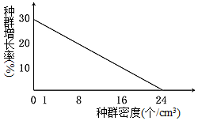

**山东省 2021 年普通高中学业水平等级考试生物试题**

**一、选择题**

1\. 高尔基体膜上的 RS 受体特异性识别并结合含有短肽序列 RS 的蛋白质，以出芽的形式形成囊泡，通过囊泡运输的方式将错误转运到高尔基体的该类蛋白运回内质网并释放。RS 受体与 RS 的结合能力随 pH 升高而减弱。下列说法错误的是（ ）

A. 消化酶和抗体不属于该类蛋白

B. 该类蛋白运回内质网的过程消耗 ATP

C. 高尔基体内 RS 受体所在区域的 pH 比内质网的 pH 高

D. RS 功能的缺失可能会使高尔基体内该类蛋白的含量增加

2\. 液泡是植物细胞中储存 Ca2+的主要细胞器，液泡膜上的 H+焦磷酸酶可利用水解无机焦磷酸释放的能量跨膜运输 H+，建立液泡膜两侧的 H+浓度梯度。该浓度梯度驱动 H+通过液泡膜上的载体蛋白 CAX 完成跨膜运输，从而使 Ca2+以与 H+相反的方向同时通过 CAX 进行进入液泡并储存。下列说法错误的是（ ）

A. Ca2+通过 CAX 的跨膜运输方式属于协助扩散

B. Ca2+通过 CAX 的运输有利于植物细胞保持坚挺

C. 加入 H+焦磷酸酶抑制剂，Ca2+通过 CAX 运输速率变慢

D. H+从细胞质基质转运到液泡的跨膜运输方式属于主动运输

3\. 细胞内分子伴侣可识别并结合含有短肽序列 KFERQ 的目标蛋白形成复合体，该复合体与溶酶体膜上的受体 L 结合后，目标蛋白进入溶酶体被降解。该过程可通过降解α-酮戊二酸合成酶，调控细胞内α-酮戊二酸的含量，从而促进胚胎干细胞分化。下列说法错误的是（ ）

A. α-酮戊二酸合成酶的降解产物可被细胞再利用

B. α-酮戊二酸含量升高不利于胚胎干细胞的分化

C. 抑制 L 基因表达可降低细胞内α-酮戊二酸的含量

D. 目标蛋白进入溶酶体的过程体现了生物膜具有物质运输的功能

4\. 我国考古学家利用现代人的 DNA 序列设计并合成了一种类似磁铁的“引子”，成功将极其微量的古人类 DNA 从提取自土壤沉积物中的多种生物的 DNA 中识别并分离出来，用于研究人类起源及进化。下列说法正确的是（ ）

A. “引子”彻底水解产物有两种

B. 设计“引子”的 DNA 序列信息只能来自核 DNA

C. 设计“引子”前不需要知道古人类的 DNA 序列

D. 土壤沉积物中的古人类双链 DNA 可直接与“引子”结合从而被识别

5\. 利用农杆菌转化法，将含有基因修饰系统的 T-DNA 插入到水稻细胞 M 的某条染色体上，在该修饰系统的作用下，一个 DNA 分子单链上的一个 C 脱去氨基变为 U，脱氨基过程在细胞 M 中只发生一次。将细胞 M 培育成植株 N。下列说法错误的是（ ）

A. N 的每一个细胞中都含有 T-DNA

B. N 自交，子一代中含 T-DNA 的植株占 3/4

C. M 经 n（n≥1）次有丝分裂后，脱氨基位点为 A-U 的细胞占 1/2n

D. M 经 3 次有丝分裂后，含T-DNA 且脱氨基位点为 A-T 的细胞占 1/2

6\. 果蝇星眼、圆眼由常染色体上的一对等位基因控制，星眼果蝇与圆眼果蝇杂交，子一代中星眼果蝇∶圆眼果蝇=1∶1，星眼果蝇与星眼果蝇杂交，子一代中星眼果蝇∶圆眼果蝇=2∶1。缺刻翅、正常翅由 X 染色体上的一对等位基因控制，且 Y染色体上不含有其等位基因，缺刻翅雌果蝇与正常翅雄果蝇杂交所得子一代中，缺刻翅雌果蝇∶正常翅雌果蝇=1∶1，雄果蝇均为正常翅。若星眼缺刻翅雌果蝇与星眼正常翅雄果蝇杂交得 F1，下列关于 F1的说法错误的是（ ）

A. 星眼缺刻翅果蝇与圆眼正常翅果蝇数量相等

B. 雌果蝇中纯合子所占比例为 1/6

C. 雌果蝇数量是雄果蝇的二倍

D. 缺刻翅基因的基因频率为 1/6

7\. 氨基酸脱氨基产生的氨经肝脏代谢转变为尿素，此过程发生障碍时，大量进入脑组织的氨与谷氨酸反应生成谷氨酰胺，谷氨酰胺含量增加可引起脑组织水肿、代谢障碍，患者会出现昏迷、膝跳反射明显增强等现象。下列说法错误的是（ ）

A. 兴奋经过膝跳反射神经中枢的时间比经过缩手反射神经中枢的时间短

B. 患者膝跳反射增强的原因是高级神经中枢对低级神经中枢的控制减弱

C. 静脉输入抗利尿激素类药物，可有效减轻脑组织水肿

D. 患者能进食后，应减少蛋白类食品摄入

8\. 体外实验研究发现，γ-氨基丁酸持续作用于胰岛 A 细胞，可诱导其转化为胰岛 B 细胞。下列说法错误的是（ ）

A. 胰岛 A 细胞转化为胰岛 B 细胞是基因选择性表达的结果

B. 胰岛 A 细胞合成胰高血糖素的能力随转化的进行而逐渐增强

C. 胰岛 B 细胞也具有转化为胰岛 A 细胞的潜能

D. 胰岛 B 细胞分泌的胰岛素经靶细胞接受并起作用后就被灭活

9\. 实验发现，物质甲可促进愈伤组织分化出丛芽；乙可解除种子休眠；丙浓度低时促进植株生长，浓度过高时抑制植株生长；丁可促进叶片衰老。上述物质分别是生长素、脱落酸、细胞分裂素和赤霉素四种中的一种。下列说法正确的是（ ）

A. 甲的合成部位是根冠、萎蔫的叶片

B. 乙可通过发酵获得

C. 成熟的果实中丙的作用增强

D. 夏季炎热条件下，丁可促进小麦种子发芽

10\. 某种螺可以捕食多种藻类，但捕食喜好不同。L、M 两玻璃缸中均加入相等数量的甲、乙、丙三种藻，L 中不放螺，M 中放入 100 只螺。一段时间后，将 M 中的螺全部移入 L 中，并开始统计 L、M 中的藻类数量，结果如图所示。实验期间螺数量不变，下列说法正确的是（ ）

A. 螺捕食藻类的喜好为甲藻＞乙藻＞丙藻

B. 三种藻竞争能力为乙藻＞甲藻＞丙藻

C. 图示 L 中使乙藻数量在峰值后下降的主要种间关系是竞争

D. 甲、乙、丙藻和螺构成一个微型的生态系统

11\. 调查一公顷范围内某种鼠的种群密度时，第一次捕获并标记 39 只鼠，第二次捕获 34 只鼠，其中有标记的鼠 15 只。标记物不影响鼠的生存和活动并可用于探测鼠的状态，若探测到第一次标记的鼠在重捕前有 5 只由于竞争、天敌等自然因素死亡，但因该段时间内有鼠出生而种群总数量稳定，则该区域该种鼠的实际种群密度最接近于（ ）（结果取整数）

A. 66 只/公顷

B. 77 只/公顷

C. 83 只/公顷

D. 88 只/公顷

12\. 葡萄酒的制作离不开酵母菌。下列说法错误的是（ ）

A. 无氧条件下酵母菌能存活但不能大量繁殖

B. 自然发酵制作葡萄酒时起主要作用菌是野生型酵母菌

C. 葡萄酒的颜色是葡萄皮中的色素进入发酵液形成的

D. 制作过程中随着发酵的进行发酵液中糖含量增加

13\. 粗提取 DNA 时，向鸡血细胞液中加入一定量的蒸馏水并搅拌，过滤后所得滤液进行下列处理后再进行过滤，在得到的滤液中加入特定试剂后容易提取出 DNA相对含量较高的白色丝状物的处理方式是（ ）

A. 加入适量的木瓜蛋白酶

B. 37～40℃的水浴箱中保温 10～15 分钟

C. 加入与滤液体积相等的、体积分数为 95%的冷却的酒精

D. 加入 NaCl 调节浓度至 2mol/L→过滤→调节滤液中 NaCl 浓度至 0．14mol/L

14\. 解脂菌能利用分泌脂肪酶将脂肪分解成甘油和脂肪酸并吸收利用。脂肪酸会使醇溶青琼脂平板变为深蓝色。将不能直接吸收脂肪的甲，乙两种菌分别等量接种在醇溶青琼脂平板上培养。甲菌菌落周围呈现深蓝色，乙菌菌落周围不变色，下列说法错误的是（ ）

A. 甲菌属于解脂菌

B. 实验中所用培养基以脂肪为唯一碳源

C. 可将两种菌分别接种在同一平板的不同区域进行对比

D. 该平板可用来比较解脂菌分泌脂肪酶的能力

15\. 一个抗原往往有多个不同的抗原决定簇，一个抗原决定簇只能刺激机体产生一种抗体，由同一抗原刺激产生的不同抗体统称为多抗。将非洲猪瘟病毒衣壳蛋白 p72 注入小鼠体内，可利用该小鼠的免疫细胞制备抗 p72 的单抗，也可以从该小鼠的血清中直接分离出多抗。下列说法正确的是（ ）

A. 注入小鼠体内的抗原纯度对单抗纯度的影响比对多抗纯度的影响大

B. 单抗制备过程中通常将分离出的浆细胞与骨髓瘤细胞融合

C. 利用该小鼠只能制备出一种抗 p72 的单抗

D. p72 部分结构改变后会出现原单抗失效而多抗仍有效的情况

**二、选择题**

16\. 关于细胞中的 H2O 和 O2，下列说法正确的是（ ）

A. 由葡萄糖合成糖原的过程中一定有 H2O 产生

B. 有氧呼吸第二阶段一定消耗 H2 O

C. 植物细胞产生的 O2 只能来自光合作用

D. 光合作用产生的 O2 中的氧元素只能来自于 H2O

17\. 小鼠 Y 染色体上的 S 基因决定雄性性别的发生，在 X 染色体上无等位基因，带有 S 基因的染色体片段可转接到 X 染色体上。已知配子形成不受 S 基因位置和数量的影响，染色体能正常联会、分离，产生的配子均具有受精能力；含 S 基因的受精卵均发育为雄性，不含 S 基因的均发育为雌性，但含有两个 Y 染色体的受精卵不发育。一个基因型为 XYS 的受精卵中的 S 基因丢失，由该受精卵发育成能产生可育雌配子的小鼠。若该小鼠与一只体细胞中含两条性染色体但基因型未知的雄鼠杂交得 F1，F1 小鼠雌雄间随机杂交得 F2，则 F2 小鼠中雌雄比例可能为（ ）

A. 4∶3

B. 3∶4

C. 8∶3

D. 7∶8

18\. 吞噬细胞内相应核酸受体能识别病毒的核酸组分，引起吞噬细胞产生干扰素。干扰素几乎能抵抗所有病毒引起的感染。下列说法错误的是（ ）

A. 吞噬细胞产生干扰素的过程属于特异性免疫

B. 吞噬细胞的溶酶体分解病毒与效应 T 细胞抵抗病毒的机制相同

C. 再次接触相同抗原时，吞噬细胞参与免疫反应的速度明显加快

D. 上述过程中吞噬细胞产生的干扰素属于免疫活性物质

19\. 种群增长率是出生率与死亡率之差，若某种水蚤种群密度与种群增长率的关系如图所示。下列相关说法错误的是（ ）

A. 水蚤的出生率随种群密度增加而降低

B. 水蚤种群密度为 1 个/cm3时，种群数量增长最快

C. 单位时间内水蚤种群的增加量随种群密度的增加而降低

D. 若在水蚤种群密度为 32 个/cm3时进行培养，其种群的增长率会为负值

20\. 含硫蛋白质在某些微生物的作用下产生硫化氢导致生活污水发臭。硫化氢可以与硫酸亚铁铵结合形成黑色沉淀。为探究发臭水体中甲、乙菌是否产生硫化氢及两种菌的运动能力，用穿刺接种的方法，分别将两种菌接种在含有硫酸亚铁铵的培养基上进行培养，如图所示。若两种菌繁殖速度相等，下列说法错误的是（ ）

A. 乙菌的运动能力比甲菌强

B. 为不影响菌的运动需选用液体培养基

C. 该实验不能比较出两种菌产生硫化氢的量

D. 穿刺接种等接种技术的核心是防止杂菌的污染

**三、非选择题**

21\. 光照条件下，叶肉细胞中 O2与 CO2 竞争性结合 C5，O2与 C5结合后经一系列反应释放 CO2的过程称为光呼吸。向水稻叶面喷施不同浓度的光呼吸抑制剂 S oBS 溶液，相应的光合作用强度和光呼吸强度见下表。光合作用强度用固定的 CO2量表示，SoBS 溶液处理对叶片呼吸作用的影响忽略不计。\

（1）光呼吸中 C5与 O2结合的反应发生在叶绿体的\_\_\_\_\_\_\_\_\_\_\_\_中。正常进行光合作用的水稻，突然停止光照，叶片 CO2释放量先增加后降低，CO2释放量增加的原因是\_\_\_。

（2）与未喷施 SoBS 溶液相比，喷施 100mg/L SoBS 溶液的水稻叶片吸收和放出CO2量相等时所需的光照强度\_\_\_\_\_\_\_\_(填：“高”或“低”)，据表分析，原因是\_\_\_\_。

（3）光呼吸会消耗光合作用过程中的有机物，农业生产中可通过适当抑制光呼吸以增加作物产量。为探究 SoBS 溶液利于增产的最适喷施浓度，据表分析，应在\_\_\_\_mg/L 之间再设置多个浓度梯度进一步进行实验。

22\. 番茄是雌雄同花植物，可自花受粉也可异花受粉。M、m 基因位于 2号染色体上，基因型为 mm 的植株只产生可育雌配子，表现为小花、雄性不育。基因型为 MM、Mm 的植株表现为大花、可育。R、r 基因位于 5 号染色体上，基因型为 RR、Rr、rr 的植株表现型分别为：正常成熟红果、晚熟红果、晚熟黄果。细菌中的 H 基因控制某种酶的合成，导入 H 基因的转基因番茄植株中，H 基因只在雄配子中表达，喷施萘乙酰胺（NAM）后含 H 基因的雄配子死亡。不考虑基因突变和交叉互换。

（1）基因型为 Mm 的植株连续自交两代，F2 中雄性不育植株所占的比例为\_\_\_\_\_\_\_\_\_\_\_\_。雄性不育植株与野生型植株杂交所得可育晚熟红果杂交种的基因型为\_\_\_\_\_\_\_\_，以该杂交种为亲本连续种植，若每代均随机受粉，则 F2 中可育晚熟红果植株所占比例为\_\_\_\_\_\_\_\_\_\_\_\_。

（2）已知 H 基因在每条染色体上最多插入 1 个且不影响其他基因。将 H 基因导入基因型为 Mm 的细胞并获得转基因植株甲和乙，植株甲和乙分别与雄性不育植株杂交，在形成配子时喷施 NAM，F1 均表现为雄性不育。若植株甲和乙的体细胞中含 1 个或多个 H 基因，则以上所得 F1 的体细胞中含有\_\_\_\_\_\_\_\_个 H 基因。若植株甲的体细胞中仅含 1个 H 基因，则 H 基因插入了\_\_\_\_\_\_\_\_所在的染色体上。若植株乙的体细胞中含 n 个 H 基因，则 H 基因在染色体上的分布必须满足的条件是\_\_\_\_\_\_\_\_，植株乙与雄性不育植株杂交，若不喷施 NAM，则子一代中不含 H 基因的雄性不育植株所占比例为\_\_\_\_\_\_\_\_\_\_\_\_。

（3）若植株甲的细胞中仅含一个 H 基因，在不喷施 NAM 的情况下，利用植株甲及非转基因植株通过一次杂交即可选育出与植株甲基因型相同的植株。请写出选育方案\_\_\_\_\_\_\_\_\_\_\_\_\_\_。

23\. 过度紧张、焦虑等刺激不仅会导致毛囊细胞数量减少引起脱发，也会导致黑色素细胞减少引起头发变白。利用黑色小鼠进行研究得出的相关调节机制如图所示。

（1）下丘脑通过垂体调节肾上腺分泌 G 的体液调节方式为\_\_\_\_\_\_\_\_\_\_\_\_。

（2）研究发现，NE 主要通过过程②影响 MesC，过程①作用很小。两过程中，NE作用于 Mesc 效果不同的原因可能是\_\_\_\_\_\_\_\_\_\_\_\_、\_\_\_\_\_\_\_\_\_\_\_\_、\_\_\_\_\_\_\_\_\_\_\_\_。（答出 3 种原因即可）

（3）已知长期束缚会引起小鼠过度紧张、焦虑。请设计实验验证上述调节机制中长期束缚及肾上腺对黑毛小鼠体毛的影响。

实验思路：\_\_\_\_\_\_\_\_。

实验现象：\_\_\_\_\_\_\_\_。

24\. 海水立体养殖中，表层养殖海带等大型藻类，海带下面挂笼养殖滤食小型浮游植物的牡蛎，底层养殖以底栖微藻、生物遗体残骸等为食的海参。某海水立体养殖生态系统的能量流动示意图如下，M、N 表示营养级。

（1）估算海参种群密度时常用样方法，原因是\_\_\_\_\_\_\_\_\_\_\_\_。

（2）图中 M 用于生长、发育和繁殖的能量为\_\_\_\_\_\_\_\_kJ/（m2•a）。由 M 到 N 的能量传递效率为\_\_\_\_\_\_\_\_%（保留一位小数），该生态系统中的能量\_\_\_\_\_\_\_\_（填：“能”或 “不能”）在 M 和遗体残骸间循环流动。

（3）养殖的海带数量过多，造成牡蛎减产，从生物群落的角度分析，原因是\_\_\_\_\_\_\_\_。

（4）海水立体养殖模式运用了群落的空间结构原理，依据这一原理进行海水立体养殖的优点是 \_\_\_\_\_\_\_\_\_ 。在构建海水立体养殖生态系统时，需考虑所养殖生物的环境容纳量、种间关系等因素，从而确定每种生物之间的合适比例，这样做的目的是 \_\_\_\_\_\_\_\_\_\_\_\_\_\_\_ 。

25\. 人类γ基因启动子上游的调控序列中含有 BCL11A 蛋白结合位点，该位点结合 BCL11A 蛋白后，γ基因的表达被抑制。通过改变该结合位点的序列，解除对γ基因表达的抑制，可对某种地中海贫血症进行基因治疗。科研人员扩增了γ基因上游不同长度的片段，将这些片段分别插入表达载体中进行转化和荧光检测，以确定 BCL11A 蛋白结合位点的具体位置。相关信息如图所示。

（1）为将扩增后的产物定向插入载体指导荧光蛋白基因表达，需在引物末端添加限制酶识别序列。据图可知，在 F1～F7末端添加的序列所对应的限制酶是\_\_\_\_，在 R 末端添加的序列所对应的限制酶是\_\_\_\_\_。本实验中，从产物扩增到载体构建完成的整个过程共需要\_\_\_\_种酶。

（2）将构建的载体导入除去 BCL11A 基因的受体细胞，成功转化后，含 F1～F6与 R 扩增产物的载体表达荧光蛋白，受体细胞有荧光，含 F7与 R 扩增产物的受体细胞无荧光。含 F7 与 R 扩增产物的受体细胞无荧光的原因是\_\_\_\_。

（3）向培养液中添加适量的雌激素，含 F1～F4与 R 扩增产物的受体细胞不再有荧光，而含 F5～F6与 R 扩增产物的受体细胞仍有荧光。若γ基因上游调控序列上与引物序列所对应的位置不含有 BCL11A 蛋白的结合位点序列，据此结果可推测，BCL11A 蛋白结合位点位于\_\_\_\_\_，理由是\_\_\_。
