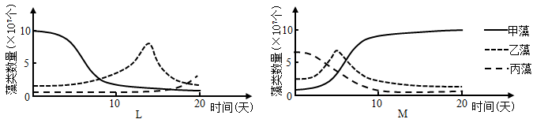
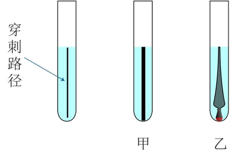
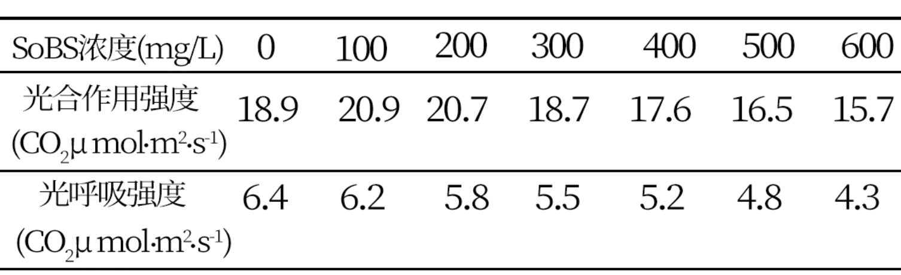
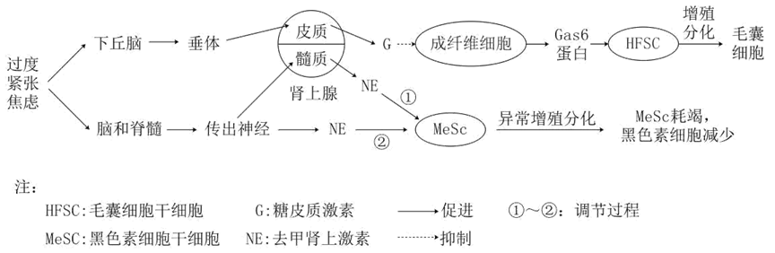
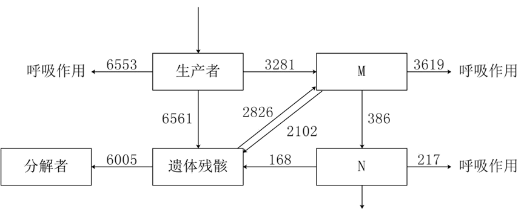
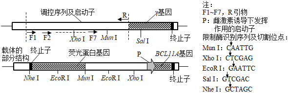

**山东省 2021 年普通高中学业水平等级考试生物试题**

**一、选择题**

1\. 高尔基体膜上的 RS 受体特异性识别并结合含有短肽序列 RS 的蛋白质，以出芽的形式形成囊泡，通过囊泡运输的方式将错误转运到高尔基体的该类蛋白运回内质网并释放。RS 受体与 RS 的结合能力随 pH 升高而减弱。下列说法错误的是（ ）

A. 消化酶和抗体不属于该类蛋白

B. 该类蛋白运回内质网的过程消耗 ATP

C. 高尔基体内 RS 受体所在区域的 pH 比内质网的 pH 高

D. RS 功能的缺失可能会使高尔基体内该类蛋白的含量增加

【答案】C

【解析】

【分析】根据题干信息“高尔基体膜上的 RS 受体特异性识别并结合含有短肽序列 RS 的蛋白质，以出芽的形式形成囊泡，通过囊泡运输的方式将错误转运到高尔基体的该类蛋白运回内质网并释放”，说明RS 受体和含有短肽序列 RS 的蛋白质结合，将其从高尔基体运回内质网。且 pH 升高结合的能力减弱。

【详解】A、根据题干信息可以得出结论，高尔基体产生的囊泡将错误转运至高尔基体的蛋白质运回内质网，即这些蛋白质不应该运输至高尔基体，而消化酶和抗体属于分泌蛋白，需要运输至高尔基体并发送至细胞外，所以消化酶和抗体不属于该类蛋白，A正确；

B、细胞通过囊泡运输需要消耗能量ATP，B正确；

C、根据题干信息“RS 受体特异性识别并结合含有短肽序列 RS 的蛋白质，RS 受体与 RS 的结合能力随 pH 升高而减弱”，如果高尔基体内 RS 受体所在区域的 pH 比内质网的 pH 高，则结合能力减弱，所以可以推测高尔基体内 RS 受体所在区域的 pH 比内质网的 pH 低，C错误；

D、通过题干可以得出结论“RS 受体特异性识别并结合含有短肽序列 RS 的蛋白质，通过囊泡运输的方式将错误转运到高尔基体的该类蛋白运回内质网并释放”，因此可以得出结论，如果RS 功能的缺失，则受体不能和错误的蛋白质结合，并运回内质网，因此能会使高尔基体内该类蛋白的含量增加，D正确。

故选C。

【点睛】

2\. 液泡是植物细胞中储存 Ca2+的主要细胞器，液泡膜上的 H+焦磷酸酶可利用水解无机焦磷酸释放的能量跨膜运输 H+，建立液泡膜两侧的 H+浓度梯度。该浓度梯度驱动 H+通过液泡膜上的载体蛋白 CAX 完成跨膜运输，从而使 Ca2+以与 H+相反的方向同时通过 CAX 进行进入液泡并储存。下列说法错误的是（ ）

A. Ca2+通过 CAX 的跨膜运输方式属于协助扩散

B. Ca2+通过 CAX 的运输有利于植物细胞保持坚挺

C. 加入 H+焦磷酸酶抑制剂，Ca2+通过 CAX 的运输速率变慢

D. H+从细胞质基质转运到液泡的跨膜运输方式属于主动运输

【答案】A

【解析】

【分析】由题干信息可知，H+通过液泡膜上的载体蛋白 CAX 完成跨膜运输进入细胞质基质为协助扩散，而 Ca2+通过 CAX 进行进入液泡并储存的方式为主动运输。

【详解】A、Ca2+通过 CAX 的跨膜运输方式为主动运输，所需要的能量由H+顺浓度梯度产生的势能提供，A错误；

B、Ca2+通过 CAX 的运输进入液泡增加细胞液的浓度，有利于植物细胞保持坚挺，B正确；

C、加入 H+焦磷酸酶抑制剂，则液泡中的H+浓度降低，液泡膜两侧的 H+浓度梯度差减小，为Ca2+通过 CAX 的运输提供的能量减少，C正确；

D、H+从细胞质基质转运到液泡的跨膜运输方式需要水解无机焦磷酸释放的能量来提供，为主动运输，D正确。

故选A。

【点睛】

3\. 细胞内分子伴侣可识别并结合含有短肽序列 KFERQ 的目标蛋白形成复合体，该复合体与溶酶体膜上的受体 L 结合后，目标蛋白进入溶酶体被降解。该过程可通过降解α-酮戊二酸合成酶，调控细胞内α-酮戊二酸的含量，从而促进胚胎干细胞分化。下列说法错误的是（ ）

A. α-酮戊二酸合成酶的降解产物可被细胞再利用

B. α-酮戊二酸含量升高不利于胚胎干细胞的分化

C. 抑制 L 基因表达可降低细胞内α-酮戊二酸的含量

D. 目标蛋白进入溶酶体的过程体现了生物膜具有物质运输的功能

【答案】C

【解析】

【分析】根据题干信息“该复合体与溶酶体膜上的受体 L 结合后，目标蛋白进入溶酶体被降解。该过程可通过降解α-酮戊二酸合成酶，调控细胞内α-酮戊二酸的含量，从而促进胚胎干细胞分化”，可以得出相应的过程，α-酮戊二酸合成酶先形成复合体，与受体L结合，进入溶酶体被降解，导致α-酮戊二酸含量降低，促进细胞分化。

【详解】A、α-酮戊二酸合成酶被溶酶体降解，所以其降解产物可被细胞再利用，A正确；

B、根据题干信息“该过程可通过降解α-酮戊二酸合成酶，调控细胞内α-酮戊二酸的含量，从而促进胚胎干细胞分化”，说明α-酮戊二酸含量降低促进细胞分化，而含量升高不利于胚胎干细胞的分化，B正确；

C、根据题干信息“该复合体与溶酶体膜上的受体 L 结合后，目标蛋白进入溶酶体被降解”，所以如果抑制 L 基因表达，则复合体不能与受体L结合，不利于降解α-酮戊二酸合成酶，细胞中α-酮戊二酸的含量会升高，C错误；

D、目标蛋白进入溶酶体的过程体现了生物膜具有物质运输的功能，D正确。

故选C。

【点睛】

4\. 我国考古学家利用现代人的 DNA 序列设计并合成了一种类似磁铁的“引子”，成功将极其微量的古人类 DNA 从提取自土壤沉积物中的多种生物的 DNA 中识别并分离出来，用于研究人类起源及进化。下列说法正确的是（ ）

A. “引子”的彻底水解产物有两种

B. 设计“引子”的 DNA 序列信息只能来自核 DNA

C. 设计“引子”前不需要知道古人类 DNA 序列

D. 土壤沉积物中的古人类双链 DNA 可直接与“引子”结合从而被识别

【答案】C

【解析】

【分析】根据题干信息“利用现代人的 DNA 序列设计并合成了一种类似磁铁的“引子”，成功将极其微量的古人类 DNA 从提取自土壤沉积物中的多种生物的 DNA 中识别并分离出来”，所以可以推测“因子”是一段单链DNA序列，根据碱基互补配对的原则去探测古人类DNA中是否有与该序列配对的碱基序列。

【详解】A、根据分析“引子”是一段DNA序列，彻底水解产物有磷酸、脱氧核糖和四种含氮碱基，共6种产物，A错误；

B、由于线粒体中也含有DNA，因此设计“引子”的 DNA 序列信息还可以来自线粒体DNA，B错误；

C、根据题干信息“利用现代人的 DNA 序列设计并合成了引子”，说明设计“引子”前不需要知道古人类的 DNA 序列，C正确；

D、土壤沉积物中的古人类双链 DNA 需要经过提取，且在体外经过加热解旋后，才能与“引子”结合，而不能直接与引子结合，D错误。

故选C。

【点睛】

5\. 利用农杆菌转化法，将含有基因修饰系统的 T-DNA 插入到水稻细胞 M 的某条染色体上，在该修饰系统的作用下，一个 DNA 分子单链上的一个 C 脱去氨基变为 U，脱氨基过程在细胞 M 中只发生一次。将细胞 M 培育成植株 N。下列说法错误的是（ ）

A. N 的每一个细胞中都含有 T-DNA

B. N 自交，子一代中含 T-DNA 的植株占 3/4

C. M 经 n（n≥1）次有丝分裂后，脱氨基位点为 A-U 的细胞占 1/2n

D. M 经 3 次有丝分裂后，含T-DNA 且脱氨基位点为 A-T 的细胞占 1/2

【答案】D

【解析】

【分析】根据题干信息“含有基因修饰系统的 T-DNA 插入到水稻细胞 M 的某条染色体上，在该修饰系统的作用下，一个 DNA 分子单链上的一个 C 脱去氨基变为 U，脱氨基过程在细胞 M 中只发生一次”，所以M细胞含有T-DNA，且该细胞的脱氨基位点由C-G对变为U-G对，DNA的复制方式是半保留复制，原料为脱氧核苷酸（A、T、C、G）。

【详解】A、N是由M细胞形成的，在形成过程中没有DNA的丢失，由于T-DNA 插入到水稻细胞 M 的某条染色体上，所以M细胞含有T-DNA，因此N的每一个细胞中都含有 T-DNA，A正确；

B、N植株的一条染色体中含有T-DNA，可以记为+，因此N植株关于是否含有T-DNA的基因型记为+-，如果自交，则子代中相关的基因型为++∶+-∶--=1∶2∶1，有 3/4的植株含 T-DNA ，B正确；

C、M中只有1个DNA分子上的单链上的一个 C 脱去氨基变为 U，所以复制n次后，产生的子细胞有2n个，但脱氨基位点为 A-U 的细胞的只有1个，所以这种细胞的比例为1/2n，C正确；

D、如果M 经 3 次有丝分裂后，形成子细胞有8个，由于M细胞 DNA 分子单链上的一个 C 脱去氨基变为 U，所以是G和U配对，所以复制三次后，有4个细胞脱氨基位点为C-G，3个细胞脱氨基位点为A-T，1个细胞脱氨基位点为U-A，因此含T-DNA 且脱氨基位点为 A-T 的细胞占 3/8，D错误。

故选D。

【点睛】

6\. 果蝇星眼、圆眼由常染色体上的一对等位基因控制，星眼果蝇与圆眼果蝇杂交，子一代中星眼果蝇∶圆眼果蝇=1∶1，星眼果蝇与星眼果蝇杂交，子一代中星眼果蝇∶圆眼果蝇=2∶1。缺刻翅、正常翅由 X 染色体上的一对等位基因控制，且 Y染色体上不含有其等位基因，缺刻翅雌果蝇与正常翅雄果蝇杂交所得子一代中，缺刻翅雌果蝇∶正常翅雌果蝇=1∶1，雄果蝇均为正常翅。若星眼缺刻翅雌果蝇与星眼正常翅雄果蝇杂交得 F1，下列关于 F1的说法错误的是（ ）

A. 星眼缺刻翅果蝇与圆眼正常翅果蝇数量相等

B. 雌果蝇中纯合子所占比例为 1/6

C. 雌果蝇数量是雄果蝇的二倍

D. 缺刻翅基因的基因频率为 1/6

【答案】D

【解析】

【分析】分析题意可知：果蝇星眼、圆眼由常染色体上的一对等位基因控制，星眼果蝇与圆眼果蝇杂交，子一代中星眼果蝇∶圆眼果蝇=1∶1，属于测交；星眼果蝇与星眼果蝇杂交，子一代中星眼果蝇∶圆眼果蝇=2∶1，则星眼为显性性状，且星眼基因纯合致死，假设相关基因用A、a表示。缺刻翅、正常翅由 X 染色体上的一对等位基因控制，且 Y染色体上不含有其等位基因，缺刻翅雌果蝇与正常翅雄果蝇杂交所得子一代中，缺刻翅雌果蝇∶正常翅雌果蝇=1∶1，雄果蝇均为正常翅，可知缺刻翅为显性性状，正常翅为隐性性状，且缺刻翅雄果蝇致死，假设相关基因用B、b表示，则雌蝇中没有基因型为XBXB的个体。

【详解】A、亲本星眼缺刻翅雌果蝇基因型为AaXBXb，星眼正常翅雄果蝇基因型为AaXbY，则F1中星眼缺刻翅果蝇（只有雌蝇，基因型为AaXBXb，比例为2/3×1/3=2/9）与圆眼正常翅果蝇（1/9aaXbXb、1/9aaXbY）数/量相等，A正确；

B、雌果蝇中纯合子基因型为aaXbXb，在雌果蝇中所占比例为1/3×1/2= 1/6，B正确；

C、由于缺刻翅雄果蝇致死，故雌果蝇数量是雄果蝇的2倍，C正确；

D、F1中XBXb∶XbXb∶XbY=1∶1∶1，则缺刻翅基因XB的基因频率为1/（2×2+1）= 1/5，D错误。

故选D。

7\. 氨基酸脱氨基产生的氨经肝脏代谢转变为尿素，此过程发生障碍时，大量进入脑组织的氨与谷氨酸反应生成谷氨酰胺，谷氨酰胺含量增加可引起脑组织水肿、代谢障碍，患者会出现昏迷、膝跳反射明显增强等现象。下列说法错误的是（ ）

A. 兴奋经过膝跳反射神经中枢的时间比经过缩手反射神经中枢的时间短

B. 患者膝跳反射增强的原因是高级神经中枢对低级神经中枢的控制减弱

C. 静脉输入抗利尿激素类药物，可有效减轻脑组织水肿

D. 患者能进食后，应减少蛋白类食品摄入

【答案】C

【解析】

【分析】反射活动是由反射弧完成的，如图所示反射弧包括感受器、传入神经、神经中枢、传出神经、效应器。膝跳反射和缩手反射都是非条件发射。

大脑皮层：调节机体活动的最高级中枢，对低级中枢有控制作用。

【详解】A、膝跳反射一共有2个神经元参与，缩手反射有3个神经元参与，膝跳反射的突触数目少，都是非条件反射，因此兴奋经过膝跳反射神经中枢的时间比经过缩手反射神经中枢的时间短，A正确；

B、患者由于谷氨酰胺增多，引起脑组织水肿、代谢障碍，所以应该是高级神经中枢对低级神经中枢的控制减弱，B正确；

C、抗利尿激素促进肾小管、集合管对水的重吸收，没有作用于脑组织，所以输入抗利尿激素类药物，不能减轻脑组织水肿，C错误；

D、如果患者摄入过多的蛋白质，其中的氨基酸脱氢产生的氨进入脑组织的氨与谷氨酸反应生成谷氨酰胺，加重病情，所以应减少蛋白类食品摄入，D正确。

故选C。

【点睛】

8\. 体外实验研究发现，γ-氨基丁酸持续作用于胰岛 A 细胞，可诱导其转化为胰岛 B 细胞。下列说法错误的是（ ）

A. 胰岛 A 细胞转化为胰岛 B 细胞是基因选择性表达的结果

B. 胰岛 A 细胞合成胰高血糖素的能力随转化的进行而逐渐增强

C. 胰岛 B 细胞也具有转化为胰岛 A 细胞的潜能

D. 胰岛 B 细胞分泌的胰岛素经靶细胞接受并起作用后就被灭活

【答案】B

【解析】

【分析】胰岛A细胞分泌胰高血糖素，胰岛B细胞分泌胰岛素，同一个体细胞的基因是相同的，但表达的基因不同。

【详解】A、同一个体胰岛 A 细胞和胰岛B细胞内的基因是相同的，只是表达的基因冉，因此转化为胰岛 B 细胞是γ-氨基丁酸诱导了相关的基因选择性表达的结果，A正确；

B、胰岛A细胞合成胰高血糖素，胰岛B细胞合成胰岛素，因此在转化过程中，合成胰高血糖素的能力逐渐减弱，B错误；

C、由于胰岛 A 细胞可以转化为胰岛 B 细胞，所以可以推测在合适的条件下，胰岛 B 细胞也具有转化为胰岛 A 细胞的潜能，C正确；

D、胰岛素是动物激素，经靶细胞接受并起作用后就被灭活，D正确。

故选B。

【点睛】

9\. 实验发现，物质甲可促进愈伤组织分化出丛芽；乙可解除种子休眠；丙浓度低时促进植株生长，浓度过高时抑制植株生长；丁可促进叶片衰老。上述物质分别是生长素、脱落酸、细胞分裂素和赤霉素四种中的一种。下列说法正确的是（ ）

A. 甲的合成部位是根冠、萎蔫的叶片

B. 乙可通过发酵获得

C. 成熟的果实中丙的作用增强

D. 夏季炎热条件下，丁可促进小麦种子发芽

【答案】B

【解析】

【分析】分析题意：物质甲可促进愈伤组织分化出丛芽，甲是细胞分裂素；乙可解除种子休眠，是赤霉素；丙浓度低时促进植株生长，浓度过高时抑制植株生长，是生长素；丁可促进叶片衰老，是脱落酸。

【详解】A、甲是细胞分裂素，合成部位主要是根尖，A错误；

B、乙是赤霉素，可通过某些微生物发酵获得，B正确；

C、丙是生长素，丁是脱落酸，成熟的果实中，丙的作用减弱，丁的作用增强，C错误；

D、乙是赤霉素，夏季炎热条件下，乙可促进小麦种子发芽，丁抑制发芽，D错误。

故选B。

10\. 某种螺可以捕食多种藻类，但捕食喜好不同。L、M 两玻璃缸中均加入相等数量的甲、乙、丙三种藻，L 中不放螺，M 中放入 100 只螺。一段时间后，将 M 中的螺全部移入 L 中，并开始统计 L、M 中的藻类数量，结果如图所示。实验期间螺数量不变，下列说法正确的是（ ）

A. 螺捕食藻类的喜好为甲藻＞乙藻＞丙藻

B. 三种藻的竞争能力为乙藻＞甲藻＞丙藻

C. 图示 L 中使乙藻数量在峰值后下降的主要种间关系是竞争

D. 甲、乙、丙藻和螺构成一个微型的生态系统

【答案】A

【解析】

【分析】题干分析，L玻璃缸不放螺，做空白对照，M中放入100只螺，则M中藻类数量变化如图所示为甲藻数量增加，乙藻和丙藻数量减少，甲藻成为优势物种。将M中的螺全部移入L中，随着时间的变化，甲藻数量减少，乙藻数量先升后降，丙藻数量慢慢上升，据此答题。

【详解】AB 、结合两图可知，在放入螺之前，甲藻数量多，乙藻数量其次，丙藻数量较少，放入螺之后，甲藻的数量减少明显，乙藻其次，丙藻数量增加，说明螺螺捕食藻类的喜好为甲藻＞乙藻＞丙藻，且三种藻的竞争能力为甲藻＞乙藻＞丙藻，A正确，B错误；

C、图示 L 中使乙藻数量在峰值后下降主要原因是引入了螺的捕食使数量下降，C错误；

D、生态系统是由该区域所有生物和生物所处的无机环境构成，甲、乙、丙藻只是该区域的部分生物，D错误。

故选A。

【点睛】

11\. 调查一公顷范围内某种鼠的种群密度时，第一次捕获并标记 39 只鼠，第二次捕获 34 只鼠，其中有标记的鼠 15 只。标记物不影响鼠的生存和活动并可用于探测鼠的状态，若探测到第一次标记的鼠在重捕前有 5 只由于竞争、天敌等自然因素死亡，但因该段时间内有鼠出生而种群总数量稳定，则该区域该种鼠的实际种群密度最接近于（ ）（结果取整数）

A. 66 只/公顷

B. 77 只/公顷

C. 83 只/公顷

D. 88 只/公顷

【答案】B

【解析】

【分析】标志重捕法在被调查种群活动范围内，捕获一部分个体，做上标记后再放回原来的环境，经过一段时间后进行重捕，根据重捕到的动物中标记个体数占总个体数的比例，来估计种群密度。

【详解】分析题意可知：调查一公顷范围内某种鼠的种群密度时，第一次捕获并标记 39 只鼠中有 5 只由于竞争、天敌等自然因素死亡，故可将第一次标记的鼠的数量视为39-5=34只，第二次捕获 34 只鼠，其中有标记的鼠 15 只，设该区域该种鼠的种群数量为X只，则根据计算公式可知，（39-5）/X=15/34，解得X≈77.07，面积为一公顷，故该区域该种鼠的实际种群密度最接近于77 只/公顷。B正确。

故选B。

12\. 葡萄酒的制作离不开酵母菌。下列说法错误的是（ ）

A. 无氧条件下酵母菌能存活但不能大量繁殖

B. 自然发酵制作葡萄酒时起主要作用的菌是野生型酵母菌

C. 葡萄酒颜色是葡萄皮中的色素进入发酵液形成的

D. 制作过程中随着发酵的进行发酵液中糖含量增加

【答案】D

【解析】

【分析】果酒制备的菌种是酵母菌，条件：温度18-25℃，先通气后密闭。通气阶段，酵母菌有氧呼吸获得能量大量繁殖，密闭阶段发酵产生酒精。pH最好是弱酸性。

【详解】A、酵母菌进行有氧呼吸获得能量大量繁殖，无氧条件下，发酵产生酒精，故无氧条件下酵母菌能进行无氧呼吸存活但不能大量繁殖，A正确；

B、自然发酵制作葡萄酒时起主要作用的菌是葡萄皮上的野生型酵母菌，B正确；

C、葡萄皮中的色素进入发酵液使葡萄酒呈现颜色，C正确；

D、制作过程中随着发酵的进行发酵液中糖含量减少，D错误。

故选D。

13\. 粗提取 DNA 时，向鸡血细胞液中加入一定量的蒸馏水并搅拌，过滤后所得滤液进行下列处理后再进行过滤，在得到的滤液中加入特定试剂后容易提取出 DNA相对含量较高的白色丝状物的处理方式是（ ）

A. 加入适量的木瓜蛋白酶

B. 37～40℃的水浴箱中保温 10～15 分钟

C. 加入与滤液体积相等的、体积分数为 95%的冷却的酒精

D. 加入 NaCl 调节浓度至 2mol/L→过滤→调节滤液中 NaCl 浓度至 0．14mol/L

【答案】A

【解析】

【分析】DNA粗提取和鉴定的原理：（1）DNA的溶解性：DNA和蛋白质等其他成分在不同浓度NaCl溶液中溶解度不同；DNA不溶于酒精溶液，但细胞中的某些蛋白质溶于酒精；DNA对酶、高温和洗涤剂的耐受性。（2）DNA的鉴定：在沸水浴的条件下，DNA遇二苯胺会被染成蓝色。

【详解】A、木瓜蛋白酶可以水解DNA中的蛋白质类杂质，由于酶具有专一性，不能水解DNA，过滤后在得到的滤液中加入特定试剂后容易提取出 DNA相对含量较高的白色丝状物，A正确；

B、37～40℃的水浴箱中保温 10～15 分钟不能去除滤液中的杂质，应该放在60~75℃的水浴箱中保温 10～15 分钟，使蛋白质变性析出，B错误；

C、向鸡血细胞液中加入一定量的蒸馏水并搅拌，过滤后在得到的滤液中加入与滤液体积相等的、体积分数为 95%的冷却的酒精，此时DNA析出，不会进入滤液中，C错误；

D、加入 NaCl 调节浓度至 2mol/L→过滤→调节滤液中 NaCl 浓度至 0．14mol/L，DNA在0．14mol/L的NaCl溶液中溶解度小，DNA析出，不会进入滤液中，D错误。

故选A。

【点睛】

14\. 解脂菌能利用分泌的脂肪酶将脂肪分解成甘油和脂肪酸并吸收利用。脂肪酸会使醇溶青琼脂平板变为深蓝色。将不能直接吸收脂肪的甲，乙两种菌分别等量接种在醇溶青琼脂平板上培养。甲菌菌落周围呈现深蓝色，乙菌菌落周围不变色，下列说法错误的是（ ）

A. 甲菌属于解脂菌

B. 实验中所用培养基以脂肪为唯一碳源

C. 可将两种菌分别接种在同一平板的不同区域进行对比

D. 该平板可用来比较解脂菌分泌脂肪酶的能力

【答案】B

【解析】

【分析】选择培养基：根据某种微生物的特殊营养要求或其对某化学、物理因素的抗性而设计的培养基使混合菌样中的劣势菌变成优势菌，从而提高该菌的筛选率。

鉴别培养基：依据微生物产生的某种代谢产物与培养基中特定试剂或化学药品反应，产生明显的特征变化而设计。

【详解】A、根据题干信息“甲菌菌落周围呈现深蓝色”，说明甲可以分泌脂肪酶将脂肪分解成甘油和脂肪酸，脂肪酸会使醇溶青琼脂平板变为深蓝色，因此甲菌属于解脂菌，A正确；

B、乙菌落周围没有出现深蓝色，说明乙菌落不能产生脂肪酶，不能利用脂肪为其供能，但乙菌落也可以在培养基上生存，说明该培养基不是以脂肪为唯一碳源，B错误；

C、可将两种菌分别接种在同一平板的不同区域进行对比，更加直观，C正确；

D、可以利用该平板可用来比较解脂菌分泌脂肪酶的能力，观察指标可以以菌落周围深蓝色圈的大小，D正确。

故选B。

【点睛】

15\. 一个抗原往往有多个不同的抗原决定簇，一个抗原决定簇只能刺激机体产生一种抗体，由同一抗原刺激产生的不同抗体统称为多抗。将非洲猪瘟病毒衣壳蛋白 p72 注入小鼠体内，可利用该小鼠的免疫细胞制备抗 p72 的单抗，也可以从该小鼠的血清中直接分离出多抗。下列说法正确的是（ ）

A. 注入小鼠体内的抗原纯度对单抗纯度的影响比对多抗纯度的影响大

B. 单抗制备过程中通常将分离出的浆细胞与骨髓瘤细胞融合

C. 利用该小鼠只能制备出一种抗 p72 的单抗

D. p72 部分结构改变后会出现原单抗失效而多抗仍有效的情况

【答案】D

【解析】

【分析】根据题干信息“一个抗原往往有多个不同的抗原决定簇，一个抗决定簇只能刺激机体产生一种抗体”，非洲猪瘟病毒衣壳蛋白 p72 上有多个抗原决定簇，所以可以刺激机体产生多种抗体。每个抗原决定簇刺激产生的抗体是单抗。

【详解】A、单抗的制作需要筛选，而多抗不需要筛选，抗原纯度越高，产生的多抗纯度越高，因此原纯度对单抗纯度的影响比对多抗纯度的影响小，A错误；

B、单抗制备过程中通常将分离出的B淋巴细胞与骨髓瘤细胞融合，B错误；

C、非洲猪瘟病毒衣壳蛋白 p72 上有多种抗原决定簇，一个抗决定簇只能刺激机体产生一种抗体，所以向小鼠体内注入p72 后，可以刺激小鼠产生多种抗p72的单抗，C错误；

D、p72 部分结构改变只改变了部分抗原决定簇，因此由这部分抗原决定簇产生的抗体失效，但由于还存在由其他抗原决定簇刺激机体产生的抗体，所以多抗仍有效，D正确。

故选D。

**二、选择题**

16\. 关于细胞中的 H2O 和 O2，下列说法正确的是（ ）

A. 由葡萄糖合成糖原的过程中一定有 H2O 产生

B. 有氧呼吸第二阶段一定消耗 H2 O

C. 植物细胞产生的 O2 只能来自光合作用

D. 光合作用产生的 O2 中的氧元素只能来自于 H2O

【答案】ABD

【解析】

【分析】有氧呼吸可以分为三个阶段：第一阶段：在细胞质的基质中：1分子葡萄糖被分解为2分子丙酮酸和少量的还原型氢，释放少量能量；第二阶段：在线粒体基质中进行，丙酮酸和水在线粒体基质中被彻底分解成二氧化碳和还原型氢；释放少量能量；第三阶段：在线粒体的内膜上，前两个阶段产生的还原型氢和氧气发生反应生成水并释放大量的能量。

光合作用的光反应阶段（场所是叶绿体的类囊体膜上）：水的光解产生\[H\]与氧气，以及ATP的形成；光合作用的暗反应阶段（场所是叶绿体的基质中）：CO2被C5固定形成C3，C3在光反应提供的ATP和\[H\]的作用下还原生成糖类等有机物。

【详解】A、葡萄糖是单糖，通过脱水缩合形成多糖的过程有水生成，A正确；

B、有氧呼吸第二阶段是丙酮酸和水反应生成CO2和\[H\]，所以一定消耗 H2O，B正确；

C、有些植物细胞含有过氧化氢酶（例如土豆），可以分解过氧化氢生成O2，因此植物细胞产生的 O2 不一定只来自光合作用，C错误；

D、光反应阶段水的分解产生氧气，故光合作用产生的 O2 中的氧元素只能来自于 H2O，D正确。

故选ABD。

点睛】

17\. 小鼠 Y 染色体上的 S 基因决定雄性性别的发生，在 X 染色体上无等位基因，带有 S 基因的染色体片段可转接到 X 染色体上。已知配子形成不受 S 基因位置和数量的影响，染色体能正常联会、分离，产生的配子均具有受精能力；含 S 基因的受精卵均发育为雄性，不含 S 基因的均发育为雌性，但含有两个 Y 染色体的受精卵不发育。一个基因型为 XYS 的受精卵中的 S 基因丢失，由该受精卵发育成能产生可育雌配子的小鼠。若该小鼠与一只体细胞中含两条性染色体但基因型未知的雄鼠杂交得 F1，F1 小鼠雌雄间随机杂交得 F2，则 F2 小鼠中雌雄比例可能为（ ）

A. 4∶3

B. 3∶4

C. 8∶3

D. 7∶8

【答案】ABD

【解析】

【分析】根据题干信息“，带有S基因的染色体片段可转接到 X 染色体上”，一个基因为 XYS 的受精卵中的 S 基因丢失，记为XY；

由该受精卵发育成能产生可育雌配子的小鼠，与一只体细胞中含两条性染色体但基因型未知的雄鼠杂交，则该雄鼠肯定含有S基因，且体细胞中有两条性染色体，所以其基因型只能是XYS，XSY，XSX，如果是两条性染色体都含S基因，则子代全为雄性，无法交配。

【详解】根据分析如果雄鼠的基因型是XYS，当其和该雌鼠XY杂交，由于YSY致死，所以F1中XX∶XY∶XYS=1∶1∶1，雌性∶雄性为2∶1，当F1杂交，雌性产生配子及比例3X∶1Y，雄性产生的配子1X∶1YS，随机交配后，3XX∶3XYS∶1XY∶1YSY（致死），所以雌性∶雄性=4∶3；

如果雄鼠的基因型是XSY，当其和该雌鼠XY杂交，F1中XSX∶XSY∶XY=1∶1∶1，雄性∶雌性=2∶1，雄性可以产生的配子及比例为1X∶2XS∶1Y，雌性产生的配子及比例1X∶1Y，随机结合后，1XX∶1XY∶2XSX∶2XSY∶1XY∶1YY，雌性∶雄性=3∶4。

如果雄鼠的基因型是XSX，当其和该雌鼠XY杂交，F1中XSX∶XSY∶XX∶XY=1∶1∶1∶1，雌性∶雄性=1∶1，随机交配，雌性产生的配子3X∶1Y，雄性产生的配子2XS∶1X∶1Y，随机结合后，6XSX∶2XSY∶3XX∶1XY∶3XY∶1YY（致死），雄性∶雌性=8∶7。

故选ABD。

18\. 吞噬细胞内相应核酸受体能识别病毒的核酸组分，引起吞噬细胞产生干扰素。干扰素几乎能抵抗所有病毒引起的感染。下列说法错误的是（ ）

A. 吞噬细胞产生干扰素的过程属于特异性免疫

B. 吞噬细胞的溶酶体分解病毒与效应 T 细胞抵抗病毒的机制相同

C. 再次接触相同抗原时，吞噬细胞参与免疫反应的速度明显加快

D. 上述过程中吞噬细胞产生的干扰素属于免疫活性物质

【答案】ABC

【解析】

【分析】人体的三道防线：第一道防线是由皮肤和黏膜构成的，他们不仅能够阻挡病原体侵入人体，而且它们的分泌物（如乳酸、脂肪酸、胃酸和酶等）还有杀菌的作用；

第二道防线是体液中的杀菌物质--溶菌酶和吞噬细胞；

第三道防线主要由免疫器官（扁桃体、淋巴结、胸腺、骨髓、和脾脏等）和免疫细胞（淋巴细胞、吞噬细胞等）借助血液循环和淋巴循环而组成的。

【详解】A、根据题干信息“干扰素几乎能抵抗所有病毒引起的感染”，说明吞噬细胞产生干扰素不具有特异性，属于非特异性免疫，A错误；

B、溶酶体分解病毒，是将大分子分解为小分子，而效应 T 细胞抵抗病毒的机制是效应T细胞将靶细胞裂解，使病毒失去藏身之所，B错误；

C、吞噬细胞对病毒的识别作用不具有特异性，所以再次接触相同抗原时，吞噬细胞参与免疫反应的速度不会加快，C错误；

D、干扰素是免疫细胞产生的具有免疫作用的物质，属于免疫活性物质，D正确。

故选ABC。

【点睛】

19\. 种群增长率是出生率与死亡率之差，若某种水蚤种群密度与种群增长率的关系如图所示。下列相关说法错误的是（ ）

A. 水蚤的出生率随种群密度增加而降低

B. 水蚤种群密度为 1 个/cm3时，种群数量增长最快

C. 单位时间内水蚤种群的增加量随种群密度的增加而降低

D. 若在水蚤种群密度为 32 个/cm3时进行培养，其种群的增长率会为负值

【答案】BC

【解析】

【分析】从图中可以看出随着种群密度的增加，种群增长率逐渐降低，当种群密度达到24个cm3 ，种群增长率为0，说明其数量达到最大。

【详解】A、随着种群密度的增加，种内斗争加剧，资源空间有限，所以出生率降低，A正确；

B、水蚤种群密度为 1 个/cm3 时，种群增长率最大，但由于种群数量少，所以此时不是种群数量增长最快的时刻，B错误；

C、单位时间内水蚤种群的增加量随种群密度的增加不一定降低，例如当种群密度为1cm3 ，增长率为30%，增长量为0.3，而当种群密度为8 个/cm3时，增长率大约20%，增长量为1.6，C错误；

D、从图中看出当种群密度达到24个cm3 ，种群增长率为0，说明其数量达到最大，可以推测当种群密度为 32 个/cm3 时，种内斗争进一步加剧，出生率将小于死亡率，增长率为负值，D正确。

故选BC。

【点睛】

20\. 含硫蛋白质在某些微生物的作用下产生硫化氢导致生活污水发臭。硫化氢可以与硫酸亚铁铵结合形成黑色沉淀。为探究发臭水体中甲、乙菌是否产生硫化氢及两种菌的运动能力，用穿刺接种的方法，分别将两种菌接种在含有硫酸亚铁铵的培养基上进行培养，如图所示。若两种菌繁殖速度相等，下列说法错误的是（ ）

A. 乙菌的运动能力比甲菌强

B. 为不影响菌的运动需选用液体培养基

C. 该实验不能比较出两种菌产生硫化氢的量

D. 穿刺接种等接种技术的核心是防止杂菌的污染

【答案】B

【解析】

【分析】图中是穿刺接种的方法，根据题干中的信息“硫化氢可以与硫酸亚铁铵结合形成黑色沉淀”，所以根据黑色沉淀的多少，比较两种菌产生硫化氢的能力。

【详解】A、从图中可以看出甲菌在试管中分布范围小于乙菌，说明了乙菌的运动能力比甲菌强，A正确；

B、为不影响菌的运动需选用半固体培养基，B错误；

C、该实验可以根据黑色沉淀的多少初步比较细菌产生硫化氢的能力，但不能测定产生硫化氢的量，C正确；

D、微生物接种技术的核心是防止杂菌的污染，D正确。

故选B。

【点睛】

**三、非选择题**

21\. 光照条件下，叶肉细胞中 O2与 CO2 竞争性结合 C5，O2与 C5结合后经一系列反应释放 CO2的过程称为光呼吸。向水稻叶面喷施不同浓度的光呼吸抑制剂 S oBS 溶液，相应的光合作用强度和光呼吸强度见下表。光合作用强度用固定的 CO2量表示，SoBS 溶液处理对叶片呼吸作用的影响忽略不计。\

（1）光呼吸中 C5与 O2结合的反应发生在叶绿体的\_\_\_\_\_\_\_\_\_\_\_\_中。正常进行光合作用的水稻，突然停止光照，叶片 CO2释放量先增加后降低，CO2释放量增加的原因是\_\_\_。

（2）与未喷施 SoBS 溶液相比，喷施 100mg/L SoBS 溶液的水稻叶片吸收和放出CO2量相等时所需的光照强度\_\_\_\_\_\_\_\_(填：“高”或“低”)，据表分析，原因是\_\_\_\_。

（3）光呼吸会消耗光合作用过程中的有机物，农业生产中可通过适当抑制光呼吸以增加作物产量。为探究 SoBS 溶液利于增产的最适喷施浓度，据表分析，应在\_\_\_\_mg/L 之间再设置多个浓度梯度进一步进行实验。

【答案】 ①. 基质 ②. 光照停止，产生的ATP、\[H\]减少，暗反应消耗的C5减少，C5与O2结合增加，产生的CO2增多 ③. 低 ④. 喷施 SoBS溶液后，光合作用固定的CO2增加，光呼吸释放的CO2减少，即叶片的CO2吸收量增加，释放量减少，此时，在更低的光照强度下，两者即可相等 ⑤. 100～300

【解析】

【分析】题意分析，光呼吸会抑制暗反应，光呼吸会产生CO2。向水稻叶面喷施不同浓度的光呼吸抑制剂 SoBS 溶液后由表格数据可知，光合作用的强度随着SoBS浓度的增加出现先增加后下降的现象。

【详解】（1）C5位于叶绿体基质中，则O2与C5结合发生的场所在叶绿体基质中。突然停止光照，则光反应产生的ATP、\[H\]减少，暗反应消耗的C5减少，C5与O2结合增加，产生的CO2增多。

（2）叶片吸收和放出CO2量相等时所需的光照强度即为光饱和点，与对照相比，喷施100mg/L SoBS溶液后，光合作用固定的CO2增加，光呼吸释放的CO2减少，即叶片的CO2吸收量增加，释放量减少，此时，在更低的光照强度下，两者即可相等。

（3）光呼吸会消耗有机物，但光呼吸会释放CO2，补充光合作用的原料，适当抑制光呼吸可以增加作物产量，由表可知，在 SoBS溶液浓度为200mg/L SoBS时光合作用强度与光呼吸强度差值最大，即光合产量最大，为了进一步探究最适喷施浓度，应在100～300mg/L之间再设置多个浓度梯度进一步进行实验。

【点睛】本题着重考查了光合作用的影响因素等方面的知识，意在考查考生能识记并理解所学知识的要点，把握知识间的内在联系，形成一定知识网络的能力，并且具有一定的分析能力和理解能力。

22\. 番茄是雌雄同花植物，可自花受粉也可异花受粉。M、m 基因位于 2号染色体上，基因型为 mm 的植株只产生可育雌配子，表现为小花、雄性不育。基因型为 MM、Mm 的植株表现为大花、可育。R、r 基因位于 5 号染色体上，基因型为 RR、Rr、rr 的植株表现型分别为：正常成熟红果、晚熟红果、晚熟黄果。细菌中的 H 基因控制某种酶的合成，导入 H 基因的转基因番茄植株中，H 基因只在雄配子中表达，喷施萘乙酰胺（NAM）后含 H 基因的雄配子死亡。不考虑基因突变和交叉互换。

（1）基因型为 Mm 的植株连续自交两代，F2 中雄性不育植株所占的比例为\_\_\_\_\_\_\_\_\_\_\_\_。雄性不育植株与野生型植株杂交所得可育晚熟红果杂交种的基因型为\_\_\_\_\_\_\_\_，以该杂交种为亲本连续种植，若每代均随机受粉，则 F2 中可育晚熟红果植株所占比例为\_\_\_\_\_\_\_\_\_\_\_\_。

（2）已知 H 基因在每条染色体上最多插入 1 个且不影响其他基因。将 H 基因导入基因型为 Mm 的细胞并获得转基因植株甲和乙，植株甲和乙分别与雄性不育植株杂交，在形成配子时喷施 NAM，F1 均表现为雄性不育。若植株甲和乙的体细胞中含 1 个或多个 H 基因，则以上所得 F1 的体细胞中含有\_\_\_\_\_\_\_\_个 H 基因。若植株甲的体细胞中仅含 1个 H 基因，则 H 基因插入了\_\_\_\_\_\_\_\_所在的染色体上。若植株乙的体细胞中含 n 个 H 基因，则 H 基因在染色体上的分布必须满足的条件是\_\_\_\_\_\_\_\_，植株乙与雄性不育植株杂交，若不喷施 NAM，则子一代中不含 H 基因的雄性不育植株所占比例为\_\_\_\_\_\_\_\_\_\_\_\_。

（3）若植株甲的细胞中仅含一个 H 基因，在不喷施 NAM 的情况下，利用植株甲及非转基因植株通过一次杂交即可选育出与植株甲基因型相同的植株。请写出选育方案\_\_\_\_\_\_\_\_\_\_\_\_\_\_。

【答案】 ①. 1/6 ②. MmRr ③. 5/12 ④. 0 ⑤. M基因 ⑥. 必须有1个H基因位于M所在染色体上，且2条同源染色体上不能同时存在H基因 ⑦. 1/2n ⑧. 以雄性不育植株为母本、植体甲为父本进行杂交，子代中大花植株即为所需植株（或：利用雄性不育株与植株甲杂交，子代中大花植株即为所需植株)

【解析】

【分析】分析题干信息：番茄是雌雄同花植物，可自花受粉也可异花受粉，即可自交亦可杂交。M、m 基因位于 2号染色体上，基因型为 mm 的植株只产生可育雌配子，表现为小花、雄性不育。基因型为 MM、Mm 的植株表现为大花、可育。R、r 基因位于 5 号染色体上，基因型为 RR、Rr、rr 的植株表现型分别为：正常成熟红果、晚熟红果、晚熟黄果，可知基因M、m 和R、r 位于非同源染色体上，遵循自由组合定律。细菌中的 H 基因控制某种酶的合成，导入 H 基因的转基因番茄植株中，H 基因只在雄配子中表达，喷施萘乙酰胺（NAM）后含H 基因的雄配子死亡。

【详解】（1）基因型为 Mm 的植株自交，F1中 MM∶Mm∶mm=1∶2∶1 ，其中 MM、Mm 的植株表现为大花、可育， mm 的植株只产生可育雌配子，故只有1/3 MM和2/3Mm能够自交，则F2 中雄性不育植株mm所占的比例为2/3×1/4=1/6。雄性不育植株mm与野生型植株杂交所得可育（Mm）晚熟红果（Rr）杂交种的基因型为MmRr，以该杂交种为亲本连续种植，若每代均随机受粉，即自由交配，两对等位基因自由组合，产生的配子有MR、Mr、mR、mr，比例为1∶1∶1∶1，则F1中有9种基因型，分别为：1MMRR、2MMRr、1MMrr、2MmRR、4MmRr、2Mmrr、1mmRR、2mmRr、1mmrr，雌配子种类及比例为：MR∶Mr∶mR∶mr=1∶1∶1∶1，，雄配子种类及比例为：MR∶Mr∶mR∶mr=2∶2∶1∶1，则 F2 中可育晚熟红果植株（基因型为M--Rr ）所占比例为 1/4×3/6+1/4×3/6+1/4×2/6+1/4×2/6=

10/24，即5/12。

（2）已知细菌中的 H 基因控制某种酶的合成，导入 H 基因的转基因番茄植株中，H 基因只在雄配子中表达，喷施萘乙酰胺（NAM）后含 H 基因的雄配子死亡。H 基因在每条染色体上最多插入 1 个且不影响其他基因。将 H 基因导入基因型为 Mm 的细胞，并获得转基因植株甲和乙，则 H 基因的可能位置有：插入了M基因所在的染色体上、插入了m基因所在的染色体上、插入了2号染色体以外的染色体上，植株甲和乙分别与雄性不育植株mm杂交，在形成配子时喷施 NAM，则含 H 基因的雄配子死亡，F1 均表现为雄性不育mm，说明含有M基因的雄配子死亡，即有H 基因插入了M基因所在的染色体上。若植株甲和乙的体细胞中含 1 个或多个 H 基因，以上所得F1 均表现为雄性不育，说明F1 的体细胞中含有0个 H 基因。若植株甲的体细胞中仅含 1个 H 基因，则 H 基因插入了M基因所在的染色体上，即H与M基因连锁。若植株乙的体细胞中含 n 个 H 基因，则 H 基因在染色体上的分布必须满足的条件是必须有1个H基因位于M所在染色体上，且2条同源染色体上不能同时存在H基因，植株乙与雄性不育植株杂交，若不喷施NAM，则子一代中不含 H 基因的雄性不育植株所占比例为1/2n。

（3）若植株甲的细胞中仅含一个 H 基因，且H 基因插入了M基因所在的染色体上，在不喷施 NAM 的情况下，以雄性不育植株mm为母本、植体甲HMm为父本进行杂交，雌配子种类为m，雄配子为HM、m，则子代中大花植株（基因型为HMm）即为与植株甲基因型相同的植株（或：利用雄性不育株与植株甲杂交，子代中大花植株即为所需植株)　。

【点睛】本题考查基因自由组合定律的相关知识，意在考查考生运用所学知识解决实际问题的能力，难度较大。

23\. 过度紧张、焦虑等刺激不仅会导致毛囊细胞数量减少引起脱发，也会导致黑色素细胞减少引起头发变白。利用黑色小鼠进行研究得出的相关调节机制如图所示。

（1）下丘脑通过垂体调节肾上腺分泌 G 的体液调节方式为\_\_\_\_\_\_\_\_\_\_\_\_。

（2）研究发现，NE 主要通过过程②影响 MesC，过程①作用很小。两过程中，NE作用于 Mesc 效果不同的原因可能是\_\_\_\_\_\_\_\_\_\_\_\_、\_\_\_\_\_\_\_\_\_\_\_\_、\_\_\_\_\_\_\_\_\_\_\_\_。（答出 3 种原因即可）

（3）已知长期束缚会引起小鼠过度紧张、焦虑。请设计实验验证上述调节机制中长期束缚及肾上腺对黑毛小鼠体毛的影响。

实验思路：\_\_\_\_\_\_\_\_。

实验现象：\_\_\_\_\_\_\_\_。

【答案】 ①. 分级调节 ②. 两过程NE的作用方式不同（或NE分别作为激素和神经递质起作用） ③. 两过程NE的浓度不同 ④. 两过程NE运输到MeSC的时间不同 ⑤. 取生理状况相同的黑色小鼠若干只，随机平均分为A、B、C、D四组，A组不作处理，B组切除肾上腺，C组束缚，D组切除肾上腺并束缚，其他条件相同且适宜，饲养一段时间后，观察并记录小鼠体毛数量（生长情况）和颜色的变化。 ⑥. A组小鼠的体毛无变化，B组小鼠的体毛增多，不变白，C组小鼠脱毛且变白，D组小鼠毛发增多（生长旺盛），变白

【解析】

【分析】题图分析，过度紧张焦虑刺激下丘脑分泌相应激素作用于垂体，垂体分泌相应激素作用于肾上腺皮质，使其分泌糖皮质激素抑制成纤维细胞，通过一系列途经最终分化出的毛囊细胞减少。与此同时，过度紧张焦虑会刺激脑和脊髓通过传出神经作用于肾上腺髓质分泌NE或传出神经分泌NE作用于MeSc，使其异常增殖分化，最终黑色素细胞减少，据此答题。

【详解】（1）由图可知，下丘脑分泌相应激素通过体液运输作用于垂体，使垂体分泌相应激素，在通过体液运输作用于肾上腺皮质，使其分泌糖皮质激素，这过程体现了激素分泌的分级调节。

（2）过程②为传出神经直接分泌NE作用于MeSC细胞，过程①是传出神经先作用于肾上腺髓质使其分泌NE再作用于MeSC细胞，这两种方式中过程②的作用效果大于过程①，这可能原因有两过程NE的作用方式不同，过程②中NE作为神经递质起作用，而过程①NE作为激素起作用，也可能是两过程NE的浓度不同或两过程NE运输到MeSC的时间不同，过程②中NE作用时间快，过程①中NE作用时间慢。

（3）观察黑色小鼠的体毛即观察是否变白以及是否脱发，由图可知，过度紧张和焦虑会导致黑色素细胞减少，引起头发变白和导致毛囊细胞数量减少，引起脱发。为了验证长期束缚及肾上腺对黑毛小鼠体毛的影响，可取生理状况相同的黑色小鼠若干只，随机平均分为A、B、C、D四组，A组不作处理，B组切除肾上腺，C组束缚，D组切除肾上腺并束缚，其他条件相同且适宜，饲养一段时间后，观察并记录小鼠体毛数量（生长情况）和颜色的变化。预期观察到的实验现象：A组小鼠的体毛无变化，B组小鼠的体毛增多，不变白，C组小鼠脱毛且变白，D组小鼠毛发增多（生长旺盛），变白。由此可见，长期束缚会引起小鼠过度紧张、焦虑导致脱发和白化现象，切除肾上腺有助于抑制脱毛的现象，但对白化减少影响不大。

【点睛】本题结合表格主要考查动物生命活动的调节实验，意在强化学生对动物激素的相关知识的理解与应用。

24\. 海水立体养殖中，表层养殖海带等大型藻类，海带下面挂笼养殖滤食小型浮游植物的牡蛎，底层养殖以底栖微藻、生物遗体残骸等为食的海参。某海水立体养殖生态系统的能量流动示意图如下，M、N 表示营养级。

（1）估算海参种群密度时常用样方法，原因是\_\_\_\_\_\_\_\_\_\_\_\_。

（2）图中 M 用于生长、发育和繁殖的能量为\_\_\_\_\_\_\_\_kJ/（m2•a）。由 M 到 N 的能量传递效率为\_\_\_\_\_\_\_\_%（保留一位小数），该生态系统中的能量\_\_\_\_\_\_\_\_（填：“能”或 “不能”）在 M 和遗体残骸间循环流动。

（3）养殖的海带数量过多，造成牡蛎减产，从生物群落的角度分析，原因是\_\_\_\_\_\_\_\_。

（4）海水立体养殖模式运用了群落的空间结构原理，依据这一原理进行海水立体养殖的优点是 \_\_\_\_\_\_\_\_\_ 。在构建海水立体养殖生态系统时，需考虑所养殖生物的环境容纳量、种间关系等因素，从而确定每种生物之间的合适比例，这样做的目的是 \_\_\_\_\_\_\_\_\_\_\_\_\_\_\_ 。

【答案】 ①. 海参活动能力弱，活动范围小 ②. 2488 ③. 6.3% ④. 不能 ⑤. 由于海带的竞争，浮游植物数量下降，牡蛎的食物减少，产量降低 ⑥. 能充分利用空间和资源 ⑦. 维持生态系统的稳定性，保持养殖产品的持续高产（实现生态效益和经济效益的可持续发展）

【解析】

【分析】群落的结构包括垂直结构和水平结构：

垂直结构：在垂直方向上，大多数群落（陆生群落、水生群落）具有明显的分层现象，植物主要受光照、温度等的影响，动物主要受食物的影响。

水平结构：由于不同地区的环境条件不同，即空间的非均一性，使不同地段往往分布着不同的种群，同一地段上种群密度也有差异，形成了生物在水平方向上的配置状况。

能量流动的过程：

①自身呼吸消耗、转化为其他形式的能量和热能；

②流向下一营养级；

③残体、粪便等被分解者分解；

④未被利用：包括生物每年的积累量，也包括动植物残体以化学燃料形式被储存起来的能量。

即一个营养级所同化的能量=呼吸消耗的能量+被下一营养级同化的能量+分解者利用的能量+未被利用的能量。

M同化的能量是3281+2826=6107，N同化的能量是386。

【详解】（1）海参由于活动范围小，活动能力弱，所以常用样方法测定种群密度。

（2）生长、发育和繁殖的能量=同化的能量-呼吸作用消耗的能量=3281+2826-3619=2488 kJ/（m2•a）；由 M到N的能量传递效率为386÷（3281+2826）≈6.3%，能量流动的方向是单向的不能循环。

（3）牡蛎以浮游植物为食，由于海带的竞争，浮游植物数量下降，牡蛎的食物减少，所以产量降低。

（4）海水立体养殖利用了群落结构的特点，优点是能充分利用空间和资源；由于空间和资源是有限的，所以在构建海水立体养殖生态系统时，需考虑所养殖生物的环境容纳量、种间关系等因素，从而确定每种生物之间的合适比例，维持生态系统的稳定性，保持养殖产品的持续高产。

【点睛】本题解答时需要考生识记种群密度的测定方法、群落结构的知识，根据图中数据掌握生态系统能量流动的过程和相关的计算，牢记能量流动是单向的，不能循环。

25\. 人类γ基因启动子上游调控序列中含有 BCL11A 蛋白结合位点，该位点结合 BCL11A 蛋白后，γ基因的表达被抑制。通过改变该结合位点的序列，解除对γ基因表达的抑制，可对某种地中海贫血症进行基因治疗。科研人员扩增了γ基因上游不同长度的片段，将这些片段分别插入表达载体中进行转化和荧光检测，以确定 BCL11A 蛋白结合位点的具体位置。相关信息如图所示。

（1）为将扩增后的产物定向插入载体指导荧光蛋白基因表达，需在引物末端添加限制酶识别序列。据图可知，在 F1～F7末端添加的序列所对应的限制酶是\_\_\_\_，在 R 末端添加的序列所对应的限制酶是\_\_\_\_\_。本实验中，从产物扩增到载体构建完成的整个过程共需要\_\_\_\_种酶。

（2）将构建的载体导入除去 BCL11A 基因的受体细胞，成功转化后，含 F1～F6与 R 扩增产物的载体表达荧光蛋白，受体细胞有荧光，含 F7与 R 扩增产物的受体细胞无荧光。含 F7 与 R 扩增产物的受体细胞无荧光的原因是\_\_\_\_。

（3）向培养液中添加适量的雌激素，含 F1～F4与 R 扩增产物的受体细胞不再有荧光，而含 F5～F6与 R 扩增产物的受体细胞仍有荧光。若γ基因上游调控序列上与引物序列所对应的位置不含有 BCL11A 蛋白的结合位点序列，据此结果可推测，BCL11A 蛋白结合位点位于\_\_\_\_\_，理由是\_\_\_。

【答案】 ①. SalI ②. EcoRI ③. 6 ④. F7与R扩增产物不含完整的启动子，荧光蛋白基因不表达 ⑤. 引物 F4 与 F5 在调控序列上所对应序列之间的区段上 ⑥. 根据有无荧光情况判断，F1～F4 与 R 扩增产物上均有结合位点，因此结合位点位于 F4 所对应调控序列的下游（右侧）；F5～F6 与 R 扩增产物上均无结合位点，可知结合位点位于 F5 所对应调控序列的上游（左侧），所以结合位点位于引物 F4 与 F5 在调控序列上所对应序列之间的区段上

【解析】

【分析】1、据题意可知，科研人员扩增了γ基因上游不同长度的片段，据图中注释可知，F1~F7以及R位置均为引物，故扩增的序列分别是引物F1和引物R之间的序列，引物F2和引物R之间的序列，引物F3和引物R之间的序列，引物F4和引物R之间的序列，引物F5和引物R之间的序列，引物F6和引物R之间的序列，引物F7和引物R之间的序列；

2、据图中对限制酶的注释可知，限制酶*Mun* Ⅰ 识别并切割后的黏性末端与限制酶*EcoR* Ⅰ 识别并切割后的黏性末端相同，限制酶*Xho* Ⅰ 识别并切割后的黏性末端与限制酶*Sal* Ⅰ 识别并切割后的黏性末端相同。

【详解】（1）据提意可知，需要将扩增后的产物定向插入并指导荧光蛋白基因的表达，则含有启动子P的扩增后的产物读取方向与荧光蛋白基因的读取方向一致，故扩增后的产物中的R端与荧光蛋白基因中限制酶*Mun* Ⅰ 识别序列端结合，才能保证扩增后的产物定向插入并指导荧光蛋白基因的表达。要做到定向插入，需要引物末端两端添加限制酶的识别序列，且被限制酶识别并切割后，两端的黏性末端不能相同。而扩增后的产物中可能含有*Mun* Ⅰ 和 *Xho* Ⅰ 的识别位点，故在引物末端添加限制酶的识别序列不能被限制酶*Mun* Ⅰ 和*Xho* Ⅰ 所识别，故应该选用添加限制酶*EcoR* Ⅰ 和限制酶*Sal* Ⅰ 识别序列，据图中对限制酶的注释可知，限制酶*Mun* Ⅰ 识别并切割后的黏性末端与限制酶*EcoR* Ⅰ 识别并切割后的黏性末端相同，故 R 末端添加的序列所对应的限制酶是*EcoR* Ⅰ ，在 F1～F7 末端添加的序列所对应的限制酶是*Sal* Ⅰ ；荧光蛋白基因中含有限制酶*EcoR* Ⅰ 的识别位点，故对载体使用限制酶*Mun* Ⅰ 和*Xho* Ⅰ 切割。综上所述，对载体使用限制酶*Mun* Ⅰ 和*Xho* Ⅰ 切割，对扩增后的产物用限制酶*EcoR* Ⅰ 和限制酶*Sal* Ⅰ 识别序列，然后在DNA连接酶的催化作用下，连接形成重组载体；产物扩增中需要使用*Taq*酶催化，合成更多的产物，故从产物扩增到载体构建完成的整个过程共需要6种酶，分别是*Taq*酶、限制酶*EcoR* Ⅰ 、限制酶*Sal* Ⅰ、限制酶*Mun* Ⅰ 、限制酶*Xho* Ⅰ 、DNA连接酶；

（2）受体细胞中已经除去 *BCL11A* 基因，故扩增产物中的 BCL11A 蛋白结合位点，不会抑制荧光蛋白基因的表达；基因的表达需要RNA聚合酶与启动子结合，才能完成荧光蛋白基因的转录过程；含 F1～F6与 R 扩增产物的载体表达荧光蛋白，受体细胞有荧光，含 F7 与 R 扩增产物的受体细胞无荧光，则可能是F7与R扩增产物不含完整的启动子，荧光蛋白基因不表达；

（3）向培养液中添加适量的雌激素，此时重组载体上的*BCL11A*基因表达，产生 BCL11A 蛋白， BCL11A 蛋白与BCL11A 蛋白结合位点结合后，导致荧光蛋白基因被抑制；含 F1～F4 与 R 扩增产物的受体细胞不再有荧光，则说明BCL11A 蛋白结合位点结合后在引物F4与引物R之间的序列上；含 F5～F6 与 R 扩增产物的受体细胞仍有荧光，则说明BCL11A 蛋白结合位点结合后在引物F5的上游序列，故据此结果可推测，BCL11A 蛋白结合位点位于引物 F4 与 F5 在调控序列上所对应序列之间的区段上。

【点睛】对基因工程中PCR技术的掌握，对基因工程的第二步，基因表达载体的构建的过程的分析，双酶切法的应用，限制酶的作用和切割特点，是解决本题的关键。
