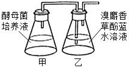
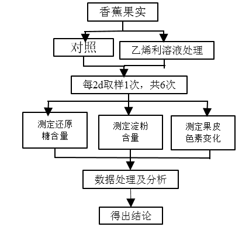
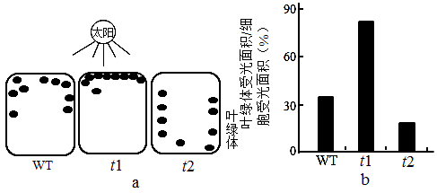
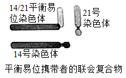
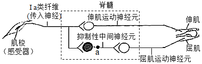
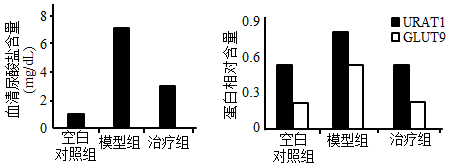
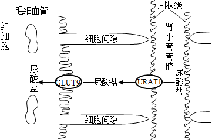
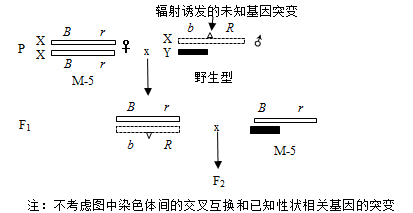
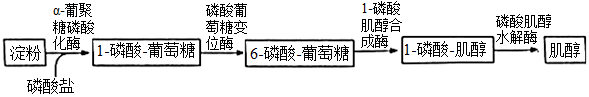

**2021年广东省普通高中学业水平选择性考试**

**生物学**

**一、选择题：**

1\. 我国新冠疫情防控已取得了举世瞩目的成绩，但全球疫情形势仍然严峻。为更有效地保护人民身体健康，我国政府正在大力实施全民免费接种新冠疫苗计划，充分体现了党和国家对人民的关爱。目前接种的新冠疫苗主要是灭活疫苗，下列叙述正确的是（ ）

①通过理化方法灭活病原体制成的疫苗安全可靠

②接种后抗原会迅速在机体的内环境中大量增殖

③接种后可以促进T细胞增殖分化产生体液免疫

④二次接种可提高机体对相应病原的免疫防卫功能

A. ①④ B. ①③ C. ②④ D. ②③

2\. “葛（葛藤）之覃兮，施与中谷（山谷），维叶萋萋。黄鸟于飞，集于灌木，其鸣喈喈”（节选自《诗经·葛覃》）。诗句中描写的美丽景象构成了一个（ ）

A. 黄鸟种群 B. 生物群落

C. 自然生态系统 D. 农业生态系统

3\. 近年来我国生态文明建设卓有成效，粤港澳大湾区的生态环境也持续改善。研究人员对该地区的水鸟进行研究，记录到146种水鸟，隶属9目21科，其中有国家级保护鸟类14种，近海与海岸带湿地、城市水域都是水鸟的主要栖息地。该调查结果直接体现了生物多样性中的（ ）

A. 基因多样性和物种多样性

B. 种群多样性和物种多样性

C. 物种多样性和生态系统多样性

D. 基因多样性和生态系统多样性

4\. 研究表明，激活某种蛋白激酶PKR，可诱导被病毒感染的细胞发生凋亡。下列叙述正确的是（ ）

A. 上述病毒感染的细胞凋亡后其功能可恢复

B. 上述病毒感染细胞的凋亡不是程序性死亡

C. 上述病毒感染细胞的凋亡过程不受基因控制

D. PKR激活剂可作为潜在的抗病毒药物加以研究

5\. DNA双螺旋结构模型的提出是二十世纪自然科学的伟大成就之一。下列研究成果中，为该模型构建提供主要依据的是（ ）

①赫尔希和蔡斯证明DNA是遗传物质的实验

②富兰克林等拍摄的DNA分子X射线衍射图谱

③查哥夫发现的DNA中嘌呤含量与嘧啶含量相等

④沃森和克里克提出的DNA半保留复制机制

A. ①② B. ②③ C. ③④ D. ①④

6\. 图示某S形增长种群出生率和死亡率与种群数量的关系。当种群达到环境容纳量（*K*值）时，其对应的种群数量是（ ）

A. a B. b C. c D. d

7\. 金霉素（一种抗生素）可抑制tRNA与mRNA的结合，该作用直接影响的过程是（ ）

A. DNA复制 B. 转录 C. 翻译 D. 逆转录

8\. 兔的脂肪白色（*F*）对淡黄色（*f* ）为显性，由常染色体上一对等位基因控制。某兔群由500只纯合白色脂肪兔和1500只淡黄色脂肪兔组成，*F*、*f* 的基因频率分别是（ ）

A. 15%、85% B. 25%、75%

C. 35%、65% D. 45%、55%

9\. 秸杆的纤维素经酶水解后可作为生产生物燃料乙醇的原料。生物兴趣小组利用自制的纤维素水解液（含5%葡萄糖）培养酵母菌并探究其细胞呼吸（如图）。下列叙述正确的是（ ）

A. 培养开始时向甲瓶中加入重铬酸钾以便检测乙醇生成

B. 乙瓶的溶液由蓝色变成红色，表明酵母菌已产生了CO2

C. 用甲基绿溶液染色后可观察到酵母菌中线粒体的分布

D. 实验中增加甲瓶的酵母菌数量不能提高乙醇最大产量

10\. 孔雀鱼雄鱼的鱼身具有艳丽的斑点，斑点数量多的雄鱼有更多机会繁殖后代，但也容易受到天敌的捕食。关于种群中雄鱼的平均斑点数量，下列推测错误的是（ ）

A. 缺少天敌，斑点数量可能会增多

B. 引入天敌，斑点数量可能会减少

C. 天敌存在与否决定斑点数量相关基因的变异方向

D. 自然环境中，斑点数量增减对雄鱼既有利也有弊

11\. 白菜型油菜（2n=20）的种子可以榨取食用油（菜籽油）。为了培育高产新品种，科学家诱导该油菜未受精的卵细胞发育形成完整植株Bc。下列叙述错误的是（ ）

A Bc成熟叶肉细胞中含有两个染色体组

B. 将Bc作为育种材料，能缩短育种年限

C. 秋水仙素处理Bc幼苗可以培育出纯合植株

D. 自然状态下Bc因配子发育异常而高度不育

12\. 在高等植物光合作用的卡尔文循环中，唯一催化CO2固定形成C3的酶被称为Rubisco。下列叙述正确的是（ ）

A. Rubisco存在于细胞质基质中

B. 激活Rubisco需要黑暗条件

C. Rubisco催化CO2固定需要ATP

D. Rubisco催化C5和CO2结合

13\. 保卫细胞吸水膨胀使植物气孔张开。适宜条件下，制作紫鸭跖草叶片下表皮临时装片，观察蔗糖溶液对气孔开闭的影响，图为操作及观察结果示意图。下列叙述错误的是（ ）

A. 比较保卫细胞细胞液浓度，③处理后\>①处理后

B. 质壁分离现象最可能出现在滴加②后的观察视野中

C. 滴加③后有较多水分子进入保卫细胞

D. 推测3种蔗糖溶液浓度高低为②\>①\>③

14\. 乙烯可促进香焦果皮逐渐变黄、果肉逐渐变甜变软的成熟过程。同学们去香蕉种植合作社开展研学活动，以乙烯利溶液为处理剂，研究乙烯对香蕉的催熟过程，设计的技术路线如图。下列分析正确的是（ ）

A. 对照组香蕉果实的成熟不会受到乙烯影响

B. 实验材料应选择已经开始成熟的香蕉果实

C. 根据实验安排第6次取样的时间为第10天

D. 处理组3个指标的总体变化趋势基本一致

15\. 与野生型拟南芥WT相比，突变体*t1*和*t2*在正常光照条件下，叶绿体在叶肉细胞中的分布及位置不同（图a，示意图），造成叶绿体相对受光面积的不同（图b），进而引起光合速率差异，但叶绿素含量及其它性状基本一致。在不考虑叶绿体运动的前提下，下列叙述错误的是（ ）

A. *t2*比*t1*具有更高的光饱和点（光合速率不再随光强增加而增加时的光照强度）

B. *t1*比*t2*具有更低的光补偿点（光合吸收CO2与呼吸释放CO2等量时的光照强度）

C. 三者光合速率高低与叶绿素的含量无关

D. 三者光合速率的差异随光照强度的增加而变大

16\. 人类（2n=46）14号与21号染色体二者的长臂在着丝点处融合形成14/21平衡易位染色体，该染色体携带者具有正常的表现型，但在产生生殖细胞的过程中，其细胞中形成复杂的联会复合物（如图），在进行减数分裂时，若该联会复合物的染色体遵循正常的染色体行为规律（不考虑交叉互换），下列关于平衡易位染色体携带者的叙述，错误的是（ ）

A. 观察平衡易位染色体也可选择有丝分裂中期细胞

B. 男性携带者的初级精母细胞含有45条染色体

C. 女性携带者的卵子最多含24种形态不同的染色体

D. 女性携带者的卵子可能有6种类型（只考虑图中的3种染色体）

**二、非选择题：**

**（一）必考题：**

17\. 为积极应对全球气候变化，我国政府在2020年的联合国大会上宣布，中国于2030年前确保碳达峰（CO2排放量达到峰值），力争在2060年前实现碳中和（CO2排放量与减少量相等），这是中国向全世界的郑重承诺，彰显了大国责任。回答下列问题：

（1）在自然生态系统中，植物等从大气中摄取碳的速率与生物的呼吸作用和分解作用释放碳的速率大致相等，可以自我维持\_\_\_\_\_\_\_\_\_\_\_。自西方工业革命以来，大气中CO2的浓度持续增加，引起全球气候变暖，导致的生态后果主要是\_\_\_\_\_\_\_\_\_\_\_。

（2）生态系统中的生产者、消费者和分解者获取碳元素的方式分别是\_\_\_\_\_\_\_\_\_\_\_，消费者通过食物网（链）取食利用，\_\_\_\_\_\_\_\_\_\_\_。

（3）全球变暖是当今国际社会共同面临的重大问题，从全球碳循环的主要途径来看，减少\_\_\_\_\_\_\_\_\_\_\_和增加\_\_\_\_\_\_\_\_\_\_\_是实现碳达峰和碳中和的重要举措。

18\. 太极拳是我国传统运动项目，其刚柔并济、行云流水般的动作是通过神经系统对肢体和躯干各肌群的精巧调控及各肌群间相互协调而完成。如“白鹤亮翅”招式中的伸肘动作，伸肌收缩的同时屈肌舒张。图为伸肘动作在脊髓水平反射弧基本结构的示意图。

回答下列问题：

（1）图中反射弧的效应器是\_\_\_\_\_\_\_\_\_\_\_及其相应的运动神经末梢。若肌梭受到适宜刺激，兴奋传至a处时，a处膜内外电位应表现为\_\_\_\_\_\_\_\_\_\_\_。

（2）伸肘时，图中抑制性中间神经元的作用是\_\_\_\_\_\_\_\_\_\_\_，使屈肌舒张。

（3）适量运动有益健康。一些研究认为太极拳等运动可提高肌细胞对胰岛素的敏感性，在胰岛素水平相同的情况下，该激素能更好地促进肌细跑\_\_\_\_\_\_\_\_\_\_\_，降低血糖浓度。

（4）有研究报道，常年坚持太极拳运动的老年人，其血清中TSH、甲状腺激素等的浓度升高，因而认为运动能改善老年人的内分泌功能，其中TSH水平可以作为评估\_\_\_\_\_\_\_\_\_\_\_（填分泌该激素的腺体名称）功能的指标之一。

19\. 人体缺乏尿酸氧化酶，导致体内嘌呤分解代谢的终产物是尿酸（存在形式为尿酸盐）。尿酸盐经肾小球滤过后，部分被肾小管细胞膜上具有尿酸盐转运功能的蛋白URAT1和GLUT9重吸收，最终回到血液。尿酸盐重吸收过量会导致高尿酸血症或痛风。目前，E是针对上述蛋白治疗高尿酸血症或痛风的常用临床药物。为研发新的药物，研究人员对天然化合物F的降尿酸作用进行了研究。给正常实验大鼠（有尿酸氧化酶）灌服尿酸氧化酶抑制剂，获得了若干只高尿酸血症大鼠，并将其随机分成数量相等的两组，一组设为模型组，另一组灌服F设为治疗组，一段时间后检测相关指标，结果见图。

回答下列问题：

（1）与分泌蛋白相似，URAT1和GLUT9在细胞内的合成、加工和转运过程需要\_\_\_\_\_\_\_\_\_\_\_及线粒体等细胞器（答出两种即可）共同参与。肾小管细胞通过上述蛋白重吸收——尿酸盐，体现了细胞膜具有\_\_\_\_\_\_\_\_\_\_\_的边能特性。原尿中还有许多物质也需借助载体蛋白通过肾小管的细胞膜，这类跨膜运输的具体方式有\_\_\_\_\_\_\_\_\_\_\_。

（2）URAT1分布于肾小管细胞刷状缘（下图示意图），该结构有利于尿酸盐的重吸收，原因是\_\_\_\_\_\_\_\_\_\_\_。

（3）与空白对照组（灌服生理盐水的正常实验大鼠）相比，模型组的自变量是\_\_\_\_\_\_\_\_\_\_\_。与其它两组比较，设置模型组的目的是\_\_\_\_\_\_\_\_\_\_\_。

（4）根据尿酸盐转运蛋白检测结果，推测F降低治疗组大鼠血清尿酸盐含量的原因可能是\_\_\_\_\_\_\_\_\_\_\_，减少尿酸盐重吸收，为进一步评价F的作用效果，本实验需要增设对照组，具体为\_\_\_\_\_\_\_\_\_\_\_。

20\. 果蝇众多的突变品系为研究基因与性状的关系提供了重要的材料。摩尔根等人选育出M-5品系并创立了基于该品系的突变检测技术，可通过观察F1和F2代的性状及比例，检测出未知基因突变的类型（如显/隐性、是否致死等），确定该突变基因与可见性状的关系及其所在的染色体。回答下列问题：

（1）果蝇的棒眼（*B*）对圆眼（*b*）为显性、红眼（*R*）对杏红眼（*r*）为显性，控制这2对相对性状的基因均位于X染色体上，其遗传总是和性别相关联，这种现象称为\_\_\_\_\_\_\_\_\_\_\_。

（2）图示基于M-5品系的突变检测技术路线，在F1代中挑出1只雌蝇，与1只M-5雄蝇交配，若得到的F2代没有野生型雄蝇。雌蝇数目是雄蝇的两倍，F2代中雌蝇的两种表现型分别是棒眼杏红眼和\_\_\_\_\_\_\_\_\_\_\_，此结果说明诱变产生了伴X染色体\_\_\_\_\_\_\_\_\_\_\_基因突变。该突变的基因保存在表现型为\_\_\_\_\_\_\_\_\_\_\_果蝇的细胞内。

（3）上述突变基因可能对应图中的突变\_\_\_\_\_\_\_\_\_\_\_（从突变①、②、③中选一项），分析其原因可能是\_\_\_\_\_\_\_\_\_\_\_，使胚胎死亡。

<table>
<colgroup>
<col style="width: 19%" />
<col style="width: 46%" />
<col style="width: 33%" />
</colgroup>
<tbody>
<tr>
<td style="text-align: left;">密码子序号</td>
<td style="text-align: left;">1 … 4 … 19 20 … 540</td>
<td style="text-align: left;">密码子表（部分）：</td>
</tr>
<tr>
<td colspan="2" style="text-align: left;">
正常核苷酸序列 AUG…AAC…ACU UUA…UAG

突变①↓

突变后核苷酸序列 AUG…AAC…ACC UUA…UAG
</td>
<td style="text-align: left;">
AUG：甲硫氨酸，起始密码子

AAC：天冬酰胺
</td>
</tr>
<tr>
<td colspan="2" style="text-align: left;">
正常核苷酸序列 AUG…AAC…ACU UUA…UAG

突变②↓

突变后核苷酸序列 AUG…AAA…ACU UUA…UAG
</td>
<td style="text-align: left;">
ACU、ACC：苏氨酸

UUA：亮氨酸
</td>
</tr>
<tr>
<td colspan="2" style="text-align: left;">
正常核苷酸序列 AUG…AAC…ACU UUA…UAG

突变③ ↓

突变后核苷酸序列 AUG…AAC…ACU UGA…UAG
</td>
<td style="text-align: left;">
AAA：赖氨酸

UAG、UGA：终止密码子

…表示省略的、没有变化的碱基
</td>
</tr>
</tbody>
</table>

（4）图所示的突变检测技术，具有的①优点是除能检测上述基因突变外，还能检测出果蝇\_\_\_\_\_\_\_\_\_\_\_基因突变；②缺点是不能检测出果蝇\_\_\_\_\_\_\_\_\_\_\_基因突变。（①、②选答1项，且仅答1点即可）

**（二）选考题：**

**\[选修1：生物技术实践\]**

21\. 中国科学家运用合成生物学方法构建了一株嗜盐单胞菌H，以糖蜜（甘蔗榨糖后的废弃液，含较多蔗糖）为原料，在实验室发酵生产PHA等新型高附加值可降解材料，期望提高甘蔗的整体利用价值。工艺流程如图。

回答下列问题：

（1）为提高菌株H对蔗糖的耐受能力和利用效率，可在液体培养基中将蔗糖作为\_\_\_\_\_\_\_\_\_\_\_，并不断提高其浓度，经多次传代培养（指培养一段时间后，将部分培养物转入新配的培养基中继续培养）以获得目标菌株。培养过程中定期取样并用\_\_\_\_\_\_\_\_\_\_\_的方法进行菌落计数，评估菌株增殖状况。此外，选育优良菌株的方法还有\_\_\_\_\_\_\_\_\_\_\_等。（答出两种方法即可）

（2）基于菌株H嗜盐、酸碱耐受能力强等特性，研究人员设计了一种不需要灭菌的发酵系统，其培养基盐浓度设为60g/L，pH为10，菌株H可正常持续发酵60d以上。该系统不需要灭菌的原因是\_\_\_\_\_\_\_\_\_\_\_。（答出两点即可）

（3）研究人员在工厂进行扩大培养，在适宜的营养物浓度、温度、pH条件下发酵，结果发现发酵液中菌株H细胞增殖和PHA产量均未达到预期，并产生了少量乙醇等物质，说明发酵条件中\_\_\_\_\_\_\_\_\_\_\_可能是高密度培养的限制因素。

（4）菌株H还能通过分解餐厨垃圾（主要含蛋白质、淀粉、油脂等）来生产PHA，说明其能分泌\_\_\_\_\_\_\_\_\_\_\_。

**\[选修3：现代生物科技专题\]**

22\. 非细胞合成技术是一种运用合成生物学方法，在细胞外构建多酶催化体系，获得目标产物的新技术，其核心是各种酶基因的挖掘、表达等。中国科学家设计了4步酶促反应的非细胞合成路线（如图），可直接用淀粉生产肌醇（重要的医药食品原料），以期解决高温强酸水解方法造成的严重污染问题，并可以提高产率。

回答下列问题：

（1）研究人员采用PCR技术从土壤微生物基因组中扩增得到目标酶基因。此外，获得酶基因的方法还有\_\_\_\_\_\_\_\_\_\_\_。（答出两种即可）

（2）高质量的DNA模板是成功扩增出目的基因的前提条件之一。在制备高质量DNA模板时必须除去蛋白，方法有\_\_\_\_\_\_\_\_\_\_\_。（答出两种即可）

（3）研究人员使用大肠杆菌BL21作为受体细胞、pET20b为表达载体分别进行4种酶表达。表达载体转化大肠杆菌时，首先应制备\_\_\_\_\_\_\_\_\_\_\_细胞。为了检测目的基因是否成功表达出酶蛋白，需要采用的方法有\_\_\_\_\_\_\_\_\_\_\_。

（4）依图所示流程，在一定的温度、pH等条件下，将4种酶与可溶性淀粉溶液混合组成一个反应体系。若这些酶最适反应条件不同，可能导致的结果是\_\_\_\_\_\_\_\_\_\_\_。在分子水平上，可以通过改变\_\_\_\_\_\_\_\_\_\_\_，从而改变蛋白质的结构，实现对酶特性的改造和优化。
