**2021年广东省普通高中学业水平选择性考试**

**生物学**

**一、选择题：**

1\. 我国新冠疫情防控已取得了举世瞩目的成绩，但全球疫情形势仍然严峻。为更有效地保护人民身体健康，我国政府正在大力实施全民免费接种新冠疫苗计划，充分体现了党和国家对人民的关爱。目前接种的新冠疫苗主要是灭活疫苗，下列叙述正确的是（ ）

①通过理化方法灭活病原体制成疫苗安全可靠

②接种后抗原会迅速在机体的内环境中大量增殖

③接种后可以促进T细胞增殖分化产生体液免疫

④二次接种可提高机体对相应病原的免疫防卫功能

A. ①④ B. ①③ C. ②④ D. ②③

【答案】A

【解析】

【分析】1、制取新冠病毒灭活疫苗是对新冠病毒进行特殊处理，使其内部遗传物质（核酸）失活，但病毒的蛋白质外壳仍然完整，从而保持免疫原性。

2、体液免疫的过程：

（1）感应阶段：除少数抗原可以直接刺激B细胞外，大多数抗原被吞噬细胞摄取和处理，并暴露出其抗原决定簇；吞噬细胞将抗原呈递给T细胞，再由T细胞呈递给B细胞；

（2）反应阶段：B细胞接受抗原刺激后，开始进行一系列的增殖、分化，形成记忆细胞和浆细胞；

（3）效应阶段：浆细胞分泌抗体与相应的抗原特异性结合，发挥免疫效应。

【详解】①通过理化方法灭活病原体，使其内部核酸失活，失去繁殖和感染能力，该方法制成的疫苗安全可靠，①正确；

②接种后，疫苗作为抗原会引起机体的特异性免疫反应，疫苗已灭活不能大量增殖，②错误；

③接种后，B细胞接受抗原刺激，增殖分化产生体液免疫，③错误；

④二次接种后，体内的记忆细胞会识别抗原，迅速增殖分化并产生大量抗体，可提高机体对相应病原体的免疫防卫功能，④正确。

故选A。

2\. “葛（葛藤）之覃兮，施与中谷（山谷），维叶萋萋。黄鸟于飞，集于灌木，其鸣喈喈”（节选自《诗经·葛覃》）。诗句中描写的美丽景象构成了一个（ ）

A. 黄鸟种群 B. 生物群落

C. 自然生态系统 D. 农业生态系统

【答案】C

【解析】

【分析】1、种群：在一定的自然区域内，同种生物的所有个体是一个种群。

2、群落：在一定的自然区域内，所有的种群组成一个群落。

3、生态系统：生物群落与它的无机环境相互作用形成的统一整体。

【详解】分析题意可知，诗中描写的有葛藤、黄鸟、灌木等生物，同时山谷包括了生活在其中的所有生物及无机环境，故它们共同构成一个自然生态系统，C正确。

故选C。

3\. 近年来我国生态文明建设卓有成效，粤港澳大湾区的生态环境也持续改善。研究人员对该地区的水鸟进行研究，记录到146种水鸟，隶属9目21科，其中有国家级保护鸟类14种，近海与海岸带湿地、城市水域都是水鸟的主要栖息地。该调查结果直接体现了生物多样性中的（ ）

A. 基因多样性和物种多样性

B. 种群多样性和物种多样性

C. 物种多样性和生态系统多样性

D. 基因多样性和生态系统多样性

【答案】C

【解析】

【分析】1、生物多样性通常有三个层次的含义，即基因（遗传）的多样性、物种多样性和生态系统的多样性。

2、生物的分类单位从大到小依次以界、门、纲、目、科、属、种，界是最大的单位，种是最基本的分类单位。

【详解】生物多样性包括基因（遗传）多样性、物种多样性和生态系统的多样性，题干中描述了146种水鸟，体现了物种多样性，而近海与海岸带湿地、城市水域等生态系统，体现了生态系统多样性，综上所述，C正确。

故选C。

4\. 研究表明，激活某种蛋白激酶PKR，可诱导被病毒感染的细胞发生凋亡。下列叙述正确的是（ ）

A. 上述病毒感染的细胞凋亡后其功能可恢复

B. 上述病毒感染细胞的凋亡不是程序性死亡

C. 上述病毒感染细胞的凋亡过程不受基因控制

D. PKR激活剂可作为潜在的抗病毒药物加以研究

【答案】D

【解析】

【分析】细胞凋亡是由基因决定的细胞自动结束生命的过程，又称细胞编程性死亡。细胞凋亡是生物体正常发育的基础、能维持组织细胞数目的相对稳定、是机体的一种自我保护机制。在成熟的生物体内，细胞的自然更新、被病原体感染的细胞的清除，也是通过细胞凋亡完成的。

【详解】A、被病毒感染的细胞凋亡后，丧失其功能且不可恢复，A错误；

B、细胞凋亡是由基因决定的细胞自动结束生命的过程，是程序性死亡，B错误；

C、细胞凋亡是由基因决定的细胞自动结束生命的过程，受基因控制，C错误；

D、由题意可知，激活蛋白激酶PKR，可诱导被病毒感染的细胞发生凋亡，故PKR激活剂可作为潜在的抗病毒药物加以研究，D正确。

故选D。

5\. DNA双螺旋结构模型的提出是二十世纪自然科学的伟大成就之一。下列研究成果中，为该模型构建提供主要依据的是（ ）

①赫尔希和蔡斯证明DNA是遗传物质的实验

②富兰克林等拍摄的DNA分子X射线衍射图谱

③查哥夫发现的DNA中嘌呤含量与嘧啶含量相等

④沃森和克里克提出的DNA半保留复制机制

A. ①② B. ②③ C. ③④ D. ①④

【答案】B

【解析】

【分析】威尔金斯和富兰克林提供了DNA衍射图谱；查哥夫提出碱基A量总是等于T的量，C的量总是等于G的量；沃森和克里克在以上基础上提出了DNA分子的双螺旋结构模型。

【详解】①赫尔希和蔡斯通过噬菌体侵染大肠杆菌的实验，证明了DNA是遗传物质，与构建DNA双螺旋结构模型无关，①错误；

②沃森和克里克根据富兰克林等拍摄的DNA分子X射线衍射图谱，推算出DNA分子呈螺旋结构，②正确；

③查哥夫发现的DNA中嘌呤含量与嘧啶含量相等，沃森和克里克据此推出碱基的配对方式，③正确；

④沃森和克里克提出的DNA半保留复制机制，是在DNA双螺旋结构模型之后提出的，④错误。

故选B。

6\. 图示某S形增长种群的出生率和死亡率与种群数量的关系。当种群达到环境容纳量（*K*值）时，其对应的种群数量是（ ）

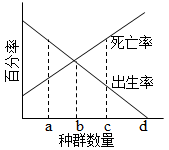

A. a B. b C. c D. d

【答案】B

【解析】

【分析】1、环境容纳量是指在自然环境不受破坏的情况下，一定空间中所能容纳的种群数量的最大值。

2、当出生率大于死亡率时，种群密度增加；当出生率等于死亡率时，种群密度保存稳定；当出生率小于死亡率时，种群密度降低。

【详解】分析题图可知，在b点之前，出生率大于死亡率，种群密度增加；在b点时，出生率等于死亡率，种群数量不再增加，表示该种群数量已达到环境容纳量（K值），B正确。

故选B。

7\. 金霉素（一种抗生素）可抑制tRNA与mRNA的结合，该作用直接影响的过程是（ ）

A. DNA复制 B. 转录 C. 翻译 D. 逆转录

【答案】C

【解析】

【分析】1、转录是指以DNA的一条链为模板，按照碱基互补配对原则，合成RNA的过程。

2、翻译是指以mRNA为模板，合成具有一定氨基酸排列顺序的蛋白质的过程。

3、DNA复制是指以亲代DNA为模板，按照碱基互补配对原则，合成子代DNA的过程。

4、逆转录是指以RNA为模板，按照碱基互补配对原则，合成DNA的过程。

【详解】分析题意可知，金霉素可抑制tRNA与mRNA的结合，使tRNA不能携带氨基酸进入核糖体，从而直接影响翻译的过程，C正确。

故选C。

8\. 兔的脂肪白色（*F*）对淡黄色（*f* ）为显性，由常染色体上一对等位基因控制。某兔群由500只纯合白色脂肪兔和1500只淡黄色脂肪兔组成，*F*、*f* 的基因频率分别是（ ）

A. 15%、85% B. 25%、75%

C. 35%、65% D. 45%、55%

【答案】B

【解析】

【分析】基因频率是指在一个种群的基因库中，某个基因占全部等位基因数的比率。

【详解】由题意可知，该兔种群由500只纯合白色脂肪兔（*FF*）和1500只淡黄色脂肪兔（*ff* ）组成，故F的基因频率=*F*/（*F*+*f*）=（500×2）/（2000×2）=25%，*f* 的基因频率=1-25%=75%，B正确。

故选B。

9\. 秸杆的纤维素经酶水解后可作为生产生物燃料乙醇的原料。生物兴趣小组利用自制的纤维素水解液（含5%葡萄糖）培养酵母菌并探究其细胞呼吸（如图）。下列叙述正确的是（ ）

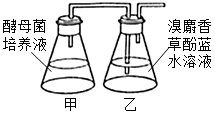

A. 培养开始时向甲瓶中加入重铬酸钾以便检测乙醇生成

B. 乙瓶的溶液由蓝色变成红色，表明酵母菌已产生了CO2

C. 用甲基绿溶液染色后可观察到酵母菌中线粒体的分布

D. 实验中增加甲瓶的酵母菌数量不能提高乙醇最大产量

【答案】D

【解析】

【分析】图示为探究酵母菌进行无氧呼吸的装置示意图。酵母菌无氧呼吸的产物是乙醇和CO2。检测乙醇的方法是：橙色的重铬酸钾溶液，在酸性条件下与乙醇发生化学反应，变成灰绿色。检测CO2的方法是：CO2可以使澄清的石灰水变混浊，也可以使溴麝香草酚蓝水溶液由蓝变绿再变黄。

【详解】A、检测乙醇生成，应取甲瓶中的滤液2mL注入到试管中，再向试管中加入0.5mL溶有0.1g重铬酸钾的浓硫酸溶液，使它们混合均匀，观察试管中溶液颜色的变化，A错误；

B、CO2可以使溴麝香草酚蓝水溶液由蓝变绿再变黄，因此乙瓶的溶液不会变成红色，B错误；

C、健那绿染液是专一性染线粒体的活细胞染料，可使活细胞中的线粒体呈现蓝绿色，而细胞质接近无色，因此用健那绿染液染色后可观察到酵母菌中线粒体的分布，C错误；

D、乙醇最大产量与甲瓶中葡萄糖的量有关，因甲瓶中葡萄糖的量是一定，因此实验中增加甲瓶的醇母菌数量不能提高乙醇最大产量，D正确。

故选D。

10\. 孔雀鱼雄鱼的鱼身具有艳丽的斑点，斑点数量多的雄鱼有更多机会繁殖后代，但也容易受到天敌的捕食。关于种群中雄鱼的平均斑点数量，下列推测错误的是（ ）

A. 缺少天敌，斑点数量可能会增多

B. 引入天敌，斑点数量可能会减少

C. 天敌存在与否决定斑点数量相关基因的变异方向

D. 自然环境中，斑点数量增减对雄鱼既有利也有弊

【答案】C

【解析】

【分析】自然界中的生物，通过激烈的生存斗争，适应者生存下来，不适应者被淘汰掉，这就是自然选择。

【详解】A、缺少天敌的环境中，孔雀鱼的斑点数量逐渐增多，原因是由于孔雀鱼群体中斑点数多的雄性个体体色艳丽易吸引雌性个体，从而获得更多的交配机会，导致群体中该类型个体的数量增多，A正确；

B、引入天敌的环境中，斑点数量多的雄鱼容易受到天敌的捕食，数量减少，反而斑点数量少的雄鱼获得更多交配机会，导致群体中斑点数量可能会减少，B正确；

C、生物的变异是不定向的，故天敌存在与否不能决定斑点数量相关基因的变异方向，C错误；

D、由题干信息可知，“斑点数量多的雄鱼有更多机会繁殖后代，但也容易受到天敌的捕食”，则斑点少的雄鱼繁殖后代的机会少，但不易被天敌捕食，可知自然环境中，斑点数量增减对雄鱼既有利也有弊，D正确。

故选C。

11\. 白菜型油菜（2n=20）的种子可以榨取食用油（菜籽油）。为了培育高产新品种，科学家诱导该油菜未受精的卵细胞发育形成完整植株Bc。下列叙述错误的是（ ）

A. Bc成熟叶肉细胞中含有两个染色体组

B. 将Bc作为育种材料，能缩短育种年限

C. 秋水仙素处理Bc幼苗可以培育出纯合植株

D. 自然状态下Bc因配子发育异常而高度不育

【答案】A

【解析】

【分析】1、根据单倍体、二倍体和多倍体的概念可知，由受精卵发育成的生物体细胞中有几个染色体组就叫几倍体；由配子发育成的个体，无论含有几个染色体组都为单倍体。

2、单倍体往往是由配子发育形成的，无同源染色体，故高度不育，而多倍体含多个染色体组，一般茎秆粗壮，果实种子较大。

【详解】A、白菜型油菜（2n=20）的种子，表明白菜型油菜属于二倍体生物，体细胞中含有两个染色体组，而Bc是通过卵细胞发育而来的单倍体，其成熟叶肉细胞中含有一个染色体组，A错误；

BC、Bc是通过卵细胞发育而来的单倍体，秋水仙素处理Bc幼苗可以培育出纯合植株，此种方法为单倍体育种，能缩短育种年限，BC正确；

D、自然状态下，Bc只含有一个染色体组，细胞中无同源染色体，减数分裂不能形成正常配子，而高度不育，D正确。

故选A。

【点睛】

12\. 在高等植物光合作用的卡尔文循环中，唯一催化CO2固定形成C3的酶被称为Rubisco。下列叙述正确的是（ ）

A. Rubisco存在于细胞质基质中

B. 激活Rubisco需要黑暗条件

C. Rubisco催化CO2固定需要ATP

D. Rubisco催化C5和CO2结合

【答案】D

【解析】

【分析】暗反应阶段：场所是叶绿体基质\
a．CO2的固定：CO2+C52C3\
b．三碳化合物的还原：

【详解】A、Rubisco参与植物光合作用过程中的暗反应，暗反应场所在叶绿体基质，故Rubisco存在于叶绿体基质中，A错误；

B、暗反应在有光和无光条件下都可以进行，故参与暗反应的酶Rubisco的激活对光无要求，B错误；

C、Rubisco催化CO2固定不需要ATP，C错误；

D、Rubisco催化二氧化碳的固定，即C5和CO2结合生成C3的过程，D正确。

故选D。

13\. 保卫细胞吸水膨胀使植物气孔张开。适宜条件下，制作紫鸭跖草叶片下表皮临时装片，观察蔗糖溶液对气孔开闭的影响，图为操作及观察结果示意图。下列叙述错误的是（ ）

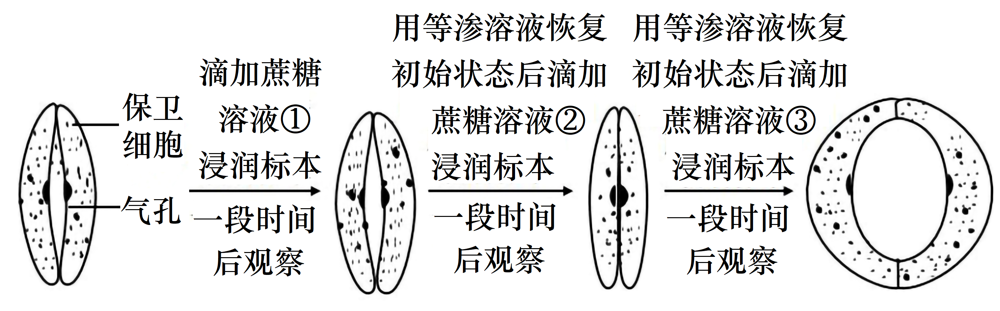

A. 比较保卫细胞细胞液浓度，③处理后\>①处理后

B. 质壁分离现象最可能出现在滴加②后的观察视野中

C. 滴加③后有较多水分子进入保卫细胞

D. 推测3种蔗糖溶液浓度高低为②\>①\>③

【答案】A

【解析】

【分析】气孔是由两两相对而生的保卫细胞围成的空腔，它的奇妙之处在于能够自动的开闭。气孔是植物体蒸腾失水的“门户”，也是植物体与外界进行气体交换的“窗口”。气孔的张开和闭合受保卫细胞的控制。

分析图示：滴加蔗糖溶液①后一段时间，保卫细胞气孔张开一定程度，说明保卫细胞在蔗糖溶液①中吸收一定水分；滴加蔗糖溶液②后一段时间，保卫细胞气孔关闭，说明保卫细胞在蔗糖溶液②中失去一定水分，滴加蔗糖溶液③后一段时间，保卫细胞气孔张开程度较大，说明保卫细胞在蔗糖溶液③中吸收水分多，且多于蔗糖溶液①，由此推断三种蔗糖溶液浓度大小为：②\>①\>③。

【详解】A、通过分析可知，①细胞处吸水量少于③处细胞，说明保卫细胞细胞液浓度①处理后\>③处理后，A错误；

B、②处细胞失水，故质壁分离现象最可能出现在滴加②后的观察视野中，B正确；

C、滴加③后细胞大量吸水，故滴加③后有较多水分子进入保卫细胞，C正确；

D、通过分析可知，推测3种蔗糖溶液浓度高低为②\>①\>③，D正确。

故选A。

【点睛】

14\. 乙烯可促进香焦果皮逐渐变黄、果肉逐渐变甜变软的成熟过程。同学们去香蕉种植合作社开展研学活动，以乙烯利溶液为处理剂，研究乙烯对香蕉的催熟过程，设计的技术路线如图。下列分析正确的是（ ）

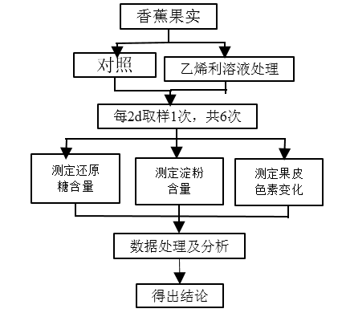

A. 对照组香蕉果实的成熟不会受到乙烯影响

B. 实验材料应选择已经开始成熟的香蕉果实

C. 根据实验安排第6次取样的时间为第10天

D. 处理组3个指标的总体变化趋势基本一致

【答案】C

【解析】

【分析】1、植物激素是由植物体内产生，能从产生部位运送到作用部位，对植物的生长发育有显著影响的微量有机物。

2、植物生长调节剂是由人工合成的具有对植物生长发育具有调节作用的化学物质，具有容易合成、原料广泛、效果稳定的特点。

3、乙烯：合成部位：植物体的各个部位都能产生。主要生理功能：促进果实成熟；促进器官的脱落；促进多开雌花。

【详解】A、对照组香蕉果实的成熟会受到乙烯影响，因为对照组香蕉会产生内源乙烯，A错误；

B、实验材料应尽量选择未开始成熟的香蕉果实，这样内源乙烯对实验的影响较小，B错误；

C、图示表明每两天取样一次，共6次，为了了解香蕉实验前本身的还原糖量、淀粉量、果皮色素量，应该从0天开始，故第6次取样的时间为第10天，C正确；

D、处理组3个指标的总体变化趋势不一致，应该是还原糖量增加，淀粉量下降，果皮黄色色素增加，D错误。

故选C。

【点睛】

15\. 与野生型拟南芥WT相比，突变体*t1*和*t2*在正常光照条件下，叶绿体在叶肉细胞中的分布及位置不同（图a，示意图），造成叶绿体相对受光面积的不同（图b），进而引起光合速率差异，但叶绿素含量及其它性状基本一致。在不考虑叶绿体运动的前提下，下列叙述错误的是（ ）

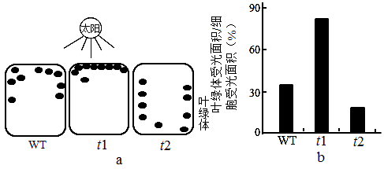

A. *t2*比*t1*具有更高的光饱和点（光合速率不再随光强增加而增加时的光照强度）

B. *t1*比*t2*具有更低的光补偿点（光合吸收CO2与呼吸释放CO2等量时的光照强度）

C. 三者光合速率的高低与叶绿素的含量无关

D. 三者光合速率的差异随光照强度的增加而变大

【答案】D

【解析】

【分析】光照强度影响光合作用强度的曲线：由于绿色植物每时每刻都要进行细胞呼吸，所以在光下测定植物光合强度时，实际测得的数值应为光合作用与细胞呼吸的代数和(称为“表观光合作用强度")。如下图: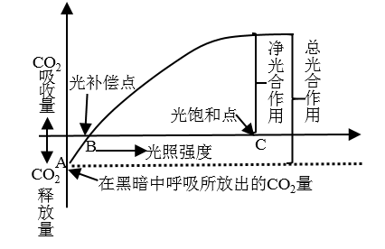

A表示植物呼吸作用强度，A点植物不进行光合作用，B点表示光补偿点，C点表示光饱和点。

【详解】A、图1可知，t1较多的叶绿体分布在光照下，t2较少的叶绿体分布在光照下，由此可推断，t2比t1具有更高的光饱和点（光合速率不再随光强增加而增加时的光照强度），A正确；

B、图1可知，t1较多的叶绿体分布在光照下，t2较少的叶绿体分布在光照下，由此可推断，t1比t2具有更低的光补偿点（光合吸收CO2与呼吸释放CO2等量时的光照强度），B正确；

C、通过题干信息可知，三者的叶绿素含量及其它性状基本一致，由此推测，三者光合速率的高低与叶绿素的含量无关，C正确；

D、三者光合速率的差异，在一定光照强度下，随光照强度的增加而变大，但是超过光的饱和点，再增大光照强度三者光合速率的差异不再变化，D错误。

故选D。

【点睛】

16\. 人类（2n=46）14号与21号染色体二者的长臂在着丝点处融合形成14/21平衡易位染色体，该染色体携带者具有正常的表现型，但在产生生殖细胞的过程中，其细胞中形成复杂的联会复合物（如图），在进行减数分裂时，若该联会复合物的染色体遵循正常的染色体行为规律（不考虑交叉互换），下列关于平衡易位染色体携带者的叙述，错误的是（ ）

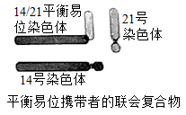

A. 观察平衡易位染色体也可选择有丝分裂中期细胞

B. 男性携带者的初级精母细胞含有45条染色体

C. 女性携带者的卵子最多含24种形态不同的染色体

D. 女性携带者的卵子可能有6种类型（只考虑图中的3种染色体）

【答案】C

【解析】

【分析】染色体变异是指染色体结构和数目的改变。染色体结构的变异主要有缺失、重复、倒位、易位四种类型。染色体数目变异可以分为两类：一类是细胞内个别染色体的增加或减少，另一类是细胞内染色体数目以染色体组的形式成倍地增加或减少。

【详解】A、14/21平衡易位染色体，是通过染色体易位形成，属于染色体变异，可通过显微镜观察染色体形态观察14/21平衡易位染色体，而有丝分裂中期染色体形态固定，故观察平衡易位染色体也可选择有丝分裂中期细胞，A正确；

B、题干信息可知，14/21平衡易位染色体，由14号和21号两条染色体融合成一条染色体，故男性携带者的初级精母细胞含有45条染色体，B正确；

C、由于发生14/21平衡易位染色体，该女性卵母细胞中含有45条染色体，经过减数分裂该女性携带者的卵子最多含23种形态不同的染色体，C错误；

D、女性携带者的卵子可能有6种类型（只考虑图6中的3种染色体）分别是：①含有14、21号染色体的正常卵细胞、②含有14/21平衡易位染色体的卵细胞、③含有14/21平衡易位染色体和21号染色体的卵细胞、④含有14号染色体的卵细胞、⑤14/21平衡易位染色体和14号染色体的卵细胞、⑥含有21号染色体的卵细胞，D正确。

故选C。

【点睛】

**二、非选择题：**

**（一）必考题：**

17\. 为积极应对全球气候变化，我国政府在2020年的联合国大会上宣布，中国于2030年前确保碳达峰（CO2排放量达到峰值），力争在2060年前实现碳中和（CO2排放量与减少量相等），这是中国向全世界的郑重承诺，彰显了大国责任。回答下列问题：

（1）在自然生态系统中，植物等从大气中摄取碳的速率与生物的呼吸作用和分解作用释放碳的速率大致相等，可以自我维持\_\_\_\_\_\_\_\_\_\_\_。自西方工业革命以来，大气中CO2的浓度持续增加，引起全球气候变暖，导致的生态后果主要是\_\_\_\_\_\_\_\_\_\_\_。

（2）生态系统中的生产者、消费者和分解者获取碳元素的方式分别是\_\_\_\_\_\_\_\_\_\_\_，消费者通过食物网（链）取食利用，\_\_\_\_\_\_\_\_\_\_\_。

（3）全球变暖是当今国际社会共同面临的重大问题，从全球碳循环的主要途径来看，减少\_\_\_\_\_\_\_\_\_\_\_和增加\_\_\_\_\_\_\_\_\_\_\_是实现碳达峰和碳中和的重要举措。

【答案】 (1). 碳平衡 (2). 极地冰雪和高山冰川融化、海平面上升等 (3). 光合作用和化能合成作用、捕食、分解作用 (4). 从而将碳元素以含碳有机物的形式进行传递 (5). 碳释放 (6). 碳存储

【解析】

【分析】1、碳达峰就是我们国家承诺在2030年前，二氧化碳的排放不再增长，达到峰值之后再慢慢减下去；碳中和主要是通过植物的光合作用存储碳的过程以及生物的呼吸作用和分解作用释放碳的过程达到动态平衡。

2、碳在无机环境和生物群落之间是以二氧化碳形式进行循环的。碳在生物群落中，以含碳有机物形式存在。大气中的碳主要通过植物光合作用进入生物群落。生物群落中的碳通过动植物的呼吸作用、微生物的分解作用、化石燃料的燃烧等方式可以回到大气中。

【详解】（1）在自然生态系统中，植物光合作用摄取碳的速率与生物的呼吸作用和微生物的分解作用释放碳的速率大致相等。随着现代工业的迅速发展，人类大量燃烧煤、石油等化学燃料，使地层中经过千百万年而积存的碳元素，在很短的时间内释放出来，打破了生物圈中碳平衡，使大气中的CO2浓度迅速增加，引起全球气候变暖，导致极地冰雪和高山冰川融化、海平面上升等严重的生态后果。

（2）生产者主要通过光合作用和化能合成作用获取碳元素，从而碳元素将通过生产者进入生态系统，消费者通过摄食生产者和低营养级的消费者来获取碳元素，分解者通过分解生产者的遗体残骸和消费者的粪便、遗体残骸来获取碳元素。消费者通过食物网（链）取食利用，从而将碳元素以含碳有机物的形式进行传递。

（3）全球变暖是当今国际社会共同面临的重大问题，从全球碳循环的主要途径来看，一方面从源头上减少二氧化碳的排放，主要是减少化石燃料的燃烧、开发新能源等来减少二氧化碳，另一方面增加二氧化碳的去路，主要可以通过植树造林、退耕还林、扩大森林面积、保护森林等，增加碳存储和减少碳释放是实现碳达峰和碳中和的重要举措。

【点睛】本题借助时事政治考查生态系统的功能，重点考查碳循环的相关知识，要求考生识记碳循环的具体过程及相关的环境问题，能结合所学的知识准确答题。

18\. 太极拳是我国传统运动项目，其刚柔并济、行云流水般的动作是通过神经系统对肢体和躯干各肌群的精巧调控及各肌群间相互协调而完成。如“白鹤亮翅”招式中的伸肘动作，伸肌收缩的同时屈肌舒张。图为伸肘动作在脊髓水平反射弧基本结构的示意图。

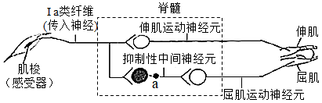

回答下列问题：

（1）图中反射弧的效应器是\_\_\_\_\_\_\_\_\_\_\_及其相应的运动神经末梢。若肌梭受到适宜刺激，兴奋传至a处时，a处膜内外电位应表现为\_\_\_\_\_\_\_\_\_\_\_。

（2）伸肘时，图中抑制性中间神经元的作用是\_\_\_\_\_\_\_\_\_\_\_，使屈肌舒张。

（3）适量运动有益健康。一些研究认为太极拳等运动可提高肌细胞对胰岛素的敏感性，在胰岛素水平相同的情况下，该激素能更好地促进肌细跑\_\_\_\_\_\_\_\_\_\_\_，降低血糖浓度。

（4）有研究报道，常年坚持太极拳运动的老年人，其血清中TSH、甲状腺激素等的浓度升高，因而认为运动能改善老年人的内分泌功能，其中TSH水平可以作为评估\_\_\_\_\_\_\_\_\_\_\_（填分泌该激素的腺体名称）功能的指标之一。

【答案】 (1). 伸肌、屈肌 (2). 外负内正 (3). 释放抑制性神经递质，导致屈肌运动神经元抑制 (4). 加速摄取、利用和储存葡萄糖 (5). 垂体

【解析】

【分析】1、反射弧是反射的结构基础，反射弧包括感受器、传入神经、神经中枢、传出神经、效应器五个部分，神经节所在的神经元是传入神经元，效应器是指传出神经末梢以及其所支配的肌肉或者腺体。

2、静息电位是外正内负，主要由钾离子外流产生和维持，动作电位是外负内正，主要由钠离子产生和维持。兴奋在突触处的传递过程：突触前膜内的突触小泡释放神经递质，作用于突触后膜上的受体，突触后膜电位发生变化，使突触后神经元兴奋或抑制，突触后神经元的兴奋或抑制取决于神经递质的种类。

【详解】（1）图中有两条反射弧：感受器（肌梭）→传入神经→脊髓→伸肌运动神经元→伸肌；感受器（肌梭）→传入神经→脊髓→屈肌运动神经元→屈肌；故图中反射弧的效应器为伸肌、屈肌及其相应的运动神经末梢；若肌梭受到适宜刺激，兴奋传至抑制性中间神经元时，使得抑制性神经元上有兴奋的传导，发生电位变化，从而使a处膜内外电位表现为外负内正。

（2）伸肘时，图中抑制性中间神经元接受上一个神经元传来的兴奋，从而发生电位变化，但释放抑制性神经递质，从而使屈肌运动神经元无法产生动作电位，使屈肌舒张。

（3）胰岛素能促进葡萄糖的去路，即加速组织细胞对葡萄糖的摄取、利用和存储，抑制肝糖原的分解和非糖物质的转化，从而降低血糖。太极拳等运动可提高肌细胞对胰岛素的敏感性，在胰岛素水平相同的情况下，该激素能更好地促进肌细胞加速摄取、利用和存储葡萄糖，从而降低血糖浓度。

（4）甲状腺激素的分泌存在分级调节，下丘脑分泌TRH（促甲状腺激素释放激素）作用于垂体，促使垂体分泌TSH（促甲状腺激素）作用于甲状腺，从而使甲状腺分泌TH（甲状腺激素）。激素通过体液运输，可通过检测血液中TSH、TH、TRH等激素的含量评估相应分泌器官的功能，从而判断老年人的内分泌功能。其中TSH水平可以作为评估垂体功能的指标之一。

【点睛】本题结合图示考查反射弧、兴奋在神经元之间的传递以及激素调节的特点等相关内容，难度一般，属于考纲中的识记与理解内容。

19\. 人体缺乏尿酸氧化酶，导致体内嘌呤分解代谢的终产物是尿酸（存在形式为尿酸盐）。尿酸盐经肾小球滤过后，部分被肾小管细胞膜上具有尿酸盐转运功能的蛋白URAT1和GLUT9重吸收，最终回到血液。尿酸盐重吸收过量会导致高尿酸血症或痛风。目前，E是针对上述蛋白治疗高尿酸血症或痛风的常用临床药物。为研发新的药物，研究人员对天然化合物F的降尿酸作用进行了研究。给正常实验大鼠（有尿酸氧化酶）灌服尿酸氧化酶抑制剂，获得了若干只高尿酸血症大鼠，并将其随机分成数量相等的两组，一组设为模型组，另一组灌服F设为治疗组，一段时间后检测相关指标，结果见图。

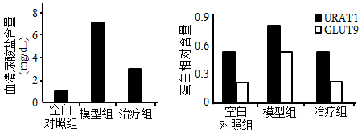

回答下列问题：

（1）与分泌蛋白相似，URAT1和GLUT9在细胞内的合成、加工和转运过程需要\_\_\_\_\_\_\_\_\_\_\_及线粒体等细胞器（答出两种即可）共同参与。肾小管细胞通过上述蛋白重吸收——尿酸盐，体现了细胞膜具有\_\_\_\_\_\_\_\_\_\_\_的边能特性。原尿中还有许多物质也需借助载体蛋白通过肾小管的细胞膜，这类跨膜运输的具体方式有\_\_\_\_\_\_\_\_\_\_\_。

（2）URAT1分布于肾小管细胞刷状缘（下图示意图），该结构有利于尿酸盐的重吸收，原因是\_\_\_\_\_\_\_\_\_\_\_。

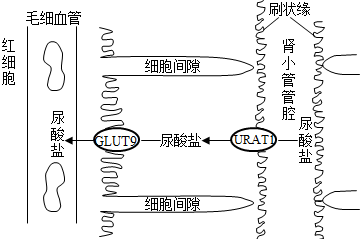

（3）与空白对照组（灌服生理盐水的正常实验大鼠）相比，模型组的自变量是\_\_\_\_\_\_\_\_\_\_\_。与其它两组比较，设置模型组的目的是\_\_\_\_\_\_\_\_\_\_\_。

（4）根据尿酸盐转运蛋白检测结果，推测F降低治疗组大鼠血清尿酸盐含量的原因可能是\_\_\_\_\_\_\_\_\_\_\_，减少尿酸盐重吸收，为进一步评价F的作用效果，本实验需要增设对照组，具体为\_\_\_\_\_\_\_\_\_\_\_。

【答案】 (1). 核糖体、内质网、高尔基体 (2). 选择透过性 (3). 协助扩散、主动运输 (4). 肾小管细胞刷状缘形成很多突起，增大吸收面积 (5). 尿酸氧化酶活性低 (6). 排除血清尿酸盐含量降低的原因是由于大鼠体内尿酸氧化酶的作用（确保血清尿酸盐含量降低是F作用的结果） (7). F抑制转运蛋白URAT1和GLUT9基因的表达 (8). 高尿酸血症大鼠灌服E

【解析】

【分析】由图可知，模型组（有尿酸氧化酶的正常实验大鼠灌服尿酸氧化酶抑制剂）尿酸盐转运蛋白增多，血清尿酸盐含量增高；治疗组尿酸盐转运蛋白减少，F降低治疗组大鼠血清尿酸盐含量。

分泌蛋白的合成与分泌过程：附着在内质网上的核糖体合成蛋白质→内质网进行粗加工→内质网“出芽”形成囊泡→高尔基体进行再加工形成成熟的蛋白质→高尔基体“出芽”形成囊泡→细胞膜，整个过程还需要线粒体提供能量。

【详解】（1）分泌蛋白在细胞内的合成、加工和转运过程需要核糖体、内质网、高尔基体及线粒体等细胞器共同参与，由于URAT1和GLUT9与分泌蛋白相似，因此URAT1和GLUT9在细胞内的合成、加工和转运过程需要核糖体、内质网、高尔基体及线粒体等细胞器共同参与。肾小管细胞通过URAT1和GLUT9蛋白重吸收尿酸盐，体现了细胞膜的选择透过性。借助载体蛋白的跨膜运输的方式有协助扩散和主动运输。

（2）由图可知，肾小管细胞刷状缘形成很多突起，增大吸收面积，有利于尿酸盐的重吸收。

（3）模型组灌服尿酸氧化酶抑制剂，与空白对照组灌服生理盐水的正常实验大鼠（有尿酸氧化酶）相比，模型组的自变量是尿酸氧化酶活性低，与空白对照组和灌服F的治疗组比较，设置模型组的目的是排除血清尿酸盐含量降低的原因是由于大鼠体内尿酸氧化酶的作用（确保血清尿酸盐含量降低是F作用的结果）。

（4）根据尿酸盐转运蛋白检测结果，模型组灌服尿酸氧化酶抑制剂后转运蛋白增加，灌服F的治疗组转运蛋白和空白组相同，可推测F降低治疗组大鼠血清尿酸盐含量的原因可能是F可能抑制转运蛋白URAT1和GLUT9基因的表达，减少尿酸盐重吸收。为进一步评价F的作用效果，本实验需要增设对照组，将高尿酸血症大鼠灌服E与F进行对比，得出两者降尿酸的作用效果。

【点睛】本题以高尿酸血症的治疗原理为背景，答题关键在于分析实验结果得出结论，明确分泌蛋白的合成过程、跨膜运输方式及细胞膜功能。

20\. 果蝇众多的突变品系为研究基因与性状的关系提供了重要的材料。摩尔根等人选育出M-5品系并创立了基于该品系的突变检测技术，可通过观察F1和F2代的性状及比例，检测出未知基因突变的类型（如显/隐性、是否致死等），确定该突变基因与可见性状的关系及其所在的染色体。回答下列问题：

（1）果蝇的棒眼（*B*）对圆眼（*b*）为显性、红眼（*R*）对杏红眼（*r*）为显性，控制这2对相对性状的基因均位于X染色体上，其遗传总是和性别相关联，这种现象称为\_\_\_\_\_\_\_\_\_\_\_。

（2）图示基于M-5品系的突变检测技术路线，在F1代中挑出1只雌蝇，与1只M-5雄蝇交配，若得到的F2代没有野生型雄蝇。雌蝇数目是雄蝇的两倍，F2代中雌蝇的两种表现型分别是棒眼杏红眼和\_\_\_\_\_\_\_\_\_\_\_，此结果说明诱变产生了伴X染色体\_\_\_\_\_\_\_\_\_\_\_基因突变。该突变的基因保存在表现型为\_\_\_\_\_\_\_\_\_\_\_果蝇的细胞内。

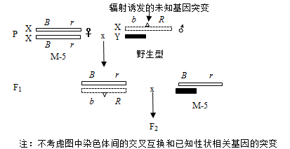

（3）上述突变基因可能对应图中的突变\_\_\_\_\_\_\_\_\_\_\_（从突变①、②、③中选一项），分析其原因可能是\_\_\_\_\_\_\_\_\_\_\_，使胚胎死亡。

<table>
<colgroup>
<col style="width: 19%" />
<col style="width: 46%" />
<col style="width: 33%" />
</colgroup>
<tbody>
<tr>
<td style="text-align: left;">密码子序号</td>
<td style="text-align: left;">1 … 4 … 19 20 … 540</td>
<td style="text-align: left;">密码子表（部分）：</td>
</tr>
<tr>
<td colspan="2" style="text-align: left;">
正常核苷酸序列 AUG…AAC…ACU UUA…UAG

突变①↓

突变后核苷酸序列 AUG…AAC…ACC UUA…UAG
</td>
<td style="text-align: left;">
AUG：甲硫氨酸，起始密码子

AAC：天冬酰胺
</td>
</tr>
<tr>
<td colspan="2" style="text-align: left;">
正常核苷酸序列 AUG…AAC…ACU UUA…UAG

突变②↓

突变后核苷酸序列 AUG…AAA…ACU UUA…UAG
</td>
<td style="text-align: left;">
ACU、ACC：苏氨酸

UUA：亮氨酸
</td>
</tr>
<tr>
<td colspan="2" style="text-align: left;">
正常核苷酸序列 AUG…AAC…ACU UUA…UAG

突变③ ↓

突变后核苷酸序列 AUG…AAC…ACU UGA…UAG
</td>
<td style="text-align: left;">
AAA：赖氨酸

UAG、UGA：终止密码子

…表示省略的、没有变化的碱基
</td>
</tr>
</tbody>
</table>

（4）图所示的突变检测技术，具有的①优点是除能检测上述基因突变外，还能检测出果蝇\_\_\_\_\_\_\_\_\_\_\_基因突变；②缺点是不能检测出果蝇\_\_\_\_\_\_\_\_\_\_\_基因突变。（①、②选答1项，且仅答1点即可）

【答案】 (1). 伴性遗传 (2). 棒眼红眼 (3). 隐性完全致死 (4). 雌 (5). ③ (6). 突变为终止密码子，蛋白质停止表达 (7). X染色体上的可见（或X染色体上的显性） (8). 常染色体（或常染色体显性或常染色体隐性）

【解析】

【分析】由题基于M-5品系的突变检测技术路线可知P：XBrXBr（棒眼杏红眼）×XbRY→F1：XBrXbR、XBrY，XBrXbR×XBrY→F2：XBrXBr（棒眼杏红眼雌蝇）、XBrXbR（棒眼红眼雌蝇）、XBrY（棒眼杏红眼雄蝇）、XbRY（死亡）。

【详解】（1）位于性染色体上的基因，在遗传过程中总是与性别相关联的现象，叫伴性遗传。

（2）由分析可知，F2雌蝇基因型为：XBrXBr、XBrXbR，因此F2代中雌蝇的两种表现型分别是棒眼杏红眼和棒眼红眼，由于F2代没有野生型雄蝇，雌蝇数目是雄蝇的两倍，此结果说明诱变产生了伴X染色体隐性完全致死基因突变，该突变的基因保存在表现型为雌果蝇的细胞内。

（3）突变①19号密码子ACU→ACC，突变前后翻译的氨基酸都是苏氨酸；突变②4号密码子AAC→AAA，由天冬酰胺变为赖氨酸；突变③20号密码子UUA→UGA，由亮氨酸突变为终止翻译。因此上述突变基因可能对应图中的突变③，突变后终止翻译，使胚胎死亡。

（4）图所示的突变检测技术优点是除能检测上述伴X染色体隐性完全致死基因突变外，还能检测出果蝇X染色体上的可见基因突变，即X染色体上的显性基因突变和隐性基因突变；该技术检测的结果需要通过性别进行区分，不能检测出果蝇常染色体上的基因突变，包括常染色体上隐性基因突变和显性基因突变。

【点睛】答题关键在于理解基于M-5品系的突变检测技术路线原理，掌握伴性遗传和基因突变相关知识，运用所学知识综合分析问题。

**（二）选考题：**

**\[选修1：生物技术实践\]**

21\. 中国科学家运用合成生物学方法构建了一株嗜盐单胞菌H，以糖蜜（甘蔗榨糖后的废弃液，含较多蔗糖）为原料，在实验室发酵生产PHA等新型高附加值可降解材料，期望提高甘蔗的整体利用价值。工艺流程如图。

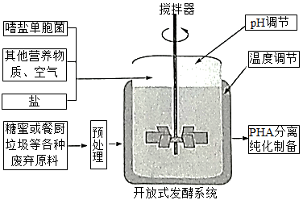

回答下列问题：

（1）为提高菌株H对蔗糖的耐受能力和利用效率，可在液体培养基中将蔗糖作为\_\_\_\_\_\_\_\_\_\_\_，并不断提高其浓度，经多次传代培养（指培养一段时间后，将部分培养物转入新配的培养基中继续培养）以获得目标菌株。培养过程中定期取样并用\_\_\_\_\_\_\_\_\_\_\_的方法进行菌落计数，评估菌株增殖状况。此外，选育优良菌株的方法还有\_\_\_\_\_\_\_\_\_\_\_等。（答出两种方法即可）

（2）基于菌株H嗜盐、酸碱耐受能力强等特性，研究人员设计了一种不需要灭菌的发酵系统，其培养基盐浓度设为60g/L，pH为10，菌株H可正常持续发酵60d以上。该系统不需要灭菌的原因是\_\_\_\_\_\_\_\_\_\_\_。（答出两点即可）

（3）研究人员在工厂进行扩大培养，在适宜的营养物浓度、温度、pH条件下发酵，结果发现发酵液中菌株H细胞增殖和PHA产量均未达到预期，并产生了少量乙醇等物质，说明发酵条件中\_\_\_\_\_\_\_\_\_\_\_可能是高密度培养的限制因素。

（4）菌株H还能通过分解餐厨垃圾（主要含蛋白质、淀粉、油脂等）来生产PHA，说明其能分泌\_\_\_\_\_\_\_\_\_\_\_。

【答案】 (1). 唯一碳源 (2). 血细胞计数板计数 (3). 诱变育种、基因工程育种 (4). 盐浓度为60g/L的条件下，其他杂菌因失水过多而死亡；pH为10的条件下，其他杂菌的酶变性失活，生长繁殖受抑制 (5). 氧气（O2或溶解氧） (6). 蛋白酶、淀粉酶、脂肪酶等

【解析】

【分析】微生物的筛选和计数方法：

（1）实验室中微生物的筛选原理实验室筛选：人为提供有利于目的菌株生长的条件（包括营养、温度、pH等），同时抑制或阻止其他微生物生长。

（2）微生物常见的接种方法：稀释涂布平板法、平板划线法。

（3）测定微生物数量的方法：①直接计数法：常用显微镜直接技术法，一般适用于纯培养悬浮液中各种单细胞菌体的计数。②间接计数法：常用稀释平板计数法，平板培养基上长出一个菌落就代表原待测样品中一个微生物个体。

【详解】（1）根据题意分析，该实验的目的是提高菌株H对蔗糖的耐受能力和利用效率，结合微生物的代谢需求，其液体培养基应该以蔗糖作为唯一碳源 。并不断提高其浓度，经多次传代培养（指培养一段时间后，将部分培养物转入新配的培养基中继续培养）以获得目标菌株。培养过程中定期取样并用血细胞计数板计数的方法进行菌落计数，评估菌株增殖状况。 此外，选育优良菌株的方法还有诱变育种、基因工程育种等。

（2）已知，菌株H具有嗜盐、酸碱耐受能力强等特性，因此当培养基盐浓度为60g/L，pH为10时，菌株H可正常持续发酵60d以上，而盐浓度为60g/L的条件下，其他杂菌因失水过多而死亡；pH为10的条件下，其他杂菌的酶变性失活，生长繁殖受抑制，故该系统不需要灭菌。

（3）分析题意，扩大培养时，营养物浓度、温度、pH等条件下适宜，而发酵液中菌株H细胞增殖和PHA产量均未达到预期，并产生了少量乙醇等物质，说明发酵条件中氧气不足，使菌种进行无氧呼吸产生乙醇，即氧气（O2或溶解氧）是限制高密度培养的重要因素。

（4）根据酶的专一性可知，菌株H之所以能通过分解主要含蛋白质、淀粉、油脂等的餐厨垃圾来生产PHA，说明其能分泌蛋白酶、淀粉酶、脂肪酶等。

【点睛】本题考查微生物的分离和计数的相关知识，意在考查考生运用所学知识解决实际问题的能力，难度适中。

**\[选修3：现代生物科技专题\]**

22\. 非细胞合成技术是一种运用合成生物学方法，在细胞外构建多酶催化体系，获得目标产物的新技术，其核心是各种酶基因的挖掘、表达等。中国科学家设计了4步酶促反应的非细胞合成路线（如图），可直接用淀粉生产肌醇（重要的医药食品原料），以期解决高温强酸水解方法造成的严重污染问题，并可以提高产率。

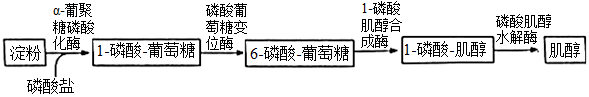

回答下列问题：

（1）研究人员采用PCR技术从土壤微生物基因组中扩增得到目标酶基因。此外，获得酶基因的方法还有\_\_\_\_\_\_\_\_\_\_\_。（答出两种即可）

（2）高质量的DNA模板是成功扩增出目的基因的前提条件之一。在制备高质量DNA模板时必须除去蛋白，方法有\_\_\_\_\_\_\_\_\_\_\_。（答出两种即可）

（3）研究人员使用大肠杆菌BL21作为受体细胞、pET20b为表达载体分别进行4种酶的表达。表达载体转化大肠杆菌时，首先应制备\_\_\_\_\_\_\_\_\_\_\_细胞。为了检测目的基因是否成功表达出酶蛋白，需要采用的方法有\_\_\_\_\_\_\_\_\_\_\_。

（4）依图所示流程，在一定的温度、pH等条件下，将4种酶与可溶性淀粉溶液混合组成一个反应体系。若这些酶最适反应条件不同，可能导致的结果是\_\_\_\_\_\_\_\_\_\_\_。在分子水平上，可以通过改变\_\_\_\_\_\_\_\_\_\_\_，从而改变蛋白质的结构，实现对酶特性的改造和优化。

【答案】 (1). 基因文库中获取、人工合成法 (2). 盐析法、酶解法或高温变性 (3). 感受态 (4). 抗原-抗体杂交技术 (5). 有的酶失活而使反应中断 (6). 基因的碱基序列

【解析】

【分析】基因工程技术的基本步骤：

（1）目的基因的获取：从基因文库中获取、利用PCR技术扩增和人工合成。

（2）基因表达载体的构建：是基因工程的核心步骤，基因表达载体包括目的基因、启动子、终止子和标记基因等。

（3）将目的基因导入受体细胞：根据受体细胞不同，导入的方法也不一样．将目的基因导入植物细胞的方法有农杆菌转化法、基因枪法和花粉管通道法；将目的基因导入动物细胞最有效的方法是显微注射法；将目的基因导入微生物细胞的方法是感受态细胞法。

（4）目的基因的检测与鉴定：分子水平上的检测：①检测转基因生物染色体的DNA是否插入目的基因--DNA分子杂交技术； ②检测目的基因是否转录出了mRNA--分子杂交技术；③检测目的基因是否翻译成蛋白质--抗原-抗体杂交技术。个体水平上的鉴定：抗虫鉴定、抗病鉴定、活性鉴定等。

【详解】（1）分析题意，研究人员从土壤微生物基因组中扩增得到目标酶基因采用了PCR技术，此外获得酶基因的方法还有从基因文库中获取和人工合成法。

（2）高质量的DNA模板是成功扩增出目的基因的前提条件之一。在制备高质量DNA模板时必须除去蛋白，可根据DNA和蛋白质的溶解性、对酶、高温和洗涤剂的耐受性去除蛋白质，方法有盐析、酶解法或高温变性法等。

（3）研究人员使用大肠杆菌BL21作为受体细胞、pET20b为表达载体分别进行4种酶的表达。表达载体转化大肠杆菌时，首先应制备感受态细胞， 即利用钙离子处理大肠杆菌，使其成为感受态细胞，使其 易于接受外来的DNA分子。基因工程中，酶基因（目的基因）成功表达的产物酶蛋白的化学本质是蛋白质，常用抗原-抗体杂交技术进行检测。

（4）依图所示流程，在一定的温度、pH等条件下，将4种酶与可溶性淀粉溶液混合组成一个反应体系。由于酶的作用条件较温和，若这些酶最适反应条件不同，则可能导致有的酶失活而使反应中断。在分子水平上，可以通过改变基因的碱基序列，从而改变蛋白质的结构，实现对酶特性的改造和优化。

【点睛】本题考查基因工程、DNA的粗提取和鉴定的相关知识，意在考查考生把握知识间的联系、理论与实际相结合解决实际问题的能力，难度中等。
