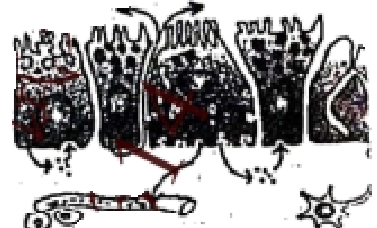
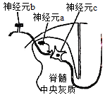
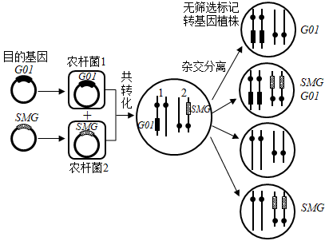
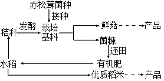
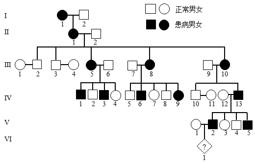
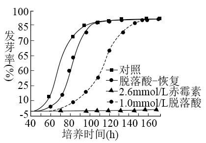
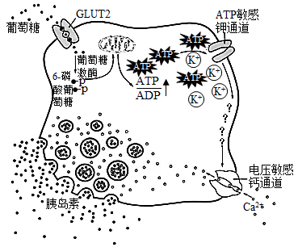
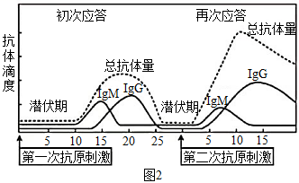
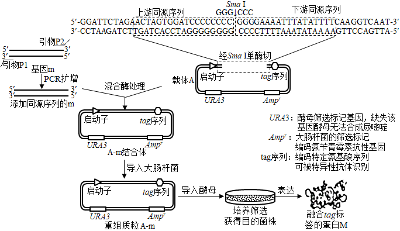

**生物**

**一、单项选择题:**

1\. 核酸和蛋白质都是重要的生物大分子，下列相关叙述错误的是（ ）

A. 组成元素都有C、H、O、N

B. 细胞内合成新的分子时都需要模板

C. 在细胞质和细胞核中都有分布

D. 高温变性后降温都能缓慢复性

2\. 下列关于人体细胞生命历程的叙述正确的是（ ）

A. 组织细胞的更新包括细胞分裂、分化等过程

B. 造血干细胞是胚胎发育过程中未分化的细胞

C. 细胞分化使各种细胞的遗传物质发生改变

D. 凋亡细胞被吞噬细胞清除属于细胞免疫

3\. 细胞可运用不同的方式跨膜转运物质，下列相关叙述错误的是（ ）

A. 物质自由扩散进出细胞的速度既与浓度梯度有关，也与分子大小有关

B. 小肠上皮细胞摄入和运出葡萄糖与细胞质中各种溶质分子的浓度有关

C. 神经细胞膜上运入K+的载体蛋白和运出K+的通道蛋白都具有特异性

D. 肾小管上皮细胞通过主动运输方式重吸收氨基酸

4\. 如图表示人体胃肠激素的不同运输途径，相关叙述正确的是（ ）

A. 胃肠激素都在内环境中发挥作用

B. 内分泌腺细胞不可能是自身激素作用的靶细胞

C. 图中组织液含有激素，淋巴因子、尿素等物质

D. 不同胃肠激素的作用特异性主要取决于不同的运输途径

5\. 植物组织培养技术常用于商业化生产：其过程一般为:无菌培养物的建立→培养物增殖→生根培养→试管苗移栽及鉴定。下列相关叙述错误的是（ ）

A. 为获得无菌培养物，外植体要消毒处理后才可接种培养

B. 组织培养过程中也可无明显愈伤组织形成，直接形成胚状体等结构

C. 提高培养基中生长素和细胞分裂素的比值，有利于诱导生根

D. 用同一植株体细胞离体培养获得的再生苗不会出现变异

6\. 在脊髓中央灰质区，神经元a、b、c通过两个突触传递信息；如图所示。下列相关叙述正确的是（ ）

A. a兴奋则会引起的人兴奋

B. b兴奋使c内Na+快速外流产生动作电位

C. a和b释放的递质均可改变突触后膜的离子通透性

D. 失去脑的调控作用，脊髓反射活动无法完成

7\. A和a，B和b为一对同源染色体上的两对等位基因。有关有丝分裂和减数分裂叙述正确的是（ ）

A. 多细胞生物体内都同时进行这两种形式的细胞分裂

B. 减数分裂的两次细胞分裂前都要进行染色质DNA的复制

C. 有丝分裂的2个子细胞中都含有Aa，减数分裂 Ⅰ 的2个子细胞中也可能都含有Aa

D. 有丝分裂都形成AaBb型2个子细胞，减数分裂都形成AB、Ab、aB、ab型4个子细胞

8\. 下列关于生物种群叙述正确的是（ ）

A. 不同种群的生物之间均存在生殖隔离

B. 种群中个体的迁入与迁出会影响种群的基因频率

C. 大量使用农药导致害虫种群产生抗药性，是一种共同进化的现象

D. 水葫芦大量生长提高了所在水体生态系统的物种多样性

9\. 某地区积极实施湖区拆除养殖围网等措施，并将沿湖地区改造成湿地公园，下列相关叙述正确的是（ ）

A. 该公园生物群落发生的演替属于初生演替

B. 公园建成初期草本植物占优势，群落尚未形成垂直结构

C. 在繁殖季节，白鹭求偶时发出的鸣叫声属于行为信息

D. 该湿地公园具有生物多样性的直接价值和间接价值

10\. 分析黑斑蛙的核型，需制备染色体标本，流程如下，相关叙述正确的是（ ）

A. 可用蛙红细胞替代骨髓细胞制备染色体标本

B. 秋水仙素处理的目的是为了诱导染色体数加倍

C. 低渗处理的目的是为了防止细胞过度失水而死亡

D. 染色时常选用易使染色体着色的碱性染料

11\. 下列关于哺乳动物胚胎工程和细胞工程的叙述，错误的是（ ）

A. 细胞培养和早期胚胎培养的培养液中通常需要添加血清等物质

B. 早期胚胎需移植到经同期发情处理的同种雌性动物体内发育成个体

C. 猴的核移植细胞通过胚胎工程已成功地培育出了克隆猴

D. 将骨髓瘤细胞和B淋巴细胞混合，经诱导后融合的细胞即为杂交瘤细胞

12\. 采用紫色洋葱鳞片叶外表皮进行质壁分离实验，下列相关叙述正确的是（ ）

A. 用摄子撕取的外表皮，若带有少量的叶肉细胞仍可用于实验

B. 将外表皮平铺在洁净的载玻片上，直接用高倍镜观察细胞状态

C. 为尽快观察到质壁分离现象，应在盖玻片四周均匀滴加蔗糖溶液

D. 实验观察到许多无色细胞，说明紫色外表皮中有大量细胞含无色液泡

13\. 下图是剔除转基因植物中标记基因的一种策略，下列相关叙述错误的是（ ）

A. 分别带有目的基因和标记基因的两个质粒，都带有T-DNA序列

B. 该方法建立在高转化频率基础上，标记基因和目的基因须转到不同染色体上

C. 若要获得除标记基因的植株，转化植株必须经过有性繁殖阶段遗传重组

D. 获得的无筛选标记转基因植株发生了染色体结构变异

14\. 某同学选用新鲜成熟的葡萄制作果酒和果醋，下列相关叙述正确的是（　　）

A. 果酒发酵时，每日放气需迅速，避免空气回流入发酵容器

B. 果酒发酵时，用斐林试剂检测葡萄汁中还原糖含量变化，砖红色沉淀逐日增多

C. 果醋发酵时，发酵液产生的气泡量明显少于果酒发酵时

D. 果醋发酵时，用重铬酸钾测定醋酸含量变化时，溶液灰绿色逐日加深

**二、多项选择题:**

15\. 为了推进乡村报兴，江苏科技人员在某村引进赤松茸，推广“稻菇轮诈”露地栽培模式，如下图所示，相关叙述正确的是（ ）

A. 当地农田生态系统中引进的赤松茸，是该系统中的生产者之一

B. 该模式沿袭了“无废弃农业”传统，菌糠和秸秆由废弃物变为了生产原料

C. 该模式充分利用了水稻秸秆中的能量，提高了能量传递效率

D. 该模式既让土地休养生息，又增加了生态效益和经济效益

16\. 短指（趾）症为显性遗传病，致病基因在群体中频率约为1/100~1/1000。如图为该遗传病某家族系谱图，下列叙述正确的是（ ）

A. 该病为常染色体遗传病

B. 系谱中的患病个体都是杂合子

C. VI1是患病男性的概率为1/4

D. 群体中患者的纯合子比例少于杂合子

17\. 下表和图为外加激素处理对某种水稻萌发影响的结果。萌发速率（T50）表达最终发芽率50%所需的时间，发芽率为萌发种子在总数中的比率。“脱落酸一恢复”组为1.0mmol/L脱落酸浸泡后，洗去脱落酸。下列相关叙述正确的是（ ）

<table style="width:63%;">
<colgroup>
<col style="width: 26%" />
<col style="width: 17%" />
<col style="width: 18%" />
</colgroup>
<thead>
<tr>
<th rowspan="2" style="text-align: center;">激素浓度（mmol/L）</th>
<th colspan="2" style="text-align: center;">平均T50（h）</th>
</tr>
<tr>
<th style="text-align: center;">赤霉素</th>
<th style="text-align: center;">脱落酸</th>
</tr>
</thead>
<tbody>
<tr>
<td style="text-align: center;">0</td>
<td style="text-align: center;">83</td>
<td style="text-align: center;">83</td>
</tr>
<tr>
<td style="text-align: center;">0.01</td>
<td style="text-align: center;">83</td>
<td style="text-align: center;">87</td>
</tr>
<tr>
<td style="text-align: center;">0.1</td>
<td style="text-align: center;">82</td>
<td style="text-align: center;">111</td>
</tr>
<tr>
<td style="text-align: center;">10</td>
<td style="text-align: center;">80</td>
<td style="text-align: center;">未萌发</td>
</tr>
<tr>
<td style="text-align: center;">2.5</td>
<td style="text-align: center;">67</td>
<td style="text-align: center;">未萌发</td>
</tr>
</tbody>
</table>

A. 0.1mmol/L浓度时，赤霉素的作用不显著，脱落酸有显著抑制萌发作用

B. 1.0mmol/L浓度时，赤霉素促进萌发，脱落酸将种子全部杀死

C. 赤霉素仅改变T50，不改变最终发芽率

D. 赤霉素促进萌发对种子是有益的，脱落酸抑制萌发对种子是有害的

18\. 为提高一株石油降解菌的净化能力，将菌涂布于石油为唯一碳源的固体培养基上，以致死率为90%的辐照剂量诱变处理，下列叙述不合理的是（ ）

A. 将培养基分装于培养皿中后灭菌，可降低培养基污染概率

B. 涂布用的菌浓度应控制在30~300个/mL

C. 需通过预实验考察辐射时间对存活率的影响，以确定最佳诱变时间

D. 挑取培养基上长出的较大单菌落，给纯化后进行降解效率分析

19\. 数据统计和分析是许多实验的重要环节，下列实验中获取数据的方法合理的是（ ）

| 编号  | 实验内容                                                             | 获取数据的方法                         |
|:--- |:---------------------------------------------------------------- |:------------------------------- |
| ①   | 调查某自然保护区灰喜鹊种群密度 | 使用标志重捕法，尽量不影响标记动物正常活动，个体标记后即释放  |
| ②   | 探究培养液中酵母菌种群数量的变化                                                 | 摇匀后抽取少量培养物，适当稀释，用台盼蓝染色，血细胞计数板计数 |
| ③   | 调查高度近视（600度以上）在人群中的发病率                                           | 在数量足够大的人群中随机调查                  |
| ④   | 探究唾液淀粉酶活性的最适温度                                                   | 设置0℃、37℃、100℃三个温度进行实验，记录实验数据    |

A. 实验① B. 实验② C. 实验③ D. 实验④

**三、非选择题:**

20\. 线粒体对维持旺盛光合作用至关重要。下图示叶肉细胞中部分代谢途径，虚线框内示“草酰乙酸/苹果酸穿梭”，请据图回答下列问题。

（1）叶绿体在\_\_\_上将光能转变成化学能，参与这一过程的两类色素是\_\_\_\_\_。

（2）光合作用时，CO2与C5结合产生三碳酸，继而还原成三碳糖（C3），为维持光合作用持续进行，部分新合成的C3必须用于再生\_\_\_\_\_\_；运到细胞质基质中的C3可合成蔗糖，运出细胞。每运出一分子蔗糖相当于固定了\_\_\_个CO2分子。

（3）在光照过强时，细胞必须耗散掉叶绿体吸收的过多光能，避免细胞损伤。草酸乙酸/苹果酸穿梭可有效地将光照产生的\_\_\_\_\_\_中的还原能输出叶绿体，并经线粒体转化为\_\_\_\_\_\_中的化学能。

（4）为研究线粒体对光合作用的影响，用寡霉素（电子传递链抑制剂）处理大麦，实验方法是:取培养10~14d大麦苗，将其茎漫入添加了不同浓度寡霉素的水中，通过蒸腾作用使药物进入叶片。光照培养后，测定，计算光合放氧速率（单位为µmolO2•mg-1chl•h-1，chl为叶绿素）。请完成下表。

| 实验步骤的目的                         | 简要操作过程                                      |
|:------------------------------- |:------------------------------------------- |
| 配制不同浓度的寡霉素丙酮溶液                  | 寡霉素难溶于水，需先溶于丙酮，配制高浓度母液，并用丙酮稀释成不同药物浓度，用于加入水中 |
| 设置寡霉素为单一变量的对照组                  | ①\_\_\_\_\_\_\_\_\_\_\_\_\_\_\_             |
| ②\_\_\_\_\_\_\_\_\_\_\_\_\_\_\_ | 对照组和各实验组均测定多个大麦叶片                           |
| 光合放氧测定                          | 用氧电极测定叶片放氧                                  |
| ③\_\_\_\_\_\_\_\_\_\_\_\_\_\_\_ | 称重叶片，加乙醇研磨，定容，离心，取上清液测定                     |

21\. 正常人体在黎明觉醒前后肝脏生糖和胰岛素敏感性都达到高峰，伴随胰岛素水平的波动，维持机体全天血糖动态平衡，约50%的Ⅱ型糖尿病患者发生“黎明现象”（黎明时处于高血糖水平，其余时间血糖平稳），是糖尿病治疗的难点。请回答下列问题。

（1）人体在黎明觉醒前后主要通过\_\_\_\_\_\_\_\_\_\_\_分解为葡萄糖，进而为生命活动提供能源。

（2）如图所示，觉醒后人体摄食使血糖浓度上升，葡萄糖经GLUT2以\_\_\_\_\_\_\_\_\_\_方式进入细胞，氧化生成ATP，ATP/ADP比率的上升使ATP敏感通道关闭，细胞内K+浓度增加，细胞膜内侧膜电位的变化为\_\_\_\_\_\_\_\_\_\_\_\_\_\_，引起钙通道打开，Ca2+内流，促进胰岛素以\_\_\_\_\_\_\_\_\_\_\_\_方式释放。

（3）胰岛素通过促进\_\_\_\_\_\_\_\_\_\_\_\_、促进糖原合成与抑制糖原分解、抑制非糖物质转化等发挥降血糖作用，胰岛细胞分泌的\_\_\_\_\_\_\_\_\_\_\_能升高血糖，共同参与维持血糖动态平衡。

（4）Ⅱ型糖尿病患者的靶细胞对胰岛素作用不敏感，原因可能有：\_\_\_\_\_\_\_\_\_\_\_\_\_（填序号）

①胰岛素拮抗激素增多 ②胰岛素分泌障碍 ③胰岛素受体表达下降 ④胰岛素B细胞损伤 ⑤存在胰岛细胞自身抗体

（5）人体昼夜节律源于下丘脑视交叉上核SCN区，通过神经和体液调节来调控外周节律。研究发现SCN区REV-ERB基因节律性表达下降，机体在觉醒时糖代谢异常，表明“黎明现象”与生物钟紊乱相关。由此推测，Ⅱ型糖尿病患者的胰岛素不敏感状态具有\_\_\_\_\_\_\_\_\_\_\_\_\_的特点，而\_\_\_\_\_\_\_\_\_\_\_\_\_可能成为糖尿病治疗研究新方向。

22\. 根据新冠病毒致病机制及人体免疫反应特征研制新冠疫苗，广泛接种疫苗可以快速建立免疫屏障，阻击病毒扩大。图1为新冠病毒入侵细胞后的增殖示意图，图2为人体免疫应答产生抗体的一般规律示意图。请据图回答下列问题。

（1）图1中，新冠病毒通过S蛋白与细胞表面的ACE2受体结合，侵入细胞释放出病毒的（+）RNA，在宿主细胞中经\_\_\_\_\_\_\_\_\_\_\_\_合成病毒的RNA聚合酶。

（2）在RNA聚合酶的作用下，病毒利用宿主细胞中的原料，按照\_\_\_\_\_\_\_\_\_\_原则合成（-）RNA。随后大量合成新的（+）RNA。再以这些RNA为模板，分别在\_\_\_\_\_\_\_\_\_\_\_\_大量合成病毒的N蛋白和S、M、E蛋白。

（3）制备病毒灭活疫苗时，先大量培养表达\_\_\_\_\_\_\_\_\_\_\_的细胞，再接入新冠病毒扩大培养，灭活处理后制备疫苗。细胞培养时需通入CO2，其作用是\_\_\_\_\_\_\_\_\_\_\_\_\_\_。

（4）制备S蛋白的mRNA疫苗时，体外制备的mRNA常用脂质分子包裹后才用于接种。原因一是人体血液和组织中广泛存在\_\_\_\_\_\_\_\_\_\_，极易将裸露的mRNA水解，二是外源mRNA分子不易进入人体细胞产生抗原。

（5）第一次接种疫苗后，人体内识别到S蛋白的B细胞，经过增殖和分化，形成的\_\_\_\_\_\_\_\_细胞可合成并分泌特异性识别\_\_\_\_\_\_\_\_\_\_的IgM和IgG抗体（见图2），形成的\_\_\_\_\_\_细胞等再次接触到S蛋白时，发挥免疫保护作用。

（6）有些疫苗需要进行第二次接种，据图2分析进行二次接种的意义是\_\_\_\_\_\_\_\_。

23\. 某小组为研究真菌基因m的功能，构建了融合表达蛋白M和tag标签的质粒，请结合实验流程回答下列问题：

（1）目的基因的扩增

①提取真菌细胞\_\_\_\_\_\_，经逆转录获得cDNA，进一步获得基因m片段。

②为了获得融合tag标签的蛋白M，设计引物P2时，不能包含基因m终止密码子的编码序列，否则将导致\_\_\_\_\_\_。

③热启动PCR可提高扩增效率，方法之一是：先将除TaqDNA聚合酶（Taq酶）以外的各成分混合后，加热到80℃以上再混入酶，然后直接从94℃开始PCR扩增，下列叙述正确的有\_\_\_\_\_\_

A．Taq酶最适催化温度范围为50～60℃

B．与常规PCR相比，热启动PCR可减少反应起始时引物错配形成的产物

C．两条子链的合成一定都是从5′端向3′端延伸

D．PCR产物DNA碱基序列的特异性体现了Taq酶的特异性

（2）重组质粒的构建

①将Sma I切开的载体A与添加同源序列的m混合，用特定DNA酶处理形成黏性末端，然后降温以促进\_\_\_\_\_\_，形成A-m结合体。将A-m结合体导入大肠杆菌，利用大肠杆菌中的DNA聚合酶及\_\_\_\_\_\_酶等，完成质粒的环化。

②若正确构建的重组质粒A—m仍能被Sma I切开，则Sma I的酶切位点可能在\_\_\_\_\_\_。

（3）融合蛋白的表达

①用含有尿嘧啶的培养基培养URA3基因缺失型酵母，将其作为受体菌，导入质粒A-m，然后涂布于无尿嘧啶的培养基上，筛选获得目的菌株，其机理是\_\_\_\_\_\_。

②若通过抗原一抗体杂交实验检测到酵母蛋白中含lag标签，说明\_\_\_\_\_\_，后续实验可借助tag标签进行蛋白M的分离纯化。

24\. 以下两对基因与果蝇眼色有关。眼色色素产生必需有显性基因A，aa时眼色白色；B存在时眼色为紫色，bb时眼色为红色。2个纯系果蝇杂交结果如下图，请据图回答下问题。

（1）果蝇是遗传学研究的经典实验材料，摩尔根等利用一个特殊眼色基因突变体开展研究，把基因传递模式与染色体在减数分裂中的分配行为联系起来，证明了\_\_\_\_\_\_\_\_\_\_\_\_。

（2）A基因位于\_\_\_\_\_\_染色体上，B基因位于\_\_\_\_\_\_染色体上。若要进一步验证这个推论，可在2个纯系中选用表现型为\_\_\_\_\_\_\_\_\_\_\_\_\_\_的果蝇个体进行杂交。

（3）上图F1中紫眼雌果蝇的基因型为\_\_\_\_\_\_，F2中紫眼雌果蝇的基因型有\_\_\_\_\_\_\_\_\_种.

（4）若亲代雌果蝇在减数分裂时偶尔发生X染色体不分离而产生异常卵，这种不分离可能发生的时期有\_\_\_\_\_\_\_\_\_，该异常卵与正常精子受精后，可能产生的合子主要类型有\_\_\_\_\_\_\_\_.

（5）若F2中果蝇单对杂交实验中出现了一对果蝇的杂交后代雌雄比例为2:1，由此推测该对果蝇的\_\_\_\_\_\_\_\_\_性个体可能携带隐性致死基因；若继续对其后代进行杂交，后代雌雄比为\_\_\_\_\_\_\_\_\_\_\_\_\_\_\_时，可进一步验证这个假设。
