**生物**

**一、单项选择题:**

1\. 核酸和蛋白质都是重要的生物大分子，下列相关叙述错误的是（ ）

A. 组成元素都有C、H、O、N

B. 细胞内合成新的分子时都需要模板

C. 在细胞质和细胞核中都有分布

D. 高温变性后降温都能缓慢复性

【答案】D

【解析】

【分析】1、蛋白质是生命活动的主要承担者，构成蛋白质的基本单位是氨基酸，蛋白质的结构多样，在细胞中承担的功能也多样。2、核酸是遗传信息的携带者、其基本构成单位是核苷酸，核酸根据所含五碳糖的不同分为DNA和RNA，核酸对于生物的遗传变异和蛋白质在的生物合成中具有重要作用，不同生物的核酸中的遗传信息不同。

【详解】A、核酸的组成元素为C、H、O、N、P，蛋白质的组成元素为C、H、O、N，故组成元素都有C、H、O、N，A正确；

B、核酸和蛋白质的合成都需要模板。合成DNA以DNA分子的两条链为模板，合成RNA以DNA的一条链为模板，合成蛋白质以mRNA为模板，B正确；

C、核酸和蛋白质在细胞质和细胞核中都有分布，DNA主要分布在细胞核中，RNA主要分布在细胞质中，C正确；

D、DNA经高温变性后降温能缓慢复性，蛋白质经高温变性后，降温不能复性，D错误。

故选D。

2\. 下列关于人体细胞生命历程的叙述正确的是（ ）

A. 组织细胞的更新包括细胞分裂、分化等过程

B. 造血干细胞是胚胎发育过程中未分化的细胞

C. 细胞分化使各种细胞的遗传物质发生改变

D. 凋亡细胞被吞噬细胞清除属于细胞免疫

【答案】A

【解析】

【分析】细胞分化是指在个体发育中，由一个或一种细胞增殖产生的后代，在形态，结构和生理功能上发生稳定性差异的过程。细胞分化的实质：基因的选择性表达。细胞分化过程中遗传物质不变。

【详解】A、人体内组织细胞的更新包括组织细胞的产生和凋亡，新组织细胞的形成需要经过细胞分裂、分化，A正确；

B、造血干细胞是已分化的细胞，但仍能继续分化形成血细胞和淋巴细胞等，B错误；

C、细胞分化的实质是基因的选择性表达，遗传物质不变，C错误；

D、凋亡细胞被吞噬细胞清除属于非特异性免疫，D错误。

故选A。

3\. 细胞可运用不同的方式跨膜转运物质，下列相关叙述错误的是（ ）

A. 物质自由扩散进出细胞的速度既与浓度梯度有关，也与分子大小有关

B. 小肠上皮细胞摄入和运出葡萄糖与细胞质中各种溶质分子的浓度有关

C. 神经细胞膜上运入K+的载体蛋白和运出K+的通道蛋白都具有特异性

D. 肾小管上皮细胞通过主动运输方式重吸收氨基酸

【答案】B

【解析】

【分析】小分子物质物质出入细胞的方式有自由扩散、协助扩散和主动运输。自由扩散不需要载体和能量；协助扩散需要载体，但不需要能量；主动运输需要载体，也需要能量；自由扩散和协助扩散是由高浓度向低浓度运输，是被动运输。大分子物质通过胞吞和胞吐出入细胞，胞吞和胞吐过程依赖于生物膜的流动性结构特点，需要消耗能量。

【详解】A、物质通过自由扩散的方式进出细胞的速度与浓度梯度有关，也与分子大小有关，A正确；

B、小肠上皮细胞摄入和运出葡萄糖与细胞质中葡萄糖分子的浓度有关，与细胞质中其他溶质分子的浓度无关，B错误；

C、膜转运蛋白包括载体蛋白和通道蛋白，二者都具有特异性，载体蛋白只允许与自身结合部位相适应的分子或离子通过，通道蛋白只允许与自身通道的直径和形状相适配、大小和电荷相适宜的分子或离子通过，C正确；

D、肾小管上皮细胞重吸收氨基酸的方式是主动运输，D正确。

故选B。

4\. 如图表示人体胃肠激素的不同运输途径，相关叙述正确的是（ ）

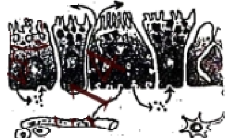

A. 胃肠激素都在内环境中发挥作用

B. 内分泌腺细胞不可能是自身激素作用的靶细胞

C. 图中组织液含有激素，淋巴因子、尿素等物质

D. 不同胃肠激素的作用特异性主要取决于不同的运输途径

【答案】C

【解析】

【分析】分析题图：题图表示人体胃肠激素的不同运输途径，据图可知，人体胃肠激素的运输途径有4条：①是激素进入组织液，然后作用于产生激素的细胞；②是激素产生以后，进入消化道；③是激素分泌后通过血液运输，作用于靶细胞；④是激素分泌后进入组织液，然后作用于相邻细胞。

【详解】A、据分析可知，胃肠激素不都在内环境中发挥作用，可在消化道发挥作用，A错误；

B、据题图信息可知，内分泌腺细胞可能是自身激素作用的靶细胞，B错误；

C、激素通过体液运输，尿素是细胞代谢产生的废物，T细胞产生的淋巴因子存在于体液中。故组织液含有激素，淋巴因子、尿素等物质，C正确；

D、不同胃肠激素的作用特异性主要取决于特异性受体，D错误。

故选C。

5\. 植物组织培养技术常用于商业化生产：其过程一般为:无菌培养物的建立→培养物增殖→生根培养→试管苗移栽及鉴定。下列相关叙述错误的是（ ）

A. 为获得无菌培养物，外植体要消毒处理后才可接种培养

B. 组织培养过程中也可无明显愈伤组织形成，直接形成胚状体等结构

C. 提高培养基中生长素和细胞分裂素的比值，有利于诱导生根

D. 用同一植株体细胞离体培养获得的再生苗不会出现变异

【答案】D

【解析】

【分析】1、离体的植物组织或细胞，在培养一段时间后，会通过细胞分裂形成愈伤组织。愈伤组织的细胞排列疏松而无规则，是一种高度液泡化的呈无定形状态的薄壁细胞。由高度分化的植物组织或细胞产生愈伤组织的过程，称为植物细胞的脱分化。脱分化产生的愈伤组织继续进行培养，又可以重新分化成根或芽等器官，这个过程叫做再分化。再分化形成的试管苗，移栽到地里，可以发育成完整的植株体。

2、植物组织培养中生长素和细胞分裂素使用比例对植物细胞发育的影响：生长素用量比细胞分裂素用量，比值高时，有利于根的分化、抑制芽的形成；比值低时，有利于芽的分化、抑制根的形成。比值适中时，促进愈伤组织的形成。

【详解】A、植物组织培养过程中应注意无菌操作，为获得无菌培养物，外植体要经过表面消毒处理后，才能进行培养，所用的培养基必须彻底灭菌，A正确；

B、组织培养过程中也可无明显愈伤组织形成，直接形成胚状体等结构，胚状体若包裹上人工种皮，可制作成人工种子，B正确；

C、生长素和细胞分裂素的比值高时，有利于根的分化、抑制芽的形成，因此提高培养基中生长素和细胞分裂素的比值，有利于诱导生根，C正确；

D、用同一植株体细胞离体培养获得的再生苗会出现变异，如在愈伤组织的培养过程中可能发生基因突变等变异，D错误。

故选D。

6\. 在脊髓中央灰质区，神经元a、b、c通过两个突触传递信息；如图所示。下列相关叙述正确的是（ ）

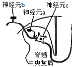

A. a兴奋则会引起的人兴奋

B. b兴奋使c内Na+快速外流产生动作电位

C. a和b释放的递质均可改变突触后膜的离子通透性

D. 失去脑的调控作用，脊髓反射活动无法完成

【答案】C

【解析】

【分析】静息时，神经纤维的膜电位为外正内负，兴奋时，兴奋部位的膜电位转变为外负内正。神经递质有兴奋性神经递质和抑制性神经递质。突触结构处兴奋的传递方向是单向的。

【详解】A、a兴奋可能会使突出前膜释放兴奋性或者抑制性的神经递质，则会引起的人兴奋或者抑制，A错误；

B、产生动作电位的原因是Na+内流，B错误；

C、神经元b释放的神经递质作用于神经c，神经a释放的神经递质作用于神经b，改变突触后膜的离子通透性，即a和b释放的递质均可改变突触后膜的离子通透性，C正确；

D、一些简单脊髓反射活动，例如：膝跳反射，不需要大脑皮层的参与，所以失去脑的调控作用，脊髓反射活动依然能完成，D错误。

故选C。

【点睛】本题主要考查兴奋在突触处的传递的相关内容，要求考生识记相关知识，并结合所学知识准确答题。

7\. A和a，B和b为一对同源染色体上的两对等位基因。有关有丝分裂和减数分裂叙述正确的是（ ）

A. 多细胞生物体内都同时进行这两种形式的细胞分裂

B. 减数分裂的两次细胞分裂前都要进行染色质DNA的复制

C. 有丝分裂的2个子细胞中都含有Aa，减数分裂 Ⅰ 的2个子细胞中也可能都含有Aa

D. 有丝分裂都形成AaBb型2个子细胞，减数分裂都形成AB、Ab、aB、ab型4个子细胞

【答案】C

【解析】

【分析】1、有丝分裂不同时期的特点：（1）间期：进行DNA的复制和有关蛋白质的合成；（2）前期：核膜、核仁逐渐解体消失，出现纺锤体和染色体；（3）中期：染色体形态固定、数目清晰；（4）后期：着丝点分裂，姐妹染色单体分开成为染色体，并均匀地移向两极；（5）末期：核膜、核仁重建、纺锤体和染色体消失。

2、减数分裂过程：（1）减数第一次分裂间期：染色体的复制．（2）减数第一次分裂：①前期：联会，同源染色体上的非姐妹染色单体交叉互换；②中期：同源染色体成对的排列在赤道板上；③后期：同源染色体分离，非同源染色体自由组合；④末期：细胞质分裂．（3）减数第二次分裂过程：①前期：核膜、核仁逐渐解体消失，出现纺锤体和染色体；②中期：染色体形态固定、数目清晰；③后期：着丝点分裂，姐妹染色单体分开成为染色体，并均匀地移向两极；④末期：核膜、核仁重建、纺锤体和染色体消失。

【详解】A、生物体内有些特殊的细胞如生殖器官中的细胞既能进行有丝分裂又能进行减数分裂，但体细胞只进行有丝分裂，A错误；

B、减数分裂只在第一次分裂前进行染色质DNA的复制，B错误；

C、有丝分裂得到的子细胞染色体组成与亲代相同，得到的2个子细胞中都含有Aa；减数分裂 Ⅰ若发生交叉互换，则得到 的2个子细胞中也可能都含有Aa，C正确；

D、有丝分裂得到的子细胞染色体组成与亲代相同，都形成AaBb型2个子细胞；因A和a，B和b为一对同源染色体上的两对等位基因，若不考虑交叉互换，则减数分裂能得到两种类型（AB、ab或Ab、aB）的子细胞，D错误。

故选C。

8\. 下列关于生物种群叙述正确的是（ ）

A. 不同种群的生物之间均存在生殖隔离

B. 种群中个体的迁入与迁出会影响种群的基因频率

C. 大量使用农药导致害虫种群产生抗药性，是一种共同进化的现象

D. 水葫芦大量生长提高了所在水体生态系统的物种多样性

【答案】B

【解析】

【分析】生物进化的实质是种群基因频率的定向改变，可遗传变异为生物进化提供原材料，不能决定生物进化的方向，自然选择通过定向改变种群的基因频率而使生物朝着一定的方向进化；隔离是物种形成的必要条件，隔离包括地理隔离和生殖隔离。

【详解】A、不同物种的生物之间均存在生殖隔离，A错误；

B、种群中个体的出生和死亡，迁入和迁出会导致种群基因频率的改变，B正确；

C、害虫抗药性在喷洒农药之前已经存在，喷洒农药只起选择作用，C错误；

D、水葫芦大量生长降低了所在水体生态系统的物种多样性，D错误。

故选B。

9\. 某地区积极实施湖区拆除养殖围网等措施，并将沿湖地区改造成湿地公园，下列相关叙述正确的是（ ）

A. 该公园生物群落发生的演替属于初生演替

B. 公园建成初期草本植物占优势，群落尚未形成垂直结构

C. 在繁殖季节，白鹭求偶时发出鸣叫声属于行为信息

D. 该湿地公园具有生物多样性的直接价值和间接价值

【答案】D

【解析】

【分析】1、群落演替：随着时间的推移，一个群落被另一个群落代替的过程。分为初生演替和次生演替。2、生态系统中信息的种类：（1）物理信息：生态系统中的光、声、温度、湿度、磁力等，通过物理过程传递的信息，如蜘蛛网的振动频率。（2）化学信息：生物在生命活动中，产生了一些可以传递信息的化学物质，如植物的生物碱、有机酸，动物的性外激素等。（3）行为信息：动物的特殊行为，对于同种或异种生物也能够传递某种信息，如孔雀开屏。

【详解】A、由题干信息分析可知，该公园生物群落发生的演替属于次生演替，A错误；

B、公园建成初期草本植物占优势，群落的垂直结构不明显，但并不是没有形成垂直结构，B错误；

C、在繁殖季节，白鹭求偶时发出的鸣叫声属于物理信息，C错误；

D、该湿地公园具有旅游观赏和对生态系统调节等作用，这体现了生物多样性的直接价值和间接价值，D正确。

故选D。

10\. 分析黑斑蛙的核型，需制备染色体标本，流程如下，相关叙述正确的是（ ）

A. 可用蛙红细胞替代骨髓细胞制备染色体标本

B. 秋水仙素处理的目的是为了诱导染色体数加倍

C. 低渗处理的目的是为了防止细胞过度失水而死亡

D. 染色时常选用易使染色体着色的碱性染料

【答案】D

【解析】

【分析】分析黑斑蛙的核型，需制备染色体标本，培养细胞并用秋水仙素处理，秋水仙素的作用是抑制纺锤体的形成，从而固定细胞；低渗处理的目的是使组织细胞充分吸水膨胀，染色体分散；染色体易被碱性染料染成深色，如龙胆紫溶液等。

【详解】A、蛙红细胞只能进行无丝分裂，因此不能用蛙红细胞替代骨髓细胞制备染色体标本，A错误；

B、秋水仙素处理的目的是为了固定细胞，不是诱导染色体数目加倍，B错误；

C、等渗溶液是为了防止细胞过度失水而死亡，低渗处理的目的是使组织细胞充分吸水膨胀，染色体分散，C错误；

D、染色时常选用易使染色体着色的碱性染料，如龙胆紫染液，D正确。

故选D

11\. 下列关于哺乳动物胚胎工程和细胞工程的叙述，错误的是（ ）

A. 细胞培养和早期胚胎培养的培养液中通常需要添加血清等物质

B. 早期胚胎需移植到经同期发情处理的同种雌性动物体内发育成个体

C. 猴的核移植细胞通过胚胎工程已成功地培育出了克隆猴

D. 将骨髓瘤细胞和B淋巴细胞混合，经诱导后融合的细胞即为杂交瘤细胞

【答案】D

【解析】

【分析】1、胚胎移植的生理基础（1）供体与受体相同的生理变化，为供体的胚胎植入受体提供了相同的生理环境；（2）胚胎在早期母体中处于游离状态，这就为胚胎的收集提供了可能；（3）子宫不对外来胚胎发生免疫排斥反应，这为胚胎在受体内的存活提供了可能；（4）胚胎遗传性状不受受体任何影响。

2、浆细胞能够分泌抗体，但是不具有增殖能力，而骨髓瘤细胞具有无限增殖的能力，因此利用动物细胞融合技术将浆细胞和骨髓瘤细胞融合成杂交瘤细胞，利用该细胞制备单克隆抗体。

【详解】A、细胞培养和早期胚胎培养的培养液中通常需添加血清等物质，A正确；

B、早期胚胎需移植到经同期发情处理的同种雌性动物体内发育成个体，B正确；

C、我国利用核移植技术成功培养出克隆猴“中中”和“华华”，C正确；

D、将骨髓瘤细胞和B淋巴细胞混合，经诱导融合后的细胞不都是杂交瘤细胞，还有B细胞自身融合的细胞、骨髓瘤细胞自身融合的细胞等，D错误。

故选D。

12\. 采用紫色洋葱鳞片叶外表皮进行质壁分离实验，下列相关叙述正确的是（ ）

A. 用摄子撕取的外表皮，若带有少量的叶肉细胞仍可用于实验

B. 将外表皮平铺在洁净的载玻片上，直接用高倍镜观察细胞状态

C. 为尽快观察到质壁分离现象，应在盖玻片四周均匀滴加蔗糖溶液

D. 实验观察到许多无色细胞，说明紫色外表皮中有大量细胞含无色液泡

【答案】A

【解析】

【分析】把成熟的植物细胞放置在某些对细胞无毒害的物质溶液中，当细胞液的浓度小于外界溶液的浓度时，细胞液中的水分子就透过原生质层进入到外界溶液中，使原生质层和细胞壁都出现一定程度的收缩。由于原生质层比细胞壁的收缩性大，当细胞不断失水时，原生质层就会与细胞壁逐渐分离开来，也就是逐渐发生了质壁分离。当细胞液的浓度大于外界溶液的浓度时，外界溶液中的水分子就通过原生质层进入到细胞液中，发生质壁分离的细胞的整个原生质层会慢慢地恢复成原来的状态，使植物细胞逐渐发生质壁分离复原。

【详解】A、叶肉细胞有原生质层和大液泡，所以可以发生质壁分离，且细胞质中还含有叶绿体，而洋葱外表皮细胞呈紫色，所以即使洋葱鳞片叶外表皮上带有叶肉细胞，也不影响实验结果，A正确；

B、显微镜的使用方法是先用低倍镜观察，再用高倍镜观察，B错误；

C、为尽快观察到质壁分离现象，应在盖玻片一侧滴加蔗糖溶液，另一侧用吸水纸吸，重复几次，洋葱细胞就浸泡在蔗糖溶液中，C错误；

D、紫色外表皮细胞中有一个紫色大液泡，那些无色的细胞应该是鳞茎细胞，不是鳞片叶外表皮，D错误。

故选A。

13\. 下图是剔除转基因植物中标记基因的一种策略，下列相关叙述错误的是（ ）

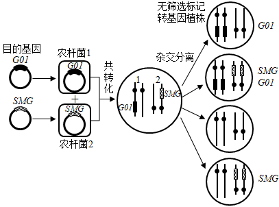

A. 分别带有目的基因和标记基因的两个质粒，都带有T-DNA序列

B. 该方法建立在高转化频率基础上，标记基因和目的基因须转到不同染色体上

C. 若要获得除标记基因的植株，转化植株必须经过有性繁殖阶段遗传重组

D. 获得的无筛选标记转基因植株发生了染色体结构变异

【答案】D

【解析】

【分析】将目的基因导入植物细胞采用最多的方法是农杆菌转化法。农杆菌中的Ti质粒上的T-DNA可转移至受体细胞，并且整合到受体细胞染色体的DNA上。根据农杆菌的这种特点，如果将目的基因插入到Ti质粒的T-DNA上，通过农杆菌的转化作用，就可以使目的基因进入植物细胞，并将其插入到植物细胞中染色体的DNA上，使目的基因的遗传特性得以稳定维持和表达。

【详解】A、农杆菌中的Ti质粒上的T-DNA可转移至受体细胞，并且整合到受体细胞染色体的DNA上，故分别带有目的基因和标记基因的两个质粒，都带有T-DNA序列，进而成功整合到受体细胞染色体上，A正确；

B、该方法需要利用农杆菌转化法，在高转化频率的基础上，将目的基因和标记基因整合到染色体上，由图可知，标记基因和目的基因位于细胞中不同的染色体上，B正确；

C、通过杂交分离结果可知，经过有性繁殖阶段遗传重组后获得了三种类型细胞，其中包括只含目的基因的，只含标记基因的和既含目的基因又含标记基因的，C正确；

D、获得的无筛选标记转基因植株发生了基因重组，D错误。

故选D。

14\. 某同学选用新鲜成熟的葡萄制作果酒和果醋，下列相关叙述正确的是（　　）

A. 果酒发酵时，每日放气需迅速，避免空气回流入发酵容器

B. 果酒发酵时，用斐林试剂检测葡萄汁中还原糖含量变化，砖红色沉淀逐日增多

C. 果醋发酵时，发酵液产生的气泡量明显少于果酒发酵时

D. 果醋发酵时，用重铬酸钾测定醋酸含量变化时，溶液灰绿色逐日加深

【答案】A

【解析】

【分析】参与果酒制作的微生物是酵母菌，其新陈代谢类型为异养兼性厌氧型。参与果醋制作的微生物是醋酸菌，其新陈代谢类型是异养需氧型。果醋制作的原理：当氧气、糖源都充足时，醋酸菌将葡萄汁中的糖分解成醋酸。当缺少糖源时，醋酸菌将乙醇变为乙醛，再将乙醛变为醋酸。

【详解】A、酒精发酵是利用酵母菌的无氧呼吸，果酒发酵时，每日放气需迅速，避免空气回流入发酵容器，影响酒精发酵，A正确；

B、果酒发酵时，发酵液中的葡萄糖不断被消耗，因此用斐林试剂检测葡萄汁中还原糖含量变化，砖红色沉淀逐日减少，B错误；

C、若以酒精为底物进行醋酸发酵，酒精与氧气发生反应产生醋酸和水，几乎没有气泡产生，发酵液产生的气泡量明显少于果酒发酵时，若以葡萄糖为底物进行醋酸发酵，发酵液产生的气泡量与果酒发酵时相当，C错误；

D、重铬酸钾用于检测酒精，不能用于测定醋酸含量，D错误。

故选A。

**二、多项选择题:**

15\. 为了推进乡村报兴，江苏科技人员在某村引进赤松茸，推广“稻菇轮诈”露地栽培模式，如下图所示，相关叙述正确的是（ ）

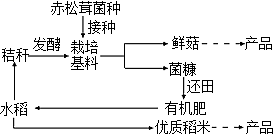

A. 当地农田生态系统中引进的赤松茸，是该系统中的生产者之一

B. 该模式沿袭了“无废弃农业”的传统，菌糠和秸秆由废弃物变为了生产原料

C. 该模式充分利用了水稻秸秆中的能量，提高了能量传递效率

D. 该模式既让土地休养生息，又增加了生态效益和经济效益

【答案】BD

【解析】

【分析】据题干信息可知，该生态农业模式，沿袭了“无废弃物农业”的传统，充分利用了秸秆中的能量，从而提高能量的利用率，菌糠和秸秆由废弃物变为了生产原料，实现了物质的循环利用，该模式既让土地休养生息，在确保土地的肥力的同时又增加了生态效益和经济效益。

【详解】A、由图观察可知，赤松茸接种在以秸秆发酵的栽培基料上，属于该生态系统中的分解者，A错误；

B、该模式沿袭了“无废弃物农业”的传统，遵循物质循环再生原理，菌糠和秸秆由废弃物变为了生产原料，实现了物质的循环利用，B正确；

C、该模式充分利用了秸秆中的能量，从而提高能量的利用率，但不能提高能量的传递效率，C错误；

D、该模式既让土地休养生息，在确保土地的肥力的同时又增加了生态效益和经济效益，D正确。

故选BD。

16\. 短指（趾）症为显性遗传病，致病基因在群体中频率约为1/100~1/1000。如图为该遗传病某家族系谱图，下列叙述正确的是（ ）

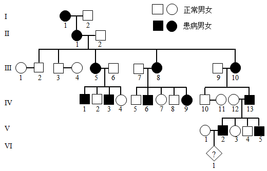

A. 该病为常染色体遗传病

B. 系谱中的患病个体都是杂合子

C. VI1是患病男性的概率为1/4

D. 群体中患者的纯合子比例少于杂合子

【答案】ACD

【解析】

【分析】1、分析系谱图可知：Ⅳ12正常女性和Ⅳ13患病男性婚配，后代中男性有患病和正常两种情况，且短指（趾）症为显性遗传病，可知该致病基因位于常染色体上。

2、常染色体显性遗传病的发病特点：(1）与性别无关，即男女患病的机会均等；(2）患者的双亲中必有一个为患者，但绝大多数为杂合子；(3）双亲无病时，子女一般不会患病(除非发生新的基因突变)；(4）连续传递，即通常连续几代都可能有患者。

【详解】A、假设患病基因用A/a表示，Ⅳ12和Ⅳ13婚配，若患病基因在X染色体上，则亲代基因型为XaXa、XAY，子代中不会有患病男性，故该病的致病基因在常染色体上，为常染色体遗传病，A正确；

B、该病为常染色体显性遗传病，系谱图中患病个体中Ⅰ1个体为患者，其基因型为A\_，因Ⅰ2个体为正常人，基因型为aa，其后代Ⅱ1为杂合子，故不确定Ⅰ1个体是不是杂合体，也可能是纯合体其他患病后代有正常个体，故其他患病个体都是杂合子，B错误；

C、Ⅳ12正常女性和Ⅳ13患病男性婚配，其后代Ⅴ2个体为患者，其基因型为Aa，和正常人Ⅴ1婚配，Ⅴ1基因型为aa，则后代VI1是患者的概率为1/2，是患病男性的概率为1/2×1/2=1/4，C正确；

D、在群体中该显性致病基因的频率很低，约为1/100～1/1000，根据遗传平衡定律，显性纯合子短指症患者AA的频率更低，大约为1/10000～1/1 000 000，而杂合子短指症患者Aa的频率可约为1/50～1/500，故绝大多数短指症患者的基因型为Aa，即群体中患者的纯合子比例少于杂合子，D正确。

故选ACD。

17\. 下表和图为外加激素处理对某种水稻萌发影响的结果。萌发速率（T50）表达最终发芽率50%所需的时间，发芽率为萌发种子在总数中的比率。“脱落酸一恢复”组为1.0mmol/L脱落酸浸泡后，洗去脱落酸。下列相关叙述正确的是（ ）

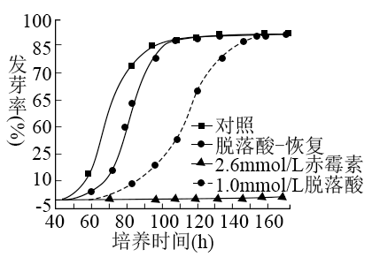

<table style="width:63%;">
<colgroup>
<col style="width: 26%" />
<col style="width: 17%" />
<col style="width: 18%" />
</colgroup>
<thead>
<tr>
<th rowspan="2" style="text-align: center;">激素浓度（mmol/L）</th>
<th colspan="2" style="text-align: center;">平均T50（h）</th>
</tr>
<tr>
<th style="text-align: center;">赤霉素</th>
<th style="text-align: center;">脱落酸</th>
</tr>
</thead>
<tbody>
<tr>
<td style="text-align: center;">0</td>
<td style="text-align: center;">83</td>
<td style="text-align: center;">83</td>
</tr>
<tr>
<td style="text-align: center;">0.01</td>
<td style="text-align: center;">83</td>
<td style="text-align: center;">87</td>
</tr>
<tr>
<td style="text-align: center;">0.1</td>
<td style="text-align: center;">82</td>
<td style="text-align: center;">111</td>
</tr>
<tr>
<td style="text-align: center;">1.0</td>
<td style="text-align: center;">80</td>
<td style="text-align: center;">未萌发</td>
</tr>
<tr>
<td style="text-align: center;">2.5</td>
<td style="text-align: center;">67</td>
<td style="text-align: center;">未萌发</td>
</tr>
</tbody>
</table>

A. 0.1mmol/L浓度时，赤霉素的作用不显著，脱落酸有显著抑制萌发作用

B. 1.0mmol/L浓度时，赤霉素促进萌发，脱落酸将种子全部杀死

C. 赤霉素仅改变T50，不改变最终发芽率

D. 赤霉素促进萌发对种子是有益的，脱落酸抑制萌发对种子是有害的

【答案】AC

【解析】

【分析】分析曲线图：与对照组相比，用2.5mmol/L的赤霉素处理后，种子提前萌发，但最终发芽率与对照组相同；用1.0mmol/L脱落酸处理后，种子不能萌发；“脱落酸一恢复”组处理后，种子延迟萌发，最终发芽率与对照组相同。分析表格数据可知，与对照组（激素浓度为0组）比较，0.01mmol/L和0.1mmol/L的赤霉素作用效果不显著。1.0mmol/L及以上浓度的脱落酸处理后，种子不萌发。

【详解】A、据表格数据可知，0.1mmol/L浓度时，赤霉素组的平均T50为82，与对照组的平均T50基本相同，说明该浓度的赤霉素的作用不显著，脱落酸组的平均T50为111，明显高于对照组，说明脱落酸有显著抑制萌发作用，A正确；

B、据表格数据可知，1.0mmol/L浓度时，赤霉素组的平均T50为80，低于对照组的平均T50，说明赤霉素促进萌发，1.0mmol/L浓度时，脱落酸组不萌发，但不能说明脱落酸将种子全部杀死，B错误；

C、综合分析曲线图和表格数据可知，赤霉素仅改变T50，使种子提前萌发，但不改变最终发芽率，C正确；

D、不能说赤霉素促进萌发对种子是有益的，脱落酸抑制萌发对种子是有害的，要根据实际情况而定，D错误。

故选AC。

18\. 为提高一株石油降解菌的净化能力，将菌涂布于石油为唯一碳源的固体培养基上，以致死率为90%的辐照剂量诱变处理，下列叙述不合理的是（ ）

A. 将培养基分装于培养皿中后灭菌，可降低培养基污染的概率

B. 涂布用的菌浓度应控制在30~300个/mL

C. 需通过预实验考察辐射时间对存活率的影响，以确定最佳诱变时间

D. 挑取培养基上长出的较大单菌落，给纯化后进行降解效率分析

【答案】AB

【解析】

【分析】培养基的配制：计算→称量→溶化→灭菌→倒平板。微生物的接种方法有稀释涂布平板法和平板划线法。预实验可以为正式实验进一步的摸索条件，可以检验实验设计的科学性和可行性，避免人力、物力和财力的浪费。

【详解】A、培养基应先灭菌再分装于培养皿中，A错误；

B、涂布用的菌浓度应控制在106倍，以避免菌种重叠而不能得到单菌落，B错误；

C、需通过预实验考察辐射时间对存活率的影响，再进行正式实验，以确定最佳诱变时间，C错误；

D、石油降解菌能分解石油获得碳源，形成菌落，挑取培养基上长出的较大单菌落，给纯化后进行降解效率分析，以获得能高效降解石油的菌种，D正确。

故选AB。

19\. 数据统计和分析是许多实验的重要环节，下列实验中获取数据的方法合理的是（ ）

| 编号  | 实验内容                   | 获取数据的方法                         |
|:--- |:---------------------- |:------------------------------- |
| ①   | 调查某自然保护区灰喜鹊的种群密度       | 使用标志重捕法，尽量不影响标记动物正常活动，个体标记后即释放  |
| ②   | 探究培养液中酵母菌种群数量的变化       | 摇匀后抽取少量培养物，适当稀释，用台盼蓝染色，血细胞计数板计数 |
| ③   | 调查高度近视（600度以上）在人群中的发病率 | 在数量足够大的人群中随机调查                  |
| ④   | 探究唾液淀粉酶活性的最适温度         | 设置0℃、37℃、100℃三个温度进行实验，记录实验数据    |

A. 实验① B. 实验② C. 实验③ D. 实验④

【答案】ABC

【解析】

【分析】1、估算培养液中酵母菌种群数量可以采用抽样检测的方法：先将盖玻片放在计数室上，用吸管吸取培养液，滴于盖玻片边缘，让培养液自行渗入，多余培养液用滤纸吸去，稍待片刻，待酵母菌细胞全部沉降到计数室底部，将计数板放在载物台的中央，计数一个小方格内的酵母菌数量，再以此为根据，估算试管中的酵母菌总数。2、调查人类遗传病时，最好选取群体中发病率相对较高的单基因遗传病，如色盲、白化病等；若调查的是遗传病的发病率，则应在群体中抽样调查，选取的样本要足够的多，且要随机取样；若调查的是遗传病的遗传方式，则应以患者家庭为单位进行调查，然后画出系谱图，再判断遗传方式。

【详解】A、灰喜鹊属于活动范围广、活动能力强的动物，应使用标志重捕法调查灰喜鹊的种群密度，且标记尽量不影响标记动物正常活动，个体标记后即释放，A正确；

B、探究培养液中酵母菌种群数量的变化时，摇匀后抽取少量培养物，适当稀释，用台盼蓝染液染色，血细胞计数板计数，被染成蓝色的酵母菌为死细胞，在观察计数时只计不被染成蓝色的酵母菌，B正确；

C、调查高度近视（600度以上）在人群中的发病率，应在群体中抽样调查，选取的样本要足够的多，且要随机取样，C正确；

D、探究唾液淀粉酶活性的最适温度时，应围绕37.0℃在梯度为0.5℃的不同温度下进行实验，若设置0℃、37℃、100℃三个温度进行实验，不能说明唾液淀粉酶的最适温度是37.0℃，D错误。

故选ABC。

**三、非选择题:**

20\. 线粒体对维持旺盛的光合作用至关重要。下图示叶肉细胞中部分代谢途径，虚线框内示“草酰乙酸/苹果酸穿梭”，请据图回答下列问题。

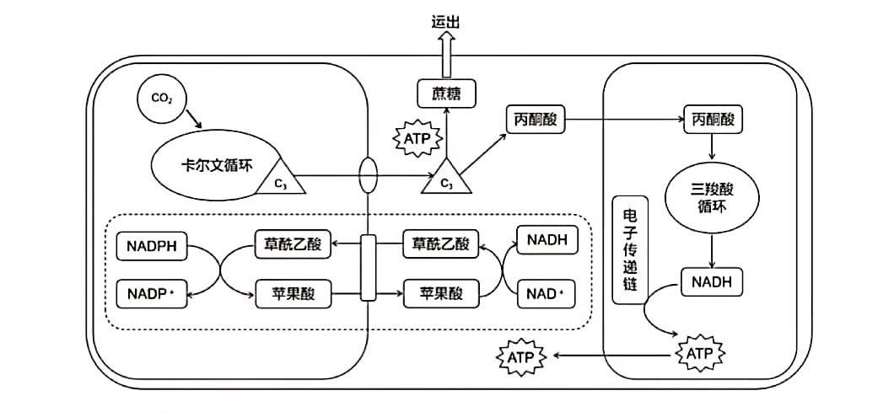

（1）叶绿体在\_\_\_上将光能转变成化学能，参与这一过程的两类色素是\_\_\_\_\_。

（2）光合作用时，CO2与C5结合产生三碳酸，继而还原成三碳糖（C3），为维持光合作用持续进行，部分新合成的C3必须用于再生\_\_\_\_\_\_；运到细胞质基质中的C3可合成蔗糖，运出细胞。每运出一分子蔗糖相当于固定了\_\_\_个CO2分子。

（3）在光照过强时，细胞必须耗散掉叶绿体吸收的过多光能，避免细胞损伤。草酸乙酸/苹果酸穿梭可有效地将光照产生的\_\_\_\_\_\_中的还原能输出叶绿体，并经线粒体转化为\_\_\_\_\_\_中的化学能。

（4）为研究线粒体对光合作用的影响，用寡霉素（电子传递链抑制剂）处理大麦，实验方法是:取培养10~14d大麦苗，将其茎漫入添加了不同浓度寡霉素的水中，通过蒸腾作用使药物进入叶片。光照培养后，测定，计算光合放氧速率（单位为µmolO2•mg-1chl•h-1，chl为叶绿素）。请完成下表。

| 实验步骤的目的                         | 简要操作过程                                      |
|:------------------------------- |:------------------------------------------- |
| 配制不同浓度的寡霉素丙酮溶液                  | 寡霉素难溶于水，需先溶于丙酮，配制高浓度母液，并用丙酮稀释成不同药物浓度，用于加入水中 |
| 设置寡霉素为单一变量的对照组                  | ①\_\_\_\_\_\_\_\_\_\_\_\_\_\_\_             |
| ②\_\_\_\_\_\_\_\_\_\_\_\_\_\_\_ | 对照组和各实验组均测定多个大麦叶片                           |
| 光合放氧测定                          | 用氧电极测定叶片放氧                                  |
| ③\_\_\_\_\_\_\_\_\_\_\_\_\_\_\_ | 称重叶片，加乙醇研磨，定容，离心，取上清液测定                     |

【答案】（1） ①. 类囊体薄膜 ②. 叶绿素、类胡萝卜素

（2） ①. C5 ②. 12

（3） ①. \[H\]\
②. ATP

（4） ①. 在水中加入相同体积不含寡霉素丙酮 ②. 减少叶片差异造成的误差\
③. 叶绿素定量测定（或测定叶绿素含量）

【解析】

【分析】图示表示植物叶肉细胞光合作用的碳反应、蔗糖的合成以及呼吸作用过程的代谢途径，设计实验研究线粒体对光合作用的影响。

【小问1详解】

光合作用光反应场所为类囊体薄膜，将光能转变成化学能，参与该反应的光和色素是叶绿素、类胡萝卜素。

【小问2详解】

据题意在暗反应进行中为维持光合作用持续进行，部分新合成的C3可以转化为C5继续被利用；一分子蔗糖含12个C原子，C5含有5个碳原子，据图固定1个CO2合成1个C3，应为还要再生出C5，故需要12个CO2合成一分子蔗糖。

【小问3详解】

NADPH起还原剂的作用，含有还原能，呼吸作用过程中能量释放用于合成ATP中的化学能和热能。

【小问4详解】

设计实验遵循单一变量原则，对照原则，等量原则，对照组为在水中加入相同体积不含寡霉素丙酮溶液。对照组和各实验组均测定多个大麦叶片的原因是减少叶片差异造成的误差。称重叶片，加乙醇研磨，定容，离心，取上清液测定其中叶绿素的含量。

【点睛】本题主要考查光合作用与呼吸作用的过程，线粒体与叶绿体功能的理解和应用，意在增强学生设计实验的能力，题目难度中等。

21\. 正常人体在黎明觉醒前后肝脏生糖和胰岛素敏感性都达到高峰，伴随胰岛素水平的波动，维持机体全天血糖动态平衡，约50%的Ⅱ型糖尿病患者发生“黎明现象”（黎明时处于高血糖水平，其余时间血糖平稳），是糖尿病治疗的难点。请回答下列问题。

（1）人体在黎明觉醒前后主要通过\_\_\_\_\_\_\_\_\_\_\_分解为葡萄糖，进而为生命活动提供能源。

（2）如图所示，觉醒后人体摄食使血糖浓度上升，葡萄糖经GLUT2以\_\_\_\_\_\_\_\_\_\_方式进入细胞，氧化生成ATP，ATP/ADP比率的上升使ATP敏感通道关闭，细胞内K+浓度增加，细胞膜内侧膜电位的变化为\_\_\_\_\_\_\_\_\_\_\_\_\_\_，引起钙通道打开，Ca2+内流，促进胰岛素以\_\_\_\_\_\_\_\_\_\_\_\_方式释放。

（3）胰岛素通过促进\_\_\_\_\_\_\_\_\_\_\_\_、促进糖原合成与抑制糖原分解、抑制非糖物质转化等发挥降血糖作用，胰岛细胞分泌的\_\_\_\_\_\_\_\_\_\_\_能升高血糖，共同参与维持血糖动态平衡。

（4）Ⅱ型糖尿病患者的靶细胞对胰岛素作用不敏感，原因可能有：\_\_\_\_\_\_\_\_\_\_\_\_\_（填序号）

①胰岛素拮抗激素增多 ②胰岛素分泌障碍 ③胰岛素受体表达下降 ④胰岛素B细胞损伤 ⑤存在胰岛细胞自身抗体

（5）人体昼夜节律源于下丘脑视交叉上核SCN区，通过神经和体液调节来调控外周节律。研究发现SCN区REV-ERB基因节律性表达下降，机体在觉醒时糖代谢异常，表明“黎明现象”与生物钟紊乱相关。由此推测，Ⅱ型糖尿病患者的胰岛素不敏感状态具有\_\_\_\_\_\_\_\_\_\_\_\_\_的特点，而\_\_\_\_\_\_\_\_\_\_\_\_\_可能成为糖尿病治疗研究新方向。

【答案】（1）肝糖原 （2） ①. 易化扩散（或协助扩散） ②. 由负变正\
③. 胞吐

（3） ①. 葡萄糖摄取、氧化分解 ②. 胰高血糖素 （4）①③

（5） ① 昼夜节律 ②. 调节REV-ERB基因节律性表达

【解析】

【分析】分析题图和题干信息可知，当血糖浓度增加时，葡萄糖经GLUT2以协助扩散进入胰岛B细胞，氧化生成ATP，ATP/ADP比率的上升使ATP敏感通道关闭，K+外流受阻，细胞内K+浓度增加，进而触发Ca2+大量内流，由此引起胰岛素分泌，胰岛素通过促进靶细胞摄取、利用和储存葡萄糖，使血糖浓度降低。

【小问1详解】

人体血糖的来源有3条：食物中糖类的消化吸收，肝糖原的分解和非糖物质转化为葡萄糖。人体在黎明觉醒前后主要通过肝糖原分解为葡萄糖，进而为生命活动提供能源。

【小问2详解】

据图判断，葡萄糖进入细胞是从高浓度到低浓度，需要载体（GLUT2），不需要能量，属于协助扩散；葡萄糖进入细胞，氧化生成ATP，ATP/ADP比率的上升使K+通道关闭，进而引发Ca2+通道打开，此时细胞膜内侧膜电位由负电位变为正电位。钙通道打开，Ca2+内流，促进胰岛素以胞吐的方式释放。

【小问3详解】

胰岛素是人体唯一的降血糖激素，能促进细胞摄取、利用（氧化分解）葡萄糖，促进糖原合成，抑制肝糖原分解和非糖物质转化为葡萄糖，从而使血糖浓度降低。胰岛细胞分泌的胰高血糖素能促进肝糖原的分解和非糖物质转化为葡萄糖，使血糖浓度升高，二者共同参与维持血糖动态平衡。

【小问4详解】

①胰岛素拮抗激素增多会影响靶细胞对胰岛素的敏感性，使血糖升高，①正确；②Ⅱ型糖尿病患者的胰岛素水平正常，不存在胰岛素分泌障碍，②错误；③胰岛素受体表达下降，靶细胞上胰岛素受体减少，会导致靶细胞对胰岛素作用不敏感，③正确；④胰岛素B细胞损伤会导致胰岛素缺乏，而Ⅱ型糖尿病患者的胰岛素水平正常，④错误；⑤存在胰岛细胞自身抗体会导致胰岛素分泌不足，而Ⅱ型糖尿病患者的胰岛素水平正常，⑤错误。故选①③。

【小问5详解】

研究发现SCN区REV-ERB基因节律性表达下降，机体在觉醒时糖代谢异常，表明“黎明现象”与生物钟紊乱相关。由此推测，Ⅱ型糖尿病患者的胰岛素不敏感状态具有昼夜节律性，在觉醒时，糖代谢异常，出现“黎明现象”。由此，调节REV-ERB基因节律性表达可能成为糖尿病治疗研究新方向。

【点睛】此题主要考查的是血糖平衡的调节，意在考查学生对基础知识的理解掌握，难度适中。

22\. 根据新冠病毒致病机制及人体免疫反应特征研制新冠疫苗，广泛接种疫苗可以快速建立免疫屏障，阻击病毒扩大。图1为新冠病毒入侵细胞后的增殖示意图，图2为人体免疫应答产生抗体的一般规律示意图。请据图回答下列问题。

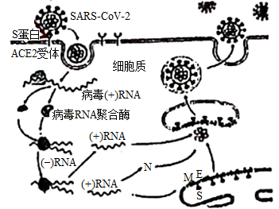

（1）图1中，新冠病毒通过S蛋白与细胞表面的ACE2受体结合，侵入细胞释放出病毒的（+）RNA，在宿主细胞中经\_\_\_\_\_\_\_\_\_\_\_\_合成病毒的RNA聚合酶。

（2）在RNA聚合酶的作用下，病毒利用宿主细胞中的原料，按照\_\_\_\_\_\_\_\_\_\_原则合成（-）RNA。随后大量合成新的（+）RNA。再以这些RNA为模板，分别在\_\_\_\_\_\_\_\_\_\_\_\_大量合成病毒的N蛋白和S、M、E蛋白。

（3）制备病毒灭活疫苗时，先大量培养表达\_\_\_\_\_\_\_\_\_\_\_的细胞，再接入新冠病毒扩大培养，灭活处理后制备疫苗。细胞培养时需通入CO2，其作用是\_\_\_\_\_\_\_\_\_\_\_\_\_\_。

（4）制备S蛋白的mRNA疫苗时，体外制备的mRNA常用脂质分子包裹后才用于接种。原因一是人体血液和组织中广泛存在\_\_\_\_\_\_\_\_\_\_，极易将裸露的mRNA水解，二是外源mRNA分子不易进入人体细胞产生抗原。

（5）第一次接种疫苗后，人体内识别到S蛋白的B细胞，经过增殖和分化，形成的\_\_\_\_\_\_\_\_细胞可合成并分泌特异性识别\_\_\_\_\_\_\_\_\_\_的IgM和IgG抗体（见图2），形成的\_\_\_\_\_\_细胞等再次接触到S蛋白时，发挥免疫保护作用。

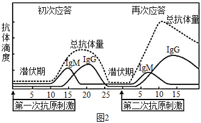

（6）有些疫苗需要进行第二次接种，据图2分析进行二次接种的意义是\_\_\_\_\_\_\_\_。

【答案】（1）翻译 （2） ①. 碱基互补配对 ②. 游离核糖体和粗面内质网上的核糖体

（3） ①. ACE2受体 ②. 维持培养液的酸碱度 （4）RNA酶

（5） ①. 浆 ②. 新冠病毒S蛋白 ③. 记忆

（6）激发再次应答在人体内产生更多维持时间更长的抗体,并储备更多的记忆细胞

【解析】

【分析】由图可知，新冠病毒通过S蛋白与细胞表面的ACE2受体结合，侵入细胞释放出病毒的（+）RNA，在宿主细胞中经翻译合成病毒的RNA聚合酶，参与宿主细胞内合成病毒的RNA。

【小问1详解】

结合分析可知，新冠病毒侵入细胞后释放出病毒的（+）RNA，在宿主细胞中经翻译合成病毒的RNA聚合酶。

【小问2详解】

在RNA聚合酶的作用下，病毒利用宿主细胞中的原料，按照碱基互补配对原则合成（-）RNA；随后再通过复制合成大量新的（+）RNA，再以这些RNA为模板，分别在游离核糖体和粗面内质网上的核糖体大量合成病毒的N蛋白和S、M、E蛋白。

【小问3详解】

病毒表面的蛋白质可作为抗原激发机体的特异性免疫过程，制备新冠病毒灭活疫苗时，先大量培养能够表达ACE2受体的细胞，再接入新冠病毒扩大培养，经灭活处理后制备疫苗；动物细胞培养时常需通入CO2，其目的是维持培养液的酸碱度。

【小问4详解】

由于人体血液和组织中广泛存在RNA酶极易将裸露的mRNA水解，另外外源mRNA分子不易进入人体细胞产生抗原，因此，制备S蛋白的mRNA疫苗时，体外制备的mRNA常用脂质分子包裹后才用于接种。

【小问5详解】

第一次接种疫苗后，刺激B细胞增殖和分化，形成的浆细胞可合成并分泌特异性识别新冠病毒S蛋白的IgM和IgG抗体，并产生记忆细胞；当再次接触到S蛋白时，记忆细胞增殖分化，产生大量浆细胞，分泌大量抗体，发挥免疫保护作用。

【小问6详解】

进行二次接种的意义：激发再次应答在人体内产生更多维持时间更长的抗体,并储备更多的记忆细胞。

【点睛】本题结合COVID-19病毒在宿主细胞内增殖的过程图，考查遗传信息的转录和翻译、碱基互补配对原则的应用及免疫的预防等知识，首先要求考生识记遗传信息转录和翻译过程，能准确判断图中各过程及各物质的名称，掌握特异性免疫过程，免疫预防等方面知识。

23\. 某小组为研究真菌基因m的功能，构建了融合表达蛋白M和tag标签的质粒，请结合实验流程回答下列问题：

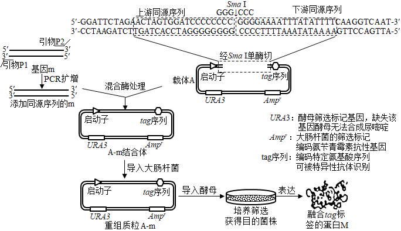

（1）目的基因的扩增

①提取真菌细胞\_\_\_\_\_\_，经逆转录获得cDNA，进一步获得基因m片段。

②为了获得融合tag标签的蛋白M，设计引物P2时，不能包含基因m终止密码子的编码序列，否则将导致\_\_\_\_\_\_。

③热启动PCR可提高扩增效率，方法之一是：先将除TaqDNA聚合酶（Taq酶）以外的各成分混合后，加热到80℃以上再混入酶，然后直接从94℃开始PCR扩增，下列叙述正确的有\_\_\_\_\_\_

A．Taq酶最适催化温度范围为50～60℃

B．与常规PCR相比，热启动PCR可减少反应起始时引物错配形成的产物

C．两条子链的合成一定都是从5′端向3′端延伸

D．PCR产物DNA碱基序列的特异性体现了Taq酶的特异性

（2）重组质粒的构建

①将Sma I切开的载体A与添加同源序列的m混合，用特定DNA酶处理形成黏性末端，然后降温以促进\_\_\_\_\_\_，形成A-m结合体。将A-m结合体导入大肠杆菌，利用大肠杆菌中的DNA聚合酶及\_\_\_\_\_\_酶等，完成质粒的环化。

②若正确构建的重组质粒A—m仍能被Sma I切开，则Sma I的酶切位点可能在\_\_\_\_\_\_。

（3）融合蛋白的表达

①用含有尿嘧啶的培养基培养URA3基因缺失型酵母，将其作为受体菌，导入质粒A-m，然后涂布于无尿嘧啶的培养基上，筛选获得目的菌株，其机理是\_\_\_\_\_\_。

②若通过抗原一抗体杂交实验检测到酵母蛋白中含lag标签，说明\_\_\_\_\_\_，后续实验可借助tag标签进行蛋白M的分离纯化。

【答案】（1） ①. RNA ②. 蛋白M上不含tag标签 ③. BC

（2） ①. 黏性末端碱基配对 ②. DNA连接 ③. 基因m的连接处、基因m的内部

（3） ①. 受体菌在无尿嘧啶的培养基上无法生长，导入重组质粒的受体菌含有URA3基因可以长成菌落 ②. 融合基因表达（或融合基因正确解码）

【解析】

【分析】基因工程技术的基本步骤：

（1）目的基因的获取：方法有从基因文库中获取、利用PCR技术扩增和人工合成。

（2）基因表达载体的构建：是基因工程的核心步骤，基因表达载体包括目的基因、启动子、终止子和标记基因等。

（3）将目的基因导入受体细胞：根据受体细胞不同，导入的方法也不一样。将目的基因导入植物细胞的方法有农杆菌转化法、基因枪法和花粉管通道法；将目的基因导入动物细胞最有效的方法是显微注射法；将目的基因导入微生物细胞的方法是感受态细胞法。

（4）目的基因的检测与鉴定：分子水平上的检测：①检测转基因生物染色体的DNA是否插入目的基因--DNA分子杂交技术；②检测目的基因是否转录出了mRNA--分子杂交技术；③检测目的基因是否翻译成蛋白质--抗原-抗体杂交技术。个体水平上的鉴定：抗虫鉴定、抗病鉴定、活性鉴定等。

【小问1详解】

①以逆转录获得cDNA的方式，要先从真菌细胞中提取基因m转录出来的mRNA。

②从构建好的重组质粒上看，tag序列位于目的基因下游，若m基因的转录产物mRNA上有终止密码子，核糖体移动到终止密码子多肽链就断开，则不会对tag序列的转录产物继续进行翻译，蛋白M上就不含tag标签。

③A、从题干信息可知，“80℃以上再混入酶，然后直接从94℃开始PCR扩增”，故Taq酶最适催化温度范围为94℃左右，A错误；

B、PCR 反应的最初加热过程中，样品温度上升到70℃之前，在较低的温度下引物可能与部分单链模板形成非特异性结合，并在Taq DNA 聚合酶的作用下延伸，结果会导致引物错配形成的产物的扩增，影响反应的特异性；热启动可减少引物错配形成的产物的扩增，提高反应的特异性，B正确；

C、DNA分子复制具有方向性，都是从5′端向3′端延伸，C正确；

D、Taq酶没有特异性，与普通的DNA聚合酶相比，Taq酶更耐高温，D错误。

故选BC。

【小问2详解】

①从图上看，载体A只有一个Sma I的酶切位点，故被Sma I切开后，载体由环状变为链状DNA，将Sma I切开的载体A与添加同源序列的m混合，用特定DNA酶处理形成黏性末端，然后降温以促进载体A与添加同源序列的m的黏性末端碱基互补配对。将A-m结合体导入大肠杆菌，利用大肠杆菌中的DNA聚合酶及DNA连接酶等，完成质粒的环化。

②重组质粒中，载体A被Sma I切开的位置已经与基因m相连，原来的酶切位点已不存在，若正确构建的重组质粒A—m仍能被Sma I切开，则Sma I的酶切位点可能在基因m的连接处或基因m内部。

【小问3详解】

①筛选目的菌株的机理是：导入了质粒A-m的目的菌株由于含有URA3基因，能在无尿嘧啶的培养基上存活，而URA3基因缺失型酵母则不能存活。

②若通过抗原一抗体杂交实验检测到酵母蛋白中含lag标签，位于lag标签上游的基因m应该正常表达，说明融合基因表达（或融合基因正确解码）。

【点睛】本题考查基因工程的相关知识，要求考生识记原理及操作步骤，掌握各操作步骤中需要注意的细节，能将教材中的知识结合题中信息进行知识迁移，准确答题。

24\. 以下两对基因与果蝇眼色有关。眼色色素产生必需有显性基因A，aa时眼色白色；B存在时眼色为紫色，bb时眼色为红色。2个纯系果蝇杂交结果如下图，请据图回答下问题。

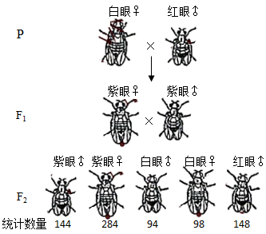

（1）果蝇是遗传学研究的经典实验材料，摩尔根等利用一个特殊眼色基因突变体开展研究，把基因传递模式与染色体在减数分裂中的分配行为联系起来，证明了\_\_\_\_\_\_\_\_\_\_\_\_。

（2）A基因位于\_\_\_\_\_\_染色体上，B基因位于\_\_\_\_\_\_染色体上。若要进一步验证这个推论，可在2个纯系中选用表现型为\_\_\_\_\_\_\_\_\_\_\_\_\_\_的果蝇个体进行杂交。

（3）上图F1中紫眼雌果蝇的基因型为\_\_\_\_\_\_，F2中紫眼雌果蝇的基因型有\_\_\_\_\_\_\_\_\_种.

（4）若亲代雌果蝇在减数分裂时偶尔发生X染色体不分离而产生异常卵，这种不分离可能发生的时期有\_\_\_\_\_\_\_\_\_，该异常卵与正常精子受精后，可能产生的合子主要类型有\_\_\_\_\_\_\_\_.

（5）若F2中果蝇单对杂交实验中出现了一对果蝇的杂交后代雌雄比例为2:1，由此推测该对果蝇的\_\_\_\_\_\_\_\_\_性个体可能携带隐性致死基因；若继续对其后代进行杂交，后代雌雄比为\_\_\_\_\_\_\_\_\_\_\_\_\_\_\_时，可进一步验证这个假设。

【答案】（1）基因位于染色体上

（2） ①. 常 ②. X\
③. 红眼雌性和白眼雄性

（3） ①. AaXBXb ②. 4

（4） ①. 减数第一次分裂后期或减数第二次分裂后期\
②. AaXBXBXb、AaXbO、AaXBXBY、AaYO。

（5） ①. 雌\
②. 4:3

【解析】

【分析】分析题意：由F2红眼性状只在雄果蝇出现可知，红眼性状与性别有关，说明B/b基因位于X染色体上。F2雌雄果蝇均出现白眼和紫眼，说明A/a基因位于常染色体上，两对基因自由组合。据题意：眼色色素产生必需有显性基因A，aa时眼色白色；B存在时眼色为紫色，bb时眼色为红色。则P纯系白眼雌×红眼雄（AAXbY），F1全为紫眼（A-XBX-、A-XBY），说明P纯系白眼雌为aaXBXB。由此可知，F1为AaXBXb（紫眼雌）、AaXBY（紫眼雄）。

【小问1详解】

摩尔根等利用一个特殊眼色基因突变体开展研究，把基因传递模式与染色体在减数分裂中的分配行为联系起来，利用假说演绎法，证明了基因位于染色体上。

【小问2详解】

据分析可知，A基因位于常染色体上，B基因位于X染色体上。若要进一步验证这个推论，可在2个纯系中选用红眼雌果蝇（AAXbXb）和白眼雄果蝇（aaXBY）杂交，子代为AaXBXb（紫眼雌性）、AaXbY（红眼雄性），即可证明。

小问3详解】

据分析可知，F1中紫眼雌果蝇的基因型为AaXBXb，F1中紫眼雄果蝇的基因型为AaXBY，杂交后，F2中紫眼雌果蝇的基因型A-XBX-，有2×2=4种。

【小问4详解】

P纯系白眼雌为aaXBXB，若亲代雌果蝇在减数分裂时偶尔发生X染色体不分离而产生异常卵，这种不分离可能发生减数第一次分裂后期（同源染色体未分离）或减数第二次分裂后期（姐妹染色单体未分离），产生的异常卵细胞基因型为aXBXB或a。P红眼雄（AAXbY）产生的精子为AXb和AY，该异常卵与正常精子受精后，可能产生的合子主要类型有AaXBXBXb、AaXbO、AaXBXBY、AaYO。

【小问5详解】

若F2中果蝇单对杂交实验中出现了一对果蝇的杂交后代雌雄比例为2:1，说明雄性个体有一半致死，雌性正常，致死效应与性别有关联，则可推测是b基因纯合致死，该对果蝇的雌性个体可能携带隐性致死基因，则该F2亲本为XBXb和XBY杂交，F3为：雌性1/2XBXB、1/2XBXb，雄性为XBY、XbY（致死）。若假设成立，继续对其后代进行杂交，后代为3XBXB、1XBXb、3XBY、1XbY（致死），雌雄比为4：3。

【点睛】本题考查基因自由组合定律的实质及应用、伴性遗传等知识，要求考生掌握基因自由组合定律的实质，能根据子代的表现型推断亲代的基因型；掌握伴性遗传的特点，对于减数分裂过程中染色体的异常分离、基因隐性纯合致死是本题的难点和易错点。
