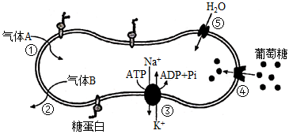
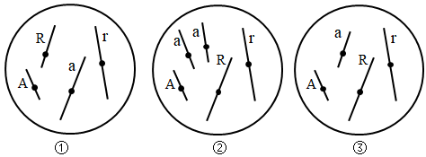
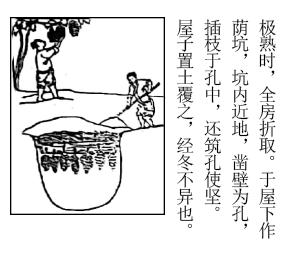
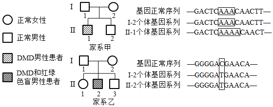
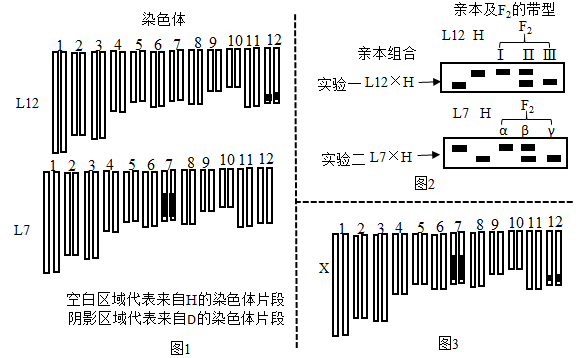
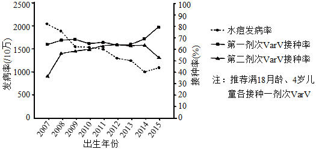
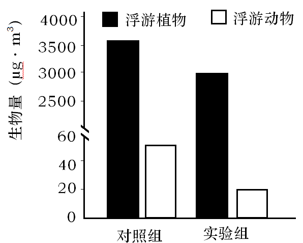

**2021年河北省普通高中学业水平选择性考试**

**生物**

**一、单项选择题**

1\. 下列叙述正确是（ ）

A. 酵母菌和白细胞都有细胞骨架 B. 发菜和水绵都有叶绿体

C. 颤藻、伞藻和小球藻都有细胞核 D. 黑藻、根瘤菌和草履虫都有细胞壁

2\. 关于细胞核的叙述，错误的是（ ）

A. 有丝分裂过程中，核膜和核仁周期性地消失和重现

B. 蛋白质合成活跃的细胞，核仁代谢活动旺盛

C. 许多对基因表达有调控作用的蛋白质在细胞质合成，经核孔进入细胞核

D. 细胞质中的RNA均在细胞核合成，经核孔输出

3\. 关于生物学实验的叙述，错误的是（ ）

A. NaOH与CuSO4配合使用在还原糖和蛋白质检测实验中作用不同

B. 染色质中的DNA比裸露的DNA更容易被甲基绿着色

C. 纸层析法分离叶绿体色素时，以多种有机溶剂的混合物作为层析液

D. 利用取样器取样法调查土壤小动物的种类和数量，推测土壤动物的丰富度

4\. 人体成熟红细胞能够运输O2和CO2，其部分结构和功能如图，①~⑤表示相关过程。下列叙述错误的是（ ）

A. 血液流经肌肉组织时，气体A和B分别是CO2和O2

B. ①和②是自由扩散，④和⑤是协助扩散

C. 成熟红细胞通过无氧呼吸分解葡萄糖产生ATP，为③提供能量

D. 成熟红细胞表面的糖蛋白处于不断流动和更新中

5\. 关于细胞生命历程的叙述，错误的是（ ）

A. 细胞凋亡过程中不需要新合成蛋白质

B. 清除细胞内过多的自由基有助于延缓细胞衰老

C. 紫外线照射导致的DNA损伤是皮肤癌发生的原因之一

D. 已分化的动物体细跑的细胞核仍具有全能性

6\. 雄性缝蝇的求偶方式有：①向雌蝇提供食物；②用丝缕简单缠绕食物后送给雌蝇；③把食物裹成丝球送给雌蝇；④仅送一个空丝球给雌蝇。以上四种方式都能求偶成功。下列叙述错误的是（ ）

A. 求偶时提供食物给雌蝇有利于其繁殖，是一种适应性行为

B. ④是一种仪式化行为，对缝蝇繁殖失去进化意义

C. ③是雌蝇对雄蝇长期选择的结果

D. ④可能由③进化而来

7\. 图中①、②和③为三个精原细跑，①和②发生了染色体变异，③为正常细胞。②减数分裂时三条同源染色体中任意两条正常分离，另一条随机移向一极。不考虑其他变异，下列叙述错误的是（ ）

A. ①减数第一次分裂前期两对同源染色体联会

B. ②经减数分裂形成的配子有一半正常

C. ③减数第一次分裂后期非同源染色体自由组合，最终产生4种基因型配子

D. ①和②的变异类型理论上均可以在减数分裂过程中通过光学显微镜观察到

8\. 关于基因表达的叙述，正确的是（ ）

A. 所有生物基因表达过程中用到的RNA和蛋白质均由DNA编码

B. DNA双链解开，RNA聚合酶起始转录、移动到终止密码子时停止转录

C. 翻译过程中，核酸之间的相互识别保证了遗传信息传递的准确性

D. 多肽链的合成过程中，tRNA读取mRNA上全部碱基序列信息

9\. 关于植物激素的叙述，错误的是（ ）

A. 基因突变导致脱落酸受体与脱落酸亲和力降低时，种子休眠时间比野生型延长

B. 赤霉素受体表达量增加大麦种子萌发时，胚乳中淀粉分解速度比野生型更快

C. 细胞分裂素受体表达量增加的植株，其生长速度比野生型更快

D. 插条浸泡在低浓度NAA溶液中，野生型比生长素受体活性减弱的株系更易生根

10\. 血糖浓度升高时，机体启动三条调节途径：①血糖直接作用于胰岛B细胞；②血糖作用于下丘脑，通过兴奋迷走神经（参与内脏活动的调节）支配胰岛B细胞；③兴奋的迷走神经促进相关胃肠激素释放，这些激素作用于胰岛B细胞。下列叙述错误的是（ ）

A. ①和②均增强了胰岛B细胞的分泌活动

B. ②和③均体现了神经细胞与内分泌细胞间的信息交流

C. ①和③调节胰岛素水平的方式均为体液调节

D. 血糖平衡的调节存在负反馈调节机制

11\. 关于神经细胞的叙述，错误的是（ ）

A. 大脑皮层言语区的H区神经细胞受损伤，患者不能听懂话

B. 主动运输维持着细胞内外离子浓度差，这是神经细胞形成静息电位的基础

C. 内环境K+浓度升高，可引起神经细胞静息状态下膜电位差增大

D. 谷氨酸和一氧化氮可作为神经递质参与神经细胞的信息传递

12\. 湿地生态系统生物多样性丰富，鸟类是其重要组成部分。研究者对某湿地生态系统不同退化阶段的生物多样性进行了调查，结果见下表。下列叙述正确的是（ ）

|         |      |       |        |           |
|:-------:|:----:|:-----:|:------:|:---------:|
|         | 典型湿地 | 季节性湿地 | 中度退化湿地 | 严重退化湿地    |
| 湿地特征    | 常年积水 | 季节性积水 | 无积水    | 完全干涸，鼠害严重 |
| 生物多样性指数 | 2.7  | 2.4   | 2.1    | 1.5       |
| 鸟类丰富度   | 25   | 17    | 12     | 9         |

注：生物多样性指数反映生物多样性水平

A. 严重退化湿地中的鼠类吸引部分猛禽使得食物网结构最为复杂

B. 因湿地退化食物不足，鸟类死亡率增加导致丰富度降低

C. 湿地生态系统稳定性是其自我调节能力的基础

D. 湿地退化对生物多样性的间接价值影响最大

13\. 烟粉虱为害会造成番茄减产。研究者对番茄单作、番茄玫瑰邻作（番茄田与玫瑰田间隔1m）模式下番茄田中不同发育阶段烟粉虱及其天敌进行了调查，结果见下表。下列叙述错误的是（ ）

<table>
<colgroup>
<col style="width: 16%" />
<col style="width: 16%" />
<col style="width: 17%" />
<col style="width: 17%" />
<col style="width: 17%" />
<col style="width: 15%" />
</colgroup>
<tbody>
<tr>
<td rowspan="2" style="text-align: center;">种植模式</td>
<td colspan="3" style="text-align: center;">番茄植株不同部位成虫数量（头叶）</td>
<td rowspan="2" style="text-align: center;">
若虫

（头叶）
</td>
<td rowspan="2" style="text-align: center;">
天敌昆虫

多样性指数
</td>
</tr>
<tr>
<td style="text-align: center;">上部叶</td>
<td style="text-align: center;">中部叶</td>
<td style="text-align: center;">下部叶</td>
</tr>
<tr>
<td style="text-align: center;">番茄单作</td>
<td style="text-align: center;">22.7</td>
<td style="text-align: center;">3.2</td>
<td style="text-align: center;">0.8</td>
<td style="text-align: center;">16.5</td>
<td style="text-align: center;">1.2</td>
</tr>
<tr>
<td style="text-align: center;">番茄玫瑰邻作</td>
<td style="text-align: center;">1.4</td>
<td style="text-align: center;">0.2</td>
<td style="text-align: center;">0.1</td>
<td style="text-align: center;">1.8</td>
<td style="text-align: center;">2.2</td>
</tr>
</tbody>
</table>

A. 由单作转为邻作，烟粉虱种群的年龄结构改变

B. 由单作转为邻作，烟粉虱种群中成虫的空间分布类型改变

C. 由单作转为邻作，群落的水平结构改变

D. 玫瑰吸引天敌防治害虫，体现了生态系统信息调节生物种间关系的功能

**二、多项选择题**

14\. 《齐民要术》中记载了利用荫坑贮存葡萄的方法（如图）。目前我国果蔬主产区普遍使用大型封闭式气调冷藏库（充入氮气替换部分空气），延长了果蔬保鲜时间、增加了农民收益。下列叙述正确的是（ ）

A. 荫坑和气调冷藏库环境减缓了果蔬中营养成分和风味物质分解

B. 荫坑和气调冷藏库贮存的果蔬，有氧呼吸中不需要氧气参与的第一、二阶段正常进行，第三阶段受到抑制

C. 气调冷藏库中的低温可以降低细胞质基质和线粒体中酶的活性

D. 气调冷藏库配备的气体过滤装置及时清除乙烯，可延长果蔬保鲜时间

15\. 杜氏肌营养不良（DMD）是由单基因突变引起的伴X隐性遗传病，男性中发病率约为1/4000。甲、乙家系中两患者的外祖父均表现正常，家系乙Ⅱ-2还患有红绿色盲。两家系部分成员DMD基因测序结果（显示部分序列，其他未显示序列均正常）如图。下列叙述错误的是（ ）

A. 家系甲Ⅱ-1和家系乙Ⅱ-2分别遗传其母亲的DMD致病基因

B. 若家系乙Ⅰ-1和Ⅰ-2再生育一个儿子，儿子患两种病的概率比患一种病的概率低

C. 不考虑其他突变，家系甲Ⅱ-2和家系乙Ⅱ-1婚后生出患DMD儿子的概率为1/8

D. 人群中女性DMD患者频率远低于男性，女性中携带者的频率约为1/4000

16\. 许多抗肿瘤药物通过干扰DNA合成及功能抑制肿瘤细胞增殖。下表为三种抗肿瘤药物的主要作用机理。下列叙述正确的是（ ）

|       |              |
|:-----:|:------------:|
| 药物名称  | 作用机理         |
| 羟基脲   | 阻止脱氧核糖核苷酸的合成 |
| 放线菌素D | 抑制DNA的模板功能   |
| 阿糖胞苷  | 抑制DNA聚合酶活性   |

A. 羟基脲处理后，肿瘤细胞中DNA复制和转录过程都出现原料匮乏

B. 放线菌素D处理后，肿瘤细胞中DNA复制和转录过程都受到抑制

C. 阿糖胞苷处理后，肿瘤细胞DNA复制过程中子链无法正常延伸

D. 将三种药物精准导入肿瘤细胞的技术可减弱它们对正常细胞的不利影响

17\. 高盐饮食后一段时间内，虽然通过调节饮水和泌尿可以使细胞外液渗透压回归Na+摄入前的水平，但机体依旧处于正钠平衡（总Na+摄入多于排泄）状态。下列叙述正确的是（ ）

A. 细胞外液渗透压主要来源于Na+和Cl-

B. 细胞外液渗透压回归与主动饮水、抗利尿激素分泌增加有关

C. 细胞内液不参与细胞外液渗透压的调节

D. 细胞外液渗透压回归但机体处于正钠平衡时，细胞外液总量和体液总量均增多

18\. 我国麋鹿经历了本土野外灭绝、圈养种群复壮、放归野外等历程，成功建立野生种群。2020年，我国麋鹿分布点已从最初的2处发展至81处，数量超过8000只，基本覆盖糜鹿野外灭绝前的栖息地，展现了我国生物多样性保护的智慧。下列叙述正确的是（ ）

A. 可采用逐个计数法统计糜鹿种群密度

B. 增加我国麋鹿种群的遗传多样性，有利于种群的进一步发展

C. 麋鹿种群增长速率最大时，种内斗争最小

D. 对麋鹿种群进行圈养复壮、放归野外的过程属于就地保护

**三、非选择题**

19\. 为探究水和氮对光合作用的影响，研究者将一批长势相同的玉米植株随机均分成三组，在限制水肥的条件下做如下处理：（1）对照组；（2）施氮组，补充尿素（12g·m-2）（3）水+氮组，补充尿素（12g·m-2）同时补水。检测相关生理指标，结果见下表。

|                                              |     |      |      |
|:--------------------------------------------:|:---:|:----:|:----:|
| 生理指标                                         | 对照组 | 施氮组  | 水+氮组 |
| 自由水/结合水                                      | 6.2 | 6.8  | 7.8  |
| 气孔导度（mmol·m-2s-1）      | 85  | 65   | 196  |
| 叶绿素含量（mg·g-1）                     | 9.8 | 11.8 | 12.6 |
| RuBP羧化酶活性（μmol·h-1g-1） | 316 | 640  | 716  |
| 光合速率（μmol·m-2s-1）      | 6.5 | 8.5  | 11.4 |

注：气孔导度反映气孔开放的程度

回答下列问题：

（1）植物细胞中自由水的生理作用包括\_\_\_\_\_\_\_\_\_\_\_\_\_\_\_\_\_\_\_\_等（写出两点即可）。补充水分可以促进玉米根系对氮的\_\_\_\_\_\_\_\_\_\_，提高植株氮供应水平。

（2）参与光合作用的很多分子都含有氮。氮与\_\_\_\_\_\_\_\_\_\_离子参与组成的环式结构使叶绿素能够吸收光能，用于驱动\_\_\_\_\_\_\_\_\_\_两种物质的合成以及\_\_\_\_\_\_\_\_\_\_的分解；RuBP羧化酶将CO2转变为羧基加到\_\_\_\_\_\_\_\_\_\_分子上，反应形成的产物被还原为糖类。

（3）施氮同时补充水分增加了光合速率，这需要足量的CO2供应。据实验结果分析，叶肉细胞CO2供应量增加的原因是\_\_\_\_\_\_\_\_\_\_\_\_\_\_\_\_\_\_\_\_\_\_\_\_\_\_\_\_\_\_。

20\. 我国科学家利用栽培稻（H）与野生稻（D）为亲本，通过杂交育种方法并辅以分子检测技术，选育出了L12和L7两个水稻新品系。L12的12号染色体上带有D的染色体片段（含有耐缺氮基因TD），L7的7号染色体上带有D的染色体片段（含有基因SD），两个品系的其他染色体均来自于H（图1）。H的12号和7号染色体相应片段上分别含有基因TH和SH。现将两个品系分别与H杂交，利用分子检测技术对实验一亲本及部分F2的TD/TH基因进行检测，对实验二亲本及部分F2的SD/SH基因进行检测，检测结果以带型表示（图2）。

回答下列问题：

（1）为建立水稻基因组数据库，科学家完成了水稻\_\_\_\_\_\_\_\_\_\_条染色体的DNA测序。

（2）实验一F2中基因型TDTD对应的是带型\_\_\_\_\_\_\_\_\_\_。理论上，F2中产生带型Ⅰ、Ⅱ和Ⅲ的个体数量比为\_\_\_\_\_\_\_\_\_\_。

（3）实验二F2中产生带型α、β和γ的个体数量分别为12、120和108，表明F2群体的基因型比例偏离\_\_\_\_\_\_\_\_\_\_定律。进一步研究发现，F1的雌配子均正常，但部分花粉无活性。已知只有一种基因型的花粉异常，推测无活性的花粉带有\_\_\_\_\_\_\_\_\_\_（填“SD”或“SH”）基因。

（4）以L7和L12为材料，选育同时带有来自D7号和12号染色体片段的纯合品系X（图3）。主要实验步骤包括：①\_\_\_\_\_\_\_\_\_\_\_\_\_\_\_\_\_\_\_\_\_\_\_\_\_\_\_\_\_\_\_\_\_\_\_\_\_\_\_\_；②对最终获得的所有植株进行分子检测，同时具有带型\_\_\_\_\_\_\_\_\_\_的植株即为目的植株。

（5）利用X和H杂交得到F1，若F1产生的无活性花粉所占比例与实验二结果相同，雌配子均有活性，则F2中与X基因型相同的个体所占比例为\_\_\_\_\_\_\_\_\_\_。

21\. 水痘是由水痘-带状疱疹病毒（VZV）引起的急性呼吸道传染病，多见于儿童，临床特征为全身出现丘疹、水疱。接种VZV减毒活疫苗（VarV）是预防水痘流行的有效方法。2019年，研究者对某地2007～2015年出生儿童的VarV接种率及水痘发病率进行了调查，结果如图。

回答下列问题：

（1）感染初期患者皮肤表面形成透明的水疱，其中的液体主要来自内环境中的\_\_\_\_\_\_\_\_\_\_。

（2）呼吸道黏膜受损者更易被VZV感染，原因是\_\_\_\_\_\_\_\_\_\_\_\_\_\_\_\_\_\_\_\_。VZV感染引发机体的\_\_\_\_\_\_\_\_\_\_（填“特异性”或“非特异性”）免疫，被感染的细胞统称为\_\_\_\_\_\_\_\_\_\_。

（3）水痘临床诊断时，须注意与荨麻疹相区分。与水痘的发病机理不同，某些花粉引起的荨麻疹属于机体的\_\_\_\_\_\_\_\_\_\_反应，是免疫系统的\_\_\_\_\_\_\_\_\_\_功能过强的表现。

（4）图中统计结果显示，随VarV接种率的提高，水痘发病率呈下降趋势。接种VarV后，B淋巴细胞的作用是\_\_\_\_\_\_\_\_\_\_\_\_\_\_\_\_\_\_\_\_\_\_\_\_\_\_\_\_\_\_。

（5）2014年、2015年出生儿童的接种率与发病率数据提示，应及时接种第二剂VarV，原因是第一剂疫苗接种一段时间后\_\_\_\_\_\_\_\_\_\_\_\_\_\_\_\_\_\_\_\_\_\_\_\_\_\_\_\_\_\_\_\_\_\_\_\_\_\_\_\_。

22\. 为探究全球气候变暖对生态系统的影响，研究者将20个人工淡水池塘均分成两组，对照组保持环境温度，实验组始终比对照组高4℃（利用温控装置），并从附近淡水栖息地搜集水生生物投入池塘。连续多年观测发现，池塘逐渐形成主要由浮游植物和浮游动物组成的群落。第15年时，池塘中浮游植物和浮游动物生物量（单位体积水体中生物体的质量）的检测结果如图。

回答下列问题：

（1）池塘生物群落区别于湖泊生物群落的重要特征为\_\_\_\_\_\_\_\_\_\_\_\_\_\_\_\_\_\_\_\_，池塘生物群落从简单到复杂的过程中发生了\_\_\_\_\_\_\_\_\_\_\_\_\_\_\_\_\_\_\_\_演替。

（2）某种水生生物被投入池塘后，其种群数量将呈\_\_\_\_\_\_\_\_\_\_型增长，若该生物种群密度在较长时期保持相对稳定，表明其种群数量已达到了\_\_\_\_\_\_\_\_\_\_。

（3）从能量流动角度分析，升温导致该生态系统总生物量降低的原因可能是\_\_\_\_\_\_\_\_\_\_\_\_\_\_\_\_\_\_\_\_。

（4）碳在池塘生物群落中主要以\_\_\_\_\_\_\_\_\_\_的形式传递，碳循环具有全球性的主要原因是\_\_\_\_\_\_\_\_\_\_\_\_\_\_\_\_\_\_\_\_。

**【选修1：生物技术实践】**

23\. 葡萄酒生产过程中会产生大量的酿酒残渣（皮渣）。目前这些皮渣主要用作饲料或肥料，同时研究者也采取多种措施拓展其利用价值。

回答下列问题：

（1）皮渣中含有较多的天然食用色素花色苷，可用萃取法提取。萃取前将原料干燥、粉碎的目的分别是\_\_\_\_\_\_\_\_\_\_，萃取效率主要取决于萃取剂的\_\_\_\_\_\_\_\_\_\_。萃取过程需要在适宜温度下进行，温度过高会导致花色苷\_\_\_\_\_\_\_\_\_\_。研究发现，萃取时辅以纤维素酶、果胶酶处理可提高花色苷的提取率，原因是\_\_\_\_\_\_\_\_\_\_\_\_\_\_\_\_\_\_\_\_。

（2）为了解皮渣中微生物的数量，取10g皮渣加入90mL无菌水，混匀、静置后取上清液，用稀释涂布平板法将0.1mL稀释液接种于培养基上。104倍稀释对应的三个平板中菌落数量分别为78、91和95，则每克皮渣中微生物数量为\_\_\_\_\_\_\_\_\_\_个。

（3）皮渣堆积会积累醋酸菌，可从中筛选优良菌株。制备醋酸菌初筛平板时，需要将培养基的pH调至\_\_\_\_\_\_\_\_\_\_性，灭菌后须在未凝固的培养基中加入无菌碳酸钙粉末、充分混匀后倒平板，加入碳酸钙的目的是\_\_\_\_\_\_\_\_\_\_\_\_\_\_\_\_\_\_\_\_\_\_\_\_\_\_\_\_\_\_。培养筛选得到的醋酸菌时，在缺少糖源的液体培养基中可加入乙醇作为\_\_\_\_\_\_\_\_\_\_。

（4）皮渣堆积过程中也会积累某些兼性厌氧型乳酸菌。初筛醋酸菌时，乳酸菌有可能混入其中，且两者菌落形态相似。请设计一个简单实验，区分筛选平板上的醋酸菌和乳酸菌\_\_\_\_\_\_\_\_\_。（简要写出实验步骤和预期结果）

**【选修3：现代生物科技专题】**

24\. 采矿污染和不当使用化肥导致重金属镉（Cd）在土壤中过量积累。利用植物修复技术将土壤中的Cd富集到植物体内，进行后续处理（例如，收集植物组织器官异地妥善储存），可降低土壤中Cd的含量。为提高植物对Cd污染土壤的修复能力，研究者将酵母液泡Cd转运蛋白（YCF1）基因导入受试植物，并检测了相关指标。

回答下列问题：

（1）为获取YCF1基因，将酵母细胞的全部DNA提取、切割后与载体连接，导入受体菌的群体中储存，这个群体称为\_\_\_\_\_\_\_\_\_\_。

（2）将DNA序列插入Ti质粒构建重组载体时，所需要的两种酶是\_\_\_\_\_\_\_\_\_\_。构建的重组基因表达载体中必须含有标记基因，其作用是\_\_\_\_\_\_\_\_\_\_\_\_\_\_\_\_\_\_\_\_\_\_\_\_\_\_\_\_\_\_。

（3）进行前期研究时，将含有YCF1基因的重组载体导入受试双子叶植物印度芥菜，采用最多的方法是\_\_\_\_\_\_\_\_\_\_。研究者进一步获得了转YCF1基因的不育杨树株系，采用不育株系作为实验材料的目的是\_\_\_\_\_\_\_\_\_\_\_\_\_\_\_\_\_\_\_\_\_\_\_\_\_\_\_\_\_\_。

（4）将长势一致的野生型和转基因杨树苗移栽到Cd污染的土壤中，半年后测定植株干重（图1）及不同器官中Cd含量（图2）。据图1可知，与野生型比，转基因植株对Cd具有更强的\_\_\_\_\_\_\_\_\_\_（填“耐性”或“富集能力”）；据图2可知，对转基因植株的\_\_\_\_\_\_\_\_\_\_进行后续处理对于缓解土壤Cd污染最为方便有效。

（5）已知YCF1特异定位于转基因植物细胞的液泡膜上。据此分析，转基因杨树比野生型能更好地适应高Cd环境的原因是\_\_\_\_\_\_\_\_\_\_\_\_\_\_\_\_\_\_\_\_。相较于草本植物，采用杨树这种乔木作为Cd污染土壤修复植物的优势在于\_\_\_\_\_\_\_\_\_\_\_（写出两点即可）。
