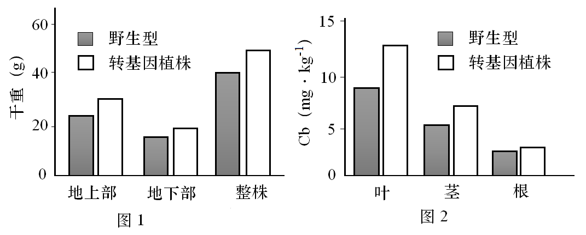

**2021年河北省普通高中学业水平选择性考试**

**生物**

**一、单项选择题**

1\. 下列叙述正确的是（ ）

A. 酵母菌和白细胞都有细胞骨架 B. 发菜和水绵都有叶绿体

C. 颤藻、伞藻和小球藻都有细胞核 D. 黑藻、根瘤菌和草履虫都有细胞壁

【答案】A

【解析】

【分析】1、科学家根据有无以核膜为界限的细胞核，将细胞分为真核细胞和原核细胞；

2、真核细胞具有细胞核，以及多种细胞器，由真核细胞构成的生物是真核生物；

3、原核细胞没有细胞核，只有拟核，只有核糖体一种细胞器，由原核细胞构成的生物是原核生物。

【详解】A、酵母菌属于真菌，是真核生物，白细胞是真核细胞，这两种细胞都具有细胞骨架，细胞骨架是由蛋白质纤维构成的网架结构，与细胞的运动、分裂、分化以及物质运输、能量转化、信息传递等多种功能有关，A正确；

B、发菜属于蓝藻，是原核生物，其细胞中没有叶绿体，水绵细胞中具有叶绿体，B错误；

C、颤藻属于蓝藻，是原核生物，没有细胞核，只有拟核，伞藻和小球藻是真核生物，它们细胞中具有细胞核，C错误；

D、黑藻是植物，其细胞具有细胞壁，根瘤菌是细菌，其细胞也具有细胞壁，草履虫是单细胞动物，不具有细胞壁，D错误。

故选A。

2\. 关于细胞核的叙述，错误的是（ ）

A. 有丝分裂过程中，核膜和核仁周期性地消失和重现

B. 蛋白质合成活跃的细胞，核仁代谢活动旺盛

C. 许多对基因表达有调控作用的蛋白质在细胞质合成，经核孔进入细胞核

D. 细胞质中的RNA均在细胞核合成，经核孔输出

【答案】D

【解析】

【分析】细胞核的结构和功能：

1、结构：

（1）核膜：双层膜，把核内物质与细胞质分开；

（2）核孔：能实现核质之间频繁的物质交换和信息交流；

（3）染色质：主要由DNA和蛋白质组成，DNA中储存着遗传信息；

（4）核仁：与rRNA的合成以及核糖体的形成有关。

2、功能：细胞核是遗传信息库，是细胞代谢和遗传的控制中心。

【详解】A、在有丝分裂前期，核膜、核仁消失，在有丝分裂后期，核膜、核仁重新出现，故在有丝分裂过程中，核膜和核仁周期性地消失和重现，A正确；

B、蛋白质合成的场所是核糖体，蛋白质合成活跃的细胞，需要大量的核糖体，而核糖体的形成与核仁有关，所以核仁代谢活动旺盛，B正确；

C、蛋白质合成的场所是核糖体，核糖体分布在细胞质中，基因主要存在于细胞核中，故对基因表达有调控作用的蛋白质在细胞质中合成后，经核孔进入细胞核，C正确；

D、RNA是以DNA为模板转录形成的，DNA主要存在于细胞核，在细胞质中的线粒体和叶绿体中也有少量的DNA，这些DNA也能作为模板转录合成RNA，所以细胞质中的RNA主要在细胞核中合成，经核孔输出，D错误。

故选D。

3\. 关于生物学实验的叙述，错误的是（ ）

A. NaOH与CuSO4配合使用在还原糖和蛋白质检测实验中作用不同

B. 染色质中的DNA比裸露的DNA更容易被甲基绿着色

C. 纸层析法分离叶绿体色素时，以多种有机溶剂的混合物作为层析液

D. 利用取样器取样法调查土壤小动物的种类和数量，推测土壤动物的丰富度

【答案】B

【解析】

【分析】1、检测还原糖时使用斐林试剂，在水浴加热的条件下，会产生砖红色沉淀，检测蛋白质时使用双缩脲试剂，会产生紫色反应；

2、观察DNA和RNA在细胞中的分布实验中，采用甲基绿吡罗红染色剂对细胞进行染色，DNA会被甲基绿染成绿色，RNA会被吡罗红染成红色；

3、在提取和分离绿叶中的色素实验中，采用无水乙醇提取色素，采用纸层析法，利用层析液分离不同的色素；

4、土壤小动物具有避光性，可以采用取样器取样法调查。

【详解】A、斐林试剂分为甲液和乙液，甲液为质量浓度0.1g/mL的NaOH溶液，乙液为质量浓度0.05g/mL的CuSO4溶液，检测时甲液和乙液等量混合，再与底物混合，在加热条件下与醛基反应，被还原成砖红色的沉淀；双缩脲试剂分为A液和B液，A液为质量浓度0.1g/mL的NaOH溶液，B液为质量浓度0.01g/mL的CuSO4溶液，检测时先加A液，再加B液，目的是为Cu2+创造碱性环境，A正确；

B、染色质是由DNA和蛋白质构成的，在用甲基绿对DNA进行染色之前，要用盐酸处理，目的是让蛋白质与DNA分离，有利于DNA与甲基绿结合，裸露的DNA没有与蛋白质结合，更容易被甲基绿着色，B错误；

C、分离绿叶中的色素用纸层析法，用到的层析液由20份石油醚、2份丙酮和1份苯酚混合而成，C正确；

D、物种丰富度是指群落中物种数目的多少，土壤中的小动物具有较强的活动能力，身体微小，具有避光性，常用取样器取样的方法进行采集，然后统计小动物的种类和数量，推测土壤动物的丰富度，D正确。

故选B。

4\. 人体成熟红细胞能够运输O2和CO2，其部分结构和功能如图，①~⑤表示相关过程。下列叙述错误的是（ ）

A. 血液流经肌肉组织时，气体A和B分别是CO2和O2

B. ①和②是自由扩散，④和⑤是协助扩散

C. 成熟红细胞通过无氧呼吸分解葡萄糖产生ATP，为③提供能量

D. 成熟红细胞表面的糖蛋白处于不断流动和更新中

【答案】D

【解析】

【分析】1、人体成熟的红细胞在发育成熟过程中，将细胞核和细胞器等结构分解或排出细胞，为血红蛋白腾出空间，运输更多的氧气；

2、分析题图可知，①和②表示气体进出红细胞，一般气体等小分子进出细胞的方式为自由扩散，③为红细胞通过消耗能量主动吸收K+排出Na+，④是载体蛋白运输葡萄糖顺浓度梯度进入红细胞，⑤是H2O通过水通道蛋白进入红细胞。

【详解】A、根据题意可知，红细胞能运输O2和CO2，肌肉细胞进行有氧呼吸时，消耗O2，产生CO2，可以判断气体A和B分别是CO2和O2，A正确；

B、①和②表示气体进出红细胞，一般气体等小分子进出细胞的方式为自由扩散，④是载体蛋白运输葡萄糖进入红细胞，顺浓度梯度，不需要消耗能量，为协助扩散，⑤是H2O通过水通道蛋白进入红细胞，属于协助扩散，B正确；

C、③为红细胞通过消耗能量主动吸收K+排出Na+，成熟红细胞没有线粒体，不能进行有氧呼吸，只能通过无氧呼吸分解葡萄糖产生ATP，为③提供能量，C正确；

D、成熟红细胞没有核糖体，不能再合成新的蛋白质，细胞膜上的糖蛋白不能更新，糖蛋白存在于细胞膜的外表面，由于细胞膜具有流动性，其表面的糖蛋白处于不断流动中，D错误。

故选D。

5\. 关于细胞生命历程的叙述，错误的是（ ）

A. 细胞凋亡过程中不需要新合成蛋白质

B. 清除细胞内过多的自由基有助于延缓细胞衰老

C. 紫外线照射导致的DNA损伤是皮肤癌发生的原因之一

D. 已分化的动物体细跑的细胞核仍具有全能性

【答案】A

【解析】

【分析】1、细胞凋亡是指由基因决定的细胞自动结束生命的过程，是严格由遗传机制决定的程序性调控，是一种程序性死亡；

2、体内产生的自由基是导致细胞衰老的重要原因之一；

3、紫外线是物理致癌因子，长期暴露在过强的紫外线下会导致细胞癌变；

4、细胞的全能性是指细胞经分裂和分化后，仍具有产生完整有机体或分化成其他各种细胞的潜能和特性。

【详解】A、细胞凋亡是指由基因决定的细胞自动结束生命的过程，细胞凋亡过程中有控制凋亡的基因表达，需要新合成蛋白质，A错误；

B、在生命活动中，细胞会产生自由基，自由基会攻击和破坏细胞内各种执行正常功能的生物分子，导致细胞衰老，所以清除细胞内过多的自由基有助于延缓细胞衰老，B正确；

C、细胞癌变的原因是原癌基因和抑癌基因发生突变，紫外线是一种物理致癌因子，紫外线照射会导致DNA损伤，引起基因突变，导致细胞癌变，是皮肤癌发生的原因之一，C正确；

D、克隆羊“多莉”的诞生、以及我国科学家于2017年获得的世界上首批体细胞克隆猴“中中”和“华华”，就是将体细胞移植到去核的卵细胞中培育成的，说明已分化的动物体细胞的细胞核仍具有全能性，D正确。

故选A。

6\. 雄性缝蝇的求偶方式有：①向雌蝇提供食物；②用丝缕简单缠绕食物后送给雌蝇；③把食物裹成丝球送给雌蝇；④仅送一个空丝球给雌蝇。以上四种方式都能求偶成功。下列叙述错误的是（ ）

A. 求偶时提供食物给雌蝇有利于其繁殖，是一种适应性行为

B. ④是一种仪式化行为，对缝蝇繁殖失去进化意义

C. ③是雌蝇对雄蝇长期选择的结果

D. ④可能由③进化而来

【答案】B

【解析】

【分析】雄性动物的求偶是为了繁殖后代，在求偶过程中，雄性动物会通过各种方式来获得交配机会，以便将自己的遗传信息传递下去；生物的求偶行为是一种长期自然选择的结果，也是一种适应性行为。

【详解】A、求偶时提供食物给雌蝇，一方面为了获得交配机会，另一方面也有利于雌性获得更多营养物质繁殖后代，这是一种长期形成的适应性行为，A正确；

B、根据题意，四种方式都能求偶成功，④虽然是一种仪式化行为，但对缝蝇繁殖也具有进化意义，B错误；

C、在求偶过程中，把食物裹成丝球送给雌蝇，更受雌蝇的青睐，容易获得交配机会，留下后代的机会多，这是雌蝇对雄蝇长期选择的结果，C正确；

D、④仅送一个空丝球给雌蝇，不需要食物也能求偶成功，④与③在外观上具有相似性，可推测④可能由③进化而来，D正确。

故选B。

7\. 图中①、②和③为三个精原细跑，①和②发生了染色体变异，③为正常细胞。②减数分裂时三条同源染色体中任意两条正常分离，另一条随机移向一极。不考虑其他变异，下列叙述错误的是（ ）

A. ①减数第一次分裂前期两对同源染色体联会

B. ②经减数分裂形成的配子有一半正常

C. ③减数第一次分裂后期非同源染色体自由组合，最终产生4种基因型配子

D. ①和②的变异类型理论上均可以在减数分裂过程中通过光学显微镜观察到

【答案】C

【解析】

【分析】1、精原细胞①中有四条染色体，含有A、a、R、r四种基因，对比正常精原细胞③可知，精原细胞①发生了染色体结构变异中的易位，R基因和a基因发生了位置互换；

2、精原细胞②中含有a基因的染色体多了一条，发生了染色体数目变异。

【详解】A、①细胞中有四条染色体，为两对同源染色体，在减数第一次分裂前期两对同源染色体联会，A正确；

B、②细胞减数分裂时三条同源染色体中任意两条正常分离，另一条随机移向一极，最终产生的配子为1/12AR、1/12Ar、1/12aar、1/12aaR、1/6AaR、1/6Aar、1/6ar、1/6aR，其中正常配子为1/12AR、1/12Ar、1/6ar、1/6aR，刚好占一半，B正确；

C、③细胞减数第一次分裂后期非同源染色体自由组合，最终产生4个配子，2种基因型，为AR、AR、ar、ar或Ar、Ar、aR、aR，C错误；

D、①发生了染色体结构变异中的易位，②发生了染色体数目变异，理论上通过观察染色体的结构和细胞中的染色体数目就可以观察到，D正确。

故选C。

8\. 关于基因表达的叙述，正确的是（ ）

A. 所有生物基因表达过程中用到的RNA和蛋白质均由DNA编码

B. DNA双链解开，RNA聚合酶起始转录、移动到终止密码子时停止转录

C. 翻译过程中，核酸之间的相互识别保证了遗传信息传递的准确性

D. 多肽链合成过程中，tRNA读取mRNA上全部碱基序列信息

【答案】C

【解析】

【分析】翻译过程以氨基酸为原料，以转录过程产生的mRNA为模板，在酶的作用下，消耗能量产生多肽链。多肽链经过折叠加工后形成具有特定功能的蛋白质。

【详解】A、RNA病毒的蛋白质由病毒的遗传物质RNA编码合成，A错误；

B、DNA双链解开，RNA聚合酶与启动子结合进行转录，移动到终止子时停止转录，B错误；

C、翻译过程中，核酸之间通过碱基互补配对相互识别保证了遗传信息传递的准确性，C正确；

D、没有相应的反密码子与mRNA上的终止密码子配对，故tRNA不能读取mRNA上全部碱基序列信息，D错误。

故选C。

【点睛】

9\. 关于植物激素的叙述，错误的是（ ）

A. 基因突变导致脱落酸受体与脱落酸亲和力降低时，种子休眠时间比野生型延长

B. 赤霉素受体表达量增加的大麦种子萌发时，胚乳中淀粉分解速度比野生型更快

C. 细胞分裂素受体表达量增加的植株，其生长速度比野生型更快

D. 插条浸泡在低浓度NAA溶液中，野生型比生长素受体活性减弱的株系更易生根

【答案】A

【解析】

【分析】1.植物激素是由植物体内产生，能从产生部位运送到作用部位，对植物的生长发育有显著影响的微量有机物。

2.不同植物激素的作用：

生长素：合成部位：幼嫩的芽、叶和发育中的种子。主要生理功能：生长素的作用表现为两重性，即：低浓度促进生长，高浓度抑制生长。

赤霉素：合成部位：幼芽、幼根和未成熟种子等幼嫩部分。主要生理功能：促进细胞的伸长；解除种子、块茎的休眠并促进萌发的作用。

细胞分裂素：合成部位：正在进行细胞分裂的幼嫩根尖。主要生理功能：促进细胞分裂；诱导芽的分化；防止植物衰老。

脱落酸：合成部位：根冠、萎焉的叶片等。主要生功能：抑制植物细胞的分裂和种子的萌发；促进植物进入休眠；促进叶和果实的衰老、脱落。

乙烯：合成部位：植物体的各个部位都能产生。主要生理功能：促进果实成熟；促进器官的脱落；促进多开雌花。

【详解】A、脱落酸有促进种子休眠的作用，基因突变导致脱落酸受体与脱落酸亲和力降低时，种子休眠时间比野生型缩短，A错误；

B、赤霉素能促进大麦种子产生ɑ-淀粉酶，进而催化淀粉分解，赤霉素受体表达量增加的大麦种子，有利于赤霉素发挥作用，能产生更多的ɑ-淀粉酶，胚乳中淀粉分解速度比野生型更快，B正确；

C、细胞分裂素能促进细胞分裂，故细胞分裂素受体表达量增加的植株，其生长速度比野生型更快，C正确；

D、NAA是生长素类似物，能促进插条生根，生长素受体活性减弱的株系对生长素不敏感，所以野生型比生长素受体活性低的株系更易生根，D正确。

故选A。

【点睛】

10\. 血糖浓度升高时，机体启动三条调节途径：①血糖直接作用于胰岛B细胞；②血糖作用于下丘脑，通过兴奋迷走神经（参与内脏活动的调节）支配胰岛B细胞；③兴奋的迷走神经促进相关胃肠激素释放，这些激素作用于胰岛B细胞。下列叙述错误的是（ ）

A. ①和②均增强了胰岛B细胞的分泌活动

B. ②和③均体现了神经细胞与内分泌细胞间的信息交流

C. ①和③调节胰岛素水平的方式均为体液调节

D. 血糖平衡的调节存在负反馈调节机制

【答案】C

【解析】

【分析】分析题干，血糖浓度升高时的三条调节途径，第一条是体液调节，后两条都是神经体液调节。

【详解】A、①血糖浓度升高直接作用于胰岛B细胞，促进胰岛B细胞分泌胰岛素增多；②血糖浓度升高作用于下丘脑，通过兴奋迷走神经支配胰岛B细胞分泌胰岛素增多，A正确；

B、②是兴奋迷走神经释放的神经递质与胰岛B细胞上的受体结合支配胰岛B细胞，③兴奋的迷走神经促进相关胃肠激素释放，也是通过神经递质与胃肠上的相应受体结合进行调节的，二者都体现了神经细胞与内分泌细胞间的信息交流，B正确；

C、①调节胰岛素水平的方式是体液调节，③调节胰岛素水平的方式是神经-体液调节，C错误；

D、在血糖调节过程中，胰岛素的作用结果会使血糖水平下降到正常水平，此时血糖水平会反过来抑制胰岛素的进一步分泌，防止血糖过度下降；胰高血糖素也是如此，故在血糖调节过程中存在负反馈调节，D正确。

故选C。

【点睛】

11\. 关于神经细胞的叙述，错误的是（ ）

A. 大脑皮层言语区的H区神经细胞受损伤，患者不能听懂话

B. 主动运输维持着细胞内外离子浓度差，这是神经细胞形成静息电位的基础

C. 内环境K+浓度升高，可引起神经细胞静息状态下膜电位差增大

D. 谷氨酸和一氧化氮可作为神经递质参与神经细胞的信息传递

【答案】C

【解析】

【分析】1、一个神经细胞可以有多个轴突末梢，可形成多个突触小体。

2、兴奋通过神经递质在突触处进行单向传递的原因是：递质只能由突触前膜释放作用于突触后膜。

3、神经细胞外钾离子外流是产生静息电位的基础。

4、静息状态的神经细胞膜两侧的电位表现为外正内负。

【详解】A、大脑皮层言语区的H区神经细胞受损伤，患者不能听懂话，A正确；

B、细胞通过主动运输维持内外离子浓度差，静息电位是由于细胞内外一定的K+浓度差导致的，B正确；

C、神经细胞静息状态是K+外流，内环境K+浓度升高，K+顺浓度梯度外流减少，膜电位差减小，C错误；

D、神经递质的种类很多，有谷氨酸、一氧化氮、肾上腺素等，都可参与神经细胞的信息传递，D正确。

故选C。

【点睛】

12\. 湿地生态系统生物多样性丰富，鸟类是其重要组成部分。研究者对某湿地生态系统不同退化阶段的生物多样性进行了调查，结果见下表。下列叙述正确的是（ ）

|         |      |       |        |           |
|:-------:|:----:|:-----:|:------:|:---------:|
|         | 典型湿地 | 季节性湿地 | 中度退化湿地 | 严重退化湿地    |
| 湿地特征    | 常年积水 | 季节性积水 | 无积水    | 完全干涸，鼠害严重 |
| 生物多样性指数 | 2.7  | 2.4   | 2.1    | 1.5       |
| 鸟类丰富度   | 25   | 17    | 12     | 9         |

注：生物多样性指数反映生物多样性水平

A. 严重退化湿地中的鼠类吸引部分猛禽使得食物网结构最为复杂

B. 因湿地退化食物不足，鸟类死亡率增加导致丰富度降低

C. 湿地生态系统稳定性是其自我调节能力的基础

D. 湿地退化对生物多样性的间接价值影响最大

【答案】D

【解析】

【分析】分析表格数据，随着湿地退化，退化程度越严重，积水越少，并且生物多样性指数和鸟类丰富度都下降。

【详解】A、严重退化的湿地的生物多样性指数最低，而且鸟类丰富度也最低，故食物网结构最简单，A错误；

B、丰富度是物种数目的多少，鸟类死亡率增加会使种群密度下降，不会导致物种数目减少，B错误；

C、负反馈调节是湿地生态系统自我调节能力的基础，C错误；

D、湿地具有可以蓄水调洪、补充地下水的生态功能，因此湿地的退化对生物多样性的间接价值影响最大，D正确。

故选D。

【点睛】

13\. 烟粉虱为害会造成番茄减产。研究者对番茄单作、番茄玫瑰邻作（番茄田与玫瑰田间隔1m）模式下番茄田中不同发育阶段的烟粉虱及其天敌进行了调查，结果见下表。下列叙述错误的是（ ）

<table>
<colgroup>
<col style="width: 16%" />
<col style="width: 16%" />
<col style="width: 17%" />
<col style="width: 17%" />
<col style="width: 17%" />
<col style="width: 15%" />
</colgroup>
<tbody>
<tr>
<td rowspan="2" style="text-align: center;">种植模式</td>
<td colspan="3" style="text-align: center;">番茄植株不同部位成虫数量（头叶）</td>
<td rowspan="2" style="text-align: center;">
若虫

（头叶）
</td>
<td rowspan="2" style="text-align: center;">
天敌昆虫

多样性指数
</td>
</tr>
<tr>
<td style="text-align: center;">上部叶</td>
<td style="text-align: center;">中部叶</td>
<td style="text-align: center;">下部叶</td>
</tr>
<tr>
<td style="text-align: center;">番茄单作</td>
<td style="text-align: center;">22.7</td>
<td style="text-align: center;">3.2</td>
<td style="text-align: center;">0.8</td>
<td style="text-align: center;">16.5</td>
<td style="text-align: center;">1.2</td>
</tr>
<tr>
<td style="text-align: center;">番茄玫瑰邻作</td>
<td style="text-align: center;">1.4</td>
<td style="text-align: center;">0.2</td>
<td style="text-align: center;">0.1</td>
<td style="text-align: center;">1.8</td>
<td style="text-align: center;">2.2</td>
</tr>
</tbody>
</table>

A. 由单作转为邻作，烟粉虱种群的年龄结构改变

B. 由单作转为邻作，烟粉虱种群中成虫的空间分布类型改变

C. 由单作转为邻作，群落的水平结构改变

D. 玫瑰吸引天敌防治害虫，体现了生态系统信息调节生物种间关系的功能

【答案】B

【解析】

【分析】分析表格数据可知，由番茄单作转为番茄玫瑰邻作，可以显著降低番茄植株不同部位烟粉虱成虫数量，降低烟粉虱若虫的数量，同时增大天敌昆虫的多样性指数。

【详解】A、由单作转为邻作，烟粉虱的若虫与成虫的比值由16.5:26.7变为1.8:1.7，年龄结构发生改变，A正确；

B、由单作转为邻作，烟粉虱种群中成虫在番茄植株不同部位的分布比例并无变化，仍然是上部叶最多，中部叶次之，下部叶最少，所以空间分布类型没有改变，B错误；

C、由单作转为邻作，增加了玫瑰，群落的水平结构发生改变，C正确；

D、生态系统的信息传递可发生在同种生物的不同个体之间或发生在不同物种之间，玫瑰吸引天敌防治害虫，体现了生态系统信息调节生物种间关系的功能，D正确。

故选B。

【点睛】

**二、多项选择题**

14\. 《齐民要术》中记载了利用荫坑贮存葡萄的方法（如图）。目前我国果蔬主产区普遍使用大型封闭式气调冷藏库（充入氮气替换部分空气），延长了果蔬保鲜时间、增加了农民收益。下列叙述正确的是（ ）

A. 荫坑和气调冷藏库环境减缓了果蔬中营养成分和风味物质的分解

B. 荫坑和气调冷藏库贮存的果蔬，有氧呼吸中不需要氧气参与的第一、二阶段正常进行，第三阶段受到抑制

C. 气调冷藏库中的低温可以降低细胞质基质和线粒体中酶的活性

D. 气调冷藏库配备的气体过滤装置及时清除乙烯，可延长果蔬保鲜时间

【答案】AC

【解析】

【分析】细胞呼吸分有氧呼吸和无氧呼吸两种类型。这两种类型的共同点是：在酶的催化作用下，分解有机物，释放能量。但是，前者需要氧和线粒体的参与，有机物彻底氧化释放的能量比后者多。温度、水分、氧气和二氧化碳浓度是影响呼吸作用的主要因素，储藏蔬菜、水果时采取零上低温、一定湿度、低氧等措施延长储藏时间，而种子采取零上低温、干燥、低氧等措施延长储存时间。

【详解】A、荫坑和气调冷藏库环境中的低温均可通过降低温度抑制与呼吸作用相关的酶的活性，大型封闭式气调冷藏库（充入氮气替换部分空气）降低氧气浓度，有氧呼吸和无氧呼吸均减弱，从而减缓了果蔬中营养成分和风味物质的分解，A正确；

B、荫坑和气调冷藏库贮存中的低温可以降低呼吸作用相关酶的活性，大型封闭式气调冷藏库（充入氮气替换部分空气）降低氧气浓度，其中酶的活性降低对有氧呼吸的三个阶段均有影响，B错误；

C、温度会影响酶的活性，气调冷藏库中的低温可以降低细胞质基质和线粒体中酶的活性，C正确；

D、气调冷藏库配备的气体过滤装置应起到除去空气中氧气的作用，而不是去除乙烯的作用，以抑制果蔬的有氧呼吸，D错误。

故选AC。

【点睛】

15\. 杜氏肌营养不良（DMD）是由单基因突变引起的伴X隐性遗传病，男性中发病率约为1/4000。甲、乙家系中两患者的外祖父均表现正常，家系乙Ⅱ-2还患有红绿色盲。两家系部分成员DMD基因测序结果（显示部分序列，其他未显示序列均正常）如图。下列叙述错误的是（ ）

A. 家系甲Ⅱ-1和家系乙Ⅱ-2分别遗传其母亲的DMD致病基因

B. 若家系乙Ⅰ-1和Ⅰ-2再生育一个儿子，儿子患两种病的概率比患一种病的概率低

C. 不考虑其他突变，家系甲Ⅱ-2和家系乙Ⅱ-1婚后生出患DMD儿子的概率为1/8

D. 人群中女性DMD患者频率远低于男性，女性中携带者的频率约为1/4000

【答案】ABD

【解析】

【分析】据题意可知，杜氏肌营养不良（DMD）是由单基因突变引起的伴X隐性遗传病，红绿色盲也是伴X隐性遗传病，这两种病均位于X染色体上，属于连锁遗传。根据家系甲部分成员DMD基因测序结果可知，Ⅰ-2个体基因序列正常，Ⅱ-1个体基因序列异常，假设DMD的致病基因用b表示，则Ⅰ-2的基因型为XBXB，Ⅱ-1的基因型为XbY，则Ⅱ-1患病的原因可能是父亲或者母亲产生配子时发生了基因突变。根据家系乙部分成员DMD基因测序结果可知，用a表示红绿色盲致病基因，则Ⅰ-2的基因型为XABXab，Ⅱ-2的基因型为XabY。

【详解】A、据分析可知，家系甲Ⅱ-1的致病基因可能来自父亲，也可能来自母亲，家系乙Ⅱ-2遗传其母亲的DMD致病基因，A错误；

B、若家系乙Ⅰ-1XABY和Ⅰ-2XABXab再生育一个儿子，由于ab基因连锁，交叉互换的概率较低，因此，儿子患两种病的概率高于患一种病的概率，B错误；

C、不考虑其他突变，家系甲Ⅱ-2的基因型为XBY，家系乙中Ⅰ-2的基因型为XBY，Ⅰ-2的基因型为XBXb，则Ⅱ-1基因型为XBXb的概率是1/2，家系甲Ⅱ-2和家系乙Ⅱ-1婚后生出患DMD儿子的概率为1/2×1/4=1/8，C正确；

D、由于DMD是由单基因突变引起的伴X隐性遗传病，人群中女性DMD患者（XbXb）频率远低于男性（XbY），由题干可知，男性中发病率约为1/4000，即Xb=1/4000，则XB=3999/4000，女性中携带者的频率约为2×1/4000×3999/4000≈1/2000，D错误；

故选ABD。

【点睛】

16\. 许多抗肿瘤药物通过干扰DNA合成及功能抑制肿瘤细胞增殖。下表为三种抗肿瘤药物的主要作用机理。下列叙述正确的是（ ）

|       |              |
|:-----:|:------------:|
| 药物名称  | 作用机理         |
| 羟基脲   | 阻止脱氧核糖核苷酸的合成 |
| 放线菌素D | 抑制DNA的模板功能   |
| 阿糖胞苷  | 抑制DNA聚合酶活性   |

A. 羟基脲处理后，肿瘤细胞中DNA复制和转录过程都出现原料匮乏

B. 放线菌素D处理后，肿瘤细胞中DNA复制和转录过程都受到抑制

C. 阿糖胞苷处理后，肿瘤细胞DNA复制过程中子链无法正常延伸

D. 将三种药物精准导入肿瘤细胞的技术可减弱它们对正常细胞的不利影响

【答案】BCD

【解析】

【分析】根据表格中信息可知，羟基脲阻止脱氧核糖核苷酸的合成，从而影响DNA复制过程中原料的供应；放线菌素D通过抑制DNA的模板功能，可以影响DNA复制和转录，因为DNA复制和转录均需要DNA模板；阿糖胞苷通过抑制DNA聚合酶活性而影响DNA复制过程。

【详解】A、据分析可知，羟基脲阻止脱氧核糖核苷酸的合成，从而影响肿瘤细胞中DNA复制过程，而转录过程需要的原料是核糖核苷酸，不会受到羟基脲的影响，A错误；

B、据分析可知，放线菌素D通过抑制DNA的模板功能，可以抑制DNA复制和转录，因为DNA复制和转录均需要DNA模板，B正确；

C、阿糖胞苷抑制DNA聚合酶活性而影响DNA复制过程，DNA聚合酶活性受抑制后，会使肿瘤细胞DNA复制过程中子链无法正常延伸，C正确；

D、将三种药物精准导入肿瘤细胞的技术可以抑制肿瘤细胞的增殖，由于三种药物是精准导入肿瘤细胞，因此，可以减弱它们对正常细胞的不利影响，D正确；

故选BCD。

【点睛】

17\. 高盐饮食后一段时间内，虽然通过调节饮水和泌尿可以使细胞外液渗透压回归Na+摄入前的水平，但机体依旧处于正钠平衡（总Na+摄入多于排泄）状态。下列叙述正确的是（ ）

A. 细胞外液渗透压主要来源于Na+和Cl-

B. 细胞外液渗透压回归与主动饮水、抗利尿激素分泌增加有关

C. 细胞内液不参与细胞外液渗透压的调节

D. 细胞外液渗透压回归但机体处于正钠平衡时，细胞外液总量和体液总量均增多

【答案】ABD

【解析】

【分析】人体每天都要从饮食中获得水和各种无机盐，同时又要通过多种途径排除一定的水和无机盐，以维持内环境的稳态。参与水盐平衡的激素有抗利尿激素，抗利尿激素由下丘脑合成和分泌，垂体释放，能提高肾脏集合管对水的通透性，促进水的重吸收。

【详解】A、细胞外液渗透压的90%以上来源于Na+和Cl-，A正确；

B、高盐饮食一段时间后，细胞外液渗透压会升高，机体可以通过主动饮水和抗利尿激素分泌的增加降低细胞外液渗透压，从而使细胞外液渗透压回归Na+摄入前的水平，B正确；

C、细胞内液可以与细胞外液相互交换成分，因此，细胞内液参与细胞外液渗透压的调节，C错误；

D、细胞外液渗透压回归但机体处于正钠平衡时，通过调节饮水和泌尿可以使细胞外液渗透压回归Na+摄入前的水平，饮水和抗利尿激素分泌增加可以增加细胞外液总量，体液由细胞外液和细胞内液组成，体液的总量也会增多，D正确。

故选ABD。

【点睛】

18\. 我国麋鹿经历了本土野外灭绝、圈养种群复壮、放归野外等历程，成功建立野生种群。2020年，我国麋鹿分布点已从最初的2处发展至81处，数量超过8000只，基本覆盖糜鹿野外灭绝前的栖息地，展现了我国生物多样性保护的智慧。下列叙述正确的是（ ）

A. 可采用逐个计数法统计糜鹿种群密度

B. 增加我国麋鹿种群的遗传多样性，有利于种群的进一步发展

C. 麋鹿种群增长速率最大时，种内斗争最小

D. 对麋鹿种群进行圈养复壮、放归野外的过程属于就地保护

【答案】AB

【解析】

【分析】1、种群在单位面积或单位体积中的个体数就是种群密度，在调查分布范围小、个体较大的种群时，可以逐个计数。

2、我国生物多样性的保护，可以概括为就地保护和易地保护两大类。就地保护是指在原地对被保护的生态系统或物种建立自然保护区以及风景名胜区等，这是对生物多样性最有效的保护。易地保护是指把保护对象从原地迁出，在异地进行专门保护。例如，建立植物园、动物园以及濒危动植物繁育中心等，这是为行将灭绝的物种提供最后的生存机会。一旦人工繁育成功，就可以将这些野生生物回放野外。

【详解】A、由于麋鹿数量较少，个体较大，可采用逐个计数法统计糜鹿种群密度，A正确；

B、生物多样性包括遗传多样性，物种多样性和生态系统多样性，增加我国麋鹿种群的遗传多样性，有利于种群的进一步发展，B正确；

C、麋鹿种群增长速率最大时，种群数量为*K*/2，在有限的资源和空间条件下，种群数量最少时，种内斗争最小，C错误；

D、据分析可知，对麋鹿种群进行圈养复壮、放归野外的过程属于易地保护，D错误。

故选AB

【点睛】

**三、非选择题**

19\. 为探究水和氮对光合作用的影响，研究者将一批长势相同的玉米植株随机均分成三组，在限制水肥的条件下做如下处理：（1）对照组；（2）施氮组，补充尿素（12g·m-2）（3）水+氮组，补充尿素（12g·m-2）同时补水。检测相关生理指标，结果见下表。

|                                              |     |      |      |
|:--------------------------------------------:|:---:|:----:|:----:|
| 生理指标                                         | 对照组 | 施氮组  | 水+氮组 |
| 自由水/结合水                                      | 6.2 | 6.8  | 7.8  |
| 气孔导度（mmol·m-2s-1）      | 85  | 65   | 196  |
| 叶绿素含量（mg·g-1）                     | 9.8 | 11.8 | 12.6 |
| RuBP羧化酶活性（μmol·h-1g-1） | 316 | 640  | 716  |
| 光合速率（μmol·m-2s-1）      | 6.5 | 8.5  | 11.4 |

注：气孔导度反映气孔开放的程度

回答下列问题：

（1）植物细胞中自由水的生理作用包括\_\_\_\_\_\_\_\_\_\_\_\_\_\_\_\_\_\_\_\_等（写出两点即可）。补充水分可以促进玉米根系对氮的\_\_\_\_\_\_\_\_\_\_，提高植株氮供应水平。

（2）参与光合作用的很多分子都含有氮。氮与\_\_\_\_\_\_\_\_\_\_离子参与组成的环式结构使叶绿素能够吸收光能，用于驱动\_\_\_\_\_\_\_\_\_\_两种物质的合成以及\_\_\_\_\_\_\_\_\_\_的分解；RuBP羧化酶将CO2转变为羧基加到\_\_\_\_\_\_\_\_\_\_分子上，反应形成的产物被还原为糖类。

（3）施氮同时补充水分增加了光合速率，这需要足量的CO2供应。据实验结果分析，叶肉细胞CO2供应量增加的原因是\_\_\_\_\_\_\_\_\_\_\_\_\_\_\_\_\_\_\_\_\_\_\_\_\_\_\_\_\_\_。

【答案】 (1). 细胞内良好的溶剂，能够参与生化反应，能为细胞提供液体环境，还能运送营养物质和代谢废物 (2). 主动吸收 (3). 镁 (4). ATP和NADPH（或\[H\]） (5). 水 (6). C5（或RuBP） (7). 气孔导度增加，CO2吸收量增多，同时RuBP羧化酶活性增大，使固定CO2的效率增大

【解析】

【分析】分析题意可知，该实验目的是探究水和氮对光合作用的影响，实验分成三组：对照组、施氮组、水+氮组；分析表格数据可知：自由水与结合水的比值：对照组＜施氮组＜水+氮组；气孔导度：对照组＞施氮组＜水+氮组；叶绿素含量：对照组＜施氮组＜水+氮组；RuBP羧化酶活性：对照组＜施氮组＜水+氮组；光合速率：对照组＜施氮组＜水+氮组。

【详解】1）细胞内的水以自由水与结合水的形式存在，结合水是细胞结构的重要组成成分，自由水是细胞内良好的溶剂，能够参与生化反应，能为细胞提供液体环境，还能运送营养物质和代谢废物；根据表格分析，水+氮组的气孔导度大大增加，增强了植物的蒸腾作用，有利于植物根系吸收并向上运输氮，所以补充水分可以促进玉米根系的对氮的主动吸收，提高植株氮供应水平。

（2）参与光合作用的很多分子都含有氮，叶绿素的元素组成有C、H、O、N、Mg，其中氮与镁离子参与组成的环式结构使叶绿素能够吸收光能，用于光反应，光反应的场所是叶绿体的类囊体膜，完成的反应是水光解产生NADPH（\[H\]）和氧气，同时将光能转变成化学能储存在ATP和NADPH（\[H\]）中，其中ATP和NADPH（\[H\]）两种物质含有氮元素；暗反应包括二氧化碳固定和三碳化合物还原两个过程，其中RuBP羧化酶将CO2转变为羧基加到C5（RuBP）分子上，反应形成的C3被还原为糖类。

（3）分析表格数据可知，施氮同时补充水分使气孔导度增加，CO2吸收量增多，同时RuBP羧化酶活性增大，使固定CO2的效率增大，使植物有足量的CO2供应，从而增加了光合速率。

【点睛】本题考查水的存在形式和作用、光合作用的过程、影响光合作用的因素等相关知识，意在考查考生把握知识间的相互联系，运用所学知识解决生物学实际问题的能力，难度中等。

20\. 我国科学家利用栽培稻（H）与野生稻（D）为亲本，通过杂交育种方法并辅以分子检测技术，选育出了L12和L7两个水稻新品系。L12的12号染色体上带有D的染色体片段（含有耐缺氮基因TD），L7的7号染色体上带有D的染色体片段（含有基因SD），两个品系的其他染色体均来自于H（图1）。H的12号和7号染色体相应片段上分别含有基因TH和SH。现将两个品系分别与H杂交，利用分子检测技术对实验一亲本及部分F2的TD/TH基因进行检测，对实验二亲本及部分F2的SD/SH基因进行检测，检测结果以带型表示（图2）。

回答下列问题：

（1）为建立水稻基因组数据库，科学家完成了水稻\_\_\_\_\_\_\_\_\_\_条染色体的DNA测序。

（2）实验一F2中基因型TDTD对应的是带型\_\_\_\_\_\_\_\_\_\_。理论上，F2中产生带型Ⅰ、Ⅱ和Ⅲ的个体数量比为\_\_\_\_\_\_\_\_\_\_。

（3）实验二F2中产生带型α、β和γ的个体数量分别为12、120和108，表明F2群体的基因型比例偏离\_\_\_\_\_\_\_\_\_\_定律。进一步研究发现，F1的雌配子均正常，但部分花粉无活性。已知只有一种基因型的花粉异常，推测无活性的花粉带有\_\_\_\_\_\_\_\_\_\_（填“SD”或“SH”）基因。

（4）以L7和L12为材料，选育同时带有来自D的7号和12号染色体片段的纯合品系X（图3）。主要实验步骤包括：①\_\_\_\_\_\_\_\_\_\_\_\_\_\_\_\_\_\_\_\_\_\_\_\_\_\_\_\_\_\_\_\_\_\_\_\_\_\_\_\_；②对最终获得的所有植株进行分子检测，同时具有带型\_\_\_\_\_\_\_\_\_\_的植株即为目的植株。

（5）利用X和H杂交得到F1，若F1产生的无活性花粉所占比例与实验二结果相同，雌配子均有活性，则F2中与X基因型相同的个体所占比例为\_\_\_\_\_\_\_\_\_\_。

【答案】 (1). 12 (2). Ⅲ (3). 1∶2∶1 (4). （基因）分离 (5). SD (6). 将L7和L12杂交，获得F1后自交 (7). α和Ⅲ (8). 1/80

【解析】

【分析】分析题意和条带可知：L12的12号染色体上含有耐缺氮基因TD，其基因型为TDTD；L7的7号染色体上含有基因SD，基因型为SDSD；H的12号染色体上的基因为TH，7号染色体上的基因为SH，基因型为SHSHTHTH；TD与TH，SD与SH遵循基因分离和自由组合定律。

【详解】（1）水稻为雌雄同株的植物，没有性染色体和常染色体之分，分析题图可知，水稻含有12对同源染色体，即有24条染色体，故对水稻基因组测序，需要完成12条染色体的DNA测序；

（2）实验一是将L12（基因型TDTD）与H（基因型THTH）杂交，F1的基因型为TDTH，F2的基因型分别为TDTD∶TDTH∶THTH=1∶2∶1，其中TDTD对应的是带型与亲本L12对应的条带相同，即条带Ⅲ，理论上，F2中产生带型Ⅰ∶Ⅱ∶Ⅲ的个体数量比为1∶2∶1；

（3）实验二是将L7（基因型SDSD）与H（基因型SHSH）杂交，F1的基因型为SDSH，理论上F2的基因型分别为SDSD∶SDSH∶SHSH=1∶2∶1，其中SDSD对应的是带型与亲本L7对应的条带相同，即条带α，SDSH对应条带为β，SHSH对应条带为γ，理论上，F2中产生带型Ⅰ∶Ⅱ∶Ⅲ的个体数量比为1∶2∶1。实际上F2中产生带型α、β、γ的个体数量分别为12、120和108，表明F2群体的基因型比例偏离分离定律；进一步研究发现，F1的雌配子均正常，但部分花粉无活性；已知只有一种基因型的花粉异常，而带型α，即SDSD的个体数量很少，可推测无活性的花粉带有SD基因；

（4）已知TD与TH，SD与SH两对基因分别位于7号和12号染色体上，两对等位基因遵循自由组合定律，以L7和L12为材料，选育同时带有来自D7号和12号染色体片段的纯合品系X，基因型为SDSDTDTD；同时考虑两对等位基因，可知L7的基因型为SDSDTHTH，L12的基因型为SHSHTDTD，①将L7和L12杂交，获得F1（SDSHTDTH）后自交，②对最终获得的所有植株进行分子检测，同时具有带型α和Ⅲ的植株即为目的植株；

（5）实验二中SDSD∶SDSH∶SHSH=12∶120∶108=1∶10∶9，可知花粉中SD∶SH=1∶9，利用X（基因型为SDSDTDTD）和H（基因型为SHSHTHTH）杂交得到F1，基因型为SDSHTDTH，若F1产生的SD花粉无活性，所占比例与实验二结果相同，即雄配子类型及比例为：SDTD∶SDTH∶SHTD∶SHTH=1∶1∶9∶9，雌配子均有活性，类型及比例为SDTD∶SDTH∶SHTD∶SHTH =1∶1∶1∶1，则F2中基因型为SDSDTDTD的个体所占比例为1/4×1/20=1/80。

【点睛】本题考查基因分离定律和基因自由组合定律的应用的相关知识，意在考查考生把握知识间相互联系，运用所学知识解决生物学实际问题的能力，难度较大。

21\. 水痘是由水痘-带状疱疹病毒（VZV）引起的急性呼吸道传染病，多见于儿童，临床特征为全身出现丘疹、水疱。接种VZV减毒活疫苗（VarV）是预防水痘流行的有效方法。2019年，研究者对某地2007～2015年出生儿童的VarV接种率及水痘发病率进行了调查，结果如图。

回答下列问题：

（1）感染初期患者皮肤表面形成透明的水疱，其中的液体主要来自内环境中的\_\_\_\_\_\_\_\_\_\_。

（2）呼吸道黏膜受损者更易被VZV感染，原因是\_\_\_\_\_\_\_\_\_\_\_\_\_\_\_\_\_\_\_\_。VZV感染引发机体的\_\_\_\_\_\_\_\_\_\_（填“特异性”或“非特异性”）免疫，被感染的细胞统称为\_\_\_\_\_\_\_\_\_\_。

（3）水痘临床诊断时，须注意与荨麻疹相区分。与水痘的发病机理不同，某些花粉引起的荨麻疹属于机体的\_\_\_\_\_\_\_\_\_\_反应，是免疫系统的\_\_\_\_\_\_\_\_\_\_功能过强的表现。

（4）图中统计结果显示，随VarV接种率的提高，水痘发病率呈下降趋势。接种VarV后，B淋巴细胞的作用是\_\_\_\_\_\_\_\_\_\_\_\_\_\_\_\_\_\_\_\_\_\_\_\_\_\_\_\_\_\_。

（5）2014年、2015年出生儿童的接种率与发病率数据提示，应及时接种第二剂VarV，原因是第一剂疫苗接种一段时间后\_\_\_\_\_\_\_\_\_\_\_\_\_\_\_\_\_\_\_\_\_\_\_\_\_\_\_\_\_\_\_\_\_\_\_\_\_\_\_\_。

【答案】 (1). 组织液 (2). 免疫系统的第一道防线被破坏，防卫功能减弱 (3). 特异性 (4). 靶细胞 (5). 过敏 (6). 防卫 (7). 增殖分化为浆细胞和记忆细胞 (8). 机体产生抗体和记忆细胞，再次接种VarV后，记忆细胞快速增殖、分化形成浆细胞，浆细胞产生大量抗体

【解析】

【分析】1、免疫系统的功能是防卫功能、监控和清除功能，免疫系统可以监控和清除体内衰老、损伤细胞及癌变细胞。

2、人体免疫系统的三大道线：（1）第一道：皮肤、黏膜的屏障作用及皮肤、黏膜的分泌物（泪液、唾液）的杀灭作用。（2）第二道：吞噬细胞的吞噬作用及体液中杀菌物质的杀灭作用。（3）第三道：免疫器官、免疫细胞、免疫物质共同组成的免疫系统。第一和第二道防线，对大多数病原体有防御功能，属于非特异性免疫；特异性免疫是指第三道防线，产生抗体，消灭抗原，是出生后才有的，只能对特定的病原体或异物有防御作用。

3、过敏反应：指已免疫的机体在再次接受相同物质的刺激时所发生的反应，引起过敏反应的物质叫做过敏原，如花粉、油漆、鱼虾等海鲜、青霉素、磺胺类药物等（因人而异）。

4、分析坐标图形，2007～2015年出生儿童的第一剂次VarV接种率开始基本持平，2014年后下降；第二剂次VarV接种率逐年增加，水痘发病率逐年下降。

【详解】（1）细胞外液主要包括血浆、组织液、淋巴等，也称为内环境。水疱中的液体应该为渗透压失衡造成的组织液聚集在皮肤下形成的，主要还是来自组织液。

（2）呼吸道黏膜属于人体免疫的第一道防线，具有清扫、阻挡异物等作用，属于非特异性免疫。当VZV从呼吸道侵入人体时，呼吸道黏膜受损者，会失去呼吸道黏膜上纤毛的清扫、阻挡和黏液的吸附作用，免疫系统的第一道防线被破坏，防卫功能减弱，故更易被VZV感染。VZV 侵入人体后会引起人体产生特异性免疫反应，在免疫学上被称为抗原，被其感染的细胞被称为靶细胞，效应T细胞可以与靶细胞密切接触并使其裂解死亡。

（3）过敏反应是指已经免疫的机体再次接触相同抗原时发生的组织损伤或功能紊乱，某些花粉引起的荨麻疹属于机体的过敏反应。免疫系统具有防卫、监控和清除功能，过敏反应是因为机体免疫防卫功能过强造成的。

（4）易感人群接种VarV疫苗后，该疫苗作为抗原可诱导B淋巴细胞增殖、分化形成浆细胞和记忆细胞，从而起到预防VZV的作用。

（5）初次接种疫苗后，体内能产生相应记忆细胞和抗体。抗体的含量先增加后减少，由于记忆细胞的存在，追加第二剂时，抗原直接刺激记忆细胞，使记忆细胞快速增殖、分化形成浆细胞，浆细胞产生大量抗体，因此与初次免疫相比，二次免疫过程产生抗体的数量多、速度快。

【点睛】本题以“VZV”为载体，主要考查内环境和免疫调节等相关知识，目的是考查学生对基础知识的理解与掌握，能够结合背景材料分析问题，得出结论。

22\. 为探究全球气候变暖对生态系统影响，研究者将20个人工淡水池塘均分成两组，对照组保持环境温度，实验组始终比对照组高4℃（利用温控装置），并从附近淡水栖息地搜集水生生物投入池塘。连续多年观测发现，池塘逐渐形成主要由浮游植物和浮游动物组成的群落。第15年时，池塘中浮游植物和浮游动物生物量（单位体积水体中生物体的质量）的检测结果如图。

回答下列问题：

（1）池塘生物群落区别于湖泊生物群落的重要特征为\_\_\_\_\_\_\_\_\_\_\_\_\_\_\_\_\_\_\_\_，池塘生物群落从简单到复杂的过程中发生了\_\_\_\_\_\_\_\_\_\_\_\_\_\_\_\_\_\_\_\_演替。

（2）某种水生生物被投入池塘后，其种群数量将呈\_\_\_\_\_\_\_\_\_\_型增长，若该生物种群密度在较长时期保持相对稳定，表明其种群数量已达到了\_\_\_\_\_\_\_\_\_\_。

（3）从能量流动角度分析，升温导致该生态系统总生物量降低的原因可能是\_\_\_\_\_\_\_\_\_\_\_\_\_\_\_\_\_\_\_\_。

（4）碳在池塘生物群落中主要以\_\_\_\_\_\_\_\_\_\_的形式传递，碳循环具有全球性的主要原因是\_\_\_\_\_\_\_\_\_\_\_\_\_\_\_\_\_\_\_\_。

【答案】 (1). 群落的物种组成 (2). 次生 (3). “S” (4). 环境容纳量 (5). 生物自身呼吸消耗增加，分解者分解作用加快 (6). 含碳有机物 (7). 碳在生物群落和无机环境之间的循环主要以CO2的形式进行 ，大气中的CO2能够随着大气环流在全球范围内流动

【解析】

【分析】1、分析柱形图，实验组温度比对照组温度高4℃，实验组中浮游植物和浮游动物的生物量均低于对照组。

2、碳循环：

（1）碳在生物群落和无机环境之间的主要以二氧化碳的形式循环；

（2）碳在生物群落内部是以含碳有机物的形式流动；

（3）碳循环过程为：无机环境中的碳通过光合作用和化能合成作用进入生物群落，生物群落中的碳通过呼吸作用、微生物的分解作用、燃烧进入无机环境；

（4）温室效应产生的原因主要是：化石燃料的燃烧，植被面积减少等。

【详解】（1）要认识一个群落，首先要分析该群落的物种组成，群落的物种组成是区别不同群落的重要特征。池塘生物群落从简单到复杂的过程中，由于原有的土壤条件等都有保留，所以该过程中发生了群落的次生演替。

（2）某种水生生物被投入池塘后，由于池塘空间和资源有限，其种群数量增长会呈“S”型曲线增长。当该种群密度处于较长期的相对稳定阶段，表明其种群数量已达到了环境容纳量。

（3）食物链中每一营养级同化的能量除了自身呼吸消耗和被下一营养级同化以外，还有一部分能量被分解者分解利用。从生态系统的能量流动角度分析，升高温度可能会导致每一营养级生物自身呼吸消耗增加，分解者分解作用加快，从而导致生态系统总生物量降低。

（4）碳在无机环境中主要以CO2和碳酸盐形式存在，碳在生物群落的各类生物体中以含碳有机物的形式存在，并通过食物链在生物群落中传递；碳在生物群落和无机环境之间的循环主要以CO2的形式进行，大气中的CO2能够随着大气环流在全球范围内流动，所以具有全球性。

【点睛】本题结合图解，考查种群数量的增长曲线、群落的特征、生态系统的结构和功能，要求考生识记群落的特征，理解种群数量增长曲线；识记生态系统中碳循环的具体过程，再结合所学的知识准确答题。

**【选修1：生物技术实践】**

23\. 葡萄酒生产过程中会产生大量的酿酒残渣（皮渣）。目前这些皮渣主要用作饲料或肥料，同时研究者也采取多种措施拓展其利用价值。

回答下列问题：

（1）皮渣中含有较多的天然食用色素花色苷，可用萃取法提取。萃取前将原料干燥、粉碎的目的分别是\_\_\_\_\_\_\_\_\_\_，萃取效率主要取决于萃取剂的\_\_\_\_\_\_\_\_\_\_。萃取过程需要在适宜温度下进行，温度过高会导致花色苷\_\_\_\_\_\_\_\_\_\_。研究发现，萃取时辅以纤维素酶、果胶酶处理可提高花色苷的提取率，原因是\_\_\_\_\_\_\_\_\_\_\_\_\_\_\_\_\_\_\_\_。

（2）为了解皮渣中微生物的数量，取10g皮渣加入90mL无菌水，混匀、静置后取上清液，用稀释涂布平板法将0.1mL稀释液接种于培养基上。104倍稀释对应的三个平板中菌落数量分别为78、91和95，则每克皮渣中微生物数量为\_\_\_\_\_\_\_\_\_\_个。

（3）皮渣堆积会积累醋酸菌，可从中筛选优良菌株。制备醋酸菌初筛平板时，需要将培养基的pH调至\_\_\_\_\_\_\_\_\_\_性，灭菌后须在未凝固的培养基中加入无菌碳酸钙粉末、充分混匀后倒平板，加入碳酸钙的目的是\_\_\_\_\_\_\_\_\_\_\_\_\_\_\_\_\_\_\_\_\_\_\_\_\_\_\_\_\_\_。培养筛选得到的醋酸菌时，在缺少糖源的液体培养基中可加入乙醇作为\_\_\_\_\_\_\_\_\_\_。

（4）皮渣堆积过程中也会积累某些兼性厌氧型乳酸菌。初筛醋酸菌时，乳酸菌有可能混入其中，且两者菌落形态相似。请设计一个简单实验，区分筛选平板上的醋酸菌和乳酸菌\_\_\_\_\_\_\_\_\_。（简要写出实验步骤和预期结果）

【答案】 (1). 利于萃取剂溶解花色苷、使原料与萃取剂充分接触 (2). 性质和使用量 (3). 分解 (4). 纤维素酶、果胶酶可破坏细胞壁，有利于提高花色苷的提取率 (5). 8.8×106 (6). 中性或偏碱 (7). 使培养基不透明，从而使醋酸菌菌落周围出现透明圈 (8). 碳源 (9). 实验步骤：将平板置于无氧环境下继续培养，观察菌落形态和透明圈大小\
预期结果：若菌落继续生长，且透明圈增大，则为兼性厌氧型的乳酸菌菌落，若菌落不能继续生长，透明圈不再扩大，则为醋酸菌菌落

【解析】

【分析】（1）萃取的效率主要取决于萃取剂的性质和使用量，同时还受到原料颗粒的大小、紧密程度、含水量、草取的温度和时间等条件的影响。一般来说，原料颗粒小，萃取温度高，时间长，需要提取的物质就能够充分溶解，萃取效果就好。

（2）区分筛选平板上的醋酸菌和乳酸菌，可根据二者代谢类型的不同，在无氧条件下进行培养，观察菌落生长情况。

【详解】（1）天然食用色素花色苷可用萃取法提取，萃取剂与水应不混溶，萃取前将原料干燥，有利于萃取剂溶解花色苷，提高溶解率；粉碎的目的是使原料与萃取剂充分接触；萃取效率主要取决于萃取剂的性质和使用量。萃取过程需要在适宜温度下进行，温度过高会导致花色苷分解。萃取时辅以纤维素酶、果胶酶处理，可破坏细胞壁，有利于提高花色苷的提取率。

（2）为了解皮渣中微生物的数量，取10g皮渣加入90mL无菌水，混匀、静置后取上清液，用稀释涂布平板法将0.1mL稀释液接种于培养基上。104倍稀释对应的三个平板中菌落数量分别为78、91和95，则三个平板中平均菌落数为（78+91+95）÷3=88，每克皮渣中微生物数量为88÷0.1×104=8.8×106个。

（3）醋酸菌属于细菌，制备醋酸菌初筛平板时，需要将培养基的pH调至中性或弱碱性，灭菌后在未凝固的培养基中加入无菌碳酸钙粉末、充分混匀后倒平板，加入碳酸钙可使培养基不透明，醋酸菌产生的醋酸可分解碳酸钙，产生透明圈，根据这一特点可筛选出醋酸菌，在缺少糖源的液体培养基中醋酸菌以乙醇为碳源，先把乙醇氧化为乙醛，再把乙醛氧化为乙酸。

（4）醋酸菌为好氧菌，与兼性厌氧型的乳酸菌菌落形态相似，且二者产生的代谢产物均可使碳酸钙分解，区分筛选平板上的醋酸菌和乳酸菌，可将平板置于无氧环境下继续培养，观察菌落形态和透明圈大小。若菌落继续生长，且透明圈增大，则为兼性厌氧型的乳酸菌菌落，若菌落不能继续生长，透明圈不再扩大，则为醋酸菌菌落。

【点睛】本题考查植物成分的提取和微生物的分离，考查考生对植物成分提取方法和原理、微生物培养、分离、计数方法的理解和识记。解答本题，需充分利用题干信息，如醋酸菌、乳酸菌代谢类型的区别等，才能准确作答。

**【选修3：现代生物科技专题】**

24\. 采矿污染和不当使用化肥导致重金属镉（Cd）在土壤中过量积累。利用植物修复技术将土壤中的Cd富集到植物体内，进行后续处理（例如，收集植物组织器官异地妥善储存），可降低土壤中Cd的含量。为提高植物对Cd污染土壤的修复能力，研究者将酵母液泡Cd转运蛋白（YCF1）基因导入受试植物，并检测了相关指标。

回答下列问题：

（1）为获取YCF1基因，将酵母细胞的全部DNA提取、切割后与载体连接，导入受体菌的群体中储存，这个群体称为\_\_\_\_\_\_\_\_\_\_。

（2）将DNA序列插入Ti质粒构建重组载体时，所需要的两种酶是\_\_\_\_\_\_\_\_\_\_。构建的重组基因表达载体中必须含有标记基因，其作用是\_\_\_\_\_\_\_\_\_\_\_\_\_\_\_\_\_\_\_\_\_\_\_\_\_\_\_\_\_\_。

（3）进行前期研究时，将含有YCF1基因的重组载体导入受试双子叶植物印度芥菜，采用最多的方法是\_\_\_\_\_\_\_\_\_\_。研究者进一步获得了转YCF1基因的不育杨树株系，采用不育株系作为实验材料的目的是\_\_\_\_\_\_\_\_\_\_\_\_\_\_\_\_\_\_\_\_\_\_\_\_\_\_\_\_\_\_。

（4）将长势一致的野生型和转基因杨树苗移栽到Cd污染的土壤中，半年后测定植株干重（图1）及不同器官中Cd含量（图2）。据图1可知，与野生型比，转基因植株对Cd具有更强的\_\_\_\_\_\_\_\_\_\_（填“耐性”或“富集能力”）；据图2可知，对转基因植株的\_\_\_\_\_\_\_\_\_\_进行后续处理对于缓解土壤Cd污染最为方便有效。

（5）已知YCF1特异定位于转基因植物细胞的液泡膜上。据此分析，转基因杨树比野生型能更好地适应高Cd环境的原因是\_\_\_\_\_\_\_\_\_\_\_\_\_\_\_\_\_\_\_\_。相较于草本植物，采用杨树这种乔木作为Cd污染土壤修复植物的优势在于\_\_\_\_\_\_\_\_\_\_\_（写出两点即可）。

【答案】 (1). 基因组文库 (2). 限制酶和DNA连接酶 (3). 便于目的基因的筛选和鉴定 (4). 农杆菌转化法 (5). 避免目的基因在自然界中的扩散 (6). 耐性 (7). 茎叶 (8). YCF1可通过主动运输将Cd离子运到液泡中，提高了细胞液的浓度，有利于植株吸水 (9). 杨树具有发达的根系和高大的树冠，更适应污染矿区等不良环境，同时可充分吸收土壤中的Cd，木材也方便运输、利用

【解析】

【分析】1、基因文库包括基因组文库和cDNA文库，基因组文库包含该物种的全部基因，cDNA文库是部分基因文库。

2、据图1可知，与野生型比，转基因植株地上部分、地下部分和整株干重均增加；据图2可知，转基因植株的茎、叶中Cd含量高于野生型。

【详解】（1）为获取YCF1基因，将酵母细胞的全部DNA提取、切割后与载体连接，导入受体菌的群体中储存，这个群体含有酵母菌的全部基因，称为基因组文库。

（2）将DNA序列插入Ti质粒构建重组载体时，需要用限制酶切割供体DNA和质粒，以产生相同的黏性末端，然后用DNA连接酶进行连接。基因表达载体中的标记基因可用于目的基因的筛选和鉴定。

（3）农杆菌容易侵染双子叶植物，其质粒中的T-DNA可转移并插入到受体细胞DNA中，将含有YCF1基因的重组载体导入受试双子叶植物印度芥菜，采用最多的方法是农杆菌转化法。考虑转基因技术的安全性，采用不育株系作为实验材料，可避免目的基因在自然界中的扩散。

（4）根据分析可知，与野生型比，转基因植株地上部分、地下部分和整株干重均增加，说明转基因植株在Cd污染的土壤中生长较好，即对Cd具有更强的耐性；据图2分析，转基因植株的茎、叶中Cd含量高于野生型，因此对转基因植株的茎、叶进行后续处理，可使转基因植株持续发挥富集Cd的作用，对于缓解土壤Cd污染最为方便有效。

（5）YCF1特异定位于转基因植物细胞的液泡膜上，可通过主动运输将Cd离子运到液泡中，提高了细胞液的浓度，有利于植株吸水，所以转基因杨树比野生型能更好地适应高Cd环境。相较于草本植物，杨树具有发达的根系和高大的树冠，更适应污染矿区等不良环境，同时可充分吸收土壤中的Cd，木材也方便运输、利用，作为Cd污染土壤修复植物更具有优势。

【点睛】本题结合图示考查基因工程的相关知识，要求学生掌握基因工程的工具、步骤，难度适中，意在考查考生理解所学知识的要点，把握知识间的内在联系，要求能运用所学知识解决生活中的一些实际问题，或运用所学知识解释生活中的一些现象。
