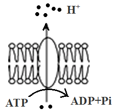
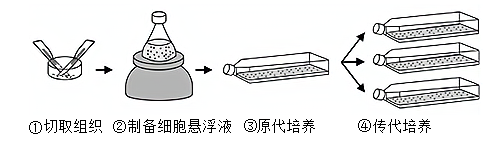
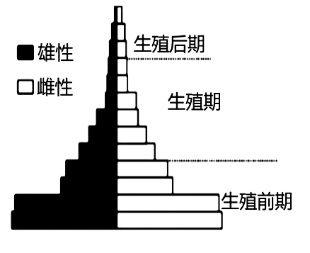
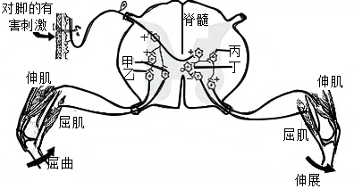
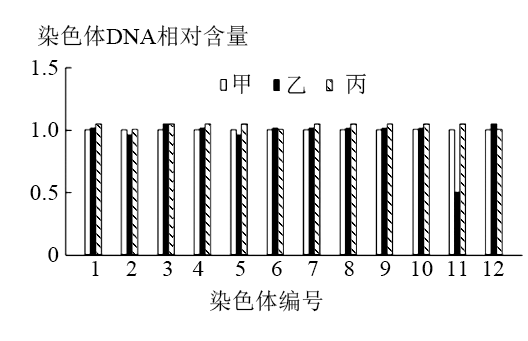

**浙江省2021年1月选考生物试题**

**一、选择题（本大题共25小题，每小题2分，共50分。每小题列出的四个备选项中只有一个是符合题目要求的，不选、多选、错选均不得分）**

1\. 人类免疫缺陷病毒（HIV）引发的疾病是（　　）

A. 艾滋病 B. 狂犬病 C. 禽流感 D. 非典型肺炎

2\. 我省某国家级自然保护区林木繁茂，自然资源丰富，是高校的野外实习基地。设立该保护区的主要目的是（　　）

A. 防治酸雨 B. 保护臭氧层 C. 治理水体污染 D. 保护生物多样性

3\. 秀丽新小杆线虫发育过程中某阶段的体细胞有1090个，而发育成熟后体细胞只有959个。体细胞减少的原因是（　　）

A. 细胞凋亡 B. 细胞衰老 C. 细胞癌变 D. 细胞分裂

4\. 野生果蝇的复眼由正常眼变成棒眼和超棒眼，是由于某个染色体中发生了如下图所示变化，a、b、c表示该染色体中的不同片段。棒眼和超棒眼的变异类型属于染色体畸变中的（　　）

A. 缺失 B. 重复 C. 易位 D. 倒位

5\. 某企业宣称研发出一种新型解酒药，该企业的营销人员以非常“专业”的说辞推介其产品。下列关于解酒机理的说辞，合理的是（　　）

A. 提高肝细胞内质网上酶的活性，加快酒精的分解

B. 提高胃细胞中线粒体的活性，促进胃蛋白酶对酒精的消化

C. 提高肠道细胞中溶酶体的活性，增加消化酶的分泌以快速消化酒精

D. 提高血细胞中高尔基体的活性，加快酒精转运使血液中酒精含量快速下降

6\. 在进行“观察叶绿体”的活动中，先将黑藻放在光照、温度等适宜条件下预处理培养，然后进行观察。下列叙述正确的是（　　）

A. 制作临时装片时，实验材料不需要染色

B. 黑藻是一种单细胞藻类，制作临时装片时不需切片

C. 预处理可减少黑藻细胞中叶绿体的数量，便于观察

D. 在高倍镜下可观察到叶绿体中的基粒由类囊体堆叠而成

7\. 近年来，我省积极践行“两山”理念，建设生态文明，在一些地区实施了退耕还林工程，退耕区域会发生变化。退耕之初发展到顶极群落期间的变化趋势是（　　）

A. 生态系统稳定性越来越强 B. 群落的净生产量越来越大

C. 草本层对垂直结构的影响越来越明显 D. 群落中植物个体总数越来越多

8\. 下列关于植物细胞有丝分裂的叙述，正确的是（　　）

A. 前期，核DNA已完成复制且染色体数目加倍

B. 后期，染色体的着丝粒分布在一个平面上

C. 末期，含有细胞壁物质的囊泡聚集成细胞板

D. 亲代细胞的遗传物质平均分配到两个子细胞

9\. 遗传病是生殖细胞或受精卵遗传物质改变引发的疾病。下列叙述正确的是（　　）

A. 血友病是一种常染色体隐性遗传病

B. X连锁遗传病的遗传特点是“传女不传男”

C. 重度免疫缺陷症不能用基因治疗方法医治

D. 孩子的先天畸形发生率与母亲的生育年龄有关

10\. 用白萝卜制作泡菜的过程中，采用适当方法可缩短腌制时间。下列方法中错误的是（　　）

A. 将白萝卜切成小块 B. 向容器中通入无菌空气

C. 添加已经腌制过泡菜汁 D. 用沸水短时处理白萝卜块

11\. 苹果果实成熟到一定程度，呼吸作用突然增强，然后又突然减弱，这种现象称为呼吸跃变，呼吸跃变标志着果实进入衰老阶段。下列叙述正确的是（　　）

A. 呼吸作用增强，果实内乳酸含量上升

B. 呼吸作用减弱，精酵解产生的CO2减少

C. 用乙烯合成抑制剂处理，可延缓呼吸跃变现象的出现

D. 果实贮藏在低温条件下，可使呼吸跃变提前发生

12\. 下图为植物细胞质膜中H+-ATP酶将细胞质中的H+转运到膜外的示意图。下列叙述正确的是（　　）

A. H+转运过程中H+-ATP酶不发生形变

B. 该转运可使膜两侧H+维持一定的浓度差

C. 抑制细胞呼吸不影响H+的转运速率

D. 线粒体内膜上的电子传递链也会发生图示过程

13\. 脱落酸与与植物的衰老、成熟、对不良环境发生响应有关。下列叙述错误的是（　　）

A. 脱落酸在植物体内起着信息传递的作用

B. 缺水使脱落酸含量上升导致气孔关闭

C. 提高脱落酸解含量可解除种子的休眠状态

D. 植物体内脱酸含量的变化是植物适应环境的一种方式

14\. 选择是生物进化的重要动力。下列叙述正确的是（　　）

A. 同一物种的个体差异不利于自然选择和人工选择

B. 人工选择可以培育新品种，自然选择不能形成新物种

C. 自然选择保存适应环境的变异，人工选择保留人类所需的变异

D. 经自然选择，同一物种的不同种群的基因库发生相同的变化

15\. 下列关于遗传学发展史上4个经典实验的叙述，正确的是（　　）

A. 孟德尔的单因子杂交实验证明了遗传因子位于染色体上

B. 摩尔根的果蝇伴性遗传实验证明了基因自由组合定律

C. T2噬菌体侵染细菌实验证明了DNA是大肠杆菌的遗传物质

D. 肺炎双球菌离体转化实验证明了DNA是肺炎双球菌的遗传物质

16\. 大约在1800年，绵羊被引入到塔斯马尼亚岛，绵羊种群呈“S”形曲线增长，直到1860年才稳定在170万头左右。下列叙述正确的是（　　）

A. 绵羊种群数量的变化与环境条件有关，而与出生率、死亡率变动无关

B. 绵羊种群在达到环境容纳量之前，每单位时间内种群增长的倍数不变

C. 若绵羊种群密度增大，相应病原微生物的致病力和传播速度减小

D. 若草的生物量不变而种类发生改变，绵羊种群的环境容纳量可能发生变化

17\. 胰岛素和胰高血糖素是调节血糖水平的重要激素。下列叙述错误的是（　　）

A. 胰岛素促进组织细胞利用葡萄糖

B. 胰高血糖素促进肝糖原分解

C. 胰岛素和胰高血糖素在血糖水平调节上相互对抗

D. 血糖水平正常时，胰岛不分泌胰岛素和胰高血糖素

18\. 下图为动物成纤维细胞的培养过程示意图。下列叙述正确的是（　　）

A. 步骤①的操作不需要在无菌环境中进行

B. 步骤②中用盐酸溶解细胞间物质使细胞分离

C. 步骤③到④分瓶操作前常用胰蛋白酶处理

D. 步骤④培养过程中不会发生细胞转化

19\. 某种小鼠的毛色受AY（黄色）、A（鼠色）、a（黑色）3个基因控制，三者互为等位基因，AY对A、a为完全显性，A对a为完全显性，并且基因型AYAY胚胎致死（不计入个体数）。下列叙述错误的是（　　）

A. 若AYa个体与AYA个体杂交，则F1有3种基因型

B. 若AYa个体与Aa个体杂交，则F1有3种表现型

C. 若1只黄色雄鼠与若干只黑色雌鼠杂交，则F1可同时出现鼠色个体与黑色个体

D. 若1只黄色雄鼠与若干只纯合鼠色雌鼠杂交，则F1可同时出现黄色个体与鼠色个体

20\. 自2020年以来，世界多地爆发了新冠肺炎疫情，新冠肺炎的病原体是新型冠状病毒。下列叙述错误的是（　　）

A. 佩戴口罩和保持社交距离有助于阻断新型冠状病毒传播

B. 给重症新冠肺炎患者注射新冠病毒灭活疫苗是一种有效的治疗手段

C. 多次注射新冠病毒疫苗可增强人体对新型冠状病毒的特异性免疫反应

D. 效应细胞毒性T细胞通过抗原MHC受体识别被病毒感染的细胞

21\. 下图为一个昆虫种群在某时期的年龄结构图。下列叙述正确的是（　　）

A. 从图中的信息可以得出该种群的存活曲线为凹型

B. 用性引诱剂来诱杀种群内的个体，对生殖后期的个体最有效

C. 环境条件不变，该种群年龄结构可由目前的稳定型转变为增长型

D. 与其它年龄组相比，生殖前期个体获得的杀虫剂抗性遗传给后代的概率最大

22\. 下图是真核细胞遗传信息表达中某过程的示意图。某些氨基酸的部分密码子（5'→3'）是：丝氨酸UCU；亮氨酸UUA、CUA；异亮氨酸AUC、AUU；精氨酸AGA。下列叙述正确的是（　　）

A. 图中①为亮氨酸

B. 图中结构②从右向左移动

C. 该过程中没有氢键的形成和断裂

D. 该过程可发生在线粒体基质和细胞核基质中

23\. 当人的一只脚踩到钉子时，会引起同侧腿屈曲和对侧腿伸展，使人避开损伤性刺激，又不会跌倒。其中的反射弧示意图如下，“＋”表示突触前膜的信号使突触后膜兴奋，“－”表示突触前膜的信号使突触后膜受抑制。甲~丁是其中的突触，在上述反射过程中，甲~丁突触前膜信号对突触后膜的作用依次为（　　）

A. ＋、－、＋、＋ B. ＋、＋、＋、＋

C. －、＋、－、＋ D. ＋、－、＋、－

24\. 小家鼠的某1个基因发生突变，正常尾变成弯曲尾。现有一系列杂交试验，结果如下表。第①组F1雄性个体与第③组亲本雌性个体随机交配获得F2。F2雌性弯曲尾个体中杂合子所占比例为（　　）

<table>
<colgroup>
<col style="width: 8%" />
<col style="width: 12%" />
<col style="width: 12%" />
<col style="width: 32%" />
<col style="width: 33%" />
</colgroup>
<tbody>
<tr>
<td style="text-align: center;">杂交</td>
<td colspan="2" style="text-align: center;">P</td>
<td colspan="2" style="text-align: center;">F1</td>
</tr>
<tr>
<td style="text-align: center;">组合</td>
<td style="text-align: center;">雌</td>
<td style="text-align: center;">雄</td>
<td style="text-align: center;">雌</td>
<td style="text-align: center;">雄</td>
</tr>
<tr>
<td style="text-align: center;">①</td>
<td style="text-align: center;">弯曲尾</td>
<td style="text-align: center;">正常尾</td>
<td style="text-align: center;">1/2弯曲尾，1/2正常尾</td>
<td style="text-align: center;">1/2弯曲尾，1/2正常尾</td>
</tr>
<tr>
<td style="text-align: center;">②</td>
<td style="text-align: center;">弯曲尾</td>
<td style="text-align: center;">弯曲尾</td>
<td style="text-align: center;">全部弯曲尾</td>
<td style="text-align: center;">1/2弯曲尾，1/2正常尾</td>
</tr>
<tr>
<td style="text-align: center;">③</td>
<td style="text-align: center;">弯曲尾</td>
<td style="text-align: center;">正常尾</td>
<td style="text-align: center;">4/5弯曲尾，1/5正常尾</td>
<td style="text-align: center;">4/5弯曲尾，1/5正常尾</td>
</tr>
</tbody>
</table>

注：F1中雌雄个体数相同

A. 4/7 B. 5/9 C. 5/18 D. 10/19

25\. 现建立“动物精原细胞（2n=4）有丝分裂和减数分裂过程”模型。1个精原细胞（假定DNA中的P元素都为32P，其它分子不含32P）在不含32P的培养液中正常培养，分裂为2个子细胞，其中1个子细胞发育为细胞①。细胞①和②的染色体组成如图所示，H（h）、R（r）是其中的两对基因，细胞②和③处于相同的分裂时期。下列叙述正确的是（　　）

A. 细胞①形成过程中没有发生基因重组

B. 细胞②中最多有两条染色体含有32P

C. 细胞②和细胞③中含有32P的染色体数相等

D. 细胞④~⑦中含32P的核DNA分子数可能分别是2、1、1、1

**二、非选择题（本大题共5小题，共50分）**

26\. 原产于北美的植物——加拿大一枝黄花具有生长迅速、竞争力强的特性，近年来在我国某地大肆扩散，对生物多样性和农业生产造成了危害。回答下列问题：

（1）加拿大一枝黄花入侵了某草本群落，会经历定居→扩张→占据优势等阶段，当它取得绝对的优势地位时，种群的分布型更接近\_\_\_\_\_\_\_\_\_。为了清除加拿大一枝黄花，通常采用人工收割并使之自然腐烂的方法，收割的适宜时机应在\_\_\_\_\_\_\_\_\_（填“开花前”或“开花后”）。

上述处理方法改变了生态系统中生产者的组成格局，同时加快了加拿大一枝黄花积聚的能量以化学能的形式流向\_\_\_\_\_\_\_\_。

（2）加拿大一枝黄花与昆虫、鸟类和鼠类等共同组成群落，它们之间建立起以\_\_\_\_\_\_\_关系为纽带的食物网。某种鸟可以在不同的食物链中处于不同的环节，其原因是\_\_\_\_\_\_\_\_\_。若昆虫与鸟类单位体重的同化量相等，昆虫比鸟类体重的净增长量要高，其原因是鸟类同化的能量中用于维持\_\_\_\_\_\_\_\_的部分较多。

（3）加拿大一枝黄花虽存在危害，但可以运用生态工程中的\_\_\_\_\_\_\_技术，在造纸、沼气发酵、肥田等方面加以利用。

27\. 现以某种多细胞绿藻为材料，研究环境因素对其叶绿素a含量和光合速率的影响。实验结果如下图，图中的绿藻质量为鲜重。

回答下列问题：

（1）实验中可用95%乙醇溶液提取光合色素，经处理后，用光电比色法测定色素提取液的\_\_\_\_\_\_\_\_\_，计算叶绿素a的含量。由甲图可知，与高光强组相比，低光强组叶绿素a的含量较\_\_\_\_\_\_\_\_\_，以适应低光强环境。由乙图分析可知，在\_\_\_\_\_\_\_\_\_条件下温度对光合速率的影响更显著。

（2）叶绿素a的含量直接影响光反应的速率。从能量角度分析，光反应是一种\_\_\_\_\_\_\_\_\_反应。光反应的产物有\_\_\_\_\_\_\_\_\_和O2。

（3）图乙的绿藻放氧速率比光反应产生O2的速率\_\_\_\_\_\_\_\_\_，理由是\_\_\_\_\_\_\_\_\_。

（4）绿藻在20℃、高光强条件下细胞呼吸的耗氧速率为30μmol·g-1·h-1，则在该条件下每克绿藻每小时光合作用消耗CO2生成\_\_\_\_\_\_\_\_μmol的3-磷酸甘油酸。

28\. 水稻雌雄同株，从高秆不抗病植株（核型2n=24）（甲）选育出矮秆不抗病植株（乙）和高秆抗病植株（丙）。甲和乙杂交、甲和丙杂交获得的F1均为高秆不抗病，乙和丙杂交获得的F1为高秆不抗病和高秆抗病。高秆和矮秆、不抗病和抗病两对相对性状独立遗传，分别由等位基因A（a）、B（b）控制，基因B（b）位于11号染色体上，某对染色体缺少1条或2条的植株能正常存活。甲、乙和丙均未发生染色体结构变异，甲、乙和丙体细胞的染色体DNA相对含量如图所示（甲的染色体DNA相对含量记为1.0）。

回答下列问题：

（1）为分析乙的核型，取乙植株根尖，经固定、酶解处理、染色和压片等过程，显微观察分裂中期细胞的染色体。其中酶解处理所用的酶是\_\_\_\_\_\_\_\_，乙的核型为\_\_\_\_\_\_\_\_\_\_。

（2）甲和乙杂交获得F1，F1自交获得F2。F1基因型有\_\_\_\_\_\_\_种，F2中核型为2n-2=22的植株所占的比例为\_\_\_\_\_\_\_\_\_\_。

（3）利用乙和丙通过杂交育种可培育纯合的矮秆抗病水稻，育种过程是\_\_\_\_\_\_\_\_\_。

（4）甲和丙杂交获得F1，F1自交获得F2。写出F1自交获得F2的遗传图解。\_\_\_\_\_\_\_\_\_\_\_\_\_\_\_

29\. 回答下列（一）、（二）小题：

（一）某环保公司从淤泥中分离到一种高效降解富营养化污水污染物细菌菌株，制备了固定化菌株。

（1）从淤泥中分离细菌时常用划线分离法或\_\_\_\_\_\_\_\_法，两种方法均能在固体培养基上形成\_\_\_\_\_\_\_\_。对分离的菌株进行诱变、\_\_\_\_\_\_\_\_和鉴定，从而获得能高效降解富营养化污水污染物的菌株。该菌株只能在添加了特定成分X的培养基上繁殖。

（2）固定化菌株的制备流程如下；①将菌株与该公司研制的特定介质结合；②用蒸馏水去除\_\_\_\_\_\_\_\_；③检验固定化菌株的\_\_\_\_\_\_\_\_。菌株与特定介质的结合不宜直接采用交联法和共价偶联法，可以采用的2种方法是\_\_\_\_\_\_\_\_。

（3）对外，只提供固定化菌株有利于保护该公司的知识产权，推测其原因是\_\_\_\_\_\_\_\_。

（二）三叶青为蔓生的藤本植物，以根入药。由于野生三叶青对生长环境要求非常苛刻，以及生态环境的破坏和过度的采挖，目前我国野生三叶青已十分珍稀。

（1）为保护三叶青的\_\_\_\_\_\_\_\_多样性和保证药材的品质，科技工作者依据生态工程原理，利用\_\_\_\_\_\_\_\_技术，实现了三叶青的林下种植。

（2）依据基因工程原理，利用发根农杆菌侵染三叶青带伤口的叶片，叶片产生酚类化合物，诱导发根农杆菌质粒上*vir*系列基因表达形成\_\_\_\_\_\_\_\_和限制性核酸内切酶等，进而从质粒上复制并切割出一段可转移的DNA片段（T-DNA）。T-DNA进入叶片细胞并整合到染色体上，T-DNA上*rol*系列基因表达，产生相应的植物激素，促使叶片细胞持续不断地分裂形成\_\_\_\_\_\_\_\_，再分化形成毛状根。

（3）剪取毛状根，转入含头孢类抗生素的固体培养基上进行多次\_\_\_\_\_\_\_\_培养，培养基中添加抗生素的主要目的是\_\_\_\_\_\_\_\_。最后取毛状根转入液体培养基、置于摇床上进行悬浮培养，通过控制摇床的\_\_\_\_\_\_\_\_和温度，调节培养基成分中的\_\_\_\_\_\_\_\_，获得大量毛状根，用于提取药用成分。

30\. 1897年德国科学家毕希纳发现，利用无细胞的酵母汁可以进行乙醇发酵；还有研究发现，乙醇发酵的酶发挥催化作用需要小分子和离子辅助。某研究小组为验证上述结论，利用下列材料和试剂进行了实验。

材料和试剂：酵母菌、酵母汁、A溶液（含有酵母汁中的各类生物大分子）、B溶液（含有酵母汁中的各类小分子和离子）、葡萄糖溶液、无菌水。

实验共分6组，其中4组的实验处理和结果如下表。

|     |           |      |
|:---:|:---------:|:----:|
| 组别  | 实验处理      | 实验结果 |
| ①   | 葡萄糖溶液＋无菌水 | －    |
| ②   | 葡萄糖溶液＋酵母菌 | ＋    |
| ③   | 葡萄糖溶液＋A溶液 | －    |
| ④   | 葡萄糖溶液＋B溶液 | －    |

注：“＋”表示有乙醇生成，“－”表示无乙醇生成

回答下列问题：

（1）除表中4组外，其它2组的实验处理分别是：\_\_\_\_\_\_\_\_\_\_\_；\_\_\_\_\_\_\_\_\_\_。本实验中，这些起辅助作用的小分子和离子存在于酵母菌、\_\_\_\_\_\_\_\_\_\_\_。

（2）若为了确定B溶液中是否含有多肽，可用\_\_\_\_\_\_\_\_\_\_\_试剂来检测。若为了研究B溶液中离子M对乙醇发酵是否是必需，可增加一组实验，该组的处理是\_\_\_\_\_\_\_\_\_\_\_。

（3）制备无细胞的酵母汁，酵母菌细胞破碎处理时需加入缓冲液，缓冲液的作用是\_\_\_\_\_\_\_\_\_\_\_，以确保酶的活性。

（4）如何检测酵母汁中是否含有活细胞？（写出2项原理不同的方法及相应原理）\_\_\_\_\_\_\_\_\_\_\_\_\_\_\_\_\_\_\_\_\_
