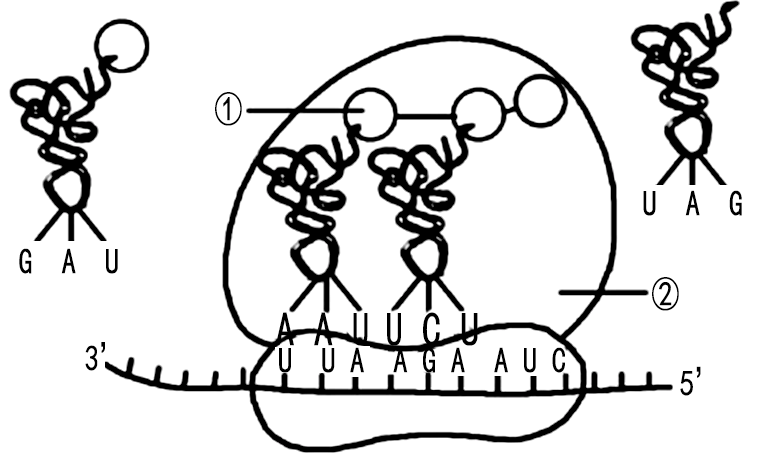
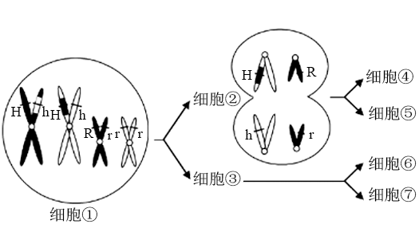
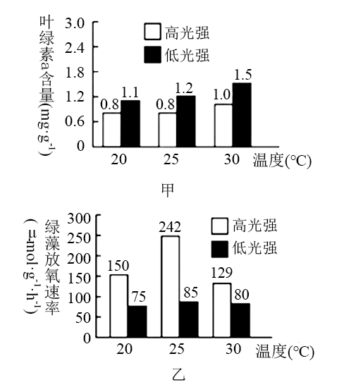
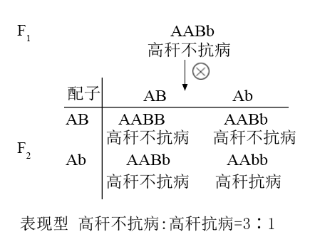
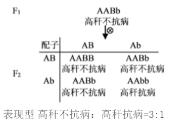

**浙江省2021年1月选考生物试题**

**一、选择题（本大题共25小题，每小题2分，共50分。每小题列出的四个备选项中只有一个是符合题目要求的，不选、多选、错选均不得分）**

1\. 人类免疫缺陷病毒（HIV）引发的疾病是（　　）

A. 艾滋病 B. 狂犬病 C. 禽流感 D. 非典型肺炎

【答案】A

【解析】

【分析】

艾滋病是一种病毒性传染病，是人类感染人类免疫缺陷病毒（HIV）后导致免疫缺陷，使人体免疫功能缺损的疾病。

【详解】艾滋病是获得性免疫缺陷综合症的简称，按其英文字音（AIDS）译为“艾滋病”；艾滋病是一种病毒性疾病，它的致病因素是结构上很相近似的一组病毒，这组病毒被统称为“人类免疫缺陷病毒（HIV）”。A正确，BCD错误。

故选A。

2\. 我省某国家级自然保护区林木繁茂，自然资源丰富，是高校的野外实习基地。设立该保护区的主要目的是（　　）

A. 防治酸雨 B. 保护臭氧层 C. 治理水体污染 D. 保护生物多样性

【答案】D

【解析】

【分析】

（1）生物多样性通常有三个层次，即遗传多样性、物种多样性和生态系统多样性。

（2）保护生物多样性的措施有：一是就地保护，二是迁地保护，三是开展生物多样性保护的科学研究，制定生物多样性保护的法律和政策，开展生物多样性保护方面的宣传和教育，其中就地保护是最有效的保护措施。

（3）威胁生物生存的原因有栖息地被破坏、偷猎（滥捕乱杀）、外来物种入侵、环境污染、其他原因等。

【详解】自然保护区是在原始的自然状态系统中，选择具有代表性的地段，人为地划定一个区域，并采取有效的保护措施，对那里的生态系统加以严格的保护。设立自然保护区是就地保护的具体措施之一，其目的是为了保护生物多样性，D正确。

故选D。

【点睛】解答此类题目的关键是理解建立自然保护区的意义。

3\. 秀丽新小杆线虫发育过程中某阶段的体细胞有1090个，而发育成熟后体细胞只有959个。体细胞减少的原因是（　　）

A. 细胞凋亡 B. 细胞衰老 C. 细胞癌变 D. 细胞分裂

【答案】A

【解析】

【分析】

细胞凋亡是由基因决定的细胞编程序死亡的过程。细胞凋亡是生物体正常发育的基础、能维持组织细胞数目的相对稳定、是机体的一种自我保护机制。在成熟的生物体内，细胞的自然更新、被病原体感染的细胞的清除，是通过细胞凋亡完成的。

【详解】A、细胞凋亡是正常的生命现象，秀丽新小杆线虫个体发育过程中有细胞凋亡发生。秀丽新小杆线虫发育过程中某阶段的体细胞有1090个，而发育成熟后体细胞只有959个，体细胞死亡是细胞凋亡导致的，A正确；

B、细胞衰老是正常的生命现象，但体细胞不会在发育成熟时大量死亡，而且衰老的细胞也是通过细胞凋亡来清除的，B错误；

C、细胞癌变会导致细胞具有无限增殖的能力，体细胞不会在发育成熟时大量死亡，C错误；

D、细胞分裂会导致细胞数目增多，D错误。

故选A。

4\. 野生果蝇的复眼由正常眼变成棒眼和超棒眼，是由于某个染色体中发生了如下图所示变化，a、b、c表示该染色体中的不同片段。棒眼和超棒眼的变异类型属于染色体畸变中的（　　）

A. 缺失 B. 重复 C. 易位 D. 倒位

【答案】B

【解析】

【分析】

染色体畸变是指生物细胞中染色体在数目和结构上发生的变化，包括染色体数目变异和染色体结构变异，其中染色体结构变异是指染色体发生断裂后，在断裂处发生错误连接而导致染色体结构不正常的变异，分为缺失（染色体片段的丢失，引起片段上所带基因随之丢失）、重复（染色体上增加了某个相同片段）、倒位（一个染色体上的某个片段的正常排列顺序发生180°颠倒）、易位（染色体的某一片段移接到另一非同源染色体上）4种类型。

【详解】分析图示可知，与正常眼相比，棒眼的该染色体上b片段重复了一个，超棒眼的该染色体上b片段重复了两个，因此棒眼和超棒眼的变异类型属于染色体结构变异中的重复，即染色体上增加了某个相同片段。因此B正确，ACD错误。

故选B。

5\. 某企业宣称研发出一种新型解酒药，该企业的营销人员以非常“专业”的说辞推介其产品。下列关于解酒机理的说辞，合理的是（　　）

A. 提高肝细胞内质网上酶的活性，加快酒精的分解

B. 提高胃细胞中线粒体的活性，促进胃蛋白酶对酒精的消化

C. 提高肠道细胞中溶酶体的活性，增加消化酶的分泌以快速消化酒精

D. 提高血细胞中高尔基体的活性，加快酒精转运使血液中酒精含量快速下降

【答案】A

【解析】

【分析】

光面内质网的功能比较独特，人的肝脏细胞中的光面内质网含有氧化酒精的酶，能加快酒精的分解。

【详解】A、肝脏具有解酒精的功能，人肝脏细胞中的光面内质网有氧化酒精的酶，因此提高肝细胞内质网上酶的活性，可以加快酒精的分解，A正确；

B、酶具有专一性，胃蛋白酶只能催化蛋白质水解，不能催化酒精分解，B错误；

C、溶酶体存在于细胞中，溶酶体中的消化酶分泌出来会破坏细胞结构，且溶酶体中的消化酶一般也只能在溶酶体内起作用（需要适宜的pH等条件），C错误；

D、高尔基体属于真核细胞中的物质转运系统，能够对来自内质网的蛋白质进行加工、分拣和转运，但不能转运酒精，D错误。。

故选A。

6\. 在进行“观察叶绿体”的活动中，先将黑藻放在光照、温度等适宜条件下预处理培养，然后进行观察。下列叙述正确的是（　　）

A. 制作临时装片时，实验材料不需要染色

B. 黑藻是一种单细胞藻类，制作临时装片时不需切片

C. 预处理可减少黑藻细胞中叶绿体的数量，便于观察

D. 在高倍镜下可观察到叶绿体中的基粒由类囊体堆叠而成

【答案】A

【解析】

【分析】

观察叶绿体：

（1）制片：在洁净的载玻片中央滴一滴清水，用镊子取一片藓类的小叶或取菠菜叶稍带些叶肉的下表皮，放入水滴中，盖上盖玻片。

（2）低倍镜观察：在低倍镜下找到叶片细胞，然后换用高倍镜。

（3）高倍镜观察：调清晰物像，仔细观察叶片细胞内叶绿体的形态和分布情况。

【详解】A、叶绿体呈现绿色，用显微镜可以直接观察到，因此制作临时装片时，实验材料不需要染色，A正确；

B、黑藻是一种多细胞藻类，只是叶片是由单层细胞组成，可以直接制作成临时装片，B错误；

C、先将黑藻放在光照、温度等适宜条件下预处理培养，有利于叶绿体进行光合作用，保持细胞的活性，更有利于观察叶绿体的形态，C错误；

D、电子显微镜下才能可观察到叶绿体中的基粒和类囊体，高倍镜下观察不到，D错误。

故选A。

7\. 近年来，我省积极践行“两山”理念，建设生态文明，在一些地区实施了退耕还林工程，退耕区域会发生变化。退耕之初发展到顶极群落期间的变化趋势是（　　）

A. 生态系统稳定性越来越强 B. 群落的净生产量越来越大

C. 草本层对垂直结构的影响越来越明显 D. 群落中植物个体总数越来越多

【答案】A

【解析】

【分析】

群落的演替包括原生演替和次生演替两种类型．在一个起初没有生命的地方开始发生的演替，叫做原生演替；在原来有生物群落存在，后来由于各种原因使原有群落消亡或受到严重破坏的地方开始的演替，叫做次生演替。退耕还林过程中发生的演替为次生演替过程，据此分析作答。

【详解】A、在次生演替过程中，物种数目会增多，食物链和食物网结构变复杂，则生态系统的稳定性越来越强，A正确；

B、净生产量通常是指从无机营养生物（自养生物）的光合成生产量以及化学合成生产量中减去呼吸消耗量而言，在该演替过程中，群落的净初级生产量变化趋势是增加后减少再稳定，B错误；

C、随着演替的进行，灌木和乔木逐渐占据优势，草本植物因为对光照的竞争不占优势，故其对垂直结构的影响越来越小，C错误；

D、演替过程中群落的物种数目会增多，但植物个体总数不一定越来越多，D错误。

故选A。

8\. 下列关于植物细胞有丝分裂的叙述，正确的是（　　）

A. 前期，核DNA已完成复制且染色体数目加倍

B. 后期，染色体的着丝粒分布在一个平面上

C. 末期，含有细胞壁物质的囊泡聚集成细胞板

D. 亲代细胞的遗传物质平均分配到两个子细胞

【答案】C

【解析】

【分析】

有丝分裂不同时期的特点：（1）间期：进行DNA的复制和有关蛋白质的合成；（2）前期：核膜、核仁逐渐解体消失，出现纺锤体和染色体；（3）中期：染色体形态固定、数目清晰，各染色体的着丝粒排列在细胞中央的一个平面上；（4）后期：着丝点分裂，姐妹染色单体分开成为染色体，并均匀地移向两极；（5）末期：核膜、核仁重建、纺锤体和染色体消失。

【详解】A、由于间期时进行DNA的复制，在分裂前期核DNA已完成复制，但由于着丝点未分裂，染色体数目未加倍，A错误；

B、有丝分裂中期时染色体的着丝粒分布在细胞中央的一个平面上，后期着丝粒分裂，分离的染色体以相同的速率分别被纺锤丝拉向两极，B错误；

C、在植物细胞有丝分裂末期，细胞质开始分裂，含有细胞壁物质的囊泡聚集成细胞板，之后发展成为新的细胞壁，C正确；

D、在有丝分裂中，亲代细胞的细胞核内的染色体经复制后平均分配到两个子细胞中，但细胞质中的遗传物质不一定平均分配到两个子细胞中，D错误。

故选C。

9\. 遗传病是生殖细胞或受精卵遗传物质改变引发的疾病。下列叙述正确的是（　　）

A. 血友病是一种常染色体隐性遗传病

B. X连锁遗传病的遗传特点是“传女不传男”

C. 重度免疫缺陷症不能用基因治疗方法医治

D. 孩子的先天畸形发生率与母亲的生育年龄有关

【答案】D

【解析】

【分析】

人类遗传病分为单基因遗传病、多基因遗传病和染色体异常遗传病：（1）单基因遗传病包括常染色体显性遗传病（如并指）、常染色体隐性遗传病（如白化病）、伴X染色体隐性遗传病（如血友病、色盲）、伴X染色体显性遗传病（如抗维生素D佝偻病）；（2）多基因遗传病是由多对等位基因异常引起的，如青少年型糖尿病；（3）染色体异常遗传病包括染色体结构异常遗传病（如猫叫综合征）和染色体数目异常遗传病（如21三体综合征）。

【详解】A、血友病是一种伴X染色体隐性遗传病，A错误；

B、位于Y染色体上的遗传病表现为“传男不传女”，如外耳道多毛症，B错误；

C、可以采用基因治疗重度免疫缺陷症，该方法需要取患者的T淋巴细胞，因为T细胞是机体重要的免疫细胞，C错误；

D、孩子的先天畸形发生率与母亲的生育年龄有关，如21-三体综合征，女性适龄生育时胎儿先天畸形率低，超龄后年龄越大，胎儿先天畸形率越大，D正确。

故选D。

10\. 用白萝卜制作泡菜的过程中，采用适当方法可缩短腌制时间。下列方法中错误的是（　　）

A. 将白萝卜切成小块 B. 向容器中通入无菌空气

C. 添加已经腌制过泡菜汁 D. 用沸水短时处理白萝卜块

【答案】B

【解析】

【分析】

1、泡菜的制作所使用的微生物是乳酸菌，代谢类型是异养厌氧型，在无氧条件下乳酸菌能够将蔬菜中的葡萄糖氧化为乳酸。

2、泡菜的制作流程是：选择原料、配置盐水、调味装坛、密封发酵。

【详解】A、将白萝卜切成小块可以扩大白萝卜与腌料的接触面积，缩短腌制时间，A正确；

B、泡菜制作所需菌种为乳酸菌，制作过程中应保持无氧环境，向容器中通入无菌空气不利于腌制，B错误；

C、泡菜汁中含有一定量的发酵菌种，所以在腌制过程中，加入一些已经腌制过泡菜汁可缩短腌制时间，C正确；

D、用沸水短时处理，可抑制某些微生物的繁殖，提高泡菜品质，也可缩短腌制时间，D正确。

故选B。

11\. 苹果果实成熟到一定程度，呼吸作用突然增强，然后又突然减弱，这种现象称为呼吸跃变，呼吸跃变标志着果实进入衰老阶段。下列叙述正确的是（　　）

A. 呼吸作用增强，果实内乳酸含量上升

B. 呼吸作用减弱，精酵解产生的CO2减少

C. 用乙烯合成抑制剂处理，可延缓呼吸跃变现象的出现

D. 果实贮藏在低温条件下，可使呼吸跃变提前发生

【答案】C

【解析】

【分析】

乙烯能促进果实成熟和衰老；糖酵解属于细胞呼吸第一阶段，该过程1 个葡萄糖分子被分解成 2 个含 3 个碳原子的化合物分子，并释放出少量能量， 形成少量 ATP。

【详解】A、苹果果实细胞无氧呼吸不产生乳酸，产生的是酒精和二氧化碳，A错误；

\B、糖酵解属于细胞呼吸第一阶段，在糖酵解的过程中，1 个葡萄糖分子被分解成 2 个含 3 个碳原子的化合物分子，分解过程中释放出少量能量， 形成少量 ATP，故糖酵解过程中没有CO2产生，B错误；

C、乙烯能促进果实成熟和衰老，因此用乙烯合成抑制剂处理，可延缓细胞衰老，从而延缓呼吸跃变现象的出现，C正确；

D、果实贮藏在低温条件下，酶的活性比较低，细胞更不容易衰老，能延缓呼吸跃变现象的出现，D错误。

故选C。

12\. 下图为植物细胞质膜中H+-ATP酶将细胞质中的H+转运到膜外的示意图。下列叙述正确的是（　　）

A. H+转运过程中H+-ATP酶不发生形变

B. 该转运可使膜两侧H+维持一定的浓度差

C. 抑制细胞呼吸不影响H+的转运速率

D. 线粒体内膜上的电子传递链也会发生图示过程

【答案】B

【解析】

【分析】

据图分析可知：H＋逆浓度梯度运输，该过程为主动转运；在此过程中H+-ATP酶兼有载体蛋白和ATP水解酶的功能。

【详解】A、主动转运过程中H+-ATP酶作为载体蛋白，会发生形变，协助物质运输，A错误；

B、该转运方式为主动转运，主动转运的结果是使膜两侧H+维持一定的浓度差，B正确；

C、H+的转运方式主动转运，需要载体蛋白的协助，同时需要能量，抑制细胞呼吸会影响细胞的能量供应，进而影响H+的转运速率，C错误；

D、图示过程是消耗ATP的过程，而线粒体内膜的电子传递链最终会生成ATP，不会发生图示过程，D错误。

故选B。

13\. 脱落酸与与植物的衰老、成熟、对不良环境发生响应有关。下列叙述错误的是（　　）

A. 脱落酸在植物体内起着信息传递的作用

B. 缺水使脱落酸含量上升导致气孔关闭

C. 提高脱落酸解含量可解除种子的休眠状态

D. 植物体内脱酸含量的变化是植物适应环境的一种方式

【答案】C

【解析】

【分析】

1、植物激素是指植物体内产生的，从产生部位运输到作用部位，对植物生命活动具有调节作用的微量有机物，其化学本质有多种。

2、脱落酸在根冠和萎蔫的叶片中合成较多，在将要脱落和进入休眠期的器官和组织中含量较多。脱落酸能够抑制细胞的分裂和种子的萌发，还有促进叶和果实的衰老和脱落，促进休眠和提高抗逆能力等作用。

【详解】A、脱落酸是一种植物激素，激素在体内可以起到信息传递的作用，A正确；

B、脱落酸升高具有提高抗逆能力的作用，缺水条件下脱落酸含量上升，导致气孔关闭，减少水分蒸发，利于植物度过不良条件，B正确；

C、赤霉素促进种子萌发，脱落酸抑制种子萌发，为解除种子的休眠状态而促进种子的萌发，应降低种子中脱落酸含量，增加赤霉素的含量，C错误；

D、由题干信息“脱落酸与与植物的衰老、成熟、对不良环境发生响应有关”可知：植物体内脱酸含量的变化是植物适应环境的一种方式，D正确。

故选C。

14\. 选择是生物进化的重要动力。下列叙述正确的是（　　）

A. 同一物种的个体差异不利于自然选择和人工选择

B. 人工选择可以培育新品种，自然选择不能形成新物种

C. 自然选择保存适应环境的变异，人工选择保留人类所需的变异

D. 经自然选择，同一物种的不同种群的基因库发生相同的变化

【答案】C

【解析】

【分析】

自然选择对于不同变异起选择作用，具有有利变异的个体生存并繁殖后代的机会增大，有利变异的基因频率增大，具有不利变异个体生存并繁殖后代的机会降低，不利变异的基因频率逐渐减小，自然选择通过使种群基因频率发生定向改变进而使生物朝着一定的方向进化。

【详解】A、同一物种的个体差异会产生更多的变异，利于自然选择和人工选择，A错误；

B、生物的遗传和变异是普遍存在的，使得生物在繁殖中出现了不同的变异个体，故人工选择能培育出新品种，自然选择也能形成新的物种，B错误；

C、自然选择是自然界对生物的选择作用，使适者生存，不适者被淘汰；人工选择是在不同的培养条件下，根据各自的爱好对不同的变异个体进行选择，经过若干年的选择，使所选择的形状积累加强，最后选育出不同的品种，C正确；

D、种群基因库是指一个种群中全部个体的所有基因的总和，在自然选择的作用下，同一物种的不同种群向着适应环境的方向发展进化，其基因库的变化不一定是相同的，D错误。

故选C。

15\. 下列关于遗传学发展史上4个经典实验的叙述，正确的是（　　）

A. 孟德尔的单因子杂交实验证明了遗传因子位于染色体上

B. 摩尔根的果蝇伴性遗传实验证明了基因自由组合定律

C. T2噬菌体侵染细菌实验证明了DNA是大肠杆菌的遗传物质

D. 肺炎双球菌离体转化实验证明了DNA是肺炎双球菌的遗传物质

【答案】D

【解析】

【分析】

1、肺炎双球菌转化实验包括格里菲斯体内转化实验和艾弗里体外转化实验，其中格里菲斯体内转化实验证明S型细菌中存在某种“转化因子”，能将R型细菌转化为S型细菌；艾弗里体外转化实验证明DNA是遗传物质。

2、T2噬菌体侵染细菌的实验步骤：分别用35S或32P标记噬菌体→噬菌体与大肠杆菌混合培养→噬菌体侵染未被标记的细菌→在搅拌器中搅拌，然后离心，检测上清液和沉淀物中的放射性物质。该实验证明DNA是遗传物质。

3、萨顿提出基因在染色体上的假说，摩尔根通过果蝇杂交实验证明了基因位于染色体上。

【详解】A、孟德尔的单因子杂交实验没有证明遗传因子位于染色体上，当时人们还没有认识染色体，A错误；

B、摩尔根的果蝇伴性遗传实验只研究了一对等位基因，不能证明基因自由组合定律，B错误；

C、T2噬菌体侵染细菌实验证明了DNA是噬菌体的遗传物质，C错误；

D、肺炎双球菌离体转化实验证明了DNA是转化因子，即DNA是肺炎双球菌的遗传物质，D正确。

故选D。

【点睛】本题考查人体对遗传物质的探究历程，要求考生了解人类对遗传物质的探究历程，识记不同科学家采用的实验方法及得出的实验结论，能结合所学的知识准确判断各选项。

16\. 大约在1800年，绵羊被引入到塔斯马尼亚岛，绵羊种群呈“S”形曲线增长，直到1860年才稳定在170万头左右。下列叙述正确的是（　　）

A. 绵羊种群数量的变化与环境条件有关，而与出生率、死亡率变动无关

B. 绵羊种群在达到环境容纳量之前，每单位时间内种群增长的倍数不变

C. 若绵羊种群密度增大，相应病原微生物的致病力和传播速度减小

D. 若草的生物量不变而种类发生改变，绵羊种群的环境容纳量可能发生变化

【答案】D

【解析】

【分析】

“S”型增长曲线：当种群在一个有限的环境中增长时，随着种群密度的上升，个体间由于有限的空间、食物和其他生活条件而引起的种内斗争必将加剧，以该种群生物为食的捕食者的数量也会增加，这就会使这个种群的出生率降低，死亡率增高，从而使种群数量的增长率下降。当种群数量达到环境条件所允许的最大值时，种群数量将停止增长，有时会在K值保持相对稳定。

【详解】A、绵羊种群数量除与环境条件有关外，出生率和死亡率也会影响种群数量的变化：出生率大于死亡率种群数量增加，而死亡率大于出生率种群数量减少，A错误；

B、绵羊种群呈“S”形曲线增长，种群在达到环境容纳量之前，每单位时间内种群增长趋势为先增加后减少，B错误；

C、病原微生物的致病力和传播速度会随着绵羊种群密度的增加而增加，C错误；

D、若草的生物量不变而种类发生改变，则绵羊的食物来源可能会受影响，故绵羊种群的环境容纳量可能发生变化，D正确。

故选D。

17\. 胰岛素和胰高血糖素是调节血糖水平的重要激素。下列叙述错误的是（　　）

A. 胰岛素促进组织细胞利用葡萄糖

B. 胰高血糖素促进肝糖原分解

C. 胰岛素和胰高血糖素在血糖水平调节上相互对抗

D. 血糖水平正常时，胰岛不分泌胰岛素和胰高血糖素

【答案】D

【解析】

【分析】

在机体的血糖调节中，胰岛素是已知的唯一能降低血糖浓度的激素，其作用是加速组织细胞摄取、利用、储存葡萄糖，还能抑制肝糖原的分解和非糖物质的转化，从而降低血糖水平；胰高血糖素能促进肝糖原分解和非糖物质的转化，从而升高血糖水平。

【详解】A、胰岛素能促进肝细胞、肌肉细胞、脂肪细胞等组织细胞加速摄取、利用和储存葡萄糖，A正确；

B、胰高血糖素能促进肝糖原分解和非糖物质转化成葡萄糖，促使葡萄糖释放进血液中，使血糖升高，B正确；

C、胰岛素具有降低血糖浓度的作用，胰高血糖素具有升高血糖浓度的作用，二者在血糖水平调节上相互对抗，C正确；

D、血糖水平正常时，胰岛仍会分泌一定量的胰岛素和胰高血糖素，使机体内二者浓度维持相对稳定状态，D错误。

故选D。

18\. 下图为动物成纤维细胞的培养过程示意图。下列叙述正确的是（　　）

A. 步骤①的操作不需要在无菌环境中进行

B. 步骤②中用盐酸溶解细胞间物质使细胞分离

C. 步骤③到④分瓶操作前常用胰蛋白酶处理

D. 步骤④培养过程中不会发生细胞转化

【答案】C

【解析】

【分析】

动物细胞培养过程：取动物组织块→剪碎组织→用胰蛋白酶处理分散成单个细胞→制成细胞悬液→转入培养液中（原代培养）→放入二氧化碳培养箱培养→贴满瓶壁的细胞用酶分散为单个细胞，制成细胞悬液→转入培养液（传代培养）→放入二氧化碳培养箱培养。

【详解】A、动物细胞培养过程需要在无菌操作，故步骤①的操作需要在无菌环境中进行，A错误；

B、动物细胞培养过程需要用胰蛋白酶或胶原蛋白酶处理动物组织，分散成单个细胞，制成细胞悬液，B错误；

C、传代培养时需要用胰蛋白酶处理贴壁生长的细胞，使之分散成单个细胞，再分瓶培养，C正确；

D、步骤④为传代培养过程，该过程中部分细胞可能发生细胞转化，核型改变，D错误。

故选C。

19\. 某种小鼠的毛色受AY（黄色）、A（鼠色）、a（黑色）3个基因控制，三者互为等位基因，AY对A、a为完全显性，A对a为完全显性，并且基因型AYAY胚胎致死（不计入个体数）。下列叙述错误的是（　　）

A. 若AYa个体与AYA个体杂交，则F1有3种基因型

B. 若AYa个体与Aa个体杂交，则F1有3种表现型

C. 若1只黄色雄鼠与若干只黑色雌鼠杂交，则F1可同时出现鼠色个体与黑色个体

D. 若1只黄色雄鼠与若干只纯合鼠色雌鼠杂交，则F1可同时出现黄色个体与鼠色个体

【答案】C

【解析】

【分析】

由题干信息可知，AY对A、a为完全显性，A对a为完全显性，AYAY胚胎致死，因此小鼠的基因型及对应毛色表型有AYA（黄色）、AYa（黄色）、AA（鼠色）、Aa（鼠色）、aa（黑色），据此分析。

【详解】A、若AYa个体与AYA个体杂交，由于基因型AYAY胚胎致死，则F1有AYA、AYa、Aa共3种基因型，A正确；

B、若AYa个体与Aa个体杂交，产生的F1的基因型及表现型有AYA（黄色）、AYa（黄色）、Aa（鼠色）、aa（黑色），即有3种表现型，B正确；

C、若1只黄色雄鼠（AYA或AYa）与若干只黑色雌鼠（aa）杂交，产生的F1的基因型为AYa（黄色）、Aa（鼠色），或AYa（黄色）、aa（黑色），则不会同时出现鼠色个体与黑色个体，C错误；

D、若1只黄色雄鼠（AYA或AYa）与若干只纯合鼠色雌鼠（AA）杂交，产生的F1的基因型为AYA（黄色）、AA（鼠色），或AYA（黄色）、Aa（鼠色），则F1可同时出现黄色个体与鼠色个体，D正确。

故选C。

20\. 自2020年以来，世界多地爆发了新冠肺炎疫情，新冠肺炎的病原体是新型冠状病毒。下列叙述错误的是（　　）

A. 佩戴口罩和保持社交距离有助于阻断新型冠状病毒传播

B. 给重症新冠肺炎患者注射新冠病毒灭活疫苗是一种有效的治疗手段

C. 多次注射新冠病毒疫苗可增强人体对新型冠状病毒的特异性免疫反应

D. 效应细胞毒性T细胞通过抗原MHC受体识别被病毒感染的细胞

【答案】B

【解析】

【分析】

1、新冠病毒是一类没有细胞结构的简单的特殊生物，它们的结构基本相似，没有细胞结构，主要由蛋白质的外壳和内部的遗传物质组成。

2、机体受抗原（新冠病毒疫苗）刺激后，免疫细胞对抗原分子识别、活化、增殖和分化，会产生免疫物质发生特异性免疫效应。这个过程包括了抗原递呈、淋巴细胞活化、免疫分子形成及免疫效应发生等一系列的生理反应。

【详解】A、新型冠状病毒能通过唾液进行传播，通过佩戴口罩和保持社交距离有助于阻断新型冠状病毒传播途径，能有效预防新型冠状病毒，A正确；

B、给重症新冠肺炎患者注射新冠病毒的相关抗体才是一种有效的治疗手段，因为抗体能直接与抗原特异性结合被吞噬细胞吞噬消灭，而注射新冠病毒灭活疫苗只是刺激人体产生相关抗体和记忆细胞，且需要一定的时间，不能快速治愈重症新冠肺炎患者，B错误；

C、新冠病毒疫苗相当于抗原，多次注射新冠病毒疫苗能促进机体产生更多相关抗体和记忆细胞，能增强人体对新型冠状病毒的特异性免疫反应，C正确；

D、效应细胞毒性T细胞识别被感染细胞膜上的抗原-MHC复合体，并可进一步使其裂解死亡，D正确。

故选B。

21\. 下图为一个昆虫种群在某时期的年龄结构图。下列叙述正确的是（　　）

A. 从图中的信息可以得出该种群的存活曲线为凹型

B. 用性引诱剂来诱杀种群内的个体，对生殖后期的个体最有效

C. 环境条件不变，该种群年龄结构可由目前的稳定型转变为增长型

D. 与其它年龄组相比，生殖前期个体获得的杀虫剂抗性遗传给后代的概率最大

【答案】D

【解析】

【分析】

种群的年龄结构是指各个年龄组个体数量在种群中所占的比例关系，常用年龄金字塔图形来表示。分析图示可知，该昆虫种群各年龄组个体数量为生殖前期＞生殖期＞生殖后期，呈现为增长型，种群中年幼个体很多，老年个体很少，种群正处于发展时期，种群密度会逐渐增大。

【详解】A、种群的存活曲线是表示种群中全部个体死亡过程和死亡情况的曲线，图示只能表示昆虫种群在某时期的年龄结构为增长型，不能得出该种群的存活曲线为凹型，A错误；

B、常用性引诱剂来诱杀种群内的雄性个体，改变种群的正常性比率，会影响雌性个体的正常交配，对生殖期的个体最有效，B错误；

C、由图示可知，该种群的年龄结构目前呈现增长型，若环境条件不变，种群数量会不断增长，之后年龄结构逐渐转变为稳定型，C错误；

D、由于生殖后期个体不再进行繁殖，而生殖前期个体数量远多于生殖期，则生殖前期个体获得的杀虫剂抗性遗传给后代的概率最大，D正确。

故选D。

22\. 下图是真核细胞遗传信息表达中某过程的示意图。某些氨基酸的部分密码子（5'→3'）是：丝氨酸UCU；亮氨酸UUA、CUA；异亮氨酸AUC、AUU；精氨酸AGA。下列叙述正确的是（　　）

A. 图中①为亮氨酸

B. 图中结构②从右向左移动

C. 该过程中没有氢键的形成和断裂

D. 该过程可发生在线粒体基质和细胞核基质中

【答案】B

【解析】

【分析】

分析图示可知，图示表示遗传信息表达中的翻译过程，①表示氨基酸，②表示核糖体，图中携带氨基酸的tRNA从左侧移向核糖体，空载tRNA从右侧离开核糖体，据此分析。

【详解】A、已知密码子的方向为5'→3'，由图示可知，携带①的tRNA上的反密码子为UAA，与其互补配对的mRNA上的密码子为AUU，因此氨基酸①为异亮氨酸，A错误；

B、由图示可知，tRNA的移动方向是由左向右，则结构②核糖体移动并读取密码子的方向为从右向左，B正确；

C、互补配对的碱基之间通过氢键连接，图示过程中，tRNA上的反密码子与mRNA上的密码子互补配对时有氢键的形成，tRNA离开核糖体时有氢键的断裂，C错误；

D、细胞核内不存在核糖体，细胞核基质中不会发生图示的翻译过程，D错误。

故选B。

23\. 当人的一只脚踩到钉子时，会引起同侧腿屈曲和对侧腿伸展，使人避开损伤性刺激，又不会跌倒。其中的反射弧示意图如下，“＋”表示突触前膜的信号使突触后膜兴奋，“－”表示突触前膜的信号使突触后膜受抑制。甲~丁是其中的突触，在上述反射过程中，甲~丁突触前膜信号对突触后膜的作用依次为（　　）

A. ＋、－、＋、＋ B. ＋、＋、＋、＋

C. －、＋、－、＋ D. ＋、－、＋、－

【答案】A

【解析】

【分析】

提取题干信息可知：若一侧受到伤害，如踩到钉子时，会引起同侧腿屈曲和对侧腿伸展；且“＋”表示突触前膜的信号使突触后膜兴奋，“－”表示突触前膜的信号使突触后膜受抑制。图示对脚的有害刺激位于左侧，则应表现为左侧腿屈曲，右侧腿伸展，据此分析作答。

【详解】由分析可知：该有害刺激位于图示左侧的脚，则图示左侧表现腿屈曲，即与屈肌相连的甲突触表现为兴奋，则为“＋”，伸肌表现为抑制，则为“－”；图示右侧表现为伸展，则与伸肌相连的丙表现为兴奋，即为“＋”，屈肌表现为抑制，但图示丁为上一个神经元，只有丁兴奋才可释放抑制性神经递质，作用于与屈肌相连的神经元，使屈肌被抑制，故丁表现为“＋”。综上所述，甲~丁突触前膜信号对突触后膜的作用依次为＋、－、＋、＋。A正确，

故选A。

24\. 小家鼠的某1个基因发生突变，正常尾变成弯曲尾。现有一系列杂交试验，结果如下表。第①组F1雄性个体与第③组亲本雌性个体随机交配获得F2。F2雌性弯曲尾个体中杂合子所占比例为（　　）

<table>
<colgroup>
<col style="width: 8%" />
<col style="width: 12%" />
<col style="width: 12%" />
<col style="width: 32%" />
<col style="width: 33%" />
</colgroup>
<tbody>
<tr>
<td style="text-align: center;">杂交</td>
<td colspan="2" style="text-align: center;">P</td>
<td colspan="2" style="text-align: center;">F1</td>
</tr>
<tr>
<td style="text-align: center;">组合</td>
<td style="text-align: center;">雌</td>
<td style="text-align: center;">雄</td>
<td style="text-align: center;">雌</td>
<td style="text-align: center;">雄</td>
</tr>
<tr>
<td style="text-align: center;">①</td>
<td style="text-align: center;">弯曲尾</td>
<td style="text-align: center;">正常尾</td>
<td style="text-align: center;">1/2弯曲尾，1/2正常尾</td>
<td style="text-align: center;">1/2弯曲尾，1/2正常尾</td>
</tr>
<tr>
<td style="text-align: center;">②</td>
<td style="text-align: center;">弯曲尾</td>
<td style="text-align: center;">弯曲尾</td>
<td style="text-align: center;">全部弯曲尾</td>
<td style="text-align: center;">1/2弯曲尾，1/2正常尾</td>
</tr>
<tr>
<td style="text-align: center;">③</td>
<td style="text-align: center;">弯曲尾</td>
<td style="text-align: center;">正常尾</td>
<td style="text-align: center;">4/5弯曲尾，1/5正常尾</td>
<td style="text-align: center;">4/5弯曲尾，1/5正常尾</td>
</tr>
</tbody>
</table>

注：F1中雌雄个体数相同

A. 4/7 B. 5/9 C. 5/18 D. 10/19

【答案】B

【解析】

【分析】

分析表格，由第②组中弯曲尾与弯曲尾杂交，F1的雌雄个体表现不同，说明该性状的遗传与性别相关联，相关基因位于性染色体上，又由F1中雌性全为弯曲尾，雄性中弯曲尾∶正常尾=1∶1，可推测控制尾形的基因位于X染色体上，且弯曲尾对正常尾为显性，该小家鼠发生的突变类型为显性突变。设相关基因为A、a，则正常尾个体的基因型为XaY、XaXa，弯曲尾个体的基因型为XAXA、XAXa、XAY，据此分析。

【详解】依据以上分析，由第①组中弯曲尾与正常尾杂交，F1中雌雄个体均为弯曲尾∶正常尾=1∶1，可推测第①组亲本基因型为XAXa×XaY，则产生的F1中雄性个体基因型及比例为XAY：XaY=1∶1；第③组中弯曲尾与正常尾（XaY）杂交，F1中雌雄个体均为弯曲尾∶正常尾=4∶1，由于亲本雄性正常尾（XaY）产生的配子类型及比例为Xa∶Y=1∶1，根据F1比例可推得亲本雌性弯曲尾产生的配子类型及比例为XA∶Xa=4∶1。

若第①组F1雄性个体与第③组亲本雌性个体随机交配产生F2，已知第①组F1雄性个体中XAY：XaY=1∶1，产生的配子类型及比例为XA∶Xa∶Y=1∶1∶2，而第③组亲本雌性个体产生的配子类型及比例为XA∶Xa=4∶1，则F2中雌性弯曲尾（XAXA、XAXa）个体所占比例为1/4×4/5+1/4×1/5+1/4×4/5=9/20，F2中雌性弯曲尾杂合子（XAXa）所占比例为1/4×1/5+1/4×4/5=5/20，综上，F2雌性弯曲尾个体中杂合子所占比例为5/20÷9/20=5/9。因此B正确，ACD错误。

故选B。

25\. 现建立“动物精原细胞（2n=4）有丝分裂和减数分裂过程”模型。1个精原细胞（假定DNA中的P元素都为32P，其它分子不含32P）在不含32P的培养液中正常培养，分裂为2个子细胞，其中1个子细胞发育为细胞①。细胞①和②的染色体组成如图所示，H（h）、R（r）是其中的两对基因，细胞②和③处于相同的分裂时期。下列叙述正确的是（　　）

A. 细胞①形成过程中没有发生基因重组

B. 细胞②中最多有两条染色体含有32P

C. 细胞②和细胞③中含有32P的染色体数相等

D. 细胞④~⑦中含32P的核DNA分子数可能分别是2、1、1、1

【答案】D

【解析】

【分析】

图中细胞①中同源染色体发生联会，细胞处于减数第一次分裂前期；细胞②不含同源染色体，且着丝点已经分裂，染色体分布在两极，细胞②处于减数第二次分裂后期；细胞②和③处于相同的分裂时期，细胞③处于减数第二次分裂后期；细胞④~⑦都是精细胞；细胞①发生了交叉互换和基因突变。

【详解】A、图中细胞①处于减数第一次分裂前期，减数第一次分裂前期可能会出现交叉互换而导致发生基因重组，A错误；

B、根据DNA分子半保留复制，1个精原细胞（DNA中的P元素都为32P），在不含32P的培养液中正常培养，经过一次有丝分裂产生的子细胞中每条染色体中的DNA分子一条链含有含32P和另一链不含32P。该子细胞经过减数第一次分裂前的间期复制，形成的细胞①中每条染色体，只有一条单体的DNA分子一条链含有含32P（共4条染色单体含有32P），细胞①形成细胞②会发生同源染色体分离，正常情况下，细胞②有两条染色体含有32P（分布在非同源染色体上，），但根据图可知，H所在的染色体发生过交叉互换，很有可能H和h所在染色体都含有32P，因此细胞②中最多有3条染色体含有32P，B错误；

C、细胞③的基因型为Hhrr（h为互换的片段），如果细胞②中没互换的h所在的染色体单体含有32P且互换的H中含有32P，因此细胞②含有3条染色体含有32P，而细胞③中H所在染色体没有32P，h所在染色体体含有32P，因此细胞③中含有2条染色体含有32P；如果细胞②中互换的h含有32P和互换的H不含有32P，因此细胞②含有2条染色体含有 32P，而细胞③中H所在染色体含32P，h所在染色体体含有32P，因此细胞③含有3条染色体含有32P，如果互换的H和h都不含有32P，则细胞②和细胞③中含有32P的染色体数相等，都为2条。综上分析可知，细胞②和细胞③中含有32P的染色体数可能不相等，C错误；

D、如果细胞②H中含有32P和R所在染色体含有32P，且细胞②中h所在染色体含有32P，则r在染色体不含有32P，因此形成的细胞④含有32P的核DNA分子数为2个，形成的细胞⑤含有32P的核DNA分子数为1个，由于细胞③的基因型为Hhrr（h为互换的片段），h所在的染色体与其中一个r所在染色体含有32P（H和另一个r所在染色体不含32P），如果含有32P的2条染色体不在同一极，则形成的细胞⑥和⑦都含32P的核DNA分子数为1个，D正确。

故选D。

**二、非选择题（本大题共5小题，共50分）**

26\. 原产于北美的植物——加拿大一枝黄花具有生长迅速、竞争力强的特性，近年来在我国某地大肆扩散，对生物多样性和农业生产造成了危害。回答下列问题：

（1）加拿大一枝黄花入侵了某草本群落，会经历定居→扩张→占据优势等阶段，当它取得绝对的优势地位时，种群的分布型更接近\_\_\_\_\_\_\_\_\_。为了清除加拿大一枝黄花，通常采用人工收割并使之自然腐烂的方法，收割的适宜时机应在\_\_\_\_\_\_\_\_\_（填“开花前”或“开花后”）。

上述处理方法改变了生态系统中生产者的组成格局，同时加快了加拿大一枝黄花积聚的能量以化学能的形式流向\_\_\_\_\_\_\_\_。

（2）加拿大一枝黄花与昆虫、鸟类和鼠类等共同组成群落，它们之间建立起以\_\_\_\_\_\_\_关系为纽带的食物网。某种鸟可以在不同的食物链中处于不同的环节，其原因是\_\_\_\_\_\_\_\_\_。若昆虫与鸟类单位体重的同化量相等，昆虫比鸟类体重的净增长量要高，其原因是鸟类同化的能量中用于维持\_\_\_\_\_\_\_\_的部分较多。

（3）加拿大一枝黄花虽存在危害，但可以运用生态工程中的\_\_\_\_\_\_\_技术，在造纸、沼气发酵、肥田等方面加以利用。

【答案】 (1). 均匀分布 (2). 开花前 (3). 分解者 (4). 营养 (5). 该种鸟的取食对象处于不同的营养级 (6). 体温 (7). 物质良性循环

【解析】

【分析】

种群的分布型有随机分布、集群分布和均匀分布；分解者能将有机物分解成无机物；每一个营养级的同化量的去向为自身呼吸作用消耗以热能形式散失（维持体温）和用于生长、发育和繁殖等。

【详解】（1）加拿大一枝黄花入侵了某草本群落，会经历定居→扩张→占据优势等阶段，当它取得绝对的优势地位时，种群的分布型更接近均匀分布，有利于种群个体发展，减轻种内竞争；为了清除加拿大一枝黄花，通常采用人工收割并使之自然腐烂的方法，收割的适宜时机应在开花前，防止该种群开花后结种子，否则自然腐烂后会将种子留在土壤中；采用人工收割并使之自然腐烂是分解者的作用，加快了加拿大一枝黄花积聚的能量以化学能的形式流向分解者。

（2）加拿大一枝黄花与昆虫、鸟类和鼠类等共同组成群落，它们之间建立起以吃与被吃的营养关系为纽带的食物网；某种鸟可以在不同的食物链中处于不同的环节，形成食物网，原因是该种鸟的取食对象处于不同的营养级；每一个营养级的同化量的去向为自身呼吸作用消耗以热能形式散失（维持体温）和用于生长、发育和繁殖，若昆虫与鸟类单位体重的同化量相等，昆虫比鸟类体重的净增长量要高（说明鸟类用于生长、发育和繁殖的能量更少），其原因是鸟类同化的能量中用于维持体温的部分较多。

（3）加拿大一枝黄花虽存在危害，但可在造纸、沼气发酵、肥田等方面加以利用，说明物质可以循环利用，运用生态工程中的物质良性循环技术。

【点睛】解答此类题目的关键是要理解掌握生态系统的组成以及作用、能量流动的去向以及生态工程的原理等相关知识。

27\. 现以某种多细胞绿藻为材料，研究环境因素对其叶绿素a含量和光合速率的影响。实验结果如下图，图中的绿藻质量为鲜重。

回答下列问题：

（1）实验中可用95%乙醇溶液提取光合色素，经处理后，用光电比色法测定色素提取液的\_\_\_\_\_\_\_\_\_，计算叶绿素a的含量。由甲图可知，与高光强组相比，低光强组叶绿素a的含量较\_\_\_\_\_\_\_\_\_，以适应低光强环境。由乙图分析可知，在\_\_\_\_\_\_\_\_\_条件下温度对光合速率的影响更显著。

（2）叶绿素a的含量直接影响光反应的速率。从能量角度分析，光反应是一种\_\_\_\_\_\_\_\_\_反应。光反应的产物有\_\_\_\_\_\_\_\_\_和O2。

（3）图乙的绿藻放氧速率比光反应产生O2的速率\_\_\_\_\_\_\_\_\_，理由是\_\_\_\_\_\_\_\_\_。

（4）绿藻在20℃、高光强条件下细胞呼吸的耗氧速率为30μmol·g-1·h-1，则在该条件下每克绿藻每小时光合作用消耗CO2生成\_\_\_\_\_\_\_\_μmol的3-磷酸甘油酸。

【答案】 (1). 光密度值 (2). 高 (3). 高光强 (4). 吸能 (5). ATP、NADPH (6). 小 (7). 绿藻放氧速率等于光反应产生氧气的速率减去细胞呼吸消耗氧气的速率 (8). 360

【解析】

【分析】

分析甲图，同光强度下，绿藻中的叶绿素a含量随温度升高而增多，同温度下，低光强的的叶绿素a含量更高。

分析乙图，同光强下，温度在25℃之前，随着温度升高，绿藻释放氧速率（净光合速率）加快。同温度下，高光强的释放氧速率（净光合速率）更大。

【详解】（1）叶绿体中的4种光合色素含量和吸光能力存在差异，因此可以利用光电比色法测定色素提取液的光密度值来计算叶绿素a的含量；由甲图可知，与高光强组相比，低光强组叶绿素a的含量较高，以增强吸光的能力，从而以适应低光强环境；由乙图分析可知，同温度下，高光强的释放氧速率更大，因此在高光强条件下，温度对光合速率的影响更显著。

（2）叶绿素a的含量直接影响光反应的速率。从能量角度分析，光反应需要消耗太阳能，光反应是一种吸能反应；光反应过程包括水的光解（产生NADPH和氧气）和ATP的合成，因此光反应的产物有ATP、NADPH和O2。

（3）图乙的绿藻放氧速率表示净光合速率，绿藻放氧速率等于光反应产生氧气的速率减去细胞呼吸消耗氧气的速率，因此图乙的绿藻放氧速率比光反应产生氧气的的速率小。

（4）由乙图可知，绿藻在20℃、高光强条件下细胞呼吸的耗氧速率为30μmol·g-1·h-1，绿藻放氧速率为150μmol·g-1·h-1，光合作用产生的氧气速率为180μmol·g-1·h-1，因此每克绿藻每小时光合作用消耗CO2为180μmol，因为1 分子的二氧化碳与 1 个 RuBP 结合形成2分子3-磷酸甘油酸。故每克绿藻每小时光合作用消耗CO2生成180 ×2=360μmol的3-磷酸甘油酸。

【点睛】解答此题需从图表中提取信息，分析表中反映自变量与因变量相应数据的变化规律和曲线的变化趋势。在此基础上结合题意对各问题情境进行分析解答。

28\. 水稻雌雄同株，从高秆不抗病植株（核型2n=24）（甲）选育出矮秆不抗病植株（乙）和高秆抗病植株（丙）。甲和乙杂交、甲和丙杂交获得的F1均为高秆不抗病，乙和丙杂交获得的F1为高秆不抗病和高秆抗病。高秆和矮秆、不抗病和抗病两对相对性状独立遗传，分别由等位基因A（a）、B（b）控制，基因B（b）位于11号染色体上，某对染色体缺少1条或2条的植株能正常存活。甲、乙和丙均未发生染色体结构变异，甲、乙和丙体细胞的染色体DNA相对含量如图所示（甲的染色体DNA相对含量记为1.0）。

回答下列问题：

（1）为分析乙的核型，取乙植株根尖，经固定、酶解处理、染色和压片等过程，显微观察分裂中期细胞的染色体。其中酶解处理所用的酶是\_\_\_\_\_\_\_\_，乙的核型为\_\_\_\_\_\_\_\_\_\_。

（2）甲和乙杂交获得F1，F1自交获得F2。F1基因型有\_\_\_\_\_\_\_种，F2中核型为2n-2=22的植株所占的比例为\_\_\_\_\_\_\_\_\_\_。

（3）利用乙和丙通过杂交育种可培育纯合的矮秆抗病水稻，育种过程是\_\_\_\_\_\_\_\_\_。

（4）甲和丙杂交获得F1，F1自交获得F2。写出F1自交获得F2的遗传图解。\_\_\_\_\_\_\_\_\_\_\_\_\_\_\_

【答案】 (1). 果胶酶 (2). 2n-1=23 (3). 2 (4). 1/8 (5). 乙和丙杂交获得F1，取F1中高秆不抗病的植株进行自交，从F2代中选取矮秆抗病植株 (6). 

【解析】

【分析】

分析题图信息可知：甲（高秆不抗病植株）和乙（矮秆不抗病植株）杂交、甲（高秆不抗病植株）和丙（高秆抗病植株）杂交获得的F1均为高秆不抗病，说明高杆对矮杆为显性，不抗病对抗病为显性，据此分析作答。

【详解】（1）植物细胞壁的成分为纤维素和果胶，故酶解处理时所用酶为果胶酶；该水稻核型为2n=24，则题图可分为12组染色体，每组含有2条，分析题图可知，乙的11号染色体减少一半，推测其11号染色体少了一条，故的核型为2n-1=23。

（2）结合分析可知：甲基因型为AABB，乙缺失一条11号染色体，且表现为矮秆不抗病植株，故其基因型为aaBO，则甲（AABB）与乙（aaBO）杂交，F1基因型为AaBB、AaBO，共2种；F1自交，其中AaBB自交,子代核型均为2n=24，1/2AaBO（产生配子为AB、AO、aB、aO），子代2n-2=22的植株（即缺失两条染色体的植株）所占比例为1/2×1/4（4/16）=1/8。

（3）若想让乙aaBO（矮秆不抗病植株）与丙AAbb（高秆抗病植株）通过杂交育种可培育纯合的矮秆抗病水稻（aabb），可通过以下步骤实现：乙和丙杂交获得F1（AaBb），取F1中高秆不抗病的植株进行自交，从F2代中选取矮秆抗病植株（aabb），即为所选育类型。

（4）甲植株基因型为AABB，丙植株基因型为AAbb，两者杂交，F1基因型为AABb，F1自交获得F2的遗传图解如下：。

【点睛】本题考查染色体数目变异、生育种的应用的相关知识点，意在考查考生能识记并理解所学知识的要点，把握知识间的内在联系的能力，分析题意、解决问题的能力。

29\. 回答下列（一）、（二）小题：

（一）某环保公司从淤泥中分离到一种高效降解富营养化污水污染物细菌菌株，制备了固定化菌株。

（1）从淤泥中分离细菌时常用划线分离法或\_\_\_\_\_\_\_\_法，两种方法均能在固体培养基上形成\_\_\_\_\_\_\_\_。对分离的菌株进行诱变、\_\_\_\_\_\_\_\_和鉴定，从而获得能高效降解富营养化污水污染物的菌株。该菌株只能在添加了特定成分X的培养基上繁殖。

（2）固定化菌株的制备流程如下；①将菌株与该公司研制的特定介质结合；②用蒸馏水去除\_\_\_\_\_\_\_\_；③检验固定化菌株的\_\_\_\_\_\_\_\_。菌株与特定介质的结合不宜直接采用交联法和共价偶联法，可以采用的2种方法是\_\_\_\_\_\_\_\_。

（3）对外，只提供固定化菌株有利于保护该公司的知识产权，推测其原因是\_\_\_\_\_\_\_\_。

（二）三叶青为蔓生的藤本植物，以根入药。由于野生三叶青对生长环境要求非常苛刻，以及生态环境的破坏和过度的采挖，目前我国野生三叶青已十分珍稀。

（1）为保护三叶青的\_\_\_\_\_\_\_\_多样性和保证药材的品质，科技工作者依据生态工程原理，利用\_\_\_\_\_\_\_\_技术，实现了三叶青的林下种植。

（2）依据基因工程原理，利用发根农杆菌侵染三叶青带伤口的叶片，叶片产生酚类化合物，诱导发根农杆菌质粒上*vir*系列基因表达形成\_\_\_\_\_\_\_\_和限制性核酸内切酶等，进而从质粒上复制并切割出一段可转移的DNA片段（T-DNA）。T-DNA进入叶片细胞并整合到染色体上，T-DNA上*rol*系列基因表达，产生相应的植物激素，促使叶片细胞持续不断地分裂形成\_\_\_\_\_\_\_\_，再分化形成毛状根。

（3）剪取毛状根，转入含头孢类抗生素的固体培养基上进行多次\_\_\_\_\_\_\_\_培养，培养基中添加抗生素的主要目的是\_\_\_\_\_\_\_\_。最后取毛状根转入液体培养基、置于摇床上进行悬浮培养，通过控制摇床的\_\_\_\_\_\_\_\_和温度，调节培养基成分中的\_\_\_\_\_\_\_\_，获得大量毛状根，用于提取药用成分。

【答案】 (1). 涂布分离 (2). 单菌落 (3). 筛选 (4). 未固定的细菌 (5). 降解富营养化污水污染物的能力 (6). 包埋法和吸附法 (7). 特定介质能为菌株繁殖提供X (8). 遗传 (9). 间种 (10). DNA聚合酶 (11). 愈伤组织 (12). 继代 (13). 杀灭发根农杆菌 (14). 转速 (15). 营养元素以及生长调节剂的种类和浓度

【解析】

【分析】

1、分离纯化细菌最常用的方法是划线分离法（平板划线法）和涂布分离法（稀释涂布平板法）。接种的目的是使聚集在一起的微生物分散成单个细胞，并在培养基表面形成单个细菌繁殖而成的子细胞群体--菌落。划线分离法，方法简单；涂布分离法，单菌落更易分开，但操作复杂些。

2、固定化酶( insoluble enzyme)就是将水溶性的酶用物理或化学的方法固定在某种介质上，使之成为不溶于水而又有酶活性的制剂。固定化的方法有吸附法、共价偶联法、交联法和包埋法等。

3、植物组织培养的原理是植物细胞具有全能性，其具体过程：外植体→愈伤组织→胚状体→新植体，其中脱分化过程要避光，而再分化过程需光。

4、在植物组织培养时，通过调节生长素和细胞分裂素的比值能影响愈伤组织分化出根或芽。

【详解】（一）分析题意可知，本实验目的是从淤泥中分离到一种高效降解富营养化污水污染物的细菌菌株，制备固定化菌株。

（1）分离纯化细菌最常用的方法是划线分离法或涂布分离法，两种方法均能在固体培养基上形成单菌落。为了获得能高效降解富营养化污水污染物的菌株，还需对分离的菌株进行诱变处理，再经筛选和鉴定。

（2）固定化的方法有吸附法、共价偶联法、交联法和包埋法等。由于菌株与特定介质的结合不宜直接采用交联法和共价偶联法，故可以采用的2种方法是包埋法和吸附法。

（3）由于该菌株只能在添加了特定成分X的培养基上繁殖，可推测特定介质能为菌株繁殖提供X，故该公司对外只提供固定化菌株，有利于保护该公司的知识产权。

（二）（1）生物多样性包括遗传多样性、物种多样性和生态系统多样性，为保护三叶青的遗传多样性和保证药材的品质；三叶青的林下种植，是利用间种技术。

（2）分析题意可知，从质粒上复制并切割出一段可转移的DNA片段（T-DNA），DNA复制需要DNA聚合酶，故可知，酚类化合物诱导发根农杆菌质粒上*vir*系列基因表达，形成DNA聚合酶和限制性核酸内切酶等。根据植物组织培养技术过程可知，相应植物激素可以促使叶片细胞脱分化形成愈伤组织，再分化形成毛状根。

（3）剪取毛状根，转入含头孢类抗生素的固体培养基上进行多次继代培养，培养基中添加抗生素的主要目的是杀灭发根农杆菌。最后取毛状根转入液体培养基、置于摇床上进行悬浮培养，通过控制摇床的转速和温度，调节培养基成分中的营养元素以及生长调节剂的种类和浓度，获得大量毛状根，用于提取药用成分。

【点睛】本题考查了特定微生物的分离、固定化技术及基因工程、植物组织培养的应用等相关知识，意在考查考生的识记能力和理解所学知识要点，把握知识间内在联系，形成知识网络结构的能力；能运用所学知识，准确判断问题的能力。

30\. 1897年德国科学家毕希纳发现，利用无细胞的酵母汁可以进行乙醇发酵；还有研究发现，乙醇发酵的酶发挥催化作用需要小分子和离子辅助。某研究小组为验证上述结论，利用下列材料和试剂进行了实验。

材料和试剂：酵母菌、酵母汁、A溶液（含有酵母汁中的各类生物大分子）、B溶液（含有酵母汁中的各类小分子和离子）、葡萄糖溶液、无菌水。

实验共分6组，其中4组的实验处理和结果如下表。

|      |                    |          |
|:----:|:------------------:|:--------:|
| 组别 |      实验处理      | 实验结果 |
|  ①   | 葡萄糖溶液＋无菌水 |    －    |
|  ②   | 葡萄糖溶液＋酵母菌 |    ＋    |
|  ③   | 葡萄糖溶液＋A溶液  |    －    |
|  ④   | 葡萄糖溶液＋B溶液  |    －    |

注：“＋”表示有乙醇生成，“－”表示无乙醇生成

回答下列问题：

（1）除表中4组外，其它2组的实验处理分别是：\_\_\_\_\_\_\_\_\_\_\_；\_\_\_\_\_\_\_\_\_\_。本实验中，这些起辅助作用的小分子和离子存在于酵母菌、\_\_\_\_\_\_\_\_\_\_\_。

（2）若为了确定B溶液中是否含有多肽，可用\_\_\_\_\_\_\_\_\_\_\_试剂来检测。若为了研究B溶液中离子M对乙醇发酵是否是必需，可增加一组实验，该组的处理是\_\_\_\_\_\_\_\_\_\_\_。

（3）制备无细胞的酵母汁，酵母菌细胞破碎处理时需加入缓冲液，缓冲液的作用是\_\_\_\_\_\_\_\_\_\_\_，以确保酶的活性。

（4）如何检测酵母汁中是否含有活细胞？（写出2项原理不同的方法及相应原理）\_\_\_\_\_\_\_\_\_\_\_\_\_\_\_\_\_\_\_\_\_

【答案】 (1). 葡萄糖溶液＋酵母汁 (2). 葡萄糖溶液＋A溶液＋B溶液 (3). 酵母汁和B溶液 (4). 双缩脲 (5). 葡萄糖溶液＋A溶液＋去除了离子M的B溶液 (6). 保护酶分子空间结构和提供酶促反应的适宜pH (7). 染色后镜检，原理是细胞膜具有选择透性；酵母汁接种培养观察，原理是酵母菌可以繁殖。

【解析】

【分析】

1、酶是由活细胞产生的具有催化活性的有机物，其中大部分是蛋白质、少量是RNA。

2、酶促反应的原理：酶能降低化学反应的活化能。

3、分析题干信息可知：本实验的目的是为验证“无细胞的酵母汁可以进行乙醇发酵”及“乙醇发酵的酶发挥催化作用需要小分子和离子辅助”，所给实验材料中，葡萄糖溶液为反应的底物，在此实验中为无关变量，其用量应一致；酵母菌为细胞生物，与其对应的酵母汁无细胞结构，可用以验证“无细胞的酵母汁可以进行乙醇发酵”；而A溶液和B溶液分别含有大分子和各类小分子、离子。

【详解】（1）结合分析可知：为验证上述无细胞的酵母汁可以进行“乙醇发酵”及“乙醇发酵的酶发挥催化作用需要小分子和离子辅助”的结论，还需要加设两组实验，一组为葡萄糖溶液＋酵母汁（预期实验结果为有乙醇生成），另外一组为葡萄糖溶液＋A溶液（含有酵母汁中的各类生物大分子，包括相关酶）＋B溶液（含有酵母汁中的各类小分子和离子），此组预期结果为有乙醇生成；本实验中，起辅助作用的小分子和离子可在酵母菌（细胞中含有各类物质）、酵母汁和B溶液（含有酵母汁中的各类小分子和离子）中存在。

（2）多肽用双缩脲试剂进行检测；据题干信息可知，M离子存在于B溶液中，故为验证M对乙醇发酵的是否为必需的，则应加设一组实验，即葡萄糖溶液＋A溶液＋去除了离子M的B溶液：若有乙醇生成，则证明B不是必须的，若无乙醇生成，则证明B是必须的。

（3）酶的作用条件温和，需要适宜的温度和PH等条件，实验中缓冲液的作用是保护酶分子空间结构和提供酶促反应的适宜pH。

（4）检测酵母汁中是否含有活细胞的方法有：染色后镜检，原理是细胞膜具有选择透性：若为死细胞，则能被染色；酵母汁接种培养观察，原理是酵母菌可以繁殖：一段时间后若酵母菌数量增加，则为活细胞。

【点睛】本题考查酶的相关知识，要求考生掌握酶的特性及酶促反应的原理，能结合所学的知识准确答题。
