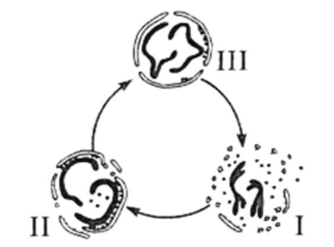
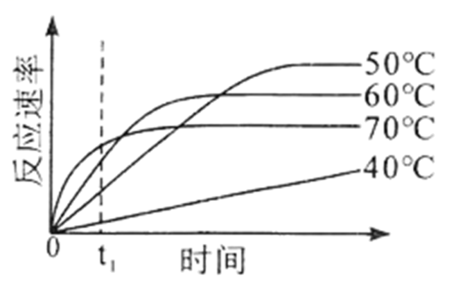
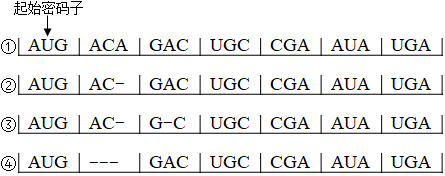
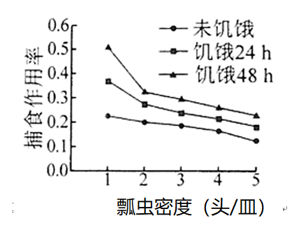
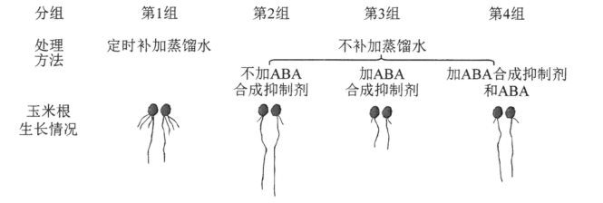
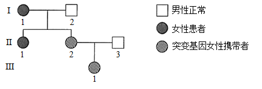
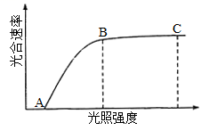
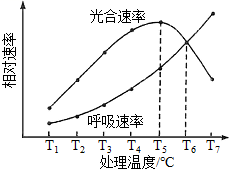
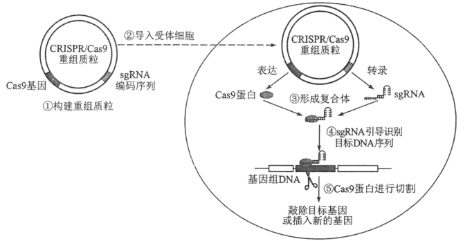

**海南省2021年普通高中学业水平选择性考试**

**生物**

**一、选择题：**

1\. 下列关于纤维素的叙述正确的是（ ）

A. 是植物和蓝藻细胞壁的主要成分

B. 易溶于水，在人体内可被消化

C. 与淀粉一样都属于多糖，二者的基本组成单位不同

D. 水解的产物与斐林试剂反应产生砖红色沉淀

2\. 分泌蛋白在细胞内合成与加工后，经囊泡运输到细胞外起作用。下列有关叙述错误的是（ ）

A. 核糖体上合成的肽链经内质网和高尔基体加工形成分泌蛋白

B. 囊泡在运输分泌蛋白的过程中会发生膜成分的交换

C. 参与分泌蛋白合成与加工的细胞器的膜共同构成了生物膜系统

D. 合成的分泌蛋白通过胞吐排出细胞

3\. 红树林是海南的一道靓丽风景，既可防风护堤，也可为鱼类、鸟类等动物提供栖息地。下列有关叙述错误的是（ ）

A. “植物→鱼→水鸟”是红树林生态系统常见的一条食物链

B. 红树林生态系统物种丰富，结构相对复杂，具有较强的自我调节能力

C. 红树林的海岸防护作用和观赏性体现了红树林生态系统的直接价值

D. 采取退塘还林、治污减排等措施有利于保护红树林生态系统

4\. 孟德尔的豌豆杂交实验和摩尔根的果蝇杂交实验是遗传学的两个经典实验。下列有关这两个实验的叙述，错误的是（ ）

A. 均将基因和染色体行为进行类比推理，得出相关的遗传学定律

B. 均采用统计学方法分析实验结果

C. 对实验材料和相对性状选择是实验成功的重要保证

D. 均采用测交实验来验证假说

5\. 肾病综合征患者会随尿丢失大量白蛋白，导致血浆白蛋白减少，出现水肿。有的患者血浆中某些免疫球蛋白也会减少。下列有关叙述错误的是（ ）

A. 患者体内的水分在血浆与组织液之间不能相互渗透

B. 长期丢失大量的蛋白质可导致患者营养不良

C. 免疫球蛋白减少可导致患者免疫力低下

D. 临床上通过静脉输注适量的白蛋白可减轻水肿症状

6\. 已知5-溴尿嘧啶（BU）可与碱基A或G配对。大肠杆菌DNA上某个碱基位点已由A-T转变为A-BU，要使该位点由A-BU转变为G-C，则该位点所在的DNA至少需要复制的次数是（ ）

A. 1 B. 2 C. 3 D. 4

7\. 真核细胞有丝分裂过程中核膜解体和重构过程如图所示。下列有关叙述错误的是（ ）

A. Ⅰ时期，核膜解体后形成的小泡可参与新核膜重构

B. Ⅰ→Ⅱ过程中，核膜围绕染色体重新组装

C. Ⅲ时期，核膜组装完毕，可进入下一个细胞周期

D. 组装完毕后的核膜允许蛋白质等物质自由进出核孔

8\. 某地区少数人的一种免疫细胞的表面受体CCR5的编码基因发生突变，导致受体CCR5结构改变，使得HIV-1病毒入侵该免疫细胞的几率下降。随时间推移，该突变基因频率逐渐增加。下列有关叙述错误的是（ ）

A. 该突变基因丰富了人类种群的基因库

B. 该突变基因的出现是自然选择的结果

C. 通过药物干扰HIV-1与受体CCR5的结合可抑制病毒繁殖

D. 该突变基因频率的增加可使人群感染HIV-1的几率下降

9\. 去甲肾上腺素（NE）是一种神经递质，发挥作用后会被突触前膜重摄取或被酶降解。临床上可用特定药物抑制NE的重摄取，以增加突触间隙的NE浓度来缓解抑郁症状。下列有关叙述正确的是（ ）

A. NE与突触后膜上的受体结合可引发动作电位

B. NE在神经元之间以电信号形式传递信息

C. 该药物通过与NE竞争突触后膜上的受体而发挥作用

D. NE能被突触前膜重摄取，表明兴奋在神经元之间可双向传递

10\. 人在幼年时期若生长激素（GH）分泌不足，会导致生长停滞，发生侏儒症，可通过及时补充GH进行治疗，使患者恢复生长。下列有关叙述正确的是（ ）

A 临床上可用适量GH治疗成年侏儒症患者

B. 血液中GH减少，会导致下丘脑分泌的GH增多

C. GH发挥生理功能后就被灭活，治疗期间需持续补充GH

D. GH通过发挥催化作用，使靶细胞发生一系列的代谢变化

11\. 某种酶的催化反应速率随温度和时间变化的趋势如图所示。据图分析，下列有关叙述错误的是（ ）

A. 该酶可耐受一定的高温

B. 在t1时，该酶催化反应速率随温度升高而增大

C. 不同温度下，该酶达到最大催化反应速率时所需时间不同

D. 相同温度下，在不同反应时间该酶的催化反应速率不同

12\. 雌性蝗虫体细胞有两条性染色体，为XX型，雄性蝗虫体细胞仅有一条性染色体，为XO型。关于基因型为AaXRO的蝗虫精原细胞进行减数分裂的过程，下列叙述错误的是（ ）

A. 处于减数第一次分裂后期的细胞仅有一条性染色体

B. 减数第一次分裂产生的细胞含有的性染色体数为1条或0条

C. 处于减数第二次分裂后期的细胞有两种基因型

D. 该蝗虫可产生4种精子，其基因型为AO、aO、AXR、aXR

13\. 研究发现，人体内某种酶的主要作用是切割、分解细胞膜上的“废物蛋白”。下列有关叙述错误的是（ ）

A. 该酶的空间结构由氨基酸的种类决定

B. 该酶的合成需要mRNA、tRNA和rRNA参与

C. “废物蛋白”被该酶切割过程中发生肽键断裂

D. “废物蛋白”分解产生的氨基酸可被重新利用

14\. 研究人员将32P标记的磷酸注入活的离体肝细胞，1~2min后迅速分离得到细胞内的ATP。结果发现ATP的末端磷酸基团被32P标记，并测得ATP与注入的32P标记磷酸的放射性强度几乎一致。下列有关叙述正确的是（ ）

A. 该实验表明，细胞内全部ADP都转化成ATP

B. 32P标记的ATP水解产生的腺苷没有放射性

C. 32P在ATP的3个磷酸基团中出现的概率相等

D. ATP与ADP相互转化速度快，且转化主要发生在细胞核内

15\. 终止密码子为UGA、UAA和UAG。图中①为大肠杆菌的一段mRNA序列，②~④为该mRNA序列发生碱基缺失的不同情况（“-”表示一个碱基缺失）。下列有关叙述正确的是（ ）

A. ①编码的氨基酸序列长度为7个氨基酸

B. ②和③编码的氨基酸序列长度不同

C. ②~④中，④编码的氨基酸排列顺序与①最接近

D. 密码子有简并性，一个密码子可编码多种氨基酸

16\. 一些人中暑后会出现体温升高、大量出汗、头疼等症状。下列有关叙述错误的是（ ）

A. 神经调节和体液调节都参与体温恒定和水盐平衡的调节

B. 体温升高时，人体可通过排汗散热降低体温

C. 维持血浆渗透压平衡，应给中暑者及时补充水分和无机盐

D. 大量出汗时，垂体感受到细胞外液渗透压变化，使大脑皮层产生渴觉

17\. 关于果酒、果醋和泡菜这三种传统发酵产物的制作，下列叙述正确的是（ ）

A. 发酵所利用的微生物都属于原核生物 B. 发酵过程都在无氧条件下进行

C. 发酵过程都在同一温度下进行 D. 发酵后形成的溶液都呈酸性

18\. 农业生产中常利用瓢虫来防治叶螨。某小组研究瓢虫的饥饿程度和密度对其捕食作用率的影响，结果如图所示。下列有关叙述错误的是（ ）

A. 在相同条件下，瓢虫密度越高，捕食作用率越低

B. 饥饿程度和叶螨密度共同决定了瓢虫的捕食作用率

C. 对瓢虫进行适当饥饿处理可提高防治效果

D. 田间防治叶螨时应适当控制瓢虫密度

19\. 某课题组为了研究脱落酸（ABA）在植物抗旱中的作用，将刚萌发的玉米种子分成4组进行处理，一段时间后观察主根长度和侧根数量，实验处理方法及结果如图所示。

下列有关叙述正确的是（ ）

A. 与第1组相比，第2组结果说明干旱处理促进侧根生长

B. 与第2组相比，第3组结果说明缺少ABA时主根生长加快

C. 本实验中自变量为干旱和ABA合成抑制剂

D. 设置第4组的目的是验证在干旱条件下ABA对主根生长有促进作用

20\. 某遗传病由线粒体基因突变引起，当个体携带含突变基因的线粒体数量达到一定比例后会表现出典型症状。Ⅰ-1患者家族系谱如图所示。

下列有关叙述正确的是（ ）

A. 若Ⅱ-1与正常男性结婚，无法推断所生子女的患病概率

B. 若Ⅱ-2与Ⅱ-3再生一个女儿，该女儿是突变基因携带者的概率是1/2

C. 若Ⅲ-1与男性患者结婚，所生女儿不能把突变基因传递给下一代

D. 该遗传病的遗传规律符合孟德尔遗传定律

**二、非选择题：**

21\. 植物工厂是全人工光照等环境条件智能化控制高效生产体系。生菜是植物工厂常年培植的速生蔬菜。回答下列问题。

（1）植物工厂用营养液培植生菜过程中，需定时向营养液通入空气，目的是\_\_\_\_\_\_\_\_\_\_\_\_。除通气外，还需更换营养液，其主要原因是\_\_\_\_\_\_\_\_\_\_\_\_。

（2）植物工厂选用红蓝光组合LED灯培植生菜，选用红蓝光的依据是\_\_\_\_\_\_\_\_\_\_\_\_。生菜成熟叶片在不同光照强度下光合速率的变化曲线如图，培植区的光照强度应设置在\_\_\_\_\_\_\_\_\_\_\_\_点所对应的光照强度；为提高生菜产量，可在培植区适当提高CO2浓度，该条件下B点的移动方向是\_\_\_\_\_\_\_\_\_\_\_\_。

（3）将培植区的光照/黑暗时间设置为14h/10h，研究温度对生菜成熟叶片光合速率和呼吸速率的影响，结果如图，光合作用最适温度比呼吸作用最适温度\_\_\_\_\_\_\_\_\_\_\_\_；若将培植区的温度从T5调至T6，培植24h后，与调温前相比，生菜植株的有机物积累量\_\_\_\_\_\_\_\_\_\_\_\_\_\_\_\_\_\_\_\_\_\_\_\_。

22\. 大规模接种新型冠状病毒（新冠病毒）疫苗建立群体免疫，是防控新冠肺炎疫情的有效措施。新冠疫苗的种类有灭活疫苗、mRNA疫苗等。回答下列问题。

（1）在控制新冠肺炎患者的病情中，T细胞发挥着重要作用。T细胞在人体内发育成熟的场所是\_\_\_\_\_\_\_\_\_\_\_\_，T细胞在细胞免疫中的作用是\_\_\_\_\_\_\_\_\_\_\_\_。

（2）接种新冠灭活疫苗后，该疫苗在人体内作为\_\_\_\_\_\_\_\_\_\_\_\_可诱导B细胞增殖、分化。B细胞能分化为分泌抗体的\_\_\_\_\_\_\_\_\_\_\_\_。

（3）新冠病毒表面的刺突蛋白（S蛋白）是介导病毒入侵人体细胞的关键蛋白，据此，某科研团队研制出mRNA疫苗。接种mRNA疫苗后，该疫苗激发人体免疫反应产生抗体的基本过程是\_\_\_\_\_\_\_\_\_\_\_\_。

（4）新冠肺炎康复者体内含有抗新冠病毒的特异性抗体，这些特异性抗体在患者康复过程中发挥的免疫作用是\_\_\_\_\_\_\_\_\_\_\_\_。

23\. 科研人员用一种甜瓜（2n）的纯合亲本进行杂交得到F1，F1经自交得到F2，结果如下表。

<table>
<colgroup>
<col style="width: 12%" />
<col style="width: 30%" />
<col style="width: 10%" />
<col style="width: 10%" />
<col style="width: 10%" />
<col style="width: 25%" />
</colgroup>
<tbody>
<tr>
<td style="text-align: left;">性状</td>
<td style="text-align: left;">控制基因及其所在染色体</td>
<td style="text-align: left;">母本</td>
<td style="text-align: left;">父本</td>
<td style="text-align: left;">F1</td>
<td style="text-align: left;">F2</td>
</tr>
<tr>
<td style="text-align: left;">果皮底色</td>
<td style="text-align: left;">A/a，4号染色体</td>
<td style="text-align: left;">黄绿色</td>
<td style="text-align: left;">黄色</td>
<td style="text-align: left;">黄绿色</td>
<td style="text-align: left;">黄绿色：黄色≈3:1</td>
</tr>
<tr>
<td style="text-align: left;">果肉颜色</td>
<td style="text-align: left;">B/b，9号染色体</td>
<td style="text-align: left;">白色</td>
<td style="text-align: left;">橘红色</td>
<td style="text-align: left;">橘红色</td>
<td style="text-align: left;">橘红色：白色≈3:1</td>
</tr>
<tr>
<td style="text-align: left;">果皮覆纹</td>
<td style="text-align: left;">
E/e，4号染色体

F/f，2号染色体
</td>
<td style="text-align: left;">无覆纹</td>
<td style="text-align: left;">无覆纹</td>
<td style="text-align: left;">有覆纹</td>
<td style="text-align: left;">有覆纹：无覆纹≈9:7</td>
</tr>
</tbody>
</table>

已知A、E基因同在一条染色体上，a、e基因同在另一条染色体上，当E和F同时存在时果皮才表现出有覆纹性状。不考虑交叉互换、染色体变异、基因突变等情况，回答下列问题。

（1）果肉颜色的显性性状是\_\_\_\_\_\_\_\_\_\_\_\_。

（2）F1基因型为\_\_\_\_\_\_\_\_\_\_\_\_，F1产生的配子类型有\_\_\_\_\_\_\_\_\_\_\_\_种。

（3）F2的表现型有\_\_\_\_\_\_\_\_\_\_\_\_种，F2中黄绿色有覆纹果皮、黄绿色无覆纹果皮、黄色无覆纹果皮的植株数量比是\_\_\_\_\_\_\_\_\_\_\_\_，F2中黄色无覆纹果皮橘红色果肉的植株中杂合子所占比例是\_\_\_\_\_\_\_\_\_\_\_\_。

24\. 海南坡鹿是海南特有的国家级保护动物，曾濒临灭绝。经过多年的严格保护，海南坡鹿的种群及其栖息地得到有效恢复。回答下列问题。

（1）海南坡鹿是植食性动物，在食物链中处于第\_\_\_\_\_\_\_\_\_\_\_\_营养级，坡鹿同化的能量主要通过\_\_\_\_\_\_\_\_\_\_\_\_以热能的形式散失。

（2）雄鹿常通过吼叫、嗅闻等方式获得繁殖机会，其中嗅闻利用的信息种类属于\_\_\_\_\_\_\_\_\_\_\_\_。

（3）为严格保护海南坡鹿，有效增加种群数量，保护区将300公顷土地加上围栏作为坡鹿驯化区。若该围栏内最多可容纳426只坡鹿，则最好将围栏内坡鹿数量维持在\_\_\_\_\_\_\_\_\_\_\_\_只左右，超出该数量的坡鹿可进行易地保护。将围栏内的坡鹿维持在该数量的依据是\_\_\_\_\_\_\_\_\_\_\_\_。

（4）海南坡鹿的主要食物包括林下的草本植物和低矮灌木，保护区人员通过选择性砍伐林中的一些高大植株可增加坡鹿的食物资源，主要依据是\_\_\_\_\_\_\_\_\_\_\_\_。

25\. CRISPR/Cas9是一种高效的基因编辑技术，Cas9基因表达的Cas9蛋白像一把“分子剪刀”，在单链向导RNA（SgRNA）引导下，切割DNA双链以敲除目标基因或插入新的基因。CRISPR/Cas9基因编辑技术的工作原理如图所示。

回答下列问题。

（1）过程①中，为构建CRISPR/Cas9重组质粒，需对含有特定sgRNA编码序列的DNA进行酶切处理，然后将其插入到经相同酶切处理过的质粒上，插入时所需要的酶是\_\_\_\_\_\_\_\_\_\_\_\_。

（2）过程②中，将重组质粒导入大肠杆菌细胞的方法是\_\_\_\_\_\_\_\_\_\_\_\_。

（3）过程③~⑤中，SgRNA与Cas9蛋白形成复合体，该复合体中的SgRNA可识别并与目标DNA序列特异性结合，二者结合所遵循的原则是\_\_\_\_\_\_\_\_\_\_\_\_。随后，Cas9蛋白可切割\_\_\_\_\_\_\_\_\_\_\_\_序列。

（4）利用CRISPR/Cas9基因编辑技术敲除一个长度为1200bp的基因，在DNA水平上判断基因敲除是否成功所采用的方法是\_\_\_\_\_\_\_\_\_\_\_\_，基因敲除成功的判断依据是\_\_\_\_\_\_\_\_\_\_\_\_。

（5）某种蛋白酶可高效降解羽毛中的角蛋白。科研人员将该蛋白酶基因插入到CRISPR/Cas9质粒中获得重组质粒，随后将其导入到大肠杆菌细胞，通过基因编辑把该蛋白酶基因插入到基因组DNA中，构建得到能大量分泌该蛋白酶的工程菌。据图简述CRISPR/Cas9重组质粒在受体细胞内，将该蛋白酶基因插入到基因组DNA的编辑过程：\_\_\_\_\_\_\_\_\_\_\_\_\_\_\_\_\_\_\_\_\_\_\_\_。
