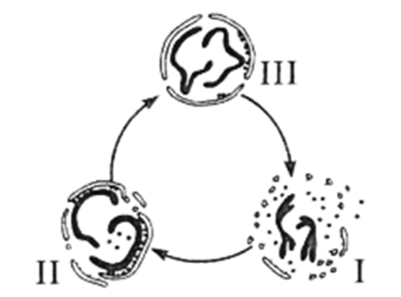
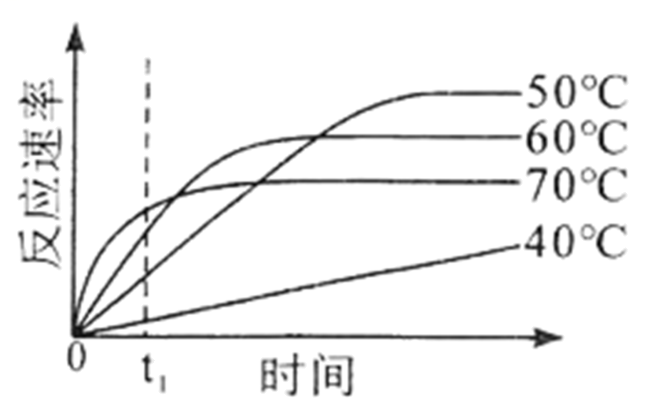
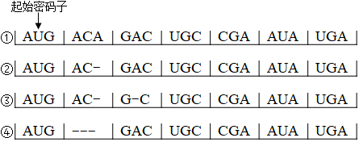
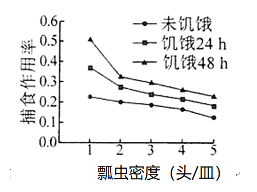
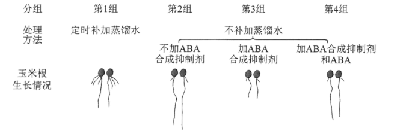
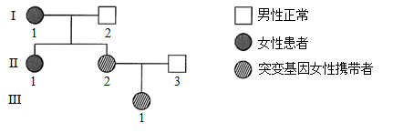
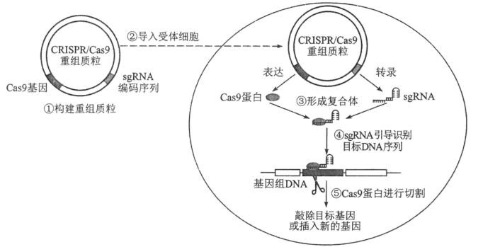

**海南省2021年普通高中学业水平选择性考试**

**生物**

**一、选择题：**

1\. 下列关于纤维素的叙述正确的是（ ）

A. 是植物和蓝藻细胞壁的主要成分

B. 易溶于水，在人体内可被消化

C. 与淀粉一样都属于多糖，二者的基本组成单位不同

D. 水解的产物与斐林试剂反应产生砖红色沉淀

【答案】D

【解析】

【分析】植物细胞壁的主要成分是纤维素和果胶，细菌细胞壁的主要成分是肽聚糖，真菌细胞壁的主要成分是几丁质。

【详解】A、蓝藻细胞壁的主要成分是肽聚糖，A错误；

B、纤维素不易溶于水，也不能被人体消化吸收，只能促进人体肠道的蠕动，B错误；

C、纤维素和淀粉均属于多糖，二者的基本组成单位相同，都是葡萄糖，C错误；

D、纤维素的水解产物为还原糖，可与斐林试剂反应产生砖红色沉淀，D正确。

故选D。

2\. 分泌蛋白在细胞内合成与加工后，经囊泡运输到细胞外起作用。下列有关叙述错误的是（ ）

A. 核糖体上合成的肽链经内质网和高尔基体加工形成分泌蛋白

B. 囊泡在运输分泌蛋白的过程中会发生膜成分的交换

C. 参与分泌蛋白合成与加工的细胞器的膜共同构成了生物膜系统

D. 合成的分泌蛋白通过胞吐排出细胞

【答案】C

【解析】

【分析】与分泌蛋白合成和加工有关的细胞器：核糖体、内质网、高尔基体、线粒体。

【详解】A、根据题意可知：该细胞为真核细胞，所以核糖体上合成的肽链经内质网和高尔基体加工形成分泌蛋白，A正确；

B、分泌蛋白在合成与加工的过程中会实现膜组分的更新，B正确；

C、生物膜系统包含细胞膜、核膜和细胞器膜，C错误；

D、分泌蛋白排出细胞的方式为胞吐，D正确。

故选C。

3\. 红树林是海南的一道靓丽风景，既可防风护堤，也可为鱼类、鸟类等动物提供栖息地。下列有关叙述错误的是（ ）

A. “植物→鱼→水鸟”是红树林生态系统常见的一条食物链

B. 红树林生态系统物种丰富，结构相对复杂，具有较强的自我调节能力

C. 红树林的海岸防护作用和观赏性体现了红树林生态系统的直接价值

D. 采取退塘还林、治污减排等措施有利于保护红树林生态系统

【答案】C

【解析】

【分析】生物多样性具有直接价值、间接价值和潜在价值，直接价值是指对人类的社会生活有直接影响和作用的价值，间接价值主要指维持生态系统平衡的作用，潜在价值是指今天还未被利用的那些物种在将来会有利用的价值。

【详解】A、食物链反映的是生产者与消费者之间吃与被吃的关系，食物链的起点都是生产者，终点是不被捕食的个体，故“植物→鱼→水鸟”是红树林生态系统常见的一条食物链，A正确；

B、一般而言，生物的种类越多，营养结构越复杂，自我调节能力越强，红树林生态系统物种丰富，结构相对复杂，具有较强的自我调节能力，B正确；

C、红树林对海岸生态环境的防护作用属于生态功能，体现了生物多样性的间接价值，C错误；

D、采取退塘还林、治污减排等措施有利于提高生态系统的物种丰富度，对于保护红树林生态系统是有利的，D正确。

故选C。

4\. 孟德尔的豌豆杂交实验和摩尔根的果蝇杂交实验是遗传学的两个经典实验。下列有关这两个实验的叙述，错误的是（ ）

A. 均将基因和染色体行为进行类比推理，得出相关遗传学定律

B 均采用统计学方法分析实验结果

C. 对实验材料和相对性状的选择是实验成功的重要保证

D. 均采用测交实验来验证假说

【答案】A

【解析】

【分析】1、孟德尔发现遗传定律用了假说演绎法，其基本步骤：提出问题→作出假说→演绎推理→实验验证 (测交实验)→得出结论。

2、萨顿运用类比推理的方法提出基因在染色体的假说，摩尔根运用假说演绎法证明基因在染色体上。

【详解】A、两个实验都是采用的假说演绎法得出相关的遗传学定律，A错误;

B、孟德尔豌豆杂交实验和摩尔根果蝇杂交实验都采用了统计学方法分析实验数据，B正确;

C、孟德尔豌豆杂交实验成功的原因之一是选择了豌豆作为实验材料，并且从豌豆的众多性状中选择了7对性状；摩尔根的果蝇杂交实验成功的原因之一是选择了果蝇作为实验材料，同时也从果蝇的众多性状当中选择了易于区分的白红眼性状进行研究，C正确；

D、这两个实验都采用测交实验来验证假说，D正确。

故选A。

5\. 肾病综合征患者会随尿丢失大量白蛋白，导致血浆白蛋白减少，出现水肿。有的患者血浆中某些免疫球蛋白也会减少。下列有关叙述错误的是（ ）

A. 患者体内的水分在血浆与组织液之间不能相互渗透

B. 长期丢失大量的蛋白质可导致患者营养不良

C. 免疫球蛋白减少可导致患者免疫力低下

D. 临床上通过静脉输注适量的白蛋白可减轻水肿症状

【答案】A

【解析】

【分析】组织水肿是由于组织液增多造成的，其水分可以从血浆、细胞内液渗透而来。主要原因包括以下几个方面：（1）过敏反应中组织胺的释放引起毛细血管壁的通透性增加，血浆蛋白进入组织液使其浓度升高，吸水造成水肿；（2）毛细淋巴管受阻，组织液中大分子蛋白质不能回流至毛细淋巴管而导致组织液浓度升高，吸水造成水肿；（3）组织细胞代谢旺盛，代谢产物增加；（4）营养不良引起血浆蛋白减少，渗透压下降，组织液回流减弱，组织间隙液体增加，导致组织水肿现象；（5）肾脏病变引起细胞内外液体交换失衡，肾炎导致肾小球滤过率下降，引起水滞留，导致组织水肿。

【详解】A、水的运输方式为自由扩散，因此患者体内的水分在血浆与组织液之间可以相互渗透，A错误；

B、蛋白质是生命活动的主要承担着，因此长期丢失大量的蛋白质可导致患者营养不良，B正确；

C、抗体属于免疫球蛋白，可参与体液免疫，因此免疫球蛋白减少可导致患者免疫力低下，C正确；

D、根据题干“肾病综合征患者会随尿丢失大量白蛋白，导致血浆白蛋白减少，出现水肿”可知：临床上通过静脉输注适量的白蛋白可减轻水肿症状，D正确。

故选A。

6\. 已知5-溴尿嘧啶（BU）可与碱基A或G配对。大肠杆菌DNA上某个碱基位点已由A-T转变为A-BU，要使该位点由A-BU转变为G-C，则该位点所在的DNA至少需要复制的次数是（ ）

A. 1 B. 2 C. 3 D. 4

【答案】B

【解析】

【分析】基因突变是基因结构的改变，包括碱基对的增添、缺失或替换。

【详解】根据题意可知：5-BU可以与A配对，又可以和G配对，由于大肠杆菌DNA上某个碱基位点已由A-T转变为A-BU，所以复制一次会得到G-5-BU，复制第二次时会得到有G-C，所以至少需要经过2次复制后，才能实现该位点由A-BU转变为G-C，B正确。

故选B。

7\. 真核细胞有丝分裂过程中核膜解体和重构过程如图所示。下列有关叙述错误的是（ ）

A. Ⅰ时期，核膜解体后形成的小泡可参与新核膜重构

B. Ⅰ→Ⅱ过程中，核膜围绕染色体重新组装

C. Ⅲ时期，核膜组装完毕，可进入下一个细胞周期

D. 组装完毕后的核膜允许蛋白质等物质自由进出核孔

【答案】D

【解析】

【分析】真核细胞有丝分裂前期会发生核膜解体，对应图中的Ⅰ时期，末期核膜会重新合成，对应图中的Ⅲ时期。

【详解】A、真核细胞有丝分裂前期会发生核膜解体，即图中的Ⅰ时期，核膜解体后形成的小泡可参与新核膜重构，A正确；

B、根据图形可知：Ⅰ→Ⅱ过程中，核膜围绕染色体的变化重新组装，B正确；

C、真核细胞有丝分裂末期核膜会重新合成，即对应图中的Ⅲ时期，重新合成的核膜为下一次细胞分裂做准备，C正确；

D、核膜上的核孔可以允许蛋白质等大分子物质进出细胞核，但核孔具有选择性，大分子物质不能自由进出核孔，D错误。

故选D。

8\. 某地区少数人的一种免疫细胞的表面受体CCR5的编码基因发生突变，导致受体CCR5结构改变，使得HIV-1病毒入侵该免疫细胞的几率下降。随时间推移，该突变基因频率逐渐增加。下列有关叙述错误的是（ ）

A. 该突变基因丰富了人类种群的基因库

B. 该突变基因的出现是自然选择的结果

C. 通过药物干扰HIV-1与受体CCR5的结合可抑制病毒繁殖

D. 该突变基因频率的增加可使人群感染HIV-1的几率下降

【答案】B

【解析】

【分析】基因突变在自然界中普遍存在，任何一种生物都有可能发生；基因突变产生了新基因，能丰富种群基因库；自然选择能导致种群基因频率发生定向改变。

【详解】A、基因突变产生了新基因，能丰富种群基因库，A正确；

B、基因突变在自然界中普遍存在，任何一种生物都有可能发生，B错误；

C、受体CCR5能够与HIV-1特异性结合，可通过药物干扰HIV-1与受体CCR5的结合可抑制病毒繁殖，C正确；

D、编码受体CCR5的突变基因频率的增加可使HIV-1与受体CCR5结合的几率下降，D正确。

故选B。

9\. 去甲肾上腺素（NE）是一种神经递质，发挥作用后会被突触前膜重摄取或被酶降解。临床上可用特定药物抑制NE的重摄取，以增加突触间隙的NE浓度来缓解抑郁症状。下列有关叙述正确的是（ ）

A. NE与突触后膜上的受体结合可引发动作电位

B. NE在神经元之间以电信号形式传递信息

C. 该药物通过与NE竞争突触后膜上的受体而发挥作用

D. NE能被突触前膜重摄取，表明兴奋在神经元之间可双向传递

【答案】A

【解析】

【分析】兴奋在神经元之间的传递是单向的，神经递质存在于突触前膜的突触小泡中，只能由突触前膜释放，然后作用于突触后膜，因此兴奋只能从一个神经元的轴突传递给另一个神经元的细胞体或树突。信号由电信号转变为化学信号再转变为电信号。

【详解】A、据题干信息可知，增加突触间隙的NE浓度可以缓解抑郁症状，故推测NE为兴奋性神经递质，与突触后膜的受体结合后可引发动作电位，A正确；

B、NE是一种神经递质，神经递质在神经元之间信息的传递要通过电信号-化学信号-电信号的形式进行，B错误；

C、结合题意可知，该药物的作用主要是抑制NE的重摄取，而重摄取的部位是突触前膜，C错误；

D、由于神经递质只能由突触前膜释放，作用于突触后膜，故兴奋在神经元之间的传递是单向的，D错误。

故选A。

10\. 人在幼年时期若生长激素（GH）分泌不足，会导致生长停滞，发生侏儒症，可通过及时补充GH进行治疗，使患者恢复生长。下列有关叙述正确的是（ ）

A. 临床上可用适量GH治疗成年侏儒症患者

B. 血液中GH减少，会导致下丘脑分泌的GH增多

C. GH发挥生理功能后就被灭活，治疗期间需持续补充GH

D. GH通过发挥催化作用，使靶细胞发生一系列的代谢变化

【答案】C

【解析】

【分析】生长激素：脑垂体前叶分泌的一种多肽，人出生后促生长的最主要的激素。

生长激素的生理作用：刺激骨骺端软骨细胞分化、增殖，从而促进骨生长，使骨长度增加；可直接刺激成骨细胞代谢，并对维持骨矿物质含量、骨密度起重要作用；协同性激素及促钙化激素共同干预骨的重塑。

【详解】A、注射GH无法治疗成年的侏儒患者，A错误；

B、GH是垂体前叶分泌的，不是下丘脑分泌的，B错误；

C、激素同受体结合后，激素原本的结构发生了改变，不再具有原来激素具有的生物学效应，即灭活了，因此治疗期间需持续补充GH，C正确；

D、激素通过与靶细胞结合进行生命活动的调节，并没有催化作用，D错误。

故选C。

11\. 某种酶的催化反应速率随温度和时间变化的趋势如图所示。据图分析，下列有关叙述错误的是（ ）

A. 该酶可耐受一定的高温

B. 在t1时，该酶催化反应速率随温度升高而增大

C. 不同温度下，该酶达到最大催化反应速率时所需时间不同

D. 相同温度下，在不同反应时间该酶的催化反应速率不同

【答案】D

【解析】

【分析】据图分析可知，在图示温度实验范围内，50℃酶的活性最高，其次是60℃时，在40℃时酶促反应速率随时间延长而增大。

【详解】A、据图可知，该酶在70℃条件下仍具有一定的活性，故该酶可以耐受一定的高温，A正确；

B、据图可知，在t1时，酶促反应速率随温度升高而增大，即反应速率与温度的关系为40℃＜＜50℃＜60℃＜70℃，B正确；

C、由题图可知，在不同温度下，该酶达到最大催化反应速率（曲线变平缓）时所需时间不同，其中70℃达到该温度下的最大反应速率时间最短，C正确；

D、相同温度下，不同反应时间内该酶的反应速率可能相同，如达到最大反应速率（曲线平缓）之后的反应速率相同，D错误。

故选D。

12\. 雌性蝗虫体细胞有两条性染色体，为XX型，雄性蝗虫体细胞仅有一条性染色体，为XO型。关于基因型为AaXRO的蝗虫精原细胞进行减数分裂的过程，下列叙述错误的是（ ）

A. 处于减数第一次分裂后期的细胞仅有一条性染色体

B. 减数第一次分裂产生的细胞含有的性染色体数为1条或0条

C. 处于减数第二次分裂后期的细胞有两种基因型

D. 该蝗虫可产生4种精子，其基因型为AO、aO、AXR、aXR

【答案】C

【解析】

【分析】减数分裂过程：（1）减数第一次分裂前的间期：染色体的复制。（2）减数第一次分裂：①前期：联会，同源染色体上的非姐妹染色单体交叉互换；②中期：同源染色体成对的排列在赤道板上；③后期：同源染色体分离，非同源染色体自由组合；④末期：细胞质分裂。（3）减数第二次分裂过程：①前期：核膜、核仁逐渐解体消失，出现纺锤体和染色体；②中期：染色体形态固定、数目清晰；③后期：着丝点分裂，姐妹染色单体分开成为染色体，并均匀地移向两极；④末期：核膜、核仁重建、纺锤体和染色体消失。

【详解】A、结合题意可知，雄性蝗虫体内只有一条X染色体，减数第一次分离后期同源染色体分离，此时雄性蝗虫细胞中仅有一条X染色体，A正确；

B、减数第一次分裂后期同源染色体分离，雄蝗虫的性染色体为X和O，经减数第一次分裂得到的两个次级精母细胞只有1个含有X染色体，即减数第一次分裂产生的细胞含有的性染色体数为1条或0条，B正确；

C、该蝗虫基因型为AaXRO，由于减数第一次分裂后期同源染色体分离，若不考虑变异，一个精原细胞在减数第二次后期可得到2个次级精母细胞，两种基因型，但该个体有多个精原细胞，在减数第二次分裂后期的细胞有四种基因型，C错误；

D、该蝗虫基因型为AaXRO，在减数分裂过程中同源染色体分离，非同源染色体自由组合，该个体产生的精子类型为AO、aO、AXR、aXR，D正确。

故选C。

13\. 研究发现，人体内某种酶的主要作用是切割、分解细胞膜上的“废物蛋白”。下列有关叙述错误的是（ ）

A. 该酶的空间结构由氨基酸的种类决定

B. 该酶的合成需要mRNA、tRNA和rRNA参与

C. “废物蛋白”被该酶切割过程中发生肽键断裂

D. “废物蛋白”分解产生的氨基酸可被重新利用

【答案】A

【解析】

【分析】酶是由活细胞产生的具有催化作用的有机物，大多数为蛋白质。

【详解】A、根据题意可知：该酶的化学本质为蛋白质，蛋白质空间结构具有多样性的原因是氨基酸的种类、数目、排列顺序和肽链的空间结构不同造成的，A错误；

B、根据题意可知：该酶的化学本质为蛋白质，因此该酶的合成需要mRNA、tRNA和rRNA参与，B正确；

C、“废物蛋白”被该酶切割的过程中会发生分解，肽键断裂，C正确；

D、氨基酸是蛋白质的基本单位，因此“废物蛋白”分解产生的氨基酸可被重新利用，D正确。

故选A。

14\. 研究人员将32P标记的磷酸注入活的离体肝细胞，1~2min后迅速分离得到细胞内的ATP。结果发现ATP的末端磷酸基团被32P标记，并测得ATP与注入的32P标记磷酸的放射性强度几乎一致。下列有关叙述正确的是（ ）

A. 该实验表明，细胞内全部ADP都转化成ATP

B. 32P标记的ATP水解产生的腺苷没有放射性

C. 32P在ATP的3个磷酸基团中出现的概率相等

D. ATP与ADP相互转化速度快，且转化主要发生在细胞核内

【答案】B

【解析】

【分析】ATP又叫三磷酸腺苷，简称为ATP，其结构式是：A-P～P～P，A-表示腺苷、T-表示三个、P-表示磷酸基团，“～”表示高能磷酸键。

【详解】A、根据题意可知：该实验不能说明细胞内全部ADP都转化成ATP，A错误；

B、根据题意“结果发现ATP的末端磷酸基团被32P标记，并测得ATP与注入的32P标记磷酸的放射性强度几乎一致。”说明：32P标记的ATP水解产生的腺苷没有放射性，B正确；

C、根据题意可知：放射性几乎只出现在ATP的末端磷酸基团，C错误；

D、该实验不能说明转化主要发生在细胞核内，D错误。

故选B。

15\. 终止密码子为UGA、UAA和UAG。图中①为大肠杆菌的一段mRNA序列，②~④为该mRNA序列发生碱基缺失的不同情况（“-”表示一个碱基缺失）。下列有关叙述正确的是（ ）

A. ①编码的氨基酸序列长度为7个氨基酸

B. ②和③编码的氨基酸序列长度不同

C. ②~④中，④编码的氨基酸排列顺序与①最接近

D. 密码子有简并性，一个密码子可编码多种氨基酸

【答案】C

【解析】

【分析】密码子是指位于mRNA上三个相邻的碱基决定一个氨基酸，终止密码子不编码氨基酸。

【详解】A、由于终止密码子不编码氨基酸，因此①编码的氨基酸序列长度为6个氨基酸，A错误；

B、根据图中密码子显示：在该段mRNA链中，②和③编码的氨基酸序列长度相同，B错误；

C、②缺失一个碱基，③缺失2个碱基，④缺失一个密码子中的3个碱基，因此②~④中，④编码的氨基酸排列顺序与①最接近，C正确；

D、密码子有简并性是指一种氨基酸可以有多个密码子对应，但一个密码子只能编码一种氨基酸，D错误；

故选C。

16\. 一些人中暑后会出现体温升高、大量出汗、头疼等症状。下列有关叙述错误的是（ ）

A. 神经调节和体液调节都参与体温恒定和水盐平衡的调节

B. 体温升高时，人体可通过排汗散热降低体温

C. 为维持血浆渗透压平衡，应给中暑者及时补充水分和无机盐

D. 大量出汗时，垂体感受到细胞外液渗透压变化，使大脑皮层产生渴觉

【答案】D

【解析】

【分析】1、炎热环境→皮肤温觉感受器→下丘脑体温调节中枢→增加散热（毛细血管舒张、汗腺分泌增加）→体温维持相对恒定。

2、体内水少或吃的食物过咸时→细胞外液渗透压升高→下丘脑感受器受到刺激→垂体释放抗利尿激素多→肾小管、集合管重吸收增加→尿量减少。

【详解】A、体温恒定过程中既有下丘脑参与的神经调节过程，也有甲状腺激素等参与的体液调节过程；水盐平衡调节过程中既有下丘脑参与的神经调节，也有抗利尿激素参与的体液调节，故神经调节和体液调节都参与体温恒定和水盐平衡的调节，A正确；

B、体温升高时，汗腺分泌增加，人体可通过排汗散热降低体温，B正确；

C、中暑者会丢失水和无机盐，无机盐在维持血浆渗透压平衡中发挥重要作用，为维持血浆渗透压平衡，在给中暑者补充水分的同时，也应适当补充无机盐，C正确；

D、大量出汗时，细胞外液渗透压升高，此时下丘脑的渗透压感受器可感受到渗透压变化，通过传入神经传导给大脑皮层，大脑皮层产生渴觉，主动饮水，D错误。

故选D。

17\. 关于果酒、果醋和泡菜这三种传统发酵产物的制作，下列叙述正确的是（ ）

A. 发酵所利用的微生物都属于原核生物 B. 发酵过程都在无氧条件下进行

C. 发酵过程都在同一温度下进行 D. 发酵后形成的溶液都呈酸性

【答案】D

【解析】

【分析】参与果酒制作的微生物是酵母菌，其新陈代谢类型为异养兼性厌氧型；参与果醋制作的微生物是醋酸菌，其新陈代谢类型是异养需氧型；泡菜的制作离不开乳酸菌。

【详解】A、参与果酒制作的微生物是酵母菌，属于真核生物，A错误；

B、参与果醋制作的醋酸菌是好氧菌，因此果醋发酵需要有氧条件，B错误；

C、不同的发酵产物需要的温度不同，C错误；

D、果酒、果醋和泡菜发酵后形成的溶液都呈酸性，D正确。

故选D。

18\. 农业生产中常利用瓢虫来防治叶螨。某小组研究瓢虫的饥饿程度和密度对其捕食作用率的影响，结果如图所示。下列有关叙述错误的是（ ）

A. 相同条件下，瓢虫密度越高，捕食作用率越低

B. 饥饿程度和叶螨密度共同决定了瓢虫的捕食作用率

C. 对瓢虫进行适当饥饿处理可提高防治效果

D. 田间防治叶螨时应适当控制瓢虫密度

【答案】B

【解析】

【分析】分析题意可知，本实验目的是研究瓢虫的饥饿程度和密度对其捕食作用率的影响，实验的自变量是瓢虫密度和饥饿状态，因变量为捕食作用率。据此分析作答。

【详解】AD、据图可知，在相同条件下（饥饿状态相同条件下），瓢虫密度越高，捕食作用率越低，故为保证较高的捕食作用率，田间防治叶螨时应适当控制瓢虫密度，AD正确；

B、本实验的自变量为饥饿程度和瓢虫密度，因变量为捕食作用率，据图可知饥饿程度和瓢虫密度（而非叶螨密度）共同决定了瓢虫的捕食作用率，B错误；

C、结合题图可知，在瓢虫密度相同的情况下，饥饿24h和饥饿48h的捕食作用率均高于未饥饿的捕食作用率，故对瓢虫进行适当饥饿处理可提高防治效果，C正确。

故选B。

19\. 某课题组为了研究脱落酸（ABA）在植物抗旱中的作用，将刚萌发的玉米种子分成4组进行处理，一段时间后观察主根长度和侧根数量，实验处理方法及结果如图所示。

下列有关叙述正确的是（ ）

A. 与第1组相比，第2组结果说明干旱处理促进侧根生长

B. 与第2组相比，第3组结果说明缺少ABA时主根生长加快

C. 本实验中自变量为干旱和ABA合成抑制剂

D. 设置第4组的目的是验证在干旱条件下ABA对主根生长有促进作用

【答案】C

【解析】

【分析】分析题意可知，本实验目的是研究脱落酸（ABA）在植物抗旱中的作用，则实验的自变量是脱落酸的有无，可通过补加蒸馏水及ABA抑制剂的添加来控制，因变量是植物的抗旱特性，可通过玉米根的生长情况进行比较，实验设计应遵循对照原则，故本实验的空白对照是蒸馏水。

【详解】A、ABA是脱落酸，ABA合成抑制剂可以抑制ABA的合成，据图可知，第2组不加入ABA合成抑制剂，则两组的自变量为蒸馏水的有无（是否干旱），第2组玉米主根的长度大于第1组，但侧根数量少于第1组，说明在干旱处理可以促进主根长度增加，但抑制侧根生长，A错误；

B、第2组不加ABA合成抑制剂，第3组加入ABA合成抑制剂（ABA不能正常合成），两组的自变量为ABA的有无，实验结果是第3组的主根长度小于第二组，说明缺少ABA时主根生长变慢，B错误；

C、结合分析可知，本实验目的是研究脱落酸（ABA）在植物抗旱中的作用，则实验的自变量是脱落酸的有无，可通过补加蒸馏水及ABA抑制剂的添加来控制，C正确；

D、第4组是同时添加ABA合成抑制剂和ABA，可以与第2组和第3组形成对照，实验结果是该组的主根长度小于第2组，但大于第3组，说明ABA合成抑制剂可以减缓ABA在干旱条件下促进主根生长的作用，D错误。

故选C。

20\. 某遗传病由线粒体基因突变引起，当个体携带含突变基因的线粒体数量达到一定比例后会表现出典型症状。Ⅰ-1患者家族系谱如图所示。

下列有关叙述正确的是（ ）

A. 若Ⅱ-1与正常男性结婚，无法推断所生子女的患病概率

B. 若Ⅱ-2与Ⅱ-3再生一个女儿，该女儿是突变基因携带者的概率是1/2

C. 若Ⅲ-1与男性患者结婚，所生女儿不能把突变基因传递给下一代

D. 该遗传病的遗传规律符合孟德尔遗传定律

【答案】A

【解析】

【分析】1、细胞质遗传的特点：①母系遗传，不论正交还是反交，子代性状总是受母本（卵细胞）细胞质基因控制；②杂交后代不出现一定的分离比。

2、减数分裂形成卵细胞时，细胞质中的遗传物质随机不均等分配。在受精作用进行时，通常是精子的头部进入卵细胞，尾部留在外面，受精卵中的细胞质几乎全部来自卵细胞。

【详解】A、该遗传病由线粒体基因突变引起，并且当个体携带含突变基因的线粒体数量达到一定比例后才会表现出典型症状，则Ⅱ-1与正常男性结婚，无法推断所生子女的患病概率，A正确；

B、Ⅱ-2形成卵细胞时，细胞质中的遗传物质随机不均等分配，则Ⅱ-2与Ⅱ-3再生一个女儿，该女儿是突变基因携带者的概率无法计算，B错误；

C、Ⅲ-1是突变基因携带者，与男性患者结婚，可把突变基因传递给女儿，故所生女儿能把突变基因传递给下一代，C错误；

D、该遗传病是由线粒体基因突变引起的，属于细胞质遗传，而孟德尔遗传定律适用于真核生物有性生殖的细胞核遗传，故该遗传病的遗传规律不符合孟德尔遗传定律，D错误。

故选A。

**二、非选择题：**

21\. 植物工厂是全人工光照等环境条件智能化控制的高效生产体系。生菜是植物工厂常年培植的速生蔬菜。回答下列问题。

（1）植物工厂用营养液培植生菜过程中，需定时向营养液通入空气，目的是\_\_\_\_\_\_\_\_\_\_\_\_。除通气外，还需更换营养液，其主要原因是\_\_\_\_\_\_\_\_\_\_\_\_。

（2）植物工厂选用红蓝光组合LED灯培植生菜，选用红蓝光的依据是\_\_\_\_\_\_\_\_\_\_\_\_。生菜成熟叶片在不同光照强度下光合速率的变化曲线如图，培植区的光照强度应设置在\_\_\_\_\_\_\_\_\_\_\_\_点所对应的光照强度；为提高生菜产量，可在培植区适当提高CO2浓度，该条件下B点的移动方向是\_\_\_\_\_\_\_\_\_\_\_\_。

（3）将培植区的光照/黑暗时间设置为14h/10h，研究温度对生菜成熟叶片光合速率和呼吸速率的影响，结果如图，光合作用最适温度比呼吸作用最适温度\_\_\_\_\_\_\_\_\_\_\_\_；若将培植区的温度从T5调至T6，培植24h后，与调温前相比，生菜植株的有机物积累量\_\_\_\_\_\_\_\_\_\_\_\_\_\_\_\_\_\_\_\_\_\_\_\_。

【答案】（1） ①. 促进生菜根部细胞呼吸。 ②. 为生菜提供大量的无机盐，以保证生菜的正常生长

（2） ①. 叶绿素主要吸收红光和蓝紫光，选用红蓝光可以提高植物的光合作用，从而提高生菜的产量 ②. B ③. 右上方

（3） ①. 低\
②. 减少

【解析】

【分析】影响光合作用的主要因素有：光照强度、二氧化碳浓度、温度等；第（2）题图表示光照强度对光合速率的影响，第（3）题图表示温度对光合速率和呼吸速率的影响。

【小问1详解】

营养液中的生菜长期在液体的环境中，根得不到充足的氧，影响呼吸作用，从而影响生长，培养过程中要经常给营养液通入空气，其目的是促进生菜根部细胞呼吸；营养液中的无机盐在培植生菜的过程中会被大量吸收，因此更换营养液的主要原因是为生菜提供大量的无机盐，以保证生菜的正常生长。

【小问2详解】

叶绿素主要吸收红光和蓝紫光，所以选用红蓝光组合LED灯培植生菜可以提高植物的光合作用，从而提高生菜的产量；B点为光饱和点对应的最大光合速率，因此培植区的光照强度应设置在B点所对应的光照强度，根据题干“为提高生菜产量，可在培植区适当提高CO2浓度”可知：该条件下光合速率增大，则B点向右上方移动。

【小问3详解】

根据曲线可知：在此曲线中光合速率的最适温度为T5，而在该实验温度范围内呼吸速率的最适温度还未出现，所以光合作用最适温度比呼吸作用最适温度低，若将培植区的温度从T5调至T6，导致光合速率减小而呼吸速率增大，生菜植物的有机物积累量将减少。

【点睛】本题结合曲线图，主要考查光照强度与温度对光合速率的影响，注意认真分析题图，弄清影响呼吸作用与光合作用的因素是解题关键。

22\. 大规模接种新型冠状病毒（新冠病毒）疫苗建立群体免疫，是防控新冠肺炎疫情的有效措施。新冠疫苗的种类有灭活疫苗、mRNA疫苗等。回答下列问题。

（1）在控制新冠肺炎患者的病情中，T细胞发挥着重要作用。T细胞在人体内发育成熟的场所是\_\_\_\_\_\_\_\_\_\_\_\_，T细胞在细胞免疫中的作用是\_\_\_\_\_\_\_\_\_\_\_\_。

（2）接种新冠灭活疫苗后，该疫苗在人体内作为\_\_\_\_\_\_\_\_\_\_\_\_可诱导B细胞增殖、分化。B细胞能分化为分泌抗体的\_\_\_\_\_\_\_\_\_\_\_\_。

（3）新冠病毒表面的刺突蛋白（S蛋白）是介导病毒入侵人体细胞的关键蛋白，据此，某科研团队研制出mRNA疫苗。接种mRNA疫苗后，该疫苗激发人体免疫反应产生抗体的基本过程是\_\_\_\_\_\_\_\_\_\_\_\_。

（4）新冠肺炎康复者体内含有抗新冠病毒的特异性抗体，这些特异性抗体在患者康复过程中发挥的免疫作用是\_\_\_\_\_\_\_\_\_\_\_\_。

【答案】（1） ①. 胸腺 ②. 增殖分化出效应T细胞和记忆细胞

（2） ①. 抗原 ②. 浆细胞

（3）新冠病毒进入机体后，少部分可以直接刺激B细胞，大部分被吞噬细胞摄取和处理后呈递给T细胞，再由T细胞呈递给B细胞，B细胞接受抗原刺激后，开始进行一系列的增殖、分化，形成记忆细胞和浆细胞，浆细胞分泌抗体与相应的抗原特异性结合，发挥免疫效应 （4）与抗原特异性结合

【解析】

【分析】体液免疫过程为：除少数抗原可以直接刺激B细胞外，大多数抗原被吞噬细胞摄取和处理，并暴露出其抗原决定簇；吞噬细胞将抗原呈递给T细胞，再由T细胞呈递给B细胞；B细胞接受抗原刺激后，开始进行一系列的增殖、分化，形成记忆细胞和浆细胞；浆细胞分泌抗体与相应的抗原特异性结合，发挥免疫效应。

【小问1详解】

淋巴细胞中的T细胞分化、发育、成熟的场所是胸腺；T 细胞在细胞免疫中的作用是增殖分化出效应T细胞（可识别并裂解靶细胞）和记忆细胞（保持对同种抗原的记忆）。

【小问2详解】

新冠疫苗相当于抗原，可以激发机体的特异性免疫过程，诱导B细胞增殖、分化；其中由B细胞分化而成的浆细胞可以分泌抗体。

【小问3详解】

新冠病毒mRNA疫苗的作用也相当于抗原，进入机体后，少部分可以直接刺激B细胞，大部分被吞噬细胞摄取和处理后呈递给T细胞，再由T细胞呈递给B细胞，B细胞接受抗原刺激后，开始进行一系列的增殖、分化，形成记忆细胞和浆细胞，浆细胞分泌抗体与相应的抗原特异性结合，发挥免疫效应。

【小问4详解】

新冠肺炎康复者体内的特异性抗体在患者康复过程中可以与抗原特异性结合，以阻止新冠病毒对人体细胞的粘附和进一步增殖，并可能形成沉淀或细胞集团，被吞噬细胞吞噬处理。

【点睛】本题以新型冠状病毒为背景，考查人体免疫系统在维持稳态中的作用，要求考生识记人体免疫系统的组成，掌握体液免疫的具体过程，识记免疫失调引起的疾病及相应的实例，能准确判断图中各细胞或各过程的名称，再结合所学的知识答题。

23\. 科研人员用一种甜瓜（2n）纯合亲本进行杂交得到F1，F1经自交得到F2，结果如下表。

<table>
<colgroup>
<col style="width: 12%" />
<col style="width: 30%" />
<col style="width: 10%" />
<col style="width: 10%" />
<col style="width: 10%" />
<col style="width: 25%" />
</colgroup>
<tbody>
<tr>
<td style="text-align: left;">性状</td>
<td style="text-align: left;">控制基因及其所在染色体</td>
<td style="text-align: left;">母本</td>
<td style="text-align: left;">父本</td>
<td style="text-align: left;">F1</td>
<td style="text-align: left;">F2</td>
</tr>
<tr>
<td style="text-align: left;">果皮底色</td>
<td style="text-align: left;">A/a，4号染色体</td>
<td style="text-align: left;">黄绿色</td>
<td style="text-align: left;">黄色</td>
<td style="text-align: left;">黄绿色</td>
<td style="text-align: left;">黄绿色：黄色≈3:1</td>
</tr>
<tr>
<td style="text-align: left;">果肉颜色</td>
<td style="text-align: left;">B/b，9号染色体</td>
<td style="text-align: left;">白色</td>
<td style="text-align: left;">橘红色</td>
<td style="text-align: left;">橘红色</td>
<td style="text-align: left;">橘红色：白色≈3:1</td>
</tr>
<tr>
<td style="text-align: left;">果皮覆纹</td>
<td style="text-align: left;">
E/e，4号染色体

F/f，2号染色体
</td>
<td style="text-align: left;">无覆纹</td>
<td style="text-align: left;">无覆纹</td>
<td style="text-align: left;">有覆纹</td>
<td style="text-align: left;">有覆纹：无覆纹≈9:7</td>
</tr>
</tbody>
</table>

已知A、E基因同在一条染色体上，a、e基因同在另一条染色体上，当E和F同时存在时果皮才表现出有覆纹性状。不考虑交叉互换、染色体变异、基因突变等情况，回答下列问题。

（1）果肉颜色的显性性状是\_\_\_\_\_\_\_\_\_\_\_\_。

（2）F1的基因型为\_\_\_\_\_\_\_\_\_\_\_\_，F1产生的配子类型有\_\_\_\_\_\_\_\_\_\_\_\_种。

（3）F2的表现型有\_\_\_\_\_\_\_\_\_\_\_\_种，F2中黄绿色有覆纹果皮、黄绿色无覆纹果皮、黄色无覆纹果皮的植株数量比是\_\_\_\_\_\_\_\_\_\_\_\_，F2中黄色无覆纹果皮橘红色果肉的植株中杂合子所占比例是\_\_\_\_\_\_\_\_\_\_\_\_。

【答案】（1）橘红色 （2） ①. AaBbEeFf ②. 8

（3） ①. 8 ②. 9:3:4\
③. 5/6

【解析】

【分析】分析表格数据可知，控制果肉颜色的B、b基因位于9号染色体，控制果皮底色的A、a基因和控制果皮覆纹中的E、e基因均位于4号染色体，且A和E连锁，a和e连锁；控制果皮覆纹E、e和F、f的基因分别位于4和2号染色体上，两对基因独立遗传，且有覆纹基因型为E-F-，无覆纹基因型为E-ff、eeF-、eeff，据此分析作答。

【小问1详解】

结合表格分析可知，亲本分别是白色和橘红色杂交，F1均为橘红色，F1杂交，子代出现橘红色：白色=3:1的性状分离比，说明橘红色是显性性状。

【小问2详解】

由于F2中黄绿色：黄色≈3:1，可推知F1应为Aa，橘红色：白色≈3:1，F1应为Bb，有覆纹：无覆纹≈9:7，则F1应为EeFf，故F1基因型应为AaBbEeFf；由于A和E连锁，a和e连锁，而F、f和B、b独立遗传，故F1产生的配子类型有2（AE、ae）×2（F、f）×2（B、b）=8种。

【小问3详解】

结合表格可知，F2中关于果皮底色的表现型有2种，关于果肉颜色的表现型有2种，关于果皮覆纹的表现型有2种，故F2的表现型有2×2×2=8种；由于A和E连锁，a和e连锁。F2中基因型为A-E-的为3/4，aaee的为1/4，F2中黄绿色有覆纹果皮（A-E-F-）、黄绿色无覆纹果皮（A-E-ff）、黄色无覆纹果皮（aaeeF-、aaeeff）的植株数量比是（3/4×3/4）：（3/4×1/4）：（1/4×3/4+1/4×1/4）=9:3:4；F2中黄色无覆纹果皮中的纯合子占1/2，橘红色果肉植株中纯合子为1/3，纯合子所占比例为1/6，故杂合子所占比例是1-1/6=5/6。

【点睛】解答本题的关键是明确三对性状与对应基因的关系，并能根据图表信息确定相关基因型，进而分析作答。

24\. 海南坡鹿是海南特有的国家级保护动物，曾濒临灭绝。经过多年的严格保护，海南坡鹿的种群及其栖息地得到有效恢复。回答下列问题。

（1）海南坡鹿是植食性动物，在食物链中处于第\_\_\_\_\_\_\_\_\_\_\_\_营养级，坡鹿同化的能量主要通过\_\_\_\_\_\_\_\_\_\_\_\_以热能的形式散失。

（2）雄鹿常通过吼叫、嗅闻等方式获得繁殖机会，其中嗅闻利用的信息种类属于\_\_\_\_\_\_\_\_\_\_\_\_。

（3）为严格保护海南坡鹿，有效增加种群数量，保护区将300公顷土地加上围栏作为坡鹿驯化区。若该围栏内最多可容纳426只坡鹿，则最好将围栏内坡鹿数量维持在\_\_\_\_\_\_\_\_\_\_\_\_只左右，超出该数量的坡鹿可进行易地保护。将围栏内的坡鹿维持在该数量的依据是\_\_\_\_\_\_\_\_\_\_\_\_。

（4）海南坡鹿的主要食物包括林下的草本植物和低矮灌木，保护区人员通过选择性砍伐林中的一些高大植株可增加坡鹿的食物资源，主要依据是\_\_\_\_\_\_\_\_\_\_\_\_。

【答案】（1） ①. 二 ②. 呼吸作用

（2）化学信息 （3） ①. 213 ②. 该数量下有利于海南坡鹿数量的快速增加

（4）提高草本植物和低矮灌木对光照的利用率，为海南坡鹿提供食物资源

【解析】

【分析】1、生态系统中的信息传递：（1）物理信息：生态系统中的光、声、温度、湿度、磁力等，通过物理过程传递的信息；（2）化学信息：生物在生命活动中，产生了一些可以传递信息的化学物质；（3）行为信息：动物的特殊行为，对于同种或异种生物也能够传递某种信息。

2、环境容纳量是指特定环境所能容许的种群数量的最大值。

【小问1详解】

海南坡鹿是植食性动物，以植物为食，故海南坡鹿在食物链中处于第二营养级；坡鹿同化的能量主要通过呼吸作用以热能的形式散失。

【小问2详解】

嗅闻的对象是能产生气味的物质，故该信息种类属于化学信息。

【小问3详解】

结合题意可知，海南坡鹿是海南特有、曾濒临灭绝的国家级保护动物，故建立自然保护区的目的应是能让其增长速率最大，因此若该围栏内最多可容纳426只坡鹿（K值），则最好将围栏内坡鹿数量维持在213只左右；因213只的数量时该环境的K/2值，在该数量下种群增长速率最大，有利于海南坡鹿数量的快速增加。

【小问4详解】

影响植物分布和生长的主要因素是光照，由于高大植株在光照资源的竞争中占优势，导致林下的草本植物和低矮灌木获得阳光较少，长势差，海南坡鹿的主要食物来源减少，故保护区人员通过选择性砍伐林中的一些高大植株可增加坡鹿的食物资源。

【点睛】本题考查了生态系统的功能，意在考查学生对所学知识的理解与掌握程度，能熟记相关知识并能运用术语分析作答是解题关键。

25\. CRISPR/Cas9是一种高效的基因编辑技术，Cas9基因表达的Cas9蛋白像一把“分子剪刀”，在单链向导RNA（SgRNA）引导下，切割DNA双链以敲除目标基因或插入新的基因。CRISPR/Cas9基因编辑技术的工作原理如图所示。

回答下列问题。

（1）过程①中，为构建CRISPR/Cas9重组质粒，需对含有特定sgRNA编码序列的DNA进行酶切处理，然后将其插入到经相同酶切处理过的质粒上，插入时所需要的酶是\_\_\_\_\_\_\_\_\_\_\_\_。

（2）过程②中，将重组质粒导入大肠杆菌细胞的方法是\_\_\_\_\_\_\_\_\_\_\_\_。

（3）过程③~⑤中，SgRNA与Cas9蛋白形成复合体，该复合体中的SgRNA可识别并与目标DNA序列特异性结合，二者结合所遵循的原则是\_\_\_\_\_\_\_\_\_\_\_\_。随后，Cas9蛋白可切割\_\_\_\_\_\_\_\_\_\_\_\_序列。

（4）利用CRISPR/Cas9基因编辑技术敲除一个长度为1200bp的基因，在DNA水平上判断基因敲除是否成功所采用的方法是\_\_\_\_\_\_\_\_\_\_\_\_，基因敲除成功的判断依据是\_\_\_\_\_\_\_\_\_\_\_\_。

（5）某种蛋白酶可高效降解羽毛中的角蛋白。科研人员将该蛋白酶基因插入到CRISPR/Cas9质粒中获得重组质粒，随后将其导入到大肠杆菌细胞，通过基因编辑把该蛋白酶基因插入到基因组DNA中，构建得到能大量分泌该蛋白酶的工程菌。据图简述CRISPR/Cas9重组质粒在受体细胞内，将该蛋白酶基因插入到基因组DNA的编辑过程：\_\_\_\_\_\_\_\_\_\_\_\_\_\_\_\_\_\_\_\_\_\_\_\_。

【答案】（1）DNA连接酶

（2）感受态细胞法 （3） ①. 碱基互补配对原则 ②. 目标DNA特定的核苷酸序列

（4） ①. DNA分子杂交技术 ②. 出现杂交带

（5）CRISPR/Cas9重组质粒在受体细胞内进行转录和表达，转录的产物是SgRNA，表达的产物是Cas9蛋白，二者形成复合体，该复合体中的SgRNA可识别并与目标DNA序列特异性结合，从而插入到基因组DNA中。

【解析】

【分析】基因工程技术的基本步骤包括目的基因的获取；基因表达载体的构建；将目的基因导入受体细胞；目的基因的检测与鉴定。

【小问1详解】

基因工程所需的工具酶有限制酶和DNA连接酶，限制酶负责切割，DNA连接酶负责连接，因此为构建CRISPR/Cas9重组质粒，需对含有特定sgRNA编码序列的DNA进行酶切处理，然后将其插入到经相同酶切处理过的质粒上，插入时所需要的酶是DNA连接酶。

【小问2详解】

大肠杆菌是原核生物，属于微生物，将目的基因导入微生物细胞的方法是感受态细胞法。

【小问3详解】

根据题图可知：在CRISPR/Cas9基因编辑技术中，SgRNA是根据靶基因设计的引导RNA，准确引导Cas9切割与SgRNA配对的靶基因DNA序列。Cas9能借助SgRNA分子与目标DNA进行特异性结合的原因在于SgRNA分子上的碱基序列与目标DNA分子上的碱基序列可以通过碱基互补配对原则实现SgRNA与目标DNA特定序列的特定识别，进而定位；由此可见，Cas9在功能上属于限制酶，可切割目标DNA特定的核苷酸序列。

【小问4详解】

可利用DNA分子杂交技术判断基因敲除否成功，若出现杂交带，则说明基因敲除成功。

【小问5详解】

根据图示可知：CRISPR/Cas9重组质粒在受体细胞内进行转录和表达，转录的产物是SgRNA，表达的产物是Cas9蛋白，二者形成复合体，该复合体中的SgRNA可识别并与目标DNA序列特异性结合，从而插入到基因组DNA中。

【点睛】本题以基因编辑技术为情境，考查DNA分子的结构、碱基互补配对、基因工程等相关知识，考查学生综合应用能力及科学思维的核心素养。
