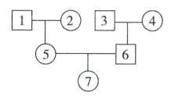
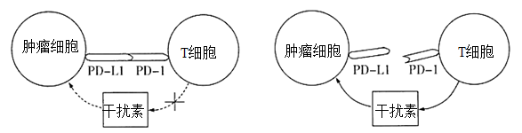
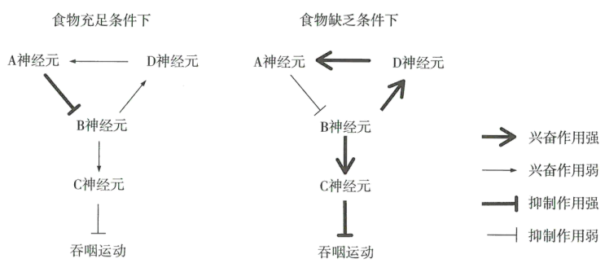

**2021年湖北省普通高中学业水平选择性考试**

**生物**

**一、选择题**

1\. 在真核细胞中，由细胞膜、核膜以及各种细胞器膜等共同构成生物膜系统。下列叙述错误是（ ）

A. 葡萄糖的有氧呼吸过程中，水的生成发生在线粒体外膜

B. 细胞膜上参与主动运输ATP酶是一种跨膜蛋白

C. 溶酶体膜蛋白高度糖基化可保护自身不被酶水解

D. 叶绿体的类囊体膜上分布着光合色素和蛋白质

2\. 很久以前，勤劳的中国人就发明了制饴（麦芽糖技术，这种技术在民间沿用至今。麦芽糖制作的大致过程如图所示。

下列叙述正确的是（ ）

A 麦芽含有淀粉酶，不含麦芽糖

B. 麦芽糖由葡萄糖和果糖结合而成

C. 55～60℃保温可抑制该过程中细菌的生长

D. 麦芽中的淀粉酶比人的唾液淀粉酶的最适温度低

3\. 中国的许多传统美食制作过程蕴含了生物发酵技术。下列叙述正确的是（ ）

A. 泡菜制作过程中，酵母菌将葡萄糖分解成乳酸

B. 馒头制作过程中，酵母菌进行呼吸作用产生CO2

C. 米酒制作过程中，将容器密封可以促进酵母菌生长

D. 酸奶制作过程中，后期低温处理可产生大量乳酸杆菌

4\. 浅浅的小酒窝，笑起来像花儿一样美。酒窝是由人类常染色体的单基因所决定，属于显性遗传。甲、乙分别代表有、无酒窝的男性，丙、丁分别代表有、无酒窝的女性。下列叙述正确的是（ ）

A. 若甲与丙结婚，生出的孩子一定都有酒窝

B. 若乙与丁结婚，生出的所有孩子都无酒窝

C. 若乙与丙结婚，生出的孩子有酒窝的概率为50%

D. 若甲与丁结婚，生出一个无酒窝的男孩，则甲的基因型可能是纯合的

5\. 自青霉素被发现以来，抗生素对疾病治疗起了重要作用。目前抗生素的不合理使用已经引起人们的关注。下列关于抗生素使用的叙述，正确的是（ ）

A. 作用机制不同的抗生素同时使用，可提高对疾病的治疗效果

B. 青霉素能直接杀死细菌，从而达到治疗疾病的目的

C. 畜牧业中为了防止牲畜生病可大量使用抗生素

D. 定期服用抗生素可预防病菌引起的肠道疾病

6\. 月季在我国享有“花中皇后”的美誉。为了立月季某新品种的快速繁殖体系，以芽体为外植体，在MS培养基中添加不同浓度的6-BA和IBA进行芽体增殖实验，芽分化率（%）结果如表。

<table style="width:64%;">
<colgroup>
<col style="width: 23%" />
<col style="width: 9%" />
<col style="width: 7%" />
<col style="width: 7%" />
<col style="width: 7%" />
<col style="width: 7%" />
</colgroup>
<tbody>
<tr>
<td rowspan="2" style="text-align: center;">6-BA/（mg·L-1）</td>
<td colspan="5" style="text-align: center;">IBA/（mg·L-1）</td>
</tr>
<tr>
<td style="text-align: center;">0． 1</td>
<td style="text-align: center;">0．2</td>
<td style="text-align: center;">0．3</td>
<td style="text-align: center;">0．4</td>
<td style="text-align: center;">0．5</td>
</tr>
<tr>
<td style="text-align: center;">1．0</td>
<td style="text-align: center;">31</td>
<td style="text-align: center;">63</td>
<td style="text-align: center;">58</td>
<td style="text-align: center;">49</td>
<td style="text-align: center;">41</td>
</tr>
<tr>
<td style="text-align: center;">2．0</td>
<td style="text-align: center;">40</td>
<td style="text-align: center;">95</td>
<td style="text-align: center;">76</td>
<td style="text-align: center;">69</td>
<td style="text-align: center;">50</td>
</tr>
<tr>
<td style="text-align: center;">3．0</td>
<td style="text-align: center;">37</td>
<td style="text-align: center;">75</td>
<td style="text-align: center;">64</td>
<td style="text-align: center;">54</td>
<td style="text-align: center;">41</td>
</tr>
<tr>
<td style="text-align: center;">4．0</td>
<td style="text-align: center;">25</td>
<td style="text-align: center;">35</td>
<td style="text-align: center;">31</td>
<td style="text-align: center;">30</td>
<td style="text-align: center;">25</td>
</tr>
<tr>
<td style="text-align: center;">5．0</td>
<td style="text-align: center;">8</td>
<td style="text-align: center;">21</td>
<td style="text-align: center;">12</td>
<td style="text-align: center;">8</td>
<td style="text-align: center;">4</td>
</tr>
</tbody>
</table>

关于上述实验，下列叙述错误的是（ ）

A. 6-BA浓度大于4．0mg·L-1时，芽分化率明显降低

B. 6-BA与IBA的比例为10：1时芽分化率均高于其他比例

C. 在培养基中同时添加适量的6-BA和IBA，可促进芽分化

D. 2．0mg·L-16-BA和0．2mg·L-1IBA是实验处理中芽分化的最佳组合

7\. 限制性内切酶EcoRI识别并切割双链DNA，用EcoRI完全酶切果蝇基因组DNA，理论上得到DNA片段的平均长度（碱基对）约为（ ）

A. 6 B. 250 C. 4000 D. 24000

8\. 反馈调节是生命系统中最普遍的调节机制。下列在生理或自然现象中，不属于反馈调节的是（ ）

A. 干旱时，植物体内脱落酸含量增加，导致叶片气孔大量关闭

B. 某湖泊中肉食性鱼类甲捕食草食性鱼类乙形成的种群数量动态变化

C. 下丘脑产生的TRH刺激垂体分泌TSH，TSH的增加抑制TRH的释放

D. 动物有氧呼吸过程中ATP合成增加，细胞中ATP积累导致有氧呼吸减缓

9\. 短日照植物在日照时数小于一定值时才能开花已知某短日照植物在光照10小时/天的条件下连续处理6天能开花（人工控光控温）。为了给某地（日照时数最长为16小时/天）引种该植物提供理论参考，探究诱导该植物在该地区开花的光照时数X（小时/天）的最大值设计了以下四组实验方案，最合理的是（ ）

|      |                   |                      |
|:----:|:-----------------:|:--------------------:|
| 实验方案 | 对照组（光照时数：小时/天，6天） | 实验组（光照时数4小时/天，6天）    |
| A    | 10                | 4≤X\<10设置梯度          |
| B    | 10                | 8≤X\<10，10\<X≤16设置梯度 |
| C    | 10                | 10\<X≤16设置梯度         |
| D    | 10                | 10\<X≤24设置梯度         |

A. A B. B C. C D. D

10\. 采摘后的梨常温下易软化。果肉中的酚氧化酶与底物接触发生氧化反应，逐渐褐变。密封条件下4℃冷藏能延长梨的贮藏期。下列叙述错误的是（ ）

A. 常温下鲜梨含水量大，环境温度较高，呼吸代谢旺盛，不耐贮藏

B. 密封条件下，梨呼吸作用导致O2减少，CO2增多，利于保鲜

C. 冷藏时，梨细胞的自由水增多，导致各种代谢活动减缓

D. 低温抑制了梨的酚氧化酶活性，果肉褐变减缓

11\. 红细胞在高渗NaCl溶液（浓度高于生理盐水）中体积缩小，在低渗NaCl溶液（浓度低于生理盐水）中体积增大。下列有关该渗透作用机制的叙述，正确的是（ ）

A. 细胞膜对Na+和Cl-的通透性远高于水分子，水分子从低渗溶液扩散至高渗溶液

B. 细胞膜对水分子的通透性远高于Na+和Cl-，水分子从低渗溶液扩散至高渗溶液

C. 细胞膜对Na+和Cl-的通透性远高于水分子，Na+和Cl-从高渗溶液扩散至低渗溶液

D. 细胞膜对水分子的通透性远高于Na+和Cl-，Na+和Cl-从高渗溶液扩散至低渗溶液

12\. 酷热干燥的某国家公园内生长有很多马齿苋属植物叶片嫩而多肉，深受大象喜爱。其枝条在大象进食时常被折断掉到地上，遭到踩踏的枝条会长成新的植株。白天马齿苋属植物会关闭气孔，在凉爽的夜晚吸收CO2并储存起来。针对上述现象，下列叙述错误的是（ ）

A. 大象和马齿苋属植物之间存在共同进化

B. 大象和马齿苋属植物存在互利共生关系

C. 水分是马齿苋属植物生长的主要限制因素

D. 白天马齿苋属植物气孔关闭，仍能进行光合作用

13\. 植物的有性生殖过程中，一个卵细胞与一个精子成功融合后通常不再与其他精子融合。我国科学家最新研究发现，当卵细胞与精子融合后，植物卵细胞特异表达和分泌天冬氨酸蛋白酶ECS1和ECS2。这两种酶能降解一种吸引花粉管的信号分子，避免受精卵再度与精子融合。下列叙述错误的是（ ）

A. 多精入卵会产生更多的种子

B. 防止多精入卵能保持后代染色体数目稳定

C. 未受精的情况下，卵细胞不分泌ECS1和ECS2

D. ECS1和ECS2通过影响花粉管导致卵细胞和精子不能融合

14\. 20世纪末，野生熊猫分布在秦岭、岷山和小相岭等6大山系。全国已建立熊猫自然保护区40余个，野生熊猫栖息地面积大幅增长。在秦岭，栖息地已被分割成5个主要活动区域；在岷山，熊猫被分割成10多个小种群；小相岭山系熊猫栖息地最为破碎，各隔离种群熊猫数量极少。下列叙述错误的是（ ）

A. 熊猫的自然种群个体数量低与其繁育能力有关

B. 增大熊猫自然保护区的面积可提高环境容纳量

C. 隔离阻碍了各种群间基因交流，熊猫小种群内会产生近亲繁殖

D. 在不同活动区域的熊猫种群间建立走廊，可以提高熊猫的种群数

15\. 某地区的小溪和池塘中生活着一种丽鱼，该丽鱼种群包含两种类型的个体：一种具有磨盘状齿形，专食蜗牛和贝壳类软体动物；另一种具有乳突状齿形，专食昆虫和其他软体动物。两种齿形的丽鱼均能稳定遗传并能相互交配产生可育后代。针对上述现象，下列叙述错误的是（ ）

A. 丽鱼种群牙齿的差异属于可遗传的变异

B. 两者在齿形上的差异有利于丽鱼对环境的适应

C. 丽鱼种群产生的性状分化可能与基因突变和重组有关

D. 两种不同齿形丽鱼的基因库差异明显，形成了两个不同的物种

16\. 某实验利用PCR技术获取目的基因，实验结果显示除目的基因条带（引物与模板完全配对）外，还有2条非特异条带（引物和模板不完全配对）。为了减少反应非特异条带的产生，以下措施中有效的是（ ）

A. 增加模板DNA的量 B. 延长热变性的时间

C. 延长延伸的时间 D. 提高复性的温度

17\. 正常情况下，神经细胞内K+浓度约为150mmol·L-1，细胞外液约为4mmol·L-1。细胞膜内外K+浓度差与膜静息电位绝对值呈正相关。当细胞膜电位绝对值降低到一定值（阈值）时，神经细胞兴奋。离体培养条件下，改变神经细胞培养液的KCl浓度进行实验。下列叙述正确的是（ ）

A. 当K+浓度为4mmol·L-1时，K+外流增加，细胞难以兴奋

B. 当K+浓度为150mmol·L-1时，K+外流增加，细胞容易兴奋

C. K+浓度增加到一定值（\<150mmol·L-1），K+外流增加，导致细胞兴奋

D. K+浓度增加到一定值（\<150mmol·L-1），K+外流减少，导致细胞兴奋

18\. 人类的ABO血型是由常染色体上的基因IA、IB和i三者之间互为等位基因决定的。IA基因产物使得红细胞表面带有A抗原，IB基因产物使得红细胞表面带有B抗原。IAIB基因型个体红细胞表面有A抗原和B抗原，ii基型个体红细胞表面无A抗原和B抗原。现有一个家系的系谱图（如图），对家系中各成员的血型进行检测，结果如表，其中“+”表示阳性反应，“-”表示阴性反应。

|       |     |     |     |     |     |     |     |
|:-----:|:---:|:---:|:---:|:---:|:---:|:---:|:---:|
| 个体    | 1   | 2   | 3   | 4   | 5   | 6   | 7   |
| A抗原抗体 | \+  | \+  | \-  | \+  | \+  | \-  | \-  |
| B抗原抗体 | \+  | \-  | \+  | \+  | \-  | \+  | \-  |

下列叙述正确的是（ ）

A. 个体5基因型为IAi，个体6基因型为IBi

B. 个体1基因型为IAIB，个体2基因型为IAIA或IAi

C. 个体3基因型为IBIB或IBi，个体4基因型为IAIB

D. 若个体5与个体6生第二个孩子，该孩子的基因型一定是ii

19\. 甲、乙、丙分别代表三个不同的纯合白色籽粒玉米品种，甲分别与乙、丙杂交产生F1，F1自交产生F2，结果如表。

|     |      |               |                 |
|:---:|:----:|:-------------:|:---------------:|
| 组别  | 杂交组合 | F1 | F2   |
| 1   | 甲×乙  | 红色籽粒          | 901红色籽粒，699白色籽粒 |
| 2   | 甲×丙  | 红色籽粒          | 630红色籽粒，490白色籽粒 |

根据结果，下列叙述错误的是（ ）

A. 若乙与丙杂交，F1全部为红色籽粒，则F2玉米籽粒性状比为9红色：7白色

B. 若乙与丙杂交，F1全部为红色籽粒，则玉米籽粒颜色可由三对基因控制

C. 组1中的F1与甲杂交所产生玉米籽粒性状比为3红色：1白色

D. 组2中的F1与丙杂交所产生玉米籽粒性状比为1红色：1白色

20\. T细胞的受体蛋白PD-1（程序死亡蛋白-1）信号途径有调控T细胞的增殖、活化和细胞免疫等功能。肿瘤细胞膜上的PD-L1蛋白与T细胞的受体PD-1结合引起的一种作用如图所示。下列叙述错误的是（ ）

A. PD-Ll抗体和PD-1抗体具有肿瘤免疫治疗作用

B. PD-L1蛋白可使肿瘤细胞逃脱T细胞的细胞免疫

C. PD-L1与PD-1的结合增强T细胞的肿瘤杀伤功能

D. 若敲除肿瘤细胞PD-L1基因，可降低该细胞的免疫逃逸

**二、非选择题**

21\. 使酶的活性下降或丧失的物质称为酶的抑制剂。酶的抑制剂主要有两种类型：一类是可逆抑制剂（与酶可逆结合，酶的活性能恢复）；另一类是不可逆抑制剂（与酶不可逆结合，酶的活性不能恢复）。已知甲、乙两种物质（能通过透析袋）对酶A的活性有抑制作用。

实验材料和用具：蒸馏水，酶A溶液，甲物质溶液，物质溶液，透析袋（人工合成半透膜），试管，烧杯等为了探究甲、乙两种物质对酶A的抑制作用类型，提出以下实验设计思路。请完善该实验设计思路，并写出实验预期结果。

（1）实验设计思路

取\_\_\_\_\_\_\_\_\_\_\_支试管（每支试管代表一个组），各加入等量的酶A溶液，再分别加等量\_\_\_\_\_\_\_\_\_\_\_\_\_\_\_\_，一段时间后，测定各试管中酶的活性。然后将各试管中的溶液分别装入透析袋，放入蒸馏水中进行透析处理。透析后从透析袋中取出酶液，再测定各自的酶活性。

（2）实验预期结果与结论

若出现结果①：\_\_\_\_\_\_\_\_\_\_\_\_\_\_\_\_\_\_\_\_\_\_\_\_\_\_\_\_\_\_\_\_\_。

结论①：甲、乙均为可逆抑制剂。

若出现结果②：\_\_\_\_\_\_\_\_\_\_\_\_\_\_\_\_\_\_\_\_\_\_\_\_\_\_\_\_\_\_\_\_\_。

结论②：甲、乙均为不可逆抑制剂。

若出现结果③：\_\_\_\_\_\_\_\_\_\_\_\_\_\_\_\_\_\_\_\_\_\_\_\_\_\_\_\_\_\_\_\_\_。

结论③：甲为可逆抑制剂，乙为不可逆抑制剂。

若出现结果④：\_\_\_\_\_\_\_\_\_\_\_\_\_\_\_\_\_\_\_\_\_\_\_\_\_\_\_\_\_\_\_\_\_。

结论④：甲为不可逆抑制剂，乙为可逆抑制剂。

22\. 北方农牧交错带是我国面积最大和空间尺度最长一种交错带。近几十年来，该区域沙漠化加剧，生态环境恶化，成为我国生态问题最为严重的生系统类型之一。因此，开展退耕还林还草工程，已成为促进区域退化土地恢复和植被重建改善土壤环境、提高土地生产力的重要生态措施之一研究人员以耕作的农田为对照，以退耕后人工种植的柠条（灌木）林地、人工杨树林地和弃耕后自然恢复草地为研究样地，调查了退耕还林与还草不同类型样地的地面节肢动物群落结构特征，调查结果如表所示。

|        |          |                       |           |          |
|:------:|:--------:|:---------------------:|:---------:|:--------:|
| 样地类型   | 总个体数量（只） | 优势类群（科）               | 常见类群数量（科） | 总类群数量（科） |
| 农田     | 45       | 蜉金龟科、蚁科、步甲科和蠼螋科共4科    | 6         | 10       |
| 柠条林地   | 38       | 蚁科                    | 9         | 10       |
| 杨树林地   | 51       | 蚁科                    | 6         | 7        |
| 自然恢复草地 | 47       | 平腹蛛科、鳃金龟科、蝼蛄科和拟步甲科共4科 | 11        | 15       |

回答下列问题：

（1）上述样地中，节肢动物的物种丰富度最高的是\_\_\_\_\_\_\_\_\_\_\_，产生的原因是\_\_\_\_\_\_\_\_\_\_\_。

（2）农田优势类群为4科，多于退耕还林样地，从非生物因素的角度分析，原因可能与农田中\_\_\_\_\_\_\_\_\_\_\_较高有关（答出2点即可）。

（3）该研究结果表明，退耕还草措施对地面节肢动物多样性的恢复效应比退耕还林措施\_\_\_\_\_\_\_\_\_\_\_（填“好”或“差”）。

（4）杨树及甲、乙两种草本药用植物的光合速率与光照强度关系曲线如图所示。和甲相比，乙更适合在杨树林下种植，其原因是\_\_\_\_\_\_\_\_\_\_\_\_\_\_\_\_\_\_\_\_\_\_。

23\. 神经元是神经系统结构、功能与发育的基本单元。神经环路（开环或闭环）由多个神经元组成，是感受刺激、传递神经信号、对神经信号进行分析与整合的功能单位。动物的生理功能与行为调控主要取决于神经环路而非单个的神经元。

秀丽短杆线虫在不同食物供给条件下吞咽运动调节的一个神经环路作用机制如图所示。图中A是食物感觉神经元，B、D是中间神经元，C是运动神经元。由A、B和C神经元组成的神经环路中，A的活动对吞咽运动的调节作用是减弱C对吞咽运动的抑制，该信号处理方式为去抑制。由A、B和D神经元形成的反馈神经环路中，神经信号处理方式为去兴奋。

回答下列问题：

（1）在食物缺乏条件下，秀丽短杆线虫吞咽运动\_\_\_\_\_\_\_\_\_\_\_（填“增强”“减弱”或“不变”）；在食物充足条件下，吞咽运动\_\_\_\_\_\_\_\_\_\_\_（填“增强”“减弱”或“不变”）。

（2）由A、B和D神经元形成的反馈神经环路中，信号处理方式为去兴奋，其机制是\_\_\_\_\_\_\_\_\_\_\_。

（3）由A、B和D神经元形成的反馈神经环路中，去兴奋对A神经元调节的作用是\_\_\_\_\_\_\_\_\_\_\_。

（4）根据该神经环路的活动规律，\_\_\_\_\_\_\_\_\_\_\_（填“能”或“不能”）推断B神经元在这两种条件下都有活动，在食物缺乏条件下的活动增强。

24\. 疟疾是一种由疟原虫引起的疾病。疟原虫为单细胞生物可在按蚊和人两类宿主中繁殖。我国科学家发现了治疗疟疾的青蒿素。随着青蒿素类药物广泛应用逐渐出现了对青蒿素具有抗药性的疟原虫。

为了研究疟原虫对青蒿素的抗药性机制，将一种青蒿素敏感（S型）的疟原虫品种分成两组：一组逐渐增加青蒿素的浓度，连续培养若干代，获得具有抗药性（R型）的甲群体，另一组为乙群体（对照组）。对甲和乙两群体进行基因组测序，发现在甲群体中发生的9个碱基突变在乙群体中均未发生，这些突变发生在9个基因的编码序列上，其中7个基因编码的氨基酸序列发生了改变。

为确定7个突变基因与青蒿素抗药性的关联性，现从不同病身上获取若干疟原虫样本，检测疟原虫对青蒿素的抗药性（与存活率正相关）并测序，以S型疟原虫为对照，与对照的基因序列相同的设为野生型“+”，不同的设为突变型“-”。部分样本的结果如表。

|     |        |     |     |     |     |     |     |     |
|:---:|:------:|:---:|:---:|:---:|:---:|:---:|:---:|:---:|
| 疟原虫 | 存活率（%） | 基因1 | 基因2 | 基因3 | 基因4 | 基因5 | 基因6 | 基因7 |
| 对照  | 0．04   | \+  | \+  | \+  | \+  | \+  | \+  | \+  |
| 1   | 0．2    | \+  | \+  | \+  | \+  | \+  | \+  | \-  |
| 2   | 3．8    | \+  | \+  | \+  | \-  | \+  | \+  | \-  |
| 3   | 5．8    | \+  | \+  | \+  | \-  | \-  | \+  | \-  |
| 4   | 23． 1  | \+  | \+  | \+  | \+  | \-  | \-  | \-  |
| 5   | 27．2   | \+  | \+  | \+  | \+  | \-  | \-  | \-  |
| 6   | 27．3   | \+  | \+  | \+  | \-  | \+  | \-  | \-  |
| 7   | 28．9   | \+  | \+  | \+  | \-  | \-  | \-  | \-  |
| 8   | 31．3   | \+  | \+  | \+  | \+  | \-  | \-  | \-  |
| 9   | 58．0   | \+  | \+  | \+  | \-  | \+  | \-  | \-  |

回答下列问题：

（1）连续培养后疟原虫获得抗药性的原因是\_\_\_\_\_\_\_\_\_\_\_\_\_\_\_\_\_\_\_\_\_\_，碱基突变但氨基酸序列不发生改变的原因是\_\_\_\_\_\_\_\_\_\_\_\_\_\_\_\_\_\_\_\_\_\_。

（2）7个基因中与抗药性关联度最高的是\_\_\_\_\_\_\_\_\_\_\_，判断的依据是\_\_\_\_\_\_\_\_\_\_\_\_\_\_\_\_\_\_\_\_\_\_。

（3）若青蒿素抗药性关联度最高的基因突变是导致疟原虫抗青蒿素的直接原因，利用现代分子生物学手段，将该突变基因恢复为野生型，而不改变基因组中其他碱基序。经这种基因改造后的疟原虫对青蒿素的抗药性表现为\_\_\_\_\_\_\_\_\_\_\_。

（4）根据生物学知识提出一条防控疟疾的合理化建议：\_\_\_\_\_\_\_\_\_\_\_。
