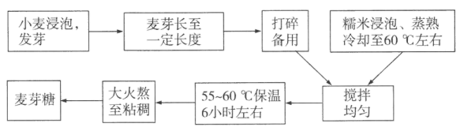
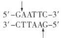
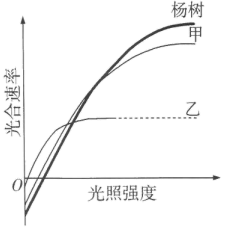

**2021年湖北省普通高中学业水平选择性考试**

**生物**

**一、选择题**

1\. 在真核细胞中，由细胞膜、核膜以及各种细胞器膜等共同构成生物膜系统。下列叙述错误的是（ ）

A. 葡萄糖的有氧呼吸过程中，水的生成发生在线粒体外膜

B. 细胞膜上参与主动运输ATP酶是一种跨膜蛋白

C. 溶酶体膜蛋白高度糖基化可保护自身不被酶水解

D. 叶绿体的类囊体膜上分布着光合色素和蛋白质

【答案】A

【解析】

【分析】1、生物膜系统由细胞膜、细胞器膜和核膜等组成．生物膜系统在成分和结构上相似，结构与功能上联系。

2、生物膜的结构特点是具有一定的流动性，功能特点是具有选择透过性.

【详解】A、葡萄糖的有氧呼吸过程中，水的生成发生在有氧呼吸第三阶段，场所是线粒体内膜，A错误；

B、真核细胞的细胞膜上参与主动运输的ATP酶是一种跨膜蛋白，该类蛋白发挥作用时可催化ATP水解，为跨膜运输提供能量，B正确；

C、溶酶体内有多种水解酶，能溶解衰老、损伤的细胞器，溶酶体膜蛋白高度糖基化可保护自身不被酶水解，C正确；

D、叶绿体的类囊体膜是光反应的场所，其上分布着光合色素和蛋白质（酶等），利于反应进行，D正确。

故选A。

2\. 很久以前，勤劳的中国人就发明了制饴（麦芽糖技术，这种技术在民间沿用至今。麦芽糖制作的大致过程如图所示。

下列叙述正确的是（ ）

A. 麦芽含有淀粉酶，不含麦芽糖

B. 麦芽糖由葡萄糖和果糖结合而成

C. 55～60℃保温可抑制该过程中细菌的生长

D. 麦芽中淀粉酶比人的唾液淀粉酶的最适温度低

【答案】C

【解析】

【分析】糖类包括：单糖、二糖、多糖。单糖中包括五碳糖和六碳糖，其中五碳糖中的核糖是RNA的组成部分，脱氧核糖是DNA的组成部分，而六碳糖中的葡萄糖被形容为“生命的燃料”，而核糖、脱氧核糖和葡萄糖是动物细胞共有的糖；二糖包括麦芽糖、蔗糖和乳糖，其中麦芽糖和蔗糖是植物细胞中特有的，乳糖是动物体内特有的；多糖包括淀粉、纤维素和糖原，其中淀粉和纤维素是植物细胞特有的，糖原是动物细胞特有的。

【详解】A、麦芽糖属于植物细胞特有的二糖，在麦芽中存在麦芽糖，A错误；

B、麦芽糖是由2分子葡萄糖脱水缩合而成的，B错误；

C、细菌的生长需要适宜温度，据图可知，该过程中需要在55-60℃条件下保温6小时左右，目的是抑制细菌的生长，避免杂菌污染，C正确；

D、一般而言，植物体内酶的最适温度高于动物，故麦芽中的淀粉酶比人的唾液淀粉酶的最适温度高，D错误。

故选C。

3\. 中国的许多传统美食制作过程蕴含了生物发酵技术。下列叙述正确的是（ ）

A. 泡菜制作过程中，酵母菌将葡萄糖分解成乳酸

B. 馒头制作过程中，酵母菌进行呼吸作用产生CO2

C. 米酒制作过程中，将容器密封可以促进酵母菌生长

D. 酸奶制作过程中，后期低温处理可产生大量乳酸杆菌

【答案】B

【解析】

【分析】 1、参与腐乳制作的微生物主要是毛霉，其新陈代谢类型是异养需氧型．腐乳制作的原理：毛霉等微生物产生的蛋白酶能将豆腐中的蛋白质分解成小分子的肽和氨基酸；脂肪酶可将脂肪分解成甘油和脂肪酸。

2、参与泡菜制作的微生物是乳酸菌，泡菜制作的原理：（1）乳酸菌在无氧条件下，将糖分解为乳酸。（2）利用乳酸菌制作泡菜的过程中会引起亚硝酸盐的含量的变化。

3、醋酸菌好氧性细菌，当缺少糖源时和有氧条件下，可将乙醇（酒精）氧化成醋酸；当氧气、糖源都充足时，醋酸菌将葡萄汁中的糖分解成醋酸；醋酸菌生长的最佳温度是在30℃～35℃。

【详解】A、泡菜制作过程中，主要是乳酸菌将葡萄糖分解形成乳酸，A错误；

B、做馒头或面包时，经常要用到酵母菌，酵母菌可以分解面粉中的葡萄糖，产生二氧化碳和酒精，二氧化碳是气体，遇热膨胀而形成小孔，使得馒头或面包暄软多孔，B正确；

C、酵母菌在有氧条件下可以大量繁殖，在密封也就是无氧条件下产生酒精，C错误；

D、酸奶制作过程中，后期低温处理时大部分乳酸杆菌已死亡，不会大量繁殖，D错误。

故选B。

4\. 浅浅的小酒窝，笑起来像花儿一样美。酒窝是由人类常染色体的单基因所决定，属于显性遗传。甲、乙分别代表有、无酒窝的男性，丙、丁分别代表有、无酒窝的女性。下列叙述正确的是（ ）

A. 若甲与丙结婚，生出的孩子一定都有酒窝

B. 若乙与丁结婚，生出的所有孩子都无酒窝

C. 若乙与丙结婚，生出的孩子有酒窝的概率为50%

D. 若甲与丁结婚，生出一个无酒窝的男孩，则甲的基因型可能是纯合的

【答案】B

【解析】

【分析】结合题意分析可知，酒窝属于常染色体显性遗传，设相关基因为A、a，则有酒窝为AA和Aa，无酒窝为aa，据此分析作答。

【详解】A、结合题意可知，甲为有酒窝男性，基因型为AA或Aa，丙为有酒窝女性，基因型为AA或Aa，若两者均为Aa，则生出的孩子基因型可能为aa，表现为无酒窝，A错误；

B、乙为无酒窝男性，基因型为aa，丁为无酒窝女性，基因型为aa，两者结婚，生出的孩子基因型均为aa，表现为无酒窝，B正确；

C、乙为无酒窝男性，基因型为aa，丙为有酒窝女性，基因型为AA或Aa。两者婚配，若女性基因型为AA，则生出的孩子均为有酒窝；若女性基因型为Aa，则生出的孩子有酒窝的概率为1/2，C错误；

D、甲为有酒窝男性，基因型为AA或Aa，丁为无酒窝女性，基因型为aa，生出一个无酒窝的男孩aa，则甲的基因型只能为Aa，是杂合子，D错误。

故选B。

5\. 自青霉素被发现以来，抗生素对疾病治疗起了重要作用。目前抗生素的不合理使用已经引起人们的关注。下列关于抗生素使用的叙述，正确的是（ ）

A. 作用机制不同的抗生素同时使用，可提高对疾病的治疗效果

B. 青霉素能直接杀死细菌，从而达到治疗疾病的目的

C. 畜牧业中为了防止牲畜生病可大量使用抗生素

D. 定期服用抗生素可预防病菌引起的肠道疾病

【答案】A

【解析】

【分析】1、抗生素是指由微生物（包括细菌、真菌、放线菌属）或高等动植物在生活过程中所产生的具有抗病原体或其他活性的一类次级代谢产物，能干扰其他生活细胞发育功能的化学物质。

2、抗生素等抗菌剂的抑菌或杀菌作用，主要是针对“细菌有而人（或其他动植物）没有”的机制进行杀伤，包含四大作用机理，即：抑制细菌细胞壁合成，增强细菌细胞膜通透性，干扰细菌蛋白质合成以及抑制细菌核酸复制转录。

【详解】A、结合分析可知，抗生素的作用机理主要有四个方面，作用机制不同的抗生素同时使用，可从不同方面对于病原体进行防治，故可提高对疾病的治疗效果，A正确；

B、青霉素杀死细菌可能是通过抑制细菌细胞壁的合成或增强细菌细胞膜通透性等途径实现的，不是直接杀死细菌，B错误；

C、抗生素大量使用会导致耐药菌等的出现，不利于牲畜疾病的防控，C错误；

D、定期服用抗生素会导致耐药菌等的出现，不能用于预防病菌引起的肠道疾病，D错误。

故选A。

6\. 月季在我国享有“花中皇后”的美誉。为了立月季某新品种的快速繁殖体系，以芽体为外植体，在MS培养基中添加不同浓度的6-BA和IBA进行芽体增殖实验，芽分化率（%）结果如表。

<table style="width:64%;">
<colgroup>
<col style="width: 23%" />
<col style="width: 9%" />
<col style="width: 7%" />
<col style="width: 7%" />
<col style="width: 7%" />
<col style="width: 7%" />
</colgroup>
<tbody>
<tr>
<td rowspan="2" style="text-align: center;">6-BA/（mg·L-1）</td>
<td colspan="5" style="text-align: center;">IBA/（mg·L-1）</td>
</tr>
<tr>
<td style="text-align: center;">0． 1</td>
<td style="text-align: center;">0．2</td>
<td style="text-align: center;">0．3</td>
<td style="text-align: center;">0．4</td>
<td style="text-align: center;">0．5</td>
</tr>
<tr>
<td style="text-align: center;">1．0</td>
<td style="text-align: center;">31</td>
<td style="text-align: center;">63</td>
<td style="text-align: center;">58</td>
<td style="text-align: center;">49</td>
<td style="text-align: center;">41</td>
</tr>
<tr>
<td style="text-align: center;">2．0</td>
<td style="text-align: center;">40</td>
<td style="text-align: center;">95</td>
<td style="text-align: center;">76</td>
<td style="text-align: center;">69</td>
<td style="text-align: center;">50</td>
</tr>
<tr>
<td style="text-align: center;">3．0</td>
<td style="text-align: center;">37</td>
<td style="text-align: center;">75</td>
<td style="text-align: center;">64</td>
<td style="text-align: center;">54</td>
<td style="text-align: center;">41</td>
</tr>
<tr>
<td style="text-align: center;">4．0</td>
<td style="text-align: center;">25</td>
<td style="text-align: center;">35</td>
<td style="text-align: center;">31</td>
<td style="text-align: center;">30</td>
<td style="text-align: center;">25</td>
</tr>
<tr>
<td style="text-align: center;">5．0</td>
<td style="text-align: center;">8</td>
<td style="text-align: center;">21</td>
<td style="text-align: center;">12</td>
<td style="text-align: center;">8</td>
<td style="text-align: center;">4</td>
</tr>
</tbody>
</table>

关于上述实验，下列叙述错误的是（ ）

A. 6-BA浓度大于4．0mg·L-1时，芽分化率明显降低

B. 6-BA与IBA的比例为10：1时芽分化率均高于其他比例

C. 在培养基中同时添加适量的6-BA和IBA，可促进芽分化

D. 2．0mg·L-16-BA和0．2mg·L-1IBA是实验处理中芽分化的最佳组合

【答案】B

【解析】

【分析】本实验目的为以芽体为外植体，在MS培养基中添加不同浓度的6-BA和IBA进行芽体增殖实验，自变量为不同浓度的6-BA和IBA，因变量为芽分化率，据表分析可知，随着6-BA浓度增加，芽分化率先增加后减少，随着IBA浓度增加，芽分化率先增加后减少，据此作答。

【详解】A、据表可知，6-BA浓度为从4.0mg·L-1到5.0mg·L-1时，芽分化率降低非常明显，故6-BA浓度大于4．0mg·L-1时，芽分化率明显降低，A正确；

B、据表可知，当6-BA与IBA的比例为10：1时，芽分化率为31%、95%、64%、30%、4%

，因此6-BA与IBA的比例为10：1时，芽分化率不一定都高于其他比例，B错误；

C、据表可知，6-BA与IBA的比例会影响芽的分化率，因此在培养基中同时添加适量的6-BA和IBA，可促进芽分化，C正确；

D、据表可知，芽分化率为95%是最高的，此时6-BA和IBA分别为2.0mg·L-1、0.2mg·L-1，是实验处理中芽分化的最佳组合，D正确。

故选B。

7\. 限制性内切酶EcoRI识别并切割双链DNA，用EcoRI完全酶切果蝇基因组DNA，理论上得到DNA片段的平均长度（碱基对）约为（ ）

A. 6 B. 250 C. 4000 D. 24000

【答案】C

【解析】

【分析】限制性核酸内切酶能识别特定的DNA序列，切割特定的位点，在特定的碱基之间切割磷酸二酯键。

【详解】据图可知，EcoRI的酶切位点有6个碱基对，由于DNA分子的碱基组成为A、T、G、C，则某一位点出现该序列的概率为1/4×1/4×1/4×1/4×1/4×1/4=1/4096，即4096≈4000个碱基对可能出现一个限制酶EcoRI的酶切位点，故理论上得到DNA片段的平均长度（碱基对）约为4000。C符合题意。

故选C。

8\. 反馈调节是生命系统中最普遍的调节机制。下列在生理或自然现象中，不属于反馈调节的是（ ）

A. 干旱时，植物体内脱落酸含量增加，导致叶片气孔大量关闭

B. 某湖泊中肉食性鱼类甲捕食草食性鱼类乙形成的种群数量动态变化

C. 下丘脑产生的TRH刺激垂体分泌TSH，TSH的增加抑制TRH的释放

D. 动物有氧呼吸过程中ATP合成增加，细胞中ATP积累导致有氧呼吸减缓

【答案】A

【解析】

【分析】负反馈调节是指某一成分的变化所引起的一系列变化抑制或减弱最初发生变化的那种成分所发生的变化；正反馈调节是指某一生成的变化所引起的一系列变化促进或加强最初所发生的变化。

【详解】A、干旱时，植物体内脱落酸含量增加，导致叶片气孔大量关闭是植物对于环境的一种适应，不属于反馈调节，A符合题意；

B、某湖泊中肉食性鱼类甲捕食草食性鱼类乙会导致乙的数量减少，乙数量的减少会导致甲的数量随之减少，两种鱼形成的种群数量动态变化属于反馈调节，B不符合题意；

C、下丘脑产生的TRH刺激垂体分泌TSH，TSH的增加抑制TRH的释放，该过程中存在TSH对TRH的负反馈调节，C不符合题意；

D、动物有氧呼吸过程中ATP合成增加，细胞中ATP积累导致有氧呼吸减缓，该过程属于负反馈调节，D不符合题意。

故选A。

9\. 短日照植物在日照时数小于一定值时才能开花已知某短日照植物在光照10小时/天的条件下连续处理6天能开花（人工控光控温）。为了给某地（日照时数最长为16小时/天）引种该植物提供理论参考，探究诱导该植物在该地区开花的光照时数X（小时/天）的最大值设计了以下四组实验方案，最合理的是（ ）

|      |                   |                      |
|:----:|:-----------------:|:--------------------:|
| 实验方案 | 对照组（光照时数：小时/天，6天） | 实验组（光照时数4小时/天，6天）    |
| A    | 10                | 4≤X\<10设置梯度          |
| B    | 10                | 8≤X\<10，10\<X≤16设置梯度 |
| C    | 10                | 10\<X≤16设置梯度         |
| D    | 10                | 10\<X≤24设置梯度         |

A. A B. B C. C D. D

【答案】C

【解析】

【分析】在探究某种条件对研究对象的影响时，对研究对象进行的除了该条件不同以外，其他条件都相同的实验称为对照实验。根据变量设置一组对照实验，使实验结果具有说服力。一般来说，对实验变量进行处理的，就是实验组。没有处理是的就是对照组。

【详解】结合题意可知，本实验目的为探究诱导该植物在该地区开花的光照时数X（小时/天）的最大值，且据信息“在光照10小时/天的条件下连续处理6天能开花”，且本地“日照时数最长为16小时/天”，故实验设计的时间应在10\<X≤16之间设置，对照组应为最低开花时间10小时/天。C符合题意。

故选C。

10\. 采摘后的梨常温下易软化。果肉中的酚氧化酶与底物接触发生氧化反应，逐渐褐变。密封条件下4℃冷藏能延长梨的贮藏期。下列叙述错误的是（ ）

A. 常温下鲜梨含水量大，环境温度较高，呼吸代谢旺盛，不耐贮藏

B. 密封条件下，梨呼吸作用导致O2减少，CO2增多，利于保鲜

C. 冷藏时，梨细胞的自由水增多，导致各种代谢活动减缓

D. 低温抑制了梨的酚氧化酶活性，果肉褐变减缓

【答案】C

【解析】

【分析】1、自由水与结合水的比值越高，新陈代谢越旺盛，抗逆性越差。

2、水果、蔬菜的储藏应选择零上低温、低氧等环境条件。

【详解】A、常温下鲜梨含水量大，环境温度较高，呼吸代谢旺盛，细胞消耗的有机物增多，不耐贮藏，A正确；

B、密封条件下，梨呼吸作用导致O2减少，CO2增多，抑制呼吸，有氧呼吸减弱，消耗的有机物减少，故利于保鲜，B正确；

C、细胞中自由水的含量越多，则细胞代谢越旺盛，C错误；

D、酶活性的发挥需要适宜的温度等条件，结合题意“果肉中的酚氧化酶与底物接触发生氧化反应，逐渐褐变，密封条件下4℃冷藏能延长梨的贮藏期”可知，低温抑制了梨的酚氧化酶活性，果肉褐变减缓，D正确。

故选C。

11\. 红细胞在高渗NaCl溶液（浓度高于生理盐水）中体积缩小，在低渗NaCl溶液（浓度低于生理盐水）中体积增大。下列有关该渗透作用机制的叙述，正确的是（ ）

A. 细胞膜对Na+和Cl-的通透性远高于水分子，水分子从低渗溶液扩散至高渗溶液

B. 细胞膜对水分子的通透性远高于Na+和Cl-，水分子从低渗溶液扩散至高渗溶液

C. 细胞膜对Na+和Cl-的通透性远高于水分子，Na+和Cl-从高渗溶液扩散至低渗溶液

D. 细胞膜对水分子的通透性远高于Na+和Cl-，Na+和Cl-从高渗溶液扩散至低渗溶液

【答案】B

【解析】

【分析】自由扩散：顺浓度梯度运输、不需要载体、不消耗能量；协助扩散：顺浓度梯度运输、需要载体、不消耗能量；主动运输：逆浓度梯度运输、需要载体、消耗能量。

【详解】大多数水分子以协助扩散的方式进出细胞，少数水分子以自由扩散的方式进出细胞，而Na+和Cl-以主动运输的方式进出红细胞。自由扩散和协助扩散比主动运输更容易，故细胞膜对水分子的通透性远高于Na+和Cl-。由于自由扩散和协助扩散都是顺浓度梯度运输，主动运输是逆浓度梯度运输，故水分子从低渗溶液扩散至高渗溶液，Na+和Cl-从低渗溶液扩散至高渗溶液，B正确，ACD错误。

故选B。

12\. 酷热干燥的某国家公园内生长有很多马齿苋属植物叶片嫩而多肉，深受大象喜爱。其枝条在大象进食时常被折断掉到地上，遭到踩踏的枝条会长成新的植株。白天马齿苋属植物会关闭气孔，在凉爽的夜晚吸收CO2并储存起来。针对上述现象，下列叙述错误的是（ ）

A. 大象和马齿苋属植物之间存在共同进化

B. 大象和马齿苋属植物存在互利共生关系

C. 水分是马齿苋属植物生长的主要限制因素

D. 白天马齿苋属植物气孔关闭，仍能进行光合作用

【答案】B

【解析】

【分析】1、不同物种之间、生物与无机环境之间在相互影响中不断进化和发展，这就是共同进化。

2、互利共生是指两种生物生活在一起，彼此有利，两者分开以后双方的生活都要受到很大影响，甚至不能生活而死亡。

【详解】A、大象和马齿苋属植物属于不同种生物，它们之间相互影响，不断进化和发展，存在共同进化，A正确；

B、酷热干燥的某国家公园内生长有很多马齿苋属植物叶片嫩而多肉，深受大象喜爱，因此大象和马齿苋属植物存在捕食关系，B错误；

C、酷热干燥的某国家公园内生长有很多马齿苋属植物，酷热干燥缺少水分，因此水分是马齿苋属植物生长的主要限制因素，C正确；

D、白天马齿苋属植物会关闭气孔，但在凉爽的夜晚吸收CO2并储存起来，这些CO2在白天释放出来供给马齿苋属植物光合作用需要，因此白天马齿苋属植物气孔关闭，仍能进行光合作用，D正确。

故选B。

13\. 植物的有性生殖过程中，一个卵细胞与一个精子成功融合后通常不再与其他精子融合。我国科学家最新研究发现，当卵细胞与精子融合后，植物卵细胞特异表达和分泌天冬氨酸蛋白酶ECS1和ECS2。这两种酶能降解一种吸引花粉管的信号分子，避免受精卵再度与精子融合。下列叙述错误的是（ ）

A. 多精入卵会产生更多的种子

B. 防止多精入卵能保持后代染色体数目稳定

C. 未受精的情况下，卵细胞不分泌ECS1和ECS2

D. ECS1和ECS2通过影响花粉管导致卵细胞和精子不能融合

【答案】A

【解析】

【分析】受精时精子的头部进入卵细胞，尾部留在外面。紧接着，在卵细胞细胞膜的外面出现一层特殊的膜，以阻止其他精子再进入。精子的头部进入卵细胞后不久，里面的细胞核就与卵细胞的细胞核相遇，使彼此的染色体会合在一起。

【详解】AB、多精入卵会导致子代有来自卵细胞和多个精细胞的染色体，破坏亲子代之间遗传信息的稳定性，因此一个卵细胞与一个精子成功融合后通常不再与其他精子融合。防止多精入卵可以保证子代遗传信息来自一个精子和一个卵细胞，能保持后代染色体数目稳定，A错误，B正确；

C、结合题意“当卵细胞与精子融合后，植物卵细胞特异表达和分泌天冬氨酸蛋白酶ECS1和ECS2”可知，未受精的情况下，卵细胞不分泌ECS1和ECS2，C正确；

D、据题意可知，ECS1和ECS2能降解一种吸引花粉管的信号分子，避免受精卵再度与精子融合，推测该过程是由于ECS1和ECS2通过影响花粉管导致卵细胞和精子不能融合，D正确。

故选A。

14\. 20世纪末，野生熊猫分布在秦岭、岷山和小相岭等6大山系。全国已建立熊猫自然保护区40余个，野生熊猫栖息地面积大幅增长。在秦岭，栖息地已被分割成5个主要活动区域；在岷山，熊猫被分割成10多个小种群；小相岭山系熊猫栖息地最为破碎，各隔离种群熊猫数量极少。下列叙述错误的是（ ）

A. 熊猫的自然种群个体数量低与其繁育能力有关

B. 增大熊猫自然保护区的面积可提高环境容纳量

C. 隔离阻碍了各种群间的基因交流，熊猫小种群内会产生近亲繁殖

D. 在不同活动区域的熊猫种群间建立走廊，可以提高熊猫的种群数

【答案】D

【解析】

【分析】最高环境容纳量（简称“环境容纳量”）是指特定环境所能容许的种群数量的最大值。环境容纳量是环境制约作用的具体体现，有限的环境只能为有限生物的生存提供所需的资源。环境容纳量的实质是有限环境中的有限增长。

【详解】A、动物繁育能力可影响种群的出生率，进而影响种群数量，故熊猫的自然种群个体数量低与其繁育能力有关，A正确；

B、建立自然保护区可改善生存环境，进而提高环境容纳量，是保护野生大熊猫的根本措施，B正确；

C、隔离（地理隔离等）导致熊猫不能相遇，阻碍了各种群间的基因交流，熊猫小种群内会产生近亲繁殖，C正确；

D、由于地理阻隔导致大熊猫不能相遇，熊猫种群数量增多，在不同活动区域的熊猫种群间建立走廊，可以使熊猫汇集，多个种群集合成为一个，熊猫的种群数下降，D错误。

故选D。

15\. 某地区的小溪和池塘中生活着一种丽鱼，该丽鱼种群包含两种类型的个体：一种具有磨盘状齿形，专食蜗牛和贝壳类软体动物；另一种具有乳突状齿形，专食昆虫和其他软体动物。两种齿形的丽鱼均能稳定遗传并能相互交配产生可育后代。针对上述现象，下列叙述错误的是（ ）

A. 丽鱼种群牙齿的差异属于可遗传的变异

B. 两者在齿形上的差异有利于丽鱼对环境的适应

C. 丽鱼种群产生的性状分化可能与基因突变和重组有关

D. 两种不同齿形丽鱼的基因库差异明显，形成了两个不同的物种

【答案】D

【解析】

【分析】1、可遗传的变异是由遗传物质的变化引起的变异；不可遗传的变异是由环境引起的，遗传物质没有发生变化。可遗传的变异的来源主要有3个：基因重组、基因突变和染色体变异。

2、生物进化的实质在于种群基因频率的改变，突变和基因重组、自然选择及隔离是物种形成过程中的三个基本环节，在这个过程中，突变和基因重组是产生生物进化的原材料，自然选择使种群的基因频率定向改变并决定生物进化的方向，自然选择下群体基因库中基因频率的改变，并不意味着新物种的形成，因为基因交流并未中断，群体分化并未超出种的界限。只有通过隔离才能最终出现新种，隔离是新物种形成的必要条件。

【详解】A、据题意可知，两种齿形的丽鱼均能稳定遗传并能相互交配产生可育后代，说明丽鱼种群牙齿的差异属于遗传物质发生变化的变异，属于可遗传的变异，A正确；

B、两种齿形的丽鱼的食物类型不同，两者在齿形上的差异有利于丽鱼对环境的适应，B正确；

C、突变和基因重组是产生生物进化的原材料，因此丽鱼种群产生的性状分化可能与基因突变和重组有关，C正确；

D、物种之间的界限是生殖隔离，两种不同齿形丽鱼的基因库差异明显，但不知是否存在生殖隔离，无法判断是否形成了两个不同的物种，D错误。

故选D。

16\. 某实验利用PCR技术获取目的基因，实验结果显示除目的基因条带（引物与模板完全配对）外，还有2条非特异条带（引物和模板不完全配对）。为了减少反应非特异条带的产生，以下措施中有效的是（ ）

A. 增加模板DNA的量 B. 延长热变性的时间

C. 延长延伸的时间 D. 提高复性的温度

【答案】D

【解析】

【分析】多聚酶链式反应（PCR）是一种体外迅速扩增DNA片段的技术，PCR过程一般经历下述三循环：95℃下使模板DNA变性、解链→55℃下复性（引物与DNA模板链结合）→72℃下引物链延伸（形成新的脱氧核苷酸链）。

【详解】A、增加模板DNA的量可以提高反应速度，但不能有效减少非特异性条带，A错误；

BC、延长热变性的时间和延长延伸的时间会影响变性延伸过程，但对于延伸中的配对影响不大，故不能有效减少反应非特异性条带，BC错误；

D、非特异性产物增加的原因可能是复性温度过低会造成引物与模板的结合位点增加，故可通过提高复性的温度来减少反应非特异性条带的产生，D正确。

故选D。

17\. 正常情况下，神经细胞内K+浓度约为150mmol·L-1，细胞外液约为4mmol·L-1。细胞膜内外K+浓度差与膜静息电位绝对值呈正相关。当细胞膜电位绝对值降低到一定值（阈值）时，神经细胞兴奋。离体培养条件下，改变神经细胞培养液的KCl浓度进行实验。下列叙述正确的是（ ）

A. 当K+浓度为4mmol·L-1时，K+外流增加，细胞难以兴奋

B. 当K+浓度为150mmol·L-1时，K+外流增加，细胞容易兴奋

C. K+浓度增加到一定值（\<150mmol·L-1），K+外流增加，导致细胞兴奋

D. K+浓度增加到一定值（\<150mmol·L-1），K+外流减少，导致细胞兴奋

【答案】D

【解析】

【分析】静息时，神经细胞膜对钾离子的通透性大，钾离子大量外流，形成内负外正的静息电位，细胞膜内外K浓度差与膜静息电位绝对值呈正相关。细胞内外钾离子浓度差增加，钾离子更容易外流，外流增加，兴奋难以发生，反之，钾离子外流减少，细胞容易兴奋。

【详解】A、正常情况下，神经细胞内K+浓度约为150mmol·L-1，胞外液约为4mmol·L-1，当神经细胞培养液的K+浓度为4mmol·L-1时，和正常情况一样，K+外流不变，细胞的兴奋性不变，A错误；

B、当K+浓度为150mmol·L-1时，细胞外K+浓度增加，K+外流减少，细胞容易兴奋，B错误；

CD、K+浓度增加到一定值（\<150mmol·L-1，但\>4mmol·L-1），细胞外K+浓度增加，K+外流减少，导致细胞兴奋，C错误，D正确。

故选D。

18\. 人类ABO血型是由常染色体上的基因IA、IB和i三者之间互为等位基因决定的。IA基因产物使得红细胞表面带有A抗原，IB基因产物使得红细胞表面带有B抗原。IAIB基因型个体红细胞表面有A抗原和B抗原，ii基型个体红细胞表面无A抗原和B抗原。现有一个家系的系谱图（如图），对家系中各成员的血型进行检测，结果如表，其中“+”表示阳性反应，“-”表示阴性反应。

|       |     |     |     |     |     |     |     |
|:-----:|:---:|:---:|:---:|:---:|:---:|:---:|:---:|
| 个体    | 1   | 2   | 3   | 4   | 5   | 6   | 7   |
| A抗原抗体 | \+  | \+  | \-  | \+  | \+  | \-  | \-  |
| B抗原抗体 | \+  | \-  | \+  | \+  | \-  | \+  | \-  |

下列叙述正确的是（ ）

A. 个体5基因型为IAi，个体6基因型为IBi

B. 个体1基因型为IAIB，个体2基因型为IAIA或IAi

C. 个体3基因型为IBIB或IBi，个体4基因型为IAIB

D. 若个体5与个体6生第二个孩子，该孩子的基因型一定是ii

【答案】A

【解析】

【分析】由题表可知，呈阳性反应的个体红细胞表面有相应抗原，如个体1的A抗原抗体呈阳性，B抗原抗体也呈阳性，说明其红细胞表面既有A抗原，又有B抗原，则个体1的基因型为IAIB。

【详解】A、个体5只含A抗原，个体6只含B抗原，而个体7既不含A抗原也不含B抗原，故个体5的基因型只能是IAi，个体6的基因型只能是IBi，A正确；

B、个体1既含A抗原又含B抗原，说明其基因型为IAIB。个体2只含A抗原，但个体5的基因型为IAi，所以个体2的基因型只能是IAi，B错误；

C、由表格分析可知，个体3只含B抗原，个体4既含A抗原又含B抗原，个体6的基因型只能是IBi，故个体3的基因型只能是IBi，个体4的基因型是IAIB，C错误；

D、个体5的基因型为IAi，个体6的基因型为IBi，故二者生的孩子基因型可能是IAi、IBi、IAIB、ii，D错误。

故选A。

19\. 甲、乙、丙分别代表三个不同的纯合白色籽粒玉米品种，甲分别与乙、丙杂交产生F1，F1自交产生F2，结果如表。

|     |      |               |                 |
|:---:|:----:|:-------------:|:---------------:|
| 组别  | 杂交组合 | F1 | F2   |
| 1   | 甲×乙  | 红色籽粒          | 901红色籽粒，699白色籽粒 |
| 2   | 甲×丙  | 红色籽粒          | 630红色籽粒，490白色籽粒 |

根据结果，下列叙述错误的是（ ）

A. 若乙与丙杂交，F1全部为红色籽粒，则F2玉米籽粒性状比为9红色：7白色

B. 若乙与丙杂交，F1全部为红色籽粒，则玉米籽粒颜色可由三对基因控制

C. 组1中的F1与甲杂交所产生玉米籽粒性状比为3红色：1白色

D. 组2中的F1与丙杂交所产生玉米籽粒性状比为1红色：1白色

【答案】C

【解析】

【分析】据表可知：甲×乙产生F1全是红色籽粒，F1自交产生F2中红色：白色=9：7，说明玉米籽粒颜色受两对等位基因控制，且两对等位基因遵循自由组合定律；甲×丙产生F1全是红色籽粒，F1自交产生F2中红色：白色=9：7，说明玉米籽粒颜色受两对等位基因控制，且两对等位基因遵循自由组合定律。综合分析可知，红色为显性，红色与白色可能至少由三对等位基因控制，假定用A/a、B/b、C/c，甲乙丙的基因型可分别为AAbbCC、aaBBCC、AABBcc。（只写出一种可能情况)

【详解】A、若乙与丙杂交，F1全部为红色籽粒（AaBBCc），两对等位基因遵循自由组合定律，则F2玉米籽粒性状比为9红色：7白色，A正确；

B、据分析可知若乙与丙杂交，F1全部为红色籽粒，则玉米籽粒颜色可由三对基因控制，B正确；

C、据分析可知，组1中的F1（AaBbCC）与甲（AAbbCC）杂交，所产生玉米籽粒性状比为1红色：1白色，C错误；

D、组2中的F1（AABbCc）与丙（AABBcc）杂交，所产生玉米籽粒性状比为1红色：1白色，D正确。

故选C。

20\. T细胞的受体蛋白PD-1（程序死亡蛋白-1）信号途径有调控T细胞的增殖、活化和细胞免疫等功能。肿瘤细胞膜上的PD-L1蛋白与T细胞的受体PD-1结合引起的一种作用如图所示。下列叙述错误的是（ ）

A. PD-Ll抗体和PD-1抗体具有肿瘤免疫治疗作用

B. PD-L1蛋白可使肿瘤细胞逃脱T细胞的细胞免疫

C. PD-L1与PD-1的结合增强T细胞的肿瘤杀伤功能

D. 若敲除肿瘤细胞PD-L1基因，可降低该细胞的免疫逃逸

【答案】C

【解析】

【分析】据图可知，当肿瘤细胞膜上的PD-L1蛋白与T细胞的受体PD-1结合时，T细胞产生的干扰素不能对肿瘤细胞起作用，使肿瘤细胞逃脱T细胞的细胞免疫；当肿瘤细胞膜上的PD-L1蛋白与T细胞的受体PD-1不结合时，T细胞产生的干扰素对肿瘤细胞起免疫作用，杀伤肿瘤细胞。

【详解】A、PD-Ll抗体和PD-1抗体能分别于肿瘤细胞膜上的PD-L1蛋白和T细胞的受体PD-1结合，但它们结合在一起时，肿瘤细胞膜上的PD-L1蛋白与T细胞的受体PD-1就不能结合，T细胞可以对肿瘤细胞起免疫作用，因此PD-Ll抗体和PD-1抗体具有肿瘤免疫治疗作用，A正确；

B、肿瘤细胞膜上的PD-L1蛋白可以与T细胞的受体PD-1结合，导致T细胞不能产生干扰素，使肿瘤细胞逃脱T细胞的细胞免疫，B正确；

C、PD-L1与PD-1的结合，导致T细胞不能产生干扰素，因此PD-L1与PD-1的结合会降低T细胞的肿瘤杀伤功能，C错误；

D、若敲除肿瘤细胞PD-L1基因，肿瘤细胞膜上的PD-L1蛋白减少，导致肿瘤细胞不能与T细胞的受体PD-1结合，T细胞能产生干扰素，T细胞产生的干扰素对肿瘤细胞起免疫作用，杀伤肿瘤细胞，从而降低该细胞的免疫逃逸，D正确。

故选C。

**二、非选择题**

21\. 使酶的活性下降或丧失的物质称为酶的抑制剂。酶的抑制剂主要有两种类型：一类是可逆抑制剂（与酶可逆结合，酶的活性能恢复）；另一类是不可逆抑制剂（与酶不可逆结合，酶的活性不能恢复）。已知甲、乙两种物质（能通过透析袋）对酶A的活性有抑制作用。

实验材料和用具：蒸馏水，酶A溶液，甲物质溶液，物质溶液，透析袋（人工合成半透膜），试管，烧杯等为了探究甲、乙两种物质对酶A的抑制作用类型，提出以下实验设计思路。请完善该实验设计思路，并写出实验预期结果。

（1）实验设计思路

取\_\_\_\_\_\_\_\_\_\_\_支试管（每支试管代表一个组），各加入等量的酶A溶液，再分别加等量\_\_\_\_\_\_\_\_\_\_\_\_\_\_\_\_，一段时间后，测定各试管中酶的活性。然后将各试管中的溶液分别装入透析袋，放入蒸馏水中进行透析处理。透析后从透析袋中取出酶液，再测定各自的酶活性。

（2）实验预期结果与结论

若出现结果①：\_\_\_\_\_\_\_\_\_\_\_\_\_\_\_\_\_\_\_\_\_\_\_\_\_\_\_\_\_\_\_\_\_。

结论①：甲、乙均为可逆抑制剂。

若出现结果②：\_\_\_\_\_\_\_\_\_\_\_\_\_\_\_\_\_\_\_\_\_\_\_\_\_\_\_\_\_\_\_\_\_。

结论②：甲、乙均为不可逆抑制剂。

若出现结果③：\_\_\_\_\_\_\_\_\_\_\_\_\_\_\_\_\_\_\_\_\_\_\_\_\_\_\_\_\_\_\_\_\_。

结论③：甲为可逆抑制剂，乙为不可逆抑制剂。

若出现结果④：\_\_\_\_\_\_\_\_\_\_\_\_\_\_\_\_\_\_\_\_\_\_\_\_\_\_\_\_\_\_\_\_\_。

结论④：甲为不可逆抑制剂，乙为可逆抑制剂。

【答案】（1） ①. 2 ②. 甲物质溶液、乙物质溶液

（2） ①. 透析后，两组的酶活性均比透析前酶的活性高 ②. 透析前后，两组的酶活性均不变 ③. 加甲物质溶液组，透析后酶活性比透析前高，加乙物质溶液组，透析前后酶活性不变 ④. 加甲物质溶液组，透析前后酶活性不变，加乙物质溶液组，透析后酶活性比透析前高

【解析】

【分析】对照实验：在探究某种条件对研究对象的影响时，对研究对象进行的除了该条件不同以外，其他条件都相同的实验。根据变量设置一组对照实验，使实验结果具有说服力。一般来说，对实验变量进行处理的，就是实验组。没有处理是的就是对照组。

【小问1详解】

分析题意可知，实验目的探究甲、乙两种物质对酶A的抑制作用类型，则实验的自变量为甲乙物质的有无，因变量为酶A的活性，实验设计应遵循对照与单一变量原则，故可设计实验如下：

取2支试管各加入等量的酶A溶液，再分别加等量甲物质溶液、乙物质溶液（单一变量和无关变量一致原则）；一段时间后，测定各试管中酶的活性。然后将各试管中的溶液分别装入透析袋，放入蒸馏水中进行透析处理。透析后从透析袋中取出酶液，再测定各自的酶活性。

【小问2详解】

据题意可知，物质甲和物质乙对酶A的活性有抑制，但作用机理未知，且透析前有物质甲和乙的作用，透析后无物质甲和物质乙的作用，前后对照可推测两种物质的作用机理，可能的情况有：

①若甲、乙均为可逆抑制剂，则酶的活性能恢复，故透析后，两组的酶活性均比透析前酶的活性高。

②若甲、乙均为不可逆抑制剂，则两组中酶的活性均不能恢复，故透析前后，两组的酶活性均不变。

③若甲为可逆抑制剂，乙为不可逆抑制剂，则甲组中活性可以恢复，而乙组不能恢复，故加甲物质溶液组，透析后酶活性比透析前高，加乙物质溶液组，透析前后酶活性不变。

④若甲为不可逆抑制剂，乙为可逆抑制剂，则则甲组中活性不能恢复，而乙组能恢复，故加甲物质溶液组，透析前后酶活性不变，加乙物质溶液组，透析后酶活性比透析前高。

【点睛】本题考查影响酶活性因素及探究实验，重点是考查影响酶活性的探究实验，要求学生掌握实验设计的原则，准确判断实验的自变量、因变量和无关变量，进而分析作答。

22\. 北方农牧交错带是我国面积最大和空间尺度最长的一种交错带。近几十年来，该区域沙漠化加剧，生态环境恶化，成为我国生态问题最为严重的生系统类型之一。因此，开展退耕还林还草工程，已成为促进区域退化土地恢复和植被重建改善土壤环境、提高土地生产力的重要生态措施之一研究人员以耕作的农田为对照，以退耕后人工种植的柠条（灌木）林地、人工杨树林地和弃耕后自然恢复草地为研究样地，调查了退耕还林与还草不同类型样地的地面节肢动物群落结构特征，调查结果如表所示。

|        |          |                       |           |          |
|:------:|:--------:|:---------------------:|:---------:|:--------:|
| 样地类型   | 总个体数量（只） | 优势类群（科）               | 常见类群数量（科） | 总类群数量（科） |
| 农田     | 45       | 蜉金龟科、蚁科、步甲科和蠼螋科共4科    | 6         | 10       |
| 柠条林地   | 38       | 蚁科                    | 9         | 10       |
| 杨树林地   | 51       | 蚁科                    | 6         | 7        |
| 自然恢复草地 | 47       | 平腹蛛科、鳃金龟科、蝼蛄科和拟步甲科共4科 | 11        | 15       |

回答下列问题：

（1）上述样地中，节肢动物的物种丰富度最高的是\_\_\_\_\_\_\_\_\_\_\_，产生的原因是\_\_\_\_\_\_\_\_\_\_\_。

（2）农田优势类群为4科，多于退耕还林样地，从非生物因素的角度分析，原因可能与农田中\_\_\_\_\_\_\_\_\_\_\_较高有关（答出2点即可）。

（3）该研究结果表明，退耕还草措施对地面节肢动物多样性的恢复效应比退耕还林措施\_\_\_\_\_\_\_\_\_\_\_（填“好”或“差”）。

（4）杨树及甲、乙两种草本药用植物的光合速率与光照强度关系曲线如图所示。和甲相比，乙更适合在杨树林下种植，其原因是\_\_\_\_\_\_\_\_\_\_\_\_\_\_\_\_\_\_\_\_\_\_。

【答案】（1） ①. 自然恢复 ②. 草地自然恢复草地植物的种类多，可为节肢动物提供更多的食物条件和栖息空间

（2）水、无机盐（矿质营养）

（3）好 （4）杨树林下光照强度小，而乙比甲的光补偿点和光饱和点均低，弱光下乙净光合速率高

【解析】

【分析】据表分析可知，以耕作的农田为对照，退耕后人工种植的柠条（灌木）林地和弃耕后自然恢复草地的节肢动物总类群较大，说明恢复效果较好，退耕后人工杨树林地节肢动物总类群较小，恢复效果较差。据图分析可知，乙植物的光补偿点和光饱和点较低，适合在光照较弱的条件下生长，属于阴生植物。

【小问1详解】

群落中物种数目的多少称为丰富度，据表可知，自然恢复草地的总类群数是15，因此物种丰富度最高，草地自然恢复草地植物的种类多，可为节肢动物提供更多的食物条件和栖息空间，因此自然恢复草地节肢动物更多。

【小问2详解】

农田与其他退耕还林样地相比，人们会在农田中灌溉和施肥，从而使农作物产量提高，因此从非生物因素的角度分析，农田优势类群更多的原因是水和无机盐。

【小问3详解】

据表分析可知，退耕后人工种植的柠条（灌木）林地、人工杨树林地的节肢动物总类群分别为10和7，弃耕后自然恢复草地的节肢动物总类群为15，由此可知退耕还草措施对地面节肢动物多样性的恢复效应比退耕还林措施好。

【小问4详解】

据图可知，乙植物的光补偿点和光饱和点都比甲植物，杨树林下光照强度小，而乙比甲的光补偿点和光饱和点均低，且弱光下乙净光合速率高，因此和甲相比，乙更适合在杨树林下种植。

【点睛】本题考查群落演替、光合作用的的相关知识，意在考查学生的识记能力和判断能力，运用所学知识综合分析问题的能力。

23\. 神经元是神经系统结构、功能与发育的基本单元。神经环路（开环或闭环）由多个神经元组成，是感受刺激、传递神经信号、对神经信号进行分析与整合的功能单位。动物的生理功能与行为调控主要取决于神经环路而非单个的神经元。

秀丽短杆线虫在不同食物供给条件下吞咽运动调节的一个神经环路作用机制如图所示。图中A是食物感觉神经元，B、D是中间神经元，C是运动神经元。由A、B和C神经元组成的神经环路中，A的活动对吞咽运动的调节作用是减弱C对吞咽运动的抑制，该信号处理方式为去抑制。由A、B和D神经元形成的反馈神经环路中，神经信号处理方式为去兴奋。

回答下列问题：

（1）在食物缺乏条件下，秀丽短杆线虫吞咽运动\_\_\_\_\_\_\_\_\_\_\_（填“增强”“减弱”或“不变”）；在食物充足条件下，吞咽运动\_\_\_\_\_\_\_\_\_\_\_（填“增强”“减弱”或“不变”）。

（2）由A、B和D神经元形成的反馈神经环路中，信号处理方式为去兴奋，其机制是\_\_\_\_\_\_\_\_\_\_\_。

（3）由A、B和D神经元形成的反馈神经环路中，去兴奋对A神经元调节的作用是\_\_\_\_\_\_\_\_\_\_\_。

（4）根据该神经环路的活动规律，\_\_\_\_\_\_\_\_\_\_\_（填“能”或“不能”）推断B神经元在这两种条件下都有活动，在食物缺乏条件下的活动增强。

【答案】（1） ①. 减弱 ②. 增强

（2）A神经元的活动对B神经元有抑制作用，使D神经元的兴奋性降低，进而使A神经元的兴奋性下降

（3）抑制 （4）能

【解析】

【分析】据图可知，在食物充足条件下，A神经元对B神经元抑制作用增强，B神经元活动减弱，B神经元使C、D兴奋作用弱，从而使C、D神经元活动增强，C神经元能使吞咽运动抑制作用弱，因此吞咽运动进行。在食物缺乏条件下，A神经元对B神经元抑制作用弱，B神经元活动增强，B神经元使C、D兴奋作用弱，从而使C、D神经元活动减弱，C神经元能使吞咽运动抑制作用弱，因此吞咽运动被抑制，吞咽运动减弱。

【小问1详解】

据分析可知，在食物缺乏条件下，A的活动增强C对吞咽运动的抑制，因此秀丽短杆线虫吞咽运动减少。在食物充足条件下，A的活动减弱C对吞咽运动的抑制，吞咽运动增强。

【小问2详解】

据图可知，由A、B和C神经元形成的吞咽运动增强或者减弱时，需要对其进行调节，去兴奋实际上属于一种反馈调节，A神经元的活动对B神经元有抑制作用，使C神经元兴奋性降低的同时也使D神经元的兴奋性降低，进而使A神经元的兴奋性下降，从而使吞咽运动向相反方向进行。

【小问3详解】

据（2）分析可知，由A、B和D神经元形成的反馈神经环路中，最终使A神经元的兴奋性下降，也就是去兴奋对A神经元调节的作用是抑制。

【小问4详解】

据分析可知，在食物充足条件下，A神经元对B神经元抑制作用增强，B神经元活动减弱，在食物缺乏条件下，A神经元对B神经元抑制作用弱，B神经元活动增强，因此可以推断B神经元在这两种条件下都有活动，在食物缺乏条件下的活动增强。

【点睛】本题考查神经调节的等知识，意在考查考生能理解所学知识的要点，把握知识间的内在联系，能从材料中获取有效的生物学信息，运用所学知识与观点，通过比较、分析与综合等方法对某些生物学问题进行解释、推理，做出合理判断或得出正确结论的能力；具有对一些生物学问题进行初步探究的能力，并能对实验现象和结果进行解释、分析和处理的能力。

24\. 疟疾是一种由疟原虫引起的疾病。疟原虫为单细胞生物可在按蚊和人两类宿主中繁殖。我国科学家发现了治疗疟疾的青蒿素。随着青蒿素类药物广泛应用逐渐出现了对青蒿素具有抗药性的疟原虫。

为了研究疟原虫对青蒿素的抗药性机制，将一种青蒿素敏感（S型）的疟原虫品种分成两组：一组逐渐增加青蒿素的浓度，连续培养若干代，获得具有抗药性（R型）的甲群体，另一组为乙群体（对照组）。对甲和乙两群体进行基因组测序，发现在甲群体中发生的9个碱基突变在乙群体中均未发生，这些突变发生在9个基因的编码序列上，其中7个基因编码的氨基酸序列发生了改变。

为确定7个突变基因与青蒿素抗药性的关联性，现从不同病身上获取若干疟原虫样本，检测疟原虫对青蒿素的抗药性（与存活率正相关）并测序，以S型疟原虫为对照，与对照的基因序列相同的设为野生型“+”，不同的设为突变型“-”。部分样本的结果如表。

|     |        |     |     |     |     |     |     |     |
|:---:|:------:|:---:|:---:|:---:|:---:|:---:|:---:|:---:|
| 疟原虫 | 存活率（%） | 基因1 | 基因2 | 基因3 | 基因4 | 基因5 | 基因6 | 基因7 |
| 对照  | 0．04   | \+  | \+  | \+  | \+  | \+  | \+  | \+  |
| 1   | 0．2    | \+  | \+  | \+  | \+  | \+  | \+  | \-  |
| 2   | 3．8    | \+  | \+  | \+  | \-  | \+  | \+  | \-  |
| 3   | 5．8    | \+  | \+  | \+  | \-  | \-  | \+  | \-  |
| 4   | 23． 1  | \+  | \+  | \+  | \+  | \-  | \-  | \-  |
| 5   | 27．2   | \+  | \+  | \+  | \+  | \-  | \-  | \-  |
| 6   | 27．3   | \+  | \+  | \+  | \-  | \+  | \-  | \-  |
| 7   | 28．9   | \+  | \+  | \+  | \-  | \-  | \-  | \-  |
| 8   | 31．3   | \+  | \+  | \+  | \+  | \-  | \-  | \-  |
| 9   | 58．0   | \+  | \+  | \+  | \-  | \+  | \-  | \-  |

回答下列问题：

（1）连续培养后疟原虫获得抗药性的原因是\_\_\_\_\_\_\_\_\_\_\_\_\_\_\_\_\_\_\_\_\_\_，碱基突变但氨基酸序列不发生改变的原因是\_\_\_\_\_\_\_\_\_\_\_\_\_\_\_\_\_\_\_\_\_\_。

（2）7个基因中与抗药性关联度最高的是\_\_\_\_\_\_\_\_\_\_\_，判断的依据是\_\_\_\_\_\_\_\_\_\_\_\_\_\_\_\_\_\_\_\_\_\_。

（3）若青蒿素抗药性关联度最高的基因突变是导致疟原虫抗青蒿素的直接原因，利用现代分子生物学手段，将该突变基因恢复为野生型，而不改变基因组中其他碱基序。经这种基因改造后的疟原虫对青蒿素的抗药性表现为\_\_\_\_\_\_\_\_\_\_\_。

（4）根据生物学知识提出一条防控疟疾的合理化建议：\_\_\_\_\_\_\_\_\_\_\_。

【答案】（1） ①. 通过基因突变可产生抗青蒿素的个体，连续培养过程中，在青蒿素的定向选择作用下，疟原虫种群中抗青蒿素的相关基因的频率升高，抗药性个体数增多 ②. 密码子具有简并性

（2） ①. 基因6 ②. 与对照组相比，在有突变基因6和7的4~9组中，疟原虫的存活率都大幅提高，但在有突变基因7的1、2、3组中，疟原虫的存活率提高的幅度不大

（3）S型（对青蒿素敏感）

（4）做好按蚊的防治工作

【解析】

【分析】结合题意分析：青蒿素“抗药性”的产生是疟原虫基因突变导致的，经过青蒿素的不断选择，可以导致疟原虫种群中抗药性基因的频率增大。

【小问1详解】

基因突变可以产生新基因，进而可能产生新性状，在疟原虫的种群中，通过基因突变可产生抗青蒿素的个体，连续培养过程中，在青蒿素的定向选择作用下，疟原虫种群中抗青蒿素的相关基因的频率升高，抗药性个体数增多；由于密码子具有简并性，即一种氨基酸可能由一个或多个密码子对应，故碱基突变但氨基酸序列可能也不发生改变。

【小问2详解】

结合题意，与对照的基因序列相同的设为野生型“+”，不同的设为突变型“-”，分析表格数据：与对照组相比，在有突变基因6和7的4~9组中，疟原虫的存活率都大幅提高，但在有突变基因7的1、2、3组中，疟原虫的存活率提高的幅度不大，故推测7个基因中与抗药性关联度最高的是基因6。

【小问3详解】

结合（3）可知，7个基因中与抗药性关联度最高的是基因6，若基因6的基因突变是导致疟原虫抗青蒿素的直接原因，则采用现代分子生物学手段将其恢复为野生型后，其抗药性性状也随之消失，故经这种基因改造后的疟原虫对青蒿素的抗药性表现为S型（对青蒿素敏感）。

【小问4详解】

据题干信息“疟原虫为单细胞生物可在按蚊和人两类宿主中繁殖”，故为减少疟原虫的数量，可做好按蚊的防治工作，令宿主的数量减少从而减少疟原虫。

【点睛】本题结合青蒿素对于疟原虫的防治实验考查自然选择与适应等相关知识，意在考查考生能理解所学知识的要点，把握知识间的内在联系、理论联系实际，综合运用所学知识解决自然界和社会生活中的一些生物学问题的能力。
