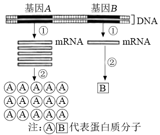
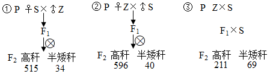
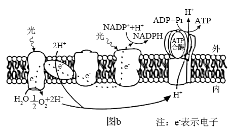
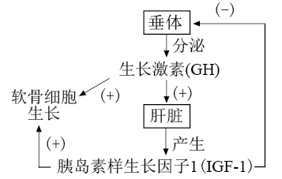

**湖南省2021年普通高中学业水平选择性考试**

**生物**

**一、选择题**

1\. 关于下列微生物的叙述，正确的是（ ）

A. 蓝藻细胞内含有叶绿体，能进行光合作用

B. 酵母菌有细胞壁和核糖体，属于单细胞原核生物

C. 破伤风杆菌细胞内不含线粒体，只能进行无氧呼吸

D. 支原体属于原核生物，细胞内含有染色质和核糖体

2\. 以下生物学实验的部分操作过程，正确的是（ ）

|     |                 |                                    |
|:---:|:---------------:|:----------------------------------:|
|     | 实验名称            | 实验操作                               |
| A   | 检测生物组织中的还原糖     | 在待测液中先加NaOH溶液，再加CuSO4溶液 |
| B   | 观察细胞中DNA和RNA的分布 | 先加甲基绿染色，再加吡罗红染色                    |
| C   | 观察细胞中的线粒体       | 先用盐酸水解，再用健那绿染色                     |
| D   | 探究酵母菌种群数量变化     | 先将盖玻片放在计数室上，再在盖玻片边缘滴加培养液           |

A. A B. B C. C D. D

3\. 质壁分离和质壁分离复原是某些生物细胞响应外界水分变化而发生的渗透调节过程。下列叙述错误的是（ ）

A. 施肥过多引起的“烧苗”现象与质壁分离有关

B. 质壁分离过程中，细胞膜可局部或全部脱离细胞壁

C. 质壁分离复原过程中，细胞的吸水能力逐渐降低

D. 1mol/L NaCl溶液和1mol/L蔗糖溶液的渗透压大小相等

4\. 某草原生态系统中植物和食草动物两个种群数量的动态模型如图所示。下列叙述错误的是（ ）

A 食草动物进入早期，其种群数量增长大致呈“J”型曲线

B. 图中点a纵坐标值代表食草动物的环境容纳量

C. 该生态系统的相对稳定与植物和食草动物之间的负反馈调节有关

D. 过度放牧会降低草原生态系统的抵抗力稳定性

5\. 某些蛋白质在蛋白激酶和蛋白磷酸酶的作用下，可在特定氨基酸位点发生磷酸化和去磷酸化，参与细胞信号传递，如图所示。下列叙述错误的是（ ）

A. 这些蛋白质磷酸化和去磷酸化过程体现了蛋白质结构与功能相适应的观点

B. 这些蛋白质特定磷酸化位点的氨基酸缺失，不影响细胞信号传递

C. 作为能量“通货”的ATP能参与细胞信号传递

D. 蛋白质磷酸化和去磷酸化反应受温度的影响

6\. 鸡尾部的法氏囊是B淋巴细胞的发生场所。传染性法氏囊病病毒（IBDV）感染雏鸡后，可导致法氏囊严重萎缩。下列叙述错误的是（ ）

A. 法氏囊是鸡的免疫器官

B. 传染性法氏囊病可能导致雏鸡出现免疫功能衰退

C. 将孵出当日的雏鸡摘除法氏囊后，会影响该雏鸡B淋巴细胞的产生

D. 雏鸡感染IBDV发病后，注射IBDV灭活疫苗能阻止其法氏囊萎缩

7\. 绿色植物的光合作用是在叶绿体内进行的一系列能量和物质转化过程。下列叙述错误的是（ ）

A. 弱光条件下植物没有O2的释放，说明未进行光合作用

B. 在暗反应阶段，CO2不能直接被还原

C. 在禾谷类作物开花期剪掉部分花穗，叶片的光合速率会暂时下降

D. 合理密植和增施有机肥能提高农作物的光合作用强度

8\. 金鱼系野生鲫鱼经长期人工选育而成，是中国古代劳动人民智慧结晶。现有形态多样、品种繁多的金鱼品系。自然状态下，金鱼能与野生鲫鱼杂交产生可育后代。下列叙述错误的是（ ）

A. 金鱼与野生鲫鱼属于同一物种

B. 人工选择使鲫鱼发生变异，产生多种形态

C. 鲫鱼进化成金鱼的过程中，有基因频率的改变

D. 人类的喜好影响了金鱼的进化方向

9\. 某国家男性中不同人群肺癌死亡累积风险如图所示。下列叙述错误的是（ ）

A. 长期吸烟的男性人群中，年龄越大，肺癌死亡累积风险越高

B. 烟草中含有多种化学致癌因子，不吸烟或越早戒烟，肺癌死亡累积风险越低

C. 肺部细胞中原癌基因执行生理功能时，细胞生长和分裂失控

D. 肺部细胞癌变后，癌细胞彼此之间黏着性降低，易在体内分散和转移

10\. 有些人的性染色体组成为XY，其外貌与正常女性一样，但无生育能力，原因是其X染色体上有一个隐性致病基因a，而Y染色体上没有相应的等位基因。某女性化患者的家系图谱如图所示。下列叙述错误的是（ ）

A. Ⅱ-1的基因型为XaY

B. Ⅱ-2与正常男性婚后所生后代的患病概率为1/4

C. I-1的致病基因来自其父亲或母亲

D. 人群中基因a的频率将会越来越低

11\. 研究人员利用电压钳技术改变枪乌贼神经纤维膜电位，记录离子进出细胞引发的膜电流变化，结果如图所示，图a为对照组，图b和图c分别为通道阻断剂TTX、TEA处理组。下列叙述正确的是（ ）

A. TEA处理后，只有内向电流存在

B. 外向电流由Na+通道所介导

C. TTX处理后，外向电流消失

D. 内向电流结束后，神经纤维膜内Na+浓度高于膜外

12\. 下列有关细胞呼吸原理应用的叙述，错误的是（ ）

A. 南方稻区早稻浸种后催芽过程中，常用40℃左右温水淋种并时常翻种，可以为种子的呼吸作用提供水分、适宜的温度和氧气

B. 农作物种子入库贮藏时，在无氧和低温条件下呼吸速率降低，贮藏寿命显著延长

C. 油料作物种子播种时宜浅播，原因是萌发时呼吸作用需要大量氧气

D. 柑橘在塑料袋中密封保存，可以减少水分散失、降低呼吸速率，起到保鲜作用

**二、选择题**

13\. 细胞内不同基因的表达效率存在差异，如图所示。下列叙述正确的是（ ）

A. 细胞能在转录和翻译水平上调控基因表达，图中基因A的表达效率高于基因B

B. 真核生物核基因表达的①和②过程分别发生在细胞核和细胞质中

C. 人的mRNA、rRNA和tRNA都是以DNA为模板进行转录的产物

D. ②过程中，rRNA中含有与mRNA上密码子互补配对的反密码子

14\. 独脚金内酯（SL）是近年来新发现的一类植物激素。SL合成受阻或SL不敏感突变体都会出现顶端优势缺失。现有拟南芥SL突变体1（*maxl*）和SL突变体2（*max2*），其生长素水平正常，但植株缺失顶端优势，与野生型（W）形成明显区别；在幼苗期进行嫁接试验，培养后植株形态如图所示。据此分析，下列叙述正确的是（ ）

注：R代表根，S代表地上部分，“+”代表嫁接。

A. SL不能在产生部位发挥调控作用

B. *maxl*不能合成SL，但对SL敏感

C. *max2*对SL不敏感，但根能产生SL

D. 推测*max2*\_S+*maxl*\_R表现顶端优势缺失

15\. 血浆中胆固醇与载脂蛋白apoB-100结合形成低密度脂蛋白（LDL），LDL通过与细胞表面受体结合，将胆固醇运输到细胞内，从而降低血浆中胆固醇含量。*PCSK9*基因可以发生多种类型的突变，当突变使PCSK9蛋白活性增强时，会增加LDL受体在溶酶体中的降解，导致细胞表面LDL受体减少。下列叙述错误的是（ ）

A. 引起LDL受体缺失的基因突变会导致血浆中胆固醇含量升高

B. *PCSK9*基因的有些突变可能不影响血浆中LDL的正常水平

C. 引起PCSK9蛋白活性降低的基因突变会导致血浆中胆固醇含量升高

D. 编码apoB-100的基因失活会导致血浆中胆固醇含量升高

16\. 有研究报道，某地区近40年内森林脊椎动物种群数量减少了80.9%。该时段内，农业和城镇建设用地不断增加，挤占和蚕食自然生态空间，致使森林生态系统破碎化程度增加。下列叙述正确的是（ ）

A. 森林群落植物多样性高时，可为动物提供多样的栖息地和食物

B. 森林生态系统破碎化有利于生物多样性的形成

C. 保护生物多样性，必须禁止一切森林砍伐和野生动物捕获的活动

D. 农业和城镇建设需遵循自然、经济、社会相协调的可持续发展理念

**三、非选择题**

17\. 油菜是我国重要的油料作物，油菜株高适当的降低对抗倒伏及机械化收割均有重要意义。某研究小组利用纯种高秆甘蓝型油菜Z，通过诱变培育出一个纯种半矮秆突变体S。为了阐明半矮秆突变体S是由几对基因控制、显隐性等遗传机制，研究人员进行了相关试验，如图所示。

回答下列问题：

（1）根据F2表现型及数据分析，油菜半矮杆突变体S的遗传机制是\_\_\_\_\_\_，杂交组合①的F1产生各种类型的配子比例相等，自交时雌雄配子有\_\_\_\_\_\_种结合方式，且每种结合方式机率相等。F1产生各种类型配子比例相等的细胞遗传学基础是\_\_\_\_\_\_。

（2）将杂交组合①的F2所有高轩植株自交，分别统计单株自交后代的表现型及比例，分为三种类型，全为高轩的记为F3-Ⅰ，高秆与半矮秆比例和杂交组合①、②的F2基本一致的记为F3-Ⅱ，高秆与半矮秆比例和杂交组合③的F2基本一致的记为F3-Ⅲ。产生F3-Ⅰ、F3-Ⅱ、F3-Ⅲ的高秆植株数量比为\_\_\_\_\_\_。产生F3-Ⅲ的高秆植株基因型为\_\_\_\_\_\_（用A、a；B、b；C、c……表示基因）。用产生F3-Ⅲ的高秆植株进行相互杂交试验，能否验证自由组合定律？\_\_\_\_\_\_。

18\. 图a为叶绿体的结构示意图，图b为叶绿体中某种生物膜的部分结构及光反应过程的简化示意图。回答下列问题：

（1）图b表示图a中\_\_\_\_\_\_结构，膜上发生的光反应过程将水分解成O2、H+和e-，光能转化成电能，最终转化为\_\_\_\_\_\_和ATP中活跃的化学能。若CO2浓度降低．暗反应速率减慢，叶绿体中电子受体NADP+减少，则图b中电子传递速率会\_\_\_\_\_\_（填“加快”或“减慢”）。

（2）为研究叶绿体的完整性与光反应的关系，研究人员用物理、化学方法制备了4种结构完整性不同的叶绿体，在离体条件下进行实验，用Fecy或DCIP替代NADP+为电子受体，以相对放氧量表示光反应速率，实验结果如表所示。

|                                                    |              |                      |                      |                      |
|:--------------------------------------------------:|:------------:|:--------------------:|:--------------------:|:--------------------:|
|  | 叶绿体A：双层膜结构完整 | 叶绿体B：双层膜局部受损，类囊体略有损伤 | 叶绿体C：双层膜瓦解，类囊体松散但未断裂 | 叶绿体D：所有膜结构解体破裂成颗粒或片段 |
| 实验一：以Fecy为电子受体时的放氧量                                | 100          | 167.0                | 425.1                | 281.3                |
| 实验二：以DCIP为电子受体时的放氧量                                | 100          | 106.7                | 471.1                | 109.6                |

注：Fecy具有亲水性，DCIP具有亲脂性。

据此分析：

①叶绿体A和叶绿体B的实验结果表明，叶绿体双层膜对以\_\_\_\_\_\_\_\_\_（填“Fecy”或“DCIP”）为电子受体的光反应有明显阻碍作用，得出该结论的推理过程是\_\_\_\_\_\_\_\_\_。

②该实验中，光反应速率最高的是叶绿体C，表明在无双层膜阻碍、类囊体又松散的条件下，更有利于\_\_\_\_\_\_\_\_\_，从而提高光反应速率。

③以DCIP为电子受体进行实验，发现叶绿体A、B、C和D的ATP产生效率的相对值分别为1、0.66、0.58和0.41。结合图b对实验结果进行解释\_\_\_\_\_\_\_\_\_。

19\. 生长激素对软骨细胞生长有促进作用，调节过程如图所示。回答下列问题

（1）根据示意图，可以确定软骨细胞具有\_\_\_\_\_\_\_\_\_（填“GH受体”“IGF-1受体”或“GH受体和IGF-1受体”）。

（2）研究人员将正常小鼠和*IGF-1*基因缺失小鼠分组饲养后，检测体内GH水平。据图预测，*IGF-1*基因缺失小鼠体内GH水平应\_\_\_\_\_\_\_\_\_（填“低于”“等于”或“高于”）正常小鼠，理由是\_\_\_\_\_\_\_\_\_。

（3）研究人员拟以无生长激素受体的小鼠软骨细胞为实验材料，在细胞培养液中添加不同物质分组离体培养，验证生长激素可通过IGF-1促进软骨细胞生长。实验设计如表所示，A组为对照组。

|          |     |     |       |             |     |
|:--------:|:---:|:---:|:-----:|:-----------:|:---:|
| 组别       | A   | B   | C     | D           | E   |
| 培养液中添加物质 | 无   | GH  | IGF-1 | 正常小鼠去垂体后的血清 | ？   |

实验结果预测及分析：

①与A组比较，在B、C和D组中，软骨细胞生长无明显变化的是\_\_\_\_\_\_\_\_\_组。

②若E组培养的软骨细胞较A组生长明显加快，结合本实验目的，推测E组培养液中添加物质是\_\_\_\_\_\_\_\_\_。

20\. 某林场有一片约2公顷的马尾松与石栎混交次生林，群落内马尾松、石栎两个种群的空间分布均为随机分布。为了解群落演替过程中马尾松和石栎种群密度的变化特征，某研究小组在该混交次生林中选取5个固定样方进行观测，每个样方的面积为0.04公顷，某一时期的观测结果如表所示。

<table style="width:100%;">
<colgroup>
<col style="width: 11%" />
<col style="width: 8%" />
<col style="width: 8%" />
<col style="width: 8%" />
<col style="width: 8%" />
<col style="width: 8%" />
<col style="width: 8%" />
<col style="width: 8%" />
<col style="width: 8%" />
<col style="width: 8%" />
<col style="width: 7%" />
</colgroup>
<tbody>
<tr>
<td rowspan="2" style="text-align: center;">树高X（m）</td>
<td colspan="5" style="text-align: center;">马尾松（株）</td>
<td colspan="5" style="text-align: center;">石栎（株）</td>
</tr>
<tr>
<td style="text-align: center;">样方1</td>
<td style="text-align: center;">样方2</td>
<td style="text-align: center;">样方3</td>
<td style="text-align: center;">样方4</td>
<td style="text-align: center;">样方5</td>
<td style="text-align: center;">样方1</td>
<td style="text-align: center;">样方2</td>
<td style="text-align: center;">样方3</td>
<td style="text-align: center;">样方4</td>
<td style="text-align: center;">样方5</td>
</tr>
<tr>
<td style="text-align: center;">x≤5</td>
<td style="text-align: center;">8</td>
<td style="text-align: center;">9</td>
<td style="text-align: center;">7</td>
<td style="text-align: center;">5</td>
<td style="text-align: center;">8</td>
<td style="text-align: center;">46</td>
<td style="text-align: center;">48</td>
<td style="text-align: center;">50</td>
<td style="text-align: center;">47</td>
<td style="text-align: center;">45</td>
</tr>
<tr>
<td style="text-align: center;">5<X≤10</td>
<td style="text-align: center;">25</td>
<td style="text-align: center;">27</td>
<td style="text-align: center;">30</td>
<td style="text-align: center;">28</td>
<td style="text-align: center;">30</td>
<td style="text-align: center;">30</td>
<td style="text-align: center;">25</td>
<td style="text-align: center;">28</td>
<td style="text-align: center;">26</td>
<td style="text-align: center;">27</td>
</tr>
<tr>
<td style="text-align: center;">10<X≤15</td>
<td style="text-align: center;">34</td>
<td style="text-align: center;">29</td>
<td style="text-align: center;">30</td>
<td style="text-align: center;">36</td>
<td style="text-align: center;">35</td>
<td style="text-align: center;">2</td>
<td style="text-align: center;">3</td>
<td style="text-align: center;">5</td>
<td style="text-align: center;">4</td>
<td style="text-align: center;">3</td>
</tr>
<tr>
<td style="text-align: center;">x>15</td>
<td style="text-align: center;">13</td>
<td style="text-align: center;">16</td>
<td style="text-align: center;">14</td>
<td style="text-align: center;">15</td>
<td style="text-align: center;">12</td>
<td style="text-align: center;">3</td>
<td style="text-align: center;">2</td>
<td style="text-align: center;">1</td>
<td style="text-align: center;">2</td>
<td style="text-align: center;">2</td>
</tr>
<tr>
<td style="text-align: center;">合计</td>
<td style="text-align: center;">80</td>
<td style="text-align: center;">81</td>
<td style="text-align: center;">81</td>
<td style="text-align: center;">84</td>
<td style="text-align: center;">85</td>
<td style="text-align: center;">81</td>
<td style="text-align: center;">78</td>
<td style="text-align: center;">84</td>
<td style="text-align: center;">79</td>
<td style="text-align: center;">77</td>
</tr>
</tbody>
</table>

注：同一树种树高与年龄存在一定程度的正相关性；两树种在幼年期时的高度基本一致。

回答下列问题：

（1）调查植物种群密度取样的关键是\_\_\_\_\_\_\_\_\_ ；根据表中调查数据计算，马尾松种群密度为\_\_\_\_\_\_\_\_\_。

（2）该群落中，马尾松和石栎之间的种间关系是\_\_\_\_\_\_\_\_\_。马尾松是喜光的阳生树种，石栎是耐阴树种。根据表中数据和树种的特性预测该次生林数十年后优势树种是\_\_\_\_\_\_\_\_\_，理由是\_\_\_\_\_\_\_\_\_。

**\[选修1：生物技术实践\]**

21\. 大熊猫是我国特有的珍稀野生动物，每只成年大熊猫每日进食竹子量可达12~38kg。大熊猫可利用竹子中8%的纤维素和27%的半纤维素。研究人员从大熊猫粪便和土壤中筛选纤维素分解菌。回答下列问题：

（1）纤维素酶是一种复合酶，一般认为它至少包括三种组分，即\_\_\_\_\_\_\_\_\_。为筛选纤维素分解菌，将大熊猫新鲜粪便样品稀释液接种至以\_\_\_\_\_\_\_\_\_为唯一碳源的固体培养基上进行培养，该培养基从功能上分类属于\_\_\_\_\_\_\_\_\_培养基。

（2）配制的培养基必须进行灭菌处理，目的是\_\_\_\_\_\_\_\_\_。检测固体培养基灭菌效果的常用方法是\_\_\_\_\_\_\_\_\_。

（3）简要写出测定大熊猫新鲜粪便中纤维素分解菌活菌数的实验思路\_\_\_\_\_\_\_\_\_。

（4）为高效降解农业秸秆废弃物，研究人员利用从土壤中筛选获得的3株纤维素分解菌，在37℃条件下进行玉米秸秆降解实验，结果如表所示。在该条件下纤维素酶活力最高的是菌株\_\_\_\_\_\_\_\_\_，理由是\_\_\_\_\_\_\_\_\_。

|     |         |         |         |           |
|:---:|:-------:|:-------:|:-------:|:---------:|
| 菌株  | 秸秆总重(g) | 秸秆残重(g) | 秸秆失重（%） | 纤维素降解率（%） |
| A   | 2.00    | 1.51    | 24.50   | 16.14     |
| B   | 2.00    | 1.53    | 23.50   | 14.92     |
| C   | 2.00    | 1.42    | 29.00   | 23.32     |

**\[选修3：现代生物科技专题\]**

22\. *M* 基因编码的M蛋白在动物A的肝细胞中特异性表达。现设计实验，将外源DNA片段F插入*M* 基因的特定位置，再通过核移植、胚胎培养和胚胎移植等技术获得*M* 基因失活的转基因克隆动物A，流程如图所示。回答下列问题：

（1）在构建含有片段F的重组质粒过程中，切割质粒DNA的工具酶是\_\_\_\_\_\_\_\_\_，这类酶能将特定部位的两个核苷酸之间的\_\_\_\_\_\_\_\_\_断开。

（2）在无菌、无毒等适宜环境中进行动物A成纤维细胞的原代和传代培养时，需要定期更换培养液，目的是\_\_\_\_\_\_\_\_\_。

（3）与胚胎细胞核移植技术相比，体细胞核移植技术的成功率更低，原因是\_\_\_\_\_\_\_\_\_。从早期胚胎中分离获得的胚胎干细胞，在形态上表现为\_\_\_\_\_\_\_\_\_（答出两点即可），功能上具有\_\_\_\_\_\_\_\_\_。

（4）鉴定转基因动物：以免疫小鼠的\_\_\_\_\_\_\_\_\_淋巴细胞与骨髓瘤细胞进行融合，筛选融合杂种细胞，制备M蛋白的单克隆抗体。简要写出利用此抗体确定克隆动物A中*M* 基因是否失活的实验思路\_\_\_\_\_\_\_\_\_。
