**湖南省2021年普通高中学业水平选择性考试**

**生物**

**一、选择题**

1\. 关于下列微生物的叙述，正确的是（ ）

A. 蓝藻细胞内含有叶绿体，能进行光合作用

B. 酵母菌有细胞壁和核糖体，属于单细胞原核生物

C. 破伤风杆菌细胞内不含线粒体，只能进行无氧呼吸

D. 支原体属于原核生物，细胞内含有染色质和核糖体

【答案】C

【解析】

【分析】1、原核细胞和真核细胞最主要的区别就是原核细胞没有核膜包被的典型细胞核，原核细胞具有细胞壁、细胞膜、细胞质、核糖体、拟核以及遗传物质DNA等。

2、蓝藻、破伤风杆菌、支原体属于原核生物，原核生物只有核糖体一种细胞器。

【详解】A、蓝藻属于原核生物，原核细胞中没有叶绿体，但含有藻蓝素和叶绿素，能够进行光合作用，A错误；

B、酵母菌属于真核生物中的真菌，有细胞壁和核糖体，B错误；

C、破伤风杆菌属于原核生物，原核细胞中没有线粒体。破伤风杆菌是厌氧微生物，只能进行无氧呼吸，C正确；

D、支原体属于原核生物，没有核膜包被的细胞核，仅含有核糖体这一种细胞器，拟核内DNA裸露，无染色质，D错误。

故选C。

2\. 以下生物学实验的部分操作过程，正确的是（ ）

|     |                 |                                    |
|:---:|:---------------:|:----------------------------------:|
|     | 实验名称            | 实验操作                               |
| A   | 检测生物组织中的还原糖     | 在待测液中先加NaOH溶液，再加CuSO4溶液 |
| B   | 观察细胞中DNA和RNA的分布 | 先加甲基绿染色，再加吡罗红染色                    |
| C   | 观察细胞中的线粒体       | 先用盐酸水解，再用健那绿染色                     |
| D   | 探究酵母菌种群数量变化     | 先将盖玻片放在计数室上，再在盖玻片边缘滴加培养液           |

A. A B. B C. C D. D

【答案】D

【解析】

【分析】1、斐林试剂是由甲液（0.1g/mL氢氧化钠溶液）和乙液（0.05 g/mL硫酸铜溶液）组成，用于鉴定还原糖，使用时要将甲液和乙液混合均匀后再加入含样品的试管中，且需水浴加热；双缩脲试剂由A液（0.1 g/mL氢氧化钠溶液）和B液（0.01 g/mL硫酸铜溶液）组成，用于鉴定蛋白质，使用时要先加A液后再加入B液。

2、健那绿染液是专一性染线粒体的活细胞染料，可以使活细胞中线粒体呈现蓝绿色。

3、甲基绿和吡罗红两种染色剂对DNA和RNA的亲和力不同，甲基绿使DNA呈现绿色，吡罗红使RNA呈现红色．利用甲基绿、吡罗红混合染色剂将细胞染色，可显示DNA和RNA在细胞中的分布。

4、探究培养液中酵母菌种群数量的变化实验中，使用血细胞计数板记数前，先将盖玻片放在计数室上，用吸管吸取培养液，滴于盖玻片边缘，让其自行渗入。

【详解】A、检测生物组织中的还原糖使用斐林试剂。斐林试剂在使用时，需将NaOH溶液和CuSO4溶液混合后再加入到待测样品中，A错误；

B、利用甲基绿吡罗红混合染色剂对细胞染色，由于甲基绿和吡罗红两种染色剂对DNA和RNA的亲和力不同，可显示DNA和RNA在细胞中的分布，B错误；

C、健那绿是专一性染线粒体的活细胞染料，因此观察线粒体时不需要用盐酸水解，C错误；

D、用抽样检测法调查酵母菌种群数量变化的实验中，应先将盖玻片放在计数室上，将培养液滴于盖玻片边缘，让培养液自行渗入后，吸取多余的培养液后即可镜检开始计数，D正确。

故选D。

3\. 质壁分离和质壁分离复原是某些生物细胞响应外界水分变化而发生的渗透调节过程。下列叙述错误的是（ ）

A. 施肥过多引起的“烧苗”现象与质壁分离有关

B. 质壁分离过程中，细胞膜可局部或全部脱离细胞壁

C. 质壁分离复原过程中，细胞的吸水能力逐渐降低

D. 1mol/L NaCl溶液和1mol/L蔗糖溶液的渗透压大小相等

【答案】D

【解析】

【分析】1、质壁分离的原因分析：

（1）外因：外界溶液浓度＞细胞液浓度；

（2）内因：原生质层相当于一层半透膜，细胞壁伸缩性小于原生质层；

（3）表现：液泡由大变小，细胞液颜色由浅变深，原生质层与细胞壁分离。

2、溶液渗透压的大小取决于单位体积溶液中溶质微粒的数目，溶质微粒越多，即溶液浓度越高，对水的吸引力越大；反过来，溶液微粒越少即，溶浓度越低，对水的吸引力越小。

【详解】A、施肥过多使外界溶液浓度过高，大于细胞液的浓度，细胞发生质壁分离导致植物过度失水而死亡，引起“烧苗”现象，A正确；

B、发生质壁分离的内因是细胞壁的伸缩性小于原生质层的伸缩性，而原生质层包括细胞膜、液泡膜以及之间的细胞质，质壁分离过程中，细胞膜可局部或全部与细胞壁分开，B正确；

C、植物细胞在发生质壁分离复原的过程中，因不断吸水导致细胞液的浓度逐渐降低，与外界溶液浓度差减小，细胞的吸水能力逐渐降低，C正确；

D、溶液渗透压的大小取决于单位体积溶液中溶质微粒的数目，1mol/L的NaCl溶液和1mol/L的葡萄糖溶液的渗透压不相同，因NaCl溶液中含有钠离子和氯离子，故其渗透压高于葡萄糖溶液，D错误。

故选D。

4\. 某草原生态系统中植物和食草动物两个种群数量的动态模型如图所示。下列叙述错误的是（ ）

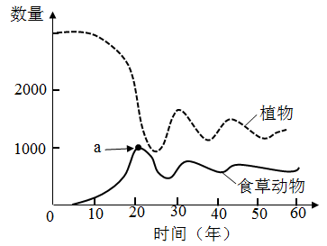

A. 食草动物进入早期，其种群数量增长大致呈“J”型曲线

B. 图中点a的纵坐标值代表食草动物的环境容纳量

C. 该生态系统的相对稳定与植物和食草动物之间的负反馈调节有关

D. 过度放牧会降低草原生态系统的抵抗力稳定性

【答案】B

【解析】

【分析】1、分析图形：食草动物与植物属于捕食关系，根据被捕食者（先增加者先减少）、捕食者（后增加者后减少）进行判断：二者的食物链之间的关系为：植物→食草动物。

2、态系统具有一定的自我调节能力，而这种能力受生态系统中生物的种类和数量所限制，生态系统中的组成成分越多，营养结构就越复杂，生态系统的自动调节能力就越强，其抵抗力稳定性就越强，相反的其恢复力稳定性就越弱。

【详解】A、早期食草动物进入草原生态系统，由于空间、资源充足，又不受其他生物的制约，所以食草动物的种群数量的增长大致呈“J”型曲线增长，A正确；

B、环境容纳量是指在相当长一段时间内，环境所能维持的种群最大数量，即该种群在该环境中的稳定平衡密度。而图中a点的纵坐标对应的数量为该食草动物的最大数量，所以环境容纳量应小于a，B错误；

C、从图中可以看出，食草动物过多会导致植物数量的下降，食草动物数量的下降又会导致植物数量的增多，属于典型的负反馈调节， C正确；

D、生态系统有自我调节能力，但有一定的限度，过度放牧使得草原生物的种类和数量减少，降低了草原生态系统的自动调节能力，致使草原退化，D正确。

故选B。

5\. 某些蛋白质在蛋白激酶和蛋白磷酸酶的作用下，可在特定氨基酸位点发生磷酸化和去磷酸化，参与细胞信号传递，如图所示。下列叙述错误的是（ ）

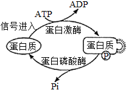

A. 这些蛋白质磷酸化和去磷酸化过程体现了蛋白质结构与功能相适应的观点

B. 这些蛋白质特定磷酸化位点的氨基酸缺失，不影响细胞信号传递

C. 作为能量“通货”的ATP能参与细胞信号传递

D. 蛋白质磷酸化和去磷酸化反应受温度的影响

【答案】B

【解析】

【分析】分析图形，在信号的刺激下，蛋白激酶催化ATP将蛋白质磷酸化，形成ADP和磷酸化的蛋白质，使蛋白质的空间结构发生改变；而蛋白磷酸酶又能催化磷酸化的蛋白质上的磷酸基团脱落，形成去磷酸化的蛋白质，从而使蛋白质空间结构的恢复。

【详解】A、通过蛋白质磷酸化和去磷酸化改变蛋白质的空间结构，进而来实现细胞信号的传递，体现出蛋白质结构与功能相适应的观点，A正确；

B、如果这些蛋白质特定磷酸化位点的氨基酸缺失，将会使该位点无法磷酸化，进而影响细胞信号的传递，B错误；

C、根据题干信息：进行细胞信息传递的蛋白质需要磷酸化才能起作用，而ATP为其提供了磷酸基团和能量，从而参与细胞信号传递，C正确；

D、温度会影响蛋白激酶和蛋白磷酸酶的活性，进而影响蛋白质磷酸化和去磷酸化反应，D正确。

故选B。

6\. 鸡尾部的法氏囊是B淋巴细胞的发生场所。传染性法氏囊病病毒（IBDV）感染雏鸡后，可导致法氏囊严重萎缩。下列叙述错误的是（ ）

A. 法氏囊是鸡的免疫器官

B. 传染性法氏囊病可能导致雏鸡出现免疫功能衰退

C. 将孵出当日的雏鸡摘除法氏囊后，会影响该雏鸡B淋巴细胞的产生

D. 雏鸡感染IBDV发病后，注射IBDV灭活疫苗能阻止其法氏囊萎缩

【答案】D

【解析】

【分析】1、免疫系统由免疫器官、免疫细胞和免疫活性物质构成，免疫分为特异性免疫和非特异性免疫，特异性免疫包含细胞免疫和体液免疫。

2、体液免疫过程为：除少数抗原可以直接刺激B细胞外，大多数抗原被吞噬细胞摄取和处理，并暴露出其抗原决定簇；吞噬细胞将抗原呈递给T细胞，再由T细胞呈递给B细胞；B细胞接受抗原刺激后，开始进行一系列的增殖、分化，形成记忆细胞和浆细胞；浆细胞分泌抗体与相应的抗原特异性结合，发挥免疫效应。

【详解】A、根据题干信息 “法氏囊是B淋巴细胞的发生场所” ，可推知法氏囊相当于人体的骨髓造血组织，是B淋巴细胞产生和分化的部位，所以是鸡的免疫器官，A正确；

B、传染性法氏囊病病毒（IBDV)感染雏鸡后，可导致法氏囊严重萎缩，进而影响B淋巴细胞的产生，B淋巴细胞主要参与体液免疫，所以会导致体液免疫功能衰退，B正确；

C、法氏囊是B淋巴细胞的发生场所，孵出当日摘除，会导致雏鸡B淋巴细胞的产生减少，C正确；

D、IBDV灭活疫苗相当于抗原，应在感染前注射，用于免疫预防，发病后再使用不会阻止其法氏囊萎缩，D错误。

故选D。

7\. 绿色植物的光合作用是在叶绿体内进行的一系列能量和物质转化过程。下列叙述错误的是（ ）

A. 弱光条件下植物没有O2的释放，说明未进行光合作用

B. 在暗反应阶段，CO2不能直接被还原

C. 在禾谷类作物开花期剪掉部分花穗，叶片的光合速率会暂时下降

D. 合理密植和增施有机肥能提高农作物的光合作用强度

【答案】A

【解析】

【分析】光合作用是指绿色植物通过叶绿体，利用光能，把二氧化碳和水转化成储存着能量的有机物，并且释放出氧气的过程。光合作用根据是否需要光能，可以概括地分为光反应和暗反应两个阶段。光合作用第一个阶段中的化学反应，必须有光才能进行，这个阶段叫做光反应阶段。光合作用第二个阶段的化学反应，有没有光都可以进行，这个阶段叫做暗反应阶段。

【详解】A、弱光条件下植物没有氧气的释放，有可能是光合作用强度小于或等于呼吸作用强度，光合作用产生的氧气被呼吸作用消耗完，此时植物虽然进行了光合作用，但是没有氧气的释放，A错误；

B、二氧化碳性质不活泼，在暗反应阶段，一个二氧化碳分子被一个C5分子固定以后，很快形成两个C3分子，在有关酶的催化作用下，C3接受ATP释放的能量并且被\[H\]还原，因此二氧化碳不能直接被还原，B正确；

C、在禾谷类作物开花期减掉部分花穗，光合作用产物输出受阻，叶片的光合速率会暂时下降，C正确；

D、合理密植可以充分利用光照，增施有机肥可以为植物提供矿质元素和二氧化碳，这些措施均能提高农作物的光合作用强度，D正确；

故选A。

【点睛】

8\. 金鱼系野生鲫鱼经长期人工选育而成，是中国古代劳动人民智慧的结晶。现有形态多样、品种繁多的金鱼品系。自然状态下，金鱼能与野生鲫鱼杂交产生可育后代。下列叙述错误的是（ ）

A. 金鱼与野生鲫鱼属于同一物种

B. 人工选择使鲫鱼发生变异，产生多种形态

C. 鲫鱼进化成金鱼的过程中，有基因频率的改变

D. 人类的喜好影响了金鱼的进化方向

【答案】B

【解析】

【分析】1、在自然选择的作用下，种群的基因频率会发生定向改变，导致生物朝着一定的方向不断进化。

2、在遗传学和进化论的研究中，把能够在自然状态下相互交配并且产生可育后代的一群生物称为一个物种。

【详解】A、由题干中信息“自然状态下，金鱼能与野生鲫鱼杂交产生可育后代”可知，金鱼与野生鲫鱼属于同一物种，A正确；

B、人工选择可以积累人类喜好的变异，淘汰人类不喜好的变异，只对金鱼的变异类型起选择作用，不能使金鱼发生变异，B错误；

C、种群进化的实质是种群基因频率的改变，因此，鲫鱼进化成金鱼的过程中，存在基因频率的改变，C正确；

D、人类的喜好可以通过人工选择来实现，使人类喜好的性状得以保留，因此，人工选择可以决定金鱼的进化方向，D正确。

故选B。

9\. 某国家男性中不同人群肺癌死亡累积风险如图所示。下列叙述错误的是（ ）

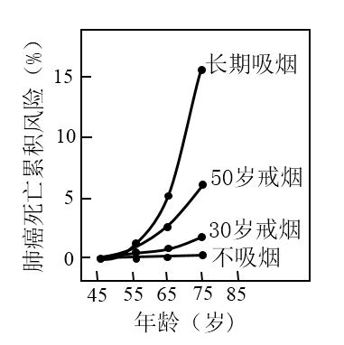

A. 长期吸烟的男性人群中，年龄越大，肺癌死亡累积风险越高

B. 烟草中含有多种化学致癌因子，不吸烟或越早戒烟，肺癌死亡累积风险越低

C. 肺部细胞中原癌基因执行生理功能时，细胞生长和分裂失控

D. 肺部细胞癌变后，癌细胞彼此之间黏着性降低，易在体内分散和转移

【答案】C

【解析】

【分析】1、与正常细胞相比，癌细胞具有以下特征：在适宜的条件下，癌细胞能够无限增殖；癌细胞的形态结构发生显著变化；癌细胞的表面发生了变化。

2、人类和动物细胞的染色体上存在着与癌有关的基因：原癌基因和抑癌基因。原癌基因主要负责调节细胞周期，控制细胞生长和分裂的进程；抑癌基因主要阻止细胞不正常的增殖。

【详解】A、据图分析可知，长期吸烟的男性人群中，不吸烟、30岁戒烟、50岁戒烟、长期吸烟的男性随年龄的增大，肺癌死亡累积风险依次升高，即年龄越大，肺癌死亡累积风险越高，A正确；

B、据图分析可知，不吸烟或越早戒烟，肺癌死亡累积风险越低，B正确；

C、原癌基因主要负责调节细胞周期，控制细胞生长和分裂的进程，原癌基因突变后可能导致细胞生长和分裂失控，C错误；

D、肺部细胞癌变后，由于细胞膜上的糖蛋白等物质减少，使得癌细胞彼此之间的黏着性显著降低，容易在体内分散和转移，D正确。

故选C。

【点睛】

10\. 有些人的性染色体组成为XY，其外貌与正常女性一样，但无生育能力，原因是其X染色体上有一个隐性致病基因a，而Y染色体上没有相应的等位基因。某女性化患者的家系图谱如图所示。下列叙述错误的是（ ）

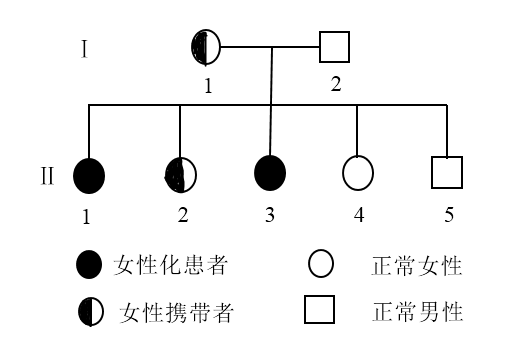

A. Ⅱ-1的基因型为XaY

B. Ⅱ-2与正常男性婚后所生后代的患病概率为1/4

C. I-1的致病基因来自其父亲或母亲

D. 人群中基因a的频率将会越来越低

【答案】C

【解析】

【分析】由某女性化患者的家系图谱可知，Ⅰ-1是女性携带者，基因型为XAXa，Ⅰ-2的基因型是XAY，生出的子代中，Ⅱ-1的基因型是XaY，Ⅱ-2的基因型是XAXa，Ⅱ-3的基因型是XaY，Ⅱ-4的基因型XAXA，是Ⅱ-5的基因型是XAY。

【详解】A、据分析可知，Ⅱ-1的基因型是XaY，A正确；

B、Ⅱ-2的基因型是XAXa，与正常男性XAY婚配后，后代基因型及比例为：XAXA：XAXa：XAY：XaY=1：1：1：1，则所生后代的患病概率是1/4，B正确；

C、Ⅰ-1是女性携带者，基因型为XAXa，若致病基因来自父亲，则父亲基因型为XaY，由题干可知XaY为不育的女性化患者，因此，其致病基因只可能来自母亲，C错误；

D、XaY（女性化患者）无生育能力，会使人群中a的基因频率越来越低，A的基因频率逐渐增加，D正确。

故选C。

【点睛】

11\. 研究人员利用电压钳技术改变枪乌贼神经纤维膜电位，记录离子进出细胞引发膜电流变化，结果如图所示，图a为对照组，图b和图c分别为通道阻断剂TTX、TEA处理组。下列叙述正确的是（ ）

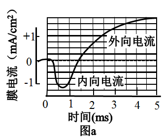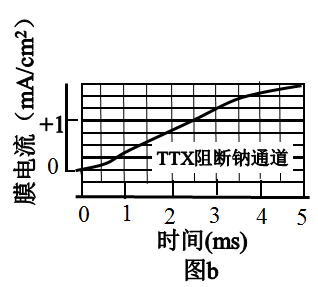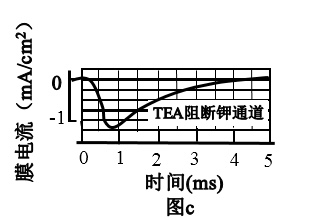

A. TEA处理后，只有内向电流存在

B. 外向电流由Na+通道所介导

C. TTX处理后，外向电流消失

D. 内向电流结束后，神经纤维膜内Na+浓度高于膜外

【答案】A

【解析】

【分析】据图分析可知，TTX阻断钠通道，从而阻断了内向电流，说明内向电流与钠通道有关；TEA阻断钾通道，从而阻断了外向电流，说明外向电流与钾通道有关。

【详解】A、据分析可知，TEA处理后，阻断了外向电流，只有内向电流存在，A正确；

B、据分析可知，TEA阻断钾通道，从而阻断了外向电流，说明外向电流与钾通道有关，B错误；

C、据分析可知，TTX阻断钠通道，从而阻断了内向电流，内向电流消失，C错误；

D、据分析可知，内向电流与钠通道有关，神经细胞内，K+浓度高，Na+浓度低，内向电流结束后，神经纤维膜内Na+浓度依然低于膜外，D错误。

故选A。

【点睛】

12\. 下列有关细胞呼吸原理应用的叙述，错误的是（ ）

A. 南方稻区早稻浸种后催芽过程中，常用40℃左右温水淋种并时常翻种，可以为种子的呼吸作用提供水分、适宜的温度和氧气

B. 农作物种子入库贮藏时，在无氧和低温条件下呼吸速率降低，贮藏寿命显著延长

C. 油料作物种子播种时宜浅播，原因是萌发时呼吸作用需要大量氧气

D. 柑橘在塑料袋中密封保存，可以减少水分散失、降低呼吸速率，起到保鲜作用

【答案】B

【解析】

【分析】细胞呼吸分有氧呼吸和无氧呼吸两种类型。这两种类型的共同点是：在酶的催化作用下，分解有机物，释放能量。但是，前者需要氧和线粒体的参与，有机物彻底氧化释放的能量比后者多。温度、水分、氧气和二氧化碳浓度是影响呼吸作用的主要因素，储藏蔬菜、水果时采取零上低温、一定湿度、低氧等措施延长储藏时间，而种子采取零上低温、干燥、低氧等措施延长储存时间。

【详解】A、南方稻区早稻浸种后催芽过程中，“常用40℃左右温水淋种”可以为种子的呼吸作用提供水分和适宜的温度，“时常翻种”可以为种子的呼吸作用提供氧气，A正确；

B、种子无氧呼吸会产生酒精，因此，农作物种子入库储藏时，应在低氧和零上低温条件下保存，贮藏寿命会显著延长，B错误；

C、油料作物种子种含有大量脂肪，脂肪中C、H含量高，O含量低，油料作物种子萌发时呼吸作用需要消耗大量氧气，因此，油料作物种子播种时宜浅播，C正确；

D、柑橘在塑料袋中“密封保存”使水分散失减少，氧气浓度降低，从而降低了呼吸速率，低氧、一定湿度是新鲜水果保存的适宜条件，D正确。

故选B。

【点睛】

**二、选择题**

13\. 细胞内不同基因的表达效率存在差异，如图所示。下列叙述正确的是（ ）

A. 细胞能在转录和翻译水平上调控基因表达，图中基因A的表达效率高于基因B

B. 真核生物核基因表达的①和②过程分别发生在细胞核和细胞质中

C. 人的mRNA、rRNA和tRNA都是以DNA为模板进行转录的产物

D. ②过程中，rRNA中含有与mRNA上密码子互补配对的反密码子

【答案】ABC

【解析】

【分析】基因的表达的产物是蛋白质，包括转录和翻译两个过程，图中①为转录过程，②为翻译过程。

【详解】A、基因的表达包括转录和翻译两个过程，图中基因A表达的蛋白质分子数量明显多于基因B表达的蛋白质分子，说明基因A表达的效率高于基因B，A正确；

B、核基因的转录是以DNA的一条链为模板转录出RNA的过程，发生的场所为细胞核，翻译是以mRNA为模板翻译出具有氨基酸排列顺序的多肽链，翻译的场所发生在细胞质中的核糖体，B正确；

C、三种RNA（mRNA、rRNA、tRNA）都是以DNA中的一条链为模板转录而来的，C正确；

D、反密码子位于tRNA上，rRNA是构成核糖体的成分，不含有反密码子，D错误。

故选ABC

【点睛】

14\. 独脚金内酯（SL）是近年来新发现的一类植物激素。SL合成受阻或SL不敏感突变体都会出现顶端优势缺失。现有拟南芥SL突变体1（*maxl*）和SL突变体2（*max2*），其生长素水平正常，但植株缺失顶端优势，与野生型（W）形成明显区别；在幼苗期进行嫁接试验，培养后植株形态如图所示。据此分析，下列叙述正确的是（ ）

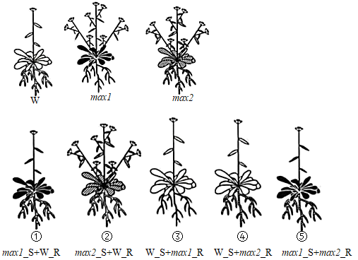

注：R代表根，S代表地上部分，“+”代表嫁接。

A. SL不能在产生部位发挥调控作用

B. *maxl*不能合成SL，但对SL敏感

C. *max2*对SL不敏感，但根能产生SL

D. 推测*max2*\_S+*maxl*\_R表现顶端优势缺失

【答案】BCD

【解析】

【分析】1、顶端优势：顶芽产生的生长素通过极性运输积累在侧芽的位置，造成侧芽生长浓度过高，其生长受到抑制。

2、根据题干信息“SL合成受阻或者SL不敏感（相当于激素的受体不正常）顶端优势消失”，可知，SL能够使植株出现顶端优势现象；图①中max1的地上部分和野生型（可以产生Sl）的根结合，恢复了顶端优势，说明max1不能合成SL，②中max2的地上部分和野生型的根结合，没有恢复顶端优势，说明max2对SL不敏感。

【详解】A、根据野生型W和③、④的生长情况进行分析，W可以产生SL，且W和③、④地上部分都表现出了顶端优势，说明SL可以在产生部位（地上部位）发挥调节作用，A错误；

B、根据分析，max1没有表现出顶端优势，但当其地上部分和W植株的根进行嫁接后（①），就表现出了顶端优势，说明其自身不能产生SL，由于野生型可产生的SL从根运输至地上部分，所以max1接受了SL，表现出顶端优势，因此对SL敏感，B正确；

C、根据分析，②中max2的地上部分和野生型的根结合，没有恢复顶端优势，说明max2对SL不敏感，又从⑤中（max1不能产生SL，但当其与max2结合后，表现除了顶端优势）可以看出，max2的根产生了SL，运输至地上部分，使地上部分表现出顶端优势，C正确；

D、当max2的地上部分和max1的根结合后由于max2对SL不敏感，因此不会表现出顶端优势，即表现为顶端优势缺失，D正确。

故选BCD。

15\. 血浆中胆固醇与载脂蛋白apoB-100结合形成低密度脂蛋白（LDL），LDL通过与细胞表面受体结合，将胆固醇运输到细胞内，从而降低血浆中胆固醇含量。*PCSK9*基因可以发生多种类型的突变，当突变使PCSK9蛋白活性增强时，会增加LDL受体在溶酶体中的降解，导致细胞表面LDL受体减少。下列叙述错误的是（ ）

A. 引起LDL受体缺失的基因突变会导致血浆中胆固醇含量升高

B. *PCSK9*基因的有些突变可能不影响血浆中LDL的正常水平

C. 引起PCSK9蛋白活性降低的基因突变会导致血浆中胆固醇含量升高

D. 编码apoB-100的基因失活会导致血浆中胆固醇含量升高

【答案】C

【解析】

【分析】分析题干，血浆胆固醇与载脂蛋白apoB-100结合形成低密度脂蛋白与细胞表面的受体结合，将胆固醇运输到细胞内，从而使血浆中的胆固醇含量降低；LDL受体减少和载脂蛋白apoB-100减少，均会影响胆固醇被细胞利用，导致血浆中的胆固醇含量较高。

【详解】A、LDL受体缺失，则LDL不能将胆固醇运进细胞，导致血浆中的胆固醇含量升高，A正确；

B、由于密码子的简并性，PCSK9基因的某些突变不一定会导致PCSK9蛋白活性发生改变，则不影响血浆中LDL的正常水平，B正确；

C、引起PCSK9蛋白活性增强的基因突变会导致细胞表面LDL受体数量减少，使血浆中胆固醇的含量增加，C错误；

D、编码apoB-100的基因失活，则apoB-100蛋白减少，与血浆中胆固醇结合形成LDL减少，进而被运进细胞的胆固醇减少，使血浆中的胆固醇含量升高，D正确。

故选C。

【点睛】

16\. 有研究报道，某地区近40年内森林脊椎动物种群数量减少了80.9%。该时段内，农业和城镇建设用地不断增加，挤占和蚕食自然生态空间，致使森林生态系统破碎化程度增加。下列叙述正确的是（ ）

A. 森林群落植物多样性高时，可为动物提供多样的栖息地和食物

B. 森林生态系统破碎化有利于生物多样性的形成

C. 保护生物多样性，必须禁止一切森林砍伐和野生动物捕获的活动

D. 农业和城镇建设需遵循自然、经济、社会相协调的可持续发展理念

【答案】AD

【解析】

【分析】1、垂直结构：

（1）概念：指群落在垂直方向上的分层现象。

（2）原因：①植物的分层与对光的利用有关，群落中的光照强度总是随着高度的下降而逐渐减弱，不同植物适于在不同光照强度下生长。如森林中植物由高到低的分布为：乔木层、灌木层、草本层、地被层。②动物分层主要是因群落的不同层次提供不同的食物，其次也与不同层次的微环境有关。如森林中动物的分布由高到低为：猫头鹰（森林上层），大山雀（灌木层），鹿、野猪（地面活动），蚯蚓及部分微生物（落叶层和土壤）。

2、生物多样性是指在一定时间和一定地区所有生物物种及其遗传变异和生态系统的复杂性总称。它包括基因多样性、物种多样性和生态系统多样性三个层次。保护生物多样性的措施有就地保护和迁地保护等。

【详解】A、植物的空间结构可为动物提供食物条件和栖息空间，森林群落植物多样性高时，植物可以形成更复杂多样的空间结构，可为动物提供多样的栖息地和食物，A正确；

B、农业和城镇建设用地不断增加，挤占和蚕食自然生态空间，致使森林生态系统破碎化程度增加，动物栖息地减少，不利于生物多样性的形成，B错误；

C、保护生物多样性，需要合理的开发和利用生物，而不是禁止一切森林砍伐和野生动物捕获的活动，C错误；

D、农业和城镇建设需要遵循可持续发展策略，遵循自然、经济和社会协调发展，既满足当代人的需要，又不损害下一代人的利益，D正确。

故选AD。

**三、非选择题**

17\. 油菜是我国重要的油料作物，油菜株高适当的降低对抗倒伏及机械化收割均有重要意义。某研究小组利用纯种高秆甘蓝型油菜Z，通过诱变培育出一个纯种半矮秆突变体S。为了阐明半矮秆突变体S是由几对基因控制、显隐性等遗传机制，研究人员进行了相关试验，如图所示。

回答下列问题：

（1）根据F2表现型及数据分析，油菜半矮杆突变体S的遗传机制是\_\_\_\_\_\_，杂交组合①的F1产生各种类型的配子比例相等，自交时雌雄配子有\_\_\_\_\_\_种结合方式，且每种结合方式机率相等。F1产生各种类型配子比例相等的细胞遗传学基础是\_\_\_\_\_\_。

（2）将杂交组合①的F2所有高轩植株自交，分别统计单株自交后代的表现型及比例，分为三种类型，全为高轩的记为F3-Ⅰ，高秆与半矮秆比例和杂交组合①、②的F2基本一致的记为F3-Ⅱ，高秆与半矮秆比例和杂交组合③的F2基本一致的记为F3-Ⅲ。产生F3-Ⅰ、F3-Ⅱ、F3-Ⅲ的高秆植株数量比为\_\_\_\_\_\_。产生F3-Ⅲ的高秆植株基因型为\_\_\_\_\_\_（用A、a；B、b；C、c……表示基因）。用产生F3-Ⅲ的高秆植株进行相互杂交试验，能否验证自由组合定律？\_\_\_\_\_\_。

【答案】 (1). 由两对位于非同源染色体上的隐性基因控制 (2). 16 (3). F1减数分裂产生配子时，位于同源染色体上的等位基因分离，位于非同源染色体上的非等位基因自由组合 (4). 7∶4∶4 (5). Aabb、aaBb (6). 不能

【解析】

【分析】实验①②中，F2高杆∶半矮杆≈15∶1，据此推测油菜株高性状由两对独立遗传的基因控制，遵循基因的自由组合定律。

【详解】（1）根据分析可推测，半矮秆突变体S是双隐性纯合子，只要含有显性基因即表现为高杆，杂交组合①的F1为双杂合子，减数分裂产生配子时，位于同源染色体上的等位基因分离，位于非同源染色体上的非等位基因自由组合，所以产生4种比例相等的配子，自交时雌雄配子有16种结合方式，且每种结合方式机率相等，导致F2出现高杆∶半矮杆≈15∶1。

（2）杂交组合①的F2所有高秆植株基因型包括1AABB、2AABb、2AaBB、4AaBb、1AAbb、2Aabb、1aaBB、2aaBb，所有高秆植株自交，分别统计单株自交后代的表现型及比例，含有一对纯合显性基因的高杆植株1AABB、2AABb、2AaBB、1AAbb、1aaBB，占高杆植株的比例为7/15，其后代全为高秆，记为F3-Ⅰ；AaBb占高杆植株的比例为4/15，自交后代高秆与半矮秆比例≈15∶1 ，和杂交组合①、②的F2基本一致，记为F3-Ⅱ；2Aabb、2aaBb占高杆植株的比例为4/15，自交后代高秆与半矮秆比例和杂交组合③的F2基本一致，记为 F3-Ⅲ，产生F3-Ⅰ、F3-Ⅱ、F3-Ⅲ的高秆植株数量比为7∶4∶4。用产生F3-Ⅲ的高秆植株进行相互杂交试验，不论两对基因位于一对同源染色体上，还是两对同源染色体上，亲本均产生两种数量相等的雌雄配子，子代均出现高杆∶半矮杆=3∶1，因此不能验证基因的自由组合定律。

【点睛】解答本题的关键是熟记两对相对性状的杂交实验结果，再根据实验①②中的性状分离比推测各表现型对应的基因型，即可顺利解答该题。

18\. 图a为叶绿体的结构示意图，图b为叶绿体中某种生物膜的部分结构及光反应过程的简化示意图。回答下列问题：

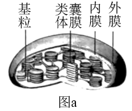

（1）图b表示图a中的\_\_\_\_\_\_结构，膜上发生的光反应过程将水分解成O2、H+和e-，光能转化成电能，最终转化为\_\_\_\_\_\_和ATP中活跃的化学能。若CO2浓度降低．暗反应速率减慢，叶绿体中电子受体NADP+减少，则图b中电子传递速率会\_\_\_\_\_\_（填“加快”或“减慢”）。

（2）为研究叶绿体的完整性与光反应的关系，研究人员用物理、化学方法制备了4种结构完整性不同的叶绿体，在离体条件下进行实验，用Fecy或DCIP替代NADP+为电子受体，以相对放氧量表示光反应速率，实验结果如表所示。

|                                                    |              |                      |                      |                      |
|:--------------------------------------------------:|:------------:|:--------------------:|:--------------------:|:--------------------:|
| 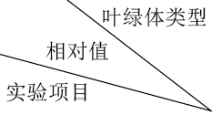 | 叶绿体A：双层膜结构完整 | 叶绿体B：双层膜局部受损，类囊体略有损伤 | 叶绿体C：双层膜瓦解，类囊体松散但未断裂 | 叶绿体D：所有膜结构解体破裂成颗粒或片段 |
| 实验一：以Fecy为电子受体时的放氧量                                | 100          | 167.0                | 425.1                | 281.3                |
| 实验二：以DCIP为电子受体时的放氧量                                | 100          | 106.7                | 471.1                | 109.6                |

注：Fecy具有亲水性，DCIP具有亲脂性。

据此分析：

①叶绿体A和叶绿体B的实验结果表明，叶绿体双层膜对以\_\_\_\_\_\_\_\_\_（填“Fecy”或“DCIP”）为电子受体的光反应有明显阻碍作用，得出该结论的推理过程是\_\_\_\_\_\_\_\_\_。

②该实验中，光反应速率最高的是叶绿体C，表明在无双层膜阻碍、类囊体又松散的条件下，更有利于\_\_\_\_\_\_\_\_\_，从而提高光反应速率。

③以DCIP为电子受体进行实验，发现叶绿体A、B、C和D的ATP产生效率的相对值分别为1、0.66、0.58和0.41。结合图b对实验结果进行解释\_\_\_\_\_\_\_\_\_。

【答案】 (1). 类囊体膜 (2). NADPH (3). 减慢 (4). Fecy (5). 实验一中叶绿体B双层膜局部受损时，以Fecy为电子受体的放氧量明显大于双层膜完整时，实验二中叶绿体B双层膜局部受损时，以DCIP为电子受体的放氧量与双层膜完整时无明显差异；结合所给信息：“Fecy具有亲水性，而DCIP具有亲脂性”，可推知叶绿体双层膜对以Fecy为电子受体的光反应有明显阻碍作用 (6). 类囊体上的色素吸收光能、转化光能 (7). ATP的合成依赖于水光解的电子传递和氢离子顺浓度梯度通过囊体薄膜上的ATP合酶，叶绿体A、B、C、D类囊体薄膜的受损程度依次增大，因此ATP的产生效率逐渐降低

【解析】

【分析】图a表示叶绿体的结构，图b中有水的光解和ATP的生成，表示光合作用的光反应过程。

【详解】（1）光反应发生在叶绿体的类囊体薄膜上，即图b表示图a的类囊体膜，光反应过程中，色素吸收的光能最终转化为ATP和NADPH中活跃的化学能，若二氧化碳浓度降低，暗反应速率减慢，叶绿体中电子受体NADP+减少，则图b中的电子去路受阻，电子传递速率会减慢。

（2）①比较叶绿体A和叶绿体B的实验结果，实验一中叶绿体B双层膜局部受损时，以Fecy为电子受体的放氧量明显大于双层膜完整时，实验二中叶绿体B双层膜局部受损时，以DCIP为电子受体的放氧量与双层膜完整时无明显差异；结合所给信息：“Fecy具有亲水性，而DCIP具有亲脂性”，可推知叶绿体双层膜对以Fecy为电子受体的光反应有明显阻碍作用

②在无双层膜阻碍、类囊体松散的条件下，更有利于类囊体上的色素吸收、转化光能，从而提高光反应速率，所以该实验中，光反应速率最高的是叶绿体C。

③根据图b可知，ATP的合成依赖于水光解的电子传递和氢离子顺浓度梯度通过囊体薄膜上的ATP合酶，叶绿体A、B、C、D类囊体薄膜的受损程度依次增大，因此ATP的产生效率逐渐降低。

【点睛】解答本题可结合生物学结构与功能相适应的基本观点。叶绿体中类囊体薄膜有最大的膜面积，有利于色素分布和吸收光能，类囊体松散时避免了相互的遮挡，更有利于色素吸收光能。

19\. 生长激素对软骨细胞生长有促进作用，调节过程如图所示。回答下列问题

（1）根据示意图，可以确定软骨细胞具有\_\_\_\_\_\_\_\_\_（填“GH受体”“IGF-1受体”或“GH受体和IGF-1受体”）。

（2）研究人员将正常小鼠和*IGF-1*基因缺失小鼠分组饲养后，检测体内GH水平。据图预测，*IGF-1*基因缺失小鼠体内GH水平应\_\_\_\_\_\_\_\_\_（填“低于”“等于”或“高于”）正常小鼠，理由是\_\_\_\_\_\_\_\_\_。

（3）研究人员拟以无生长激素受体的小鼠软骨细胞为实验材料，在细胞培养液中添加不同物质分组离体培养，验证生长激素可通过IGF-1促进软骨细胞生长。实验设计如表所示，A组为对照组。

|          |     |     |       |             |     |
|:--------:|:---:|:---:|:-----:|:-----------:|:---:|
| 组别       | A   | B   | C     | D           | E   |
| 培养液中添加物质 | 无   | GH  | IGF-1 | 正常小鼠去垂体后的血清 | ？   |

实验结果预测及分析：

①与A组比较，在B、C和D组中，软骨细胞生长无明显变化的是\_\_\_\_\_\_\_\_\_组。

②若E组培养的软骨细胞较A组生长明显加快，结合本实验目的，推测E组培养液中添加物质是\_\_\_\_\_\_\_\_\_。

【答案】 (1). GH受体和IGF-1受体 (2). 高于 (3). IGF-1基因缺失小鼠不能产生IGF-1，不能抑制垂体分泌GH (4). B、D (5). 正常小鼠去垂体后注射过GH的血清

【解析】

【分析】据图可知，IGF-1的分泌存在着分级调节和反馈调节的特点，GH和IGF-1通过体液运输，运输到全身各处，但只作用于有其受体的靶细胞（如软骨细胞）。

【详解】（1）据图可知，生长激素（GH）和胰岛素样生长因子1（IGF-1）均可作用于软骨细胞，可知软骨细胞表面具有GH受体和IGF-1受体。

（2）据图可知，垂体分泌的GH可促进肝脏细胞分泌IGF-1，IGF-1过多时会抑制垂体分泌生长激素，IGF-1基因缺失小鼠不能产生IGF-1，不能抑制垂体分泌GH，故IGF-1基因缺失小鼠体内GH含量高于正常小鼠。

（3）以无生长激素受体的小鼠软骨细胞为实验材料，验证生长激素可通过IGF-1促进软骨细胞生长，实验的自变量应为GH的有无以及IGF-1的有无。

①以无生长激素受体的小鼠软骨细胞为实验材料，则B组培养液中添加GH，不能促进软骨细胞生长。D组正常小鼠去垂体后，血清中不含GH，则也不含有肝脏细胞分泌的IGF-1，软骨细胞也不能生长。C组培养液中添加IGF-1，可促进软骨细胞生长。综上可知，与A组比较，软骨细胞生长无明显变化的是B、D组。

②E组培养的软骨细胞较A组生长明显加快，推测E组培养液中添加的物质中应含有IGF-1，结合D组可知，添加的物质是正常小鼠去垂体后注射过GH的血清，通过B、C、D、E4组对照，说明没有垂体分泌的GH或GH不能发挥作用，均不能促进软骨细胞生长，有了IGF-1，软骨细胞才能生长，可验证生长激素可通过IGF-1促进软骨细胞生长。

【点睛】本题考查激素的分级调节以及验证激素作用的实验探究，难度适中，需要特别注意的是（3）为验证实验，添加一组IGF-1基因缺失小鼠的血清，可更好的增强实验的说服力。

20\. 某林场有一片约2公顷的马尾松与石栎混交次生林，群落内马尾松、石栎两个种群的空间分布均为随机分布。为了解群落演替过程中马尾松和石栎种群密度的变化特征，某研究小组在该混交次生林中选取5个固定样方进行观测，每个样方的面积为0.04公顷，某一时期的观测结果如表所示。

<table style="width:100%;">
<colgroup>
<col style="width: 11%" />
<col style="width: 8%" />
<col style="width: 8%" />
<col style="width: 8%" />
<col style="width: 8%" />
<col style="width: 8%" />
<col style="width: 8%" />
<col style="width: 8%" />
<col style="width: 8%" />
<col style="width: 8%" />
<col style="width: 7%" />
</colgroup>
<tbody>
<tr>
<td rowspan="2" style="text-align: center;">树高X（m）</td>
<td colspan="5" style="text-align: center;">马尾松（株）</td>
<td colspan="5" style="text-align: center;">石栎（株）</td>
</tr>
<tr>
<td style="text-align: center;">样方1</td>
<td style="text-align: center;">样方2</td>
<td style="text-align: center;">样方3</td>
<td style="text-align: center;">样方4</td>
<td style="text-align: center;">样方5</td>
<td style="text-align: center;">样方1</td>
<td style="text-align: center;">样方2</td>
<td style="text-align: center;">样方3</td>
<td style="text-align: center;">样方4</td>
<td style="text-align: center;">样方5</td>
</tr>
<tr>
<td style="text-align: center;">x≤5</td>
<td style="text-align: center;">8</td>
<td style="text-align: center;">9</td>
<td style="text-align: center;">7</td>
<td style="text-align: center;">5</td>
<td style="text-align: center;">8</td>
<td style="text-align: center;">46</td>
<td style="text-align: center;">48</td>
<td style="text-align: center;">50</td>
<td style="text-align: center;">47</td>
<td style="text-align: center;">45</td>
</tr>
<tr>
<td style="text-align: center;">5<X≤10</td>
<td style="text-align: center;">25</td>
<td style="text-align: center;">27</td>
<td style="text-align: center;">30</td>
<td style="text-align: center;">28</td>
<td style="text-align: center;">30</td>
<td style="text-align: center;">30</td>
<td style="text-align: center;">25</td>
<td style="text-align: center;">28</td>
<td style="text-align: center;">26</td>
<td style="text-align: center;">27</td>
</tr>
<tr>
<td style="text-align: center;">10<X≤15</td>
<td style="text-align: center;">34</td>
<td style="text-align: center;">29</td>
<td style="text-align: center;">30</td>
<td style="text-align: center;">36</td>
<td style="text-align: center;">35</td>
<td style="text-align: center;">2</td>
<td style="text-align: center;">3</td>
<td style="text-align: center;">5</td>
<td style="text-align: center;">4</td>
<td style="text-align: center;">3</td>
</tr>
<tr>
<td style="text-align: center;">x>15</td>
<td style="text-align: center;">13</td>
<td style="text-align: center;">16</td>
<td style="text-align: center;">14</td>
<td style="text-align: center;">15</td>
<td style="text-align: center;">12</td>
<td style="text-align: center;">3</td>
<td style="text-align: center;">2</td>
<td style="text-align: center;">1</td>
<td style="text-align: center;">2</td>
<td style="text-align: center;">2</td>
</tr>
<tr>
<td style="text-align: center;">合计</td>
<td style="text-align: center;">80</td>
<td style="text-align: center;">81</td>
<td style="text-align: center;">81</td>
<td style="text-align: center;">84</td>
<td style="text-align: center;">85</td>
<td style="text-align: center;">81</td>
<td style="text-align: center;">78</td>
<td style="text-align: center;">84</td>
<td style="text-align: center;">79</td>
<td style="text-align: center;">77</td>
</tr>
</tbody>
</table>

注：同一树种的树高与年龄存在一定程度的正相关性；两树种在幼年期时的高度基本一致。

回答下列问题：

（1）调查植物种群密度取样的关键是\_\_\_\_\_\_\_\_\_ ；根据表中调查数据计算，马尾松种群密度为\_\_\_\_\_\_\_\_\_。

（2）该群落中，马尾松和石栎之间的种间关系是\_\_\_\_\_\_\_\_\_。马尾松是喜光的阳生树种，石栎是耐阴树种。根据表中数据和树种的特性预测该次生林数十年后优势树种是\_\_\_\_\_\_\_\_\_，理由是\_\_\_\_\_\_\_\_\_。

【答案】 (1). 随机取样 (2). 2055株/公顷 (3). 竞争 (4). 马尾松 (5). 马尾松幼年树少，属于衰退型，石栎幼年树多，属于增长型，且马尾松是喜光阳生树种，石栎是耐阴树种，在二者的竞争中马尾松具有优势，石栎会由于被马尾松遮光而处于劣势

【解析】

【分析】种群应指一定区域内同种生物所有个体的总和，调查种群密度应调查同一区域内同一物种的所有个体。

【详解】（1）调查植物种群密度取样的关键是随机取样，以避免人为因素的影响；根据表中调查数据计算，马尾松种群密度为 （80+81+81+84+85）÷5÷0.04=2055株/公顷。

（2）该群落中，马尾松和石栎生活在同一区域，会争夺光照、水和无机盐，二者之间的种间关系是竞争，马尾松是喜光的阳生树种，石栎是耐阴树种。表格中树高可代表树龄，根据表中数据可知，马尾松幼年树少，属于衰退型，石栎幼年树多，属于增长型，且马尾松是喜光的阳生树种，石栎是耐阴树种，在二者的竞争中马尾松具有优势，石栎会由于被马尾松遮光而处于劣势，预测该次生林数十年后马尾松将成为优势树种。

【点睛】最后一问的作答应根据题目要求，结合表中数据和树种特性进行分析，只考虑树种特性的答案是不完整的。

**\[选修1：生物技术实践\]**

21\. 大熊猫是我国特有的珍稀野生动物，每只成年大熊猫每日进食竹子量可达12~38kg。大熊猫可利用竹子中8%的纤维素和27%的半纤维素。研究人员从大熊猫粪便和土壤中筛选纤维素分解菌。回答下列问题：

（1）纤维素酶是一种复合酶，一般认为它至少包括三种组分，即\_\_\_\_\_\_\_\_\_。为筛选纤维素分解菌，将大熊猫新鲜粪便样品稀释液接种至以\_\_\_\_\_\_\_\_\_为唯一碳源的固体培养基上进行培养，该培养基从功能上分类属于\_\_\_\_\_\_\_\_\_培养基。

（2）配制的培养基必须进行灭菌处理，目的是\_\_\_\_\_\_\_\_\_。检测固体培养基灭菌效果的常用方法是\_\_\_\_\_\_\_\_\_。

（3）简要写出测定大熊猫新鲜粪便中纤维素分解菌活菌数的实验思路\_\_\_\_\_\_\_\_\_。

（4）为高效降解农业秸秆废弃物，研究人员利用从土壤中筛选获得的3株纤维素分解菌，在37℃条件下进行玉米秸秆降解实验，结果如表所示。在该条件下纤维素酶活力最高的是菌株\_\_\_\_\_\_\_\_\_，理由是\_\_\_\_\_\_\_\_\_。

|     |         |                                                       |         |           |
|:---:|:-------:|:-----------------------------------------------------:|:-------:|:---------:|
| 菌株  | 秸秆总重(g) | 秸秆残重(g)                                               | 秸秆失重（%） | 纤维素降解率（%） |
| A   | 2.00    | 1.51                                                  | 24.50   | 16.14     |
| B   | 2.00    | 153 | 23.50   | 14.92     |
| C   | 2.00    | 1.42                                                  | 29.00   | 23.32     |

【答案】 (1). C1酶、Cx酶和葡萄糖苷酶 (2). 纤维素 (3). 选择 (4). 为了杀死培养基中的所有微生物（微生物和芽孢、孢子） (5). 不接种培养（或空白培养 ） (6). 将大熊猫新鲜粪便样液稀释适当倍数后，取0.1mL涂布到若干个平板（每个稀释度至少涂布三个平板），对菌落数在30～300的平板进行计数，则可根据公式推测 大熊猫新鲜粪便中纤维素分解菌活菌数 (7). C (8). 接种C菌株后秸秆失重最多，纤维素降解率最大

【解析】

【分析】1、分解纤维素的微生物分离的实验原理：

（1）土壤中存在着大量纤维素分解酶，包括真菌、细菌和放线菌等，它们可以产生纤维素酶。纤维素酶是一种复合酶，可以把纤维素分解为纤维二糖，进一步分解为葡萄糖使微生物加以利用，故在用纤维素作为唯一碳源的培养基中，纤维素分解菌能够很好地生长，其他微生物则不能生长；

（2）在培养基中加入刚果红，可与培养基中的纤维素形成红色复合物，当纤维素被分解后，红色复合物不能形成，培养基中会出现以纤维素分解菌为中心的透明圈，从而可筛选纤维素分解菌。

2、消毒和灭菌：

|      |                                        |                                |
|:---- |:-------------------------------------- |:------------------------------ |
|      | 消毒                                     | 灭菌                             |
| 概念   | 使用较为温和的物理或化学方法杀死物体表面或内部的部分微生物（不包芽孢和孢子） | 使用强烈的理化因素杀死物体内外所用的微生物（包括芽孢和孢子） |
| 常用方法 | 煮沸消毒法、巴氏消毒法、化学药剂消毒法、紫外线消毒法             | 灼烧灭菌、干热灭菌、高压蒸汽灭菌               |
| 适用对象 | 操作空间、某些液体、双手等                          | 接种环、接种针、玻璃器皿、培养基等              |

【详解】（1）纤维素酶是一种复合酶，一般认为它至少包括三种组分，即C1酶、Cx酶和葡萄糖苷酶，前两种酶使纤维素分解成纤维二糖，第三种酶将纤维二糖分解成葡萄糖。在用纤维素作为唯一碳源的培养基中，纤维素分解菌能够很好地生长，其他微生物则不能生长。为筛选纤维素分解菌，将大熊猫新鲜粪便样品稀释液接种至以纤维素为唯一碳源的固体培养基上进行培养；培养基从功能上分类可分为选择培养基和鉴别培养基，故该培养基从功能上分类属于选择培养基。（2）配制培养基的常用高压蒸汽灭菌，即将培养基置于压力100 kPa、温度121℃条件下维持15～30分钟，目的是为了杀死培养基中的所有微生物（微生物和芽孢、孢子）。为检测灭菌效果可对培养基进行空白培养，即将未接种的培养基在适宜条件下培养一段时间，若在适宜条件下培养无菌落出现，说明培养基灭菌彻底，否则说明培养基灭菌不彻底。

（3）为测定大熊猫新鲜粪便中纤维素分解菌活菌数，常采用稀释涂布平板法，在适宜的条件下对大熊猫新鲜粪便中纤维素分解菌进行纯化并计数时，对照组应该涂布等量的无菌水。将大熊猫新鲜粪便样液稀释适当倍数后，取0.1mL涂布到若干个平板（每个稀释度至少涂布三个平板），对菌落数在30～300的平板进行计数，则可根据公式推测大熊猫新鲜粪便中纤维素分解菌活菌数。

（4）测定酶活力时可以用单位时间内、单位体积中反应物的减少量或产物的增加量来表示。由表格可知，在适宜的条件下，C菌株在相同的温度和时间下，秸秆失重最多，纤维素降解率最大，说明该菌株的纤维素分解菌产生的纤维素酶活力最大。

【点睛】本题考查微生物的实验室培养，要求考生识记计数微生物的方法；识记培养基的种类及功能；掌握纤维素分解分离和鉴别的原理，能结合所学的知识准确答题。

**\[选修3：现代生物科技专题\]**

22\. *M* 基因编码的M蛋白在动物A的肝细胞中特异性表达。现设计实验，将外源DNA片段F插入*M* 基因的特定位置，再通过核移植、胚胎培养和胚胎移植等技术获得*M* 基因失活的转基因克隆动物A，流程如图所示。回答下列问题：

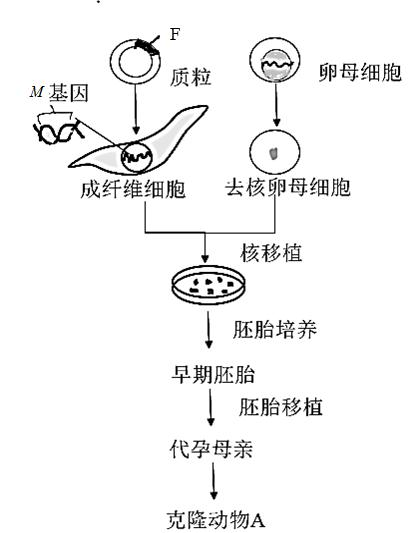

（1）在构建含有片段F的重组质粒过程中，切割质粒DNA的工具酶是\_\_\_\_\_\_\_\_\_，这类酶能将特定部位的两个核苷酸之间的\_\_\_\_\_\_\_\_\_断开。

（2）在无菌、无毒等适宜环境中进行动物A成纤维细胞的原代和传代培养时，需要定期更换培养液，目的是\_\_\_\_\_\_\_\_\_。

（3）与胚胎细胞核移植技术相比，体细胞核移植技术的成功率更低，原因是\_\_\_\_\_\_\_\_\_。从早期胚胎中分离获得的胚胎干细胞，在形态上表现为\_\_\_\_\_\_\_\_\_（答出两点即可），功能上具有\_\_\_\_\_\_\_\_\_。

（4）鉴定转基因动物：以免疫小鼠的\_\_\_\_\_\_\_\_\_淋巴细胞与骨髓瘤细胞进行融合，筛选融合杂种细胞，制备M蛋白的单克隆抗体。简要写出利用此抗体确定克隆动物A中*M* 基因是否失活的实验思路\_\_\_\_\_\_\_\_\_。

【答案】 (1). 限制性核酸内切酶（限制酶） (2). 磷酸二酯键 (3). 清除代谢产物，防止细胞代谢产物积累对细胞自身造成危害，同时给细胞提供足够的营养 (4). 动物胚胎细胞分化程度低，恢复其全能性相对容易，动物体细胞分化程度高，恢复其全能性十分困难 (5). 细胞体积小，细胞核大，核仁明显（任选两点作答） (6). 发育的全能性 (7). B (8). 取动物A和克隆动物A的肝组织细胞，分别提取蛋白质进行抗原—抗体杂交

【解析】

【分析】1、基因工程技术的基本步骤：

（1）目的基因的获取：方法有从基因文库中获取、利用PCR技术扩增和人工合成；

（2）基因表达载体的构建：是基因工程的核心步骤，基因表达载体包括目的基因、启动子、终止子和标记基因等；

（3）将目的基因导入受体细胞：根据受体细胞不同，导入的方法也不一样。将目的基因导入植物细胞的方法有农杆菌转化法、基因枪法和花粉管通道法；将目的基因导入动物细胞最有效的方法是显微注射法；将目的基因导入微生物细胞的方法是感受态细胞法；

（4）目的基因的检测与鉴定：分子水平上的检测：①检测转基因生物染色体的DNA是否插入目的基因--DNA分子杂交技术；②检测目的基因是否转录出了mRNA--分子杂交技术；③检测目的基因是否翻译成蛋白质--抗原-抗体杂交技术，个体水平上的鉴定：抗虫鉴定、抗病鉴定、活性鉴定等。

2、核移植：

（1）概念：将动物的一个细胞的细胞核移入一个已经去掉细胞核的卵母细胞中，使其重组并发育成一个新的胚胎，这个新的胚胎最终发育成动物个体。用核移植的方法得到的动物称为克隆动物；

（2）原理：动物细胞核的全能性；

（3）动物细胞核移植可分为胚胎细胞核移植和体细胞核移植。体细胞核移植的难度明显高于胚胎细胞核移植。原因：动物胚胎细胞分化程度低，恢复其全能性相对容易，动物体细胞分化程度高，恢复其全能性十分困难。

【详解】（1）基因工程中切割DNA的工具酶是限制性核酸内切酶（限制酶），故在构建含有片段F的重组质粒过程中，切割质粒DNA的工具酶是限制性核酸内切酶（限制酶）。限制性内切核酸内切酶是作用于其所识别序列中两个脱氧核苷酸之间的磷酸二酯键。不同的限制酶可以获得不同的末端，主要分为黏性末端和平末端。

（2）在无菌、无毒等适宜环境中进行动物A成纤维细胞的原代和传代培养时，需要定期更换培养液，目的是清除代谢产物，防止细胞代谢产物积累对细胞自身造成危害。

（3）由于动物胚胎细胞分化程度低，恢复其全能性相对容易，动物体细胞分化程度高，恢复其全能性十分困难，故与胚胎细胞核移植技术相比，体细胞核移植技术的成功率低。胚胎干细胞在形态上表现为细胞体积小，细胞核大，核仁明显；在功能上具有发育的全能性，可分化为成年动物体内任何一种组织细胞。另外，在体外培养的条件下，可以增殖而不发生分化，可进行冷冻保存，也可进行遗传改造。

（4）先给小鼠注射特定抗原使之发生免疫反应，之后从小鼠脾脏中获取已经免疫的B淋巴细胞；诱导B细胞和骨髓瘤细胞融合，利用选择培养基筛选出杂交瘤细胞，制备M蛋白的单克隆抗体；若要利用此抗体确定克隆动物A中M基因是否失活，如果M基因已经失活，则克隆动物A中无法产生M蛋白的单克隆抗体，则可利用抗原—抗体杂交技术进行检测。故实验思路为：取动物A和克隆动物A的肝组织细胞，分别提取蛋白质进行抗原—抗体杂交。

【点睛】本题结合图示考查基因工程、核移植、胚胎移植、单克隆抗体的相关知识，涉及知识点较多，但难度不大，要求考生掌握基础知识，属于考纲中识记与理解层次。
