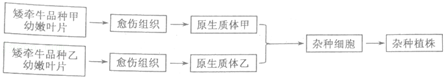
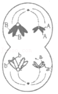
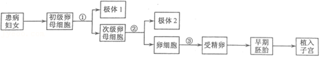
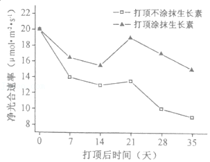
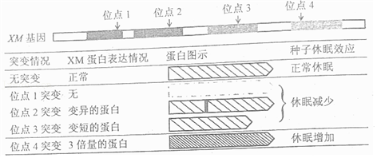
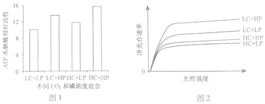
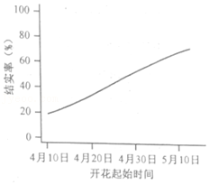
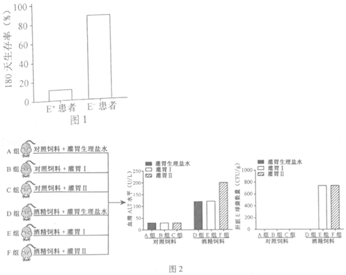
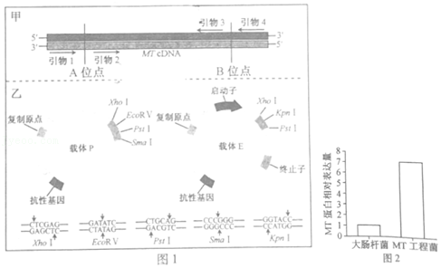

**2021年福建省新高考生物试卷**

**一、单项选择题：本题共16小题，其中，1～12小题，每题2分；13～16小题，每题4分，共40分。在每小题给出的四个选项中，只有一项是最符合题目要求的。**

1．（2分）下列关于蓝藻和菠菜的叙述，正确的是（　　）

A．光合色素的种类和功能都相同

B．细胞膜的成分都有脂质和蛋白质

C．DNA复制都需要线粒体提供能量

D．都能在光学显微镜下观察到叶绿体

2．（2分）下列关于健康人体中胰岛素调节血糖平衡的叙述，正确的是（　　）

A．胰岛素直接参与肝糖原的合成

B．血糖浓度上升时胰岛素的分泌减少

C．胰岛B细胞分泌胰岛素不需要消耗能量

D．胰岛素的形成过程需内质网和高尔基体加工

3．（2分）下列关于遗传信息的叙述，错误的是（　　）

A．亲代遗传信息的改变都能遗传给子代

B．流向DNA的遗传信息来自DNA或RNA

C．遗传信息的传递过程遵循碱基互补配对原则

D．DNA指纹技术运用了个体遗传信息的特异性

4．（2分）生物科学史蕴含科学研究的思路和方法，下列科学史实验与结论不相符的叙述是（　　）

| 选项  | 科学史实验                                 | 结论              |
|:---:|:-------------------------------------:|:---------------:|
| A   | 用伞形帽和菊花形帽伞藻进行嫁接和核移植实验                 | 伞藻的帽形建成主要与细胞核有关 |
| B   | 绿叶暗处理后，一半遮光，另一半曝光，碘蒸气处理后观察叶片颜色变化      | 淀粉是光合作用的产物      |
| C   | 用不同颜色荧光染料标记人和小鼠的细胞膜蛋白，进行细胞融合实验        | 细胞膜具有流动性        |
| D   | 将狗的小肠黏膜和稀盐酸混合磨碎后制成的提取液注入狗的静脉，检测胰液分泌情况 | 胰液分泌是神经调节的结果    |

A．A B．B C．C D．D

5．（2分）物种甲和物种乙为二倍体植物。甲生活在阳光充足的悬崖顶，乙生活在悬崖底的林荫里。在某些山地坡度和缓的地方，甲和乙分别沿着斜坡向下和向上扩展，在斜坡上相遇并杂交产生丙。若丙不能产生子代，则下列叙述错误的是（　　）

A．甲和乙仍然存在生殖隔离

B．甲种群基因频率的改变说明甲发生了进化

C．甲、乙向斜坡的扩展可能与环境变化有关

D．甲、乙、丙含有的基因共同构成一个种群的基因库

6．（2分）下列关于生态茶园管理措施的分析，错误的是（　　）

A．使用诱虫灯诱杀害虫，可减少农药的使用

B．套种豆科植物作为绿肥，可提高土壤肥力

C．利用茶树废枝栽培灵芝，可提高能量的传递效率

D．修剪茶树枝叶通风透光，可提高光合作用强度

7．（2分）下列关于“探究酵母菌细胞呼吸的方式”（实验Ⅰ）和“培养液中酵母菌种群数量的变化”（实验Ⅱ）的叙述，正确的是（　　）

A．实验Ⅰ、Ⅱ都要将实验结果转化为数学模型进行分析

B．实验Ⅰ、Ⅱ通气前都必须用NaOH去除空气中的CO2

C．实验Ⅰ中，有氧组和无氧组都能使澄清石灰水变浑浊

D．实验Ⅱ中，可用滤纸在盖玻片另一侧吸引培养液进入计数室

8．（2分）我国古诗词蕴含着丰富的生物学道理。下列相关叙述，错误的是（　　）

A．“更无柳絮因风起，惟有葵花向日倾”可体现植物的向光性

B．“螟蛉有子，蜾赢负之”可体现生物之间存在种间互助的关系

C．“独怜幽草涧边生，上有黄鹂深树鸣”可体现生物对环境的适应

D．“茂林之下无丰草，大块之间无美苗”可体现光照对植物生长的影响

9．（2分）运动可促进机体产生更多新的线粒体，加速受损、衰老、非功能线粒体的特异性消化降解，维持线粒体数量、质量及功能的完整性，保证运动刺激后机体不同部位对能量的需求。下列相关叙述正确的是（　　）

A．葡萄糖在线粒体中分解释放大量能量

B．.细胞中不同线粒体的呼吸作用强度均相同

C．.衰老线粒体被消化降解导致正常细胞受损

D．.运动后线粒体的动态变化体现了机体稳态的调节

10．（2分）生境破碎指因人类活动等因素导致生物的生存环境被隔断成碎片。隔断后的碎片称为生境碎片。为研究生境破碎对濒危植物景东翅子树种群数量的影响，2019年科研人员对某地不同类型生境碎片进行了相关调查，设置的样地总面积均为15000m2，调查结果如下表所示。

<table style="width:97%;">
<colgroup>
<col style="width: 7%" />
<col style="width: 22%" />
<col style="width: 22%" />
<col style="width: 22%" />
<col style="width: 22%" />
</colgroup>
<thead>
<tr>
<th rowspan="2" style="text-align: center;">生境碎片类型</th>
<th colspan="4" style="text-align: center;">植株数（株）</th>
</tr>
<tr>
<th style="text-align: center;">幼树</th>
<th style="text-align: center;">小树</th>
<th style="text-align: center;">成树</th>
<th style="text-align: center;">合计</th>
</tr>
</thead>
<tbody>
<tr>
<td style="text-align: center;">5公顷碎片</td>
<td style="text-align: center;">21</td>
<td style="text-align: center;">9</td>
<td style="text-align: center;">3</td>
<td style="text-align: center;">33</td>
</tr>
<tr>
<td style="text-align: center;">15公顷碎片</td>
<td style="text-align: center;">57</td>
<td style="text-align: center;">8</td>
<td style="text-align: center;">17</td>
<td style="text-align: center;">82</td>
</tr>
<tr>
<td style="text-align: center;">连续森林</td>
<td style="text-align: center;">39</td>
<td style="text-align: center;">22</td>
<td style="text-align: center;">26</td>
<td style="text-align: center;">87</td>
</tr>
</tbody>
</table>

> 下列叙述错误的是（　　）

A．15000m2应是设置的多块调查样地面积之和

B．生境碎片的面积与其维持的种群数量呈正相关

C．生境破碎有利于景东翅子树种群的生存和发展

D．不同树龄植株的数量比例反映该种群的年龄组成

11．（2分）科研人员利用植物体细胞杂交技术培育矮牵牛新品种，技术流程示意图如图。下列叙述正确的是（　　）

> 

A．愈伤组织是幼嫩叶片通过细胞分化形成的

B．获得的杂种植株都能表现双亲的优良性状

C．可用聚乙二醇诱导原生质体甲和乙的融合和细胞壁再生

D．用纤维素酶和果胶酶处理愈伤组织以获得原生质体

12．（2分）有同学用下列示意图表示某两栖类动物（基因型为AaBb）卵巢正常的细胞分裂可能产生的细胞，其中正确的是（　　）

A． B．

C． D．

13．（4分）一位患有单基因显性遗传病的妇女（其父亲与丈夫表现型正常）想生育一个健康的孩子。医生建议对极体进行基因分析，筛选出不含该致病基因的卵细胞，采用试管婴儿技术辅助生育后代，技术流程示意图如图，下列叙述正确的是（　　）

> 

A．可判断该致病基因位于X染色体上

B．可选择极体1或极体2用于基因分析

C．自然生育患该病子女的概率是25%

D．在获能溶液中精子入卵的时期是③

14．（4分）烟草是以叶片为产品的经济作物。当烟草长出足够叶片时，打顶（摘去顶部花蕾）是常规田间管理措施，但打顶后侧芽会萌动生长，消耗营养，需要多次人工抹芽（摘除侧芽）以提高上部叶片的质量，该措施费时费力。可以采取打顶后涂抹生长素的方法替代人工抹芽。科研人员探究打顶后涂抹生长素对烟草上部叶片生长的影响，实验结果如图所示。下列分析错误的是（　　）

> 

A．打顶后涂抹的生长素进入烟草后，可向下运输

B．打顶后的抹芽措施不利于营养物质向上部叶片转

C．打顶涂抹生长素能建立人工顶端优势抑制侧芽萌发

D．打顶后涂抹生长素与不涂抹相比，能增强上部叶片净光合速率

> 15．（4分）IFN-I是机体被病毒感染后产生的一类干扰素，具有广谱抗病毒活性，已被用于乙型肝炎的治疗。研究人员对新冠患者的病情与IFN-I的相关性进行了3项独立的研究，结果如下。\
> 研究①：危重症患者的血清中检测不到或仅有微量IFN-I，轻症患者血清中能检测到IFN-I。\
> 研究②：10.2%的危重症患者体内检测到抗IFN-I的抗体，血清中检测不到IFN-I。轻症患者血清中未检测到该种抗体，血清中检测到IFN-I。\
> 研究③：3.5%危重症患者存在IFN-I合成的相关基因缺陷，血清中检测不到IFN-I。
> 
> 下列相关叙述错误的是（　　）

A．研究②中10.2%的危重症患者不能用IFN﹣I治疗

B．研究③中3.5%的危重症患者同时还患有自身免疫病

C．部分危重症患者的生理指标之一是血清中缺乏IFN﹣I

D．结果提示测定血清中的IFN﹣I含量有助于对症治疗新冠患者

16．（4分）水稻等作物在即将成熟时，若经历持续的干热之后又遇大雨天气，穗上的种子就容易解除休眠而萌发。脱落酸有促进种子休眠的作用，同等条件下，种子对脱落酸越敏感，越容易休眠。研究发现，XM基因表达的蛋白发生变化会影响种子对脱落酸的敏感性。XM基因上不同位置的突变影响其蛋白表达的情况和产生的种子休眠效应如图所示。下列分析错误的是（　　）

> 

A．位点1突变会使种子对脱落酸的敏感性降低

B．位点2突变可以是碱基对发生替换造成的

C．可判断位点3突变使XM基因的转录过程提前终止

D．位点4突变的植株较少发生雨后穗上发芽的现象

**二、非选择题：本题共5小题，共60分。**

17．（12分）大气中浓度持续升高的CO2会导致海水酸化，影响海洋藻类生长，进而影响海洋生态。龙须菜是我国重要的一种海洋大型经济藻类，生长速度快，一年可多次种植和收获。科研人员设置不同CO2浓度（大气CO2浓度LC和高CO2浓度HC）和磷浓度（低磷浓度LP和高磷浓度HP）的实验组合进行相关实验，结果如图所示。

> 
> 
> 回答下列问题：
> 
> （1）本实验的目的是探究在一定光照强度下，<u>　 　</u>。
> 
> （2）ATP水解酶的主要功能是 <u>　 　</u>。ATP水解酶活性可通过测定 <u>　 　</u>表示。
> 
> （3）由图1、2可知，在较强的光照强度下，HC+HP处理比LC+HP处理的龙须菜净光合速率低，推测原因是在酸化环境中，龙须菜维持细胞酸碱度的稳态需要吸收更多的矿质元素，因而细胞 <u>　 　</u>增强，导致有机物消耗增加。
> 
> （4）由图2可知，大气CO2条件下，高磷浓度能 <u>　 　</u>龙龙须菜的净光合速率。磷等矿质元素的大量排放导致了某海域海水富营养化，有人提出可以在该海域种植龙须菜。结合以上研究结果，从经济效益和环境保护的角度分析种植龙须菜的理由是 <u>　 　</u>。

18．（10分）一般情况下，植物开花时间与传粉动物的活跃期会相互重叠和匹配。全球气候变化可能对植物开花时间或传粉动物活跃期产生影响，导致原本时间上匹配关系发生改变，称为物候错配。物候错配会影响植物的传粉和结实，可引起粮食减产，甚至发生生态安全问题。生产上，为了减轻物候错配造成的影响，常通过人工授粉提高产量。回答下列问题：

> （1）光和温度属于生态系统信息传递中的 <u>　 　</u>信息。
> 
> （2）延胡索是一种依靠熊蜂传粉的早春短命药用植物。全球气温升高会使延胡索提前开花。科研人员监测了延胡索开花起始时间并统计结实率（如图），监测数据表明 <u>　 　</u>。从物候错配的角度分析延胡索结实率降低的原因是 <u>　 　</u>。
> 
> （3）为进一步验证物候错配会影响延胡索的传粉和结实。科研人员在物候错配的区域设置同等条件的A和B两个样地。其中，A样地中的延胡索保持自然状态生长；B样地中的延胡索则进行 <u>　 　</u>，分别统计两样地延胡索的结实率。支持“物候错配会造成延胡索自然结实率降低”观点的实验结果为 <u>　 　</u>。
> 
> 

19．（13分）某一年生植物甲和乙是具有不同优良性状的品种，单个品种种植时均正常生长。欲获得兼具甲乙优良性状的品种，科研人员进行杂交实验，发现部分F1植株在幼苗期死亡。已知该植物致死性状由非同源染色体上的两对等位基因（A/a和B/b）控制，品种甲基因型为aaBB，品种乙基因型为\_ \_bb。回答下列问题：

> （1）品种甲和乙杂交，获得优良性状F1的育种原理是 <u>　 　</u>。
> 
> （2）为研究部分F1植株致死的原因，科研人员随机选择10株乙，在自交留种的同时，单株作为父本分别与甲杂交，统计每个杂交组合所产生的F1表现型，只出现两种情况，如下表所示。

<table style="width:85%;">
<colgroup>
<col style="width: 25%" />
<col style="width: 23%" />
<col style="width: 36%" />
</colgroup>
<thead>
<tr>
<th style="text-align: center;">甲（母本）</th>
<th style="text-align: center;">乙（父本）</th>
<th style="text-align: center;">F1</th>
</tr>
</thead>
<tbody>
<tr>
<td rowspan="2" style="text-align: center;">aaBB</td>
<td style="text-align: center;">乙﹣1</td>
<td style="text-align: center;">幼苗期全部死亡</td>
</tr>
<tr>
<td style="text-align: center;">乙﹣2</td>
<td style="text-align: center;">幼苗死亡：成活＝1：1</td>
</tr>
</tbody>
</table>

> ①该植物的花是两性花，上述杂交实验，在授粉前需要对甲采取的操作是 <u>　 　</u>、<u>　 　</u>。
> 
> ②根据实验结果推测，部分F1植株死亡的原因有两种可能性：其一，基因型为A_B_的植株致死；其二<u>　 　</u>的植株致死。
> 
> ③进一步研究确认，基因型为A_B_的植株致死，则乙﹣1的基因型为 <u>　 　</u>。
> 
> （3）要获得全部成活且兼具甲乙优良性状的F1杂种，可选择亲本组合为：品种甲（aaBB）和基因型为 <u>　 　</u>的品种乙，该品种乙选育过程如下：
> 
> 第一步：种植品种甲作为亲本。
> 
> 第二步：将乙﹣2自交收获的种子种植后作为亲本，然后 <u>　 　</u>，统计每个杂交组合所产生的F1表现型。
> 
> 选育结果：若某个杂交组合产生的F1全部成活，则 <u>　 　</u>的种子符合选育要求。

20．（13分）长期酗酒会使肠道E球菌大量滋生，影响肠道菌群的组成，同时还会增加肠道壁的通透性，导致肠道细菌及其产物向肝脏转移，引起肝脏炎症。根据能否分泌外毒C（一种蛋白质毒素），可将E球菌分为E+（分泌外毒素C）和E﹣（不分泌外毒素C）。回答下列问题：

> 
> 
> （1）科研人员对携带E+和E﹣球菌的酒精性肝炎临床重症患者的生存率进行统计，结果如图1所示。推测外毒素C <u>　 　</u>（填“会”或“不会”）加重酒精性肝炎病情。
> 
> （2）为进一步探究外毒素C与酒精性肝炎的关系，科研人员进行了相关实验。
> 
> Ⅰ..体外实验：将分离培养的无菌小鼠肝脏细胞等分为A、B两组。在A组的培养液中加入外毒素C，B组的培养液中加入等量的生理盐水，培养相同时间后，检测肝脏细胞的存活率。若实验结果为<u>　 　</u>，则可以推测外毒素C对体外培养的小鼠肝脏细胞具有毒性作用。
> 
> Ⅱ.体内实验：将无菌小鼠分为6组进行相关实验，检测小鼠血清中谷丙转氨酶（ALT）的水平（ALT水平越高，肝脏损伤越严重）及统计肝脏E球菌的数量。实验分组和结果如图2所示。
> 
> ①结果表明外毒素C能加重实验小鼠酒精性肝炎症状，灌胃Ⅰ和Ⅱ的实验材料分别选用 <u>　 　</u>和 <u>　 　</u>。
> 
> A.生理盐水
> 
> B.E+菌液
> 
> C.E﹣菌液
> 
> D.灭活的E+菌液
> 
> E.灭活的E﹣菌液
> 
> ②根据图2结果，外毒素C <u>　 　</u>（填“会”或“不会”）影响实验小鼠肠道壁通透性，判断依据是 <u>　 　</u>。
> 
> （3）目前尚无治疗酒精性肝炎的特效药。在上述研究的基础上，科研人员还利用专门寄生于E球菌的噬菌体有效治疗了酒精性肝炎模型小鼠，该实验的研究意义是 <u>　 　</u>。
> 
> 21．（12分）微生物吸附是重金属废水的处理方法之一。金属硫蛋白（MT）是一类广泛存在于动植物中的金属结合蛋白，具有吸附重金属的作用。科研人员将枣树的MT基因导入大肠杆菌构建工程菌。回答下列问题：\
> （1）根据枣树的MT cDNA的核苷酸序列设计了相应的引物（图1甲），通过PCR扩增MT基因。已知A位点和B位点分别是起始密码子和终止密码子对应的基因位置。选用的引物组合应为 <u>　 　</u>。
> 
> 
> 
> （2）本实验中，PCR所用的DNA聚合酶扩增出的MT基因的末端为平末端。由于载体E只有能产生黏性末端的酶切位点，需借助中间载体P将MT基因接入载体E。载体P和载体E的酶切位点及相应的酶切序列如图1乙所示。①选用 <u>　 　</u>酶将载体P切开，再用 <u>　 　</u>（填“T4DNA或“E•coli DNA”）连接酶将MT基因与载体P相连，构成重组载体P′。
> 
> ②载体P′不具有表达MT基因的 <u>　 　</u>和 <u>　 　</u>。选用 <u>　 　</u>酶组合对载体P′和载体E进行酶切，将切下的MT基因和载体E用DA连接酶进行连接，将得到的混合物导入到用 <u>　 　</u>离子处理的大肠杆菌，筛出MT工程菌。
> 
> （3）MT基因在工程菌的表达量如图2所示。该结果仍无法说明已经成功构建能较强吸附废水中重金属的MT工程菌，理由是 <u>　 　</u>。
