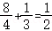

**2021年福建省新高考生物试卷**

**参考答案与试题解析**

**一、单项选择题：本题共16小题，其中，1～12小题，每题2分；13～16小题，每题4分，共40分。在每小题给出的四个选项中，只有一项是最符合题目要求的。**

1．【解答】解：A、蓝藻含有藻蓝素而菠菜无藻蓝素，A错误；

> B、蓝藻和菠菜细胞膜的成分都有脂质和蛋白质；
> 
> C、蓝藻是原核生物，C错误；
> 
> D、蓝藻是原核生物，D错误。
> 
> 故选：B。

2．【解答】解：A、胰岛素只能传递调节代谢的信息，A错误；

> B、血糖浓度上升时胰岛素的分泌增加；
> 
> C、胰岛B细胞分泌胰岛素的方式是胞吐，C错误；
> 
> D、胰岛素属于分泌蛋白，D正确。
> 
> 故选：D。

3．【解答】解：A、亲代遗传信息的改变不一定都能遗传给子代，A错误；

> B、流向DNA的遗传信息来自DNA（复制）或RNA（逆转录）；
> 
> C、遗传信息的传递过程中遵循碱基互补配对原则；
> 
> D、DNA指纹技术能用来鉴定个人身份，即特定的碱基排列顺序。
> 
> 故选：A。

4．【解答】解：A、用伞形帽和菊花形帽伞藻进行嫁接和核移植实验，A正确；

> B、绿叶暗处理后，另一半曝光，证明淀粉是光合作用的产物；
> 
> C、用不同颜色荧光染料标记人和小鼠的细胞膜蛋白，证明细胞膜具有流动性；
> 
> D、斯他林和贝利斯将狗的小肠黏膜与稀盐酸混合磨碎，注入狗的静脉中，D错误。
> 
> 故选：D。

5．【解答】解：A、甲和乙杂交产生丙，说明甲和乙仍然存在生殖隔离；

> B、生物进化的实质在于种群基因频率的改变，B正确；
> 
> C、甲、乙向斜坡的扩展可能与环境变化有关；
> 
> D、甲、乙、丙不是一个物种，D错误。
> 
> 故选：D。

6．【解答】解：A、用黑光灯诱杀害虫属于生物防治，降低环境污染；

> B、豆科植物的根部常有根瘤菌生长2）转变为含氮的养料，可提高土壤肥力；
> 
> C、利用茶树废枝栽培灵芝，不能提高能量的传递效率；
> 
> D、修剪茶树枝叶通风透光，可提高光合作用强度。
> 
> 故选：C。

7．【解答】解：A、实验Ⅰ不需要将实验结果转化为数学模型进行分析；

> B、探究酵母菌细胞呼吸的方式实验中，B错误；
> 
> C、实验Ⅰ中，因此都能使澄清石灰水变浑浊；
> 
> D、实验Ⅱ中，让培养液自行渗入计数室。
> 
> 故选：C。

8．【解答】解：A、“更无柳絮因风起，“葵花向日倾”可体现植物向日葵的向光性，A正确；

> B、螟蛉是一种绿色小虫。蜾蠃常捕捉瞑蛉放在窝里，卵孵化后以螟蛉为食，蜾蠃负之”体现的种间关系是捕食；
> 
> C、“独怜幽草涧边生、“黄鹂”等各有不同的生存环境，C正确；
> 
> D、“茂林之下无丰草，说明在茂林之下草木生长不利，充分说明光照对植物生长的影响。
> 
> 故选：B。

9．【解答】解：A、线粒体不能直接利用葡萄糖，丙酮酸在线粒体中被彻底氧化分解，A错误；

> B、结合题意“运动可促进机体产生更多新的线粒体……保证运动刺激后机体不同部位对能量的需求”可知，则线粒体的呼吸强度也不相同；
> 
> C、结合题意可知、衰老，有利于维持线粒体数量，不会导致正常细胞受损；
> 
> D、内环境的稳态体现在内环境的每一种成分和理化性质都处于动态平衡中；加速受损、非功能线粒体的特异性消化降解）是机体稳态调节的结果。
> 
> 故选：D。

10．【解答】解：A、结合题意可知，设置的样地总面积均为15000m2，故15000m2应是设置的多块调查样地面积之和，A正确；

> BC、据表格数据可知、15公顷碎片和连续森林的景东翅子树种群数量分别为33，故生境碎片的面积与其维持的种群数量呈正相关，B正确；
> 
> D、年龄组成是指一个种群中各年龄期个体数目的比例、小树和成树）的数量比例反映该种群的年龄组成。
> 
> 故选：C。

11．【解答】解：A、愈伤组织是幼嫩叶片通过细胞脱分化形成的；

> B、由于基因的选择性表达和基因间的互作效应，B错误；
> 
> C、可用聚乙二醇诱导原生质体甲和乙的融合，C错误；
> 
> D、由于植物细胞壁的成分主要是纤维素和果胶，D正确。
> 
> 故选：D。

12．【解答】解：A、图示细胞着丝点分裂，且细胞质不均等分裂，A正确；

> B、图示细胞中含有同源染色体，应处于减数第一次分裂后期，与图示a和B，B错误；
> 
> C、图示细胞处于减数第一次分裂后期，与题图不符；
> 
> D、图示细胞着丝点分裂，细胞质不均等分裂，D错误。
> 
> 故选：A。

13．【解答】解：A、由题意可知，该显性致病基因可以常染色体上，A错误；

> B、卵原细胞减数第一次分裂中同源染色体分离，最终产生一个次级卵母细胞和一个第一极体，次级卵母细胞减数第二次分裂着丝粒分裂，其上基因也随之分离，二者基因相同，而极体最后退化消失，B正确；
> 
> C、若显性致病基因用A表示，则患病妇女基因型为Aa，基因型为aa，若显性致病基因位于X染色体上AXa，丈夫的基因型为XaY，自然生育患该病子女（XAXa、XAY）的概率是，C错误；
> 
> D、在获能溶液中精子入卵（次级卵母细胞）的时期是②。
> 
> 故选：B。

14．【解答】解：A、生长素的运输方向是从形态学上端到形态学下端，因此打顶后涂抹的生长素进入烟草后，A正确；

> B、由题意可知，因此该措施利于营养物质向上部叶片转运；
> 
> C、由题意可知，相当于建立人工顶端优势抑制侧芽萌发；
> 
> D、由题意和图示可知，能增强上部叶片净光合速率。
> 
> 故选：B。

15．【解答】解：A、由题意可知，血清中检测不到IFN﹣Ⅰ，A正确；

> B、由题意可知，不能合成IFN﹣Ⅰ，B错误；
> 
> C、由研究①可知，所以部分危重症患者的生理指标之一是血清中缺乏IFN﹣Ⅰ；
> 
> D、由研究①可知，所以提示测定血清中的IFN﹣Ⅰ含量有助于对症治疗新冠患者。
> 
> 故选：B。

16．【解答】解：A、种子正常休眠，而位点1突变则无XM蛋白产生，可推测脱落酸作用减弱，A正确；

> B、比较表中位点2突变和无突变表达的蛋白质图示，只是中间有一小段氨基酸序列不同，B正确；
> 
> C、比较表中位点7突变和无突变表达的蛋白质图示，可推测模板mRNA上的终止密码提前，C错误；
> 
> D、位点4突变是XM蛋白的表达倍增，雨后穗上的种子不易解除休眠而萌发。
> 
> 故选：C。

**二、非选择题：本题共5小题，共60分。**

17．【解答】解：（1）结合分析可知，本实验目的是探究在一定光照强度下2浓度和磷浓度对龙须菜ATP水解酶活性和净光合速率的影响。

> （2）酶具有专一性，ATP水解酶的主要功能是催化ATP水解，由于ATP的水解产物是ADP和Pi。
> 
> （3）净光合速率＝总光合速率﹣呼吸速率，由图1，在较强的光照强度下，推测原因是在酸化环境中，矿质元素的吸收需要能量，导致有机物消耗增加。
> 
> （4）由图8可知，大气CO2条件（LC组）下，HP组（高磷浓度）的净光合速率＞LP组（低磷浓度）；结合以上研究结果，收获经济效益的同时，保护海洋生态。
> 
> 故答案为：
> 
> （1）不同CO2浓度和磷浓度对龙须菜ATP水解酶活性和净光合速率的影响
> 
> （2）催化ATP水解 单位时间磷酸的生成量或单位时间ADP的生成量或单位时间ATP的消耗量
> 
> （3）呼吸作用
> 
> （4）提高 龙须菜在高磷条件下能快速生长，能降低海水中的磷等矿质元素的浓度

18．【解答】解：（1）光、温度。

> （2）由曲线可知，时间越早。其原因可能是延胡索提前开花，使熊蜂传粉受影响。
> 
> （3）在物候错配的区域设置同等条件的A和B两个样地。其中；B样地中的延胡索进行人工授粉。若物候错配会影响延胡索的传粉和结实。
> 
> 故答案为：
> 
> （1）物理
> 
> （2）时间越早，结实率越低 ，导致开花时间与熊蜂活跃期重叠时间减少，结实率降低
> 
> （3）人工授粉 A样地结实率低于B样地

19．【解答】解：（1）品种甲和乙杂交，可以集合两个亲本的优良性状，原理是基因重组。

> （2）①该植物的花是两性花，为避免自花授粉和其它花粉干扰，在授粉前需要对甲采取的操作是去雄和套袋处理，品种甲基因型为aaBB，又因为单个品种种植时均正常生长、Aabb，则与aaBB杂交后F1基因型为AaBb或aaBb，进一步可推测部分F1植株致死的基因型为AaBb或aaBb。③若进一步研究确认致死基因型为A_B\_，子代AaBb全部死亡。
> 
> （3）由于A﹣B﹣的个体全部死亡，故不能选择AAbb类型与甲杂交6杂种，可选择亲本组合为：品种甲（aaBB）和基因型为aabb的纯合品种乙杂交
> 
> 第一步：种植品种甲（aaBB）作为亲本；
> 
> 第二步：将乙﹣2（Aabb）自交收获的种子种植后作为亲本，然后用这些植株自交留种（保留aabb种子）的同时，统计每个杂交组合所产生的F1表现型。
> 
> 第三步：若某个杂交组合产生的F3全部成活，则证明该父本基因型为aabb，可保留制种。
> 
> 故答案为：
> 
> （1）基因重组
> 
> （2）去雄 套袋 AAbb
> 
> （3）aabb 用这些植株自交留种的同时 对应父本乙自交收获

20．【解答】解：（1）据题图可知，E+患者的180天生存率显著低于E﹣患者，而E+可以分泌外毒素C，故推测外毒素C会加重酒精性肝炎病情。

> （2）I.体外实验将分离培养的无菌小鼠肝脏细胞等分为A、B两组，在A组的培养液中加入外毒素C，若外毒素C对体外培养的小鼠肝脏细胞具有毒性作用。
> 
> II.①体内实验中检测指标为血清中谷丙转氨酶（ALT）的水平，实验设计应遵循对照与单一变量原则，故应选择E球菌进行实验+和E﹣，结合实验设计的单一变量原则及实验结果中F组的ALT水平最高可知，灌胃I和Ⅱ的实验材料分别选用E﹣菌液和E+菌液。
> 
> ②若外毒素C能影响小鼠肠道壁通透性，则E球菌数量会有差异，E和F组小鼠肝脏的E球菌数量基本相同。
> 
> （3）由于目前尚无治疗酒精性肝炎的特效药，而用噬菌体疗法有效治疗了小鼠酒精性肝炎。
> 
> 故答案为：
> 
> （1）会
> 
> （2）A组的肝脏细胞存活率低于B组 C 不会
> 
> （3）用噬菌体疗法有效治疗了小鼠酒精性肝炎，可为人类治疗酒精性肝炎提供一种新思路

21．【解答】解；（1）密码子位于mRNA上，起始密码子分别控制翻译的开始和结束，一对引物应分别位于位点A和位点B的两侧。

> （2）①为得到平末端，可用EcoRV酶将载体P切开，而T4DNA连接酶可以连接平末端，结合题意可知，故需要用T4DNA连接酶将MT基因与载体P相连，构成重组载体P′。
> 
> ②载体P′是重组质粒，故不含有有表达MT基因的启动子和终止子，可选用两种酶切割两种载体，载体P′和载体E均含有XhoI和PstI酶；将目的基因导入大肠杆菌的方法是钙离子处理法。
> 
> （3）由于尚未在个体生物学水平上对MT工程菌吸附重金属的能力进行鉴定，故即使MT工程菌的MT蛋白相对含量较高。
> 
> 故答案为：
> 
> （1）引物6和引物4
> 
> （2）EcoRV T4DNA 启动子 XhoI和PstI 钙
> 
> （3）尚未在个体生物学水平上对MT工程菌吸附重金属的能力进行鉴定
