**生物学**

**一、选择题：**

1\. 蛋白质是生命活动的主要承担者。下列有关叙述错误的是（　　）

A. 叶绿体中存在催化ATP合成的蛋白质

B. 胰岛B细胞能分泌调节血糖的蛋白质

C. 唾液腺细胞能分泌水解淀粉的蛋白质

D. 线粒体膜上存在运输葡萄糖的蛋白质

2\. 植物工厂是通过光调控和通风控温等措施进行精细管理高效农业生产系统，常采用无土栽培技术。下列有关叙述错误的是（　　）

A. 可根据植物生长特点调控光的波长和光照强度

B. 应保持培养液与植物根部细胞的细胞液浓度相同

C. 合理控制昼夜温差有利于提高作物产量

D. 适时通风可提高生产系统内的CO2浓度

3\. 下列有关病毒在生物学和医学领域应用的叙述，错误的是（　　）

A. 灭活的病毒可用于诱导动物细胞融合

B. 用特定的病毒免疫小鼠可制备单克隆抗体

C. 基因工程中常用噬菌体转化植物细胞

D. 经灭活或减毒处理的病毒可用于免疫预防

4\. 下列有关细胞内的DNA及其复制过程的叙述，正确的是（　　）

A. 子链延伸时游离的脱氧核苷酸添加到3′端

B. 子链的合成过程不需要引物参与

C. DNA每条链的5′端是羟基末端

D. DNA聚合酶的作用是打开DNA双链

5\. 下列有关中学生物学实验中观察指标的描述，正确的是（　　）

|     |                |                  |
|:---:|:--------------:|:----------------:|
| 选项  | 实验名称           | 观察指标             |
| A   | 探究植物细胞的吸水和失水   | 细胞壁的位置变化         |
| B   | 绿叶中色素的提取和分离    | 滤纸条上色素带的颜色、次序和宽窄 |
| C   | 探究酵母菌细胞呼吸的方式   | 酵母菌培养液的浑浊程度      |
| D   | 观察根尖分生组织细胞有丝分裂 | 纺锤丝牵引染色体的运动      |

A. A B. B C. C D. D

6\. 科研人员发现，运动能促进骨骼肌细胞合成FDC5蛋白，该蛋白经蛋白酶切割，产生的有活性的片段被称为鸢尾素。鸢尾素作用于白色脂肪细胞，使细胞中线粒体增多，能量代谢加快。下列有关叙述错误的是（　　）

A. 脂肪细胞中的脂肪可被苏丹Ⅲ染液染色

B. 鸢尾素在体内的运输离不开内环境

C. 蛋白酶催化了鸢尾素中肽键的形成

D. 更多的线粒体利于脂肪等有机物的消耗

7\. 下表为几种常用的植物生长调节剂，下列有关其应用的叙述错误的是（　　）

|                  |          |
|:----------------:|:--------:|
| 名称               | 属性       |
| 萘乙酸              | 生长素类     |
| 6-BA             | 细胞分裂素类   |
| 乙烯利              | 乙烯类      |
| PP333 | 赤霉素合成抑制剂 |

A. 用一定浓度的萘乙酸处理离体的花卉枝条，可促进生根

B. 用一定浓度的6-BA抑制马铃薯发芽，以延长贮藏期

C. 用乙烯利处理棉花可催熟棉桃，便于统一采摘

D. 用PP333处理水稻可使植株矮化，增强抗倒伏能力

8\. 利用菠萝蜜制作果醋的大致流程为：先在灭菌的果肉匀浆中接种酵母菌，发酵6天后，再接入活化的醋酸杆菌，发酵5天。下列有关叙述错误的是（　　）

A. 乙醇既是醋酸发酵的底物，又可以抑制杂菌繁殖

B. 酵母菌和醋酸杆菌均以有丝分裂的方式进行增殖

C. 酵母菌和醋酸杆菌发酵过程中控制通气的情况不同

D. 接入醋酸杆菌后，应适当升高发酵温度

9\. 被子植物的无融合生殖是指卵细胞、助细胞和珠心胞等直接发育成胚的现象。助细胞与卵细胞染色体组成相同，珠心细胞是植物的体细胞。下列有关某二倍体被子植物无融合生殖的叙述，错误的是（　　）

A. 由无融合生殖产生的植株有的是高度不育的

B. 由卵细胞直接发育成完整个体体现了植物细胞的全能性

C. 由助细胞无融合生殖产生的个体保持了亲本的全部遗传特性

D. 由珠心细胞无融合生殖产生的植株体细胞中有两个染色体组

10\. 下图表示人体过敏反应发生的基本过程。下列有关叙述正确的是（　　）

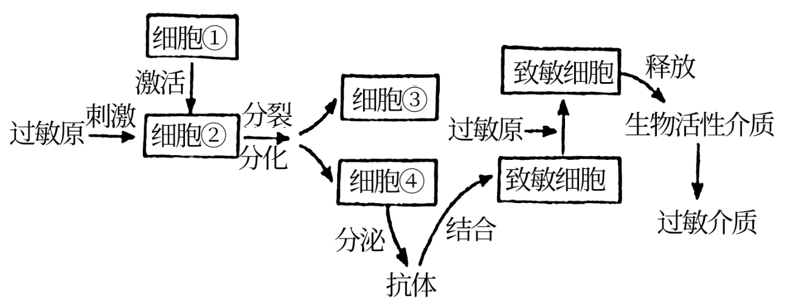

A. 图中包含细胞免疫过程和体液免疫过程

B. 细胞①和细胞②分别在骨髓和胸腺中成熟

C. 细胞③和细胞④分别指浆细胞和记忆细胞

D. 用药物抑制致敏细胞释放生物活性介质可缓解过敏症状

11\. 辽河流域是辽宁省重要的生态屏障和经济地带。为恢复辽河某段“水体——河岸带”的生物群落，研究人员选择辽河流域常见的植物进行栽种。植物种类、分布及叶片或茎的横切面见下图。下列有关叙述错误的是（　　）

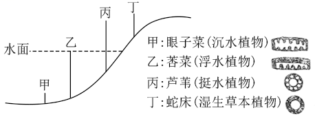

注：右侧为对应植物叶片或茎的横切面示意图，空白处示气腔

A. 丙与丁的分布体现了群落的垂直结构

B. 四种植物都有发达的气腔，利于根系的呼吸，体现出生物对环境的适应

C. 不同位置上植物种类的选择，遵循了协调与平衡原理

D. 生态恢复工程使该生态系统的营养结构更复杂，抵抗力稳定性增强

12\. 基因型为AaBb的雄性果蝇，体内一个精原细胞进行有丝分裂时，一对同源染色体在染色体复制后彼此配对，非姐妹染色单体进行了交换，结果如右图所示。该精原细胞此次有丝分裂产生的子细胞，均进入减数分裂，若此过程中未发生任何变异，则减数第一次分裂产生的子细胞中，基因组成为AAbb的细胞所占的比例是（　　）

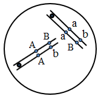

A. 1/2 B. 1/4 C. 1/8 D. 1/16

13\. 下图是利用体细胞核移植技术克隆优质奶牛的简易流程图，有关叙述正确的是（　　）

A. 后代丁的遗传性状由甲和丙的遗传物质共同决定

B. 过程①需要提供95%空气和5%CO2的混合气体

C. 过程②常使用显微操作去核法对受精卵进行处理

D. 过程③将激活后重组细胞培养至原肠胚后移植

14\. 腈水合酶（N0）广泛应用于环境保护和医药原料生产等领域，但不耐高温。利用蛋白质工程技术在N0的α和β亚基之间加入一段连接肽，可获得热稳定的融合型腈水合酶（N1）。下列有关叙述错误的是（　　）

A. N1与N0氨基酸序列的差异是影响其热稳定性的原因之一

B. 加入连接肽需要通过改造基因实现

C. 获得N1的过程需要进行转录和翻译

D. 检测N1的活性时先将N1与底物充分混合，再置于高温环境

15\. 辽宁省盘锦市的蛤蜊岗是由河流入海冲积而成的具有潮间带特征的水下钱滩，也是我国北方地区滩涂贝类的重要产地之一，其中的底栖动物在物质循环和能量流动中具有重要作用。科研人员利用样方法对底栖动物的物种丰富度进行了调查结果表明该地底栖动物主要包括滤食性的双壳类、碎屑食性的多毛类和肉食性的虾蟹类等。下列有关叙述正确的是（　　）

A. 本次调查的采样地点应选择底栖动物集中分布的区域

B. 底栖动物中既有消费者，又有分解者

C. 蛤蜊岗所有的底栖动物构成了一个生物群落

D. 蛤蜊岗生物多样性的直接价值大于间接价值

**二、选择题：**

16\. 短期记忆与脑内海马区神经元的环状联系有关，如图表示相关结构。信息在环路中循环运行，使神经元活动的时间延长。下列有关此过程的叙述错误的是（　　）

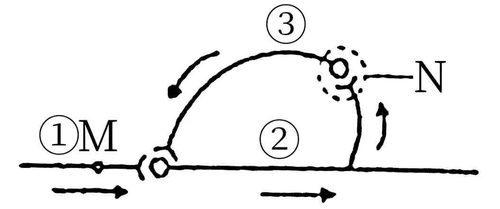

A. 兴奋在环路中的传递顺序是①→②→③→①

B. M处的膜电位为外负内正时，膜外的Na+浓度高于膜内

C. N处突触前膜释放抑制性神经递质

D. 神经递质与相应受体结合后，进入突触后膜内发挥作用

17\. 脱氧核酶是人工合成的具有催化活性的单链DNA分子。下图为10-23型脱氧核酶与靶RNA结合并进行定点切割的示意图。切割位点在一个未配对的嘌呤核苷酸（图中R所示）和一个配对的嘧啶核苷酸（图中Y所示）之间，图中字母均代表由相应碱基构成的核苷酸。下列有关叙述错误的是（　　）

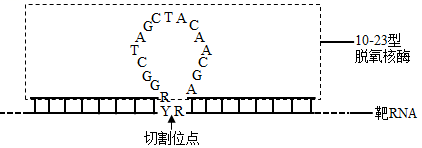

A. 脱氧核酶的作用过程受温度的影响

B. 图中Y与两个R之间通过氢键相连

C. 脱氧核酶与靶RNA之间的碱基配对方式有两种

D. 利用脱氧核酶切割mRNA可以抑制基因的转录过程

18\. 肝癌细胞中的M2型丙酮酸激酶（PKM2）可通过微囊泡的形式分泌，如下图所示。微囊泡被单核细胞摄取后，PKM2进入单核细胞内既可催化细胞呼吸过程中丙酮酸的生成，又可诱导单核细胞分化成为巨噬细胞。巨噬细胞分泌的各种细胞因子进一步促进肝癌细胞的生长增殖和微囊泡的形成。下列有关叙述正确的是（　　）

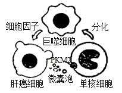

A. 微囊泡的形成依赖于细胞膜的流动性

B. 单核细胞分化过程中进行了基因的选择性表达

C. PKM2主要在单核细胞线粒体基质中起催化作用

D. 细胞因子促进肝癌细胞产生微囊泡属于正反馈调节

19\. 灰鹤是大型迁徙鸟类，为国家Ⅱ级重点保护野生动物。研究者对某自然保护区内越冬灰鹤进行了调查分析，发现灰鹤种群通常在同一地点集群夜宿，经调查，该灰鹤种群数量为245只，初次随亲鸟从繁殖地迁徙到越冬地的幼鹤为26只。通过粪便分析，发现越冬灰鹤以保护区内农田收割后遗留的玉米为最主要的食物。下列有关叙述正确的是（　　）

A. 统计保护区内灰鹤种群数量可以采用逐个计数法

B. 可由上述调查数据计算出灰鹤种群当年的出生率

C. 为保护灰鹤，保护区内应当禁止人类的生产活动

D. 越冬灰鹤粪便中的能量不属于其同化量的一部分

20\. 雌性小鼠在胚胎发育至4-6天时，细胞中两条X染色体会有一条随机失活，经细胞分裂形成子细胞，子细胞中此条染色体仍是失活的。雄性小鼠不存在X染色体失活现象。现有两只转荧光蛋白基因的小鼠，甲为发红色荧光的雄鼠（基因型为XRY），乙为发绿色荧光的雌鼠（基因型为XGX）。甲乙杂交产生F1，F1雌雄个体随机交配，产生F2。若不发生突变，下列有关叙述正确的是（　　）

A. F1中发红色荧光的个体均为雌性

B. F1中同时发出红绿荧光的个体所占的比例为1/4

C. F1中只发红色荧光的个体，发光细胞在身体中分布情况相同

D. F2中只发一种荧光的个体出现的概率是11/16

**二、非选择题：**

21\. 甲状腺激素（TH）作用于体内几乎所有的细胞，能使靶细胞代谢速率加快，氧气消耗量增加，产热量增加下图为TH分泌的调节途径示意图，回答下列问题：

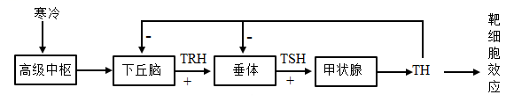

（1）寒冷环境中，机体冷觉感受器兴奋，兴奋在神经纤维上以\_\_\_\_\_\_\_\_\_\_\_\_的形式传导，进而引起下丘脑的\_\_\_\_\_\_\_\_\_\_\_\_兴奋，再经下丘脑一垂体一甲状腺轴的分级调节作用，TH分泌增加，TH作用于某些靶细胞后，激活了线粒体膜上的相关蛋白质，导致有机物氧化分解释放的能量无法转化成ATP中的化学能。此时线粒体中发生的能量转化是\_\_\_\_\_\_\_\_\_\_\_\_。

（2）当血液中的TH浓度增高时，会\_\_\_\_\_\_\_\_\_\_\_\_下丘脑和垂体的活动，使TH含量维持正常生理水平。该过程中，垂体分泌TSH可受到TRH和TH的调节，其结构基础是垂体细胞有\_\_\_\_\_\_\_\_\_\_\_\_。

（3）TH对垂体的反馈调节主要有两种方式，一种是TH进入垂体细胞内，抑制TSH基因的表达，从而\_\_\_\_\_\_\_\_\_\_\_\_；另一种方式是通过降低垂体细胞对TRH的敏感性，从而\_\_\_\_\_\_\_\_\_\_\_\_TRH对垂体细胞的作用。

22\. 早期地球大气中的O2浓度很低，到了大约3．5亿年前，大气中O2浓度显著增加，CO2浓度明显下降。现在大气中的CO2浓度约390μmol·mol-1，是限制植物光合作用速率的重要因素。核酮糖二磷酸羧化酶/加氧酶（Rubisco）是一种催化CO2固定的酶，在低浓度CO2条件下，催化效率低。有些植物在进化过程中形成了CO2浓缩机制，极大地提高了Rubisco所在局部空间位置的CO2浓度，促进了CO2的固定。回答下列问题：

（1）真核细胞叶绿体中，在Rubisco的催化下，CO2被固定形成\_\_\_\_\_\_\_\_\_\_\_，进而被还原生成糖类，此过程发生在\_\_\_\_\_\_\_\_\_\_\_中。

（2）海水中的无机碳主要以CO2和HCO3-两种形式存在，水体中CO2浓度低、扩散速度慢，有些藻类具有图1所示的无机碳浓缩过程，图中HCO3-浓度最高的场所是\_\_\_\_\_\_\_\_\_\_（填“细胞外”或“细胞质基质”或“叶绿体”），可为图示过程提供ATP的生理过程有\_\_\_\_\_\_\_\_\_\_\_。

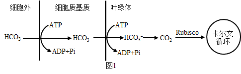

（3）某些植物还有另一种CO2浓缩机制，部分过程见图2。在叶肉细胞中，磷酸烯醇式丙酮酸羧化酶（PEPC）可将HCO3-转化为有机物，该有机物经过一系列的变化，最终进入相邻的维管束鞘细胞释放CO2，提高了Rubisco附近的CO2浓度。

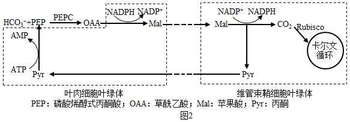

①由这种CO2浓缩机制可以推测，PEPC与无机碳的亲和力\_\_\_\_\_\_\_\_\_\_（填“高于”或“低于”或“等于”）Rubisco。

②图2所示的物质中，可由光合作用光反应提供的是\_\_\_\_\_\_\_\_\_\_。图中由Pyr转变为PEP的过程属于\_\_\_\_\_\_\_\_\_\_（填“吸能反应”或“放能反应”）。

③若要通过实验验证某植物在上述CO2浓缩机制中碳的转变过程及相应场所，可以使用\_\_\_\_\_\_\_\_\_\_技术。

（4）通过转基因技术或蛋白质工程技术，可能进一步提高植物光合作用的效率，以下研究思路合理的有\_\_\_\_\_\_\_\_\_\_。

A. 改造植物的HCO3-转运蛋白基因，增强HCO3-的运输能力

B. 改造植物的PEPC基因，抑制OAA的合成

C. 改造植物的Rubisco基因，增强CO2固定能力

D. 将CO2浓缩机制相关基因转入不具备此机制的植物

23\. 生物入侵是当今世界面临的主要环境问题之一。入侵种一般具有较强的适应能力、繁殖能力和扩散能力，而且在入侵地缺乏天敌，因而生长迅速，导致本地物种衰退甚至消失。回答下列问题：

（1）入侵种爆发时，种群增长曲线往往呈“J”型从环境因素考虑，其原因有\_\_\_\_\_\_\_\_\_\_（至少答出两点）。入侵种的爆发通常会使入侵地的物种多样性\_\_\_\_\_\_\_\_\_\_，群落发生\_\_\_\_\_\_\_\_\_\_演替。

（2）三裂叶豚草是辽宁省危害较大的外来入侵植物之一，某锈菌对三裂叶脉草表现为专一性寄生，可使叶片出现锈斑，对其生长有抑制作用为了验证该锈菌对三裂叶豚草的专一性寄生，科研人员进行了侵染实验。

方法：在三裂叶草和多种植物的离体叶片上分别喷一定浓度的锈菌菌液，将叶片静置于适宜条件下，观察和记录发病情况。

实验结果是：\_\_\_\_\_\_\_\_\_\_。

（3）为了有效控制三裂叶豚草，科研人员开展了生物控制试验，样地中三裂叶豚草初始播种量一致，部分试验结果见下表。

<table>
<colgroup>
<col style="width: 28%" />
<col style="width: 21%" />
<col style="width: 25%" />
<col style="width: 25%" />
</colgroup>
<tbody>
<tr>
<td rowspan="2" style="text-align: center;">组别</td>
<td colspan="3" style="text-align: center;">三裂叶豚草生物量（kg·m-2）</td>
</tr>
<tr>
<td style="text-align: center;">第1年</td>
<td style="text-align: center;">第2年</td>
<td style="text-align: center;">第3年</td>
</tr>
<tr>
<td style="text-align: center;">A：三裂叶豚草</td>
<td style="text-align: center;">8．07</td>
<td style="text-align: center;">12．24</td>
<td style="text-align: center;">12．24</td>
</tr>
<tr>
<td style="text-align: center;">B：三裂叶豚草+锈菌</td>
<td style="text-align: center;">7．65</td>
<td style="text-align: center;">6．43</td>
<td style="text-align: center;">4．77</td>
</tr>
<tr>
<td style="text-align: center;">C：三裂叶豚草+广聚萤叶甲</td>
<td style="text-align: center;">8．10</td>
<td style="text-align: center;">12．43</td>
<td style="text-align: center;">12．78</td>
</tr>
<tr>
<td style="text-align: center;">D：三裂叶豚草+野艾蒿</td>
<td style="text-align: center;">4．89</td>
<td style="text-align: center;">4．02</td>
<td style="text-align: center;">3．12</td>
</tr>
</tbody>
</table>

注：野艾蒿一植物，锈菌一真菌，广聚萤叶甲一昆虫

分析表中数据可知，除锈菌外，可用于控制三裂叶豚草的生物是\_\_\_\_\_\_\_\_\_\_，判断依据是\_\_\_\_\_\_\_\_\_\_。

（4）根据研究结果分析，在尚未被三裂叶豚草入侵但入侵风险较高的区域，可以采取的预防措施是\_\_\_\_\_\_\_\_\_\_；在已经被三裂叶豚草入侵的区域，为取得更好的治理效果可以采取的治理措施是\_\_\_\_\_\_\_\_\_\_。

24\. PHB2蛋白具有抑制细胞增殖的作用。为初步探究某动物PHB2蛋白抑制人宫颈癌细胞增殖的原因，研究者从基因数据库中获取了该蛋白的基因编码序列（简称phb2基因），大小为0．9kb（1kb=1000碱基对），利用大肠杆菌表达该蛋白。回答下列问题：

（1）为获取phb2基因，提取该动物肝脏组织的总RNA，再经\_\_\_\_\_\_\_\_\_\_过程得到cDNA，将其作为PCR反应的模板，并设计一对特异性引物来扩增目的基因。

（2）图1为所用载体图谱示意图，图中限制酶的识别序列及切割位点见下表。为使phb2基因（该基因序列不含图1中限制酶的识别序列）与载体正确连接，在扩增的phb2基因两端分别引入\_\_\_\_\_\_\_\_\_\_和\_\_\_\_\_\_\_\_\_\_两种不同限制酶的识别序列。经过这两种酶酶切的phb2基因和载体进行连接时，可选用\_\_\_\_\_\_\_\_\_\_（填“E．coliDNA连接酶”或“T4DNA连接酶”）。

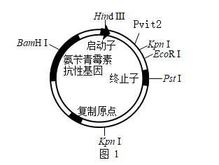

相关限制酶的识别序列及切割位点

<table>
<colgroup>
<col style="width: 25%" />
<col style="width: 25%" />
<col style="width: 25%" />
<col style="width: 25%" />
</colgroup>
<tbody>
<tr>
<td style="text-align: center;">名称</td>
<td style="text-align: center;">识别序列及切割位点</td>
<td style="text-align: center;">名称</td>
<td style="text-align: center;">识别序列及切割位点</td>
</tr>
<tr>
<td style="text-align: center;">HindⅢ</td>
<td style="text-align: center;">
A↓AGCTT

TTCGA↑A
</td>
<td style="text-align: center;">EcoRI</td>
<td style="text-align: center;">
G↓AATTC

CTTAA↑G
</td>
</tr>
<tr>
<td style="text-align: center;">PvitⅡ</td>
<td style="text-align: center;">
CAG↓CTG

GTC↑GAC
</td>
<td style="text-align: center;">PstI</td>
<td style="text-align: center;">
CTGC↓AG

GA↑CGTC
</td>
</tr>
<tr>
<td style="text-align: center;">KpnI</td>
<td style="text-align: center;">
G↓GTACC

CCATG↑G
</td>
<td style="text-align: center;">BamHI</td>
<td style="text-align: center;">
G↓GATCC

CCTAG↑G
</td>
</tr>
</tbody>
</table>

注：箭头表示切割位点

（3）转化前需用CaCl2处理大肠杆菌细胞，使其处于\_\_\_\_\_\_\_\_\_\_的生理状态，以提高转化效率。

（4）将转化后大肠杆菌接种在含氨苄青霉素的培养基上进行培养，随机挑取菌落（分别编号为1、2、3、4）培养并提取质粒，用（2）中选用的两种限制酶进行酶切，酶切产物经电分离，结果如图2，\_\_\_\_\_\_\_\_号菌落的质粒很可能是含目的基因的重组质粒。

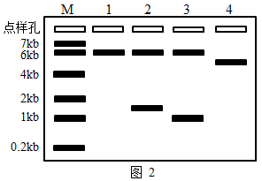

注：M为指示分子大小标准参照物；小于0．2kb的DNA分子条带未出现在图中

（5）将纯化得到的PHB2蛋白以一定浓度添加到人宫颈癌细胞培养液中，培养24小时后，检测处于细胞周期（示意图见图3）不同时期的细胞数量，统计结果如图4。分析该蛋白抑制人宫颈癌细胞增殖可能的原因是将细胞阻滞在细胞周期的\_\_\_\_\_\_\_\_\_\_（填“G1”或“S”或“G2/M”）期。

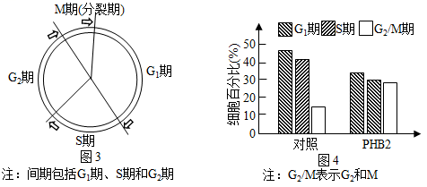

25\. 水稻为二倍体雌雄同株植物，花为两性花。现有四个水稻浅绿叶突变体W、X、Y、Z，这些突变体的浅绿叶性状均为单基因隐性突变（显性基因突变为隐性基因）导致。回答下列问题：

（1）进行水稻杂交实验时，应首先除去\_\_\_\_\_\_\_\_\_\_未成熟花的全部\_\_\_\_\_\_\_\_\_\_，并套上纸袋。若将W与野生型纯合绿叶水稻杂交，F1自交，F2的表现型及比例为\_\_\_\_\_\_\_\_\_\_。

（2）为判断这四个突变体所含的浅绿叶基因之间的位置关系，育种人员进行了杂交实验，杂交组合及F1叶色见下表。

|      |     |     |                 |
|:----:|:---:|:---:|:---------------:|
| 实验分组 | 母本  | 父本  | F1叶色 |
| 第1组  | W   | X   | 浅绿              |
| 第2组  | W   | Y   | 绿               |
| 第3组  | W   | Z   | 绿               |
| 第4组  | X   | Y   | 绿               |
| 第5组  | X   | Z   | 绿               |
| 第6组  | Y   | Z   | 绿               |

实验结果表明，W的浅绿叶基因与突变体\_\_\_\_\_\_\_\_\_\_的浅绿叶基因属于非等位基因。为进一步判断X、Y、Z的浅绿叶基因是否在同一对染色体上，育种人员将第4、5、6三组实验的F1自交，观察并统计F2的表现型及比例。不考虑基因突变、染色体变异和互换，预测如下两种情况将出现的结果：

①若突变体X、Y、Z的浅绿叶基因均在同一对染色体上，结果为\_\_\_\_\_\_\_\_\_\_。

②若突变体X、Y的浅绿叶基因在同一对染色体上，Z的浅绿叶基因在另外一对染色体上，结果为\_\_\_\_\_\_\_\_\_\_。

（3）叶绿素a加氧酶的功能是催化叶绿素a转化为叶绿素b。研究发现，突变体W的叶绿素a加氧酶基因OsCAO1某位点发生碱基对的替换，造成mRNA上对应位点碱基发生改变，导致翻译出的肽链变短。据此推测，与正常基因转录出的mRNA相比，突变基因转录出的mRNA中可能发生的变化是\_\_\_\_\_\_\_\_\_\_。
