**生物学**

**一、选择题：**

1\. 蛋白质是生命活动的主要承担者。下列有关叙述错误的是（　　）

A. 叶绿体中存在催化ATP合成蛋白质

B. 胰岛B细胞能分泌调节血糖的蛋白质

C. 唾液腺细胞能分泌水解淀粉的蛋白质

D. 线粒体膜上存在运输葡萄糖的蛋白质

【答案】D

【解析】

【分析】蛋白质的功能——生命活动的主要承担者：（1）构成细胞和生物体的重要物质，即结构蛋白，如羽毛、头发、蛛丝、肌动蛋白。（2）催化作用：如绝大多数酶。（3）传递信息，即调节作用：如胰岛素、生长激素。（4）免疫作用：如免疫球蛋白（抗体）。（5）运输作用：如红细胞中的血红蛋白。

【详解】A、叶绿体类囊体薄膜是进行光合作用的场所，能合成ATP，则存在催化ATP合成的酶，其本质是蛋白质，A正确；

B、胰岛B细胞能分泌胰岛素，降低血糖，胰岛素的化学本质是蛋白质，B正确；

C、唾液腺细胞能分泌唾液淀粉酶，唾液淀粉酶属于分泌蛋白，能水解淀粉，C正确；

D、葡萄糖分解的场所在细胞质基质，线粒体膜上不存在运输葡萄糖的蛋白质，D错误。

故选D。

【点睛】

2\. 植物工厂是通过光调控和通风控温等措施进行精细管理的高效农业生产系统，常采用无土栽培技术。下列有关叙述错误的是（　　）

A. 可根据植物生长特点调控光的波长和光照强度

B. 应保持培养液与植物根部细胞的细胞液浓度相同

C. 合理控制昼夜温差有利于提高作物产量

D. 适时通风可提高生产系统内的CO2浓度

【答案】B

【解析】

【分析】影响绿色植物进行光合作用的主要外界因素有：①CO2浓度；②温度；③光照强度。

【详解】A、不同植物对光的波长和光照强度的需求不同，可可根据植物生长特点调控光的波长和光照强度，A正确；

B、为保证植物的根能够正常吸收水分，该系统应控制培养液的浓度小于植物根部细胞的细胞液浓度，B错误；

C、适当提高白天的温度可以促进光合作用的进行，让植物合成更多的有机物，而夜晚适当降温则可以抑制其呼吸作用，使其少分解有机物，合理控制昼夜温差有利于提高作物产量，C正确；

D、适时通风可提高生产系统内的CO2浓度，进而提高光合作用的速率，D正确。

故选B。

【点睛】

3\. 下列有关病毒在生物学和医学领域应用的叙述，错误的是（　　）

A. 灭活的病毒可用于诱导动物细胞融合

B. 用特定的病毒免疫小鼠可制备单克隆抗体

C. 基因工程中常用噬菌体转化植物细胞

D. 经灭活或减毒处理的病毒可用于免疫预防

【答案】C

【解析】

【分析】1、病毒是非细胞生物，只能寄生在活细胞中进行生命活动。病毒依据宿主细胞的种类可分为植物病毒、动物病毒和噬菌体；根据遗传物质来分，分为DNA病毒和RNA病毒；病毒由核酸和蛋白质组成。

2、疫苗是将病原微生物（如细菌、立克次氏体、病毒等）及其代谢产物，经过人工减毒、灭活或利用转基因等方法制成的用于预防传染病的自动免疫制剂。应用转基因技术生产的疫苗，主要成分是病毒的表面抗原蛋白，接种后能刺激机体免疫细胞产生抵抗病毒的抗体。

【详解】A、促进动物细胞的融合除了物理方法和化学方法外，还可以采用灭活的病毒，A正确；

B、病毒作为抗原可刺激机体发生特异性免疫，产生抗体，用特定的病毒免疫小鼠可制备单克隆抗体，B正确；

C、基因工程中常用农杆菌转化植物细胞，农杆菌的特点是其细胞内的Ti质粒上的T-DNA片段能够转移至受体细胞，并整合到受体细胞的染色体上，C错误；

D、经过灭活或减毒处理的病毒可以作为免疫学中的疫苗，用于免疫预防，D正确。

故选C。

【点睛】

4\. 下列有关细胞内的DNA及其复制过程的叙述，正确的是（　　）

A. 子链延伸时游离的脱氧核苷酸添加到3′端

B. 子链的合成过程不需要引物参与

C. DNA每条链的5′端是羟基末端

D. DNA聚合酶的作用是打开DNA双链

【答案】A

【解析】

【分析】DNA复制需要的基本条件：

（1）模板：解旋后的两条DNA单链；

（2）原料：四种脱氧核苷酸；

（3）能量：ATP；

（4）酶：解旋酶、DNA聚合酶等。

【详解】A、子链延伸时5′→3′合成，故游离的脱氧核苷酸添加到3′端，A正确；

B、子链的合成过程需要引物参与，B错误；

C、DNA每条链的5′端是磷酸基团末端，3′端是羟基末端，C错误；

D、解旋酶的作用是打开DNA双链，D错误。

故选A。

【点睛】

5\. 下列有关中学生物学实验中观察指标的描述，正确的是（　　）

|     |                |                  |
|:---:|:--------------:|:----------------:|
| 选项  | 实验名称           | 观察指标             |
| A   | 探究植物细胞的吸水和失水   | 细胞壁的位置变化         |
| B   | 绿叶中色素的提取和分离    | 滤纸条上色素带的颜色、次序和宽窄 |
| C   | 探究酵母菌细胞呼吸的方式   | 酵母菌培养液的浑浊程度      |
| D   | 观察根尖分生组织细胞有丝分裂 | 纺锤丝牵引染色体的运动      |

A. A B. B C. C D. D

【答案】B

【解析】

【分析】1、绿叶中色素的提取和分离实验，提取色素时需要加入无水乙醇（溶解色素）、石英砂（使研磨更充分）和碳酸钙（防止色素被破坏）；分离色素时采用纸层析法，原理是色素在层析液中的溶解度不同，随着层析液扩散的速度不同，最后的结果是观察到四条色素带，从上到下依次是胡萝卜素（橙黄色）、叶黄素（黄色）、叶绿素a（蓝绿色）、叶绿素b（黄绿色）；

2、观察细胞有丝分裂实验的步骤：解离（解离液由盐酸和酒精组成，目的是使细胞分散开来）、漂洗（洗去解离液，便于染色）、染色（用龙胆紫、醋酸洋红等碱性染料）、制片（该过程中压片是为了将根尖细胞压成薄层，使之不相互重叠影响观察）和观察（先低倍镜观察，后高倍镜观察）；

3、观察植物细胞质壁分离及复原实验的原理：（1）原生质层的伸缩性比细胞壁的伸缩性大．（2）当外界溶液浓度大于细胞液浓度时，细胞失水，原生质层收缩进而质壁分离．（3）当细胞液浓度大于外界溶液浓度时，细胞渗透吸水，使质壁分离复原。

【详解】A、在植物细胞质壁分离和复原的实验中，中央液泡大小、原生质层的位置和细胞大小都应该作为观察对象，A正确；

B、绿叶中色素的提取和分离，观察指标是滤纸条上色素带的颜色、次序和宽窄，B正确；

C、探究酵母菌细胞呼吸的方式，观察指标是培养液的滤液能否使重铬酸钾转变成灰绿色，C错误；

D、观察根尖分生组织细胞有丝分裂，细胞在解离的时候已经死亡，看不到纺锤丝牵引染色体的运动，D错误。

故选B。

【点睛】

6\. 科研人员发现，运动能促进骨骼肌细胞合成FDC5蛋白，该蛋白经蛋白酶切割，产生的有活性的片段被称为鸢尾素。鸢尾素作用于白色脂肪细胞，使细胞中线粒体增多，能量代谢加快。下列有关叙述错误的是（　　）

A. 脂肪细胞中的脂肪可被苏丹Ⅲ染液染色

B. 鸢尾素在体内的运输离不开内环境

C. 蛋白酶催化了鸢尾素中肽键的形成

D. 更多的线粒体利于脂肪等有机物的消耗

【答案】C

【解析】

【分析】1、脂肪被苏丹Ⅲ染成橘黄色，被苏丹Ⅳ染成红色。

2、蛋白酶能催化蛋白质的水解。

【详解】A、脂肪可被苏丹Ⅲ染液染成橘黄色，A正确；

B、有活性的片段鸢尾素通过体液运输作用于脂肪细胞，促进脂肪细胞的能量代谢，B正确；

C、蛋白酶切割FDC5蛋白形成有活性的鸢尾素片段，蛋白酶催化肽键的断裂，C错误；

D、线粒体是有氧呼吸的主要场所，脂肪细胞线粒体增多，有利于脂肪细胞消耗更多的脂肪，D正确。

故选C。

【点睛】

7\. 下表为几种常用的植物生长调节剂，下列有关其应用的叙述错误的是（　　）

|                  |          |
|:----------------:|:--------:|
| 名称               | 属性       |
| 萘乙酸              | 生长素类     |
| 6-BA             | 细胞分裂素类   |
| 乙烯利              | 乙烯类      |
| PP333 | 赤霉素合成抑制剂 |

A. 用一定浓度的萘乙酸处理离体的花卉枝条，可促进生根

B. 用一定浓度的6-BA抑制马铃薯发芽，以延长贮藏期

C. 用乙烯利处理棉花可催熟棉桃，便于统一采摘

D. 用PP333处理水稻可使植株矮化，增强抗倒伏能力

【答案】B

【解析】

【分析】植物生长调节剂，是用于调节植物生长发育的一类农药，包括人工合成的化合物和从生物中提取的天然植物激素。在蔬菜生产过程中，正确使用植物生长调节剂，可以促进蔬菜生长，提高产量和品种；但使用不当时，会起到相反的作用，甚至造成经济损失。

【详解】A、萘乙酸作用与生长素类似，用一定浓度的萘乙酸处理离体的花卉枝条，可促进生根，A正确；

B、6-BA作用与细胞分裂素类类似，抑制马铃薯发芽，延长贮藏期的激素是脱落酸，与细胞分裂素无关，故6-BA不能抑制马铃薯发芽，以延长贮藏期，B错误；

C、乙烯利作用与乙烯类似，故用乙烯利处理棉花可催熟棉桃，便于统一采摘，C正确；

D、PP333作用与赤霉素合成抑制剂类似，故用PP333处理水稻可使植株矮化，增强抗倒伏能力，D正确。

故选B。

【点睛】

8\. 利用菠萝蜜制作果醋的大致流程为：先在灭菌的果肉匀浆中接种酵母菌，发酵6天后，再接入活化的醋酸杆菌，发酵5天。下列有关叙述错误的是（　　）

A. 乙醇既是醋酸发酵的底物，又可以抑制杂菌繁殖

B. 酵母菌和醋酸杆菌均以有丝分裂的方式进行增殖

C. 酵母菌和醋酸杆菌发酵过程中控制通气的情况不同

D. 接入醋酸杆菌后，应适当升高发酵温度

【答案】B

【解析】

【分析】1、果酒制作的菌种是酵母菌，来源于葡萄皮上野生型酵母菌或者菌种保藏中心，条件是无氧、适宜温度是18～25℃，pH值呈酸性。

2、参与果醋制作的微生物是醋酸菌，其新陈代谢类型是异养需氧型。果醋制作的原理：当氧气、糖源都充足时，醋酸菌将葡萄汁中的果糖分解成醋酸。当缺少糖源时，醋酸菌将乙醇变为乙醛，再将乙醛变为醋酸。最适温度为30～35℃。

【详解】A、当缺少糖源时，醋酸菌将乙醇变为乙醛，再将乙醛变为醋酸，同时乙醇还可以抑制杂菌繁殖，A正确；

B、酵母菌一般以出芽的方式繁殖，醋酸杆菌以二分裂的方式进行增殖，B错误；

C、酵母菌发酵过程中先通气使其大量繁殖，再密闭发酵产乙醇；醋酸杆菌为好氧菌，需持续通入无菌氧气，C正确；

D、酵母菌适宜温度是18～25℃，醋酸杆菌最适温度为30～35℃，D正确。

故选B。

9\. 被子植物的无融合生殖是指卵细胞、助细胞和珠心胞等直接发育成胚的现象。助细胞与卵细胞染色体组成相同，珠心细胞是植物的体细胞。下列有关某二倍体被子植物无融合生殖的叙述，错误的是（　　）

A. 由无融合生殖产生植株有的是高度不育的

B. 由卵细胞直接发育成完整个体体现了植物细胞的全能性

C. 由助细胞无融合生殖产生的个体保持了亲本的全部遗传特性

D. 由珠心细胞无融合生殖产生的植株体细胞中有两个染色体组

【答案】C

【解析】

【分析】无融合生殖是指卵细胞、助细胞和珠心胞等直接发育成胚的现象，这体现了植物细胞的全能性，其中由配子直接发育而来的个体叫单倍体。

【详解】A、二倍体被子植物中卵细胞和助细胞不存在同源染色体，则它们直接发育成的植株是高度不育的，A正确；

B、一个细胞（如卵细胞）直接发育成一个完整的个体，这体现了细胞的全能性，B正确；

C、助细胞与卵细胞染色体组成相同，染色体数目减半，则由助细胞无融合生殖产生个体与亲本的遗传特性不完全相同，C错误；

D、珠心细胞是植物的体细胞，发育成的植物为二倍体植株，体细胞中含有两个染色体组，D正确。

故选C。

【点睛】

10\. 下图表示人体过敏反应发生的基本过程。下列有关叙述正确的是（　　）

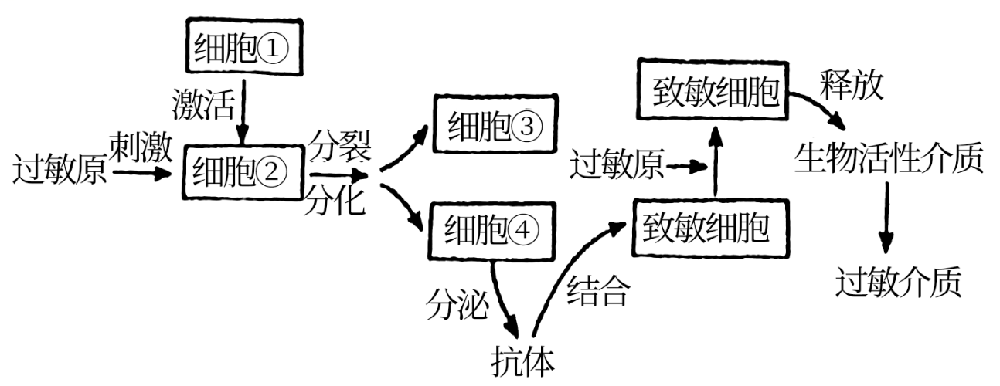

A. 图中包含细胞免疫过程和体液免疫过程

B. 细胞①和细胞②分别在骨髓和胸腺中成熟

C. 细胞③和细胞④分别指浆细胞和记忆细胞

D. 用药物抑制致敏细胞释放生物活性介质可缓解过敏症状

【答案】D

【解析】

【分析】据图分析，细胞①是T细胞，细胞②是B细胞，细胞③是记忆B细胞，细胞④是浆细胞。

【详解】A、根据图中分泌的抗体可知，过敏反应参与的是体液免疫，A错误；

B、细胞①是T细胞，在胸腺中成熟，细胞②是B细胞，在骨髓中发育成熟，B错误；

C、细胞③和细胞④分别是B细胞分化出的记忆B细胞和浆细胞，C错误；

D、由图可知，致敏细胞释放生物活性介质导致过敏症状，则用药物抑制致敏细胞释放生物活性介质可缓解过敏症状，D正确。

故选D。

【点睛】

11\. 辽河流域是辽宁省重要的生态屏障和经济地带。为恢复辽河某段“水体——河岸带”的生物群落，研究人员选择辽河流域常见的植物进行栽种。植物种类、分布及叶片或茎的横切面见下图。下列有关叙述错误的是（　　）

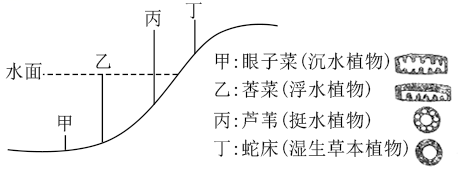

注：右侧为对应植物叶片或茎的横切面示意图，空白处示气腔

A. 丙与丁的分布体现了群落的垂直结构

B. 四种植物都有发达的气腔，利于根系的呼吸，体现出生物对环境的适应

C. 不同位置上植物种类的选择，遵循了协调与平衡原理

D. 生态恢复工程使该生态系统的营养结构更复杂，抵抗力稳定性增强

【答案】A

【解析】

【分析】1、协调与平衡原理：生态系统的生物数量不能超过环境承载力（环境容纳量）的限度。

2、生态系统的稳定性包括扺抗力稳定性和恢复力稳定性两个方面。营养结构越复杂，其自我调节能力越强，抵抗力稳定性越强，而恢复力稳定性越差，负反馈调节是生态系统自我调节能力的基础。

【详解】A、丙与丁的分布是由地形的起伏导致的，体现了群落的水平结构，A错误；

B、四种植物生活在水体——河岸带，都有发达气腔，利于根系的呼吸，体现出生物对环境的适应，B正确；

C、不同位置上植物种类的选择，充分利用了环境资源，遵循了协调与平衡原理，C正确；

D、生态恢复工程使该生态系统的营养结构更复杂，自我调节能力更强，抵抗力稳定性增强，D正确。

故选A。

12\. 基因型为AaBb的雄性果蝇，体内一个精原细胞进行有丝分裂时，一对同源染色体在染色体复制后彼此配对，非姐妹染色单体进行了交换，结果如右图所示。该精原细胞此次有丝分裂产生的子细胞，均进入减数分裂，若此过程中未发生任何变异，则减数第一次分裂产生的子细胞中，基因组成为AAbb的细胞所占的比例是（　　）

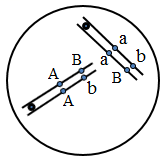

A. 1/2 B. 1/4 C. 1/8 D. 1/16

【答案】B

【解析】

【分析】由图可知，该精原细胞有丝分裂产生的两个子细胞的基因型分别是AaBB、Aabb或AaBb、AaBb，具体比例为AaBB：Aabb：AaBb=1：1：2，所有子细胞均进行减数分裂，据此答题。

【详解】由分析可知，进行减数分裂的子细胞中只有1/4Aabb和2/4AaBb精原细胞减数第一次分裂才能产生AAbb的细胞，则概率为1/4×1/2+2/4×1/4=1/4，B正确，ACD错误。

故选B。

【点睛】

13\. 下图是利用体细胞核移植技术克隆优质奶牛的简易流程图，有关叙述正确的是（　　）

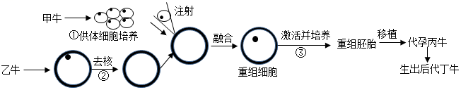

A. 后代丁的遗传性状由甲和丙的遗传物质共同决定

B. 过程①需要提供95%空气和5%CO2的混合气体

C. 过程②常使用显微操作去核法对受精卵进行处理

D. 过程③将激活后的重组细胞培养至原肠胚后移植

【答案】B

【解析】

【分析】分析图解：图示过程为体细胞克隆过程，取乙牛体细胞，对处于减数第二次分裂中期的卵母细胞去核，然后进行细胞核移植；融合后的细胞激活后培养到早期胚胎，再进行胚胎移植，最终得到克隆牛。

【详解】A、后代丁的细胞核的遗传物质来自甲，细胞质的遗传物质来自于乙牛，则丁的遗传性状由甲和乙的遗传物质共同决定，A错误；

B、动物细胞培养中需要提供95%空气（保证细胞的有氧呼吸）和5%CO2（维持培养液的pH）的混合气体，B正确；

C、过程②常使用显微操作去核法对卵母细胞进行处理，C错误；

D、过程③将激活后的重组细胞培养至囊胚或桑椹胚后移植，D错误。

故选B。

【点睛】

14\. 腈水合酶（N0）广泛应用于环境保护和医药原料生产等领域，但不耐高温。利用蛋白质工程技术在N0的α和β亚基之间加入一段连接肽，可获得热稳定的融合型腈水合酶（N1）。下列有关叙述错误的是（　　）

A. N1与N0氨基酸序列的差异是影响其热稳定性的原因之一

B. 加入连接肽需要通过改造基因实现

C. 获得N1的过程需要进行转录和翻译

D. 检测N1的活性时先将N1与底物充分混合，再置于高温环境

【答案】D

【解析】

【分析】1、蛋白质工程是指以蛋白质分子的结构规律及其生物功能的关系作为基础，通过基因修饰或基因合成，对现有蛋白质进行改造，或制造一种新的蛋白质，以满足人类的生产和生活的需求。（基因工程在原则上只能生产自然界已存在的蛋白质）。

2、蛋白质工程崛起的缘由：基因工程只能生产自然界已存在的蛋白质。

3、蛋白质工程的基本原理：它可以根据人的需求来设计蛋白质的结构，又称为第二代的基因工程。基本途径：从预期的蛋白质功能出发，设计预期的蛋白质结构，推测应有的氨基酸序列，找到相对应的脱氧核苷酸序列（基因）。

【详解】A、在N0的α和β亚基之间加入一段连接肽，可获得热稳定的融合型腈水合酶（N1），则N1与N0氨基酸序列有所不同，这可能是影响其热稳定性的原因之一，A正确；

B、蛋白质工程的作用对象是基因，即加入连接肽需要通过改造基因实现，B正确；

C、N1为蛋白质，蛋白质的合成需要经过转录和翻译两个过程，C正确；

D、酶具有高效性，检测N1的活性需先将其置于高温环境，再与底物充分混合，D错误。

故选D。

【点睛】

15\. 辽宁省盘锦市的蛤蜊岗是由河流入海冲积而成的具有潮间带特征的水下钱滩，也是我国北方地区滩涂贝类的重要产地之一，其中的底栖动物在物质循环和能量流动中具有重要作用。科研人员利用样方法对底栖动物的物种丰富度进行了调查结果表明该地底栖动物主要包括滤食性的双壳类、碎屑食性的多毛类和肉食性的虾蟹类等。下列有关叙述正确的是（　　）

A. 本次调查的采样地点应选择底栖动物集中分布的区域

B. 底栖动物中既有消费者，又有分解者

C. 蛤蜊岗所有的底栖动物构成了一个生物群落

D. 蛤蜊岗生物多样性的直接价值大于间接价值

【答案】B

【解析】

【分析】1、物种丰富度是指群落中物种数目的多少。

2、群落：在一定的自然区域内，所有的种群组成一个群落。

3、生态系统的组成成分包括非生物的物质和能量、生产者、消费者和分解者。

4、生物多样性的价值包括直接价值、间接价值和潜在价值。

【详解】A、采用样方法调查物种丰富度要做到随机取样，A错误；

B、底栖动物主要包括滤食性的双壳类、碎屑食性的多毛类和肉食性的虾蟹类等，则底栖动物中既有消费者，又有分解者，B正确；

C、生物群落是该区域所有生物的集合，蛤蜊岗所有的底栖动物只是其中一部分生物，不能构成了一个生物群落，C错误；

D、蛤蜊岗生物多样性的间接价值大于直接价值，D错误。

故选B。

【点睛】

**二、选择题：**

16\. 短期记忆与脑内海马区神经元的环状联系有关，如图表示相关结构。信息在环路中循环运行，使神经元活动的时间延长。下列有关此过程的叙述错误的是（　　）

A. 兴奋在环路中的传递顺序是①→②→③→①

B. M处的膜电位为外负内正时，膜外的Na+浓度高于膜内

C. N处突触前膜释放抑制性神经递质

D. 神经递质与相应受体结合后，进入突触后膜内发挥作用

【答案】ACD

【解析】

【分析】兴奋在神经元之间的传递是单向，只能由突触前膜作用于突触后膜。突触的类型包括轴突—树突型和轴突—细胞体型。

【详解】A、兴奋在神经元之间的传递方向为轴突到树突或轴突到细胞体，则图中兴奋在环路中的传递顺序是①→②→③→②，A错误；

B、M处无论处于静息电位还是动作电位，都是膜外的Na+浓度高于膜内，B正确；

C、信息在环路中循环运行，使神经元活动的时间延长，则N处突触前膜释放兴奋性神经递质，C错误；

D、神经递质与相应受体结合后发挥作用被灭活，不进入突触后膜内发挥作用，D错误。

故选ACD。

【点睛】

17\. 脱氧核酶是人工合成的具有催化活性的单链DNA分子。下图为10-23型脱氧核酶与靶RNA结合并进行定点切割的示意图。切割位点在一个未配对的嘌呤核苷酸（图中R所示）和一个配对的嘧啶核苷酸（图中Y所示）之间，图中字母均代表由相应碱基构成的核苷酸。下列有关叙述错误的是（　　）

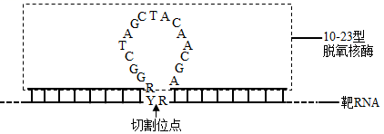

A. 脱氧核酶的作用过程受温度的影响

B. 图中Y与两个R之间通过氢键相连

C. 脱氧核酶与靶RNA之间的碱基配对方式有两种

D. 利用脱氧核酶切割mRNA可以抑制基因的转录过程

【答案】BCD

【解析】

【分析】基因控制蛋白质的合成包括转录和翻译两个过程，其中转录是以DNA的一条链为模板合成mRNA的过程，主要在细胞核中进行；翻译是以mRNA为模板合成蛋白质的过程，发生在核糖体上。

【详解】A、脱氧核酶的本质是DNA，温度会影响脱氧核酶的结构，从而影响脱氧核酶的作用，A正确；

B、图示可知，图中Y与两个R之间通过磷酸二酯键相连，B错误；

C、脱氧核酶本质是DNA，与靶RNA之间的碱基配对方式有A-U、T-A、C-G、G-C四种，C错误；

D、利用脱氧核酶切割mRNA可以抑制基因的翻译过程，D错误。

故选BCD。

【点睛】

18\. 肝癌细胞中的M2型丙酮酸激酶（PKM2）可通过微囊泡的形式分泌，如下图所示。微囊泡被单核细胞摄取后，PKM2进入单核细胞内既可催化细胞呼吸过程中丙酮酸的生成，又可诱导单核细胞分化成为巨噬细胞。巨噬细胞分泌的各种细胞因子进一步促进肝癌细胞的生长增殖和微囊泡的形成。下列有关叙述正确的是（　　）

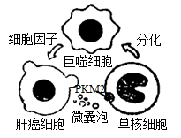

A. 微囊泡的形成依赖于细胞膜的流动性

B. 单核细胞分化过程中进行了基因的选择性表达

C. PKM2主要在单核细胞的线粒体基质中起催化作用

D. 细胞因子促进肝癌细胞产生微囊泡属于正反馈调节

【答案】ABD

【解析】

【分析】分析题图：肝癌细胞通过微囊泡将PKM2分泌到细胞外，进入单核细胞可诱导单核细胞分化成为巨噬细胞，巨噬细胞分泌的各种细胞因子进一步促进肝癌细胞的生长增殖和微囊泡的形成，该过程属于正反馈调节。

【详解】A、微囊泡是细胞膜包裹PKM2形成的囊泡，该过程依赖于细胞膜的流动性，A正确；

B、分化的实质为基因的选择性表达，B正确；

C、PKM2可催化细胞呼吸过程中丙酮酸的生成，故主要在单核细胞的细胞质基质中起催化作用，C错误；

D、由分析可知，细胞因子促进肝癌细胞产生微囊泡属于正反馈调节，D正确。

故选ABD。

19\. 灰鹤是大型迁徙鸟类，为国家Ⅱ级重点保护野生动物。研究者对某自然保护区内越冬灰鹤进行了调查分析，发现灰鹤种群通常在同一地点集群夜宿，经调查，该灰鹤种群数量为245只，初次随亲鸟从繁殖地迁徙到越冬地的幼鹤为26只。通过粪便分析，发现越冬灰鹤以保护区内农田收割后遗留的玉米为最主要的食物。下列有关叙述正确的是（　　）

A. 统计保护区内灰鹤种群数量可以采用逐个计数法

B. 可由上述调查数据计算出灰鹤种群当年的出生率

C. 为保护灰鹤，保护区内应当禁止人类的生产活动

D. 越冬灰鹤粪便中能量不属于其同化量的一部分

【答案】AD

【解析】

【分析】1、对于活动能力强、活动范围大的个体调查种群密度时适宜用标志重捕法，而一般植物和个体小、活动能力小的动物以及虫卵等种群密度的调查方式常用的是样方法。取样时要做到随机取样，不能在分布较密集或稀疏的地区取样，常用的取样方法有五点取样法和等距取样法。

2、标志重捕法的具体操作为：在被调查种群的活动范围内捕获一部分个体，做上标记后再放回原来的环境，经过一段时间后进行重捕，根据重捕到的动物中标记个体数占总个体数的比例来估计种群密度。

3、摄入量=同化量+粪便量。

【详解】A、灰鹤数量较少，个体较大，统计保护区内灰鹤种群数量可以采用逐个计数法，A正确；

B、题干中信息只能说明初次随亲鸟从繁殖地迁徙到越冬地的幼鹤为26只，不能说明新生个体只有26只，故不能计算出灰鹤种群当年的出生率，B错误；

C、越冬灰鹤以保护区内农田收割后遗留的玉米为最主要的食物，则不能禁止人类的生产活动，应当合理安排人类的生产活动，C错误；

D、粪便量属于上一营养级的能量，不属于其同化量的一部分，因此越冬灰鹤粪便中的能量属于上一营养级同化量的一部分，D正确。

故选AD。

【点睛】

20\. 雌性小鼠在胚胎发育至4-6天时，细胞中两条X染色体会有一条随机失活，经细胞分裂形成子细胞，子细胞中此条染色体仍是失活的。雄性小鼠不存在X染色体失活现象。现有两只转荧光蛋白基因的小鼠，甲为发红色荧光的雄鼠（基因型为XRY），乙为发绿色荧光的雌鼠（基因型为XGX）。甲乙杂交产生F1，F1雌雄个体随机交配，产生F2。若不发生突变，下列有关叙述正确的是（　　）

A. F1中发红色荧光的个体均为雌性

B. F1中同时发出红绿荧光的个体所占的比例为1/4

C. F1中只发红色荧光的个体，发光细胞在身体中分布情况相同

D. F2中只发一种荧光的个体出现的概率是11/16

【答案】AD

【解析】

【分析】雌性小鼠发育过程中一条X染色体随机失活，雄性小鼠不存在这种现象，甲乙杂交产生的F1的基因型是XRX、XY、XRXG、XGY，F1随机交配，雌配子产生的种类及比例是XR：XG：X=2：1：1，雄配子产生的种类及比例为X：XG：Y=1：1：2。

【详解】A、由分析可知，F1中雄性个体的基因型是XGY和XY，不存在红色荧光，即F1中发红色荧光的个体均为雌性，A正确；

B、F1的基因型及比例为XRX：XY：XRXG：XGY=1：1：1：1，但是根据题意，“细胞中两条X染色体会有一条随机失活”，所以XRXG个体总有一条染色体失活，只能发出一种荧光，同时发出红绿荧光的个体（XRXG）所占的比例为0，B错误；

C、F1中只发红光的个体的基因型是XRX，由于存在一条X染色体随机失活，则发光细胞在身体中分布情况不相同，C错误；

D、F2中只发一种荧光的个体包括XRX、XRY、XGX、XGY、XGXG，所占的比例为2/4×1/4+2/4×2/4+1/4×1/4+1/4×2/4+1/4×1/4+1/4×1/4=11/16，D正确。

故选AD。

【点睛】

**二、非选择题：**

21\. 甲状腺激素（TH）作用于体内几乎所有的细胞，能使靶细胞代谢速率加快，氧气消耗量增加，产热量增加下图为TH分泌的调节途径示意图，回答下列问题：

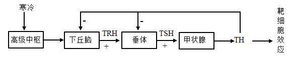

（1）寒冷环境中，机体冷觉感受器兴奋，兴奋在神经纤维上以\_\_\_\_\_\_\_\_\_\_\_\_的形式传导，进而引起下丘脑的\_\_\_\_\_\_\_\_\_\_\_\_兴奋，再经下丘脑一垂体一甲状腺轴的分级调节作用，TH分泌增加，TH作用于某些靶细胞后，激活了线粒体膜上的相关蛋白质，导致有机物氧化分解释放的能量无法转化成ATP中的化学能。此时线粒体中发生的能量转化是\_\_\_\_\_\_\_\_\_\_\_\_。

（2）当血液中的TH浓度增高时，会\_\_\_\_\_\_\_\_\_\_\_\_下丘脑和垂体的活动，使TH含量维持正常生理水平。该过程中，垂体分泌TSH可受到TRH和TH的调节，其结构基础是垂体细胞有\_\_\_\_\_\_\_\_\_\_\_\_。

（3）TH对垂体的反馈调节主要有两种方式，一种是TH进入垂体细胞内，抑制TSH基因的表达，从而\_\_\_\_\_\_\_\_\_\_\_\_；另一种方式是通过降低垂体细胞对TRH的敏感性，从而\_\_\_\_\_\_\_\_\_\_\_\_TRH对垂体细胞的作用。

【答案】（1） ①. 神经冲动（电信号、局部电流） ②. 体温调节中枢 ③. 有机物中的化学能转化为热能

（2） ①. 抑制 ②. TRH和TH的特异性受体

（3） ①. 降低TSH的合成 ②. 降低

【解析】

【分析】1、寒冷环境→皮肤冷觉感受器→下丘脑体温调节中枢→增加产热（骨骼肌战栗、立毛肌收缩、甲状腺激素等分泌增加），减少散热（毛细血管收缩、汗腺分泌减少）→体温维持相对恒定。

2、寒冷时，下丘脑分泌促甲状腺激素释放激素促进垂体分泌促甲状腺激素，促进甲状腺分泌甲状腺激素，促进代谢增加产热。当甲状腺激素含量过多时，会反过来抑制下丘脑和垂体的分泌活动，这叫做负反馈调节。

【小问1详解】

兴奋在神经纤维上以电信号或局部电流的形式传导。寒冷刺激下，兴奋沿着传入神经达到下丘脑的体温调节中枢，使体温调节中枢兴奋。正常情况下，有机物氧化分解释放的能量一部分以热能的形式散失，一部分合成ATP，由于此时机物氧化分解释放的能量无法转化成ATP中的化学能，则能量转化方式为有机物的化学能转化为热能。

【小问2详解】

当血液中的TH浓度过高时会反过来抑制下丘脑和垂体的活动，从而维持TH含量的稳定，这体现了激素的反馈调节。由于垂体细胞含有TRH和TH激素的特异性受体，则垂体分泌TSH可受到TRH和TH的调节。

【小问3详解】

TH抑制垂体分泌TSH，一方面是由于TH进入垂体细胞内，抑制TSH基因的表达，从而导致TSH的合成减少，使其分泌的TSH也减少；另一方面是降低垂体细胞对TRH的敏感性，从而降低TRH对垂体细胞的作用，使垂体细胞分泌的TSH也减少。

【点睛】本题考查体温调节的过程，意在考查学生理解体积调节的过程，理解神经调节和体液调节的过程，属于中档题。

22\. 早期地球大气中的O2浓度很低，到了大约3．5亿年前，大气中O2浓度显著增加，CO2浓度明显下降。现在大气中的CO2浓度约390μmol·mol-1，是限制植物光合作用速率的重要因素。核酮糖二磷酸羧化酶/加氧酶（Rubisco）是一种催化CO2固定的酶，在低浓度CO2条件下，催化效率低。有些植物在进化过程中形成了CO2浓缩机制，极大地提高了Rubisco所在局部空间位置的CO2浓度，促进了CO2的固定。回答下列问题：

（1）真核细胞叶绿体中，在Rubisco的催化下，CO2被固定形成\_\_\_\_\_\_\_\_\_\_\_，进而被还原生成糖类，此过程发生在\_\_\_\_\_\_\_\_\_\_\_中。

（2）海水中的无机碳主要以CO2和HCO3-两种形式存在，水体中CO2浓度低、扩散速度慢，有些藻类具有图1所示的无机碳浓缩过程，图中HCO3-浓度最高的场所是\_\_\_\_\_\_\_\_\_\_（填“细胞外”或“细胞质基质”或“叶绿体”），可为图示过程提供ATP的生理过程有\_\_\_\_\_\_\_\_\_\_\_。

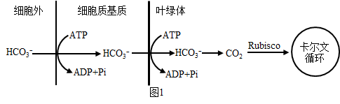

（3）某些植物还有另一种CO2浓缩机制，部分过程见图2。在叶肉细胞中，磷酸烯醇式丙酮酸羧化酶（PEPC）可将HCO3-转化为有机物，该有机物经过一系列的变化，最终进入相邻的维管束鞘细胞释放CO2，提高了Rubisco附近的CO2浓度。

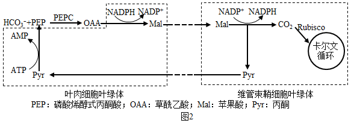

①由这种CO2浓缩机制可以推测，PEPC与无机碳的亲和力\_\_\_\_\_\_\_\_\_\_（填“高于”或“低于”或“等于”）Rubisco。

②图2所示的物质中，可由光合作用光反应提供的是\_\_\_\_\_\_\_\_\_\_。图中由Pyr转变为PEP的过程属于\_\_\_\_\_\_\_\_\_\_（填“吸能反应”或“放能反应”）。

③若要通过实验验证某植物在上述CO2浓缩机制中碳的转变过程及相应场所，可以使用\_\_\_\_\_\_\_\_\_\_技术。

（4）通过转基因技术或蛋白质工程技术，可能进一步提高植物光合作用的效率，以下研究思路合理的有\_\_\_\_\_\_\_\_\_\_。

A. 改造植物的HCO3-转运蛋白基因，增强HCO3-的运输能力

B. 改造植物的PEPC基因，抑制OAA的合成

C. 改造植物的Rubisco基因，增强CO2固定能力

D. 将CO2浓缩机制相关基因转入不具备此机制的植物

【答案】（1） ①. 三碳化合物 ②. 叶绿体基质

（2） ①. 叶绿体 ②. 呼吸作用和光合作用

（3） ①. 高于 ②. NADPH和ATP ③. 吸能 ④. 同位素示踪 （4）AC

【解析】

【分析】光合作用过程包括光反应和暗反应：（1）光反应：场所在叶绿体类囊体薄膜，完成水的光解产生\[H\]和氧气，以及ATP的合成；

（2）暗反应：场所在叶绿体基质中，包括二氧化碳的固定和C3的还原两个阶段。光反应为暗反应C3的还原阶段提供\[H\]和ATP。

【小问1详解】

光合作用的暗反应中，CO2被固定形成三碳化合物，进而被还原生成糖类，此过程发生在叶绿体基质中。

【小问2详解】

图示可知，HCO3-运输需要消耗ATP，说明HCO3-离子是通过主动运输的，主动运输一般是逆浓度运输，由此推断图中HCO3-浓度最高的场所是叶绿体。该过程中细胞质中需要的ATP由呼吸作用提供，叶绿体中的ATP由光合作用提供。

【小问3详解】

①PEPC参与催化HCO3-+PEP过程，说明PEPC与无机碳的亲和力高于Rubisco。

②图2所示的物质中，可由光合作用光反应提供的是ATP和NADPH，图中由Pyr转变为PEP的过程需要消耗ATP，说明图中由Pyr转变为PEP的过程属于吸能反应。

③若要通过实验验证某植物在上述CO2浓缩机制中碳的转变过程及相应场所，可以使用同位素示踪技术。

【小问4详解】

A、改造植物的HCO3-转运蛋白基因，增强HCO3-的运输能力，可以提高植物光合作用的效率，A符合题意；

B、改造植物的PEPC基因，抑制OAA的合成，不利于最终二氧化碳的生成，不能提高植物光合作用的效率，B不符合题意；

C、改造植物的Rubisco基因，增强CO2固定能力，可以提高植物光合作用的效率，C符合题意；

D、将CO2浓缩机制相关基因转入不具备此机制的植物，不一定提高植物光合作用的效率，D不符合题意。

故选AC。

【点睛】本题的知识点是光合作用的过程，旨在考查学生理解所学知识的要点，把握知识的内在联系戎知识网络，并学会根据题干和题图获取信息，利用相关信息结合所学知识进行推理、解答问题。

23\. 生物入侵是当今世界面临的主要环境问题之一。入侵种一般具有较强的适应能力、繁殖能力和扩散能力，而且在入侵地缺乏天敌，因而生长迅速，导致本地物种衰退甚至消失。回答下列问题：

（1）入侵种爆发时，种群增长曲线往往呈“J”型从环境因素考虑，其原因有\_\_\_\_\_\_\_\_\_\_（至少答出两点）。入侵种的爆发通常会使入侵地的物种多样性\_\_\_\_\_\_\_\_\_\_，群落发生\_\_\_\_\_\_\_\_\_\_演替。

（2）三裂叶豚草是辽宁省危害较大的外来入侵植物之一，某锈菌对三裂叶脉草表现为专一性寄生，可使叶片出现锈斑，对其生长有抑制作用为了验证该锈菌对三裂叶豚草的专一性寄生，科研人员进行了侵染实验。

方法：在三裂叶草和多种植物的离体叶片上分别喷一定浓度的锈菌菌液，将叶片静置于适宜条件下，观察和记录发病情况。

实验结果是：\_\_\_\_\_\_\_\_\_\_。

（3）为了有效控制三裂叶豚草，科研人员开展了生物控制试验，样地中三裂叶豚草初始播种量一致，部分试验结果见下表。

<table>
<colgroup>
<col style="width: 28%" />
<col style="width: 21%" />
<col style="width: 25%" />
<col style="width: 25%" />
</colgroup>
<tbody>
<tr>
<td rowspan="2" style="text-align: center;">组别</td>
<td colspan="3" style="text-align: center;">三裂叶豚草生物量（kg·m-2）</td>
</tr>
<tr>
<td style="text-align: center;">第1年</td>
<td style="text-align: center;">第2年</td>
<td style="text-align: center;">第3年</td>
</tr>
<tr>
<td style="text-align: center;">A：三裂叶豚草</td>
<td style="text-align: center;">8．07</td>
<td style="text-align: center;">12．24</td>
<td style="text-align: center;">12．24</td>
</tr>
<tr>
<td style="text-align: center;">B：三裂叶豚草+锈菌</td>
<td style="text-align: center;">7．65</td>
<td style="text-align: center;">6．43</td>
<td style="text-align: center;">4．77</td>
</tr>
<tr>
<td style="text-align: center;">C：三裂叶豚草+广聚萤叶甲</td>
<td style="text-align: center;">8．10</td>
<td style="text-align: center;">12．43</td>
<td style="text-align: center;">12．78</td>
</tr>
<tr>
<td style="text-align: center;">D：三裂叶豚草+野艾蒿</td>
<td style="text-align: center;">4．89</td>
<td style="text-align: center;">4．02</td>
<td style="text-align: center;">3．12</td>
</tr>
</tbody>
</table>

注：野艾蒿一植物，锈菌一真菌，广聚萤叶甲一昆虫

分析表中数据可知，除锈菌外，可用于控制三裂叶豚草的生物是\_\_\_\_\_\_\_\_\_\_，判断依据是\_\_\_\_\_\_\_\_\_\_。

（4）根据研究结果分析，在尚未被三裂叶豚草入侵但入侵风险较高的区域，可以采取的预防措施是\_\_\_\_\_\_\_\_\_\_；在已经被三裂叶豚草入侵的区域，为取得更好的治理效果可以采取的治理措施是\_\_\_\_\_\_\_\_\_\_。

【答案】（1） ①. 食物充足、空间充裕、没有敌害等 ②. 降低 ③. 次生

（2）只有三裂叶草出现锈斑，其他植物叶片正常生长

（3） ①. 野艾蒿 ②. D组的三裂叶豚草生物量明显低于对照组

（4） ①. 种植野艾蒿 ②. 喷洒锈菌

【解析】

【分析】1、“J”型曲线：指数增长函数，描述在食物充足，无限空间，无天敌的理想条件下生物无限增长的情况。

2、生物入侵是指某种生物从外地自然传入或人为引种后成为野生状态，并对本地生态系统造成一定危害的现象。这些生物被叫做外来物种。外来入侵物种具有生态适应能力强，繁殖能力强，传播能力强等特点。

【小问1详解】

在生存资源、空间充裕，气候适宜，没有敌害的理想条件下，种群数量无限增殖，呈现J型增长。生物入侵会使当地物种的生存受到威胁，通常会降低入侵地的物种多样性，使群落发生次生演替。

【小问2详解】

根据题干信息“某锈菌对三裂叶脉草表现为专一性寄生，可使叶片出现锈斑”可知，在三裂叶草和多种植物的离体叶片上分别喷一定浓度的锈菌菌液，是以条件培养一段时间后，只有三裂叶草出现锈斑，其他植物叶片正常生长。

【小问3详解】

由表格数据可知，D组和B组与对照组相比，都降低了三裂叶豚草生物量，由此可得除锈菌外，可用于控制三裂叶豚草的生物是野艾蒿。

【小问4详解】

在被三裂叶豚草入侵前可进行生物预防，即种植野艾蒿；当已经被三裂叶豚草入侵了，则需要进行喷洒锈菌及时治理。

【点睛】本题考查生物入侵及生态系统稳定性的相关知识，意在考查考生的识记能力和理解所学知识要点，把握知识间内在联系的能力；能运用所学知识，对生物学问题作出准确的判断。

24\. PHB2蛋白具有抑制细胞增殖的作用。为初步探究某动物PHB2蛋白抑制人宫颈癌细胞增殖的原因，研究者从基因数据库中获取了该蛋白的基因编码序列（简称phb2基因），大小为0．9kb（1kb=1000碱基对），利用大肠杆菌表达该蛋白。回答下列问题：

（1）为获取phb2基因，提取该动物肝脏组织的总RNA，再经\_\_\_\_\_\_\_\_\_\_过程得到cDNA，将其作为PCR反应的模板，并设计一对特异性引物来扩增目的基因。

（2）图1为所用载体图谱示意图，图中限制酶的识别序列及切割位点见下表。为使phb2基因（该基因序列不含图1中限制酶的识别序列）与载体正确连接，在扩增的phb2基因两端分别引入\_\_\_\_\_\_\_\_\_\_和\_\_\_\_\_\_\_\_\_\_两种不同限制酶的识别序列。经过这两种酶酶切的phb2基因和载体进行连接时，可选用\_\_\_\_\_\_\_\_\_\_（填“E．coliDNA连接酶”或“T4DNA连接酶”）。

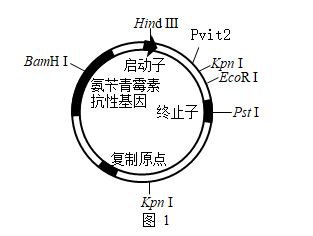

相关限制酶的识别序列及切割位点

<table>
<colgroup>
<col style="width: 25%" />
<col style="width: 25%" />
<col style="width: 25%" />
<col style="width: 25%" />
</colgroup>
<tbody>
<tr>
<td style="text-align: center;">名称</td>
<td style="text-align: center;">识别序列及切割位点</td>
<td style="text-align: center;">名称</td>
<td style="text-align: center;">识别序列及切割位点</td>
</tr>
<tr>
<td style="text-align: center;">HindⅢ</td>
<td style="text-align: center;">
A↓AGCTT

TTCGA↑A
</td>
<td style="text-align: center;">EcoRI</td>
<td style="text-align: center;">
G↓AATTC

CTTAA↑G
</td>
</tr>
<tr>
<td style="text-align: center;">PvitⅡ</td>
<td style="text-align: center;">
CAG↓CTG

GTC↑GAC
</td>
<td style="text-align: center;">PstI</td>
<td style="text-align: center;">
CTGC↓AG

GA↑CGTC
</td>
</tr>
<tr>
<td style="text-align: center;">KpnI</td>
<td style="text-align: center;">
G↓GTACC

CCATG↑G
</td>
<td style="text-align: center;">BamHI</td>
<td style="text-align: center;">
G↓GATCC

CCTAG↑G
</td>
</tr>
</tbody>
</table>

注：箭头表示切割位点

（3）转化前需用CaCl2处理大肠杆菌细胞，使其处于\_\_\_\_\_\_\_\_\_\_的生理状态，以提高转化效率。

（4）将转化后的大肠杆菌接种在含氨苄青霉素的培养基上进行培养，随机挑取菌落（分别编号为1、2、3、4）培养并提取质粒，用（2）中选用的两种限制酶进行酶切，酶切产物经电分离，结果如图2，\_\_\_\_\_\_\_\_号菌落的质粒很可能是含目的基因的重组质粒。

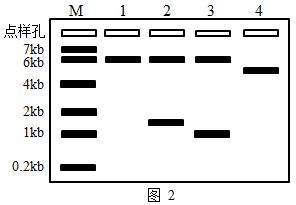

注：M为指示分子大小的标准参照物；小于0．2kb的DNA分子条带未出现在图中

（5）将纯化得到的PHB2蛋白以一定浓度添加到人宫颈癌细胞培养液中，培养24小时后，检测处于细胞周期（示意图见图3）不同时期的细胞数量，统计结果如图4。分析该蛋白抑制人宫颈癌细胞增殖可能的原因是将细胞阻滞在细胞周期的\_\_\_\_\_\_\_\_\_\_（填“G1”或“S”或“G2/M”）期。

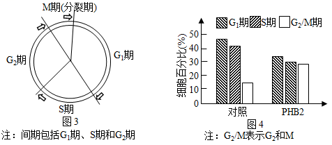

【答案】（1）逆转录 （2） ①. EcoRI ②. PvitⅡ ③. T4DNA连接酶 （3）感受态 （4）3

（5）G2/M

【解析】

【分析】分析图中质粒含有多个限制酶切位点，在启动子和终止子之间有三个酶切位点，KpnI在质粒上有两个酶切位点，PvitⅡ酶切后获得平末端。

图4中G1期和S期细胞减少，而G2期细胞数目明显增多。

将目的基因导入微生物细胞：Ca2+处理法。

【小问1详解】

利用RNA获得cDNA的过程称为逆转录。

【小问2详解】

根据启动子和终止子的生理作用可知，目的基因应导入启动子和终止子之间．图中看出，两者之间存在于三种限制酶切点，但是由于KpnI在质粒上不止一个酶切位点，所以应该选择EcoRI和PvitⅡ两种不同限制酶的识别序列；根据PvitⅡ的酶切序列，切出了平末端，所以构建基因表达载体时，应该用T4DNA连接酶连接质粒和目的基因。

【小问3详解】

转化时用CaCl2处理大肠杆菌细胞，使其处于感受态的生理状态，以提高转化效率。

【小问4详解】

由于这些菌落都可以生长在含有氨苄青霉素的培养基中，因此都含有质粒，重组质粒包含了目的基因和质粒，如果用EcoRI和PvitⅡ两种酶切割重组质粒电泳后将获得含有质粒和目的基因两条条带，由于phb2基因大小为0．9kb，所以对应电泳图是菌落3。

【小问5详解】

比较图4中G1期和S期细胞减少，而G2期细胞数目明显增多，说明了G1期和S期细胞可以进入G2期，而G2期的细胞没有能够完成分裂进入G1期，因此PHB2蛋白应该作用于G2/M期。

【点睛】本题考察基因工程的知识，需要考生分析质粒的酶切位点，结合目的基因转入的位置进行分析，结合题干中目的基因的大小分析电泳图。

25\. 水稻为二倍体雌雄同株植物，花为两性花。现有四个水稻浅绿叶突变体W、X、Y、Z，这些突变体的浅绿叶性状均为单基因隐性突变（显性基因突变为隐性基因）导致。回答下列问题：

（1）进行水稻杂交实验时，应首先除去\_\_\_\_\_\_\_\_\_\_未成熟花的全部\_\_\_\_\_\_\_\_\_\_，并套上纸袋。若将W与野生型纯合绿叶水稻杂交，F1自交，F2的表现型及比例为\_\_\_\_\_\_\_\_\_\_。

（2）为判断这四个突变体所含的浅绿叶基因之间的位置关系，育种人员进行了杂交实验，杂交组合及F1叶色见下表。

|      |     |     |                 |
|:----:|:---:|:---:|:---------------:|
| 实验分组 | 母本  | 父本  | F1叶色 |
| 第1组  | W   | X   | 浅绿              |
| 第2组  | W   | Y   | 绿               |
| 第3组  | W   | Z   | 绿               |
| 第4组  | X   | Y   | 绿               |
| 第5组  | X   | Z   | 绿               |
| 第6组  | Y   | Z   | 绿               |

实验结果表明，W的浅绿叶基因与突变体\_\_\_\_\_\_\_\_\_\_的浅绿叶基因属于非等位基因。为进一步判断X、Y、Z的浅绿叶基因是否在同一对染色体上，育种人员将第4、5、6三组实验的F1自交，观察并统计F2的表现型及比例。不考虑基因突变、染色体变异和互换，预测如下两种情况将出现的结果：

①若突变体X、Y、Z的浅绿叶基因均在同一对染色体上，结果为\_\_\_\_\_\_\_\_\_\_。

②若突变体X、Y的浅绿叶基因在同一对染色体上，Z的浅绿叶基因在另外一对染色体上，结果为\_\_\_\_\_\_\_\_\_\_。

（3）叶绿素a加氧酶的功能是催化叶绿素a转化为叶绿素b。研究发现，突变体W的叶绿素a加氧酶基因OsCAO1某位点发生碱基对的替换，造成mRNA上对应位点碱基发生改变，导致翻译出的肽链变短。据此推测，与正常基因转录出的mRNA相比，突变基因转录出的mRNA中可能发生的变化是\_\_\_\_\_\_\_\_\_\_。

【答案】（1） ①. 母本\
②. 雄蕊\
③. 绿叶：浅绿叶=3：1

（2） ①. Y、Z ②. 三组均为绿叶：浅绿叶=1：1 ③. 第4组绿叶：浅绿叶=1：1；第5组和第6组绿叶：浅绿叶=9：7 （3）终止密码提前出现

【解析】

【分析】基因自由组合定律的实质：位于非同源染色体上的非等位基因的分离或组合是互不干扰的；在减数分裂过程中，同源染色体上的等位基因彼此分离的同时，非同源染色体上的非等位基因自由组合。

【小问1详解】

水稻为雌雄同株两性花，利用水稻进行杂交时，应先除去母本未成熟花的全部雄蕊（防止自花受粉），并套袋，防止外来花粉干扰。若将浅绿叶W（隐性纯合）与野生型纯合绿叶水稻杂交，F1为杂合子，自交后代F2的表现型及比例为绿叶：浅绿叶=3：1。

【小问2详解】

分析表格：W、X、Y、Z均为单基因隐性突变形成的浅绿叶突变体，第1组W、X杂交，F1仍为浅绿叶，说明W和X为相同隐性基因控制；第2组W、Y杂交，第3组W、Z杂交，F1均表现绿叶，说明W的浅绿叶基因与Y、Z不是同一基因，即属于非等位基因。设W（X）的浅绿叶基因为a，Y的浅绿叶基因为b，Z的浅绿叶基因为c，当任何一对隐性基因纯合时就表现为浅绿叶。

①若突变体X、Y、Z的浅绿叶基因均在同一对染色体上，则第4组为X（aaBBCC）×Y（AAbbCC），F1基因型为AaBbCC，F1产生的配子为aBC、AbC，自交后代F2为1aaBBCC（浅绿叶）、1AAbbCC（浅绿叶）、2AaBbCC（绿叶），即绿叶：浅绿叶=1：1；同理第5组和第6组的结果也是绿叶：浅绿叶=1：1。

②若突变体X、Y的浅绿叶基因在同一对染色体上，Z的浅绿叶基因在另外一对染色体上，则第4组为X（aaBBCC）×Y（AAbbCC），结果与上一小问X、Y、Z的浅绿叶基因均在同一对染色体上时相同，即绿叶：浅绿叶=1：1；第5组为X（aaBBCC）×Z（AABBcc），F1基因型为AaBBCc，F1产生配子时，A、a和C、c可以进行自由组合，产生4种配子，自交后代F2符合9：3：3：1，由于何一对隐性基因纯合时就表现为浅绿叶，则F2的表现型为绿叶：浅绿叶=9：7；第6组为Y（AAbbCC）×Z（AABBcc），F1基因型为AABbCc，F1产生配子时，B、b和C、c可以进行自由组合，F2结果与第5组相同，即绿叶：浅绿叶=9：7。

【小问3详解】

分析题意可知，OsCAO1基因某位点发生碱基对的替换，造成mRNA上对应位点碱基发生改变，有可能使终止密码提前出现，导致翻译出的肽链变短。

【点睛】本题结合可遗传变异，考查基因的分离定律和基因的自由组合定律的相关知识，解题本题关键是根据杂交实验的表格获取到基因类型和所在位置，再结合所学知识解决问题。
