**2021年重庆市新高考生物试卷**

**一、选择题：本题共20小题，每小题2分，共40分。在每小题给出的四个选项中，只有一项是符合题目要求的。**

1．（2分）香蕉可作为人们运动时的补给品，所含以下成分中，不能被吸收利用的是（　　）

A．纤维素 B．钾离子 C．葡萄糖 D．水

2．（2分）关于新型冠状病毒，下列叙述错误的是（　　）

A．控制该病毒在人群中传播的有效方式是普遍接种该病毒疫苗

B．使用75%酒精消毒可降低人体感染该病毒的概率

C．宿主基因指导该病毒外壳蛋白的合成

D．冷链运输的物资上该病毒检测为阳性，不一定具有传染性

3．（2分）某胶原蛋白是一种含18种氨基酸的细胞外蛋白。下列叙述正确的是（　　）

A．食物中的该蛋白可被人体直接吸收

B．人体不能合成组成该蛋白的所有氨基酸

C．未经折叠的该蛋白具有生物学功能

D．该蛋白在内质网内完成加工

4．（2分）人体细胞溶酶体内较高的H+浓度（pH为5.0左右）保证了溶酶体的正常功能。下列叙述正确的是（　　）

A．溶酶体可合成自身所需的蛋白

B．溶酶体酶泄露到细胞质基质后活性不变

C．细胞不能利用被溶酶体分解后产生的物质

D．溶酶体内pH的维持需要膜蛋白协助

5．（2分）人脐血含有与骨髓中相同类型的干细胞。关于脐血中的干细胞，下列叙述错误的是（　　）

A．可用来治疗造血功能障碍类疾病

B．分化后，表达的蛋白种类发生变化

C．分化后，细胞结构发生变化

D．具有与早期胚胎细胞相同的分化程度

6．（2分）如图为类囊体膜蛋白排列和光反应产物形成的示意图。据图分析，下列叙述错误的是（　　）

> 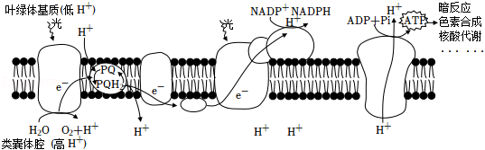

A．水光解产生的O2若被有氧呼吸利用，最少要穿过4层膜

B．NADP+与电子（e﹣）和质子（H+）结合形成NADPH

C．产生的ATP可用于暗反应及其他消耗能量的反应

D．电子（e﹣）的有序传递是完成光能转换的重要环节

7．（2分）有研究表明，人体细胞中DNA发生损伤时，P53蛋白能使细胞停止在细胞周期的间期并激活DNA的修复，修复后的细胞能够继续完成细胞周期的其余过程。据此分析，下列叙述错误的是（　　）

A．P53基因失活，细胞癌变的风险提高

B．P53蛋白参与修复的细胞，与同种正常细胞相比，细胞周期时间变长

C．DNA损伤修复后的细胞，与正常细胞相比，染色体数目发生改变

D．若组织内处于修复中的细胞增多，则分裂期的细胞比例降低

8．（2分）人的一个卵原细胞在减数第一次分裂时，有一对同源染色体没有分开而进入次级卵母细胞，最终形成染色体数目异常的卵细胞个数为（　　）

A．1 B．2 C．3 D．4

9．（2分）基因编辑技术可以通过在特定位置加入或减少部分基因序列，实现对基因的定点编辑。对月季色素合成酶基因进行编辑后，其表达的酶氨基酸数量减少，月季细胞内可发生改变的是（　　）

A．基因的结构与功能 B．遗传物质的类型

C．DNA复制的方式 D．遗传信息的流动方向

10．（2分）家蚕性别决定方式为ZW型。Z染色体上的等位基因D、d分别控制正常蚕、油蚕性状，常染色体上的等位基因E、e分别控制黄茧、白茧性状。现有EeZDW×EeZdZd的杂交组合，其F1中白茧、油茧雌性个体所占比例为（　　）

A． B． C． D．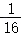

11．（2分）如图为某显性遗传病和ABO血型的家系图。据图分析，以下推断可能性最小的是（　　）

> 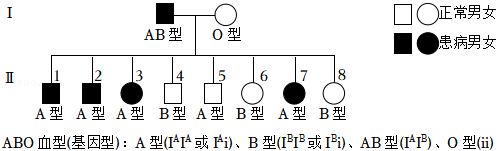

A．该遗传病为常染色体显性遗传病

B．该遗传病为X染色体显性遗传病

C．该致病基因不在IB基因所在的染色体上

D．Ⅱ5不患病是因为发生了同源染色体交叉互换或突变

12．（2分）科学家建立了一个蛋白质体外合成体系（含有人工合成的多聚尿嘧啶核苷酸、除去了DNA和mRNA的细胞提取液）。在盛有该合成体系的四支试管中分别加入苯丙氨酸、丝氨酸、酪氨酸和半胱氨酸后，发现只有加入苯丙氨酸的试管中出现了多肽链。下列叙述错误的是（　　）

A．合成体系中多聚尿嘧啶核苷酸为翻译的模板

B．合成体系中的细胞提取液含有核糖体

C．反密码子为UUU的tRNA可携带苯丙氨酸

D．试管中出现的多肽链为多聚苯丙氨酸

13．（2分）下列有关人体内环境及其稳态的叙述正确的是（　　）

A．静脉滴注后，药物可经血浆、组织液到达靶细胞

B．毛细淋巴管壁细胞所处的内环境是淋巴和血浆

C．体温的改变与组织细胞内的代谢活动无关

D．血浆渗透压降低可使红细胞失水皱缩

14．（2分）如图为鱼类性激素分泌的分级调节示意图。下列叙述正确的是（　　）

> 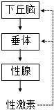

A．垂体分泌的激素不能运输到除性腺外的其他部位

B．给性成熟雌鱼饲喂雌性激素可促进下丘脑和垂体的分泌活动

C．下丘脑分泌的促性腺激素可促使垂体分泌促性腺素释放激素

D．将性成熟鱼的垂体提取液注射到同种性成熟鱼体内可促使其配子成熟

15．（2分）学生参加适度的体育锻炼和体力劳动有助于增强体质、改善神经系统功能。关于锻炼和劳动具有的生理作用，下列叙述错误的是（　　）

A．有利于增强循环和呼吸系统的功能

B．有助于机体进行反射活动

C．有利于突触释放递质进行兴奋的双向传递

D．有益于学习和记忆活动

16．（2分）如图为用三种不同品系的小鼠进行皮肤移植实验的示意图。下列关于小鼠①、②、③对移植物发生排斥反应速度的判断，正确的是（　　）

> 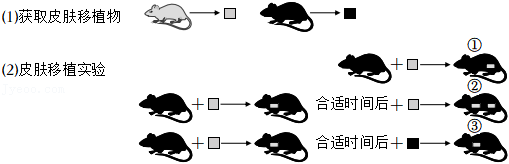

A．①最迅速 B．②最迅速 C．③最迅速 D．②与③相近

17．（2分）研究发现，登革病毒在某些情况下会引发抗体依赖增强效应，即病毒再次感染人体时，体内已有的抗体不能抑制反而增强病毒的感染能力，其过程如图所示。下列叙述错误的是（　　）

> 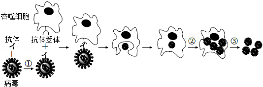

A．过程①，抗体与病毒结合依赖于抗原抗体的特异性

B．过程②，病毒利用吞噬细胞进行增殖

C．过程③释放的病毒具有感染能力

D．抗体依赖增强效应的过程属于特异性免疫

18．（2分）新中国成立初期，我国学者巧妙地运用长瘤的番茄幼苗研究了生长素的分布及锌对生长素的影响，取样部位及结果见表。据此分析，下列叙述错误的是（　　）

<table style="width:97%;">
<colgroup>
<col style="width: 22%" />
<col style="width: 19%" />
<col style="width: 27%" />
<col style="width: 27%" />
</colgroup>
<thead>
<tr>
<th rowspan="7" style="text-align: center;">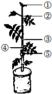</th>
<th rowspan="2" style="text-align: center;">取样部位</th>
<th colspan="2" style="text-align: center;">生长素含量（μg•kg﹣1）</th>
</tr>
<tr>
<th style="text-align: center;">对照组</th>
<th style="text-align: center;">低锌组</th>
</tr>
<tr>
<th style="text-align: center;">①茎尖</th>
<th style="text-align: center;">12.5</th>
<th style="text-align: center;">3.3</th>
</tr>
<tr>
<th style="text-align: center;">②茎的上部</th>
<th style="text-align: center;">3.7</th>
<th style="text-align: center;">2.5</th>
</tr>
<tr>
<th style="text-align: center;">③瘤上方的茎部</th>
<th style="text-align: center;">4.8</th>
<th style="text-align: center;">2.9</th>
</tr>
<tr>
<th style="text-align: center;">④长瘤的茎部</th>
<th style="text-align: center;">7.9</th>
<th style="text-align: center;">3.7</th>
</tr>
<tr>
<th style="text-align: center;">⑤瘤</th>
<th style="text-align: center;">26.5</th>
<th style="text-align: center;">5.3</th>
</tr>
</thead>
<tbody>
</tbody>
</table>

A．部位①与部位②的生长素运输方向有差异

B．部位③含量较高的生长素会促进该部位侧芽生长

C．因部位⑤的存在，部位④生长素含量高于部位③

D．对照组生长素含量明显高于低锌组，表明锌有利于生长素合成

19．（2分）若某林区的红松果实、某种小型鼠（以红松果实为食）和革蜱的数量变化具有如图所示的周期性波动特征。林区居民因革蜱叮咬而易患森林脑炎。据此分析，下列叙述错误的是（　　）

> 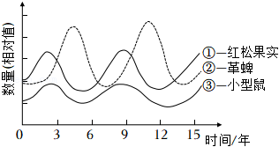

A．曲线③和①不能明显体现捕食关系，推测是小型鼠繁殖能力强所致

B．通过曲线②与③的关系推断小型鼠与革蜱不是互利共生关系

C．曲线③在K值上下波动，影响K值的主要因素是小型鼠的出生率、死亡率、迁入率和迁出率

D．林区居民森林脑炎发病率会呈现与曲线②相似的波动特征

20．（2分）在相同条件下，分别用不同浓度的蔗糖溶液处理洋葱鳞片叶表皮细胞，观察其质壁分离，再用清水处理后观察其质壁分离复原，实验结果如图。下列叙述错误的是（　　）

> 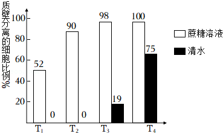

A．T1组经蔗糖溶液处理后，有52%的细胞原生质层的收缩程度大于细胞壁

B．各组蔗糖溶液中，水分子不能从蔗糖溶液进入细胞液

C．T1和T2组经清水处理后发生质壁分离的细胞均复原

D．T3和T4组若持续用清水处理，质壁分离的细胞比例可能下降

**二、非选择题：共60分。第21～24题为必考题，每个试题考生都必须作答。第25～26题为选考题，考生根据要求作答。（一）必考题：共45分。**

21．（10分）人线粒体呼吸链受损可导致代谢物X的积累，由此引发多种疾病。动物实验发现，给呼吸链受损小鼠注射适量的酶A和酶B溶液，可发生如图所示的代谢反应，从而降低线粒体呼吸链受损导致的危害。据图回答以下问题：

> 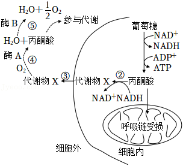
> 
> （1）呼吸链受损会导致 <u>　 　</u>（填“有氧”或“无氧”）呼吸异常，代谢物X是 <u>　 　</u>。
> 
> （2）过程⑤中酶B的名称为 <u>　 　</u>，使用它的原因是 <u>　 　</u>。
> 
> （3）过程④将代谢物X消耗，对内环境稳态的作用和意义是 <u>　 　</u>。

22．（14分）2017年，我国科学家发现一个水稻抗稻瘟病的隐性突变基因b（基因中的一个碱基A变成G），为水稻抗病育种提供了新的基因资源。请回答以下问题：

> （1）基因B突变为b后，组成基因的碱基数量 <u>　 　</u>。
> 
> （2）基因b包含一段DNA单链序列TAGCTG，能与其进行分子杂交的DNA单链序列为 <u>　 　</u>。自然界中与该序列碱基数量相同的DNA片段最多有 <u>　 　</u>种。
> 
> （3）基因b影响水稻基因P的转录，使得酶P减少，从而表现出稻瘟病抗性。据此推测，不抗稻瘟病水
> 
> 稻细胞中基因P转录的mRNA量比抗稻瘟病水稻细胞 <u>　 　</u>。
> 
> （4）现有长穗、不抗稻瘟病（HHBB）和短穗、抗稻瘟病（hhbb）两种水稻种子，欲通过杂交育种方法选育长穗、抗稻瘟病的纯合水稻。请用遗传图解写出简要选育过程。
> 
> （5）某水稻群体中抗稻瘟病植株的基因型频率为10%，假如该群体每增加一代，抗稻瘟病植株增加10%、不抗稻病植株减少10%，则第二代中，抗稻瘟病植株的基因型频率为 <u>　 　</u>%（结果保留整数）。

23．（9分）“瓦尔迪兹”油轮意外失事泄漏大量原油，造成严重的海洋污染，生物种群受到威胁。为探究原油污染对海獭的影响，生态学家进行了长达25年的研究，有以下发现：

> Ⅰ.原常以海豹为食的虎鲸，现大量捕食海獭。
> 
> Ⅱ.过度捕捞鲑鱼，造成以鲑鱼为食的海豹数量锐减。
> 
> Ⅲ.海獭的食物海胆数量增加，而海胆的食物大型藻数量锐减。
> 
> 请回答下列问题：
> 
> （1）由上述发现可知，原油泄漏 <u>　 　</u>（填“是”或“不是”）引起海獭数最持续减少的直接原因。
> 
> （2）上述材料中，虎鲸至少属于食物链（网）中的第 <u>　 　</u>营养级；食物链顶端的虎鲸种群数量最少，
> 
> 从能量流动角度分析，原因是 <u>　 　</u>。
> 
> （3）若不停止过度捕捞，多年后该海域生态系统可能出现的结果有 <u>　 　</u>。（多选，填序号）
> 
> ①虎鲸的生存受到威胁
> 
> ②流经该生态系统的总能量下降
> 
> ③该生态系统结构变得简单
> 
> ④生态系统抵抗力稳定性提高
> 
> （4）结合本研究，你认为我国2021年在长江流域重点水域开始实行“十年禁渔”的目的是 <u>　 　</u>。

24．（12分）GR24是新型植物激素独脚金内酯的人工合成类似物，在农业生产上合理应用可提高农作物的抗逆性和产量。

> （1）某小组研究了弱光条件下GR24对番茄幼苗生长的影响，结果（均值）见表：

<table style="width:97%;">
<colgroup>
<col style="width: 16%" />
<col style="width: 16%" />
<col style="width: 16%" />
<col style="width: 16%" />
<col style="width: 16%" />
<col style="width: 16%" />
</colgroup>
<thead>
<tr>
<th style="text-align: center;">
指标

处理
</th>
<th style="text-align: center;">叶绿素a含量（mg•g﹣1）</th>
<th style="text-align: center;">叶绿素b含量（mg•g﹣1）</th>
<th style="text-align: center;">叶绿素a/b</th>
<th style="text-align: center;">单株干重（g）</th>
<th style="text-align: center;">单株分枝数（个）</th>
</tr>
</thead>
<tbody>
<tr>
<td style="text-align: center;">弱光+水</td>
<td style="text-align: center;">1.39</td>
<td style="text-align: center;">0.61</td>
<td style="text-align: center;">2.28</td>
<td style="text-align: center;">1.11</td>
<td style="text-align: center;">1.83</td>
</tr>
<tr>
<td style="text-align: center;">弱光+GR24</td>
<td style="text-align: center;">1.98</td>
<td style="text-align: center;">0.98</td>
<td style="text-align: center;">2.02</td>
<td style="text-align: center;">1.30</td>
<td style="text-align: center;">1.54</td>
</tr>
</tbody>
</table>

> ①结果表明，GR24处理使幼苗叶绿素含量上升、叶绿素a/b <u>　 　</u>（填“上升”或“下降”），净光合速率 <u>　 　</u>，提高了幼苗对弱光的利用能力。GR24处理抑制了幼苗分枝，与该作用效应相似的另一类激素是 <u>　 　</u>。
> 
> ②若幼苗长期处于弱光下，叶绿体的发育会产生适应性变化，类囊体数目会 <u>　 　</u>。若保持其他条件不变，适度增加光照强度，气孔开放程度会 <u>　 　</u>（填“增大”或“减小”）。
> 
> （2）列当是根寄生性杂草。土壤中的列当种子会被番茄根部释放的独脚金内酯诱导萌发，然后寄生在番茄根部使其减产；若缺乏宿主，则很快死亡。
> 
> ①应用GR24降低列当对番茄危害的措施为 <u>　 　</u>。
> 
> ②为获得被列当寄生可能性小的番茄品种，应筛选出释放独脚金内酯能力 <u>　 　</u>的植株。

**（二）选考题：共15分。请考生从2道生物题中任选一题作答。如果多做，则按所做的第一题计分。\[生物——选修1：生物技术实践\]（15分）**

25．（15分）人们很早就能制作果酒，并用果酒进一步发酵生产果醋。

> （1）人们利用水果及附着在果皮上的 <u>　 　</u>菌，在18～25℃、无氧条件下酿造果酒；再利用醋酸菌在 <u>　 　</u>条件下，将酒精转化成醋酸酿得果醋。酿造果醋时，得到了醋酸产率较高的醋酸菌群，为进一步纯化获得优良醋酸菌菌种，采用的接种方法是 <u>　 　</u>。
> 
> （2）先酿制果酒再生产果醋的优势有 <u>　 　</u>（多选，填序号）。
> 
> ①先酿制果酒，发酵液能抑制杂菌的生长，有利于提高果醋的产率
> 
> ②酿制果酒时形成的醋酸菌膜，有利于提高果醋的产率
> 
> ③果酒有利于溶出水果中的风味物质并保留在果醋中
> 
> （3）果酒中的酒精含量对果醋的醋酸产率会产生一定的影响。某技术组配制发酵液研究了初始酒精浓度对醋酸含量的影响，结果如图。该技术组使用的发酵液中，除酒精外还包括的基本营养物质有 <u>　 　</u>（填写两种）。据图可知，醋酸发酵的最适初始酒精浓度是 <u>　 　</u>；酒精浓度为10%时醋酸含量最低，此时，若要尽快提高醋酸含量，可采取的措施有 <u>　 　</u>（填写两个方面）。
> 
> 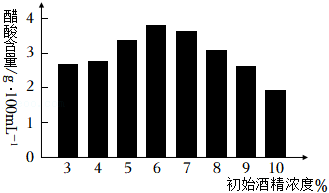

**\[生物——选修3：现代生物科技专题\]（15分）**

26．为了研究PDCD4基因对小鼠子宫内膜基质细胞凋亡的影响，进行了相关实验。

> （1）取小鼠子宫时，为避免细菌污染，手术器具应进行 <u>　 　</u>处理，子宫取出剪碎后，用 <u>　 　</u>处理一定时间，可获得分散的子宫内膜组织细胞，再分离获得基质细胞用于培养。
> 
> （2）培养基中营养物质应有 <u>　 　</u>（填写两种）；培养箱中CO2浓度为5%，其主要作用是 <u>　 　</u>。
> 
> （3）在含PDCD4基因的表达载体中，启动子的作用是 <u>　 　</u>。为了证明PDCD4基因对基质细胞凋亡的作用，以含PDCD4基因的表达载体和基质细胞的混合培养为实验组，还应设立两个对照组，分别为 <u>　 　</u>。
> 
> 经检测，实验组中PDCD4表达水平和细胞凋亡率显著高于对照组，说明该基因对基质细胞凋亡具有 <u>　 　</u>（填“抑制”或“促进”）作用。
