**2021年重庆市新高考生物试卷**

**参考答案与试题解析**

**一、选择题：本题共20小题，每小题2分，共40分。在每小题给出的四个选项中，只有一项是符合题目要求的。**

1．（2分）香蕉可作为人们运动时的补给品，所含以下成分中，不能被吸收利用的是（　　）

A．纤维素 B．钾离子 C．葡萄糖 D．水

> 【分析】组成细胞的化合物包括无机物和有机物，无机物包括水和无机盐，有机物包括蛋白质、脂质、糖类和核酸。
> 
> 【解答】解：人体内没有分解纤维素的酶，不能吸收利用食物中的纤维素；钾离子是人体所需的无机盐，葡萄糖是人体所需的主要能源物质，可以被人体吸收利用；水是人体必需的无机物，可以被人体吸收利用。
> 
> 故选：A。
> 
> 【点评】本题结合生活情境考查组成细胞的化合物的种类以及在动、植物体中的分布，要求学生了解动植物细胞中化合物组成的异同点，再结合题目情境分析作答，难度不大。

2．（2分）关于新型冠状病毒，下列叙述错误的是（　　）

A．控制该病毒在人群中传播的有效方式是普遍接种该病毒疫苗

B．使用75%酒精消毒可降低人体感染该病毒的概率

C．宿主基因指导该病毒外壳蛋白的合成

D．冷链运输的物资上该病毒检测为阳性，不一定具有传染性

> 【分析】1、病毒一般由蛋白质和核酸构成，具有严整的结构，营寄生生活，通过侵染宿主进行增殖，进入宿主细胞后具有遗传和变异的特征，离开活细胞后不再进行生命活动。
> 
> 2、疫苗是将病原微生物（如细菌、立克次氏体、病毒等）及其代谢产物，经过人工减毒、灭活或利用基因工程等方法制成的用于预防传染病的自动免疫制剂。疫苗保留了病原菌刺激动物体免疫系统的特性。
> 
> 【解答】解：A、控制该病毒在人群中传播的有效方式是普遍接种该病毒疫苗，A正确；
> 
> B、新冠病毒会被酒精杀死，所以使用75%酒精消毒可降低人体感染该病毒的概率，B正确；
> 
> C、该病毒外壳蛋白的合成是由病毒自身的遗传物质指导合成的，C错误；
> 
> D、冷链运输的物资上该病毒检测为阳性，病毒在潜伏期时不一定具有传染性，D正确。
> 
> 故选：C。
> 
> 【点评】本题以近年热点问题新冠病毒为载体考查病毒的生活方式及繁殖相关内容，考生需掌握相关知识，才能准确答题。

3．（2分）某胶原蛋白是一种含18种氨基酸的细胞外蛋白。下列叙述正确的是（　　）

A．食物中的该蛋白可被人体直接吸收

B．人体不能合成组成该蛋白的所有氨基酸

C．未经折叠的该蛋白具有生物学功能

D．该蛋白在内质网内完成加工

> 【分析】蛋白质的单体是氨基酸，氨基酸分为必需氨基酸和非必需氨基酸，没有空间结构的蛋白质没有生物活性。
> 
> 【解答】解：A、蛋白质需要被蛋白酶分解为氨基酸后才能被人体吸收，A错误；
> 
> B、人体只能合成部分氨基酸，题目中所描述的18种氨基酸的细胞外蛋白中，可能会有人体不能合成的氨基酸，B正确；
> 
> C、未经折叠的蛋白质没有生物活性，也就没有生物学功能，C错误；
> 
> D、该蛋白需要在内质网和高尔基体上加工后才能分泌到细胞外，D错误。
> 
> 故选：B。
> 
> 【点评】本题主要考查蛋白质的形成内容，考生要掌握相关知识，才能准确答题。

4．（2分）人体细胞溶酶体内较高的H+浓度（pH为5.0左右）保证了溶酶体的正常功能。下列叙述正确的是（　　）

A．溶酶体可合成自身所需的蛋白

B．溶酶体酶泄露到细胞质基质后活性不变

C．细胞不能利用被溶酶体分解后产生的物质

D．溶酶体内pH的维持需要膜蛋白协助

> 【分析】溶酶体内含有多种水解酶，能够分解很多种物质以及衰老、损伤的细胞器，清除侵入细胞的病毒或病菌，被比喻为细胞内的“消化车间”。
> 
> 【解答】解：A、溶酶体含多种水解酶，水解酶的化学本质是蛋白质，故水解酶是在核糖体上合成的，A错误；
> 
> B、溶酶体内的水解酶在pH为5左右时活性最高，但溶酶体周围的细胞质基质的pH为7.2，当泄露到细胞质基质后，pH上升，酶活性会降低，B错误；
> 
> C、被溶酶体分解后的产物，有用的留在细胞，无用的排出细胞外，C错误；
> 
> D、溶酶体内pH的维持依靠氢离子的浓度，而氢离子的浓度的维持需要膜蛋白协助，D正确。
> 
> 故选：D。
> 
> 【点评】本题主要考查溶酶体的作用机制以及水解酶产生的相关内容，考生需掌握相关知识，才能准确答题。

5．（2分）人脐血含有与骨髓中相同类型的干细胞。关于脐血中的干细胞，下列叙述错误的是（　　）

A．可用来治疗造血功能障碍类疾病

B．分化后，表达的蛋白种类发生变化

C．分化后，细胞结构发生变化

D．具有与早期胚胎细胞相同的分化程度

> 【分析】骨髓中含有造血干细胞，属于多能干细胞，能增殖、分化成为各种血细胞或淋巴细胞等。
> 
> 【解答】解：A、脐血中含有与骨髓中相同类型的干细胞，可以增殖、分化为血细胞，用来治疗造血功能障碍类疾病，A正确；
> 
> B、细胞分化的实质是基因的选择性表达，使得细胞中蛋白质种类有所不同，B正确；
> 
> C、基因的选择性表达使得不同组织细胞在形态、结构和功能上发生稳定性变化，C正确；
> 
> D、早期胚胎细胞的全能性高于脐血中的干细胞，其分化程度相对脐血中的干细胞更低，D错误。
> 
> 故选：D。
> 
> 【点评】本题结合题干信息考查干细胞的特点与细胞分化的相关知识，要求学生理解细胞分化的实质，掌握细胞分化的特征，明确干细胞的特点，再结合选项进行分析，难度不大。

6．（2分）如图为类囊体膜蛋白排列和光反应产物形成的示意图。据图分析，下列叙述错误的是（　　）

> 

A．水光解产生的O2若被有氧呼吸利用，最少要穿过4层膜

B．NADP+与电子（e﹣）和质子（H+）结合形成NADPH

C．产生的ATP可用于暗反应及其他消耗能量的反应

D．电子（e﹣）的有序传递是完成光能转换的重要环节

> 【分析】1、细胞呼吸是指有机物在细胞内经过一系列的氧化分解，生成二氧化碳或其他产物，释放出能量并生成ATP的过程，其中有氧呼吸分为三个阶段，第一阶段在细胞质基质中进行，第二阶段在线粒体基质中进行，第三阶段在线粒体内膜中进行；无氧呼吸两个阶段都在细胞质基质中进行。
> 
> 2、光合作用的光反应阶段（场所是叶绿体的类囊体膜上）：水的光解产生\[H\]与氧气，以及ATP的形成。
> 
> 光合作用的暗反应阶段（场所是叶绿体的基质中）：二氧化碳被五碳化合物固定形成三碳化合物，三碳化合物在光反应提供的ATP和\[H\]的作用下还原生成糖类有机物。
> 
> 【解答】解：A、水光解产生的O2场所是叶绿体的类囊体膜上，若被有氧呼吸利用，其场所在线粒体内膜，氧气从叶绿体类囊体膜开始，穿过叶绿体2层膜，然后进入同一细胞中的线粒体，经过外膜后就到达了内膜，所以至少要穿过3层膜，A错误；
> 
> B、光反应中NADP+与电子（e﹣）和质子（H+）结合形成NADPH，提供给暗反应，B正确；
> 
> C、由图可知，产生的ATP可用于暗反应以及核酸代谢，色素合成等其他消耗能量的反应，C正确；
> 
> D、电子（e﹣）的有序传递是完成光能转换的重要环节，D正确。
> 
> 故选：A。
> 
> 【点评】本题主要考查光合作用中光反应的过程，考生需掌握相关知识，才能准确答题。

7．（2分）有研究表明，人体细胞中DNA发生损伤时，P53蛋白能使细胞停止在细胞周期的间期并激活DNA的修复，修复后的细胞能够继续完成细胞周期的其余过程。据此分析，下列叙述错误的是（　　）

A．P53基因失活，细胞癌变的风险提高

B．P53蛋白参与修复的细胞，与同种正常细胞相比，细胞周期时间变长

C．DNA损伤修复后的细胞，与正常细胞相比，染色体数目发生改变

D．若组织内处于修复中的细胞增多，则分裂期的细胞比例降低

> 【分析】基因突变是指DNA分子中碱基对的增添、缺失或替换而引起的基因结构的改变，其发生时间在DNA分子复制时，细胞周期的间期。
> 
> 【解答】解：A、由题意可知，P53蛋白能使细胞停止在细胞周期的间期并激活DNA的修复，当P53基因失活，DNA分子产生错误无法修复，容易癌变，所以细胞癌变的风险提高，A正确；
> 
> B、DNA分子复制如出现受损，P53蛋白会参与修复，需要相应的时间，使间期延长，所以与同种正常细胞相比，细胞周期时间变长，B正确；
> 
> C、DNA损伤修复是发生在碱基对中，与染色体无关，C错误；
> 
> D、若组织内处于修复中的细胞增多，则位于间期的细胞较多，则分裂期的细胞比例降低，D正确。
> 
> 故选：C。
> 
> 【点评】本题主要考查基因突变中DNA分子自发突变的相关内容，考生需掌握相关知识，才能准确答题。

8．（2分）人的一个卵原细胞在减数第一次分裂时，有一对同源染色体没有分开而进入次级卵母细胞，最终形成染色体数目异常的卵细胞个数为（　　）

A．1 B．2 C．3 D．4

> 【分析】减数分裂过程：（1）减数分裂前的间期：完成染色体的复制，细胞适度生长。（2）减数第一次分裂：①前期：同源染色体联会，同源染色体上的非姐妹染色单体交叉互换；②中期：同源染色体成对的排列在赤道板上；③后期：同源染色体彼此分离，非同源染色体自由组合；④末期：完成减数第一次分裂，形成两个子细胞。（3）减数第二次分裂：与有丝分裂过程类似，主要发生着丝粒分裂，产生的子染色体移向细胞两极，分配到两个子细胞中。
> 
> 【解答】解：一个卵原细胞在减数第一次分裂时，有一对同源染色体没有分开而进入次级卵母细胞，所形成的次级卵母细胞中多了一条染色体，（第一）极体中少了一条染色体。次级卵母细胞完成减数第二次分裂，产生一个卵细胞和一个（第二）极体，细胞中多了一条染色体。故最终形成染色体数目异常的卵细胞个数为1个。
> 
> 故选：A。
> 
> 【点评】本题结合具体情境考查减数分裂与染色体变异，要求学生掌握减数分裂的过程与特征，再结合题中情境进行分析判断。

9．（2分）基因编辑技术可以通过在特定位置加入或减少部分基因序列，实现对基因的定点编辑。对月季色素合成酶基因进行编辑后，其表达的酶氨基酸数量减少，月季细胞内可发生改变的是（　　）

A．基因的结构与功能 B．遗传物质的类型

C．DNA复制的方式 D．遗传信息的流动方向

> 【分析】基因是DNA上有遗传效应的片段。
> 
> 【解答】解：A、根据题干信息分析，对月季色素合成酶基因进行编辑后，其表达的酶氨基酸数量减少，说明该技术可能改变了月季细胞内基因的碱基序列，从而改变了基因的结构与功能，A正确；
> 
> B、月季细胞内的遗传物质的类型不变，仍然是DNA，B错误；
> 
> C、月季细胞内的DNA复制的方式不变，C错误；
> 
> D、月季细胞内遗传信息的流动方向不变，D错误。
> 
> 故选：A。
> 
> 【点评】本题主要考查基因与形状之间的关系，考生需掌握相关知识，才能准确答题。

10．（2分）家蚕性别决定方式为ZW型。Z染色体上的等位基因D、d分别控制正常蚕、油蚕性状，常染色体上的等位基因E、e分别控制黄茧、白茧性状。现有EeZDW×EeZdZd的杂交组合，其F1中白茧、油茧雌性个体所占比例为（　　）

A． B． C． D．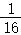

> 【分析】用分离定律解决自由组合问题
> 
> （1）基因原理分离定律是自由组合定律的基础。
> 
> （2）解题思路首先将自由组合定律问题转化为若干个分离定律问题．在独立遗传的情况下，有几对基因就可以分解为几个分离定律问题。如AaBb×Aabb可分解为：Aa×Aa，Bb×bb．然后，按分离定律进行逐一分析．最后，将获得的结果进行综合，得到正确答案。
> 
> 【解答】解：EeZDW×EeZdZd杂交，F1中白茧、油茧雌性（eeZdW）所占的比例为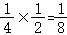。
> 
> 故选：C。
> 
> 【点评】本题主要考查基因的自由组合定律和伴性遗传的相关知识，要求考生识记自由组合定律的实质，掌握逐对分析法的应用，再结合所学知识正确答题。

11．（2分）如图为某显性遗传病和ABO血型的家系图。据图分析，以下推断可能性最小的是（　　）

> 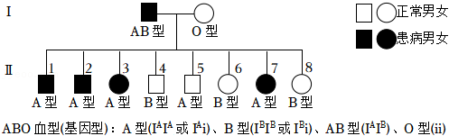

A．该遗传病为常染色体显性遗传病

B．该遗传病为X染色体显性遗传病

C．该致病基因不在IB基因所在的染色体上

D．Ⅱ5不患病是因为发生了同源染色体交叉互换或突变

> 【分析】系谱图分析：该病为显性遗传病，假设为伴X染色体显性遗传，则Ⅰ1的女儿均会患病，患病男性的母亲也会患病，与系谱图实际情况矛盾，故该遗传病不是伴X染色体显性遗传，应该是常染色体显性遗传。设相关基因为D、d，则亲代Ⅰ1、Ⅰ2的基因型分别为Dd和dd，子代患者均为Dd，正常个体基因型均为dd。Ⅰ1、Ⅰ2的血型有关基因型分别为为IAIB、ii，子代四个患者的血型有关基因型均为IAi，正常个体的血型大多为B型，只有Ⅱ5的血型为A型。
> 
> 【解答】解：AB、根据上述分析，该遗传病为常染色体显性遗传病，而不是X染色体显性遗传病，A正确，B错误；
> 
> C、根据上述分析，四个患者从他们的父亲继承了致病基因，但没有继承IB基因，说明该致病基因不在IB基因所在的染色体上，C正确；
> 
> D、根据上述分析，该致病基因很可能与IA基因位于同一条染色体上，Ⅱ5不患病但是血型为A型血，可能的原因是同源染色体交叉互换或突变，是的IA所在染色体上没有致病基因，D正确。
> 
> 故选：B。
> 
> 【点评】本题考查基因的分离定律与连锁情况的分析，要求学生理解基因的分离定律的实质，明确基因连锁时的遗传特点，从而在准确分析题干信息的基础上运用所学知识和方法解决问题。

12．（2分）科学家建立了一个蛋白质体外合成体系（含有人工合成的多聚尿嘧啶核苷酸、除去了DNA和mRNA的细胞提取液）。在盛有该合成体系的四支试管中分别加入苯丙氨酸、丝氨酸、酪氨酸和半胱氨酸后，发现只有加入苯丙氨酸的试管中出现了多肽链。下列叙述错误的是（　　）

A．合成体系中多聚尿嘧啶核苷酸为翻译的模板

B．合成体系中的细胞提取液含有核糖体

C．反密码子为UUU的tRNA可携带苯丙氨酸

D．试管中出现的多肽链为多聚苯丙氨酸

> 【分析】1.转录过程以四种核糖核苷酸为原料，以DNA分子的一条链为模板，在RNA聚合酶的作用下消耗能量，合成RNA。
> 
> 2.翻译过程以氨基酸为原料，以转录过程产生的mRNA为模板，在酶的作用下，消耗能量产生多肽链。多肽链经过折叠加工后形成具有特定功能的蛋白质。
> 
> 【解答】解：A、翻译过程以氨基酸为原料，以转录过程产生的mRNA为模板，所以在人工合成体系中多聚尿嘧啶核苷酸为翻译的模板，A正确；
> 
> B、翻译需要核糖体的参与，所以人工合成体系中的细胞提取液含有核糖体，才能开始翻译过程，B正确；
> 
> C、该实验不能证明苯丙氨酸的反密码子是UUU，题目中并未描述关于密码子与反密码子的信息，C错误；
> 
> D、加入苯丙氨酸的试管中出现了多聚苯丙氨酸的肽链，因此，该实验说明在多聚尿嘧啶序列编码的指导下合成了苯丙氨酸组成的肽链，D正确。
> 
> 故选：C。
> 
> 【点评】本题主要考查密码子的破译内容，考生需掌握相关知识，才能准确答题。

13．（2分）下列有关人体内环境及其稳态的叙述正确的是（　　）

A．静脉滴注后，药物可经血浆、组织液到达靶细胞

B．毛细淋巴管壁细胞所处的内环境是淋巴和血浆

C．体温的改变与组织细胞内的代谢活动无关

D．血浆渗透压降低可使红细胞失水皱缩

> 【分析】内环境的概念：由细胞外液构成的液体环境叫做内环境，包括血浆、组织液和淋巴。
> 
> 【解答】解：A、静脉滴注后，药物可经血浆、组织液到达靶细胞，A正确；
> 
> B、毛细淋巴管壁细胞所处的内环境是淋巴和组织液，B错误；
> 
> C、体温的改变与机体的产热散热相关，而产热就与组织细胞内的代谢活动有关，C错误；
> 
> D、血浆渗透压降低可使红细胞吸水，甚至涨破，D错误。
> 
> 故选：A。
> 
> 【点评】本题的知识点是内环境的组成，体液、细胞内液、细胞外液的关系，对于相关概念的理解和应用是解题的关键。

14．（2分）如图为鱼类性激素分泌的分级调节示意图。下列叙述正确的是（　　）

> 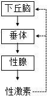

A．垂体分泌的激素不能运输到除性腺外的其他部位

B．给性成熟雌鱼饲喂雌性激素可促进下丘脑和垂体的分泌活动

C．下丘脑分泌的促性腺激素可促使垂体分泌促性腺素释放激素

D．将性成熟鱼的垂体提取液注射到同种性成熟鱼体内可促使其配子成熟

> 【分析】性激素的分级调节：下丘脑通过释放促性腺激素释放激素，来促进垂体合成和分泌促性激素，则可以促进性腺的活动，合成和释放性腺激素，这就是所谓的分级调节。而在正常情况下性激素要维持在一定浓度内，不能持续升高。当性激素达到一定浓度后，这个信息又会反馈给下丘脑和垂体，从而抑制两者的活动，这样系统就可以维持在相对稳定水平，这就是所谓反馈调节。
> 
> 【解答】解：A、垂体分泌的激素可以通过血液进行运输到全身各处，只作用于靶器官，A错误；
> 
> B、根据反馈调节机制，给性成熟雌鱼饲喂雌性激素会抑制下丘脑和垂体的分泌活动，B错误；
> 
> C、由图可知，性腺释放的性激素会反馈调节下丘脑和垂体，下丘脑分泌的促性腺激素无此作用，C错误；
> 
> D、将性成熟鱼的垂体提取液注射到同种性成熟鱼体内可促使其性激素的释放，所以会导致配子成熟，D正确。
> 
> 故选：D。
> 
> 【点评】本题考查动物激素调节的主要内容，要求考生识记动物激素调节的主要内容，结合题图信息分析作答。

15．（2分）学生参加适度的体育锻炼和体力劳动有助于增强体质、改善神经系统功能。关于锻炼和劳动具有的生理作用，下列叙述错误的是（　　）

A．有利于增强循环和呼吸系统的功能

B．有助于机体进行反射活动

C．有利于突触释放递质进行兴奋的双向传递

D．有益于学习和记忆活动

> 【分析】体育锻炼对呼吸系统的影响，首先明确是肺泡的数目、呼吸肌的数目不会改变，变得只是呼吸肌的发达程度和参与呼吸的肺泡数目。
> 
> 【解答】经常参加锻炼或适宜的体力劳动，呼吸肌收缩力量得到加强，可以扩大胸廓的活动范围，使呼吸的深度加大、加深，参与气体交换的肺泡数量增多，有助于机体进行反射活动，有益于学习和记忆活动。体育锻炼会使呼吸肌收缩力量得到加强，参与气体交换的肺泡数量增多，但不会使吸入的气体中氧的比例增加，不会使突触释放递质进行兴奋的双向传递。
> 
> 故选：C。
> 
> 【点评】解答此类题目的关键是理解体育锻炼对呼吸系统的影响：会使呼吸肌收缩力量得到加强，参与气体交换的肺泡数量增多。

16．（2分）如图为用三种不同品系的小鼠进行皮肤移植实验的示意图。下列关于小鼠①、②、③对移植物发生排斥反应速度的判断，正确的是（　　）

> 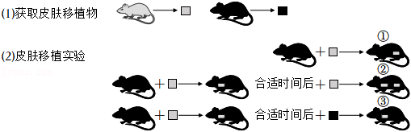

A．①最迅速 B．②最迅速 C．③最迅速 D．②与③相近

> 【分析】1、免疫系统：①免疫器官：骨髓、胸腺等；②免疫细胞：树突状细胞、巨噬细胞、淋巴细胞。其中B细胞在骨髓中成熟、T细胞在胸腺中成熟；③免疫活性物质：抗体、淋巴因子、溶菌酶。
> 
> 2、三大功能：①免疫防御，针对外来抗原性异物，如各种病原体；②免疫自稳，清除衰老或损伤的细胞；③免疫监视，识别和清除突变的细胞，防止肿瘤发生。
> 
> 【解答】解：根据题干实验设计分析，①中直接将灰鼠皮肤移植物移植到黑鼠体内，会引起免疫排斥反应，属于初次免疫；②是对黑鼠移植灰鼠皮肤移植物后过一段时间再次移植灰鼠皮肤移植物，前后两次的抗原相同，会引起二次免疫，②发生免疫排斥反应的速度最快；③是对黑鼠先移植灰鼠皮肤移植物，一段时间后再移植黑鼠皮肤移植物，前后两次的抗原不同，不会引起二次免疫。
> 
> 故选：B。
> 
> 【点评】本题结合实验设计分析考查人体免疫系统在维持稳态中的作用，要求考生明确二次免疫和免疫排斥反应的特点，掌握免疫学原理的应用，再结合题干信息准确作答。

17．（2分）研究发现，登革病毒在某些情况下会引发抗体依赖增强效应，即病毒再次感染人体时，体内已有的抗体不能抑制反而增强病毒的感染能力，其过程如图所示。下列叙述错误的是（　　）

> 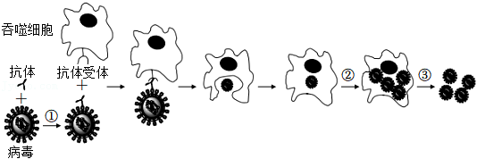

A．过程①，抗体与病毒结合依赖于抗原抗体的特异性

B．过程②，病毒利用吞噬细胞进行增殖

C．过程③释放的病毒具有感染能力

D．抗体依赖增强效应的过程属于特异性免疫

> 【分析】1、体液免疫过程：①一些病原体可以和B细胞接触，为激活B细胞提供第一个信号；②树突状细胞、B细胞等抗原呈递细胞摄取病原体，而后对抗原进行处理，呈递在细胞表面，然后传递给辅助性T细胞；③辅助性T细胞表面特定分子发生变化并与B细胞结合，这是激活B细胞的第二个信号；辅助性T细胞开始分裂、分化，并分泌细胞因子；④B细胞受到两个信号的刺激后开始分裂、分化，大部分分化为浆细胞，小部分分化为记忆B细胞。细胞因子能促进B细胞的分裂、分化过程。⑤浆细胞产生和分泌大量抗体，抗体可以随体液在全身循环并与病原体结合。抗体与病原体的结合可以抑制病原体的增殖或对人体细胞的黏附。
> 
> 2、细胞免疫过程：①被病原体（如病毒）感染的宿主细胞（靶细胞）膜表面的某些分子发生变化，细胞毒性T细胞识别变化的信号。②细胞毒性T细胞分裂并分化，形成新的细胞毒性T细胞和记忆T细胞。细胞因子能加速这一过程。③新形成的细胞毒性T细胞在体液中循环，它们可以识别并接触、裂解被同样病原体感染的靶细胞。④靶细胞裂解、死亡后，病原体暴露出来，抗体可以与之结合；或被其他细胞吞噬掉。
> 
> 3、抗原与抗体：抗原是能够引起机体产生特异性免疫反应的物质，通常是病原体中的蛋白质，但并不全是蛋白质，过敏原也属于抗原。抗体的化学本质为蛋白质，与抗原特异性结合。抗体与抗原结合产生细胞集团或沉淀，最后被吞噬细胞吞噬消化。
> 
> 【解答】解：A、根据题图分析，过程①是抗体与抗原（病毒）结合的过程，这一过程依赖于抗原与抗体结合的特异性，A正确；
> 
> B、根据图示，过程②是病毒在吞噬细胞内增殖的过程，病毒营寄生生活，需要利用其宿主细胞进行增殖，B正确；
> 
> C、根据图示，过程③是吞噬细胞裂解释放病毒的过程，释放的病毒具有感染能力，C正确；
> 
> D、根据题干中“病毒再次感染人体时，体内已有的抗体不能抑制反而增强病毒的感染能力”，抗体依赖增强效应的过程并不是机体对外来入侵病原体的免疫过程，不属于特异性免疫，D错误。
> 
> 故选：D。
> 
> 【点评】本题结合背景材料和相应的过程示意图，考查人体免疫系统的作用，要求考生识记人体免疫系统的组成、掌握特异性免疫的具体过程，能准确分析题干抗体依赖增强效应这一概念的含义，分析图中各过程的特点，再结合所学的知识答题。

18．（2分）新中国成立初期，我国学者巧妙地运用长瘤的番茄幼苗研究了生长素的分布及锌对生长素的影响，取样部位及结果见表。据此分析，下列叙述错误的是（　　）

<table style="width:98%;">
<colgroup>
<col style="width: 22%" />
<col style="width: 19%" />
<col style="width: 28%" />
<col style="width: 27%" />
</colgroup>
<tbody>
<tr>
<td rowspan="7" style="text-align: center;">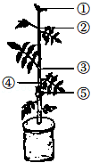</td>
<td rowspan="2" style="text-align: center;">取样部位</td>
<td colspan="2" style="text-align: center;">生长素含量（μg•kg﹣1）</td>
</tr>
<tr>
<td style="text-align: center;">对照组</td>
<td style="text-align: center;">低锌组</td>
</tr>
<tr>
<td style="text-align: center;">①茎尖</td>
<td style="text-align: center;">12.5</td>
<td style="text-align: center;">3.3</td>
</tr>
<tr>
<td style="text-align: center;">②茎的上部</td>
<td style="text-align: center;">3.7</td>
<td style="text-align: center;">2.5</td>
</tr>
<tr>
<td style="text-align: center;">③瘤上方的茎部</td>
<td style="text-align: center;">4.8</td>
<td style="text-align: center;">2.9</td>
</tr>
<tr>
<td style="text-align: center;">④长瘤的茎部</td>
<td style="text-align: center;">7.9</td>
<td style="text-align: center;">3.7</td>
</tr>
<tr>
<td style="text-align: center;">⑤瘤</td>
<td style="text-align: center;">26.5</td>
<td style="text-align: center;">5.3</td>
</tr>
</tbody>
</table>

A．部位①与部位②的生长素运输方向有差异

B．部位③含量较高的生长素会促进该部位侧芽生长

C．因部位⑤的存在，部位④生长素含量高于部位③

D．对照组生长素含量明显高于低锌组，表明锌有利于生长素合成

> 【分析】表格分析：与对照组相比，低锌组相应部位的生长素都低，说明锌可促进生长素合成。
> 
> 【解答】解：A、部位①可以进行横向运输，而部位②则不能，A正确；
> 
> B、生长素作用具有两重性，部位③含量较高的生长素会抑制该部位侧芽生长，B错误；
> 
> C、由于生长素的极性运输，部位①的生长素可以向下分别运输到②、③、④、⑤，导致生长素含量：②＜③＜④＜⑤，C正确；
> 
> D、由表格分析可知，对照组生长素含量明显高于低锌组，表明锌有利于生长素合成，D正确。
> 
> 故选：B。
> 
> 【点评】本题考查植物激素的相关知识，要求考生根据表格数据分析得出结论，掌握生长素的生理作用，能结合题干信息准确答题。

19．（2分）若某林区的红松果实、某种小型鼠（以红松果实为食）和革蜱的数量变化具有如图所示的周期性波动特征。林区居民因革蜱叮咬而易患森林脑炎。据此分析，下列叙述错误的是（　　）

> 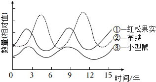

A．曲线③和①不能明显体现捕食关系，推测是小型鼠繁殖能力强所致

B．通过曲线②与③的关系推断小型鼠与革蜱不是互利共生关系

C．曲线③在K值上下波动，影响K值的主要因素是小型鼠的出生率、死亡率、迁入率和迁出率

D．林区居民森林脑炎发病率会呈现与曲线②相似的波动特征

> 【分析】生物之间的关系分种间关系和种内关系两种，种间关系又分共生（如藻类和真菌共同生活在一起形成地衣，二者密不可分）、共栖（如海葵和寄居蟹在一起，互惠互利）、竞争（如水稻与稗草）、捕食（如狼吃羊）和寄生（如蛔虫寄生在人体内）等。种内关系又分种内互助（如蜜蜂之间的合作）和种内斗争（如狼群争抢猎物）等。
> 
> 【解答】解：A、曲线③和①不能明显体现捕食关系，③的变化可能是小型鼠繁殖能力强所致，A正确；
> 
> B、由图中曲线②与③可知，两条曲线不是同升同降的关系，可推测小型鼠与革蜱不是互利共生关系，B正确；
> 
> C、曲线③在K值上下波动，影响K值的主要因素是环境，C错误；
> 
> D、林区居民因革蜱叮咬而易患森林脑炎，因此可推测发病率会呈现与曲线②相似的波动特征，D正确。
> 
> 故选：C。
> 
> 【点评】本题考查种群数量变动的主要内容，要求考生识记种群数量变动的主要内容，结合题图信息分析作答。

20．（2分）在相同条件下，分别用不同浓度的蔗糖溶液处理洋葱鳞片叶表皮细胞，观察其质壁分离，再用清水处理后观察其质壁分离复原，实验结果如图。下列叙述错误的是（　　）

> 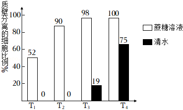

A．T1组经蔗糖溶液处理后，有52%的细胞原生质层的收缩程度大于细胞壁

B．各组蔗糖溶液中，水分子不能从蔗糖溶液进入细胞液

C．T1和T2组经清水处理后发生质壁分离的细胞均复原

D．T3和T4组若持续用清水处理，质壁分离的细胞比例可能下降

> 【分析】柱形图分析：在相同条件下，分别用不同浓度的蔗糖溶液处理洋葱鳞片叶表皮细胞，质壁分离的细胞比例T1组＜T2组＜T3组＜T4组，T3组、T4组再用清水处理后质壁分离复原比例T3组＜T4组。
> 
> 【解答】解：A、由柱形图可知，T1组经蔗糖溶液处理后，有52%的细胞发生质壁分离，即有52%的细胞原生质层的收缩程度大于细胞壁，A正确；
> 
> B、各组蔗糖溶液中，水分子可以从蔗糖溶液进入细胞液，只是少于水分子从细胞液进入蔗糖溶液，B错误；
> 
> C、T1和T2组部分细胞能发生质壁分离，说明质壁分离的细胞是活细胞，若经清水处理后发生质壁分离的细胞均复原，C正确；
> 
> D、T3和T4组若持续用清水处理，质壁分离复原的细胞逐渐增多，使质壁分离的细胞比例可能下降，D正确。
> 
> 故选：B。
> 
> 【点评】本题主要考查质壁分离和复原实验，意在考查学生识图和判断能力，解题的关键是理解质壁分离和复原的条件，难度不大。

**二、非选择题：共60分。第21～24题为必考题，每个试题考生都必须作答。第25～26题为选考题，考生根据要求作答。（一）必考题：共45分。**

21．（10分）人线粒体呼吸链受损可导致代谢物X的积累，由此引发多种疾病。动物实验发现，给呼吸链受损小鼠注射适量的酶A和酶B溶液，可发生如图所示的代谢反应，从而降低线粒体呼吸链受损导致的危害。据图回答以下问题：

> 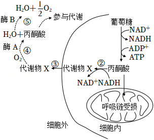
> 
> （1）呼吸链受损会导致 <u>　有氧　</u>（填“有氧”或“无氧”）呼吸异常，代谢物X是 <u>　乳酸　</u>。
> 
> （2）过程⑤中酶B的名称为 <u>　过氧化氢酶　</u>，使用它的原因是 <u>　催化过氧化氢的分解，避免过氧化氢对细胞的毒害　</u>。
> 
> （3）过程④将代谢物X消耗，对内环境稳态的作用和意义是 <u>　避免代谢产物的积累，维持细胞内的PH稳定；是机体进行正常生命活动的条件　</u>。
> 
> 【分析】有氧呼吸分为三个阶段：第一阶段发生在细胞质基质，葡萄糖分解成丙酮酸和还原性氢，释放少量能量；第二阶段发生在线粒体基质，丙酮酸和水反应生成二氧化碳和还原性氢，释放少量能量；第三阶段发生在线粒体内膜，还原性氢和氧气反应生成水并释放大量能量。
> 
> 【解答】解：（1）有氧呼吸主要在线粒体内，而无氧呼吸在细胞质基质。人线粒体呼吸链受损，会导致有氧呼吸异常。丙酮酸能够分解转化成代谢产物X，场所在细胞质基质中，可以得出X是无氧呼吸的产物乳酸。
> 
> （2）酶B可以使过氧化氢分解为水和氧气，所以为过氧化氢酶，催化过氧化氢的分解，避免过氧化氢对细胞的毒害作用。
> 
> （3）代谢物X为乳酸，过程④可以将其分解，避免了乳酸的大量积累，维持细胞内的 PH稳定；是机体进行正常生命活动的必要条件。
> 
> 故答案为：
> 
> （1）有氧 乳酸（C3H6O3）
> 
> （2）过氧化氢酶 催化过氧化氢的分解，避免过氧化氢对细胞的毒害
> 
> （3）避免代谢产物的积累，维持细胞内的 PH；是机体进行正常生命活动的条件
> 
> 【点评】本题考查考生有氧呼吸、酶以及内环境稳态的意义等知识，要求考生能够结合图文进行分析，运用相关知识解决问题。本题难度不大。

22．（14分）2017年，我国科学家发现一个水稻抗稻瘟病的隐性突变基因b（基因中的一个碱基A变成G），为水稻抗病育种提供了新的基因资源。请回答以下问题：

> （1）基因B突变为b后，组成基因的碱基数量 <u>　不变　</u>。
> 
> （2）基因b包含一段DNA单链序列TAGCTG，能与其进行分子杂交的DNA单链序列为 <u>　ATCGAC　</u>。自然界中与该序列碱基数量相同的DNA片段最多有 <u>　64　</u>种。
> 
> （3）基因b影响水稻基因P的转录，使得酶P减少，从而表现出稻瘟病抗性。据此推测，不抗稻瘟病水
> 
> 稻细胞中基因P转录的mRNA量比抗稻瘟病水稻细胞 <u>　多　</u>。
> 
> （4）现有长穗、不抗稻瘟病（HHBB）和短穗、抗稻瘟病（hhbb）两种水稻种子，欲通过杂交育种方法选育长穗、抗稻瘟病的纯合水稻。请用遗传图解写出简要选育过程。
> 
> （5）某水稻群体中抗稻瘟病植株的基因型频率为10%，假如该群体每增加一代，抗稻瘟病植株增加10%、不抗稻病植株减少10%，则第二代中，抗稻瘟病植株的基因型频率为 <u>　14　</u>%（结果保留整数）。
> 
> 【分析】基因突变：DNA分子中发生碱基对的替换、增添和缺失，而引起的基因结构改变．基因突变若发生在配子中，将遵循遗传规律传递给后代；若发生在体细胞中则不能遗传。
> 
> 【解答】解：（1）由题意可知，该基因突变是因为发生了碱基的替换，但不影响组成基因的碱基的数量。
> 
> （2）根据碱基互补配对原则，与TAGCTG配对的DNA单链序列为ATCGAC，该单链序列共6个碱基，自然界中DNA分子为双链，每条链是3个碱基，而碱基的种类是4种，所以自然界中与该序列碱基数量相同的DNA片段最多有43＝64种。
> 
> （3）由题意可知，基因b影响水稻基因P的转录，使其表现为稻瘟病抗性，不抗稻瘟病植株的基因为B，无法抑制P的表达，故基因P转录的mRNA量比抗稻瘟病水稻细胞多。
> 
> （4）见图解。
> 
> （5）假设植株的总株数为100株，已知抗稻瘟病植株的基因型频率为10%，假如该群体每增加一代，抗稻瘟病植株增加10%、不抗稻病植株减少10%，则第二代中，抗病植株为10×（1+10%）×（1+10%）＝12.1株，不抗病植株为90×（1﹣10%）×（1﹣10%）＝72.9株，则第二代稻瘟病植株的占比为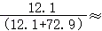14%，抗稻瘟病植株的基因型频率为14%。
> 
> 故答案为：
> 
> （1）不变
> 
> （2）ATCGAC 64
> 
> （3）多
> 
> （4）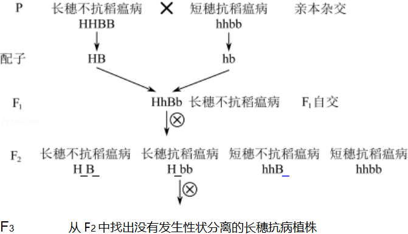
> 
> （5）14%
> 
> 【点评】本题主要考查基因突变与基因频率的计算相关内容，考生需掌握相关知识，才能准确答题。

23．（9分）“瓦尔迪兹”油轮意外失事泄漏大量原油，造成严重的海洋污染，生物种群受到威胁。为探究原油污染对海獭的影响，生态学家进行了长达25年的研究，有以下发现：

> Ⅰ.原常以海豹为食的虎鲸，现大量捕食海獭。
> 
> Ⅱ.过度捕捞鲑鱼，造成以鲑鱼为食的海豹数量锐减。
> 
> Ⅲ.海獭的食物海胆数量增加，而海胆的食物大型藻数量锐减。
> 
> 请回答下列问题：
> 
> （1）由上述发现可知，原油泄漏 <u>　不是　</u>（填“是”或“不是”）引起海獭数最持续减少的直接原因。
> 
> （2）上述材料中，虎鲸至少属于食物链（网）中的第 <u>　4　</u>营养级；食物链顶端的虎鲸种群数量最少，
> 
> 从能量流动角度分析，原因是 <u>　能量单向流动，逐级递减，虎鲸营养级最高，获得能量最少，种群数量少　</u>。
> 
> （3）若不停止过度捕捞，多年后该海域生态系统可能出现的结果有 <u>　①②③　</u>。（多选，填序号）
> 
> ①虎鲸的生存受到威胁
> 
> ②流经该生态系统的总能量下降
> 
> ③该生态系统结构变得简单
> 
> ④生态系统抵抗力稳定性提高
> 
> （4）结合本研究，你认为我国2021年在长江流域重点水域开始实行“十年禁渔”的目的是 <u>　增加生物多样性，提高生态系统的抵抗力稳定性，保护长江的生态系统等合理即可　</u>。
> 
> 【分析】1、生态系统能量流动的特点：单向流动、逐级递减。
> 
> 2、据题干中信息可画出的食物链为：大型藻→海胆→海獭→虎鲸。
> 
> 【解答】解：（1）据题干信息可知，海獭数量持续降低的直接原因是虎鲸的大量捕食。
> 
> （2）据题干中信息可知，虎鲸捕食海獭，海獭捕食海胆，海胆捕食大型藻，故虎鲸属于第四营养级；处于食物链顶端的物种个体数量较少，是由于生态系统的能量单向流动、逐级递减，营养级越高所获得的能量就越少，从而使个体的数量较少。
> 
> （3）若人类仍过度捕捞鲑鱼，海豹的数量得不到恢复，虎鲸只能不断捕食海獭，而海獭的数量持续降低，进而导致虎鲸数量减少；海獭数量降低，还会导致海胆数量增多，捕食更多的大型藻，从而使生产者固定的太阳能减少；同时，该生态系统的组成成分可能会减少，是营养结构变得简单，抵抗力稳定降低，故可能出现的结果有①②③。
> 
> （4）根据题干信息可推知，“十年禁渔”可防止过度捕捞引起的生态系统稳定降低等结果，达到增加生物多样性，提高生态系统抵抗力稳定性等目的。
> 
> 故答案为：
> 
> （1）不是
> 
> （2）4 能量单向流动，逐级递减，虎鲸营养级最高，获得能量最少，种群数量少
> 
> （3）①②③
> 
> （4）增加生物多样性，提高生态系统的抵抗力稳定性，保护长江的生态系统等合理即可
> 
> 【点评】该题考查生态系统能量流动及稳定性的相关知识，对能量流动的特点及运用有较为深入的理解是解答本题的要点。

24．（12分）GR24是新型植物激素独脚金内酯的人工合成类似物，在农业生产上合理应用可提高农作物的抗逆性和产量。

> （1）某小组研究了弱光条件下GR24对番茄幼苗生长的影响，结果（均值）见表：

<table style="width:98%;">
<colgroup>
<col style="width: 16%" />
<col style="width: 16%" />
<col style="width: 16%" />
<col style="width: 15%" />
<col style="width: 16%" />
<col style="width: 16%" />
</colgroup>
<tbody>
<tr>
<td style="text-align: center;">
指标

处理
</td>
<td style="text-align: center;">叶绿素a含量（mg•g﹣1）</td>
<td style="text-align: center;">叶绿素b含量（mg•g﹣1）</td>
<td style="text-align: center;">叶绿素a/b</td>
<td style="text-align: center;">单株干重（g）</td>
<td style="text-align: center;">单株分枝数（个）</td>
</tr>
<tr>
<td style="text-align: center;">弱光+水</td>
<td style="text-align: center;">1.39</td>
<td style="text-align: center;">0.61</td>
<td style="text-align: center;">2.28</td>
<td style="text-align: center;">1.11</td>
<td style="text-align: center;">1.83</td>
</tr>
<tr>
<td style="text-align: center;">弱光+GR24</td>
<td style="text-align: center;">1.98</td>
<td style="text-align: center;">0.98</td>
<td style="text-align: center;">2.02</td>
<td style="text-align: center;">1.30</td>
<td style="text-align: center;">1.54</td>
</tr>
</tbody>
</table>

> ①结果表明，GR24处理使幼苗叶绿素含量上升、叶绿素a/b <u>　下降　</u>（填“上升”或“下降”），净光合速率 <u>　增加　</u>，提高了幼苗对弱光的利用能力。GR24处理抑制了幼苗分枝，与该作用效应相似的另一类激素是 <u>　生长素　</u>。
> 
> ②若幼苗长期处于弱光下，叶绿体的发育会产生适应性变化，类囊体数目会 <u>　增多　</u>。若保持其他条件不变，适度增加光照强度，气孔开放程度会 <u>　增大　</u>（填“增大”或“减小”）。
> 
> （2）列当是根寄生性杂草。土壤中的列当种子会被番茄根部释放的独脚金内酯诱导萌发，然后寄生在番茄根部使其减产；若缺乏宿主，则很快死亡。
> 
> ①应用GR24降低列当对番茄危害的措施为 <u>　在种植前用GR24处理土壤，促进提前萌芽，待其死亡后种植番茄　</u>。
> 
> ②为获得被列当寄生可能性小的番茄品种，应筛选出释放独脚金内酯能力 <u>　弱　</u>的植株。
> 
> 【分析】1、植物激素是指植物体内一定部位产生，从产生部位运输到作用部位，对植物的生长发育有显著影响的微量有机物。人工合成的对植物的生长发育有调节作用的化学物质称为植物生长调节剂。
> 
> 2、表格数据分析：GR24处理可以使叶绿素a、叶绿素b的含量增加，叶绿素a/b比值降低，单株干重增加，单株分枝数减少。
> 
> 【解答】解：（1）①根据表中数据分析，与弱光+水处理相比，弱光+GR24处理使幼苗叶绿素含量上升、叶绿素a/b下降，净光合速率增加。GR24处理抑制了幼苗分枝，属于抑制侧芽生长的作用，与该作用效应相似的另一类激素是生长素，其生理作用具有两重性。②若幼苗长期处于弱光下，为适应弱光环境，植物叶绿体中类囊体数目会增多。若保持其他条件不变，适度增加光照强度，植物对二氧化碳的需求增大，气孔开放程度会增大。
> 
> （2）根据题意，独脚金内酯可以诱导列当种子萌发，列当种子萌发后若缺乏宿主，会很快死亡，故可以在种植前用GR24处理土壤，促进土壤中的列当种子萌芽，待其死亡后再种植番茄。为获得被列当寄生可能性小的番茄品种，应筛选出释放独脚金内酯能力弱的植株，以减少列当种子萌发的概率。
> 
> 故答案为：
> 
> （1）下降 增加 生长素 增多 增大
> 
> （2）在种植前用 GR24 处理土壤，促进提前萌芽，待其死亡后种植番茄 弱
> 
> 【点评】本题结合实验数据和相关材料，考查植物激素调节对光合作用的影响和对植物生命活动的影响，意在考查考生分析数据和材料以获取有效信息的能力，要能够理解所学知识要点，把握知识间内在联系的能力，再将所学知识进行迁移运用。

**（二）选考题：共15分。请考生从2道生物题中任选一题作答。如果多做，则按所做的第一题计分。\[生物——选修1：生物技术实践\]（15分）**

25．（15分）人们很早就能制作果酒，并用果酒进一步发酵生产果醋。

> （1）人们利用水果及附着在果皮上的 <u>　酵母　</u>菌，在18～25℃、无氧条件下酿造果酒；再利用醋酸菌在 <u>　30～35℃，有氧　</u>条件下，将酒精转化成醋酸酿得果醋。酿造果醋时，得到了醋酸产率较高的醋酸菌群，为进一步纯化获得优良醋酸菌菌种，采用的接种方法是 <u>　稀释涂布平板法（或平板划线法）　</u>。
> 
> （2）先酿制果酒再生产果醋的优势有 <u>　①③　</u>（多选，填序号）。
> 
> ①先酿制果酒，发酵液能抑制杂菌的生长，有利于提高果醋的产率
> 
> ②酿制果酒时形成的醋酸菌膜，有利于提高果醋的产率
> 
> ③果酒有利于溶出水果中的风味物质并保留在果醋中
> 
> （3）果酒中的酒精含量对果醋的醋酸产率会产生一定的影响。某技术组配制发酵液研究了初始酒精浓度对醋酸含量的影响，结果如图。该技术组使用的发酵液中，除酒精外还包括的基本营养物质有 <u>　氮源、无机盐、水　</u>（填写两种）。据图可知，醋酸发酵的最适初始酒精浓度是 <u>　6%　</u>；酒精浓度为10%时醋酸含量最低，此时，若要尽快提高醋酸含量，可采取的措施有 <u>　适当降低初始酒精浓度，增加氧气供应，适当提高温度等　</u>（填写两个方面）。
> 
> 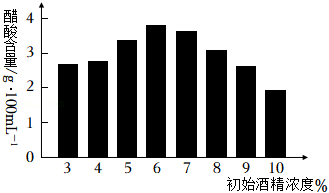
> 
> 【分析】1、在葡萄酒的自然发酵过程中，起主要作用的是附着在葡萄皮上的野生型酵母菌。醋酸菌是好氧菌，最是生长温度为30～35℃。微生物最常用的接种方法是稀释涂布平板法和平板划线法。
> 
> 2、酿制果酒，发酵液中产生的酒精能抑制杂菌的生长。
> 
> 3、培养基的成分，四大基础营养物质分别是碳源、氮源、水、无机盐。
> 
> 【解答】解：（1）在葡萄酒的自然发酵过程中，起主要作用的是附着在葡萄皮上的野生型酵母菌。醋酸菌是好氧菌，最是生长温度为30～35℃。微生物最常用的接种方法是稀释涂布平板法和平板划线法。
> 
> （2）先酿制果酒，发酵液能抑制杂菌的生长，酿制果酒时形成的醋酸菌膜会造成局部缺氧，导致果醋产率不高，果酒有利于溶出水果中的风味物质并保留在果醋中。
> 
> （3）微生物生长基本营养物质：氮源，碳源，水，无机盐等。酒精浓度为6%是，醋酸含量最高。提高醋酸含量，可采取的措施有适当降低初始酒精浓度，增加氧气供应，适当提高温度等合理即可。
> 
> 故答案为：
> 
> （1）酵母菌 30～35℃，有氧 稀释涂布平板法（或平板划线法）
> 
> （2）①③
> 
> （3）氮源、无机盐、水 6% 适当降低初始酒精浓度，增加氧气供应，适当提高温度等
> 
> 【点评】本题考查果酒和果醋制作的基础知识，微生物培养的基础知识，在复习过程中要注意结合所学知识对柱形图的分析。

**\[生物——选修3：现代生物科技专题\]（15分）**

26．为了研究PDCD4基因对小鼠子宫内膜基质细胞凋亡的影响，进行了相关实验。

> （1）取小鼠子宫时，为避免细菌污染，手术器具应进行 <u>　灭菌（消毒）　</u>处理，子宫取出剪碎后，用 <u>　胰蛋白酶或胶原蛋白酶　</u>处理一定时间，可获得分散的子宫内膜组织细胞，再分离获得基质细胞用于培养。
> 
> （2）培养基中营养物质应有 <u>　无机盐、葡萄糖、氨基酸、微量元素、促生长因子、血清或血浆　</u>（填写两种）；培养箱中CO2浓度为5%，其主要作用是 <u>　维持培养液的pH值　</u>。
> 
> （3）在含PDCD4基因的表达载体中，启动子的作用是 <u>　RNA聚合酶的识别和结合位点，驱动转录出相应的mRNA　</u>。为了证明PDCD4基因对基质细胞凋亡的作用，以含PDCD4基因的表达载体和基质细胞的混合培养为实验组，还应设立两个对照组，分别为 <u>　基质细胞悬浮液和空载体、与基质细胞的混合培养液　</u>。
> 
> 经检测，实验组中PDCD4表达水平和细胞凋亡率显著高于对照组，说明该基因对基质细胞凋亡具有 <u>　促进　</u>（填“抑制”或“促进”）作用。
> 
> 【分析】1、构建基因表达载体的目的是使目的基因在受体细胞中稳定存在并且可以遗传给下一代并表达和发挥作用。基因表达载体的组成：复制原点+目的基因+启动子+终止子+标记基因。
> 
> 2、动物细胞培养的条件：
> 
> （1）无菌、无毒的环境：①消毒、灭菌；②添加一定量的抗生素；③定期更换培养液，以清除代谢废物。
> 
> （2）营养物质：糖、氨基酸、促生长因子、无机盐、微量元素等，还需加入血清、血浆等天然物质。
> 
> （3）温度和pH：36.5℃±0.5℃；适宜的pH：7.2～7.4。
> 
> （4）气体环境：95%空气（细胞代谢必需的）和5%的CO2（维持培养液的pH）。
> 
> 【解答】解：（1）为避免细菌污染，手术器具应进行灭菌处理；动物组织取出剪碎后，用胰蛋白酶或胶原蛋白酶处理一定时间，可获得分散的动物组织细胞。
> 
> （2）动物细胞培养时，培养基中营养物质应有无机盐、葡萄糖、氨基酸、微量元素、促生长因子、血清或血浆；培养箱中为95%的空气和5%的CO2，其中5%的CO2的主要作用是维持培养液的pH值。
> 
> （3）启动子是RNA聚合酶的识别和结合位点，驱动转录出相应的mRNA。为了证明PDCD4基因对基质细胞凋亡的作用，以含PDCD4基因的表达载体和基质细胞的混合培养为实验组，还应设立两个对照组，分别为基质细胞悬浮液和空载体（排除空载体的作用）、与基质细胞的混合培养液（空白对照）。经检测，实验组中PDCD4表达水平和细胞凋亡率显著高于对照组，说明该基因对基质细胞凋亡具有促进作用。
> 
> 故答案为：
> 
> （1）灭菌（消毒） 胰蛋白酶或胶原蛋白酶
> 
> （2）无机盐、葡萄糖、氨基酸、微量元素、促生长因子、血清或血浆 维持培养液的pH值
> 
> （3）RNA聚合酶的识别和结合位点，驱动转录出相应的mRNA 基质细胞悬浮液和空载体、与基质细胞的混合培养液 促进
> 
> 【点评】本题考查基因工程、动物细胞培养等知识，要求考生识记基因工程的操作步骤，掌握各操作步骤中需要注意的细节；识记动物细胞培养的过程及条件，能结合所学的知识准确答题。
