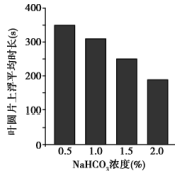
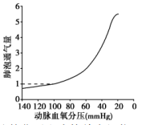
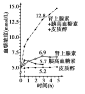
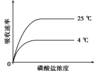

**1海南省2022年普通高中学业水平选择性考试**

**生物**

**一、选择题**

1\. 脊髓灰质炎病毒已被科学家人工合成。该人工合成病毒能够引发小鼠脊髓灰质炎，但其毒性比天然病毒小得多。下列有关叙述正确的是（ ）

A. 该人工合成病毒的结构和功能与天然病毒的完全相同

B. 该人工合成病毒和原核细胞都有细胞膜，无细胞核

C. 该人工合成病毒和真核细胞都能进行细胞呼吸

D. 该人工合成病毒、大肠杆菌和酵母菌都含有遗传物质

2\. 人体细胞会经历增殖、分化、衰老和死亡等生命历程。下列有关叙述错误的是（ ）

A. 正常的B淋巴细胞不能无限增殖

B. 细胞分化只发生在胚胎发育阶段

C. 细胞产生的自由基可攻击蛋白质，导致细胞衰老

D. 细胞通过自噬作用可清除受损的细胞器，维持细胞内部环境的稳定

3\. 某小组为了探究适宜温度下CO2对光合作用的影响，将四组等量菠菜叶圆片排气后，分别置于盛有等体积不同浓度NaHCO3溶液的烧杯中，从烧杯底部给予适宜光照，记录叶圆片上浮所需时长，结果如图。下列有关叙述正确的是（ ）

A. 本实验中，温度、NaHCO3浓度和光照都属于自变量

B. 叶圆片上浮所需时长主要取决于叶圆片光合作用释放氧气的速率

C. 四组实验中，0.5％NaHCO3溶液中叶圆片光合速率最高

D. 若在4℃条件下进行本实验，则各组叶圆片上浮所需时长均会缩短

4\. 肌动蛋白是细胞骨架的主要成分之一。研究表明，Cofilin-1是一种能与肌动蛋白相结合的蛋白质，介导肌动蛋白进入细胞核。Cofilin-1缺失可导致肌动蛋白结构和功能异常，引起细胞核变形，核膜破裂，染色质功能异常。下列有关叙述错误的是（ ）

A. 肌动蛋白可通过核孔自由进出细胞核

B. 编码Cofilin-1的基因不表达可导致细胞核变形

C. Cofilin-1缺失可导致细胞核失去控制物质进出细胞核的能力

D. Cofilin-1缺失会影响细胞核控制细胞代谢的能力

5\. 珊瑚生态系统主要由珊瑚礁及生物群落组成，生物多样性丰富。下列有关叙述错误的是（ ）

A. 珊瑚虫为体内虫黄藻提供含氮物质，后者为前者提供有机物质，两者存在互利共生关系

B. 珊瑚生态系统具有抵抗不良环境并保持原状的能力，这是恢复力稳定性的表现

C. 对珊瑚礁的掠夺式开采会导致珊瑚生态系统遭到破坏

D. 珊瑚生态系统生物多样性的形成是协同进化的结果

6\. 假性肥大性肌营养不良是伴Ｘ隐性遗传病，该病某家族的遗传系谱如图。下列有关叙述正确的是（ ）

A. Ⅱ-1的母亲不一定是患者 B. Ⅱ-3为携带者的概率是1/2

C. Ⅲ-2的致病基因来自Ⅰ-1 D. Ⅲ-3和正常男性婚配生下的子女一定不患病

7\. 植物激素和植物生长调节剂可调控植物的生长发育。下列有关叙述错误的是（ ）

A. 将患恶苗病的水稻叶片汁液喷洒到正常水稻幼苗上，结实率会降低

B. 植物组织培养中，培养基含生长素、不含细胞分裂素时，易形成多核细胞

C. 矮壮素处理后，小麦植株矮小、节间短，说明矮壮素的生理效应与赤霉素的相同

D. 高浓度2，4－D能杀死双子叶植物杂草，可作为除草剂使用

8\. 某学者提出，岛屿上的物种数取决于物种迁入和灭亡的动态平衡。图中曲线表示面积大小不同和距离大陆远近不同的岛屿上物种的迁入率和灭亡率，S1、S2、S3和S4表示迁入率和灭亡率曲线交叉点对应的平衡物种数，即为该岛上预测的物种数。下列有关叙述错误的是（ ）

A. 面积相同时，岛屿距离大陆越远，预测的物种数越多

B. 与大陆距离相同时，岛屿面积越大，预测的物种数越多

C. 物种数相同情况下，近而大的岛，迁入率高；远而小的岛，迁入率低

D. 物种数相同情况下，小岛上的物种灭亡率高于大岛

9\. 缺氧是指组织氧供应减少或不能充分利用氧，导致组织代谢、功能和形态结构异常变化的病理过程。动脉血氧分压与肺泡通气量（基本通气量为1）之间的关系如图。下列有关叙述错误的是（ ）

A. 动脉血氧分压从60mmHg降至20mmHg的过程中，肺泡通气量快速增加，以增加组织供氧

B. 生活在平原的人进入高原时，肺泡通气量快速增加，过度通气可使血液中CO2含量降低

C. 缺氧时，人体肌细胞可进行无氧呼吸产生能量

D. 缺氧时，机体内产生乳酸与血液中的H2CO3发生反应，以维持血液ｐＨ的稳定

10\. 种子萌发过程中，储藏的淀粉、蛋白质等物质在酶的催化下生成简单有机物，为新器官的生长和呼吸作用提供原料。下列有关叙述错误的是（ ）

A. 种子的萌发受水分、温度和氧气等因素的影响

B. 种子萌发过程中呼吸作用增强，储藏有机物的量减少

C. 干燥条件下种子不萌发，主要是因为种子中的酶因缺水而变性失活

D. 种子子叶切片用苏丹Ⅲ染色后，显微镜下观察到橘黄色颗粒，说明该种子含有脂肪

11\. 科学家曾提出DNA复制方式的三种假说：全保留复制、半保留复制和分散复制（图1）。对此假说，科学家以大肠杆菌为实验材料，进行了如下实验（图2）：

下列有关叙述正确的是（ ）

A. 第一代细菌DNA离心后，试管中出现1条中带，说明DNA复制方式一定是半保留复制

B. 第二代细菌DNA离心后，试管中出现1条中带和1条轻带，说明DNA复制方式一定是全保留复制

C. 结合第一代和第二代细菌DNA的离心结果，说明DNA复制方式一定是分散复制

D. 若DNA复制方式是半保留复制，继续培养至第三代，细菌DNA离心后试管中会出现1条中带和1条轻带

12\. 为探究校内植物园土壤中的细菌种类，某兴趣小组采集园内土壤样本并开展相关实验。下列有关叙述错误的是（ ）

A. 采样时应随机采集植物园中多个不同地点的土壤样本

B. 培养细菌时，可选用牛肉膏蛋白胨固体培养基

C. 土壤溶液稀释倍数越低，越容易得到单菌落

D. 鉴定细菌种类时，除形态学鉴定外，还可借助生物化学的方法

13\. 某团队从下表①～④实验组中选择两组，模拟T2噬菌体侵染大肠杆菌实验，验证DNA是遗传物质。结果显示：第一组实验检测到放射性物质主要分布在沉淀物中，第二组实验检测到放射性物质主要分布在上清液中。该团队选择的第一、二组实验分别是（ ）

|  | T2噬菌体 | 大肠杆菌             |
|:------------------------------------------------------------------------------------------------------------------------------------------------------------------------------:|:----------------:|:----------------:|
| ①                                                                                                                                                                              | 未标记              | 15N标记 |
| ②                                                                                                                                                                              | 32P标记 | 35S标记 |
| ③                                                                                                                                                                              | 3H标记  | 未标记              |
| ④                                                                                                                                                                              | 35S标记 | 未标记              |

A. ①和④ B. ②和③ C. ②和④ D. ④和③

14\. 机体内血糖浓度受多种激素共同调节。某实验小组探究了三种激素单独或联合作用调节血糖的效应，实验前血糖浓度为5.0mmol/L，血糖浓度随激素处理时间的变化如图。下列有关叙述正确的是（ ）

A. 激素单独作用时，0.5h内升高血糖最快的激素是肾上腺素

B. 3h时，三种激素联合作用升高血糖的效应大于各自效应的总和

C. 肾上腺素和胰高血糖素对血糖的调节作用表现出相抗衡的关系

D. 血糖浓度受肾上腺素、胰高血糖素和皮质醇调节，不受甲状腺激素调节

15\. 匍匐鸡是一种矮型鸡，匍匐性状基因（A）对野生性状基因（a）为显性，这对基因位于常染色体上，且A基因纯合时会导致胚胎死亡。某鸡群中野生型个体占20％，匍匐型个体占80％，随机交配得到F1，F1雌、雄个体随机交配得到F2。下列有关叙述正确的是（ ）

A. F1中匍匐型个体的比例为12/25 B. 与F1相比，F2中A基因频率较高

C. F2中野生型个体的比例为25/49 D. F2中A基因频率为2/9

**二、非选择题**

16\. 细胞膜上存在的多种蛋白质参与细胞的生命活动。回答下列问题。

（1）细胞膜上不同的通道蛋白、载体蛋白等膜蛋白，对不同物质的跨膜运输起着决定性作用，这些膜蛋白能够体现出细胞膜具有的功能特性是\_\_\_\_\_\_\_\_\_\_\_\_\_\_。

（2）细胞膜上的水通道蛋白是水分子进出细胞的重要通道，水分子借助水通道蛋白进出细胞的方式属于\_\_\_\_\_\_\_\_\_\_\_\_\_。

（3）细胞膜上的H＋-ATP酶是一种转运H＋的载体蛋白，能催化ATP水解，利用ATP水解释放的能量将H＋泵出细胞，导致细胞外的pH\_\_\_\_\_\_\_\_\_\_\_\_；此过程中，H＋-ATP酶作为载体蛋白在转运H＋时发生的变化是\_\_\_\_\_\_\_\_\_\_\_\_\_\_\_\_\_。

（4）细胞膜上的受体通常是蛋白质。人体胰岛B细胞分泌的胰岛素与靶细胞膜上的受体结合时，会引起靶细胞产生相应的生理变化，这一过程体现的细胞膜的功能是\_\_\_\_\_\_\_\_\_\_\_\_\_\_\_\_\_。

（5）植物根细胞借助细胞膜上的转运蛋白逆浓度梯度吸收磷酸盐，不同温度下吸收速率的变化趋势如图。与25℃相比，4℃条件下磷酸盐吸收速率低的主要原因是\_\_\_\_\_\_\_\_\_\_\_\_\_\_。

17\. 人体运动需要神经系统对肌群进行精确的调控来实现。肌萎缩侧索硬化（ALS）是一种神经肌肉退行性疾病，患者神经肌肉接头示意图如下。回答下列问题。

（1）轴突末梢中突触小体内Ach通过\_\_\_\_\_\_\_\_\_\_\_\_方式进入突触间隙。

（2）突触间隙的Ach与突触后膜上的AchR结合，将兴奋传递到肌细胞，从而引起肌肉\_\_\_\_\_\_\_\_\_\_\_\_，这个过程需要\_\_\_\_\_\_\_\_\_\_\_\_信号到\_\_\_\_\_\_\_\_\_\_\_\_信号的转换。

（3）有机磷杀虫剂（OPI）能抑制AchE活性。OPI中毒者的突触间隙会积累大量的\_\_\_\_\_\_\_\_\_\_，导致副交感神经末梢过度兴奋，使瞳孔\_\_\_\_\_\_\_\_\_。

（4）ALS的发生及病情加重与补体C5（一种蛋白质）的激活相关。如图所示，患者体内的C5被激活后裂解为C5a和C5b，两者发挥不同作用。

①C5a与受体C5aR1结合后激活巨噬细胞，后者攻击运动神经元而致其损伤，因此C5a－C5aR1信号通路在ALS的发生及病情加重中发挥重要作用。理论上使用C5a的抗体可延缓ALS的发生及病情加重，理由是\_\_。

②C5b与其他补体在突触后膜上形成膜攻击复合物，引起Ca2＋和Na＋内流进入肌细胞，导致肌细胞破裂，其原因是\_\_\_\_\_\_\_\_\_\_\_\_\_\_\_\_\_\_\_\_\_\_\_\_\_\_\_\_。

18\. 家蚕是二倍体生物（2n＝56），雌、雄个体性染色体组成分别是ZW、ZZ。某研究所在野生家蚕资源调查中发现了一些隐性纯合突变体。这些突变体的表型、基因及基因所在染色体见表。回答下列问题。

| 突变体表型  | 基因  | 基因所在染色体 |
|:------:|:---:|:-------:|
| 第二隐性灰卵 | a   | 12号     |
| 第二多星纹  | b   | 12号     |
| 抗浓核病   | d   | 15号     |
| 幼蚕巧克力色 | e   | Z       |

（1）幼蚕巧克力色的控制基因位于性染色体上，该性状的遗传总是和性别相关联，这种现象称为\_\_\_\_\_\_\_\_\_\_\_\_\_\_\_\_\_\_\_。

（2）表中所列的基因，不能与b基因进行自由组合的是\_\_\_\_\_\_\_\_\_\_\_\_\_\_\_\_\_\_\_。

（3）正常情况下，雌家蚕的1个染色体组含有\_\_\_\_\_\_\_\_\_\_\_\_\_\_\_\_\_\_\_条染色体，雌家蚕处于减数分裂Ⅱ后期的细胞含有\_\_\_\_\_\_\_\_\_\_\_\_\_\_\_\_\_\_\_条W染色体。

（4）幼蚕不抗浓核病（D）对抗浓核病（d）为显性，黑色（E）对巧克力色（e）为显性。为鉴定一只不抗浓核病黑色雄性幼蚕的基因型，某同学将其饲养至成虫后，与若干只基因型为ddZeW的雌蚕成虫交配，产生的F1幼蚕全部为黑色，且不抗浓核病与抗浓核病个体的比例为1∶1，则该雄性幼蚕的基因型是\_\_\_\_\_\_\_\_\_\_\_\_。

（5）家蚕的成虫称为家蚕蛾，已知家蚕蛾有鳞毛和无鳞毛这对相对性状受一对等位基因控制。现有纯合的有鳞毛和无鳞毛的家蚕蛾雌、雄个体若干只，设计实验探究控制有鳞毛和无鳞毛的基因是位于常染色体上还是Z染色体上（不考虑Z、W同源区段），并判断有鳞毛和无鳞毛的显隐性。要求简要写出实验思路、预期结果及结论。

19\. 海南热带雨林国家公园拥有我国连片面积最大的热带雨林，包括霸王岭、鹦哥岭、五指山等片区。回答下列问题。

（1）海南热带雨林具有固碳功能，能够吸收并固定\_\_\_\_\_\_\_\_\_\_\_\_\_\_\_，有助于减缓全球气候变暖。

（2）海南热带雨林国家公园物种丰富、景色优美，具有极高科学研究和旅游观赏价值，这体现了生物多样性的\_\_\_\_\_\_\_\_\_\_\_\_\_\_价值。为了保护海南热带雨林的生物资源，特别是保护濒危物种的基因资源，除建立精子库外，还可建立\_\_\_\_\_\_\_\_\_\_\_\_\_\_（答出2点即可）。

（3）海南热带雨林国家公园中，森林生态系统生物多样性具有较高的间接价值，该价值主要体现为调节生态系统的功能，如固碳供氧、\_\_\_\_\_\_\_\_\_\_\_\_\_\_\_\_\_\_\_\_\_\_\_\_\_\_\_\_\_\_\_\_\_\_\_\_\_\_\_\_\_\_（再答出2点即可）。

（4）生活在霸王岭片区的中国特有长臂猿——海南长臂猿，已被世界自然保护联盟列为极度濒危物种。研究发现，海南长臂猿栖息地的丧失和碎片化导致其种群数量减少，这是因为\_\_\_\_\_\_\_\_\_\_\_\_\_\_\_\_\_\_\_\_\_\_\_\_\_\_\_\_。针对栖息地的丧失，应采取的具体保护措施有\_\_\_\_\_\_\_\_\_\_\_\_\_\_，以增加海南长臂猿的栖息地面积；针对栖息地的碎片化，应建立\_\_\_\_\_\_\_\_\_\_\_\_\_\_，使海南长臂猿碎片化的栖息地连成片。

20\. 以我国科学家为主科研团队将OSNL（即4个基因Oct4／Sox2／Nanog／Lin28A的缩写）导入黑羽鸡胚成纤维细胞（CEFs），诱导其重编程为诱导多能干细胞（iPS），再诱导iPS分化为诱导原始生殖细胞（iPGCs），然后将iPGCs注射到孵化2.5天的白羽鸡胚血管中，最终获得具有黑羽鸡遗传特性的后代，实验流程如图。回答下列问题。

（1）CEFs是从孵化9天的黑羽鸡胚中分离获得的，为了获得单细胞悬液，鸡胚组织剪碎后需用\_\_\_\_\_\_\_\_\_\_\_\_\_\_\_\_\_\_\_\_\_\_\_\_\_\_\_处理。动物细胞培养通常需要在合成培养基中添加\_\_\_\_\_\_\_\_\_\_\_\_\_\_等天然成分，以满足细胞对某些细胞因子的需求。

（2）体外获取OSNL的方法有\_\_\_\_\_\_\_\_\_\_\_\_\_\_（答出1种即可）。若要在CEFs中表达外源基因的蛋白，需构建基因表达载体，载体中除含有目的基因和标记基因外，还须有启动子和\_\_\_\_\_\_\_\_\_\_\_\_\_\_等。启动子是\_\_\_\_\_\_\_\_\_\_\_\_\_\_识别和结合的部位，有了它才能驱动\_\_\_\_\_\_\_\_\_\_\_\_\_\_\_\_\_\_\_\_\_\_\_\_\_\_\_\_。

（3）iPS细胞和iPGCs细胞的形态、结构和功能不同的根本原因是\_\_\_\_\_\_\_\_\_\_\_\_\_\_。

（4）诱导iPS细胞的技术与体细胞核移植技术的主要区别是\_\_\_\_\_\_\_\_\_\_。

（5）该实验流程中用到的生物技术有\_\_\_\_\_\_\_\_\_\_\_\_\_\_\_\_（答出2点即可）。
