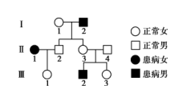
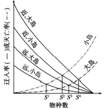
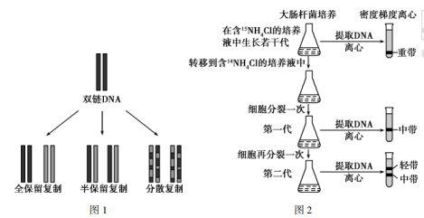
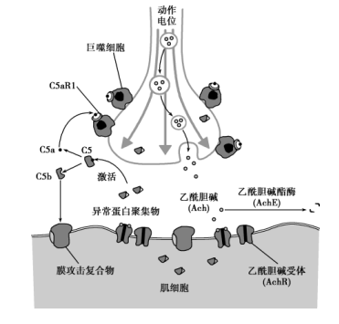
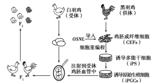

**1海南省2022年普通高中学业水平选择性考试**

**生物**

**一、选择题**

1\. 脊髓灰质炎病毒已被科学家人工合成。该人工合成病毒能够引发小鼠脊髓灰质炎，但其毒性比天然病毒小得多。下列有关叙述正确的是（ ）

A. 该人工合成病毒的结构和功能与天然病毒的完全相同

B. 该人工合成病毒和原核细胞都有细胞膜，无细胞核

C 该人工合成病毒和真核细胞都能进行细胞呼吸

D. 该人工合成病毒、大肠杆菌和酵母菌都含有遗传物质

【答案】D

【解析】

【分析】病毒不具有细胞结构，结构简单，一般只有蛋白质和核酸，不能进行细胞呼吸，只能在宿主细胞中增殖。

【详解】A、人工合成的脊髓灰质炎病毒的毒性比天然病毒小得多，据此可推测二者在结构和功能上存在差异，A错误；

BC、病毒不具有细胞结构，不能进行细胞呼吸，只能在宿主细胞中增殖，BC错误；

D、人工合成病毒、大肠杆菌和酵母菌都含有遗传物质，D正确。

故选D。

2\. 人体细胞会经历增殖、分化、衰老和死亡等生命历程。下列有关叙述错误的是（ ）

A. 正常的B淋巴细胞不能无限增殖

B. 细胞分化只发生在胚胎发育阶段

C. 细胞产生的自由基可攻击蛋白质，导致细胞衰老

D. 细胞通过自噬作用可清除受损的细胞器，维持细胞内部环境的稳定

【答案】B

【解析】

【分析】细胞分化是指在个体发育中，由一个或一种细胞增殖产生的后代，在形态、结构和生理功能上发稳定性差异的过程。细胞分化的实质：基因的选择性表达。

【详解】A、正常的B淋巴细胞受到抗原刺激后，能发生分裂和分化，但不能无限增殖，癌细胞具有无限增值的能力，A正确；

B、细胞分化发生在个体发育中的各个阶段，B错误；

C、细胞产生的自由基会攻击和破坏细胞内各种执行正常功能的生物分子，攻击蛋白质，使蛋白质的活性下降，导致细胞衰老，C正确；

D、细胞通过自噬作用可清除受损的细胞器，从而维持细胞内部环境的稳定，D正确。

故选B。

3\. 某小组为了探究适宜温度下CO2对光合作用的影响，将四组等量菠菜叶圆片排气后，分别置于盛有等体积不同浓度NaHCO3溶液的烧杯中，从烧杯底部给予适宜光照，记录叶圆片上浮所需时长，结果如图。下列有关叙述正确的是（ ）

A. 本实验中，温度、NaHCO3浓度和光照都属于自变量

B. 叶圆片上浮所需时长主要取决于叶圆片光合作用释放氧气的速率

C. 四组实验中，0.5％NaHCO3溶液中叶圆片光合速率最高

D. 若在4℃条件下进行本实验，则各组叶圆片上浮所需时长均会缩短

【答案】B

【解析】

【分析】不同浓度的NaHCO3溶液可表示不同的CO2浓度，随着NaHCO3溶液浓度的增加，叶圆片浮起需要的时间缩短，说明光合速率增加。

【详解】A、本实验是探究适宜温度下CO2对光合作用的影响，自变量为CO2浓度（NaHCO3溶液浓度），温度和光照为无关变量，A错误；

B、当光合作用产生的氧气大于细胞呼吸释放的氧气时，叶圆片上浮，叶圆片上浮所需时长主要取决于叶圆片光合作用释放氧气的速率，B正确；

C、四组实验中，0.5％NaHCO3溶液中叶圆片上浮需要的时间最长，光合速率最小，C错误；

D、若在4℃条件下进行本实验，由于低温会使酶的活性降低，净光合速率可能降低，故各组叶圆片上浮所需时长可能均会延长，D错误。

故选B。

4\. 肌动蛋白是细胞骨架的主要成分之一。研究表明，Cofilin-1是一种能与肌动蛋白相结合的蛋白质，介导肌动蛋白进入细胞核。Cofilin-1缺失可导致肌动蛋白结构和功能异常，引起细胞核变形，核膜破裂，染色质功能异常。下列有关叙述错误的是（ ）

A. 肌动蛋白可通过核孔自由进出细胞核

B. 编码Cofilin-1的基因不表达可导致细胞核变形

C. Cofilin-1缺失可导致细胞核失去控制物质进出细胞核的能力

D. Cofilin-1缺失会影响细胞核控制细胞代谢的能力

【答案】A

【解析】

【分析】肌动蛋白是细胞骨架的主要成分之一。细胞骨架是由蛋白质纤维组成的网架结构，维持着细胞的形态，锚定并支撑着许多细胞器，与细胞运动、分裂、分化以及物质运输、能量转化、信息传递等生命活动密切相关。

【详解】A 、核孔具有选择透过性，肌动蛋白不能通过核孔自由进出细胞核，肌动蛋白进入细胞核需要 Cofilin -1的介导，A错误；

B、编码Cofilin-1的基因不表达，Cofilin-1缺失，可导致肌动蛋白结构和功能异常，引起细胞核变形，核膜破裂，染色质功能异常，B正确；

C、Cofilin-1缺失可导致肌动蛋白不能进入细胞核，从而引起细胞核变形，可能会导致细胞核失去控制物质进出细胞核的能力，C正确；

D、Cofilin-1缺失会导致染色质功能异常，染色质上含有控制细胞代谢的基因，从而影响细胞核控制细胞代谢的能力，D正确。

故选A。

5\. 珊瑚生态系统主要由珊瑚礁及生物群落组成，生物多样性丰富。下列有关叙述错误是（ ）

A. 珊瑚虫为体内虫黄藻提供含氮物质，后者为前者提供有机物质，两者存在互利共生关系

B. 珊瑚生态系统具有抵抗不良环境并保持原状的能力，这是恢复力稳定性的表现

C. 对珊瑚礁的掠夺式开采会导致珊瑚生态系统遭到破坏

D. 珊瑚生态系统生物多样性的形成是协同进化的结果

【答案】B

【解析】

【分析】1、抵抗力稳定性：生态系统抵抗外界干扰能力并使自身结构和功能保持原状的能力。

2、种间关系：竞争、捕食、寄生、共生。

【详解】A、物种与物种之间的关系：竞争、捕食、寄生、共生。“珊瑚虫为体内虫黄藻提供含氮物质，后者为前者提供有机物质”，珊瑚虫和体内虫黄藻互惠互利，属于共生关系，A正确；

B、珊瑚生态系统具有抵抗不良环境并保持原状的能力，这是抵抗力稳定性的表现，B错误；

C、对珊瑚礁的掠夺式开采属于人类过度使用生态系统的资源，会导致珊瑚生态系统遭到破坏，C正确；

D、协同进化有利于生物多样性的增加，因此珊瑚生态系统生物多样性的形成是协同进化的结果，D正确。

故选B。

6\. 假性肥大性肌营养不良是伴Ｘ隐性遗传病，该病某家族的遗传系谱如图。下列有关叙述正确的是（ ）

A. Ⅱ-1的母亲不一定是患者 B. Ⅱ-3为携带者的概率是1/2

C. Ⅲ-2的致病基因来自Ⅰ-1 D. Ⅲ-3和正常男性婚配生下的子女一定不患病

【答案】A

【解析】

【分析】假性肥大性肌营养不良是伴X隐性遗传病，女性患病，其儿子必为患者。

【详解】A、假性肥大性肌营养不良是伴X隐性遗传病，女性患者的两条X染色体一条来自父亲，一条来自母亲，Ⅱ-1的母亲一定携带致病基因，但不一定是患者，A正确；

B、由于Ⅱ-3的父亲为患者，致病基因一定会传递给Ⅱ-3，所以Ⅱ-3一定为携带者，B错误；

C、Ⅲ-2的致病基因来自Ⅱ-3，Ⅱ-3的致病基因来自其父亲Ⅰ-2，C错误；

D、Ⅱ-3一定为携带者，设致病基因为a，则Ⅲ-3基因型为1/2XAXA、1/2XAXa，和正常男性XAY婚配生下的子女患病概率为1/2×1/4=1/8，即可能患病，D错误。

故选A。

7\. 植物激素和植物生长调节剂可调控植物的生长发育。下列有关叙述错误的是（ ）

A. 将患恶苗病的水稻叶片汁液喷洒到正常水稻幼苗上，结实率会降低

B. 植物组织培养中，培养基含生长素、不含细胞分裂素时，易形成多核细胞

C. 矮壮素处理后，小麦植株矮小、节间短，说明矮壮素的生理效应与赤霉素的相同

D. 高浓度2，4－D能杀死双子叶植物杂草，可作为除草剂使用

【答案】C

【解析】

【分析】不同植物激素的生理作用：生长素：合成部位：幼嫩的芽、叶和发育中的种子。主要生理功能：生长素的作用表现为两重性，即：低浓度促进生长，高浓度抑制生长。赤霉素：合成部位：幼芽、幼根和未成熟的种子等幼嫩部分。主要生理功能：促进细胞的伸长；解除种子、块茎的休眠并促进萌发的作用。细胞分裂素：合成部位：正在进行细胞分裂的幼嫩根尖。主要生理功能：促进细胞分裂；诱导芽的分化；防止植物衰老。脱落酸：合成部位：根冠、萎焉的叶片等。主要生理功能：抑制植物细胞的分裂和种子的萌发；促进植物进入休眠；促进叶和果实的衰老、脱落。乙烯：合成部位：植物体的各个部位都能产生。主要生理功能：促进果实成熟；促进器官的脱落；促进多开雌花。

【详解】A、将患恶苗病的水稻叶片汁液喷洒到正常水稻幼苗上，会使正常水稻幼苗营养生长过于旺盛，由于光合产物过多的用于营养生长，因此结实率会降低，A正确；

B、生长素主要促进细胞核的分裂，细胞分裂素主要促进细胞质的分裂，植物组织培养中，培养基含生长素、不含细胞分裂素时，易形成多核细胞，B正确；

C、赤霉素的主要作用是促进细胞伸长，从而引起植物的增高，而矮壮素处理后，小麦植株矮小、节间短，说明矮壮素的生理效应与赤霉素的相反，C错误；

D、高浓度2，4－D能杀死双子叶植物杂草，而对农作物（单子叶植物）起到促进作用，可作为除草剂使用，D正确。

故选C。

8\. 某学者提出，岛屿上的物种数取决于物种迁入和灭亡的动态平衡。图中曲线表示面积大小不同和距离大陆远近不同的岛屿上物种的迁入率和灭亡率，S1、S2、S3和S4表示迁入率和灭亡率曲线交叉点对应的平衡物种数，即为该岛上预测的物种数。下列有关叙述错误的是（ ）

A. 面积相同时，岛屿距离大陆越远，预测的物种数越多

B. 与大陆距离相同时，岛屿面积越大，预测的物种数越多

C. 物种数相同情况下，近而大的岛，迁入率高；远而小的岛，迁入率低

D. 物种数相同情况下，小岛上的物种灭亡率高于大岛

【答案】A

【解析】

【分析】图中实线表示迁入率，虚线表示灭亡率，S1、S2、S3和S4表示迁入率和灭亡率曲线交叉点对应的平衡物种数，即为该岛上预测的物种数。据此分析解答。

【详解】A、据图可知，均为大岛时，近、大岛的预测的物种数S4＞远、大岛的预测的物种数S4，均为小岛时，近、小岛的预测的物种数S2＞远、小岛的预测的物种数S4，因此面积相同时，岛屿距离大陆越远，预测的物种数越少，A错误；

B、与大陆距离相同时，如近、大岛的预测的物种数S4＞近、小岛的预测的物种数S4，远、大岛的预测的物种数S4＞远、小岛的预测的物种数S4，因此与大陆距离相同时，岛屿面积越大，预测的物种数越多，B正确；

C、据图中四条实线可知，物种数相同情况下，近而大的岛，迁入率高；远而小的岛，迁入率低，C正确；

D、据图中两条虚线可知，物种数相同情况下，小岛上的物种灭亡率高于大岛，D正确。

故选A。

9\. 缺氧是指组织氧供应减少或不能充分利用氧，导致组织代谢、功能和形态结构异常变化的病理过程。动脉血氧分压与肺泡通气量（基本通气量为1）之间的关系如图。下列有关叙述错误的是（ ）

A. 动脉血氧分压从60mmHg降至20mmHg的过程中，肺泡通气量快速增加，以增加组织供氧

B. 生活在平原的人进入高原时，肺泡通气量快速增加，过度通气可使血液中CO2含量降低

C. 缺氧时，人体肌细胞可进行无氧呼吸产生能量

D. 缺氧时，机体内产生的乳酸与血液中的H2CO3发生反应，以维持血液ｐＨ的稳定

【答案】D

【解析】

【分析】正常机体通过调节作用，使各个器官、系统协调活动，共同维持内环境的相对稳定状态叫作稳态。稳态不是恒定不变，而是一种动态的平衡，神经-体液-免疫调节网络是机体维持稳态的主要调节机制。

【详解】A、观察图示，动脉血氧分压从60 mmHg 降至20 mmHg 的过程中，肺泡通气量迅速增加，吸入的氧气增多，以增加组织供氧， A 正确；

B、高原上缺乏氧气，生活在平原的人进入高原时，动脉血氧分压会降低．肺泡通气量会快速增加，过度通气排出 CO2 ，使血液中CO2含量降低， B 正确；

C、在缺氧条件下，人体肌细胞可进行无氧呼吸产生乳酸，并释放能量， C 正确；

D、缺氧时，机体内产生的乳酸与血液中的NaHCO3发生反应，以维持血液 pH 的稳定， D 错误。

故选D。

10\. 种子萌发过程中，储藏的淀粉、蛋白质等物质在酶的催化下生成简单有机物，为新器官的生长和呼吸作用提供原料。下列有关叙述错误的是（ ）

A. 种子的萌发受水分、温度和氧气等因素的影响

B. 种子萌发过程中呼吸作用增强，储藏的有机物的量减少

C. 干燥条件下种子不萌发，主要是因为种子中的酶因缺水而变性失活

D. 种子子叶切片用苏丹Ⅲ染色后，显微镜下观察到橘黄色颗粒，说明该种子含有脂肪

【答案】C

【解析】

【分析】种子萌发是指种子从吸水开始的一系列有序的生理过程和形态发生过程，在此过程中细胞代谢逐渐增强。种子萌发除了种子本身要具有健全的发芽力以及解除休眠期以外，也需要一定的环境条件，主要是充足的水分、适宜的温度和足够的氧气。一般种子萌发和光线关系不大，无论在黑暗或光照条件下都能正常进行，但有少数植物的种子，需要在有光的条件下，才能萌发良好。

【详解】A、种子的萌发需要一定的环境条件，如水分、温度和氧气等因素，A正确；

B、种子萌发过程中，自由水含量增加，呼吸作用增强，消耗储藏的淀粉、蛋白质等物质，生成简单有机物增多，导致储藏的有机物的量减少，B正确；

C、干燥条件下种子不萌发，主要是因为种子中缺水，特别是缺少自由水，导致细胞代谢强度非常弱，细胞呼吸产生的能量非常少，不能满足与种子萌发有关的生命活动对能量的需求，C错误；

D、脂肪能被苏丹Ⅲ染液染成橘黄色，种子子叶切片用苏丹Ⅲ染色后，显微镜下观察到橘黄色颗粒，说明该种子含有脂肪，D正确。

故选C。

11\. 科学家曾提出DNA复制方式的三种假说：全保留复制、半保留复制和分散复制（图1）。对此假说，科学家以大肠杆菌为实验材料，进行了如下实验（图2）：

下列有关叙述正确的是（ ）

A. 第一代细菌DNA离心后，试管中出现1条中带，说明DNA复制方式一定是半保留复制

B. 第二代细菌DNA离心后，试管中出现1条中带和1条轻带，说明DNA复制方式一定全保留复制

C. 结合第一代和第二代细菌DNA的离心结果，说明DNA复制方式一定是分散复制

D. 若DNA复制方式是半保留复制，继续培养至第三代，细菌DNA离心后试管中会出现1条中带和1条轻带

【答案】D

【解析】

【分析】DNA的复制是半保留复制，即以亲代DNA分子的每条链为模板，合成相应的子链，子链与对应的母链形成新的DNA分子，这样一个DNA分子经复制形成两个子代DNA分子，且每个子代DNA分子都含有一条母链。将DNA被15N标记的大肠杆菌移到14N培养基中培养，因合成DNA的原料中含14N，所以新合成的DNA链均含14N。根据半保留复制的特点，第一代的DNA分子应一条链含15N，一条链含14N。

【详解】ABC、第一代细菌DNA离心后，试管中出现1条中带，则可以排除全保留复制，但不能肯定是半保留复制或分散复制，继续做子代ⅡDNA密度鉴定，若子代Ⅱ可以分出一条中密度带和一条轻密度带，则可以排除分散复制，同时肯定是半保留复制，ABC错误；

D、若DNA复制方式是半保留复制，继续培养至第三代，形成的子代DNA只有两条链均为14N，或一条链含有14N一条链含有15N两种类型，因此细菌DNA离心后试管中只会出现1条中带和1条轻带，D正确。

故选D。

12\. 为探究校内植物园土壤中的细菌种类，某兴趣小组采集园内土壤样本并开展相关实验。下列有关叙述错误的是（ ）

A. 采样时应随机采集植物园中多个不同地点的土壤样本

B. 培养细菌时，可选用牛肉膏蛋白胨固体培养基

C. 土壤溶液稀释倍数越低，越容易得到单菌落

D. 鉴定细菌种类时，除形态学鉴定外，还可借助生物化学的方法

【答案】C

【解析】

【分析】1、培养基的营养构成：各种培养基一般都含有水、碳源、氮源、无机盐，此外还要满足微生物生长对pH、特殊营养物质以及氧气的要求。

2、统计菌落数目的方法：（1）稀释涂布平板法（间接）：①当样品的稀释庋足够高时，培养基表面生长的一个菌落，来源于样品稀释液中的一个活菌；②通过统计平板上的菌落数来推测样品中大约含有的活菌数。（2）利用显微镜直接计数。

【详解】A、采集植物园中土壤样本的原则之一是要随机采样，A正确；

B、牛肉膏蛋白胨固体培养基中含有细菌生长所需的碳源、氮源、水、无机盐等，可用于细菌的培养，B 正确；

C、土壤溶液稀释倍数足够高时，才能将聚集的细菌分散开，有助于在培养基表面形成单菌落，C错误；

D、不同种类细菌的理化特性一般不同，鉴定细菌种类时，除根据菌落特征进行形态学鉴定外，还可以借助生物化学的方法进行鉴定，D正确。

故选C。

13\. 某团队从下表①～④实验组中选择两组，模拟T2噬菌体侵染大肠杆菌实验，验证DNA是遗传物质。结果显示：第一组实验检测到放射性物质主要分布在沉淀物中，第二组实验检测到放射性物质主要分布在上清液中。该团队选择的第一、二组实验分别是（ ）

|  | T2噬菌体 | 大肠杆菌             |
|:-------------------------------------------------------------------------------------------------------------------------------------------------------------------------------:|:----------------:|:----------------:|
| ①                                                                                                                                                                               | 未标记              | 15N标记 |
| ②                                                                                                                                                                               | 32P标记 | 35S标记 |
| ③                                                                                                                                                                               | 3H标记  | 未标记              |
| ④                                                                                                                                                                               | 35S标记 | 未标记              |

A. ①和④ B. ②和③ C. ②和④ D. ④和③

【答案】C

【解析】

【分析】T2噬菌体侵染细菌的实验步骤：分别用35S或32P标记噬菌体→噬菌体与大肠杆菌混合培养→噬菌体侵染未被标记的细菌→在搅拌器中搅拌，然后离心，检测上清液和沉淀物中的放射性物质。该实验证明DNA是遗传物质。

【详解】噬菌体侵染细菌时，只有DNA进入细菌，蛋白质外壳没有进入，为了区分DNA和蛋白质，可用32P标记噬菌体的DNA，用35S标记噬菌体的蛋白质外壳，根据第一组实验检测到放射性物质主要分布在沉淀物中，说明亲代噬菌体的DNA被32P标记，根据第二组实验检测到放射性物质主要分布在上清液中，说明第二组噬菌体的蛋白质被35S标记，即C正确，ABD错误。

故选C。

14\. 机体内血糖浓度受多种激素共同调节。某实验小组探究了三种激素单独或联合作用调节血糖的效应，实验前血糖浓度为5.0mmol/L，血糖浓度随激素处理时间的变化如图。下列有关叙述正确的是（ ）

A. 激素单独作用时，0.5h内升高血糖最快的激素是肾上腺素

B. 3h时，三种激素联合作用升高血糖的效应大于各自效应的总和

C. 肾上腺素和胰高血糖素对血糖的调节作用表现出相抗衡的关系

D. 血糖浓度受肾上腺素、胰高血糖素和皮质醇调节，不受甲状腺激素调节

【答案】B

【解析】

【分析】由图可知，肾上腺素、胰高血糖素具有升高血糖的生理作用，皮质醇升高血糖的作用不明显，三种激素共同使用升高血糖的作用最明显。

【详解】A、据图分析，激素单独作用时，0.5 h 内升高血糖最快激素是胰高血糖素， A错误；

B、3h时，三种激素联合作用升高血糖的效应为12.8-5.0=7.8( mmol / L )，三种激素各自效应的总和为（6.9-5.0)+(5.7-5.0)+(5.2-5.0)=2.8( mmol / L )，前者明显大于后者， B正确；

C、肾上腺素和胰高血糖素都能升高血糖，二者在调节血糖方面表现出协同作用， C错误；

D、实验结果可证明血糖浓度受肾上腺素、胰高血糖素和皮质醇调节，但实验结果不能证明血糖浓度不受甲状腺激素调节， D错误。

故选B

15\. 匍匐鸡是一种矮型鸡，匍匐性状基因（A）对野生性状基因（a）为显性，这对基因位于常染色体上，且A基因纯合时会导致胚胎死亡。某鸡群中野生型个体占20％，匍匐型个体占80％，随机交配得到F1，F1雌、雄个体随机交配得到F2。下列有关叙述正确的是（ ）

A. F1中匍匐型个体的比例为12/25 B. 与F1相比，F2中A基因频率较高

C. F2中野生型个体的比例为25/49 D. F2中A基因频率为2/9

【答案】D

【解析】

【分析】匍匐鸡是一种矮型鸡，匍匐性状基因（A）对野生性状基因（a）为显性，这对基因位于常染色体上，且A基因纯合时会导致胚胎死亡。因此种群中只存在Aa和aa两种基因型的个体。

【详解】A、根据题意，A基因纯合时会导致胚胎死亡，因此匍匐型个体Aa占80％，野生型个体aa占20％，则A基因频率=80％×1/2=40%，a=60%，子一代中AA=40%×40%=16%，Aa=2×40%×60%=48%，aa=60%×60%=36%，由于A基因纯合时会导致胚胎死亡，所以子一代中Aa占（48%）÷（48%+36%）=4/7，A错误；

B、由于A基因纯合时会导致胚胎死亡，因此每一代都会使A的基因频率减小，故与F1相比，F2中A基因频率较低，B错误；

C、子一代Aa占4/7，aa占3/7，产生的配子为A=4/7×1/2=2/7，a=5/7，子二代中aa=5/7×5/7=25/49，由于AA=2/7×2/7=4/49致死，因此子二代aa占25/49÷（1－4/49）=5/9，C错误；

D、子二代aa占5/9，Aa占4/9，因此A的基因频率为4/9×1/2=2/9，D正确。

故选D。

**二、非选择题**

16\. 细胞膜上存在的多种蛋白质参与细胞的生命活动。回答下列问题。

（1）细胞膜上不同的通道蛋白、载体蛋白等膜蛋白，对不同物质的跨膜运输起着决定性作用，这些膜蛋白能够体现出细胞膜具有的功能特性是\_\_\_\_\_\_\_\_\_\_\_\_\_\_。

（2）细胞膜上的水通道蛋白是水分子进出细胞的重要通道，水分子借助水通道蛋白进出细胞的方式属于\_\_\_\_\_\_\_\_\_\_\_\_\_。

（3）细胞膜上的H＋-ATP酶是一种转运H＋的载体蛋白，能催化ATP水解，利用ATP水解释放的能量将H＋泵出细胞，导致细胞外的pH\_\_\_\_\_\_\_\_\_\_\_\_；此过程中，H＋-ATP酶作为载体蛋白在转运H＋时发生的变化是\_\_\_\_\_\_\_\_\_\_\_\_\_\_\_\_\_。

（4）细胞膜上的受体通常是蛋白质。人体胰岛B细胞分泌的胰岛素与靶细胞膜上的受体结合时，会引起靶细胞产生相应的生理变化，这一过程体现的细胞膜的功能是\_\_\_\_\_\_\_\_\_\_\_\_\_\_\_\_\_。

（5）植物根细胞借助细胞膜上的转运蛋白逆浓度梯度吸收磷酸盐，不同温度下吸收速率的变化趋势如图。与25℃相比，4℃条件下磷酸盐吸收速率低的主要原因是\_\_\_\_\_\_\_\_\_\_\_\_\_\_。

【答案】（1）选择透过性

（2）协助扩散 （3） ①. 降低 ②. 载体蛋白发生磷酸化，导致其空间结构改变

（4）进行细胞间信息交流

（5）温度降低，酶的活性降低，呼吸速率减慢，为主动运输提供的能量减少

【解析】

【分析】细胞膜的功能：（1）将细胞与外界环境分开；（2）控制物质进出细胞；（3）进行细胞间的物质交流。细胞膜的功能特点：具有选择透过性（可以让水分子自由通过，细胞要选择吸收的离子和小分子也可以通过，而其他的离子、小分子和大分子则不能通过）。

【小问1详解】

细胞膜上不同的通道蛋白、载体蛋白等膜蛋白，对不同物质的跨膜运输起着决定性作用，说明细胞膜对物质的运输具有选择透过性。

【小问2详解】

水分子借助水通道蛋白进出细胞的方式不消耗能量，属于协助扩散。

【小问3详解】

细胞膜上的H＋-ATP酶是一种转运H＋的载体蛋白，能催化ATP水解，利用ATP水解释放的能量将H＋泵出细胞，导致细胞外的H＋增加，pH降低，此过程中，H＋-ATP酶作为载体蛋白在转运H＋时会发生磷酸化，导致其空间结构改变，进而运输H＋。

【小问4详解】

人体胰岛B细胞分泌的胰岛素与靶细胞膜上的受体结合时，会引起靶细胞产生相应的生理变化，这一过程体现了细胞膜具有进行细胞间信息交流的功能。

【小问5详解】

植物根细胞借助细胞膜上的转运蛋白逆浓度梯度吸收磷酸盐属于主动运输，需要消耗细胞呼吸提供的能量，而温度降低，酶的活性降低，会导致呼吸速率降低，为主动运输提供的能量减少，因此与25℃相比，4℃条件下磷酸盐吸收速率低。

17\. 人体运动需要神经系统对肌群进行精确的调控来实现。肌萎缩侧索硬化（ALS）是一种神经肌肉退行性疾病，患者神经肌肉接头示意图如下。回答下列问题。

（1）轴突末梢中突触小体内的Ach通过\_\_\_\_\_\_\_\_\_\_\_\_方式进入突触间隙。

（2）突触间隙的Ach与突触后膜上的AchR结合，将兴奋传递到肌细胞，从而引起肌肉\_\_\_\_\_\_\_\_\_\_\_\_，这个过程需要\_\_\_\_\_\_\_\_\_\_\_\_信号到\_\_\_\_\_\_\_\_\_\_\_\_信号的转换。

（3）有机磷杀虫剂（OPI）能抑制AchE活性。OPI中毒者的突触间隙会积累大量的\_\_\_\_\_\_\_\_\_\_，导致副交感神经末梢过度兴奋，使瞳孔\_\_\_\_\_\_\_\_\_。

（4）ALS的发生及病情加重与补体C5（一种蛋白质）的激活相关。如图所示，患者体内的C5被激活后裂解为C5a和C5b，两者发挥不同作用。

①C5a与受体C5aR1结合后激活巨噬细胞，后者攻击运动神经元而致其损伤，因此C5a－C5aR1信号通路在ALS的发生及病情加重中发挥重要作用。理论上使用C5a的抗体可延缓ALS的发生及病情加重，理由是\_\_。

②C5b与其他补体在突触后膜上形成膜攻击复合物，引起Ca2＋和Na＋内流进入肌细胞，导致肌细胞破裂，其原因是\_\_\_\_\_\_\_\_\_\_\_\_\_\_\_\_\_\_\_\_\_\_\_\_\_\_\_\_。

【答案】（1）胞吐 （2） ①. 收缩 ②. 化学 ③. 电

（3） ①. Ach ②. 收缩加剧

（4） ①. C5a的抗体能与C5a发生特异性结合，从而使C5a的抗体不能与受体C5aR1结合，不能激活巨噬细胞，减少对运动神经元的攻击而造成的损伤 ②. Ca2＋和Na＋内流进入肌细胞，会增加肌细胞内的渗透压，导致肌细胞吸水增强，大量吸水会导致细胞破裂

【解析】

【分析】兴奋在神经元之间需要通过突触结构进行传递，突触包括突触前膜、突触间隙、突触后膜，其具体的传递过程为：兴奋以电流的形式传导到轴突末梢时，突触小泡释放递质（化学信号），递质作用于突触后膜，引起突触后膜产生膜电位（电信号），从而将兴奋传递到下一个神经元。由于递质只能由突触前膜释放，作用于突触后膜，因此神经元之间兴奋的传递只能是单方向的。

【小问1详解】

突触小体内的Ach存在突触小泡内，通过胞吐的方式进入突触间隙。

【小问2详解】

Ach为兴奋性递质，突触间隙的Ach与突触后膜上的AchR结合，将兴奋传递到肌细胞，从而引起肌肉收缩，这个过程中可将Ach携带的化学信号转化为突触后膜上的电信号。

【小问3详解】

AchE能将突触间隙中的Ach分解，若有机磷杀虫剂（OPI）能抑制AchE活性，则导致突触间隙中的Ach分解速率减慢，使突触间隙中会积累大量的Ach，导致副交感神经末梢过度兴奋，使瞳孔收缩加剧。

【小问4详解】

①C5a的抗体可与C5a发生特异性结合，使C5a不能与受体C5aR1结合，进而不能激活巨噬细胞，降低对运动神经元的攻击而导致的损伤，因此可延缓ALS的发生及病情加重。

②C5b与其他补体在突触后膜上形成膜攻击复合物，引起Ca2＋和Na＋内流进入肌细胞，大量离子的进入导致肌细胞渗透压增加，从而吸水破裂。

18\. 家蚕是二倍体生物（2n＝56），雌、雄个体性染色体组成分别是ZW、ZZ。某研究所在野生家蚕资源调查中发现了一些隐性纯合突变体。这些突变体的表型、基因及基因所在染色体见表。回答下列问题。

| 突变体表型  | 基因  | 基因所在染色体 |
|:------:|:---:|:-------:|
| 第二隐性灰卵 | a   | 12号     |
| 第二多星纹  | b   | 12号     |
| 抗浓核病   | d   | 15号     |
| 幼蚕巧克力色 | e   | Z       |

（1）幼蚕巧克力色的控制基因位于性染色体上，该性状的遗传总是和性别相关联，这种现象称为\_\_\_\_\_\_\_\_\_\_\_\_\_\_\_\_\_\_\_。

（2）表中所列的基因，不能与b基因进行自由组合的是\_\_\_\_\_\_\_\_\_\_\_\_\_\_\_\_\_\_\_。

（3）正常情况下，雌家蚕的1个染色体组含有\_\_\_\_\_\_\_\_\_\_\_\_\_\_\_\_\_\_\_条染色体，雌家蚕处于减数分裂Ⅱ后期的细胞含有\_\_\_\_\_\_\_\_\_\_\_\_\_\_\_\_\_\_\_条W染色体。

（4）幼蚕不抗浓核病（D）对抗浓核病（d）为显性，黑色（E）对巧克力色（e）为显性。为鉴定一只不抗浓核病黑色雄性幼蚕的基因型，某同学将其饲养至成虫后，与若干只基因型为ddZeW的雌蚕成虫交配，产生的F1幼蚕全部为黑色，且不抗浓核病与抗浓核病个体的比例为1∶1，则该雄性幼蚕的基因型是\_\_\_\_\_\_\_\_\_\_\_\_。

（5）家蚕的成虫称为家蚕蛾，已知家蚕蛾有鳞毛和无鳞毛这对相对性状受一对等位基因控制。现有纯合的有鳞毛和无鳞毛的家蚕蛾雌、雄个体若干只，设计实验探究控制有鳞毛和无鳞毛的基因是位于常染色体上还是Z染色体上（不考虑Z、W同源区段），并判断有鳞毛和无鳞毛的显隐性。要求简要写出实验思路、预期结果及结论。

【答案】（1）伴性遗传 （2）a

（3） ①. 28 ②. 0或2

（4）DdZEZE （5）实验思路：让纯合的有鳞毛和无鳞毛的家蚕蛾雌、雄个体进行正反交实验，得到F1，观察并统计F1个体的表现型及比例。预期结果及结论：若正反结果只出现一种性状，则表现出来的性状为显性性状，且控制有鳞毛和无鳞毛的基因是位于常染色体上；若正反交结果不同，则控制有鳞毛和无鳞毛的基因是位于Z染色体上，且F1中雄性个体表现出的性状为显性性状。

【解析】

【分析】1、位于性染色体上的基因控制的性状在遗传上总是和性别相关联，这种现象叫作伴性遗传。

2、性别决定是指雌雄异体的生物决定性别的方式。性别决定的方式常见的有XY型和ZW型两种。

【小问1详解】

位于性染色体上的基因控制的性状在遗传上总是和性别相关联，这种现象叫作伴性遗传。

【小问2详解】

a与b基因都位于12号染色体上，位于同一对染色体上的基因不能发生自由组合。

【小问3详解】

家蚕是二倍体生物（2n＝56），正常情况下，雌家蚕的1个染色体组含有28条染色体，减数分裂Ⅱ后期的细胞中染色体着丝粒分裂，含有W染色体的条数为0或2。

【小问4详解】

该只不抗浓核病黑色雄性幼蚕与若干只基因型为ddZeW的雌蚕成虫交配，产生的F1幼蚕全部为黑色，说明该雄性关于该性状的基因型为ZEZE。且F1中不抗浓核病与抗浓核病个体的比例为1∶1，说明该雄性关于该性状的基因型为Dd，综上分析雄性幼蚕的基因型是DdZEZE。

【小问5详解】

需要通过实验来探究控制有鳞毛和无鳞毛的基因是位于常染色体上还是Z染色体上（不考虑Z、W同源区段），但由于不知道显隐关系，可以利用正反交实验来探究。

实验思路：让纯合的有鳞毛和无鳞毛的家蚕蛾雌、雄个体进行正反交实验，得到F1，观察并统计F1个体的表现型及比例（假设相关基因为A和a）。

预期结果及结论：若控制有鳞毛和无鳞毛的基因是位于常染色体上，正反交分别为AA×aa、aa×AA，其子一代基因型都为Aa，只出现一种性状，且子一代表现出来的性状为显性性状；若有鳞毛和无鳞毛的基因是位于Z染色体上，正反交分别为ZAZA×ZaW（后代雌雄全为显性性状）、ZaZa×ZAW（后代雄全为显性性状，雌性全为隐性性状），则正反交结果不同，且F1中雄性个体表现出的性状为显性性状。

19\. 海南热带雨林国家公园拥有我国连片面积最大的热带雨林，包括霸王岭、鹦哥岭、五指山等片区。回答下列问题。

（1）海南热带雨林具有固碳功能，能够吸收并固定\_\_\_\_\_\_\_\_\_\_\_\_\_\_\_，有助于减缓全球气候变暖。

（2）海南热带雨林国家公园物种丰富、景色优美，具有极高的科学研究和旅游观赏价值，这体现了生物多样性的\_\_\_\_\_\_\_\_\_\_\_\_\_\_价值。为了保护海南热带雨林的生物资源，特别是保护濒危物种的基因资源，除建立精子库外，还可建立\_\_\_\_\_\_\_\_\_\_\_\_\_\_（答出2点即可）。

（3）海南热带雨林国家公园中，森林生态系统生物多样性具有较高的间接价值，该价值主要体现为调节生态系统的功能，如固碳供氧、\_\_\_\_\_\_\_\_\_\_\_\_\_\_\_\_\_\_\_\_\_\_\_\_\_\_\_\_\_\_\_\_\_\_\_\_\_\_\_\_\_\_（再答出2点即可）。

（4）生活在霸王岭片区的中国特有长臂猿——海南长臂猿，已被世界自然保护联盟列为极度濒危物种。研究发现，海南长臂猿栖息地的丧失和碎片化导致其种群数量减少，这是因为\_\_\_\_\_\_\_\_\_\_\_\_\_\_\_\_\_\_\_\_\_\_\_\_\_\_\_\_。针对栖息地的丧失，应采取的具体保护措施有\_\_\_\_\_\_\_\_\_\_\_\_\_\_，以增加海南长臂猿的栖息地面积；针对栖息地的碎片化，应建立\_\_\_\_\_\_\_\_\_\_\_\_\_\_，使海南长臂猿碎片化的栖息地连成片。

【答案】（1）CO2 （2） ①. 直接 ②. 种子库、基因库、利用生物技术对濒危物种进行保护

（3）防风固沙、水土保持

（4） ①. 种群的生存环境变的恶劣，食物和栖息空间减少，种群间的基因交流减少，近亲繁殖的机会增加，患隐性遗传病的概率增加，死亡率升高 ②. 建立自然保护区 ③. 生态廊道

【解析】

【分析】间接价值，一般表现为涵养水源、净化水质、巩固堤岸、防止土壤侵蚀、降低洪峰，改善地方气候、吸收污染物，调节碳氧平衡，在调节全球气候变化中的作用，主要指维持生态系统的平衡作用等等。

【小问1详解】

海南热带雨林具有固碳功能，能够吸收并固定CO2，有助于减缓全球气候变暖。

【小问2详解】

科学研究和旅游观赏价值属于生物多样性的直接价值。为了保护海南热带雨林的生物资源，特别是保护濒危物种的基因资源，除建立精子库外，还可以建立种子库、基因库等。

【小问3详解】

生物多样性具有的间接价值表现在涵养水源、防风固沙、水土保持、固碳供氧、调节气候等。

【小问4详解】

海南长臂猿栖息地的丧失和碎片化导致种群的生存环境恶劣，食物和栖息空间减少，种群间的基因交流减少，近亲繁殖的机会增加，患隐性遗传病的概率增加，死亡率升高。针对栖息地的丧失，可建立自然保护区，以增加海南长臂猿的栖息地面积；针对栖息地的碎片化，应建立生态廊道，使海南长臂猿碎片化的栖息地连成片，增加种群间不同个体的基因交流。

20\. 以我国科学家为主的科研团队将OSNL（即4个基因Oct4／Sox2／Nanog／Lin28A的缩写）导入黑羽鸡胚成纤维细胞（CEFs），诱导其重编程为诱导多能干细胞（iPS），再诱导iPS分化为诱导原始生殖细胞（iPGCs），然后将iPGCs注射到孵化2.5天的白羽鸡胚血管中，最终获得具有黑羽鸡遗传特性的后代，实验流程如图。回答下列问题。

（1）CEFs是从孵化9天的黑羽鸡胚中分离获得的，为了获得单细胞悬液，鸡胚组织剪碎后需用\_\_\_\_\_\_\_\_\_\_\_\_\_\_\_\_\_\_\_\_\_\_\_\_\_\_\_处理。动物细胞培养通常需要在合成培养基中添加\_\_\_\_\_\_\_\_\_\_\_\_\_\_等天然成分，以满足细胞对某些细胞因子的需求。

（2）体外获取OSNL的方法有\_\_\_\_\_\_\_\_\_\_\_\_\_\_（答出1种即可）。若要在CEFs中表达外源基因的蛋白，需构建基因表达载体，载体中除含有目的基因和标记基因外，还须有启动子和\_\_\_\_\_\_\_\_\_\_\_\_\_\_等。启动子是\_\_\_\_\_\_\_\_\_\_\_\_\_\_识别和结合的部位，有了它才能驱动\_\_\_\_\_\_\_\_\_\_\_\_\_\_\_\_\_\_\_\_\_\_\_\_\_\_\_\_。

（3）iPS细胞和iPGCs细胞的形态、结构和功能不同的根本原因是\_\_\_\_\_\_\_\_\_\_\_\_\_\_。

（4）诱导iPS细胞的技术与体细胞核移植技术的主要区别是\_\_\_\_\_\_\_\_\_\_。

（5）该实验流程中用到的生物技术有\_\_\_\_\_\_\_\_\_\_\_\_\_\_\_\_（答出2点即可）。

【答案】（1） ①. 胰蛋白酶、胶原蛋白酶等 ②. 动物血清

（2） ①. PCR技术、人工合成法 ②. 终止子 ③. RNA聚合酶 ④. 目的基因转录出mRNA，最终表达出所需要的蛋白质

（3）基因的选择性表达

（4）诱导iPS细胞的技术是将已经分化的细胞诱导为类似胚胎干细胞的一种细胞（iPS），再诱导iPS分化为诱导原始生殖细胞（iPGCs）的技术，而细胞核移植技术是将动物的一个细胞的细胞核移入去核的卵母细胞内，使这个重组的细胞发育为胚胎，继而发育为动物个体的技术

（5）基因工程、动物细胞培养

【解析】

【分析】胚胎干细胞（ES细胞）具有自我更新及多向分化潜能，为发育学、遗传学、人类疾病的发病机理与替代治疗等研究提供非常宝贵的资源。iPS细胞技术是借助基因导入技术将某些特定因子基因导入动物或人的体细胞，以将其重编程或诱导为ES细胞样的细胞，即iPS细胞。

【小问1详解】

动物细胞培养时，鸡胚组织剪碎后需用胰蛋白酶处理，以获得单细胞悬液。动物细胞培养时一般需要在合成培养基中添加血清等天然成分，以满足细胞对某些细胞因子的需求。

【小问2详解】

OSNL为目的基因，体外获取目的基因可通过PCR技术大量扩增或通过人工合成法来合成。基因表达载体中除目的基因外，还必须有启动子、终止子、复制原点和标记基因等。启动子是一段有特殊结构的DNA片段，位于基因的首端，它是RNA聚合酶识别和结合的部位，有了它才能驱动基因转录出mRNA，最终获得所需要的蛋白质。

【小问3详解】

据图可知，由iPS细胞诱导形成iPGCs细胞经过了细胞分化，该过程遗传物质没有改变，导致其细胞的形态、结构和功能不同的根本原因是基因的选择性表达。

【小问4详解】

诱导iPS细胞的技术是将已经分化的细胞诱导为类似胚胎干细胞的一种细胞（iPS），再诱导iPS分化为诱导原始生殖细胞（iPGCs）的技术，而细胞核移植技术是将动物的一个细胞的细胞核移入去核的卵母细胞内，使这个重组的细胞发育为胚胎，继而发育为动物个体的技术。

【小问5详解】

由图可知，该实验流程中将OSNL基因导入鸡胚成纤维细胞利用了基因工程技术，诱导多能干细胞过程利用了动物细胞培养的技术。
