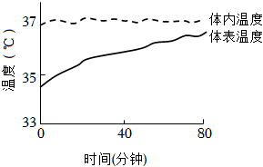
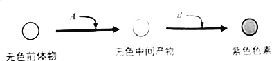
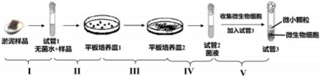
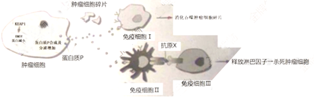
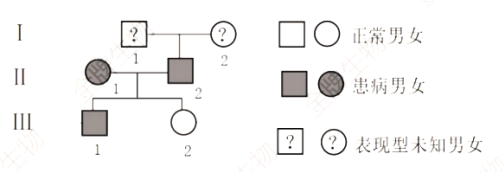

**2022年上海市高考生物试卷**

**一、选择题（共40分，每小题2分，每小题只有一个正确答案）**

1．（2分）“大弦嘈嘈如急雨小弦切切如私语”描述了当年白居易和其他客人在船中听乐声的场景，听乐声的感受器是（　　）

A．眼 B．舌 C．前庭器 D．耳蜗

2．（2分）为了解某种饮料的营养成分，对其做出三种规范的鉴定操作，得到相应现象如表。由此判断该饮料样液中至少含有（　　）

|          |            |        |
|:--------:|:----------:|:------:|
| 鉴定标本 | 鉴定用试剂 |  现象  |
|    1     | 双缩脲试剂 |  蓝色  |
|    2     | 苏丹Ⅲ染液  | 橘黄色 |
|    3     |  班氏试剂  | 砖红色 |

A．还原性糖、蛋白质、脂肪 B．蛋白质和还原性糖

C．还原性糖和脂肪 D．蛋白质和脂肪

3．（2分）地钱具有重要的药用价值，若要利用叶片快速人工繁育，可用的技术是（　　）

A．单倍体育种技术 B．干细胞技术

C．细胞核移植技术 D．植物组织培养技术

4．（2分）如图中甲乙为两个视野，由甲视野到乙视野必要的操作是（　　）

> ①调节亮度
>
> ②转动物镜转换器
>
> ③转动目镜
>
> ④调节粗调节器
>
> 

A．①② B．②④ C．①③ D．③④

5．（2分）海洋中的鲸鱼偶然因蹭船艇摆脱藤壶，此后鲸鱼看到船艇会有意蹭船，上述过程中建立的反射类型及特点是（　　）

A．非条件反射 无需强化 B．条件反射 无需强化

C．非条件反射 需要强化 D．条件反射 需要强化

6．（2分）海底透明鱼的体表色素等已经退化，可被直接看到内脏、骨骼，下列关于透明鱼的说法正确的是（　　）

A．其透明特征无法遗传

B．海底环境对其透明性状进行了选择

C．海底环境导致基因定向突变

D．海底环境促进其色素基因表达

7．（2分）二倍体的唐鱼可人工诱导成不育的三倍体，这种人工诱导的变异属于（　　）

A．染色体非整倍化变异 B．单个碱基缺失

C．染色体整倍化变异 D．单个碱基替换

8．（2分）如图为某种细胞的细胞周期示意图，箭头表示细胞周期进行的方向其中b→c为分裂（M）期，则以DNA复制为主的主要时期是（　　）

> 

A．a→b和c→d B．d→a C．b→c和c→d D．b→c

9．（2分）大豆种子细胞中含有多种物质，其中可在大豆种子萌发时提供能量的物质是（　　）

A．维生素 B．纤维素 C．无机盐 D．脂肪

10．（2分）心肌细胞膜上的钙泵将钙离子泵出细胞外，下列说法正确的是（　　）

A．消耗ATP，无需载体 B．不消耗ATP，无需载体

C．消耗ATP，需载体 D．不消耗ATP，需载体

11．（2分）昆虫的神经突触间隙存在可分解神经递质的酶，其活性可被某杀虫剂抑制，据此推测，该杀虫剂作用于昆虫后，短时间内影响（　　）

A．突触小泡中神经递质的种类

B．突触后膜的受体种类

C．突触后膜的膜电位转变

D．突触后膜受体数量

12．（2分）狗的毛色受一组复等位基因控制，如表列举了基因型与毛色的对应关系，据此推测基因型S+SW狗的毛色是（　　）

|  |  |  |  |
|:--:|:--:|:--:|:--:|
| 基因型 | S+S+、S+SP、S+SV | SPSP、SPSV | SVSV、SVSW |
| 毛色 | 纯有色（非白色） | 花斑 | 面部、腰部、眼部白斑 |

A．花斑 B．纯有色（非白色）

C．白色 D．面部白斑

13．（2分）据此推测可搭建出“单链DNA的零部件”组合是（　　）

> ①核糖核苷酸
>
> ②脱氧核糖核苷酸
>
> ③连接碱基与五碳糖的化学键
>
> ④连接磷酸与五碳糖的化学键

A．仅①③ B．仅②③ C．仅②④ D．仅①④

14．（2分）用生长素运输抑制剂SPL处理拟南芥，统计光照和黑暗中拟南芥的生根情况，得到如图数据，据图分析下列证明拟南芥生根与生长素有关的两组实验数据是（　　）

> 

A．Ⅰ和Ⅱ B．Ⅰ和Ⅲ C．Ⅱ和Ⅲ D．Ⅱ和Ⅳ

15．（2分）人体在室温25℃保持安静15分钟后，将室温迅速提升至35℃，提升室温后人体不同部位温度变化如图，则0﹣40分钟之间人体（　　）

> 

A．皮肤血管收缩

B．皮肤血流量增加

C．汗腺的分泌下降

D．体温调节中枢兴奋性下降

16．（2分）适量运动可增加体内高密度脂蛋白（HDL）含量，HDL在人体中的主要功能是将（　　）

A．肝脏中葡萄糖运往血液 B．血液中葡萄糖运往肝脏

C．肝脏中胆固醇运往血液 D．血液中胆固醇运往肝脏

17．（2分）香豌豆花紫色色素的形成需要两对等位基因（以A/a、B/b表示）中显性基因同时存在，这两对等位基因独立遗传，具体作用机制如图。现对基因型为AaBb的紫花香豌豆进行测交，F1中紫花所占的比例应为（　　）

> 

A． B． C． D．

18．（2分）正常体色雄性家蚕（ZAZA）与透明体色雄性家蚕（ZaW）交配，F1均为正常体色。F1个体之间交配产生F2。理论上，下列对F2表现型的描述正确的是（　　）

A．雄家蚕均为正常体色 B．雄家蚕均为透明体色

C．雌家蚕均为正常体色 D．雌家蚕均为透明体色

**二、综合题**

19．微生物与水体治理

> 自然界中某些微生物可通过分泌多糖和蛋白质来吸附水体中的微小颗粒，使其沉淀。如图表示从淤泥样品中筛选高效沉降污水中微小颗粒的微生物操作步骤。
>
> 
>
> （1）步骤Ⅰ﹣Ⅴ中使用涂布法接种的是 <u>　 　</u>需进行微生物培养的步骤是 <u>　 　</u>。
>
> （2）设置步骤Ⅲ的目的是 <u>　 　</u>。
>
> A.计算数量
>
> B.增加细胞数量
>
> C.稀释菌液
>
> D.获得单一菌落
>
> （3）根据步骤Ⅱ和Ⅲ的目的，平板培养皿1中的培养基类型是 <u>　 　</u>，平板培养皿2中的培养基类型是 <u>　 　</u>。（用下面编号答题）
>
> ①固体培养基
>
> ②液体培养基
>
> ③通用培养基
>
> ④选择培养基

20．免疫细胞与肿瘤

> 研究发现在肿瘤细胞中。KEAP1基因可调控蛋白质P的分泌，从而影响机体的免疫应答反应。部分机制如图。
>
> 
>
> （1）如图中免疫细胞Ⅰ的名称为 <u>　 　</u>，免疫细胞Ⅲ名称为 <u>　 　</u>。
>
> （2）免疫细胞Ⅰ完成的免疫反应属于 <u>　 　</u>，免疫细胞Ⅲ完成的免疫反应属于 <u>　 　</u>。（用下面编号答题）
>
> ①特异性免疫
>
> ②非特异性免疫
>
> ③细胞免疫
>
> ④体液免疫
>
> （3）来源于同种干细胞的免疫细胞Ⅰ和Ⅲ，两者相同的是 <u>　 　</u>。
>
> A.形态和功能
>
> B.遗传信息
>
> C.mRNA种类
>
> D.蛋白质种类
>
> （4）据如图可知P蛋白可以 <u>　 　</u>。（多选）
>
> A.与免疫细胞Ⅰ的受体结合
>
> B.促进免疫细胞Ⅰ分泌抗体
>
> C.与免疫细胞Ⅲ的受体结合
>
> D.促进免疫细胞Ⅲ释放淋巴因子
>
> （5）据题意和如图信息，推测下列情况可抑制肿瘤发展的是 <u>　 　</u>。（多选）
>
> A.KEAP1基因缺失
>
> B.EMSY蛋白减少
>
> C.蛋白质P分泌量减少
>
> D.淋巴因子分泌量增加

21．人类遗传病

> LA综合征是由LA﹣1基因突变引起的疾病，绝大多数患者的成骨细胞中LA蛋白质合成量不足或结构改变发病。如图为某家族的该疾病系谱图。已知Ⅱ﹣2的LA﹣1致病基因来自上一代。
>
> 
>
> （1）LA综合征的致病基因位于 <u>　 　</u>（X/Y/常）染色体上，其遗传方式为 <u>　 　</u>（显性/隐性）遗传。
>
> （2）在有丝分裂过程中Ⅱ﹣1的1个成骨细胞中含有2个LA﹣1突变基因的时期为 <u>　 　</u>（用下面编号答题）。
>
> ①G1期
>
> ②分裂前期
>
> ③分裂中期
>
> ④分裂后期
>
> （3）若用A/a表示LA﹣1基因，Ⅰ﹣1基因型可能为 <u>　 　</u>，Ⅱ﹣2的次级精母细胞中，含有LA﹣1突变基因的数量可能为 <u>　 　</u>。
>
> （4）下列措施中，理论上可避免Ⅱ﹣1和Ⅱ﹣2夫妻再生育出LA综合征患者的是 <u>　 　</u>。
>
> A.生育期加强锻炼
>
> B.患者经造血干细胞移植后直接生育
>
> C.对胎儿做染色体检测
>
> D.患者生殖细胞基因修复后做试管婴儿
>
> （5）健康人成骨细胞中LA蛋白由315个氨基酸组成。已知LA﹣1突变基因引起LA蛋白质第100位氨基酸对应的密码子发生碱基替换，Ⅲ﹣1成骨细胞中LA蛋白的氨基酸数目为 <u>　 　</u>。
