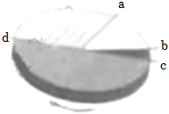
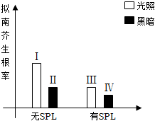
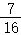
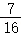

**2022年上海市高考生物试卷**

**一、选择题（共40分，每小题2分，每小题只有一个正确答案）**

1．（2分）“大弦嘈嘈如急雨小弦切切如私语”描述了当年白居易和其他客人在船中听乐声的场景，听乐声的感受器是（　　）

A．眼 B．舌 C．前庭器 D．耳蜗

2．（2分）为了解某种饮料的营养成分，对其做出三种规范的鉴定操作，得到相应现象如表。由此判断该饮料样液中至少含有（　　）

|      |       |     |
|:----:|:-----:|:---:|
| 鉴定标本 | 鉴定用试剂 | 现象  |
| 1    | 双缩脲试剂 | 蓝色  |
| 2    | 苏丹Ⅲ染液 | 橘黄色 |
| 3    | 班氏试剂  | 砖红色 |

A．还原性糖、蛋白质、脂肪 B．蛋白质和还原性糖

C．还原性糖和脂肪 D．蛋白质和脂肪

3．（2分）地钱具有重要的药用价值，若要利用叶片快速人工繁育，可用的技术是（　　）

A．单倍体育种技术 B．干细胞技术

C．细胞核移植技术 D．植物组织培养技术

4．（2分）如图中甲乙为两个视野，由甲视野到乙视野必要的操作是（　　）

> ①调节亮度
> 
> ②转动物镜转换器
> 
> ③转动目镜
> 
> ④调节粗调节器

A．①② B．②④ C．①③ D．③④

5．（2分）海洋中的鲸鱼偶然因蹭船艇摆脱藤壶，此后鲸鱼看到船艇会有意蹭船，上述过程中建立的反射类型及特点是（　　）

A．非条件反射 无需强化 B．条件反射 无需强化

C．非条件反射 需要强化 D．条件反射 需要强化

6．（2分）海底透明鱼的体表色素等已经退化，可被直接看到内脏、骨骼，下列关于透明鱼的说法正确的是（　　）

A．其透明特征无法遗传

B．海底环境对其透明性状进行了选择

C．海底环境导致基因定向突变

D．海底环境促进其色素基因表达

7．（2分）二倍体的唐鱼可人工诱导成不育的三倍体，这种人工诱导的变异属于（　　）

A．染色体非整倍化变异 B．单个碱基缺失

C．染色体整倍化变异 D．单个碱基替换

8．（2分）如图为某种细胞的细胞周期示意图，箭头表示细胞周期进行的方向其中b→c为分裂（M）期，则以DNA复制为主的主要时期是（　　）

> 

A．a→b和c→d B．d→a C．b→c和c→d D．b→c

9．（2分）大豆种子细胞中含有多种物质，其中可在大豆种子萌发时提供能量的物质是（　　）

A．维生素 B．纤维素 C．无机盐 D．脂肪

10．（2分）心肌细胞膜上的钙泵将钙离子泵出细胞外，下列说法正确的是（　　）

A．消耗ATP，无需载体 B．不消耗ATP，无需载体

C．消耗ATP，需载体 D．不消耗ATP，需载体

11．（2分）昆虫的神经突触间隙存在可分解神经递质的酶，其活性可被某杀虫剂抑制，据此推测，该杀虫剂作用于昆虫后，短时间内影响（　　）

A．突触小泡中神经递质的种类

B．突触后膜的受体种类

C．突触后膜的膜电位转变

D．突触后膜受体数量

12．（2分）狗的毛色受一组复等位基因控制，如表列举了基因型与毛色的对应关系，据此推测基因型S+SW狗的毛色是（　　）

|     |                                                                                  |                                                       |                                                       |
|:---:|:--------------------------------------------------------------------------------:|:-----------------------------------------------------:|:-----------------------------------------------------:|
| 基因型 | S+S+、S+SP、S+SV | SPSP、SPSV | SVSV、SVSW |
| 毛色  | 纯有色（非白色）                                                                         | 花斑                                                    | 面部、腰部、眼部白斑                                            |

A．花斑 B．纯有色（非白色）

C．白色 D．面部白斑

13．（2分）据此推测可搭建出“单链DNA的零部件”组合是（　　）

> ①核糖核苷酸
> 
> ②脱氧核糖核苷酸
> 
> ③连接碱基与五碳糖的化学键
> 
> ④连接磷酸与五碳糖的化学键

A．仅①③ B．仅②③ C．仅②④ D．仅①④

14．（2分）用生长素运输抑制剂SPL处理拟南芥，统计光照和黑暗中拟南芥的生根情况，得到如图数据，据图分析下列证明拟南芥生根与生长素有关的两组实验数据是（　　）

> 

A．Ⅰ和Ⅱ B．Ⅰ和Ⅲ C．Ⅱ和Ⅲ D．Ⅱ和Ⅳ

15．（2分）人体在室温25℃保持安静15分钟后，将室温迅速提升至35℃，提升室温后人体不同部位温度变化如图，则0﹣40分钟之间人体（　　）

> 

A．皮肤血管收缩

B．皮肤血流量增加

C．汗腺的分泌下降

D．体温调节中枢兴奋性下降

16．（2分）适量运动可增加体内高密度脂蛋白（HDL）含量，HDL在人体中的主要功能是将（　　）

A．肝脏中葡萄糖运往血液 B．血液中葡萄糖运往肝脏

C．肝脏中胆固醇运往血液 D．血液中胆固醇运往肝脏

17．（2分）香豌豆花紫色色素的形成需要两对等位基因（以A/a、B/b表示）中显性基因同时存在，这两对等位基因独立遗传，具体作用机制如图。现对基因型为AaBb的紫花香豌豆进行测交，F1中紫花所占的比例应为（　　）

> 

A． B． C． D．

18．（2分）正常体色雄性家蚕（ZAZA）与透明体色雄性家蚕（ZaW）交配，F1均为正常体色。F1个体之间交配产生F2。理论上，下列对F2表现型的描述正确的是（　　）

A．雄家蚕均为正常体色 B．雄家蚕均为透明体色

C．雌家蚕均为正常体色 D．雌家蚕均为透明体色

**二、综合题**

19．微生物与水体治理

> 自然界中某些微生物可通过分泌多糖和蛋白质来吸附水体中的微小颗粒，使其沉淀。如图表示从淤泥样品中筛选高效沉降污水中微小颗粒的微生物操作步骤。
> 
> 
> 
> （1）步骤Ⅰ﹣Ⅴ中使用涂布法接种的是 <u>　 　</u>需进行微生物培养的步骤是 <u>　 　</u>。
> 
> （2）设置步骤Ⅲ的目的是 <u>　 　</u>。
> 
> A.计算数量
> 
> B.增加细胞数量
> 
> C.稀释菌液
> 
> D.获得单一菌落
> 
> （3）根据步骤Ⅱ和Ⅲ的目的，平板培养皿1中的培养基类型是 <u>　 　</u>，平板培养皿2中的培养基类型是 <u>　 　</u>。（用下面编号答题）
> 
> ①固体培养基
> 
> ②液体培养基
> 
> ③通用培养基
> 
> ④选择培养基

20．免疫细胞与肿瘤

> 研究发现在肿瘤细胞中。KEAP1基因可调控蛋白质P的分泌，从而影响机体的免疫应答反应。部分机制如图。
> 
> 
> 
> （1）如图中免疫细胞Ⅰ的名称为 <u>　 　</u>，免疫细胞Ⅲ名称为 <u>　 　</u>。
> 
> （2）免疫细胞Ⅰ完成的免疫反应属于 <u>　 　</u>，免疫细胞Ⅲ完成的免疫反应属于 <u>　 　</u>。（用下面编号答题）
> 
> ①特异性免疫
> 
> ②非特异性免疫
> 
> ③细胞免疫
> 
> ④体液免疫
> 
> （3）来源于同种干细胞的免疫细胞Ⅰ和Ⅲ，两者相同的是 <u>　 　</u>。
> 
> A.形态和功能
> 
> B.遗传信息
> 
> C.mRNA种类
> 
> D.蛋白质种类
> 
> （4）据如图可知P蛋白可以 <u>　 　</u>。（多选）
> 
> A.与免疫细胞Ⅰ的受体结合
> 
> B.促进免疫细胞Ⅰ分泌抗体
> 
> C.与免疫细胞Ⅲ的受体结合
> 
> D.促进免疫细胞Ⅲ释放淋巴因子
> 
> （5）据题意和如图信息，推测下列情况可抑制肿瘤发展的是 <u>　 　</u>。（多选）
> 
> A.KEAP1基因缺失
> 
> B.EMSY蛋白减少
> 
> C.蛋白质P分泌量减少
> 
> D.淋巴因子分泌量增加

21．人类遗传病

> LA综合征是由LA﹣1基因突变引起的疾病，绝大多数患者的成骨细胞中LA蛋白质合成量不足或结构改变发病。如图为某家族的该疾病系谱图。已知Ⅱ﹣2的LA﹣1致病基因来自上一代。
> 
> 
> 
> （1）LA综合征的致病基因位于 <u>　 　</u>（X/Y/常）染色体上，其遗传方式为 <u>　 　</u>（显性/隐性）遗传。
> 
> （2）在有丝分裂过程中Ⅱ﹣1的1个成骨细胞中含有2个LA﹣1突变基因的时期为 <u>　 　</u>（用下面编号答题）。
> 
> ①G1期
> 
> ②分裂前期
> 
> ③分裂中期
> 
> ④分裂后期
> 
> （3）若用A/a表示LA﹣1基因，Ⅰ﹣1基因型可能为 <u>　 　</u>，Ⅱ﹣2的次级精母细胞中，含有LA﹣1突变基因的数量可能为 <u>　 　</u>。
> 
> （4）下列措施中，理论上可避免Ⅱ﹣1和Ⅱ﹣2夫妻再生育出LA综合征患者的是 <u>　 　</u>。
> 
> A.生育期加强锻炼
> 
> B.患者经造血干细胞移植后直接生育
> 
> C.对胎儿做染色体检测
> 
> D.患者生殖细胞基因修复后做试管婴儿
> 
> （5）健康人成骨细胞中LA蛋白由315个氨基酸组成。已知LA﹣1突变基因引起LA蛋白质第100位氨基酸对应的密码子发生碱基替换，Ⅲ﹣1成骨细胞中LA蛋白的氨基酸数目为 <u>　 　</u>。

**2022年上海市高考生物试卷**

**参考答案与试题解析**

**一、选择题（共40分，每小题2分，每小题只有一个正确答案）**

1．（2分）“大弦嘈嘈如急雨小弦切切如私语”描述了当年白居易和其他客人在船中听乐声的场景，听乐声的感受器是（　　）

A．眼 B．舌 C．前庭器 D．耳蜗

> 【分析】耳由外耳、中耳和内耳三部分组成，外耳包括耳廓和外耳道；中耳包括鼓膜、鼓室和听小骨；内耳包括半规管、前庭和耳蜗。
> 
> 【解答】解：听觉的形成过程：外界的声波经过外耳道传到鼓膜，引起鼓膜的振动；振动通过听小骨传到内耳，刺激耳蜗内的听觉感受器，产生神经冲动；神经冲动通过与听觉有关的神经传递到大脑皮层的听觉中枢，就形成了听觉，故听乐声的感受器是耳蜗。
> 
> 故选：D。
> 
> 【点评】本题考查听觉的形成，要求考生识记耳的组成，及各部分的功能，能结合所学的知识做出准确的判断，属于考纲识记和理解层次的考查。

2．（2分）为了解某种饮料的营养成分，对其做出三种规范的鉴定操作，得到相应现象如表。由此判断该饮料样液中至少含有（　　）

|      |       |     |
|:----:|:-----:|:---:|
| 鉴定标本 | 鉴定用试剂 | 现象  |
| 1    | 双缩脲试剂 | 蓝色  |
| 2    | 苏丹Ⅲ染液 | 橘黄色 |
| 3    | 班氏试剂  | 砖红色 |

A．还原性糖、蛋白质、脂肪 B．蛋白质和还原性糖

C．还原性糖和脂肪 D．蛋白质和脂肪

> 【分析】生物组织中化合物的鉴定：
> 
> （1）斐林试剂可用于鉴定还原糖，在水浴加热的条件下，溶液的颜色变化为砖红色（沉淀）。斐林试剂只能检验生物组织中还原糖（如葡萄糖、麦芽糖、果糖）存在与否，而不能鉴定非还原性糖（如淀粉、蔗糖）。
> 
> （2）蛋白质可与双缩脲试剂产生紫色反应。
> 
> （3）脂肪可用苏丹Ⅲ染液（或苏丹Ⅳ染液）鉴定，呈橘黄色（或红色）。
> 
> （4）淀粉遇碘液变蓝。
> 
> 【解答】解：双缩脲试剂可与蛋白质发生紫色反应，加入双缩脲试剂后出现蓝色，说明其中不含蛋白质；苏丹Ⅲ染液可与脂肪反应呈橘黄色，因此其中含有脂肪；班氏试剂可用于检测还原糖，出现砖红色沉淀，因此其中含有还原糖。
> 
> 故选：C。
> 
> 【点评】本题考查生物组织中化合物的鉴定，对于此类试题，需考生注意的细节较多，如实验的原理、实验采用的方法、实验现象及结论等，需要考生在平时的学习过程中注意积累。

3．（2分）地钱具有重要的药用价值，若要利用叶片快速人工繁育，可用的技术是（　　）

A．单倍体育种技术 B．干细胞技术

C．细胞核移植技术 D．植物组织培养技术

> 【分析】植物组织培养技术：（1）过程：离体的植物组织，器官或细胞（外植体）→愈伤组织→胚状体→植株（新植体）；（2）原理：植物细胞的全能性；（3）条件：①细胞离体和适宜的外界条件（如适宜温度、适时的光照、pH和无菌环境等）；②一定的营养（无机、有机成分）和植物激素（生长素和细胞分裂素）；（4）植物细胞工程技术的应用：植物繁殖的新途径（包括微型繁殖，作物脱毒、人工种子等）、作物新品种的培育（单倍体育种、突变体的利用）、细胞产物的工厂化生产。
> 
> 【解答】解：利用叶片快速人工繁育，可用的技术是植物组织培养。
> 
> 故选：D。
> 
> 【点评】本题考查植物组织培养的相关知识，要求考生识记原理及操作步骤，能将教材中的知识结合题中信息进行迁移应用。

4．（2分）如图中甲乙为两个视野，由甲视野到乙视野必要的操作是（　　）

> ①调节亮度
> 
> ②转动物镜转换器
> 
> ③转动目镜
> 
> ④调节粗调节器

A．①② B．②④ C．①③ D．③④

> 【分析】显微镜的呈像原理和基本操作：
> 
> （1）显微镜成像的特点：显微镜成像是倒立的虚像，即上下相反，左右相反，物像的移动方向与标本的移动方向相反，故显微镜下所成的像是倒立放大的虚像，若在视野中看到细胞质顺时针流动，则实际上细胞质就是顺时针流动。
> 
> （2）显微镜观察细胞，放大倍数与观察的细胞数呈反比例关系，放大倍数越大，观察的细胞数越少，视野越暗，反之亦然。
> 
> （3）显微镜的放大倍数＝物镜的放大倍数×目镜的放大倍数。目镜的镜头越长，其放大倍数越小；物镜的镜头越长，其放大倍数越大，与玻片的距离也越近，反之则越远。显微镜的放大倍数越大，视野中看的细胞数目越少，细胞越大。
> 
> （4）反光镜和光圈都是用于调节视野亮度的；粗准焦螺旋和细准焦螺旋都是用于调节清晰度的，且高倍镜下只能通过细准焦螺旋进行微调。
> 
> （5）由低倍镜换用高倍镜进行观察的步骤是：移动玻片标本使要观察的某一物像到达视野中央→转动转换器选择高倍镜对准通光孔→调节光圈，换用较大光圈使视野较为明亮→转动细准焦螺旋使物像更加清晰。
> 
> 【解答】解：由图观察可知，图甲转换为图乙，视野变亮，视野中细胞变大，这说明图甲转换为图乙是低倍镜切换为高倍镜的操作，其操作步骤是：移动玻片标本使要观察的某一物像到达视野中央→转动转换器选择高倍镜对准通光孔→调节光圈，换用较大光圈使视野较为明亮→转动细准焦螺旋使物像更加清晰；故由甲视野到乙视野必要的操作是①调节亮度和②转动物镜转换器，低倍镜切换为高倍镜时转动的是物镜，且调节的是细准焦螺旋。
> 
> 故选：A。
> 
> 【点评】本题考查显微镜的基本结构和使用方法，要求考生识记显微镜的使用和工作原理，掌握高倍镜和低倍镜的使用。

5．（2分）海洋中的鲸鱼偶然因蹭船艇摆脱藤壶，此后鲸鱼看到船艇会有意蹭船，上述过程中建立的反射类型及特点是（　　）

A．非条件反射 无需强化 B．条件反射 无需强化

C．非条件反射 需要强化 D．条件反射 需要强化

> 【分析】1、一个典型的反射弧包括感受器、传入神经、中间神经元、传出神经和效应器五部分。其中，感受器为接受刺激的器官；传入神经为感觉神经元，是将感受器与中枢联系起来的通路；中间神经即神经中枢，包括脑和脊髓；传出神经为运动神经元，是将中枢与效应器联系起来的通路；效应器指传出神经末梢和它所支配的肌肉或腺体等。只有在反射弧完整的情况下，反射才能完成。
> 
> 2、实现反射活动的结构基础是反射弧，每个反射都有各自的反射弧。反射活动一般过程如下：刺激物作用于感受器引起兴奋，兴奋以神经冲动形式沿传入神经传至中枢，中枢对传入信息加以整合处理，而后发出信号沿传出神经传到效应器，从而引起相应的活动。反射被分成非条件反射和条件反射、生理性反射和病理性反射。
> 
> 【解答】解：非条件反射是指人生来就有的先天性反射，是一种比较低级的神经活动，而条件反射是个体生活过程中，在非条件反射的基础上，由特定的条件刺激所引起的反射，学习活动是后天进行的，因此属于条件反射，而条件反射的进行必须要不断强化，否则会消退。鲸鱼看到船艇会有意蹭船属于条件反射，需要非条件刺激强化。
> 
> 故选：D。
> 
> 【点评】本题考查反射的类型及特点，意在考查学生的识记能力和判断能力，运用所学知识综合分析问题的能力。

6．（2分）海底透明鱼的体表色素等已经退化，可被直接看到内脏、骨骼，下列关于透明鱼的说法正确的是（　　）

A．其透明特征无法遗传

B．海底环境对其透明性状进行了选择

C．海底环境导致基因定向突变

D．海底环境促进其色素基因表达

> 【分析】现代生物进化理论的主要内容有：种群是生物进化的基本单位，生物进化的实质在于种群基因频率的改变。突变和基因重组、自然选择及隔离是物种形成过程的三个基本环节，通过它们的综合作用，种群产生分化，最终导致新物种的形成。其中突变和基因重组产生生物进化的原材料，自然选择使种群的基因频率发生定向的改变并决定生物进化的方向，隔离是新物种形成的必要条件。
> 
> 【解答】解：A、海底透明鱼的透明特征是由基因决定，该性状可以遗传，A错误；
> 
> B、出现透明性状，是由于海底环境对该个体进行了选择，身体透明的个体更加适应海底环境，从而出现了海底透明鱼，B正确；
> 
> C、基因突变是不定向的，C错误；
> 
> D、由题干信息可知：海底透明鱼的体表色素等已经退化，说明海底环境并未促进其色素基因表达，D错误。
> 
> 故选：B。
> 
> 【点评】本题主要考查生物进化的相关知识，要求考生识记现代生物进化理论的主要内容，再结合所学知识正确答题。

7．（2分）二倍体的唐鱼可人工诱导成不育的三倍体，这种人工诱导的变异属于（　　）

A．染色体非整倍化变异 B．单个碱基缺失

C．染色体整倍化变异 D．单个碱基替换

> 【分析】染色体变异是指染色体结构和数目的改变。染色体结构的变异主要有缺失、重复、倒位、易位四种类型。染色体数目变异可以分为两类：一类是细胞内个别染色体的增加或减少，属于染色体非整倍化变异；另一类是细胞内染色体数目以染色体组的形式成倍地增加或减少，属于染色体整倍化变异。
> 
> 【解答】解：二倍体的唐鱼可人工诱导成不育的三倍体，该变异是染色体数目的变异，以染色体组的形式成倍的增加，因此属于染色体整倍化变异。
> 
> 故选：C。
> 
> 【点评】本题考查染色体数目的变异，意在考查学生的识记能力和判断能力，难度不大。

8．（2分）如图为某种细胞的细胞周期示意图，箭头表示细胞周期进行的方向其中b→c为分裂（M）期，则以DNA复制为主的主要时期是（　　）

> 

A．a→b和c→d B．d→a C．b→c和c→d D．b→c

> 【分析】1、细胞周期可分为分裂间期和分裂期（M），其中分裂间期根据细胞生理活动差异分为分为G1期、S期和G2期。S期主要进行DNA复制，G1期为DNA复制准备，G2期为分裂期做准备。
> 
> 2、分析题图：图中箭头表示细胞周期进行的方向，其中b→c为分裂（M）期，则c→d为G1期、d→a为S期、a→b为G2期。
> 
> 【解答】解：根据试题分析，d→a为S期，S期主要进行DNA复制。
> 
> 故选：B。
> 
> 【点评】本题考查了细胞周期的阶段，意在考查考生的识记和理解能力，属于基础题。

9．（2分）大豆种子细胞中含有多种物质，其中可在大豆种子萌发时提供能量的物质是（　　）

A．维生素 B．纤维素 C．无机盐 D．脂肪

> 【分析】1、组成细胞的化合物包括无机物和有机物，无机物包括水和无机盐，有机物包括蛋白质、脂质、糖类和核酸。鲜重细胞含量最多的化合物是水，含量最多的有机物是蛋白质。
> 
> 2、常见的脂质有脂肪、磷脂和固醇。固醇类物质包括胆固醇、性激素和维生素D，胆固醇是构成细胞膜的重要成分、在人体内还参与血液中脂质的运输，性激素能促进人和动物生殖器官的发育以及生殖细胞的形成，维生素D能有效地促进人和动物肠道对钙和磷的吸收。
> 
> 【解答】解：能够为细胞提供能量的是脂肪、糖类、蛋白质三类营养物质。
> 
> 故选：D。
> 
> 【点评】本题考查各类化合物的种类和作用，旨在考查学生对所学知识的总结归纳，可借助概念图、思维导图、表格等学习工具。

10．（2分）心肌细胞膜上的钙泵将钙离子泵出细胞外，下列说法正确的是（　　）

A．消耗ATP，无需载体 B．不消耗ATP，无需载体

C．消耗ATP，需载体 D．不消耗ATP，需载体

> 【分析】主动运输：小分子物质从低浓度运输到高浓度的运输，如：矿物质离子，葡萄糖进出除红细胞外的其他细胞需要能量和载体蛋白。
> 
> 【解答】解：心肌细胞膜上的钙泵将钙离子泵出细胞外，该过程是从低浓度到高浓度进行，需要载体蛋白的协助，需要消耗ATP，属于主动运输。
> 
> 故选：C。
> 
> 【点评】本题主要考查主动运输的特点，要求考生识记主动运输的概念及特点，再结合所学知识正确判断各选项。

11．（2分）昆虫的神经突触间隙存在可分解神经递质的酶，其活性可被某杀虫剂抑制，据此推测，该杀虫剂作用于昆虫后，短时间内影响（　　）

A．突触小泡中神经递质的种类

B．突触后膜的受体种类

C．突触后膜的膜电位转变

D．突触后膜受体数量

> 【分析】一个神经元的轴突末梢经过多次分支，与下一个神经元的树突或者细胞体形成突触；突触是由突触前膜、突触间隙和突触后膜三部分构成的；
> 
> 神经递质存在于突触小体的突触小泡中，由突触前膜以胞吐的形式释放到突触间隙，作用于突触后膜。兴奋在突触处传递的形式是电信号→化学信号→电信号。
> 
> 神经递质只存在于突触前膜的突触小泡中，只能由突触前膜释放，进入突触间隙，作用于突触后膜上的特异性受体，引起下一个神经元兴奋或抑制。
> 
> 突触处所完成的信号转换为电信号→化学信号→电信号。
> 
> 【解答】解：杀虫剂能够抑制分解神经递质的酶的活性，使神经递质能够持续作用于突触后膜，引起突触后膜的膜电位持续发生转变，C正确，ABD错误。
> 
> 故选：C。
> 
> 【点评】本题考查神经递质的相关知识，意在考查对知识的掌握程度，并应用相关知识结合题干信息进行推理、解答问题。

12．（2分）狗的毛色受一组复等位基因控制，如表列举了基因型与毛色的对应关系，据此推测基因型S+SW狗的毛色是（　　）

|     |                                                                                  |                                                       |                                                       |
|:---:|:--------------------------------------------------------------------------------:|:-----------------------------------------------------:|:-----------------------------------------------------:|
| 基因型 | S+S+、S+SP、S+SV | SPSP、SPSV | SVSV、SVSW |
| 毛色  | 纯有色（非白色）                                                                         | 花斑                                                    | 面部、腰部、眼部白斑                                            |

A．花斑 B．纯有色（非白色）

C．白色 D．面部白斑

> 【分析】1、基因分离定律定律的实质：进行有性生殖的生物在进行减数分裂产生配子的过程中，位于同源染色体上的等位基因随同源染色体分离而分离，分别进入不同的配子中，随配子独立遗传给后代；复等位基因的遗传同样遵循分离定律。
> 
> 2、小鼠的毛色受复等位基因S+、SP、SV、SW控制，遵循基因的分离定律定律。
> 
> 【解答】解：S+S+、S+SP、S+SV都表现为纯有色（非白色），说明S+相对于SP、SV是显性，控制纯有色；SPSP、SPSV都表现为花斑，说明SP相对于SV是显性，控制花斑；SVSV、SVSW都表现为面部、腰部、眼部白斑，说明SV相对于SW是显性，控制面部、腰部、眼部白斑。因此，显隐性关系为：S+＞SP＞SV＞SW，则基因型S+SW狗的毛色是纯有色（非白色）。
> 
> 故选：B。
> 
> 【点评】本题考查基因分离定律及复等位基因的相关知识，要求考生根据表格信息判断显隐性关系，属于考纲中理解层次的考查。

13．（2分）据此推测可搭建出“单链DNA的零部件”组合是（　　）

> ①核糖核苷酸
> 
> ②脱氧核糖核苷酸
> 
> ③连接碱基与五碳糖的化学键
> 
> ④连接磷酸与五碳糖的化学键

A．仅①③ B．仅②③ C．仅②④ D．仅①④

> 【分析】核酸是由核苷酸连接而成的长链，DNA是由脱氧核糖核苷酸连接而成的长链。两个脱氧核苷酸之间通过磷酸二酯键相连。
> 
> 【解答】解：“单链DNA的零部件”需要DNA的单位：脱氧核糖核苷酸，脱氧核糖核苷酸通过磷酸二酯键连接而成的长链，是相邻两个脱氧核苷酸的磷酸和脱氧核糖之间通过磷酸二酯键相连，②④符合题意；
> 
> 故选：C。
> 
> 【点评】本题考查DNA分子的结构特点的相关知识，意在考查考生的识记能力和判断分析能力，运用所学知识综合分析解决问题。

14．（2分）用生长素运输抑制剂SPL处理拟南芥，统计光照和黑暗中拟南芥的生根情况，得到如图数据，据图分析下列证明拟南芥生根与生长素有关的两组实验数据是（　　）

> 

A．Ⅰ和Ⅱ B．Ⅰ和Ⅲ C．Ⅱ和Ⅲ D．Ⅱ和Ⅳ

> 【分析】生长素作用具有两重性，即低浓度促进生长，高浓度抑制生长，主要表现为：既能促进生长，也能抑制生长；既可以疏花蔬果，也可以防止落花落果；既能促进生根，也能抑制生根。
> 
> 【解答】解：根据题图分析，在光照条件下，无SPL时拟南芥生根率（Ⅰ组）与有SPL时的生根率（Ⅲ组）存在显著差异；黑暗条件下Ⅱ组生根率大于Ⅳ组，但二者差异并不显著。由此可知，实验Ⅰ、Ⅲ组对照可以证明拟南芥生根与生长素有关。
> 
> 故选：B。
> 
> 【点评】本题以植物激素的相关对照实验为背景材料，考查植物激素的作用，在课本知识的基础上有一定的延伸，要求学生能够掌握实验分析方法和植物激素的基础知识并运用。

15．（2分）人体在室温25℃保持安静15分钟后，将室温迅速提升至35℃，提升室温后人体不同部位温度变化如图，则0﹣40分钟之间人体（　　）

> 

A．皮肤血管收缩

B．皮肤血流量增加

C．汗腺的分泌下降

D．体温调节中枢兴奋性下降

> 【分析】人体体温调节：
> 
> （1）体温调节中枢：下丘脑。
> 
> （2）机理：产热和散热平衡。
> 
> （3）寒冷环境下：①增加产热的途径：骨骼肌战栗、甲状腺激素和肾上腺素分泌增加；②减少散热的途径：立毛肌收缩、皮肤血管收缩等。
> 
> （4）炎热环境下：主要通过增加散热来维持体温相对稳定，增加散热的途径主要有汗液分泌增加、皮肤血管舒张。
> 
> 【解答】解：环境温度迅速提升，皮肤中的热觉感受器兴奋，该兴奋传递给下丘脑的体温调节中枢，从而使皮肤血管舒张，以增加皮肤血流量，从而增加散热，也使汗腺分泌增多。故B正确，ACD错误。
> 
> 故选：B。
> 
> 【点评】本题结合人体内环境稳态的体温调节实例考查学生对知识的掌握情况，需要学生把握神经调节、体液调节的基础知识并通过总结归纳形成知识网络，再结合题干信息进行分析，解决问题。

16．（2分）适量运动可增加体内高密度脂蛋白（HDL）含量，HDL在人体中的主要功能是将（　　）

A．肝脏中葡萄糖运往血液 B．血液中葡萄糖运往肝脏

C．肝脏中胆固醇运往血液 D．血液中胆固醇运往肝脏

> 【分析】高密度脂蛋白（HDL） 为血清蛋白之一，是由脂质和蛋白质及其所携带的调节因子组成的复杂脂蛋白，亦称为a1脂蛋白。比较富含磷脂质，在血清中的含量约为200mg/dl。其蛋白质部分，A﹣Ⅰ约为75%，A﹣Ⅱ约为20%。由于可输出胆固醇促进胆固醇的代谢，所以作为动脉硬化预防因子而受到重视。高密度脂蛋白运载周围组织中的胆固醇，再转化为胆汁酸或直接通过胆汁从肠道排出，动脉造影证明高密度脂蛋白胆固醇含量与动脉管腔狭窄程度呈显著的负相关。所以高密度脂蛋白是一种抗动脉粥样硬化的血浆脂蛋白，是冠心病的保护因子。俗称“血管清道夫”。
> 
> 【解答】解：高密度脂蛋白的颗粒非常的小，可以自由的进出动脉管壁，可以摄取血管壁内膜当中沉积下来的低密度脂蛋白，和胆固醇以及甘油三酯等有害的物质，帮助转运到肝脏，进行分解代谢。在肝脏一方面可以变成胆汁酸，是肝脏起的作用，另外也可以直接通过胆汁从肠道排出。
> 
> 故选：D。
> 
> 【点评】本题考查学生对蛋白质相关知识的了解，要求学生掌握HDL在人体中的主要功能，属于识记层次的内容，难度较易。

17．（2分）香豌豆花紫色色素的形成需要两对等位基因（以A/a、B/b表示）中显性基因同时存在，这两对等位基因独立遗传，具体作用机制如图。现对基因型为AaBb的紫花香豌豆进行测交，F1中紫花所占的比例应为（　　）

> 

A． B． C． D．

> 【分析】由题意可知，紫花的基因型为A_B\_，白花的基因型为A_bb、aaB_和aabb。
> 
> 【解答】解：对AaBb的个体进行测交，即与aabb交配，则子代基因型及比例为A_B\_：A_bb：aaB\_：aabb＝1：1：1：1，表现型及比例为紫花：白花＝1：3，即紫花占比。
> 
> 故选：C。
> 
> 【点评】本题考查基因的自由组合定律有关知识，要求学生理解基因的自由组合定律的实质，在准确分析题干信息的基础上运用所学知识和方法解决问题。

18．（2分）正常体色雄性家蚕（ZAZA）与透明体色雄性家蚕（ZaW）交配，F1均为正常体色。F1个体之间交配产生F2。理论上，下列对F2表现型的描述正确的是（　　）

A．雄家蚕均为正常体色 B．雄家蚕均为透明体色

C．雌家蚕均为正常体色 D．雌家蚕均为透明体色

> 【分析】1、在生物体的体细胞中，控制同一种性状的遗传因子成对存在，不相融合，在形成配子时，成对的遗传因子发生分离，分离后的遗传因子分别进入不同的配子中，随配子遗传给后代。
> 
> 2、伴性遗传是指在遗传过程中的子代部分性状由性染色体上的基因控制，这种由性染色体上的基因所控制性状的遗传上总是和性别相关，这种与性别相关联的性状遗传方式就称为伴性遗传，又称性连锁遗传。
> 
> 【解答】解：正常体色雄性家蚕（ZAZA）与透明体色雄性家蚕（ZaW）交配，F1均为正常体色，子一代基因型为ZAZa和ZAW，F1个体之间交配产生F2，子二代基因型为ZAZA、ZAZa、ZAW、ZaW，因此子二代雄性都是正常体色，雌性一半为正常体色一半为透明体色。
> 
> 故选：A。
> 
> 【点评】本题考查学生从题中获取相关实验信息，并结合所学伴性遗传的知识做出正确判断，属于应用层次的内容，难度较易。

**二、综合题**

19．微生物与水体治理

> 自然界中某些微生物可通过分泌多糖和蛋白质来吸附水体中的微小颗粒，使其沉淀。如图表示从淤泥样品中筛选高效沉降污水中微小颗粒的微生物操作步骤。
> 
> 
> 
> （1）步骤Ⅰ﹣Ⅴ中使用涂布法接种的是 <u>　步骤Ⅱ　</u>需进行微生物培养的步骤是 <u>　Ⅱ、Ⅲ、Ⅳ　</u>。
> 
> （2）设置步骤Ⅲ的目的是 <u>　D　</u>。
> 
> A.计算数量
> 
> B.增加细胞数量
> 
> C.稀释菌液
> 
> D.获得单一菌落
> 
> （3）根据步骤Ⅱ和Ⅲ的目的，平板培养皿1中的培养基类型是 <u>　①③　</u>，平板培养皿2中的培养基类型是 <u>　①③　</u>。（用下面编号答题）
> 
> ①固体培养基
> 
> ②液体培养基
> 
> ③通用培养基
> 
> ④选择培养基
> 
> 【分析】步骤Ⅰ是将样品配置成菌液；步骤Ⅱ、Ⅲ、Ⅳ是通过行稀释涂布平板法、平板划线法对微生物进行分离、纯化以及扩大培养的过程；Ⅴ是对纯化得到的菌种进行进一步筛选，检测其降解污水中微小颗粒的能力。
> 
> 【解答】解：（1）步骤Ⅰ﹣Ⅴ中使用涂布法接种的是步骤Ⅱ；需进行微生物培养的步骤是Ⅱ、Ⅲ、Ⅳ。
> 
> （2）步骤Ⅲ是从涂布平板的培养基上挑取单菌落，进一步通过平板划线法进行分离、纯化，以获得单一菌落。
> 
> 故选：D。
> 
> （3）步骤Ⅱ和Ⅲ的目的都是对菌种进行分离、纯化。从物理性质看，平板培养皿1和2都要使用固体培养基，固体培养基上才能形成单菌落；从功能看，培养皿1和2使用通用培养基即可，此时还不需要使用选择培养基。
> 
> 故答案为：
> 
> （1）步骤ⅡⅡ、Ⅲ、Ⅳ
> 
> （2）D
> 
> （3）①③①③
> 
> 【点评】本题考查微生物分离和培养的相关知识，要求考生识记原理及操作步骤，掌握各操作步骤中需要注意的细节，能将教材中的知识结合题中信息进行迁移应用。

20．免疫细胞与肿瘤

> 研究发现在肿瘤细胞中。KEAP1基因可调控蛋白质P的分泌，从而影响机体的免疫应答反应。部分机制如图。
> 
> 
> 
> （1）如图中免疫细胞Ⅰ的名称为 <u>　巨噬细胞　</u>，免疫细胞Ⅲ名称为 <u>　T淋巴细胞　</u>。
> 
> （2）免疫细胞Ⅰ完成的免疫反应属于 <u>　②　</u>，免疫细胞Ⅲ完成的免疫反应属于 <u>　③　</u>。（用下面编号答题）
> 
> ①特异性免疫
> 
> ②非特异性免疫
> 
> ③细胞免疫
> 
> ④体液免疫
> 
> （3）来源于同种干细胞的免疫细胞Ⅰ和Ⅲ，两者相同的是 <u>　B　</u>。
> 
> A.形态和功能
> 
> B.遗传信息
> 
> C.mRNA种类
> 
> D.蛋白质种类
> 
> （4）据如图可知P蛋白可以 <u>　AD　</u>。（多选）
> 
> A.与免疫细胞Ⅰ的受体结合
> 
> B.促进免疫细胞Ⅰ分泌抗体
> 
> C.与免疫细胞Ⅲ的受体结合
> 
> D.促进免疫细胞Ⅲ释放淋巴因子
> 
> （5）据题意和如图信息，推测下列情况可抑制肿瘤发展的是 <u>　BD　</u>。（多选）
> 
> A.KEAP1基因缺失
> 
> B.EMSY蛋白减少
> 
> C.蛋白质P分泌量减少
> 
> D.淋巴因子分泌量增加
> 
> 【分析】免疫调节包括非特异性免疫和特异性免疫，非特异性免疫指有由人体的一二道防线构成；特异性免疫由人体的第三道防线构成。特异性免疫包括体液免疫和细胞免疫。
> 
> 【解答】解：（1）如图中免疫细胞Ⅰ可吞噬肿瘤细胞的碎片，因此为巨噬细胞，免疫细胞Ⅲ可以释放淋巴因子，因此为T淋巴细胞。
> 
> （2）免疫细胞Ⅰ为巨噬细胞完成的免疫反应是非特异性免疫，免疫细胞Ⅲ为T淋巴细胞完成的免疫反应是细胞免疫。
> 
> （3）来源于同种干细胞的免疫细胞Ⅰ和Ⅲ，两者都是由同一受精卵分裂分化形成的，因此所含遗传信息相同。
> 
> （4）据如图可知P蛋白可以与免疫细胞Ⅰ的受体结合，与免疫细胞Ⅱ的受体结合，最终促进促进免疫细胞Ⅲ释放淋巴因子。
> 
> （5）据题意和如图信息EMSY蛋白减少和淋巴因子分泌量增加，可抑制肿瘤的发展。
> 
> 故答案为：
> 
> （1）巨噬细胞 T淋巴细胞
> 
> （2）②③
> 
> （3）B
> 
> （4）AD
> 
> （5）BD
> 
> 【点评】本题主要考查人体的免疫调节，要求学生识记免疫调节的相关过程、意在考查分析和理解能力。能运用所学知识进行判断。

21．人类遗传病

> LA综合征是由LA﹣1基因突变引起的疾病，绝大多数患者的成骨细胞中LA蛋白质合成量不足或结构改变发病。如图为某家族的该疾病系谱图。已知Ⅱ﹣2的LA﹣1致病基因来自上一代。
> 
> 
> 
> （1）LA综合征的致病基因位于 <u>　常　</u>（X/Y/常）染色体上，其遗传方式为 <u>　显性　</u>（显性/隐性）遗传。
> 
> （2）在有丝分裂过程中Ⅱ﹣1的1个成骨细胞中含有2个LA﹣1突变基因的时期为 <u>　②③④　</u>（用下面编号答题）。
> 
> ①G1期
> 
> ②分裂前期
> 
> ③分裂中期
> 
> ④分裂后期
> 
> （3）若用A/a表示LA﹣1基因，Ⅰ﹣1基因型可能为 <u>　Aa、AA、或aa　</u>，Ⅱ﹣2的次级精母细胞中，含有LA﹣1突变基因的数量可能为 <u>　0或2　</u>。
> 
> （4）下列措施中，理论上可避免Ⅱ﹣1和Ⅱ﹣2夫妻再生育出LA综合征患者的是 <u>　D　</u>。
> 
> A.生育期加强锻炼
> 
> B.患者经造血干细胞移植后直接生育
> 
> C.对胎儿做染色体检测
> 
> D.患者生殖细胞基因修复后做试管婴儿
> 
> （5）健康人成骨细胞中LA蛋白由315个氨基酸组成。已知LA﹣1突变基因引起LA蛋白质第100位氨基酸对应的密码子发生碱基替换，Ⅲ﹣1成骨细胞中LA蛋白的氨基酸数目为 <u>　315或99　</u>。
> 
> 【分析】1、基因突变是基因结构的改变，包括碱基对的增添、缺失或替换。基因突变发生的时间主要是细胞分裂的间期。基因突变的特点是低频性、普遍性、少利多害性、随机性、不定向性。
> 
> 2、分析遗传图解可知，Ⅱ﹣1和Ⅱ﹣2表现为有病，生出Ⅲ﹣3无病小孩，该遗传病为显性；父亲患病，有女儿正常，排除伴X显性遗传病；LA综合征最可能是常染色体显性遗传病。
> 
> 【解答】解：（1）分析遗传图解可知，Ⅱ﹣1和Ⅱ﹣2表现为有病，生出Ⅲ﹣3无病小孩，该遗传病为显性；父亲患病，有女儿正常，排除伴X显性遗传病；LA综合征最可能是常染色体显性遗传病。
> 
> （2）G1期（合成DNA聚合酶等蛋白质，为DNA复制做准备）、S期（DNA复制期）与G2期（合成纺锤丝微管蛋白等蛋白质，为M期做准备）
> 
> Ⅱ﹣1为杂合子，故G1期的DNA尚未复制，1个成骨细胞中含有1个LA﹣1突变基因。②分裂前期③分裂中期④分裂后期DNA经过复制，一个1个成骨细胞中含有2个LA﹣1突变基因。
> 
> （3）若用A/a表示LA﹣1基因，Ⅱ﹣2的基因型为Aa，Ⅰ﹣1的基因型可能为Aa、AA、或aa；Ⅱ﹣2的基因型也可能为Aa、AA、或aa，基因型为Aa的次级精母细胞，含有A的突变基因的数量可能为0或2；基因型为AA的次级精母细胞，含有A的突变基因的数量可能为2；基因型为aa的次级精母细胞，含有A的突变基因的数量可能为0；
> 
> （4）LA综合征是由LA﹣1基因突变引起的疾病，.在生育期加强锻炼，患者经造血干细胞移植后直接生育，对胎儿做染色体检测均无效，将患者生殖细胞中的Aa基因修复为aa基因，再进行试管婴儿，能避免生出LA综合征的患者
> 
> （5）健康人成骨细胞中LA蛋白由315个氨基酸组成。已知LA﹣1突变基因引起LA蛋白质第100位氨基酸对应的密码子发生碱基替换，若刚好100位氨基酸为终止子，则LA蛋白的氨基酸数目为99；若100位氨基酸不是终止子，则成骨细胞中LA蛋白的氨基酸数目为315。
> 
> 故答案为：
> 
> （1）常；显性
> 
> （2）②③④
> 
> （3）Aa、AA、或aa；0或2
> 
> （4）D
> 
> （5）315或99
> 
> 【点评】本题结合图形，主要考查基因突变、减数分裂、有丝分裂的相关知识，要求考生识记基因突变的特征、减数分裂、有丝分裂特点，能够根据图形判断该病的遗传方式，识记预防人类遗传病的措施。

声明：试题解析著作权属菁优网所有，未经书面同意，不得复制发布日期：2023/9/27 18:05:41；用户：123；邮箱：18252666100；学号：31861946
