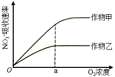

**2022年普通高等学校招生全国统一考试（乙卷）**

**生物部分**

**一、单选题**

1\. 有丝分裂和减数分裂是哺乳动物细胞分裂的两种形式。某动物的基因型是Aa，若该动物的某细胞在四分体时期一条染色单体上的A和另一条染色单体上的a发生了互换，则通常情况下姐妹染色单体分离导致等位基因A和a进入不同细胞的时期是（　　）

A. 有丝分裂的后期 B. 有丝分裂的末期

C. 减数第一次分裂 D. 减数第二次分裂

2\. 某同学将一株生长正常的小麦置于密闭容器中，在适宜且恒定的温度和光照条件下培养，发现容器内CO2含量初期逐渐降低，之后保持相对稳定。关于这一实验现象，下列解释合理的是（　　）

A. 初期光合速率逐渐升高，之后光合速率等于呼吸速率

B. 初期光合速率和呼吸速率均降低，之后呼吸速率保持稳定

C. 初期呼吸速率大于光合速率，之后呼吸速率等于光合速率

D. 初期光合速率大于呼吸速率，之后光合速率等于呼吸速率

3\. 运动神经元与骨骼肌之间的兴奋传递过度会引起肌肉痉挛，严重时会危及生命。下列治疗方法中合理的是（　　）

A. 通过药物加快神经递质经突触前膜释放到突触间隙中

B. 通过药物阻止神经递质与突触后膜上特异性受体结合

C. 通过药物抑制突触间隙中可降解神经递质的酶的活性

D. 通过药物增加突触后膜上神经递质特异性受体的数量

4\. 某种酶P由RNA和蛋白质组成，可催化底物转化为相应产物。为探究该酶不同组分催化反应所需的条件。某同学进行了下列5组实验（表中“+”表示有，“－”表示无）。

| 实验组                | ①   | ②   | ③   | ④   | ⑤   |
|:------------------ |:--- |:--- |:--- |:--- |:--- |
| 底物                 | \+  | \+  | \+  | \+  | \+  |
| RNA组分              | \+  | \+  | －   | \+  | －   |
| 蛋白质组分              | \+  | －   | \+  | －   | \+  |
| 低浓度Mg2+ | \+  | \+  | \+  | －   | －   |
| 高浓度Mg2+ | －   | －   | －   | \+  | \+  |
| 产物                 | \+  | －   | －   | \+  | －   |

根据实验结果可以得出的结论是（　　）

A. 酶P必须在高浓度Mg2+条件下才具有催化活性

B. 蛋白质组分的催化活性随Mg2+浓度升高而升高

C. 在高浓度Mg2+条件下RNA组分具有催化活性

D. 在高浓度Mg2+条件下蛋白质组分具有催化活性

5\. 分层现象是群落研究的重要内容。下列关于森林群落分层现象的叙述，正确的是（　　）

① 森林群落的分层现象提高了生物对环境资源的利用能力

② 森林植物从上到下可分为不同层次，最上层为灌木层

③ 垂直方向上森林中植物分层现象与对光的利用有关

④ 森林群落中动物分层现象与食物有关

⑤ 森林群落中植物的分层现象是自然选择的结果

⑥ 群落中植物垂直分层现象的形成是由动物种类决定的

A. ①③④⑤ B. ②④⑤⑥

C. ①②③⑥ D. ③④⑤⑥

6\. 依据鸡的某些遗传性状可以在早期区分雌雄，提高养鸡场的经济效益。已知鸡的羽毛性状芦花和非芦花受1对等位基因控制。芦花鸡和非芦花鸡进行杂交，正交子代中芦花鸡和非芦花鸡数目相同，反交子代均为芦花鸡。下列分析及推断错误的是（　　）

A. 正交亲本中雌鸡为芦花鸡，雄鸡为非芦花鸡

B. 正交子代和反交子代中的芦花雄鸡均为杂合体

C. 反交子代芦花鸡相互交配，所产雌鸡均为芦花鸡

D. 仅根据羽毛性状芦花和非芦花即可区分正交子代性别

7\. 农业生产中，农作物生长所需的氮素可以的形式由根系从土壤中吸收。一定时间内作物甲和作物乙的根细胞吸收的速率与O2浓度的关系如图所示。回答下列问题。

（1）由图可判断进入跟细胞的运输方式是主动运输，判断的依据是\_\_\_\_\_\_。

（2）O2浓度大于a时作物乙吸收速率不再增加，推测其原因是\_\_\_\_\_\_。

（3）作物甲和作物乙各自在最大吸收速率时，作物甲跟细胞的呼吸速率大于作物乙，判断依据是\_\_\_\_\_\_。

（4）据图可知，在农业生产中，为促进农作物对的吸收利用，可以采取的措施是\_\_\_\_\_\_。

8\. 甲状腺激素在促进机体新陈代谢和生长发育过程中发挥重要作用。为了研究动物体内甲状腺激素的合成和调节机制，某研究小组进行了下列相关实验。

实验一：将一定量的放射性碘溶液经腹腔注射到家兔体内，一定时间后测定家兔甲状腺的放射性强度。

实验二：给甲、乙、丙三组家兔分别经静脉注射一定量的生理盐水、甲状腺激素溶液、促甲状腺激素溶液。一定时间后分别测定三组家兔血中甲状腺激素的含量，发现注射的甲状腺激素和促甲状腺激素都起到了相应的调节作用。

回答下列问题。

（1）实验一中，家兔甲状腺中检测到碘的放射性，出现这一现象的原因是\_\_\_\_\_\_。

（2）根据实验二推测，丙组甲状腺激素合成量\_\_\_\_\_\_（填“大于”或“小于”）甲组。乙组和丙组甲状腺激素的合成量\_\_\_\_\_\_（填“相同”或“不相同”），原因是\_\_\_\_\_\_。

9\. 某研究小组借助空中拍照技术调查草原上地面活动某种哺乳动物的种群数量，主要操作流程是选取样方、空中拍照、识别照片中该种动物并计数。回答下列问题。

（1）为保证调查的可靠性和准确性，选取样方是应注意的主要事项有\_\_\_\_\_\_（答出3点即可）。

（2）已知调查区域总面积为*S*，样方面积为*m*，样方内平均个体数为*n*，则该区域的种群数量为\_\_\_\_\_\_。

（3）与标志重捕法相比，上述调查方法的优势有\_\_\_\_\_\_（答出2点即可）。

10\. 某种植物的花色有白、红和紫三种，花的颜色由花瓣中色素决定，色素的合成途径是：白色红色紫色。其中酶1的合成由基因A控制，酶2的合成由基因B控制，基因A和基因B位于非同源染色体上、回答下列问题。

（1）现有紫花植株（基因型为AaBb）与红花杂合体植株杂交，子代植株表现型及其比例为\_\_\_\_\_\_；子代中红花植株的基因型是\_\_\_\_\_\_；子代白花植株中纯合体占的比例为\_\_\_\_\_\_。

（2）已知白花纯合体基因型有2种。现有1株白花纯合体植株甲，若要通过杂交实验（要求选用1种纯合体亲本与植株甲只进行1次杂交）来确定其基因型，请写出选用的亲本基因型、预期实验结果和结论。

**【生物——选修1：生物技术实践】**

11\. 化合物S被广泛应用于医药、食品和化工工业、用菌株C可生产S，S的产量与菌株C培养所利用的碳源关系密切。为此，某小组通过实验比较不同碳源对菌体生长和S产量的影响，结果见表。

| 碳源   | 细胞干重（g/L） | S产量（g/L） |
|:---- |:--------- |:-------- |
| 葡萄糖  | 3.12      | 0.15     |
| 淀粉   | 0.01      | 0.00     |
| 制糖废液 | 2.30      | 0.18     |

回答下列问题。

（1）通常在实验室培养微生物时，需要对所需的玻璃器皿进行灭菌，灭菌的方法有\_\_\_\_\_\_（答出2点即可）。

（2）由实验结果可知，菌株C生长的最适碳源是\_\_\_\_\_\_；用菌株C生产S的最适碳源是\_\_\_\_\_\_。菌株C的生长除需要碳源外，还需要\_\_\_\_\_\_（答出2点即可）等营养物质。

（3）由实验结果可知，碳源为淀粉时菌株C不能生长，其原因是\_\_\_\_\_\_。

（4）若以制糖废液作为碳源，为进一步确定生产S的最适碳源浓度，某同学进行了相关实验。请简要写出实验思路：\_\_\_\_\_\_。

（5）利用制糖废液生产S可以实验废物利用，其意义是\_\_\_\_\_\_（答出1点即可）。

**【生物——选修3：现代生物科技专题】**

12\. 新冠疫情出现后，病毒核酸检测和疫苗接种在疫情防控中发挥了重要作用。回答下列问题。

（1）新冠病毒是一种RNA病毒，检测新冠病毒RNA（核酸检测）可以采取RT-PCR法。这种方法的基本原理是先以病毒RNA为模板合成cDNA，这一过程需要的酶是\_\_\_\_\_\_，再通过PCR技术扩增相应的DNA片段。根据检测结果判断被检测者是否感染新冠病毒。

（2）为了确保新冠病毒核酸检测的准确性，在设计PCR引物时必须依据新冠病毒RNA中的\_\_\_\_\_\_来进行。PCR过程每次循环分为3步，其中温度最低的一步是\_\_\_\_\_\_。

（3）某人同时进行了新冠病毒核酸检测和抗体检测（检测体内是否有新冠病毒抗体），若核酸检测结果为阴性而抗体检测结果为阳性，说明\_\_\_\_\_\_（答出1种情况即可）；若核酸检测和抗体检测结果均为阳性，说明\_\_\_\_\_\_。

（4）常见的病毒疫苗有灭活疫苗、蛋白疫苗和重组疫苗等。已知某种病毒的特异性蛋白S（具有抗原性）的编码序列（目的基因）。为了制备蛋白疫苗，可以通过基因工程技术获得大量蛋白S。基因工程的基本操作流程是\_\_\_\_\_\_
