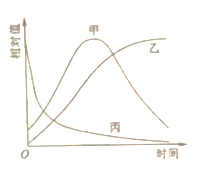
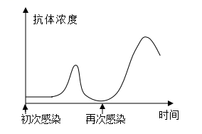

**2022年普通高等学校招生全国统一考试**

**理科综合能力测试**

**一、选择题**

1\. 钙在骨骼生长和肌肉收缩等过程中发挥重要作用。晒太阳有助于青少年骨骼生长，预防老年人骨质疏松。下列叙述错误的是（ ）

A. 细胞中有以无机离子形式存在的钙

B. 人体内Ca2+可自由通过细胞膜的磷脂双分子层

C. 适当补充维生素D可以促进肠道对钙的吸收

D 人体血液中钙离子浓度过低易出现抽搐现象

2\. 植物成熟叶肉细胞的细胞液浓度可以不同。现将a、b、c三种细胞液浓度不同的某种植物成熟叶肉细胞，分别放入三个装有相同浓度蔗糖溶液的试管中，当水分交换达到平衡时观察到：①细胞a未发生变化；②细胞b体积增大；③细胞c发生了质壁分离。若在水分交换期间细胞与蔗糖溶液没有溶质的交换，下列关于这一实验的叙述，不合理的是（ ）

A. 水分交换前，细胞b的细胞液浓度大于外界蔗糖溶液的浓度

B. 水分交换前，细胞液浓度大小关系为细胞b\>细胞a\>细胞c

C. 水分交换平衡时，细胞c的细胞液浓度大于细胞a的细胞液浓度

D. 水分交换平衡时，细胞c的细胞液浓度等于外界蔗糖溶液的浓度

3\. 植物激素通常与其受体结合才能发挥生理作用。喷施某种植物激素，能使某种作物的矮生突变体长高。关于该矮生突变体矮生的原因，下列推测合理的是（ ）

A. 赤霉素合成途径受阻 B. 赤霉素受体合成受阻

C. 脱落酸合成途径受阻 D. 脱落酸受体合成受阻

4\. 线粒体是细胞进行有氧呼吸的主要场所。研究发现，经常运动的人肌细胞中线粒体数量通常比缺乏锻炼的人多。下列与线粒体有关的叙述，错误的是（ ）

A. 有氧呼吸时细胞质基质和线粒体中都能产生ATP

B. 线粒体内膜上的酶可以参与\[H\]和氧反应形成水的过程

C. 线粒体中的丙酮酸分解成CO2和\[H\]的过程需要O2的直接参与

D. 线粒体中的DNA能够通过转录和翻译控制某些蛋白质的合成

5\. 在鱼池中投放了一批某种鱼苗，一段时间内该鱼的种群数量、个体重量和种群总重量随时间的变化趋势如图所示。若在此期间鱼没有进行繁殖，则图中表示种群数量、个体重量、种群总重量的曲线分别是（ ）

A. 甲、丙、乙 B. 乙、甲、丙 C. 丙、甲、乙 D. 丙、乙、甲

6\. 某种自花传粉植物的等位基因A/a和B/b位于非同源染色体上。A/a控制花粉育性，含A的花粉可育；含a的花粉50%可育、50%不育。B/b控制花色，红花对白花为显性。若基因型为AaBb的亲本进行自交，则下列叙述错误的是（ ）

A. 子一代中红花植株数是白花植株数的3倍

B. 子一代中基因型为aabb的个体所占比例是1/12

C. 亲本产生的可育雄配子数是不育雄配子数的3倍

D. 亲本产生的含B的可育雄配子数与含b的可育雄配子数相等

7\. 根据光合作用中CO2的固定方式不同，可将植物分为C3植物和C4植物等类型。C4植物的CO2补偿点比C3植物的低。CO2补偿点通常是指环境CO2浓度降低导致光合速率与呼吸速率相等时的环境CO2浓度。回答下列问题。

（1）不同植物（如C3植物和C4植物）光合作用光反应阶段产物是相同的，光反应阶段的产物是\_\_\_\_\_\_\_\_\_\_\_\_（答出3点即可）。

（2）正常条件下，植物叶片的光合产物不会全部运输到其他部位，原因是\_\_\_\_\_\_\_\_\_\_\_\_（答出1点即可）。

（3）干旱会导致气孔开度减小，研究发现在同等程度干旱条件下，C4植物比C3植物生长得好。从两种植物CO2补偿点的角度分析，可能的原因是\_\_\_\_\_\_\_\_\_\_\_\_\_\_。

8\. 人体免疫系统对维持机体健康具有重要作用。机体初次和再次感染同一种病毒后，体内特异性抗体浓度变化如图所示。回答下列问题。

（1）免疫细胞是免疫系统的重要组成成分，人体T细胞成熟的场所是\_\_\_\_\_\_\_\_\_\_\_\_\_；体液免疫过程中，能产生大量特异性抗体的细胞是\_\_\_\_\_\_\_\_\_\_\_\_\_。

（2）体液免疫过程中，抗体和病毒结合后病毒最终被清除的方式是\_\_\_\_\_\_\_\_\_\_\_\_\_。

（3）病毒再次感染使机体内抗体浓度激增且保持较长时间（如图所示），此时抗体浓度激增的原因是\_\_\_\_\_\_\_\_\_\_\_\_\_。

（4）依据图中所示的抗体浓度变化规律，为了获得更好的免疫效果，宜采取的疫苗接种措施是\_\_\_\_\_\_\_\_\_\_\_\_\_。

9\. 为保护和合理利用自然资源，某研究小组对某林地的动植物资源进行了调查。回答下列问题。

（1）调查发现，某种哺乳动物种群的年龄结构属于增长型，得出这一结论的主要依据是发现该种群中\_\_\_\_\_\_\_\_\_\_\_\_\_。

（2）若要调查林地中某种双子叶植物的种群密度，可以采用的方法是\_\_\_\_\_\_\_\_\_\_\_\_\_；若要调查某种鸟的种群密度，可以采用的方法是\_\_\_\_\_\_\_\_\_\_\_\_\_。

（3）调查发现该林地的物种数目很多。一个群落中物种数目的多少称为\_\_\_\_\_\_\_\_\_\_\_\_\_。

（4）该林地中，植物对动物的作用有\_\_\_\_\_\_\_\_\_\_\_\_\_（答出2点即可）；动物对植物的作用有\_\_\_\_\_\_\_\_\_\_\_\_\_（答出2点即可）。

10\. 玉米是我国重要的粮食作物。玉米通常是雌雄同株异花植物（顶端长雄花序，叶腋长雌花序），但也有的是雌雄异株植物。玉米的性别受两对独立遗传的等位基因控制，雌花花序由显性基因B控制，雄花花序由显性基因T控制，基因型bbtt个体为雌株。现有甲（雌雄同株）、乙（雌株）、丙（雌株）、丁（雄株）4种纯合体玉米植株。回答下列问题。

（1）若以甲为母本、丁为父本进行杂交育种，需进行人工传粉，具体做法是\_\_\_\_\_\_\_\_\_\_\_\_\_。

（2）乙和丁杂交，F1全部表现为雌雄同株；F1自交，F2中雌株所占比例为\_\_\_\_\_\_\_\_\_\_\_\_\_，F2中雄株的基因型是\_\_\_\_\_\_\_\_\_\_\_\_\_；在F2的雌株中，与丙基因型相同的植株所占比例是\_\_\_\_\_\_\_\_\_\_\_\_\_。

（3）已知玉米籽粒的糯和非糯是由1对等位基因控制的相对性状。为了确定这对相对性状的显隐性，某研究人员将糯玉米纯合体与非糯玉米纯合体（两种玉米均为雌雄同株）间行种植进行实验，果穗成熟后依据果穗上籽粒的性状，可判断糯与非耀的显隐性。若糯是显性，则实验结果是\_\_\_\_\_\_\_\_\_\_\_\_\_；若非糯是显性，则实验结果是\_\_\_\_\_\_\_\_\_\_\_\_\_。

**【生物——选修1：生物技术实践】**

11\. 某同学从被石油污染的土壤中分离得到A和B两株可以降解石油的细菌，在此基础上采用平板培养法比较二者降解石油的能力，并分析两个菌株的其他生理功能。

实验所用培养基成分如下。

培养基Ⅰ：K2HPO4，MgSO4，NH4NO3，石油。

培养基Ⅱ：K2HPO4，MgSO4，石油。

操作步骤：

①将A、B菌株分别接种在两瓶液体培养基Ⅰ中培养，得到A、B菌液；

②液体培养基Ⅰ、Ⅱ口中添加琼脂，分别制成平板Ⅰ、Ⅱ，并按图中所示在平板上打甲、乙两孔。

回答下列问题。

<table style="width:29%;">
<colgroup>
<col style="width: 7%" />
<col style="width: 10%" />
<col style="width: 10%" />
</colgroup>
<thead>
<tr>
<th rowspan="2" style="text-align: center;">菌株</th>
<th colspan="2" style="text-align: center;">透明圈大小</th>
</tr>
<tr>
<th style="text-align: center;">平板Ⅰ</th>
<th style="text-align: center;">平板Ⅱ</th>
</tr>
</thead>
<tbody>
<tr>
<td style="text-align: center;">A</td>
<td style="text-align: center;">+++</td>
<td style="text-align: center;">++</td>
</tr>
<tr>
<td style="text-align: center;">B</td>
<td style="text-align: center;">++</td>
<td style="text-align: center;">-</td>
</tr>
</tbody>
</table>

（1）实验所用培养基中作为碳源的成分是\_\_\_\_\_\_\_\_\_\_\_\_。培养基中NH4NO3的作用是为菌株的生长提供氮源，氮源在菌体内可以参与合成\_\_\_\_\_\_\_\_\_\_\_\_（答出2种即可）等生物大分子。

（2）步骤①中，在资源和空间不受限制阶段，若最初接种N0个A细菌，繁殖n代后细菌的数量是\_\_\_\_\_\_\_\_\_\_\_\_。

（3）为了比较A、B降解石油的能力，某同学利用步骤②所得到的平板Ⅰ、Ⅱ进行实验，结果如表所示（“+”表示有透明圈，“+”越多表示透明圈越大，“-”表示无透明圈），推测该同学的实验思路是\_\_\_\_\_\_\_\_\_\_。

（4）现有一贫氮且被石油污染土壤，根据上表所示实验结果，治理石油污染应选用的菌株是\_\_\_\_\_\_\_\_\_\_\_\_，理由是\_\_\_\_\_\_\_\_\_\_\_。

12\. 某牧场引进一只产肉性能优异的良种公羊，为了在短时间内获得具有该公羊优良性状的大量后代，该牧场利用胚胎工程技术进行了相关操作。回答下列问题，

（1）为了实现体外受精需要采集良种公羊的精液，精液保存的方法是\_\_\_\_\_\_\_\_\_\_\_\_。在体外受精前要对精子进行获能处理，其原因是\_\_\_\_\_\_\_\_\_\_\_\_；精子体外获能可采用化学诱导法，诱导精子获能的药物是\_\_\_\_\_\_\_\_\_\_\_（答出1点即可）。利用该公羊的精子进行体外受精需要发育到一定时期的卵母细胞，因为卵母细胞达到\_\_\_\_\_\_\_\_\_\_\_时才具备与精子受精的能力。

（2）体外受精获得的受精卵发育成囊胚需要在特定的培养液中进行，该培养液的成分除无机盐、激素、血清外，还含的营养成分有\_\_\_\_\_\_\_\_\_\_\_（答出3点即可）等。将培养好的良种囊胚保存备用。

（3）请以保存的囊胚和相应数量的非繁殖期受体母羊为材料进行操作，以获得具有该公羊优良性状的后代。主要的操作步骤是\_\_\_\_\_\_\_\_\_\_\_。
