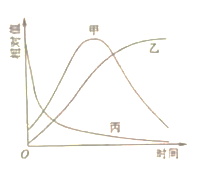
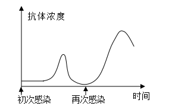

**2022年普通高等学校招生全国统一考试**

**理科综合能力测试**

**一、选择题**

1\. 钙在骨骼生长和肌肉收缩等过程中发挥重要作用。晒太阳有助于青少年骨骼生长，预防老年人骨质疏松。下列叙述错误的是（ ）

A. 细胞中有以无机离子形式存在的钙

B. 人体内Ca2+可自由通过细胞膜的磷脂双分子层

C. 适当补充维生素D可以促进肠道对钙的吸收

D. 人体血液中钙离子浓度过低易出现抽搐现象

【答案】B

【解析】

【分析】无机盐的存在形式与作用：（1）存在形式：细胞中大多数无机盐以离子的形式存在；（2）无机盐的功能：对维持细胞和生物体生命活动有重要作用，如：Fe是构成血红素的元素；Mg是构成叶绿素的元素。

【详解】A、细胞中有以无机离子形式存在的钙，也有以化合物形式存在的钙（如CaCO3），A正确；

B、Ca2+不能自由通过细胞膜的磷脂双分子层，需要载体协助，B错误；

C、维生素D能有效地促进人体肠道对钙和磷的吸收，故适当补充维生素D可以促进肠道对钙的吸收，C正确；

D、哺乳动物的血液中必须含有一定量的Ca2+，Ca2+的含量太低，会出现抽搐等症状，D正确。

故选B。

2\. 植物成熟叶肉细胞的细胞液浓度可以不同。现将a、b、c三种细胞液浓度不同的某种植物成熟叶肉细胞，分别放入三个装有相同浓度蔗糖溶液的试管中，当水分交换达到平衡时观察到：①细胞a未发生变化；②细胞b体积增大；③细胞c发生了质壁分离。若在水分交换期间细胞与蔗糖溶液没有溶质的交换，下列关于这一实验的叙述，不合理的是（ ）

A. 水分交换前，细胞b的细胞液浓度大于外界蔗糖溶液的浓度

B. 水分交换前，细胞液浓度大小关系为细胞b\>细胞a\>细胞c

C. 水分交换平衡时，细胞c的细胞液浓度大于细胞a的细胞液浓度

D. 水分交换平衡时，细胞c的细胞液浓度等于外界蔗糖溶液的浓度

【答案】C

【解析】

【分析】由题分析可知，水分交换达到平衡时细胞a未发生变化，既不吸水也不失水，细胞a的细胞液浓度等于外界蔗糖溶液的浓度；细胞b的体积增大，说明细胞吸水，水分交换前，细胞b的细胞液浓度大于外界蔗糖溶液的浓度；细胞c发生质壁分离，说明细胞失水，水分交换前，细胞c的细胞液浓度小于外界蔗糖溶液的浓度。

【详解】A、由于细胞b在水分交换达到平衡时细胞的体积增大，说明细胞吸水，则水分交换前，细胞b的细胞液浓度大于外界蔗糖溶液的浓度，A正确；

B、水分交换达到平衡时，细胞a的细胞液浓度等于外界蔗糖溶液的浓度，细胞b的细胞液浓度大于外界蔗糖溶液的浓度，细胞c的细胞液浓度小于外界蔗糖溶液的浓度，因此水分交换前，细胞液浓度大小关系为细胞b\>细胞a\>细胞c，B正确；

C、由题意可知，水分交换达到平衡时，细胞a未发生变化，说明其细胞液浓度与外界蔗糖溶液浓度相等；水分交换达到平衡时，虽然细胞内外溶液浓度相同，但细胞c失水后外界蔗糖溶液的浓度减小，因此，水分交换平衡时，细胞c的细胞液浓度小于细胞a的细胞液浓度，C错误

D、在一定的蔗糖溶液中，细胞c发生了质壁分离，水分交换达到平衡时，其细胞液浓度等于外界蔗糖溶液的浓度，D正确。

故选C。

3\. 植物激素通常与其受体结合才能发挥生理作用。喷施某种植物激素，能使某种作物的矮生突变体长高。关于该矮生突变体矮生的原因，下列推测合理的是（ ）

A. 赤霉素合成途径受阻 B. 赤霉素受体合成受阻

C. 脱落酸合成途径受阻 D. 脱落酸受体合成受阻

【答案】A

【解析】

【分析】赤霉素：合成部位：幼芽、幼根和未成熟的种子等幼嫩部分；主要生理功能：促进细胞的伸长；解除种子、块茎的休眠并促进萌发的作用。

【详解】AB、赤霉素具有促进细胞伸长的功能，该作用的发挥需要与受体结合后才能完成，故喷施某种激素后作物的矮生突变体长高，说明喷施的为赤霉素，矮生突变体矮生的原因是缺乏赤霉素而非受体合成受阻（若受体合成受阻，则外源激素也不能起作用），A正确，B错误；

CD、脱落酸抑制植物细胞的分裂和种子的萌发，与植物矮化无直接关系，CD错误。

故选A。

4\. 线粒体是细胞进行有氧呼吸的主要场所。研究发现，经常运动的人肌细胞中线粒体数量通常比缺乏锻炼的人多。下列与线粒体有关的叙述，错误的是（ ）

A. 有氧呼吸时细胞质基质和线粒体中都能产生ATP

B. 线粒体内膜上的酶可以参与\[H\]和氧反应形成水的过程

C. 线粒体中的丙酮酸分解成CO2和\[H\]的过程需要O2的直接参与

D. 线粒体中的DNA能够通过转录和翻译控制某些蛋白质的合成

【答案】C

【解析】

【分析】有氧呼吸的第一、二、三阶段的场所依次是细胞质基质、线粒体基质和线粒体内膜。有氧呼吸第一阶段是葡萄糖分解成丙酮酸和\[H\]，合成少量ATP；第二阶段是丙酮酸和水反应生成二氧化碳和\[H\]，合成少量ATP；第三阶段是氧气和\[H\]反应生成水，合成大量ATP。

【详解】A、有氧呼吸的第一阶段场所是细胞质基质，第二、三阶段在线粒体，三个阶段均可产生ATP，故有氧呼吸时细胞质基质和线粒体都可产生ATP，A正确；

B、线粒体内膜是有氧呼吸第三阶段的场所，该阶段氧气和\[H\]反应生成水，该过程需要酶的催化，B正确；

C、丙酮酸分解为CO2和\[H\]是有氧呼吸第二阶段，场所是线粒体基质，该过程需要水的参与，不需要氧气的参与，C错误；

D、线粒体是半自主性细胞器，其中含有少量DNA，可以通过转录和翻译控制蛋白质的合成，D正确。

故选C。

5\. 在鱼池中投放了一批某种鱼苗，一段时间内该鱼种群数量、个体重量和种群总重量随时间的变化趋势如图所示。若在此期间鱼没有进行繁殖，则图中表示种群数量、个体重量、种群总重量的曲线分别是（ ）

A 甲、丙、乙 B. 乙、甲、丙 C. 丙、甲、乙 D. 丙、乙、甲

【答案】D

【解析】

【分析】S型增长曲线：当种群在一个有限的环境中增长时，随着种群密度的上升，个体间由于有限的空间、食物和其他生活条件而引起的种内斗争必将加剧，以该种群生物为食的捕食者的数量也会增加，这就会使这个种群的出生率降低，死亡率增高，从而使种群数量的增长率下降，当种群数量达到环境条件所允许的最大值时，种群数量将停止增长，有时会在K值保持相对稳定。

【详解】分析题图可知，随着时间变化，甲曲线先增加后减少，乙曲线呈S形，丙曲线下降，在池塘中投放一批鱼苗后，由于一段时间内鱼没有进行繁殖，而且一部分鱼苗由于不适应环境而死亡，故种群数量下降，如曲线丙；存活的个体重量增加，如曲线乙，种群总重量先增加后由于捕捞而减少，如曲线甲。综上可知，D正确。

故选D。

6\. 某种自花传粉植物的等位基因A/a和B/b位于非同源染色体上。A/a控制花粉育性，含A的花粉可育；含a的花粉50%可育、50%不育。B/b控制花色，红花对白花为显性。若基因型为AaBb的亲本进行自交，则下列叙述错误的是（ ）

A. 子一代中红花植株数是白花植株数的3倍

B. 子一代中基因型为aabb的个体所占比例是1/12

C. 亲本产生的可育雄配子数是不育雄配子数的3倍

D. 亲本产生的含B的可育雄配子数与含b的可育雄配子数相等

【答案】B

【解析】

【分析】分析题意可知：A、a和B、b基因位于非同源染色体上，独立遗传，遵循自由组合定律

【详解】A、分析题意可知，两对等位基因独立遗传，故含a的花粉育性不影响B和b基因的遗传，所以Bb自交，子一代中红花植株B\_：白花植株bb=3：1，A正确；

B、基因型为AaBb的亲本产生的雌配子种类和比例为AB:Ab:aB:ab=1:1:1:1，由于含a的花粉50%可育，故雄配子种类及比例为AB:Ab:aB:ab=2:2:1:1，所以子一代中基因型为aabb的个体所占比例为1/4×1/6=1/24，B错误；

C、由于含a的花粉50%可育，50%不可育，故亲本产生的可育雄配子是A+1/2a，不育雄配子为1/2a，由于Aa个体产生的A：a=1:1，故亲本产生的可育雄配子数是不育雄配子的三倍，C正确；

D、两对等位基因独立遗传，所以Bb自交，亲本产生的含B的雄配子数和含b的雄配子数相等，D正确。

故选B。

7\. 根据光合作用中CO2的固定方式不同，可将植物分为C3植物和C4植物等类型。C4植物的CO2补偿点比C3植物的低。CO2补偿点通常是指环境CO2浓度降低导致光合速率与呼吸速率相等时的环境CO2浓度。回答下列问题。

（1）不同植物（如C3植物和C4植物）光合作用光反应阶段的产物是相同的，光反应阶段的产物是\_\_\_\_\_\_\_\_\_\_\_\_（答出3点即可）。

（2）正常条件下，植物叶片的光合产物不会全部运输到其他部位，原因是\_\_\_\_\_\_\_\_\_\_\_\_（答出1点即可）。

（3）干旱会导致气孔开度减小，研究发现在同等程度干旱条件下，C4植物比C3植物生长得好。从两种植物CO2补偿点的角度分析，可能的原因是\_\_\_\_\_\_\_\_\_\_\_\_\_\_。

【答案】（1）O2、\[H\]和ATP

（2）自身呼吸消耗或建造植物体结构

（3）C4植物的CO2补偿点低于C3植物，C4植物能够利用较低浓度的CO2

【解析】

【分析】光合作用包括光反应和暗反应两个阶段：（1）光合作用的光反应阶段（场所是叶绿体的类囊体膜上）：水的光解产生\[H\]与氧气，以及ATP的形成；（2）光合作用的暗反应阶段（场所是叶绿体的基质中）：CO2被C5固定形成C3，C3在光反应提供的ATP和\[H\]的作用下还原生成糖类等有机物是指绿色植物通过叶绿体，利用光能把二氧化碳和水转变成储存着能量的有机物，并释放出氧气的过程。

【小问1详解】

光合作用光反应阶段的场所是叶绿体的类囊体膜上，光反应发生的物质变化包括水的光解以及ATP的形成，因此光合作用光反应阶段生成的产物有O2、\[H\]和ATP。

【小问2详解】

叶片光合作用产物一部分用来建造植物体结构和自身呼吸消耗，其余部分被输送到植物体的储藏器官储存起来。故正常条件下，植物叶片的光合产物不会全部运输到其他部位。

【小问3详解】

C4植物的CO2固定途径有C4和C3途径，其主要的CO2固定酶是PEPC，Rubisco；而C3植物只有C3途径，其主要的CO2固定酶是Rubisco。干旱会导致气孔开度减小，叶片气孔关闭，CO2吸收减少；由于C4植物的CO2补偿点低于C3植物，则C4植物能够利用较低浓度的CO2，因此光合作用受影响较小的植物是C4植物，C4植物比C3植物生长得好。

8\. 人体免疫系统对维持机体健康具有重要作用。机体初次和再次感染同一种病毒后，体内特异性抗体浓度变化如图所示。回答下列问题。

（1）免疫细胞是免疫系统的重要组成成分，人体T细胞成熟的场所是\_\_\_\_\_\_\_\_\_\_\_\_\_；体液免疫过程中，能产生大量特异性抗体的细胞是\_\_\_\_\_\_\_\_\_\_\_\_\_。

（2）体液免疫过程中，抗体和病毒结合后病毒最终被清除的方式是\_\_\_\_\_\_\_\_\_\_\_\_\_。

（3）病毒再次感染使机体内抗体浓度激增且保持较长时间（如图所示），此时抗体浓度激增的原因是\_\_\_\_\_\_\_\_\_\_\_\_\_。

（4）依据图中所示的抗体浓度变化规律，为了获得更好的免疫效果，宜采取的疫苗接种措施是\_\_\_\_\_\_\_\_\_\_\_\_\_。

【答案】（1） ①. 胸腺 ②. 浆细胞

（2）抗体与病毒特异性结合形成沉淀，被吞噬细胞吞噬消化

（3）病毒再次感染时，机体内相应的记忆细胞迅速增殖分化，快速产生大量抗体 （4）多次接种

【解析】

【分析】体液免疫过程：抗原被吞噬细胞处理呈递给T淋巴细胞，T细胞产生淋巴因子作用于B细胞，B细胞再接受淋巴因子的刺激和抗原的刺激后，增殖分化成浆细胞和记忆B细胞，浆细胞产生抗体作用于抗原。

【小问1详解】

免疫细胞是免疫系统的重要组成成分，包括淋巴细胞和吞噬细胞等，其中T细胞成熟的场所是胸腺。体液免疫过程中，只有浆细胞能产生特异性的抗体。

【小问2详解】

体液免疫过程中，抗体和病毒特异性结合后形成沉淀，再被吞噬细胞吞噬消化。

【小问3详解】

记忆细胞可以在病毒消失后存活几年甚至几十年，当同一种病毒再次感染机体，记忆细胞能迅速增殖分化，快速产生大量抗体，使抗体浓度激增。

【小问4详解】

分析图示可知，二次免疫比初次免疫产生的抗体更多，故为了获得更好的免疫效果，接种疫苗时可多次接种，使机体产生更多的抗体和记忆细胞。

9\. 为保护和合理利用自然资源，某研究小组对某林地的动植物资源进行了调查。回答下列问题。

（1）调查发现，某种哺乳动物种群的年龄结构属于增长型，得出这一结论的主要依据是发现该种群中\_\_\_\_\_\_\_\_\_\_\_\_\_。

（2）若要调查林地中某种双子叶植物的种群密度，可以采用的方法是\_\_\_\_\_\_\_\_\_\_\_\_\_；若要调查某种鸟的种群密度，可以采用的方法是\_\_\_\_\_\_\_\_\_\_\_\_\_。

（3）调查发现该林地的物种数目很多。一个群落中物种数目的多少称为\_\_\_\_\_\_\_\_\_\_\_\_\_。

（4）该林地中，植物对动物的作用有\_\_\_\_\_\_\_\_\_\_\_\_\_（答出2点即可）；动物对植物的作用有\_\_\_\_\_\_\_\_\_\_\_\_\_（答出2点即可）。

【答案】（1）幼年个体数较多、中年个体数适中、老年个体数较少

（2） ①. 样方法 ②. 标志重捕法

（3）物种丰富度 （4） ①. 为动物提供食物和栖息空间 ②. 对植物的传粉和种子传播具有重要作用

【解析】

【分析】预测种群变化主要依据是年龄组成，包含增长型、稳定性个衰退型。

调查植物和活动能力弱、活动范围较小的动物的种群密度，可用样方法；调查活动能力强、活动范围广的动物一般用标志重捕法。

【小问1详解】

预测种群变化主要依据是年龄组成，是指不同年龄在种群内的分布情况，对种群内的出生率、死亡率有很大影响，当幼年个体数最多、中年个体数适中、老年个体数最少时呈增长型，此时种群中出生率大于死亡率。

【小问2详解】

调查林地中某种双子叶植物的种群密度，可采用样方法进行随机抽样调查；鸟的活动能力强、活动范围广，调查其种群密度一般采用标志重捕法。

【小问3详解】

物种组成是区别不同群落的重要特征，一个种群中物种数目的多少称为物种丰富度。

【小问4详解】

植物可进行光合作用，为动物提供食物，同时可以为动物提供栖息空间；动物的活动有利于植物的繁衍，如蜜蜂采蜜可帮助植物传粉，鸟类取食可帮助植物传播种子。

10\. 玉米是我国重要的粮食作物。玉米通常是雌雄同株异花植物（顶端长雄花序，叶腋长雌花序），但也有的是雌雄异株植物。玉米的性别受两对独立遗传的等位基因控制，雌花花序由显性基因B控制，雄花花序由显性基因T控制，基因型bbtt个体为雌株。现有甲（雌雄同株）、乙（雌株）、丙（雌株）、丁（雄株）4种纯合体玉米植株。回答下列问题。

（1）若以甲为母本、丁为父本进行杂交育种，需进行人工传粉，具体做法\_\_\_\_\_\_\_\_\_\_\_\_\_。

（2）乙和丁杂交，F1全部表现为雌雄同株；F1自交，F2中雌株所占比例为\_\_\_\_\_\_\_\_\_\_\_\_\_，F2中雄株的基因型是\_\_\_\_\_\_\_\_\_\_\_\_\_；在F2的雌株中，与丙基因型相同的植株所占比例是\_\_\_\_\_\_\_\_\_\_\_\_\_。

（3）已知玉米籽粒的糯和非糯是由1对等位基因控制的相对性状。为了确定这对相对性状的显隐性，某研究人员将糯玉米纯合体与非糯玉米纯合体（两种玉米均为雌雄同株）间行种植进行实验，果穗成熟后依据果穗上籽粒的性状，可判断糯与非耀的显隐性。若糯是显性，则实验结果是\_\_\_\_\_\_\_\_\_\_\_\_\_；若非糯是显性，则实验结果是\_\_\_\_\_\_\_\_\_\_\_\_\_。

【答案】（1）对母本甲的雌花花序进行套袋，待雌蕊成熟时，采集丁的成熟花粉，撒在甲的雌蕊柱头上，再套上纸袋。

（2） ①. 1/4 ②. bbTT、bbTt ③. 1/4

（3） ①. 糯性植株上全为糯性籽粒，非糯植株上既有糯性籽粒又有非糯籽粒 ②. 非糯性植株上只有非糯籽粒，糯性植株上既有糯性籽粒又有非糯籽粒

【解析】

【分析】雌花花序由显性基因B控制，雄花花序由显性基因T控制，基因型bbtt个体为雌株、甲（雌雄同株）、乙（雌株）、丙（雌株）、丁（雄株），可推断出甲的基因型为BBTT，乙、丙基因型可能为BBtt或bbtt，丁的基因型为bbTT。

【小问1详解】

杂交育种的原理是基因重组，若甲为母本，丁为父本杂交，因为甲为雌雄同株异花植物，所以在花粉未成熟时需对甲植株雌花花序套袋隔离，等丁的花粉成熟后再通过人工授粉把丁的花粉传到甲的雌蕊柱头后，再套袋隔离。

【小问2详解】

根据分析及题干信息“乙和丁杂交，F1全部表现为雌雄同株”，可知乙基因型为BBtt，丁的基因型为bbTT，F1基因型为BbTt，F1自交F2基因型及比例为9B＿T＿（雌雄同株）：3B＿tt（雌株）：3bbT＿（雄株）：1bbtt（雌株），故F2中雌株所占比例为1/4，雄株的基因型为bbTT、bbTt，雌株中与丙基因型相同的比例为1/4。

【小问3详解】

假设糯和非糯这对相对性状受A/a基因控制，因为两种玉米均为雌雄同株植物，间行种植时，既有自交又有杂交。若糯性为显性，基因型为AA，非糯基因型为aa，则糯性植株无论自交还是杂交，糯性植株上全为糯性籽粒，非糯植株杂交子代为糯性籽粒，自交子代为非糯籽粒，所以非糯植株上既有糯性籽粒又有非糯籽粒。同理，非糯为显性时，非糯性植株上只有非糯籽粒，糯性植株上既有糯性籽粒又有非糯籽粒。

**【生物——选修1：生物技术实践】**

11\. 某同学从被石油污染的土壤中分离得到A和B两株可以降解石油的细菌，在此基础上采用平板培养法比较二者降解石油的能力，并分析两个菌株的其他生理功能。

实验所用的培养基成分如下。

培养基Ⅰ：K2HPO4，MgSO4，NH4NO3，石油。

培养基Ⅱ：K2HPO4，MgSO4，石油。

操作步骤：

①将A、B菌株分别接种在两瓶液体培养基Ⅰ中培养，得到A、B菌液；

②液体培养基Ⅰ、Ⅱ口中添加琼脂，分别制成平板Ⅰ、Ⅱ，并按图中所示在平板上打甲、乙两孔。

回答下列问题。

<table style="width:29%;">
<colgroup>
<col style="width: 7%" />
<col style="width: 10%" />
<col style="width: 10%" />
</colgroup>
<thead>
<tr>
<th rowspan="2" style="text-align: center;">菌株</th>
<th colspan="2" style="text-align: center;">透明圈大小</th>
</tr>
<tr>
<th style="text-align: center;">平板Ⅰ</th>
<th style="text-align: center;">平板Ⅱ</th>
</tr>
</thead>
<tbody>
<tr>
<td style="text-align: center;">A</td>
<td style="text-align: center;">+++</td>
<td style="text-align: center;">++</td>
</tr>
<tr>
<td style="text-align: center;">B</td>
<td style="text-align: center;">++</td>
<td style="text-align: center;">-</td>
</tr>
</tbody>
</table>

（1）实验所用培养基中作为碳源的成分是\_\_\_\_\_\_\_\_\_\_\_\_。培养基中NH4NO3的作用是为菌株的生长提供氮源，氮源在菌体内可以参与合成\_\_\_\_\_\_\_\_\_\_\_\_（答出2种即可）等生物大分子。

（2）步骤①中，在资源和空间不受限制的阶段，若最初接种N0个A细菌，繁殖n代后细菌的数量是\_\_\_\_\_\_\_\_\_\_\_\_。

（3）为了比较A、B降解石油的能力，某同学利用步骤②所得到的平板Ⅰ、Ⅱ进行实验，结果如表所示（“+”表示有透明圈，“+”越多表示透明圈越大，“-”表示无透明圈），推测该同学的实验思路是\_\_\_\_\_\_\_\_\_\_。

（4）现有一贫氮且被石油污染的土壤，根据上表所示实验结果，治理石油污染应选用的菌株是\_\_\_\_\_\_\_\_\_\_\_\_，理由是\_\_\_\_\_\_\_\_\_\_\_。

【答案】（1） ①. 石油 ②. DNA、RNA、蛋白质

（2）N0•2n （3）在无菌条件下，将等量等浓度的A菌液和B菌液分别接种到平板Ⅰ的甲和乙两孔处，平板Ⅱ也进行同样的操作，在相同且适宜条件下培养一段时间，比较两个平板的两孔处的透明圈大小并作记录，根据透明圈大降解能力强，透明圈小降解能力弱，进而比较A、B降解石油的能力

（4） ①. A ②. A菌株降解石油的能力高于B菌株，并且在没有添加氮源的培养基中也能生长

【解析】

【分析】培养基对微生物具有选择作用。配置培养基时根据某一种或某一类微生物的特殊营养要求, 加入某些物质或除去某些营养物质，抑制其他微生物的生长，也可以根据某些微生物对一些物理、化学因素的抗性，在培养基中加入某种化学物质,从而筛选出待定的微生物。这种培养基叫做选择培养基。

【小问1详解】

培养基的成分有碳源、氮源、无机盐和水等，从组成培养基的物质所含化学元素可知，作为碳源的成分是石油。生物大分子DNA、RNA、蛋白质都含有N元素，故氮源在菌体内可以参与合成这些物质。

【小问2详解】

由题意“资源和空间不受限制”可知，细菌的增殖呈J型曲线增长，由于DNA的半保留复制，细菌每繁殖一代就是上一代的2倍，根据公式Nt=N0•λt，λ=2，繁殖n代后细菌的数量是N0•2n。

【小问3详解】

分析表格数据可知，实验的结果是：在平板Ⅰ上，A菌株降解石油的能力高于B菌株；在平板Ⅱ上，A菌株仍然能降解石油，而B菌株不能降解，根据实验的单一变量和对照原则，推测该同学的思路是：在无菌条件下，将等量等浓度的A菌液和B菌液分别接种到平板Ⅰ的甲和乙两孔处，平板Ⅱ也进行同样的操作，在相同且适宜条件下培养一段时间，比较两个平板的两孔处的透明圈大小并作记录，根据透明圈大降解能力强，透明圈小降解能力弱，进而比较A、B降解石油的能力。

【小问4详解】

由表格数据可知，在平板Ⅱ（无氮源的培养基）上，A菌株仍然能降解石油，而B菌株不能降解，所以要治理贫氮且被石油污染的土壤，应该选用A菌株，因为A菌株降解石油的能力高于B菌株，并且在没有添加氮源的培养基中也能生长。

12\. 某牧场引进一只产肉性能优异的良种公羊，为了在短时间内获得具有该公羊优良性状的大量后代，该牧场利用胚胎工程技术进行了相关操作。回答下列问题，

（1）为了实现体外受精需要采集良种公羊的精液，精液保存的方法是\_\_\_\_\_\_\_\_\_\_\_\_。在体外受精前要对精子进行获能处理，其原因是\_\_\_\_\_\_\_\_\_\_\_\_；精子体外获能可采用化学诱导法，诱导精子获能的药物是\_\_\_\_\_\_\_\_\_\_\_（答出1点即可）。利用该公羊的精子进行体外受精需要发育到一定时期的卵母细胞，因为卵母细胞达到\_\_\_\_\_\_\_\_\_\_\_时才具备与精子受精的能力。

（2）体外受精获得的受精卵发育成囊胚需要在特定的培养液中进行，该培养液的成分除无机盐、激素、血清外，还含的营养成分有\_\_\_\_\_\_\_\_\_\_\_（答出3点即可）等。将培养好的良种囊胚保存备用。

（3）请以保存的囊胚和相应数量的非繁殖期受体母羊为材料进行操作，以获得具有该公羊优良性状的后代。主要的操作步骤是\_\_\_\_\_\_\_\_\_\_\_。

【答案】（1） ①. 冷冻保存 ②. 刚排出的精子必须在雌性生殖道内发生相应生理变化后才能受精 ③. 肝素或钙离子载体A23187 ④. MⅡ中期

（2）维生素、氨基酸、核苷酸

（3）对受体母羊进行同期发情处理，将保存的囊胚进行胚胎移植，对受体母羊进行是否妊娠的检查，一段时间后受体母羊产下具有该公羊优良性状的后代

【解析】

【分析】试管动物技术是指通过人工操作使卵子和精子在体外条件下成熟和受精，并通过培养发育为早期胚胎后，再经移植后产生后代的技术。

【小问1详解】

精液可以冷冻保存，使用前再将精液解冻离心分离。刚排出精子必须在雌性生殖道内发生相应生理变化后才能受精，故在体外受精前要对精子进行获能处理。通常采用的体外获能方法有培养法和化学诱导法，化学诱导法是将精子放在一定浓度的肝素或钙离子载体A23187溶液中，用化学药物诱导精子获能。卵母细胞需要培养到减数第二次分裂中期（MⅡ中期）才能具备与精子受精的能力。

【小问2详解】

进行早期胚胎培养的培养液中，除了无机盐、激素、血清外，还含有维生素、氨基酸、核苷酸等。

【小问3详解】

要利用保存的囊胚和相应数量的非繁殖期受体母羊为材料，获得具有该公羊优良性状的后代，主要是利用胚胎移植技术，即对受体母羊进行同期发情处理，将保存的囊胚进行胚胎移植，对受体母羊进行是否妊娠的检查，一段时间后受体母羊产下具有该公羊优良性状的后代。
