**北京市2022年普通高中学业水平等级性考试**

**生物**

**一、选择题，本部分共15题，在每题列出的四个选项中，选出最符合题目要求的一项。**

1\. 鱼腥蓝细菌分布广泛，它不仅可以进行光合作用，还具有固氮能力。关于该蓝细菌的叙述，不正确的是（　　）

A. 属于自养生物 B. 可以进行细胞呼吸

C. DNA位于细胞核中 D. 在物质循环中发挥作用

2\. 光合作用强度受环境因素的影响。车前草的光合速率与叶片温度、CO2浓度的关系如下图。据图分析不能得出（　　）

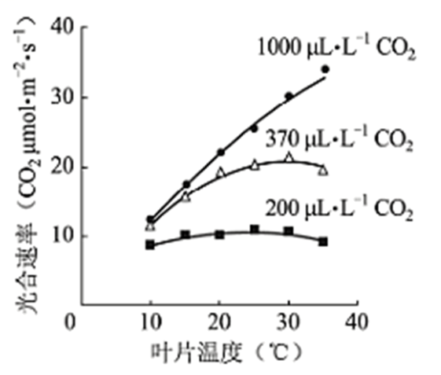

A. 低于最适温度时，光合速率随温度升高而升高

B. 在一定范围内，CO2浓度升高可使光合作用最适温度升高

C. CO2浓度为200μL·L-1时，温度对光合速率影响小

D. 10℃条件下，光合速率随CO2浓度的升高会持续提高

3\. 在北京冬奥会的感召下，一队初学者进行了3个月高山滑雪集训，成绩显著提高，而体重和滑雪时单位时间的摄氧量均无明显变化。检测集训前后受训者完成滑雪动作后血浆中乳酸浓度，结果如下图。与集训前相比，滑雪过程中受训者在单位时间内（　　）

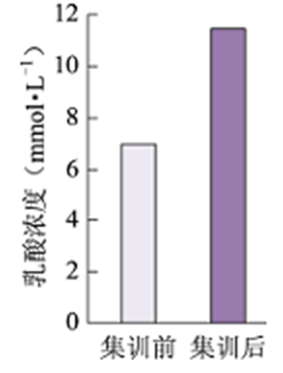

A. 消耗的ATP不变

B. 无氧呼吸增强

C. 所消耗的ATP中来自有氧呼吸的增多

D. 骨骼肌中每克葡萄糖产生的ATP增多

4\. 控制果蝇红眼和白眼基因位于X染色体。白眼雌蝇与红眼雄蝇杂交，子代中雌蝇为红眼，雄蝇为白眼，但偶尔出现极少数例外子代。子代的性染色体组成如下图。下列判断错误的是（　　）

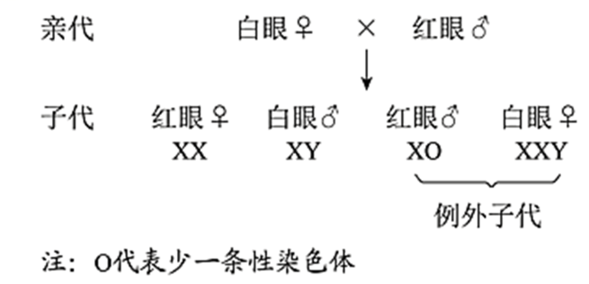

A. 果蝇红眼对白眼为显性

B. 亲代白眼雌蝇产生2种类型的配子

C. 具有Y染色体的果蝇不一定发育成雄性

D. 例外子代的出现源于母本减数分裂异常

5\. 蜜蜂的雌蜂（蜂王和工蜂）为二倍体，由受精卵发育而来；雄蜂是单倍体，由未受精卵发育而来。由此不能得出（　　）

A. 雄蜂体细胞中无同源染色体

B. 雄蜂精子中染色体数目是其体细胞的一半

C. 蜂王减数分裂时非同源染色体自由组合

D. 蜜蜂的性别决定方式与果蝇不同

6\. 人与黑猩猩是从大约700万年前的共同祖先进化而来，两个物种成体的血红蛋白均由α和β两种肽链组成，但α链的相同位置上有一个氨基酸不同，据此不能得出（　　）

A. 这种差异是由基因中碱基替换造成的

B. 两者共同祖先的血红蛋白也有α链

C. 两者血红蛋白都能行使正常的生理功能

D. 导致差别变异发生在黑猩猩这一物种形成的过程中

7\. 2022年2月下旬，天安门广场各种盆栽花卉凌寒怒放，喜迎冬残奥会的胜利召开。为使植物在特定时间开花，园艺工作者需对植株进行处理，常用措施不包括（　　）

A. 置于微重力场 B. 改变温度 C. 改变光照时间 D. 施用植物生长调节剂

8\. 神经组织局部电镜照片如下图。下列有关突触的结构及神经元间信息传递的叙述，不正确的是（　　）

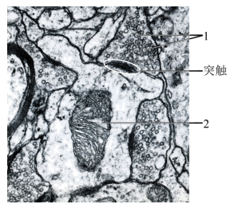

A. 神经冲动传导至轴突末梢，可引起1与突触前膜融合

B. 1中的神经递质释放后可与突触后膜上的受体结合

C. 2所示的细胞器可以为神经元间的信息传递供能

D. 2所在的神经元只接受1所在的神经元传来的信息

9\. 某患者，54岁，因病切除右侧肾上腺。术后检查发现，患者血浆中肾上腺皮质激素水平仍处于正常范围。对于出现这种现象原因，错误的解释是（　　）

A. 切除手术后，对侧肾上腺提高了肾上腺皮质激素的分泌量

B. 下丘脑可感受到肾上腺皮质激素水平的变化，发挥调节作用

C. 下丘脑可分泌促肾上腺皮质激素，促进肾上腺皮质激素的分泌

D. 垂体可接受下丘脑分泌的激素信号，促进肾上腺皮质的分泌功能

10\. 人体皮肤损伤时，金黄色葡萄球菌容易侵入伤口并引起感染。清除金黄色葡萄球菌的过程中，免疫系统发挥的基本功能属于（　　）

A. 免疫防御 B. 免疫自稳 C. 免疫监视、免疫自稳 D. 免疫防御、免疫监视

11\. 将黑色小鼠囊胚的内细胞团部分细胞注射到白色小鼠囊胚腔中，接受注射的囊胚发育为黑白相间的小鼠（Mc）。据此分析，下列叙述错误的是（　　）

A. 获得Mc的生物技术属于核移植

B. Mc表皮中有两种基因型的细胞

C. 注射入的细胞会分化成Mc的多种组织

D. 将接受注射的囊胚均分为二，可发育成两只幼鼠

12\. 实验操作顺序直接影响实验结果。表中实验操作顺序有误的是（　　）

|  |  |  |
|:--:|:--:|:--:|
| 选项 | 高中生物学实验内容 | 操作步骤 |
| A | 检测生物组织中的蛋白质 | 向待测样液中先加双缩脲试剂A液，再加B液 |
| B | 观察细胞质流动 | 先用低倍镜找到特定区域的黑藻叶肉细胞，再换高倍镜观察 |
| C | 探究温度对酶活性的影响 | 室温下将淀粉溶液与淀粉酶溶液混匀后，在设定温度下保温 |
| D | 观察根尖分生区组织细胞的有丝分裂 | 将解离后的根尖用清水漂洗后，再用甲紫溶液染色 |

A. A B. B C. C D. D

13\. 下列高中生物学实验中，对实验结果不要求精确定量的是（　　）

A. 探究光照强度对光合作用强度的影响

B. DNA的粗提取与鉴定

C. 探索生长素类调节剂促进插条生根的最适浓度

D. 模拟生物体维持pH的稳定

14\. 有氧呼吸会产生少量超氧化物，超氧化物积累会氧化生物分子引发细胞损伤。将生理指标接近的青年志愿者按吸烟与否分为两组，在相同条件下进行体力消耗测试，受试者血浆中蛋白质被超氧化物氧化生成的产物量如下图。基于此结果，下列说法正确的是（　　）

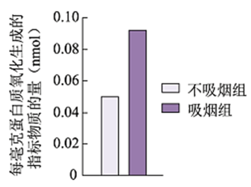

A. 超氧化物主要在血浆中产生

B. 烟草中的尼古丁导致超氧化物含量增加

C. 与不吸烟者比，蛋白质能为吸烟者提供更多能量

D. 本实验为“吸烟有害健康”提供了证据

15\. 2022年4月，国家植物园依托中科院植物所和北京市植物园建立，以植物易地保护为重点开展工作。这些工作不应包括（　　）

A. 模拟建立濒危植物的原生生境

B. 从多地移植濒危植物

C. 研究濒危植物的繁育

D. 将濒危植物与其近缘种杂交培育观赏植物

**二、非选择题（共6小题）**

16\. 芽殖酵母属于单细胞真核生物。为寻找调控蛋白分泌的相关基因，科学家以酸性磷酸酶（P酶）为指标，筛选酵母蛋白分泌突变株并进行了研究。

（1）酵母细胞中合成的分泌蛋白一般通过\_\_\_\_\_\_\_\_\_\_\_\_\_\_作用分泌到细胞膜外。

（2）用化学诱变剂处理，在酵母中筛选出蛋白分泌异常的突变株（sec1）。无磷酸盐培养液可促进酵母P酶的分泌，分泌到胞外的P酶活性可反映P酶的量。将酵母置于无磷酸盐培养液中，对sec1和野生型的胞外P酶检测结果如下图。据图可知，24℃时sec1和野生型胞外P酶随时间而增加。转入37℃后，sec1胞外P酶呈现\_\_\_\_\_\_\_\_的趋势，表现出分泌缺陷表型，表明sec1是一种温度敏感型突变株。

（3）37℃培养1h后电镜观察发现，与野生型相比，sec1中由高尔基体形成的分泌泡在细胞质中大量积累。由此推测野生型Sec1基因的功能是促进\_\_\_\_\_\_\_\_\_\_\_\_\_\_的融合。

（4）由37℃转回24℃并加入蛋白合成抑制剂后，sec1胞外P酶重新增加。对该实验现象的合理解释是\_\_\_\_\_\_\_\_\_\_\_\_\_。

（5）现已得到许多温度敏感型的蛋白分泌突变株。若要进一步确定某突变株的突变基因在37℃条件下影响蛋白分泌的哪一阶段，可作为鉴定指标的是：突变体\_\_\_\_\_\_\_\_\_\_\_\_\_\_。

A. 蛋白分泌受阻，在细胞内积累

B. 与蛋白分泌相关的胞内结构的形态、数量发生改变

C. 细胞分裂停止，逐渐死亡

17\. 干旱可诱导植物体内脱落酸（ABA）增加，以减少失水，但干旱促进ABA合成的机制尚不明确。研究者发现一种分泌型短肽（C）在此过程中起重要作用。

（1）C由其前体肽加工而成，该前体肽在内质网上的\_\_\_\_\_\_\_\_\_\_\_\_\_\_合成。

（2）分别用微量（0.1μmol·L-1）的C或ABA处理拟南芥根部后，检测叶片气孔开度，结果如下图1。据图1可知，C和ABA均能够\_\_\_\_\_\_\_，从而减少失水。

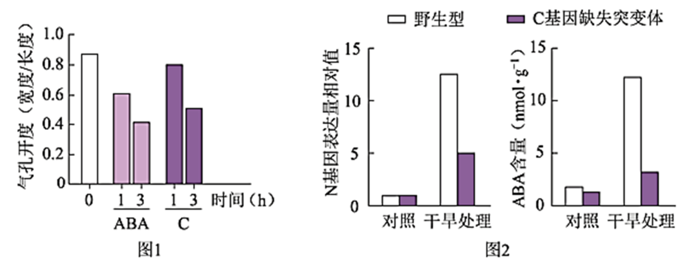

（3）已知N是催化ABA生物合成的关键酶。研究表明C可能通过促进N基因表达，进而促进ABA合成。图2中支持这一结论的证据是，经干旱处理后\_\_\_\_\_\_\_。

（4）实验表明，野生型植物经干旱处理后，C在根中的表达远高于叶片；在根部外施的C可运输到叶片中。因此设想，干旱下根合成C运输到叶片促进N基因的表达。为验证此设想，进行了如下表所示的嫁接实验，干旱处理后，检测接穗叶片中C含量，又检测了其中N基因的表达水平。以接穗与砧木均为野生型的植株经干旱处理后的N基因表达量为参照值，在表中填写假设成立时，与参照值相比N基因表达量的预期结果（用“远低于”、“远高于”、“相近”表示）。①\_\_\_\_；②\_\_\_\_。

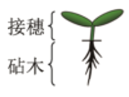

|                         |        |          |          |
|:-----------------------:|:------:|:--------:|:--------:|
|          接穗           | 野生型 |  突变体  |  突变体  |
|          砧木           | 野生型 |  突变体  |  野生型  |
| 接穗叶片中N基因的表达量 | 参照值 | <u>①</u> | <u>②</u> |

注:突变体为C基因缺失突变体

（5）研究者认为C也属于植物激素，作出此判断的依据是\_\_\_\_。这一新发现扩展了人们对植物激素化学本质的认识。

18\. 番茄果实成熟涉及一系列生理生化过程，导致果实颜色及硬度等发生变化。果实颜色由果皮和果肉颜色决定。为探究番茄果实成熟的机制，科学家进行了相关研究。

（1）果皮颜色由一对等位基因控制。果皮黄色与果皮无色的番茄杂交的F1果皮为黄色，F1自交所得F2果皮颜色及比例为\_\_\_\_\_\_\_。

（2）野生型番茄成熟时果肉为红色。现有两种单基因纯合突变体，甲（基因A突变为a）果肉黄色，乙（基因B突变为b）果肉橙色。用甲、乙进行杂交实验，结果如下图1。据此，写出F2中黄色的基因型：\_\_\_\_\_\_\_。

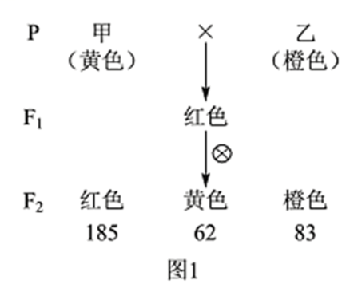

（3）深入研究发现，成熟番茄的果肉由于番茄红素的积累而呈红色，当番茄红素量较少时，果肉呈黄色，而前体物质2积累会使果肉呈橙色，如下图2。上述基因A、B以及另一基因H均编码与果肉颜色相关的酶，但H在果实中的表达量低。根据上述代谢途径，aabb中前体物质2积累、果肉呈橙色的原因是\_\_\_\_\_\_\_。

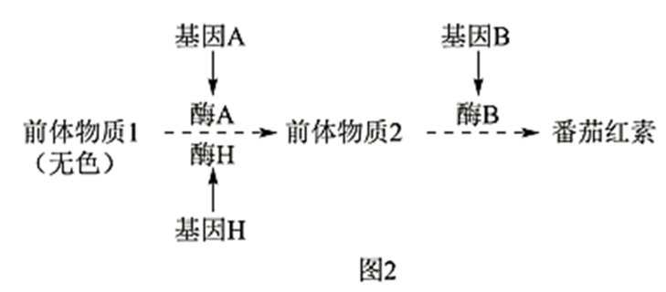

（4）有一果实不能成熟的变异株M，果肉颜色与甲相同，但A并未突变，而调控A表达的C基因转录水平极低。C基因在果实中特异性表达，敲除野生型中的C基因，其表型与M相同。进一步研究发现M中C基因的序列未发生改变，但其甲基化程度一直很高。推测果实成熟与C基因甲基化水平改变有关。欲为此推测提供证据，合理的方案包括\_\_\_\_\_\_\_，并检测C的甲基化水平及表型。

①将果实特异性表达的去甲基化酶基因导入M

②敲除野生型中果实特异性表达的去甲基化酶基因

③将果实特异性表达的甲基化酶基因导入M

④将果实特异性表达的甲基化酶基因导入野生型

19\. 学习以下材料，回答（1）～（5）题。

蚜虫的适应策略：蚜虫是陆地生态系统中常见的昆虫。春季蚜虫从受精卵开始发育，迁飞到取食宿主上度过夏季，其间行孤雌生殖，经卵胎生产生大量幼蚜；秋季蚜虫迁飞回产卵宿主，行有性生殖，以受精卵越冬。蚜虫周围生活着很多生物，体内还有布氏菌等多种微生物，这些生物之间的关系如下图。

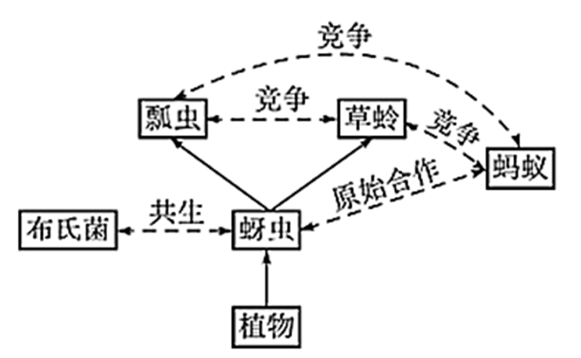

蚜虫以植物为食。植物通过筛管将以糖类为主的光合产物不断运至根、茎等器官。组成筛管的筛管细胞之间通过筛板上的筛孔互通。筛管受损会引起筛管汁液中Ca2+浓度升高，导致筛管中P蛋白从结晶态变为非结晶态而堵塞筛孔，以阻止营养物质外泄。蚜虫取食时，将口器刺入植物组织，寻找到筛管，持续吸食筛管汁液，但刺吸的损伤并不引起筛孔堵塞。体外实验表明，筛管P蛋白在Ca2+浓度低时呈现结晶态，Ca2+浓度提高后P蛋白溶解，加入蚜虫唾液后P蛋白重新结晶。蚜虫仅以筛管汁液为食，其体内的布氏菌从蚜虫获取全部营养元素。筛管汁液的主要营养成分是糖类，所含氮元素极少。这些氮元素绝大部分以氨基酸形式存在，但无法完全满足蚜虫的需求。蚜虫不能合成的氨基酸来源如下表。

|            |        |          |        |        |          |          |        |        |        |
|:----------:|:------:|:--------:|:------:|:------:|:--------:|:--------:|:------:|:------:|:------:|
|   氨基酸   | 组氨酸 | 异亮氨酸 | 亮氨酸 | 赖氨酸 | 甲硫氨酸 | 苯丙氨酸 | 苏氨酸 | 色氨酸 | 缬氨酸 |
|  植物提供  |   ＋   |    －    |   －   |   －   |    －    |    －    |   －   |   \\   |   －   |
| 布氏菌合成 |   －   |    ＋    |   ＋   |   ＋   |    ＋    |    ＋    |   ＋   |   \\   |   ＋   |

注：“－”代表低于蚜虫需求的量，“＋”代表高于蚜虫需求的量，“\\代表难以检出。

蚜虫大量吸食筛管汁液，同时排出大量蜜露。蜜露以糖为主要成分，为蚂蚁等多种生物提供了营养物质。

蚜虫利用这些策略应对各种环境压力，在生态系统中扮演着独特的角色。

（1）蚜虫生活环境中的全部生物共同构成了\_\_\_\_\_\_\_。从生态系统功能角度分析，图中实线单箭头代表了\_\_\_\_\_\_\_的方向。

（2）蚜虫为布氏菌提供其不能合成的氨基酸，而在蚜虫不能合成的氨基酸中，布氏菌来源的氨基酸与从植物中获取的氨基酸\_\_\_\_\_\_\_。

（3）蚜虫能够持续吸食植物筛管汁液，而不引起筛孔堵塞，可能是因为蚜虫唾液中有\_\_\_\_\_\_\_的物质。

（4）从文中可知，蚜虫获取足量的氮元素并维持内环境稳态的对策是\_\_\_\_\_\_\_。

（5）从物质与能量以及进化与适应的角度，分析蚜虫在冬季所采取的生殖方式对于种群延续和进化的意义\_\_\_\_\_\_\_。

20\. 人体细胞因表面有可被巨噬细胞识别的“自体”标志蛋白C，从而免于被吞噬。某些癌细胞表面存在大量的蛋白C，更易逃脱吞噬作用。研究者以蛋白C为靶点，构建了可感应群体密度而裂解的细菌菌株，拟用于制备治疗癌症的“智能炸弹”。

（1）引起群体感应的信号分子A是一种脂质小分子，通常以\_\_\_\_\_\_\_的方式进出细胞。细胞内外的A随细菌密度的增加而增加，A积累至一定浓度时才与胞内受体结合，调控特定基因表达，表现出细菌的群体响应。

（2）研究者将A分子合成酶基因、A受体基因及可使细菌裂解的L蛋白基因同时转入大肠杆菌，制成AL菌株。培养的AL菌密度变化如图1。其中，AL菌密度骤降的原因是：AL菌密度增加引起A积累至临界浓度并与受体结合，\_\_\_\_\_\_\_。

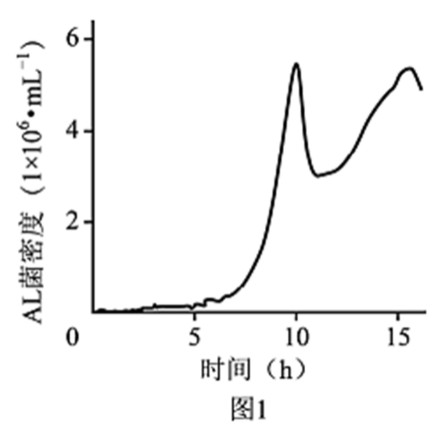

（3）蛋白K能与蛋白C特异性结合并阻断其功能。研究者将K基因转入AL菌，制成ALK菌株，以期用于肿瘤治疗。为验证ALK菌能产生蛋白K，应以\_\_\_\_\_\_\_菌株裂解的上清液为对照进行实验。请从下列选项中选取所需材料与试剂的序号，完善实验组的方案。

实验材料与试剂：①ALK菌裂解的上清液②带荧光标记的K的抗体③带荧光标记的C的抗体④肿瘤细胞

实验步骤：先加入\_\_\_\_\_\_\_保温后漂洗，再加入\_\_\_\_\_\_\_保温后漂洗，检测荧光强度。

（4）研究者向下图2所示小鼠左侧肿瘤内注射ALK菌后，发现ALK菌只存在于该侧瘤内，两周内即观察到双侧肿瘤生长均受到明显抑制。而向瘤内单独注射蛋白K或AL菌，对肿瘤无明显抑制作用。请应用免疫学原理解释“智能炸弹”ALK菌能有效抑制对侧肿瘤生长的原因\_\_\_\_\_\_\_。

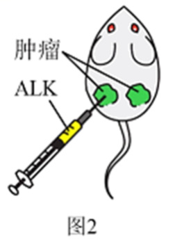

21\. 生态文明建设已成为我国的基本国策。水中雌激素类物质（E物质）污染会导致鱼类雌性化等异常，并通过食物链影响人体健康和生态安全。原产南亚的斑马鱼，其肌细胞、生殖细胞等存在E物质受体，且幼体透明。科学家将绿色荧光蛋白（GFP）等基因转入斑马鱼，建立了一种经济且快速的水体E物质监测方法。

（1）将表达载体导入斑马鱼受精卵的最佳方式是\_\_\_\_\_\_\_。

（2）为监测E物质，研究者设计了下图所示的两种方案制备转基因斑马鱼，其中ERE和酵母来源的UAS是两种诱导型启动子，分别被E物质-受体复合物和酵母来源的Gal4蛋白特异性激活，启动下游基因表达。与方案1相比，方案2的主要优势是\_\_\_\_\_\_\_，因而被用于制备监测鱼（MO）。

（3）现拟制备一种不育的监测鱼SM，用于实际监测。SM需经MO和另一亲本（X）杂交获得。欲获得X，需从以下选项中选择启动子和基因，构建表达载体并转入野生型斑马鱼受精卵，经培育后进行筛选。请将选项的序号填入相应的方框中。

Ⅰ.启动子：\_\_\_\_。

①ERE②UAS③使基因仅在生殖细胞表达的启动子（P生）④使基因仅在肌细胞表达的启动子（P肌）

Ⅱ.基因：\_\_\_\_\_\_

A．GFP B.Gal4 C.雌激素受体基因（ER） D.仅导致生殖细胞凋亡的基因（dg）

（4）SM不育的原因是：成体SM自身产生雌激素，与受体结合后\_\_\_\_\_\_\_造成不育。

（5）使拟用于实际监测的SM不育的目的是\_\_\_\_\_\_\_。
