**北京市2022年普通高中学业水平等级性考试**

**生物**

**一、选择题，本部分共15题，在每题列出的四个选项中，选出最符合题目要求的一项。**

1\. 鱼腥蓝细菌分布广泛，它不仅可以进行光合作用，还具有固氮能力。关于该蓝细菌的叙述，不正确的是（　　）

A. 属于自养生物 B. 可以进行细胞呼吸

C. DNA位于细胞核中 D. 在物质循环中发挥作用

【答案】C

【解析】

【分析】蓝细菌没有核膜包被的细胞核，属于原核生物，只含有核糖体一种细胞器，含有叶绿素和藻蓝素，是能进行光合作用的自养生物。

【详解】A、蓝细菌能进行光合作用，属于自养生物，A正确；

B、蓝细菌进行的是有氧呼吸，B正确；

C、蓝细菌属于原核生物，没有细胞核，DNA主要位于拟核中，C错误；

D、蓝细菌在生态系统中属于生产者，在物质循环中其重要作用，D正确。

故选C。

2\. 光合作用强度受环境因素的影响。车前草的光合速率与叶片温度、CO2浓度的关系如下图。据图分析不能得出（　　）

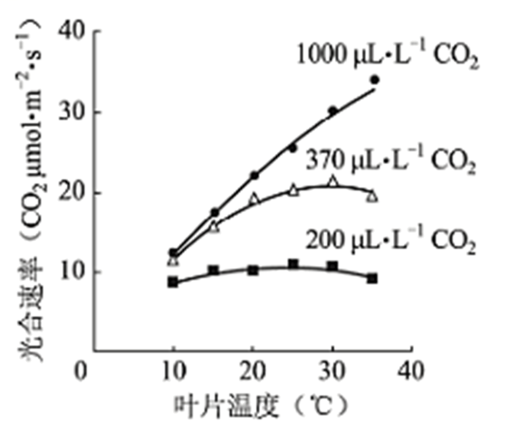

A. 低于最适温度时，光合速率随温度升高而升高

B. 在一定的范围内，CO2浓度升高可使光合作用最适温度升高

C. CO2浓度为200μL·L-1时，温度对光合速率影响小

D. 10℃条件下，光合速率随CO2浓度的升高会持续提高

【答案】D

【解析】

【分析】由题图分析可得：

（1）图中所展现有两个影响光合速率的因素：一个是CO2的浓度，另一个是温度。

（2）当温度相同时，光合速率会随着CO2的浓度升高而增大；当CO2的浓度相同时，光合速率会随着温度的升高而增大，达到最适温度时，光合速率达到最高值，后随着温度的继续升高而减小。

（3）当CO2浓度为200μL·L-1时，最适温度为25℃左右；当CO2浓度为370μL·L-1时，最适温度为30℃；当CO2浓度为1000μL·L-1时，最适温度接近40℃。

【详解】A、分析题图可知，当CO2浓度一定时，光合速率会随着温度的升高而增大，达到最适温度时，光合速率达到最高值，后随着温度的继续升高而减小，A正确；

B、分析题图可知，当CO2浓度为200μL·L-1时，最适温度为25℃左右；当CO2浓度为370μL·L-1时，最适温度为30℃；当CO2浓度为1000μL·L-1时，最适温度接近40℃，可以表明在一定范围内，CO2浓度的升高会使光合作用最适温度升高，B正确；

C、分析题图可知，当CO2浓度为200μL·L-1时，光合速率随温度的升高而改变程度不大，光合速率在温度的升高下，持续在数值为10处波动，而CO2浓度为其他数值时，光合速率随着温度的升高变化程度较大，曲线有较大的变化趋势，所以表明CO2浓度为200μL·L-1时，温度对光合速率影响小，C正确；

D、分析题图可知，10℃条件下，CO2浓度为200μL·L-1至370μL·L-1时，光合速率有显著提高，而370μL·L-1至1000μL·L-1时，光合速率无明显的提高趋势，而且370μL·L-1时与1000μL·L-1时，两者光合速率数值接近同一数值，所以不能表明10℃条件下，光合速率随CO2浓度的升高会持续提高，D错误。

故选D。

3\. 在北京冬奥会的感召下，一队初学者进行了3个月高山滑雪集训，成绩显著提高，而体重和滑雪时单位时间的摄氧量均无明显变化。检测集训前后受训者完成滑雪动作后血浆中乳酸浓度，结果如下图。与集训前相比，滑雪过程中受训者在单位时间内（　　）

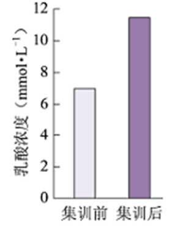

A. 消耗的ATP不变

B. 无氧呼吸增强

C. 所消耗的ATP中来自有氧呼吸的增多

D. 骨骼肌中每克葡萄糖产生的ATP增多

【答案】B

【解析】

【分析】人体无氧呼吸的产物是乳酸。消耗等量的葡萄糖，有氧呼吸产生的ATP多于无氧呼吸。

【详解】A、滑雪过程中，受训者耗能增多，故消耗的ATP增多，A错误；

B、人体无氧呼吸的产物是乳酸，分体题图可知，与集训前相比，集训后受训者血浆中乳酸浓度增加，由此可知，与集训前相比，滑雪过程中受训者在单位时间内无氧呼吸增强，B正确；

C、分体题图可知，与集训前相比，集训后受训者血浆中乳酸浓度增加，由此可知，与集训前相比，滑雪过程中受训者在单位时间内无氧呼吸增强，故所消耗的ATP中来自无氧呼吸的增多，C错误；

D、消耗等量的葡萄糖，有氧呼吸产生的ATP多于无氧呼吸，而滑雪过程中受训者在单位时间内无氧呼吸增强，故骨骼肌中每克葡萄糖产生的ATP减少，D错误。

故选B。

4\. 控制果蝇红眼和白眼的基因位于X染色体。白眼雌蝇与红眼雄蝇杂交，子代中雌蝇为红眼，雄蝇为白眼，但偶尔出现极少数例外子代。子代的性染色体组成如下图。下列判断错误的是（　　）

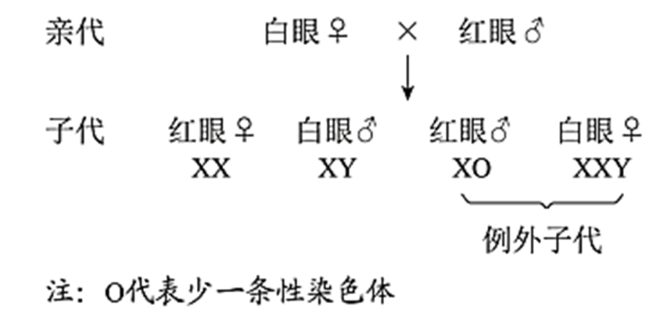

A. 果蝇红眼对白眼为显性

B. 亲代白眼雌蝇产生2种类型的配子

C. 具有Y染色体的果蝇不一定发育成雄性

D. 例外子代的出现源于母本减数分裂异常

【答案】B

【解析】

【分析】1、位于性染色体上的基因，其在遗传上总是和性别相关联，这种现象叫伴性遗传。

2、摩尔根运用“假说—演绎法”，通过果蝇杂交实验证明了萨顿假说。

【详解】A、白眼雌蝇与红眼雄蝇杂交，子代中雌蝇为红眼，雄蝇为白眼，可判断果蝇红眼对白眼为显性，A正确；

B、白眼为隐性，因此正常情况下亲代白眼雌蝇只能产生1种类型的配子，B错误；

C、由图可知，XXY的个体为雌性，具有Y染色体的果蝇不一定发育成雄性，C正确；

D、例外子代的出现是源于母本减数分裂异常，出现了不含X染色体的卵细胞或含有两条X染色体的卵细胞，D正确。

故选B。

5\. 蜜蜂的雌蜂（蜂王和工蜂）为二倍体，由受精卵发育而来；雄蜂是单倍体，由未受精卵发育而来。由此不能得出（　　）

A. 雄蜂体细胞中无同源染色体

B. 雄蜂精子中染色体数目是其体细胞的一半

C. 蜂王减数分裂时非同源染色体自由组合

D. 蜜蜂的性别决定方式与果蝇不同

【答案】B

【解析】

【分析】题意分析，蜜蜂的雄蜂是由未受精的卵细胞发育而成的，因而细胞中没有同源染色体，雌蜂是由受精卵发育而成的，其细胞中含有同源染色体，蜜蜂的性别是由染色体sum决定的。

【详解】A、雄蜂是由未受精的卵细胞直接发育成的，是单倍体，因此雄蜂体细胞中无同源染色体，A正确；

B、雄蜂精子中染色体数目与其体细胞的中染色体数目相同，B错误；

C、蜂王是由受精卵经过分裂、分化产生的，其体细胞中存在同源染色体，在减数分裂过程中会发生非同源染色体自由组合，C正确；

D、蜜蜂的性别决定方式与果蝇不同，蜜蜂的性别与染色体数目有关，而果蝇的性别决定与性染色体有关，D正确。

故选B。

6\. 人与黑猩猩是从大约700万年前的共同祖先进化而来，两个物种成体的血红蛋白均由α和β两种肽链组成，但α链的相同位置上有一个氨基酸不同，据此不能得出（　　）

A. 这种差异是由基因中碱基替换造成的

B. 两者共同祖先的血红蛋白也有α链

C. 两者的血红蛋白都能行使正常的生理功能

D. 导致差别的变异发生在黑猩猩这一物种形成的过程中

【答案】D

【解析】

【分析】基因突变指DNA分子中发生碱基对的替换增添、缺失，而引起基因结构的改变。

【详解】A、两个物种成体的血红蛋白均由α和β两种肽链组成，但α链的相同位置上有一个氨基酸不同，可能是由由基因中碱基替换造成的，A不符合题意；

B、人与黑猩猩是从大约700万年前的共同祖先进化而来，两个物种成体的血红蛋白均由α和β两种肽链组成，推测两者共同祖先的血红蛋白也有α链，B不符合题意；

C、人与黑猩猩都能正常生存，两者的血红蛋白都能行使正常的生理功能，C不符合题意；

D、两个物种成体的血红蛋白均由α和β两种肽链组成，但α链的相同位置上有一个氨基酸不同，这属于基因突变，突变可以发生在任何生物的任何生长发育过程，D符合题意。

故选D。

7\. 2022年2月下旬，天安门广场各种盆栽花卉凌寒怒放，喜迎冬残奥会的胜利召开。为使植物在特定时间开花，园艺工作者需对植株进行处理，常用措施不包括（　　）

A. 置于微重力场 B. 改变温度 C. 改变光照时间 D. 施用植物生长调节剂

【答案】A

【解析】

【分析】植物生长发育的整体调控：植物生长发育的调控，是基因表达调控、激素调节和环境因素调节共同完成的。植物细胞里储存着全套基因，但是某个细胞的基因如何表达则会根据需要作调整。激素作为信息分子，会影响细胞的基因表达，从而起到调节的作用，激素的产生和分布是基因表达调控的结果，也受到环境因素的影响。

【详解】A、微重力场不影响植物的开花，不能使植物在特定时间开花，A错误；

B、温度可以影响种子萌发、植株生长、开花结果和叶的衰老、脱落等生命活动，从而参与调节植物生长发育，B正确；

C、植物具有能够接受光信号的分子，光敏色素是其中一种，分布在植物各个部位，其中在分生组织的细胞内比较丰富。在受到光照射时，光敏色素的结构会发生变化，这一变化的信息会经过信息传递系统传导至细胞核内，影响特定基因的表达，从而表现出生物学效应，可通过改变光照时间影响植物的开花，C正确；

D、植物生长调节剂能延长或终止种子、芽及块茎的休眠，调节花的雌雄比例，促进或阻止开花，诱导或控制果实脱落，控制植物高度、形状等，D正确。

故选A。

8\. 神经组织局部电镜照片如下图。下列有关突触的结构及神经元间信息传递的叙述，不正确的是（　　）

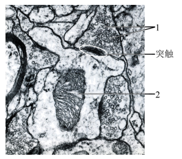

A. 神经冲动传导至轴突末梢，可引起1与突触前膜融合

B. 1中的神经递质释放后可与突触后膜上的受体结合

C. 2所示的细胞器可以为神经元间的信息传递供能

D. 2所在的神经元只接受1所在的神经元传来的信息

【答案】D

【解析】

【分析】兴奋在神经元之间的传递过程：轴突→突触小体→突触小泡→神经递质→突触前膜→突触间隙→突触后膜（与突触后膜受体结合）→另一个神经元产生兴奋或抑制。

题图分析，图中1表示突触小泡，2表示线粒体。

【详解】A、神经冲动传导至轴突末梢，可引起突触小泡1与突触前膜融合，从而通过胞吐的方式将神经递质释放到突触间隙，A正确；

B、1中的神经递质释放后可与突触后膜上的受体发生特异性结合，从而引起下一个神经元兴奋或抑制，B正确；

C、2表示的是线粒体，线粒体是细胞中的动力工厂，其可以为神经元间的信息传递供能，C正确；

D、2所在的神经元可以和周围的多个神经元之间形成联系，因而不只接受1所在的神经元传来的信息，D错误。

故选D。

9\. 某患者，54岁，因病切除右侧肾上腺。术后检查发现，患者血浆中肾上腺皮质激素水平仍处于正常范围。对于出现这种现象的原因，错误的解释是（　　）

A. 切除手术后，对侧肾上腺提高了肾上腺皮质激素的分泌量

B. 下丘脑可感受到肾上腺皮质激素水平的变化，发挥调节作用

C. 下丘脑可分泌促肾上腺皮质激素，促进肾上腺皮质激素分泌

D. 垂体可接受下丘脑分泌的激素信号，促进肾上腺皮质的分泌功能

【答案】C

【解析】

【分析】下丘脑能合成并分泌促肾上腺皮质激素释放激素，进而作用于垂体，促进垂体合成并分泌促肾上腺皮质激素，该激素作用于肾上腺皮质促进肾上腺皮质激素的分泌，当肾上腺皮质激素分泌量增加时会反馈抑制下丘脑和垂体的分泌活动，从而不至于使肾上腺皮质激素的含量过高。

【详解】A、题意显示，术后检查发现，患者血浆中肾上腺皮质激素水平仍处于正常范围，据此可推测，切除手术后，对侧肾上腺提高了肾上腺皮质激素的分泌量，A正确；

B、下丘脑可感受到肾上腺皮质激素水平的变化，如当肾上腺皮质激素含量上升时，则下丘脑和垂体的分泌活动被抑制，从而维持了肾上腺皮质激素含量的稳定，B正确；

C、下丘脑可分泌促肾上腺皮质激素释放激素，作用于垂体，促进垂体合成并分泌促肾上腺皮质激素，进而促进肾上腺皮质激素的分泌，C错误；

D、垂体可接受下丘脑分泌促肾上腺皮质激素释放激素的信号，合成并分泌促肾上腺皮质激素，进而促进肾上腺皮质的分泌，D正确。

故选C。

10\. 人体皮肤损伤时，金黄色葡萄球菌容易侵入伤口并引起感染。清除金黄色葡萄球菌的过程中，免疫系统发挥的基本功能属于（　　）

A. 免疫防御 B. 免疫自稳 C. 免疫监视、免疫自稳 D. 免疫防御、免疫监视

【答案】A

【解析】

【分析】免疫系统的基本功能：a）免疫防御：防止外界病原体入侵及清除已入侵病原体其害物质异免疫功能低或缺发免疫缺陷病；b）免疫监视：随发现清除体内现非肿瘤细胞及衰老、死亡细胞；c）免疫自稳：通免疫耐受、免疫调节两种机制维持免疫系统内环境稳定。

【详解】清除外来物质属于免疫系统的防御功能，因此清除金黄色葡萄球菌的过程中，免疫系统发挥的基本功能属于免疫防御，A正确，BCD错误。

故选A。

11\. 将黑色小鼠囊胚的内细胞团部分细胞注射到白色小鼠囊胚腔中，接受注射的囊胚发育为黑白相间的小鼠（Mc）。据此分析，下列叙述错误的是（　　）

A. 获得Mc的生物技术属于核移植

B. Mc表皮中有两种基因型的细胞

C. 注射入的细胞会分化成Mc的多种组织

D. 将接受注射的囊胚均分为二，可发育成两只幼鼠

【答案】A

【解析】

【分析】胚胎发育的过程：①卵裂期：细胞进行有丝分裂，数量增加，胚胎总体积不增加；②桑甚胚：32个细胞左右的胚胎（之前所有细胞都能发育成完整胚胎的潜能属全能细胞）；③囊胚：细胞开始分化，其中个体较大的细胞叫内细胞团将来发育成胎儿的各种组织；而滋养层细胞将来发育成胎膜和胎盘；胚胎内部逐渐出现囊胚腔（注：囊胚的扩大会导致透明带的破裂胚胎伸展出来，这一过程叫孵化）﹔④原肠胚：内细胞团表层形成外胚层，下方细胞形成内胚层，由内胚层包围的囊腔叫原肠腔。

【详解】A、内细胞团是已经分化的细胞组成，获得Mc的生物技术并未利用核移植技术，A错误；

B、接受注射的囊胚发育为黑白相间的小鼠，说明Mc表皮中有两种基因型的细胞，B正确；

C、内细胞团能发育成胎儿的各种组织，注射的细胞来自黑色小鼠的内细胞团，会分化成Mc的多种组织，C正确；

D、利用胚胎分割技术将接受注射的囊胚均分为二，可发育成两只幼鼠，D正确。

故选A。

12\. 实验操作顺序直接影响实验结果。表中实验操作顺序有误的是（　　）

|  |  |  |
|:--:|:--:|:--:|
| 选项 | 高中生物学实验内容 | 操作步骤 |
| A | 检测生物组织中的蛋白质 | 向待测样液中先加双缩脲试剂A液，再加B液 |
| B | 观察细胞质流动 | 先用低倍镜找到特定区域的黑藻叶肉细胞，再换高倍镜观察 |
| C | 探究温度对酶活性的影响 | 室温下将淀粉溶液与淀粉酶溶液混匀后，在设定温度下保温 |
| D | 观察根尖分生区组织细胞的有丝分裂 | 将解离后的根尖用清水漂洗后，再用甲紫溶液染色 |

A. A B. B C. C D. D

【答案】C

【解析】

【分析】蛋白质可与双缩脲试剂产生紫色反应。

【详解】A、在鉴定蛋白质时要先加2ml双缩脲试剂A液，再向试管中加入3-4滴双缩脲试剂B，A正确；

B、在观察细胞质流动的实验中应该先用低倍镜找到黑藻叶肉细胞，然后再换用高倍镜观察，B正确；

C、探究温度对酶活性的影响时，应将淀粉溶液与淀粉酶溶液分别在设定温度下保温一段时间，待淀粉溶液与淀粉酶溶液都达到设定温度后再混合，C错误；

D、观察根尖分生区组织细胞的有丝分裂时，将解离后的根尖用清水漂洗除去解离液后，再用碱性染料甲紫溶液染色，D正确。

故选C。

13\. 下列高中生物学实验中，对实验结果不要求精确定量的是（　　）

A. 探究光照强度对光合作用强度的影响

B. DNA的粗提取与鉴定

C. 探索生长素类调节剂促进插条生根的最适浓度

D. 模拟生物体维持pH的稳定

【答案】B

【解析】

【分析】探究光照强度对光合作用强度的影响，自变量是光照强度，因变量是光合作用强度，需要精确测定不同光照强度下光合作用强度，要求精确定量。

【详解】A、探究光照强度对光合作用强度的影响，需要测定不同光照强度下光合作用强度，要求精确定量，A错误；

B、DNA的粗提取与鉴定属于物质提取与鉴定类的实验，只需观察是否有相关现象，不需要定量，故对实验结果不要求精确定量，B正确；

C、探索生长素类调节剂促进插条生根的最适浓度，需要明确不同生长素类调节剂浓度下根的生长情况，要求定量，C错误；

D、模拟生物体维持pH的稳定，需要用pH试纸测定溶液pH值，需要定量，D错误。

故选B。

14\. 有氧呼吸会产生少量超氧化物，超氧化物积累会氧化生物分子引发细胞损伤。将生理指标接近的青年志愿者按吸烟与否分为两组，在相同条件下进行体力消耗测试，受试者血浆中蛋白质被超氧化物氧化生成的产物量如下图。基于此结果，下列说法正确的是（　　）

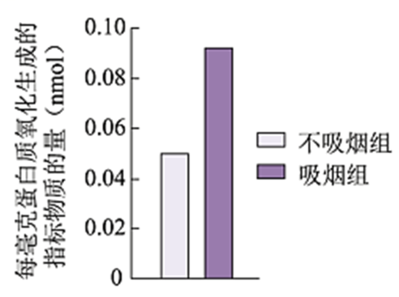

A. 超氧化物主要在血浆中产生

B. 烟草中的尼古丁导致超氧化物含量增加

C. 与不吸烟者比，蛋白质能为吸烟者提供更多能量

D. 本实验为“吸烟有害健康”提供了证据

【答案】D

【解析】

【分析】题意分析，本实验的目的是探究吸烟与否对血浆中蛋白质被超氧化物氧化生成的产物量的影响，实验结果显示，吸烟组血浆中蛋白质被超氧化物氧化生成的产物量高于不吸烟者，而超氧化物氧化生物分子生成物量的积累会引发细胞损伤，可见吸烟有害健康。

【详解】A、有氧呼吸会产生少量超氧化物，而有氧呼吸的场所是细胞质基质和线粒体，可见超氧化物主要在活细胞中产生，A错误；

B、实验结果可说明吸烟可能导致超氧化物含量增加，但不能证明是尼古丁的作用，B错误；

C、蛋白质是生命活动的主要承担者，在细胞中一般不作为能源物质提供能量，C错误；

D、据柱形图可知，吸烟组血浆中蛋白质被超氧化物氧化生成的产物量高于不吸烟者，而超氧化物氧化生物分子生成物量的积累会引发细胞损伤，因此，本实验为“吸烟有害健康”提供了证据，D正确。

故选D。

15\. 2022年4月，国家植物园依托中科院植物所和北京市植物园建立，以植物易地保护为重点开展工作。这些工作不应包括（　　）

A. 模拟建立濒危植物的原生生境

B. 从多地移植濒危植物

C. 研究濒危植物的繁育

D. 将濒危植物与其近缘种杂交培育观赏植物

【答案】D

【解析】

【分析】生物多样性的保护措施：

就地保护：主要形式是建立自然保护区，是保护生物多样性最有效的措施。

易地保护：将濒危生物迁出原地，移入动物园、植物园、水族馆和濒危动物繁育中心，进行特殊的保护和管理，是对就地保护的补充。

建立濒危物种种质库，保护珍贵的遗传资源。

加强教育和法制管理，提高公民的环境保护意识。

【详解】A、模拟建立濒危植物的原生生境，可以为濒危植物提供适宜的生长环境，可以保护濒危植物，A正确；

B、将濒危植物迁出原地，移入植物园，进行特殊的保护和管理，是对就地保护的补充，可以保护濒危植物，B正确；

C、研究濒危植物的繁育，建立濒危物种种质库，保护珍贵的遗传资源，C正确；

D、将濒危植物与其近缘种杂交培育观赏植物，不是保护濒危植物的有利措施，D错误。

故选D。

**二、非选择题（共6小题）**

16\. 芽殖酵母属于单细胞真核生物。为寻找调控蛋白分泌的相关基因，科学家以酸性磷酸酶（P酶）为指标，筛选酵母蛋白分泌突变株并进行了研究。

（1）酵母细胞中合成的分泌蛋白一般通过\_\_\_\_\_\_\_\_\_\_\_\_\_\_作用分泌到细胞膜外。

（2）用化学诱变剂处理，在酵母中筛选出蛋白分泌异常的突变株（sec1）。无磷酸盐培养液可促进酵母P酶的分泌，分泌到胞外的P酶活性可反映P酶的量。将酵母置于无磷酸盐培养液中，对sec1和野生型的胞外P酶检测结果如下图。据图可知，24℃时sec1和野生型胞外P酶随时间而增加。转入37℃后，sec1胞外P酶呈现\_\_\_\_\_\_\_\_的趋势，表现出分泌缺陷表型，表明sec1是一种温度敏感型突变株。

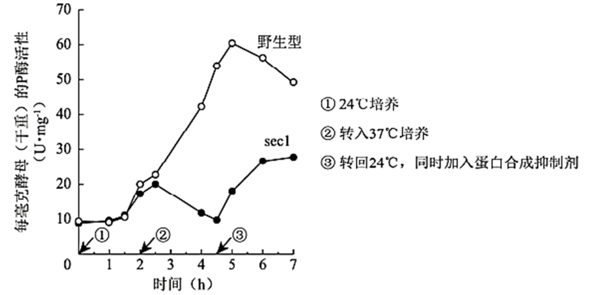

（3）37℃培养1h后电镜观察发现，与野生型相比，sec1中由高尔基体形成的分泌泡在细胞质中大量积累。由此推测野生型Sec1基因的功能是促进\_\_\_\_\_\_\_\_\_\_\_\_\_\_的融合。

（4）由37℃转回24℃并加入蛋白合成抑制剂后，sec1胞外P酶重新增加。对该实验现象的合理解释是\_\_\_\_\_\_\_\_\_\_\_\_\_。

（5）现已得到许多温度敏感型的蛋白分泌突变株。若要进一步确定某突变株的突变基因在37℃条件下影响蛋白分泌的哪一阶段，可作为鉴定指标的是：突变体\_\_\_\_\_\_\_\_\_\_\_\_\_\_。

A. 蛋白分泌受阻，在细胞内积累

B. 与蛋白分泌相关的胞内结构的形态、数量发生改变

C. 细胞分裂停止，逐渐死亡

【答案】（1）胞吐 （2）先上升后下降

（3）分泌泡与细胞膜 （4）积累在分泌泡中的P酶分泌到细胞外 （5）B

【解析】

【分析】1、大分子、颗粒性物质跨膜运输的方式是胞吞或胞吐。分泌蛋白是大分子物质，分泌到细胞膜外的方式是胞吐。

2、分析题图可知，24℃时sec1和野生型胞外P酶活性随时间增加而增强，转入37℃后，sec1胞外P酶从18U.mg-1上升至20U.mg-1，再下降至10U.mg-1。

【小问1详解】

大分子、颗粒性物质跨膜运输的方式是胞吞或胞吐，分泌蛋白属于大分子，分泌蛋白一般通过胞吐作用分泌到细胞膜外。

【小问2详解】

据图可知，24℃时sec1和野生型胞外P酶活性随时间增加而增强，转入37℃后，sec1胞外P酶从18U.mg-1上升至20U.mg-1，再下降至10U.mg-1，呈现先上升后下降的趋势。

【小问3详解】

分泌泡最终由囊泡经细胞膜分泌到细胞外，但在37℃培养1h后sec1中的分泌泡却在细胞质中大量积累，突变株(sec1)在37℃的情况下，分泌泡与细胞膜不能融合，故由此推测Sec1基因的功能是促进分泌泡与细胞膜的融合。

【小问4详解】

37℃培养1h后sec1中由高尔基体形成的分泌泡在细胞质中大量积累，sec1是一种温度敏感型突变株，由37℃转回24℃并加入蛋白合成抑制剂后，此时不能形成新的蛋白质，但sec1胞外P酶却重新增加，最合理解释是积累在分泌泡中的P酶分泌到细胞外。

【小问5详解】

若要进一步确定某突变株的突变基因在37℃条件下影响蛋白分泌的哪一阶段，可检测突变体中与蛋白分泌相关的胞内结构的形态、数量是否发生改变，哪一阶段与蛋白分泌相关的胞内结构的形态、数量发生改变，即影响蛋白分泌的哪一阶段，B正确。

故选B。

17\. 干旱可诱导植物体内脱落酸（ABA）增加，以减少失水，但干旱促进ABA合成的机制尚不明确。研究者发现一种分泌型短肽（C）在此过程中起重要作用。

（1）C由其前体肽加工而成，该前体肽在内质网上的\_\_\_\_\_\_\_\_\_\_\_\_\_\_合成。

（2）分别用微量（0.1μmol·L-1）的C或ABA处理拟南芥根部后，检测叶片气孔开度，结果如下图1。据图1可知，C和ABA均能够\_\_\_\_\_\_\_，从而减少失水。

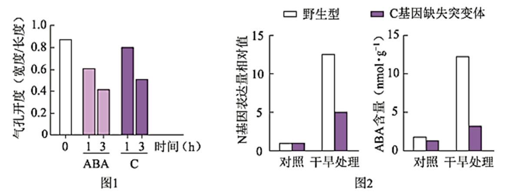

（3）已知N是催化ABA生物合成的关键酶。研究表明C可能通过促进N基因表达，进而促进ABA合成。图2中支持这一结论的证据是，经干旱处理后\_\_\_\_\_\_\_。

（4）实验表明，野生型植物经干旱处理后，C在根中的表达远高于叶片；在根部外施的C可运输到叶片中。因此设想，干旱下根合成C运输到叶片促进N基因的表达。为验证此设想，进行了如下表所示的嫁接实验，干旱处理后，检测接穗叶片中C含量，又检测了其中N基因的表达水平。以接穗与砧木均为野生型的植株经干旱处理后的N基因表达量为参照值，在表中填写假设成立时，与参照值相比N基因表达量的预期结果（用“远低于”、“远高于”、“相近”表示）。①\_\_\_\_；②\_\_\_\_。

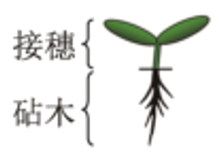

|                         |        |          |          |
|:-----------------------:|:------:|:--------:|:--------:|
|          接穗           | 野生型 |  突变体  |  突变体  |
|          砧木           | 野生型 |  突变体  |  野生型  |
| 接穗叶片中N基因的表达量 | 参照值 | <u>①</u> | <u>②</u> |

注:突变体为C基因缺失突变体

（5）研究者认为C也属于植物激素，作出此判断的依据是\_\_\_\_。这一新发现扩展了人们对植物激素化学本质的认识。

【答案】（1）核糖体 （2）降低气孔开度

（3）C基因缺失突变体中N基因表达量和ABA含量均显著低于野生型

（4） ①. 远低于 ②. 相近

（5）植物根产生的C能够运输到叶片，微量即可调节气孔开度的变化

【解析】

【分析】前体肽是由氨基酸通过脱水缩合形成的。分析图1，使用C或ABA处理拟南芥根部后，叶片气孔开度均下降。分析图2，干旱条件下，C基因缺失突变体中的N基因表达量和ABA含量均显著低于野生型。

【小问1详解】

核糖体是合成蛋白质的城所，因此该前体肽在内质网上的核糖体上合成。

【小问2详解】

分析图1可知，与不使用C或ABA处理的拟南芥相比，使用微量（0.1μmol·L-1）的C或ABA处理拟南芥根部后，叶片气孔开度均降低，而且随着处理时间的延长，气孔开度降低的更显著。

【小问3详解】

根据图2可知，干旱处理条件下，C基因缺失突变体中的N基因表达量和ABA含量均显著低于野生型，可推测C可能通过促进N基因表达，进而促进ABA合成。

【小问4详解】

根据题意可知，野生型植物经干旱处理后，C在根中的表达远高于叶片；在根部外施的C可运输到叶片中。假设干旱下根合成C运输到叶片促进N基因的表达，则野生型因含有C基因，能合成物质C，可促进叶片N基因的表达，而砧木为突变体，因不含C基因，不能产生C，因此①处叶片N基因的表达量远低于野生型的参照值。若砧木为野生型，则根部细胞含有C基因，能表达形成C物质，可运输到叶片促进N基因的表达，因此②处的N基因表达量与野生型的参照值相近。

【小问5详解】

植物激素是植物自身产生的，并对植物起调节作用的微量有机物，根据题意可知，植物根产生的C能够运输到叶片，微量即可调节气孔开度的变化，因此C也属于植物激素。

18\. 番茄果实成熟涉及一系列生理生化过程，导致果实颜色及硬度等发生变化。果实颜色由果皮和果肉颜色决定。为探究番茄果实成熟的机制，科学家进行了相关研究。

（1）果皮颜色由一对等位基因控制。果皮黄色与果皮无色的番茄杂交的F1果皮为黄色，F1自交所得F2果皮颜色及比例为\_\_\_\_\_\_\_。

（2）野生型番茄成熟时果肉为红色。现有两种单基因纯合突变体，甲（基因A突变为a）果肉黄色，乙（基因B突变为b）果肉橙色。用甲、乙进行杂交实验，结果如下图1。据此，写出F2中黄色的基因型：\_\_\_\_\_\_\_。

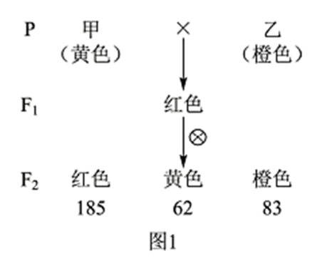

（3）深入研究发现，成熟番茄的果肉由于番茄红素的积累而呈红色，当番茄红素量较少时，果肉呈黄色，而前体物质2积累会使果肉呈橙色，如下图2。上述基因A、B以及另一基因H均编码与果肉颜色相关的酶，但H在果实中的表达量低。根据上述代谢途径，aabb中前体物质2积累、果肉呈橙色的原因是\_\_\_\_\_\_\_。

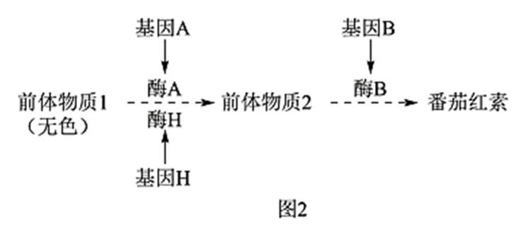

（4）有一果实不能成熟的变异株M，果肉颜色与甲相同，但A并未突变，而调控A表达的C基因转录水平极低。C基因在果实中特异性表达，敲除野生型中的C基因，其表型与M相同。进一步研究发现M中C基因的序列未发生改变，但其甲基化程度一直很高。推测果实成熟与C基因甲基化水平改变有关。欲为此推测提供证据，合理的方案包括\_\_\_\_\_\_\_，并检测C的甲基化水平及表型。

①将果实特异性表达的去甲基化酶基因导入M

②敲除野生型中果实特异性表达的去甲基化酶基因

③将果实特异性表达的甲基化酶基因导入M

④将果实特异性表达的甲基化酶基因导入野生型

【答案】（1）黄色∶无色＝3∶1

（2）aaBB、aaBb

（3）基因A突变为a，但果肉细胞中的基因H仍表达出少量酶H，持续生成前体物质2；基因B突变为b，前体物质2无法转变为番茄红素

（4）①②④

【解析】

【分析】1、基因分离定律实质是：在杂合体的细胞中，位于一对同源染色体的等位基因，具有一定的独立性；在减数分裂形成配子的过程中，等位基因会随同源染色体的分开而分离，分别进入两个配子中，独立的随配子遗传给后代。

2、基因的自由组合定律的实质是：位于非同源染色体上的非等位基因的分离或组合是互不干扰的；在减数分裂过程中，同源染色体上的等位基因彼此分离的同时，非同源染色体上的非等位基因自由组合。

3、甲、乙为两种单基因纯合突变体，甲（基因A突变为a）果肉黄色，乙（基因B突变为b）果肉橙色。由图1可知，F2比值约为为9：3：4，F1基因型为AaBb，红色基因型为A_B\_，黄色为aaB\_，橙色为A_bb、aabb，甲乙基因型分别为aaBB、AAbb。

【小问1详解】

果皮黄色与果皮无色的番茄杂交的F1果皮为黄色，说明黄色是显性性状，F1为杂合子，则F1自交所得F2果皮颜色及比例为黄色∶无色＝3∶1。

【小问2详解】

由图可知，F2比值约为为9：3：4，说明F1基因型为AaBb，则F2中黄色的基因型aaBB、aaBb。

【小问3详解】

由题意和图2可知，成熟番茄的果肉由于番茄红素的积累而呈红色，当番茄红素量较少时，果肉呈黄色，而前体物质2积累会使果肉呈橙色，则存在A或H，不在B基因时，果肉呈橙色。因此，aabb中前体物质2积累、果肉呈橙色的原因是基因A突变为a，但果肉细胞中的基因H仍表达出少量酶H，持续生成前体物质2；基因B突变为b，前体物质2无法转变为番茄红素。

【小问4详解】

C基因表达的产物可以调控A的表达，变异株M中C基因的序列未发生改变，但其甲基化程度一直很高，欲检测C的甲基化水平及表型，可以将果实特异性表达的去甲基化酶基因导入M，使得C去甲基化，并检测C的甲基化水平及表型；或者敲除野生型中果实特异性表达的去甲基化酶基因，检测野生型植株C的甲基化水平及表型，与突变植株进行比较；也可以将果实特异性表达的甲基化酶基因导入野生型，检测野生型C的甲基化水平及表型。而将果实特异性表达的甲基化酶基因导入M无法得到果实成熟与C基因甲基化水平改变有关，故选①②③。

19\. 学习以下材料，回答（1）～（5）题。

蚜虫的适应策略：蚜虫是陆地生态系统中常见的昆虫。春季蚜虫从受精卵开始发育，迁飞到取食宿主上度过夏季，其间行孤雌生殖，经卵胎生产生大量幼蚜；秋季蚜虫迁飞回产卵宿主，行有性生殖，以受精卵越冬。蚜虫周围生活着很多生物，体内还有布氏菌等多种微生物，这些生物之间的关系如下图。

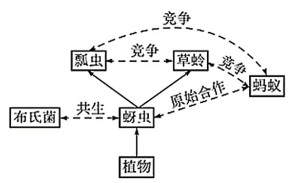

蚜虫以植物为食。植物通过筛管将以糖类为主的光合产物不断运至根、茎等器官。组成筛管的筛管细胞之间通过筛板上的筛孔互通。筛管受损会引起筛管汁液中Ca2+浓度升高，导致筛管中P蛋白从结晶态变为非结晶态而堵塞筛孔，以阻止营养物质外泄。蚜虫取食时，将口器刺入植物组织，寻找到筛管，持续吸食筛管汁液，但刺吸的损伤并不引起筛孔堵塞。体外实验表明，筛管P蛋白在Ca2+浓度低时呈现结晶态，Ca2+浓度提高后P蛋白溶解，加入蚜虫唾液后P蛋白重新结晶。蚜虫仅以筛管汁液为食，其体内的布氏菌从蚜虫获取全部营养元素。筛管汁液的主要营养成分是糖类，所含氮元素极少。这些氮元素绝大部分以氨基酸形式存在，但无法完全满足蚜虫的需求。蚜虫不能合成的氨基酸来源如下表。

|            |        |          |        |        |          |          |        |        |        |
|:----------:|:------:|:--------:|:------:|:------:|:--------:|:--------:|:------:|:------:|:------:|
|   氨基酸   | 组氨酸 | 异亮氨酸 | 亮氨酸 | 赖氨酸 | 甲硫氨酸 | 苯丙氨酸 | 苏氨酸 | 色氨酸 | 缬氨酸 |
|  植物提供  |   ＋   |    －    |   －   |   －   |    －    |    －    |   －   |   \\   |   －   |
| 布氏菌合成 |   －   |    ＋    |   ＋   |   ＋   |    ＋    |    ＋    |   ＋   |   \\   |   ＋   |

注：“－”代表低于蚜虫需求的量，“＋”代表高于蚜虫需求的量，“\\代表难以检出。

蚜虫大量吸食筛管汁液，同时排出大量蜜露。蜜露以糖为主要成分，为蚂蚁等多种生物提供了营养物质。

蚜虫利用这些策略应对各种环境压力，在生态系统中扮演着独特的角色。

（1）蚜虫生活环境中的全部生物共同构成了\_\_\_\_\_\_\_。从生态系统功能角度分析，图中实线单箭头代表了\_\_\_\_\_\_\_的方向。

（2）蚜虫为布氏菌提供其不能合成的氨基酸，而在蚜虫不能合成的氨基酸中，布氏菌来源的氨基酸与从植物中获取的氨基酸\_\_\_\_\_\_\_。

（3）蚜虫能够持续吸食植物筛管汁液，而不引起筛孔堵塞，可能是因为蚜虫唾液中有\_\_\_\_\_\_\_的物质。

（4）从文中可知，蚜虫获取足量氮元素并维持内环境稳态的对策是\_\_\_\_\_\_\_。

（5）从物质与能量以及进化与适应的角度，分析蚜虫在冬季所采取的生殖方式对于种群延续和进化的意义\_\_\_\_\_\_\_。

【答案】（1） ①. 群落 ②. 能量流动

（2）相互补充 （3）抑制Ca2+对P蛋白作用

（4）通过吸食大量的筛管汁液获取氮元素，同时以蜜露形式排出多余的糖分

（5）蚜虫通过有性生殖，以受精卵形式越冬，降低对物质和能量的需求，度过恶劣环境，保持种群延续；借助基因重组，增加遗传多样性，为选择提供原材料。

【解析】

【分析】1、群落是指在相同时间聚集在一定地域中各种生物种群的集合。

2、由图可知，虚线表示群落的种间关系，实线表示能量流动的方向。

3、由表可知，蚜虫不能合成的氨基酸中，布氏菌来源的氨基酸与从植物中获取的氨基酸相互补充。

【小问1详解】

蚜虫生活环境中的全部生物共同构成了群落。由图可知，实线单箭头从植物指向蚜虫，从蚜虫指向瓢虫或草蛉，代表了能量流动的方向。

【小问2详解】

蚜虫为布氏菌提供其不能合成的氨基酸，布氏菌与植物为蚜虫提供蚜虫自身不能合成的氨基酸，蚜虫不能合成的氨基酸中，布氏菌来源的氨基酸与从植物中获取的氨基酸相互补充。

【小问3详解】

由题可知，筛管汁液中Ca2+浓度升高，导致筛管中P蛋白从结晶态变为非结晶态而堵塞筛孔，以阻止营养物质外泄。实验表明，筛管P蛋白在Ca2+浓度低时呈现结晶态，Ca2+浓度提高后P蛋白溶解，加入蚜虫唾液后P蛋白重新结晶，可推测唾液中有抑制Ca2+对P蛋白作用的物质，使蚜虫能够持续吸食植物筛管汁液，而不引起筛孔堵塞。

【小问4详解】

由题可知，筛管汁液的主要营养成分是糖类，所含氮元素极少，蚜虫大量吸食筛管汁液，同时排出大量蜜露，蜜露以糖为主要成分。可推测蚜虫获取足量的氮元素并维持内环境稳态的对策是通过吸食大量的筛管汁液获取氮元素，同时以蜜露形式排出多余的糖分。

【小问5详解】

春季蚜虫从受精卵开始发育，迁飞到取食宿主上度过夏季，其间行孤雌生殖，经卵胎生产生大量幼蚜，秋季蚜虫迁飞回产卵宿主，行有性生殖，以受精卵越冬。蚜虫通过有性生殖，以受精卵形式越冬，以降低对物质和能量的需求，度过恶劣环境，保持种群延续；借助基因重组，增加遗传多样性，为选择提供原材料。

20\. 人体细胞因表面有可被巨噬细胞识别的“自体”标志蛋白C，从而免于被吞噬。某些癌细胞表面存在大量的蛋白C，更易逃脱吞噬作用。研究者以蛋白C为靶点，构建了可感应群体密度而裂解的细菌菌株，拟用于制备治疗癌症的“智能炸弹”。

（1）引起群体感应的信号分子A是一种脂质小分子，通常以\_\_\_\_\_\_\_的方式进出细胞。细胞内外的A随细菌密度的增加而增加，A积累至一定浓度时才与胞内受体结合，调控特定基因表达，表现出细菌的群体响应。

（2）研究者将A分子合成酶基因、A受体基因及可使细菌裂解的L蛋白基因同时转入大肠杆菌，制成AL菌株。培养的AL菌密度变化如图1。其中，AL菌密度骤降的原因是：AL菌密度增加引起A积累至临界浓度并与受体结合，\_\_\_\_\_\_\_。

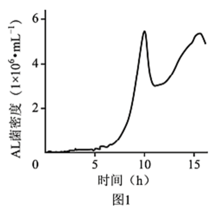

（3）蛋白K能与蛋白C特异性结合并阻断其功能。研究者将K基因转入AL菌，制成ALK菌株，以期用于肿瘤治疗。为验证ALK菌能产生蛋白K，应以\_\_\_\_\_\_\_菌株裂解的上清液为对照进行实验。请从下列选项中选取所需材料与试剂的序号，完善实验组的方案。

实验材料与试剂：①ALK菌裂解的上清液②带荧光标记的K的抗体③带荧光标记的C的抗体④肿瘤细胞

实验步骤：先加入\_\_\_\_\_\_\_保温后漂洗，再加入\_\_\_\_\_\_\_保温后漂洗，检测荧光强度。

（4）研究者向下图2所示小鼠左侧肿瘤内注射ALK菌后，发现ALK菌只存在于该侧瘤内，两周内即观察到双侧肿瘤生长均受到明显抑制。而向瘤内单独注射蛋白K或AL菌，对肿瘤无明显抑制作用。请应用免疫学原理解释“智能炸弹”ALK菌能有效抑制对侧肿瘤生长的原因\_\_\_\_\_\_\_。

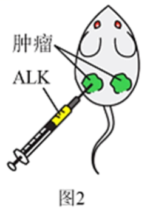

【答案】（1）自由扩散

（2）启动L蛋白表达引起AL菌短时间内大量裂解

（3） ①. AL ②. ①④ ③. ②/③

（4）注入瘤内的ALK菌群体裂解后释放的蛋白K与蛋白C结合，且释放的细菌产物激活巨噬细胞，从而增强了巨噬细胞对肿瘤细胞的吞噬作用，巨噬细胞加工呈递肿瘤抗原，激活细胞免疫，肿瘤细胞被特异性杀伤，因此有效抑制对侧肿瘤生长。

【解析】

【分析】1、免疫系统对病原体的识别：在人体所有细胞膜的表面，有一组作为分子标签来起作用的蛋白质，它们能被自身的免疫细胞所识别。病毒、细菌等病原体也带有各自的身份标签，当它们侵入人体后，能被免疫细胞识别出来。免疫细胞是靠细胞表面的受体来辨认它们的。

2、体液免疫与细胞免疫的关系：B细胞和细胞毒性T细胞的活化离不开辅助性T细胞的辅助；体液免疫中产生的抗体，能消灭细胞外液中的病原体；而消灭侵入细胞内的病原体，要依靠细胞免疫将靶细胞裂解，使病原体失去藏身之所，此时体液免疫又能发挥作用了。

【小问1详解】

引起群体感应的信号分子A是一种脂质小分子，脂溶性的小分子物质通常以自由扩散的方式进出细胞。

【小问2详解】

由图可知，AL菌密度达到相应的值后会骤降，而L蛋白可使细菌裂解。可推测AL菌密度骤降的原因是，AL菌密度增加引起A积累至临界浓度并与受体结合，启动L蛋白表达引起AL菌短时间内大量裂解。

【小问3详解】

AL菌株不含K基因，ALK菌株含K基因，因此，为验证ALK菌能产生蛋白K，应以AL菌株裂解的上清液为对照进行实验。某些癌细胞表面存在大量的蛋白C，蛋白K能与蛋白C特异性结合并阻断其功能，为验证ALK菌能产生蛋白K，可用带荧光标记的K的抗体，如果有K蛋白生成，则K蛋白与K的抗体结合，可发出荧光；由于蛋白K能与蛋白C特异性结合，因此也可用带荧光标记的C的抗体，如果有蛋白K生成，对照组与实验组荧光强度会有差异。具体的实验步骤为，先加入①ALK菌裂解的上清液和④肿瘤细胞，保温后漂洗，再加入②带荧光标记的K的抗体或加入③带荧光标记的C的抗体，保温后漂洗，检测荧光强度。

【小问4详解】

“智能炸弹”ALK菌能有效抑制对侧肿瘤生长是因为注入瘤内的ALK菌群体裂解后释放的蛋白K与蛋白C结合，且释放的细菌产物激活巨噬细胞，从而增强了巨噬细胞对肿瘤细胞的吞噬作用，巨噬细胞加工呈递肿瘤抗原，激活细胞免疫，肿瘤细胞被特异性杀伤，因此有效抑制对侧肿瘤生长。而单独注射蛋白K不能有效激活细胞免疫，单独注射AL菌也无法阻断蛋白C的功能。

21\. 生态文明建设已成为我国的基本国策。水中雌激素类物质（E物质）污染会导致鱼类雌性化等异常，并通过食物链影响人体健康和生态安全。原产南亚的斑马鱼，其肌细胞、生殖细胞等存在E物质受体，且幼体透明。科学家将绿色荧光蛋白（GFP）等基因转入斑马鱼，建立了一种经济且快速的水体E物质监测方法。

（1）将表达载体导入斑马鱼受精卵的最佳方式是\_\_\_\_\_\_\_。

（2）为监测E物质，研究者设计了下图所示的两种方案制备转基因斑马鱼，其中ERE和酵母来源的UAS是两种诱导型启动子，分别被E物质-受体复合物和酵母来源的Gal4蛋白特异性激活，启动下游基因表达。与方案1相比，方案2的主要优势是\_\_\_\_\_\_\_，因而被用于制备监测鱼（MO）。

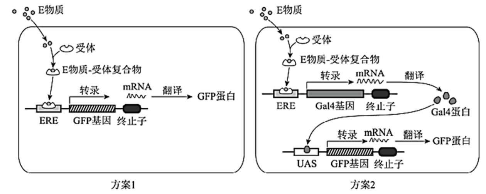

（3）现拟制备一种不育的监测鱼SM，用于实际监测。SM需经MO和另一亲本（X）杂交获得。欲获得X，需从以下选项中选择启动子和基因，构建表达载体并转入野生型斑马鱼受精卵，经培育后进行筛选。请将选项的序号填入相应的方框中。

Ⅰ.启动子：\_\_\_\_。

①ERE②UAS③使基因仅在生殖细胞表达的启动子（P生）④使基因仅在肌细胞表达的启动子（P肌）

Ⅱ.基因：\_\_\_\_\_\_

A．GFP B.Gal4 C.雌激素受体基因（ER） D.仅导致生殖细胞凋亡的基因（dg）

（4）SM不育的原因是：成体SM自身产生雌激素，与受体结合后\_\_\_\_\_\_\_造成不育。

（5）使拟用于实际监测SM不育的目的是\_\_\_\_\_\_\_。

【答案】（1）显微注射

（2）监测灵敏度更高 （3） ①. ② ②. D

（4）激活ERE诱导Gal4表达，Gal4结合UAS诱导dg表达，生殖细胞凋亡

（5）避免转基因斑马鱼逃逸带来生物安全问题

【解析】

【分析】将目的基因导入受体细胞：根据受体细胞不同，导入的方法也不一样。将目的基因导入植物细胞的方法有农杆菌转化法、基因枪法和花粉管通道法；将目的基因导入动物细胞最有效的方法是显微注射法；将目的基因导入微生物细胞的方法是感受态细胞法。

【小问1详解】

将目的基因导入动物细胞最有效的方法是显微注射法，所以将表达载体导入斑马鱼受精卵的最佳方式是显微注射法。

【小问2详解】

由图可知，方案1E物质-受体复合物激活ERE，使GFP基因表达，方案2 E物质-受体复合物先激活ERE获得Gal4蛋白，然后Gal4蛋白激活UAS启动子，使GFP基因表达，方案2GFP蛋白表达量大，更灵敏。

【小问3详解】

MO和另一亲本（X）杂交获得SM，MO是方案2获得，所以亲本X启动子选择UAS。要获得SM是不育个体，MO是可育的所以X必须有仅导致生殖细胞凋亡的基因（dg）。

【小问4详解】

成体SM自身产生雌激素，与受体结合后形成复合物，激活ERE诱导Gal4表达，Gal4与UAS启动子结合诱导dg表达，使生殖细胞凋亡。

【小问5详解】

监测鱼属于转基因生物，目前安全性不确定，为了避免转基因斑马鱼逃逸带来生物安全问题，需要SM不育。
