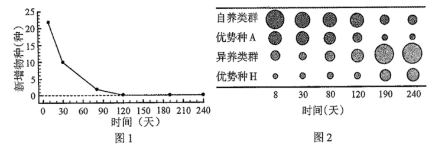
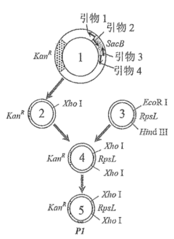
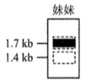

**2022年天津市普通高中学业水平等级性考试**

**生物学**

**一、选择题**

1\. 新冠病毒抗原检测的对象是蛋白质，其基本组成单位是（ ）

A. 氨基酸 B. 核苷酸 C. 单糖 D. 脂肪酸

【答案】A

【解析】

【分析】氨基酸是组成蛋白质的基本单位，构成生物体蛋白质的氨基酸特点：每个氨基酸分子至少有一个氨基（—NH2 ），一个羧基（—COOH ），而且都有一个氨基和一个羧基连接在同一个碳原子上，这个碳原子还连接一个氢原子和一个侧链基团，这个侧链基团用R表示，R基不同，氨基酸不同。

【详解】ABCD、蛋白质是生物大分子，其基本单位是氨基酸，BCD错误，A正确。

故选A。

2\. 下列生理过程的完成不需要两者结合的是（ ）

A. 神经递质作用于突触后膜上的受体

B. 抗体作用于相应的抗原

C. Ca2+载体蛋白运输Ca2+

D. K+通道蛋白运输K+

【答案】D

【解析】

【分析】载体蛋白只容许与自身结合部位相适应的分子或离子通过，而且每次转运时都会发生自身构象的变化；通道蛋白只容许与自身通道的直径和形状相适配、大小和电荷相适宜的分子或离子通过，分子或离子通过通道蛋白时，不需要与通道蛋白结合。

【详解】A、神经递质是由突触前膜释放，与突触后膜上相应受体结合后引起离子通道的打开，A不符合题意；

B、抗原与相应抗体结合后可形成沉淀或者细胞集团，被吞噬细胞消化分解，B不符合题意；

C、Ca2+载体蛋白与Ca2+结合，Ca2+载体蛋白发生自身构象的变化，从而运输Ca2+，C不符合题意；

D、分子或离子通过通道蛋白时，不需要与通道蛋白结合，因此K+通道蛋白运输K+时不需要与K+结合，D符合题意。

故选D。

3\. 下图所示实验方法的应用或原理，不恰当的是（ ）

|                                                                                                                                                                                |            |                  |
|:------------------------------------------------------------------------------------------------------------------------------------------------------------------------------:|:----------:|:----------------:|
| 实验方法                                                                                                                                                                           | 应用         | 原理               |
|  | A．分离绿叶中的色素 | B．不同色素在层析液中溶解度不同 |
|  | C．细菌计数     | D．逐步稀释           |

A. A B. B C. C D. D

【答案】C

【解析】

【分析】平板划线法：将已经熔化的培养基倒入培养皿制成平板，接种，划线，在恒温箱里培养，在线的开始部分，微生物往往连在一起生长，随着线的延伸，菌数逐渐减少，最后可能形成单个菌落。

【详解】AB、图示为分离绿叶中的色素，常用层析法，原理是各色素随层析液在滤纸上扩散速度不同，从而分离色素，溶解度大，扩散速度快;溶解度小，扩散速度慢，AB正确；

CD、图示为平板划线法，是分离微生物一种方法，不能用于细菌计数，是指把混杂在一起的微生物或同一微生物群体中的不同细胞，用接种环在平板表面上作多次由点到线的划线稀释而获得较多独立分布的单个细胞，并让其成长为单菌落的方法，C错误，D正确。

故选C。

4\. 天津市针对甘肃古浪县水资源短缺现状，实施“农业水利现代化与智慧灌溉技术帮扶项目”，通过水肥一体化智慧灌溉和高标准农田建设，助力落实国家“药肥双减”目标，实现乡村全面振兴。项目需遵循一定生态学原理。下列原理有误的是（ ）

A. 人工生态系统具有一定自我调节能力

B. 项目实施可促进生态系统的物质与能量循环

C. 对人类利用强度较大的生态系统，应给予相应的物质投入

D. 根据实际需要，合理使用水肥

【答案】B

【解析】

【分析】提高生态系统稳定性的措施：(1)控制对生态系统的干扰程度。(2)实施相应的物质、能量投入，保证生态系统内部结构与功能的协调关系。

【详解】A、生态系统具有一定的自动调节能力，但这种自动调节能力有一定限度，人工生态系统也具有一定自我调节能力，A正确；

B、能量流动是单向的，逐级递减的，不是循环的，因此不能促进能量的循环，B错误；

C、对人类利用强度较大的生态系统，应实施相应的物质、能量投入，保证生态系统内部结构与功能的协调，C正确；

D、植物不同生长发育时期所需的水和无机盐是不同的，因此要根据实际需要，合理使用水肥，D正确。

故选B。

5\. 小鼠Avy基因控制黄色体毛，该基因上游不同程度的甲基化修饰会导致其表达受不同程度抑制，使小鼠毛色发生可遗传的改变。有关叙述正确的是（ ）

A. Avy基因的碱基序列保持不变

B. 甲基化促进Avy基因的转录

C. 甲基化导致Avy基因编码的蛋白质结构改变

D. 甲基化修饰不可遗传

【答案】A

【解析】

【分析】表观遗传是指DNA序列不发生变化，但基因的表达却发生了可遗传的改变，即基因型未发生变化而表现型却发生了改变，如DNA的甲基化，甲基化的基因不能与RNA聚合酶结合，故无法进行转录产生mRNA，也就无法进行翻译，最终无法合成相应蛋白，从而抑制了基因的表达。

【详解】A、据题意可知，Avy基因上游不同程度的甲基化修饰，但它的碱基序列保持不变，A正确；

B、Avy基因上游不同程度的甲基化修饰会导致其表达受不同程度抑制，基因表达包括转录和翻译，据此推测，应该是甲基化抑制Avy基因的转录，B错误；

C、甲基化导致Avy基因不能完成转录，对已表达的蛋白质的结构没有影响，C错误；

D、据题意可知，甲基化修饰使小鼠毛色发生可遗传的改变，即可以遗传，D错误。

故选A。

6\. 用荧光标记技术显示细胞中心体和DNA，获得有丝分裂某时期荧光图。有关叙述正确的是（ ）

A. 中心体复制和染色体加倍均发生在图示时期

B 图中两处DNA荧光标记区域均无同源染色体

C. 图中细胞分裂方向由中心体位置确定

D. 秋水仙素可促使细胞进入图示分裂时期

【答案】C

【解析】

【分析】有丝分裂包括间期和分裂期两个时期。间期主要进行DNA的复制和蛋白质的合成，分裂期包括前期、中期、后期和末期。

【详解】A、该图为有丝分裂某时期荧光图，中心体的复制发生在间期，有丝分裂过程中染色体加倍发生在后期，A错误；

B、由于该图为有丝分裂某时期荧光图，在有丝分裂过程没有同源染色体联会，但是存在同源染色体，B错误；

C、中心体的位置决定了染色体移动的方向，将分裂开的子染色体拉向两极，从而决定细胞分裂的方向，C正确；

D、秋水仙素能够抑制纺锤体的形成，而纺锤体的形成是在分裂期，D错误。

故选C。

7\. 蝙蝠是现存携带病毒较多的夜行性哺乳动物，这与其高体温（40℃）和强大的基因修复功能有关。关于蝙蝠与其携带的病毒，下列叙述错误的是（ ）

A. 高温利于提高病毒对蝙蝠的致病性

B. 病毒有潜在破坏蝙蝠基因的能力

C. 病毒与蝙蝠之间存在寄生关系

D. 病毒与蝙蝠协同进化

【答案】A

【解析】

【分析】病毒主要由核酸和蛋白质组成。协同进化是指不同物种之间，生物与无机环境之间在相互影响中不断进化和发展。

【详解】A、病毒的主要成分是蛋白质和核酸，高温下蛋白质变性，故高温下病毒可能被杀死，不能对蝙蝠造成致病性，A错误；

B、病毒的核酸可以整合到染色体的基因上，故病毒有潜在破坏蝙蝠基因的能力，B正确；

C、病毒是寄生在活细胞内的，不能单独生存，蝙蝠体内的病毒寄生在蝙蝠的活细胞内，C正确；

D、病毒寄生在蝙蝠体内，若蝙蝠体内发生变化，病毒要想在其体内生存，就得适应蝙蝠的变化，同样蝙蝠要想存活下来，也会随着病毒的变化而变化，所以病毒与蝙蝠存在协同进化，D正确。

故选A。

8\. 日常生活中有许多说法，下列说法有科学依据的是（ ）

A. 食用含有植物生长素的水果，植物生长素会促进儿童性腺过早发育

B. 酸奶胀袋是乳酸菌发酵产生CO2造成的

C. 食用没有甜味的面食，不会引起餐后血糖升高

D. 接种疫苗预防相应传染病，是以减毒或无毒病原体抗原激活特异性免疫

【答案】D

【解析】

【分析】注射疫苗，引起人体的免疫反应，在体内产生抗体和记忆细胞，进而获得了对该抗原的抵抗能力，因为记忆细胞能存活时间长，所以人可以保持较长时间的免疫力。

【详解】A、激素与靶细胞表面的受体相结合，这种结合具有特异性，生长素是植物激素，在动物细胞表面没有相应的受体，因此不能促进儿童过早的发育，A错误；

B、乳酸菌是严格的厌氧菌，无氧呼吸的产物是乳酸，不产生气体，因此酸奶胀袋不是乳酸菌发酵产生CO2造成的，B错误；

C、面食的成分只要是淀粉， 淀粉也是糖类，经过消化形成葡萄糖被人体吸收，因此食用没有甜味的面食，也会引起餐后血糖升高，C错误；

D、疫苗属于抗原，是以减毒或无毒的病原体抗原制成的，因此接种疫苗预防相应传染病，是以减毒或无毒的病原体抗原激活特异性免疫，D正确。

故选D。

9\. 染色体架起了基因和性状之间的桥梁。有关叙述正确的是（ ）

A. 性状都是由染色体上的基因控制的

B. 相对性状分离是由同源染色体上的等位基因分离导致的

C. 不同性状自由组合是由同源染色体上的非等位基因自由组合导致的

D. 可遗传的性状改变都是由染色体上的基因突变导致的

【答案】B

【解析】

【分析】自由组合定律的实质是进行有性生殖的生物在进行减数分裂产生配子的过程中，非同源染色体上的非等位基因的分离或组合是互不干扰的，位于同源染色体的等位基因随同源染色体分离而分离，分别进入不同的配子中，随配子独立遗传给后代，同时位于非同源染色体的非等位基因进行自由组合。

【详解】A、细胞质基质中的基因也可以影响性状，性状不都是由染色体上的基因控制的，A错误；

B、等位基因控制相对性状，等位基因位于同源染色体上，同源染色体上等位基因的分离会导致相对性状的分离，B 正确；

C、不同性状自由组合是由非同源染色体的非等位基因进行自由组合导致的，C错误；

D、可遗传的性状改变可能是由染色体上的基因突变导致的，也可能是基因重组或者染色体变异引起的，D错误。

故选B。

阅读下列材料，完成下面小题。

动脉血压是指血液对动脉管壁产生的压力。人体动脉血压有多种调节方式，如：当动脉血压升高时，会刺激血管壁内的压力感受器兴奋，神经冲动传入中枢神经系统后，通过交感神经和副交感神经调节心脏、血管活动及肾上腺髓质所分泌的激素水平，最终血压回降。

动脉血压高于正常值即形成高血压。高血压病的发病机制复杂，可能包括：

（1）水钠潴留

水钠潴留指水和钠滞留于内环境。长期摄入过量的钠使机体对水钠平衡的调节作用减弱，可导致水钠潴留。慢性肾功能不全的患者水钠排出减少，重吸收增加，也会引起水钠潴留。

（2）肾素—血管紧张素—醛固酮系统（RAAS）过度激活

RAAS是人体重要的体液调节系统。肾素可催化血管紧张素原生成血管紧张素Ⅰ，血管紧张素Ⅰ在血管紧张素转换酶的作用下生成血管紧张素Ⅱ。血管紧张素Ⅱ具有多种生理效应，最主要的是使血管收缩导致血压升高，此外还可刺激醛固酮分泌。醛固酮可促进钠的重吸收。

（3）交感神经系统活性增强

肾交感神经活性增强既可促使肾素释放，激活RAAS，又可减弱肾排钠能力。此外，交感神经还可激活肾脏T细胞，导致肾脏损伤、肾功能不全。

10\. 下列关于压力感受及动脉血压的说法，错误的是（ ）

A. 感受器可将压力信号转化为电信号

B. 传出神经属于自主神经系统

C. 调节过程不存在体液调节

D. 调节机制为负反馈调节

11\. 下列哪种因素不会导致水钠潴留（ ）

A. 长期摄入过量钠 B. 血管紧张素Ⅱ引起的血管收缩

C. 醛固酮过度分泌 D. 肾功能不全、排钠能力下降

12\. 下列哪项药物或疗法在高血压病的治疗中是不合理的（ ）

A. 抗利尿激素 B. 血管紧张素转换酶抑制剂

C. 醛固酮受体抑制剂 D. 降低肾交感神经兴奋性的疗法

【答案】10. C 11. B 12. A

【解析】

【分析】由题意可知，引起高血压的原因主要是由于长期摄入过量的钠使机体对水钠平衡的调节作用减弱和钠的过度吸收引起水钠潴留，肾素—血管紧张素—醛固酮系统（RAAS）过度激活以及交感神经系统活性增强，减弱肾排钠功能减弱引起的。

【10题详解】

A、感受器接受压力刺激后，可将压力信号转化为电信号，从而产生兴奋，A正确；

B、调节血压的神经为交感神经和副交感神经，均为自主神经，B正确；

C、由题意可知，如肾素—血管紧张素—醛固酮系统（RAAS）过度激活引起的血压上升属于激素调节，C错误；

D、血压能在某个特定值保持相对稳定，是负反馈调节的结果，D正确。

故选C。

【11题详解】

A、长期摄入过量的钠使机体对水钠平衡的调节作用减弱，可导致水钠潴留，A错误；

B、肾素—血管紧张素—醛固酮系统（RAAS）过度激活，血管紧张素Ⅱ引起的血管收缩，引起血压升高，不会引起水钠潴留，B正确；

C、醛固酮可促进钠的重吸收，若分泌过度会导致钠重吸收增加，也会引起水钠潴留，C错误；

D、慢性肾功能不全的患者水钠排出减少，重吸收增加，会引起水钠潴留，D正确。

故选B。

【12题详解】

A、水钠潴留指水和钠滞留于内环境，从而引起高血压，抗利尿激素具有促进肾小管和集合管对水进行重吸收功能，从而加重了水钠潴留，A错误；

B、血管紧张素转换酶抑制剂可抑制血管紧张素的形成，从而抑制了肾素—血管紧张素—醛固酮系统（RAAS）过度激活，可对高血压进行治疗，B正确；

C、醛固酮受体抑制剂可抑制醛固酮发挥作用，对钠进行重新收，减缓水钠潴留，可对高血压进行治疗，C正确；

D、降低肾交感神经兴奋性可加强肾排钠能力，减轻肾脏T细胞对肾脏的损伤，可对高血压进行治疗，D正确。

故选A。

13\. 为研究河流中石块上微生物群落的演替，将灭菌后的裸石置于河流中，统计裸石上不同时间新增物种数木（图1）、自养类群和异养类群的个体数量（A和H分别代表自养和异养类群的优势种）（图2）。

（1）裸石上发生的群落演替类型为\_\_\_\_\_\_\_\_\_\_\_\_\_\_\_\_\_\_\_\_。

（2）由图1可知，演替的前120天，生长在裸石上的物种总数\_\_\_\_\_\_\_\_\_\_（增加∕减少），之后，演替趋于稳定。

（3）由图2可知，演替稳定后，优势种A的环境容纳量与演替初期相比\_\_\_\_\_\_\_\_\_\_（变大∕变小）。

（4）已知自养类群为异养类群提供有机碳，演替达到稳定后，两者的数量金字塔是\_\_\_\_\_（正∕倒）金字塔形，能量金字塔是\_\_\_\_\_（正∕倒）金字塔形。

（5）当试验裸石上的演替稳定后，其群落结构应与周围类似石块上已稳定存在的群落结构相似，原因是两者所处的\_\_\_\_\_\_\_\_\_\_\_\_\_\_\_相似。

【答案】（1）初生演替

（2）增加 （3）变小

（4） ①. 倒 ②. 正

（5）环境条件

【解析】

【分析】群落演替是指随着时间的推移，一个群落被另一个群落代替的过程。其主要类型有初生演替和次生演替；初生演替是指一个从来没有被植物覆盖的地面，或者是原来存在过植被，但是被彻底消灭了的地方发生的演替；次生演替原来有的植被虽然已经不存在，但是原来有的土壤基本保留，甚至还保留有植物的种子和其他繁殖体的地方发生的演替。

【小问1详解】

群落演替的类型有初生演替和次生演替，裸石上没有土壤条件，发生的群落演替类型为初生演替，初生演替的大致阶段：裸岩阶段→地衣阶段→苔藓阶段→草本植物阶段→灌木阶段→森林阶段。

【小问2详解】

由图1可知，演替的前120天，随着演替时间增加，新增物种数目减少，也就是增加速率减慢，但还是在增加，到120天时，新增物种数为0，即不再增加，因此演替的前120天，生长在裸石上的物种总数增加，之后，演替趋于稳定。

【小问3详解】

由图1可知，120天后，新增物种数为0，群落演替达到稳定，由图2可知，与120天前优势种A的圆圈面积相比，120天后的优势种A圆圈面积较小，因此演替稳定后，优势种A的环境容纳量与演替初期相比变小。

【小问4详解】

由图2可知，120天后，异养类群圆圈面积较自养类群圆圈面积大，即数量可能较多，自养类群为异养类群提供有机碳，据此推测演替达到稳定后，两者的数量金字塔是倒金字塔。由于能量在流动过程中总是逐级递减，因此能量金字塔通常都是金字塔形，自养类群为异养类群提供有机碳，因此能量金字塔是正金字塔形。

【小问5详解】

群落演替的根本原因是内外环境条件的变化使得群落基因库的改变，当试验裸石上的演替稳定后，其群落结构应与周围类似石块上已稳定存在的群落结构相似，原因是两者所处的环境条件相似。

14\. 为研究高脂饮食与肠道菌群及糖脂代谢的关系，进行如下试验：

（1）建立糖脂代谢紊乱大鼠模型

将20只大鼠随机平分为2组，分别饲喂高脂饲料（HFD组）和普通饲料（ND组）16周。

①检测空腹血相关生理指标，结果如下表。

|      |              |              |            |             |
|:----:|:------------:|:------------:|:----------:|:-----------:|
| 组别   | 总胆固醇（mmol∕L） | 甘油三酯（mmol∕L） | 血糖（mmol∕L） | 胰岛素（mmol∕L） |
| ND组  | 1.56         | 0.63         | 5.58       | 10.02       |
| HFD组 | 2.59         | 1.65         | 7.28       | 15.11       |

与ND组相比，HFD组\_\_\_\_\_\_\_\_\_\_\_\_\_\_\_\_\_\_\_\_偏高，说明脂代谢紊乱，其他数据说明糖代谢紊乱，提示造模成功。

②检测粪便中4种典型细菌的含量，结果如下图。

HFD组粪便中乳杆菌、双歧杆菌相对含量\_\_\_\_\_\_\_\_\_\_（增加∕减少）。

（2）探究肠道菌群对糖脂代谢的影响另取20只大鼠，喂以含\_\_\_\_\_\_\_\_\_\_\_\_\_\_\_的饮用水杀灭肠道中原有细菌，建立肠道无菌大鼠模型。分别收集（1）试验结束时HFD组和ND组粪便，制备成粪菌液，分别移植到无菌大鼠体内，建立移植HFD肠菌组和移植ND肠菌组，均饲喂高脂饲料8周。检测空腹血相关生理指标，结果如下表。

|          |              |              |            |             |
|:--------:|:------------:|:------------:|:----------:|:-----------:|
| 组别       | 总胆固醇（mmol∕L） | 甘油三酯（mmol∕L） | 血糖（mmol∕L） | 胰岛素（mmol∕L） |
| 移植ND肠菌组  | 1.86         | 0.96         | 6.48       | 11.54       |
| 移植HFD肠菌组 | 2.21         | 1.28         | 6.94       | 13.68       |

该试验的自变量为\_\_\_\_\_\_\_\_\_\_\_\_\_\_\_，结果显示两组均发生糖脂代谢紊乱，组间差异说明高脂饮食大鼠的肠道菌群可\_\_\_\_\_\_\_\_\_\_（加剧∕缓解）高脂饮食条件下的糖脂代谢紊乱。

（3）基于本研究的结果，为了缓解糖脂代谢紊乱，请说明可以采取的策略。\_\_\_\_\_\_\_\_\_\_\_\_\_\_\_\_\_\_\_\_\_\_\_\_\_。

【答案】（1） ①. 总胆固醇、甘油三酯 ②. 减少

（2） ①. 抗生素 ②. 移植的肠道菌群 ③. 加剧

（3）避免高脂饮食或者设法增加肠道乳杆菌、双歧杆菌含量

【解析】

【分析】脂质分为脂肪、磷脂和固醇，固醇包括胆固醇、性激素和维生素D，与糖类相比，脂肪分子中的氢含量多，氧含量少，氧化分解时产生的能量多，因此是良好的储能物质，磷脂双分子层构成生物膜的基本骨架，固醇中的胆固醇是动物细胞膜的重要组成成分，也参与脂质在血液中的运输。

【小问1详解】

①脂质包括磷脂、脂肪和固醇类，固醇类包括胆固醇、性激素和维生素D，总胆固醇和甘油三酯都属于脂类，与ND组相比，HFD组总胆固醇、甘油三酯偏高，说明脂代谢紊乱。

②据图可知，与ND组相比，HFD组粪便中乳杆菌、双歧杆菌相对含量减少，大肠杆菌和肠球菌相对含量增加。

【小问2详解】

抗生素主要是通过干扰病原微生物的生理功能及生化代谢而产生抗菌作用，因此要想建立肠道无菌大鼠模型，需喂以含抗生素的饮用水杀灭肠道中原有细菌。据题意可知，本实验是探究肠道菌群对糖脂代谢的影响，自变量为移植的肠道菌群（移植ND肠菌组和移植HFD肠菌组），因变量为总胆固醇、甘油三酯、血糖、胰岛素的含量，据表格可知，与移植ND肠菌组相比，移植HFD肠菌组中总胆固醇、甘油三酯、血糖、胰岛素的含量均较高，说明高脂饮食大鼠的肠道菌群可加剧高脂饮食条件下的糖脂代谢紊乱。

【小问3详解】

据题意可知，高脂饮食大鼠的肠道菌群可加剧高脂饮食条件下的糖脂代谢紊乱，高脂饮食大鼠的肠道菌群中乳杆菌、双歧杆菌相对含量减少，因此可以通过避免高脂饮食或者设法增加肠道乳杆菌、双歧杆菌含量来缓解糖脂代谢紊乱。

15\. 研究者拟构建高效筛选系统，将改进的苯丙氨酸合成关键酶基因P1导入谷氨酸棒杆菌，以提高苯丙氨酸产量。

（1）如图是该高效筛选系统载体的构建过程。载体1中含有KanR（卡那霉素抗性基因）和SacB两个标记基因，为去除筛选效率较低的SacB，应选择引物\_\_\_\_\_\_\_\_和\_\_\_\_\_\_\_\_，并在引物的\_\_\_\_\_\_\_\_（5＇∕3＇）端引入XhoⅠ酶识别序列，进行PCR扩增，产物经酶切、连接后环化成载体2。

（2）PCR扩增载体3中筛选效率较高的标记基因RpsL（链霉素敏感基因）时，引物应包含\_\_\_\_\_\_\_\_\_\_\_（EcoRⅠ∕HindⅢ∕XhoⅠ）酶识别序列，产物经单酶切后连接到载体2构建高效筛选载体4。

（3）将改进的P1基因整合到载体4构建载体5。将载体5导入链霉素不敏感（由RpsL突变造成）、卡那霉素敏感的受体菌。为获得成功导入载体5的菌株，应采用含有\_\_\_\_\_\_\_\_\_\_的平板进行初步筛选。

（4）用一定的方法筛选出如下菌株：P1基因脱离载体5并整合到受体菌拟核DNA，且载体5上其他DNA片段全部丢失。该菌的表型为\_\_\_\_\_\_\_\_\_\_。

A. 卡那霉素不敏感、链霉素敏感

B. 卡那霉素敏感、链霉素不敏感

C. 卡那霉素和链霉素都敏感

D. 卡那霉素和链霉素都不敏感

（5）可采用\_\_\_\_\_\_\_\_\_\_技术鉴定成功整合P1基因的菌株。之后以发酵法检测苯丙氨酸产量。

【答案】（1） ①. 1 ②. 4 ③. 5＇

（2）XhoⅠ （3）卡那霉素 （4）B

（5）PCR

【解析】

【分析】PCR反应过程:变性→复性→延伸。变性：当温度上升到90℃以上时，双链DNA解聚为单链，复性：温度下降到50℃左右，两种引物通过碱基互补配对与两条单链DNA结合，延伸：72℃左右时，Taq酶有最大活性，可使DNA新链由5'端向3'端延伸。

【小问1详解】

据图可知，根据引物箭头方向可知，要想复制KanR（卡那霉素抗性基因），需要引物1和4，因此为去除筛选效率较低的SacB，应选择引物1和4。PCR时，在引物作用下，DNA聚合酶从引物3'端开始延伸DNA链，即DNA的合成方向是从子链的5'端自3'端延伸的，因此在引物的5'端引入XhoⅠ酶识别序列。

【小问2详解】

据图可知，载体4中RpsL（链霉素敏感基因）的两侧具有XhoⅠ酶识别序列，载体3中不含XhoⅠ酶识别序列，如果将载体2和载体3连接形成高效筛选载体4时，需要的引物应该含有XhoⅠ酶识别序列。

【小问3详解】

基因表达载体中的标记基因，有利于目的基因的初步检测，据题意可知，载体5中含有RpsL（链霉素敏感基因）和KanR（卡那霉素抗性基因），将载体5导入链霉素不敏感（由RpsL突变造成）、卡那霉素敏感的受体菌。为获得成功导入载体5的菌株，应采用含有卡那霉素的平板进行初步筛选。

小问4详解】

据题意可知，载体5导入的时链霉素不敏感（由RpsL突变造成）、卡那霉素敏感的受体菌，受体菌中P1基因脱离载体5并整合到受体菌拟核DNA，且载体5上其他DNA片段全部丢失，因此该菌的表型为卡那霉素敏感、链霉素不敏感，B正确，ACD错误。

故选B。

【小问5详解】

通过PCR技术可以检测目的基因是否插入受体细胞的染色体DNA中或目的基因是否转录出了mRNA，因此可采用PCR技术鉴定成功整合P1基因的菌株。

16\. 利用蓝细菌将CO2转化为工业原料，有助于实现“双碳”目标。

（1）蓝细菌是原核生物，细胞质中同时含有ATP、NADPH、NADH（呼吸过程中产生的\[H\]）和丙酮酸等中间代谢物。ATP来源于\_\_\_\_\_\_\_\_\_\_和\_\_\_\_\_\_\_\_\_\_等生理过程，为各项生命活动提供能量。

（2）蓝细菌可通过D—乳酸脱氢酶（Ldh），利用NADH将丙酮酸还原为D—乳酸这种重要的工业原料。研究者构建了大量表达外源Ldh基因的工程蓝细菌，以期提高D—乳酸产量，但结果并不理想。分析发现，

是由于细胞质中的NADH被大量用于\_\_\_\_\_\_\_\_\_\_\_\_\_\_\_作用产生ATP，无法为Ldh提供充足的NADH。

（3）蓝细菌还存在一种只产生ATP不参与水光解的光合作用途径。研究者构建了该途径被强化的工程菌K，以补充ATP产量，使更多NADH用于生成D—乳酸。测定初始蓝细菌、工程菌K中细胞质ATP、NADH和NADPH含量，结果如下表。

注：数据单位为pmol∕OD730

|       |     |      |       |
|:-----:|:---:|:----:|:-----:|
| 菌株    | ATP | NADH | NADPH |
| 初始蓝细菌 | 626 | 32   | 49    |
| 工程菌K  | 829 | 62   | 49    |

由表可知，与初始蓝细菌相比，工程菌K的ATP含量升高，且有氧呼吸第三阶段\_\_\_\_\_\_\_\_\_\_（被抑制∕被促进∕不受影响），光反应中的水光解\_\_\_\_\_\_\_\_\_\_（被抑制∕被促进∕不受影响）。

（4）研究人员进一步把Ldh基因引入工程菌K中，构建工程菌L。与初始蓝细菌相比，工程菌L能积累更多D—乳酸，是因为其\_\_\_\_\_\_\_\_\_\_（双选）。

A. 光合作用产生了更多ATP B. 光合作用产生了更多NADPH

C. 有氧呼吸第三阶段产生了更多ATP D. 有氧呼吸第三阶段节省了更多NADH

【答案】（1） ①. 光合作用 ②. 呼吸作用

（2）有氧呼吸 （3） ①. 被抑制 ②. 不受影响 （4）AD

【解析】

【分析】有氧呼吸的第一、二、三阶段的场所依次是细胞质基质、线粒体基质和线粒体内膜。有氧呼吸第一阶段是葡萄糖分解成丙酮酸和\[H\]，合成少量ATP；第二阶段是丙酮酸和水反应生成二氧化碳和\[H\]，合成少量ATP；第三阶段是氧气和\[H\]反应生成水，合成大量ATP。

【小问1详解】

蓝细菌是原核生物，但含有叶绿素和藻蓝素，能进行光合作用，能产生NADH（呼吸过程中产生的\[H\]）和丙酮酸等中间代谢物，也能进行呼吸作用，因此蓝细菌内的ATP来源于光合作用和呼吸作用等生理过程，为各项生命活动提供能量。

【小问2详解】

有氧呼吸第三阶段是前两个阶段产生的NADH（呼吸过程中产生的\[H\]）与氧气结合形成水，同时释放大量能量，因此蓝细菌中细胞质中的NADH可被大量用于有氧呼吸第三阶段产生ATP，无法为Ldh提供充足的NADH。

【小问3详解】

NADH是有氧呼吸过程中的代谢产物，在有氧呼吸第三阶段被利用，NADPH是光合作用过程中的代谢产物，是水光解的产物，据表格可知，与初始蓝细菌相比，工程菌K的NADH较高，NADPH相同，说明有氧呼吸第三阶段被抑制，光反应中的水光解不受影响。

【小问4详解】

工程菌K存在一种只产生ATP不参与水光解的光合作用途径，能使更多NADH用于生成D—乳酸，把Ldh基因引入工程菌K中，构建工程菌L，光合作用产生了更多ATP，为各项生命活动提供能量，这样有氧呼吸第三阶段节省了更多NADH，这样工程菌L就能利用NADH将丙酮酸还原为D—乳酸，能积累更多D—乳酸，AD正确，BC错误。

故选AD。

17\. α地中海贫血是一种常染色体遗传病，可由α2珠蛋白基因变异导致，常见变异类型有基因缺失型和碱基替换突变型。现发现一例患者，疑似携带罕见α2基因变异，对其家系α2基因进行分析。

①检测碱基替换突变，发现祖母不携带碱基替换突变；母亲的α2基因仅含一个单碱基替换突变，该变异基因可记录为“αW”。

②检测有无α2基因缺失，电泳结果如下图。

注：1．7kb条带表示有α2基因，1．4kb条带表示无α2基因

（1）将缺失型变异记录为“—”，正常α2基因记录为“α”，则祖母的基因型可记录为“—∕α”。仿此，母亲的基因型可记录为\_\_\_\_\_\_\_\_\_\_\_\_\_\_\_。

（2）经鉴定，患者确携带一罕见α2基因变异，将该变异基因记录为“αX”，则其基因型可记录为“—∕αX”。αX属于\_\_\_\_\_\_\_\_\_\_（缺失型∕非缺失型）变异。

（3）患者有一妹妹，经鉴定，基因型为“αX∕αW”，请在上图虚线框中画出其在基因缺失型变异检测中的电泳图谱\_\_\_\_\_\_\_\_\_\_。

（4）患者还有一哥哥，未进行基因检测。他与基因型为“—∕αW”的女性结婚，生育一孩，理论上该孩基因型为“—∕αW”的概率为\_\_\_\_\_\_\_\_\_\_。

【答案】（1）—∕αW（或αW∕—）

（2）非缺失型 （3）

（4）3/8

【解析】

【分析】1、分离定律的实质：等位基因随同源染色体的分开而分离。作用时间：有性生殖形成配子时(减数第一次分裂的后期)。适用范围：①进行有性生殖的真核生物；②细胞核内染色体上的基因；③一对等位基因控制的一对相对性状的遗传。

2、基因突变包括碱基对的增添、缺失、替换。

【小问1详解】

由遗传图谱可知，祖母含有1.7kb表明有α2基因，还有1.4kb的条带，表明无α2基因，则为缺失型变异，记为—/α，而母亲也含有1.7kb和1.4kb，但是母亲含有一个单碱基替换突变，所以基因型记录为—∕αW（或αW∕—）。

【小问2详解】

正常基因标记为α，如果缺失α2基因，则为—，所以αX属于碱基替换突变，而非缺失变异，所以属于非缺失型变异。

【小问3详解】

由于妹妹基因型为αX∕αW，则证明有两个α2基因，所以没有缺失型变异，有α2基因则只有1.7kb的条带，没有1.4kb的条带，如下图所示。

【小问4详解】

患者基因型为—∕αX，妹妹基基因型为αX∕αW，父亲有1.4kb的条带，则夫亲基因型为—∕αX，母亲基因型已知，为—∕αW，那么哥哥可能的基因型及比例为—∕—：—∕αX：—∕αW：αX∕αW=1:1:1:1，则配子比例为：—：αX：αW=2:1:1，若与—∕αW的女性婚配，则该女性产生的配子比例为—：αW=1:1，那么二者产生—∕αW的概率为
