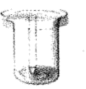
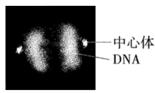
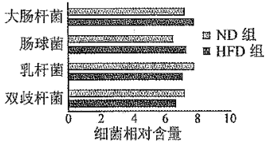
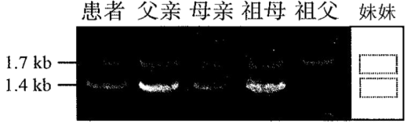

**2022年天津市普通高中学业水平等级性考试**

**生物学**

**一、选择题**

1\. 新冠病毒抗原检测的对象是蛋白质，其基本组成单位是（ ）

A 氨基酸 B. 核苷酸 C. 单糖 D. 脂肪酸

2\. 下列生理过程的完成不需要两者结合的是（ ）

A. 神经递质作用于突触后膜上的受体

B. 抗体作用于相应的抗原

C. Ca2+载体蛋白运输Ca2+

D. K+通道蛋白运输K+

3\. 下图所示实验方法的应用或原理，不恰当的是（ ）

|                                                                                                                                                                                |            |                  |
|:------------------------------------------------------------------------------------------------------------------------------------------------------------------------------:|:----------:|:----------------:|
| 实验方法                                                                                                                                                                           | 应用         | 原理               |
|  | A．分离绿叶中的色素 | B．不同色素在层析液中溶解度不同 |
|  | C．细菌计数     | D．逐步稀释           |

A. A B. B C. C D. D

4\. 天津市针对甘肃古浪县水资源短缺现状，实施“农业水利现代化与智慧灌溉技术帮扶项目”，通过水肥一体化智慧灌溉和高标准农田建设，助力落实国家“药肥双减”目标，实现乡村全面振兴。项目需遵循一定生态学原理。下列原理有误的是（ ）

A. 人工生态系统具有一定自我调节能力

B. 项目实施可促进生态系统的物质与能量循环

C. 对人类利用强度较大的生态系统，应给予相应的物质投入

D. 根据实际需要，合理使用水肥

5\. 小鼠Avy基因控制黄色体毛，该基因上游不同程度的甲基化修饰会导致其表达受不同程度抑制，使小鼠毛色发生可遗传的改变。有关叙述正确的是（ ）

A. Avy基因的碱基序列保持不变

B. 甲基化促进Avy基因的转录

C. 甲基化导致Avy基因编码的蛋白质结构改变

D. 甲基化修饰不可遗传

6\. 用荧光标记技术显示细胞中心体和DNA，获得有丝分裂某时期荧光图。有关叙述正确的是（ ）

A. 中心体复制和染色体加倍均发生在图示时期

B. 图中两处DNA荧光标记区域均无同源染色体

C. 图中细胞分裂方向由中心体位置确定

D 秋水仙素可促使细胞进入图示分裂时期

7\. 蝙蝠是现存携带病毒较多的夜行性哺乳动物，这与其高体温（40℃）和强大的基因修复功能有关。关于蝙蝠与其携带的病毒，下列叙述错误的是（ ）

A. 高温利于提高病毒对蝙蝠的致病性

B. 病毒有潜在破坏蝙蝠基因的能力

C. 病毒与蝙蝠之间存在寄生关系

D. 病毒与蝙蝠协同进化

8\. 日常生活中有许多说法，下列说法有科学依据的是（ ）

A. 食用含有植物生长素的水果，植物生长素会促进儿童性腺过早发育

B. 酸奶胀袋是乳酸菌发酵产生CO2造成的

C. 食用没有甜味的面食，不会引起餐后血糖升高

D. 接种疫苗预防相应传染病，是以减毒或无毒的病原体抗原激活特异性免疫

9\. 染色体架起了基因和性状之间的桥梁。有关叙述正确的是（ ）

A. 性状都是由染色体上的基因控制的

B. 相对性状分离是由同源染色体上的等位基因分离导致的

C. 不同性状自由组合是由同源染色体上的非等位基因自由组合导致的

D. 可遗传性状改变都是由染色体上的基因突变导致的

阅读下列材料，完成下面小题。

动脉血压是指血液对动脉管壁产生压力。人体动脉血压有多种调节方式，如：当动脉血压升高时，会刺激血管壁内的压力感受器兴奋，神经冲动传入中枢神经系统后，通过交感神经和副交感神经调节心脏、血管活动及肾上腺髓质所分泌的激素水平，最终血压回降。

动脉血压高于正常值即形成高血压。高血压病的发病机制复杂，可能包括：

（1）水钠潴留

水钠潴留指水和钠滞留于内环境。长期摄入过量的钠使机体对水钠平衡的调节作用减弱，可导致水钠潴留。慢性肾功能不全的患者水钠排出减少，重吸收增加，也会引起水钠潴留。

（2）肾素—血管紧张素—醛固酮系统（RAAS）过度激活

RAAS是人体重要的体液调节系统。肾素可催化血管紧张素原生成血管紧张素Ⅰ，血管紧张素Ⅰ在血管紧张素转换酶的作用下生成血管紧张素Ⅱ。血管紧张素Ⅱ具有多种生理效应，最主要的是使血管收缩导致血压升高，此外还可刺激醛固酮分泌。醛固酮可促进钠的重吸收。

（3）交感神经系统活性增强

肾交感神经活性增强既可促使肾素释放，激活RAAS，又可减弱肾排钠能力。此外，交感神经还可激活肾脏T细胞，导致肾脏损伤、肾功能不全。

10\. 下列关于压力感受及动脉血压的说法，错误的是（ ）

A. 感受器可将压力信号转化为电信号

B. 传出神经属于自主神经系统

C. 调节过程不存在体液调节

D. 调节机制负反馈调节

11\. 下列哪种因素不会导致水钠潴留（ ）

A. 长期摄入过量钠 B. 血管紧张素Ⅱ引起的血管收缩

C. 醛固酮过度分泌 D. 肾功能不全、排钠能力下降

12\. 下列哪项药物或疗法在高血压病的治疗中是不合理的（ ）

A. 抗利尿激素 B. 血管紧张素转换酶抑制剂

C. 醛固酮受体抑制剂 D. 降低肾交感神经兴奋性的疗法

13\. 为研究河流中石块上微生物群落的演替，将灭菌后的裸石置于河流中，统计裸石上不同时间新增物种数木（图1）、自养类群和异养类群的个体数量（A和H分别代表自养和异养类群的优势种）（图2）。

（1）裸石上发生的群落演替类型为\_\_\_\_\_\_\_\_\_\_\_\_\_\_\_\_\_\_\_\_。

（2）由图1可知，演替的前120天，生长在裸石上的物种总数\_\_\_\_\_\_\_\_\_\_（增加∕减少），之后，演替趋于稳定。

（3）由图2可知，演替稳定后，优势种A的环境容纳量与演替初期相比\_\_\_\_\_\_\_\_\_\_（变大∕变小）。

（4）已知自养类群为异养类群提供有机碳，演替达到稳定后，两者的数量金字塔是\_\_\_\_\_（正∕倒）金字塔形，能量金字塔是\_\_\_\_\_（正∕倒）金字塔形。

（5）当试验裸石上的演替稳定后，其群落结构应与周围类似石块上已稳定存在的群落结构相似，原因是两者所处的\_\_\_\_\_\_\_\_\_\_\_\_\_\_\_相似。

14\. 为研究高脂饮食与肠道菌群及糖脂代谢的关系，进行如下试验：

（1）建立糖脂代谢紊乱大鼠模型

将20只大鼠随机平分为2组，分别饲喂高脂饲料（HFD组）和普通饲料（ND组）16周。

①检测空腹血相关生理指标，结果如下表。

|      |              |              |            |             |
|:----:|:------------:|:------------:|:----------:|:-----------:|
| 组别   | 总胆固醇（mmol∕L） | 甘油三酯（mmol∕L） | 血糖（mmol∕L） | 胰岛素（mmol∕L） |
| ND组  | 1.56         | 0.63         | 5.58       | 10.02       |
| HFD组 | 2.59         | 1.65         | 7.28       | 15.11       |

与ND组相比，HFD组\_\_\_\_\_\_\_\_\_\_\_\_\_\_\_\_\_\_\_\_偏高，说明脂代谢紊乱，其他数据说明糖代谢紊乱，提示造模成功。

②检测粪便中4种典型细菌的含量，结果如下图。

HFD组粪便中乳杆菌、双歧杆菌相对含量\_\_\_\_\_\_\_\_\_\_（增加∕减少）。

（2）探究肠道菌群对糖脂代谢的影响另取20只大鼠，喂以含\_\_\_\_\_\_\_\_\_\_\_\_\_\_\_的饮用水杀灭肠道中原有细菌，建立肠道无菌大鼠模型。分别收集（1）试验结束时HFD组和ND组粪便，制备成粪菌液，分别移植到无菌大鼠体内，建立移植HFD肠菌组和移植ND肠菌组，均饲喂高脂饲料8周。检测空腹血相关生理指标，结果如下表。

|          |              |              |            |             |
|:--------:|:------------:|:------------:|:----------:|:-----------:|
| 组别       | 总胆固醇（mmol∕L） | 甘油三酯（mmol∕L） | 血糖（mmol∕L） | 胰岛素（mmol∕L） |
| 移植ND肠菌组  | 1.86         | 0.96         | 6.48       | 11.54       |
| 移植HFD肠菌组 | 2.21         | 1.28         | 6.94       | 13.68       |

该试验的自变量为\_\_\_\_\_\_\_\_\_\_\_\_\_\_\_，结果显示两组均发生糖脂代谢紊乱，组间差异说明高脂饮食大鼠的肠道菌群可\_\_\_\_\_\_\_\_\_\_（加剧∕缓解）高脂饮食条件下的糖脂代谢紊乱。

（3）基于本研究的结果，为了缓解糖脂代谢紊乱，请说明可以采取的策略。\_\_\_\_\_\_\_\_\_\_\_\_\_\_\_\_\_\_\_\_\_\_\_\_\_。

15\. 研究者拟构建高效筛选系统，将改进的苯丙氨酸合成关键酶基因P1导入谷氨酸棒杆菌，以提高苯丙氨酸产量。

（1）如图是该高效筛选系统载体的构建过程。载体1中含有KanR（卡那霉素抗性基因）和SacB两个标记基因，为去除筛选效率较低的SacB，应选择引物\_\_\_\_\_\_\_\_和\_\_\_\_\_\_\_\_，并在引物的\_\_\_\_\_\_\_\_（5＇∕3＇）端引入XhoⅠ酶识别序列，进行PCR扩增，产物经酶切、连接后环化成载体2。

（2）PCR扩增载体3中筛选效率较高的标记基因RpsL（链霉素敏感基因）时，引物应包含\_\_\_\_\_\_\_\_\_\_\_（EcoRⅠ∕HindⅢ∕XhoⅠ）酶识别序列，产物经单酶切后连接到载体2构建高效筛选载体4。

（3）将改进的P1基因整合到载体4构建载体5。将载体5导入链霉素不敏感（由RpsL突变造成）、卡那霉素敏感的受体菌。为获得成功导入载体5的菌株，应采用含有\_\_\_\_\_\_\_\_\_\_的平板进行初步筛选。

（4）用一定的方法筛选出如下菌株：P1基因脱离载体5并整合到受体菌拟核DNA，且载体5上其他DNA片段全部丢失。该菌的表型为\_\_\_\_\_\_\_\_\_\_。

A. 卡那霉素不敏感、链霉素敏感

B. 卡那霉素敏感、链霉素不敏感

C. 卡那霉素和链霉素都敏感

D. 卡那霉素和链霉素都不敏感

（5）可采用\_\_\_\_\_\_\_\_\_\_技术鉴定成功整合P1基因的菌株。之后以发酵法检测苯丙氨酸产量。

16\. 利用蓝细菌将CO2转化为工业原料，有助于实现“双碳”目标。

（1）蓝细菌是原核生物，细胞质中同时含有ATP、NADPH、NADH（呼吸过程中产生的\[H\]）和丙酮酸等中间代谢物。ATP来源于\_\_\_\_\_\_\_\_\_\_和\_\_\_\_\_\_\_\_\_\_等生理过程，为各项生命活动提供能量。

（2）蓝细菌可通过D—乳酸脱氢酶（Ldh），利用NADH将丙酮酸还原为D—乳酸这种重要的工业原料。研究者构建了大量表达外源Ldh基因的工程蓝细菌，以期提高D—乳酸产量，但结果并不理想。分析发现，

是由于细胞质中的NADH被大量用于\_\_\_\_\_\_\_\_\_\_\_\_\_\_\_作用产生ATP，无法为Ldh提供充足的NADH。

（3）蓝细菌还存在一种只产生ATP不参与水光解的光合作用途径。研究者构建了该途径被强化的工程菌K，以补充ATP产量，使更多NADH用于生成D—乳酸。测定初始蓝细菌、工程菌K中细胞质ATP、NADH和NADPH含量，结果如下表。

注：数据单位为pmol∕OD730

|       |     |      |       |
|:-----:|:---:|:----:|:-----:|
| 菌株    | ATP | NADH | NADPH |
| 初始蓝细菌 | 626 | 32   | 49    |
| 工程菌K  | 829 | 62   | 49    |

由表可知，与初始蓝细菌相比，工程菌K的ATP含量升高，且有氧呼吸第三阶段\_\_\_\_\_\_\_\_\_\_（被抑制∕被促进∕不受影响），光反应中的水光解\_\_\_\_\_\_\_\_\_\_（被抑制∕被促进∕不受影响）。

（4）研究人员进一步把Ldh基因引入工程菌K中，构建工程菌L。与初始蓝细菌相比，工程菌L能积累更多D—乳酸，是因为其\_\_\_\_\_\_\_\_\_\_（双选）。

A. 光合作用产生了更多ATP B. 光合作用产生了更多NADPH

C. 有氧呼吸第三阶段产生了更多ATP D. 有氧呼吸第三阶段节省了更多NADH

17\. α地中海贫血是一种常染色体遗传病，可由α2珠蛋白基因变异导致，常见变异类型有基因缺失型和碱基替换突变型。现发现一例患者，疑似携带罕见α2基因变异，对其家系α2基因进行分析。

①检测碱基替换突变，发现祖母不携带碱基替换突变；母亲的α2基因仅含一个单碱基替换突变，该变异基因可记录为“αW”。

②检测有无α2基因缺失，电泳结果如下图。

注：1．7kb条带表示有α2基因，1．4kb条带表示无α2基因

（1）将缺失型变异记录为“—”，正常α2基因记录为“α”，则祖母的基因型可记录为“—∕α”。仿此，母亲的基因型可记录为\_\_\_\_\_\_\_\_\_\_\_\_\_\_\_。

（2）经鉴定，患者确携带一罕见α2基因变异，将该变异基因记录为“αX”，则其基因型可记录为“—∕αX”。αX属于\_\_\_\_\_\_\_\_\_\_（缺失型∕非缺失型）变异。

（3）患者有一妹妹，经鉴定，基因型为“αX∕αW”，请在上图虚线框中画出其在基因缺失型变异检测中的电泳图谱\_\_\_\_\_\_\_\_\_\_。

（4）患者还有一哥哥，未进行基因检测。他与基因型为“—∕αW”的女性结婚，生育一孩，理论上该孩基因型为“—∕αW”的概率为\_\_\_\_\_\_\_\_\_\_。
