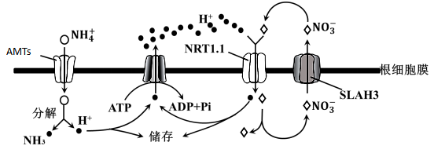
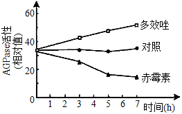
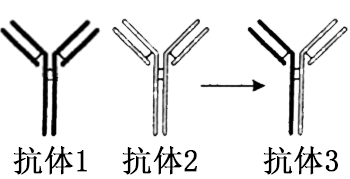
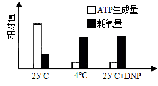
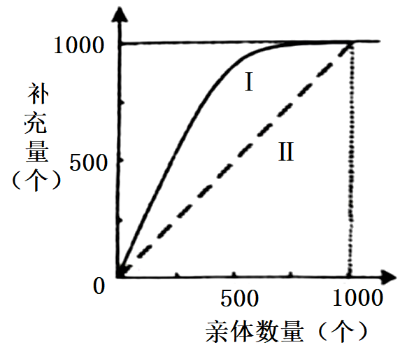
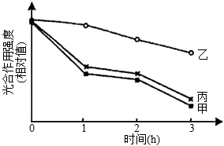
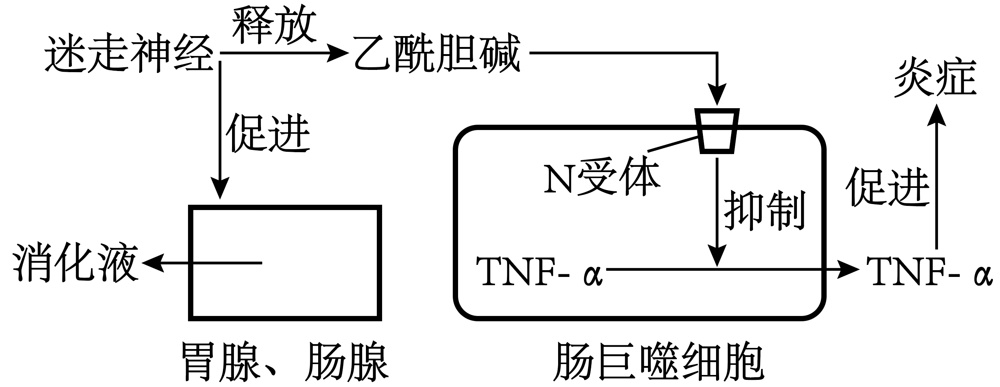

**生物**

**注意事项：**

**1．答卷前，考生务必将自己的姓名、考生号等填写在答题卡和试卷指定位置。**

**2．回答选择题时，选出每小题答案后，用铅笔把答题卡上对应题目的答案标号涂黑。如需改动，用橡皮擦干净后，再选涂其他答案标号。回答非选择题时，将答案写在答题卡上。写在本试卷上无效。**

**3．考试结束后，将本试卷和答题卡一并交回。**

**一、选择题：本题共15小题，每小题只有一个选项符合题目要求。**

1\. 某种干细胞中，进入细胞核的蛋白APOE可作用于细胞核骨架和异染色质蛋白，诱导这些蛋白发生自噬性降解，影响异染色质上的基因的表达，促进该种干细胞的衰老。下列说法错误的是（ ）

A. 细胞核中的APOE可改变细胞核的形态

B. 敲除APOE基因可延缓该种干细胞的衰老

C. 异染色质蛋白在细胞核内发生自噬性降解

D. 异染色质蛋白的自噬性降解产物可被再利用

2\. 液泡膜蛋白TOM2A的合成过程与分泌蛋白相同，该蛋白影响烟草花叶病毒（TMV）核酸复制酶的活性。与易感病烟草品种相比，烟草品种TI203中TOM2A的编码序列缺失2个碱基对，被TMV侵染后，易感病烟草品种有感病症状，TI203无感病症状。下列说法错误的是（ ）

A. TOM2A的合成需要游离核糖体

B. TI203中TOM2A基因表达的蛋白与易感病烟草品种中的不同

C. TMV核酸复制酶可催化TMV核糖核酸的合成

D. TMV侵染后，TI203中的TMV数量比易感病烟草品种中的多

3\. NO3-和NH4+是植物利用的主要无机氮源，NH4+的吸收由根细胞膜两侧的电位差驱动，NO3-的吸收由H+浓度梯度驱动，相关转运机制如图。铵肥施用过多时，细胞内NH4+的浓度增加和细胞外酸化等因素引起植物生长受到严重抑制的现象称为铵毒。下列说法正确的是（ ）

A. NH4+通过AMTs进入细胞消耗的能量直接来自ATP

B. NO3-通过SLAH3转运到细胞外的方式属于被动运输

C. 铵毒发生后，增加细胞外的NO3-会加重铵毒

D. 载体蛋白NRT1.1转运NO3-和H+的速度与二者在膜外的浓度呈正相关

4\. 植物细胞内10%~25%的葡萄糖经过一系列反应，产生NADPH、CO2和多种中间产物，该过程称为磷酸戊糖途径。该途径的中间产物可进一步生成氨基酸和核苷酸等。下列说法错误的是（ ）

A. 磷酸戊糖途径产生的NADPH与有氧呼吸产生的还原型辅酶不同

B. 与有氧呼吸相比，葡萄糖经磷酸戊糖途径产生的能量少

C. 正常生理条件下，利用14C标记的葡萄糖可追踪磷酸戊糖途径中各产物的生成

D. 受伤组织修复过程中所需要的原料可由该途径的中间产物转化生成

5\. 家蝇Y染色体由于某种影响断成两段，含s基因的小片段移接到常染色体获得XY'个体，不含s基因的大片段丢失。含s基因的家蝇发育为雄性，只含一条X染色体的雌蝇胚胎致死，其他均可存活且繁殖力相同。M、m是控制家蝇体色的基因，灰色基因M对黑色基因m为完全显性。如图所示的两亲本杂交获得F1，从F1开始逐代随机交配获得Fn。不考虑交换和其他突变，关于F1至Fn，下列说法错误的是（ ）

A. 所有个体均可由体色判断性别 B. 各代均无基因型为MM的个体

C. 雄性个体中XY'所占比例逐代降低 D. 雌性个体所占比例逐代降低

6\. 野生型拟南芥的叶片是光滑形边缘，研究影响其叶片形状的基因时，发现了6个不同的隐性突变，每个隐性突变只涉及1个基因。这些突变都能使拟南芥的叶片表现为锯齿状边缘。利用上述突变培育成6个不同纯合突变体①~⑥，每个突变体只有1种隐性突变。不考虑其他突变，根据表中的杂交实验结果，下列推断错误的是（ ）

| 杂交组合 | 子代叶片边缘 |
|:----:|:------:|
| ①×②  | 光滑形    |
| ①×③  | 锯齿状    |
| ①×④  | 锯齿状    |
| ①×⑤  | 光滑形    |
| ②×⑥  | 锯齿状    |

A. ②和③杂交，子代叶片边缘为光滑形 B. ③和④杂交，子代叶片边缘为锯齿状

C. ②和⑤杂交，子代叶片边缘为光滑形 D. ④和⑥杂交，子代叶片边缘为光滑形

7\. 缺血性脑卒中是因脑部血管阻塞而引起的脑部损伤，可发生在脑的不同区域。若缺血性脑卒中患者无其他疾病或损伤，下列说法错误的是（ ）

A. 损伤发生在大脑皮层S区时，患者不能发出声音

B. 损伤发生在下丘脑时，患者可能出现生物节律失调

C. 损伤导致上肢不能运动时，患者的缩手反射仍可发生

D. 损伤发生在大脑时，患者可能会出现排尿不完全

8\. 减数分裂Ⅰ时，若同源染色体异常联会，则异常联会的同源染色体可进入1个或2个子细胞；减数分裂Ⅱ时，若有同源染色体则同源染色体分离而姐妹染色单体不分离，若无同源染色体则姐妹染色单体分离。异常联会不影响配子的存活、受精和其他染色体的行为。基因型为Aa的多个精原细胞在减数分裂Ⅰ时，仅A、a所在的同源染色体异常联会且非姐妹染色单体发生交换。上述精原细胞形成的精子与基因型为Aa的卵原细胞正常减数分裂形成的卵细胞结合形成受精卵。已知A、a位于常染色体上，不考虑其他突变，上述精子和受精卵的基因组成种类最多分别为（ ）

A. 6；9 B. 6；12 C. 4；7 D. 5；9

9\. 药物甲、乙、丙均可治疗某种疾病，相关作用机制如图所示，突触前膜释放递质为去甲肾上腺素（NE）。下列说法错误的是（ ）

A. 药物甲的作用导致突触间隙中的NE增多 B. 药物乙抑制NE释放过程中的正反馈

C. 药物丙抑制突触间隙中NE的回收 D. NE-β受体复合物可改变突触后膜的离子通透性

10\. 石蒜地下鳞茎的产量与鳞茎内淀粉的积累量呈正相关。为研究植物生长调节剂对石蒜鳞茎产量的影响，将适量赤霉素和植物生长调节剂多效唑的粉末分别溶于少量甲醇后用清水稀释，处理长势相同的石蒜幼苗，鳞茎中合成淀粉的关键酶AGPase的活性如图。下列说法正确的是（ ）

A. 多效唑通过增强AGPase活性直接参与细胞代谢

B. 对照组应使用等量清水处理与实验组长势相同的石蒜幼苗

C. 喷施赤霉素能促进石蒜植株的生长，提高鳞茎产量

D. 该实验设计遵循了实验变量控制中的“加法原理”

11\. 某地长期稳定运行稻田养鸭模式，运行过程中不投放鸭饲料，鸭取食水稻老黄叶、害虫和杂草等，鸭粪可作为有机肥料还田。该稻田的水稻产量显著高于普通稻田，且养鸭还会产生额外的经济效益。若该稻田与普通稻田的秸秆均还田且其他影响因素相同，下列说法正确的是（ ）

A. 与普通稻田相比，该稻田需要施加更多的肥料

B. 与普通稻田相比，该稻田需要使用更多的农药

C. 该稻田与普通稻田的群落空间结构完全相同

D. 该稻田比普通稻田的能量的利用率低

12\. 根据所捕获动物占该种群总数的比例可估算种群数量。若在某封闭鱼塘中捕获了1000条鱼售卖，第2天用相同方法捕获了950条鱼。假设鱼始终保持均匀分布，则该鱼塘中鱼的初始数量约为（ ）

A. 2×104条 B. 4×104条 C. 6×104条 D. 8×104条

13\. 关于“DNA的粗提取与鉴定”实验，下列说法错误的是（ ）

A. 过滤液沉淀过程在4℃冰箱中进行是为了防止DNA降解

B. 离心研磨液是为了加速DNA的沉淀

C. 在一定温度下，DNA遇二苯胺试剂呈现蓝色

D. 粗提取的DNA中可能含有蛋白质

14\. 青霉菌处在葡萄糖浓度不足的环境中时，会通过分泌青霉素杀死细菌，以保证自身生存所需的能量供应。目前已实现青霉素的工业化生产，关于该生产过程，下列说法错误的是（ ）

A. 发酵液中的碳源不宜使用葡萄糖

B. 可用深层通气液体发酵技术提高产量

C. 选育出的高产菌株经扩大培养后才可接种到发酵罐中

D. 青霉素具有杀菌作用，因此发酵罐不需严格灭菌

15\. 如图所示，将由2种不同的抗原分别制备的单克隆抗体分子，在体外解偶联后重新偶联可制备双特异性抗体，简称双抗。下列说法错误的是（ ）

A. 双抗可同时与2种抗原结合

B. 利用双抗可以将蛋白类药物运送至靶细胞

C. 筛选双抗时需使用制备单克隆抗体时所使用的2种抗原

D. 同时注射2种抗原可刺激B细胞分化为产双抗的浆细胞

**二、选择题：本题共5小题，每小题有一个或多个选项符合题目要求。**

16\. 在有氧呼吸第三阶段，线粒体基质中的还原型辅酶脱去氢并释放电子，电子经线粒体内膜最终传递给O2，电子传递过程中释放的能量驱动H+从线粒体基质移至内外膜间隙中，随后H+经ATP合酶返回线粒体基质并促使ATP合成，然后与接受了电子的O2结合生成水。为研究短时低温对该阶段的影响，将长势相同的黄瓜幼苗在不同条件下处理，分组情况及结果如图所示。已知DNP可使H+进入线粒体基质时不经过ATP合酶。下列相关说法正确的是（ ）

A. 4℃时线粒体内膜上的电子传递受阻

B. 与25℃时相比，4℃时有氧呼吸产热多

C. 与25℃时相比，4℃时有氧呼吸消耗葡萄糖的量多

D. DNP导致线粒体内外膜间隙中H+浓度降低，生成的ATP减少

17\. 某两性花二倍体植物的花色由3对等位基因控制，其中基因A控制紫色，a无控制色素合成的功能。基因B控制红色，b控制蓝色。基因I不影响上述2对基因的功能，但i纯合的个体为白色花。所有基因型的植株都能正常生长和繁殖，基因型为A_B_I_和A_bbI_的个体分别表现紫红色花和靛蓝色花。现有该植物的3个不同纯种品系甲、乙、丙，它们的花色分别为靛蓝色、白色和红色。不考虑突变，根据表中杂交结果，下列推断正确的是（ ）

| 杂交组合 | F1表型 | F2表型及比例 |
|:----:|:---------------:|:------------------:|
| 甲×乙  | 紫红色             | 紫红色∶靛蓝色∶白色=9∶3∶4   |
| 乙×丙  | 紫红色             | 紫红色∶红色∶白色=9∶3∶4    |

A. 让只含隐性基因的植株与F2测交，可确定F2中各植株控制花色性状的基因型

B. 让表中所有F2的紫红色植株都自交一代，白花植株在全体子代中的比例为1/6

C. 若某植株自交子代中白花植株占比为1/4，则该植株可能的基因型最多有9种

D. 若甲与丙杂交所得F1自交，则F2表型比例为9紫红色∶3靛蓝色∶3红色∶1蓝色

18\. 人体通过多种调节机制保持体温的相对稳定。下列说法正确的是（ ）

A. 寒冷环境下，参与体温调节的传出神经中既有躯体运动神经，也有内脏运动神经

B. 寒冷环境下，肾上腺皮质分泌肾上腺素增加，使代谢活动增强，产热增加

C. 炎热环境下，皮肤血管收缩，汗腺分泌增多，从而增加散热

D. 炎热环境下，若呼吸运动频率和幅度增加过高且持续过久，可导致内环境pH上升

19\. 一个繁殖周期后的种群数量可表示为该种群的补充量。某实验水域中定期投入适量的饲料，其他因素稳定。图中曲线Ⅰ表示该实验水域中某种水生动物的亲体数量与补充量的关系，曲线Ⅱ表示亲体数量与补充量相等。下列说法正确的是（ ）

A. 亲体数量约为1000个时，可获得最大持续捕捞量

B. 亲体数量约为500个时，单位时间内增加的数量最多

C. 亲体数量大于1000个时，补充量与亲体数量相等，种群达到稳定状态

D. 饲料是影响该种群数量变化的非密度制约因素

20\. 啤酒的工业化生产中，大麦经发芽、焙烤、碾磨、糖化、蒸煮、发酵、消毒等工序后，最终过滤、调节、分装。下列说法正确的是（ ）

A. 用赤霉素处理大麦，可使大麦种子无须发芽就能产生α-淀粉酶

B. 焙烤是为了利用高温杀死大麦种子胚并进行灭菌

C. 糖浆经蒸煮、冷却后需接种酵母菌进行发酵

D. 通过转基因技术可减少啤酒酵母双乙酰的生成，缩短啤酒的发酵周期

**三、非选择题：本题共5小题。**

21\. 强光条件下，植物吸收的光能若超过光合作用的利用量，过剩的光能可导致植物光合作用强度下降，出现光抑制现象。为探索油菜素内酯（BR）对光抑制的影响机制，将长势相同的苹果幼苗进行分组和处理，如表所示，其中试剂L可抑制光反应关键蛋白的合成。各组幼苗均在温度适宜、水分充足的条件下用强光照射，实验结果如图所示。

| 分组  | 处理   |
|:--- |:---- |
| 甲   | 清水   |
| 乙   | BR   |
| 丙   | BR+L |

（1）光可以被苹果幼苗叶片中的色素吸收，分离苹果幼苗叶肉细胞中的色素时，随层析，液在滤纸上扩散速度最快的色素主要吸收的光的颜色是\_\_\_\_\_\_。

（2）强光照射后短时间内，苹果幼苗光合作用暗反应达到一定速率后不再增加，但氧气的产生速率继续增加。苹果幼苗光合作用暗反应速率不再增加，可能的原因有\_\_\_\_\_\_、\_\_\_\_\_\_（答出2种原因即可）；氧气的产生速率继续增加的原因是\_\_\_\_\_\_。

（3）据图分析，与甲组相比，乙组加入BR后光抑制\_\_\_\_\_\_（填“增强”或“减弱”）；乙组与丙组相比，说明BR可能通过\_\_\_\_\_\_发挥作用。

22\. 果蝇的正常眼与无眼是1对相对性状，受1对等位基因控制，要确定该性状的遗传方式，需从基因与染色体的位置关系及显隐性的角度进行分析。以正常眼雌果蝇与无眼雄果蝇为亲本进行杂交，根据杂交结果绘制部分后代果蝇的系谱图，如图所示。不考虑致死、突变和X、Y染色体同源区段的情况。

（1）据图分析，关于果蝇无眼性状的遗传方式，可以排除的是\_\_\_\_\_\_。若控制该性状的基因位于X染色体上，Ⅲ-1与Ⅲ-2杂交的子代中正常眼雄果蝇的概率是\_\_\_\_\_\_。

（2）用Ⅱ-1与其亲本雄果蝇杂交获得大量子代，根据杂交结果\_\_\_\_\_\_（填“能”或“不能”）确定果蝇正常眼性状的显隐性，理由是\_\_\_\_\_\_。

（3）以系谱图中呈现的果蝇为实验材料设计杂交实验，确定无眼性状的遗传方式。（要求：①只杂交一次；②仅根据子代表型预期结果；③不根据子代性状的比例预期结果）实验思路：\_\_\_\_\_\_\_；预期结果并得出结论：\_\_\_\_\_\_。

（4）若果蝇无眼性状产生的分子机制是由于控制正常眼的基因中间缺失一段较大的DNA片段所致，且该对等位基因的长度已知。利用PCR及电泳技术确定无眼性状的遗传方式时，只以Ⅱ-3为材料，用1对合适的引物仅扩增控制该对性状的完整基因序列，电泳检测PCR产物，通过电泳结果\_\_\_\_\_\_（填“能”或“不能”）确定无眼性状的遗传方式，理由是\_\_\_\_\_\_。

23\. 迷走神经是与脑干相连的脑神经，对胃肠的蠕动和消化腺的分泌活动起促进作用，还可通过一系列过程产生抗炎效应，如图所示。

| 分组  | 处理          | TNF-α浓度 |
|:---:|:-----------:|:-------:|
| 甲   | 腹腔注射生理盐水    | \+      |
| 乙   | 腹腔注射LPS     | ++++    |
| 丙   | 腹腔注射LPS+A处理 | ++      |

注：“+”越多表示浓度越高

（1）迷走神经中促进胃肠蠕动的神经属于\_\_\_\_\_\_（填“交感神经”或“副交感神经”）。交感神经和副交感神经对同一器官的作用通常是相反的，其意义是\_\_\_\_\_\_。

（2）消化液中盐酸在促进消化方面的作用有\_\_\_\_\_\_、\_\_\_\_\_\_、\_\_\_\_\_\_。（答出3种作用即可）

（3）研究人员对图中抗炎过程进行了相关实验，实验分组及结果见表。通过腹腔注射脂多糖（LPS）可使大鼠出现炎症，检测TNF-α浓度可评估炎症程度。据图分析，若丙组的A处理仅在肠巨噬细胞内起作用，推测A处理的3种可能的作用机制：\_\_\_\_\_\_；\_\_\_\_\_\_；\_\_\_\_\_\_。

24\. 在一个群落中随机选取大量样方，某种植物出现的样方数占全部样方数的百分比为该物种的频度，频度分级标准如表所示。在植物种类分布均匀且稳定性较高的生物群落中，各频度级植物物种数在该群落植物物种总数中的占比呈现一定的规律，如图所示。

<table style="width:68%;">
<colgroup>
<col style="width: 49%" />
<col style="width: 18%" />
</colgroup>
<thead>
<tr>
<th style="text-align: center;">频度</th>
<th style="text-align: center;">级</th>
</tr>
</thead>
<tbody>
<tr>
<td style="text-align: center;">
1%~20%

21%~40%

41%~60%

61%~80%

81%~100%
</td>
<td style="text-align: center;">
A

B

C

D

E
</td>
</tr>
</tbody>
</table>

（1）若植物甲为该群落的优势种，则植物甲的频度最可能属于\_\_\_\_\_\_级，而调查发现该频度级中的植物乙不是优势种，则乙的种群密度和分布范围的特点分别是\_\_\_\_\_\_、\_\_\_\_\_\_。

（2）若某草地植物物种的频度级符合上图所示比例关系，且属于D频度级的植物有16种，则该草地中植物类群的丰富度为\_\_\_\_\_\_ 种。

（3）若研究植物甲生态位，通常需要研究的因素有\_\_\_\_\_\_（填标号）。

A. 甲在该区域出现的频率 B. 甲的种群密度

C. 甲的植株高度 D. 甲与其他物种的关系

（4）随着时间的推移，群落可能会发生演替。群落演替的原因是\_\_\_\_\_\_。

25\. 某种类型的白血病由蛋白P引发，蛋白UBC可使P被蛋白酶识别并降解，药物A可通过影响这一过程对该病起到治疗作用。为探索药物A治疗该病的机理，需构建重组载体以获得融合蛋白FLAG-P和FLAG-P△。P△是缺失特定氨基酸序列的P，FLAG是一种短肽，连接在P或P△的氨基端，使融合蛋白能与含有FLAG抗体的介质结合，但不影响P或P△的功能。

（1）为构建重组载体，需先设计引物，通过PCR特异性扩增P基因。用于扩增P基因的引物需满足的条件是\_\_\_\_\_\_\_、为使PCR产物能被限制酶切割，需在引物上添加相应的限制酶识别序列，该限制酶识别序列应添加在引物的\_\_\_\_\_\_（填“3'端”或“5'端”）。

（2）PCR扩增得到P基因经酶切连接插入载体后，与编码FLAG的序列形成一个融合基因，如图甲所示，其中“ATGTGCA”为P基因编码链起始序列。将该重组载体导入细胞后，融合基因转录出的mRNA序列正确，翻译出的融合蛋白中FLAG的氨基酸序列正确，但P基因对应的氨基酸序列与P不同。据图甲分析，出现该问题的原因是\_\_\_\_\_\_。修改扩增P基因时使用的带有EcoRⅠ识别序列的引物来解决该问题，具体修改方案是\_\_\_\_\_\_。

（3）融合蛋白表达成功后，将FLAG-P、FLAG-P△、药物A和UBC按照图乙中的组合方式分成5组。各组样品混匀后分别流经含FLAG抗体的介质，分离出与介质结合的物质并用UBC抗体检测，检测结果如图丙所示。已知FLAG-P和FLAG-P△不能降解UBC，由①②③组结果的差异推测，药物A的作用是\_\_\_\_\_\_；由②④组或③⑤组的差异推测，P△中缺失的特定序列的作用是\_\_\_\_\_\_。

（4）根据以上结果推测，药物A治疗该病的机理是\_\_\_\_\_\_。
