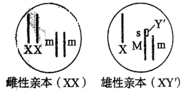
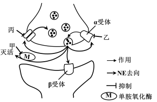
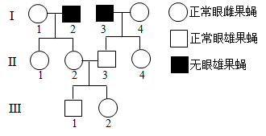
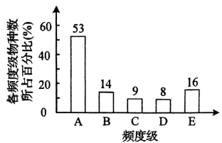
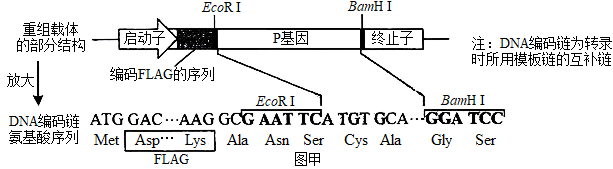
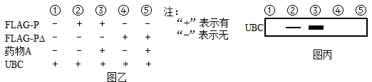

**生物**

**注意事项：**

**1．答卷前，考生务必将自己的姓名、考生号等填写在答题卡和试卷指定位置。**

**2．回答选择题时，选出每小题答案后，用铅笔把答题卡上对应题目的答案标号涂黑。如需改动，用橡皮擦干净后，再选涂其他答案标号。回答非选择题时，将答案写在答题卡上。写在本试卷上无效。**

**3．考试结束后，将本试卷和答题卡一并交回。**

**一、选择题：本题共15小题，每小题只有一个选项符合题目要求。**

1\. 某种干细胞中，进入细胞核的蛋白APOE可作用于细胞核骨架和异染色质蛋白，诱导这些蛋白发生自噬性降解，影响异染色质上的基因的表达，促进该种干细胞的衰老。下列说法错误的是（ ）

A. 细胞核中的APOE可改变细胞核的形态

B. 敲除APOE基因可延缓该种干细胞的衰老

C. 异染色质蛋白在细胞核内发生自噬性降解

D. 异染色质蛋白的自噬性降解产物可被再利用

【答案】C

【解析】

【分析】1、异染色质是指在细胞周期中具有固缩特性的染色体。

2、细胞自噬是细胞通过溶酶体（如动物）或液泡（如植物、酵母菌）降解自身组分以达到维持细胞内正常生理活动及稳态的一种细胞代谢过程。

【详解】A、由“蛋白APOE可作用于细胞核骨架”可知APOE可改变细胞核的形态，A正确；

B、蛋白APOE可促进该种干细胞的衰老，所以敲除APOE基因可延缓该种干细胞的衰老，B正确；

C、自噬是在溶酶体（如动物）或液泡（如植物、酵母菌）中进行，不在细胞核内，C错误；

D、异染色质蛋白的自噬性降解产物是氨基酸，可被再利用，D正确。

故选C。

2\. 液泡膜蛋白TOM2A的合成过程与分泌蛋白相同，该蛋白影响烟草花叶病毒（TMV）核酸复制酶的活性。与易感病烟草品种相比，烟草品种TI203中TOM2A的编码序列缺失2个碱基对，被TMV侵染后，易感病烟草品种有感病症状，TI203无感病症状。下列说法错误的是（ ）

A. TOM2A的合成需要游离核糖体

B. TI203中TOM2A基因表达的蛋白与易感病烟草品种中的不同

C. TMV核酸复制酶可催化TMV核糖核酸的合成

D. TMV侵染后，TI203中的TMV数量比易感病烟草品种中的多

【答案】D

【解析】

【分析】分泌蛋白合成与分泌过程：在游离的核糖体上合成多肽链→粗面内质网继续合成→内质网腔加工→内质网“出芽”形成囊泡→高尔基体进行再加工形成成熟的蛋白质→高尔基体“出芽”形成囊泡→细胞膜通过胞吐的方式将蛋白质分泌到细胞外。

【详解】A、从“液泡膜蛋白TOM2A的合成过程与分泌蛋白相同”，可知TOM2A最初是在游离的核糖体中以氨基酸为原料开始多肽链的合成，A正确；

B、由题干信息可知，与易感病烟草相比，品种T1203中TOM2A的编码序列缺失2个碱基对，并且被TMV侵染后的表现不同，说明品种T1203发生了基因突变，所以两个品种TOM2A基因表达的蛋白不同，B正确；

C、烟草花叶病毒（TMV）的遗传物质是RNA，所以其核酸复制酶可催化TMV的RNA（核糖核酸）的合成，C正确；

D、TMV侵染后，T1203品种无感病症状，也就是叶片上没有出现花斑，推测是T1203感染的TMV数量比易感病烟草品种中的少，D错误。

故选D。

3\. NO3-和NH4+是植物利用的主要无机氮源，NH4+的吸收由根细胞膜两侧的电位差驱动，NO3-的吸收由H+浓度梯度驱动，相关转运机制如图。铵肥施用过多时，细胞内NH4+的浓度增加和细胞外酸化等因素引起植物生长受到严重抑制的现象称为铵毒。下列说法正确的是（ ）

A. NH4+通过AMTs进入细胞消耗的能量直接来自ATP

B. NO3-通过SLAH3转运到细胞外的方式属于被动运输

C. 铵毒发生后，增加细胞外的NO3-会加重铵毒

D. 载体蛋白NRT1.1转运NO3-和H+速度与二者在膜外的浓度呈正相关

【答案】B

【解析】

【分析】物质跨膜运输主要包括两种方式:被动运输和主动运输，被动运输又包括自由扩散和协助扩散，被动运输是由高浓度向低浓度一侧扩散，而主动运输是由低浓度向高浓度一侧运输。其中协助扩散需要载体的协助，但不需要消耗能量:而主动运输既需要消耗能量，也需要载体的协助。

【详解】A、由题干信息可知，NH4+的吸收是根细胞膜两侧的电位差驱动的，所以NH4+通过AMTs进入细胞消耗的能量不是来自ATP，A错误；

B、由图上可以看到，NO3-进入根细胞膜是H+的浓度梯度驱动，进行的逆浓度梯度运输，所以NO3-通过SLAH3转运到细胞外是顺浓度梯度运输，属于被动运输，B正确；

C、铵毒发生后，H+在细胞外更多，增加细胞外的NO3-，可以促使H+向细胞内转运，减少细胞外的H+，从而减轻铵毒，C错误；

D、据图可知，载体蛋白NRT1.1转运NO3-属于主动运输，主动运输的速率与其浓度无必然关系；运输H+属于协助扩散，协助扩散在一定范围内呈正相关，超过一定范围后不成比例，D错误。

故选B。

4\. 植物细胞内10%~25%的葡萄糖经过一系列反应，产生NADPH、CO2和多种中间产物，该过程称为磷酸戊糖途径。该途径的中间产物可进一步生成氨基酸和核苷酸等。下列说法错误的是（ ）

A. 磷酸戊糖途径产生的NADPH与有氧呼吸产生的还原型辅酶不同

B. 与有氧呼吸相比，葡萄糖经磷酸戊糖途径产生的能量少

C. 正常生理条件下，利用14C标记的葡萄糖可追踪磷酸戊糖途径中各产物的生成

D. 受伤组织修复过程中所需要的原料可由该途径的中间产物转化生成

【答案】C

【解析】

【分析】有氧呼吸是葡萄糖等有机物彻底氧化分解并释放能量的过程。由题干信息可知，磷酸戊糖途径可以将葡萄糖转化成其他中间产物，这些中间产物可以作为原料进一步生成其他化合物。

【详解】A、根据题意，磷酸戊糖途径产生的NADPH是为其他物质的合成提供原料，而有氧呼吸产生的还原型辅酶是NADH，能与O2反应产生水，A正确；

B、有氧呼吸是葡萄糖彻底氧化分解释放能量的过程，而磷酸戊糖途径产生了多种中间产物，中间产物还进一步生成了其他有机物，所以葡萄糖经磷酸戊糖途径产生的能量比有氧呼吸少，B正确；

C、正常生理条件下，只有10%~25%的葡萄糖参加了磷酸戊糖途径，其余的葡萄糖会参与其他代谢反应，例如有氧呼吸，所以用14C标记葡萄糖，除了追踪到磷酸戊糖途径的含碳产物，还会追踪到参与其他代谢反应的产物，C错误；

D、受伤组织修复即是植物组织的再生过程，细胞需要增殖，所以需要核苷酸和氨基酸等原料，而磷酸戊糖途径的中间产物可生成氨基酸和核苷酸等，D正确。

故选C。

5\. 家蝇Y染色体由于某种影响断成两段，含s基因的小片段移接到常染色体获得XY'个体，不含s基因的大片段丢失。含s基因的家蝇发育为雄性，只含一条X染色体的雌蝇胚胎致死，其他均可存活且繁殖力相同。M、m是控制家蝇体色的基因，灰色基因M对黑色基因m为完全显性。如图所示的两亲本杂交获得F1，从F1开始逐代随机交配获得Fn。不考虑交换和其他突变，关于F1至Fn，下列说法错误的是（ ）

A. 所有个体均可由体色判断性别 B. 各代均无基因型为MM的个体

C. 雄性个体中XY'所占比例逐代降低 D. 雌性个体所占比例逐代降低

【答案】D

【解析】

【分析】含s基因的家蝇发育为雄性，据图可知，s基因位于M基因所在的常染色体上，常染色体与性染色体之间的遗传遵循自由组合定律。

【详解】A、含有M的个体同时含有s基因，即雄性个体均表现为灰色，雌性个体不会含有M，只含有m，故表现为黑色，因此所有个体均可由体色判断性别，A正确；

B、含有Ms基因的个体表现为雄性，基因型为MsMs的个体需要亲本均含有Ms基因，而两个雄性个体不能杂交，B正确；

C、亲本雌性个体产生的配子为mX，雄性亲本产生的配子为XMs、Ms0、Xm、m0，子一代中只含一条X染色体的雌蝇胚胎致死，雄性个体为1/3XXY’（XXMsm）、1/3XY’（XMsm），雌蝇个体为1/3XXmm，把性染色体和常染色体分开考虑，只考虑性染色体，子一代雄性个体产生的配子种类及比例为3/4X、1/40，雌性个体产生的配子含有X，子二代中3/4XX、1/4X0；只考虑常染色体，子二代中1/2Msm、1/2mm，1/8mmX0致死，XXmm表现为雌性，所占比例为3/7，雄性个体3/7XXY’（XXMsm）、1/7XY’（XMsm），即雄性个体中XY'所占比例由1/2降到1/4，逐代降低，雌性个体所占比例由1/3变为3/7，逐代升高，C正确，D错误。

故选D。

6\. 野生型拟南芥的叶片是光滑形边缘，研究影响其叶片形状的基因时，发现了6个不同的隐性突变，每个隐性突变只涉及1个基因。这些突变都能使拟南芥的叶片表现为锯齿状边缘。利用上述突变培育成6个不同纯合突变体①~⑥，每个突变体只有1种隐性突变。不考虑其他突变，根据表中的杂交实验结果，下列推断错误的是（ ）

| 杂交组合 | 子代叶片边缘 |
|:----:|:------:|
| ①×②  | 光滑形    |
| ①×③  | 锯齿状    |
| ①×④  | 锯齿状    |
| ①×⑤  | 光滑形    |
| ②×⑥  | 锯齿状    |

A. ②和③杂交，子代叶片边缘为光滑形 B. ③和④杂交，子代叶片边缘为锯齿状

C. ②和⑤杂交，子代叶片边缘为光滑形 D. ④和⑥杂交，子代叶片边缘为光滑形

【答案】C

【解析】

【分析】6个不同的突变体均为隐性纯合，可能是同一基因突变形成的，也可能是不同基因突变形成的。

【详解】AB、①×③、①×④的子代叶片边缘全为锯齿状，说明①与③④应是同一基因突变而来，因此②和③杂交，子代叶片边缘为光滑形，③和④杂交，子代叶片边缘为锯齿状，AB正确；

C、①×②、①×⑤的子代叶片边缘为全为光滑形，说明①与②、①与⑤是分别由不同基因发生隐性突变导致，但②与⑤可能是同一基因突变形成的，也可能是不同基因突变形成的；若为前者，则②和⑤杂交，子代叶片边缘为锯齿状，若为后者，子代叶片边缘为光滑形，C错误；

D、①与②是由不同基因发生隐性突变导致，①与④应是同一基因突变而来，②×⑥的子代叶片边缘为全为锯齿状，说明②⑥是同一基因突变形成的，则④与⑥是不同基因突变形成的，④和⑥杂交，子代叶片边缘为光滑形，D正确。

故选C。

7\. 缺血性脑卒中是因脑部血管阻塞而引起的脑部损伤，可发生在脑的不同区域。若缺血性脑卒中患者无其他疾病或损伤，下列说法错误的是（ ）

A. 损伤发生在大脑皮层S区时，患者不能发出声音

B. 损伤发生在下丘脑时，患者可能出现生物节律失调

C. 损伤导致上肢不能运动时，患者的缩手反射仍可发生

D. 损伤发生在大脑时，患者可能会出现排尿不完全

【答案】A

【解析】

【分析】大脑是高级神经中枢，可以控制低级神经中枢脊髓的生理活动。缩手反射为非条件反射。

【详解】A、S区为运动性语言中枢，损伤后，患者与讲话有关的肌肉和发声器官完全正常，能发出声音，但不能表达用词语表达思想，A错误；

B、下丘脑是生物的节律中枢，损伤发生在下丘脑时，患者可能出现生物节律失调，B正确；

C、损伤导致上肢不能运动时，大脑皮层的躯体运动中枢受到损伤，此时患者的缩手反射仍可发生，因为缩手反射的低级中枢在脊髓，C正确；

D、排尿的高级中枢在大脑皮层，低级中枢在脊髓，损伤发生在大脑时，患者可能会出现排尿不完全，D正确。

故选A。

8\. 减数分裂Ⅰ时，若同源染色体异常联会，则异常联会的同源染色体可进入1个或2个子细胞；减数分裂Ⅱ时，若有同源染色体则同源染色体分离而姐妹染色单体不分离，若无同源染色体则姐妹染色单体分离。异常联会不影响配子的存活、受精和其他染色体的行为。基因型为Aa的多个精原细胞在减数分裂Ⅰ时，仅A、a所在的同源染色体异常联会且非姐妹染色单体发生交换。上述精原细胞形成的精子与基因型为Aa的卵原细胞正常减数分裂形成的卵细胞结合形成受精卵。已知A、a位于常染色体上，不考虑其他突变，上述精子和受精卵的基因组成种类最多分别为（ ）

A. 6；9 B. 6；12 C. 4；7 D. 5；9

【答案】A

【解析】

【分析】正常情况下，同源染色体在减数第一次分裂后期分离，姐妹染色单体在减数第二次分裂后期分离。

【详解】基因型为Aa的多个精原细胞在减数分裂Ⅰ时，仅A、a所在的同源染色体异常联会且非姐妹染色单体发生交换。（1）若A、a所在的染色体片段发生交换，则A、a位于姐妹染色单体上，①异常联会的同源染色体进入1个子细胞，则子细胞基因组成为AAaa或不含A、a，经减数第二次分裂，同源染色体分离而姐妹染色单体不分离,可形成基因型为Aa和不含A、a的精子；②异常联会的同源染色体进入2个子细胞，则子细胞基因组成为Aa，经减数第二次分裂，可形成基因型为A或a的精子；（2）若A、a所在的染色体片段未发生交换，③异常联会的同源染色体进入1个子细胞，则子细胞基因组成为AAaa或不含A、a，经减数第二次分裂，同源染色体分离而姐妹染色单体不分离，可形成基因型为AA、aa和不含A、a的精子；④异常联会的同源染色体进入2个子细胞，则子细胞基因组成为AA或aa，经减数第二次分裂，可形成基因型为A或a的精子；综上所述，精子的基因组成包括AA、aa、Aa、A、a和不含A或a，共6种，与基因组成为A或a的卵细胞结合，通过棋盘法可知，受精卵的基因组成包括AAA、AAa、Aaa、aaa、AA、Aa、aa、A、a，共9种。

故选A。

9\. 药物甲、乙、丙均可治疗某种疾病，相关作用机制如图所示，突触前膜释放的递质为去甲肾上腺素（NE）。下列说法错误的是（ ）

A. 药物甲的作用导致突触间隙中的NE增多 B. 药物乙抑制NE释放过程中的正反馈

C. 药物丙抑制突触间隙中NE的回收 D. NE-β受体复合物可改变突触后膜的离子通透性

【答案】B

【解析】

【分析】去甲肾上腺素（NE）存在于突触小泡，由突触前膜释放到突触间隙，作用于突触后膜的受体，故NE是一种神经递质。由图可知，药物甲抑制去甲肾上腺素的灭活；药物乙抑制去甲肾上腺素与α受体结合；药物丙抑制去甲肾上腺素的回收。

【详解】A、药物甲抑制去甲肾上腺素的灭活，进而导致突触间隙中的NE增多，A正确；

B、由图可知，神经递质可与突触前膜的α受体结合，进而抑制突触小泡释放神经递质，这属于负反馈调节，药物乙抑制NE释放过程中的负反馈，B错误；

C、由图可知，去甲肾上腺素被突触前膜摄取回收，药物丙抑制突触间隙中NE的回收 ，C正确；

D、神经递质NE与突触后膜的β受体特异性结合后，可改变突触后膜的离子通透性，引发突触后膜电位变化，D正确。

故选B。

10\. 石蒜地下鳞茎的产量与鳞茎内淀粉的积累量呈正相关。为研究植物生长调节剂对石蒜鳞茎产量的影响，将适量赤霉素和植物生长调节剂多效唑的粉末分别溶于少量甲醇后用清水稀释，处理长势相同的石蒜幼苗，鳞茎中合成淀粉的关键酶AGPase的活性如图。下列说法正确的是（ ）

A. 多效唑通过增强AGPase活性直接参与细胞代谢

B. 对照组应使用等量清水处理与实验组长势相同的石蒜幼苗

C. 喷施赤霉素能促进石蒜植株的生长，提高鳞茎产量

D. 该实验设计遵循了实验变量控制中的“加法原理”

【答案】D

【解析】

【分析】由图可知，与对照组比较，多效唑可提高鳞茎中合成淀粉的关键酶AGPase的活性，赤霉素降低AGPase的活性。

【详解】A、由图可知，多效唑可以增强AGPase活性，促进鳞茎中淀粉的合成，间接参与细胞代谢，A错误；

B、由题“适量赤霉素和植物生长调节剂多效唑的粉末分别溶于少量甲醇后用清水稀释”可知，对照组应使用等量的甲醇-清水稀释液处理，B错误；

C、由题可知，赤霉素降低AGPase的活性，进而抑制鳞茎中淀粉的积累，根据石蒜地下鳞茎的产量与鳞茎内淀粉的积累量呈正相关，喷施赤霉素不能提高鳞茎产量，反而使得鳞茎产量减少，C错误；

D、与常态比较，人为增加某种影响因素的称为“加法原理”，用外源激素赤霉素和植物生长调节剂多效唑处理遵循了实验变量控制中的“加法原理”，D正确。

故选D。

11\. 某地长期稳定运行稻田养鸭模式，运行过程中不投放鸭饲料，鸭取食水稻老黄叶、害虫和杂草等，鸭粪可作为有机肥料还田。该稻田的水稻产量显著高于普通稻田，且养鸭还会产生额外的经济效益。若该稻田与普通稻田的秸秆均还田且其他影响因素相同，下列说法正确的是（ ）

A. 与普通稻田相比，该稻田需要施加更多的肥料

B. 与普通稻田相比，该稻田需要使用更多的农药

C. 该稻田与普通稻田的群落空间结构完全相同

D. 该稻田比普通稻田的能量的利用率低

【答案】A

【解析】

【分析】与普通稻田相比，稻田养鸭可以更好地利用耕地空间，增加农产品的类型和产量，鸭取食害虫和杂草等，可以减少农药使用量。

【详解】A、该稻田生态系统的营养结构更复杂，其水稻产量还显著高于普通稻田，而运行过程中不投放鸭饲料，因此与普通稻田相比，该稻田需要施加更多的肥料，A正确；

B、鸭取食害虫和杂草等，可以减少农药的使用，B错误；

C、该稻田增加了鸭子使得群落的物种组成不同，因此该稻田与普通稻田的群落空间结构不完全相同，C错误；

D、该稻田水稻产量显著高于普通稻田，且养鸭还会产生额外的经济效益，与普通稻田相比，该稻田的能量利用率高，D错误。

故选A。

12\. 根据所捕获动物占该种群总数的比例可估算种群数量。若在某封闭鱼塘中捕获了1000条鱼售卖，第2天用相同方法捕获了950条鱼。假设鱼始终保持均匀分布，则该鱼塘中鱼的初始数量约为（ ）

A. 2×104条 B. 4×104条 C. 6×104条 D. 8×104条

【答案】A

【解析】

【分析】由题“根据所捕获动物占该种群总数的比例可估算种群数量”，假设该种群总数为x，则有1000/x=950/（x-1000），求出x即为该鱼塘中鱼的初始数量。

【详解】由题“根据所捕获动物占该种群总数的比例可估算种群数量”，假设该种群总数为x，则有1000/x=950/（x-1000），计算得出x=2×104，即该鱼塘中鱼的初始数量为2×104条 ，A正确，BCD错误。

故选A。

13\. 关于“DNA的粗提取与鉴定”实验，下列说法错误的是（ ）

A. 过滤液沉淀过程在4℃冰箱中进行是为了防止DNA降解

B. 离心研磨液是为了加速DNA的沉淀

C. 在一定温度下，DNA遇二苯胺试剂呈现蓝色

D. 粗提取的DNA中可能含有蛋白质

【答案】B

【解析】

【分析】DNA的粗提取与鉴定的实验原理是：①DNA的溶解性，DNA和蛋白质等其他成分在不同浓度的氯化钠溶液中的溶解度不同，利用这一特点可以选择适当浓度的盐溶液可以将DNA溶解或析出，从而达到分离的目的；②DNA不容易酒精溶液，细胞中的某些蛋白质可以溶解于酒精，利用这一原理可以将蛋白质和DNA进一步分离；③在沸水浴的条件下DNA遇二苯胺会呈现蓝色。

【详解】A、低温时DNA酶的活性较低，过滤液沉淀过程在4℃冰箱中进行是为了防止DNA降解，A正确；

B、离心研磨液是为了使细胞碎片沉淀，B错误；

C、在沸水浴条件下，DNA遇二苯胺试剂呈现蓝色，C正确；

D、细胞中的某些蛋白质可以溶解于酒精，可能有蛋白质不溶于酒精，在95%的冷酒精中与DNA一块儿析出，故粗提取的DNA中可能含有蛋白质，D正确。

故选B。

14\. 青霉菌处在葡萄糖浓度不足的环境中时，会通过分泌青霉素杀死细菌，以保证自身生存所需的能量供应。目前已实现青霉素的工业化生产，关于该生产过程，下列说法错误的是（ ）

A. 发酵液中的碳源不宜使用葡萄糖

B. 可用深层通气液体发酵技术提高产量

C. 选育出的高产菌株经扩大培养后才可接种到发酵罐中

D. 青霉素具有杀菌作用，因此发酵罐不需严格灭菌

【答案】D

【解析】

【分析】培养基一般都含有水、碳源、氮源和无机盐等四类营养物质。配制培养基时除了满足基本的营养条件外，还需满足微生物生长对特殊营养物质、pH、O2的要求。

【详解】A、青霉菌处于葡萄糖浓度不足的环境中会通过分泌青霉素杀死细菌；提供相同含量的碳源，葡萄糖溶液单位体积中溶质微粒较多，会导致细胞失水，发酵液中的碳源不宜使用葡萄糖，乳糖是二糖，可被水解为半乳糖和葡萄糖，是青霉菌生长的最佳碳源，可以被青霉菌缓慢利用而维持青霉素分泌的有利条件，A正确；

B、青霉菌的代谢类型为异养需氧型，可用深层通气液体发酵技术提高产量，B正确；

C、选育出的高产青霉素菌株经扩大培养纯化后，才可接种到发酵罐中进行工业化生产，C正确；

D、为了防止细菌、其他真菌等微生物的污染，获得纯净的青霉素，发酵罐仍需严格灭菌，D错误。

故选D。

15\. 如图所示，将由2种不同的抗原分别制备的单克隆抗体分子，在体外解偶联后重新偶联可制备双特异性抗体，简称双抗。下列说法错误的是（ ）

A. 双抗可同时与2种抗原结合

B. 利用双抗可以将蛋白类药物运送至靶细胞

C. 筛选双抗时需使用制备单克隆抗体时所使用的2种抗原

D. 同时注射2种抗原可刺激B细胞分化为产双抗的浆细胞

【答案】D

【解析】

【分析】单克隆抗体的制备过程：先给小鼠注射特定抗原使之发生免疫反应，之后从小鼠脾脏中获取已经免疫的B淋巴细胞；诱导B细胞和骨髓瘤细胞融合，利用选择培养基筛选出杂交瘤细胞；进行抗体检测，筛选出能产生特定抗体的杂交瘤细胞；进行克隆化培养，即用培养基培养和注入小鼠腹腔中培养；最后从培养液或小鼠腹水中获取单克隆抗体。

【详解】A、根据抗原和抗体发生特异性结合的原理推测，双抗可同时与2种抗原结合，A正确；

B、 根据抗原与抗体能够发生特异性结合的特性，利用双抗可以将蛋白类药物运送至靶细胞，从而使药物发挥相应的作用，B正确；

C、在两种不同的抗原刺激下，B细胞增殖、分化产生不同的浆细胞分泌形成两种抗体，因此，筛选双抗时需使用制备单克隆抗体时所使用的2种抗原来进行抗原-抗体检测，从而实现对双抗的筛选，C正确；

D、 同时注射2种抗原可刺激B细胞分化形成不同的浆细胞，而不是分化成产双抗的浆细胞，D错误。

故选D。

**二、选择题：本题共5小题，每小题有一个或多个选项符合题目要求。**

16\. 在有氧呼吸第三阶段，线粒体基质中的还原型辅酶脱去氢并释放电子，电子经线粒体内膜最终传递给O2，电子传递过程中释放的能量驱动H+从线粒体基质移至内外膜间隙中，随后H+经ATP合酶返回线粒体基质并促使ATP合成，然后与接受了电子的O2结合生成水。为研究短时低温对该阶段的影响，将长势相同的黄瓜幼苗在不同条件下处理，分组情况及结果如图所示。已知DNP可使H+进入线粒体基质时不经过ATP合酶。下列相关说法正确的是（ ）

A. 4℃时线粒体内膜上的电子传递受阻

B. 与25℃时相比，4℃时有氧呼吸产热多

C. 与25℃时相比，4℃时有氧呼吸消耗葡萄糖的量多

D. DNP导致线粒体内外膜间隙中H+浓度降低，生成的ATP减少

【答案】BCD

【解析】

【分析】NDP可使H+进入线粒体基质时不经过ATP合酶，即NDP可抑制ATP的合成。

【详解】A、与25℃相比，4℃耗氧量增加，根据题意，电子经线粒体内膜最终传递给氧气，说明电子传递未受阻，A错误；

BC、与25℃相比，短时间低温4℃处理，ATP合成量较少，耗氧量较多，说明4℃时有氧呼吸释放的能量较多的用于产热，消耗的葡萄糖量多， BC正确；

D、DNP使H+不经ATP合酶返回基质中，会使线粒体内外膜间隙中H+浓度降低，导致ATP合成减少， D正确。

故选BCD。

17\. 某两性花二倍体植物的花色由3对等位基因控制，其中基因A控制紫色，a无控制色素合成的功能。基因B控制红色，b控制蓝色。基因I不影响上述2对基因的功能，但i纯合的个体为白色花。所有基因型的植株都能正常生长和繁殖，基因型为A_B_I_和A_bbI_的个体分别表现紫红色花和靛蓝色花。现有该植物的3个不同纯种品系甲、乙、丙，它们的花色分别为靛蓝色、白色和红色。不考虑突变，根据表中杂交结果，下列推断正确的是（ ）

| 杂交组合 | F1表型 | F2表型及比例 |
|:----:|:---------------:|:------------------:|
| 甲×乙  | 紫红色             | 紫红色∶靛蓝色∶白色=9∶3∶4   |
| 乙×丙  | 紫红色             | 紫红色∶红色∶白色=9∶3∶4    |

A. 让只含隐性基因的植株与F2测交，可确定F2中各植株控制花色性状的基因型

B. 让表中所有F2的紫红色植株都自交一代，白花植株在全体子代中的比例为1/6

C. 若某植株自交子代中白花植株占比为1/4，则该植株可能的基因型最多有9种

D. 若甲与丙杂交所得F1自交，则F2表型比例为9紫红色∶3靛蓝色∶3红色∶1蓝色

【答案】BC

【解析】

【分析】题意分析，基因型为A_B_I_和A_bbI_的个体分别表现紫红色花和靛蓝色花，基因型为aaB_I_表现为红色，\_ \_ \_ \_ii表现为白色。杂交组合一中F2的性状分离比为紫红色∶靛蓝色∶白色=9∶3∶4，为9∶3∶3∶1的变式，说明相关的两对等位基因的遗传符合基因自由组合定律，同理根据乙、丙杂交结果，也说明相关的等位基因的遗传符合基因自由组合定律。根据F2中性状表现确定亲本甲、乙和丙的基因型依次为AAbbII、AABBii，aaBBII。

【详解】A、当植株是白花时候，其基因型为\_ \_ \_ \_ii，与只含隐性基因的植株与F2测交仍然是白花，无法鉴别它的具体的基因型，A错误；

B、甲×乙杂交组合中F2的紫红色植株基因型为AABbIi：AABBIi：AABbII：AABBII=4：2：2：1。乙×丙杂交组合中F2的紫红色植株基因型为AaBBIi：AABBIi：AaBBII：AABBII=4：2：2：1。其中II：Ii=1：2所以白花植株在全体子代中的比例为2/3×1/4=1/6，B正确；

C、若某植株自交子代中白花植株占比为1/4，则亲本为（\_ \_ \_ \_Ii），则该植株可能的基因型最多有9种（3×3），C正确；

D、由于题中不能说明相关基因A/a和B/b是否在同一对同源染色体上，则可分为两种情况，第一种情况，当三对等位基因分别位于三对同源染色体上，甲与丙杂交所得F1的基因型为AaBbII，其自交的子二代的表现型比为紫红色(A_B_II):靛蓝色花(A_bbII):红色(aaB_II):蓝色(aabblI)=9:3:3:1；第二种情况，当A/a和B/b两对等位基因位于一对染色体上时，子二代的表现型比为紫红色(A aBbII)：靛蓝色花(AAbbII)：红色(aaBBII)=2：1：1，D错误。

故选BC。

18\. 人体通过多种调节机制保持体温的相对稳定。下列说法正确的是（ ）

A. 寒冷环境下，参与体温调节的传出神经中既有躯体运动神经，也有内脏运动神经

B. 寒冷环境下，肾上腺皮质分泌的肾上腺素增加，使代谢活动增强，产热增加

C. 炎热环境下，皮肤血管收缩，汗腺分泌增多，从而增加散热

D. 炎热环境下，若呼吸运动频率和幅度增加过高且持续过久，可导致内环境pH上升

【答案】AD

【解析】

【分析】寒冷状态下，冷觉感受器感受寒冷，通过传入神经传到下丘脑体温调节中枢，下丘脑通过传出神经一方面使得血管收缩，血流量减少，汗腺分泌减少或停止来减少散热，另一方面使得骨骼肌战栗，立毛肌收缩以及通过体液调节分泌甲状腺激素，肾上腺素等让代谢加强来增加产热。

【详解】A、寒冷环境下，骨骼肌会收缩使产热增加，参与体温调节的传出神经中有躯体运动神经，同时甲状腺激素、肾上腺素含量会增多，故也有内脏运动神经参与，A正确；

B、肾上腺素是由肾上腺髓质分泌的一种激素，B错误；

C、炎热环境下，皮肤血管舒张，汗腺分泌增多，从而增加散热，C错误；

D、内环境中含有缓冲物质，能维持pH相对稳定，炎热环境下，内环境pH不会明显上升，但炎热环境下，若呼吸运动频率和幅度增加过高且持续过久，二氧化碳呼出增多，导致碳酸根增多，碳酸钠等弱碱盐增多，可导致内环境pH上升，D正确。

故选AD。

19\. 一个繁殖周期后的种群数量可表示为该种群的补充量。某实验水域中定期投入适量的饲料，其他因素稳定。图中曲线Ⅰ表示该实验水域中某种水生动物的亲体数量与补充量的关系，曲线Ⅱ表示亲体数量与补充量相等。下列说法正确的是（ ）

A. 亲体数量约为1000个时，可获得最大持续捕捞量

B. 亲体数量约为500个时，单位时间内增加的数量最多

C. 亲体数量大于1000个时，补充量与亲体数量相等，种群达到稳定状态

D. 饲料是影响该种群数量变化的非密度制约因素

【答案】B

【解析】

【分析】一般来说，食物和天敌等生物因素对种群数量的作用强度与该种群的密度是相关的，这些因素称为密度制约因素。而气温和干旱等气候因素以及地震、火灾等自然灾害，对种群的作用强度与该种群的密度无关，被称为非密度制约因素。

【详解】A、亲体数量约为1000个时，该种群的补充量等于亲本数量，即出生率等于死亡率，是K值，根据种群的增长率变化可知，捕捞后种群数量处于K/2时获得最大持续捕捞量，A错误；

B、图中曲线亲体数量约为500个时，单位时间内补充量最多，单位时间内增加的数量最多，B正确；

C、由图可知，亲体数量大于1000个时，补充量与亲体数量相等，一个繁殖周期后的种群数量可表示为该种群的补充量，补充量不为0，亲本并未死亡，种群数量仍在增加，C错误；

D、一般来说，食物和天敌等生物因素对种群数量的作用强度与该种群的密度是相关的，这些因素称为密度制约因素，饲料是影响该种群数量变化的密度制约因素，D错误。

故选B。

20\. 啤酒的工业化生产中，大麦经发芽、焙烤、碾磨、糖化、蒸煮、发酵、消毒等工序后，最终过滤、调节、分装。下列说法正确的是（ ）

A. 用赤霉素处理大麦，可使大麦种子无须发芽就能产生α-淀粉酶

B. 焙烤是为了利用高温杀死大麦种子胚并进行灭菌

C. 糖浆经蒸煮、冷却后需接种酵母菌进行发酵

D. 通过转基因技术可减少啤酒酵母双乙酰生成，缩短啤酒的发酵周期

【答案】ACD

【解析】

【分析】果酒制作离不开酵母菌，酵母菌是异养兼性厌氧微生物，在有氧条件下，酵母菌进行有氧呼吸，大量繁殖，把糖分解成二氧化碳和水；在无氧条件下，酵母菌能进行酒精发酵。故果酒的制作原理是酵母菌无氧呼吸产生酒精。

【详解】A、赤霉素能促进种子的萌发，据此可推测若用赤霉素处理大麦，可诱导α-淀粉酶相关基因的表达，促进α-淀粉酶的合成，进而使大麦种子无须发芽就能产生α-淀粉酶，A正确；

B、焙烤可以杀死大麦种子的胚，但不使淀粉酶失活，没有进行灭菌，B错误；

C、糖浆经蒸煮（产生风味组分、终止酶的进一步作用，并对糖浆灭菌）、冷却后再接种酵母菌进行发酵，防止高温杀死菌种，C正确；

D、转基因技术已被用来减少啤酒酵母双乙酰的生成，缩短啤酒的发酵周期，属于转基因技术在微生物领域的应用，D正确。

故选ACD。

**三、非选择题：本题共5小题。**

21\. 强光条件下，植物吸收的光能若超过光合作用的利用量，过剩的光能可导致植物光合作用强度下降，出现光抑制现象。为探索油菜素内酯（BR）对光抑制的影响机制，将长势相同的苹果幼苗进行分组和处理，如表所示，其中试剂L可抑制光反应关键蛋白的合成。各组幼苗均在温度适宜、水分充足的条件下用强光照射，实验结果如图所示。

| 分组  | 处理   |
|:--- |:---- |
| 甲   | 清水   |
| 乙   | BR   |
| 丙   | BR+L |

（1）光可以被苹果幼苗叶片中的色素吸收，分离苹果幼苗叶肉细胞中的色素时，随层析，液在滤纸上扩散速度最快的色素主要吸收的光的颜色是\_\_\_\_\_\_。

（2）强光照射后短时间内，苹果幼苗光合作用暗反应达到一定速率后不再增加，但氧气的产生速率继续增加。苹果幼苗光合作用暗反应速率不再增加，可能的原因有\_\_\_\_\_\_、\_\_\_\_\_\_（答出2种原因即可）；氧气的产生速率继续增加的原因是\_\_\_\_\_\_。

（3）据图分析，与甲组相比，乙组加入BR后光抑制\_\_\_\_\_\_（填“增强”或“减弱”）；乙组与丙组相比，说明BR可能通过\_\_\_\_\_\_发挥作用。

【答案】（1）蓝紫 （2） ①. 五碳化合物供应不足\
②. CO2供应不足 ③. 强光照射后短时间内，光反应速率增强，水光解产生的氧气速率增强

（3） ①. 减弱 ②. 促进光反应关键蛋白的合成

【解析】

【分析】该实验探索油菜素内酯（BR）对光抑制的影响机制，自变量是对幼苗不同的处理，因变量为光合作用强度，由曲线可知，BR可能通过促进光反应关键蛋白的合成来减弱光抑制现象。

【小问1详解】

苹果幼苗叶肉细胞中的色素有叶绿素a、叶绿素b、叶黄素、胡萝卜素，其中胡萝卜素在层析液中溶解度最大，故色素分离时，随层析液在滤纸上扩散速度最快的色素是胡萝卜素，主要吸收蓝紫光。

【小问2详解】

影响光合作用的外界因素有光照强度、CO2的含量，温度等；其内部因素有酶的活性、色素的数量、五碳化合物的含量等。强光照射后短时间内，苹果幼苗光合作用暗反应达到一定速率后不再增加，可能的原因有五碳化合物供应不足、CO2供应不足；氧气的产生速率继续增加的原因是强光照射后短时间内，光反应速率增强，水光解产生的氧气速率增强。

【小问3详解】

据图分析，与甲组相比，乙组加入BR后光合作用强度较高，说明加入BR后光抑制减弱；乙组用BR处理，丙组用BR和试剂L处理，与乙组相比，丙组光合作用强度较低，由于试剂L可抑制光反应关键蛋白的合成，说明BR可能通过促进光反应关键蛋白的合成发挥作用的。

22\. 果蝇的正常眼与无眼是1对相对性状，受1对等位基因控制，要确定该性状的遗传方式，需从基因与染色体的位置关系及显隐性的角度进行分析。以正常眼雌果蝇与无眼雄果蝇为亲本进行杂交，根据杂交结果绘制部分后代果蝇的系谱图，如图所示。不考虑致死、突变和X、Y染色体同源区段的情况。

（1）据图分析，关于果蝇无眼性状的遗传方式，可以排除的是\_\_\_\_\_\_。若控制该性状的基因位于X染色体上，Ⅲ-1与Ⅲ-2杂交的子代中正常眼雄果蝇的概率是\_\_\_\_\_\_。

（2）用Ⅱ-1与其亲本雄果蝇杂交获得大量子代，根据杂交结果\_\_\_\_\_\_（填“能”或“不能”）确定果蝇正常眼性状的显隐性，理由是\_\_\_\_\_\_。

（3）以系谱图中呈现的果蝇为实验材料设计杂交实验，确定无眼性状的遗传方式。（要求：①只杂交一次；②仅根据子代表型预期结果；③不根据子代性状的比例预期结果）实验思路：\_\_\_\_\_\_\_；预期结果并得出结论：\_\_\_\_\_\_。

（4）若果蝇无眼性状产生的分子机制是由于控制正常眼的基因中间缺失一段较大的DNA片段所致，且该对等位基因的长度已知。利用PCR及电泳技术确定无眼性状的遗传方式时，只以Ⅱ-3为材料，用1对合适的引物仅扩增控制该对性状的完整基因序列，电泳检测PCR产物，通过电泳结果\_\_\_\_\_\_（填“能”或“不能”）确定无眼性状的遗传方式，理由是\_\_\_\_\_\_。

【答案】（1） ①. 伴X染色体显性遗传、伴Y染色体遗传 ②. 3/8

（2） ①. 不能 ②. 无论正常眼是显性还是隐性，子代雌雄果蝇中正常眼与无眼的比例均为1:1

（3） ①. Ⅱ-2（或：Ⅱ-1；或：Ⅱ-4）与Ⅱ-3果蝇杂交，观察子代表型 ②. 若子代全为正常眼果蝇，则为常染色体显性遗传；若子代出现无眼雌果蝇，则为常染色体隐性遗传；若子代无眼果蝇全为雄性，则为伴X染色体隐性遗传

（4） ①. 不能 ②. 无论是常染色体显性遗传还是伴X染色体隐性遗传，其PCR产物电泳后都仅出现一个条带，且对应的均为正常眼基因的长度

【解析】

【分析】不考虑致死、突变和X、Y同源区段遗传，果蝇的有眼与无眼可能是常染色体显性或常染色体隐性或伴X染色体显性、伴X染色体隐性遗传。假设控制正常眼和无眼性状的基因由A/a控制。

【小问1详解】

题干中已经排除了致死、突变和X、Y同源区段遗传，Ⅰ-1正常眼雌果蝇与Ⅰ-2无眼雄果蝇杂交，Ⅱ雌果蝇出现正常眼，说明该性状的遗传不可能为伴X显性遗传，如果是伴X显性遗传，雌果蝇均为无眼;Ⅰ-4正常眼雌果蝇与Ⅰ-3无眼雄果蝇杂交，Ⅱ-3雄果蝇出现正常眼，说明该性状的遗传不可能为伴Y遗传，如果是伴Y遗传，Ⅱ-3雄果蝇应为无眼。若控制该性状的基因位于X染色体上，则无眼为隐性性状，Ⅰ-2的基因型为XaY，Ⅱ-2的基因型为XAXa，Ⅱ-3基因型为XAY，则Ⅲ-2的基因型为1/2XAXA、1/2XAXa，Ⅲ-1基因型为XAY，两者杂交，卵细胞的基因型及比例为XA∶Xa=3∶1，精子的基因型及比例为XA∶Y=1∶1，后代正常眼雄果蝇的概率为3/4×1/2=3/8。

【小问2详解】

图示无眼性状的遗传方式可能是伴X隐性遗传、常染色体显性遗传、常染色体隐性遗传。如果无眼性状为隐性性状，基因位于X染色体上，Ⅰ-2的基因型为XaY，Ⅱ-1的基因型为XAXa，两者杂交，后代数量足够多，后代基因型及比例为XAXa： XaXa：XAY：XaY=1：1：1：1，表型为正常眼雌性：无眼雌性：正常眼雄性：无眼雄性=1：1：1：1；如果位于常染色体上，Ⅰ-2的基因型为aa，Ⅱ-1的基因型为Aa，两者杂交，后代数量足够多，后代基因型及比例为Aa：aa =1：1，表型为正常眼：无眼=1：1，雌雄比例为1:1，正常眼雌性：无眼雌性：正常眼雄性：无眼雄性=1：1：1：1；如果无眼性状为显性性状，基因只能位于常染色体上，Ⅰ-2的基因型为Aa，Ⅱ-1的基因型为aa，两者杂交，后代数量足够多，后代基因型及比例也为Aa：aa =1：1，表型为正常眼：无眼=1：1，雌雄比例为1:1，正常眼雌性：无眼雌性：正常眼雄性：无眼雄性=1：1：1：1，故不能判断无眼性状的显隐性关系。

【小问3详解】

若要确定无眼性状的遗传方式，可通过测交或者杂交的方式判断，根据题干信息只杂交一次杂交、仅根据子代表型预期结果，不涉及子代性状分离比的条件，测交是在已知相对性状显隐性的条件下进行的，不适用于本题。故选择Ⅱ-2和Ⅱ-3杂交的方式来判断。如无眼性状的遗传为伴X隐性遗传，Ⅱ-2和Ⅱ-3的基因型为XAXa×XAY，后代雌果蝇均为正常眼、雄果蝇有正常眼和无眼，只有雄果蝇有无眼性状；如无眼性状为常染色体隐性遗传，Ⅱ-2和Ⅱ-3的基因型为Aa×Aa，后代雌蝇、雄蝇既有正常眼也有无眼；如无眼性状为常染色体显性遗传，Ⅱ-2和Ⅱ-3的基因型为aa×aa，后代雌蝇、雄蝇都只有正常眼。

【小问4详解】

若无眼性状产生的分子机制是由正常眼基因缺失一段较大的DNA片段所致，则无眼基因的长度比正常眼基因短。若无眼性状的遗传为伴X隐性遗传，Ⅱ-3的基因型为XAY，PCR扩增后，产物只有一条显示带（A为正常基因）；若无眼性状的遗传常染色体显性遗传，Ⅱ-3的基因型为aa，PCR扩增后电泳的产物也有一条显示带（a为正常基因），两者位置相同；若无眼性状的遗传常染色体隐性遗传，Ⅱ-3的基因型为Aa，PCR扩增后电泳的产物有两条显示带，故根据电泳结果不能确定无眼性状的遗传方式。

23\. 迷走神经是与脑干相连的脑神经，对胃肠的蠕动和消化腺的分泌活动起促进作用，还可通过一系列过程产生抗炎效应，如图所示。

| 分组  | 处理          | TNF-α浓度 |
|:---:|:-----------:|:-------:|
| 甲   | 腹腔注射生理盐水    | \+      |
| 乙   | 腹腔注射LPS     | ++++    |
| 丙   | 腹腔注射LPS+A处理 | ++      |

注：“+”越多表示浓度越高

（1）迷走神经中促进胃肠蠕动的神经属于\_\_\_\_\_\_（填“交感神经”或“副交感神经”）。交感神经和副交感神经对同一器官的作用通常是相反的，其意义是\_\_\_\_\_\_。

（2）消化液中的盐酸在促进消化方面的作用有\_\_\_\_\_\_、\_\_\_\_\_\_、\_\_\_\_\_\_。（答出3种作用即可）

（3）研究人员对图中抗炎过程进行了相关实验，实验分组及结果见表。通过腹腔注射脂多糖（LPS）可使大鼠出现炎症，检测TNF-α浓度可评估炎症程度。据图分析，若丙组的A处理仅在肠巨噬细胞内起作用，推测A处理的3种可能的作用机制：\_\_\_\_\_\_；\_\_\_\_\_\_；\_\_\_\_\_\_。

【答案】（1） ①. 副交感神经 ②. 可以使机体对外界刺激作出更精确的反应，使机体更好地适应环境的变化。

（2） ①. 使蛋白质变性，有利于蛋白酶与之结合 ②. 提供胃蛋白酶发挥催化作用的适宜pH ③. 刺激小肠黏膜产生促胰液素，促进胰液分泌，进而促进消化

（3） ①. A抑制TNF-α分泌过程中内质网、高尔基体形成囊泡 ②. A抑制肠巨噬细胞中TNF-α基因的转录 ③. A抑制肠巨噬细胞中TNF-α基因的翻译

【解析】

【分析】外周神经系统包括脑神经和脊神经，它们都含有传入神经(感觉神经)和传出神经(运动神经)。传出神经又可分为支配躯体运动的神经(躯体运动神经)和支配内脏器官的神经(内脏运动神经），其中内脏运动神经的活动不受意识支配，称为 自主神经系统。

【小问1详解】

当人处于安静状态时，副交感神经活动占据优势，此时，心跳减慢，但胃肠的蠕动和消化液的分泌会加强，有利于食物的消化和营养物质的吸收；自主神经系统自主神经系统由交感神经和 副交感神经两部分组成。它们的作用通常是相反的，可以使机体对外界刺激作出更精确的反应，使机体更好地适应环境的变化。

【小问2详解】

盐酸在促进消化方面可以有以下作用：使蛋白质变性，有利于蛋白酶与之结合；提供胃蛋白酶发挥催化作用的适宜pH；刺激小肠黏膜产生促胰液素，促进胰液分泌，进而促进消化。

【小问3详解】

结合图示可知，丙组的TNF-α浓度低，炎症程度低于乙组，TNF-α作为一种细胞因子，化学成分是一种蛋白质，仅考虑A在肠巨噬细胞内起作用，可能的原因是A抑制TNF-α分泌过程中内质网、高尔基体形成囊泡，或A抑制肠巨噬细胞中TNF-α基因的转录，或A抑制肠巨噬细胞中TNF-α基因的翻译。

24\. 在一个群落中随机选取大量样方，某种植物出现的样方数占全部样方数的百分比为该物种的频度，频度分级标准如表所示。在植物种类分布均匀且稳定性较高的生物群落中，各频度级植物物种数在该群落植物物种总数中的占比呈现一定的规律，如图所示。

<table style="width:68%;">
<colgroup>
<col style="width: 49%" />
<col style="width: 18%" />
</colgroup>
<thead>
<tr>
<th style="text-align: center;">频度</th>
<th style="text-align: center;">级</th>
</tr>
</thead>
<tbody>
<tr>
<td style="text-align: center;">
1%~20%

21%~40%

41%~60%

61%~80%

81%~100%
</td>
<td style="text-align: center;">
A

B

C

D

E
</td>
</tr>
</tbody>
</table>

（1）若植物甲为该群落的优势种，则植物甲的频度最可能属于\_\_\_\_\_\_级，而调查发现该频度级中的植物乙不是优势种，则乙的种群密度和分布范围的特点分别是\_\_\_\_\_\_、\_\_\_\_\_\_。

（2）若某草地植物物种的频度级符合上图所示比例关系，且属于D频度级的植物有16种，则该草地中植物类群的丰富度为\_\_\_\_\_\_ 种。

（3）若研究植物甲的生态位，通常需要研究的因素有\_\_\_\_\_\_（填标号）。

A. 甲在该区域出现的频率 B. 甲的种群密度

C. 甲的植株高度 D. 甲与其他物种的关系

（4）随着时间的推移，群落可能会发生演替。群落演替的原因是\_\_\_\_\_\_。

【答案】（1） ①. E ②. 大\
③. 广

（2）200 （3）ABCD

（4）环境不断变化；生物本身不断的繁殖，迁移或者迁徙；种内与种间关系的改变；人类活动的干扰

【解析】

【分析】生态位：

1、概念：一个物种在群落中的地位和作用，包括所处的空间位置、占用资源的情况以及与其他物种的关系等。

2、研究内容： (1) 植物：在研究领域内的出现频率、种群密度、植株高度以及与其他物种的关系等。(2) 动物：栖息地、食物、天敌以及与其他物种的关系等。

【小问1详解】

优势种是指群落中占优势的种类，它包括群落每层中在数量上最多、体积上最大、对生境影响最大的种类，而某种植物出现的样方数占全部样方数的百分比为该物种的频度，因此若植物甲为该群落的优势种，则植物甲的频度最可能属于E级。调查发现E级中的植物乙不是优势种，说明植物乙在整个群落的数量较多，即乙的种群密度大，同时说明植物乙在整个群落中分布范围广。

【小问2详解】

由图可知，D频度级物种数所占百分比为8%，属于D频度级的植物有16种，则该草地中植物类群的丰富度为16÷8%=200种。

【小问3详解】

研究植物的生态位，通常要研究它在该区域出现的频率、种群密度、植株高度等特征，同时也要研究它与其他物种的关系。

故选ABCD。

小问4详解】

群落演替的原因：①环境不断变化，为群落中某些物种提供有利的繁殖条件，但对另一些物种生存产生不利影响。②生物本身不断的繁殖，迁移或者迁徙。③种内与种间关系的改变。④人类活动的干扰：人对生物群落的影响远远超过其他的自然因素。

25\. 某种类型的白血病由蛋白P引发，蛋白UBC可使P被蛋白酶识别并降解，药物A可通过影响这一过程对该病起到治疗作用。为探索药物A治疗该病的机理，需构建重组载体以获得融合蛋白FLAG-P和FLAG-P△。P△是缺失特定氨基酸序列的P，FLAG是一种短肽，连接在P或P△的氨基端，使融合蛋白能与含有FLAG抗体的介质结合，但不影响P或P△的功能。

（1）为构建重组载体，需先设计引物，通过PCR特异性扩增P基因。用于扩增P基因的引物需满足的条件是\_\_\_\_\_\_\_、为使PCR产物能被限制酶切割，需在引物上添加相应的限制酶识别序列，该限制酶识别序列应添加在引物的\_\_\_\_\_\_（填“3'端”或“5'端”）。

（2）PCR扩增得到的P基因经酶切连接插入载体后，与编码FLAG的序列形成一个融合基因，如图甲所示，其中“ATGTGCA”为P基因编码链起始序列。将该重组载体导入细胞后，融合基因转录出的mRNA序列正确，翻译出的融合蛋白中FLAG的氨基酸序列正确，但P基因对应的氨基酸序列与P不同。据图甲分析，出现该问题的原因是\_\_\_\_\_\_。修改扩增P基因时使用的带有EcoRⅠ识别序列的引物来解决该问题，具体修改方案是\_\_\_\_\_\_。

（3）融合蛋白表达成功后，将FLAG-P、FLAG-P△、药物A和UBC按照图乙中的组合方式分成5组。各组样品混匀后分别流经含FLAG抗体的介质，分离出与介质结合的物质并用UBC抗体检测，检测结果如图丙所示。已知FLAG-P和FLAG-P△不能降解UBC，由①②③组结果的差异推测，药物A的作用是\_\_\_\_\_\_；由②④组或③⑤组的差异推测，P△中缺失的特定序列的作用是\_\_\_\_\_\_。

（4）根据以上结果推测，药物A治疗该病的机理是\_\_\_\_\_\_。

【答案】（1） ①. 两种引物分别与两条模板链3'端的碱基序列互补配对 ②. 5'端

（2） ①. 在转录出的mRNA中，限制酶识别序列对应的最后两个碱基与P基因对应的第一个碱基构成一个密码子，导致读码框改变，翻译出的氨基酸序列改变。\
②. 在EcoRⅠ识别序列前后增加碱基，使其碱基数目加上FLAG的碱基数目为3的倍数

（3） ①. 促进UBC与FLAG-P的结合 ②. P△中缺失的特定序列是与UBC结合的关键序列

（4）药物A促进UBC与FLAG-P的结合，从而促进蛋白P被蛋白酶识别并降解，达到治疗的目的。

【解析】

【分析】PCR过程：①变性：当温度上升到90℃以上时，双链DNA解旋为单链；②温度下降到50℃左右时，两种引物通过碱基互补配对与两条单链DNA结合；③延伸：当温度上升到72℃左右时，溶液中的4种脱氧核苷酸在耐高温的DNA聚合酶的作用下，根据碱基互补配对原则合成新的DNA链。

【小问1详解】

引物是一小段能与DNA母链的一段碱基序列互补配对的短单链核苷酸，因此设计扩增P基因的引物，需要两种引物分别与两条模板链3'端的碱基序列互补。DNA聚合酶延伸时，是将脱氧核苷酸加到引物的3'端，为了不破坏目的基因，该限制酶识别序列应添加在引物的5'端。

【小问2详解】

融合基因转录出的mRNA序列正确，翻译出的融合蛋白中FLAG的氨基酸序列正确，但P基因对应的氨基酸序列与P不同，说明P基因翻译时出错。由图可看出，在转录出的mRNA中，限制酶识别序列对应的最后两个碱基与P基因对应的第一个碱基构成一个密码子，导致读码框改变，翻译出的氨基酸序列改变，可通过在EcoRⅠ识别序列前后增加碱基，使其碱基数目加上FLAG的碱基数目为3的倍数，这样能保证P基因转录出的mRNA上的读码框不改变，能够正常翻译。

【小问3详解】

①组仅添加UBC，处理后，用UBC抗体检测，不出现杂交带；②组添加UBC和FLAG-P，出现杂交带；③组添加UBC、药物A和FLAG-P，杂交带更加明显，说明药物A的作用是促进UBC与FLAG-P的结合。由②④组或③⑤组的差异在于②③组使用FLAG-P，出现杂交带；④⑤组使用FLAG-P△，不出现杂交带，据此推测P△中缺失的特定序列是与UBC结合的关键序列。

【小问4详解】

根据（3）的分析推测，药物A促进UBC与FLAG-P的结合，从而促进蛋白P被蛋白酶识别并降解，达到治疗的目的。

【点睛】本题难点在于分析翻译出错的原因，需要结合翻译相关知识对图进行仔细分析方可得出结论。
