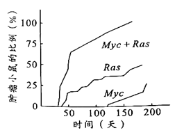
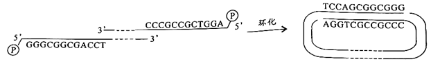
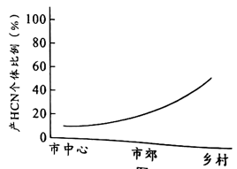
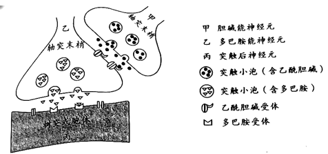
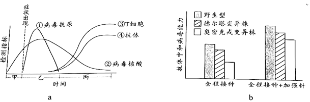
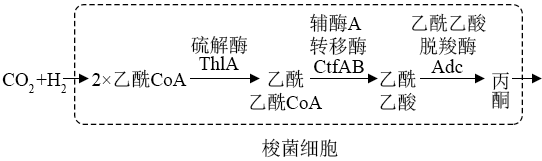

**2022年广东省普通高中学业水平选择性考试**

**生物学**

**一、选择题：**

1\. 2022年4月，习近平总书记在海南省考察时指出，热带雨林国家公园是国宝，是水库、粮库、钱库，更是碳库，要充分认识其对国家的战略意义。从生态学的角度看，海南热带雨林的直接价值体现在其（ ）

A. 具有保持水土、涵养水源和净化水质功能，被誉为“绿色水库”

B. 是海南省主要河流发源地，可提供灌溉水源，保障农业丰产丰收

C. 形成了独特、多样性的雨林景观，是发展生态旅游的重要资源

D. 通过光合作用固定大气中CO2，在植被和土壤中积累形成碳库

2\. 我国自古“以农立国”，经过悠久岁月的积累，形成了丰富的农业生产技术体系。下列农业生产实践中，与植物生长调节剂使用直接相关的是（ ）

A. 秸秆还田 B. 间作套种 C. 水旱轮作 D. 尿泥促根

3\. 在2022年的北京冬奥会上，我国运动健儿取得了骄人的成绩。在运动员的科学训练和比赛期间需要监测一些相关指标，下列指标中不属于内环境组成成分的是（ ）

A. 血红蛋白 B. 血糖 C. 肾上腺素 D. 睾酮

4\. 用洋葱根尖制作临时装片以观察细胞有丝分裂，如图为光学显微镜下观察到的视野。下列实验操作正确的是（ ）

A. 根尖解离后立即用龙胆紫溶液染色，以防解离过度

B. 根尖染色后置于载玻片上捣碎，加上盖玻片后镜检

C. 找到分生区细胞后换高倍镜并使用细准焦螺旋调焦

D. 向右下方移动装片可将分裂中期细胞移至视野中央

5\. 下列关于遗传学史上重要探究活动的叙述，错误的是（ ）

A. 孟德尔用统计学方法分析实验结果发现了遗传规律

B. 摩尔根等基于性状与性别的关联证明基因在染色体上

C. 赫尔希和蔡斯用对比实验证明DNA是遗传物质

D. 沃森和克里克用DNA衍射图谱得出碱基配对方式

6\. 如图示某生态系统食物网，其中字母表示不同的生物，箭头表示能量流动的方向。下列归类正确的是（ ）

A. a、c是生产者 B. b、e是肉食动物

C. c、f是杂食动物 D. d、f是植食动物

7\. 拟南芥HPR1蛋白定位于细胞核孔结构，功能是协助mRNA转移。与野生型相比，推测该蛋白功能缺失的突变型细胞中，有更多mRNA分布于（ ）

A. 细胞核 B. 细胞质 C. 高尔基体 D. 细胞膜

8\. 将正常线粒体各部分分离，结果见图。含有线粒体DNA的是（ ）

A. ① B. ② C. ③ D. ④

9\. 酵母菌sec系列基因的突变会影响分泌蛋白的分泌过程，某突变酵母菌菌株的分泌蛋白最终积累在高尔基体中。此外，还可能检测到分泌蛋白的场所是（ ）

A. 线粒体、囊泡 B. 内质网、细胞外

C. 线粒体、细胞质基质 D. 内质网、囊泡

10\. 种子质量是农业生产的前提和保障。生产实践中常用TTC法检测种子活力，TTC（无色）进入活细胞后可被\[H\]还原成TTF（红色）。大豆充分吸胀后，取种胚浸于0.5%TTC溶液中，30℃保温一段时间后部分种胚出现红色。下列叙述正确的是（ ）

A. 该反应需要在光下进行

B. TTF可在细胞质基质中生成

C. TTF生成量与保温时间无关

D 不能用红色深浅判断种子活力高低

11\. 为研究人原癌基因Myc和Ras的功能，科学家构建了三组转基因小鼠（Myc、Ras及Mc+Ras，基因均大量表达），发现这些小鼠随时间进程体内会出现肿瘤（如图）。下列叙述正确的是（ ）

A. 原癌基因的作用是阻止细胞正常增殖

B. 三组小鼠的肿瘤细胞均没有无限增殖的能力

C. 两种基因在人体细胞内编码功能异常的蛋白质

D. 两种基因大量表达对小鼠细胞癌变有累积效应

12\. λ噬菌体的线性双链DNA两端各有一段单链序列。这种噬菌体在侵染大肠杆菌后其DNA会自连环化（如图），该线性分子两端能够相连的主要原因是（ ）

A. 单链序列脱氧核苷酸数量相等

B. 分子骨架同为脱氧核糖与磷酸

C. 单链序列的碱基能够互补配对

D. 自连环化后两条单链方向相同

13\. 某同学对蛋白酶TSS的最适催化条件开展初步研究，结果见下表。下列分析错误的是（ ）

| 组别 | pH  | CaCl2 | 温度（℃） | 降解率（%） |
|:----:|:---:|:----------------:|:---------:|:-----------:|
|  ①   |  9  |        \+        |    90     |     38      |
|  ②   |  9  |        \+        |    70     |     88      |
|  ③   |  9  |        \-        |    70     |      0      |
|  ④   |  7  |        \+        |    70     |     58      |
|  ⑤   |  5  |        \+        |    40     |     30      |

注：+/-分别表示有/无添加，反应物为Ⅰ型胶原蛋白

A. 该酶的催化活性依赖于CaCl2

B. 结合①、②组的相关变量分析，自变量为温度

C. 该酶催化反应的最适温度70℃，最适pH9

D. 尚需补充实验才能确定该酶是否能水解其他反应物

14\. 白车轴草中有毒物质氢氰酸（HCN）的产生由H、h和D、d两对等位基因决定，H和D同时存在时，个体产HCN，能抵御草食动物的采食。如图示某地不同区域白车轴草种群中有毒个体比例，下列分析错误的是（ ）

A. 草食动物是白车轴草种群进化的选择压力

B. 城市化进程会影响白车轴草种群的进化

C. 与乡村相比，市中心种群中h的基因频率更高

D. 基因重组会影响种群中H、D的基因频率

15\. 研究多巴胺的合成和释放机制，可为帕金森病（老年人多发性神经系统疾病）的防治提供实验依据，最近研究发现在小鼠体内多巴胺的释放可受乙酰胆碱调控，该调控方式通过神经元之间的突触联系来实现（如图）。据图分析，下列叙述错误的是（ ）

A. 乙释放的多巴胺可使丙膜的电位发生改变

B. 多巴胺可在甲与乙、乙与丙之间传递信息

C. 从功能角度看，乙膜既是突触前膜也是突触后膜

D. 乙膜上的乙酰胆碱受体异常可能影响多巴胺的释放

16\. 遗传病监测和预防对提高我国人口素质有重要意义。一对表现型正常的夫妇，生育了一个表现型正常的女儿和一个患镰刀型细胞贫血症的儿子（致病基因位于11号染色体上，由单对碱基突变引起）。为了解后代的发病风险，该家庭成员自愿进行了相应的基因检测（如图）。下列叙述错误的是（ ）

A. 女儿和父母基因检测结果相同概率是2/3

B. 若父母生育第三胎，此孩携带该致病基因的概率是3/4

C. 女儿将该致病基因传递给下一代的概率是1/2

D. 该家庭的基因检测信息应受到保护，避免基因歧视

**二、非选择题：**

**（一）必考题：**

17\. 迄今新型冠状病毒仍在肆虐全球，我国始终坚持“人民至上，生命至上”的抗疫理念和动态清零的防疫总方针。图中a示免疫力正常的人感染新冠病毒后，体内病毒及免疫指标的变化趋势。

回答下列问题：

（1）人体感染新冠病毒初期，\_\_\_\_\_\_\_\_\_\_\_\_\_\_\_\_免疫尚未被激活，病毒在其体内快速增殖（曲线①、②上升部分）。曲线③、④上升趋势一致，表明抗体的产生与T细胞数量的增加有一定的相关性，其机理是\_\_\_\_\_\_\_\_\_\_\_\_\_\_\_\_。此外，T细胞在抗病毒感染过程中还参与\_\_\_\_\_\_\_\_\_\_\_\_\_\_\_\_过程。

（2）准确、快速判断个体是否被病毒感染是实现动态清零的前提。目前除了核酸检测还可以使用抗原检测法，因其方便快捷可作为补充检测手段，但抗原检测的敏感性相对较低，据图a分析，抗原检测在\_\_\_\_\_\_\_\_\_\_\_\_\_\_\_\_时间段内进行才可能得到阳性结果，判断的依据是此阶段\_\_\_\_\_\_\_\_\_\_\_\_\_\_\_\_。

（3）接种新冠病毒疫苗能大幅降低重症和死亡风险。图b示一些志愿受试者完成接种后，体内产生的抗体对各种新冠病毒毒株中和作用的情况。据图分析，当前能为个体提供更有效保护作用的疫苗接种措施是\_\_\_\_\_\_\_\_\_\_\_\_\_\_\_\_。

18\. 研究者将玉米幼苗置于三种条件下培养10天后（图a），测定相关指标（图b），探究遮阴比例对植物影响。

回答下列问题：

（1）结果显示，与A组相比，C组叶片叶绿素含量\_\_\_\_\_\_\_\_\_\_\_\_\_\_\_\_，原因可能是\_\_\_\_\_\_\_\_\_\_\_\_\_\_\_\_。

（2）比较图10b中B1与A组指标的差异，并结合B2相关数据，推测B组的玉米植株可能会积累更多的\_\_\_\_\_\_\_\_\_\_\_\_\_\_\_\_，因而生长更快。

（3）某兴趣小组基于上述B组条件下玉米生长更快的研究结果，作出该条件可能会提高作物产量的推测，由此设计了初步实验方案进行探究：

实验材料：选择前期\_\_\_\_\_\_\_\_\_\_\_\_\_\_\_\_一致、生长状态相似的某玉米品种幼苗90株。

实验方法：按图10a所示的条件，分A、B、C三组培养玉米幼苗，每组30株；其中以\_\_\_\_\_\_\_\_\_\_\_\_\_\_\_\_为对照，并保证除\_\_\_\_\_\_\_\_\_\_\_\_\_\_\_\_外其他环境条件一致。收获后分别测量各组玉米的籽粒重量。

结果统计：比较各组玉米的平均单株产量。

分析讨论：如果提高玉米产量的结论成立，下一步探究实验的思路是\_\_\_\_\_\_\_\_\_\_\_\_\_\_\_\_。

19\. 《诗经》以“蚕月条桑”描绘了古人种桑养蚕的劳动画面，《天工开物》中“今寒家有将早雄配晚雌者，幻出嘉种”，表明我困劳动人民早已拥有利用杂交手段培有蚕种的智慧，现代生物技术应用于蚕桑的遗传育种，更为这历史悠久的产业增添了新的活力。回答下列问题：

（1）自然条件下蚕采食桑叶时，桑叶会合成蛋白醇抑制剂以抵御蚕的采食，蚕则分泌更多的蛋白酶以拮抗抑制剂的作用。桑与蚕相互作用并不断演化的过程称为\_\_\_\_\_\_\_\_\_\_\_\_\_\_\_\_。

（2）家蚕的虎斑对非虎斑、黄茧对白茧、敏感对抗软化病为显性，三对性状均受常染色体上的单基因控制且独立遗传。现有上述三对基因均杂合的亲本杂交，F1中虎斑、白茧、抗软化病的家蚕比例是\_\_\_\_\_\_\_\_\_\_\_\_\_\_\_\_；若上述杂交亲本有8对，每只雌蚕平均产卵400枚，理论上可获得\_\_\_\_\_\_\_\_\_\_\_\_\_\_\_\_只虎斑、白茧、抗软化病的纯合家蚕，用于留种。

（3）研究小组了解到：①雄蚕产丝量高于雌蚕；②家蚕性别决定为ZW型；③卵壳的黑色（B）和白色（b）由常染色体上的一对基因控制；④黑壳卵经射线照射后携带B基因的染色体片段可转移到其他染色体上且能正常表达。为达到基于卵壳颜色实现持续分离雌雄，满足大规模生产对雄蚕需求的目的，该小组设计了一个诱变育种的方案。下图为方案实施流程及得到的部分结果。

统计多组实验结果后，发现大多数组别家蚕的性别比例与I组相近，有两组（Ⅱ、Ⅲ）的性别比例非常特殊。综合以上信息进行分析：

①Ⅰ组所得雌蚕的B基因位于\_\_\_\_\_\_\_\_\_\_\_\_\_\_\_\_染色体上。

②将Ⅱ组所得雌蚕与白壳卵雄蚕（bb）杂交，子代中雌蚕的基因型是\_\_\_\_\_\_\_\_\_\_\_\_\_\_\_\_（如存在基因缺失，亦用b表示）。这种杂交模式可持续应用于生产实践中，其优势是可在卵期通过卵壳颜色筛选即可达到分离雌雄的目的。

③尽管Ⅲ组所得黑壳卵全部发育成雄蚕，但其后代仍无法实现持续分离雌雄，不能满足生产需求，请简要说明理由\_\_\_\_\_\_\_\_\_\_\_\_\_\_\_\_。

20\. 荔枝是广东特色农产品，其产量和品质一直是果农关注的问题。荔枝园A采用常规管理，果农使用化肥、杀虫剂和除草剂等进行管理，林下几乎没有植被，荔枝产量高；荔枝园B与荔枝园A面积相近，但不进行人工管理，林下植被丰富，荔枝产量低。研究者调查了这两个荔枝园中的节肢动物种类、个体数量及其中害虫、天敌的比例，结果见下表。

<table style="width:100%;">
<colgroup>
<col style="width: 12%" />
<col style="width: 17%" />
<col style="width: 23%" />
<col style="width: 23%" />
<col style="width: 23%" />
</colgroup>
<thead>
<tr>
<th style="text-align: center;">荔枝园</th>
<th style="text-align: center;">种类（种）</th>
<th style="text-align: center;">个体数量（头）</th>
<th style="text-align: center;">害虫比例（%）</th>
<th style="text-align: center;">天敌比例（%）</th>
</tr>
</thead>
<tbody>
<tr>
<td style="text-align: center;">
A

B
</td>
<td style="text-align: center;">
523

568
</td>
<td style="text-align: center;">
103278

104118
</td>
<td style="text-align: center;">
36.67

40.86
</td>
<td style="text-align: center;">
14.10

20.40
</td>
</tr>
</tbody>
</table>

回答下列问题：

（1）除了样方法，研究者还利用一些昆虫有\_\_\_\_\_\_\_\_\_\_\_\_\_\_\_\_性，采用了灯光诱捕法进行取样。

（2）与荔枝园A相比，荔枝园B的节肢动物物种丰富度\_\_\_\_\_\_\_\_\_\_\_\_\_\_\_\_，可能的原因是林下丰富的植被为节肢动物提供了\_\_\_\_\_\_\_\_\_\_\_\_\_\_\_\_，有利于其生存。

（3）与荔枝园B相比，荔枝园A的害虫和天敌的数量\_\_\_\_\_\_\_\_\_\_\_\_\_\_\_\_，根据其管理方式分析，主要原因可能是\_\_\_\_\_\_\_\_\_\_\_\_\_\_\_\_。

（4）使用除草剂清除荔枝园A的杂草是为了避免杂草竞争土壤养分，但形成了单层群落结构，使节肢动物物种多样性降低。试根据群落结构及种间关系原理，设计一个生态荔枝园简单种植方案（要求：不用氮肥和除草剂、少用杀虫剂，具有复层群落结构），并简要说明设计依据\_\_\_\_\_\_\_\_\_\_\_\_\_。

**（二）选考题：**

**【选修1：生物技术实践】**

21\. 研究深海独特的生态环境对于开发海洋资源具有重要意义。近期在“科学号”考察船对南中国海科考中，中国科学家采集了某海域1146米深海冷泉附近沉积物样品，分离、鉴定得到新的微生物菌株并进一步研究了其生物学特性。

回答下列问题：

（1）研究者先制备富集培养基，然后采用\_\_\_\_\_\_\_\_\_\_\_\_\_\_\_\_法灭菌，冷却后再接入沉积物样品，28℃厌氧培养一段时间后，获得了含拟杆菌的混合培养物，为了获得纯种培养，除了稀释涂布平板法，还可采用\_\_\_\_\_\_\_\_\_\_\_\_\_\_\_\_法。据图分析，拟杆菌新菌株在以\_\_\_\_\_\_\_\_\_\_\_\_\_\_\_\_为碳源时生长状况最好。

（2）研究发现，将采集的样品置于各种培养基中培养，仍有很多微生物不能被分离筛选出来，推测其原因可能是\_\_\_\_\_\_\_\_\_\_\_\_\_\_\_\_。（答一点即可）

（3）藻类细胞解体后的难度解多糖物质，通常会聚集形成碎屑沉降到深海底部。从生态系绘组成成分的角度考虑，拟杆菌对深海生态系统碳循环的作用可能是\_\_\_\_\_\_\_\_\_\_\_\_\_\_\_\_。

（4）深海冷泉环境特殊，推测此环境下生存的拟杆菌所分泌物各种多糖降解酶，除具有酶的一般共性外，其特性可能还有\_\_\_\_\_\_\_\_\_\_\_\_\_\_\_\_。

**【选修3：现代生物科技专题】**

22\. “绿水透迤去，青山相向开”大力发展低碳经济已成为全社会的共识。基于某些梭菌的特殊代谢能力，有研究者以某些工业废气（含CO2等一碳温室气体，多来自高污染排放企业）为原料，通过厌氧发酵生产丙酮，构建一种生产高附加值化工产品的新技术。

回答下列问题：

（1）研究者针对每个需要扩增的酶基因（如图）设计一对\_\_\_\_\_\_\_\_\_\_\_\_\_\_\_\_，利用PCR技术，在优化反应条件后扩增得到目标酶基因。

（2）研究者构建了一种表达载体pMTL80k，用于在梭菌中建立多基因组合表达库，经筛选后提高丙酮的合成量。该载体包括了启动子、终止子及抗生素抗性基因等，其中抗生素抗性基因的作用是\_\_\_\_\_\_\_\_\_\_\_\_\_\_\_\_，终止子的作用是\_\_\_\_\_\_\_\_\_\_\_\_\_\_\_\_。

（3）培养过程中发现重组梭菌大量表达上述酶蛋白时，出现了生长迟缓的现象，推测其原因可能是\_\_\_\_\_\_\_\_\_\_\_\_\_\_\_\_，此外丙酮的积累会伤害细胞，需要进一步优化菌株和工艺才能扩大应用规模。

（4）这种生产高附加值化工产品的新技术，实现了\_\_\_\_\_\_\_\_\_\_\_\_\_\_\_\_，体现了循环经济特点。从“碳中和”的角度看，该技术的优势在于\_\_\_\_\_\_\_\_\_\_\_\_\_\_\_\_，具有广泛的应用前景和良好的社会效益。
