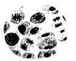
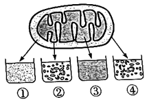
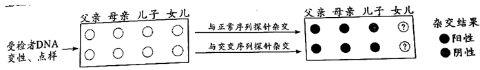
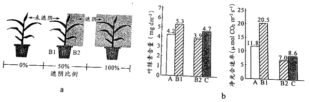
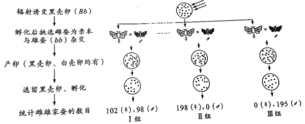
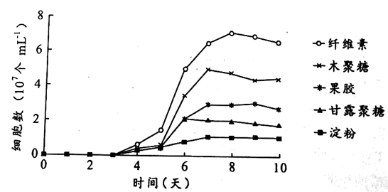

**2022年广东省普通高中学业水平选择性考试**

**生物学**

**一、选择题：**

1\. 2022年4月，习近平总书记在海南省考察时指出，热带雨林国家公园是国宝，是水库、粮库、钱库，更是碳库，要充分认识其对国家的战略意义。从生态学的角度看，海南热带雨林的直接价值体现在其（ ）

A. 具有保持水土、涵养水源和净化水质功能，被誉为“绿色水库”

B. 是海南省主要河流发源地，可提供灌溉水源，保障农业丰产丰收

C. 形成了独特、多样性的雨林景观，是发展生态旅游的重要资源

D. 通过光合作用固定大气中CO2，在植被和土壤中积累形成碳库

【答案】C

【解析】

【分析】生物多样性的价值：（1）直接价值：对人类有食用、药用和工业原料等使用意义以及有旅游观赏、科学研究和文学艺术创作等非实用意义的。（2）间接价值：对生态系统起重要调节作用的价值（生态功能）。（3）潜在价值：目前人类不清楚的价值。

【详解】A、 保持水土、涵养水源和净化水质功能是生态系统调节方面的作用，属于间接价值，A不符合题意；

B、 是海南省主要河流发源地，能提供灌溉水，保障农业丰收主要是热带雨林生态调节的体现，属于间接价值，B不符合题意；

C、 形成了独特、多样性的雨林景观，是发展生态旅游的重要资源，属于旅游观赏价值，是直接价值的体现，C符合题意；

D、 通过光合作用固定大气中CO2，在植被和土壤中积累形成碳库，是其在碳循环等环境调节方面的作用，属于间接价值，D不符合题意。

故选C

2\. 我国自古“以农立国”，经过悠久岁月的积累，形成了丰富的农业生产技术体系。下列农业生产实践中，与植物生长调节剂使用直接相关的是（ ）

A. 秸秆还田 B. 间作套种 C. 水旱轮作 D. 尿泥促根

【答案】D

【解析】

【分析】植物生长调节剂是指由人工合成的对植物生长发育有调节作用的化学物质，其优点有 容易合成、原料广泛、效果稳定等。

【详解】A、 农田生态系统中秸秆还田有利于提高土壤的储碳量，该过程主要是利用了物质循环的特点，与植物生长调节剂无直接关系，A不符合题意；

B、 采用间作、套种的措施可以提高植物产量，其原理是保证作物叶片充分接收阳光，提高光能利用率，与植物生长调节剂无直接关系，B不符合题意；

C、 水旱轮作改变了生态环境和食物链，使害虫无法生存，能减少病虫害的发生，与植物生长调节剂无直接关系，C不符合题意；

D、 尿泥促根与生长素（类似物）密切相关，与题意相符，D符合题意。

故选D。

3\. 在2022年的北京冬奥会上，我国运动健儿取得了骄人的成绩。在运动员的科学训练和比赛期间需要监测一些相关指标，下列指标中不属于内环境组成成分的是（ ）

A. 血红蛋白 B. 血糖 C. 肾上腺素 D. 睾酮

【答案】A

【解析】

【分析】内环境主要由组织液、血浆、淋巴等组成，消化道、呼吸道、生殖道等都是直接与外界相通的，不属于内环境；细胞内的成分也不属于内环境。

【详解】A、 血红蛋白位于红细胞内，细胞内的物质不属于内环境成分，A符合题意；

B、 血糖属于营养物质，可存在于内环境中，属于内环境的组成成分，B不符合题意；

C、 肾上腺素属于激素，作为调节物质（信号分子）可存在于内环境中，属于内环境的组成成分，C不符合题意；

D、 睾酮属于雄激素，可作为调节物质（信号分子）存在于内环境中，属于内环境的组成成分，D不符合题意。

故选A。

4\. 用洋葱根尖制作临时装片以观察细胞有丝分裂，如图为光学显微镜下观察到的视野。下列实验操作正确的是（ ）

A. 根尖解离后立即用龙胆紫溶液染色，以防解离过度

B. 根尖染色后置于载玻片上捣碎，加上盖玻片后镜检

C. 找到分生区细胞后换高倍镜并使用细准焦螺旋调焦

D. 向右下方移动装片可将分裂中期细胞移至视野中央

【答案】C

【解析】

【分析】观察细胞有丝分裂实验的步骤：解离（解离液由盐酸和酒精组成，目的是使细胞分散开来）、漂洗（洗去解离液，便于染色）、染色（用碱性染料）、制片（该过程中压片是为了将根尖细胞压成薄层，使之不相互重叠影响观察）和观察（先低倍镜观察，后高倍镜观察）。

【详解】A、 根尖解离后需要先漂洗，洗去解离液后再进行染色，A错误；

B、 将已经染色的根尖置于载玻片上，加一滴清水后 ，用镊子将根尖弄碎，盖上盖玻片后需要用拇指轻轻按压盖玻片，使细胞分散开，再进行观察，B错误；

C、 在低倍镜下找到分生区细胞（呈正方形，排列紧密）后，再换用高倍镜进行观察，此时为使视野清晰，需要用细准焦螺旋进行调焦，C正确；

D、 分裂中期的染色体着丝点整齐排列在赤道板上，据图可知，图示中期细胞位于左上方，故需要向左上方移动装片将分裂中期的细胞移至视野中央，D错误。

故选C。

5\. 下列关于遗传学史上重要探究活动的叙述，错误的是（ ）

A. 孟德尔用统计学方法分析实验结果发现了遗传规律

B. 摩尔根等基于性状与性别的关联证明基因在染色体上

C. 赫尔希和蔡斯用对比实验证明DNA是遗传物质

D. 沃森和克里克用DNA衍射图谱得出碱基配对方式

【答案】D

【解析】

【分析】1、孟德尔发现遗传定律用了假说演绎法，其基本步骤:提出问题→作出假说→演绎推理→实验验证(测交实验) →得出结论。

2、 萨顿运用类比推理的方法提出基因在染色体的假说，摩尔根运用假说演绎法证明基因在染色体上。

3、赫尔希和蔡斯进行了T2噬菌体侵染细菌的实验，实验步骤:分别用35S或32P标记噬菌体→噬菌体侵染未被标记的细菌→在搅拌器中搅拌，然后离心，检测上清液和沉淀物中的放射性物质，证明了DNA是遗传物质。

4、沃森和克里克用建构物理模型的方法研究DNA的结构。

【详解】A、孟德尔用统计学方法分析杂合子自交子代的表现型及比例，发现了遗传规律，A正确；

B、摩尔根等基于果蝇眼色与性别的关联，证明了基因在染色体上，B正确；

C、赫尔希和蔡斯分别用32P和35S标记T2噬菌体DNA和蛋白质，通过对比两组实验结果，证明了DNA是遗传物质，C正确；

D、沃森和克里克用DNA衍射图谱得出了DNA的螺旋结构，得出碱基配对方式是通过化学分析的方法，D错误。

故选D。

6\. 如图示某生态系统的食物网，其中字母表示不同的生物，箭头表示能量流动的方向。下列归类正确的是（ ）

A. a、c是生产者 B. b、e是肉食动物

C. c、f是杂食动物 D. d、f是植食动物

【答案】C

【解析】

【分析】分析题图，a、b是生产者，c和f是最高营养级。

【详解】A、a在食物链的起点，是生产者，c能捕食b等，属于消费者，A错误；

B、b在食物链的起点，是生产者，B错误；

C、c和f都能捕食生产者a、b，也都能捕食消费者e，所以c和f属于杂食动物，C正确；

D、d是植食动物，但由C选项解析可知，f属于杂食动物，D错误。

故选C。

7\. 拟南芥HPR1蛋白定位于细胞核孔结构，功能是协助mRNA转移。与野生型相比，推测该蛋白功能缺失的突变型细胞中，有更多mRNA分布于（ ）

A. 细胞核 B. 细胞质 C. 高尔基体 D. 细胞膜

【答案】A

【解析】

【分析】在细胞核中，以DNA的一条链为模板，转录得到的mRNA会从核孔出去，与细胞质的核糖体结合，继续进行翻译过程。

【详解】分析题意，野生型的拟南芥HPR1蛋白时位于核孔协助mRNA转移的，mRNA是转录的产物，翻译的模板，故可推测其转移方向是从细胞核内通过核孔到细胞核外，因此该蛋白功能缺失的突变型细胞，不能协助mRNA转移，mRNA会聚集在细胞核中，A正确。

故选A。

8\. 将正常线粒体各部分分离，结果见图。含有线粒体DNA的是（ ）

A. ① B. ② C. ③ D. ④

【答案】C

【解析】

【分析】①指线粒体内膜和外膜的间隙，②指线粒体内膜，③指线粒体基质，④指线粒体外膜。

【详解】线粒体DNA分布于线粒体基质，故将正常线粒体各部分分离后，线粒体DNA应该位于线粒体基质③中，C正确。

故选C。

9\. 酵母菌sec系列基因的突变会影响分泌蛋白的分泌过程，某突变酵母菌菌株的分泌蛋白最终积累在高尔基体中。此外，还可能检测到分泌蛋白的场所是（ ）

A. 线粒体、囊泡 B. 内质网、细胞外

C. 线粒体、细胞质基质 D. 内质网、囊泡

【答案】D

【解析】

【分析】分泌蛋白在核糖体上合成，然后进入内质网进行肽链初加工，再以囊泡的形式转移到高尔基体，进行进一步的加工、分类和包装。

【详解】AC、线粒体为分泌蛋白的合成、加工、运输提供能量，分泌蛋白不会进入线粒体，AC错误；

B、根据题意，分泌蛋白高尔基体中积累，不会分泌到细胞外，B错误；

D、内质网中初步加工的分泌蛋白以囊泡的形式转移到高尔基体，内质网、囊泡中会检测到分泌蛋白，D正确。

故选D。

10\. 种子质量是农业生产的前提和保障。生产实践中常用TTC法检测种子活力，TTC（无色）进入活细胞后可被\[H\]还原成TTF（红色）。大豆充分吸胀后，取种胚浸于0.5%TTC溶液中，30℃保温一段时间后部分种胚出现红色。下列叙述正确的是（ ）

A. 该反应需要在光下进行

B. TTF可在细胞质基质中生成

C. TTF生成量与保温时间无关

D. 不能用红色深浅判断种子活力高低

【答案】B

【解析】

【分析】种子不能进行光合作用，\[H\]应是通过有氧呼吸第一、二阶段产生。有氧呼吸强度受温度、氧气浓度影响。

【详解】A、大豆种子充分吸水胀大，此时子叶未形成叶绿体，不能进行光合作用，该反应不需要在光下进行，A错误；

B、细胞质基质中可通过细胞呼吸第一阶段产生\[H\]，TTF可在细胞质基质中生成，B正确；

C、保温时间较长时，较多的TTC进入活细胞，生成较多的红色TTF，C错误；

D、相同时间内，种胚出现的红色越深，说明种胚代谢旺盛，据此可判断种子活力的高低，D错误。

故选B。

11\. 为研究人原癌基因Myc和Ras的功能，科学家构建了三组转基因小鼠（Myc、Ras及Mc+Ras，基因均大量表达），发现这些小鼠随时间进程体内会出现肿瘤（如图）。下列叙述正确的是（ ）

A. 原癌基因的作用是阻止细胞正常增殖

B. 三组小鼠的肿瘤细胞均没有无限增殖的能力

C. 两种基因在人体细胞内编码功能异常的蛋白质

D. 两种基因大量表达对小鼠细胞癌变有累积效应

【答案】D

【解析】

【分析】人和动物细胞的染色体上本来就存在着与癌有关的基因:原癌基因和抑癌基因。致癌因子使原癌基因和抑癌基因发生突变，导致正常细胞的生长和分裂失控而变成癌细胞。

【详解】A、原癌基因主要负责调节细胞周期，控制细胞生长和分裂的进程。抑癌基因主要是阻止细胞不正常的增殖，A错误；

B、肿瘤细胞可无限增殖，B错误；

C、原癌基因的正常表达对于细胞正常的生长和分裂是必须的，原癌基因Myc和Ras在人体细胞内编码功能正常的蛋白质，C错误；

D、据图分析，同时转入Myc和Ras的小鼠中，肿瘤小鼠比例大于只转入Myc或Ras的小鼠，说明两种基因大量表达对小鼠细胞癌变有累积效应，D正确。

故选D。

12\. λ噬菌体的线性双链DNA两端各有一段单链序列。这种噬菌体在侵染大肠杆菌后其DNA会自连环化（如图），该线性分子两端能够相连的主要原因是（ ）

A. 单链序列脱氧核苷酸数量相等

B. 分子骨架同为脱氧核糖与磷酸

C. 单链序列的碱基能够互补配对

D. 自连环化后两条单链方向相同

【答案】C

【解析】

【分析】双链DNA的两条单链方向相反，脱氧核糖与磷酸交替连接构成DNA分子的基本骨架，两条单链之间的碱基互补配对。

【详解】AB、单链序列脱氧核苷酸数量相等、分子骨架同为脱氧核糖与磷酸交替连接，不能决定线性DNA分子两端能够相连，AB错误；

C、据图可知，单链序列的碱基能够互补配对，决定线性DNA分子两端能够相连，C正确；

D、DNA的两条链是反向的，因此自连环化后两条单链方向相反，D错误。

故选C。

13\. 某同学对蛋白酶TSS的最适催化条件开展初步研究，结果见下表。下列分析错误的是（ ）

| 组别 | pH  | CaCl2 | 温度（℃） | 降解率（%） |
|:----:|:---:|:----------------:|:---------:|:-----------:|
|  ①   |  9  |        \+        |    90     |     38      |
|  ②   |  9  |        \+        |    70     |     88      |
|  ③   |  9  |        \-        |    70     |      0      |
|  ④   |  7  |        \+        |    70     |     58      |
|  ⑤   |  5  |        \+        |    40     |     30      |

注：+/-分别表示有/无添加，反应物为Ⅰ型胶原蛋白

A. 该酶的催化活性依赖于CaCl2

B. 结合①、②组的相关变量分析，自变量为温度

C. 该酶催化反应的最适温度70℃，最适pH9

D. 尚需补充实验才能确定该酶是否能水解其他反应物

【答案】C

【解析】

【分析】分析表格信息可知，降解率越高说明酶活性越高，故②组酶的活性最高，此时pH为9，需要添加CaCl2，温度为70℃。

【详解】A、分析②③组可知，没有添加CaCl2，降解率为0，说明该酶的催化活性依赖于CaCl2，A正确；

B、分析①②变量可知，pH均为9，都添加了CaCl2，温度分别为90℃、70℃，故自变量为温度，B正确；

C、②组酶的活性最高，此时pH为9，温度为70℃，但由于分组较少，不能说明最适温度为70℃，最适pH为9，C错误；

D、该实验的反应物为Ⅰ型胶原蛋白，要确定该酶能否水解其他反应物还需补充实验，D正确。

故选C。

14\. 白车轴草中有毒物质氢氰酸（HCN）的产生由H、h和D、d两对等位基因决定，H和D同时存在时，个体产HCN，能抵御草食动物的采食。如图示某地不同区域白车轴草种群中有毒个体比例，下列分析错误的是（ ）

A. 草食动物是白车轴草种群进化的选择压力

B. 城市化进程会影响白车轴草种群的进化

C. 与乡村相比，市中心种群中h的基因频率更高

D. 基因重组会影响种群中H、D的基因频率

【答案】D

【解析】

【分析】分析题意可知：H、h和D、d基因决定HCN的产生，基因型为D_H_的个体能产生HCN，有毒，能抵御草食动物的采食。

【详解】A、分析题意可知，草食动物能采食白车轴草，故草食动物是白车轴草种群进化的选择压力，A正确；

B、分析题中曲线可知，从市中心到市郊和乡村，白车轴草种群中产HCN个体比例增加，说明城市化进程会影响白车轴草的进化，B正确；

C、与乡村相比，市中心种群中中产HCN个体比例小，即基因型为D_H_的个体所占比例小，d、h基因频率高，C正确；

D、基因重组是控制不同性状的基因的重新组合，基因重组不会影响种群基因频率，D错误。

故选D。

15\. 研究多巴胺的合成和释放机制，可为帕金森病（老年人多发性神经系统疾病）的防治提供实验依据，最近研究发现在小鼠体内多巴胺的释放可受乙酰胆碱调控，该调控方式通过神经元之间的突触联系来实现（如图）。据图分析，下列叙述错误的是（ ）

A. 乙释放的多巴胺可使丙膜的电位发生改变

B. 多巴胺可在甲与乙、乙与丙之间传递信息

C. 从功能角度看，乙膜既是突触前膜也是突触后膜

D. 乙膜上的乙酰胆碱受体异常可能影响多巴胺的释放

【答案】B

【解析】

【分析】分析题图可知：甲释放神经递质乙酰胆碱，作用于乙后促进乙释放多巴胺，多巴胺作用于丙。

【详解】A、多巴胺是乙释放的神经递质，与丙上的受体结合后会使其膜发生电位变化，A正确；

B、分析题图可知，多巴胺可在乙与丙之间传递信息，不能在甲和乙之间传递信息，B错误；

C、分析题图可知，乙膜既是乙酰胆碱作用的突触后膜，又是释放多巴胺的突触前膜，C正确；

D、多巴胺的释放受乙酰胆碱的调控，故乙膜上的乙酰胆碱受体异常可能影响多巴胺的释放，D正确。

故选B。

16\. 遗传病监测和预防对提高我国人口素质有重要意义。一对表现型正常的夫妇，生育了一个表现型正常的女儿和一个患镰刀型细胞贫血症的儿子（致病基因位于11号染色体上，由单对碱基突变引起）。为了解后代的发病风险，该家庭成员自愿进行了相应的基因检测（如图）。下列叙述错误的是（ ）

A. 女儿和父母基因检测结果相同的概率是2/3

B. 若父母生育第三胎，此孩携带该致病基因的概率是3/4

C. 女儿将该致病基因传递给下一代的概率是1/2

D. 该家庭的基因检测信息应受到保护，避免基因歧视

【答案】C

【解析】

【分析】分析题意可知：一对表现正常的夫妇，生理一个患镰刀型细胞贫血症的儿子，且致病基因位于常染色体11号上，故该病受常染色体隐性致病基因控制。

【详解】A、该病受常染色体隐性致病基因控制，假设相关基因用A、a表示。分析题图可知，父母的基因型为杂合子Aa，女儿的基因型可能为显性纯合子AA或杂合子Aa，为杂合子的概率是2/3，A正确；

B、若父母生育第三胎，此孩子携带致病基因基因型为杂合子Aa或隐性纯合子aa，概率为1/4+2/4=3/4，B正确；

C、女儿的基因型为1/3AA、2/3 Aa，将该基因传递给下一代的概率是1/3，C错误；

D、该家庭的基因检测信息属于隐私，应受到保护，D正确。

故选C。

**二、非选择题：**

**（一）必考题：**

17\. 迄今新型冠状病毒仍在肆虐全球，我国始终坚持“人民至上，生命至上”的抗疫理念和动态清零的防疫总方针。图中a示免疫力正常的人感染新冠病毒后，体内病毒及免疫指标的变化趋势。

回答下列问题：

（1）人体感染新冠病毒初期，\_\_\_\_\_\_\_\_\_\_\_\_\_\_\_\_免疫尚未被激活，病毒在其体内快速增殖（曲线①、②上升部分）。曲线③、④上升趋势一致，表明抗体的产生与T细胞数量的增加有一定的相关性，其机理是\_\_\_\_\_\_\_\_\_\_\_\_\_\_\_\_。此外，T细胞在抗病毒感染过程中还参与\_\_\_\_\_\_\_\_\_\_\_\_\_\_\_\_过程。

（2）准确、快速判断个体是否被病毒感染是实现动态清零的前提。目前除了核酸检测还可以使用抗原检测法，因其方便快捷可作为补充检测手段，但抗原检测的敏感性相对较低，据图a分析，抗原检测在\_\_\_\_\_\_\_\_\_\_\_\_\_\_\_\_时间段内进行才可能得到阳性结果，判断的依据是此阶段\_\_\_\_\_\_\_\_\_\_\_\_\_\_\_\_。

（3）接种新冠病毒疫苗能大幅降低重症和死亡风险。图b示一些志愿受试者完成接种后，体内产生的抗体对各种新冠病毒毒株中和作用的情况。据图分析，当前能为个体提供更有效保护作用的疫苗接种措施是\_\_\_\_\_\_\_\_\_\_\_\_\_\_\_\_。

【答案】（1） ①. 特异性 ②. 体液免疫中，抗原呈递细胞将抗原处理后呈递在细胞表面，然后传递给辅助性T细胞，辅助性T细胞表面的特定分子发生变化并与B细胞结合，激活B细胞，同时辅助性T细胞开始分裂、分化，并分泌细胞因子，促进B细胞增殖分化为记忆细胞和浆细胞，浆细胞分泌抗体 ③. 细胞免疫

（2） ①. 乙 ②. 含有病毒抗原，且病毒抗原含量先增加后减少 （3）全程接种+加强针

【解析】

【分析】体液免疫过程：抗原被抗原呈递细胞处理呈递给辅助性T细胞，辅助性T细胞产生细胞因子作用于B细胞，使其增殖分化成浆细胞和记忆B细胞，浆细胞产生抗体作用于抗原。

【小问1详解】

分析图a曲线可知，人体感染新冠病毒初期，曲线①②上升，说明病毒在其体内快速增殖，但抗体还未产生，说明此时特异性免疫尚未被激活。体液免疫中，抗原呈递细胞将抗原处理后呈递在细胞表面，然后传递给辅助性T细胞，辅助性T细胞表面的特定分子发生变化并与B细胞结合，激活B细胞；同时辅助性T细胞开始分裂、分化,并分泌细胞因子，促进B细胞增殖分化为记忆细胞和浆细胞，浆细胞分泌抗体，故抗体的产生与T细胞的数量的增加有一定相关性，即曲线③、④上升趋势一致。此外，T细胞在抗病毒感染过程中还参与细胞免疫过程。

【小问2详解】

分析图a可知，在甲乙丙时间段内，体内都有病毒核酸，故核酸检测准确、快速判断个体是否被病毒感染。乙时间段内含有病毒抗原，且病毒抗原含量先增加后减少，故抗原检测在乙时间段内进行才可能得到阳性结果

【小问3详解】

分析图b可知，完成全程接种+加强针的志愿受试者体内的抗体中和各种新冠病毒毒株的能力均明显高于全程接种的志愿受试者，故能为个体提供更有效保护作用的疫苗接种措施是全程接种+加强针。

18\. 研究者将玉米幼苗置于三种条件下培养10天后（图a），测定相关指标（图b），探究遮阴比例对植物的影响。

回答下列问题：

（1）结果显示，与A组相比，C组叶片叶绿素含量\_\_\_\_\_\_\_\_\_\_\_\_\_\_\_\_，原因可能是\_\_\_\_\_\_\_\_\_\_\_\_\_\_\_\_。

（2）比较图10b中B1与A组指标的差异，并结合B2相关数据，推测B组的玉米植株可能会积累更多的\_\_\_\_\_\_\_\_\_\_\_\_\_\_\_\_，因而生长更快。

（3）某兴趣小组基于上述B组条件下玉米生长更快的研究结果，作出该条件可能会提高作物产量的推测，由此设计了初步实验方案进行探究：

实验材料：选择前期\_\_\_\_\_\_\_\_\_\_\_\_\_\_\_\_一致、生长状态相似的某玉米品种幼苗90株。

实验方法：按图10a所示的条件，分A、B、C三组培养玉米幼苗，每组30株；其中以\_\_\_\_\_\_\_\_\_\_\_\_\_\_\_\_为对照，并保证除\_\_\_\_\_\_\_\_\_\_\_\_\_\_\_\_外其他环境条件一致。收获后分别测量各组玉米的籽粒重量。

结果统计：比较各组玉米的平均单株产量。

分析讨论：如果提高玉米产量的结论成立，下一步探究实验的思路是\_\_\_\_\_\_\_\_\_\_\_\_\_\_\_\_。

【答案】（1） ①. 高 ②. 遮阴条件下植物合成较多的叶绿素 （2）糖类等有机物

（3） ①. 光照条件 ②. A组 ③. 遮光程度 ④. 探究能提高作物产量的具体的最适遮光比例是多少

【解析】

【分析】分析题图a可知，A组未遮阴，B组植株一半遮阴（50%遮阴），C株全遮阴（100%遮阴）。

【小问1详解】

分析题图b结果可知，培养10天后，A组叶绿素含量为4.2，C组叶绿素含量为4.7，原因可能是遮阴条件下植物合成较多的叶绿素，以尽可能地吸收光能。

【小问2详解】

比较图b中B1叶绿素含量为 5.3，B2组的叶绿素含量为3.9，A组叶绿素含量为4.2；B1净光合速率为20.5，B2组的净光合速率为7.0，A组净光合速率为11.8，可推测B组的玉米植株总叶绿素含量为（5.3+3.9）/2=4.6，净光合速率为（20.5+7.0）/2=13.75，两项数据B组均高于A组，推测B组可能会积累更多的糖类等有机物，因而生长更快。

【小问3详解】

分析题意可知，该实验目是探究B组条件下是否提高作物产量。该实验自变量为玉米遮光程度，因变量为作物产量，可用籽粒重量表示。实验设计应遵循对照原则、单一变量原则、等量原则等，无关变量应保持相同且适宜，故实验设计如下：实验材料：选择前期光照条件一致、生长状态相似的某玉米品种幼苗90株。实验方法：按图a所示条件，分为A、B、C三组培养玉米幼苗，每组30株；其中以为对照，并保证除遮光条件外其他环境条件一致，收获后分别测量各组玉米的籽粒重量。结果统计：比较各组玉米的平均单株产量。分析讨论：如果B组遮光条件下能提高作物产量，则下一步需要探究能提高作物产量的具体的最适遮光比例是多少。

19\. 《诗经》以“蚕月条桑”描绘了古人种桑养蚕的劳动画面，《天工开物》中“今寒家有将早雄配晚雌者，幻出嘉种”，表明我困劳动人民早已拥有利用杂交手段培有蚕种的智慧，现代生物技术应用于蚕桑的遗传育种，更为这历史悠久的产业增添了新的活力。回答下列问题：

（1）自然条件下蚕采食桑叶时，桑叶会合成蛋白醇抑制剂以抵御蚕的采食，蚕则分泌更多的蛋白酶以拮抗抑制剂的作用。桑与蚕相互作用并不断演化的过程称为\_\_\_\_\_\_\_\_\_\_\_\_\_\_\_\_。

（2）家蚕的虎斑对非虎斑、黄茧对白茧、敏感对抗软化病为显性，三对性状均受常染色体上的单基因控制且独立遗传。现有上述三对基因均杂合的亲本杂交，F1中虎斑、白茧、抗软化病的家蚕比例是\_\_\_\_\_\_\_\_\_\_\_\_\_\_\_\_；若上述杂交亲本有8对，每只雌蚕平均产卵400枚，理论上可获得\_\_\_\_\_\_\_\_\_\_\_\_\_\_\_\_只虎斑、白茧、抗软化病的纯合家蚕，用于留种。

（3）研究小组了解到：①雄蚕产丝量高于雌蚕；②家蚕的性别决定为ZW型；③卵壳的黑色（B）和白色（b）由常染色体上的一对基因控制；④黑壳卵经射线照射后携带B基因的染色体片段可转移到其他染色体上且能正常表达。为达到基于卵壳颜色实现持续分离雌雄，满足大规模生产对雄蚕需求的目的，该小组设计了一个诱变育种的方案。下图为方案实施流程及得到的部分结果。

统计多组实验结果后，发现大多数组别家蚕的性别比例与I组相近，有两组（Ⅱ、Ⅲ）的性别比例非常特殊。综合以上信息进行分析：

①Ⅰ组所得雌蚕的B基因位于\_\_\_\_\_\_\_\_\_\_\_\_\_\_\_\_染色体上。

②将Ⅱ组所得雌蚕与白壳卵雄蚕（bb）杂交，子代中雌蚕的基因型是\_\_\_\_\_\_\_\_\_\_\_\_\_\_\_\_（如存在基因缺失，亦用b表示）。这种杂交模式可持续应用于生产实践中，其优势是可在卵期通过卵壳颜色筛选即可达到分离雌雄的目的。

③尽管Ⅲ组所得黑壳卵全部发育成雄蚕，但其后代仍无法实现持续分离雌雄，不能满足生产需求，请简要说明理由\_\_\_\_\_\_\_\_\_\_\_\_\_\_\_\_。

【答案】（1）协同进化

（2） ①. 3/64 ②. 50

（3） ①. 常 ②. ZbWB ③. Ⅲ组所得黑壳卵雄蚕为杂合子（基因型为ZBZb），与白壳卵雌蚕杂交，后代的黑壳卵和白壳卵中均既有雌性又有雄性，无法通过卵壳颜色区分性别

【解析】

【分析】家蚕的性别决定方式是ZW型，雌蚕的性染色体组成是ZW，雄蚕的性染色体组成是ZZ。

【小问1详解】

不同物种之间、生物与无机环境之间在相互影响中不断进化和发展，这就是协同进化。

【小问2详解】

由题意可知，三对性状均受常染色体上的单基因控制且独立遗传，即符合自由组合定律，将三对基因均杂合的亲本杂交，可先将三对基因分别按照分离定律计算，再将结果相乘，即F1各对性状中，虎斑个体占3/4，白茧个体占1/4，抗软化病个体占1/4，相乘后F1中虎斑、白茧、抗软化病的家蚕比例是3/4×1/4×1/4=3/64。若上述杂交亲本有8对，每只雌蚕平均产卵400枚，子代总产卵数为8×400=3200枚，其中虎斑、白茧、抗软化病的纯合家蚕占1/4×1/4×1/4=1/64，即3200×1/64=50只。

【小问3详解】

分析题意和图11方案可知，黑卵壳经射线照射后，携带B基因的染色体片段转移到其他染色体上，转移情况可分为三种，即携带B基因的染色体片段可转移到常染色体上、转移到Z染色体上或转移到W染色体上。将诱变孵化后挑选的雌蚕作为亲本与雄蚕（bb）杂交，统计子代的黑卵壳孵化后雌雄家蚕的数目，结合图11的三组结果分析，Ⅰ组黑卵壳家蚕中雌雄比例接近1：1，说明该性状与性别无关，即携带B基因的染色体片段转移到了常染色体上；Ⅱ组黑卵壳家蚕全为雌性，说明携带B基因的染色体片段转移到了W染色体上；Ⅲ组黑卵壳家蚕全为雄性，说明携带B基因的染色体片段转移到了Z染色体上。

①由以上分析可知，Ⅰ组携带B基因的染色体片段转移到了常染色体上，即所得雌蚕的B基因位于常染色体上。

②由以上分析可知，Ⅱ组携带B基因的染色体片段转移到了W染色体上，亲本雌蚕的基因型为ZbWB，与白卵壳雄蚕ZbZb杂交，子代雌蚕的基因型为ZbWB(黑卵壳)，雄蚕的基因型为ZbZb(白卵壳)，可以通过卵壳颜色区分子代性别。将子代黑卵壳雌蚕继续杂交，后代类型保持不变，故这种杂交模式可持续应用于生产实践中。

③由以上分析可知，Ⅲ组携带B基因的染色体片段转移到了Z染色体上，亲本雌蚕的基因型为ZBWb，与白卵壳雄蚕ZbZb杂交，子代雌蚕的基因型为ZbWb（白卵壳），雄蚕的基因型为ZBZb（黑卵壳）。再将黑壳卵雄蚕（ZBZb）与白壳卵雌蚕（ZbWb）杂交，子代为ZBZb、ZbZb、ZBWb、ZbWb，其后代的黑壳卵和白壳卵中均既有雌性又有雄性，无法通过卵壳颜色区分性别，故不能满足生产需求。

20\. 荔枝是广东特色农产品，其产量和品质一直是果农关注的问题。荔枝园A采用常规管理，果农使用化肥、杀虫剂和除草剂等进行管理，林下几乎没有植被，荔枝产量高；荔枝园B与荔枝园A面积相近，但不进行人工管理，林下植被丰富，荔枝产量低。研究者调查了这两个荔枝园中的节肢动物种类、个体数量及其中害虫、天敌的比例，结果见下表。

<table style="width:100%;">
<colgroup>
<col style="width: 12%" />
<col style="width: 17%" />
<col style="width: 23%" />
<col style="width: 23%" />
<col style="width: 23%" />
</colgroup>
<thead>
<tr>
<th style="text-align: center;">荔枝园</th>
<th style="text-align: center;">种类（种）</th>
<th style="text-align: center;">个体数量（头）</th>
<th style="text-align: center;">害虫比例（%）</th>
<th style="text-align: center;">天敌比例（%）</th>
</tr>
</thead>
<tbody>
<tr>
<td style="text-align: center;">
A

B
</td>
<td style="text-align: center;">
523

568
</td>
<td style="text-align: center;">
103278

104118
</td>
<td style="text-align: center;">
36.67

40.86
</td>
<td style="text-align: center;">
14.10

20.40
</td>
</tr>
</tbody>
</table>

回答下列问题：

（1）除了样方法，研究者还利用一些昆虫有\_\_\_\_\_\_\_\_\_\_\_\_\_\_\_\_性，采用了灯光诱捕法进行取样。

（2）与荔枝园A相比，荔枝园B的节肢动物物种丰富度\_\_\_\_\_\_\_\_\_\_\_\_\_\_\_\_，可能的原因是林下丰富的植被为节肢动物提供了\_\_\_\_\_\_\_\_\_\_\_\_\_\_\_\_，有利于其生存。

（3）与荔枝园B相比，荔枝园A的害虫和天敌的数量\_\_\_\_\_\_\_\_\_\_\_\_\_\_\_\_，根据其管理方式分析，主要原因可能是\_\_\_\_\_\_\_\_\_\_\_\_\_\_\_\_。

（4）使用除草剂清除荔枝园A的杂草是为了避免杂草竞争土壤养分，但形成了单层群落结构，使节肢动物物种多样性降低。试根据群落结构及种间关系原理，设计一个生态荔枝园简单种植方案（要求：不用氮肥和除草剂、少用杀虫剂，具有复层群落结构），并简要说明设计依据\_\_\_\_\_\_\_\_\_\_\_\_\_。

【答案】（1）趋光 （2） ①. 高 ②. 食物和栖息空间

（3） ①. 低 ②. 荔枝园A使用杀虫剂，可降低害虫数量，同时因食物来源少，导致害虫天敌数量也低

（4）林下种植大豆等固氮作物，通过竞争关系可减少杂草的数量，同时为果树提供氮肥；通过种植良性杂草或牧草，繁殖天敌来治虫，可减少杀虫剂的使用

【解析】

【分析】群落的物种组成是区别不同群落的重要特征。群落中物种数目的多少称为丰富度。

【小问1详解】

采用灯光诱捕法，利用的是某些昆虫具有趋光性。

【小问2详解】

由题图可知，荔枝园B节肢动物的种类数多于荔枝园A，即荔枝园B节肢动物的物种丰富度高，可能的原因是林下丰富的植被为节肢动物提供了食物和栖息空间，有利于其生存。

【小问3详解】

由题图可知，荔枝园A的节肢动物总数量以及害虫和天敌的比例均低于荔枝园B，可推知荔枝园A的害虫和天敌的数量均低于荔枝园B ，原因可能是荔枝园A使用杀虫剂，降低了害虫的数量，同时因食物来源少，导致害虫天敌数量也低。

【小问4详解】

根据群落结构和种间关系原理，在荔枝林下种植大豆等固氮作物，可以为果树提供氮肥，并通过竞争关系减少杂草的数量，避免使用除草剂；同时通过种植良性杂草或牧草，繁殖天敌来治虫，可减少杀虫剂的使用。

**（二）选考题：**

**【选修1：生物技术实践】**

21\. 研究深海独特的生态环境对于开发海洋资源具有重要意义。近期在“科学号”考察船对南中国海科考中，中国科学家采集了某海域1146米深海冷泉附近沉积物样品，分离、鉴定得到新的微生物菌株并进一步研究了其生物学特性。

回答下列问题：

（1）研究者先制备富集培养基，然后采用\_\_\_\_\_\_\_\_\_\_\_\_\_\_\_\_法灭菌，冷却后再接入沉积物样品，28℃厌氧培养一段时间后，获得了含拟杆菌的混合培养物，为了获得纯种培养，除了稀释涂布平板法，还可采用\_\_\_\_\_\_\_\_\_\_\_\_\_\_\_\_法。据图分析，拟杆菌新菌株在以\_\_\_\_\_\_\_\_\_\_\_\_\_\_\_\_为碳源时生长状况最好。

（2）研究发现，将采集的样品置于各种培养基中培养，仍有很多微生物不能被分离筛选出来，推测其原因可能是\_\_\_\_\_\_\_\_\_\_\_\_\_\_\_\_。（答一点即可）

（3）藻类细胞解体后难度解多糖物质，通常会聚集形成碎屑沉降到深海底部。从生态系绘组成成分的角度考虑，拟杆菌对深海生态系统碳循环的作用可能是\_\_\_\_\_\_\_\_\_\_\_\_\_\_\_\_。

（4）深海冷泉环境特殊，推测此环境下生存的拟杆菌所分泌物各种多糖降解酶，除具有酶的一般共性外，其特性可能还有\_\_\_\_\_\_\_\_\_\_\_\_\_\_\_\_。

【答案】（1） ①. 高压蒸汽灭菌 ②. 平板划线 ③. 纤维素

（2）某些微生物只有利用深海冷泉中的特有物质才能生存（或需要在深海冷泉的特定环境中才能存活）

（3）拟杆菌作为分解者，将沉降到深海底部的难降解多糖物质分解为无机物，归还到无机环境中，有利于碳循环的顺利进行 （4） 耐低温

【解析】

【分析】进行微生物纯培养时，人们需要按照微生物对营养物质的不同需求配制培养基；还需要防止杂菌污染，无菌技术主要包括消毒和灭菌。获得微生物纯培养物的常用方法有平板划线法和稀释涂布平板法。

【小问1详解】

培养基通常采用高压蒸汽灭菌法进行灭菌。可以采用稀释涂布平板法或平板划线法，将单个微生物分散在固体培养基上，经过培养得到单菌落，从而获得纯净培养物。分析图12可知，在以纤维素为碳源的培养基中，细胞数量最多，可推知拟杆菌新菌株在以纤维素为碳源时生长状况最好。

【小问2详解】

深海冷泉中可能存在某些微生物，只有利用冷泉中的特有物质才能生存（或需要在深海冷泉的特定环境中才能存活），故将采集的样品置于各种培养基中培养，仍可能有很多微生物不能被分离筛选出来。

【小问3详解】

拟杆菌为异养生物，作为该生态系统的分解者，能将沉降到深海底部的难降解多糖物质分解为无机物，归还到无机环境中，有利于碳循环的顺利进行。

【小问4详解】

深海冷泉温度较低，故生活在其中的拟杆菌所分泌的各种多糖降解酶，应具有耐低温的特性，才能高效降解多糖，保证拟杆菌的正常生命活动所需。

**【选修3：现代生物科技专题】**

22\. “绿水透迤去，青山相向开”大力发展低碳经济已成为全社会的共识。基于某些梭菌的特殊代谢能力，有研究者以某些工业废气（含CO2等一碳温室气体，多来自高污染排放企业）为原料，通过厌氧发酵生产丙酮，构建一种生产高附加值化工产品的新技术。

回答下列问题：

（1）研究者针对每个需要扩增的酶基因（如图）设计一对\_\_\_\_\_\_\_\_\_\_\_\_\_\_\_\_，利用PCR技术，在优化反应条件后扩增得到目标酶基因。

（2）研究者构建了一种表达载体pMTL80k，用于在梭菌中建立多基因组合表达库，经筛选后提高丙酮的合成量。该载体包括了启动子、终止子及抗生素抗性基因等，其中抗生素抗性基因的作用是\_\_\_\_\_\_\_\_\_\_\_\_\_\_\_\_，终止子的作用是\_\_\_\_\_\_\_\_\_\_\_\_\_\_\_\_。

（3）培养过程中发现重组梭菌大量表达上述酶蛋白时，出现了生长迟缓的现象，推测其原因可能是\_\_\_\_\_\_\_\_\_\_\_\_\_\_\_\_，此外丙酮的积累会伤害细胞，需要进一步优化菌株和工艺才能扩大应用规模。

（4）这种生产高附加值化工产品的新技术，实现了\_\_\_\_\_\_\_\_\_\_\_\_\_\_\_\_，体现了循环经济特点。从“碳中和”的角度看，该技术的优势在于\_\_\_\_\_\_\_\_\_\_\_\_\_\_\_\_，具有广泛的应用前景和良好的社会效益。

【答案】（1）引物 （2） ①. 作为标记基因，筛选含有基因表达载体的受体细胞 ②. 终止转录，使转录在需要的地方停下来

（3）二氧化碳等气体用于大量合成丙酮，而不是用于重组梭菌的生长

（4） ①. 废物的资源化 ②. 不仅不排放二氧化碳，而且还可以消耗工业废气中的二氧化碳

【解析】

【分析】（1）PCR技术的原理是DNA半保留复制，是在体外大量复制DNA的技术，该技术的关键是Taq酶可以从引物的3’端延伸子链。

（2）减缓温室效应，一方面要减少二氧化碳的排放，另一方面通过植树造林等手段增加大气中二氧化碳的消耗。

【小问1详解】

利用PCR技术扩增目标酶基因，首先需要根据目标酶基因两端的碱基序列设计一对引物，引物与模板链结合后，Taq酶才能从引物的3’端延伸子链。

【小问2详解】

基因表达载体中，抗生素抗性基因作为标记基因，可用于筛选含有基因表达载体的受体细胞，终止子可终止转录，使转录在需要的地方停下来。

【小问3详解】

重组梭菌大量表达上述酶蛋白时，在这些酶蛋白的作用下，二氧化碳等气体大量用于合成丙酮，而不是用于重组梭菌的生长，所以会导致生长迟缓。

【小问4详解】

根据题意可知，这种生产高附加值化工产品的新技术,以高污染企业排放的二氧化碳等一碳温室气体为原料，实现了废物的资源化，体现了循环经济特点。从“碳中和”的角度看,该技术生产丙酮的过程不仅不排放二氧化碳，而且还可以消耗工业废气中的二氧化碳，有利于减缓温室效应，并实现较高的经济效益，所以具有广泛的应用前景和良好的社会效益。
