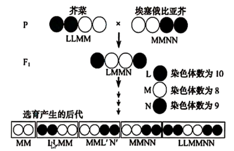
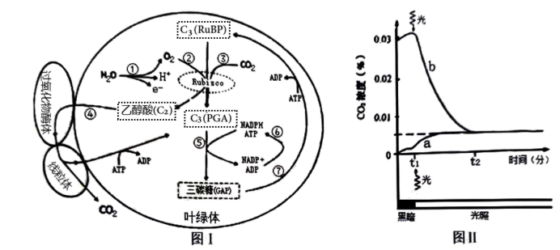
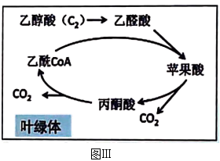

**2022生物卷（江苏）**

**一、单项选择题:**

1\. 下列各组元素中，大量参与组成线粒体内膜的是（ ）

A. O、P、N B. C、N、Si C. S、P、Ca D. N、P、Na

2\. 下列关于细胞生命历程的叙述正确的是（ ）

A. 胚胎干细胞为未分化细胞，不进行基因选择性表达

B. 成人脑神经细胞衰老前后，代谢速率和增殖速率都由快变慢

C. 刚出生不久的婴儿体内也会有许多细胞发生凋亡

D. 只有癌细胞中能同时发现突变的原癌基因和抑癌基因

3\. 下列是某同学分离高产脲酶菌的实验设计，不合理的是（ ）

A. 选择农田或公园土壤作为样品分离目的菌株

B. 在选择培养基中需添加尿素作唯一氮源

C. 适当稀释样品是为了在平板上形成单菌落

D. 可分解酚红指示剂使其褪色的菌株是产脲酶菌

4\. 下列关于动物细胞工程和胚胎工程的叙述正确的是（ ）

A. 通常采用培养法或化学诱导法使精子获得能量后进行体外受精

B. 哺乳动物体外受精后的早期胚胎培养不需要额外提供营养物质

C. 克隆牛技术涉及体细胞核移植、动物细胞培养、胚胎移植等过程

D. 将小鼠桑葚胚分割成2等份获得同卵双胎的过程属于有性生殖

5\. 下列有关实验方法的描述合理的是（ ）

A. 将一定量胡萝卜切碎，加适量水、石英砂，充分研磨，过滤，获取胡萝卜素提取液

B. 适当浓度蔗糖溶液处理新鲜黑藻叶装片，可先后观察到细胞质流动与质壁分离现象

C. 检测样品中的蛋白质时，须加热使双缩脲试剂与蛋白质发生显色反应

D. 用溴麝香草酚蓝水溶液检测发酵液中酒精含量的多少，可判断酵母菌的呼吸方式

6\. 采用基因工程技术调控植物激素代谢，可实现作物改良。下列相关叙述不合理的是（ ）

A. 用特异启动子诱导表达iaaM（生长素合成基因）可获得无子果实

B. 大量表达ip（细胞分裂素合成关键基因）可抑制芽的分化

C. 提高ga2ox（氧化赤霉素的酶基因）的表达水平可获得矮化品种

D. 在果实中表达acs（乙烯合成关键酶基因）的反义基因可延迟果实成熟

7\. 培养获得二倍体和四倍体洋葱根尖后，分别制作有丝分裂装片，镜检、观察。下图为二倍体根尖细胞照片。下列相关叙述错误的是（ ）

A. 两种根尖都要用有分生区的区段进行制片

B. 装片中单层细胞区比多层细胞区更易找到理想的分裂期细胞

C. 在低倍镜下比高倍镜下能更快找到各种分裂期细胞

D. 四倍体中期细胞中的染色体数与①的相等，是②的4倍，③的2倍

8\. 下列关于细胞代谢的叙述正确的是（ ）

A. 光照下，叶肉细胞中的ATP均源于光能的直接转化

B. 供氧不足时，酵母菌在细胞质基质中将丙酮酸转化为乙醇

C. 蓝细菌没有线粒体，只能通过无氧呼吸分解葡萄糖产生ATP

D. 供氧充足时，真核生物在线粒体外膜上氧化\[H\]产生大量ATP

9\. 将小球藻在光照下培养，以探究种群数量变化规律。下列相关叙述正确的是（ ）

A. 振荡培养的主要目的是增大培养液中的溶氧量

B. 取等量藻液滴加到血细胞计数板上，盖好盖玻片，稍待片刻后再计数

C. 若一个小格内小球藻过多，应稀释到每小格1～2个再计数

D. 为了分析小球藻种群数量变化总趋势，需连续统计多天的数据

10\. 在某生态系统中引入一定数最的一种动物，以其中一种植物为食。该植物种群基因型频率初始态状时为0.36AA、0.50Aa和0.14aa。最终稳定状态时为0.17AA、0.49Aa和0.34aa。下列相关推测合理的是（ ）

A. 该植物种群中基因型aa个体存活能力很弱，可食程度很高

B. 随着动物世代增多，该物种群基因库中A基因频率逐渐增大

C. 该动物种群密度最终趋于相对稳定是由于捕食关系而非种内竞争

D. 生物群落的负反馈调节是该生态系统自我调节能力的基础

11\. 摩尔根和他的学生用果蝇实验证明了基因在染色体上。下列相关叙述与事实不符的是（ ）

A. 白眼雄蝇与红眼雌蝇杂交，F1全部为红眼，推测白眼对红眼为隐性

B. F1互交后代中雌蝇均为红眼，雄蝇红、白眼各半，推测红、白眼基因在X染色体上

C. F1雌蝇与白眼雄蝇回交，后代雌雄个体中红白眼都各半，结果符合预期

D. 白眼雌蝇与红眼雄蝇的杂交后代有白眼雌蝇、红眼雄蝇例外个体，显微观察证明为基因突变所致

12\. 采用原位治理技术治理污染水体，相关叙述正确的是（ ）

A. 应用无土栽培技术，种植的生态浮床植物可吸收水体营养和富集重金属

B. 为了增加溶解氧，可以采取曝气、投放高效功能性菌剂及其促生剂等措施

C. 重建食物链时放养蚌、螺等底栖动物作为初级消费者，摄食浮游动、植物

D. 人为操纵生态系统营养结构有利于调整能量流动方向和提高能量传递效率

13\. 下列物质的鉴定实验中所用试剂与现象对应关系错误的是（ ）

A. 还原糖-斐林试剂-砖红色 B. DNA-台盼蓝染液-蓝色

C. 脂肪-苏丹Ⅲ染液-橘黄色 D. 淀粉-碘液-蓝色

14\. 航天员叶光富和王亚平在天宫课堂上展示了培养的心肌细胞跳动的视频。下列相关叙述正确的是（ ）

A. 培养心肌细胞的器具和试剂都要先进行高压蒸汽灭菌

B. 培养心肌细胞的时候既需要氧气也需要二氧化碳

C. 心肌细胞在培养容器中通过有丝分裂不断增殖

D. 心肌细胞在神经细胞发出的神经冲动的支配下跳动

**二、多选题:**

15\. 下图为生命体内部分物质与能量代谢关系示意图。下列叙述正确的有（ ）

A. 三羧酸循环是代谢网络的中心，可产生大量的\[H\]和CO2并消耗O2

B. 生物通过代谢中间物，将物质的分解代谢与合成代谢相互联系

C. 乙酰CoA在代谢途径中具有重要地位

D. 物质氧化时释放的能量都储存于ATP

16\. 在制作发醇食品的学生实践中，控制发酵条件至关重要。下列相关叙述错误的有（ ）

A. 泡菜发酵后期，尽管乳酸菌占优势，但仍有产气菌繁殖，需开盖放气

B. 制作果酒的葡萄汁不宜超过发酵瓶体积的2/3，制作泡菜的盐水要淹没全部菜料

C. 葡萄果皮上有酵母菌和醋酸菌，制作好葡萄酒后，可直接通入无菌空气制作葡萄醋

D. 果酒与果醋发酵时温度宜控制在18-25℃，泡菜发酵时温度宜控制在30-35℃

17\. 下图表示夏季北温带常见湖泊不同水深含氧量、温度的变化。下列相关叙述合理的有（ ）

A. 决定群落垂直分层现象的非生物因素主要是温度和含氧量

B. 自养型生物主要分布在表水层，分解者主要分布在底泥层

C. 群落分层越明显层次越多，生物多样性越丰富，生态系统稳定性越强

D. 湖泊经地衣阶段、苔藓阶段、草本植物阶段和灌木阶段可初生演替出森林

18\. 科研人员开展了芥菜和埃塞俄比亚芥杂交实验，杂种经多代自花传粉选育，后代育性达到了亲本相当的水平。下图中L、M、N表示3个不同的染色体组。下列相关叙述正确的有（ ）

A. 两亲本和F1都为多倍体

B. F1减数第一次分裂中期形成13个四分体

C. F1减数第二次分裂后产生的配子类型为LM和MN

D. F1两个M染色体组能稳定遗传给后代

19\. 下图表示利用细胞融合技术进行基因定位的过程，在人-鼠杂种细胞中人的染色体会以随机方式丢失，通过分析基因产物进行基因定位。现检测细胞Ⅰ、Ⅱ、Ⅲ中人的4种酶活性，只有Ⅱ具有芳烃羟化酶活性，只有Ⅲ具有胸苷激酶活性，Ⅰ、Ⅲ都有磷酸甘油酸激酶活性，Ⅰ、Ⅱ、Ⅲ均有乳酸脱氢酶活性。下列相关叙述正确的有（ ）

A. 加入灭活仙台病毒的作用是促进细胞融合

B. 细胞Ⅰ、Ⅱ、Ⅲ分别为人-人、人-鼠、鼠-鼠融合细胞

C. 芳烃羟化酶基因位于2号染色体上，乳酸脱氢酶基因位于11号染色上

D. 胸苷激酶基因位于17号染色体上，磷酸甘油酸激酶基因位于X染色体上

**三、填空题：**

20\. 图1所示为光合作用过程中部分物质的代谢关系（①～⑦表示代谢途径）。Rubisco是光合作用的关键酶之一，CO2和O2竞争与其结合，分别催化C5的羧化与氧化。C5羧化固定CO2合成糖；C5氧化则产生乙醇酸（C2），C2在过氧化物酶体和线粒体协同下，完成光呼吸碳氧化循环。请都图回各下列问题：

（1）图1中，类囊体膜直接参与代谢途径有\_\_\_\_\_\_\_\_\_\_\_（从①～⑦中选填），在红光照射条件下，参与这些途径的主要色素是\_\_\_\_\_\_\_\_\_\_\_。

（2）在C2循环途径中，乙醇酸进入过氧化物酶体被继续氧化，同时生成的\_\_\_\_\_\_\_\_\_\_\_在过氧化氢酶催化下迅速分解为O2和H2O。

（3）将叶片置于一个密闭小室内，分别在CO2浓度为0和0.03%的条件下测定小室内CO2浓度的变化，获得曲线a、b（图Ⅱ）。

①曲线a，0～t1时（没有光照，只进行呼吸作用）段释放的CO2源于细胞呼吸；t1～t2时段，CO2的释放速度有所增加，此阶段的CO2源于\_\_\_\_\_\_\_\_\_\_\_。

②曲线b，当时间到达t2点后，室内CO2浓度不再改变，其原因是\_\_\_\_\_\_\_\_\_\_\_。

（4）光呼吸可使光合效率下降20%-50%，科学家在烟草叶绿体中组装表达了衣藻的乙醇酸脱氢酶和南瓜的苹果酸合酶，形成了图Ⅲ代谢途径，通过降低了光呼吸，提高了植株生物量。上述工作体现了遗传多样性的\_\_\_\_\_\_\_\_\_\_\_价值。

21\. 科学家研发了多种RNA药物用于疾病治疗和预防，图中①～④示意4种RNA药物的作用机制。请回答下列问题。

（1）细胞核内RNA转录合成以\_\_\_\_\_\_\_\_\_\_\_为模板，需要\_\_\_\_\_\_\_\_\_\_\_的催化。前体mRNA需加工为成熟的mRNA，才能转运到细胞质中发挥作用，说明\_\_\_\_\_\_\_\_\_\_\_对大分子物质的转运具有选择性。

（2）机制①:有些杜兴氏肌营养不良症患者DMD蛋白基因的51外显子片段中发生\_\_\_\_\_\_\_\_\_\_\_，提前产生终止密码子，从而不能合成DMD蛋白。为治疗该疾病，将反义RNA药物导入细胞核，使其与51外显子转录产物结合形成\_\_\_\_\_\_\_\_\_\_\_，DMD前体mRNA剪接时，异常区段被剔除，从而合成有功能的小DMD蛋白，减轻症状。

（3）机制②:有些高胆固醇血症患者的PCSK9蛋白可促进低密度脂蛋白的内吞受体降解，血液中胆固醇含量偏高。转入与PCSK9mRNA特异性结合的siRNA，导致PCSK9mRNA被剪断，从而抑制细胞内的\_\_\_\_\_\_\_\_\_\_\_合成，治疗高胆固醇血症。

（4）机制③:mRNA药物进入患者细胞内可表达正常的功能蛋白，替代变异蛋白发挥治疗作用。通常将mRNA药物包装成脂质体纳米颗粒，目的是\_\_\_\_\_\_\_\_\_\_\_。

（5）机制④:编码新冠病毒S蛋白的mRNA疫苗，进入人体细胞，在内质网上的核糖体中合成S蛋白，经过\_\_\_\_\_\_\_\_\_\_\_修饰加工后输送出细胞，可作为\_\_\_\_\_\_\_\_\_\_\_诱导人体产生特异性免疫反应。

（6）接种了两次新型冠状病毒灭活疫苗后，若第三次加强接种改为重组新型冠状病毒疫苗，根据人体特异性免疫反应机制分析，进一步提高免疫力的原因有: \_\_\_\_\_\_\_\_\_\_\_\_\_\_\_\_\_\_\_\_\_\_。

22\. 手指割破时机体常出现疼痛、心跳加快等症状。下图为吞噬细胞参与痛觉调控的机制示意图请回答下列问题。

（1）下图中，手指割破产生兴奋传导至T处，突触前膜释放的递质与突触后膜\_\_\_\_\_\_\_\_\_\_\_结合，使后神经元兴奋，T处（图中显示是突触）信号形式转变过程为\_\_\_\_\_\_\_\_\_\_\_。

（2）伤害性刺激使心率加快的原因有:交感神经的兴奋，使肾上腺髓质分泌肾上腺素；下丘脑分泌的\_\_\_\_\_\_\_\_\_\_\_，促进垂体分泌促肾上腺皮质激素，该激素使肾上腺皮质分泌糖皮质激素；肾上腺素与糖皮质激素经体液运输作用于靶器官。

（3）皮肤破损，病原体入侵，吞噬细胞对其识别并进行胞吞，胞内\_\_\_\_\_\_\_\_\_\_\_（填细胞器）降解病原体，这种防御作用为\_\_\_\_\_\_\_\_\_\_\_\_\_\_\_\_\_\_\_\_\_\_。

（4）如图所示，病原体刺激下，吞噬细胞分泌神经生长因子（NGF），NGF作用于感受器上的受体，引起感受器的电位变化，进一步产生兴奋传导到\_\_\_\_\_\_\_\_\_\_\_形成痛觉。该过程中，Ca2+的作用有\_\_\_\_\_\_\_\_\_\_\_。

（5）药物MNACI3是一种抗NGF受体的单克隆抗体，用于治疗炎性疼痛和神经病理性疼痛。该药的作用机制是\_\_\_\_\_\_\_\_\_\_\_\_\_\_\_\_\_\_\_\_\_\_\_\_\_\_\_\_\_\_\_\_\_。

23\. 大蜡螟是一种重要的实验用尾虫，为了研究大蜡螟幼虫体色遗传规律。科研人员用深黄、灰黑、白黄3种体色的品系进行了系列实验，正交实验数据如下表（反交实验结果与正交一致）。请回答下列问题。

表1深黄色与灰黑色品系杂交实验结果

<table style="width:50%;">
<colgroup>
<col style="width: 33%" />
<col style="width: 8%" />
<col style="width: 8%" />
</colgroup>
<tbody>
<tr>
<td rowspan="2" style="text-align: center;">杂交组合</td>
<td colspan="2" style="text-align: center;">子代体色</td>
</tr>
<tr>
<td style="text-align: center;">深黄</td>
<td style="text-align: center;">灰黑</td>
</tr>
<tr>
<td style="text-align: center;">深黄（P）♀×灰黑（P）<em>♂</em></td>
<td style="text-align: center;">2113</td>
<td style="text-align: center;">0</td>
</tr>
<tr>
<td style="text-align: center;">深黄（F1）♀×深黄（F1）<em>♂</em></td>
<td style="text-align: center;">1526</td>
<td style="text-align: center;">498</td>
</tr>
<tr>
<td style="text-align: center;">深黄（F1）<em>♂</em>×深黄（P）♀</td>
<td style="text-align: center;">2314</td>
<td style="text-align: center;">0</td>
</tr>
<tr>
<td style="text-align: center;">深黄（F1）♀×灰黑（P）<em>♂</em></td>
<td style="text-align: center;">1056</td>
<td style="text-align: center;">1128</td>
</tr>
</tbody>
</table>

（1）由表1可推断大蜡螟幼虫的深黄体色遗传属于\_\_\_\_\_\_\_\_\_\_\_\_\_\_\_\_\_\_染色体上\_\_\_\_\_\_\_\_\_\_\_\_\_\_\_\_\_\_性遗传。

（2）深黄、灰黑、白黄基因分别用Y、G、W表示，表1中深黄的亲本和F1个体基因型分别是\_\_\_\_\_\_\_\_\_\_\_\_\_\_\_\_\_\_，表2、表3中F1基因型分别是\_\_\_\_\_\_\_\_\_\_\_\_\_\_\_\_\_\_。群体中Y、G、W三个基因位于一对同源染色体。

（3）若从表2中选取黄色（YW）雌、雄个体各50只和表3中选取黄色（GW）雌、雄个体各50只，进行随机杂交，后代中黄色个体占比理论上\_\_\_\_\_\_\_\_\_\_\_\_\_\_\_\_\_\_。

表2深黄色与白黄色品系杂交实验结果

<table style="width:56%;">
<colgroup>
<col style="width: 32%" />
<col style="width: 8%" />
<col style="width: 8%" />
<col style="width: 7%" />
</colgroup>
<tbody>
<tr>
<td rowspan="2" style="text-align: center;">杂交组合</td>
<td colspan="3" style="text-align: center;">子代体色</td>
</tr>
<tr>
<td style="text-align: center;">深黄</td>
<td style="text-align: center;">黄</td>
<td style="text-align: center;">白黄</td>
</tr>
<tr>
<td style="text-align: center;">深黄（P）♀×白黄（P）<em>♂</em></td>
<td style="text-align: center;">0</td>
<td style="text-align: center;">2357</td>
<td style="text-align: center;">0</td>
</tr>
<tr>
<td style="text-align: center;">黄（F1）♀×黄（F1）<em>♂</em></td>
<td style="text-align: center;">514</td>
<td style="text-align: center;">1104</td>
<td style="text-align: center;">568</td>
</tr>
<tr>
<td style="text-align: center;">黄（F1）<em>♂</em>×深黄（P）♀</td>
<td style="text-align: center;">1327</td>
<td style="text-align: center;">1293</td>
<td style="text-align: center;">0</td>
</tr>
<tr>
<td style="text-align: center;">黄（F1）♀×白黄（P）<em>♂</em></td>
<td style="text-align: center;">0</td>
<td style="text-align: center;">917</td>
<td style="text-align: center;">864</td>
</tr>
</tbody>
</table>

表3灰黑色与白黄色品系杂交实验结果

<table style="width:56%;">
<colgroup>
<col style="width: 32%" />
<col style="width: 7%" />
<col style="width: 8%" />
<col style="width: 8%" />
</colgroup>
<tbody>
<tr>
<td rowspan="2" style="text-align: center;">杂交组合</td>
<td colspan="3" style="text-align: center;">子代体色</td>
</tr>
<tr>
<td style="text-align: center;">灰黑</td>
<td style="text-align: center;">黄</td>
<td style="text-align: center;">白黄</td>
</tr>
<tr>
<td style="text-align: center;">灰黑（P）♀×白黄（P）<em>♂</em></td>
<td style="text-align: center;">0</td>
<td style="text-align: center;">1237</td>
<td style="text-align: center;">0</td>
</tr>
<tr>
<td style="text-align: center;">黄（F1）♀×黄（F1）<em>♂</em></td>
<td style="text-align: center;">754</td>
<td style="text-align: center;">1467</td>
<td style="text-align: center;">812</td>
</tr>
<tr>
<td style="text-align: center;">黄（F1）<em>♂</em>×灰黑（P）♀</td>
<td style="text-align: center;">754</td>
<td style="text-align: center;">1342</td>
<td style="text-align: center;">0</td>
</tr>
<tr>
<td style="text-align: center;">黄（F1）♀×白黄（P）<em>♂</em></td>
<td style="text-align: center;">0</td>
<td style="text-align: center;">1124</td>
<td style="text-align: center;">1217</td>
</tr>
</tbody>
</table>

（4）若表1、表2、表3中深黄（YY♀、YG♀*♂*）和黄色（YW♀*♂*、GW♀*♂*）个体随机杂交，后代会出现\_\_\_\_\_\_\_\_\_\_\_\_\_\_\_\_\_\_种表现型和\_\_\_\_\_\_\_\_\_\_\_\_\_\_\_\_\_\_种基因型（YY/GG/WW/YG/YW/GW）。

（5）若表1中两亲本的另一对同源染色体上存在纯合致死基因S和D（两者不发生交换重组），基因排列方式为\_\_\_\_\_\_\_\_\_\_\_\_\_\_\_\_\_\_，推测F1互交产生的F2深黄与灰黑的比例为\_\_\_\_\_\_\_\_\_\_\_\_\_\_\_\_\_\_；在同样的条件下，子代的数量理论上是表1中的\_\_\_\_\_\_\_\_\_\_\_\_\_\_\_\_\_\_。

24\. 纤毛是广泛存在的细胞表面结构，功能异常可引起多种疾病。因此，研究纤毛形成的作用机制具有重要意义。请回答下列问题。

（1）纤毛结构如图1所示，由细胞膜延伸形成的纤毛膜主要由中心体转变而来，中心体在有丝分裂中的功能是\_\_\_\_\_\_\_\_\_\_\_\_\_\_\_\_\_\_。

（2）某病人肾小管上皮细胞纤毛异常，为了分析纤毛相关基因X是否发生了变异，对基因X进行了PCR扩增与产物测序。从细胞样品中分离DNA时，可通过交替调节盐浓度将与核蛋白结合的DNA分离出来，溶液中添加NaC1至2．0mo1/L的目的是\_\_\_\_\_\_\_\_\_\_\_\_\_\_\_\_\_\_。PCR扩增时，需在\_\_\_\_\_\_\_\_\_\_\_\_\_\_\_\_\_\_催化下，在引物\_\_\_\_\_\_\_\_\_\_\_\_\_\_\_\_\_\_端进行DNA链的延伸，获得扩增产物用于测序。

（3）为研究蛋白质X在细胞中的定位，构建绿色荧光蛋白GFP与X的融合蛋白，融合蛋白具有绿色荧光，可示其在细胞内位置。将X-GFP基因融合片段M导入如图Ⅱ所示载体质粒Y，构建Y-M重组质粒（在EcoRⅤ位点插入片段）。请完成下表。

<table>
<colgroup>
<col style="width: 36%" />
<col style="width: 63%" />
</colgroup>
<tbody>
<tr>
<td style="text-align: center;">分步实验目标</td>
<td style="text-align: center;">简易操作、结果、分析</td>
</tr>
<tr>
<td style="text-align: center;">PCR鉴定正向重组质粒Y-M（图Ⅱ中融合片段M中有白色的箭头，代表方向）</td>
<td style="text-align: center;">
①选择图Ⅱ引物_____________；

②PCR目的产物约为_____________bp。
</td>
</tr>
<tr>
<td style="text-align: center;">确保M及连接处序列正确，Y-M的连接处上游含有Hind III+EcoR V的识别序列，下游含有EcoR V+BamH I的识别序列</td>
<td style="text-align: center;">③质粒测序，图Ⅲ中正确的是____________（选填序列编号）</td>
</tr>
<tr>
<td style="text-align: center;">检测融合蛋白定位</td>
<td style="text-align: center;">④对照质粒Y-GFP（仅表达GFP）与实验质粒Y-M分别导入细胞，发现对照组整个细胞均有绿色荧光，而实验组荧光集中在纤毛基部，说明________________________。</td>
</tr>
</tbody>
</table>

（4）为研究另一纤毛病相关基因Z表达的变化，采用荧光定量PCR法检测健康人与病人基因Z的转录水平。采集样本、提取总RNA，经\_\_\_\_\_\_\_\_\_\_\_\_\_形成cDNA作为模板，PCR扩增结果显示，在总cDNA模板量相等的条件下，健康人Ct值为15，而病人Ct值为20（Ct值是产物荧光强度达到设定阈值时的PCR循环数）。从理论上估算，在PCR扩增20个循环的产物中，健康人样品的目的产物大约是病人的\_\_\_\_\_\_\_\_\_\_\_\_\_倍。
