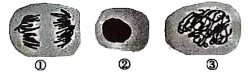
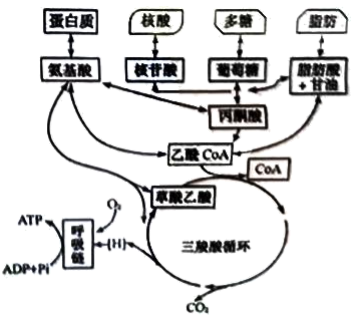
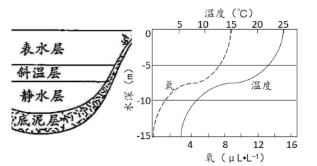
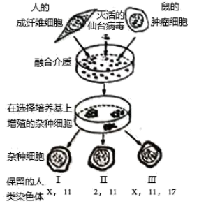
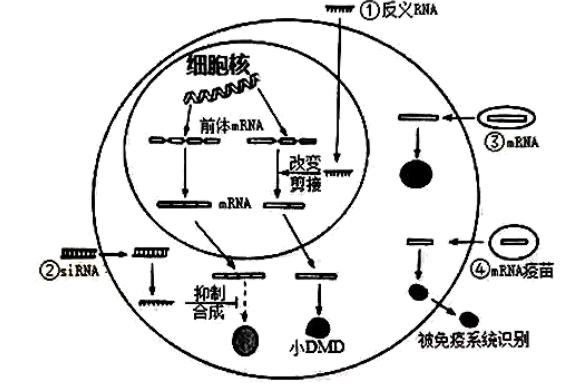
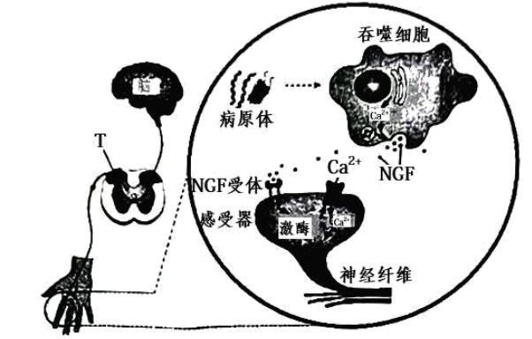
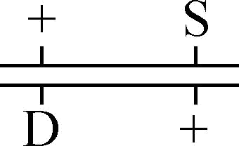
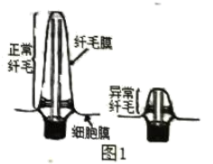
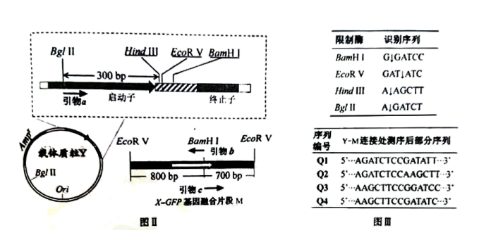

**2022生物卷（江苏）**

**一、单项选择题:**

1\. 下列各组元素中，大量参与组成线粒体内膜的是（ ）

A. O、P、N B. C、N、Si C. S、P、Ca D. N、P、Na

【答案】A

【解析】

【分析】线粒体内膜属于生物膜，其主要成分是磷脂和蛋白质，蛋白质是由C、H、O、N等元素组成，磷脂的组成元素为C、H、O、N、P。

【详解】线粒体内膜属于生物膜，生物膜主要由磷脂和蛋白质组成，蛋白质是由C、H、O、N等元素组成，磷脂的组成元素为C、H、O、N、P，二者均不含Si、Ca、Na，A正确，BCD错误。

故选A。

2\. 下列关于细胞生命历程的叙述正确的是（ ）

A. 胚胎干细胞为未分化细胞，不进行基因选择性表达

B. 成人脑神经细胞衰老前后，代谢速率和增殖速率都由快变慢

C. 刚出生不久的婴儿体内也会有许多细胞发生凋亡

D. 只有癌细胞中能同时发现突变的原癌基因和抑癌基因

【答案】C

【解析】

【分析】细胞分化的实质是基因的选择性表达。细胞衰老，会引起代谢速率变慢。但是如果一个细胞不再进行细胞增值，但是还没有细胞衰老，那它的增值速率在衰老前后就不会发生变化。

【详解】A、胚胎干细胞为未分化细胞，但是也会进行基因的选择性表达，A错误；

B、细胞衰老，会引起代谢速率变慢。但是如果一个细胞不再进行细胞增值，但是还没有细胞衰老，那它的增殖速率在衰老前后就不会发生变化，B错误；

C、细胞凋亡是生物体正常生理现象，有利于个体的发育，刚出生不久的婴儿体内也会有许多细胞发生凋亡，C正确；

D、原癌基因和抑癌基因同时发生突变，也不一定会发生细胞癌变，D错误。

故选C。

3\. 下列是某同学分离高产脲酶菌的实验设计，不合理的是（ ）

A. 选择农田或公园土壤作为样品分离目的菌株

B. 在选择培养基中需添加尿素作为唯一氮源

C. 适当稀释样品是为了在平板上形成单菌落

D. 可分解酚红指示剂使其褪色的菌株是产脲酶菌

【答案】D

【解析】

【分析】为了筛选可分解尿素的细菌，配置的培养基应选择尿素作为唯一氮源，含脲酶的微生物在该培养基上能生长，其它微生物在该培养基上因缺乏氮源而不能生长，可用于分离含脲酶的微生物。

【详解】A、农田或公园土壤中含有较多的含脲酶的微生物，A正确；

B、为了筛选可分解尿素的细菌，配置的培养基应选择尿素作为唯一氮源，含脲酶的微生物在该培养基上能生长，B正确；

C、当样品的稀释度足够高时，培养基表面生长的一个菌落，来源于样品稀释液中的一个活菌，C正确；

D、在细菌分解尿素的化学反应中，细菌合成的脲酶将尿素分解成氨，氨会使培养基的pH升高，酚红指示剂将变红，因此在以尿素为唯一氮源的培养基中加入酚红指示剂，能对分离的菌种做进一步鉴定，D错误。

故选D。

4\. 下列关于动物细胞工程和胚胎工程的叙述正确的是（ ）

A. 通常采用培养法或化学诱导法使精子获得能量后进行体外受精

B. 哺乳动物体外受精后的早期胚胎培养不需要额外提供营养物质

C. 克隆牛技术涉及体细胞核移植、动物细胞培养、胚胎移植等过程

D. 将小鼠桑葚胚分割成2等份获得同卵双胎的过程属于有性生殖

【答案】C

【解析】

【分析】哺乳动物的体外受精主要包括卵母细胞的采集、精子的获取和受精等几个主要步骤。胚胎分割是指采用机械方法将早期胚胎切割成2等份、4等份或8等份等，经移植获得同卵双胎或多胎的技术。来自同一胚胎的后代具有相同的遗传物质，因此，胚胎分割可以看做动物无性繁殖或克隆的方法之一。

【详解】A、精子获能是获得受精的能力，不是获得能量，A错误；

B、哺乳动物体外受精后的早期胚胎培养所需营养物质与体内基本相同，例如需要有糖、氨基酸、促生长因子、无机盐、微量元素等，还需加入血清、血浆等天然成分，B错误；

C、克隆牛技术涉及体细胞核移植、动物细胞培养、胚胎移植等过程，C正确；

D、胚胎分割可以看做动物无性繁殖或克隆的方法，D错误。

故选C。

5\. 下列有关实验方法的描述合理的是（ ）

A. 将一定量胡萝卜切碎，加适量水、石英砂，充分研磨，过滤，获取胡萝卜素提取液

B. 适当浓度蔗糖溶液处理新鲜黑藻叶装片，可先后观察到细胞质流动与质壁分离现象

C. 检测样品中的蛋白质时，须加热使双缩脲试剂与蛋白质发生显色反应

D. 用溴麝香草酚蓝水溶液检测发酵液中酒精含量的多少，可判断酵母菌的呼吸方式

【答案】B

【解析】

【分析】1、叶肉细胞中的叶绿体，呈绿色、扁平的椭球形或球形，散布于细胞质中，可以在高倍显微镜下观察它的形态；

2、探究酵母菌细胞呼吸方式中，产生的二氧化碳可以用溴麝香草酚蓝水溶液或澄清石灰水检测，酒精可以用酸性的重铬酸钾溶液检测（由橙红色变成灰绿色）。

【详解】A、提取胡萝卜素的实验流程：胡萝卜→粉碎→干燥→萃取→过滤→浓缩→胡萝卜素，A错误；

B、黑藻叶片含有叶绿体，呈绿色，所以适当浓度蔗糖溶液处理新鲜黑藻叶装片可以先在显微镜下观察叶绿体的运动情况，观察细胞质的流动，同时黑藻叶片是成熟的植物细胞，可以发生质壁分离，以叶绿体为观察指标，B正确；

C、检测样品中的蛋白质时，双缩脲试剂与蛋白质发生显色反应，不需要加热，C错误；

D、酵母菌呼吸产生的二氧化碳可使溴麝香草酚蓝水溶液由蓝变绿再变黄，不能用来检测酒精含量，D错误。

故选B。

6\. 采用基因工程技术调控植物激素代谢，可实现作物改良。下列相关叙述不合理的是（ ）

A. 用特异启动子诱导表达iaaM（生长素合成基因）可获得无子果实

B. 大量表达ip（细胞分裂素合成关键基因）可抑制芽的分化

C. 提高ga2ox（氧化赤霉素的酶基因）的表达水平可获得矮化品种

D. 在果实中表达acs（乙烯合成关键酶基因）反义基因可延迟果实成熟

【答案】B

【解析】

【分析】1、生长素类具有促进植物生长的作用，在生产上的应用主要有：（1）促进扦插的枝条生根；（2）促进果实发育；（3）防止落花落果。

2、赤霉素的生理作用是促进细胞伸长，从而引起茎秆伸长和植物增高。此外，它还有防止器官脱落和解除种子、块茎休眠促进萌发等作用。

3、细胞分裂素在根尖合成，在进行细胞分裂的器官中含量较高，细胞分裂素的主要作用是促进细胞分裂和扩大，此外还有诱导芽的分化，延缓叶片衰老的作用。

4、脱落酸是植物生长抑制剂，它能够抑制细胞的分裂和种子的萌发，还有促进叶和果实的衰老和脱落，促进休眠和提高抗逆能力等作用。

5、乙烯主要作用是促进果实成熟，此外，还有促进老叶等器官脱落的作用。

【详解】A、生长素能促进果实发育，用特异启动子诱导表达iaaM（生长素合成基因）可获得无子果实，A正确；

B、大量表达ipt（细胞分裂素合成关键基因），细胞分裂素含量升高，细胞分裂素和生长素的比例比例高时，有利于芽的分化，B错误；

C、赤霉素能促进细胞伸长，从而引起茎秆伸长和植物增高，提高ga2ox（氧化赤霉素的酶基因）的表达水平使赤霉素含量降低从而能获得矮化品种，C正确；

D、乙烯有催熟作用，在果实中表达acs（乙烯合成关键酶基因）的反义基因，即是抑制乙烯的合成，果实成熟会延迟，D正确。

故选B。

7\. 培养获得二倍体和四倍体洋葱根尖后，分别制作有丝分裂装片，镜检、观察。下图为二倍体根尖细胞的照片。下列相关叙述错误的是（ ）

A. 两种根尖都要用有分生区的区段进行制片

B. 装片中单层细胞区比多层细胞区更易找到理想的分裂期细胞

C. 在低倍镜下比高倍镜下能更快找到各种分裂期细胞

D. 四倍体中期细胞中的染色体数与①的相等，是②的4倍，③的2倍

【答案】D

【解析】

【分析】二倍体洋葱染色体数目是2N，四倍体洋葱染色体数目是4N，根尖分生区进行有丝分裂，有丝分裂分为间期、前期、中期、后期、末期。

【详解】A、根尖分生区进行有丝分裂，所以观察有丝分裂两种根尖都要用有分生区的区段进行制片，A正确；

B、多层细胞相互遮挡不容易观察细胞，所以装片中单层细胞区比多层细胞区更易找到理想的分裂期细胞，B正确；

C、低倍镜下，细胞放大倍数小，观察的细胞数目多，高倍镜下放大倍数大，观察细胞数目少，所以在低倍镜下比高倍镜下能更快找到各种分裂期细胞，C正确；

D、四倍体中期细胞中的染色体数是4N，图中①处于二倍体根尖细胞有丝分裂后期，染色体数目加倍，染色体数目为4N，②处于二倍体根尖细胞有丝分裂间期，染色体数目为2N，③处于二倍体根尖细胞有丝分裂前期，染色体数目为2N，所以四倍体中期细胞中的染色体数与①的相等，是②的2倍，③的2倍，D错误。

故选D。

8\. 下列关于细胞代谢的叙述正确的是（ ）

A. 光照下，叶肉细胞中的ATP均源于光能的直接转化

B. 供氧不足时，酵母菌在细胞质基质中将丙酮酸转化为乙醇

C. 蓝细菌没有线粒体，只能通过无氧呼吸分解葡萄糖产生ATP

D. 供氧充足时，真核生物在线粒体外膜上氧化\[H\]产生大量ATP

【答案】B

【解析】

【分析】1、有氧呼吸的过程：第一阶段在细胞质基质进行，1分子的葡萄糖分解成2分子的丙酮酸，同时脱下4个\[H\]，释放出少量的能量；第二阶段在线粒体基质进行，2分子丙酮酸和6水分子中的氢全部脱下，共脱下20个\[H\]，丙酮酸被氧化分解成二氧化碳，释放出少量的能量；第三阶段在线粒体内膜进行，前两阶段脱下的共24个\[H\]与6个O2结合成水，释放大量的能量。

2、无氧呼吸在细胞质基质进行，1分子的葡萄糖分解成2分子的乙醇、2分子的二氧化碳并释放出少量的能量，或1分子的葡萄糖分解成2分子的乳酸并释放出少量的能量。

【详解】A、光照下，叶肉细胞可以进行光合作用和有氧呼吸，光合作用中产生的ATP来源于光能的直接转化，有氧呼吸中产生的ATP来源于有机物的氧化分解，A错误；

B、供氧不足时，酵母菌在细胞质基质中进行无氧呼吸，将丙酮酸转化为乙醇和二氧化碳 ，B正确；

C、蓝细菌属于原核生物，没有线粒体，但进行有氧呼吸，C错误；

D、供氧充足时，真核生物在线粒体内膜上氧化\[H\]产生大量ATP ，D错误。

故选B。

9\. 将小球藻在光照下培养，以探究种群数量变化规律。下列相关叙述正确的是（ ）

A. 振荡培养的主要目的是增大培养液中的溶氧量

B. 取等量藻液滴加到血细胞计数板上，盖好盖玻片，稍待片刻后再计数

C. 若一个小格内小球藻过多，应稀释到每小格1～2个再计数

D. 为了分析小球藻种群数量变化总趋势，需连续统计多天的数据

【答案】D

【解析】

【分析】小球藻可进行光合作用，振荡培养的目的是为了增大培养液中的溶二氧化碳量。操作过程中，应先盖上盖玻片，将藻液滴加到盖玻片边缘，让其自行渗入计数室。

【详解】A、振荡培养的主要目的是加速二氧化碳溶解于培养液中，增大培养液中的溶二氧化碳量，A错误；

B、在血细胞计数板上，盖好盖玻片，取等量藻液滴加到盖玻片边缘，让其自行渗入计数室，稍待片刻后再计数，B错误；

C、若一个小格内小球藻过多，应进行稀释，一般稀释到每小格10个左右较为合适，C错误；

D、为了分析小球藻种群数量变化总趋势，需连续统计多天的数据，D正确。

故选D。

10\. 在某生态系统中引入一定数最的一种动物，以其中一种植物为食。该植物种群基因型频率初始态状时为0.36AA、0.50Aa和0.14aa。最终稳定状态时为0.17AA、0.49Aa和0.34aa。下列相关推测合理的是（ ）

A. 该植物种群中基因型aa个体存活能力很弱，可食程度很高

B. 随着动物世代增多，该物种群基因库中A基因频率逐渐增大

C. 该动物种群密度最终趋于相对稳定是由于捕食关系而非种内竞争

D. 生物群落的负反馈调节是该生态系统自我调节能力的基础

【答案】D

【解析】

【分析】由题意可知，从引入时种群基因型频率和稳定时基因频率比较，基因型频率发生改变是自然选择的作用，最终达到稳定状态是生态系统自我调节能力的结果。

【详解】A、若该植物种群中基因型aa个体存活能力很弱，可食程度很高，aa会逐渐被淘汰，基因型频率减小，A错误；

B、从引入（0.36×1+0.5×1/2=0.61）到达到稳定（0.17×1+0.49×1/2=0.415）A的基因频率逐渐减小，达到稳定后基因型频率不变，A的基因频率也不改变，B错误；

C、该动物种群密度最终趋于相对稳定受捕食关系和种内竞争共同影响，C错误；

D、生物群落的负反馈调节是该生态系统自我调节能力的基础，D正确。

故选D。

11\. 摩尔根和他的学生用果蝇实验证明了基因在染色体上。下列相关叙述与事实不符的是（ ）

A. 白眼雄蝇与红眼雌蝇杂交，F1全部为红眼，推测白眼对红眼为隐性

B. F1互交后代中雌蝇均为红眼，雄蝇红、白眼各半，推测红、白眼基因在X染色体上

C. F1雌蝇与白眼雄蝇回交，后代雌雄个体中红白眼都各半，结果符合预期

D. 白眼雌蝇与红眼雄蝇的杂交后代有白眼雌蝇、红眼雄蝇例外个体，显微观察证明为基因突变所致

【答案】D

【解析】

【分析】摩尔根从培养的一群野生红眼果蝇中发现了一只白眼雄果蝇，他将此白眼雄果蝇与红眼雌果蝇杂交，F1全部表现为红眼，再让F1红眼果蝇雌雄交配，F2性别比为1：1；白眼只限于雄性中出现，占F2总数的1/4，用实验证明了基因在染色体上，且果蝇的眼色遗传为伴性遗传；若用A和a表示控制红眼和白眼的基因，则亲本白眼雄蝇（XaY）与红眼雌蝇（XAXA）杂交，F1全部为红眼果蝇（XAXa、XAY），雌、雄比例为1：1；F1中红眼果蝇（XAXa、XAY）自由交配，F2代（XAXA、XAXa、XAY、XaY）中白眼性状只在雄果蝇中出现，雌果蝇眼色全为红色。

【详解】A、白眼雄蝇（XaY）与红眼雌蝇（XAXA）杂交，F1全部为红眼果蝇（XAXa、XAY），雌、雄比例为1：1，推测白眼对红眼为隐性，A正确；

B、F1中红眼果蝇相互交配，F2代出现性状分离，雌蝇均为红眼，雄蝇红、白眼各半，雌雄表型不同，推测红、白眼基因在X染色体上，B正确；

C、F1中雌蝇（XAXa）与白眼雄蝇（XaY）杂交，后代出现四种基因型（XAXa：XaXa：XAY：XaY=1：1：1：1），白眼果蝇中雌、雄比例1：1，后代雌雄个体中红白眼都各半，结果符合预期，C正确；

D、白眼雌蝇（XaXa）与红眼雄蝇（XAY）杂交，后代雄蝇（XaY）全部为白眼，雌蝇全为红眼（XAXa），若后代有白眼雌蝇、红眼雄蝇例外个体，可能是基因突变所致，但不能用显微观察证明，D错误。

故选D。

12\. 采用原位治理技术治理污染水体，相关叙述正确的是（ ）

A. 应用无土栽培技术，种植的生态浮床植物可吸收水体营养和富集重金属

B. 了增加溶解氧，可以采取曝气、投放高效功能性菌剂及其促生剂等措施

C. 重建食物链时放养蚌、螺等底栖动物作为初级消费者，摄食浮游动、植物

D. 人为操纵生态系统营养结构有利于调整能量流动方向和提高能量传递效率

【答案】A

【解析】

【分析】生态浮床是指是人工浮岛的一种，针对富营养化的水质，利用生态工学原理，降解水中的COD、氮和磷的含量。它以水生植物为主体，运用无土栽培技术原理，以高分子材料等为载体和基质，应用物种间共生关系，充分利用水体空间生态位和营养生态位，从而建立高效人工生态系统，用以削减水体中的污染负荷。它能使水体透明度大幅度提高，同时水质指标也得到有效的改善，特别是对藻类有很好的抑制效果。生态浮岛对水质净化最主要的功效是利用植物的根系吸收水中的富营养化物质，通过吸收水中的N、P等植物生长所必须的营养元素，植物根系与浮床基质对污染物质的吸附、过滤和沉淀作用，以及水中微生物的生化降解作用，使水中的过剩营养物质大幅度地减少，抑制水中浮游藻类的过量繁殖，使水体变清澈；同时植物的分泌物能大量降解有机污染物，可以加速大分子有机污染物的降解。此外，由于植物与微生物的协同作用，又使对污染物的去除效果得以加强。这种协同作用主要体现在植物可以输送氧气至根区和维持介质的水力传输上，从而为微生物创造了得以大量繁殖的微环境。微生物通过自身的作用，对水中的有机污染物和营养物进行分解，从而进一步改善了水质。此外，植物还起富集水中重金属的作用。

【详解】A、根据生态浮床的原理可知，以水生植物为主体，运用无土栽培技术原理，以高分子材料等为载体和基质，应用物种间共生关系，充分利用水体空间生态位和营养生态位，从而建立高效人工生态系统，通过吸收水中的N、P等植物生长所必须的营养元素，削减富营养化水体中的N、P及有机物质，此外，植物还起富集水中重金属的作用，A正确；

B、采取曝气可以增加水体的溶氧量，但是投放高效功能性菌剂及其促生剂等措施会导致耗氧量增加，B错误；

C、蚌、螺等底栖动物作为初级消费者，主要摄食有机碎屑和藻类等，有效降低水体中富营养物质的含量，C错误；

D、根据生态系统的能量流动，调整生态系统营养结构有利于调整能量流动方向，使能量持续高效地流向对人类有益的部分，提高能量的利用率，但是不能改变能量传递效率，D错误。

故选A。

13\. 下列物质的鉴定实验中所用试剂与现象对应关系错误的是（ ）

A. 还原糖-斐林试剂-砖红色 B. DNA-台盼蓝染液-蓝色

C. 脂肪-苏丹Ⅲ染液-橘黄色 D. 淀粉-碘液-蓝色

【答案】B

【解析】

【分析】生物组织中化合物的鉴定：（1）斐林试剂可用于鉴定还原糖，在水浴加热的条件下，溶液的颜色变化为砖红色（沉淀）。（2）蛋白质可与双缩脲试剂产生紫色反应。（3）脂肪可用苏丹Ⅲ染液（或苏丹Ⅳ染液）鉴定，呈橘黄色（或红色）。（4）淀粉遇碘液变蓝。（5）线粒体可被活性染料健那绿染成蓝绿色。（6）在酸性条件下，酒精与重铬酸钾呈灰绿色。（7）DNA可以用二苯胺试剂鉴定，呈蓝色。（8）染色体可以被碱性染料染成深色。（9）台盼蓝染液用于鉴别细胞死活，死细胞被染成蓝色。

【详解】A、还原糖与斐林试剂在水浴加热的条件下产生砖红色沉淀，A正确；

B、在沸水浴条件下，DNA遇二苯胺呈蓝色，B错误；

C、苏丹Ⅲ染液将脂肪染成橘黄色，苏丹Ⅳ将脂肪染成红色，C正确；

D、淀粉遇碘变蓝，D正确。

故选B。

14\. 航天员叶光富和王亚平在天宫课堂上展示了培养的心肌细胞跳动的视频。下列相关叙述正确的是（ ）

A. 培养心肌细胞的器具和试剂都要先进行高压蒸汽灭菌

B. 培养心肌细胞的时候既需要氧气也需要二氧化碳

C. 心肌细胞在培养容器中通过有丝分裂不断增殖

D. 心肌细胞在神经细胞发出的神经冲动的支配下跳动

【答案】B

【解析】

【分析】动物细胞培养的过程：取动物组织块→剪碎组织→用胰蛋白酶处理分散成单个细胞→制成细胞悬液→转入培养液中（原代培养）→放入二氧化碳培养箱培养→贴满瓶壁的细胞用酶分散为单个细胞，制成细胞悬液→转入培养液（传代培养）→放入二氧化碳培养箱培养。

【详解】A、培养心肌细胞的器具要先进行高压蒸汽灭菌，但是试剂并不都需要灭菌，如动物血清不能进行高压蒸汽灭菌，否则会使其中的成分失活，A错误；

B、培养心肌细胞的时候既需要氧气（有助于进行有氧呼吸）也需要二氧化碳（有助于维持培养液的pH），B正确；

C、心肌细胞高度分化，不能进行有丝分裂，C错误；

D、心肌细胞节律性收缩，受植物性神经的支配，是不随意的，在神经细胞释放的神经递质的支配下跳动，D错误。

故选B

**二、多选题:**

15\. 下图为生命体内部分物质与能量代谢关系示意图。下列叙述正确的有（ ）

A. 三羧酸循环是代谢网络的中心，可产生大量的\[H\]和CO2并消耗O2

B. 生物通过代谢中间物，将物质的分解代谢与合成代谢相互联系

C. 乙酰CoA在代谢途径中具有重要地位

D. 物质氧化时释放的能量都储存于ATP

【答案】BC

【解析】

【分析】本题考查了三大营养物质代谢的相互转化及细胞呼吸的相关知识。由题图可知三羧酸循环是三大营养素（糖类、脂质、氨基酸）的最终代谢通路，又是糖类、脂质、氨基酸代谢联系的枢纽。三羧酸循环是需氧生物体内普遍存在的代谢途径，原核生物中分布于细胞质，真核生物中分布在线粒体。因为在这个循环中几个主要的中间代谢物是含有三个羧基的有机酸，例如柠檬酸，所以叫做三羧酸循环，又称为柠檬酸循环。

【详解】A、题图分析可知三羧酸循环是代谢网络的中心，可产生大量的\[H\]和CO2，但不消耗O2，呼吸链会消耗，A错误；

B、题图分析可知代谢中间物（例：丙酮酸、乙酰CoA等），将物质的分解代谢与合成代谢相互联系，B正确；

C、题图分析可知丙酮酸、乙酰CoA在代谢途径中将蛋白质、糖类、脂质、核酸的代谢相互联系在一起，具有重要地位，C正确；

D、物质氧化时释放的能量一部分储存于ATP中，一部分以热能的形式散失，D错误。

故选BC。

16\. 在制作发醇食品的学生实践中，控制发酵条件至关重要。下列相关叙述错误的有（ ）

A. 泡菜发酵后期，尽管乳酸菌占优势，但仍有产气菌繁殖，需开盖放气

B. 制作果酒的葡萄汁不宜超过发酵瓶体积的2/3，制作泡菜的盐水要淹没全部菜料

C. 葡萄果皮上有酵母菌和醋酸菌，制作好葡萄酒后，可直接通入无菌空气制作葡萄醋

D. 果酒与果醋发酵时温度宜控制在18-25℃，泡菜发酵时温度宜控制在30-35℃

【答案】ACD

【解析】

【分析】参与果酒制作的微生物是酵母菌，其新陈代谢类型为异养兼性厌氧型。参与果醋制作的微生物是醋酸菌，其新陈代谢类型是异养需氧型。

【详解】A、乳酸菌属于厌氧菌，开盖放气会影响乳酸菌发酵，因此不能开盖放气，A错误；

B、制作果酒的葡萄汁不宜超过发酵瓶体积的2/3，是为了发酵初期让酵母菌进行有氧呼吸大量繁殖，同时为了防止发酵过程中发酵液溢出，制作泡菜的盐水要淹没全部菜料，以保证乳酸菌进行无氧呼吸，B正确；

C、醋酸菌为需氧菌，且发酵温度高于果酒的发酵温度，因此制作好葡萄酒后，除通入无菌空气，还需要适当提高发酵装置的温度，C错误；

D、果酒与果醋发酵时温度宜控制在18-25℃，果醋发酵时温度宜控制在30-35℃，泡菜的制作温度低于30-35℃，D错误。

故选ACD。

17\. 下图表示夏季北温带常见湖泊不同水深含氧量、温度的变化。下列相关叙述合理的有（ ）

A. 决定群落垂直分层现象的非生物因素主要是温度和含氧量

B. 自养型生物主要分布在表水层，分解者主要分布在底泥层

C. 群落分层越明显层次越多，生物多样性越丰富，生态系统稳定性越强

D. 湖泊经地衣阶段、苔藓阶段、草本植物阶段和灌木阶段可初生演替出森林

【答案】BC

【解析】

【分析】1、垂直结构：在垂直方向上，大多数群落（陆生群落、水生群落）具有明显的分层现象，植物主要受光照、温度等的影响，动物主要受食物的影响；

2、水平结构：由于不同地区的环境条件不同，即空间的非均一性，使不同地段往往分布着不同的种群，同一地段上种群密度也有差异，形成了生物在水平方向上的配置状况。

【详解】A、植物的分层主要受光照强度的影响，因此水生生物群落分层现象主要取决于光的穿透性（光照强度）、温度、氧气，A错误；

B、自养型生物需要利用光合成有机物，因此自养型生物主要分布在表水层，分解者的作用是分解动植物遗体的残骸，水生生物的遗体残骸会遗落在水体底部，因此分解者主要分布在底泥层，B正确；

C、群落分层越明显、层次越多，生物多样性越丰富，营养结构越复杂，生态系统稳定性越强，C正确；

D、湖泊发生的初生演替过程会经历水生植物阶段、湿生植物阶段、和陆生植物阶段，D错误。

故选BC。

18\. 科研人员开展了芥菜和埃塞俄比亚芥杂交实验，杂种经多代自花传粉选育，后代育性达到了亲本相当的水平。下图中L、M、N表示3个不同的染色体组。下列相关叙述正确的有（ ）

A. 两亲本和F1都为多倍体

B. F1减数第一次分裂中期形成13个四分体

C. F1减数第二次分裂后产生的配子类型为LM和MN

D. F1两个M染色体组能稳定遗传给后代

【答案】AD

【解析】

【分析】由受精卵发育而来的个体，体内含有几个染色体组，就是几倍体。由配子发育而来的个体，不管有几个染色体组，均属于单倍体。

四分体形成于减数第一次分裂前期同源染色体联会。

【详解】A、由题意可知，L、M、N表示3个不同的染色体组，故两亲本和F1都含有四个染色体组，且由受精卵发育而来，为四多倍体，A正确；

B、四分体形成于减数第一次分裂前期同源染色体联会，B错误；

C、由图中选育产生的后代基因型推知，F1可能产生M、LM、LN、MN、LMN等配子，C错误；

D、根据C选项配子类型的分析，已经图中选育产生的后代可知，后代一定会获得两个M染色体，D正确。

故选AD。

19\. 下图表示利用细胞融合技术进行基因定位的过程，在人-鼠杂种细胞中人的染色体会以随机方式丢失，通过分析基因产物进行基因定位。现检测细胞Ⅰ、Ⅱ、Ⅲ中人的4种酶活性，只有Ⅱ具有芳烃羟化酶活性，只有Ⅲ具有胸苷激酶活性，Ⅰ、Ⅲ都有磷酸甘油酸激酶活性，Ⅰ、Ⅱ、Ⅲ均有乳酸脱氢酶活性。下列相关叙述正确的有（ ）

A. 加入灭活仙台病毒的作用是促进细胞融合

B. 细胞Ⅰ、Ⅱ、Ⅲ分别为人-人、人-鼠、鼠-鼠融合细胞

C. 芳烃羟化酶基因位于2号染色体上，乳酸脱氢酶基因位于11号染色上

D. 胸苷激酶基因位于17号染色体上，磷酸甘油酸激酶基因位于X染色体上

【答案】ACD

【解析】

【分析】分析题干信息：Ⅰ保留X、11号染色体，Ⅱ保留2、11号染色体，具有芳烃羟化酶活性，Ⅲ，保留X、11、17号染色体具有胸苷激酶活性，Ⅰ、Ⅲ都有磷酸甘油酸激酶活性，Ⅰ、Ⅱ、Ⅲ均有乳酸脱氢酶活性，所以支配芳烃羟化酶合成的基因位于2号染色体上，支配胸苷激酶合成的基因位于17号染色体上；支配磷酸甘油酸激合成的基因位于X号染色体上；支配乳酸脱氢酶合成的基因位于11号染色体上。

【详解】A、动物细胞融合过程中，可以利用灭活的仙台病毒或聚乙二醇作诱导剂促进细胞融合，A正确；

B、细胞Ⅲ中保留了人的X、11、17号染色体，故不会是鼠-鼠融合细胞，B错误；

CD、根据分析可知，芳烃羟化酶基因位于2号染色体上，乳酸脱氢酶基因位于11号染色上， 胸苷激酶基因位于17号染色体上，磷酸甘油酸激酶基因位于X染色体上，CD正确。

故选ACD。

**三、填空题：**

20\. 图1所示为光合作用过程中部分物质的代谢关系（①～⑦表示代谢途径）。Rubisco是光合作用的关键酶之一，CO2和O2竞争与其结合，分别催化C5的羧化与氧化。C5羧化固定CO2合成糖；C5氧化则产生乙醇酸（C2），C2在过氧化物酶体和线粒体协同下，完成光呼吸碳氧化循环。请都图回各下列问题：

（1）图1中，类囊体膜直接参与的代谢途径有\_\_\_\_\_\_\_\_\_\_\_（从①～⑦中选填），在红光照射条件下，参与这些途径的主要色素是\_\_\_\_\_\_\_\_\_\_\_。

（2）在C2循环途径中，乙醇酸进入过氧化物酶体被继续氧化，同时生成的\_\_\_\_\_\_\_\_\_\_\_在过氧化氢酶催化下迅速分解为O2和H2O。

（3）将叶片置于一个密闭小室内，分别在CO2浓度为0和0.03%的条件下测定小室内CO2浓度的变化，获得曲线a、b（图Ⅱ）。

①曲线a，0～t1时（没有光照，只进行呼吸作用）段释放的CO2源于细胞呼吸；t1～t2时段，CO2的释放速度有所增加，此阶段的CO2源于\_\_\_\_\_\_\_\_\_\_\_。

②曲线b，当时间到达t2点后，室内CO2浓度不再改变，其原因是\_\_\_\_\_\_\_\_\_\_\_。

（4）光呼吸可使光合效率下降20%-50%，科学家在烟草叶绿体中组装表达了衣藻的乙醇酸脱氢酶和南瓜的苹果酸合酶，形成了图Ⅲ代谢途径，通过降低了光呼吸，提高了植株生物量。上述工作体现了遗传多样性的\_\_\_\_\_\_\_\_\_\_\_价值。

【答案】（1） ①. ①⑥ ②. 叶绿素a和叶绿素b

（2）过氧化氢 （3） ①. 光呼吸 ②. 光合作用强度等于呼吸作用

（4）直接价值

【解析】

【分析】光合作用的光反应阶段（场所是叶绿体的类囊体膜上）：水的光解产生\[H\]与氧气，以及ATP的形成。光合作用的暗反应阶段（场所是叶绿体的基质中）：CO2被C5固定形成C3，C3在光反应提供的ATP和\[H\]的作用下还原生成有机物。

【小问1详解】

类囊体薄膜发生的反应有水的光解产生\[H\]与氧气，以及ATP的形成，即①⑥。叶绿素主要吸收红光和蓝紫光，叶绿素主要有叶绿素a和叶绿素b两种，叶绿素a呈蓝绿色，叶绿素b呈黄绿色；类胡萝卜素主要吸收蓝紫光，用红光照射参与反映的主要是叶绿素啊和叶绿素b。

【小问2详解】

过氧化氢酶能将过氧化氢分解为O2和H2O，所以在C2循环途径中，乙醇酸进入过氧化物酶体被继续氧化，同时生成的过氧化氢在过氧化氢酶催化下迅速分解为O2和H2O。

【小问3详解】

a曲线t1～t2时段，有光照，所以CO2是由细胞呼吸和光呼吸共同产生。b曲线有光照后t1～t2时段CO2下降最后达到平衡，说明光呼吸细胞呼吸和光合作用达到了平衡。

【小问4详解】

图Ⅲ代谢途径，通过降低了光呼吸，提高了植株生物量，直接提升了流入生态系统的能量，是直接价值。

21\. 科学家研发了多种RNA药物用于疾病治疗和预防，图中①～④示意4种RNA药物的作用机制。请回答下列问题。

（1）细胞核内RNA转录合成以\_\_\_\_\_\_\_\_\_\_\_为模板，需要\_\_\_\_\_\_\_\_\_\_\_的催化。前体mRNA需加工为成熟的mRNA，才能转运到细胞质中发挥作用，说明\_\_\_\_\_\_\_\_\_\_\_对大分子物质的转运具有选择性。

（2）机制①:有些杜兴氏肌营养不良症患者DMD蛋白基因的51外显子片段中发生\_\_\_\_\_\_\_\_\_\_\_，提前产生终止密码子，从而不能合成DMD蛋白。为治疗该疾病，将反义RNA药物导入细胞核，使其与51外显子转录产物结合形成\_\_\_\_\_\_\_\_\_\_\_，DMD前体mRNA剪接时，异常区段被剔除，从而合成有功能的小DMD蛋白，减轻症状。

（3）机制②:有些高胆固醇血症患者的PCSK9蛋白可促进低密度脂蛋白的内吞受体降解，血液中胆固醇含量偏高。转入与PCSK9mRNA特异性结合的siRNA，导致PCSK9mRNA被剪断，从而抑制细胞内的\_\_\_\_\_\_\_\_\_\_\_合成，治疗高胆固醇血症。

（4）机制③:mRNA药物进入患者细胞内可表达正常的功能蛋白，替代变异蛋白发挥治疗作用。通常将mRNA药物包装成脂质体纳米颗粒，目的是\_\_\_\_\_\_\_\_\_\_\_。

（5）机制④:编码新冠病毒S蛋白的mRNA疫苗，进入人体细胞，在内质网上的核糖体中合成S蛋白，经过\_\_\_\_\_\_\_\_\_\_\_修饰加工后输送出细胞，可作为\_\_\_\_\_\_\_\_\_\_\_诱导人体产生特异性免疫反应。

（6）接种了两次新型冠状病毒灭活疫苗后，若第三次加强接种改为重组新型冠状病毒疫苗，根据人体特异性免疫反应机制分析，进一步提高免疫力的原因有: \_\_\_\_\_\_\_\_\_\_\_\_\_\_\_\_\_\_\_\_\_\_。

【答案】（1） ①. DNA的一条链 ②. RNA聚合酶 ③. 核孔

（2） ①. 基因突变 ②. 双链RNA

（3）PCSK9蛋白 （4）利于mRNA药物进入组织细胞

（5） ①. 内质网和高尔基体 ②. 抗原

（6）可激发机体的二次免疫过程，能产生更多的抗体和记忆细胞

【解析】

【分析】基因表达包括转录和翻译两个过程，其中转录是以DNA的一条链为模板合成RNA的过程，该过程主要在细胞核中进行，需要解旋酶和RNA聚合酶参与；翻译是以mRNA为模板合成蛋白质的过程，该过程发生在核糖体上，需要以氨基酸为原料，还需要酶、能量和tRNA。

【小问1详解】

转录是以DNA的一条链为模板合成RNA的过程，该过程需要RNA聚合酶的催化；mRNA需要加工为成熟mRNA后才能被转移到细胞质中发挥作用，该过程是通过核孔进行的，说明核孔对大分子物质的转运具有选择性。

【小问2详解】

若DMD蛋白基因的51外显子片段中发生基因突变，即发生碱基对的增添、替换或缺失，可能导致mRNA上的碱基发生改变，终止密码提前出现，从而不能合成DMD蛋白而引发杜兴氏肌营养不良；治疗该疾病，将反义RNA药物导入细胞核，使其与51外显子转录产物结合形成双链RNA，DMD前体mRNA剪接时，异常区段被剔除，从而合成有功能的小DMD蛋白，减轻症状。

【小问3详解】

高胆固醇是由于胆固醇含量过高引起的，转入与PCSK9mRNA特异性结合的siRNA，导致PCSK9mRNA不能发挥作用，即不能作为模板翻译出PCSK9蛋白，密度脂蛋白的内吞受体降解减慢，从而使胆固醇含量正常。

【小问4详解】

通常将mRNA药物包装成脂质体纳米颗粒，脂质体与细胞膜的基本结构类似，利于mRNA药物进入组织细胞。

【小问5详解】

新冠病毒的S蛋白属于膜上的蛋白，膜上的蛋白质在核糖体合成后，还需要经过内质网和高尔基体的修饰加工后输送出细胞；疫苗相当于抗原，可诱导人体产生特异性免疫反应。

小问6详解】

接种了两次新型冠状病毒灭活疫苗后，若第三次加强接种改为重组新型冠状病毒疫苗，由于该疫苗可激发机体的二次免疫过程，能产生更多的抗体和记忆细胞，故可以进一步提高免疫力。

22\. 手指割破时机体常出现疼痛、心跳加快等症状。下图为吞噬细胞参与痛觉调控的机制示意图请回答下列问题。

（1）下图中，手指割破产生的兴奋传导至T处，突触前膜释放的递质与突触后膜\_\_\_\_\_\_\_\_\_\_\_结合，使后神经元兴奋，T处（图中显示是突触）信号形式转变过程为\_\_\_\_\_\_\_\_\_\_\_。

（2）伤害性刺激使心率加快的原因有:交感神经的兴奋，使肾上腺髓质分泌肾上腺素；下丘脑分泌的\_\_\_\_\_\_\_\_\_\_\_，促进垂体分泌促肾上腺皮质激素，该激素使肾上腺皮质分泌糖皮质激素；肾上腺素与糖皮质激素经体液运输作用于靶器官。

（3）皮肤破损，病原体入侵，吞噬细胞对其识别并进行胞吞，胞内\_\_\_\_\_\_\_\_\_\_\_（填细胞器）降解病原体，这种防御作用为\_\_\_\_\_\_\_\_\_\_\_\_\_\_\_\_\_\_\_\_\_\_。

（4）如图所示，病原体刺激下，吞噬细胞分泌神经生长因子（NGF），NGF作用于感受器上的受体，引起感受器的电位变化，进一步产生兴奋传导到\_\_\_\_\_\_\_\_\_\_\_形成痛觉。该过程中，Ca2+的作用有\_\_\_\_\_\_\_\_\_\_\_。

（5）药物MNACI3是一种抗NGF受体的单克隆抗体，用于治疗炎性疼痛和神经病理性疼痛。该药的作用机制是\_\_\_\_\_\_\_\_\_\_\_\_\_\_\_\_\_\_\_\_\_\_\_\_\_\_\_\_\_\_\_\_\_。

【答案】（1） ①. 受体##特异性受体 ②. 电信号→化学信号→电信号

（2）促肾上腺皮质激素释放激素

（3） ①. 溶酶体 ②. 非特异性免疫

（4） ①. 大脑皮层 ②. 促进NGF的释放；提高激酶的活性，提高神经元的兴奋性

（5）抑制NGF与NGF受体结合，进而抑制感受器的兴奋，使大脑皮层不能产生痛觉

【解析】

【分析】1、人体神经调节的方式是反射，反射的结构基础是反射弧，反射弧由感受器、传入神经、神经中枢、传出神经和效应器五部分构成，兴奋在反射弧上单向传递，兴奋在突触处产生电信号到化学信号再到电信号的转变。

2、人体的三道防线：第一道防线是由皮肤和黏膜构成的，不仅能够阻挡病原体侵入人体，而且它们的分泌物（如乳酸、脂肪酸、胃酸和酶等）还有杀菌的作用。第二道防线是体液中的杀菌物质——溶菌酶和吞噬细胞。第三道防线主要由免疫器官（扁桃体、淋巴结、胸腺、骨髓、和脾脏等）和免疫细胞（淋巴细胞、吞噬细胞等）借助血液循环和淋巴循环而组成的。

【小问1详解】

兴奋在神经元之间的传递时，突触前膜释放的神经递质与突触后膜上的特异性受体结合，引起突触后膜的兴奋。兴奋在突触处的信号转变方式为电信号→化学信号→电信号。

【小问2详解】

糖皮质激素的分泌存在分级调节，下丘脑分泌的促肾上腺皮质激素释放激素作用于垂体，使垂体分泌促肾上腺皮质激素，该激素使肾上腺皮质分泌糖皮质激素。

【小问3详解】

病原体侵染机体后，吞噬细胞将其吞噬，并利用细胞内的溶酶体将其水解，在这过程中吞噬细胞参与的是免疫系统的第二道防线，因此这种防御作用为非特异性免疫。

【小问4详解】

产生感觉的部位在大脑皮层。由图可知，Ca2+能促进囊泡与突触前膜的融合，促进NGF的释放，同时Ca2+内流增加，提高激酶活性，增强神经元的兴奋性。

【小问5详解】

药物MNACI3是一种抗NGF受体的单克隆抗体，使得NGF不能与NGF受体结合，从而不能引起感受器兴奋，也不能将兴奋传导大大脑皮层，因此感觉不到疼痛。

23\. 大蜡螟是一种重要的实验用尾虫，为了研究大蜡螟幼虫体色遗传规律。科研人员用深黄、灰黑、白黄3种体色的品系进行了系列实验，正交实验数据如下表（反交实验结果与正交一致）。请回答下列问题。

表1深黄色与灰黑色品系杂交实验结果

<table style="width:50%;">
<colgroup>
<col style="width: 33%" />
<col style="width: 8%" />
<col style="width: 8%" />
</colgroup>
<tbody>
<tr>
<td rowspan="2" style="text-align: center;">杂交组合</td>
<td colspan="2" style="text-align: center;">子代体色</td>
</tr>
<tr>
<td style="text-align: center;">深黄</td>
<td style="text-align: center;">灰黑</td>
</tr>
<tr>
<td style="text-align: center;">深黄（P）♀×灰黑（P）<em>♂</em></td>
<td style="text-align: center;">2113</td>
<td style="text-align: center;">0</td>
</tr>
<tr>
<td style="text-align: center;">深黄（F1）♀×深黄（F1）<em>♂</em></td>
<td style="text-align: center;">1526</td>
<td style="text-align: center;">498</td>
</tr>
<tr>
<td style="text-align: center;">深黄（F1）<em>♂</em>×深黄（P）♀</td>
<td style="text-align: center;">2314</td>
<td style="text-align: center;">0</td>
</tr>
<tr>
<td style="text-align: center;">深黄（F1）♀×灰黑（P）<em>♂</em></td>
<td style="text-align: center;">1056</td>
<td style="text-align: center;">1128</td>
</tr>
</tbody>
</table>

（1）由表1可推断大蜡螟幼虫的深黄体色遗传属于\_\_\_\_\_\_\_\_\_\_\_\_\_\_\_\_\_\_染色体上\_\_\_\_\_\_\_\_\_\_\_\_\_\_\_\_\_\_性遗传。

（2）深黄、灰黑、白黄基因分别用Y、G、W表示，表1中深黄的亲本和F1个体基因型分别是\_\_\_\_\_\_\_\_\_\_\_\_\_\_\_\_\_\_，表2、表3中F1基因型分别是\_\_\_\_\_\_\_\_\_\_\_\_\_\_\_\_\_\_。群体中Y、G、W三个基因位于一对同源染色体。

（3）若从表2中选取黄色（YW）雌、雄个体各50只和表3中选取黄色（GW）雌、雄个体各50只，进行随机杂交，后代中黄色个体占比理论上为\_\_\_\_\_\_\_\_\_\_\_\_\_\_\_\_\_\_。

表2深黄色与白黄色品系杂交实验结果

<table style="width:56%;">
<colgroup>
<col style="width: 32%" />
<col style="width: 8%" />
<col style="width: 8%" />
<col style="width: 7%" />
</colgroup>
<tbody>
<tr>
<td rowspan="2" style="text-align: center;">杂交组合</td>
<td colspan="3" style="text-align: center;">子代体色</td>
</tr>
<tr>
<td style="text-align: center;">深黄</td>
<td style="text-align: center;">黄</td>
<td style="text-align: center;">白黄</td>
</tr>
<tr>
<td style="text-align: center;">深黄（P）♀×白黄（P）<em>♂</em></td>
<td style="text-align: center;">0</td>
<td style="text-align: center;">2357</td>
<td style="text-align: center;">0</td>
</tr>
<tr>
<td style="text-align: center;">黄（F1）♀×黄（F1）<em>♂</em></td>
<td style="text-align: center;">514</td>
<td style="text-align: center;">1104</td>
<td style="text-align: center;">568</td>
</tr>
<tr>
<td style="text-align: center;">黄（F1）<em>♂</em>×深黄（P）♀</td>
<td style="text-align: center;">1327</td>
<td style="text-align: center;">1293</td>
<td style="text-align: center;">0</td>
</tr>
<tr>
<td style="text-align: center;">黄（F1）♀×白黄（P）<em>♂</em></td>
<td style="text-align: center;">0</td>
<td style="text-align: center;">917</td>
<td style="text-align: center;">864</td>
</tr>
</tbody>
</table>

表3灰黑色与白黄色品系杂交实验结果

<table style="width:56%;">
<colgroup>
<col style="width: 32%" />
<col style="width: 7%" />
<col style="width: 8%" />
<col style="width: 8%" />
</colgroup>
<tbody>
<tr>
<td rowspan="2" style="text-align: center;">杂交组合</td>
<td colspan="3" style="text-align: center;">子代体色</td>
</tr>
<tr>
<td style="text-align: center;">灰黑</td>
<td style="text-align: center;">黄</td>
<td style="text-align: center;">白黄</td>
</tr>
<tr>
<td style="text-align: center;">灰黑（P）♀×白黄（P）<em>♂</em></td>
<td style="text-align: center;">0</td>
<td style="text-align: center;">1237</td>
<td style="text-align: center;">0</td>
</tr>
<tr>
<td style="text-align: center;">黄（F1）♀×黄（F1）<em>♂</em></td>
<td style="text-align: center;">754</td>
<td style="text-align: center;">1467</td>
<td style="text-align: center;">812</td>
</tr>
<tr>
<td style="text-align: center;">黄（F1）<em>♂</em>×灰黑（P）♀</td>
<td style="text-align: center;">754</td>
<td style="text-align: center;">1342</td>
<td style="text-align: center;">0</td>
</tr>
<tr>
<td style="text-align: center;">黄（F1）♀×白黄（P）<em>♂</em></td>
<td style="text-align: center;">0</td>
<td style="text-align: center;">1124</td>
<td style="text-align: center;">1217</td>
</tr>
</tbody>
</table>

（4）若表1、表2、表3中深黄（YY♀、YG♀*♂*）和黄色（YW♀*♂*、GW♀*♂*）个体随机杂交，后代会出现\_\_\_\_\_\_\_\_\_\_\_\_\_\_\_\_\_\_种表现型和\_\_\_\_\_\_\_\_\_\_\_\_\_\_\_\_\_\_种基因型（YY/GG/WW/YG/YW/GW）。

（5）若表1中两亲本的另一对同源染色体上存在纯合致死基因S和D（两者不发生交换重组），基因排列方式为\_\_\_\_\_\_\_\_\_\_\_\_\_\_\_\_\_\_，推测F1互交产生的F2深黄与灰黑的比例为\_\_\_\_\_\_\_\_\_\_\_\_\_\_\_\_\_\_；在同样的条件下，子代的数量理论上是表1中的\_\_\_\_\_\_\_\_\_\_\_\_\_\_\_\_\_\_。

【答案】（1） ①. 常 ②. 显

（2） ①. YY、YG ②. YW、GW （3）50%##1/2

（4） ①. 4 ②. 6

（5） ①.  ②. 3∶1 ③. 50%##1/2

【解析】

【分析】正反交常用来判断基因的位置，若正反交的结果相同，则基因位于常染色体上，若正反交结果不同，其中一组的子代表型与性别有关，则基因位于性染色体上。

【小问1详解】

一对表现为相对性状的亲本杂交，子一代表现的性状为显性性状，深黄(P)♀×灰黑(P)♂，F1表现为深黄色，所以深黄色为显性性状。深黄(F1)♀×深黄(F1)♂，后代深黄∶灰黑≈3∶1，根据题意，反交实验结果与该正交实验结果相同，说明大蜡螟幼虫的深黄体色遗传属于常染色体上显性遗传。

【小问2详解】

根据表1深黄(P)♀×灰黑(P)♂，F1表现为深黄色，可知亲本深黄为显性纯合子，基因型为YY，亲本灰黑的基因型为GG，则F1个体的基因型为YG，表2中深黄(P)♀×白黄(P)♂，子代只有黄色，可知深黄的基因型为YY，白黄的基因型为WW，子一代基因型为YW，表现为黄。表3中灰黑(P)♀×白黄(P)♂，子代只有黄色，则灰黑的基因型为GG，白黄的基因型为WW，故子一代基因型为GW。Y、G、W三个基因控制一种性状，因此位于一对同源染色体上。

【小问3详解】

表2中黄色个体的基因型为YW，表3中黄色个体的基因型为GW，若从表2中选取黄色雌、雄个体各50只和表3中选取黄色雌、雄个体各50只进行随机杂交，即YW×GW，则后代基因型及比例为YG∶YW∶GW∶WW=1∶1∶1∶1，黄色个体（YW+GW）占1/2。

【小问4详解】

表1深黄色基因型为YY和YG，表2中黄色个体的基因型为YW，表3中黄色的基因型为GW，表1、表2、表3中深黄和黄色个体随机杂交，即YY、YG、YW和GW随机杂交，则该群体产生的配子类型为Y、G、W，子代YY、YG表现为深黄色，YW、GW表现为黄色，GG表现为灰黑色，WW表现为白黄色，故后代会出现4种表型和6种基因型。

【小问5详解】

表1的子一代基因型为YG，若两亲本的另一对同源染色体上存在纯合致死基因S和D(两者不发生交换重组)，基因的排列方式为， 则子一代基因型为YGDS，互交后代基因型为Y_DD（3/4×1/4）、Y_DS（3/4×1/2）、Y_SS（3/4×1/4），GGDD（1/4×1/4）、GGDS（1/4×1/2）、GGSS（1/4×1/4），根据DD、SS纯合致死，所以F2深黄与灰黑的比例为3∶1，由于DS占1/2，所以在同样的条件下，子代的数量理论上是表1中的1/2。

24\. 纤毛是广泛存在的细胞表面结构，功能异常可引起多种疾病。因此，研究纤毛形成的作用机制具有重要意义。请回答下列问题。

（1）纤毛结构如图1所示，由细胞膜延伸形成的纤毛膜主要由中心体转变而来，中心体在有丝分裂中的功能是\_\_\_\_\_\_\_\_\_\_\_\_\_\_\_\_\_\_。

（2）某病人肾小管上皮细胞纤毛异常，为了分析纤毛相关基因X是否发生了变异，对基因X进行了PCR扩增与产物测序。从细胞样品中分离DNA时，可通过交替调节盐浓度将与核蛋白结合的DNA分离出来，溶液中添加NaC1至2．0mo1/L的目的是\_\_\_\_\_\_\_\_\_\_\_\_\_\_\_\_\_\_。PCR扩增时，需在\_\_\_\_\_\_\_\_\_\_\_\_\_\_\_\_\_\_催化下，在引物\_\_\_\_\_\_\_\_\_\_\_\_\_\_\_\_\_\_端进行DNA链的延伸，获得扩增产物用于测序。

（3）为研究蛋白质X在细胞中的定位，构建绿色荧光蛋白GFP与X的融合蛋白，融合蛋白具有绿色荧光，可示其在细胞内位置。将X-GFP基因融合片段M导入如图Ⅱ所示载体质粒Y，构建Y-M重组质粒（在EcoRⅤ位点插入片段）。请完成下表。

<table>
<colgroup>
<col style="width: 36%" />
<col style="width: 63%" />
</colgroup>
<tbody>
<tr>
<td style="text-align: center;">分步实验目标</td>
<td style="text-align: center;">简易操作、结果、分析</td>
</tr>
<tr>
<td style="text-align: center;">PCR鉴定正向重组质粒Y-M（图Ⅱ中融合片段M中有白色的箭头，代表方向）</td>
<td style="text-align: center;">
①选择图Ⅱ引物_____________；

②PCR目的产物约为_____________bp。
</td>
</tr>
<tr>
<td style="text-align: center;">确保M及连接处序列正确，Y-M的连接处上游含有Hind III+EcoR V的识别序列，下游含有EcoR V+BamH I的识别序列</td>
<td style="text-align: center;">③质粒测序，图Ⅲ中正确的是____________（选填序列编号）</td>
</tr>
<tr>
<td style="text-align: center;">检测融合蛋白定位</td>
<td style="text-align: center;">④对照质粒Y-GFP（仅表达GFP）与实验质粒Y-M分别导入细胞，发现对照组整个细胞均有绿色荧光，而实验组荧光集中在纤毛基部，说明________________________。</td>
</tr>
</tbody>
</table>

（4）为研究另一纤毛病相关基因Z表达的变化，采用荧光定量PCR法检测健康人与病人基因Z的转录水平。采集样本、提取总RNA，经\_\_\_\_\_\_\_\_\_\_\_\_\_形成cDNA作为模板，PCR扩增结果显示，在总cDNA模板量相等的条件下，健康人Ct值为15，而病人Ct值为20（Ct值是产物荧光强度达到设定阈值时的PCR循环数）。从理论上估算，在PCR扩增20个循环的产物中，健康人样品的目的产物大约是病人的\_\_\_\_\_\_\_\_\_\_\_\_\_倍。

【答案】（1）与有丝分裂有关（参与纺锤体的形成，是纺锤体形成中心）

（2） ①. 溶解DNA ②. 耐高温DNA聚合酶（Taq酶） ③. 3'

（3） ①. a、b ②. 1100 ③. Q3 ④. X蛋白参与中心体的形成

（4） ①. 逆转录 ②. 32

【解析】

【分析】PCR技术的条件：模板DNA、四种脱氧核苷酸、一对引物、热稳定DNA聚合酶（Taq酶）；PCR的操作过程：①高温变性：DNA解旋过程（PCR扩增中双链DNA解开不需要解旋酶，高温条件下氢键可自动解开）；低温复性：引物结合到互补链DNA上；③中温延伸：合成子链。

【小问1详解】

中心体与有丝分裂有关，是纺锤体的组织中心。

【小问2详解】

从细胞样品中分离DNA时，可通过交替调节盐浓度将与核蛋白结合的DNA分离出来，DNA在2．0mo1/L的NaC1溶液中的浓度最大，高于或低于这一浓度，DNA的溶解度均会下降，因此实验过程中添加NaC1至2．0mo1/L的目的是溶解DNA。PCR扩增时，需在耐高温的DNA聚合酶（即Taq聚合酶）的催化下，在引物的3’端进行DNA链的延伸，获得扩增产物用于测序。

【小问3详解】

PCR扩增目的DNA片段时，在引物的3’端进行DNA链的延伸，据图可知，应选择图II中的引物a和引物b，PCR目的产物约为300+800=1100bp。确保M及连接处序列正确，Y-M的连接处上游含有Hind III+EcoR V的识别序列，下游含有EcoR V+BamH I的识别序列，根据题干信息构建Y-M重组质粒（在EcoRⅤ位点插入片段），Y-M的连接处测序后部分序列应含有Hind III和BamH I识别位点，根据各限制酶识别位点，应选择序列Q3。对照质粒Y-GFP（仅表达GFP）与实验质粒Y-M分别导入细胞，发现对照组整个细胞均有绿色荧光，而实验组荧光集中在纤毛基部，说明蛋白质X参与中心体的组成。

【小问4详解】

研究另一纤毛病相关基因Z表达的变化，采用荧光定量PCR法检测健康人与病人基因Z的转录水平。采集样本、提取总RNA，经逆转录形成cDNA作为模板，PCR扩增结果显示，在总cDNA模板量相等的条件下，健康人Ct值为15，而病人Ct值为20（Ct值是产物荧光强度达到设定阈值时的PCR循环数），说明病人基因Z表达较弱，设健康人Z基因的cDNA数为x，病人Z基因的cDNA数为y，则有x×215=y×220，从理论上估算，在PCR扩增20个循环的产物中，健康人样品的目的产物大约是病人的25=32倍。
