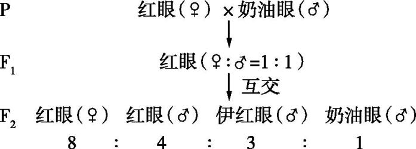
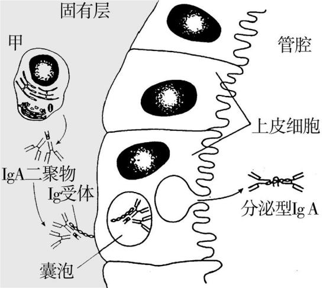
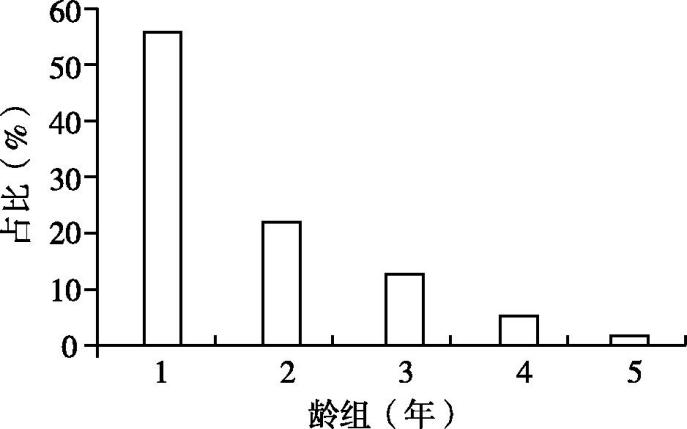
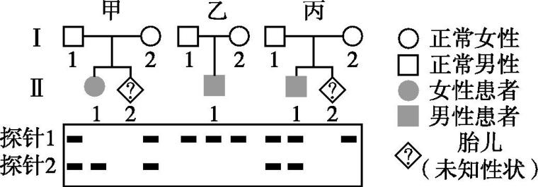
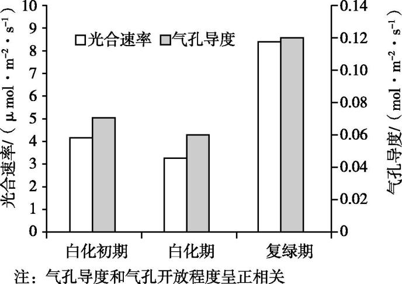
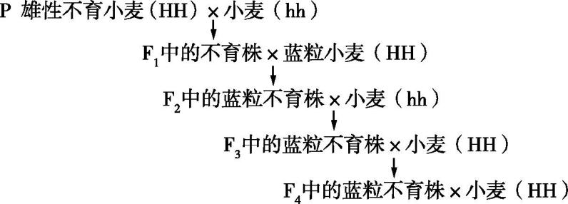
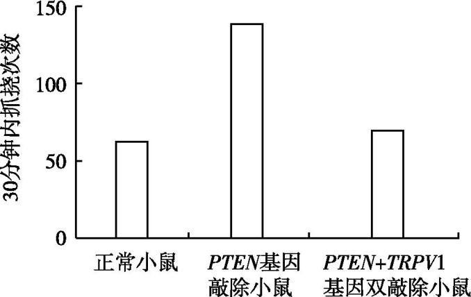
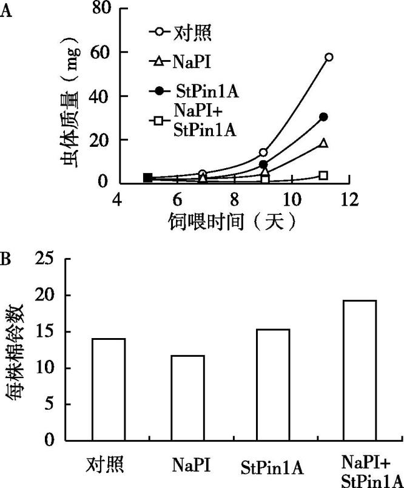

**2022年河北省普通高中学业水平选择性考试**

**生　物**

　　　　　　　　　　　　　　　　　　　　　　　　　　　　　　　　　　

一、单项选择题:本题共13小题,每小题2分,共26分。在每小题给出的四个选项中,只有一项是符合题目要求的。

1.关于细胞膜的叙述,错误的是

A.细胞膜与某些细胞器膜之间存在脂质、蛋白质的交流

B.细胞膜上多种载体蛋白协助离子跨膜运输

C.细胞膜的流动性使膜蛋白均匀分散在脂质中

D.细胞膜上多种蛋白质参与细胞间信息交流

2.关于细胞器的叙述,错误的是

A.受损细胞器的蛋白质、核酸可被溶酶体降解

B.线粒体内、外膜上都有与物质运输相关的多种蛋白质

C.生长激素经高尔基体加工、包装后分泌到细胞外

D.附着在内质网上的和游离在细胞质基质中的核糖体具有不同的分子组成

3.某兴趣小组的实验设计中,存在错误的是

A.采用样方法调查土壤中蚯蚓、鼠妇的种群数量

B.利用醋酸洋红对蝗虫精巢染色,观察减数分裂特征

C.利用斐林试剂检测麦芽、雪梨榨汁中的还原糖

D.利用健那绿染色观察衰老细胞中的线粒体

4.关于呼吸作用的叙述,正确的是

A.酵母菌无氧呼吸不产生使溴麝香草酚蓝水溶液变黄的气体

B.种子萌发时需要有氧呼吸为新器官的发育提供原料和能量

C.有机物彻底分解、产生大量ATP的过程发生在线粒体基质中

D.通气培养的酵母菌液过滤后,滤液加入重铬酸钾浓硫酸溶液后变为灰绿色

5.《尔雅》《四民月令》和《齐民要术》中记载,麻为雌雄异株,黑、白种子萌发分别长成雌、雄植株,其茎秆经剥皮、加工后生产的纤维可用于制作织物。雄麻纤维产量远高于雌麻,故“凡种麻,用白麻子”。依据上述信息推断,下列叙述错误的是

A.可从雄麻植株上取部分组织,体外培养产生大量幼苗用于生产

B.对雄麻喷洒赤霉素可促进细胞伸长,增加纤维产量

C.因为雌麻纤维产量低,所以在生产中无需播种黑色种子

D.与雌雄同花植物相比,麻更便于杂交选育新品种

6.某植物叶片含有对昆虫有毒的香豆素,经紫外线照射后香豆素毒性显著增强。乌凤蝶可以将香豆素降解,消除其毒性。织叶蛾能将叶片卷起,取食内部叶片,不会受到毒害。下列叙述错误的是

A.乌凤蝶进化形成香豆素降解体系,是香豆素对其定向选择的结果

B.影响乌凤蝶对香豆素降解能力的基因突变具有不定向性

C.为防止取食含有强毒素的部分,织叶蛾采用卷起叶片再摄食的策略

D.植物的香豆素防御体系和昆虫的避免被毒杀策略是共同进化的结果

7.研究者在培养野生型红眼果蝇时,发现一只眼色突变为奶油色的雄蝇。为研究该眼色遗传规律,将红眼雌蝇和奶油眼雄蝇杂交,结果如图。下列叙述错误的是

A.奶油眼色至少受两对独立遗传的基因控制

B.F2红眼雌蝇的基因型共有6种

C.F1红眼雌蝇和F2伊红眼雄蝇杂交,得到伊红眼雌蝇的概率为5/24

D.F2雌蝇分别与F2的三种眼色雄蝇杂交,均能得到奶油眼雌蝇

8.关于遗传物质DNA的经典实验,叙述错误的是

A.摩尔根依据果蝇杂交实验结果首次推理出基因位于染色体上

B.孟德尔描述的“遗传因子”与格里菲思提出的“转化因子”化学本质相同

C.肺炎双球菌体外转化实验和噬菌体侵染细菌实验均采用了能区分DNA和蛋白质的技术

D.双螺旋模型的碱基互补配对原则解释了DNA分子具有稳定的直径

9.与中心法则相关酶的叙述,错误的是

A.RNA聚合酶和逆转录酶催化反应时均遵循碱基互补配对原则且形成氢键

B.DNA聚合酶、RNA聚合酶和逆转录酶均由核酸编码并在核糖体上合成

C.在解旋酶协助下,RNA聚合酶以单链DNA为模板转录合成多种RNA

D.DNA聚合酶和RNA聚合酶均可在体外发挥催化作用

10.关于甲状腺激素(TH) 及其受体(TR)的叙述,错误的是

A.机体需不断产生TH才能使其含量维持动态平衡

B.TH分泌后通过体液运输,其分泌导管堵塞会导致机体代谢和耗氧下降

C.若下丘脑和垂体中的TR不能识别TH,会导致甲状腺机能亢进

D.缺碘地区的孕妇需要适量补充碘,以降低新生儿呆小症的发病率

11.气管黏膜由黏膜上皮和固有层组成。在抗原刺激下,分泌型抗体IgA (sIgA) 穿过黏膜上皮细胞到达黏膜表面,可与相应病原体结合形成复合物,随气管黏膜分泌物排出体外(如图)。下列叙述错误的是

A.图中甲为浆细胞,内质网发达,不具备识别抗原的能力

B.sIgA通过阻断相应病原体对黏膜上皮细胞的黏附发挥抗感染作用

C.黏膜及其分泌物参与组成保卫人体的第一道防线

D.sIgA 分泌及参与清除病原体的过程实现了免疫系统的防卫、监控和清除功能

12.关于生态学中的稳定与平衡,叙述错误的是

A.稳定的种群具有稳定型年龄组成,性别比例为1∶1,数量达到*K*值

B.演替到稳定阶段的群落具有相对不变的物种组成和结构

C.相对稳定的能量流动、物质循环和信息传递是生态系统平衡的特征

D.资源的消费与更新保持平衡是实现可持续发展的重要标志

13.20世纪70年代褐家鼠由外地进入新疆,对当地生态系统造成危害。研究发现,新疆某地褐家鼠种群的周限增长率为1.247 (*t*+1年与*t*年种群数量的比值),种群年龄组成如图。下列叙述正确的是

A.该种群老年个体占比较低,属于衰退型种群

B.依据其年龄组成和周限增长率推测,该种群很难被去除

C.该种群扩大过程中,当地生态系统物种丰富度提高,食物网更复杂

D.作为近缘物种,褐家鼠与当地的鼠类具有相同的种群增长能力

二、多项选择题:本题共5小题,每小题3分,共15分。在每小题给出的四个选项中,有两个或两个以上选项符合题目要求,全部选对得3分,选对但不全的得1分,有选错的得0分。

14.骨骼肌受牵拉或轻微损伤时,卫星细胞(一种成肌干细胞)被激活,增殖、分化为新的肌细胞后与原有肌细胞融合,使肌肉增粗或修复损伤。下列叙述正确的是

A.卫星细胞具有自我更新和分化的能力

B.肌动蛋白在肌细胞中特异性表达,其编码基因不存在于其他类型的细胞中

C.激活的卫星细胞中,多种细胞器分工合作,为细胞分裂进行物质准备

D.适当进行抗阻性有氧运动,有助于塑造健美体型

15.囊性纤维病是由CFTR蛋白异常导致的常染色体隐性遗传病,其中约70%患者发生的是CFTR蛋白508位苯丙氨酸(Phe508)缺失。研究者设计了两种杂交探针(能和特异的核酸序列杂交的DNA片段):探针1和2分别能与Phe508正常和Phe508缺失的*CFTR*基因结合。利用两种探针对三个家系各成员的基因组进行分子杂交,结果如图。下列叙述正确的是

A.利用这两种探针能对甲、丙家系Ⅱ-2的*CFTR*基因进行产前诊断

B.乙家系成员CFTR蛋白的Phe508没有缺失

C.丙家系Ⅱ-1携带两个DNA序列相同的*CFTR*基因

D.如果丙家系Ⅱ-2表型正常,用这两种探针检测出两条带的概率为1/3

16.人染色体DNA中存在串联重复序列,对这些序列进行体外扩增、电泳分离后可得到个体的DNA指纹图谱。该技术可用于亲子鉴定和法医学分析。下列叙述错误的是

A.DNA分子的多样性、特异性及稳定性是DNA鉴定技术的基础

B.串联重复序列在父母与子女之间的遗传不遵循孟德尔遗传定律

C.指纹图谱显示的DNA片段属于人体基础代谢功能蛋白的编码序列

D.串联重复序列突变可能会造成亲子鉴定结论出现错误

17.交感神经兴奋引起血管收缩,肌细胞的代谢产物具有舒血管效应。运动时交感神经兴奋性增强,肌细胞的代谢产物增多,这种调控机制可使肌肉运动状态时的血流量增加到静息状态时的15~20倍。下列叙述正确的是

A.肌细胞的代谢产物进入内环境,参与体液调节

B.肌肉处于运动状态时,体液调节对肌肉血流量的影响大于神经调节

C.肌细胞的代谢产物经组织液大部分进入血液,血流量增多利于维持肌细胞直接生活环境的稳定

D.运动时肌细胞的代谢产物使组织液渗透压升高,机体抗利尿激素释放减少

18.某林场对林下无植被空地进行开发,采用了“上层林木+中层藤本药材+下层草本药材+地表药用真菌”的立体复合种植模式。下列叙述正确的是

A.林、藤、草和真菌等固定的太阳能是流入该生态系统的总能量

B.该模式改变了生态系统物质循环的渠道

C.该模式提高了生态系统的抵抗力稳定性

D.该模式利用群落的垂直结构提高了群落利用环境资源的能力

三、非选择题:共59分。第19~22题为必考题,每个试题考生都必须作答。第23、24题为选考题,考生根据要求作答。

(一)必考题:共44分。

19.(10分)某品种茶树叶片呈现阶段性白化:绿色的嫩叶在生长过程中逐渐转为乳白色,而后又恢复为绿色。白化期叶绿体内部结构解体(仅残留少量片层结构)。阶段性白化过程中相关生理指标检测结果如图。

回答下列问题:

(1)从叶片中分离叶绿体可采用<u>　　　　</u>法。 

(2)经检测,白化过程中叶绿体合成ATP和NADPH的数量显著降低,其原因是<u>　　　　　　　　　　　　　　　　　　　　　　　　　　　　　　　　　　　</u>(写出两点即可)。 

(3)白化过程中气孔导度下降,既能够满足光合作用对CO2的需求,又有助于减少 。 

(4)叶片复绿过程中需合成大量直接参与光反应的蛋白质。其中部分蛋白质由存在于<u>　　　　　　　　</u>中的基因编码,需通过特定的机制完成跨膜运输;其余蛋白质由存在于<u>　　　　　　　</u>中的基因编码。 

20.(15分)蓝粒小麦是小麦(2*n*=42)与其近缘种长穗偃麦草杂交得到的,其细胞中来自长穗偃麦草的一对4号染色体(均带有蓝色素基因E)代换了小麦的一对4号染色体。小麦5号染色体上的h基因纯合后,可诱导来自小麦的和来自长穗偃麦草的4号染色体配对并发生交叉互换。某雄性不育小麦的不育基因T与等位可育基因t位于4号染色体上。为培育蓝粒和不育两性状不分离的小麦,研究人员设计了如图所示的杂交实验。

回答下列问题:

(1)亲本不育小麦的基因型是<u>　　　　</u>,F1中可育株和不育株的比例是<u>　　　　</u>。 

(2)F2与小麦(hh)杂交的目的是<u>　</u>。 

(3)F2蓝粒不育株在减数分裂时理论上能形成<u>　　　　</u>个正常的四分体。如果减数分裂过程中同源染色体正常分离,来自小麦和长穗偃麦草的4号染色体随机分配,最终能产生<u>　　　　</u>种配子(仅考虑T/t、E基因)。F3中基因型为hh的蓝粒不育株占比是<u>　　　　</u>。 

(4)F3蓝粒不育株体细胞中有<u>　　　　</u>条染色体,属于染色体变异中的<u>　　　　</u>变异。 

(5)F4蓝粒不育株和小麦(HH)杂交后单株留种形成一个株系。若株系中出现:①蓝粒可育∶蓝粒不育∶非蓝粒可育∶非蓝粒不育=1∶1∶1∶1,说明<u>　　　　　　　　　　　　　　　　　　　　　　　　</u>;②蓝粒不育∶非蓝粒可育=1∶1,说明<u>　　　　　　　　　　　　　　　　　　　　　　　　</u>。符合育种要求的是<u>　　　　</u>(填“①”或“②”)。 

21.(10分)皮肤上的痒觉、触觉、痛觉感受器均能将刺激引发的信号经背根神经节(DRG)的感觉神经元传入脊髓,整合、上传,产生相应感觉。组胺刺激使小鼠产生痒觉,引起抓挠行为。研究发现,小鼠DRG神经元中的PTEN蛋白参与痒觉信号传递。为探究PTEN蛋白的作用,研究者进行了相关实验。

回答下列问题:

(1)机体在<u>　　　　</u>产生痒觉的过程<u>　　　　</u>(填“属于”或“不属于”)反射。 

兴奋在神经纤维上以<u>　　　　</u>的形式双向传导。兴奋在神经元间单向传递的原因是<u>　　　　　　　　　　　　　　　　　　　　　　　　　</u>。 

(2)抓挠引起皮肤上的触觉、痛觉感受器<u>　　　　</u>,有效<u>　　　　</u>痒觉信号的上传,因此痒觉减弱。 

(3)用组胺刺激正常小鼠和*PTEN*基因敲除小鼠的皮肤,结果如图。据图推测PTEN蛋白的作用是<u>　　　　　　　　</u>机体对外源致痒剂的敏感性。已知*PTEN*基因敲除后,小鼠DRG中的TRPV1蛋白表达显著增加。用组胺刺激*PTEN*基因和*TRPV*1基因双敲除的小鼠,据图中结果推测TRPV1蛋白对痒觉的影响是<u>　</u>。 

22.(9分)中国丹顶鹤的主要繁殖地在扎龙自然保护区,其主要越冬栖息地为苏北地区。人类在丹顶鹤栖息地分布点及周围的活动使其栖息地面积减小、生境破碎化。调查结果显示,苏北地区丹顶鹤越冬种群数量1991~ 1999年均值为873只,2000~2015年均值为642只;丹顶鹤主要越冬栖息地中的沼泽地和盐田相关指标的变化见表。

<table style="width:39%;">
<colgroup>
<col style="width: 5%" />
<col style="width: 3%" />
<col style="width: 3%" />
<col style="width: 3%" />
<col style="width: 3%" />
<col style="width: 3%" />
<col style="width: 3%" />
<col style="width: 3%" />
<col style="width: 3%" />
<col style="width: 3%" />
</colgroup>
<tbody>
<tr>
<td rowspan="2" style="text-align: center;">栖息地类型</td>
<td colspan="3" style="text-align: center;">栖息地面积(km2)</td>
<td colspan="3" style="text-align: center;">斑块数(个)</td>
<td colspan="3" style="text-align: center;">斑块平均面积(km2)</td>
</tr>
<tr>
<td style="text-align: center;">1995年</td>
<td style="text-align: center;">2005年</td>
<td style="text-align: center;">2015年</td>
<td style="text-align: center;">1995年</td>
<td style="text-align: center;">2005年</td>
<td style="text-align: center;">2015年</td>
<td style="text-align: center;">1995年</td>
<td style="text-align: center;">2005年</td>
<td style="text-align: center;">2015年</td>
</tr>
<tr>
<td style="text-align: center;">沼泽地</td>
<td style="text-align: center;">1 502</td>
<td style="text-align: center;">916</td>
<td style="text-align: center;">752</td>
<td style="text-align: center;">427</td>
<td style="text-align: center;">426</td>
<td style="text-align: center;">389</td>
<td style="text-align: center;">3.52</td>
<td style="text-align: center;">2.15</td>
<td style="text-align: center;">1.93</td>
</tr>
<tr>
<td style="text-align: center;">盐田</td>
<td style="text-align: center;">1 155</td>
<td style="text-align: center;">1 105</td>
<td style="text-align: center;">1 026</td>
<td style="text-align: center;">98</td>
<td style="text-align: center;">214</td>
<td style="text-align: center;">287</td>
<td style="text-align: center;">11.79</td>
<td style="text-align: center;">5.16</td>
<td style="text-align: center;">3.57</td>
</tr>
</tbody>
</table>

回答下列问题:

(1)斑块平均面积减小是生境破碎化的重要体现。据表分析,沼泽地生境破碎化是<u>　　　　　　　　</u>导致的,而盐田生境破碎化则是<u>　　　　　　　　</u>导致的。 

(2)在苏北地区,决定丹顶鹤越冬种群大小的三个种群数量特征是<u>　</u>。 

(3)生态系统的自我调节能力以<u>　　　　　　　</u>机制为基础,该机制的作用是使生态系统的结构和功能保持<u>　　　　　　　　</u>。沼泽生态系统受到破坏后物种数量减少,生态系统自我调节能力<u>　</u>。 

(4)丹顶鹤的食性特征、种群数量及动态等领域尚有很多未知的生态学问题,可供科研工作者研究。丹顶鹤的这种价值属于<u>　　　　　　　　　　　　　</u>。 

(二)选考题:共15分。请考生从2道题中任选一题作答。如果多做,则按所做的第一题计分。

23.\[选修1:生物技术实践\](15分)

　　番茄灰霉病菌严重影响番茄生产,枯草芽孢杆菌可以产生对多种病原菌具有抑制作用的蛋白质。为探究枯草芽孢杆菌能否用于番茄灰霉病的生物防治,研究者设计了相关实验。

回答下列问题:

(1)检测枯草芽孢杆菌对番茄灰霉病菌的抑制作用时,取适量<u>　　　　</u>菌液涂布于固体培养基上,将无菌滤纸片(直径5 mm)在<u>　　　　</u>菌液中浸泡后覆盖于固体培养基中心,数秒后取出滤纸片,培养皿倒置培养后测量<u>　　　　</u>大小以判定抑菌效果。 

(2)枯草芽孢杆菌为好氧微生物,液体培养时应采用<u>　　　　</u>(填“静置”或“摇床震荡”)培养。培养过程中抽样检测活菌数量时,应采用<u>　　　　</u>(填“稀释涂布平板法”或“显微镜直接计数法”),其原因是 。 

(3)电泳分离蛋白质混合样品的原理是<u>　　　　　　　　　　　　　　　　　　　　　　　　　　　　　　　　　　　　　　　　　</u>。利用SDS-聚丙烯酰胺凝胶电泳测定枯草芽孢杆菌的抗菌蛋白分子量时,SDS的作用是<u>　　　　　　　　　　　　　　　　</u>。 

(4)枯草芽孢杆菌长期保藏时,常以其<u>　　　　</u>作为保藏对象。 

24.\[选修3:现代生物科技专题\](15分)

　　蛋白酶抑制剂基因转化是作物抗虫育种的新途径。某研究团队将胰蛋白酶抑制剂(NaPI)和胰凝乳蛋白酶抑制剂(StPin1A)的基因单独或共同转化棉花,获得了转基因植株。

回答下列问题:

(1)蛋白酶抑制剂的抗虫机制是 。 

(2)<u>　　　　　　　　　　　　</u>是实施基因工程的核心。 

(3)利用农杆菌转化法时,必须将目的基因插入到质粒的<u>　　　　</u>上,此方法的不足之处是 。 

(4)为检测目的基因在受体细胞基因组中的整合及其转录和翻译,可采用的检测技术有<u>　　　　　　　　　　　　　　　　</u>(写出两点即可)。 

(5)确认抗虫基因在受体细胞中稳定表达后,还需进一步做抗虫的<u>　　　　</u>以鉴定其抗性程度。如图为三种不同遗传操作产生的转基因棉花抗虫实验结果,据结果分析<u>　　　　</u>(填“NaPI”“StPin1A”或“NaPI+StPin1A”)

转基因棉花的抗虫效果最佳,其原因是 。 

(6)基因突变可产生新的等位基因,在自然选择的作用下,昆虫种群的基因频率会发生<u>　　　　　　　　</u>,导致昆虫朝着一定的方向不断进化。据此推测,被蛋白酶抑制剂转基因作物长期选择后,某些昆虫具有了抗蛋白酶抑制

剂的能力,其分子机制可能是 <u>（</u>写出两点即可)。 

**2022年河北省普通高中学业水平选择性考试**

**生物参考答案**

**一、单项选择题：本题共13小题。**

1\. C   2. D   3. B   4. B   5. C   6. C   7. D   8. A   9. C   10. B   11. D   12. A   13. B

**二、多项选择题：本题共5小题。**

14\. ACD   15. AB   16. BC   17. A   18. CD

**三、非选择题：第19～22题为必考题，每个试题考生都必须作答。第23、24题为选考题，考生根据要求作答。**

**（一）必考题：**

19\. 【答案】（1）差速离心

（2）叶绿体内部结构解体；光合色素减少    （3）水分的散失

（4）    ①. 细胞核    ②. 叶绿体

20\. 【答案】（1）    ①. TtHH     ②. 1:1

（2）获得h基因纯合（hh）的蓝粒不育株，诱导小麦和长穗偃麦草的4号染色体配对并发生交叉互换，从而使T基因与E基因交换到一条姐妹染色单体上，以获得蓝粒和不育性状不分离的小麦

（3）    ①. 20    ②. 4    ③. 1/16

（4）    ①. 43    ②. 数目

（5）    ①. F4蓝色不育株体细胞中T基因和E基因位于不同染色体上    ②. F4蓝色不育株体细胞中T基因和E基因位于同一条染色体上    ③. ②

21\. 【答案】（1）    ①. 大脑皮层    ②. 不属于    ③. 电信号（神经冲动）    ④. 神经递质只能由突触前膜释放，作用于突触后膜

（2）    ①. 兴奋    ②. 抑制

（3）    ①. 减弱    ②. 促进痒觉的产生

22\. 【答案】（1）    ①. 人类活动    ②. 盐田的开采

（2）出生率、死亡率、迁入率

（3）    ①. 负反馈调节    ②. 相对稳定    ③. 下降

（4）直接价值

**（二）选考题：**

**\[选修1：生物技术实践\]**

23\. 【答案】（1）    ①. 番茄灰霉病菌    ②. 枯草芽孢杆菌    ③. 透明圈

（2）    ①. 摇床震荡    ②. 稀释涂布平板法    ③. 用稀释涂布平板法在培养基上看到的每一个菌落都来自一个活细胞，而显微镜直接计数法会将死亡的枯草芽孢杆菌也计算在内

（3）    ①. 利用待分离样品中各种分子带电性质的差异及分子本身的大小、形状的不同，使带电分子产生不同的迁移速度，从而实现样品中各种分子的分离    ②. SDS带有大量的负电荷，且能使蛋白质变性成为肽链，使蛋白质的迁移速率只与蛋白质的相对分子质量有关，而与所带电荷性质无关    （4）菌液

**\[选修3：现代生物科技专题\]**

24\. 【答案】（1）调节害虫胰蛋白酶活性，从而使害虫不能正常消化食物达到抗虫的目的

（2）#基因表达载体的构建##表达载体的构建#

（3）    ①. T-DNA    ②. 该方法不适用与单子叶植物

（4）基因--DNA分子杂交技术、mRNA--分子杂交技术、抗原-抗体杂交技术

（5）    ①. 效果    ②. NaPI

③. 饲喂NaPI转基因的虫体质量较对照组差，且每株棉铃数较对照组少

（6）    ①. 定向改变    ②. 由于害虫发生基因突变后，在胰蛋白酶抑制剂的选择下，抗性基因频率逐渐增高，从而提升了其抗胰蛋白酶抑制剂的能力，或胰蛋白酶抑制剂基因发生突变后不能编码处胰蛋白酶抑制剂
