**2022年1月浙江省选考科目考试生物试题**

**生物试题**

**一、选择题**

1\. 在某些因素诱导下，人体造血干细胞能在体外培养成神经细胞和肝细胞。此过程主要涉及细胞的（ ）

A 分裂与分化 B. 分化与癌变 C. 癌变与衰老 D. 衰老与分裂

2\. 以黑藻为材料进行“观察叶绿体”活动。下列叙述正确的是（ ）

A. 基部成熟叶片是最佳观察材料曲不冠 B. 叶绿体均匀分布于叶肉细胞中心

C. 叶绿体形态呈扁平的椭球形或球形 D. 不同条件下叶绿体的位置不变

3\. 下列关于腺苷三磷酸分子的叙述，正确的是（ ）

A. 由1个脱氧核糖、1个腺嘌呤和3个磷酸基团组成

B. 分子中与磷酸基团相连接的化学键称为高能磷酸键

C. 在水解酶的作用下不断地合成和水解

D. 是细胞中吸能反应和放能反应纽带

4\. 某种植物激素能延缓离体叶片的衰老，可用于叶菜类的保鲜。该激素最可能是（ ）

A. 细胞分裂素 B. 生长素 C. 脱落酸 D. 赤霉素

5\. 垃圾分类是废弃物综合利用的基础，下列叙述错误的是（ ）

A. 有害垃圾填埋处理可消除环境污染

B. 厨余垃圾加工后可作为鱼类养殖的饵料

C. 生活垃圾发酵能产生清洁可再生能源

D. 禽畜粪便作为花卉肥料有利于物质的良性循环

6\. 线粒体结构模式如图所示，下列叙述错误的是（ ）

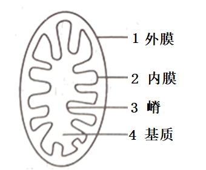

A. 结构1和2中的蛋白质种类不同

B. 结构3增大了线粒体内膜的表面积

C. 厌氧呼吸生成乳酸的过程发生在结构4中

D. 电子传递链阻断剂会影响结构2中水的形成

7\. 农作物秸秆的回收利用方式很多，其中之一是将秸秆碎化后作为食用菌的栽培基质。碎化秸秆中纤维所起的作用，相当于植物组织培养中固体培养基的（ ）

A. 琼脂+蔗糖 B. 蔗糖+激素 C. 激素+无机盐 D. 无机盐+琼脂

8\. 膜蛋白的种类和功能复杂多样，下列叙述正确的是（ ）

A. 质膜内、外侧的蛋白质呈对称分布

B. 温度变化会影响膜蛋白的运动速度

C. 叶绿体内膜上存在与水分解有关的酶

D. 神经元质膜上存在与K+、Na+主动转运有关的通道蛋白

9\. 植物体内果糖与X物质形成蔗糖的过程如图所示。

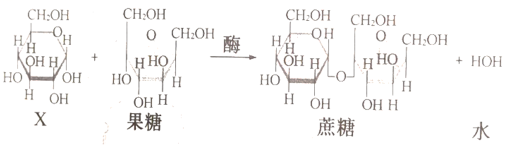

下列叙述错误的是（ ）

A. X与果糖的分子式都是C6H12O6

B. X是植物体内的主要贮能物质

C. X是植物体内重要的单糖

D. X是纤维素的结构单元

10\. 孟德尔杂交试验成功的重要因素之一是选择了严格自花授粉的豌豆作为材料。自然条件下豌豆大多数是纯合子，主要原因是（ ）

A. 杂合子豌豆的繁殖能力低 B. 豌豆的基因突变具有可逆性

C. 豌豆的性状大多数是隐性性状 D. 豌豆连续自交，杂合子比例逐渐减小

11\. 膝反射是一种简单反射，其反射弧为二元反射弧。下列叙述错误的是（ ）

A. 感受器将刺激转换成神经冲动并沿神经纤维单向传导

B. 神经肌肉接点的神经冲动传递伴随信号形式的转换

C. 突触后膜去极化形成的电位累加至阈值后引起动作电位

D. 抑制突触间隙中递质分解的药物可抑制膝反射

12\. 为保护生物多样性，拯救长江水域的江豚等濒危物种、我国自2021年1月1日零时起实施长江十年禁渔计划。下列措施与该计划的目标不符的是（ ）

A. 管控船舶进出禁渔区域，以减少对水生生物的干扰

B. 对禁渔区域定期开展抽样调查，以评估物种资源现状

C. 建立江豚的基因库，以保护江豚遗传多样性

D. 清理淤泥、疏浚河道，以拓展水生动物的生存空间

13\. 在“减数分裂模型的制作研究”活动中，先制作4个蓝色（2个5cm、2个8cm）和4个红色（2个5cm，2个8cm）的橡皮泥条，再结合细铁丝等材料模拟减数分裂过程，下列叙述错误的是（ ）

A. 将2个5cm蓝色橡皮泥条扎在一起，模拟1个已经复制的染色体

B. 将4个8m橡皮泥条按同颜色扎在一起再并排，模拟1对同源染色体的配对

C. 模拟减数分裂后期I时，细胞同极的橡皮泥条颜色要不同

D. 模拟减数分裂后期II时，细胞一极的橡皮泥条数要与另一极的相同

14\. 沙蝗的活动、迁徒有逐水而居”的倾向。某年，沙蝗从非洲经印度和巴基斯坦等国家向中亚迁徙，直到阿富汗以及我国西北边境，扩散和迁徙“夏然而止”。下列叙述正确的是（ ）

A. 沙蝗停止扩散的主要原因是种内竞争加剧

B. 沙蝗种群的数量波动表现为非周期性变化

C. 天敌对沙蝗的制约作用改变了沙蝗的生殖方式

D. 若沙蝗进入我国西北干旱地区将呈现“J”型增长

15\. 某海域甲、乙两种浮游动物昼夜分布如图所示。下列分析中合理的是（ ）

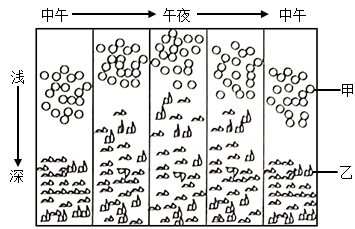

A. 甲有趋光性，乙有避光性 B. 甲、乙主要以浮游植物食

C. 乙的分布体现了群落的垂直结构 D. 甲、乙的沉浮体现了群落的时间结构

16\. 峡谷和高山的阻隔都可能导致新物种形成。两个种的羚松鼠分别生活在某大峡谷的两侧，它们的共同祖先生活在大峡谷形成之前；某高山两侧间存在有限的“通道”，陆地蜗牛和很多不能飞行的昆虫可能会在“通道”处形成新物种。下列分析不合理的是（ ）

A. 大峡谷分隔形成的两个羚松鼠种群间难以进行基因交流

B. 能轻易飞越大峡谷的鸟类物种一般不会在大峡谷两侧形成为两个物种

C. 高山两侧的陆地蜗牛利用“通道”进行充分的基因交流

D. 某些不能飞行的昆虫在“通道”处形成的新种与原物种存在生殖隔离

17\. 用果胶酶处理草莓，可以得到比较澄清的草莓汁；而利用稀盐酸处理草莓可以制得糊状的草莓酱。果胶酶和盐酸催化果胶水解的不同点在于（ ）

A. 两者催化果胶水解得到的产物片段长度不同

B. 两者催化果胶水解得到的单糖不同

C. 两者催化果胶主链水解断裂的化学键不同

D. 酶催化需要最适温度，盐酸水解果胶不需要最适温度

18\. 某多细胞动物具有多种细胞周期蛋白（cyclin）和多种细胞周期蛋白依赖性激酶（CDK），两者可组成多种有活性的CDK-cyclin复合体，细胞周期各阶段间的转换分别受特定的CDK-cyclin复合体调控。细胞周期如图所示，下列叙述错误的是（ ）

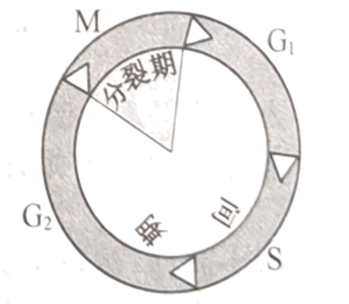

A. 同一生物个体中不同类型细胞的细胞周期时间长短有差异

B. 细胞周期各阶段的有序转换受不同的CDK-cyclin复合体调控

C. 抑制某种CDK-cyclin复合体的活性可使细胞周期停滞在特定阶段

D. 一个细胞周期中，调控不同阶段的CDK-cyclin复合体会同步发生周期性变化

19\. 小鼠甲状腺的内分泌机能受机体内、外环境因素影响，部分调节机理如图所示。

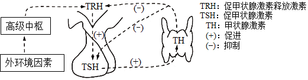

下列叙述错误的是（ ）

A. TRH遍布全身血液，并定向作用于腺垂体

B. 低于机体生理浓度时的TH对TH的分泌起促进作用

C. 饮食缺碘会影响下丘脑和腺垂体的功能，引起甲状腺组织增生

D. 给小鼠注射抗TRH血清后，机体对寒冷环境的适应能力减弱

20\. S型肺炎双球菌的某种“转化因子”可使R型菌转化为S型菌。研究“转化因子”化学本质的部分实验流程如图所示

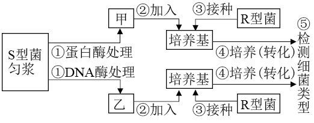

下列叙述正确的是（ ）

A. 步骤①中、酶处理时间不宜过长，以免底物完全水解

B. 步骤②中，甲或乙的加入量不影响实验结果

C 步骤④中，固体培养基比液体培养基更有利于细菌转化

D. 步骤⑤中，通过涂布分离后观察菌落或鉴定细胞形态得到实验结果

21\. 羊瘙痒病是感染性蛋白粒子PrPSc引起的。某些羊体内存在蛋白质PrPc，但不发病。当羊感染了PrPSc后，PrPSc将PrPc不断地转变为PrPSc，导致PrPSc积累，从而发病。把患瘙痒病的羊组织匀浆接种到小鼠后，小鼠也会发病。下列分析合理的是（ ）

A. 动物体内的PrPSc可全部被蛋白酶水解

B. 患病羊体内存在指导PrPSc合成的基因

C. 产物PrPSc对PrPc转变为PrPSc具有反馈抑制作用

D. 给PrPc基因敲除小鼠接种PrPSSc，小鼠不会发病

22\. 经调查统计，某物种群体的年龄结构如图所示

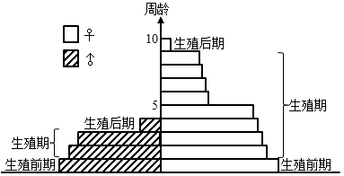

下列分析中合理的是（ ）

A. 因年龄结构异常不能构成种群 B. 可能是处于增长状态的某昆虫种群

C. 可能是处于增长状态的某果树种群 D. 可能是受到性引诱剂诱杀后的种群

23\. 果蝇（2n=8）杂交实验中，F2某一雄果蝇体细胞中有4条染色体来自F1雄果蝇，这4条染色体全部来自亲本（P）雄果蝇的概率是（ ）

A. 1/16 B. 1/8 C. 1/4 D. 1/2

24\. 各类遗传病在人体不同发育阶段的发病风险如图。下列叙述正确的是（ ）

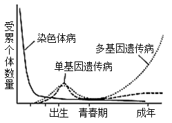

A. 染色体病在胎儿期高发可导致婴儿存活率不下降

B. 青春期发病风险低更容易使致病基因在人群中保留

C. 图示表明，早期胎儿不含多基因遗传病的致病基因

D. 图示表明，显性遗传病在幼年期高发，隐性遗传病在成年期高发

25\. 免疫应答的特殊性与记忆包括三个事件：①对“非己”的分子标志进行特异识别；②淋巴细胞反复分裂产生数量大的淋巴细胞群；③淋巴细胞分化成特化的效应细胞群和记忆细胞群。下列叙述正确的是（ ）

A. 针对胞外毒系，事件①中一个未活化的B细胞可能被任何一种胞外毒素致敏

B. 针对异体移植细胞，事件①中辅助性T细胞和细胞毒性T细胞都需接受抗原MHC复合体的信息

C. 事件②中，辅助性T细胞在胸腺中大量增殖，分泌白细胞介素-2等多种蛋白因子

D. 事件③中，效应细胞群和记忆细胞群协同杀灭和清除入侵病原体

**二、非选择题**

26\. 玉米是我国广泛栽培的禾本科农作物，其生长过程常伴生多种杂草（其中有些是禾本科植物），杂草与玉米竞争水、肥和生长空间。回答下列问题：

（1）从种群分布型的角度考虑，栽培玉米时应遵循\_\_\_\_\_\_\_\_\_\_\_\_、合理密植的原则，使每个个体能得到充分的太阳光照。栽培的玉米个体生长基本同步，种群存活曲线更接近\_\_\_\_\_\_\_\_\_\_\_\_。

（2）某个以玉米为主要农作物的农田生态系统中，有两条食物链：①玉米→野猪→豺；②玉米→玉米蝗→乌鸫→蝮蛇→鹰。从能量流动角度分析，由于能量\_\_\_\_\_\_\_\_\_\_\_的不同导致两条食物链的营养级数量不同。食物链乃至食物网能否形成取决于哪一项？\_\_\_\_\_\_\_\_\_\_\_。

A可利用太阳能 B．初级消费者可同化的能量 C．总初级生产量 D．净初级生产量）

（3）玉米栽培过程需除草，常用除草方法有物理除草、化学除草和生物除草等。实际操作时，幼苗期一般不优先采用生物除草，其理由是抑（食）草生物不能\_\_\_\_\_\_\_\_\_\_\_。当玉米植株长到足够高时，很多杂草因\_\_\_\_\_\_\_\_\_\_\_被淘汰。

（4）玉米秸秆自然分解，所含的能量最终流向大气圈，我们可以改变能量流动\_\_\_\_\_\_\_\_\_\_\_获得人类需要的物质和能量，如生产沼气等，客观上减少温室气体的排放，有助于我国提前达成“碳达峰”和“碳中和”的目标。

27\. 不同光质及其组合会影响植物代谢过程。以某高等绿色植物为实验材料，研究不同光质对植物光合作用的影响，实验结果如图，其中气孔导度大表示气孔开放程度天。该高等植物叶片在持续红光照射条件下，用不同单色光处理（30s/次），实验结果如图2，图中“蓝光十绿光”表示先蓝光后绿光处理，“蓝光十绿光+蓝光”表示先蓝光再绿光后蓝光处理。

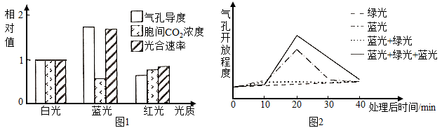

回答下列问题：

（1）高等绿色植物叶绿体中含有多种光合色素，常用\_\_\_\_\_\_\_\_\_\_\_\_方法分离。光合色素吸收的光能转化为ATP和NADPH中的化学能、可用于碳反应中\_\_\_\_\_\_\_\_\_\_\_\_的还原。

（2）据分析，相对于红光，蓝光照射下胞间CO2浓度低，其原因是\_\_\_\_\_\_\_\_\_\_\_\_。气孔主要由保卫细胞构成、保卫细胞吸收水分气孔开放、之关闭2可知，绿光对蓝光刺激引起的气孔开放具有阻止作用，但这种作用可被\_\_\_\_\_\_\_\_\_\_\_\_光逆转。由图1图2可知蓝光可刺激气孔开放，其机理是蓝光可使保卫细胞光合产物增多，也可以促进K+、Cl-的吸收等，最终导致保卫细胞\_\_\_\_\_\_\_\_\_\_\_\_，细胞吸水，气孔开放。

（3）生产上选用\_\_\_\_\_\_\_\_\_\_LED灯或滤光性薄膜获得不同光质环境，用于某些药用植物的栽培。红光和蓝光以合理比例的\_\_\_\_\_\_\_\_\_\_\_\_或\_\_\_\_\_\_\_\_\_\_\_\_、合理的光照次序照射，利于次生代谢产物的合成。

28\. 果蝇的正常眼和星眼受等位基因A、a控制，正常翅和小翅受等位基因B、b控制其中1对基因位于常染色体上。为进一步研究遗传机制，以纯合个体为材料进行了杂交实验，各组合重复多次，结果如下表。

<table style="width:100%;">
<colgroup>
<col style="width: 20%" />
<col style="width: 20%" />
<col style="width: 20%" />
<col style="width: 20%" />
<col style="width: 20%" />
</colgroup>
<tbody>
<tr>
<td rowspan="2" style="text-align: left;">杂交组合</td>
<td colspan="2" style="text-align: left;">P</td>
<td colspan="2" style="text-align: left;">F1</td>
</tr>
<tr>
<td style="text-align: left;">♀</td>
<td style="text-align: left;">♂</td>
<td style="text-align: left;">♀</td>
<td style="text-align: left;">♂</td>
</tr>
<tr>
<td style="text-align: left;">甲</td>
<td style="text-align: left;">星眼正常翅</td>
<td style="text-align: left;">正常眼小翅</td>
<td style="text-align: left;">星眼正常翅</td>
<td style="text-align: left;">星眼正常翅</td>
</tr>
<tr>
<td style="text-align: left;">乙</td>
<td style="text-align: left;">正常眼小翅</td>
<td style="text-align: left;">星眼正常翅</td>
<td style="text-align: left;">星眼正常翅</td>
<td style="text-align: left;">星眼小翅</td>
</tr>
<tr>
<td style="text-align: left;">丙</td>
<td style="text-align: left;">正常眼小翅</td>
<td style="text-align: left;">正常眼正常翅</td>
<td style="text-align: left;">正常眼正常翅</td>
<td style="text-align: left;">正常眼小翅</td>
</tr>
</tbody>
</table>

回答下列问题：

（1）综合考虑A、a和B、b两对基因，它们的遗传符合孟德尔遗传定律中的\_\_\_\_\_\_\_\_\_\_。组合甲中母本的基因型为\_\_\_\_\_\_\_\_\_\_。果蝇的发育过程包括受精卵、幼虫、蛹和成虫四个阶段。杂交实验中，为避免影响实验结果的统计，在子代处于蛹期时将亲本\_\_\_\_\_\_\_\_\_\_。

（2）若组合乙F1的雌雄个体随机交配获得F2，则F2中星眼小翅雌果蝇占\_\_\_\_\_\_\_\_\_\_\_\_。果蝇的性染色体数目异常可影响性别，如XYY或XO为雄性，XXY为雌性。若发现组合甲F1中有1只非整倍体星眼小翅雄果蝇，原因是母本产生了不含\_\_\_\_\_\_\_\_\_\_的配子。

（3）若有一个由星眼正常翅雌、雄果蝇和正常眼小翅雌、雄果蝇组成的群体，群体中个体均为纯合子。该群体中的雌雄果蝇为亲本，随机交配产生F1，F1中正常眼小翅雌果蝇占21/200、星眼小翅雄果蝇占49/200，则可推知亲本雄果蝇中星眼正常翅占\_\_\_\_\_\_\_\_\_\_。

（4）写出以组合丙F1的雌雄果蝇为亲本杂交的遗传图解。\_\_\_\_\_\_\_\_\_\_\_\_。

29\. 回答下列（一）、（二）小题：

（一）红曲霉合成的红曲色素是可食用的天然色素，具有防腐、降脂等功能。研究者进行了红曲色素的提取及红色素的含量测定实验，流程如下：

（1）取红曲霉菌种斜面，加适量\_\_\_\_\_\_\_\_\_\_\_\_洗下菌苔，制成菌悬液并培养，解除休眠获得\_\_\_\_\_\_\_\_\_\_\_\_菌种。经液体发酵，收集红曲霉菌丝体，红曲霉菌丝体与70%乙醇溶液混合，经浸提、\_\_\_\_\_\_\_\_\_\_\_\_，获得的上清液即为红曲色素提取液。为进一步提高红曲色素得率，可将红曲霉细胞进行\_\_\_\_\_\_\_\_\_\_\_\_处理。

（2）红曲色素包括红色素、黄色素和橙黄色素等，红色素在390nm、420nm和505nm液长处均有较大吸收峰。用光电比色法测定红曲色素取液甲的红色素含量时，通常选用505nm波长测定的原因是\_\_\_\_\_\_\_\_\_\_\_\_。测定时需用\_\_\_\_\_\_\_\_\_\_\_\_作空白对照。

（3）生产上提取红曲色素后的残渣，经\_\_\_\_\_\_\_\_\_\_处理后作为饲料添加剂或有机肥，这属于废弃物的无害化和\_\_\_\_\_\_\_\_\_\_处理。

（二）我国在新冠疫情按方面取得了显著的成统，但全球疫情形势仍然非常严峻、尤其是病毒出现了新变异株——德尔塔、奥密克戎，更是威胁着全人类的生命健康。

（4）新冠病毒核酸定性检测原理是：以新冠病毒的单链RNA为模板，利用\_\_\_\_\_\_\_\_\_\_酶合成DNA，经PCR扩增，然后在扩增产物中加入特异的\_\_\_\_\_\_\_\_\_\_，如果检测到特异的杂交分子则核酸检测为阳性。

（5）接种疫苗是遏制新冠疫情蔓延的重要手段。腺病毒疫苗的制备技术要点是：将腺病毒的复制基因敲除；以新冠病毒的\_\_\_\_\_\_\_\_\_\_基因为模板合成的DNA插入腺病毒基因组，构建重组腺病毒。重组腺病毒在人体细胞内表达产生新冠病毒抗原，从而引发特异性免疫反应。在此过程中，腺病毒的作用是作为基因工程中目的基因的\_\_\_\_\_\_\_\_\_\_\_\_。将腺病毒复制基因敲除的目的是\_\_\_\_\_\_\_\_\_\_\_\_。

（6）单克隆抗体有望用于治疗新冠肺炎。单克隆抗体的制备原理是：取免疫阳性小鼠的\_\_\_\_\_\_\_\_\_\_\_\_细胞与骨髓瘤细胞混合培养，使其融合，最后筛选出能产生特定抗体的杂交瘤细胞。与植物组织培养相比，杂交瘤细胞扩大培养需要特殊的成分，如胰岛素和\_\_\_\_\_\_\_\_\_\_\_\_。

30\. 坐骨神经由多种神经纤维组成，不同神经纤维的兴奋性和传导速率均有差异，多根神经纤维同步兴奋时，其动作电位幅值（即大小变化幅度）可以叠加；单根神经纤维的动作电位存在“全或无”现象。

欲研究神经电生理特性，请完善实验思路，分析和预测结果（说明：生物信号采集仪能显示记录电极处的电位变化，仪器使用方法不要求；实验中标本需用任氏液浸润）。

（1）实验思路：

①连接坐骨神经与生物信号采集仪等（简图如下，a、b为坐骨神经上相距较远的两个点）。

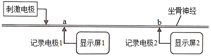

②刺激电极依次施加由弱到强的电刺激，显示屏1上出现第一个动作电位时的刺激强度即阈刺激，记为Smin。

③\_\_\_\_\_\_\_\_\_\_\_\_，当动作电位幅值不再随刺激增强而增大时，刺激强度即为最大刺激，记为Smax。

（2）结果预测和分析：

①当刺激强度范围为\_\_\_\_\_\_\_\_\_\_\_\_时，坐骨神经中仅有部分神经纤维发生兴奋。

②实验中，每次施加电刺激的几乎同时，在显示屏上都会出现一次快速的电位变化，称为伪迹，其幅值与电刺激强度成正比，不影响动作电位（见图）。伪迹的幅值可以作为\_\_\_\_\_\_\_\_\_\_\_的量化指标；伪迹与动作电位起点的时间差，可估测施加刺激到记录点神经纤维膜上\_\_\_\_\_\_\_\_\_\_所需的时间。伪迹是电刺激通过\_\_\_\_\_\_\_\_传导到记录电极上而引发的。

③在单根神经纤维上，动作电位不会因传导距离的增加而减小，即具有\_\_\_\_\_\_\_\_\_\_性。而上述实验中a、b处的动作电位有明显差异（如图），原因是不同神经纤维上动作电位的\_\_\_\_\_\_\_\_\_\_不同导致b处电位叠加量减小。

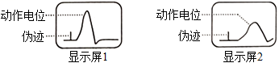

④以坐骨神经和单根神经纤维为材料，分别测得两者的Smin和Smax。将坐标系补充完整，并用柱形图表示两者的Smin和Smax相对值。\_\_\_\_\_\_\_\_\_\_

