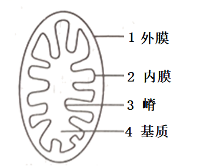
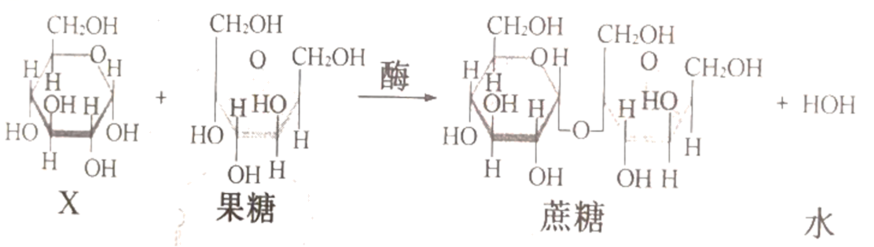
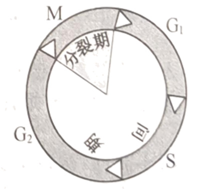
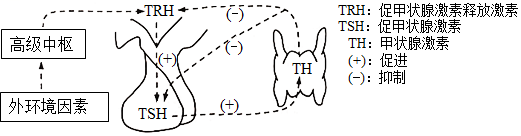
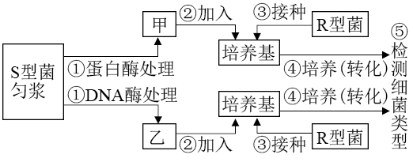
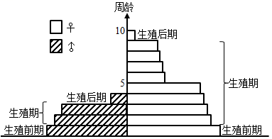
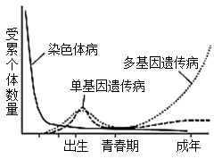
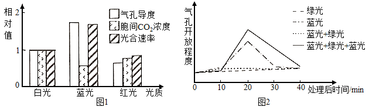
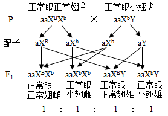
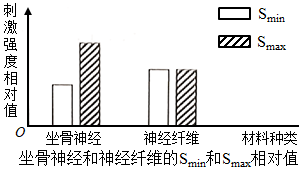

**2022年1月浙江省选考科目考试生物试题**

**生物试题**

**一、选择题**

1\. 在某些因素诱导下，人体造血干细胞能在体外培养成神经细胞和肝细胞。此过程主要涉及细胞的（ ）

A. 分裂与分化 B. 分化与癌变 C. 癌变与衰老 D. 衰老与分裂

【答案】A

【解析】

【分析】造血干细胞是血细胞（红细胞、白细胞、血小板等）的鼻祖，由造血干细胞定向分化、增殖为不同的血细胞系，并进一步生成血细胞。造血干细胞是高度未分化细胞，具有良好的分化增殖能力。

【详解】在正常情况下，经过细胞分裂产生新细胞，在遗传物质的作用下，其形态、结构、功能随着细胞的生长出现了差异，就是细胞的分化，在某些因素诱导下，人体造血干细胞能在体外培养成神经细胞和肝细胞。此过程主要涉及细胞的分裂和分化，A正确，BCD错误。

故选A。

2\. 以黑藻为材料进行“观察叶绿体”活动。下列叙述正确的是（ ）

A. 基部成熟叶片是最佳观察材料曲不冠 B. 叶绿体均匀分布于叶肉细胞中心

C. 叶绿体形态呈扁平的椭球形或球形 D. 不同条件下叶绿体的位置不变

【答案】C

【解析】

【分析】观察叶绿体

（1）制片：在洁净的载玻片中央滴一滴清水，用镊子取一片藓类的小叶或取菠菜叶稍带些叶肉的下表皮，放入水滴中，盖上盖玻片。

（2）低倍镜观察：在低倍镜下找到叶片细胞，然后换用高倍镜。

（3）高倍镜观察：调清晰物像，仔细观察叶片细胞内叶绿体的形态和分布情况。

【详解】A、黑藻基部成熟叶片含有的叶绿体多，不易观察叶绿体的形态，应选用黑藻的幼嫩的小叶，A错误；

B、叶绿体呈扁平的椭球形或球形，围绕液泡沿细胞边缘分布，B错误；

C、观察到的叶绿体呈扁平的椭球形或球形，C正确；

D、叶绿体的形态和分布可随光照强度和方向的改变而改变，D错误。

故选C。

3\. 下列关于腺苷三磷酸分子的叙述，正确的是（ ）

A. 由1个脱氧核糖、1个腺嘌呤和3个磷酸基团组成

B. 分子中与磷酸基团相连接的化学键称为高能磷酸键

C. 在水解酶的作用下不断地合成和水解

D. 是细胞中吸能反应和放能反应的纽带

【答案】D

【解析】

【分析】ATP是三磷酸腺苷的英文名称缩写。ATP分子的结构 式可以简写成A—P～P～P，其中A代表腺苷，P代表磷酸基团，～代表一种特殊的化学键，ATP分子中大量的能量就储存在特殊的化学键中。ATP可以水解，这实际上是指ATP分子中特殊的化学键水解。

【详解】A、1分子的ATP是由1分子腺嘌呤、1分子核糖和3分子磷酸基团组成，A错误；

B、ATP分子的结构式可以简写成A—P～P～P，磷酸基团与磷酸基团相连接的化学键是一种特殊的化学键，B错误；

C、ATP在水解酶的作用下水解，在合成酶的作用下ADP和磷酸吸收能量合成ATP，C错误；

D、吸能反应一般与ATP的分解相联系，放能反应一般与ATP的合成相联系，故吸能反应和放能反应之间的纽带就是ATP，D正确。

故选D。

4\. 某种植物激素能延缓离体叶片的衰老，可用于叶菜类的保鲜。该激素最可能是（ ）

A. 细胞分裂素 B. 生长素 C. 脱落酸 D. 赤霉素

【答案】A

【解析】

【分析】生长素的主要生理功能：生长素的作用表现为两重性，即：低浓度促进生长，高浓度抑制生长。赤霉素的主要生理功能：促进细胞的伸长；解除种子、块茎的休眠并促进萌发的作用。细胞分裂素的主要生理功能：促进细胞分裂；诱导芽的分化；防止植物衰老。脱落酸的主要生理功能：抑制植物细胞的分裂和种子的萌发；促进植物进入休眠；促进叶和果实的衰老、脱落。乙烯的主要生理功能：促进果实成熟；促进器官的脱落；促进多开雌花。

【详解】根据上述分析可知，细胞分裂素可促进细胞分裂，延缓衰老，因此可用于叶菜类的保鲜，A正确，BCD错误。

故选A。

5\. 垃圾分类是废弃物综合利用的基础，下列叙述错误的是（ ）

A. 有害垃圾填埋处理可消除环境污染

B. 厨余垃圾加工后可作为鱼类养殖的饵料

C. 生活垃圾发酵能产生清洁可再生能源

D. 禽畜粪便作为花卉肥料有利于物质的良性循环

【答案】A

【解析】

【分析】将垃圾资源化、无害处理处理可以利用有机垃圾中的能量外，还充分地分层次多级利用了垃圾中的物质，减少了环境污染。

【详解】A、有害垃圾主要包括废旧电池、过期药物等，此类垃圾若进入土壤或水体中，其中的重金属离子等物质会通过食物链和食物网逐级积累，还会污染环境，A错误；

B、厨余垃圾含有大量的有机物，经加工后可作为鱼类养殖的饵料，B正确；

C、微生物通过分解作用可将垃圾中的有机物分解成无机物或沼气，此过程可再生能源，C正确；

D、分解者可以将禽畜粪便分解为无机物，作为花卉肥料，而释放的CO2可向无机环境归还碳元素，有利于物质的良性循环，D正确。

故选A。

6\. 线粒体结构模式如图所示，下列叙述错误的是（ ）

A. 结构1和2中的蛋白质种类不同

B. 结构3增大了线粒体内膜的表面积

C. 厌氧呼吸生成乳酸的过程发生在结构4中

D. 电子传递链阻断剂会影响结构2中水的形成

【答案】C

【解析】

【分析】线粒体是具有双层膜结构的细胞器，外膜光滑，内膜向内折叠形成嵴，增大了内膜面积。线粒体是有氧呼吸的主要场所，在线粒体基质中进行有氧呼吸第二阶段，在线粒体内膜上进行有氧呼吸第三阶段。

【详解】A、结构1外膜和2内膜的功能不同，所含的蛋白质种类和数量不同，A正确；

B、内膜向内折叠形成3（嵴），增大了内膜面积，B正确；

C、厌氧呼吸生成乳酸的过程发生细胞质基质中，C错误；

D、2内膜是有氧呼吸第三阶段的场所，电子传递链阻断剂会影响结构2中水的形成，D正确。

故选C。

7\. 农作物秸秆的回收利用方式很多，其中之一是将秸秆碎化后作为食用菌的栽培基质。碎化秸秆中纤维所起的作用，相当于植物组织培养中固体培养基的（ ）

A. 琼脂+蔗糖 B. 蔗糖+激素 C. 激素+无机盐 D. 无机盐+琼脂

【答案】A

【解析】

【分析】植物组织培养基的主要成分是无机营养物（主要由大量元素和微量元素两部分组成）、有机物（维生素、蔗糖、琼脂等）和生长调节物质（植物生长素类、细胞分裂素、赤霉素等）。培养基中的碳水化合物通常是蔗糖，作为培养基内的碳源和能源外，对维持培养基的渗透压也起重要作用。培养基中添加了琼脂，主要是作为培养基的支持物，使培养基呈固体状态，而成为固体培养基。

秸秆是食用菌栽培的主要基质,其中的纤维素和木质素在食用菌菌丝生长过程中大量降解,秸秆栽培食用菌是秸秆利用的最佳途径。

【详解】据题干的信息，“秸秆碎化后作为食用菌的栽培基质”，秸秆中的纤维素在食用菌菌丝生长过程中大量降解，提供碳源和能源，这相当于植物组织培养基中添加的蔗糖；秸秆中的纤维素是固体，可以作为培养基的支持物，使培养基呈固体状态，这相当于植物组织培养基中添加的琼脂。

故选A。

【点睛】本题主要考查植物组织培养的相关知识，意在考查考生对所学知识的识记和辨析的能力。

8\. 膜蛋白的种类和功能复杂多样，下列叙述正确的是（ ）

A. 质膜内、外侧的蛋白质呈对称分布

B. 温度变化会影响膜蛋白的运动速度

C. 叶绿体内膜上存在与水分解有关的酶

D. 神经元质膜上存在与K+、Na+主动转运有关的通道蛋白

【答案】B

【解析】

【分析】1、膜的流动性：膜蛋白和磷脂均可侧向移动；膜蛋白分布的不对称性：蛋白质有的镶嵌在膜的内或外表面，有的嵌入或横跨磷脂双分子层。

2、光反应在叶绿体类囊体薄膜上进行，暗反应在叶绿体基质中进行。

3、在神经细胞中，静息电位是钾离子外流形成的，动作电位是钠离子内流形成的，这两种流动都属于被动运输中的协助扩散。

【详解】A、蛋白质分子以不同的方式镶嵌在磷脂双分子层中，在膜内外两侧分布不对称，A错误；

B、由于蛋白质分子和磷脂分子是可以运动的，因此生物膜具有一定的流动性，温度可以影响生物膜的流动性，所以温度变化会影响膜蛋白的运动速度，B正确；

C、水的分解是在叶绿体类囊体薄膜上，C错误；

D、神经元受刺激产生兴奋的生理基础是Na+通道开放，Na+大量内流，是协助扩散的方式，D错误。

故选B。

9\. 植物体内果糖与X物质形成蔗糖的过程如图所示。

下列叙述错误的是（ ）

A. X与果糖的分子式都是C6H12O6

B. X是植物体内的主要贮能物质

C. X是植物体内重要的单糖

D. X是纤维素的结构单元

【答案】B

【解析】

【分析】蔗糖是由一分子果糖和一分子葡萄糖脱去一分子水形成的二糖。

【详解】A、X应为葡萄糖，葡萄糖和果糖都是六碳糖，分子式均为C6H12O6，A正确；

B、X应为葡萄糖，是生物体内重要的能源物质，植物体的主要储能物质为淀粉和脂肪，B错误；

C、X是葡萄糖，是生物体内重要的能源物质，C正确；

D、X是葡萄糖，是构成淀粉、纤维素等多糖的基本单位，D正确。

故选B。

10\. 孟德尔杂交试验成功的重要因素之一是选择了严格自花授粉的豌豆作为材料。自然条件下豌豆大多数是纯合子，主要原因是（ ）

A. 杂合子豌豆的繁殖能力低 B. 豌豆的基因突变具有可逆性

C. 豌豆的性状大多数是隐性性状 D. 豌豆连续自交，杂合子比例逐渐减小

【答案】D

【解析】

【分析】连续自交可以提高纯合子的纯合度。

【详解】孟德尔杂交试验选择了严格自花授粉的豌豆作为材料，而连续自交可以提高纯合子的纯合度，因此，自然条件下豌豆经过连续数代严格自花授粉后，大多数都是纯合子，D正确。

故选D。

【点睛】本题考查基因分离定律的实质，要求考生识记基因分离定律的实质及应用，掌握杂合子连续自交后代的情况，再结合所学的知识准确答题。

11\. 膝反射是一种简单反射，其反射弧为二元反射弧。下列叙述错误的是（ ）

A. 感受器将刺激转换成神经冲动并沿神经纤维单向传导

B. 神经肌肉接点的神经冲动传递伴随信号形式的转换

C. 突触后膜去极化形成的电位累加至阈值后引起动作电位

D. 抑制突触间隙中递质分解的药物可抑制膝反射

【答案】D

【解析】

【分析】突触是由突触前膜，突触间隙和突触后膜构成的，突触小体含有突触小泡，内含神经递质，神经递质有兴奋性和抑制性两种，受到刺激以后神经递质由突触小泡运输到突触前膜与其融合，递质以胞吐的方式排放到突触间隙，作用于突触后膜，引起突触后膜的兴奋或抑制。

【详解】A、兴奋在反射弧上的传导是单向的，只能从感受器通过传入神经、神经中枢、传出神经传到效应器，感受器接受一定的刺激后，产生兴奋，兴奋以神经冲动或电信号的形式沿着传入神经向神经中枢单向传导，A正确；

B、神经肌肉接点相当于一个突触结构，故神经肌肉接点处发生电信号→化学信号→电信号的转化，B正确；

C、突触后膜去极化，由外正内负转为外负内正，当电位达到一定阈值时，可在突触后神经细胞膜上引起一个动作电位，C正确；

D、神经递质发挥作用后就会失活，若药物能抑制神经递质分解，使神经递质持续发挥作用，导致突触后膜持续兴奋，因此抑制突触间隙中递质分解的药物可促进膝反射持续进行，D错误。

故选D。

12\. 为保护生物多样性，拯救长江水域的江豚等濒危物种、我国自2021年1月1日零时起实施长江十年禁渔计划。下列措施与该计划的目标不符的是（ ）

A. 管控船舶进出禁渔区域，以减少对水生生物的干扰

B. 对禁渔区域定期开展抽样调查，以评估物种资源现状

C. 建立江豚的基因库，以保护江豚遗传多样性

D. 清理淤泥、疏浚河道，以拓展水生动物的生存空间

【答案】D

【解析】

【分析】生物多样性包括基因多样性、物种多样性和生态系统多样性。禁渔计划，有利于长江鱼类资源的恢复，为江豚提供更多的食物来源，使江豚获得更多能量；禁渔措施亦可避免被人类误捕误杀，从而降低江豚的死亡率，减少能量流向人类或流向分解者。

【详解】A、管控船舶进出禁渔区域，可以减少人类活动对禁渔区域内水生生物的干扰，A不符合题意；

B、对禁渔区域定期开展抽样调查，了解其物种多样性，可以评估物种资源现状，B不符合题意；

C、基因的多样性是指物种的种内个体或种群间的基因变化，因此建立江豚的基因库，可以保护江豚遗传（基因）多样性，C不符合题意；

D、自2021年1月1日零时起实施长江十年禁渔计划，目的是保护生物多样性，拯救长江水域的江豚等濒危物种，而不是清理淤泥、疏浚河道，以拓展水生动物的生存空间，D符合题意。

故选D。

13\. 在“减数分裂模型的制作研究”活动中，先制作4个蓝色（2个5cm、2个8cm）和4个红色（2个5cm，2个8cm）的橡皮泥条，再结合细铁丝等材料模拟减数分裂过程，下列叙述错误的是（ ）

A. 将2个5cm蓝色橡皮泥条扎在一起，模拟1个已经复制的染色体

B. 将4个8m橡皮泥条按同颜色扎在一起再并排，模拟1对同源染色体的配对

C. 模拟减数分裂后期I时，细胞同极的橡皮泥条颜色要不同

D. 模拟减数分裂后期II时，细胞一极的橡皮泥条数要与另一极的相同

【答案】C

【解析】

【分析】减数分裂过程：（1）减数第一次分裂间期：染色体的复制。（2）减数第一次分裂：①前期：联会，同源染色体上的非姐妹染色单体交叉互换；②中期：同源染色体成对的排列在赤道板上；③后期：同源染色体分离，非同源染色体自由组合；④末期：细胞质分裂。（3）减数第二次分裂过程：①前期：核膜、核仁逐渐解体消失，出现纺锤体和染色体；②中期：染色体形态固定、数目清晰；③后期：着丝点分裂，姐妹染色单体分开成为染色体，并均匀地移向两极；④末期：核膜、核仁重建、纺锤体和染色体消失。

【详解】A、一条染色体上的两条染色单体是经过复制而来，大小一样，故将2个5cm蓝色橡皮泥条扎在一起，模拟1个已经复制的染色体，A正确；

B、同源染色体一般大小相同，一条来自母方，一条来自父方（用不同颜色表示)，故将4个8m橡皮泥条按同颜色扎在一起再并排，模拟1对同源染色体的配对，B正确；

C、减数分裂后期I时，同源染色体分离，非同源染色体自由组合，细胞同极的橡皮泥条颜色可能相同，可能不同，C错误；

D、减数分裂后期II时，染色体着丝粒分裂，姐妹染色单体分离，均分到细胞两级，故模拟减数分裂后期II时，细胞一极的橡皮泥条数要与另一极的相同，D正确。

故选C。

14\. 沙蝗的活动、迁徒有逐水而居”的倾向。某年，沙蝗从非洲经印度和巴基斯坦等国家向中亚迁徙，直到阿富汗以及我国西北边境，扩散和迁徙“夏然而止”。下列叙述正确的是（ ）

A. 沙蝗停止扩散的主要原因是种内竞争加剧

B. 沙蝗种群的数量波动表现为非周期性变化

C. 天敌对沙蝗的制约作用改变了沙蝗的生殖方式

D. 若沙蝗进入我国西北干旱地区将呈现“J”型增长

【答案】B

【解析】

【分析】1.S型曲线表示在自然条件下种群数量的增长规律。种群增长率在各阶段不同，随着时间的增加，种群增长率先增大后减小，S型曲线实现的条件是：环境条件是资源和空间有限，存在天敌，种群数量增长受种群密度制约。

2、J型曲线表示在理想条件下种群数量的增长规律，J型曲线需要的条件是：环境条件是资源和空间充裕、气候适宜、没有敌害等，种群的数量每年以一定的倍数增长，可用数学模型Nt=N0λt表示。

【详解】A、沙蝗停止扩散的主要原因是阿富汗以及我国西北边境干旱缺水，不有利于沙蝗的繁殖，A错误；

B、由于沙蝗不断的迁徙活动，使得其生存环境条件具有不确定性，因而蝗虫种群的数量波动表现为非周期性，B正确；

C、天敌对沙蝗的制约作用会影响沙蝗的出生率，但不会改变沙蝗的生殖方式，C错误；

D、在资源无限、空间无限和不受其他生物制约的理想条件下，种群就会呈“J”型增长，显然若沙蝗进入我国西北十旱地区，其种群数量变化不会呈现“J”型增长，D错误。

故选B。

15\. 某海域甲、乙两种浮游动物昼夜分布如图所示。下列分析中合理的是（ ）

A. 甲有趋光性，乙有避光性 B. 甲、乙主要以浮游植物为食

C. 乙的分布体现了群落的垂直结构 D. 甲、乙的沉浮体现了群落的时间结构

【答案】D

【解析】

【分析】群落的空间结构包括：

（1）垂直结构：植物群落的垂直结构表现垂直方向上的分层性，其中植物的垂直结构决定了动物的垂直分层。

（2）水平结构：水平方向上由于光线明暗、地形起伏、湿度的高低等因素的影响，不同地段上分布着不同的生物种群。

【详解】A、由图可知，甲在图中的每个时间段的数量差不多，故甲即不趋光也不避光，乙在午夜中的数量比中午明显要多，故乙有避光性，A错误；

B、浮游植物一般分布在浅海，根据植物的垂直结构决定了动物的垂直分层，故可推测位于浅海的甲浮游动物主要以浮游植物为食，而乙位于深海，故乙不是主要以浮游植物为食，B错误；

C、乙是一种浮游动物，是一个种群，故乙的分布不能体现群落的垂直结构，C错误；

D、由图可知，甲、乙在不同时间段在该海域中所处的位置是不同的，甲和乙在午夜都会有所上浮，因此甲、乙的沉浮体现了群落的时间结构，D正确。

故选D。

16\. 峡谷和高山的阻隔都可能导致新物种形成。两个种的羚松鼠分别生活在某大峡谷的两侧，它们的共同祖先生活在大峡谷形成之前；某高山两侧间存在有限的“通道”，陆地蜗牛和很多不能飞行的昆虫可能会在“通道”处形成新物种。下列分析不合理的是（ ）

A. 大峡谷分隔形成两个羚松鼠种群间难以进行基因交流

B. 能轻易飞越大峡谷的鸟类物种一般不会在大峡谷两侧形成为两个物种

C. 高山两侧的陆地蜗牛利用“通道”进行充分的基因交流

D. 某些不能飞行的昆虫在“通道”处形成的新种与原物种存在生殖隔离

【答案】C

【解析】

【分析】现代生物进化理论认为：生物进化的单位是种群，生物进化的实质是种群基因频率的改变，引起生物进化的因素包括突变、自然选择、迁入和迁出、非随机交配、遗传漂变等；可遗传变异为生物进化提供原材料，可遗传变异包括基因突变、染色体变异、基因重组，基因突变和染色体变异统称为突变；自然选择决定生物进化的方向；隔离导致新物种的形成。

【详解】A、大峡谷分隔形成的地理隔离，使两个羚松鼠种群间难以进行基因交流，A正确；

B、能轻易飞越大峡谷的鸟类物种能进行基因交流，一般不会在大峡谷两侧形成为两个物种，B正确；

C、由题意可知，某高山两侧间存在“通道”是有限的，陆地蜗牛利用“通道”不能进行充分的基因交流，C错误；

D、不同物种之间存在生殖隔离，在“通道”处形成的新物种与原物种存在生殖隔离，D正确。

故选C。

17\. 用果胶酶处理草莓，可以得到比较澄清的草莓汁；而利用稀盐酸处理草莓可以制得糊状的草莓酱。果胶酶和盐酸催化果胶水解的不同点在于（ ）

A. 两者催化果胶水解得到的产物片段长度不同

B. 两者催化果胶水解得到单糖不同

C. 两者催化果胶主链水解断裂的化学键不同

D. 酶催化需要最适温度，盐酸水解果胶不需要最适温度

【答案】A

【解析】

【分析】酶和无机催化剂的不同点：酶降低化学反应活化能的效果更显著。酶和无机催化剂的相同点：都能能降低化学反应的活化能，加速化学反应的进行；都不能为化学反应提供能量；都不能改变化学反应的平衡点；在化学反应前后质和量都不变。

【详解】A、用果胶酶处理草莓，可以得到比较澄清的草莓汁；而利用稀盐酸处理草莓可以制得糊状的草莓酱，说明两者催化果胶水解得到的产物片段长度不同，A正确；

BC、盐酸属于无机催化剂，与果胶酶催化果胶主链水解断裂的化学键、催化果胶水解得到的单糖是相同的，BC错误；

D、无论是酶和盐酸催化化学反应，反应的过程中温度达到最适的话，可以让反应更加充分， 但可能酶的效果比盐酸更好，D错误。

故选A。

18\. 某多细胞动物具有多种细胞周期蛋白（cyclin）和多种细胞周期蛋白依赖性激酶（CDK），两者可组成多种有活性的CDK-cyclin复合体，细胞周期各阶段间的转换分别受特定的CDK-cyclin复合体调控。细胞周期如图所示，下列叙述错误的是（ ）

A. 同一生物个体中不同类型细胞的细胞周期时间长短有差异

B. 细胞周期各阶段的有序转换受不同的CDK-cyclin复合体调控

C. 抑制某种CDK-cyclin复合体的活性可使细胞周期停滞在特定阶段

D. 一个细胞周期中，调控不同阶段的CDK-cyclin复合体会同步发生周期性变化

【答案】D

【解析】

【分析】细胞周期是指连续分裂的细胞，从一次分裂完成开始到下一次分裂结束所经历的全过程，分为间期和分裂期。间期又分为G1、S、G2期，S期主要完成DNA复制。

【详解】A、同一生物个体中不同类型细胞的细胞周期的持续时间一般不同，A正确；

B、根据题意“细胞周期各阶段间的转换分别受特定的CDK-cyclin复合体调控”，可知细胞周期各阶段的有序转换受不同的CDK-cyclin复合体调控，B正确；

C、由于细胞周期各阶段间的转换分别受特定的CDK-cyclin复合体调控。因此抑制某种CDK-cyclin复合体的活性可使各阶段之间的转化受抑制，从而使细胞周期停滞在特定阶段，C正确；

D、由于一个细胞周期中，不同阶段的变化不是同步的，因此调控不同阶段的CDK-cyclin复合体不会同步发生周期性变化，D错误。

故选D。

19\. 小鼠甲状腺的内分泌机能受机体内、外环境因素影响，部分调节机理如图所示。

下列叙述错误的是（ ）

A. TRH遍布全身血液，并定向作用于腺垂体

B. 低于机体生理浓度时TH对TH的分泌起促进作用

C. 饮食缺碘会影响下丘脑和腺垂体的功能，引起甲状腺组织增生

D. 给小鼠注射抗TRH血清后，机体对寒冷环境的适应能力减弱

【答案】B

【解析】

【分析】下丘脑分泌促甲状腺激素释放激素，促使垂体分泌促甲状腺激素。促甲状腺激素随血液运输到甲状腺，促使甲状腺增加甲状腺激素的合成和分泌。血液中甲状腺激素含量增加到一定程度时，又反过来抑制下丘脑和垂体分泌相关激素，进而使甲状腺激素分泌减少。

【详解】A、下丘脑分泌的TRH随血液运输到全身各处，与腺垂体细胞膜上的受体结合后发挥作用，即定向作用于腺垂体，A正确；

B、TH不能直接作用于甲状腺促进TH的分泌，B错误；

C、碘是合成甲状腺激素所必需的，缺碘会导致甲状腺激素合成不足，对下丘脑和垂体的抑制作用减弱，使TRH和TSH分泌增加，TSH可促进甲状腺发育，引起甲状腺组织增生，C正确；

D、给小鼠注射抗TRH血清后，TRH不能作用于垂体，最终导致甲状腺激素减少，机体产热减少，从而使机体对寒冷环境的适应能力减弱，正确。

故选B。

20\. S型肺炎双球菌的某种“转化因子”可使R型菌转化为S型菌。研究“转化因子”化学本质的部分实验流程如图所示

下列叙述正确的是（ ）

A. 步骤①中、酶处理时间不宜过长，以免底物完全水解

B. 步骤②中，甲或乙的加入量不影响实验结果

C. 步骤④中，固体培养基比液体培养基更有利于细菌转化

D. 步骤⑤中，通过涂布分离后观察菌落或鉴定细胞形态得到实验结果

【答案】D

【解析】

【分析】艾弗里实验将提纯的DNA、蛋白质和多糖等物质分别加入到培养了R型细菌的培养基中，结果发现：只有加入DNA，R型细菌才能够转化为S型细菌，并且DNA的纯度越高，转化就越有效；如果用DNA酶分解从S型活细菌中提取的DNA，就不能使R型细菌发生转化。说明转化因子是DNA。题干中利用酶的专一性，研究“转化因子”的化学本质。

【详解】A、步骤①中、酶处理时间要足够长，以使底物完全水解，A错误；

B、步骤②中，甲或乙的加入量属于无关变量，应相同，否则会影响实验结果，B错误；

C、步骤④中，液体培养基比固体培养基更有利于细菌转化，C错误；

D、S型细菌有荚膜，菌落光滑，R型细菌无荚膜，菌落粗糙。步骤⑤中，通过涂布分离后观察菌落或鉴定细胞形态，判断是否出现S型细菌，D正确。

故选D。

21\. 羊瘙痒病是感染性蛋白粒子PrPSc引起的。某些羊体内存在蛋白质PrPc，但不发病。当羊感染了PrPSc后，PrPSc将PrPc不断地转变为PrPSc，导致PrPSc积累，从而发病。把患瘙痒病的羊组织匀浆接种到小鼠后，小鼠也会发病。下列分析合理的是（ ）

A. 动物体内的PrPSc可全部被蛋白酶水解

B. 患病羊体内存在指导PrPSc合成的基因

C. 产物PrPSc对PrPc转变为PrPSc具有反馈抑制作用

D. 给PrPc基因敲除小鼠接种PrPSSc，小鼠不会发病

【答案】D

【解析】

【分析】基因敲除是用含有一定已知序列的DNA片段与受体细胞基因组中序列相同或相近的基因发生同源重组，整合至受体细胞基因组中并得到表达的一种外源DNA导入技术。它是针对某个序列已知但功能未知的序列，改变生物的遗传基因，令特定的基因功能丧失作用，从而使部分功能被屏蔽，并可进一步对生物体造成影响，进而推测出该基因的生物学功能。

【详解】A、由题干可知PrPSc可将PrPc不断地转变为PrPSc，导致PrPSc在羊体内积累，说明PrPSc不会被蛋白酶水解，A错误；

B、患病羊体内不存在指导PrPSc合成的基因，但存在指导蛋白质PrPc合成的基因，PrPc合成后，PrPSc将PrPc不断地转变为PrPSc，导致PrPSc积累，从而使羊发病，B错误；

C、由题干可知当羊感染了PrPSc后，PrPSc将PrPc不断地转变为PrPSc，导致PrPSc积累，从而使羊发病，说明产物PrPSc对PrPc转变为PrPSc不具有反馈抑制作用，C错误；

D、小鼠的PrPc基因敲除后，不会表达产生蛋白质PrPc，因此小鼠接种PrPSSc后，不会出现PrPc转变为PrPSc，也就不会导致PrPSc积累，因此小鼠不会发病，D正确。

故选D。

22\. 经调查统计，某物种群体的年龄结构如图所示

下列分析中合理的是（ ）

A. 因年龄结构异常不能构成种群 B. 可能是处于增长状态的某昆虫种群

C. 可能是处于增长状态的某果树种群 D. 可能是受到性引诱剂诱杀后的种群

【答案】B

【解析】

【分析】种群的年龄结构指种群中各年龄期的个体所占的比例，包括三种类型：增长型、稳定型和衰退型。据题图可知，该种群雌性个体多于雄性个体，幼年（生殖前期）个体多，老年（生殖后期）个体少，属于增长型种群。

【详解】A、题图是年龄结构示意图，年龄结构是种群的数量特征之一，A错误；

B、据图可知，该种群的年龄结构属于增长型种群，故可能是处于增长状态的某昆虫种群，B正确；

C、果树是两性花植物，无雌性和雄性之分，C错误；

D、性引诱剂会诱杀生殖期的雄性个体，而题图中处于生殖期的雄性个体较多，不可能是受到性引诱剂诱杀后的种群，D错误。

故选B。

23\. 果蝇（2n=8）杂交实验中，F2某一雄果蝇体细胞中有4条染色体来自F1雄果蝇，这4条染色体全部来自亲本（P）雄果蝇的概率是（ ）

A. 1/16 B. 1/8 C. 1/4 D. 1/2

【答案】B

【解析】

【分析】果蝇为XY型性别决定，雄果蝇的Y染色体来自父本，X染色体来自母本，每对常染色体均为一条来自父方一条来自母方。

【详解】已知F2某一雄果蝇体细胞中有4条染色体来自F1雄果蝇，而F1雄果蝇的这4条染色体中的Y染色体来自亲本的雄性，另外三条常染色体均来自亲本雄果蝇的概率为1/2×1/2×1/2=1/8，即B正确，ACD错误。

故选B。

24\. 各类遗传病在人体不同发育阶段的发病风险如图。下列叙述正确的是（ ）

A. 染色体病在胎儿期高发可导致婴儿存活率不下降

B. 青春期发病风险低更容易使致病基因在人群中保留

C. 图示表明，早期胎儿不含多基因遗传病的致病基因

D. 图示表明，显性遗传病在幼年期高发，隐性遗传病在成年期高发

【答案】B

【解析】

【分析】分析题图曲线：染色体异常遗传病在胎儿期发病率较高，在出生后发病率显著降低；多基因遗传病从胎儿期到出生后发病率逐渐升高，出生到青春期逐渐降低，在由青春期到成年发病率显著增加；单基因遗传病在出生后发病率迅速达到高峰，随着年龄的增长逐渐降低，青春期后略有回升。

【详解】A、染色体病在胎儿期高发可导致胎儿的出生率降低，出生的婴儿中患染色体病的概率大大降低，A错误；

B、青春期发病风险低，使其更容易遗传给后代，因此更容易使致病基因在人群中保留，B正确；

C、图示表明，早期胎儿多基因遗传病的发病率较低，从胎儿期到出生后发病率逐渐升高，因此部分早期胎儿应含多基因遗传病的致病基因，C错误；

D、图示只是研究了染色体病、单基因遗传病和多基因遗传病，没有研究显性遗传病和隐性遗传病，D错误。

故选B。

25\. 免疫应答的特殊性与记忆包括三个事件：①对“非己”的分子标志进行特异识别；②淋巴细胞反复分裂产生数量大的淋巴细胞群；③淋巴细胞分化成特化的效应细胞群和记忆细胞群。下列叙述正确的是（ ）

A. 针对胞外毒系，事件①中一个未活化的B细胞可能被任何一种胞外毒素致敏

B. 针对异体移植细胞，事件①中辅助性T细胞和细胞毒性T细胞都需接受抗原MHC复合体的信息

C. 事件②中，辅助性T细胞在胸腺中大量增殖，分泌白细胞介素-2等多种蛋白因子

D. 事件③中，效应细胞群和记忆细胞群协同杀灭和清除入侵病原体

【答案】B

【解析】

【分析】1、体液免疫过程为：大多数病原体经过吞噬细胞等的摄取和处理，暴露出这种病原体所特有的抗原，将抗原传递给辅助性T细胞，刺激辅助性T细胞产生细胞因子，少数抗原直接刺激B细胞，B细胞受到刺激后，在细胞因子的作用下，开始一系列的增殖分化， 大部分分化为浆细胞（效应B细胞）产生抗体，小部分形成记忆细胞。抗体可以与病原体结合，从而抑制病原体的繁殖和对人体细胞的黏附。

2、细胞免疫过程：抗原经吞噬细胞摄取、处理和呈递给细胞毒性T细胞，接受抗原刺激后细胞毒性T细胞增殖、分化产生记忆细胞和新的细胞毒性T细胞，新的细胞毒性T细胞与相应的靶细胞密切接触，进而导致靶细胞裂解死亡，抗原暴露出来，此时体液中抗体与抗原发生特异性结合形成细胞集团或沉淀，最后被吞噬细胞吞噬消化。

【详解】A、胞外毒素是抗原，B细胞与抗原的识别具有特异性，一个未活化的B细胞只能被一种胞外毒素致敏，A错误；

B、异体移植细胞是抗原，其进入体内后，巨噬细胞吞噬该抗原，可形成抗原MHC复合体，再将抗原MHC复合体呈递给辅助性T细胞和细胞毒性T细胞，故事件①中辅助性T细胞和细胞毒性T细胞都需接受抗原MHC复合体的信息，B正确；

C、事件②中，辅助性T细胞在骨髓中大量增殖，在胸腺中成熟，而不是在胸腺中大量增殖，辅助性T细胞能分泌白细胞介素-2等多种蛋白因子，这些蛋白因子可以加速B细胞和细胞毒性T细胞的增殖分化，C错误；

D、记忆细胞群可以在二次免疫的时候增殖分化成效应细胞群，但不具有杀灭和清除入侵病原体的功能，D错误。

故选B。

**二、非选择题**

26\. 玉米是我国广泛栽培的禾本科农作物，其生长过程常伴生多种杂草（其中有些是禾本科植物），杂草与玉米竞争水、肥和生长空间。回答下列问题：

（1）从种群分布型的角度考虑，栽培玉米时应遵循\_\_\_\_\_\_\_\_\_\_\_\_、合理密植的原则，使每个个体能得到充分的太阳光照。栽培的玉米个体生长基本同步，种群存活曲线更接近\_\_\_\_\_\_\_\_\_\_\_\_。

（2）某个以玉米为主要农作物的农田生态系统中，有两条食物链：①玉米→野猪→豺；②玉米→玉米蝗→乌鸫→蝮蛇→鹰。从能量流动角度分析，由于能量\_\_\_\_\_\_\_\_\_\_\_的不同导致两条食物链的营养级数量不同。食物链乃至食物网能否形成取决于哪一项？\_\_\_\_\_\_\_\_\_\_\_。

A可利用太阳能 B．初级消费者可同化的能量 C．总初级生产量 D．净初级生产量）

（3）玉米栽培过程需除草，常用除草方法有物理除草、化学除草和生物除草等。实际操作时，幼苗期一般不优先采用生物除草，其理由是抑（食）草生物不能\_\_\_\_\_\_\_\_\_\_\_。当玉米植株长到足够高时，很多杂草因\_\_\_\_\_\_\_\_\_\_\_被淘汰。

（4）玉米秸秆自然分解，所含的能量最终流向大气圈，我们可以改变能量流动\_\_\_\_\_\_\_\_\_\_\_获得人类需要的物质和能量，如生产沼气等，客观上减少温室气体的排放，有助于我国提前达成“碳达峰”和“碳中和”的目标。

【答案】（1） ①. 均匀分布 ②. 凸型

（2） ①. 传递效率 ②. B

（3） ①. 辨别玉米和杂草 ②. 缺少光照

（4）途径

【解析】

【分析】1、种群的空间分布一般可概括为三种基本类型：随机分布、均匀分布和集群分布。随机分布指的是每一个个体在种群分布领域中各个点出现的机会是相等的，并且某一个体的存在不影响其他个体的分布。均匀分布指的是种群的个体是等距分布，或个体间保持一定的均匀的间距。均匀分布形成的原因主要是由于种群内个体之间的竞争。集群分布指的是种群个体的分布很不均匀，常成群、成簇、成块或成斑块地密集分布，各群的大小、群间的距离、群内个体的密度等都不相等，但各群大都是随机分布。

2、种群的存活曲线可分为三种类型，类型Ⅰ（凸形）：大多数个体都能活到平均生理年龄，但达到这一年龄后，短期内几乎全部死亡。类型Ⅱ（对角线形）：各年龄组死亡率相同。类型Ⅲ（凹形）：低龄死亡率高。

【小问1详解】

为使每个个体能得到充分的太阳光照，某一个体的存在不影响其他个体的分布，栽培玉米时应遵循均匀分布。栽培的玉米个体生长基本同步，但达到某一年龄后，短期内几乎全部死亡，种群存活曲线更接近类型Ⅰ（凸形）。

【小问2详解】

从能量流动角度分析，由于能量传递效率的不同导致两条食物链的营养级数量不同。食物链乃至食物网能否形成取决初级消费者可同化的能量，B正确，ACD错误。

故选B。

【小问3详解】

生物除草，即利用昆虫、禽畜、病原微生物和竞争力强的置换植物及其代谢产物防除杂草，幼苗期一般不优先采用生物除草，其理由是抑（食）草生物不能辨别玉米和杂草。当玉米植株长到足够高时，很多杂草因缺少光照被淘汰。

【小问4详解】

研究能量流动规律有利于帮助人们合理地调整生态系统中的能量流动关系，使能量持续高效地流向对人类最有益的部分。玉米秸秆自然分解，所含的能量最终流向大气圈，我们可以改变能量流动的途径获得人类需要的物质和能量。

【点睛】本题考查种群分布、种群存活曲线、能量流动的相关知识，意在考查学生的识记能力和判断能力，运用所学知识综合分析问题的能力。

27\. 不同光质及其组合会影响植物代谢过程。以某高等绿色植物为实验材料，研究不同光质对植物光合作用的影响，实验结果如图，其中气孔导度大表示气孔开放程度天。该高等植物叶片在持续红光照射条件下，用不同单色光处理（30s/次），实验结果如图2，图中“蓝光十绿光”表示先蓝光后绿光处理，“蓝光十绿光+蓝光”表示先蓝光再绿光后蓝光处理。

回答下列问题：

（1）高等绿色植物叶绿体中含有多种光合色素，常用\_\_\_\_\_\_\_\_\_\_\_\_方法分离。光合色素吸收的光能转化为ATP和NADPH中的化学能、可用于碳反应中\_\_\_\_\_\_\_\_\_\_\_\_的还原。

（2）据分析，相对于红光，蓝光照射下胞间CO2浓度低，其原因是\_\_\_\_\_\_\_\_\_\_\_\_。气孔主要由保卫细胞构成、保卫细胞吸收水分气孔开放、之关闭2可知，绿光对蓝光刺激引起的气孔开放具有阻止作用，但这种作用可被\_\_\_\_\_\_\_\_\_\_\_\_光逆转。由图1图2可知蓝光可刺激气孔开放，其机理是蓝光可使保卫细胞光合产物增多，也可以促进K+、Cl-的吸收等，最终导致保卫细胞\_\_\_\_\_\_\_\_\_\_\_\_，细胞吸水，气孔开放。

（3）生产上选用\_\_\_\_\_\_\_\_\_\_LED灯或滤光性薄膜获得不同光质环境，用于某些药用植物的栽培。红光和蓝光以合理比例的\_\_\_\_\_\_\_\_\_\_\_\_或\_\_\_\_\_\_\_\_\_\_\_\_、合理的光照次序照射，利于次生代谢产物的合成。

【答案】（1） ①. 层析 ②. 3-磷酸甘油酸

（2） ①. 光合速率大，消耗的二氧化碳多 ②. 蓝 ③. 溶质浓度升高

（3） ①. 不同颜色 ②. 光强度 ③. 光照时间

【解析】

【分析】分析图1：蓝光光照比红光光照下光合速率大、气孔导度大、胞间CO2浓度低。

分析图2 ：表示该高等植物叶片在持续红光照射条件下，用不同单色光处理对气孔导度的影响：蓝光刺激可引起的气孔开放程度增大，绿光刺激不影响气孔开放程度，先蓝光后绿光处理也基本不影响气孔开放程度，先蓝光再绿光后蓝光处理气孔开放程度增大的最多。由此可知绿光对蓝光刺激引起的气孔开放具有阻止作用，但这种作用又可被蓝光逆转。

【小问1详解】

各色素随层析液在滤纸上扩散速度不同，从而分离色素。溶解度大，扩散速度快；溶解度小，扩散速度慢，所以常用纸层析法分离光合色素。光合色素吸收的光能通过光反应过程转化为ATP和NADPH中的化学能，用于碳反应中3-磷酸甘油酸的还原，将能量转移到有机物中。

【小问2详解】

据图1分析，相对于红光，蓝光照射下胞间CO2浓度低，其原因是蓝光照射下尽管气孔导度大，但光合速率大，消耗的二氧化碳多。分析图2可知，绿光对蓝光刺激引起的气孔开放具有阻止作用，但这种作用又可被蓝光逆转，并且先蓝光再绿光后蓝光处理的效果比只用蓝光刺激更明显。由图1图2可知蓝光可刺激气孔开放，其机理是蓝光可使保卫细胞光合产物增多，也可以促进K+、Cl-的吸收等，最终导致保卫细胞溶质浓度升高，细胞吸水膨胀，内侧膨胀的多，气孔侧内陷，气孔开放。

【小问3详解】

生产上选用不同颜色的LED灯或滤光性薄膜可获得不同光质环境，用于某些药用植物的栽培。红光和蓝光以合理比例的光强度或光照时间、合理的光照次序照射，利于提高光合速率，利于次生代谢产物的合成。

【点睛】本题考查了不同光质对光作用过程中，气孔导度（气孔的开放程度）、胞间CO2浓度、光合速率的影响，解题关键是知道所学的光作用过程的相关知识，并结合题中的图示信息做出准确判断。

28\. 果蝇的正常眼和星眼受等位基因A、a控制，正常翅和小翅受等位基因B、b控制其中1对基因位于常染色体上。为进一步研究遗传机制，以纯合个体为材料进行了杂交实验，各组合重复多次，结果如下表。

<table style="width:100%;">
<colgroup>
<col style="width: 20%" />
<col style="width: 20%" />
<col style="width: 20%" />
<col style="width: 20%" />
<col style="width: 20%" />
</colgroup>
<tbody>
<tr>
<td rowspan="2" style="text-align: left;">杂交组合</td>
<td colspan="2" style="text-align: left;">P</td>
<td colspan="2" style="text-align: left;">F1</td>
</tr>
<tr>
<td style="text-align: left;">♀</td>
<td style="text-align: left;">♂</td>
<td style="text-align: left;">♀</td>
<td style="text-align: left;">♂</td>
</tr>
<tr>
<td style="text-align: left;">甲</td>
<td style="text-align: left;">星眼正常翅</td>
<td style="text-align: left;">正常眼小翅</td>
<td style="text-align: left;">星眼正常翅</td>
<td style="text-align: left;">星眼正常翅</td>
</tr>
<tr>
<td style="text-align: left;">乙</td>
<td style="text-align: left;">正常眼小翅</td>
<td style="text-align: left;">星眼正常翅</td>
<td style="text-align: left;">星眼正常翅</td>
<td style="text-align: left;">星眼小翅</td>
</tr>
<tr>
<td style="text-align: left;">丙</td>
<td style="text-align: left;">正常眼小翅</td>
<td style="text-align: left;">正常眼正常翅</td>
<td style="text-align: left;">正常眼正常翅</td>
<td style="text-align: left;">正常眼小翅</td>
</tr>
</tbody>
</table>

回答下列问题：

（1）综合考虑A、a和B、b两对基因，它们的遗传符合孟德尔遗传定律中的\_\_\_\_\_\_\_\_\_\_。组合甲中母本的基因型为\_\_\_\_\_\_\_\_\_\_。果蝇的发育过程包括受精卵、幼虫、蛹和成虫四个阶段。杂交实验中，为避免影响实验结果的统计，在子代处于蛹期时将亲本\_\_\_\_\_\_\_\_\_\_。

（2）若组合乙F1的雌雄个体随机交配获得F2，则F2中星眼小翅雌果蝇占\_\_\_\_\_\_\_\_\_\_\_\_。果蝇的性染色体数目异常可影响性别，如XYY或XO为雄性，XXY为雌性。若发现组合甲F1中有1只非整倍体星眼小翅雄果蝇，原因是母本产生了不含\_\_\_\_\_\_\_\_\_\_的配子。

（3）若有一个由星眼正常翅雌、雄果蝇和正常眼小翅雌、雄果蝇组成的群体，群体中个体均为纯合子。该群体中的雌雄果蝇为亲本，随机交配产生F1，F1中正常眼小翅雌果蝇占21/200、星眼小翅雄果蝇占49/200，则可推知亲本雄果蝇中星眼正常翅占\_\_\_\_\_\_\_\_\_\_。

（4）写出以组合丙F1的雌雄果蝇为亲本杂交的遗传图解。\_\_\_\_\_\_\_\_\_\_\_\_。

【答案】（1） ①. 自由组合定律 ②. AAXBXB ③. 移除

（2） ①. 3/16 ②. X染色体

（3）7/10 （4）

【解析】

【分析】分析题意可知，甲、乙组中星眼与正常眼杂交，子代全为星眼，说明星眼为显性，且性别与形状无关，A、a基因位于常染色体上；甲组中雌性正常翅与雄性小翅杂交，子代全为正常翅，乙组中雌性小翅与雄性正常翅杂交，子代中雌性为正常翅，雄性为小翅，说明该性状与性别相关联，位于X染色体上，且正常翅为显性。

【小问1详解】

结合分析可知，A、a位于常染色体，而B、b位于X染色体，两队基因分别位于两对同源染色体，它们的遗传遵循自由组合定律；组合甲中雌性为星眼正常翅，均为显性性状，且为纯合子，故基因型为AAXBXB；杂交实验中，为避免影响实验结果的统计，在子代处于蛹期时将亲本移除。

【小问2详解】

组合乙为♀正常眼小翅（aaXbXb）×♂星眼正常翅（AAXBY），F1基因型为AaXBXb、AaXbY，F1的雌雄个体随机交配获得F2，则F2中星眼（A-）小翅雌果蝇（XbXb）占3/4×1/4=3/16；组合甲基因型为AAXBXB、aaXbY，F1基因型应为AaXBXb、AaXBY，若发现组合甲F1中有1只非整倍体星眼小翅雄果蝇，则该个体基因型可能为AaXbO。原因是母本产生了不含X染色体的配子。

【小问3详解】

若有一个由纯合子星眼正常翅雌（AAXBXB,产生的配子为AXB）、星眼正常翅雄果蝇（AAXBY，产生配子为AXB、AY）和正常眼小翅雌（aaXbXb，产生配子为aXb）、正常眼小翅雄果蝇（aaXbY，产生配子为aXb、aY）组成，随机交配后F1中正常眼小翅雌果蝇（aaXbXb）占21/200=aXb×aXb，星眼小翅雄果蝇（AaXbY）占49/200=AY×aXb，则可推知亲本雄果蝇中星眼正常翅（AAXBY）=7/10。

【小问4详解】

组合丙的双亲基因型为aaXbXb×aaXBY，F1基因型为aaXBXb、aaXbY，F1的雌雄果蝇为亲本杂交的遗传图解为：

 。

【点睛】本题考查学生理解基因分离定律和自由组合定律实质和使用条件，学会根据子代表现型比例推测亲本基因型及性状偏离比出现的原因，并能结合题意分析作答。

29\. 回答下列（一）、（二）小题：

（一）红曲霉合成的红曲色素是可食用的天然色素，具有防腐、降脂等功能。研究者进行了红曲色素的提取及红色素的含量测定实验，流程如下：

（1）取红曲霉菌种斜面，加适量\_\_\_\_\_\_\_\_\_\_\_\_洗下菌苔，制成菌悬液并培养，解除休眠获得\_\_\_\_\_\_\_\_\_\_\_\_菌种。经液体发酵，收集红曲霉菌丝体，红曲霉菌丝体与70%乙醇溶液混合，经浸提、\_\_\_\_\_\_\_\_\_\_\_\_，获得的上清液即为红曲色素提取液。为进一步提高红曲色素得率，可将红曲霉细胞进行\_\_\_\_\_\_\_\_\_\_\_\_处理。

（2）红曲色素包括红色素、黄色素和橙黄色素等，红色素在390nm、420nm和505nm液长处均有较大吸收峰。用光电比色法测定红曲色素取液甲的红色素含量时，通常选用505nm波长测定的原因是\_\_\_\_\_\_\_\_\_\_\_\_。测定时需用\_\_\_\_\_\_\_\_\_\_\_\_作空白对照。

（3）生产上提取红曲色素后的残渣，经\_\_\_\_\_\_\_\_\_\_处理后作为饲料添加剂或有机肥，这属于废弃物的无害化和\_\_\_\_\_\_\_\_\_\_处理。

（二）我国在新冠疫情按方面取得了显著的成统，但全球疫情形势仍然非常严峻、尤其是病毒出现了新变异株——德尔塔、奥密克戎，更是威胁着全人类的生命健康。

（4）新冠病毒核酸定性检测原理是：以新冠病毒的单链RNA为模板，利用\_\_\_\_\_\_\_\_\_\_酶合成DNA，经PCR扩增，然后在扩增产物中加入特异的\_\_\_\_\_\_\_\_\_\_，如果检测到特异的杂交分子则核酸检测为阳性。

（5）接种疫苗是遏制新冠疫情蔓延的重要手段。腺病毒疫苗的制备技术要点是：将腺病毒的复制基因敲除；以新冠病毒的\_\_\_\_\_\_\_\_\_\_基因为模板合成的DNA插入腺病毒基因组，构建重组腺病毒。重组腺病毒在人体细胞内表达产生新冠病毒抗原，从而引发特异性免疫反应。在此过程中，腺病毒的作用是作为基因工程中目的基因的\_\_\_\_\_\_\_\_\_\_\_\_。将腺病毒复制基因敲除的目的是\_\_\_\_\_\_\_\_\_\_\_\_。

（6）单克隆抗体有望用于治疗新冠肺炎。单克隆抗体的制备原理是：取免疫阳性小鼠的\_\_\_\_\_\_\_\_\_\_\_\_细胞与骨髓瘤细胞混合培养，使其融合，最后筛选出能产生特定抗体的杂交瘤细胞。与植物组织培养相比，杂交瘤细胞扩大培养需要特殊的成分，如胰岛素和\_\_\_\_\_\_\_\_\_\_\_\_。

【答案】（1） ①. 无菌水 ②. 活化 ③. 离心 ④. 破碎

（2） ①. 其它色素对该波长光的吸收相对较少，干扰相对较小 ②. 70%乙醇溶液

（3） ①. 灭菌 ②. 资源化

（4） ①. 逆转录 ②. 核酸探针

（5） ①. 抗原 ②. 载体 ③. 使腺病毒失去复制能力

（6） ①. 脾 ②. 动物血清

【解析】

【分析】1、无菌操作包括灭菌和消毒两种方式。消毒的方法有巴氏消毒法、酒精消毒、煮沸消毒法；灭菌的方法有干热灭菌、灼烧灭菌和高压蒸汽灭菌。2、微生物接种：微生物接种的方法很多，最常用的是平板划线法和稀释涂布平板法，常用来统计样品活菌数目的方法是稀释涂布平板法。3、平板划线法：通过接种环在琼脂固体培养基表面连续划线的操作，将聚集的菌种逐步稀释分散到培养基表面。

【小问1详解】

防止污染，洗菌苔可加适量的无菌水，制成菌悬液并培养，解除休眠获得活化菌种。红曲霉菌丝体与70%乙醇溶液混合，经浸提、离心，获得的上清液即为红曲色素提取液。为进一步提高红曲色素得率，可将红曲霉细胞进行破碎处理，使细胞内的红曲色素释放出来。

【小问2详解】

用光电比色法测定红曲色素取液甲的红色素含量时，通常选用505nm波长测定的原因是其它色素对该波长光的吸收相对较少，干扰相对较小。由于提取红曲色素是用的70%乙醇溶液，故测定时需用70%乙醇溶液作空白对照。

【小问3详解】

生产上提取红曲色素后的残渣，经灭菌处理残渣后，作为饲料添加剂或有机肥，这属于废弃物的无害化和资源化处理。

【小问4详解】

RNA做模板合成DNA，利用逆转录酶；PCR扩增，然后在扩增产物中加入特异的核酸探针，检测新冠病毒核酸。如果检测到特异的杂交分子则核酸检测为阳性。

【小问5详解】

腺病毒疫苗的制备技术要点是：将腺病毒的复制基因敲除；以新冠病毒的抗原基因为模板合成的DNA插入腺病毒基因组，构建重组腺病毒。重组腺病毒在人体细胞内表达产生新冠病毒抗原，从而引发特异性免疫反应。在此过程中，腺病毒的作用是作为基因工程中目的基因的载体。将腺病毒复制基因敲除的目的是使腺病毒失去复制能力。

【小问6详解】

单克隆抗体的制备原理是：取免疫阳性小鼠的脾细胞与骨髓瘤细胞混合培养，使其融合，最后筛选出能产生特定抗体的杂交瘤细胞。与植物组织培养相比，杂交瘤细胞扩大培养需要特殊的成分，如胰岛素和动物血清。

【点睛】本题考查微生物的分离与培养等相关知识，要求考生识记培养基的成分、无菌技术、微生物分离的过程，能正确理解图形和表格中隐含的知识和结论。

30\. 坐骨神经由多种神经纤维组成，不同神经纤维的兴奋性和传导速率均有差异，多根神经纤维同步兴奋时，其动作电位幅值（即大小变化幅度）可以叠加；单根神经纤维的动作电位存在“全或无”现象。

欲研究神经的电生理特性，请完善实验思路，分析和预测结果（说明：生物信号采集仪能显示记录电极处的电位变化，仪器使用方法不要求；实验中标本需用任氏液浸润）。

（1）实验思路：

①连接坐骨神经与生物信号采集仪等（简图如下，a、b为坐骨神经上相距较远的两个点）。

②刺激电极依次施加由弱到强的电刺激，显示屏1上出现第一个动作电位时的刺激强度即阈刺激，记为Smin。

③\_\_\_\_\_\_\_\_\_\_\_\_，当动作电位幅值不再随刺激增强而增大时，刺激强度即为最大刺激，记为Smax。

（2）结果预测和分析：

①当刺激强度范围为\_\_\_\_\_\_\_\_\_\_\_\_时，坐骨神经中仅有部分神经纤维发生兴奋。

②实验中，每次施加电刺激的几乎同时，在显示屏上都会出现一次快速的电位变化，称为伪迹，其幅值与电刺激强度成正比，不影响动作电位（见图）。伪迹的幅值可以作为\_\_\_\_\_\_\_\_\_\_\_的量化指标；伪迹与动作电位起点的时间差，可估测施加刺激到记录点神经纤维膜上\_\_\_\_\_\_\_\_\_\_所需的时间。伪迹是电刺激通过\_\_\_\_\_\_\_\_传导到记录电极上而引发的。

③在单根神经纤维上，动作电位不会因传导距离的增加而减小，即具有\_\_\_\_\_\_\_\_\_\_性。而上述实验中a、b处的动作电位有明显差异（如图），原因是不同神经纤维上动作电位的\_\_\_\_\_\_\_\_\_\_不同导致b处电位叠加量减小。

④以坐骨神经和单根神经纤维为材料，分别测得两者的Smin和Smax。将坐标系补充完整，并用柱形图表示两者的Smin和Smax相对值。\_\_\_\_\_\_\_\_\_\_

【答案】（1）在阈刺激的基础上依次施加由弱到强的电刺激

（2） ①. 小于Smax且不小于Smin ②. 电刺激强度 ③. Na+通道开放 ④. 任氏液 ⑤. 不衰减 ⑥. 传导速率 ⑦. 

【解析】

【分析】1、神经干是多根神经纤维组成的神经纤维束，神经干细胞的动作电位是多个细胞电变化的代数叠加。而每根神经纤维的兴奋性不同，引起它们兴奋所需的阈强度不同，刺激强度较小时兴奋性高的神经首先被兴奋，随着刺激强度的增大兴奋性较低的神经也逐渐被兴奋，在一定范围内改变刺激强度会改变被兴奋的神经根数，它们叠加到一起的动作电位幅值就会改变。

2、单根神经纤维所产生的动作电位，反映出"全或无"定律，即动作电位不论以何种刺激方式产生，但刺激必须达到一定的阈值方能出现；阈下刺激不能引起任何反应——"无"，而阈上刺激则不论强度如何，一律引起同样的最大反应——"全"。

【小问1详解】

据题意可知，本实验要研究神经的电生理特性，坐骨神经由多种神经纤维组成，在一定范围内改变刺激强度会改变被兴奋的神经根数，它们叠加到一起的动作电位幅值就会改变，因此在阈刺激的基础上依次施加由弱到强的电刺激，当动作电位幅值不再随刺激增强而增大时，刺激强度即为最大刺激，记为Smax。

【小问2详解】

①是出现第一个动作电位时的刺激强度即阈刺激，当动作电位幅值不再随刺激增强而增大时，刺激强度即为最大刺激，记为Smax，因此当刺激强度范围为小于Smax且不小于Smin时，坐骨神经中仅有部分神经纤维发生兴奋。

②实验中，每次施加电刺激的几乎同时，在显示屏上都会出现一次快速的电位变化，称为伪迹，伪迹的幅值可以作为电刺激强度的量化指标。受到刺激时，神经纤维膜上钠离子的通道开放，会出现动作电位，伪迹与动作电位起点的时间差，可估测施加刺激到记录点神经纤维膜上钠离子通道开放所需的时间。实验中的标本需要任氏液浸润，因此伪迹是电刺激通过任氏液传导到记录电极上而引发的。

③在单根神经纤维上，动作电位不会因传导距离的增加而减小，即具有不衰减性。不同神经纤维的兴奋性和传导速率均有差异，上述实验中a、b处的动作电位有明显差异，原因是不同神经纤维上动作电位的传导速率不同导致b处电位叠加量减小。

④坐骨神经是由多种神经纤维组成，不同神经纤维的兴奋性和传导速率均有差异，多根神经纤维同步兴奋时，其动作电位幅值（即大小变化幅度）可以叠加；单根神经纤维的动作电位存在“全或无”现象。因此坐骨神经的Smin和Smax不同，单根神经纤维的Smin和Smax相同，即：

\
【点睛】本题考查兴奋传导的实验的相关知识，意在考查学生能从题干中提取有效信息并结合这些信息，运用所学知识与观点，通过比较、分析与综合等方法对某些生物学问题进行解释、推理，做出合理的判断或得出正确结论的能力。
