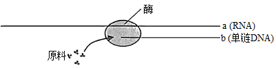
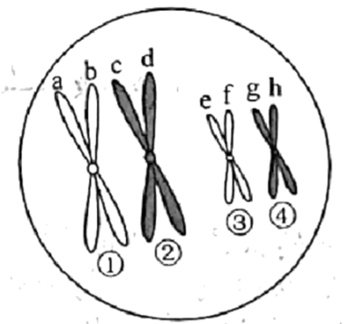
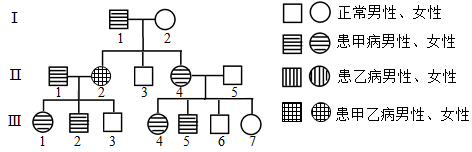

**生物试题**

**一、选择题（本大题共25小题，海小题列出的四个备选项中织有一个是符合题目要求的，不选、多选、错选均不得分）**

1\. 保护生物多样性是人类关注的问题。下列不属于生物多样性的是（ ）

A. 物种多样性 B. 遗传多样性 C. 行为多样性 D. 生态系统多样性

2\. 新采摘的柿子常常又硬又涩。若将柿子与成熟的苹果一起放入封闭的容器中，可使其快速变得软而甜。这主要是利用苹果产生的（ ）

A 乙烯 B. 生长素 C. 脱落酸 D. 细胞分裂素

3\. 猫叫综合征的病因是人类第五号染色体短臂上的部分片段丢失所致。这种变异属于（ ）

A. 倒位 B. 缺失 C. 重复 D. 易位

4\. 下列关于细胞衰老和凋亡的叙述，正确的是（　　）

A. 细胞凋亡是受基因调控的 B. 细胞凋亡仅发生于胚胎发育过程中

C. 人体各组织细胞的衰老总是同步的 D. 细胞的呼吸速率随细胞衰老而不断增大

5\. 生物体中的有机物具有重要作用。下列叙述正确的是（ ）

A. 油脂对植物细胞起保护作用 B. 鸟类的羽毛主要由角蛋白组成

C. 糖元是马铃薯重要的贮能物质 D. 纤维素是细胞膜的重要组成成分

6\. 许多因素能调节种群数量。下列属于内源性调节因素的是（ ）

A. 寄生 B. 领域行为 C. 食物 D. 天敌

7\. 动物细胞中某消化酶的合成、加工与分泌的部分过程如图所示。下列叙述正确的是（ ）

A. 光面内质网是合成该酶的场所 B. 核糖体能形成包裹该酶的小泡

C. 高尔基体具有分拣和转运该酶的作用 D. 该酶的分泌通过细胞的胞吞作用实现

8\. 用同位素示踪法检测小鼠杂交瘤细胞是否处于细胞周期的S期，放射性同位素最适合标记在（ ）

A. 胞嘧啶 B. 胸腺嘧啶 C. 腺嘌呤 D. 鸟嘌呤

9\. 番茄的紫茎对绿茎为完全显性。欲判断一株紫茎番茄是否为纯合子，下列方法不可行的是（ ）

A. 让该紫茎番茄自交 B. 与绿茎番茄杂交 C. 与纯合紫茎番茄杂交 D. 与杂合紫茎番茄杂交

10\. 下列关于研究淀粉酶的催化作用及特性实验的叙述，正确的是（ ）

A. 低温主要通过改变淀粉酶氨基酸组成，导致酶变性失活

B. 稀释100万倍的淀粉酶仍有催化能力，是因为酶的作用具高效性

C. 淀粉酶在一定pH范围内起作用，酶活性随pH升高而不断升高

D. 若在淀粉和淀粉酶混合液中加入蛋白酶，会加快淀粉的水解速率

11\. “观察洋葱表皮细胞的质壁分离及质壁分离复原”实验中，用显微镜观察到的结果如图所示。下列叙述正确的是（ ）

A. 由实验结果推知，甲图细胞是有活性的

B. 与甲图细胞相比，乙图细胞的细胞液浓度较低

C. 丙图细胞的体积将持续增大，最终胀破

D. 若选用根尖分生区细胞为材料，质壁分离现象更明显

12\. 下列关于细胞呼吸的叙述，错误的是（ ）

A. 人体剧烈运动会导致骨骼肌细胞产生较多的乳酸

B. 制作酸奶过程中乳酸菌可产生大量的丙酮酸和CO2

C. 梨果肉细胞厌氧呼吸释放的能量一部分用于合成ATP

D. 酵母菌的乙醇发酵过程中通入O2会影响乙醇的生成量

13\. 某同学欲制作DNA双螺旋结构模型，已准备了足够的相关材料下列叙述正确的是（ ）

A. 在制作脱氧核苷酸时，需在磷酸上连接脱氧核糖和碱基

B. 制作模型时，鸟嘌呤与胞嘧啶之间用2个氢键连接物相连

C. 制成的模型中，腺嘌呤与胞嘧啶之和等于鸟嘌呤和胸腺嘧啶之和

D. 制成的模型中，磷酸和脱氧核糖交替连接位于主链的内侧

14\. 雪纷飞的冬天，室外人员的体温仍能保持相对稳定其体温调节过程如图所示。下列叙述错误的是（ ）

A. 寒冷刺激下，骨骼肌不由自主地舒张以增加产热

B. 寒冷刺激下，皮肤血管反射性地收缩以减少散热

C. 寒冷环境中，甲状腺激素分泌增加以促进物质分解产热

D. 寒冷环境中，体温受神经与体液的共同调节

15\. 下列关于细胞核结构与功能的叙述，正确的是（ ）

A. 核被膜为单层膜，有利于核内环境的相对稳定

B. 核被膜上有核孔复合体，可调控核内外的物质交换

C. 核仁是核内的圆形结构，主要与mRNA的合成有关

D. 染色质由RNA和蛋白质组成，是遗传物质的主要载体

16\. “中心法则”反映了遗传信息的传递方向，其中某过程的示意图如下。下列叙述正确的是（ ）

A. 催化该过程的酶为RNA聚合酶 B. a链上任意3个碱基组成一个密码子

C. b链的脱氧核苷酸之间通过磷酸二酯键相连 D. 该过程中遗传信息从DNA向RNA传递

17\. 由欧洲传入北美的耧斗菜已进化出数十个物种。分布于低海拔潮湿地区的甲物种和高海拔干燥地区的乙物种的花结构和开花期均有显著差异。下列叙述错误的是（ ）

A. 甲、乙两种耧斗菜的全部基因构成了一个基因库

B. 生长环境的不同有利于耧斗菜进化出不同的物种

C. 甲、乙两种耧斗菜花结构的显著差异是自然选择的结果

D. 若将甲、乙两种耧斗菜种植在一起，也不易发生基因交流

18\. 下列关于生态工程的叙述，正确的是（ ）

A. 生物防治技术的理论基础是种群内个体的竞争 B. 套种、间种和轮种体现了物质的良性循环技术

C. 风能和潮汐能的开发技术不属于生态工程范畴 D. “过腹还田”可使农作物秸秆得到多途径的利用

19\. 免疫接种是预防传染病的重要措施。某种传染病疫苗的接种需在一定时期内间隔注射多次。下列叙述正确的是（ ）

A. 促进机体积累更多数量的疫苗，属于被动免疫

B. 促进机体产生更多种类的淋巴细胞，属于被动免疫

C. 促进致敏B细胞克隆分化出更多数量的记忆细胞，属于主动免疫

D. 促进浆细胞分泌出更多抗体以识别并结合抗原-MHC复合体，属于主动免疫

20\. 生态系统的营养结构是物质循环和能量流动的主要途径。下列叙述错误的是（ ）

A. 调查生物群落内各物种之间的取食与被取食关系，可构建食物链

B. 整合调查所得的全部食物链，可构建营养关系更为复杂的食物网

C. 归类各食物链中处于相同环节的所有物种，可构建相应的营养级

D. 测算主要食物链各环节的能量值，可构建生态系统的能量金字塔

21\. 某哺乳动物卵原细胞形成卵细胞的过程中，某时期的细胞如图所示，其中①~④表示染色体，a~h表示染色单体。下列叙述正确的是（ ）

A. 图示细胞为次级卵母细胞，所处时期为前期Ⅱ

B. ①与②的分离发生在后期Ⅰ，③与④的分离发生在后期Ⅱ

C. 该细胞的染色体数与核DNA分子数均为卵细胞的2倍

D. a和e同时进入一个卵细胞的概率为1/16

22\. 下列关于“噬菌体侵染细菌的实验”的叙述，正确的是（ ）

A. 需用同时含有32P和35S的噬菌体侵染大肠杆菌 B. 搅拌是为了使大肠杆菌内的噬菌体释放出来

C. 离心是为了沉淀培养液中的大肠杆菌 D. 该实验证明了大肠杆菌的遗传物质是DNA

23\. 下列关于菊花组织培养的叙述，正确的是（ ）

A. 用自然生长的茎进行组培须用适宜浓度的乙醇和次氯酸钠的混合液消毒

B. 培养瓶用专用封口膜封口可防止外界杂菌侵入并阻止瓶内外的气体交换

C. 组培苗锻炼时采用蛭石作为栽培基质的原因是蛭石带菌量低且营养半富

D. 不带叶片的菊花劲茎切段可以通过器官发生的徐径形成完整的菊花植株

24\. 听到上课铃声，同学们立刻走进教室，这一行为与神经调节有关。该过程中，其中一个神经元的结构及其在某时刻的电位如图所示。下列关于该过程的叙述，错误的是（ ）

A. 此刻①处Na+内流，②处K+外流，且两者均不需要消耗能量

B. ①处产生的动作电位沿神经纤维传播时，波幅一直稳定不变

C. ②处产生的神经冲动，只能沿着神经纤维向右侧传播出去

D. 若将电表的两个电极分别置于③④处，指针会发生偏转

25\. 下图为甲乙两种单基因遗传病的遗传家系图，甲病由等位基因A/a控制，乙病由等位基因本B/b控制，其中一种病为伴性遗传，Ⅱ5不携带致病基因。甲病在人群中的发病率为1/625。不考虑基因突变和染色体畸变。下列叙述正确的是（ ）

A. 人群中乙病患者男性多于女性

B. Ⅰ1的体细胞中基因A最多时为4个

C. Ⅲ6带有来自Ⅰ2的甲病致病基因的概率为1/6

D. 若Ⅲ1与正常男性婚配，理论上生育一个只患甲病女孩概率为1/208

**二、非选择题（本大题共5小题）**

26\. 科研小组在一个森林生态系统中开展了研究工作。回答下列问题：

（1）对某种鼠进行标志重捕，其主要目是研究该鼠的\_\_\_\_\_\_\_\_\_\_\_。同时对适量的捕获个体进行年龄鉴定，可绘制该种群的\_\_\_\_\_\_\_\_\_\_\_图形。

（2）在不同季节调查森林群落的\_\_\_\_\_\_\_\_\_\_\_与季相的变化状况，可以研究该群落的\_\_\_\_\_\_\_\_\_\_\_结构。

（3）在不考虑死亡和异养生物利用的情况下，采取适宜的方法测算所有植物的干重（g/m2），此项数值称为生产者的\_\_\_\_\_\_\_\_\_\_\_。观测此项数值在每隔一段时间的重复测算中是否相对稳定，可作为判断该森林群落是否演替到\_\_\_\_\_\_\_\_\_\_\_阶段的依据之一。利用前后两次的此项数值以及同期测算的植物呼吸消耗量，许算出该时期的\_\_\_\_\_\_\_\_\_\_\_。

27\. 通过研究遮阴对花生光合作用的影响，为花生的合理间种提供依据。研究人员从开花至果实成熟，每天定时对花生植株进行遮阴处理。实验结果如表所示。

<table>
<colgroup>
<col style="width: 6%" />
<col style="width: 12%" />
<col style="width: 10%" />
<col style="width: 23%" />
<col style="width: 16%" />
<col style="width: 10%" />
<col style="width: 10%" />
<col style="width: 10%" />
</colgroup>
<thead>
<tr>
<th rowspan="2" style="text-align: left;">处理</th>
<th colspan="7" style="text-align: center;">指标</th>
</tr>
<tr>
<th style="text-align: left;">光饱和点（klx）</th>
<th style="text-align: left;">光补偿点（lx）</th>
<th style="text-align: left;">低于5klx光合曲线的斜率（mgCO2．dm-2．hr-1．klx-1）</th>
<th style="text-align: left;">叶绿素含量（mg·dm-2）</th>
<th style="text-align: left;">单株光合产量（g干重）</th>
<th style="text-align: left;">单株叶光合产量（g干重）</th>
<th style="text-align: left;">单株果实光合产量（g干重）</th>
</tr>
</thead>
<tbody>
<tr>
<td style="text-align: left;">不遮阴</td>
<td style="text-align: left;">40</td>
<td style="text-align: left;">550</td>
<td style="text-align: left;">1.22</td>
<td style="text-align: left;">2.09</td>
<td style="text-align: left;">1892</td>
<td style="text-align: left;">3.25</td>
<td style="text-align: left;">8.25</td>
</tr>
<tr>
<td style="text-align: left;">遮阴2小时</td>
<td style="text-align: left;">35</td>
<td style="text-align: left;">515</td>
<td style="text-align: left;">1.23</td>
<td style="text-align: left;">2.66</td>
<td style="text-align: left;">18.84</td>
<td style="text-align: left;">3.05</td>
<td style="text-align: left;">8.21</td>
</tr>
<tr>
<td style="text-align: left;">遮阴4小时</td>
<td style="text-align: left;">30</td>
<td style="text-align: left;">500</td>
<td style="text-align: left;">1.46</td>
<td style="text-align: left;">3.03</td>
<td style="text-align: left;">16.64</td>
<td style="text-align: left;">3.05</td>
<td style="text-align: left;">6.13</td>
</tr>
</tbody>
</table>

注：光补偿点指当光合速率等于呼吸速率时的光强度。光合曲线指光强度与光合速率关系的曲线。

回答下列问题：

（1）从实验结果可知，花生可适应弱光环境，原因是在遮阴条件下，植株通过增加\_\_\_\_\_\_\_\_\_\_\_，提高吸收光的能力；结合光饱和点的变化趋势，说明植株在较低光强度下也能达到最大的\_\_\_\_\_\_\_\_\_\_\_；结合光补偿点的变化趋势，说明植株通过降低\_\_\_\_\_\_\_\_\_\_\_，使其在较低的光强度下就开始了有机物的积累。根据表中\_\_\_\_\_\_\_\_\_\_\_的指标可以判断，实验范围内，遮阴时间越长，植株利用弱光的效率越高。

（2）植物的光合产物主要以\_\_\_\_\_\_\_\_\_\_\_形式提供给各器官。根据相关指标的分析，表明较长遮阴处理下，植株优先将光合产物分配至\_\_\_\_\_\_\_\_\_\_\_中。

（3）与不遮阴相比，两种遮阴处理的光合产量均\_\_\_\_\_\_\_\_\_\_\_。根据实验结果推测，在花生与其他高秆作物进行间种时，高秆作物一天内对花生的遮阴时间为\_\_\_\_\_\_\_\_\_\_\_（A.\<2小时 B．2小时 C．4小时 D．\>4小时），才能获得较高的花生产量。

28\. 某种昆虫野生型为黑体圆翅，现有3个纯合突变品系，分别为黑体锯翅、灰体圆翅和黄体圆翅。其中体色由复等位基因A1/A2/A3控制，翅形由等位基因B/b控制。为研究突变及其遗传机理，用纯合突变品系和野生型进行了基因测序与杂交实验。回答下列问题：

（1）基因测序结果表明，3个突变品系与野生型相比，均只有1个基因位点发生了突变，并且与野生型对应的基因相比，基因长度相等。因此，其基因突变最可能是由基因中碱基对发生\_\_\_\_\_\_\_\_\_\_\_导致。

（2）研究体色遗传机制的杂交实验，结果如表所示：

<table style="width:84%;">
<colgroup>
<col style="width: 13%" />
<col style="width: 8%" />
<col style="width: 8%" />
<col style="width: 8%" />
<col style="width: 8%" />
<col style="width: 19%" />
<col style="width: 19%" />
</colgroup>
<thead>
<tr>
<th rowspan="2" style="text-align: left;">杂交组合</th>
<th colspan="2" style="text-align: center;">P</th>
<th colspan="2" style="text-align: center;">F1</th>
<th colspan="2" style="text-align: center;">F2</th>
</tr>
<tr>
<th style="text-align: left;">♀</th>
<th style="text-align: left;">♂</th>
<th style="text-align: left;">♀</th>
<th style="text-align: left;">♂</th>
<th style="text-align: left;">♀</th>
<th style="text-align: left;">♂</th>
</tr>
</thead>
<tbody>
<tr>
<td style="text-align: left;">Ⅰ</td>
<td style="text-align: left;">黑体</td>
<td style="text-align: left;">黄体</td>
<td style="text-align: left;">黄体</td>
<td style="text-align: left;">黄体</td>
<td style="text-align: left;">3黄体：1黑体</td>
<td style="text-align: left;">3黄体：1黑体</td>
</tr>
<tr>
<td style="text-align: left;">Ⅱ</td>
<td style="text-align: left;">灰体</td>
<td style="text-align: left;">黑体</td>
<td style="text-align: left;">灰体</td>
<td style="text-align: left;">灰体</td>
<td style="text-align: left;">3灰体：1黑体</td>
<td style="text-align: left;">3灰体：1黑体</td>
</tr>
<tr>
<td style="text-align: left;">Ⅲ</td>
<td style="text-align: left;">灰体</td>
<td style="text-align: left;">黄体</td>
<td style="text-align: left;">灰体</td>
<td style="text-align: left;">灰体</td>
<td style="text-align: left;">3灰体：1黄体</td>
<td style="text-align: left;">3灰体：1黄体</td>
</tr>
</tbody>
</table>

注：表中亲代所有个体均为圆翅纯合子。

根据实验结果推测，控制体色的基因A1（黑体）、A2（灰体）和A3（黄体）的显隐性关系为\_\_\_\_\_\_\_\_\_\_\_（显性对隐性用“\>”表示），体色基因的遗传遵循\_\_\_\_\_\_\_\_\_\_\_定律。

（3）研究体色与翅形遗传关系的杂交实验，结果如表所示：

<table>
<colgroup>
<col style="width: 8%" />
<col style="width: 8%" />
<col style="width: 8%" />
<col style="width: 8%" />
<col style="width: 8%" />
<col style="width: 28%" />
<col style="width: 28%" />
</colgroup>
<thead>
<tr>
<th rowspan="2" style="text-align: left;">杂交组合</th>
<th colspan="2" style="text-align: center;">P</th>
<th colspan="2" style="text-align: center;">F1</th>
<th colspan="2" style="text-align: center;">F2</th>
</tr>
<tr>
<th style="text-align: left;">♀</th>
<th style="text-align: left;">♂</th>
<th style="text-align: left;">♀</th>
<th style="text-align: left;">♂</th>
<th style="text-align: left;">♀</th>
<th style="text-align: left;">♂</th>
</tr>
</thead>
<tbody>
<tr>
<td style="text-align: left;">Ⅳ</td>
<td style="text-align: left;">灰体圆翅</td>
<td style="text-align: left;">黑体锯翅</td>
<td style="text-align: left;">灰体圆翅</td>
<td style="text-align: left;">灰体圆翅</td>
<td style="text-align: left;">6灰体圆翅：2黑体圆翅</td>
<td style="text-align: left;">3灰体圆翅：1黑体圆翅：3灰体锯翅：1黑体锯翅</td>
</tr>
<tr>
<td style="text-align: left;">Ⅴ</td>
<td style="text-align: left;">黑体锯翅</td>
<td style="text-align: left;">灰体圆翅</td>
<td style="text-align: left;">灰体圆翅</td>
<td style="text-align: left;">黑体锯翅</td>
<td style="text-align: left;">3灰体圆翅：1黑体圆翅：3灰体锯翅：1黑体锯翅</td>
<td style="text-align: left;">3灰体圆翅：1黑体圆翅：3灰体锯翅：1黑体锯翅</td>
</tr>
</tbody>
</table>

根据实验结果推测，锯翅性状的遗传方式是\_\_\_\_\_\_\_\_\_\_\_，判断的依据是\_\_\_\_\_\_\_\_\_\_\_。

（4）若选择杂交Ⅲ的F2中所有灰体圆翅雄虫和杂交Ⅴ的F2中所有灰体圆翅雌虫随机交配，理论上子代表现型有\_\_\_\_\_\_\_\_\_\_\_种，其中所占比例为2/9的表现型有哪几种？\_\_\_\_\_\_\_\_\_\_\_。

（5）用遗传图解表示黑体锯翅雌虫与杂交Ⅲ的F1中灰体圆翅雄虫的杂交过程。

29\. 回答下列（一）、（二）小题：

（一）回答与产淀粉酶的枯草杆菌育种有关的问题：

（1）为快速分离产淀粉酶的枯草杆菌，可将土样用\_\_\_\_\_\_\_\_\_\_\_制成悬液，再将含有悬液的三角瓶置于80℃的\_\_\_\_\_\_\_\_\_\_\_中保温一段时间，其目的是\_\_\_\_\_\_\_\_\_\_\_。

（2）为提高筛选效率，可将菌种的\_\_\_\_\_\_\_\_\_\_\_过程与菌种的产酶性能测定一起进行：将上述悬液稀释后涂布于淀粉为唯一碳源的固体培养基上培养，采用\_\_\_\_\_\_\_\_\_\_\_显色方法，根据透明圈与菌落直径比值的大小，可粗略估计出菌株是否产酶及产酶性能。

（3）为了获得高产淀粉酶的枯草杆菌，可利用现有菌种，通过\_\_\_\_\_\_\_\_\_\_\_后再筛选获得，或利用转基因、\_\_\_\_\_\_\_\_\_\_\_等技术获得。

（二）回答与植物转基因和植物克隆有关的问题：

（4）在用农杆菌侵染的方法进行植物转基因过程中，通常要使用抗生素，其目的一是抑制\_\_\_\_\_\_\_\_\_\_\_生长，二是筛选转化细胞。当选择培养基中抗生素浓度\_\_\_\_\_\_\_\_\_\_\_时，通常会出现较多假阳性植株，因此在转基因前需要对受体进行抗生素的\_\_\_\_\_\_\_\_\_\_\_检测。

（5）为提高培育转基因植株的成功率，植物转基因受体需具有较强的\_\_\_\_\_\_\_\_\_\_\_能力和遗传稳定性。对培养的受体细胞遗传稳定性的早期检测，可通过观察细胞内\_\_\_\_\_\_\_\_\_\_\_形态是否改变进行判断，也可通过观察分裂期染色体的\_\_\_\_\_\_\_\_\_\_\_，分析染色体组型是否改变进行判断。

（6）植物转基因受体全能性表达程度的高低主要与受体的基因型、培养环境、继代次数和\_\_\_\_\_\_\_\_\_\_\_长短等有关。同时也与受体的取材有关，其中受体为\_\_\_\_\_\_\_\_\_\_\_时全能性表达能力最高。

30\. 为研究物质X对高血糖症状的缓解作用，根据提供的实验材料，完善实验思路，预测实验结果，并进行分析与讨论。

实验材料：适龄、血糖正常的健康雄性小鼠若干只，药物S（用生理盐水配制），物质X（用生理盐水配制），生理盐水等。（要求与说明：实验中涉及的剂量不作具体要求。小鼠血糖值\>11.1mmo/L，定为高血糖模型小鼠。饲养条件适宜）

回答下列问题：

（1）完善实验思路：

①适应性饲养：选取小鼠若干只，随机均分成甲、乙、丙3组。正常饲养数天，每天测量小鼠的血糖，计算平均值。

②药物S处理：

甲组：每天每只小鼠腹腔注射一定量生理盐水

乙组：每天每只小鼠腹腔注射一定量药物S

丙组：\_\_\_\_\_\_\_\_\_\_\_

连续处理数天，每天测量小鼠的血糖，计算平均值，直至建成高血糖模型小鼠。

③物质X处理：

甲组：\_\_\_\_\_\_\_\_\_\_\_

乙组：每天每只小鼠灌胃一定量生理盐水

丙组：\_\_\_\_\_\_\_\_\_\_\_

连续处理若干天，每天测量小鼠的血糖，计算平均值。

（2）预测实验结果：

设计一张表格，并将实验各阶段的预期实验结果填入表中。

（3）分析与讨论：

已知药物S的给药途径有腹腔注射和灌胃等，药物S的浓度和给药途径都会影响高血糖模型小鼠的建模。若要研究使用药物S快速建成高血糖模型小鼠，则可通过\_\_\_\_\_\_\_\_\_\_\_，以确定快速建模所需药物S的适宜浓度和给药途径的组合
