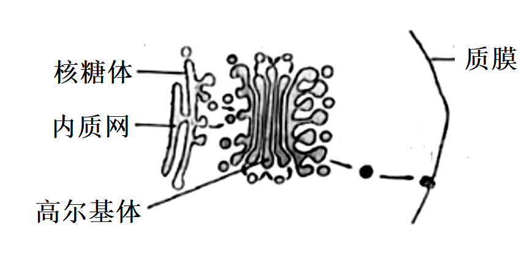
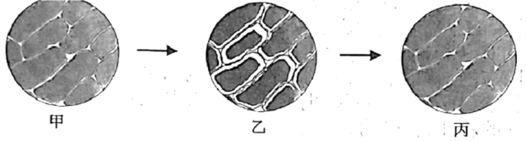
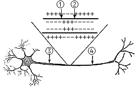
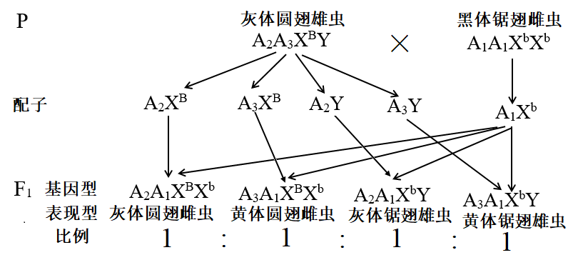

**生物试题**

**一、选择题（本大题共25小题，海小题列出的四个备选项中织有一个是符合题目要求的，不选、多选、错选均不得分）**

1\. 保护生物多样性是人类关注的问题。下列不属于生物多样性的是（ ）

A. 物种多样性 B. 遗传多样性 C. 行为多样性 D. 生态系统多样性

【答案】C

【解析】

【分析】生物多样性包括3个层次:遗传多样性（所有生物拥有的全部基因)、物种多样性（指生物圈内所有的动物、植物、微生物)、生态系统多样性。

【详解】生物多样性的内容有：遗传多样性、物种多样性和生态系统多样性，ABD正确，C错误。

故选C。

2\. 新采摘的柿子常常又硬又涩。若将柿子与成熟的苹果一起放入封闭的容器中，可使其快速变得软而甜。这主要是利用苹果产生的（ ）

A. 乙烯 B. 生长素 C. 脱落酸 D. 细胞分裂素

【答案】A

【解析】

【分析】植物激素的是指由植物体内产生，能从产生部位运输到作用部位，对植物的生长发育有显著影响的微量有机物。细胞分裂素促进细胞分裂。脱落酸抑制细胞分裂，促进衰老脱落。乙烯促进果实成熟。各种植物激素并不是孤立地起作用，而是多种激素相互作用共同调节。

【详解】A、乙烯起催熟作用，成熟的苹果产生乙烯，使柿子“变得软而甜”， A正确；

B、生长素类具有促进植物生长的作用，不能催熟，B错误；

C、脱落酸有抑制细胞的分裂和种子的萌发，还有促进叶和果实的衰老和脱落，促进休眠和提高抗逆能力等作用，不能催熟，C错误；

D、细胞分裂素的作用是促进细胞分裂，不能催熟，D错误。

故选A。

3\. 猫叫综合征的病因是人类第五号染色体短臂上的部分片段丢失所致。这种变异属于（ ）

A. 倒位 B. 缺失 C. 重复 D. 易位

【答案】B

【解析】

【分析】染色体变异是指染色体结构和数目的改变。染色体结构的变异主要有缺失、重复、倒位、易位四种类型。染色体数目变异可以分为两类:一类是细胞内个别染色体的增加或减少，另一类是细胞内染色体数目以染色体组的形式成倍地增加或减少。

【详解】由题干描述可知，猫叫综合征是因为染色体缺失了部分片段导致，属于染色体结构变异中的缺失，B正确。

故选B。

4\. 下列关于细胞衰老和凋亡的叙述，正确的是（　　）

A. 细胞凋亡是受基因调控的 B. 细胞凋亡仅发生于胚胎发育过程中

C. 人体各组织细胞的衰老总是同步的 D. 细胞的呼吸速率随细胞衰老而不断增大

【答案】A

【解析】

【分析】1、衰老细胞的特征：（1）细胞内水分减少，细胞萎缩，体积变小，但细胞核体积增大，染色质固缩，染色加深；（2）细胞膜通透性功能改变，物质运输功能降低；（3）细胞色素随着细胞衰老逐渐累积；（4）有些酶的活性降低；（5）呼吸速度减慢，新陈代谢减慢。\
2、细胞凋亡是由基因决定的细胞编程性死亡的过程。细胞凋亡是生物体正常的生命历程，对生物体是有利的，而且细胞凋亡贯穿于整个生命历程。细胞凋亡是生物体正常发育的基础、能维持组织细胞数目的相对稳定、是机体的一种自我保护机制。在成熟的生物体内，细胞的自然更新、被病原体感染的细胞的清除，是通过细胞凋亡完成的。

【详解】A、细胞凋亡是由基因决定的细胞编程性死亡的过程，A正确；

B、细胞凋亡贯穿于整个生命历程，B错误；

C、人体生长发育的不同时期均有细胞的衰老，C错误；

D、细胞衰老时呼吸速度减慢，新陈代谢减慢，D错误。

故选A。

5\. 生物体中的有机物具有重要作用。下列叙述正确的是（ ）

A. 油脂对植物细胞起保护作用 B. 鸟类的羽毛主要由角蛋白组成

C. 糖元是马铃薯重要的贮能物质 D. 纤维素是细胞膜的重要组成成分

【答案】B

【解析】

【分析】组成细胞的糖类和脂质：

<table style="width:81%;">
<colgroup>
<col style="width: 8%" />
<col style="width: 18%" />
<col style="width: 18%" />
<col style="width: 35%" />
</colgroup>
<thead>
<tr>
<th style="text-align: left;">化合物</th>
<th style="text-align: left;">分 类</th>
<th style="text-align: left;">元素组成</th>
<th style="text-align: left;">主要生理功能</th>
</tr>
</thead>
<tbody>
<tr>
<td style="text-align: left;">糖类</td>
<td style="text-align: left;">单糖 
二糖 
多糖</td>
<td style="text-align: left;">C、H、O</td>
<td style="text-align: left;">①供能（淀粉、糖原、葡萄糖等） 
②组成核酸（核糖、脱氧核糖） 
③细胞识别（糖蛋白） 
④组成细胞壁（纤维素）</td>
</tr>
<tr>
<td style="text-align: left;">脂质</td>
<td style="text-align: left;">脂肪 
磷脂（类脂） 
固醇</td>
<td style="text-align: left;">C、H、O 
C、H、O、N、P 
C、H、O</td>
<td style="text-align: left;">①供能（贮备能源） 
②组成生物膜 
③调节生殖和代谢（性激素、VD） 
④保护和保温</td>
</tr>
</tbody>
</table>

【详解】A、油脂是植物细胞良好的储能物质，植物蜡对植物细胞起保护作用，A错误；B、鸟类的羽毛主要成分是蛋白质，主要由角蛋白组成，B正确；

C、糖元是动物细胞特有的多糖，淀粉是马铃薯重要的贮能物质，C错误；

D、纤维素是构成植物细胞壁的主要成分，细胞膜的组成成分主要是磷脂和蛋白质，D错误。

故选B。

6\. 许多因素能调节种群数量。下列属于内源性调节因素的是（ ）

A. 寄生 B. 领域行为 C. 食物 D. 天敌

【答案】B

【解析】

【分析】能够调节种群数量的因素有外源性因素和内源性因素，外源性调节包括气候、食物、疾病、寄生和捕食等，内源性调节因素有行为调节和内分泌调节。

【详解】ACD、外源性调节包括气候、食物、疾病、寄生和捕食（天地）等，ACD错误；

B、内源性调节因素有行为调节和内分泌调节，领域行为属于内源性调节因素，B正确。

故选B。

7\. 动物细胞中某消化酶的合成、加工与分泌的部分过程如图所示。下列叙述正确的是（ ）

A. 光面内质网是合成该酶的场所 B. 核糖体能形成包裹该酶的小泡

C. 高尔基体具有分拣和转运该酶的作用 D. 该酶的分泌通过细胞的胞吞作用实现

【答案】C

【解析】

【分析】各种细胞器的结构、功能

<table style="width:100%;">
<colgroup>
<col style="width: 6%" />
<col style="width: 12%" />
<col style="width: 32%" />
<col style="width: 47%" />
</colgroup>
<thead>
<tr>
<th style="text-align: left;">细胞器</th>
<th style="text-align: left;">分布</th>
<th style="text-align: left;">形态结构</th>
<th style="text-align: left;">功   能</th>
</tr>
</thead>
<tbody>
<tr>
<td style="text-align: left;">线粒体</td>
<td style="text-align: left;">动植物细胞</td>
<td style="text-align: left;">双层膜结构</td>
<td style="text-align: left;">有氧呼吸的主要场所； 
细胞的“动力车间”</td>
</tr>
<tr>
<td style="text-align: left;">叶绿体</td>
<td style="text-align: left;">植物叶肉细胞</td>
<td style="text-align: left;"> 双层膜结构</td>
<td style="text-align: left;">植物细胞进行光合作用的场所；植物细胞的“养料制造车间”和“能量转换站”</td>
</tr>
<tr>
<td style="text-align: left;">内质网</td>
<td style="text-align: left;">动植物细胞</td>
<td style="text-align: left;"> 单层膜形成的网状结构</td>
<td style="text-align: left;">细胞内蛋白质的合成和加工，以及脂质合成的“车间”</td>
</tr>
<tr>
<td style="text-align: left;">高尔 
基体</td>
<td style="text-align: left;">动植物细胞</td>
<td style="text-align: left;"> 单层膜构成的囊状结构</td>
<td style="text-align: left;">对来自内质网的蛋白质进行加工、分类和包装的“车间”及“发送站”（动物细胞高尔基体与分泌有关；植物则参与细胞壁形成）</td>
</tr>
<tr>
<td style="text-align: left;">核糖体</td>
<td style="text-align: left;">动植物细胞</td>
<td style="text-align: left;">无膜结构，有的附着在内质网上，有的游离在细胞质中</td>
<td style="text-align: left;">合成蛋白质的场所； 
“生产蛋白质的机器”</td>
</tr>
<tr>
<td style="text-align: left;">溶酶体</td>
<td style="text-align: left;">主要分布在动物细胞中</td>
<td style="text-align: left;"> 单层膜形成的泡状结构</td>
<td style="text-align: left;">“消化车间”；内含多种水解酶，能分解衰老、损伤的细胞器，吞噬并且杀死侵入细胞的病毒和细菌</td>
</tr>
<tr>
<td style="text-align: left;">液泡</td>
<td style="text-align: left;">成熟植物细胞</td>
<td style="text-align: left;">单层膜形成的泡状结构；内含细胞液（有机酸、糖类、无机盐、色素和蛋白质等）</td>
<td style="text-align: left;">调节植物细胞内的环境，充盈的液泡使植物细胞保持坚挺</td>
</tr>
<tr>
<td style="text-align: left;">中心体</td>
<td style="text-align: left;">动物或某些低等植物细胞</td>
<td style="text-align: left;">无膜结构；由两个互相垂直的中心粒及其周围物质组成</td>
<td style="text-align: left;">与细胞的有丝分裂有关</td>
</tr>
</tbody>
</table>

【详解】A、光面内质网是脂质合成的场所，消化酶是分泌蛋白，合成场所是粗面内质网（附着在粗面内质网上的核糖体），A错误；B、核糖体无膜结构，不能形成小泡包裹该酶，B错误；

C、高尔基体能对蛋白质进行加工、分类、包装、发送，具有分拣和转运消化酶等分泌蛋白的作用，C正确；

D、该酶的分泌通过细胞的胞吐作用实现，D错误。

故选C。

8\. 用同位素示踪法检测小鼠杂交瘤细胞是否处于细胞周期的S期，放射性同位素最适合标记在（ ）

A. 胞嘧啶 B. 胸腺嘧啶 C. 腺嘌呤 D. 鸟嘌呤

【答案】B

【解析】

【分析】细胞周期是指连续分裂的细胞从一次分裂完成开始到下一次分裂完成时为止，称为一个细胞周期。细胞周期包括分裂间期和分裂期，分裂间期包括三个时期：

1.G1期：DNA合前期，主要合成RNA和蛋白质。

2.S期：DNA复制期，主要是遗传物质的复制，该过程需要4种游离的脱氧核苷酸作为原料。

3.G2期：DNA合成后期，有丝分裂的准备期，主要是RNA和蛋白质（包括微管蛋白等）的大量合成。

4.M期：细胞分裂期。

【详解】细胞周期的分裂间期中S期是DNA复制期，主要是遗传物质的复制，该过程需要4种游离的脱氧核苷酸作为原料，与RNA相比，DNA特有的碱基是胸腺嘧啶，故用放射性同位素标记的胸腺嘧啶最适合检测小鼠杂交瘤细胞是否处于细胞周期的S期，B正确。

故选B。

9\. 番茄的紫茎对绿茎为完全显性。欲判断一株紫茎番茄是否为纯合子，下列方法不可行的是（ ）

A. 让该紫茎番茄自交 B. 与绿茎番茄杂交 C. 与纯合紫茎番茄杂交 D. 与杂合紫茎番茄杂交

【答案】C

【解析】

【分析】常用的鉴别方法：（1）鉴别一只动物是否为纯合子，可用测交法；（2）鉴别一棵植物是否为纯合子，可用测交法和自交法，其中自交法最简便；（3）鉴别一对相对性状的显性和隐性，可用杂交法和自交法（只能用于植物）；（4）提高优良品种的纯度，常用自交法；（5）检验杂种F1的基因型采用测交法。设相关基因型为A、a，据此分析作答。

【详解】A、 紫茎为显性，令其自交，若为纯合子，则子代全为紫茎，若为杂合子，子代发生性状分离，会出现绿茎， A不符合题意；

B、 可通过与绿茎纯合子（aa）杂交来鉴定，如果后代都是紫茎，则是纯合子；如果后代有紫茎也有绿茎，则是杂合子，B不符合题意；

C、 与紫茎纯合子（AA）杂交后代都是紫茎，故不能通过与紫茎纯合子杂交，C符合题意；

D、 能通过与紫茎杂合子杂交（Aa）来鉴定，如果后代都是紫茎，则是纯合子；如果后代有紫茎也有绿茎，则是杂合子，D不符合题意。

故选C。

10\. 下列关于研究淀粉酶的催化作用及特性实验的叙述，正确的是（ ）

A. 低温主要通过改变淀粉酶的氨基酸组成，导致酶变性失活

B. 稀释100万倍的淀粉酶仍有催化能力，是因为酶的作用具高效性

C. 淀粉酶在一定pH范围内起作用，酶活性随pH升高而不断升高

D. 若在淀粉和淀粉酶混合液中加入蛋白酶，会加快淀粉的水解速率

【答案】B

【解析】

【分析】大部分酶是蛋白质，少部分酶的本质是RNA，蛋白质的基本单位是氨基酸，RNA的基本单位是核糖核苷酸。

【详解】A、 低温可以抑制酶的活性，不会改变淀粉酶的氨基酸组成，也不会导致酶变性失活，A错误；

B、 酶具有高效性，故稀释100万倍的淀粉酶仍有催化能力，B正确；

C、 酶活性的发挥需要适宜条件，在一定pH范围内，随着温度升高，酶活性升高，超过最适pH后，随pH增加，酶活性降低甚至失活，C错误；

D、 淀粉酶的本质是蛋白质，若在淀粉和淀粉酶混合液中加入蛋白酶，会将淀粉酶水解，则淀粉的水解速率会变慢，D错误。

故选B。

11\. “观察洋葱表皮细胞的质壁分离及质壁分离复原”实验中，用显微镜观察到的结果如图所示。下列叙述正确的是（ ）

A. 由实验结果推知，甲图细胞是有活性的

B. 与甲图细胞相比，乙图细胞的细胞液浓度较低

C. 丙图细胞的体积将持续增大，最终胀破

D. 若选用根尖分生区细胞为材料，质壁分离现象更明显

【答案】A

【解析】

【分析】分析题图：甲到乙的过程中，细胞发生质壁分离，乙到丙的过程细胞发生质壁分离的复原，据此分析解答。

【详解】A、 能发生质壁分离细胞应为活的植物细胞，据图分析，从甲到乙发生了质壁分离现象，说明甲细胞是活细胞，A正确；

B、 乙图所示细胞发生质壁分离，该过程中细胞失水，故与甲图相比，乙图细胞的细胞液浓度较高，B错误；

C、 由于有细胞壁的限制，丙图细胞体积不会持续增大，且不会涨破，C错误；

D、 根尖分生区细胞无中央大液泡，不能发生质壁分离现象，D错误。

故选A。

12\. 下列关于细胞呼吸的叙述，错误的是（ ）

A. 人体剧烈运动会导致骨骼肌细胞产生较多的乳酸

B. 制作酸奶过程中乳酸菌可产生大量的丙酮酸和CO2

C. 梨果肉细胞厌氧呼吸释放的能量一部分用于合成ATP

D. 酵母菌的乙醇发酵过程中通入O2会影响乙醇的生成量

【答案】B

【解析】

【分析】1、 需氧呼吸过程分为三个阶段，第一阶段是葡萄糖分解形成丙酮酸和\[H\]，发生在细胞质基质中；需氧呼吸的第二阶段是丙酮酸和水反应产生二氧化碳和\[H\]，发生在线粒体基质中；需氧呼吸的第三阶段是\[H\]与氧气反应形成水，发生在线粒体内膜上。

2、厌氧呼吸的第一阶段与需氧呼吸的第一阶段相同，都是葡萄糖分解形成丙酮酸和\[H\]，发生在细胞质基质中；第二阶段是丙酮酸和\[H\]反应产生二氧化碳和酒精或者是乳酸，发生在细胞质基质中。

【详解】A、 剧烈运动时人体可以进行厌氧呼吸，厌氧呼吸的产物是乳酸，故人体剧烈运动时会导致骨骼肌细胞产生较多的乳酸，A正确；

B、 制作酸奶利用的是乳酸菌厌氧发酵的原理，乳酸菌厌氧呼吸的产物是乳酸，无二氧化碳产生，B错误；

C、 梨果肉细胞厌氧呼吸第一阶段能产生少量能量，该部分能量大部分以热能的形式散失了，少部分可用于合成ATP，C正确；

D、 酵母菌乙醇发酵是利用酵母菌在无氧条件产生乙醇的原理，故发酵过程中通入氧气会导致其厌氧呼吸受抑制而影响乙醇的生成量，D正确。

故选B。

13\. 某同学欲制作DNA双螺旋结构模型，已准备了足够的相关材料下列叙述正确的是（ ）

A. 在制作脱氧核苷酸时，需在磷酸上连接脱氧核糖和碱基

B. 制作模型时，鸟嘌呤与胞嘧啶之间用2个氢键连接物相连

C. 制成的模型中，腺嘌呤与胞嘧啶之和等于鸟嘌呤和胸腺嘧啶之和

D. 制成的模型中，磷酸和脱氧核糖交替连接位于主链的内侧

【答案】C

【解析】

【分析】DNA的双螺旋结构：①DNA分子是由两条反向平行的脱氧核苷酸长链盘旋而成的；②DNA分子中的脱氧核糖和磷酸交替连接，排列在外侧，构成基本骨架，碱基在内侧；③两条链上的碱基通过氢键连接起来，形成碱基对且遵循碱基互补配对原则。

【详解】A、在制作脱氧核苷酸时，需在脱氧核糖上连接磷酸和碱基，A错误；

B、鸟嘌呤和胞嘧啶之间由3个氢键连接，B错误；

C、DNA的两条链之间遵循碱基互补配对原则，即A=T、C=G，故在制作的模型中A+C=G+T，C正确；

D、DNA分子中脱氧核糖和磷酸交替连接，排列在外侧，构成基本骨架，碱基在内侧，D错误。

故选C。

14\. 雪纷飞的冬天，室外人员的体温仍能保持相对稳定其体温调节过程如图所示。下列叙述错误的是（ ）

A. 寒冷刺激下，骨骼肌不由自主地舒张以增加产热

B. 寒冷刺激下，皮肤血管反射性地收缩以减少散热

C. 寒冷环境中，甲状腺激素分泌增加以促进物质分解产热

D. 寒冷环境中，体温受神经与体液的共同调节

【答案】A

【解析】

【分析】寒冷环境→皮肤冷觉感受器→下丘脑体温调节中枢→增加产热（骨骼肌战栗、立毛肌收缩、甲状腺激素分泌增加），减少散热（毛细血管收缩、汗腺分泌减少）→体温维持相对恒定。

【详解】A、寒冷刺激下，骨骼肌不自主地收缩以增加产热，A错误；

B、寒冷刺激下，皮肤血管收缩，血流量减少，以减少散热，B正确；

C、寒冷环境中，通过分级调节使甲状腺激素分泌增加，以促进新陈代谢增加产热，C正确；

D、据图可知，寒冷环境中既有下丘脑参与的神经调节，也有甲状腺激素参与的体液调节，故体温受神经和体液的共同调节，D正确。

故选A。

15\. 下列关于细胞核结构与功能的叙述，正确的是（ ）

A. 核被膜为单层膜，有利于核内环境的相对稳定

B. 核被膜上有核孔复合体，可调控核内外的物质交换

C. 核仁是核内的圆形结构，主要与mRNA的合成有关

D. 染色质由RNA和蛋白质组成，是遗传物质的主要载体

【答案】B

【解析】

【分析】细胞核包括核膜（将细胞核内物质与细胞质分开）、染色质（主要成分是DNA和蛋白质）、核仁（与某种RNA的合成以及核糖体的形成有关）、核孔（实现核质之间频繁的物质交换和信息交流）。

【详解】A、核被膜为双层膜，能将核内物质与细胞质分开，有利于核内物质的相对稳定，A错误；

B、核被膜上有核孔，核孔处有核孔复合体，具有选择性，可调控核质之间频繁的物质交换，B正确；

C、核仁主要与rRNA的合成有关，C错误；

D、染色质主要由DNA和蛋白质组成，是遗传物质的主要载体，D错误。

故选B。

16\. “中心法则”反映了遗传信息的传递方向，其中某过程的示意图如下。下列叙述正确的是（ ）

A. 催化该过程的酶为RNA聚合酶 B. a链上任意3个碱基组成一个密码子

C. b链的脱氧核苷酸之间通过磷酸二酯键相连 D. 该过程中遗传信息从DNA向RNA传递

【答案】C

【解析】

【分析】分析题图，该过程以RNA为模板合成DNA单链，为逆转录过程。

【详解】A、图示为逆转录过程，催化该过程的酶为逆转录酶，A错误；

B、a（RNA）链上能决定一个氨基酸的3个相邻碱基，组成一个密码子，B错误；

C、b为单链DNA，相邻的两个脱氧核苷酸之间通过磷酸二酯键连接，C正确；

D、该过程逆转录，遗传信息从RNA向DNA传递，D错误。

故选C。

17\. 由欧洲传入北美的耧斗菜已进化出数十个物种。分布于低海拔潮湿地区的甲物种和高海拔干燥地区的乙物种的花结构和开花期均有显著差异。下列叙述错误的是（ ）

A. 甲、乙两种耧斗菜的全部基因构成了一个基因库

B. 生长环境的不同有利于耧斗菜进化出不同的物种

C. 甲、乙两种耧斗菜花结构的显著差异是自然选择的结果

D. 若将甲、乙两种耧斗菜种植在一起，也不易发生基因交流

【答案】A

【解析】

【分析】物种是指能够进行自由交配并产生可与后代的一群个体。

【详解】A、同一物种的全部基因构成一个基因库，甲、乙两种耧斗菜是两个物种，A错误；

B、不同生长环境有利于进行不同的自然选择，从而进化出不同的物种，B正确；

C、自然选择导致物种朝不同的方向进化，甲、乙两种耧斗菜花结构的显著差异是自然选择的结果，C正确；

D、不同种之间存在生殖隔离，不能发生基因交流，D正确。

故选A。

18\. 下列关于生态工程的叙述，正确的是（ ）

A. 生物防治技术的理论基础是种群内个体的竞争 B. 套种、间种和轮种体现了物质的良性循环技术

C. 风能和潮汐能的开发技术不属于生态工程范畴 D. “过腹还田”可使农作物秸秆得到多途径的利用

【答案】D

【解析】

【分析】生态工程以生态系统的自组织、自我调节功能为基础，遵循自生、循环、协调、整体等生态学基本原理。

【详解】A、生物防治技术的理论基础是种间的捕食关系和竞争关系，A错误；

B、套种、间种和轮种是合理使用资源，体现协调原理，无物质循环的体现，B错误；

C、风能和潮汐能的开发技术属于洁净可再生的新能源开发技术，体现整体原理，是生态工程范畴，C错误；

D、过腹还田是指将动物粪便施投到农田，实现了物质的良性循环和多途径利用，D正确。

故选D。

19\. 免疫接种是预防传染病的重要措施。某种传染病疫苗的接种需在一定时期内间隔注射多次。下列叙述正确的是（ ）

A. 促进机体积累更多数量的疫苗，属于被动免疫

B. 促进机体产生更多种类的淋巴细胞，属于被动免疫

C. 促进致敏B细胞克隆分化出更多数量的记忆细胞，属于主动免疫

D. 促进浆细胞分泌出更多抗体以识别并结合抗原-MHC复合体，属于主动免疫

【答案】C

【解析】

【分析】疫苗是灭活抗原，其作用使机体发生特异性免疫，产生抗体和记忆细胞，因为抗体和记忆细胞的产生需要一定的时间，所以此法可用于免疫预防，属于主动免疫。

【详解】A、接种疫苗，能促进机体积累更多记忆细胞和抗体，属于主动免疫，A错误；

B、一种疫苗只能促进机体产特定的淋巴细胞，属于主动免疫，B错误；

C、致敏B细胞受到抗原刺激后，可分化出更多记忆细胞，属于主动免疫，C正确；

D、抗体不能识别并结合抗原-MHC复合体，D错误。

故选C。

20\. 生态系统的营养结构是物质循环和能量流动的主要途径。下列叙述错误的是（ ）

A. 调查生物群落内各物种之间的取食与被取食关系，可构建食物链

B. 整合调查所得的全部食物链，可构建营养关系更为复杂的食物网

C. 归类各食物链中处于相同环节所有物种，可构建相应的营养级

D. 测算主要食物链各环节的能量值，可构建生态系统的能量金字塔

【答案】D

【解析】

【分析】物质循环和能量流动主要通过食物链（网）进行，物质是能量的载体，能量是物质循环的动力。

【详解】A、生物群落中各物种间通过捕食关系建立食物链，A正确；

B、错综复杂的食物链构成食物网，B正确；

C、营养级是指物种在食物链中的位置，C正确；

D、测算全部食物链各环节的能量值，可构建生态系统的能量金字塔，D错误。

故选D。

21\. 某哺乳动物卵原细胞形成卵细胞的过程中，某时期的细胞如图所示，其中①~④表示染色体，a~h表示染色单体。下列叙述正确的是（ ）

A. 图示细胞为次级卵母细胞，所处时期为前期Ⅱ

B. ①与②的分离发生在后期Ⅰ，③与④的分离发生在后期Ⅱ

C. 该细胞的染色体数与核DNA分子数均为卵细胞的2倍

D. a和e同时进入一个卵细胞的概率为1/16

【答案】D

【解析】

【分析】题图分析，图中正在发生同源染色两两配对联会的现象，处于减数第一次分裂的前期，该细胞的名称为初级卵母细胞，据此答题。

【详解】A、根据形成四分体可知，该时期处于前期Ⅰ，为初级卵母细胞，A错误；

B、①与②为同源染色体，③与④为同源染色体，同源染色体的分离均发生在后期Ⅰ，B错误；

C、该细胞的染色体数为4，核DNA分子数为8，减数分裂产生的卵细胞的染色体数为2，核DNA分子数为2，C错误；

D、a和e进入同一个次级卵母细胞的概率为1/2×1/2=1/4，由次级卵母细胞进入同一个卵细胞的概率为1/2×1/2=1/4，因此a和e进入同一个卵细胞的概率为1/4×1/4=1/16，D正确。

故选D。

22\. 下列关于“噬菌体侵染细菌的实验”的叙述，正确的是（ ）

A. 需用同时含有32P和35S的噬菌体侵染大肠杆菌 B. 搅拌是为了使大肠杆菌内的噬菌体释放出来

C. 离心是为了沉淀培养液中的大肠杆菌 D. 该实验证明了大肠杆菌的遗传物质是DNA

【答案】C

【解析】

【分析】1、噬菌体的结构：蛋白质外壳（C、H、O、N、S）+DNA（C、H、O、N、P）。2、噬菌体的繁殖过程：吸附→注入（注入噬菌体的DNA）→合成（控制者：噬菌体的DNA；原料：细菌的化学成分）→组装→释放。

【详解】A、实验过程中需单独用32P标记噬菌体的DNA和35S标记噬菌体的蛋白质，A错误；

B、实验过程中搅拌的目的是使吸附在细菌上的噬菌体外壳与细菌分离，B错误；

C、大肠杆菌的质量大于噬菌体，离心的目的是为了沉淀培养液中的大肠杆菌，C正确；

D、该实验证明噬菌体的遗传物质是DNA，D错误。

故选C。

23\. 下列关于菊花组织培养的叙述，正确的是（ ）

A. 用自然生长的茎进行组培须用适宜浓度的乙醇和次氯酸钠的混合液消毒

B. 培养瓶用专用封口膜封口可防止外界杂菌侵入并阻止瓶内外的气体交换

C. 组培苗锻炼时采用蛭石作为栽培基质的原因是蛭石带菌量低且营养半富

D. 不带叶片的菊花劲茎切段可以通过器官发生的徐径形成完整的菊花植株

【答案】D

【解析】

【分析】植物组织培养技术：1、过程：离体的植物组织，器官或细胞（外植体）→愈伤组织→胚状体→植株（新植体）．2、原理：植物细胞的全能性．3、条件：①细胞离体和适宜的外界条件（如适宜温度、适时的光照、pH和无菌环境等）；②一定的营养（无机、有机成分）和植物激素（生长素和细胞分裂素）。

【详解】A、 自然生长茎段的消毒属于外植体消毒，先用70%酒精，再用无菌水清洗，再用5%次氯酸钠消毒处理，最后再用无菌水清洗，A错误；

B、培养瓶用专用封口膜封口的目的是防止杂菌污染，并不影响气体交换，B错误；

C、组培苗锻炼时采用蛭石作为栽培基质的原因是蛭石比较松软，持水性也较好，有利于幼苗的生根和叶片的生长，C错误；

D、不带叶片的菊花茎的切段可通过植物组织培养分化出芽和根这种器官发生的途径形成完整的菊花植株，D正确。

故选D。

24\. 听到上课铃声，同学们立刻走进教室，这一行为与神经调节有关。该过程中，其中一个神经元结构及其在某时刻的电位如图所示。下列关于该过程的叙述，错误的是（ ）

A. 此刻①处Na+内流，②处K+外流，且两者均不需要消耗能量

B. ①处产生的动作电位沿神经纤维传播时，波幅一直稳定不变

C. ②处产生的神经冲动，只能沿着神经纤维向右侧传播出去

D. 若将电表的两个电极分别置于③④处，指针会发生偏转

【答案】A

【解析】

【分析】神经纤维未受到刺激时，细胞膜内外的电荷分布情况是外正内负，当某一部位受刺激时，其膜电位变为外负内正。在反射弧中，兴奋在神经纤维上的传导是单向的。

【详解】A、根据兴奋传递的方向为③→④，则①处恢复静息电位，为K+外流，②处Na+内流，A错误；

B、动作电位沿神经纤维传导时，其电位变化总是一样的，不会随传导距离而衰减，B正确；

C、反射弧中，兴奋在神经纤维的传导是单向的，由轴突传导到轴突末梢，即向右传播出去，C正确；

D、将电表的两个电极置于③④处时，由于会存在电位差，指针会发生偏转，D正确。

故选A。

25\. 下图为甲乙两种单基因遗传病的遗传家系图，甲病由等位基因A/a控制，乙病由等位基因本B/b控制，其中一种病为伴性遗传，Ⅱ5不携带致病基因。甲病在人群中的发病率为1/625。不考虑基因突变和染色体畸变。下列叙述正确的是（ ）

A. 人群中乙病患者男性多于女性

B. Ⅰ1的体细胞中基因A最多时为4个

C. Ⅲ6带有来自Ⅰ2的甲病致病基因的概率为1/6

D. 若Ⅲ1与正常男性婚配，理论上生育一个只患甲病女孩的概率为1/208

【答案】C

【解析】

【分析】系谱图分析，甲病分析，Ⅰ1和Ⅰ2不患甲病，但生出了患甲病的女儿，则甲病为常染色体隐性遗传，其中一种病为伴性遗传病，根据Ⅱ4患乙病，但所生的儿子有正常，则乙病为伴X染色体显性遗传。

【详解】A、由分析可知，乙病为伴X染色体显性遗传病，人群中乙病患者女性多于男性，A错误；

B、Ⅰ1患乙病，不患甲病，其基因型为AaXBY，有丝分裂后期，其体细胞中基因A最多为2个，B错误；

C、对于甲病而言，Ⅱ4的基因型是1/3AA或2/3Aa，其产生a配子的概率为1/3，Ⅱ4的a基因来自Ⅰ2的概率是1/2，则Ⅲ6带有来自Ⅰ2的甲病致病基因的概率为1/6，C正确；

D、Ⅲ1的基因型是1/2AaXBXB或1/2AaXBXb，正常男性的基因型是A_XbY，只考虑乙病，正常女孩的概率为1/4×1/2=1/8；只考虑甲病，正常男性对于甲病而言基因型是Aa，甲病在人群中的发病率为1/625，即aa=1/625，则a=1/25，正常人群中Aa的概率为1/13，则只患甲病女孩的概率为1/13×1/4×1/8=1/416，D错误。

故选C。

**二、非选择题（本大题共5小题）**

26\. 科研小组在一个森林生态系统中开展了研究工作。回答下列问题：

（1）对某种鼠进行标志重捕，其主要目的是研究该鼠的\_\_\_\_\_\_\_\_\_\_\_。同时对适量的捕获个体进行年龄鉴定，可绘制该种群的\_\_\_\_\_\_\_\_\_\_\_图形。

（2）在不同季节调查森林群落的\_\_\_\_\_\_\_\_\_\_\_与季相的变化状况，可以研究该群落的\_\_\_\_\_\_\_\_\_\_\_结构。

（3）在不考虑死亡和异养生物利用的情况下，采取适宜的方法测算所有植物的干重（g/m2），此项数值称为生产者的\_\_\_\_\_\_\_\_\_\_\_。观测此项数值在每隔一段时间的重复测算中是否相对稳定，可作为判断该森林群落是否演替到\_\_\_\_\_\_\_\_\_\_\_阶段的依据之一。利用前后两次的此项数值以及同期测算的植物呼吸消耗量，许算出该时期的\_\_\_\_\_\_\_\_\_\_\_。

【答案】（1） ①. 种群密度 ②. 年龄金字塔

（2） ①. 组成 ②. 时间

（3） ①. 生物量 ②. 顶级群落 ③. 总初级生产量

【解析】

【分析】1、种群密度的调查方法：样方法、标志重捕法等。

2、群落的结构包括：垂直结构、水平结构和时间结构。

3、初级生产量是指绿色植物通过光合作用所制造的有机物质或所固定的能量。在初级生产量中，有一部分是被植物的呼吸（R）消耗掉了，剩下的才用于植 物的生长和繁殖，这就是净初级生产量（NP），而把包括呼吸消耗在内的全部生产量称为总初级生产量（GP）。生物量实际上就是净生产量在某一调查时刻前的积累量。

【小问1详解】

标志重捕法是研究种群密度的方法之一，适用于鼠这种活动能力强的较大型动物。通过对捕获个体进行年龄鉴定，可以绘制种群的年龄金字塔图形。

小问2详解】

群落的时间结构是指群落的组成和外貌随时间（昼夜变化、季节变化）而发生有规律的变化，季相就是植物在不同季节表现的外貌。

【小问3详解】

生产量在某一调查时刻前的积累量，就是生物量，故测得所有植物的干重即为生产者的生物量。群落演替达到平衡状态，生物量不发生增减就可称为顶级群落。单位时间内的净初级生产量加上植物的呼吸消耗量就是总初级生产量。

【点睛】本题考查种群、群落、生态系统中的一些基本概念，考生理解群落的结构、种群数量调查方法，以及识记生态系统中有关生物量和初级生产量的概念是解答本题的关键。

27\. 通过研究遮阴对花生光合作用的影响，为花生的合理间种提供依据。研究人员从开花至果实成熟，每天定时对花生植株进行遮阴处理。实验结果如表所示。

<table>
<colgroup>
<col style="width: 6%" />
<col style="width: 12%" />
<col style="width: 10%" />
<col style="width: 23%" />
<col style="width: 16%" />
<col style="width: 10%" />
<col style="width: 10%" />
<col style="width: 10%" />
</colgroup>
<thead>
<tr>
<th rowspan="2" style="text-align: left;">处理</th>
<th colspan="7" style="text-align: center;">指标</th>
</tr>
<tr>
<th style="text-align: left;">光饱和点（klx）</th>
<th style="text-align: left;">光补偿点（lx）</th>
<th style="text-align: left;">低于5klx光合曲线的斜率（mgCO2．dm-2．hr-1．klx-1）</th>
<th style="text-align: left;">叶绿素含量（mg·dm-2）</th>
<th style="text-align: left;">单株光合产量（g干重）</th>
<th style="text-align: left;">单株叶光合产量（g干重）</th>
<th style="text-align: left;">单株果实光合产量（g干重）</th>
</tr>
</thead>
<tbody>
<tr>
<td style="text-align: left;">不遮阴</td>
<td style="text-align: left;">40</td>
<td style="text-align: left;">550</td>
<td style="text-align: left;">1.22</td>
<td style="text-align: left;">2.09</td>
<td style="text-align: left;">18.92</td>
<td style="text-align: left;">3.25</td>
<td style="text-align: left;">8.25</td>
</tr>
<tr>
<td style="text-align: left;">遮阴2小时</td>
<td style="text-align: left;">35</td>
<td style="text-align: left;">515</td>
<td style="text-align: left;">1.23</td>
<td style="text-align: left;">2.66</td>
<td style="text-align: left;">18.84</td>
<td style="text-align: left;">3.05</td>
<td style="text-align: left;">8.21</td>
</tr>
<tr>
<td style="text-align: left;">遮阴4小时</td>
<td style="text-align: left;">30</td>
<td style="text-align: left;">500</td>
<td style="text-align: left;">1.46</td>
<td style="text-align: left;">3.03</td>
<td style="text-align: left;">16.64</td>
<td style="text-align: left;">3.05</td>
<td style="text-align: left;">6.13</td>
</tr>
</tbody>
</table>

注：光补偿点指当光合速率等于呼吸速率时的光强度。光合曲线指光强度与光合速率关系的曲线。

回答下列问题：

（1）从实验结果可知，花生可适应弱光环境，原因是在遮阴条件下，植株通过增加\_\_\_\_\_\_\_\_\_\_\_，提高吸收光的能力；结合光饱和点的变化趋势，说明植株在较低光强度下也能达到最大的\_\_\_\_\_\_\_\_\_\_\_；结合光补偿点的变化趋势，说明植株通过降低\_\_\_\_\_\_\_\_\_\_\_，使其在较低的光强度下就开始了有机物的积累。根据表中\_\_\_\_\_\_\_\_\_\_\_的指标可以判断，实验范围内，遮阴时间越长，植株利用弱光的效率越高。

（2）植物的光合产物主要以\_\_\_\_\_\_\_\_\_\_\_形式提供给各器官。根据相关指标的分析，表明较长遮阴处理下，植株优先将光合产物分配至\_\_\_\_\_\_\_\_\_\_\_中。

（3）与不遮阴相比，两种遮阴处理的光合产量均\_\_\_\_\_\_\_\_\_\_\_。根据实验结果推测，在花生与其他高秆作物进行间种时，高秆作物一天内对花生的遮阴时间为\_\_\_\_\_\_\_\_\_\_\_（A.\<2小时 B．2小时 C．4小时 D．\>4小时），才能获得较高的花生产量。

【答案】（1） ①. 叶绿素含量 ②. 光合速率 ③. 呼吸速率 ④. 低于5klx光合曲线的斜率

（2） ①. 蔗糖 ②. 叶

（3） ①. 下降 ②. A

【解析】

【分析】实验条件下，植物处于弱光条件，据表分析，植物的叶绿素含量上升、低于5klx光合曲线的斜率增大、光补偿点和饱和点都下降，植物的光合产量都下降。

【小问1详解】

从表中数据可以看出，遮阴一段时间后，花生植株的叶绿素含量在升高，提高了对光的吸收能力。光饱和点在下降，说明植株为适应低光照强度条件，可在弱光条件下达到饱和点。光补偿点也在降低，说明植物的光合作用下降的同时呼吸速率也在下降，以保证植物在较低的光强下就能达到净光合大于0的积累效果。

低于5klx光合曲线的斜率体现弱光条件下与光合速率的提高幅度变化，在实验范围内随遮阴时间增长，光合速率提高幅度加快，故说明植物对弱光的利用效率变高。

【小问2详解】

植物的光合产物主要是以有机物（蔗糖）形式储存并提供给各个器官。结合表中数据看出，较长（4小时）遮阴处理下，整株植物的光合产量下降，但叶片的光合产量没有明显下降，从比例上看反而有所上升，说明植株优先将光合产物分配给了叶。

【小问3详解】

与对照组相比，遮阴处理的两组光合产量有不同程度的下降。若将花生与其他高秆作物间种，则应尽量减少其他作物对花生的遮阴时间，才能获得较高花生产量。

【点睛】本题以遮阴条件下对花生植株的光合速率、光饱和点、补偿点及叶绿素含量等的影响实验为情境，考查了光合作用、呼吸作用、植物体内的物质变化和运输，旨在考查学生的阅读审题能力、实验谈及能力，以及科学思维科学探究的核心素养。

28\. 某种昆虫野生型为黑体圆翅，现有3个纯合突变品系，分别为黑体锯翅、灰体圆翅和黄体圆翅。其中体色由复等位基因A1/A2/A3控制，翅形由等位基因B/b控制。为研究突变及其遗传机理，用纯合突变品系和野生型进行了基因测序与杂交实验。回答下列问题：

（1）基因测序结果表明，3个突变品系与野生型相比，均只有1个基因位点发生了突变，并且与野生型对应的基因相比，基因长度相等。因此，其基因突变最可能是由基因中碱基对发生\_\_\_\_\_\_\_\_\_\_\_导致。

（2）研究体色遗传机制的杂交实验，结果如表所示：

<table style="width:84%;">
<colgroup>
<col style="width: 13%" />
<col style="width: 8%" />
<col style="width: 8%" />
<col style="width: 8%" />
<col style="width: 8%" />
<col style="width: 19%" />
<col style="width: 19%" />
</colgroup>
<thead>
<tr>
<th rowspan="2" style="text-align: left;">杂交组合</th>
<th colspan="2" style="text-align: center;">P</th>
<th colspan="2" style="text-align: center;">F1</th>
<th colspan="2" style="text-align: center;">F2</th>
</tr>
<tr>
<th style="text-align: left;">♀</th>
<th style="text-align: left;">♂</th>
<th style="text-align: left;">♀</th>
<th style="text-align: left;">♂</th>
<th style="text-align: left;">♀</th>
<th style="text-align: left;">♂</th>
</tr>
</thead>
<tbody>
<tr>
<td style="text-align: left;">Ⅰ</td>
<td style="text-align: left;">黑体</td>
<td style="text-align: left;">黄体</td>
<td style="text-align: left;">黄体</td>
<td style="text-align: left;">黄体</td>
<td style="text-align: left;">3黄体：1黑体</td>
<td style="text-align: left;">3黄体：1黑体</td>
</tr>
<tr>
<td style="text-align: left;">Ⅱ</td>
<td style="text-align: left;">灰体</td>
<td style="text-align: left;">黑体</td>
<td style="text-align: left;">灰体</td>
<td style="text-align: left;">灰体</td>
<td style="text-align: left;">3灰体：1黑体</td>
<td style="text-align: left;">3灰体：1黑体</td>
</tr>
<tr>
<td style="text-align: left;">Ⅲ</td>
<td style="text-align: left;">灰体</td>
<td style="text-align: left;">黄体</td>
<td style="text-align: left;">灰体</td>
<td style="text-align: left;">灰体</td>
<td style="text-align: left;">3灰体：1黄体</td>
<td style="text-align: left;">3灰体：1黄体</td>
</tr>
</tbody>
</table>

注：表中亲代所有个体均为圆翅纯合子。

根据实验结果推测，控制体色的基因A1（黑体）、A2（灰体）和A3（黄体）的显隐性关系为\_\_\_\_\_\_\_\_\_\_\_（显性对隐性用“\>”表示），体色基因的遗传遵循\_\_\_\_\_\_\_\_\_\_\_定律。

（3）研究体色与翅形遗传关系的杂交实验，结果如表所示：

<table>
<colgroup>
<col style="width: 8%" />
<col style="width: 8%" />
<col style="width: 8%" />
<col style="width: 8%" />
<col style="width: 8%" />
<col style="width: 28%" />
<col style="width: 28%" />
</colgroup>
<thead>
<tr>
<th rowspan="2" style="text-align: left;">杂交组合</th>
<th colspan="2" style="text-align: center;">P</th>
<th colspan="2" style="text-align: center;">F1</th>
<th colspan="2" style="text-align: center;">F2</th>
</tr>
<tr>
<th style="text-align: left;">♀</th>
<th style="text-align: left;">♂</th>
<th style="text-align: left;">♀</th>
<th style="text-align: left;">♂</th>
<th style="text-align: left;">♀</th>
<th style="text-align: left;">♂</th>
</tr>
</thead>
<tbody>
<tr>
<td style="text-align: left;">Ⅳ</td>
<td style="text-align: left;">灰体圆翅</td>
<td style="text-align: left;">黑体锯翅</td>
<td style="text-align: left;">灰体圆翅</td>
<td style="text-align: left;">灰体圆翅</td>
<td style="text-align: left;">6灰体圆翅：2黑体圆翅</td>
<td style="text-align: left;">3灰体圆翅：1黑体圆翅：3灰体锯翅：1黑体锯翅</td>
</tr>
<tr>
<td style="text-align: left;">Ⅴ</td>
<td style="text-align: left;">黑体锯翅</td>
<td style="text-align: left;">灰体圆翅</td>
<td style="text-align: left;">灰体圆翅</td>
<td style="text-align: left;">黑体锯翅</td>
<td style="text-align: left;">3灰体圆翅：1黑体圆翅：3灰体锯翅：1黑体锯翅</td>
<td style="text-align: left;">3灰体圆翅：1黑体圆翅：3灰体锯翅：1黑体锯翅</td>
</tr>
</tbody>
</table>

根据实验结果推测，锯翅性状的遗传方式是\_\_\_\_\_\_\_\_\_\_\_，判断的依据是\_\_\_\_\_\_\_\_\_\_\_。

（4）若选择杂交Ⅲ的F2中所有灰体圆翅雄虫和杂交Ⅴ的F2中所有灰体圆翅雌虫随机交配，理论上子代表现型有\_\_\_\_\_\_\_\_\_\_\_种，其中所占比例为2/9的表现型有哪几种？\_\_\_\_\_\_\_\_\_\_\_。

（5）用遗传图解表示黑体锯翅雌虫与杂交Ⅲ的F1中灰体圆翅雄虫的杂交过程。

【答案】（1）替换 （2） ①. A2＞A3＞A1 ②. 分离

（3） ①. 伴X染色体隐性遗传 ②. 杂交V的母本为锯翅，父本为圆翅，F1的雌虫全为圆翅，雄虫全为锯翅

（4） ①. 6 ②. 灰体圆翅雄虫和灰体锯翅雄虫

（5）

【解析】

【分析】根据题干信息可知，控制体色的A1/ A2/ A3是复等位基因，符合基因的分离定律，并且由表1的F1和F2雌雄个体表现型一致，可知控制体色的基因位于常染色体上。只看翅型，从表2的组合V，F1的雌虫全为圆翅，雄虫全为锯翅，性状与性别相关联，可知控制翅型的基因位于X染色体上，所以控制体色和控制翅型的基因符合基因的自由组合定律。

【小问1详解】

由题干信息可知，突变的基因 “与野生型对应的基因相比长度相等”，基因突变有碱基的增添、缺失和替换三种类型，突变后基因长度相等，可判定是碱基的替换导致。

【小问2详解】

由杂交组合Ⅰ的F1可知，黑体（A1）对黄体（A3）为显性；由杂交组合Ⅱ可知，灰体（A2）对黑体（A1）为显性，所以三者的显隐性关系为灰体对黑体和黄体为显性，黑体对黄体为显性，即A2＞A3＞A1，由题意可知三个体色基因为复等位基因，根据等位基因概念“位于同源染色体上控制相对性状的基因”可知，体色基因遵循基因分离定律。

【小问3详解】

分析杂交组合V，母本为锯翅，父本为圆翅，F1的雌虫全为圆翅，雄虫全为锯翅，性状与性别相关联，可知控制锯翅的基因是隐性基因，并且在X染色体上，所以锯翅性状的遗传方式是伴X染色体隐性遗传。

【小问4详解】

表1中亲代所有个体均为圆翅纯合子，杂交组合Ⅲ的亲本为灰体（基因型A2A2）和黄体（基因型A3A3），F1的灰体基因型为A2A3，雌雄个体相互交配，子代基因型是A2A2（灰体）：A2A3（灰体）：A3A3（黄体）=1：2：1，所以杂交组合Ⅲ中F2的灰体圆翅雄虫基因型为1/3 A2A2XBY和2/3 A2A3XBY；杂交组合Ⅴ中，只看体色这对相对性状，亲本为A1A1 A2A2，F1基因型为A1A2，雌雄个体相互交配，F2基因型为A1A1（黑体）：A1A2（灰体）：A2A2（灰体）=1：2：1；只看杂交组合Ⅴ中关于翅型的性状，亲本为XbXbXBY，F1基因型为XBXb，XbY，F1雌雄个体相互交配，F2的圆翅雌虫的基因型为XBXb，所以杂交组合Ⅴ的F2的灰体圆翅雌虫基因型为1/3 A2A2XBXb，2/3 A1A2 XBXb。控制体色和翅型的基因分别位于常染色体和X染色体，符合自由组合定律，可先按分离定律分别计算，再相乘，所以杂交组合Ⅲ中F2的灰体圆翅雄虫和杂交组合Ⅴ的F2的灰体圆翅雌虫随机交配，只看体色，A2A2、A2A3和A2A2、 A1A2随机交配，雄配子是1/3A3、2/3A2，雌配子是1/3A1、2/3A2，子代基因型为4/9 A2A2（灰体）、2/9 A2A3（灰体）、2/9 A1A2（灰体）、1/9 A1A3（黄体），可以出现灰体（占8/9）和黄体（占1/9）2种体色；只看翅型，XBY与XBXb杂交，子代基因型为1/4XBXB、1/4XBXb、1/4XBY、1/4XbY，雌性只有圆翅1种表现型，雄性有圆翅和锯翅2种表现型，所以子代的表现型共有2×3=6种。根据前面所计算的子代表现型，2/9=8/9（灰体）×1/4（圆翅雄虫或锯翅雄虫），故所占比例为2/9的表现型有灰体圆翅雄虫和灰体锯翅雄虫。

【小问5详解】

黑体锯翅雌虫的基因型为A1A1XbXb，由（4）解析可知，杂交组合Ⅲ的灰体雄虫基因型为A2A3，所以灰体圆翅雄虫的基因型为A2A3XBY，二者杂交的遗传图解如下：

29\. 回答下列（一）、（二）小题：

（一）回答与产淀粉酶的枯草杆菌育种有关的问题：

（1）为快速分离产淀粉酶的枯草杆菌，可将土样用\_\_\_\_\_\_\_\_\_\_\_制成悬液，再将含有悬液的三角瓶置于80℃的\_\_\_\_\_\_\_\_\_\_\_中保温一段时间，其目的是\_\_\_\_\_\_\_\_\_\_\_。

（2）为提高筛选效率，可将菌种的\_\_\_\_\_\_\_\_\_\_\_过程与菌种的产酶性能测定一起进行：将上述悬液稀释后涂布于淀粉为唯一碳源的固体培养基上培养，采用\_\_\_\_\_\_\_\_\_\_\_显色方法，根据透明圈与菌落直径比值的大小，可粗略估计出菌株是否产酶及产酶性能。

（3）为了获得高产淀粉酶的枯草杆菌，可利用现有菌种，通过\_\_\_\_\_\_\_\_\_\_\_后再筛选获得，或利用转基因、\_\_\_\_\_\_\_\_\_\_\_等技术获得。

（二）回答与植物转基因和植物克隆有关的问题：

（4）在用农杆菌侵染的方法进行植物转基因过程中，通常要使用抗生素，其目的一是抑制\_\_\_\_\_\_\_\_\_\_\_生长，二是筛选转化细胞。当选择培养基中抗生素浓度\_\_\_\_\_\_\_\_\_\_\_时，通常会出现较多假阳性植株，因此在转基因前需要对受体进行抗生素的\_\_\_\_\_\_\_\_\_\_\_检测。

（5）为提高培育转基因植株的成功率，植物转基因受体需具有较强的\_\_\_\_\_\_\_\_\_\_\_能力和遗传稳定性。对培养的受体细胞遗传稳定性的早期检测，可通过观察细胞内\_\_\_\_\_\_\_\_\_\_\_形态是否改变进行判断，也可通过观察分裂期染色体的\_\_\_\_\_\_\_\_\_\_\_，分析染色体组型是否改变进行判断。

（6）植物转基因受体全能性表达程度的高低主要与受体的基因型、培养环境、继代次数和\_\_\_\_\_\_\_\_\_\_\_长短等有关。同时也与受体的取材有关，其中受体为\_\_\_\_\_\_\_\_\_\_\_时全能性表达能力最高。

【答案】（1） ①. 无菌水 ②. 水浴 ③. 杀死不耐热微生物

（2） ①. 分离 ②. KI-I2

（3） ①. 人工诱变 ②. 原生质体融合

（4） ①. 农杆菌 ②. 过低 ③. 敏感性

（5） ①. 再生 ②. 细胞核 ③. 形态特征和数量

（6） ①. 培养时间 ②. 受精卵

【解析】

【分析】（一）选择培养基是根据某种微生物的特殊营养要求或其对某化学、物理因素的抗性而设计的培养基使混合菌样中的劣势菌变成优势菌，从而提高该菌的筛选率。

（二）农杆菌中的Ti质粒上的T-DNA可转移至受体细胞，并且整合到受体细胞染色体的DNA上。根据农杆菌的这一特点，如果将目的基因插入到Ti质粒的T-DNA上，通过农杆菌的转化作用，就可以把目的基因整合到植物细胞中染色体的DNA上。转化过程：目的基因插入Ti质粒的T-DNA上农杆菌→导入植物细胞→目的基因整合到植物细胞染色体上→目的基因的遗传特性得以稳定维持和表达。

【小问1详解】

产生淀粉酶的枯草杆菌的最适温度为50-75℃，要快速分离枯草杆菌，先将土样加入无菌水制成枯草杆菌悬液，再将含有悬液的三角瓶置于80℃的水浴中保温一段时间，杀死不耐热的微生物。

【小问2详解】

将菌种的分离过程与菌种的产酶性能测定同时进行可以提高筛选效率。用稀释涂布平板法可以分离枯草杆菌，在培养基中添加淀粉作为唯一碳源，并且在培养基中添加KI-I2，能合成淀粉酶的枯草杆菌因为能利用淀粉而存活，同时淀粉由于被分解在菌落周围会出现透明圈，比较透明圈与菌落直径比值的大小，比值大的说明该菌株产酶性能较高。

【小问3详解】

要获得高产淀粉酶的枯草杆菌，可利用诱变育种，由于变异的不定向性，人工诱变后还需要再筛选才能获得高产淀粉酶的枯草杆菌。也可以利用转基因、原生质体融合等技术，从其他生物那里获得与高产淀粉酶有关的基因，进而获得相应的高产性状。

【小问4详解】

野生的农杆菌没有抗性基因，用于转化植物细胞的农杆菌一般在其T—DNA中插入一种抗生素抗性基因。抗生素的作用是抑制细菌生长，农杆菌属于细菌，在其侵染植物过程中，可以用另一种抗生素抑制农杆菌的生长，从而达到在后续实验中消除转化植物细胞中农杆菌的作用。具有T-DNA中抗性基因的细胞能在含有相应抗生素的培养基上存活。当培养基中抗生素浓度过低时，很多没有抗性的细胞也存活下来，因此出现假阳性，故在转基因前要对受体进行抗生素的敏感性检测。

【小问5详解】

转基因植株要经过植物组织培育，要提高培育转基因植株的成功率，应该选再生能力和遗传稳定性较强的受体，这种受体全能性较高，能保持生物的性状。对培养的受体细胞遗传稳定性的早期检测，可通过观察细胞核形态是否改变进行判断，也可以直接在光学显微镜下观察分裂期染色体的形态特征和数量，分析染色体组型是否改变。

【小问6详解】

植物转基因受体全能性表达程度高低除了与受体基因型、培养环境、继代次数有关外，还与培养时间长短和受体的取材有关，受精卵是没分化的细胞，分裂和分化能力都很强，故受体为受精卵时全能性表达能力最高。

30\. 为研究物质X对高血糖症状缓解作用，根据提供的实验材料，完善实验思路，预测实验结果，并进行分析与讨论。

实验材料：适龄、血糖正常的健康雄性小鼠若干只，药物S（用生理盐水配制），物质X（用生理盐水配制），生理盐水等。（要求与说明：实验中涉及的剂量不作具体要求。小鼠血糖值\>11.1mmo/L，定为高血糖模型小鼠。饲养条件适宜）

回答下列问题：

（1）完善实验思路：

①适应性饲养：选取小鼠若干只，随机均分成甲、乙、丙3组。正常饲养数天，每天测量小鼠的血糖，计算平均值。

②药物S处理：

甲组：每天每只小鼠腹腔注射一定量生理盐水

乙组：每天每只小鼠腹腔注射一定量药物S

丙组：\_\_\_\_\_\_\_\_\_\_\_

连续处理数天，每天测量小鼠的血糖，计算平均值，直至建成高血糖模型小鼠。

③物质X处理：

甲组：\_\_\_\_\_\_\_\_\_\_\_

乙组：每天每只小鼠灌胃一定量生理盐水

丙组：\_\_\_\_\_\_\_\_\_\_\_

连续处理若干天，每天测量小鼠的血糖，计算平均值。

（2）预测实验结果：

设计一张表格，并将实验各阶段的预期实验结果填入表中。

（3）分析与讨论：

已知药物S的给药途径有腹腔注射和灌胃等，药物S的浓度和给药途径都会影响高血糖模型小鼠的建模。若要研究使用药物S快速建成高血糖模型小鼠，则可通过\_\_\_\_\_\_\_\_\_\_\_，以确定快速建模所需药物S的适宜浓度和给药途径的组合。

【答案】（1） ①. 每天每只小鼠腹腔注射一定量药物S ②. 每天每只小鼠灌胃一定量生理盐水 ③. 每天每只小鼠灌胃一定量物质X

（2）

<table style="width:92%;">
<colgroup>
<col style="width: 10%" />
<col style="width: 16%" />
<col style="width: 30%" />
<col style="width: 34%" />
</colgroup>
<thead>
<tr>
<th rowspan="2" style="text-align: center;">组别</th>
<th colspan="3" style="text-align: center;">实验阶段</th>
</tr>
<tr>
<th style="text-align: center;">适应性饲养</th>
<th style="text-align: center;">药物S处理</th>
<th style="text-align: center;">物质X处理</th>
</tr>
</thead>
<tbody>
<tr>
<td style="text-align: center;">甲组</td>
<td style="text-align: center;">正常</td>
<td style="text-align: center;">正常</td>
<td style="text-align: center;">正常</td>
</tr>
<tr>
<td style="text-align: center;">乙组</td>
<td style="text-align: center;">正常</td>
<td style="text-align: center;">逐渐升高至>11.1mmo/L</td>
<td style="text-align: center;">>11.1mmo/L</td>
</tr>
<tr>
<td style="text-align: center;">丙组</td>
<td style="text-align: center;">正常</td>
<td style="text-align: center;">逐渐升高至>11.1mmo/L</td>
<td style="text-align: center;">逐渐下降，但高于正常水平</td>
</tr>
</tbody>
</table>

（3）设置一系列浓度梯度的药物S，每个浓度进行不同的给药途径，比较不同组合建模成功所需的时间【解析】

【分析】根据实验的目的、单一变量原则和对照性原则，该实验的自变量为物质X，因变量为血糖值，甲组为空白对照组，乙组为模型对照组、丙组为实验组。

【小问1详解】

适应性饲养使小鼠适应实验环境，正常饲养小鼠数天，甲乙丙三组的血糖值正常。药物S处理时甲组：每天每只小鼠腹腔注射一定量生理盐水，则甲组作为对照组。该实验的目的是研究物质X对高血糖症状的缓解作用，需要药物处理乙组和丙组使小鼠出现高血糖症状，因此药物S处理时乙组和丙组：每天每只小鼠腹腔注射一定量药物S。在物质X处理时乙组作为对照组，丙组作为实验组，一组给物质X，一组没有物质X，以探究物质X对高血糖症状的缓解作用。物质X处理时，遵循实验单一变量，乙组给药途径是灌胃，则甲组作为空白对照，甲组每天每只小鼠灌胃一定量生理盐水；乙组：每天每只小鼠灌胃一定量生理盐水；丙组：每天每只小鼠灌胃一定量物质X。

【小问2详解】

该实验将小鼠分为甲、乙、丙3组，进行三个阶段实验，即适应性饲养阶段、药物S处理、物质X处理，记录血糖值变化。正常饲养数天，甲乙丙三组的血糖值正常。甲组作为对照组，均是生理盐水处理，因此甲组在药物S处理和物质X处理时所测得的血糖值正常；小鼠血糖值\>11.1mmo/L，定为高血糖模型小鼠，药物S处理阶段，乙组小鼠腹腔注射一定量药物S，会使血糖升高，逐渐升高至\>11.1mmo/L；物质X处理阶段乙组小鼠灌胃一定量生理盐水，不会缓解高血糖症状，血糖值依然\>11.1mmo/L；药物S处理阶段，丙组小鼠腹腔注射一定量药物S，会使血糖升高，逐渐升高至\>11.1mmo/L；如果物质X对高血糖症状的缓解作用，则物质X处理阶段丙组小鼠在血糖值逐渐下降，但高于正常水平。实验各阶段的预期实验结果如表所示：

实验各阶段的小鼠血糖值变化

<table style="width:92%;">
<colgroup>
<col style="width: 10%" />
<col style="width: 16%" />
<col style="width: 30%" />
<col style="width: 34%" />
</colgroup>
<thead>
<tr>
<th rowspan="2" style="text-align: center;">组别</th>
<th colspan="3" style="text-align: center;">实验阶段</th>
</tr>
<tr>
<th style="text-align: center;">适应性饲养</th>
<th style="text-align: center;">药物S处理</th>
<th style="text-align: center;">物质X处理</th>
</tr>
</thead>
<tbody>
<tr>
<td style="text-align: center;">甲组</td>
<td style="text-align: center;">正常</td>
<td style="text-align: center;">正常</td>
<td style="text-align: center;">正常</td>
</tr>
<tr>
<td style="text-align: center;">乙组</td>
<td style="text-align: center;">正常</td>
<td style="text-align: center;">逐渐升高至>11.1mmo/L</td>
<td style="text-align: center;">>11.1mmo/L</td>
</tr>
<tr>
<td style="text-align: center;">丙组</td>
<td style="text-align: center;">正常</td>
<td style="text-align: center;">逐渐升高至>11.1mmo/L</td>
<td style="text-align: center;">逐渐下降，但高于正常水平</td>
</tr>
</tbody>
</table>

【小问3详解】要使用药物S快速建成高血糖模型小鼠，需要明确建模成功所需的时间快时的药物S浓度，同时也需要确定哪种给药途径建模成功所需的时间快，因此将具体的药物S浓度和给药途径组合起来以确定建模成功所需的时间，可通过设置一系列浓度梯度的药物S，每个浓度进行不同的给药途径，比较不同组合建模成功所需的时间，以确定快速建模所需药物S的适宜浓度和给药途径的组合
