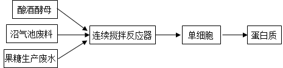
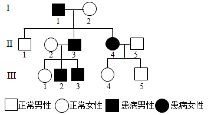
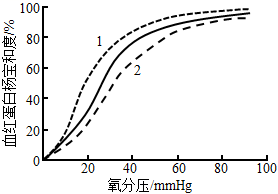
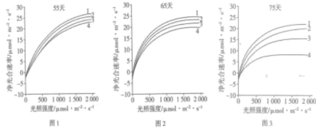
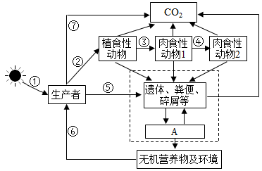
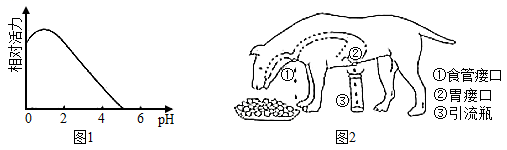
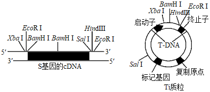

**2022年湖北省普通高中学业水平选择性考试**

**生物学**

**一、选择题：本题共20小题。每小题给出的四个进项中，只有一个选项符合题目要求。**

1\. 水是生命的源泉，节约用水是每个人应尽的责任，下列有关水在生命活动中作用的叙述，错误的是（　　）

A. 水是酶促反应的环境 B. 参与血液中缓冲体系的形成

C. 可作为维生素D等物质的溶剂 D. 可作为反应物参与生物氧化过程

2\. 生态环境破坏、过度捕捞等导致长江中下游生态退化，渔业资源锐减，长江江豚、中华鲟等长江特有珍稀动物濒临灭绝。为了挽救长江生态环境，国家制定了“长江10年禁渔”等保护政策，对长江生态环境及生物多样性进行保护和修复。下列有关叙述正确的是（　　）

A. 长江鱼类资源稳定恢复的关键在于长期禁渔

B. 定期投放本土鱼类鱼苗是促进长江鱼类资源快速恢复的手段之一

C. 长江保护应在优先保护地方经济发展的基础上，进行生态修复和生物多样性保护

D. 挽救长江江豚等珍稀濒危动物长期有效的措施是建立人工养殖场，进行易地保护和保种

3\. 哺乳动物成熟红细胞的细胞膜含有丰富的水通道蛋白，硝酸银（AgNO3）可使水通道蛋白失去活性。下列叙述错误的是（　　）

A. 经AgNO3处理的红细胞在低渗蔗糖溶液中会膨胀

B. 经AgNO3处理的红细胞在高渗蔗糖溶液中不会变小

C. 未经AgNO3处理的红细胞在低渗蔗糖溶液中会迅速膨胀

D. 未经AgNO3处理的红细胞在高渗蔗糖溶液中会迅速变小

4\. 灭菌、消毒、无菌操作是生物学实验中常见的操作。下列叙述正确的是（　　）

A. 动、植物细胞DNA的提取必须在无菌条件下进行

B. 微生物、动物细胞培养基中需添加一定量的抗生素以防止污染

C. 为防止蛋白质变性，不能用湿热灭菌法对牛肉膏蛋白胨培养基进行灭菌

D. 可用湿热灭菌法对实验中所使用的微量离心管、细胞培养瓶等进行灭菌

5\. RMI1基因具有维持红系祖细胞分化为成熟红细胞能力。体外培养实验表明，随着红系祖细胞分化为成熟红细胞，BMI1基因表达量迅速下降。在该基因过量表达的情况下，一段时间后成熟红细胞的数量是正常情况下的1012倍。根据以上研究结果，下列叙述错误的是（　　）

A. 红系祖细胞可以无限增殖分化为成熟红细胞

B. BMI1基因的产物可能促进红系祖细胞的体外增殖

C. 该研究可为解决临床医疗血源不足的问题提供思路

D. 红系祖细胞分化为成熟红细胞与BMI1基因表达量有关

6\. 某兴趣小组开展小鼠原代神经元培养的研究，结果发现其培养的原代神经元生长缓慢，其原因不可能的是（　　）

A. 实验材料取自小鼠胚胎的脑组织 B. 为了防止污染将培养瓶瓶口密封

C. 血清经过高温处理后加入培养基 D. 所使用的培养基呈弱酸性

7\. 奋战在抗击新冠疫情一线的医护人员是最美逆行者。因长时间穿防护服工作，他们汗流浃背，饮水受限，尿量减少。下列关于尿液生成及排放的调节，叙述正确的是（　　）

A. 抗利尿激素可以促进肾小管和集合管对NaCl重吸收

B. 医护人员紧张工作后大量饮用清水有利于快速恢复水一盐平衡

C. 医护人员工作时高度紧张，排尿反射受到大脑皮层的抑制，排尿减少

D. 医护人员工作时汗流浃背，抗利尿激素的分泌减少，水的重吸收增加

8\. 水稻种植过程中，植株在中后期易倒伏是常见问题。在适宜时期喷施适量的调环酸钙溶液，能缩短水稻基部节间长度，增强植株抗倒伏能力。下列叙述错误的是（　　）

A. 调环酸钙是一种植物生长调节剂

B. 喷施调环酸钙的关键之一是控制施用浓度

C. 若调环酸钙喷施不足，可尽快喷施赤霉素进行补救

D. 在水稻基部节间伸长初期喷施调环酸钙可抑制其伸长

9\. 北京冬奥会期间，越野滑雪运动员身着薄比赛服在零下10℃左右的环境中展开激烈角逐，关于比赛中运动员的生理现象，下列叙述正确的是（　　）

A. 血糖分解加快，储存的ATP增加，产热大于散热

B. 血液中肾上腺素含量升高，甲状腺激素含量下降，血糖分解加快

C. 心跳加快，呼吸频率增加，温度感受器对低温不敏感而不觉得寒冷

D. 在运动初期骨骼肌细胞主要通过肌糖原分解供能，一定时间后主要通过肝糖原分解供能

10\. 关于白酒、啤酒和果酒的生产，下列叙述错误的是（　　）

A. 在白酒、啤酒和果酒的发酵初期需要提供一定的氧气

B. 白酒、啤酒和果酒酿制的过程也是微生物生长繁殖的过程

C. 葡萄糖转化为乙醇所需酶既存在于细胞质基质，也存在于线粒体

D. 生产白酒、啤酒和果酒的原材料不同，但发酵过程中起主要作用的都是酵母菌

11\. 某植物的2种黄叶突变体表现型相似，测定各类植株叶片的光合色素含量（单位：μg·g-1），结果如表。下列有关叙述正确的是（　　）

| 植林类型 | 叶绿素a | 叶绿素b | 类胡萝卜素 | 叶绿素/胡萝卜素 |
|:---------|:--------|:--------|:-----------|:----------------|
| 野生型   | 1235    | 519     | 419        | 4．19           |
| 突变体1  | 512     | 75      | 370        | 1．59           |
| 突变体2  | 115     | 20      | 379        | 0．35           |

A. 两种突变体的出现增加了物种多样性

B. 突变体2比突变体1吸收红光的能力更强

C. 两种突变体的光合色素含量差异，是由不同基因的突变所致

D. 叶绿素与类胡萝卜素的比值大幅下降可导致突变体的叶片呈黄色

12\. 氨基酸在人体内分解代谢时，可以通过脱去羧基生成CO2和含有氨基的有机物（有机胺），有些有机胺能引起较强的生理效应。组氨酸脱去羧基后的产物组胺，可舒张血管；酪氨酸脱去羧基后的产物酪胺，可收缩血管；天冬氨酸脱去羧基后的产物β-丙氨酸是辅酶A的成分之一。下列叙述正确的是（　　）

A. 人体内氨基酸主要分解代谢途径是脱去羧基生成有机胺

B. 有的氨基酸脱去羧基后的产物可作为生物合成的原料

C. 组胺分泌过多可导致血压上升

D. 酪胺分泌过多可导致血压下降

13\. 废水、废料经加工可变废为宝。某工厂利用果糖生产废水和沼气池废料生产蛋白质的技术路线如图所示。下列叙述正确的是（　　）

A. 该生产过程中，一定有气体生成

B. 微生物生长所需碳源主要来源于沼气池废料

C. 该生产工艺利用微生物厌氧发酵技术生产蛋白质

D. 沼气池废料和果糖生产废水在加入反应器之前需要灭菌处理

14\. 某肾病患者需进行肾脏移植手术。针对该患者可能出现的免疫排斥反应，下列叙述错误的是（　　）

A. 免疫排斥反应主要依赖于T细胞的作用

B. 患者在术后需使用免疫抑制剂以抑制免疫细胞的活性

C. 器官移植前可以对患者进行血浆置换，以减轻免疫排斥反应

D. 进行肾脏移植前，无需考虑捐献者与患者的ABO血型是否相同

15\. 新冠病毒是一种RNA病毒，其基因组含有约3万个核苷酸。该病毒可通过表面S蛋白与人细胞表面的ACE2蛋白结合而进入细胞。在细胞中该病毒的RNA可作为mRNA，指导合成病毒复制所需的RNA聚合酶，该聚合酶催化RNA合成时碱基出错频率为10-5．下列叙述正确的是（　　）

A. 新冠病毒只有在选择压力的作用下才发生基因突变

B. ACE2蛋白的出现是人类抵抗新冠病毒入侵的进化结果

C. 注射新冠病毒疫苗后，人体可产生识别ACE2蛋白的抗体

D. 新冠病毒RNA聚合酶可作为研制治疗新冠肺炎药物的有效靶标

16\. 如图为某单基因遗传病家系图。据图分析，下列叙述错误的是（　　）

A. 该遗传病可能存在多种遗传方式

B. 若Ⅰ-2为纯合子，则Ⅲ-3是杂合子

C. 若Ⅲ--2为纯合子，可推测Ⅱ-5为杂合子

D. 若Ⅱ-2和Ⅱ-3再生一个孩子，其患病的概率为1/2

17\. 人体中血红蛋白构型主要有T型和R型，其中R型与氧的亲和力约是T型的500倍，内、外因素的改变会导致血红蛋白一氧亲和力发生变化，如：血液pH升高，温度下降等因素可促使血红蛋白从T型向R型转变。正常情况下，不同氧分压时血红蛋白氧饱和度变化曲线如下图实线所示（血红蛋白氧饱和度与血红蛋白-氧亲和力呈正相关）。下列叙述正确的是（　　）

A. 体温升高时，血红蛋白由R型向T型转变，实线向虚线2方向偏移

B. 在肾脏毛细血管处，血红蛋白由R型向T型转变，实线向虚线1方向偏移

C. 在肺部毛细血管处，血红蛋白由T型向R型转变，实线向虚线2方向偏移

D. 剧烈运动时，骨酪肌毛细血管处血红蛋白由T型向R型转变，有利于肌肉细胞代谢

18\. 为了分析某21三体综合征患儿的病因，对该患儿及其父母的21号染色体上的A基因（A1~A4）进行PCR扩增，经凝胶电泳后，结果如图所示。关于该患儿致病的原因叙述错误的是（　　）

A. 考虑同源染色体交叉互换，可能是卵原细胞减数第一次分裂21号染色体分离异常

B. 考虑同源染色体交叉互换，可能是卵原细胞减数第二次分裂21号染色体分离异常

C. 不考虑同源染色体交叉互换，可能是卵原细胞减数第一次分裂21号染色体分离异常

D. 不考虑同源染色体交叉互换，可能是卵原细胞减数第二次分裂21号染色体分离异常

**二、非选择题：本题共4小题。**

19\. 不同条件下植物的光合速率和光饱和点（在一定范围内，随光照强度的增加，光合速率增大，达到最大光合速率时的光照强度称为光饱和点）不同，研究证实高浓度臭氧（O3）对植物的光合作用有影响。用某一高浓度O3连续处理甲、乙两种植物75天，在第55天、65天、75天分别测定植物净光合速率，结果如图1、图2和图3所示。

【注】曲线1：甲对照组，曲线2：乙对照组，曲线3：甲实验组，曲线4：乙实验组。

回答下列问题：

（1）图1中，在高浓度O3处理期间，若适当增加环境中的CO2浓度，甲、乙植物的光饱和点会\_\_\_\_（填“减小”、“不变”或“增大”）。

（2）与图3相比，图2中甲的实验组与对照组的净光合速率差异较小，表明\_\_\_\_\_\_\_\_\_\_\_\_\_\_。

（3）从图3分析可得到两个结论：①O3处理75天后，甲、乙两种植物的\_\_\_\_\_\_\_\_\_\_\_\_\_\_\_\_\_\_，表明长时间高浓度的O3对植物光合作用产生明显抑制；②长时间高浓度的O3对乙植物的影响大于甲植物，表明\_\_\_\_\_\_\_\_\_\_\_\_\_。

（4）实验发现，处理75天后甲、乙植物中的基因A表达量都下降，为确定A基因功能与植物对O3耐受力的关系，使乙植物中A基因过量表达，并用高浓度O3处理75天。若实验现象为\_\_\_\_\_\_\_\_\_\_，则说明A基因的功能与乙植物对O3耐受力无关。

20\. 如图为生态系统结构的一般模型，据图回答下列问题：

（1）图中A代表\_\_\_\_\_\_\_\_\_\_\_；肉食动物1的数量\_\_\_\_\_\_\_\_\_\_\_（填“一定”或“不一定”）少于植食性动物的数量。

（2）如果②、③、④代表能量流动过程，④代表的能量大约是②的\_\_\_\_\_\_\_\_\_\_\_。

（3）如果图中生产者是农作物棉花，为了提高棉花产量，从物质或能量的角度分析，针对②的调控措施及理由分别是\_\_\_\_\_\_\_\_\_\_\_；针对⑦的调控措施及理由分别是\_\_\_\_\_\_\_\_\_\_\_\_\_。

21\. 胃酸由胃壁细胞分泌。已知胃液中H+的浓度大约为150mmo1/L，远高于胃壁细胞中H+浓度，胃液中Cl-的浓度是胃壁细胞中的10倍。回答下列问题：

（1）胃壁细胞分泌C1的方式是\_\_\_\_\_\_\_\_\_\_\_。食用较多的陈醋后，胃壁细胞分泌的H+量将\_\_\_\_\_\_\_\_\_\_\_。

（2）图1是胃蛋白酶的活力随pH变化的曲线。在弥漫性胃黏膜萎缩时，胃壁细胞数量明显减少。此时，胃蛋白的活力将\_\_\_\_\_\_\_\_\_\_\_。

（3）假饲是指让动物进食后，食物从食管接口流出而不能进入胃。常用假饲实验来观察胃液的分泌。假饲动物进食后，用胃痿口相连的引流瓶来收集胃液，如图2所示。科学家观察到假饲动物进食后，引流瓶收集到了较多胃液，且在愉悦环境下给予假饲动物喂食时，动物分泌的胃液量明显增加。根据该实验结果，能够推测出胃液分泌的调节方式是\_\_\_\_\_\_\_\_\_\_\_。为证实这一推测，下一步实验操作应为\_\_\_\_\_\_\_\_\_\_\_\_\_，预期实验现象是\_\_\_\_\_\_\_\_\_\_\_。

22\. “端稳中国碗，装满中国粮”，为了育好中国种，科研人员在杂交育种与基因工程育种等领域开展了大量的研究。二倍体作物M的品系甲有抗虫、高产等多种优良性状，但甜度不高。为了改良品系甲，增加其甜度，育种工作者做了如下实验；

【实验一】遗传特性及杂交育种的研究

在种质资源库中选取乙、丙两个高甜度的品系，用三个纯合品系进行杂交实验，结果如下表。

| 杂交组合 | F1表现型 | F2表现型 |
|:---------|:--------------------|:--------------------|
| 甲×乙    | 不甜                | 1/4甜、3/4不甜      |
| 甲×丙    | 甜                  | 3/4甜，1/4不甜      |
| 乙×丙    | 甜                  | 13/16甜、3/16不甜   |

【实验二】甜度相关基因的筛选

通过对甲、乙、丙三个品系转录的mRNA分析，发现基因S与作物M的甜度相关。

【实验三】转S基因新品系的培育

提取品系乙的mRNA，通过基因重组技术，以Ti质粒为表达载体，以品系甲的叶片外植体为受体，培有出转S基因的新品系。

根据研究组的实验研究，回答下列问题：

（1）假设不甜植株的基因型为AAbb和Aabb，则乙、丙杂交的F2中表现为甜的植株基因型有\_\_\_\_\_种。品系乙基因型为\_\_\_\_\_\_\_。若用乙×丙中F2不甜的植株进行自交，F3中甜∶不甜比例为\_\_\_\_\_。

（2）下图中，能解释（1）中杂交实验结果的代谢途径有\_\_\_\_\_\_\_\_\_\_\_。

（3）如图是S基因的cDNA和载体的限制性内切核酸酶（限制性核酸内切酶）酶谱。为了成功构建重组表达载体，确保目的基因插入载体中方向正确，最好选用\_\_\_\_\_\_\_\_\_\_\_\_\_酶切割S基因的cDNA和载体。

（4）用农杆菌侵染品系甲叶片外植体，其目的是\_\_\_\_\_\_\_\_。

（5）除了题中所示的杂交育种和基因工程育种外，能获得高甜度品系，同时保持甲的其他优良性状的育种方法还有\_\_\_\_\_\_\_\_\_\_\_（答出2点即可）。
